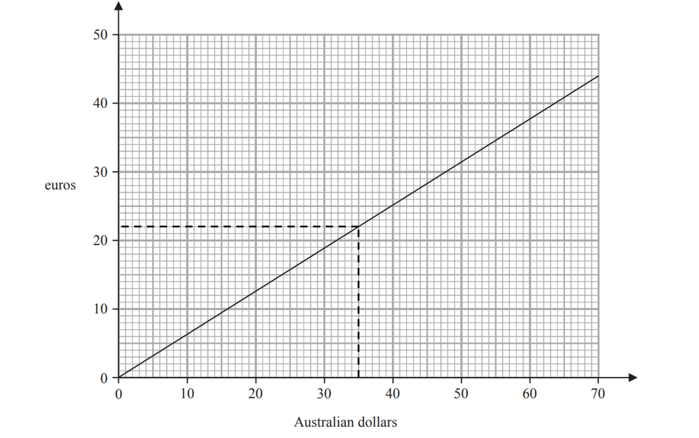
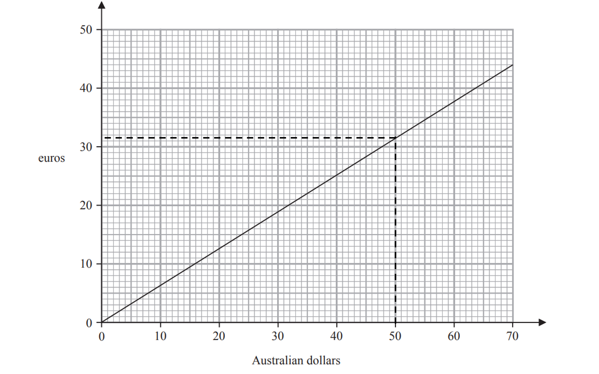

# Mark Schemes — Real-Life Graphs
**Algebra** · Edexcel IGCSE Maths A (Modular) (4XMAF/4XMAH) — 24/Foundation Unit 1

## Q1 — easy — 4 marks · exam-questions

### 11((a)) — 2 marks
(i)

> *Use your ruler to draw a line up from 35 on the x axis until it meets the line*

**Final answer:** **22**

**[B1]**

> **[mark-scheme]**
> Your answer should be in the range 21.5 to 22.5.

(ii)

> *Use your ruler to draw a line across from 20 euros on the y axis until it meets the line*

**Final answer:** **32**

**[B1]**

> **[mark-scheme]**
> Your answer should be in the range 31 to 32.

### 11((b)) — 2 marks
> *The graph does not go up to 500 Australian dollars, so choose a factor of 500 that is on the graph and then scale up*

$50\mathrm{Australian} \mathrm{dollars}=31.5\mathrm{euros}$

**[M1]**

> *Multiply both sides by 10*

$500\mathrm{Australian} \mathrm{dollars}=315\mathrm{euros}$

**Final answer:** **315 euros**

**[A1]**

> **[mark-scheme]**
> Answers between 300-325 are accepted.
