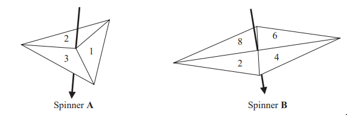
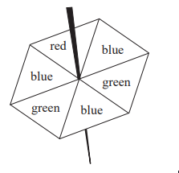
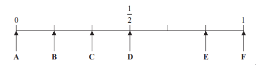
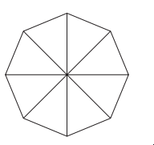
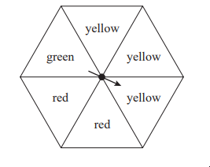
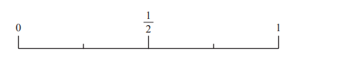

# Exam Questions — Probability
**Handling Data** · Edexcel IGCSE Maths A (Modular) (4XMAF/4XMAH) — 24/Foundation Unit 1
> Source: [https://www.savemyexams.com/igcse/maths/edexcel/a-modular/24/foundation-unit-1/topic-questions/handling-data/probability/exam-questions/](https://www.savemyexams.com/igcse/maths/edexcel/a-modular/24/foundation-unit-1/topic-questions/handling-data/probability/exam-questions/) · 8 questions · total 31 marks

## Q1 — hard — 6 marks · exam-questions

### 16((a)) — 3 marks — command: work_out — structured — from paper Specimen paper · 4MA1/2F
In a bag there are only red bricks, blue bricks, green bricks and orange bricks.

The number of green bricks in the bag is the same as the number of orange bricks.

Jiao takes at random a brick from the bag.
The table gives the probability that Jiao takes a red brick and the probability that he takes a blue brick.

| Colour | red | blue | green | orange |
|---|---|---|---|---|
| Probability | 0.26 | 0.3 |   |   |

Work out the probability that Jiao takes an orange brick.

### 16((b)) — 3 marks — command: work_out — structured — from paper Specimen paper · 4MA1/2F
Jiao puts the brick back into the bag. 
There are 91 red bricks in the bag.

Jiao is going to build a tower using all the red bricks and all the blue bricks but no other bricks.
The tower will be in the shape of a cuboid. 
There will be 4 bricks in each layer of the tower.

Work out how many layers the tower will have.

## Q2 — easy — 4 marks · exam-questions

### 8((a)) — 2 marks — command: complete — structured — from paper Specimen paper · 4MA1/2F
Hanako has two fair spinners.
Spinner **A** is 3‑sided and can land on 1, 2 or 3
Spinner **B** is 4‑sided and can land on 2, 4, 6 or 8

Hanako spins each spinner once.

She adds together the number that spinner A lands on and the number that spinner B lands on to get her total score.

Complete the table to show all possible total scores. 
Four total scores have been done for you.

|   | Spinner **A** |   |   |   |
|---|---|---|---|---|
| **1** | **2** | **3** |   |   |
| Spinner **B** | **2** | 3 |   |   |
| **4** |   | 6 |   |   |
| **6** |   | 8 | 9 |   |
| **8** |   |   |   |   |

### 8((b)) — 2 marks — command: find — structured — from paper Specimen paper · 4MA1/2F
Find the probability that

(i)  Hanako’s total score is 8

(ii)  Hanako’s total score is less than 7

## Q3 — medium — 5 marks · exam-questions

### 5((a)) — 3 marks — command: write — structured — from paper Specimen paper · 4MA1/1F
Hassam has a fair 6‑sided spinner.

The spinner can land on red, on green or on blue.

Hassam spins his spinner once.

From the diagram above, write down the letter of the arrow that points to the probability that the spinner lands on

(i)   blue,

(ii)  green,

(iii)  purple.

### 5((b)) — 2 marks — command: show — structured — from paper Specimen paper · 4MA1/1F
Jake is making a different spinner. 
His spinner is a fair 8‑sided spinner. 
He uses the colours black (B), white (W), yellow (Y) and pink (P).

For Jake’s spinner, when he spins the spinner once

- the probability that the spinner will land on black is **equal **to the probability that the spinner will land on white
- the probability that the spinner will land on yellow is **twice **the probability that the spinner will land on pink

On the diagram below, use the letters B, W, Y and P to show how Jake should colour his spinner.

## Q4 — easy — 3 marks · exam-questions

### 7() — 3 marks — command: write — structured — from paper 2023 June · 4MA1/2F
The diagram shows a fair 6-sided spinner.

Mario spins the arrow on the spinner once.

| impossible     unlikely     evens     likely     certain |
|---|

Write down the word from the box that best describes the likelihood that the arrow will land on

(i) green

[1]

(ii) yellow

[1]

(iii) blue

[1]

## Q5 — medium — 4 marks · exam-questions

### 10((a)) — 1 mark — command: write — structured — from paper 2023 June · 4MA1/1F
There are 30 counters in a bag.

13 of the counters are purple. 
11 of the counters are white. 
The rest of the counters are red.

Suha takes at random a counter from the bag.

Write down the probability that the counter is purple.

### 10((b)) — 1 mark — command: work_out — structured — from paper 2023 June · 4MA1/1F
Work out the probability that the counter is red.

### 10((c)) — 2 marks — command: how — structured — from paper 2023 June · 4MA1/1F
The counter is put back into the bag.

Clive now puts 10 more counters into the bag. 
When a counter is taken at random from the bag, the probability that it is white is now  $\frac{2}{5}$

How many of the 10 counters that Clive puts into the bag are white?

## Q6 — medium — 3 marks · exam-questions

### 18() — 3 marks — command: work_out — structured — from paper 2023 June · 4MA1/2F
A biased spinner can land on green or on yellow or on brown or on pink.

The table gives the probabilities that, when the spinner is spun, it will land on green or on yellow or on brown.

| Colour | green | yellow | brown | pink |
|---|---|---|---|---|
| Probability | 0.32 | 0.13 | 0.28 |   |

Timucin spins the spinner 200 times.

Work out an estimate for the number of times the spinner lands on pink.

## Q7 — easy — 2 marks · exam-questions

### 5() — 2 marks — command: place — structured — from paper 2023 nov · 4MA1/2F
There are 8 counters in a bag.

6 of these counters are orange. 
The rest of the counters are purple.

Delilah takes at random a counter from the bag.

(i) On the probability scale below, mark with a cross (×) the probability that the counter is orange.

(ii)  On the probability scale below, mark with a cross (×) the probability that the counter is yellow.

## Q8 — medium — 4 marks · exam-questions

### 18((a)) — 2 marks — command: work_out — structured — from paper 2023 Nov · 4MA1/1F
A biased spinner has three sections each of a different colour.

The table shows the probability that, when the spinner is spun once, it will land on blue or on orange or on white.

| Colour | blue | orange | white |
|---|---|---|---|
| Probability | 0.58 | $2x$ | $x$ |

Work out the value of $x$

### 18((b)) — 2 marks — command: work_out — structured — from paper 2023 Nov · 4MA1/1F
The spinner is spun 250 times.

Work out an estimate for the number of times the spinner will land on blue.
