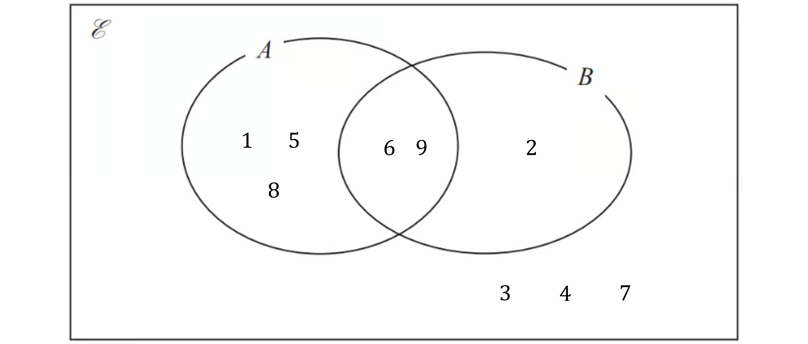
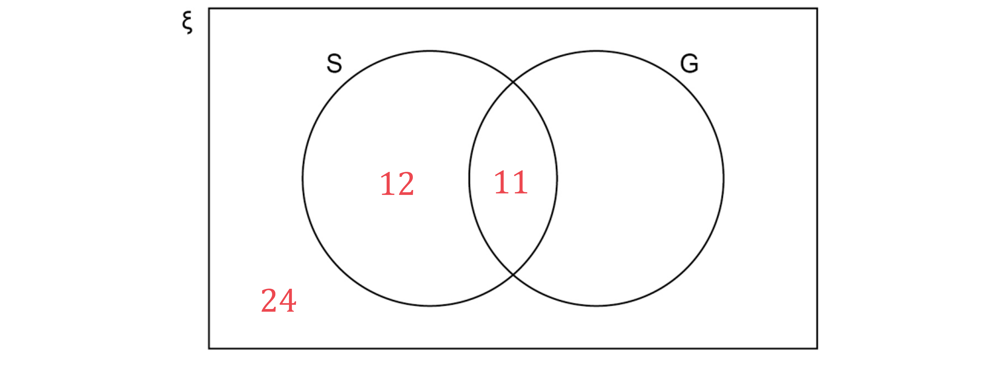
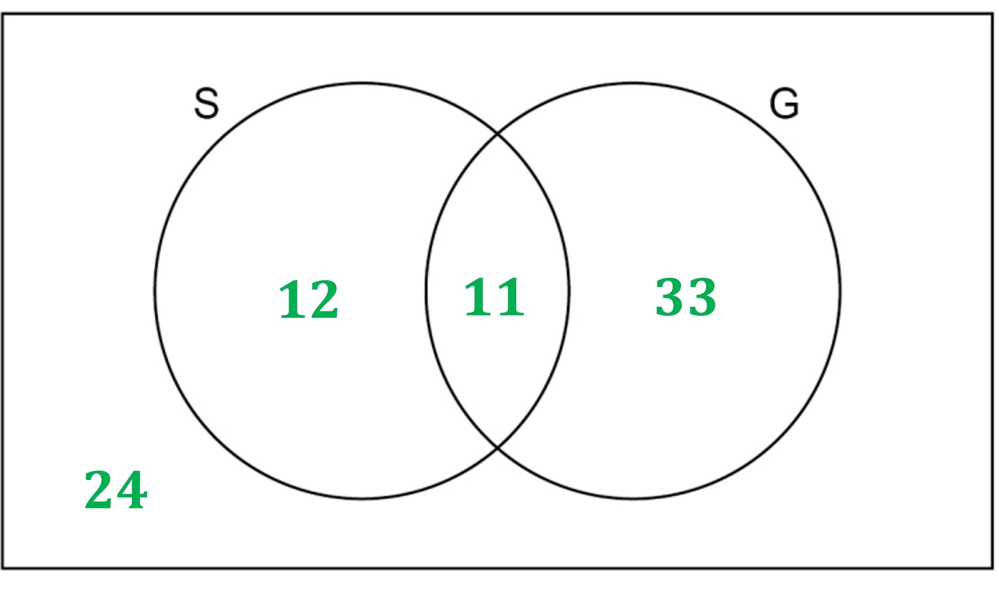

# Mark Schemes — Venn Diagrams & Sample Space Diagrams
**Handling Data** · Edexcel IGCSE Maths A (Modular) (4XMAF/4XMAH) — 24/Foundation Unit 1

## Q1 — easy — 5 marks · exam-questions

### 4() — 1 marks
> *Fill in the table by adding the first card value (top row) to the second card value (first column)  *

|   |   | First card |   |   |   |   |
|---|---|---|---|---|---|---|
| Second  card | Total | 2 | 2 | 3 | 5 | 6 |
| 2 | 4 | 4 | 5 | 7 | 8 |   |
| 2 | 4 | 4 | 5 | **Final answer:** **7** | 8 |   |
| 3 | 5 | 5 | **Final answer:** **6** | 8 | 9 |   |
| 5 | 7 | **Final answer:** **7** | 8 | 10 | 11 |   |
| 6 | 8 | 8 | 9 | 11 | 12 |   |

**[1]**

### 4((a)) — 4 marks
*(i) **Count how many even numbers there are in the grid (not including the row headings and the column headings)* * *

*13 even numbers* * *

*13 possibilities out of all 25 possibilities in the grid are even* *Write this as a probability (13 divided by 25)*

**fraction with denominator of 25**** [1]**
** **$\frac{13}{25}$ **[1]**

*(ii) **Count how many numbers in the grid could be labelled "a multiple of 3 or 4" (not including the row headings and the column headings) Do not count multiples of both 3 and 4 twice* * *

*14 numbers* * *

*14 possibilities out of all 25 possibilities in the grid are a multiple of 3 or 4* *Write this as a probability (14 divided by 25)*

**fraction with denominator of 25**** [1]**
** **$\frac{14}{25}$ **[1]**

## Q2 — medium — 2 marks · exam-questions

### 14() — 2 marks
> *The probabilities in a Venn diagram must sum to 1, as they are exhaustive (cover all possibilities) so we can use this to find the probability on the outside of the circles*

*1-0.3-0.15-0.35=0.2*

> $P(A'UB)$* means "the probability of not A, or B", note that this is different to "not A or B"*

> *The blue shaded area shows the regions which satisfy "not A, or B"*

**[1]**

*The outside is shaded as it satisfies "not A"* 
*The 0.35 is shaded as it satisfies "not A"* 
*The 0.15 is shaded as it satisfies "...or B"*

> *Summing the probabilities in the shaded regions*

*0.15+0.35+0.2=0.7*

**0.7** **[1]**

## Q3 — easy — 3 marks · exam-questions

### 3((a)) — 1 marks
*Fill in the table by multiplying the number on spinner A (top row) by the number on spinner B (first column)*

| Spinner B | Spinner A |   |   |
|---|---|---|---|
| x | 1 | 7 | 9 |
| 2 | 2 | 14 | 18 |
| 3 | 3 | 21 | 27 |
| 4 | 4 | 28 | **Final answer:** **36** |
| 5 | 5 | 35 | **Final answer:** **45** |

**[1]**

### 3((b)) — 2 marks
*There are 6 even numbers (2, 4, 14, 18, 28, 36) and 3 prime numbers (2, 3, 5) but 2 appears in both lists - Geoff has counted 2 twice* 
*The correct probability of being even or prime is 8 out of 12*

**Geoff counted 2 twice** **[1]** 
**the correct probability is **$\frac{8}{12}$**[1]**

**Accept "2 is both prime and even", "one number is prime and even", accept **$\frac{8}{12}$** in other forms**

## Q4 — medium — 5 marks · exam-questions

### 4() — 5 marks
> *We are told there are 60 students in total, so all the values (or in this case expressions) in the circles must sum to 60*

`table attributes columnalign right center left columnspacing 0px end attributes row cell x plus 2 x plus open parentheses x minus 1 close parentheses plus open parentheses 5 x minus 2 close parentheses end cell equals 60 end table`

**Forming equation**** [1]**

> *Simplify and solve the equation*

`table row cell 9 x minus 3 end cell equals 60 row cell 9 x end cell equals 63 row x equals 7 end table`

**Simplifying and solving ****[2]**

*The students who have a bank account are those in the left circle, *$2x$*, and the students in the middle overlapping section, *$x-1$ *We now know that *$x=7$

*Number of students who have a bank account: *`2 x space plus thin space open parentheses x minus 1 close parentheses space equals space 2 open parentheses 7 close parentheses plus open parentheses 7 minus 1 close parentheses equals 20`

**[1]**

> *Expressing as a probability out of the total of 60 students*

$\frac{20}{60}=\frac{2}{6}=\frac{1}{3}$

$\frac{1}{3}$** [1] **
**Any equivalent fraction accepted**

## Q5 — easy — 4 marks · exam-questions

### 6((a)) — 4 marks
*(i) **Fill in the table by multiplying the number on the first spin (top row) by the number on the second spin (first column)*

| Second spin | First spin |   |   |   |   |
|---|---|---|---|---|---|
| x | 1 | 2 | 2 | 3 | 4 |
| 1 | 1 | **Final answer:** **2** | **Final answer:** **2** | **Final answer:** **3** | **Final answer:** **4** |
| 2 | **Final answer:** **2** | **Final answer:** **4** | 4 | **Final answer:** **6** | **Final answer:** **8** |
| 2 | **Final answer:** **2** | **Final answer:** **4** | **Final answer:** **4** | **Final answer:** **6** | **Final answer:** **8** |
| 3 | **Final answer:** **3** | **Final answer:** **6** | **Final answer:** **6** | **Final answer:** **9** | **Final answer:** **12** |
| 4 | **Final answer:** **4** | **Final answer:** **8** | **Final answer:** **8** | 12 | **Final answer:** **16** |

** complete with up to 5 errors**** [1] **
**complete and correct**** [1]**

*(i) **Count the number of possibilities in the grid that are multiples of 3 (do not include the first row and first column) *

*there are 9 multiples of 3 in the grid*

> *Work out the probability of choosing one of these 9 possibilities out of the total 25 possibilities (9 ÷ 25)*

** a fraction over 25**** [1]**

$\frac{9}{25}$** [1]**

## Q6 — easy — 5 marks · exam-questions

### 1((a)) — 3 marks
> *{6, 9} are in *$A$* and *$B$

> *{3, 4, 7} are not in *$A$* or *$B$

> *{1, 5, 8} are in *$A$* but not *$B$

> *{2} is in *$B$* but not *$A$

**6 and 9 in the middle [1]**

**One other section correct [1]**

**Fully correct [1]**

### 1((b)) — 2 marks
> *There are 2 numbers (6 and 9) in the 'overlap' region *$A\capB$

> *And there are 9 numbers in total in the universal set*

$\frac{2}{9}$

**Correct numerator [1]**

**Correct denominator [1]**

## Q7 — easy — 5 marks · exam-questions

### 1() — 3 marks
> *The number of people who don't own a cat or a dog can be written outside the circles but inside the box.*

*Add up the the number of people who owned a cat, owned a dog and owned neither.* *Subtract it from the total number of people who were surveyed to find the number of people who owned both a cat and a dog.*

*30 + 25 + 6 = 61*

*61 - 50 = 11*

> *Find the number of people who owned a cat only by subtracting the number of people who owned a cat and a dog from the number of people who owned a cat.*

*30 - 11 = 19*

> *Find the number of people who owned a dog only by subtracting the number of people who owned a cat and a dog from the number of people who owned a dog.*

*25 - 11 = 14*

> *Write the values in the appropriate sections of the Venn diagram.*

**Correct value for the intersection****  [1]** 
**Correct value in another section **** [1]** 
**Fully correct Venn diagram **** [1]**

### 2() — 2 marks
> *People who own a cat AND a dog belong to the intersection or 'overlap' set *$C\capD$*. From part (a) we know that there are 11 people in that set. And there were 50 people in total in the survey. So the probability is simply 11 divided by 50.*

$\frac{11}{50}$**  [2]**

**1 mark for using 11 in the numerator, or for circling the **$C\capD$** number in the diagram. 1 mark for a fully correct answer. Decimal form 0.22 would also get the mark for the final answer.**

## Q8 — easy — 4 marks · exam-questions

### 7() — 4 marks
> *We can use the fact "12 are singers but not guitar players" to fill in a region of the Venn diagram*

**[1]**

> *30% of the 80 people are neither a singer nor guitar player*

*10% of 80 = 8* *30% of 80 = 3×8 =24*

**[1]**

> *As the total is 80, there are*

*80 - 24 -12 = 44 people left over*

*The two remaining regions (only guitar players, and those who play both guitar and sing) must sum to 44* *This means there are 44 guitar players in total*

> *It is stated that *$\frac{1}{4}$* of the guitar players are also singers*

$\frac{1}{4}$* of 44 = 11*

**11 or 33**** [1]**

> *There are 80 people in total, so all regions on the Venn diagram must sum to 80*

*80 - 24 - 12 - 11 = 33*

**All values correct**** [1]**
