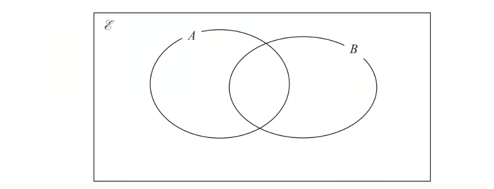
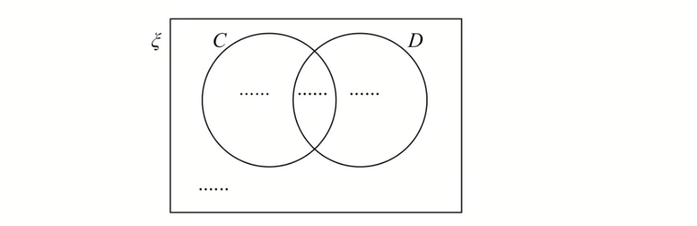
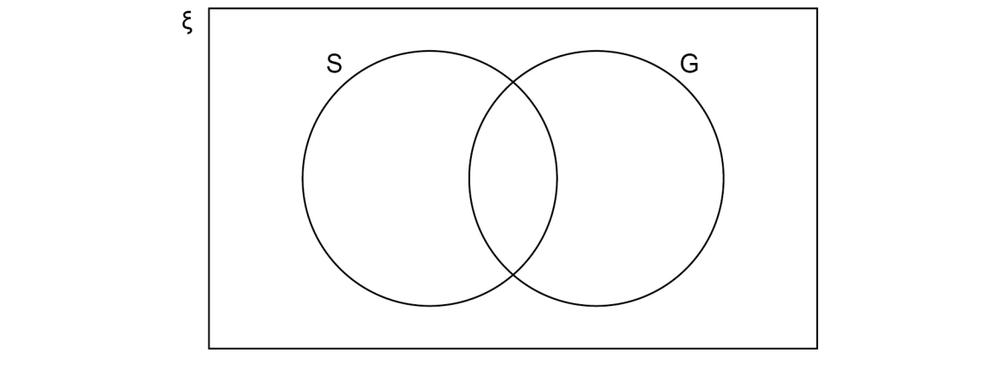

# Exam Questions — Venn Diagrams & Sample Space Diagrams
**Handling Data** · Edexcel IGCSE Maths A (Modular) (4XMAF/4XMAH) — 24/Foundation Unit 1
> Source: [https://www.savemyexams.com/igcse/maths/edexcel/a-modular/24/foundation-unit-1/topic-questions/handling-data/venn-diagrams-and-sample-space-diagrams/exam-questions/](https://www.savemyexams.com/igcse/maths/edexcel/a-modular/24/foundation-unit-1/topic-questions/handling-data/venn-diagrams-and-sample-space-diagrams/exam-questions/) · 8 questions · total 33 marks

## Q1 — easy — 5 marks · exam-questions

### 4() — 1 mark — command: complete — structured — from paper Nov 2020 · J560/05
Dora has the following number cards.

She takes a card at random, replaces the card and then takes a second card. 
She adds the numbers on the two cards she has taken and records the total.

Complete the following table to show all of her possible totals.

|   |   | First card |   |   |   |   |
|---|---|---|---|---|---|---|
| Second  card | Total | 2 | 2 | 3 | 5 | 6 |
| 2 | 4 | 4 | 5 | 7 | 8 |   |
| 2 | 4 | 4 | 5 |   | 8 |   |
| 3 | 5 | 5 |   | 8 | 9 |   |
| 5 | 7 |   | 8 | 10 | 11 |   |
| 6 | 8 | 8 | 9 | 11 | 12 |   |

### 4((a)) — 4 marks — command: find — structured — from paper Nov 2020 · J560/04
Find the probability that her total is

i) an even number,

[2]

ii) a multiple of 3 or 4.

[2]

## Q2 — medium — 2 marks · exam-questions

### 14() — 2 marks — command: work_out — structured — from paper Nov 2018 · 8300/1H
A and B are two events.

Some probabilities are shown on the Venn diagram.

Work out $P(A'UB)$

## Q3 — easy — 3 marks · exam-questions

### 3((a)) — 1 mark — command: complete — structured — from paper Nov 2018 · J560/05
Geoff has two fair spinners.

He spins both spinners and **multiplies** the numbers on each spinner.

Complete the table.

| Spinner B | Spinner A |   |   |
|---|---|---|---|
| x | 1 | 7 | 9 |
| 2 | 2 | 14 | 18 |
| 3 | 3 | 21 | 27 |
| 4 | 4 | 28 |   |
| 5 | 5 | 35 |   |

### 3((b)) — 2 marks — command: explain — structured — from paper Nov 2018 · J560/05
Geoff wants to work out the probability that the outcome of the multiplication is an even number or a prime number. Here is his working.

| The probability the outcome is an even number is $\frac{6}{12}$  The probability the outcome is a prime number is $\frac{3}{12}$  The probability the outcome is an even number or a prime number is $\frac{6}{12}+\frac{3}{12}=\frac{9}{12}$ |
|---|

Geoff is wrong. 
Explain his error and give the correct answer.

## Q4 — medium — 5 marks · exam-questions

### 4() — 5 marks — command: show — structured — from paper Nov 2020 · J560/04
In a survey, 60 students were asked whether they have a bank account (B) and whether they have a part-time job (J).

The number of students who had neither a bank account nor a part-time job was *x*.

The Venn diagram shows the results in terms of *x*.

One of the 60 students is chosen at random. Find the probability that they have a bank account. Show your working.

## Q5 — easy — 4 marks · exam-questions

### 6((a)) — 4 marks — command: multiple — structured — from paper June 2017 · J560/06
This is a fair 5-sided spinner.

Ciara spins the spinner twice and records the product of the two scores.

i) Complete the table.

| Second spin | First spin |   |   |   |   |
|---|---|---|---|---|---|
| x | 1 | 2 | 2 | 3 | 4 |
| 1 | 1 |   |   |   |   |
| 2 |   |   | 4 |   |   |
| 2 |   |   |   |   |   |
| 3 |   |   |   |   |   |
| 4 |   |   |   | 12 |   |

[2]

ii) Find the probability that the product is a multiple of 3.

[2]

## Q6 — easy — 5 marks · exam-questions

### 1((a)) — 3 marks — command: complete — structured — from paper June 2019 · 1MA1/3H
`calligraphic E space equals space open curly brackets 1 comma space 2 comma space 3 comma space 4 comma space 5 comma space 6 comma space 7 comma space 8 comma space 9 close curly brackets
A space equals space open curly brackets 1 comma space 5 comma space 6 comma space 8 comma space 9 close curly brackets
B space equals space open curly brackets 2 comma space 6 comma space 9 close curly brackets`

Complete the Venn diagram to represent this information.

### 1((b)) — 2 marks — command: find — structured — from paper June 2019 · 1MA1/3H
A number is chosen at random from the universal set $E$.

Find the probability that the number is in the set $A\capB$.

## Q7 — easy — 5 marks · exam-questions

### 1() — 3 marks — command: complete — structured
In a survey of 50 people,

30 owned a cat     
    25 owned a dog     
     6 owned neither a cat or a dog

Complete the Venn diagram to show this information.

### 2() — 2 marks — command: find — structured
One person is chosen at random.

Find the probability that the person owns a cat and a dog.

## Q8 — easy — 4 marks · exam-questions

### 7() — 4 marks — command: complete — structured — from paper Nov 2020 · 8300/1H
Here is some information about 80 people who play in bands.

12 are singers but not guitar players. 
30% are neither a singer nor a guitar player. 
$\frac{1}{4}$ of the guitar players are also singers.

Complete this Venn diagram to represent the information.

ξ = 80 people who play in bands 
S = singers 
G = guitar players

