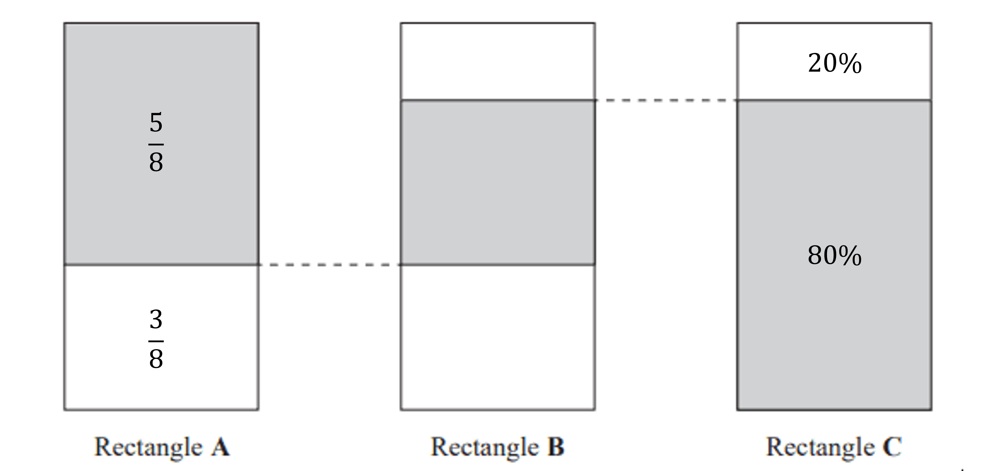

# Mark Schemes — Fractions, Decimals & Percentages
**Number** · Edexcel IGCSE Maths A (Modular) (4XMAF/4XMAH) — 24/Foundation Unit 1

## Q1 — medium — 4 marks · exam-questions

### 11((a)) — 1 marks
> **[exam-tip]**
> Your calculator can convert improper fractions to mixed numbers.
> 
> You can check using the method outlined below.

> *Work out how many 9's fit into 56 by counting up in the nine timestable*

*9, 18, 27, 36, 45, 54*

> *9 fits into 56 completely 6 times, with a remainder of 2*

> *Write the remainder as a fraction out of 9*

$6\frac{2}{9}$

**[B1]**

> **[mark-scheme]**
> No working is required to secure this mark.

### 11((b)) — 1 marks
> **[exam-tip]**
> This is a 'show that' question so you cannot type the calculation into your calculator but will need to show a full working method.

> *Dividing fractions are best calculated by multiplying the first fraction by the reciprocal of the second*

*The calculation changes to *$\frac{2}{3}\times\frac{2}{1}$

> *Multiply the fractions by multiplying the numerators together and the denominators together*

**Final answer:** $\frac{2\times2}{3\times1}=\frac{4}{3}$**as required**

**[B1]**

### 11((c)) — 2 marks
> *To subtract fractions the denominators must be the same*

> *Find the lowest common multiple (LCM) of 10 and 4 by listing multiples of 10 and multiples of 4*

$10,20,30,...\,4,8,12,16,20,...$

*20 is the LCM of 10 and 4*

> *Work out the equivalent fractions so that they are both out of 20*

`table row cell 7 over 10 end cell equals cell fraction numerator 7 cross times 2 over denominator 10 cross times 2 end fraction equals 14 over 20 end cell end table`

*  and*

*  *`table row cell 1 fourth end cell equals cell fraction numerator 1 cross times 5 over denominator 4 cross times 5 end fraction equals 5 over 20 end cell end table`

**[M1]**

> *Use these fractions with a common denominator to show the subtraction by subtracting only the numerators*

**Final answer:** $\frac{14}{20}-\frac{5}{20}=\frac{9}{20}$**as required**

**[A1]**

## Q2 — hard — 3 marks · exam-questions

### 19() — 3 marks
> *Calculate the proportions of rectangle A and rectangle C that are unshaded*

`table row cell 1 minus 5 over 8 end cell equals cell 3 over 8 end cell row cell 100 percent sign minus 80 percent sign end cell equals cell 20 percent sign end cell end table`

**[M1]**

> *Label the shaded and unshaded parts for rectangle A and rectangle C using the diagram provided (as shown below)*

> *Use the diagram to work out the calculation that gives the shaded section for rectangle B*

`5 over 8 minus 20 percent sign`

**[M1]**

> *Convert both numbers in the calculation to the same form (working in fractions, decimals or percentages will give the same result)*

$\frac{5}{8}-\frac{1}{5}=\frac{17}{40}$

$\frac{17}{40}$

**[A1]**

> **[mark-scheme]**
> **M1**: The first mark is awarded for showing the unshaded part for *either* rectangle A *or* rectangle C  (this can be in equivalent fraction, decimal or percentage form) *or *for calculating the unshaded part in rectangle C i.e.$\frac{1}{5}+\frac{3}{8}=\frac{23}{40}$
> 
> **M1**: Any equivalent calculation in fraction, decimal or percentage form will gain this mark.
> 
> **A1**: The answer must be a fraction as stated in the question.

## Q3 — easy — 2 marks · exam-questions

### 1((a)) — 1 marks
> **[exam-tip]**
> Remember, you can use your calculator. The fraction can simply be entered and your calculator will simplify it.
> 
> A non-calculator method is demonstrated below.

> *Find the highest common factor (HCF) of 12 and 15*

*Factors of 12 are 1, 2, 3, 4, 6, 12*

*Factors of 15 are 1, 3, 5, 15*

*The highest factor that appears in both lists is 3*

> *Divide both the numerator and denominator by the HCF*

$\frac{12\div3}{15\div3}=\frac{4}{5}$

**[B1]**

$\frac{4}{5}$

> **[mark-scheme]**
> The mark is awarded for the answer so no working is required. You can just type it into your calculator.

### 1((b)) — 1 marks
> *The shape is divided into 18 equal parts*

> *Find an equivalent fraction to *$\frac{1}{6}$*which is out of 18*

`table row cell 1 over 6 end cell equals cell fraction numerator 1 cross times 3 over denominator 6 cross times 3 end fraction end cell row blank equals cell 3 over 18 end cell end table`

**Final answer:** **Shade in any 3 squares**

**[B1]**

## Q4 — medium — 3 marks · exam-questions

### 8() — 3 marks
> *Calculate how many seats there are all together*

$26\times14=364$

**[M1]**

> *Calculate *$\frac{3}{4}$* of the number of seats by multiplying the total by *$\frac{3}{4}$

$\frac{3}{4}\times364=273$

> *Multiply the number of seats filled by the cost per seat*

$273\times15=4095$

**[M1]**

**Final answer:** **4095**

**[A1]**

> **[exam-tip]**
> Alternatively, you could find $\frac{3}{4}$of the rows and seats first and multiply these by the cost of a ticket, or $\frac{3}{4}$of the price of a ticket multiplied by the total number of seats to get the same answer.

## Q5 — easy — 2 marks · exam-questions

### 1((a)) — 1 marks
> *The simplest thing here is just to shade 4 of the 5 columns*

> *Or work out how many of the 15 rectangles is *$\frac{4}{5}$

> *Divide 15 by 5*

$15\div5=3$

*So *$\frac{1}{5}=3$

> *Multiply this by 4*

$\frac{4}{5}=4\times3=12$

**[B1]**

> **[mark-scheme]**
> **B1: **You can shade any 12 spaces in the diagram.

### 1((b)) — 1 marks
> *Think of the highest number that goes into both 27 and 36*

> *Divide by that number*

`table row cell 27 divided by 9 end cell equals 3 row cell 36 divided by 9 end cell equals 4 end table`

> *Write these as your fraction*

$\frac{3}{4}$

**[B1]**

> **[exam-tip]**
> If you think of a smaller number that goes into 27 and 36 to start with, divide by that. Then check if there is another number that will go into your answer again.
> 
> $27\div3=9\,36\div3=12$
> 
> $\frac{9}{12}$ can be divided by 3 again to get $\frac{3}{4}$.
> 
> Also, you can just type this in your calculator and it will simplify it for you.

## Q6 — medium — 3 marks · exam-questions

### 17() — 3 marks
> *Convert both mixed numbers to improper fractions*

> *To get the numerator of the improper fraction, multiply the whole number by the denominator and add on the numerator*

$4\times3+2=14\,4\frac{2}{3}=\frac{14}{3}$

> *Do the same for the second fraction*

$1\times5+1=6\,1\frac{1}{5}=\frac{6}{5}$

> *Rewrite the question with the improper fractions*

$\frac{14}{3}\div\frac{6}{5}$

**[M1]**

> *Flip the second fraction and change the operator to multiply*

$\frac{14}{3}\times\frac{5}{6}$

> *Multiply the numerators together and the denominators together*

$\frac{14}{3}\times\frac{5}{6}=\frac{70}{18}$

**[M1]**

> *Simplify the answer by cancelling down (you must show this line of working out)*

$\frac{70}{18}=\frac{35}{9}$

> *Change the improper fraction to a mixed number by seeing how many times 9 goes into 35 to get the whole number and the remainder is the numerator of the fraction*

$3\frac{8}{9}$

**[A1]**

## Q7 — easy — 2 marks · exam-questions

### 5((a)) — 1 marks
> *There are 12 squares in total. Work out *$\frac{2}{3}$* of 12*

$12\div3=4\,4\times2=8$

> *Shade in 8 squares*

**[B1]**

> **[mark-scheme]**
> Any 8 squares can be shaded.

### 5((d)) — 1 marks
> *Divide the top number by the bottom number*

$46\div7=6r4$

> *The whole number is the integer part of the answer. The remainder is the fraction part of the answer*

$6\frac{4}{7}$

**[B1]**

## Q8 — easy — 2 marks · exam-questions

### 1((c)) — 1 marks
> **[exam-tip]**
> Remember, you can use your calculator. The fraction can simply be entered and your calculator can change it to a decimal.
> 
> A non-calculator method is demonstrated below.

> *Convert the denominator to a power of 10, for example 10, by using equivalent fractions*

`table row cell 1 fifth end cell equals cell fraction numerator 1 cross times 2 over denominator 5 cross times 2 end fraction end cell row blank equals cell 2 over 10 end cell end table`

> *The fraction is equivalent to 2 tenths and is written as 2 in the tenths column in decimal form*

$0.2$

**[B1]**

### 1((d)) — 1 marks
> **[exam-tip]**
> Remember, you can use your calculator. You can just multiply the fraction by 100.
> 
> A non-calculator method is demonstrated below.

> *Percentage means parts out of 100*

> *Use equivalent fractions to write *$\frac{7}{10}$* as a fraction with a denominator of 100*

`table row cell 7 over 10 end cell equals cell fraction numerator 7 cross times 10 over denominator 10 cross times 10 end fraction end cell row blank equals cell 70 over 100 end cell end table`

> *The fraction is 70 parts out of 100 and is therefore equivalent to 70%*

**Final answer:** **70%**

**[B1]**

## Q9 — medium — 3 marks · exam-questions

### 22() — 3 marks
> *First convert the fractions on the left to improper fractions*

$3\frac{3}{7}=\frac{3\times7+1}{7}=\frac{24}{7}$

$2\frac{2}{3}=\frac{2\times3+2}{3}=\frac{8}{3}$

**[M1]**

> *To divide fractions, multiply the first fraction by the reciprocal of the second fraction*

$\frac{24}{7}\times\frac{3}{8}$

**[M1]**

> *24 and 8 have a highest common factor of 8 so cancel a factor of 8 from a numerator and a denominator*

$\frac{3}{7}\times\frac{3}{1}$

> *Multiply the numerators and multiply the denominators*

$\frac{3\times3}{7\times1}=\frac{9}{7}$

> *Convert back into a mixed number*

$\frac{9}{7}=\frac{7}{7}+\frac{2}{7}=1\frac{2}{7}$

**[A1]**

$3\frac{3}{7}\div2\frac{2}{3}=1\frac{2}{7}$

## Q10 — easy — 2 marks · exam-questions

### 1((c)) — 1 marks
> *Divide 3 by 100*

**Final answer:** **0.03**

**[B1]**

### 1((d)) — 1 marks
> *Use an equivalent fraction with a denominator of 100 because percent is out of 100*

$\frac{7}{50}=\frac{?}{100}$

> *Multiply 50 by 2 to get 100 so do the same to 7*

$\frac{7}{50}=\frac{14}{100}$

> *The numerator is your percentage*

**Final answer:** **14%**

**[B1]**

> **[exam-tip]**
> Alternatively, you can just use your calculator to multiply it by 100.

## Q11 — easy — 2 marks · exam-questions

### 5((b)) — 1 marks
> *"Per-cent" means "out of 100" so write an equivalent fraction out of 100*

`3 over 10 space equals 30 over 100 space equals space 30 percent sign`

**Final answer:** **30%**

**[B1]**

### 5((c)) — 1 marks
> *Divide the top and the bottom by the highest common factor*

$\frac{48}{150}=\frac{48\div6}{150\div6}=\frac{8}{25}$

$\frac{8}{25}$

**[B1]**

> **[exam-tip]**
> You can use your calculator to check that you have simplified the fraction as much as possible.

## Q12 — easy — 4 marks · exam-questions

### 3((a)) — 1 marks
> *The 3 is in the hundredths column*

$\frac{3}{100}$

**[B1]**

### 3((b)) — 1 marks
> *Multiply the decimal by 100 to convert it to a percentage*

**Final answer:** **90%**

**[B1]**

### 3((c)) — 1 marks
> *Look for the smallest number in the tenths column*

> *There are two numbers with a 2 in the tenths column*

- *Of these two, look for the smallest number in the hundredths column*

`0.2 bottom enclose 0 4 comma space 0.24`

> *For the three numbers with a 4 in the tenths column, look at the numbers in the hundredths column*

> **[exam-tip]**
> You can use a placeholder if needed. For example, 0.4 is the same as 0.40 and 0.400.

`0.4 bottom enclose 0 comma space 0.4 bottom enclose 0 8 comma space 0.48`

**Final answer:** **0.204, 0.24, 0.4, 0.408, 0.48**

**[B1]**

### 3((d)) — 1 marks
> *Convert *$\frac{7}{10}$* to a decimal*

$\frac{7}{10}=0.7$

> *Add the decimals together*

`space space space space space 0.93
bottom enclose plus thin space 0.70 end enclose
space space space space 1.63`

**Final answer:** **1.63**

**[B1]**
