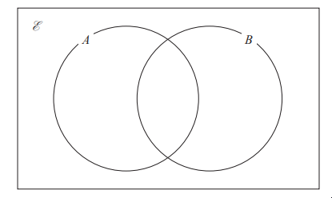
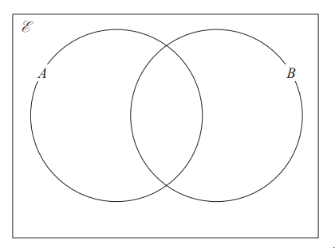
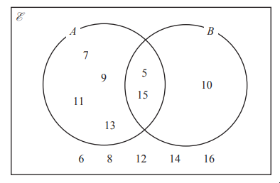

# Exam Questions — Set Notation & Venn Diagrams
**Number** · Edexcel IGCSE Maths A (Modular) (4XMAF/4XMAH) — 24/Foundation Unit 1
> Source: [https://www.savemyexams.com/igcse/maths/edexcel/a-modular/24/foundation-unit-1/topic-questions/number/set-notation-and-venn-diagrams/exam-questions/](https://www.savemyexams.com/igcse/maths/edexcel/a-modular/24/foundation-unit-1/topic-questions/number/set-notation-and-venn-diagrams/exam-questions/) · 3 questions · total 11 marks

## Q1 — easy — 5 marks · exam-questions

### 6((a)) — 3 marks — command: complete — structured — from paper Specimen paper · 4MA1/1F
`calligraphic E space equals open curly brackets 1 comma space 2 comma space 3 comma space 4 comma space 5 comma space 6 comma space 7 comma space 8 comma space 9 comma space 10 comma space 11 comma space 12 close curly brackets` 
`A equals open curly brackets 1 comma space 2 comma space 3 comma space 4 comma space 6 comma space 12 close curly brackets`
`B equals open curly brackets 2 comma space 3 comma space 5 comma space 7 comma space 11 close curly brackets`

Complete the Venn diagram to show this information.

### 6((b)) — 2 marks — command: list — structured — from paper Specimen paper · 4MA1/1F
List the members of the set

(i)  $A\capB$

(ii)  $B'$

## Q2 — medium — 3 marks · exam-questions

### 15() — 3 marks — command: complete — structured — from paper 2023 June · 4MA1/1F
`calligraphic E equals open curly brackets 5 comma space 6 comma space 7 comma space 8 comma space 9 comma space 10 comma space 11 comma space 12 comma space 13 comma space 14 comma space 15 comma space 16 comma space 17 comma space 18 comma space 19 comma space 20 close curly brackets`

`A equals open curly brackets odd space numbers close curly brackets space space space space space space space B equals open curly brackets multiples space of space 5 close curly brackets`

Complete the Venn diagram for this information.

## Q3 — medium — 3 marks · exam-questions

### 15((a)) — 1 mark — command: list — structured — from paper 2023 Nov · 4MA1/1F
Here is a Venn diagram.

List the members of the set $A$

### 15((b)) — 1 mark — command: list — structured — from paper 2023 Nov · 4MA1/1F
List the members of the set $A\capB$

### 15((c)) — 1 mark — command: list — structured — from paper 2023 Nov · 4MA1/1F
List the members of the set `open parentheses A union B close parentheses apostrophe`
