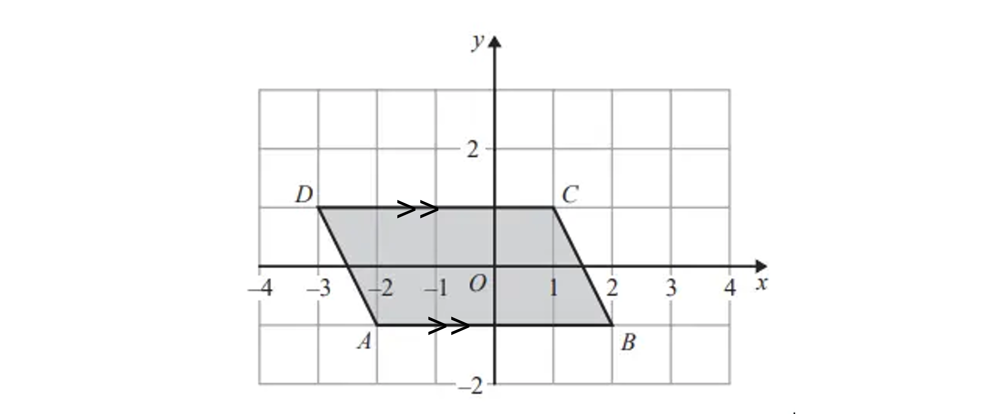
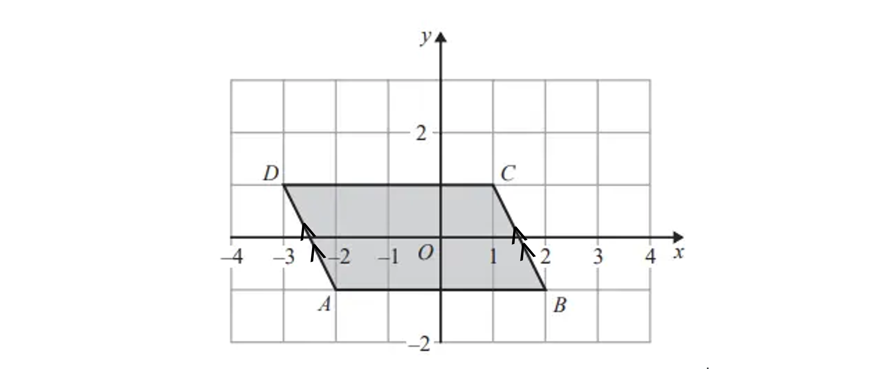
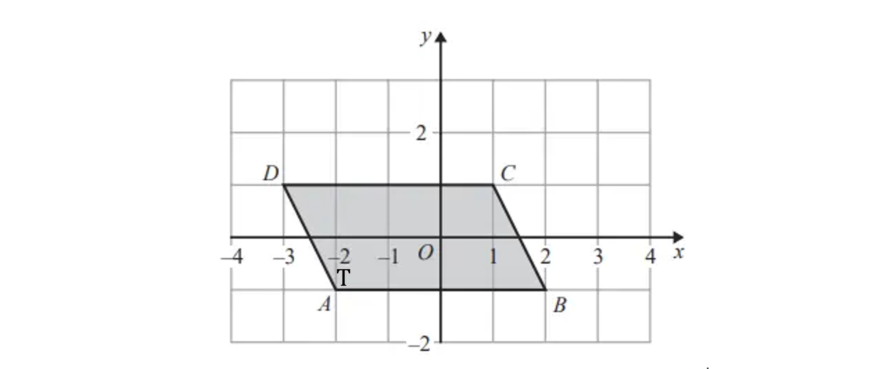
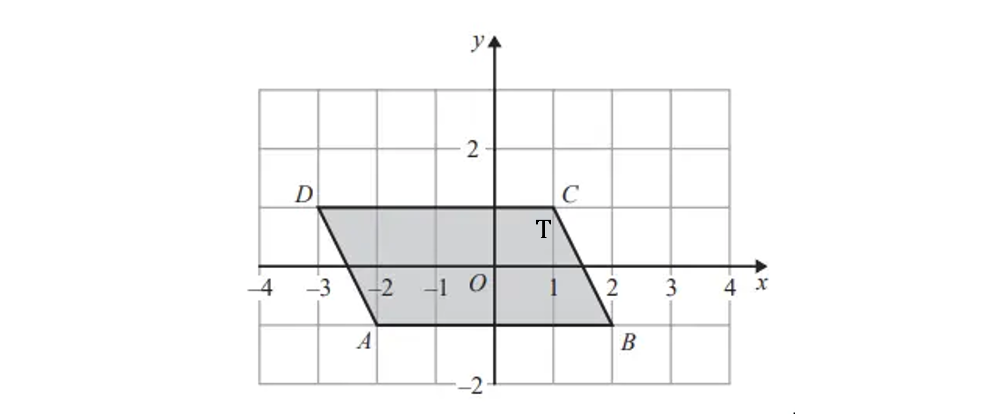
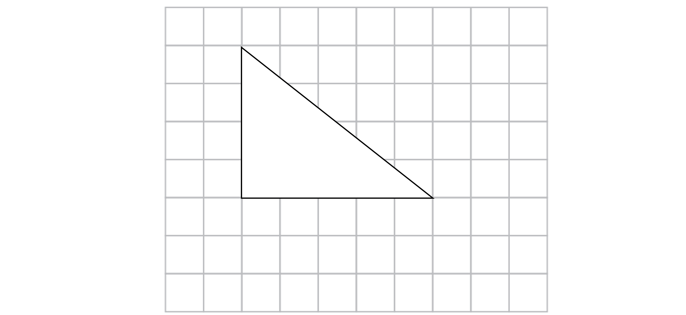
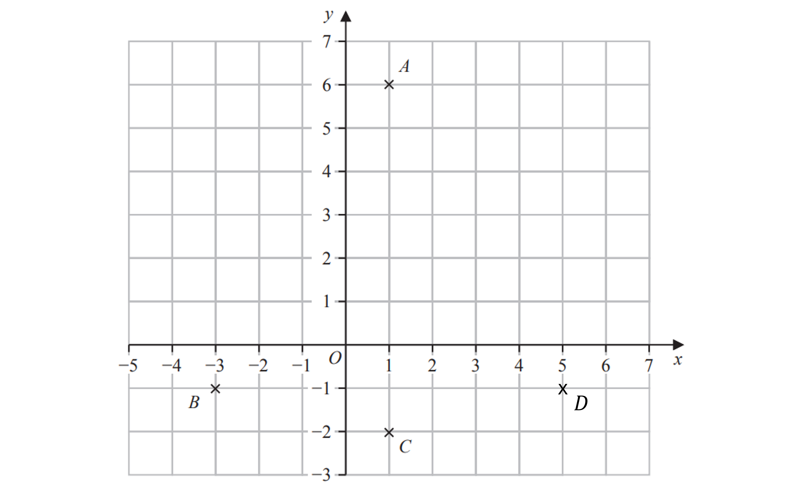

# Mark Schemes — 2D & 3D Shapes
**Shape, Space & Measure** · Edexcel IGCSE Maths A (Modular) (4XMAF/4XMAH) — 24/Foundation Unit 1

## Q1 — easy — 2 marks · exam-questions

### 8((b)) — 2 marks
(i)

> *Vertices are the corners where edges of the cuboid meet*

> *There are 4 on the base and 4 on the top face*

**Final answer:** **8**

**[B1]**

(ii)

> *The edges are the side lengths of the cuboid*

> *There are 4 around the base, 4 around the top face and  4 vertically connecting the base and top face*

**Final answer:** **12**

**[B1]**

## Q2 — easy — 4 marks · exam-questions

### 4((a)) — 1 marks
> *Read off the coordinate making sure it is written in the form (**x**, **y**)*

**Final answer:** **(2, -1)**

**[B1]**

### 4((b)) — 1 marks
> *The shape has two pairs of parallel lines, with equal opposite angles and  no right angles so it is a parallelogram*

**Final answer:** **Parallelogram**

**[B1]**

### 4((c)) — 1 marks
> *Parallel lines have the same gradient and will never meet*

> *Either of the below are correct solutions*

**[B1]**

### 4((d)) — 1 marks
> *An obtuse angle is greater than 90**o** but less than 180**o*

> *Either of the below are correct solutions*

**[B1]**

## Q3 — easy — 1 marks · exam-questions

### 6((a)) — 1 marks
> *This shape has 8 sides*

**Final answer:** **Octagon**

**[B1]**

## Q4 — easy — 2 marks · exam-questions

### 3((c)) — 1 marks
> *The shape has 5 sides*

**Final answer:** **Pentagon**

**[B1]**

### 3((d)) — 1 marks
> **[exam-tip]**
> Remember to count the edges that would be underneath or out of sight.

**Final answer:** **9**

**[B1]**

## Q5 — easy — 1 marks · exam-questions

### 6((a)) — 1 marks

**[B1]**

> **[mark-scheme]**
> Any right-angled triangle is fine.

## Q6 — easy — 2 marks · exam-questions

### 4((d)) — 1 marks
A kite has two pairs of adjacent, equal sides

**[B1]**

> **[exam-tip]**
> If needed, check with your ruler that the adjacent lines would be equal in length.

### 4((e)) — 1 marks
> *Use your ruler to draw dotted lines to find lines of symmetry*

> **[exam-tip]**
> The shape should be exactly the same on both sides of the mirror line. You can gently fold your page to check if needed.

**Final answer:** **1 line of symmetry**

**[B1]**
