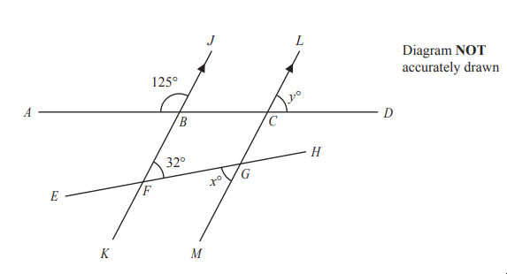
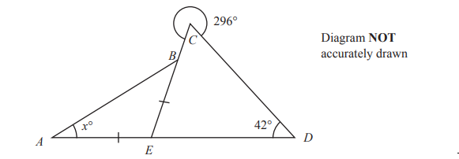

# Exam Questions — Angles
**Shape, Space & Measure** · Edexcel IGCSE Maths A (Modular) (4XMAF/4XMAH) — 24/Foundation Unit 1
> Source: [https://www.savemyexams.com/igcse/maths/edexcel/a-modular/24/foundation-unit-1/topic-questions/shape-space-and-measure/angles/exam-questions/](https://www.savemyexams.com/igcse/maths/edexcel/a-modular/24/foundation-unit-1/topic-questions/shape-space-and-measure/angles/exam-questions/) · 4 questions · total 14 marks

## Q1 — hard — 5 marks · exam-questions

### 13() — 5 marks — command: work_out — structured — from paper Specimen paper · 4MA1/1F

$ABC$ is parallel to $DEFG$
$BC=BF$ 
Angle $ABE=39^{\circ}$
Angle $CFG=63^{\circ}$

Work out the size of angle $x$. 
Give a reason for each stage in your working.

## Q2 — medium — 4 marks · exam-questions

### 8((a)) — 1 mark — command: write — structured — from paper 2023 Nov · 4MA1/2F

$ABCD$and $EFGH$are straight lines. 
$KFBJ$and $MGCL$are parallel straight lines.

$\mathrm{angle}ABJ=125^{\circ}\mathrm{angle}BFG=32^{\circ}\mathrm{angle}FGM=x^{\circ}\mathrm{angle}LCD=y^{\circ}$

Write down the value of $x$

### 8((b)) — 3 marks — command: multiple — structured — from paper 2023 Nov · 4MA1/2F
(i) Work out the value of $y$

(ii) Give a reason for your answer to (b) (i)

## Q3 — easy — 1 marks · exam-questions

### 3((a)) — 1 mark — command: write — structured — from paper 2023 Nov · 4MA1/1F

Write down the mathematical name of the angle marked $x$

## Q4 — hard — 4 marks · exam-questions

### 9() — 4 marks — command: work_out — structured — from paper 2023 Nov · 4MA1/1F
The diagram shows two triangles $ABE$ and $ECD$

Triangle $ABE$ is isosceles with $AE=EB$
$ADE$ and $EBC$ are straight lines.

Angle $CDE=42^{\circ}$
The reflex angle $ECD=296^{\circ}$
 Angle $BAE=x^{\circ}$

Work out the value of $x$
