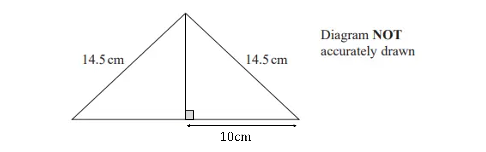

# Mark Schemes — Pythagoras & Trigonometry
**Shape, Space & Measure** · Edexcel IGCSE Maths A (Modular) (4XMAF/4XMAH) — 24/Foundation Unit 1

## Q1 — medium — 3 marks · exam-questions

### 19() — 3 marks
> **[exam-tip]**
> The right angled triangle has two given side lengths and a missing angle so trigonometry is used to solve this problem.

> *Use the labelled triangle to select the trigonometric ratio to use (sine, cosine or tangent)*

`tan open parentheses x close parentheses equals opposite over adjacent`

> *Substitute values into the equation and solve for *$x$

`table row cell tan open parentheses x close parentheses end cell equals cell 8 over 12 end cell row x equals cell tan to the power of negative 1 end exponent open parentheses 8 over 12 close parentheses end cell row x equals cell 33.690... end cell end table`

**[M1 M1]**

> *Round to 1 decimal place as stated in the question*

**Final answer:** **33.7****o**

**[A1]**

> **[mark-scheme]**
> **M1**: Is awarded for showing values substituted correctly into tangent ratio. Using sin*x* and cos*x* will also gain the mark if Pythagoras' theorem has been used to calculate the length of the hypotenuse as $\sqrt{208}$ first.
> 
> **M1**: Is awarded for a complete method shown to calculate the angle $x$.
> 
> **A1**: Is awarded for 33.7 *o*r any answer given that rounds to 33.7.

## Q2 — hard — 4 marks · exam-questions

### 28() — 4 marks
> *We have a right-angled triangle so we can calculate the size of angle **BAD** using trigonometry*

$\mathrm{cos}BAD=\frac{8}{14}$

**[M1]**

`B A D equals cos to the power of negative 1 end exponent open parentheses 8 over 14 close parentheses space equals 55.1500...`

**[M1]**

> *Use this to calculate angle **DAC** *

$55.15...-38=17.1500...$

> *We can now use trigonometry in triangle** DAC** to calculate the length of **CD*

$\mathrm{tan}17.1500...=\frac{CD}{8}$

**[M1]**

$CD=8\times\mathrm{tan}17.1500...=2.4687...$

> *Give your answer to 3 significant figures, as required*

**Final answer:** **CD ****= 2.47 cm (3 s.f.)**

**[A1]**

> **[mark-scheme]**
> **A1**: Answers in the range 2.44-2.48 will get this final mark.

## Q3 — hard — 4 marks · exam-questions

### 23() — 4 marks
> *Apply Pythagoras' theorem (*$a^{2}+b^{2}=c^{2}$*) to calculate the perpendicular height of the isosceles triangle, by forming a right-angled triangle as shown below*

- *Because the triangle is isosceles, the perpendicular height will divide the base in half*

`open parentheses height close parentheses squared equals 14.5 squared minus 10 squared equals 110.25`

$\mathrm{height}=\sqrt{110.25}=10.5$

**[M1 M1]**

> *Substitute values into the  formula for the area of a triangle (*$\frac{1}{2}\times\mathrm{base}\times\mathrm{height}$*)*

$\frac{1}{2}\times20\times10.5=105$

**[M1]**

**Final answer:** **105 cm****2 **

**[A1]**

> **[mark-scheme]**
> **M1**: A correct start to substituting into Pythagoras' theorem to calculate the height of the triangle will secure this mark (e.g. 14.52-102).
> 
> **M1**: A full and correct method for calculating the height of a triangle is needed to gain this mark.
> 
> **M1**: For substituting the correct height and base of the triangle to calculate the area of the triangle. This mark is only awarded if at least one of the previous M1 marks have been awarded.
> 
> **A1**: Correct value stated for the area.

## Q4 — medium — 4 marks · exam-questions

### 18() — 4 marks
> *Use Pythagoras' Theorem with *$ABC$* to work out the length of *$BC$

`table row cell 8 squared space plus space B C squared space end cell equals cell space 10 squared end cell row cell B C squared space end cell equals cell space 10 squared space minus space 8 squared end cell row cell B C squared space end cell equals cell space 36 end cell end table`

**[M1]**

> *Take the positive square root*

$BC=6$

**[M1]**

> *Add this to the length of *$BE$* to work out the length of *$CE$

$6+5=11\mathrm{cm}$

> *Use Pythagoras' Theorem again to work out the length of *$DE$

$DE^{2}=11^{2}+14^{2}$

$DE^{2}=317$

$DE=\sqrt{317}=17.80...$

**[M1]**

$17.8\mathrm{cm}$

**[A1]**

## Q5 — hard — 4 marks · exam-questions

### 20() — 4 marks
> *Calculate the length AB, which is equal to DC, using Pythagoras' theorem*

`7.2 squared plus 5.4 squared equals open parentheses A B close parentheses squared`

**[M1]**

> *Square root both sides to get the length AB*

`table row cell square root of 7.2 squared plus 5.4 squared end root space end cell equals cell space A B end cell row cell square root of 81 end cell equals cell A B end cell row 9 equals cell A B end cell end table`

**[M1]**

> *Add up all the sides to find the perimeter of the shape (remember AB = DC)*

*9 + 6 + 7.2 + 5.4 + 6 *

**[M1]**

**Final answer:** **33.6cm**

**[A1]**
