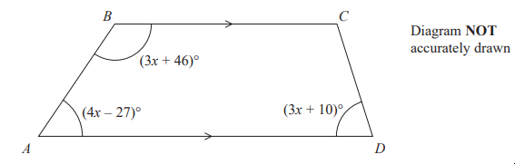
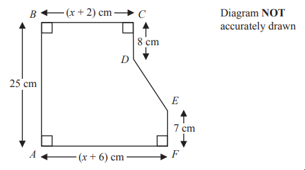

# Exam Questions — Forming Expressions & Equations
**Algebra** · Edexcel IGCSE Maths A (Modular) (4XMAF/4XMAH) — 24/Foundation Unit 2
> Source: [https://www.savemyexams.com/igcse/maths/edexcel/a-modular/24/foundation-unit-2/topic-questions/algebra/forming-expressions-and-equations/exam-questions/](https://www.savemyexams.com/igcse/maths/edexcel/a-modular/24/foundation-unit-2/topic-questions/algebra/forming-expressions-and-equations/exam-questions/) · 6 questions · total 22 marks

## Q1 — hard — 4 marks · exam-questions

### 19() — 4 marks — command: find — structured — from paper 2023 June · 4MA1/2F
$ABCD$ is a trapezium.

$BC$ is parallel to $AD$

Find the size of the largest angle inside the trapezium.

## Q2 — medium — 3 marks · exam-questions

### 8() — 3 marks — command: find — structured — from paper 2023 June · 4MA1/1F
Carla wraps some parcels with ribbon. 
She wraps 2 large parcels and 3 small parcels.

For each large parcel, Carla uses 185 centimetres of ribbon. 
For each small parcel, she uses $p$ centimetres of ribbon.

In total, Carla uses exactly 7 metres of ribbon to wrap the parcels.

Find the value of $p$

## Q3 — medium — 3 marks · exam-questions

### 13((c)) — 3 marks — command: write — structured — from paper 2023 June · 4MA1/2F
There are 8 slices of cheese in each small pack of cheese. 
There are 20 slices of cheese in each large pack of cheese.

Afreen buys $h$ small packs of cheese and  $j$ large packs of cheese. 
She buys a total of  $T$ slices of cheese.

Write down a formula for $T$ in terms of $h$ and $j$

## Q4 — hard — 5 marks · exam-questions

### 26() — 5 marks — command: work_out — structured — from paper 2023 nov · 4MA1/2F
The diagram shows a hexagon $ABCDEF$

$AB=25\mathrm{cm}BC=(x+2)\mathrm{cm}CD=8\mathrm{cm}EF=7\mathrm{cm}AF=(x+6)\mathrm{cm}$

The area of hexagon   $ABCDEF$ is 258 cm²

Work out the value of $x$

## Q5 — medium — 4 marks · exam-questions

### 16((b)) — 4 marks — command: show — structured — from paper 2023 Nov · 4MA1/1F
There are 56 metal bars in a box. 
Each metal bar is gold or silver or zinc

- $y$ metal bars are gold.
- $(3y+7)$ metal bars are silver.
- $(2y-5)$ metal bars are zinc.

Work out the number of metal bars that are zinc. 
Show clear algebraic working.

## Q6 — medium — 3 marks · exam-questions

### 4() — 3 marks — command: work_out — structured — from paper 2023 Nov · 4MA1/2F
Barney went for 4 walks on Tuesday.

The lengths of the walks were

800 metres 
2 kilometres 
1.7 kilometres 
$x$ metres

The total length of the 4 walks was 6250 metres.

Work out the value of $x$
