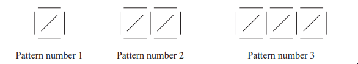

# Exam Questions — Sequences
**Algebra** · Edexcel IGCSE Maths A (Modular) (4XMAF/4XMAH) — 24/Foundation Unit 2
> Source: [https://www.savemyexams.com/igcse/maths/edexcel/a-modular/24/foundation-unit-2/topic-questions/algebra/sequences/exam-questions/](https://www.savemyexams.com/igcse/maths/edexcel/a-modular/24/foundation-unit-2/topic-questions/algebra/sequences/exam-questions/) · 2 questions · total 9 marks

## Q1 — medium — 5 marks · exam-questions

### 17((a)) — 2 marks — command: find — structured — from paper Specimen paper · 4MA1/2F
Here are the first five terms of a number sequence.

7        11          15            19            23

Find an expression, in terms of $n$, for the $n$th term of this sequence.

### 17((b)) — 2 marks — command: write — structured — from paper Specimen paper · 4MA1/2F
The $n$th term of a different number sequence is given by $80--2n$

Write down the first 3 terms of this sequence

### 17((c)) — 1 mark — command: explain — structured — from paper Specimen paper · 4MA1/2F
Yuen says there are no numbers that are in both of the sequences. 
Yuen is correct.

Explain why.

## Q2 — easy — 4 marks · exam-questions

### 4((a)) — 1 mark — command: draw — structured — from paper 2023 June · 4MA1/2F
Here is a sequence of patterns made from sticks.

In the space below, draw Pattern number 4.

### 4((b)) — 1 mark — command: complete — structured — from paper 2023 June · 4MA1/2F
Complete the table.

| Pattern number | 1 | 2 | 3 | 4 | 5 |
|---|---|---|---|---|---|
| Number of sticks | 5 | 9 | 13 |   |   |

### 4((c)) — 1 mark — command: work_out — structured — from paper 2023 June · 4MA1/2F
Work out the number of sticks in Pattern number 10

### 4((d)) — 1 mark — command: explain — structured — from paper 2023 June · 4MA1/2F
Connor says that in Pattern number 25 there are 102 sticks.

Explain why Connor is wrong.
