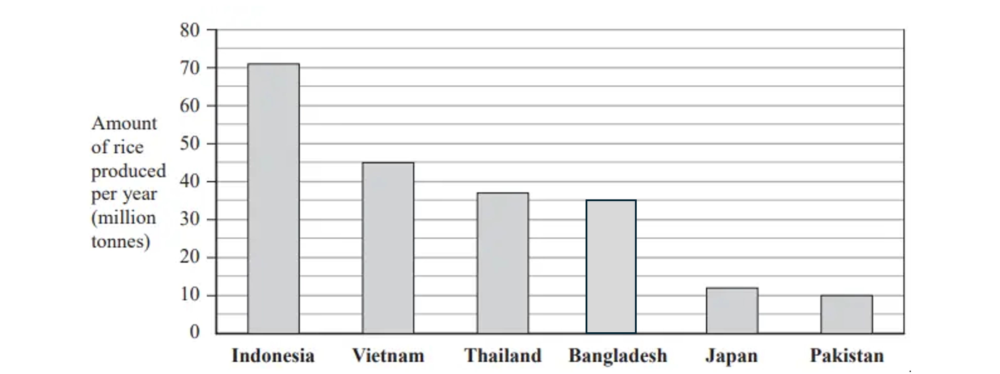
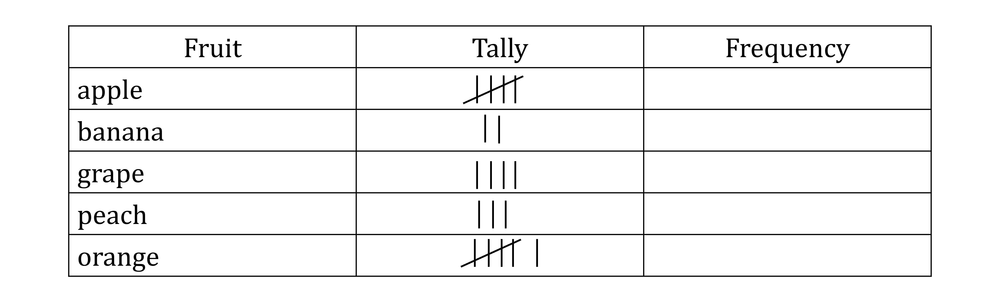
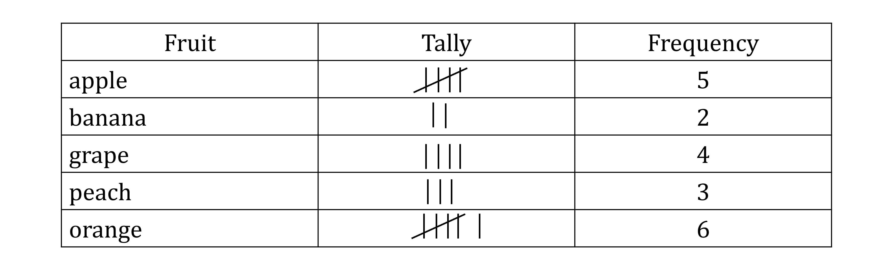
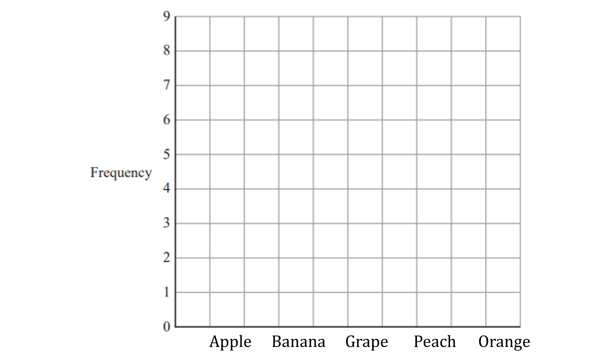
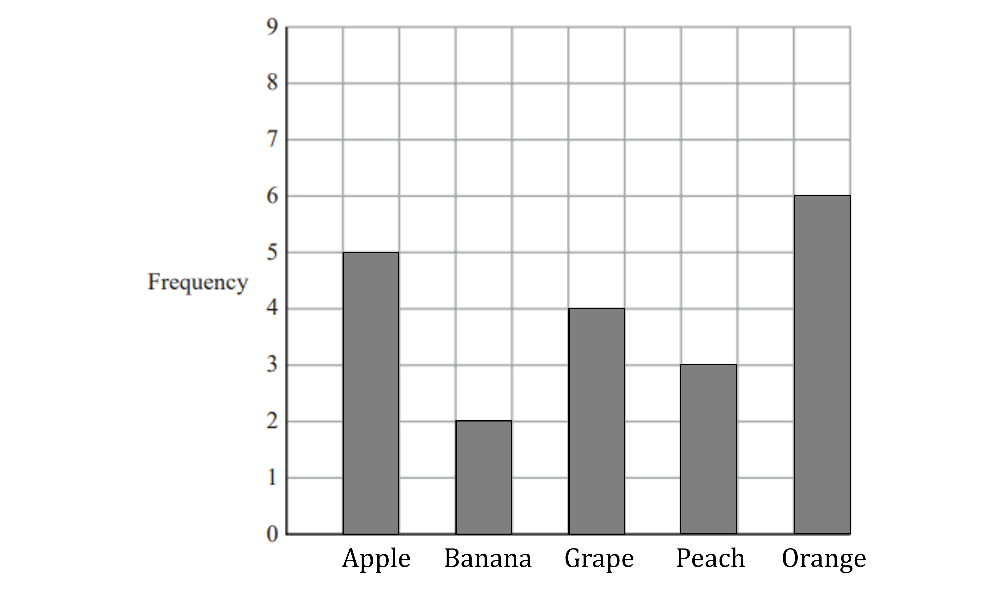
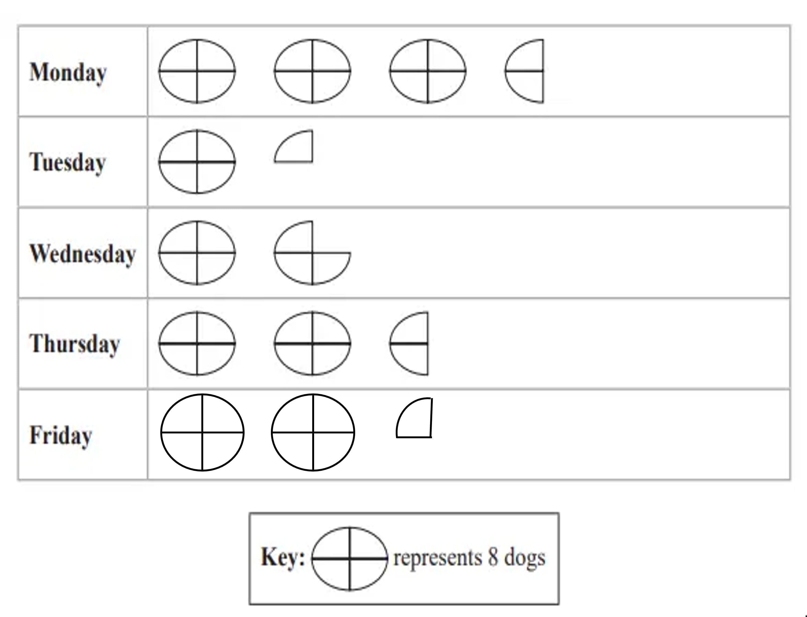
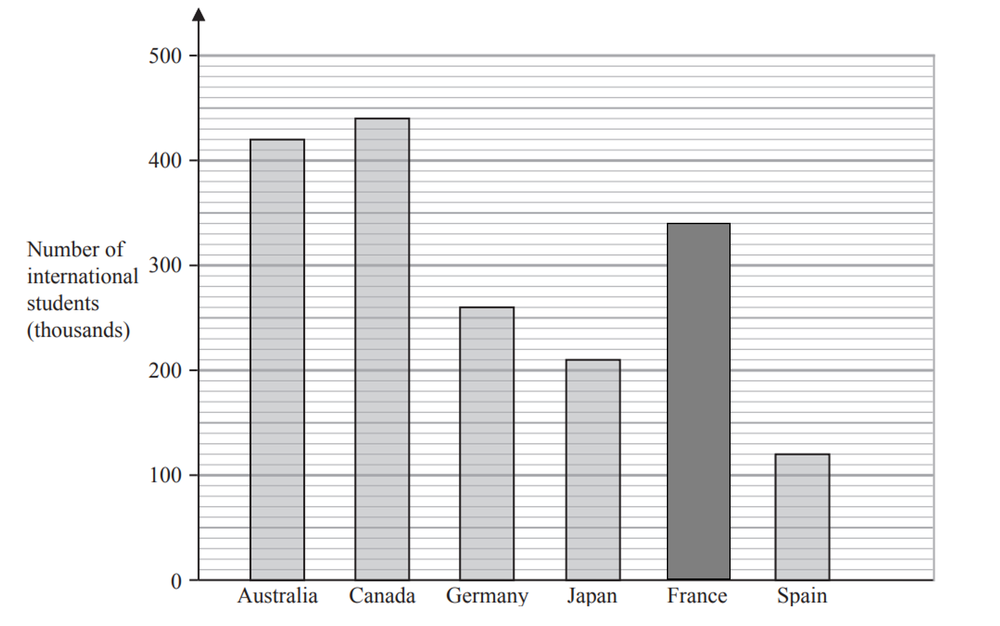
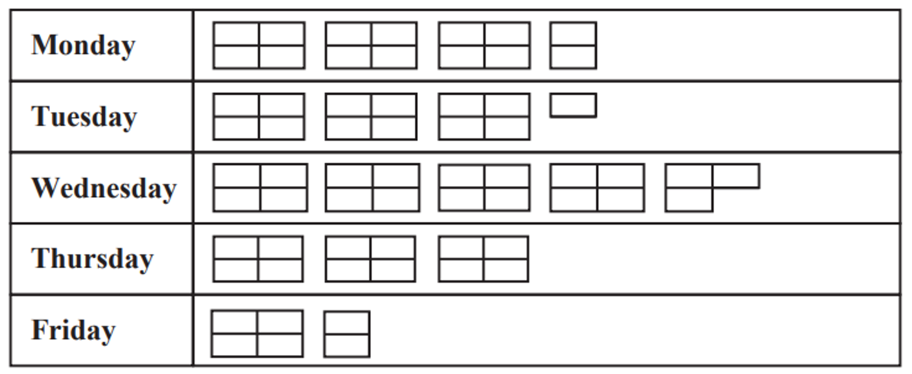

# Mark Schemes — Statistical Diagrams
**Handling Data** · Edexcel IGCSE Maths A (Modular) (4XMAF/4XMAH) — 24/Foundation Unit 2

## Q1 — easy — 4 marks · exam-questions

### 2() — 4 marks
> *A key has not been provided for the pictogram, so the number of goals that each circle represents needs to be calculated*

> *Add up the total number of circles and parts of circles in the pictogram, using decimals or fractions will give the same result*

$3.5+4.75+3.25+5+2.5=19$

**[M1]**

> *Find the amount of goals that one circle represents using division*

`table row cell 19 space cirlces end cell equals cell 152 space goals end cell row cell 1 space circle end cell equals cell 152 divided by 19 end cell row blank equals cell 8 space goals end cell end table`

**[M1]**

> *Use this to calculate the number of goals that City scored*

$5\times8=40$

**[M1 A1]**

**Final answer:** **40 goals**

## Q2 — medium — 4 marks · exam-questions

### 11((a)) — 2 marks
> *There are 360° in a circle*

> *Divide 360 by 90 to get the number of degrees for each person*

$360\div90=4$

> *Then multiply by 55 to get the total number of degrees for people who prefere mozzarella*

$55\times4=220$

**[M1]**

**Final answer:** **220**

**[A1]**

### 11((b)) — 2 marks
> *The question tells us 39 people = 195° from the vanilla sections of the pie chart*

> *Use this to calculate how many degrees for one person*

$195\div39=5$

**[M1]**

> *Read off the pie chart how many degrees chocolate is*

*75°*

> *Every 5° is one person*

> *Calculate how many 5s are in 75*

$75\div5=15$

**Final answer:** **15**

**[A1]**

## Q3 — easy — 4 marks · exam-questions

### 3((a)) — 1 marks
> *The intervals on the **y**-axis is going up in 5 million tonnes*

> *Read off the height of the bar for Vietnam*

**Final answer:** **45 million tonnes**

**[B1]**

### 3((b)) — 1 marks
> *Look for the bar that is at a height between 35 and 40 million tonnes*

**Final answer:** **Thailand**

**[B1]**

### 3((c)) — 1 marks
> *Find the difference between the height of the bar for Indonesia and Pakistan*

*71 million tonnes-10million tonnes=61 million tonnes*

**Final answer:** **61 million tonnes**

**[B1]**

> **[mark-scheme]**
> The mark is awarded for answers in the range 60-62 million.

### 3((d)) — 1 marks
> *Draw a bar for Bangladesh that is the same width as the other bars with a height of 35 up the **y**-axis*

**[B1]**

## Q4 — easy — 5 marks · exam-questions

### 3((a)) — 2 marks
> *Cross off each bit of data as you fill in the tally*

> *Remember the 5th line goes across 4 tally lines*

> *Count the tally for each fruit to fill in the frequency*

**[M1 A1]**

> **[mark-scheme]**
> **M1: **For two correct tallies or frequencies.
> 
> **A1: **For all the correct frequencies.

### 3((b)) — 3 marks
> *Draw a bar for each fruit*

> *The bars must all be the same width, this could be one square wide or two squares wide*

> *Label each bar with the fruit*

> *The height for each bar must match the frequency in your table*

> **[exam-tip]**
> Remember to leave gaps between the bars.

**[B1 B1 B1]**

> **[mark-scheme]**
> **B1: **For labelling your bars or for having 3 or 4 bars of the correct height.
> 
> **B1: **For having all 5 bars the correct height.
> 
> **B1: **For a fully correct bar chart with labels.

## Q5 — easy — 4 marks · exam-questions

### 3((a)) — 1 marks
> *Using the key, each full circle is 8 dogs so half a circle is 4 dogs*

> *Add up the shapes*

$8+8+8+4=28$

**Final answer:** **28**

**[B1]**

### 3((b)) — 1 marks
> *Work out how many 8s are in 18 and what is left*

$2\times8=16$*, remainder 2*

> *Work out what fraction of a circle is worth 2*

$8\div4=2$* so a quarter of a circle is 2*

**[B1]**

### 3((c)) — 2 marks
> *Work out how many dogs there are all together by adding up all the days*

$28+10+14+20+18=90$

**[M1]**

> *Multiply by two to get the total number of biscuits*

$2\times90=180$

**Final answer:** **180**

**[A1]**

## Q6 — easy — 4 marks · exam-questions

### 2((a)) — 1 marks
> *Look for the tallest bar*

**Final answer:** **Canada**

**[B1]**

### 2((b)) — 1 marks
> *Each line on the bar chart represents 10. The bar reaches two lines above 400*

**Final answer:** **420**

**[B1]**

### 2((c)) — 1 marks
> *Subtract the smaller number (Spain) from the larger number (Japan)*

$210-120=90$

**Final answer:** **90**

**[B1]**

### 2((d)) — 1 marks
> *The bar will be 4 lines above the line for 300*

**[B1]**

## Q7 — easy — 5 marks · exam-questions

### 2((a)) — 1 marks
> *Each 2 x 2 box represents 16 parcels*

- *Each single box represents 4 parcels*

> *Find the sum of 3 lots of the 2 x 2 boxes plus one single box*

$3\times16+4=52$

**Final answer:** **52**

**[B1]**

### 2((b)) — 1 marks
> *24 parcels need one full symbol (16) and one half symbol (8)*

**[B1]**

### 2((c)) — 1 marks
> *Wednesday has 5 more small boxes than Monday*

> * Each small box represents 4 parcels*

$5\times4=20$

**Final answer:** **20**

**[B1]**

### 2((d)) — 2 marks
> *Write the ratio Monday:Thursday*

$M:T\,56:48$

**[M1]**

> *Look for the highest common factor (8) and divide*

$M:T\,7:6$

**Final answer:** **7:6**

**[A1]**
