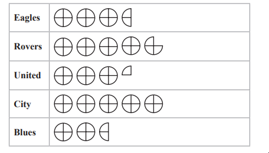
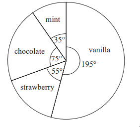
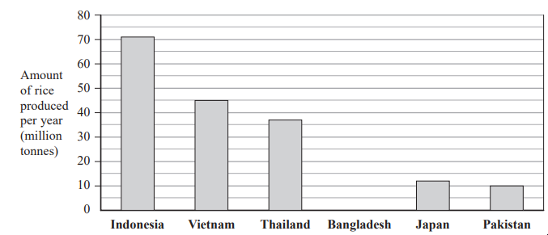
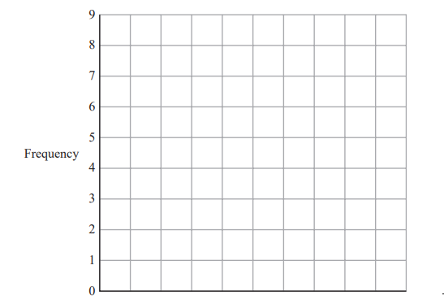
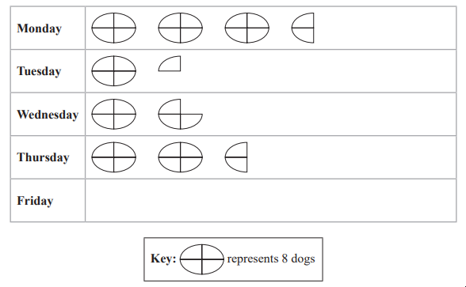
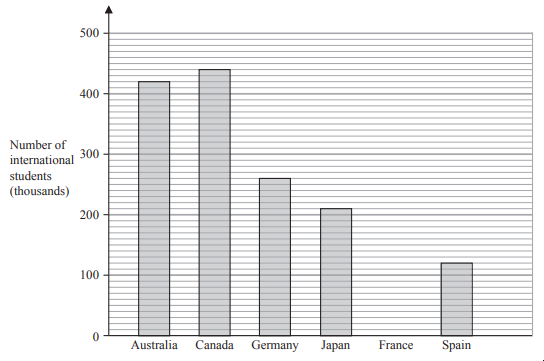
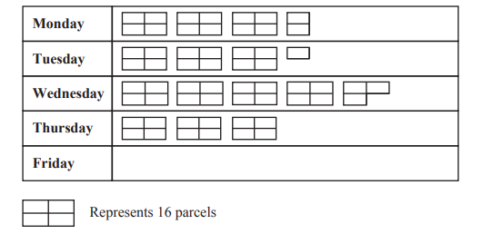

# Exam Questions — Statistical Diagrams
**Handling Data** · Edexcel IGCSE Maths A (Modular) (4XMAF/4XMAH) — 24/Foundation Unit 2
> Source: [https://www.savemyexams.com/igcse/maths/edexcel/a-modular/24/foundation-unit-2/topic-questions/handling-data/statistical-diagrams/exam-questions/](https://www.savemyexams.com/igcse/maths/edexcel/a-modular/24/foundation-unit-2/topic-questions/handling-data/statistical-diagrams/exam-questions/) · 7 questions · total 30 marks

## Q1 — easy — 4 marks · exam-questions

### 2() — 4 marks — command: how — structured — from paper Specimen paper · 4MA1/1F
The pictogram shows information about the number of goals scored by each of five hockey teams in March.

The total number of goals scored in March by the five hockey teams was 152

How many goals did City score in March?

## Q2 — medium — 4 marks · exam-questions

### 11((a)) — 2 marks — command: work_out — structured — from paper 2023 June · 4MA1/2F
Trisha asked 90 people to name their favourite type of cheese to put on a pizza. She is going to draw a pie chart for her results.

55 of the 90 people said that mozzarella was their favourite.

Work out the size of the angle on the pie chart for the sector representing mozzarella.

### 11((b)) — 2 marks — command: work_out — structured — from paper 2023 June · 4MA1/2F
Haashir asked a different group of people to name their favourite ice cream flavour. He used his results to draw this pie chart.

39 of the people Haashir asked said that vanilla was their favourite.

Work out how many of the people Haashir asked said that chocolate was their favourite.

## Q3 — easy — 4 marks · exam-questions

### 3((a)) — 1 mark — command: write — structured — from paper Specimen paper · 4MA1/2F
The bar chart shows information about the amount of rice produced per year in each of five countries.

Using the information in the bar chart, write down the amount of rice produced in Vietnam,

### 3((b)) — 1 mark — command: write — structured — from paper Specimen paper · 4MA1/2F
Write down the country that produced 37 million tonnes of rice,

### 3((c)) — 1 mark — command: work_out — structured — from paper Specimen paper · 4MA1/2F
Work out how much more rice is produced in Indonesia than in Pakistan.

### 3((d)) — 1 mark — command: draw — structured — from paper Specimen paper · 4MA1/2F
Bangladesh produced 35 million tonnes of rice per year.

Draw a bar on the bar chart to show this information.

## Q4 — easy — 5 marks · exam-questions

### 3((a)) — 2 marks — command: complete — structured — from paper 2023 June · 4MA1/1F
Ivor asks 20 children in his class to name their favourite fruit. Here are his results.

| apple | orange | grape | peach | grape |
|---|---|---|---|---|
| banana | apple | orange | grape | peach |
| apple | apple | banana | peach | orange |
| grape | orange | apple | orange | orange |

Complete the frequency table to show this information

| Fruit | Tally | Frequency |
|---|---|---|
| apple |   |   |
| banana |   |   |
| grape |   |   |
| peach |   |   |
| orange |   |   |

### 3((b)) — 3 marks — command: complete — structured — from paper 2023 June · 4MA1/1F
Complete the bar chart for the information in your table.

## Q5 — easy — 4 marks · exam-questions

### 3((a)) — 1 mark — command: how — structured — from paper 2023 June · 4MA1/2F
Peter owns boarding kennels for dogs.

The pictogram shows information about the number of dogs that were at the kennels each day from Monday to Thursday last week.

How many dogs were at the kennels on Monday?

### 3((b)) — 1 mark — command: show — structured — from paper 2023 June · 4MA1/2F
18 dogs were at the kennels on Friday.

Show this information on the pictogram.

### 3((c)) — 2 marks — command: work_out — structured — from paper 2023 June · 4MA1/2F
Peter gave each dog 2 biscuits each day.

Work out the total number of biscuits that Peter gave the dogs during the five days from Monday to Friday last week.

## Q6 — easy — 4 marks · exam-questions

### 2((a)) — 1 mark — command: which — structured — from paper 2023 Nov  · 4MA1/1F
The bar chart shows information about the number of international students who studied in each of five countries in 2019

In which of these five countries did the greatest number of international students study?

### 2((b)) — 1 mark — command: write — structured — from paper 2023 Nov · 4MA1/1F
Write down the number of international students who studied in Australia.

### 2((c)) — 1 mark — command: how — structured — from paper 2023 Nov · 4MA1/1F
The number of international students who studied in Japan was more than the number of international students who studied in Spain.

How many more?

### 2((d)) — 1 mark — command: draw — structured — from paper 2023 Nov · 4MA1/1F
In 2019, the number of international students who studied in France was 340 thousand.

Draw a bar on the bar chart to show this information

## Q7 — easy — 5 marks · exam-questions

### 2((a)) — 1 mark — command: how — structured — from paper 2023 Nov · 4MA1/2F
The pictogram gives information about the number of parcels a company posted on each of four days last week.

How many parcels were posted on Tuesday?

### 2((b)) — 1 mark — command: show — structured — from paper 2023 Nov · 4MA1/2F
24 parcels were posted on Friday.

Show this information on the pictogram.

### 2((c)) — 1 mark — command: how — structured — from paper 2023 Nov · 4MA1/2F
More parcels were posted on Wednesday than on Monday.

How many more?

### 2((d)) — 2 marks — command: find — structured — from paper 2023 nov · 4MA1/2F
Find the ratio

number of parcels posted on Monday : number of parcels posted on Thursday

Give your answer in its simplest form.
