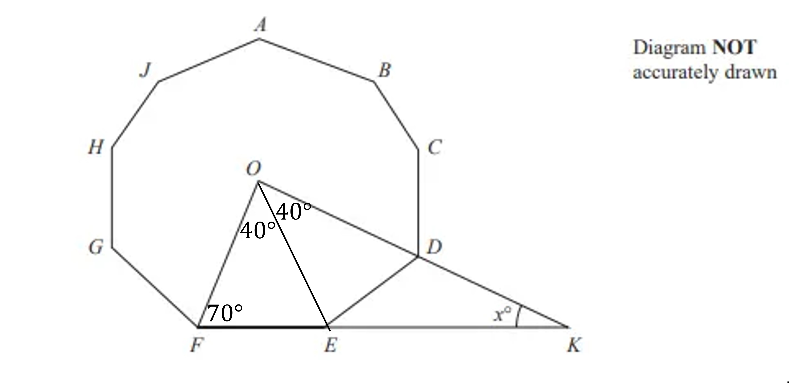

# Mark Schemes — Angles in Polygons
**Shape, Space & Measure** · Edexcel IGCSE Maths A (Modular) (4XMAF/4XMAH) — 24/Foundation Unit 2

## Q1 — hard — 5 marks · exam-questions

### 22() — 5 marks
> *Calculate the sum of interior angles for a pentagon using *`open parentheses n minus 2 close parentheses cross times 180`

`open parentheses 5 minus 2 close parentheses cross times 180 equals 540`

> *Calculate one interior angle of a regular pentagon by dividing by the 5 equal angles*

$540\div5=108$

**[M1]**

> *Calculate the sum of interior angles for an octagon*

`open parentheses 8 minus 2 close parentheses cross times 180 equals 1080`

> *Calculate one interior angle of a regular octagon by dividing by the 8 equal angles*

$1080\div8=135$

**[M1]**

> *Triangle ABC is isosceles as it shares two of its side lengths with the regular pentagons, therefore angles CAB and ABC are equal*

> *Calculate angles CAB and ABC*

*135-108=27*

**[M1]**

> *Calculate angle *$y$*using the sum of angles in a triangle rule*

`180 minus open parentheses 27 plus 27 close parentheses equals 126`

**[M1]**

**Final answer:** $y=$**126****o**

**[A1]**

## Q2 — hard — 3 marks · exam-questions

### 27() — 3 marks
> *Calculate angle **FOE**; it is an angle at the centre of a 9-sided regular polygon, so*

$\mathrm{angle}FOE=360\div9=40$

**[M1]**

> *You can use this to calculate angle **OFE**, as triangle **FOE** is an isosceles triangle*

$\mathrm{angle}OFE=\frac{180-40}{2}=70$

> *Angle** FOD** must be double angle **FOE*

$\mathrm{angle}FOD=40\times2=80$

**[M1]**

> *Then calculate *$x$* using the sum of angles in triangle **FOK*

$180-70-80=30$

**Final answer:** **30**

**[A1]**
