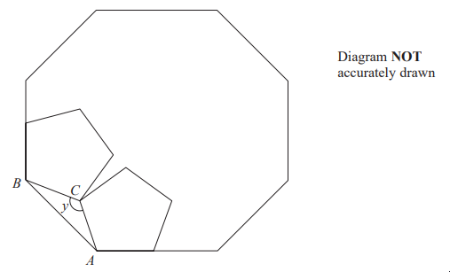
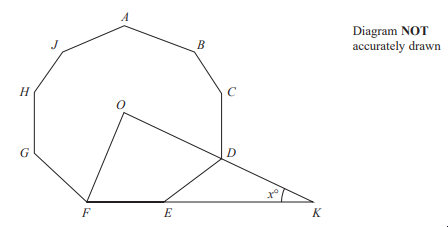

# Exam Questions — Angles in Polygons
**Shape, Space & Measure** · Edexcel IGCSE Maths A (Modular) (4XMAF/4XMAH) — 24/Foundation Unit 2
> Source: [https://www.savemyexams.com/igcse/maths/edexcel/a-modular/24/foundation-unit-2/topic-questions/shape-space-and-measure/angles-in-polygons-/exam-questions/](https://www.savemyexams.com/igcse/maths/edexcel/a-modular/24/foundation-unit-2/topic-questions/shape-space-and-measure/angles-in-polygons-/exam-questions/) · 2 questions · total 8 marks

## Q1 — hard — 5 marks · exam-questions

### 22() — 5 marks — command: show — structured — from paper Specimen paper · 4MA1/2F
The diagram shows two congruent regular pentagons drawn inside a regular octagon.

One side of each pentagon lies along a side of the octagon.

$AB$ is a side of the octagon. 
$AC$ is a side of one of the pentagons. 
$BC$ is a side of the other pentagon.

Work out the size of angle $y$. 
Show your working clearly

## Q2 — hard — 3 marks · exam-questions

### 27() — 3 marks — command: work_out — structured — from paper 2023 June · 4MA1/2F
Here is a 9-sided regular polygon $ABCDEFGHJ$, with centre $O$

$ODK$ and $FEK$are straight lines.

Work out the value of $x$
