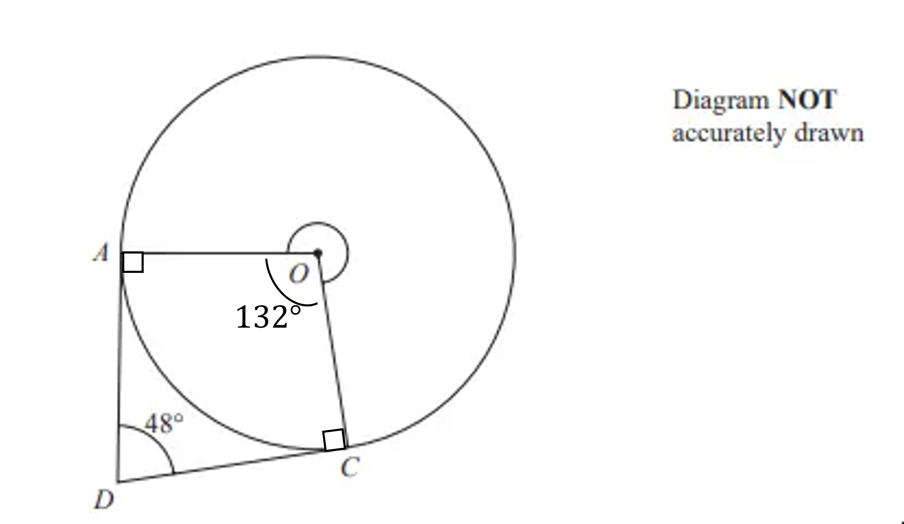

# Mark Schemes — Circle Properties & Theorems
**Shape, Space & Measure** · Edexcel IGCSE Maths A (Modular) (4XMAF/4XMAH) — 24/Foundation Unit 2

## Q1 — hard — 4 marks · exam-questions

### 20() — 4 marks
> **[exam-tip]**
> When asked to find a missing angle you will commonly need to work out other missing angles first.
> 
> Write any calculated missing angles on the diagram provided making sure you write your method and reasons as you go.
> 
> Missing angles on a diagram with a circle will typically require you to apply your understanding of circle theorems.

> *Calculate angles **OCB** and **OAB **using the radius meets a tangent** **circle theorem*

$OCB=90^{\circ}\,OAB=90^{\circ}$

*Because a radius meets a tangent at 90**o*

**[B1]**

> *Calculate angle *$x$*using  the sum of angles in a quadrilateral equals 360° rule*

`x equals 360 minus open parentheses 90 plus 90 plus 52 close parentheses
x equals 128`

*Because angles in a quadrilateral add up to 360**o*

**[B1 M1 A1]**

$x=128^{\circ}$

> **[mark-scheme]**
> **B1**: For stating that a radius meets a tangent at 90°.
> 
> **B1**: For stating that the interior angles of a quadrilateral add up to 360°.
> 
> **M1**: For a complete method to find the angle.
> 
> **A1**: Correct answer.

## Q2 — easy — 1 marks · exam-questions

### 3((b)) — 1 marks
> *The line goes from the centre to the edge of the circle*

**Final answer:** **Radius**

**[B1]**

## Q3 — hard — 3 marks · exam-questions

### 23() — 3 marks
> *Using the circle theorem that a radius meets a tangent at 90°*

**DCO*** = ***DAO*** = 90°*

**[M1]**

> *The sum of the angles in a quadrilateral is 360°*

> *Use this to calculate the obtuse angle in the centre of the circle*

$360-90-90-48=132$

**[M1]**

> *Calculate the reflex angle using the fact that the sum of the angles around a point is 360°*

*360 - 132 *

**Final answer:** **228°**

**[A1]**
