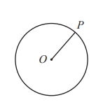

# Exam Questions — Circle Properties & Theorems
**Shape, Space & Measure** · Edexcel IGCSE Maths A (Modular) (4XMAF/4XMAH) — 24/Foundation Unit 2
> Source: [https://www.savemyexams.com/igcse/maths/edexcel/a-modular/24/foundation-unit-2/topic-questions/shape-space-and-measure/circle-properties-and-theorems-/exam-questions/](https://www.savemyexams.com/igcse/maths/edexcel/a-modular/24/foundation-unit-2/topic-questions/shape-space-and-measure/circle-properties-and-theorems-/exam-questions/) · 3 questions · total 8 marks

## Q1 — hard — 4 marks · exam-questions

### 20() — 4 marks — command: work_out — structured — from paper Specimen paper · 4MA1/2F

$A$ and $C$ are points on a circle, centre $O$.
 $AB$ and $CB$are tangents to the circle. 
Angle $ABC$ = 52°

Work out the size of angle $x$. 
Give a reason for each stage of your working.

## Q2 — easy — 1 marks · exam-questions

### 3((b)) — 1 mark — command: write — structured — from paper 2023 Nov · 4MA1/1F

$P$ is a point on a circle with centre $O$

Write down the mathematical name of the line  $OP$

## Q3 — hard — 3 marks · exam-questions

### 23() — 3 marks — command: work_out — structured — from paper 2023 June · 4MA1/2F

$A$ and $C$ are points on a circle, centre $O$ 
$DA$ is the tangent to the circle at $A$ and $DC$ is the tangent to the circle at $C$

Angle $ADC$ = 48°

Work out the size of reflex angle $AOC$
