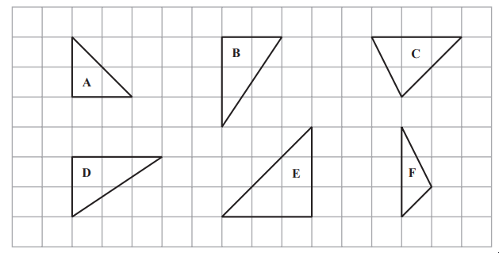

# Exam Questions — Congruence & Similarity
**Shape, Space & Measure** · Edexcel IGCSE Maths A (Modular) (4XMAF/4XMAH) — 24/Foundation Unit 2
> Source: [https://www.savemyexams.com/igcse/maths/edexcel/a-modular/24/foundation-unit-2/topic-questions/shape-space-and-measure/congruence-and-similarity-/exam-questions/](https://www.savemyexams.com/igcse/maths/edexcel/a-modular/24/foundation-unit-2/topic-questions/shape-space-and-measure/congruence-and-similarity-/exam-questions/) · 2 questions · total 3 marks

## Q1 — medium — 2 marks · exam-questions

### 10((b)) — 2 marks — command: write — structured — from paper Specimen paper · 4MA1/1F
In triangle $ABC$

$AB$= 3 cm and angle $CAB$= 45°

Triangle $ABC$ is enlarged by scale factor 5

For the enlarged triangle, write down

(i)  the length of the side that corresponds to $AB$

(ii)  the size of the angle that corresponds to angle $CAB$

## Q2 — easy — 1 marks · exam-questions

### 6((c)) — 1 mark — command: write — structured — from paper 2023 June · 4MA1/2F
Here are six triangles drawn on a grid of squares.

Two of these triangles are congruent.

Write down the letters of these two triangles.
