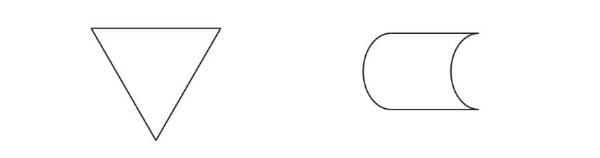
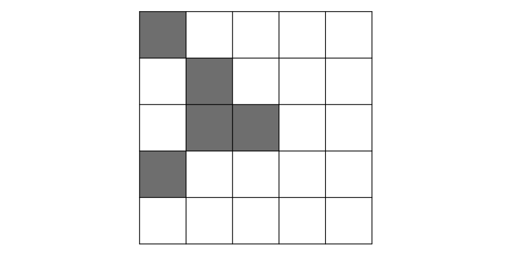

# Exam Questions — Symmetry
**Shape, Space & Measure** · Edexcel IGCSE Maths A (Modular) (4XMAF/4XMAH) — 24/Foundation Unit 2
> Source: [https://www.savemyexams.com/igcse/maths/edexcel/a-modular/24/foundation-unit-2/topic-questions/shape-space-and-measure/symmetry/exam-questions/](https://www.savemyexams.com/igcse/maths/edexcel/a-modular/24/foundation-unit-2/topic-questions/shape-space-and-measure/symmetry/exam-questions/) · 11 questions · total 17 marks

## Q1 — hard — 1 marks · exam-questions

### 14((a)) — 1 mark — command: fill — structured — from paper Nov 2019 · 0580/12

Shade two more small squares to give a pattern with exactly one line of symmetry.

## Q2 — easy — 1 marks · exam-questions

### 3() — 1 mark — command: write — structured — from paper Nov 2020 · 0580/12

Write down the order of rotational symmetry of this regular octagon.

## Q3 — medium — 2 marks · exam-questions

### 4() — 2 marks — command: write — structured — from paper Nov 2020 · 0580/13
Write down the order of rotational symmetry of each shape.

## Q4 — hard — 1 marks · exam-questions

### 7((b)) — 1 mark — command: fill — structured — from paper June 2019 · 0580/12
Shade two more squares so that this grid has rotational symmetry of order 4.

## Q5 — medium — 2 marks · exam-questions

### 14((b)) — 2 marks — command: complete — structured — from paper Nov 2019 · 0580/12

Complete the description of this pattern.

The pattern has ................ lines of symmetry

and order of rotational symmetry ................

## Q6 — easy — 4 marks · exam-questions

### 4((a)) — 3 marks — command: draw — structured — from paper June 2020 · 0580/11

On each shape draw all the lines of symmetry.

### 4((b)) — 1 mark — command: write — structured — from paper June 2020 · 0580/11

Write down the order of rotational symmetry of this shape.

## Q7 — easy — 1 marks · exam-questions

### 9() — 1 mark — command: write — structured — from paper June 2020 · 0580/12

Write down the order of rotational symmetry of the diagram.

## Q8 — easy — 1 marks · exam-questions

### 2() — 1 mark — command: write — structured — from paper June 2019 · 0580/11

Write down the order of rotational symmetry of this regular pentagon.

## Q9 — easy — 1 marks · exam-questions

### 3() — 1 mark — command: complete — structured — from paper March 2019 · 0580/12

Complete the statement.

Angle ...................... is a reflex angle.

## Q10 — easy — 2 marks · exam-questions

### 5((a)) — 2 marks — command: draw — structured — from paper Nov 2020 · 0580/11

The diagram shows a rhombus

On the diagram, draw all the lines of symmetry

## Q11 — easy — 1 marks · exam-questions

### 1() — 1 mark — command: fill — structured
Shade 4 more squares so that the diagram has a rotational symmetry of 2.

