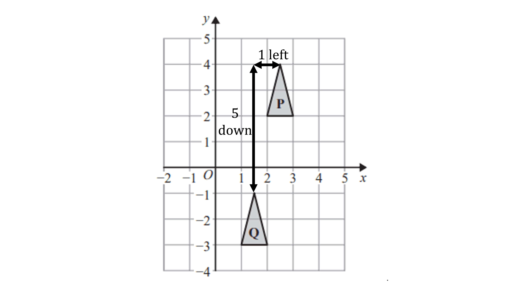
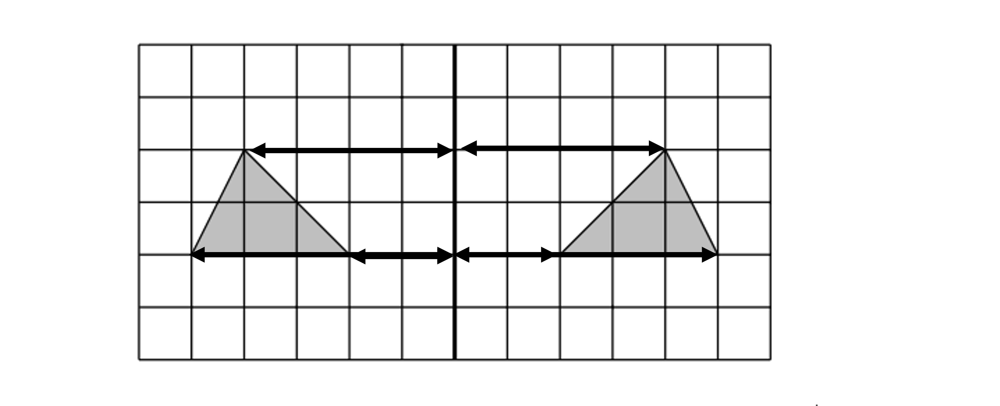
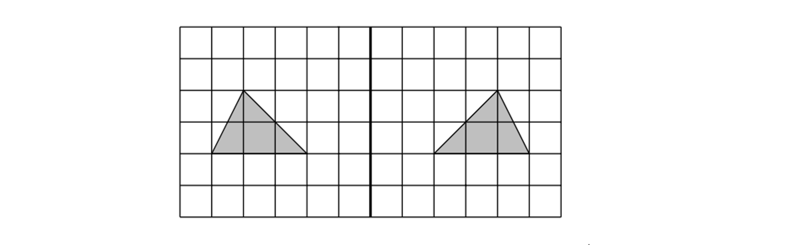
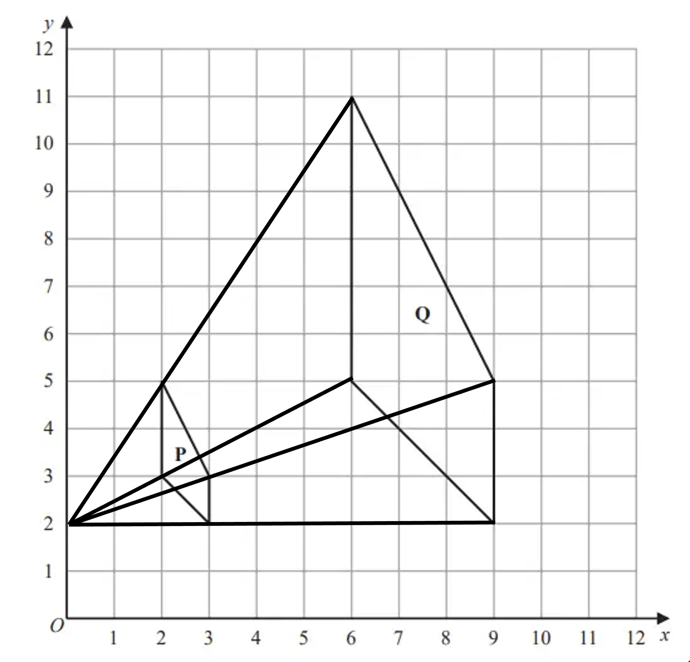
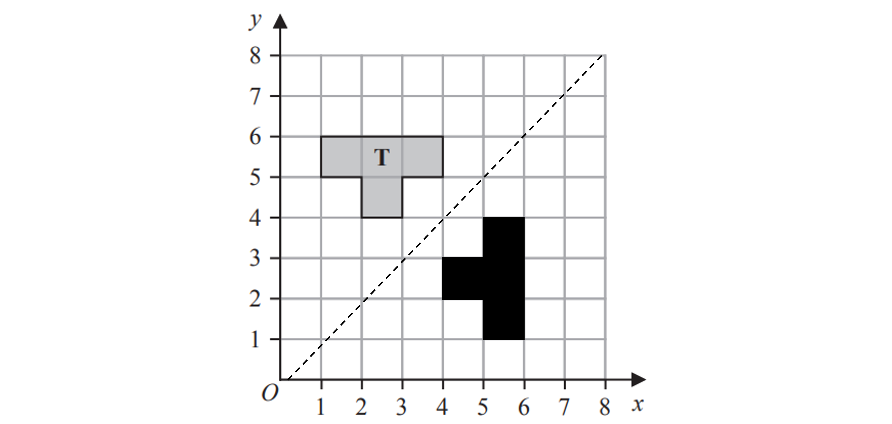

# Mark Schemes — Transformations
**Shape, Space & Measure** · Edexcel IGCSE Maths A (Modular) (4XMAF/4XMAH) — 24/Foundation Unit 2

## Q1 — easy — 2 marks · exam-questions

### 10() — 2 marks
> **[exam-tip]**
> Read the question very carefully when describing transformations to make sure you start from the correct object as described.

> *Identify the correct single transformation that has taken place from a  translation, reflection, rotation or enlargement*

*It is a translation because the shapes are the same size and in the same orientation*

> *Work out the amount it has translated by counting the amount of squares it has moved by in a left/right direction and up/down direction*

> *Select one vertex on object P to count from to get to the corresponding vertex on the image Q, as shown below*

*Shape P has translated 1 left and 5 down*

> *Write this as a vector in the form *`open parentheses table row x row y end table close parentheses`

- $x$* is -1 as it moved 1 horizontally in the negative direction*
- $y$* is -5 as it moved 5 vertically in the negative direction*

**Final answer:** **It is a translation by the vector **`open parentheses table row cell negative 1 end cell row cell negative 5 end cell end table close parentheses`

**[B1 B1]**

> **[mark-scheme]**
> **B1**: For stating that it is a translation.
> 
> **B1**: For writing the correct vector. This mark is not awarded for describing the translation in words.

## Q2 — medium — 2 marks · exam-questions

### 10((a)) — 2 marks
> *Reflect the triangle **ABC** so that the perpendicular distance of each vertex to the mirror line in the original shape is the same distance from the mirror line to the reflected shape*

> *See below the method for counting squares to the mirror line*

> *Final solution below*

**[B1 B1]**

> **[mark-scheme]**
> **B1**: Awarded for same size triangle in correct orientation or a triangle with two vertices in correct position.
> 
> **B1**: For fully correct reflection of triangle *ABC*.

## Q3 — medium — 8 marks · exam-questions

### 19((a)) — 3 marks
> *We know each corner of triangle A has moved the same amount horizontally and vertically to get to triangle B*

> *Look at the corresponding corners and see which have complete coordinates*

> *Use these to work out the translation*

*Horizontal: 6 - (-7) = 13 right*

*Vertical: 12 - 2 = 10 up*

**[M1]**

> *Use these to calculate the missing coordinates*

> *d and e are both vertical moves so we add 10 to the corresponding y-coordinates of triangle A*

*d = -5 + 10*

*e = -3 + 10*

> *f is a horizontal move and we have the x-coordinate of B so we subtract 13*

*f = 9 - 13*

**[M1]**

* ***d = 5, e = 7, f = -4**

**[A1]**

> **[mark-scheme]**
> **M1**: For both calculations, could be given as a vector or in brackets.
> 
> **M1**: For at least two of these calculations.
> 
> **A1**: All correct.

### 19((b)) — 3 marks
> *How has shape P changed to become Q?*

> *The sides of Q are three times the length of the corresponding sides of P, so it's an enlargement*

> *Draw straight lines through the corresponding corners of the shapes, going from Q through P, and see where they meet to find the centre of enlargement*

**Final answer:** **An enlargement of scale factor 3 from centre (0,2)**

**[B1 B1 B1]**

> **[mark-scheme]**
> **B1**: For enlargement.
> 
> **B1**: For scale factor of 3.
> 
> **B1**: For centre (0,2).

### 19((c)) — 2 marks
> **[exam-tip]**
> You could use tracing paper to help in this question.

> *Plot the point (3,5)*

> *Trace the shape and, keeping your pencil point on (3,5), rotate your tracing paper 90° clockwise. Then draw the image of the shape in the new position. Don't forget to label it R*

**[B1 B1]**

> **[mark-scheme]**
> **B1:** For the correct shape in the correct orientation in an incorrect position or three vertices in the correct place, or having rotated 90° anti-clockwise.
> 
> **B1:** Fully correct.

## Q4 — medium — 5 marks · exam-questions

### 19((a)) — 2 marks
> *Draw the line *$y=x$

> **[exam-tip]**
> Remember that this is a diagonal line passing through `open parentheses 0 comma 0 close parentheses comma space open parentheses 1 comma 1 close parentheses comma space open parentheses 2 comma 2 close parentheses` etc.

> *From each vertex on the original shape, *

- *Measure the distance to the mirror line by counting the squares diagonally towards the mirror line*
- *Find the reflected points by measuring the same distance on the other side of the mirror line*

> *Repeat for each vertex and then join*

**[B1 B1]**

> **[exam-tip]**
> For reflections in diagonal lines, it helps to turn your page so that the line is coming straight towards you. You can then gently fold your page along your mirror line to check that the shapes will meet exactly.

> **[mark-scheme]**
> **B1: **For the line $y=x$ drawn or a correct shape in the wrong place.
> 
> **B1: **Correct shape with all 8 points correct.

### 19((b)) — 3 marks
> *Triangle **B** is bigger than triangle **A** so the transformation is an enlargement*

> *To find the scale factor*

- *count how many squares tall the new triangle is*
- *divide by how many squares tall the original triangle is*

$3\div1=3$

> *To find the centre of enlargement, use a ruler to join corresponding vertices for at least 2 pairs of vertices*

> *The point where these lines meet is the centre of enlargement*

**Final answer:** **Enlargement**

**[B1]**

**Final answer:** **Scale factor 3**

**[B1]**

**Final answer:** **Centre of enlargement at **`open parentheses 7 comma 2 close parentheses`

**[B1]**

> **[mark-scheme]**
> No other transformation should be mentioned, otherwise you lose all marks.
