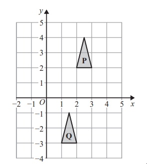
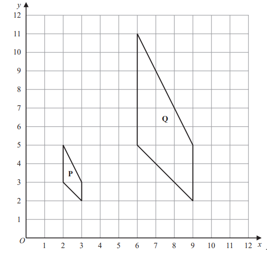
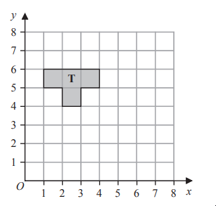
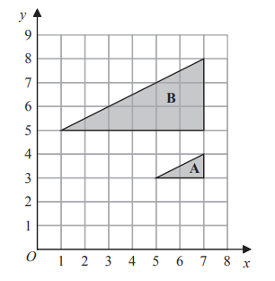

# Exam Questions — Transformations
**Shape, Space & Measure** · Edexcel IGCSE Maths A (Modular) (4XMAF/4XMAH) — 24/Foundation Unit 2
> Source: [https://www.savemyexams.com/igcse/maths/edexcel/a-modular/24/foundation-unit-2/topic-questions/shape-space-and-measure/transformations/exam-questions/](https://www.savemyexams.com/igcse/maths/edexcel/a-modular/24/foundation-unit-2/topic-questions/shape-space-and-measure/transformations/exam-questions/) · 4 questions · total 17 marks

## Q1 — easy — 2 marks · exam-questions

### 10() — 2 marks — command: describe — structured — from paper Specimen paper · 4MA1/2F

Describe fully the single transformation that maps triangle **P** onto triangle **Q**.

## Q2 — medium — 2 marks · exam-questions

### 10((a)) — 2 marks — command: reflect — structured — from paper Specimen paper · 4MA1/1F
Triangle $ABC$ is drawn on a centimetre grid.

Reflect triangle $ABC$ in the mirror line.

## Q3 — medium — 8 marks · exam-questions

### 19((a)) — 3 marks — command: work_out — structured — from paper 2023 June · 4MA1/1F
The diagram shows a sketch of triangle **A** and triangle **B** on a coordinate grid.

Given that triangle **A** has been translated to give triangle** B**, work out the value of $d$, the value of $e$ and the value of $f$

### 19((b)) — 3 marks — command: describe — structured — from paper 2023 June · 4MA1/1F
The diagram shows shape **P** and shape **Q** drawn on a grid.

Describe fully the single transformation that maps shape **P** onto shape **Q**

### 19((c)) — 2 marks — command: label — structured — from paper 2023 June · 4MA1/1F
On the grid above, rotate shape **P **90° clockwise about (3, 5) 
Label your shape **R**

## Q4 — medium — 5 marks · exam-questions

### 19((a)) — 2 marks — command: draw — structured — from paper 2023 Nov · 4MA1/2F

Reflect shape **T** in the line $y=x$

### 19((b)) — 3 marks — command: describe — structured — from paper 2023 Nov · 4MA1/2F

Describe fully the single transformation that maps triangle **A** onto triangle **B**
