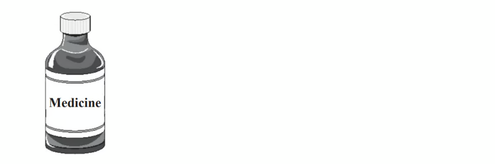

# Exam Questions — Algebra Toolkit
**Algebra** · Edexcel IGCSE Maths A (Modular) (4XMAF/4XMAH) — 24/Higher Unit 1
> Source: [https://www.savemyexams.com/igcse/maths/edexcel/a-modular/24/higher-unit-1/topic-questions/algebra/algebra-toolkit/exam-questions/](https://www.savemyexams.com/igcse/maths/edexcel/a-modular/24/higher-unit-1/topic-questions/algebra/algebra-toolkit/exam-questions/) · 35 questions · total 79 marks

## Q1 — hard — 2 marks · exam-questions

### 17((a)) — 2 marks — command: work_out — structured — from paper 2011	November · 1380/3H
$y=p-2qx^{2}\,\,p=-10\,q=3\,x=-5$

Work out the value of $y$.

## Q2 — medium — 4 marks · exam-questions

### 6((a)) — 2 marks — command: work_out — structured — from paper 2016	June · 1MA0/2H
The body mass index, $B$ , for a person of mass $m$ kg and height $h$ metres is given by the formula

$B=\frac{m}{h^{2}}$

Usman has a mass of 50 kg.

He has a height of 1.57 m.

Work out Usman's body mass index.

Give your answer correct to one decimal place.

### 6((b)) — 2 marks — command: work_out — structured — from paper 2016	June · 1MA0/2H
Tom's height is 1.80 m.
He wants his body mass index to be 21

Work out the mass that will give Tom a body mass index of 21

## Q3 — easy — 2 marks · exam-questions

### 5() — 2 marks — command: work_out — structured — from paper 2012	June · 1MA0/1H

You can work out the amount of medicine, c *ml*, to give to a child by using the formula

$c=\frac{ma}{150}$

$m$ is the age of the child, in months.

$a$ is an adult dose, in *ml*.

A child is 30 months old.

An adult's dose is 40 *ml*.

Work out the amount of medicine you can give to the child.

## Q4 — hard — 3 marks · exam-questions

### 20() — 3 marks — command: work_out — structured — from paper Nov 2021 · 8300/3H
$\frac{a}{b}=3c$

$\frac{b}{c}=2$

Work out the value of $a$ when $c=8$

## Q5 — medium — 2 marks · exam-questions

### 14((a)) — 2 marks — command: work_out — structured — from paper 2013	March · 1MA0/2H
$A=4bc\,\,A=100\,b=2$

Work out the value of  $c$.

## Q6 — easy — 2 marks · exam-questions

### 3((a)) — 2 marks — command: work_out — structured — from paper 2014	November · 1MA0/2H
$f=3g+7h$

Work out the value of $f$ when $g=---5$ and $h=2$

## Q7 — hard — 3 marks · exam-questions

### 19() — 3 marks — command: show — structured — from paper Nov 2020 · 8300/2H
$a$and $b$ are positive values.

Show that  $\frac{7a+2b-3a}{8a+6b+2a-b}$ always simplifies to the same value.

## Q8 — medium — 3 marks · exam-questions

### 12((a)) — 3 marks — command: determine — structured — from paper 2014	June · 1MA0/1H
You can change temperatures from °F to °C by using the formula

`C space equals space fraction numerator 5 open parentheses F minus 32 close parentheses over denominator 9 end fraction`

$F$ is the temperature in °F.

$C$ is the temperature in °C.

The minimum temperature in an elderly person's home should be 20 °C.

Mrs Smith is an elderly person.
 The temperature in Mrs Smith's home is 77 °F.

Decide whether or not the temperature in Mrs Smith's home is lower than the minimum temperature should be.

## Q9 — easy — 2 marks · exam-questions

### 4((a)) — 2 marks — command: simplify — structured — from paper 2013	November · 1MA0/1H
Simplify         $4y+2x---3+3x+8$

## Q10 — hard — 4 marks · exam-questions

### 7() — 4 marks — command: work_out — structured — from paper Nov 2018 · 8300/2H
Work out the values of $a$ and $b$ in the identity

$5(7x+8)+3(2x+b)\equivax+13$

$a$ = .....................        $b$= .....................

## Q11 — medium — 2 marks · exam-questions

### 3() — 2 marks — command: work_out — structured — from paper 2014	June · 1MA0/2H
$x=0.7$

Work out the value of  `fraction numerator open parentheses x plus 1 close parentheses squared over denominator 2 x end fraction`

Write down all the figures on your calculator display.

## Q12 — easy — 2 marks · exam-questions

### 8((a)) — 2 marks — command: simplify — structured — from paper 2015	June · 1MA0/1H
Simplify       $6g---5h-4g+2h$

## Q13 — hard — 1 marks · exam-questions

### 15() — 1 mark — command: circle — structured — from paper June 2018 · 8300/3H
Amy has $x$ beads.

Billy has three more beads than Amy.

Carly has four times as many beads as Billy.

Circle the expression for the number of beads that Carly has.

| $4x+3$ | $3x+4$ | $4(x+3)$ | $x+12$ |
|---|---|---|---|

## Q14 — medium — 6 marks · exam-questions

### 13((a)) — 2 marks — command: work_out — structured — from paper 2016	November · 1MA0/1H
$h=3t^{2}$

Work out the value of $h$ when $t=5$

### 13((b)) — 2 marks — command: work_out — structured — from paper 2016	November · 1MA0/1H
$h=3t^{2}$

Work out the value of $t$ when $h=108$

### 13((c)) — 2 marks — command: rearrange — structured — from paper 2016	November · 1MA0/1H
Make $a$ the subject of the formula

$v=u+at$

## Q15 — easy — 2 marks · exam-questions

### 8((a)) — 2 marks — command: simplify — structured — from paper 2017	June · 1MA0/2H
Simplify   $ab-5g+5ab-2g$

## Q16 — hard — 2 marks · exam-questions

### 10((a)) — 2 marks — command: find — structured — from paper 2020 May/June · 0580/42
$y=x^{4}-4x^{3}$

Find the value of $y$ when $x=-1$.

$y=$................................................

## Q17 — medium — 3 marks · exam-questions

### 5((a)) — 3 marks — command: work_out — structured — from paper 2011	June · 1380/3H
$h=5t^{2}+2$

(i) Work out the value of $h$ when $t=-2$

[1]

(ii) Work out a value of $t$ when $h=47$

[2]

## Q18 — easy — 1 marks · exam-questions

### 3() — 1 mark — command: circle — structured — from paper June 2018 · 8300/1H
Circle the expression that is equivalent to $3a--a\times4a+2a$

| $8a^{2}+2a$ | $12a^{2}$ | $5a-4a^{2}$ | $3a-6a^{2}$ |
|---|---|---|---|

## Q19 — hard — 4 marks · exam-questions

### 7((a)) — 4 marks — command: find — structured — from paper 2019	May/June · 0580/41
$s=ut+\frac{1}{2}at^{2}$

Find $s$ when $t=26.5,u=104.3,a=-2.2.$

Give your answer in standard form, correct to 4 significant figures.

$s$ = ....................................................

## Q20 — medium — 2 marks · exam-questions

### 1((a)) — 2 marks — command: work_out — structured — from paper Jan 2021 · 4MA1/2HR
$w=5y^{2}--y^{3}$

Work out the value of $w$ when $y=--2$

$w=$...................................................

## Q21 — easy — 1 marks · exam-questions

### 13((b)) — 1 mark — command: evaluate — structured — from paper Nov 2020 · 8300/3H
Sofia is trying to simplify  $\frac{6c+10}{2}$

Her method is

divide $6c$ by 2

then add 10

Evaluate her method.

## Q22 — hard — 3 marks · exam-questions

### 14((a)) — 2 marks — command: find — structured — from paper 2019	May/June · 0580/42
One solution of the equation $ax^{2}+a=150$ is $x=7$.

Find the value of $a$.

$a$ = ....................................................

### 14((b)) — 1 mark — command: find — structured — from paper 2019	May/June · 0580/23
Find the other solution.

$x$ = .................................................... [1]

## Q23 — medium — 2 marks · exam-questions

### 4() — 2 marks — command: find — structured — from paper Nov 2020 · 4MA1/1HR
$G=c^{2}--4c$

Find the value of $G$ when $c=--5$

$G=$ .........................................

## Q24 — easy — 1 marks · exam-questions

### 4() — 1 mark — command: what — structured — from paper Nov 2017 · 8300/1H
$y=\frac{10}{x}$

If the value of $x$ doubles, what happens to the value of $y$? Circle your answer.

| $\div2$ | $\times2$ | $\div5$ | $\times5$ |
|---|---|---|---|

## Q25 — medium — 2 marks · exam-questions

### 4() — 2 marks — command: find — structured — from paper June 2017 · J560/04
Find the value of $s$ when $u=12,$ $a=10$ and $t=4$.

$s=ut+\frac{1}{2}at^{2}$

## Q26 — easy — 2 marks · exam-questions

### 1() — 2 marks — command: simplify — structured — from paper 2020 Oct/Nov · 0580/21
Simplify $3a+7b-4a+b$.

## Q27 — medium — 2 marks · exam-questions

### 7() — 2 marks — command: simplify — structured — from paper 2018	Oct/Nov · 0580/23
Simplify.

$2p-q-3q-5p$

## Q28 — easy — 2 marks · exam-questions

### 3((b)) — 2 marks — command: simplify — structured — from paper 2020	May/June · 0580/41
Simplify.

$3a-5b-a+2b$

## Q29 — medium — 2 marks · exam-questions

### 5() — 2 marks — command: find — structured — from paper 2020 May/June · 0580/22
$y=mx+c$

Find the value of $y$ when $m=-3$, $x=-2$ and $c=-8$.

$y=$ .................................................

## Q30 — easy — 2 marks · exam-questions

### 5() — 2 marks — command: simplify — structured — from paper 2019	Oct/Nov · 0580/21
Simplify $5c-d-3d-2c$.

## Q31 — medium — 2 marks · exam-questions

### 5() — 2 marks — command: find — structured — from paper 2020 Specimen · 0580/02
$y=mx+c$*. *

Find the value of *y* when $m=-2$, $x=-7$ and* *$c=-3$.

$y=$ ..............................................

## Q32 — easy — 2 marks · exam-questions

### 4() — 2 marks — command: find — structured — from paper 2018	May/June · 0580/21
Find the value of $7x+3y$ when* *$x=12$ and $y=-6$.

## Q33 — medium — 2 marks · exam-questions

### 3((a)) — 2 marks — command: find — structured — from paper 2020	May/June · 0580/41
$s=ut+\frac{1}{2}at^{2}$

Find the value of $s$ when $u=5.2,t=7$ and $a=1.6.$

$s=$ ................................................

## Q34 — easy — 1 marks · exam-questions

### 4((a)) — 1 mark — command: complete — structured — from paper 2018	May/June · 0580/22
Complete the statement.

When $w=$ ............... , $10w=70$.

## Q35 — medium — 1 marks · exam-questions

### 4((b)) — 1 mark — command: complete — structured — from paper 2018	May/June · 0580/22
Complete the statement.

When $5x=15$, $12x=$....................
