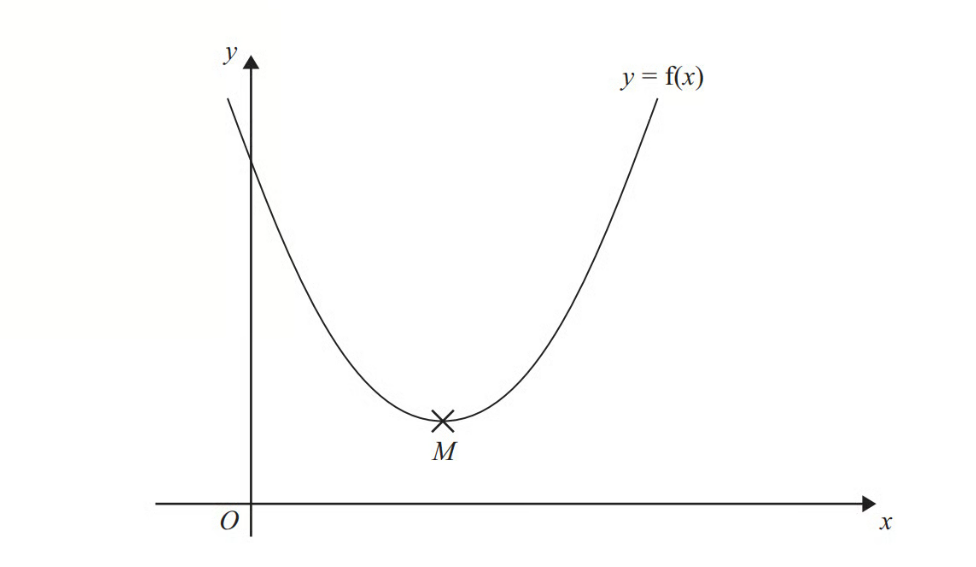
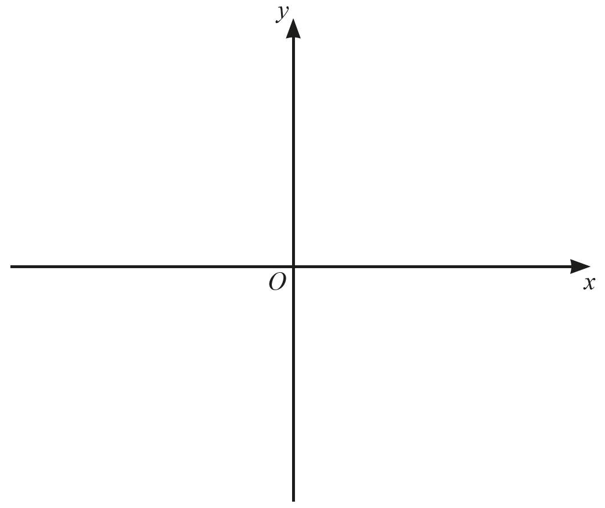

# Exam Questions — Completing the Square
**Algebra** · Edexcel IGCSE Maths A (Modular) (4XMAF/4XMAH) — 24/Higher Unit 1
> Source: [https://www.savemyexams.com/igcse/maths/edexcel/a-modular/24/higher-unit-1/topic-questions/algebra/completing-the-square/exam-questions/](https://www.savemyexams.com/igcse/maths/edexcel/a-modular/24/higher-unit-1/topic-questions/algebra/completing-the-square/exam-questions/) · 31 questions · total 98 marks

## Q1 — very_hard — 4 marks · exam-questions

### 23((a)) — 3 marks — command: write — structured — from paper Spec2 2015 · 1MA1/3H
Write $2x^{2}+16x+35$ in the form `a open parentheses x plus b close parentheses squared space plus space c` where $a,b,$ and $c$ are integers.

### 23((b)) — 1 mark — command: write — structured — from paper Spec2 2015 · 1MA1/3H
Hence, or otherwise, write down the coordinates of the turning point of the graph of $y=2x^{2}+16x+35$

## Q2 — hard — 4 marks · exam-questions

### 25((a)) — 3 marks — command: find — structured — from paper June 2013 · 1MA0/1H
The expression $x^{2}---8x+21$ can be written in the form `open parentheses x minus a close parentheses squared space plus b` for all values of $x$.

Find the value of $a$ and the value of $b$.

### 25((b)) — 1 mark — command: write — structured — from paper June 2013 · 1MA0/1H
The equation of a curve is $y=f(x)$ where $f(x)=x^{2}---8x+21$ The diagram shows part of a sketch of the graph of $y=f(x)$.

The minimum point of the curve is $M$.

Write down the coordinates of $M$.

## Q3 — medium — 2 marks · exam-questions

### 13() — 2 marks — command: write — structured — from paper November 2017 · 1MA1/3H
Write  $x^{2}+6x-7$   in the form `open parentheses x plus a close parentheses squared space plus space b`   where $a$ and $b$are integers.

## Q4 — very_hard — 4 marks · exam-questions

### 20((a)) — 3 marks — command: express — structured — from paper Jan 2022 · 4MA1/1H
Express $7+12x--3x^{2}$ in the form $a+b(x+c)^{2}$ where $a,b$ and$c$are integers.

### 20((b)) — 1 mark — command: write — structured — from paper Jan 2022 · 4MA1/1H
$C$ is the curve with equation$y=7+12x--3x^{2}$

The point $A$ is the maximum point on $C$

Use your answer to part (a) to write down the coordinates of $A$

## Q5 — hard — 3 marks · exam-questions

### 19() — 3 marks — command: multiple — structured — from paper June 2019 · 1MA1/1H
Given that `x to the power of 2 space end exponent minus space 6 x space plus space 1 space equals space open parentheses x space minus space a close parentheses to the power of 2 space end exponent minus space b` for all values of $x$.

(i) Find the value of $a$ and the value of $b$.

[2]

(ii) Hence write down the coordinates of the turning point of the graph of $y=x^{2}-6x+1$.

[1]

## Q6 — medium — 2 marks · exam-questions

### 11() — 2 marks — command: write — structured — from paper Spec1 2015 · 1MA1/3H
Write $x^{2}+2x-8$ in the form `open parentheses x space plus thin space m close parentheses squared space plus space n`

where $m$ and $n$are integers.

## Q7 — very_hard — 3 marks · exam-questions

### 23() — 3 marks — command: express — structured — from paper Jan 2020 · 4MA1/2HR
Express $7-12x-2x^{2}$ in the form `a space plus b open parentheses x plus c close parentheses squared` where $a$ , $b$ and $c$ are integers.

## Q8 — hard — 2 marks · exam-questions

### 19((b)) — 2 marks — command: express — structured — from paper Jan 2022 · 4MA1/1HR
Given that $a,b$ and $c$ are integers,

express  $3x^{2}+12x+19$ in the form $a(x+b)^{2}+c$

## Q9 — medium — 2 marks · exam-questions

### 16((b)) — 2 marks — command: express — structured — from paper Jan 2021 · 4MA1/1HR
Express $x^{2}--10x+40$ in the form  $(x+a)^{2}+b$, where $a$ and $b$ are integers.

## Q10 — very_hard — 2 marks · exam-questions

### 27((a)) — 2 marks — command: express — structured — from paper Nov 2020 · 4MA1/2H
The function$f$ is such that $f(x)=5+6x--x^{2}$      for `x space less-than or slanted equal to space 3`

Express $5+6x--x^{2}$ in the form $p--(x--q)^{2}$ where $p$ and $q$ are constants.

## Q11 — hard — 3 marks · exam-questions

### 17((c)) — 3 marks — command: express — structured — from paper Nov 2021 · 4MA1/1H
Express $4x^{2}--8x+7$  in the form  $a(x+b)^{2}+c$ where $a,b$ and $c$ are integers.

## Q12 — medium — 1 marks · exam-questions

### 23() — 1 mark — command: circle — structured — from paper Nov 2017 · 8300/1H
The equation of a curve is $y=(x+3)^{2}+5$

Circle the coordinates of the turning point.

| (5, 3) | (5, –3) | (3, 5) | (–3, 5) |
|---|---|---|---|

## Q13 — very_hard — 4 marks · exam-questions

### 22() — 4 marks — command: write — structured — from paper June 2019 · 4MA1/2HR
Write $5+12x-2x^{2}$ in the form $a+b(x+c)^{2}$ where $a$ , $b$ and $c$ are integers.

## Q14 — hard — 4 marks · exam-questions

### 23((a)) — 3 marks — command: write — structured — from paper Jan 2019 · 4MA1/2HR
Write $3x^{2}-12x+7$ in the form $a(x+b)^{2}+c$

### 23((b)) — 1 mark — command: write — structured — from paper Jan 2019 · 4MA1/2HR
The line $L$ is the line of symmetry of the curve with equation $y=3x^{2}-12x+7$

Using your answer to part (a) or otherwise, write down an equation of $L$.

## Q15 — medium — 3 marks · exam-questions

### 19((a)) — 3 marks — command: write — structured — from paper Nov 2020 · J560/05
Write  $x^{2}-10x+22$  in the form  `begin mathsize 16px style open parentheses x minus a close parentheses squared minus b end style`

## Q16 — very_hard — 2 marks · exam-questions

### 29((a)) — 2 marks — command: express — structured — from paper June 2018 · 4MA1/2HR
Express $7--4x--x^{2}$ in the form $p--(x+q)^{2}$ where $p$ and $q$ are constants.

## Q17 — hard — 2 marks · exam-questions

### 21((c)) — 2 marks — command: show — structured — from paper June 2018 · 4MA1/2H
Express $x^{2}+6\sqrt{2}x--1$ in the form $(x+a)^{2}+b$

Show your working clearly.

## Q18 — medium — 3 marks · exam-questions

### 20((a)) — 3 marks — command: write — structured — from paper Nov 2019 · J560/05
Write $x^{2}-6x+11$ in the form `open parentheses x minus a close parentheses squared plus b`

## Q19 — very_hard — 3 marks · exam-questions

### 25((a)) — 3 marks — command: work_out — structured — from paper Specimen 2015 · 8300/2H
$2x^{2}-6x+5$ can be written in the form $a(x-b)^{2}+c$

where $a,b$ and$c$ are positive numbers. Work out the values of  $a,b$ and $c$.

`table attributes columnalign right center left columnspacing 0px end attributes row a equals cell................... end cell row b equals cell................... end cell row c equals cell................... end cell end table`

## Q20 — hard — 3 marks · exam-questions

### 25() — 3 marks — command: show — structured — from paper Nov 2021 · 8300/2H
The equation of a curve is$y=x^{2}+14x+52$

By completing the square, work out the coordinates of the turning point. 
You **must **show your working.

## Q21 — medium — 4 marks · exam-questions

### 17((a)) — 4 marks — command: write — structured — from paper June 2019 · J560/05
Write *x*2 + 8*x* + 3  in the form (*x* + *a*)2 - *b.*

## Q22 — very_hard — 4 marks · exam-questions

### 25() — 4 marks — command: find — structured — from paper 2020 Specimen · 0580/02
Find the turning point of  $y=x^{2}+4x-3$  by completing the square.

( ...................... , .....................)

## Q23 — hard — 7 marks · exam-questions

### 18((a)) — 7 marks — command: multiple — structured — from paper Nov 2018 · J560/05
(i) Write $x^{2}+4x-16$ in the form `open parentheses x plus a close parentheses squared space minus space b`.

[3]

(ii) Solve the equation $x^{2}+4x-16=0$. 
Give your answers in surd form as simply as possible.

$x$ = ........... or $x$ = .......... [4]

## Q24 — medium — 3 marks · exam-questions

### 16() — 3 marks — command: write — structured — from paper June 2017 · J560/04
Write $x^{2}-10x+16$ in the form `begin mathsize 16px style open parentheses x plus a close parentheses squared plus b end style`

## Q25 — hard — 3 marks · exam-questions

### 16() — 3 marks — command: find — structured — from paper 2018	Oct/Nov · 0580/22
$x^{2}-12x+a=(x+b)^{2}$

Find the value of $a$ and the value of $b$.

$a$ = ...............................................

$b$ = ...............................................

## Q26 — medium — 2 marks · exam-questions

### 8((c)) — 2 marks — command: write — structured — from paper 2020	May/June · 0580/41
Write  $x^{2}+10x+14$  in the form  `open parentheses x plus a close parentheses squared space plus b.`

## Q27 — hard — 4 marks · exam-questions

### 9((a)) — 4 marks — command: multiple — structured — from paper 2020 May/June · 0580/42
(i) Write $x^{2}+8x-9$ in the form `space open parentheses x plus k close parentheses squared plus h`.

[2]

(ii) Use your answer to **part (i)** to solve the equation $x^{2}+8x-9=0$.

$x=$................... or $x=$................... [2]

## Q28 — medium — 3 marks · exam-questions

### 13() — 3 marks — command: find — structured — from paper 2019	May/June · 0580/21
$x^{2}+4x-9=(x+a)^{2}+b$

Find the value of $a$ and the value of $b$.

*      *$a$ = ............................................

$b$ = ............................................

## Q29 — hard — 4 marks · exam-questions

### 18((a)) — 2 marks — command: write — structured — from paper 2020 May/June · 0580/23
Write $x^{2}-18x-27$ in the form `space open parentheses x plus k close parentheses squared plus h`.

### 18((b)) — 2 marks — command: solve — structured — from paper 2020 May/June · 0580/23
Use your answer to **part (a)** to solve the equation $x^{2}-18x-27=0.$

$x=$.................... or $x=$....................

## Q30 — hard — 5 marks · exam-questions

### 8((c)) — 2 marks — command: write — structured — from paper 2020	May/June · 0580/41
Write  $x^{2}+10x+14$  in the form  `open parentheses x plus a close parentheses squared space plus b.`

### 8((c)) — 3 marks — command: sketch — structured — from paper 2020	May/June · 0580/41
Sketch the graph of  $y=x^{2}+10x+14$,  indicating the coordinates of the turning point.

## Q31 — hard — 3 marks · exam-questions

### 19() — 3 marks — command: express — structured — from paper 2023 June · 4MA1/2H
Express $3x^{2}--6x+5$  in the form $a(x--b)^{2}+c$
