# Mark Schemes — Coordinate Geometry
**Graphs & Coordinates** · Edexcel IGCSE Maths A (Modular) (4XMAF/4XMAH) — 24/Higher Unit 1

## Q1 — very_hard — 6 marks · exam-questions

### 22() — 6 marks
> *Use the information *$JK=\sqrt{80}$* to find an equation for the length of the line connecting **J **and **K **in terms of **j **and **k.*

> *The formula for the length between the points (**x**1**, **y**1**) and (**x**2**, **y**2**) is *`square root of open parentheses x subscript 2 minus x subscript 1 close parentheses squared plus open parentheses y subscript 2 minus y subscript 1 close parentheses squared end root`*. Use this formula with the points (**j**, 15) and (6, **k**). *

`table row cell square root of open parentheses k space minus space 15 close parentheses squared plus open parentheses 6 space minus space j close parentheses squared end root space end cell equals cell space square root of 80 end cell row cell open parentheses k space minus space 15 close parentheses squared plus open parentheses 6 space minus space j close parentheses squared space end cell equals cell space 80 end cell end table`

** ****[1]**

> *The line connecting the top vertex of an isosceles triangle (**H**) to the midpoint of its base** **(**JK**) is perpendicular to the base, so the lines **HM **and **JK **are perpendicular.*

> *The** gradients of perpendicular lines are negative reciprocals of each other.*

$m_{JK}=-\frac{1}{m_{HM}}=-\frac{1}{2}$

**[1]**

> *The gradient of **JK **can be found in terms of **j **and **k** and set equal to *$-\frac{1}{2}$*.*

$m_{JK}=\frac{15-k}{j-6}=-\frac{1}{2}$

**[1]**

> *Solve the two equations simultaneously to find the values of **j** and **k. **Number the equations.*

`table row cell open parentheses k space minus space 15 close parentheses squared plus open parentheses 6 space minus space j close parentheses squared space end cell equals cell space 80 space space space space space space space space space space space space open parentheses 1 close parentheses end cell row cell fraction numerator 15 space minus space k over denominator j space minus space 6 end fraction space end cell equals cell space minus 1 half space space space space space space space space open parentheses 2 close parentheses end cell end table`

> *Notice here that the expressions inside the brackets in equation (1) are similar to those on the numerator and denominator of equation (2). Multiply both parts of the fraction by -1 to get the expressions to be the same.*

`table row cell fraction numerator negative open parentheses 15 space minus space k close parentheses over denominator negative space open parentheses j space minus space 6 close parentheses end fraction space end cell equals cell space minus 1 half space space space space space space space space open parentheses 2 close parentheses end cell row cell fraction numerator k space minus 15 over denominator 6 space minus space j end fraction space end cell equals cell space minus 1 half space space space space space space space space open parentheses 2 close parentheses end cell end table`

> *Rearrange equation (2) to make (**k **-15) the subject.*

`table row cell k space minus space 15 end cell equals cell space minus 1 half open parentheses 6 space minus space j close parentheses space space space space space space space space open parentheses 2 close parentheses end cell end table`

> *Substitute into equation (1).*

`table row cell open parentheses negative 1 half open parentheses 6 space minus space j close parentheses close parentheses squared plus open parentheses 6 space minus space j close parentheses squared space end cell equals cell space 80 space space space space space space space open parentheses 1 close parentheses end cell row cell open parentheses j over 2 minus 6 over 2 close parentheses squared plus open parentheses 6 space minus space j close parentheses squared space end cell equals cell space 80 space space space space space space space open parentheses 1 close parentheses end cell row cell open parentheses j over 2 minus 3 close parentheses squared plus open parentheses 6 space minus space j close parentheses squared space end cell equals cell space 80 space space space space space space space open parentheses 1 close parentheses end cell end table`

> *Expand the brackets and simplify.*

`table row cell open parentheses j over 2 close parentheses squared minus 6 open parentheses j over 2 close parentheses plus 9 space plus space 36 space minus 12 j space plus space j squared space end cell equals cell space 80 space space space space space space space space open parentheses 1 close parentheses end cell row cell j squared over 4 space space minus space 3 j space plus space 45 minus 12 j space plus space j squared space end cell equals cell space 80 space space space space space space space space open parentheses 1 close parentheses end cell row cell fraction numerator 5 j squared over denominator 4 end fraction space space minus space 15 j space plus space 45 space space end cell equals cell space 80 space space space space space space space space open parentheses 1 close parentheses end cell end table`

> *Rearrange equation (1) to form a quadratic in the form **ax**2 **+ **bx **+ c = 0*

`table row cell 5 j squared space space minus space 60 j space plus space 180 space end cell equals cell space 320 space space space space space space space space open parentheses 1 close parentheses end cell row cell 5 j squared space space minus space 60 j space minus space 140 space end cell equals cell space 0 space space space space space space space space space space space space space open parentheses 1 close parentheses end cell end table`

**[1]**

> *Equation (1) can be made easier to solve by dividing every term by 5.*

`table row cell j squared space space minus space 12 j space minus space 28 space end cell equals cell space 0 space space space space space space space space space space space space space open parentheses 1 close parentheses end cell end table`

> *Factorise.*

`open parentheses j space minus space 14 close parentheses open parentheses j space plus space 2 close parentheses space equals space 0 space space space space open parentheses 1 close parentheses
j space equals space 14 space space space or space space space j space equals space minus 2`

**[1]**

> *We are told that **j** < 0, so ignore the positive answer and use the negative value to find the corresponding value of **k** by substituting into equation (2).*

`table row cell k space minus space 15 end cell equals cell space minus 1 half open parentheses 6 space minus space j close parentheses space space space space space space space space open parentheses 2 close parentheses end cell row cell k space minus space 15 end cell equals cell space minus 1 half open parentheses 6 space minus space open parentheses negative 2 close parentheses close parentheses space space space space space space space space open parentheses 2 close parentheses end cell row cell k space end cell equals cell space minus 1 half open parentheses 8 close parentheses space plus space 15 space space space space space space open parentheses 2 close parentheses end cell row cell k space end cell equals cell space 11 end cell end table`

$j=-2,k=11$* ***[1]**

## Q2 — hard — 5 marks · exam-questions

### 15((a)) — 2 marks
> *Use the midpoint formula, *`open parentheses fraction numerator x subscript 1 plus x subscript 2 over denominator 2 end fraction space comma space fraction numerator y subscript 1 plus y subscript 2 over denominator 2 end fraction close parentheses`

`C equals open parentheses fraction numerator negative 2 plus 8 over denominator 2 end fraction space comma space fraction numerator 4 plus 9 over denominator 2 end fraction close parentheses`

**[1]**

$(3,6\frac{1}{2})$ **[1]**

$6.5$**, **$\frac{13}{2}$** are both acceptable for the **$y$**coordinate**

### 15((b)) — 3 marks
> *If the point **D** is on the same line as **A** and **B**, then **AB** will have the same gradient as **AD** (or **BD**)*

> *First we can find the gradient of **AB**, using the gradient formula *$\frac{y_{1}-y_{2}}{x_{1}-x_{2}}$*, taking **A **as *`open parentheses x subscript 1 comma space y subscript 1 close parentheses`* and **B** as *`open parentheses x subscript 2 comma space y subscript 2 close parentheses`

$m_{AB}=\frac{4-9}{-2-8}=\frac{1}{2}$

**gradient of AB ****[1]**

> *Now find the gradient of **AD **(or **BD**) using the gradient formula *$\frac{y_{1}-y_{2}}{x_{1}-x_{2}}$*, taking **A **as *`open parentheses x subscript 1 comma space y subscript 1 close parentheses`* and **D** as *`open parentheses x subscript 2 comma space y subscript 2 close parentheses`

$m_{AD}=\frac{4-56}{-2-100}=\frac{52}{102}$

**gradient of AD or BD ****[1]**

> *We can simplify *$\frac{52}{102}$* to *$\frac{26}{51}$* but not to *$\frac{1}{2}$

**Final answer:** $\frac{1}{2}\neq\frac{52}{102}$** so ****D ****does not lie on the line**** **

**or ****gradient of ****AB**** does not equal gradient of ****AD,**** so ****D ****does not lie on the line**

**correct answer plus reason**** [1]**

**The method shown above is the most efficient method. However an acceptable alternative would be to find the equation of the line through ****A**** and ****B****, then substitute ****D**** into it to see if the equation holds true for ****D**

## Q3 — medium — 4 marks · exam-questions

### 13((b)) — 2 marks
> *Use the midpoint formula, *`open parentheses fraction numerator x subscript 1 plus x subscript 2 over denominator 2 end fraction space comma space fraction numerator y subscript 1 plus y subscript 2 over denominator 2 end fraction close parentheses`

`open parentheses fraction numerator negative 1 plus 7 over denominator 2 end fraction space comma space fraction numerator 2 plus 5 over denominator 2 end fraction close parentheses`

**[1]**

> *Simplify by hand, or work out the **x** and then the **y** coordinate using your calculator*

$(3,3.5)$ **[1]**

**You're not asked to plot the midpoint- but check against the diagram that your answer looks right**

### 13((b)) — 2 marks
> *As you are given two coordinate points rather than a diagram, it's best to use the gradient formula, *$\frac{y_{1}-y_{2}}{x_{1}-x_{2}}$* or *$\frac{y_{2}-y_{1}}{x_{2}-x_{1}}$

> *Here we will use *$\frac{y_{1}-y_{2}}{x_{1}-x_{2}}$*, taking **P **as *`open parentheses x subscript 1 comma space y subscript 1 close parentheses`* and **Q** as *`open parentheses x subscript 2 comma space y subscript 2 close parentheses`*- but you should get the same answer whichever version of the above formula you use so long as the substitution is done correctly*

`fraction numerator 4 minus open parentheses negative 5 close parentheses over denominator negative 4 minus 1 end fraction`

**[1]**

> *Take care with the negative numbers*

$-\frac{9}{5}$** ****or **$-1.8$** ****[1]**

## Q4 — easy — 2 marks · exam-questions

### 1() — 2 marks
> *Use the midpoint formula, *`open parentheses fraction numerator x subscript 1 plus x subscript 2 over denominator 2 end fraction space comma space fraction numerator y subscript 1 plus y subscript 2 over denominator 2 end fraction close parentheses`

`M equals open parentheses fraction numerator 2 plus 6 over denominator 2 end fraction space comma space fraction numerator 3 plus 8 over denominator 2 end fraction close parentheses`

**[1]**

> *Simplify by hand, or work out the **x** and then the **y** coordinate using your calculator*

`equals open parentheses 8 over 2 space comma space 11 over 2 close parentheses`

$M=(4,5.5)$ **[1]**

**You're not asked to plot the midpoint- but check against the diagram that your answer looks right**

## Q5 — hard — 3 marks · exam-questions

### 11() — 3 marks
> *Start with a sketch of the points **Q**,** R** and **S**: remember it does not need to be to scale*

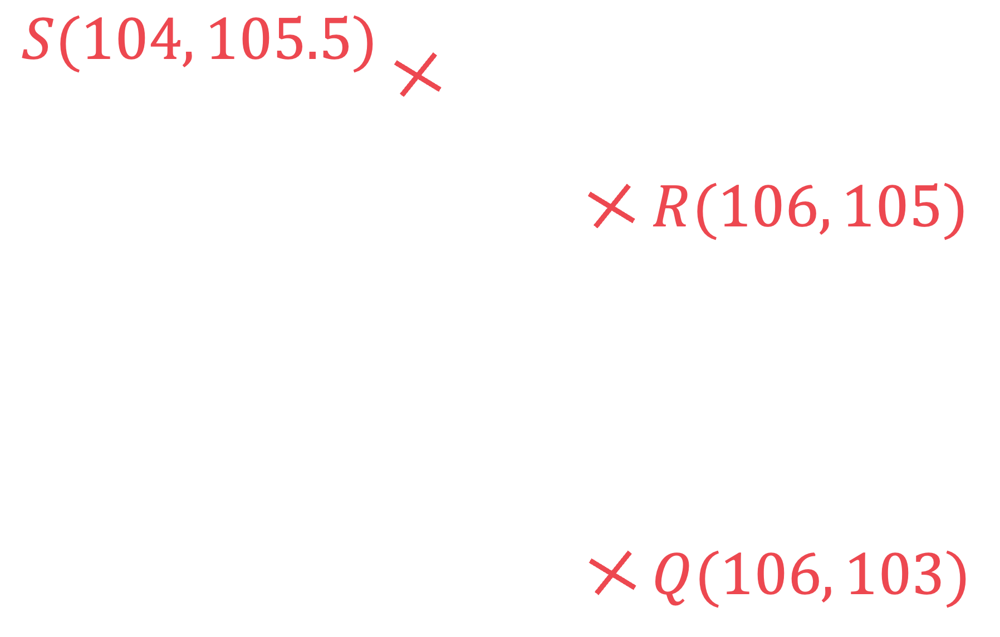

> *Now add in **P** and **A**, using the information given regarding midpoints*

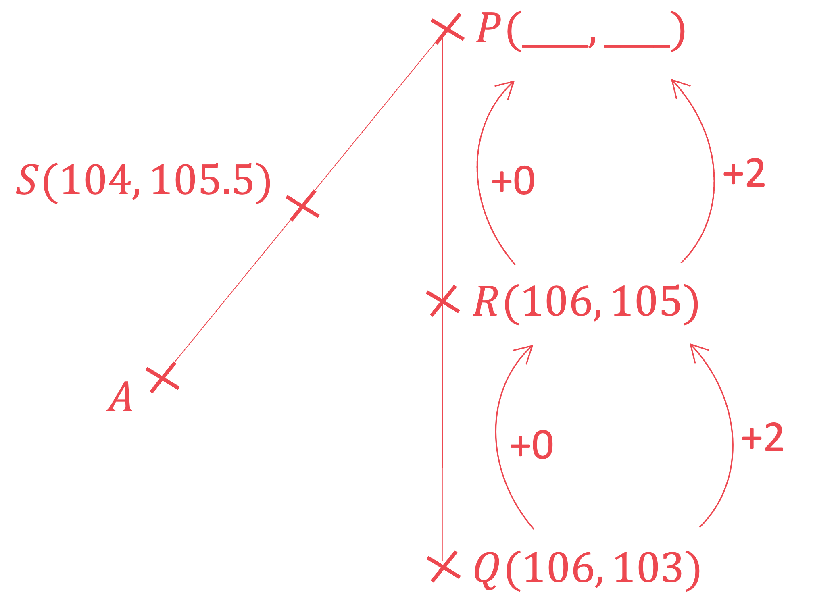

> *First we can find **P** using an intuitive method. The **x** coordinate stays the same but we need to add 2 to the **y** coordinate*

$P=(106,107)$

**[1]**

> *This allows us to find **A** using an intuitive method also*

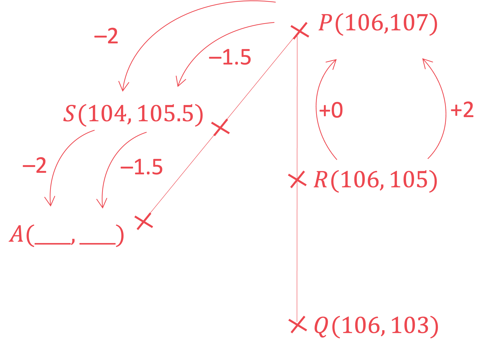

> *Reduce the **x** coordinate by 2 and reduce the **y** coordinate by 1.5*

**[1]**

$A=(102,104)$** [1]**

## Q6 — medium — 2 marks · exam-questions

### 10() — 2 marks
> *Method 1** - Intuitive method*

> *Consider how to go from the *$x$*coordinate of **P** to the *$x$* coordinate of **M.** We go back 4. This can be sketched on the diagram*

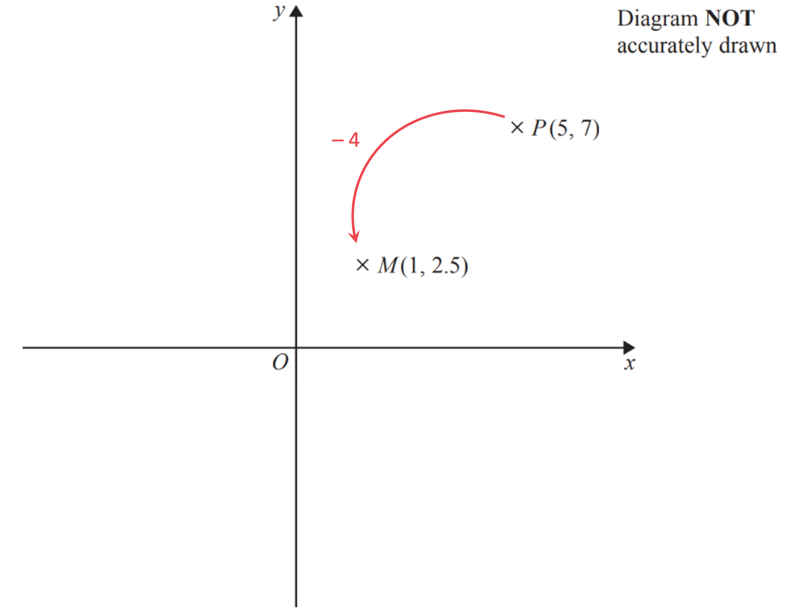

> *So to go from the *$x$*coordinate of **M** to the *$x$* coordinate of **Q** , we simply go back another 4*

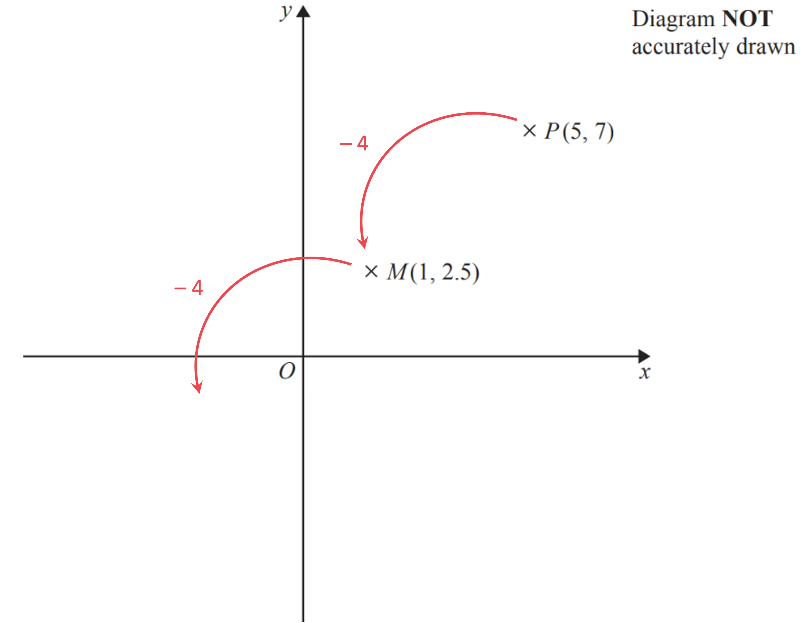

`table row x equals cell 1 minus 4 end cell row blank equals cell negative 3 end cell end table`

**correct x or y coordinate**** [1]**

> *Repeat for *$y$*. *

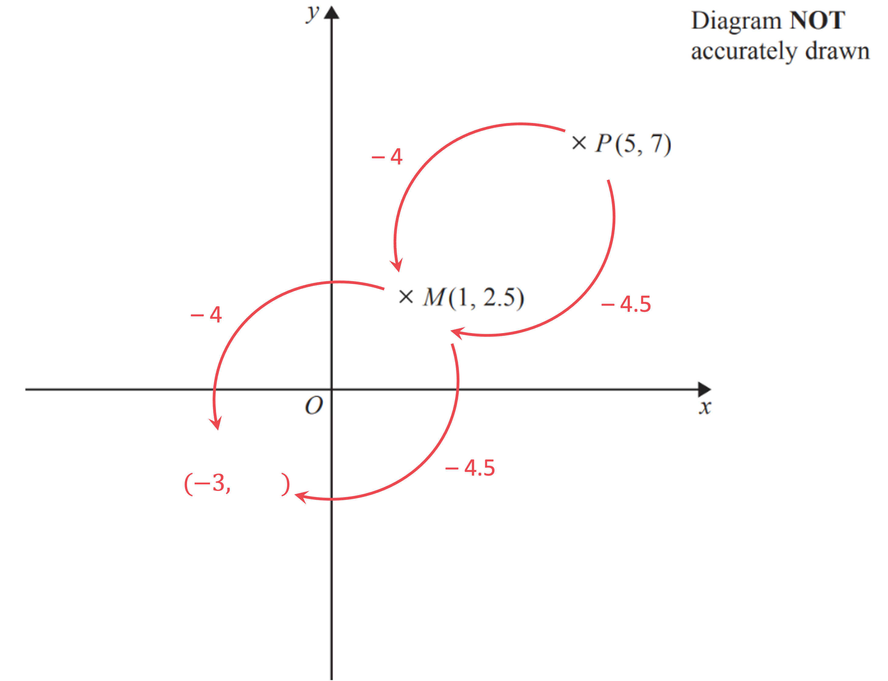

> *This time we go back 4.5*

`table row y equals cell 2.5 minus 4.5 end cell row blank equals cell negative 2 end cell end table`

> *Now write the final answer as a coordinate*

$(-3,-2)$ **[1]**

> *Method 2** - Use the formula*

> *Substitute what we know into the formula. We can let **P** be *`open parentheses x subscript 1 comma space y subscript 1 close parentheses`* and **Q** be *`open parentheses x comma space y close parentheses`

`open parentheses 1 comma space 2.5 close parentheses equals open parentheses fraction numerator 5 plus x over denominator 2 end fraction comma space fraction numerator 7 plus y over denominator 2 end fraction close parentheses`

**[1]**

> *Now separate the *$x$* part of the formula from the *$y$* part*

$1=\frac{5+x}{2}\mathrm{and}2.5=\frac{7+y}{2}$

> *Solve the *$x$* part, starting by multiplying both sides by the denominator to clear the fraction*

`table row 2 equals cell 5 plus x end cell row x equals cell negative 3 end cell end table`

**correct x or y coordinate**** [1]**

> *Solve the *$y$* part, starting by multiplying both sides by the denominator to clear the fraction*

`table row 5 equals cell 7 plus y end cell row y equals cell negative 2 end cell end table`

> *Now write the final answer as a coordinate*

$(-3,-2)$ **[1]**

## Q7 — easy — 2 marks · exam-questions

### 10((a)) — 2 marks
> *When in the form **y** = **mx** + **c**, we know that **L** has gradient **m.*

*Rearrange the equation given for **L **to the form **y** = **mx** + **c  **to determine its gradient. * *Start by subtracting *$7x$* to both sides.*

$2y=-7x+10$

**[1]**

> *Divide both sides by 2.*

$y=\frac{-7}{2}x-\frac{10}{2}$

> *The gradient is the coefficient of **x.*

**m = -3.5 **** [1]**

## Q8 — hard — 4 marks · exam-questions

### 19() — 4 marks
> *Start with a sketch of the points P, Q, and **R**: remember it does not need to be to scale, though it may help to draw some axes and put the points in the correct quadrants*

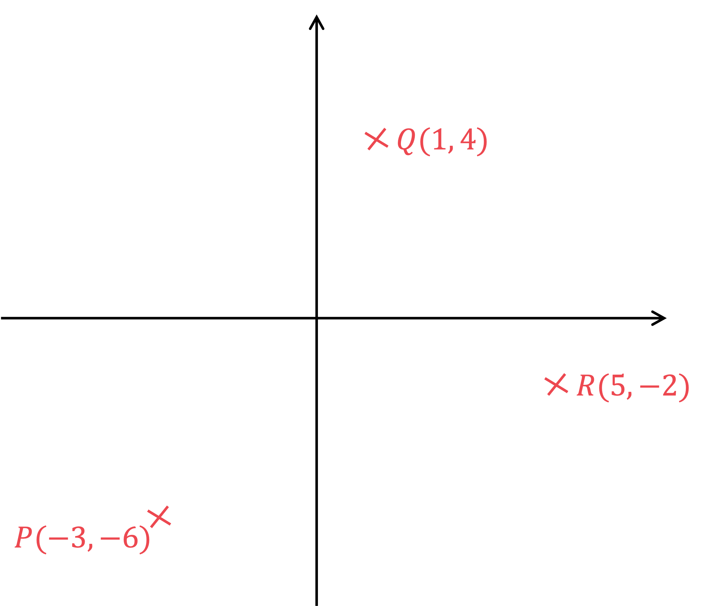

> *Now add in **M **and **N**, using the information regarding midpoints*

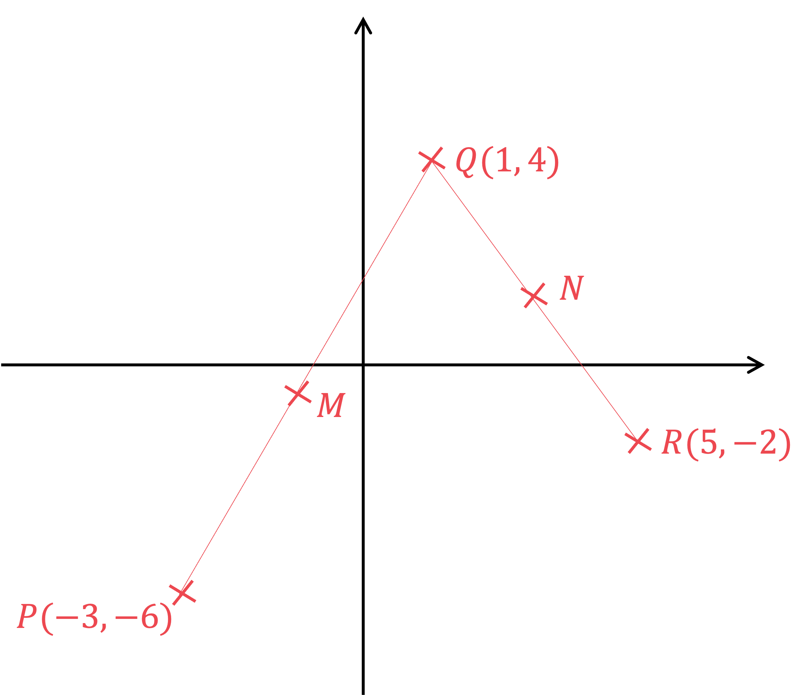

> *First we can find **M** and **N** using the midpoint formula, *`open parentheses fraction numerator x subscript 1 plus x subscript 2 over denominator 2 end fraction space comma space fraction numerator y subscript 1 plus y subscript 2 over denominator 2 end fraction close parentheses`

`table row M equals cell open parentheses fraction numerator negative 3 plus 1 over denominator 2 end fraction space comma space fraction numerator negative 6 plus 4 over denominator 2 end fraction close parentheses end cell row M equals cell open parentheses negative 1 comma space minus 1 close parentheses end cell end table`           `table row N equals cell open parentheses fraction numerator 1 plus 5 over denominator 2 end fraction space comma space fraction numerator 4 plus open parentheses negative 2 close parentheses over denominator 2 end fraction close parentheses end cell row N equals cell open parentheses 3 comma space 1 close parentheses end cell end table`

** ****attempting to find either midpoint using a correct method ****[1]**

> *We need to show that the gradient of **MN** is the same as the gradient of **PR *

> *Starting with **MN**, find the gradient using *$\frac{y_{1}-y_{2}}{x_{1}-x_{2}}$*, taking **M **as *`open parentheses x subscript 1 comma space y subscript 1 close parentheses`* and **N** as *`open parentheses x subscript 2 comma space y subscript 2 close parentheses`

$m_{MN}=\frac{-1-1}{-1-3}=\frac{-2}{-4}=\frac{1}{2}$

> *Now **PR**, find the gradient using *$\frac{y_{1}-y_{2}}{x_{1}-x_{2}}$*, taking **P **as *`open parentheses x subscript 1 comma space y subscript 1 close parentheses`* and **R** as *`open parentheses x subscript 2 comma space y subscript 2 close parentheses`

`m subscript P R end subscript equals fraction numerator negative 6 minus open parentheses negative 2 close parentheses over denominator negative 3 minus 5 end fraction equals fraction numerator negative 4 over denominator negative 8 end fraction equals 1 half`

** ****attempting to find either gradient using a correct method ****[1] ****correctly obtaining both gradients ****[1]**

> *Conclude with a final statement*

$m_{MN}=m_{PR}=\frac{1}{2}$ **therefore ****MN**** and ****PR**** are parallel ****[1]**

## Q9 — medium — 2 marks · exam-questions

### 6() — 2 marks
*The midpoint of two coordinates can be thought of as the average (mean) of the two points.* *We can find the mean of the x-coordinates using *$\frac{x_{1}+x_{2}}{2}$* and find the mean of the y-coordinates using *$\frac{y_{1}+y_{2}}{2}$*.*

> *Find an expression in terms of **b **for the midpoint of **AB.*

*Midpoint =* `open parentheses fraction numerator negative 3 space plus space 47 over denominator 2 end fraction space comma space fraction numerator 11 space plus space b over denominator 2 end fraction close parentheses`

**[1]**

> *Use the **x **coordinate to find the value of *$a$*.*

`table row cell fraction numerator negative 3 space plus space 47 over denominator 2 end fraction space end cell equals cell space a end cell row cell 44 over 2 space end cell equals cell space a end cell row cell a space end cell equals cell space 22 end cell end table`

> *Use the **y **coordinate to form and solve an equation in terms of *$b$*.*

`table row cell fraction numerator 11 space plus space b over denominator 2 end fraction space end cell equals cell space minus 19 end cell row cell 11 space plus space b space end cell equals cell space minus 38 end cell row cell b space end cell equals cell space minus 38 space minus space 11 end cell end table`

$a=22,b=-49$** ****[1]**

## Q10 — easy — 2 marks · exam-questions

### 13((a)) — 2 marks
> *Calculate the gradient of the line from those two points by dividing the rise by the run, *$m=\frac{y_{2}-y_{1}}{x_{2}-x_{1}}$*.*

$m=\frac{-4-8}{9-5}$

$m=\frac{-12}{4}$

**[1]**

$m=-3$* ***[1]**

## Q11 — hard — 5 marks · exam-questions

### 6() — 5 marks
> *If we call the lengths of the square "*$d$*" and label them on the diagram*

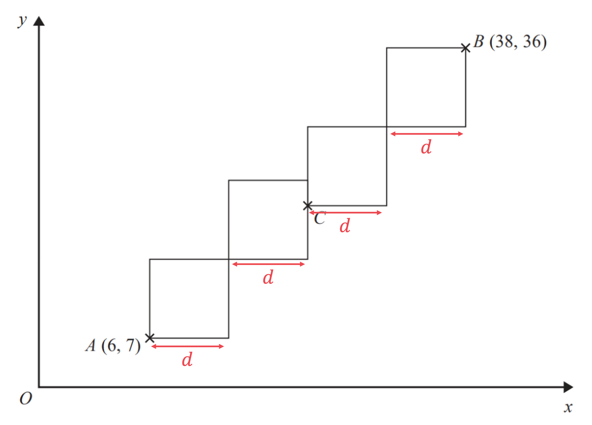

> *We can see that the gap between the **x** coordinates of **A** and **B** is *$4d$*. We can use this and the **x**-coordinates of **A **and **B **to form an equation*

$4d=38-6\,4d=32$

**[1]**

> *Divide both sides of the equation by 4 to find *$d$

$d=8$

**[1]**

> *Add two *$d$*s to the **x** coordinate of **A** (or subtract two *$d$*s from the **x** coordinate of **B**) to find the **x** coordinate of **C*

$x=6+2\times8$

**[1]**

$=22$

> *As we know that the width and heights of the squares are equal, we can also subtract two *$d$*s from the **y** coordinate of **B** to find the **y** coordinate of **C*

$y=36-2\times8$

**[1]**

$=20$

> *Write the final answer as a coordinate point*

$(22,20)$ **[1]**

## Q12 — medium — 2 marks · exam-questions

### 17() — 2 marks
> *Draw and label **A**, **M** and **B** on a line, ignoring their orientation in relation to each other *
*Consider how to go from the *$x,y$* and *$z$* coordinates of **A** to the corresponding coordinates of **M*

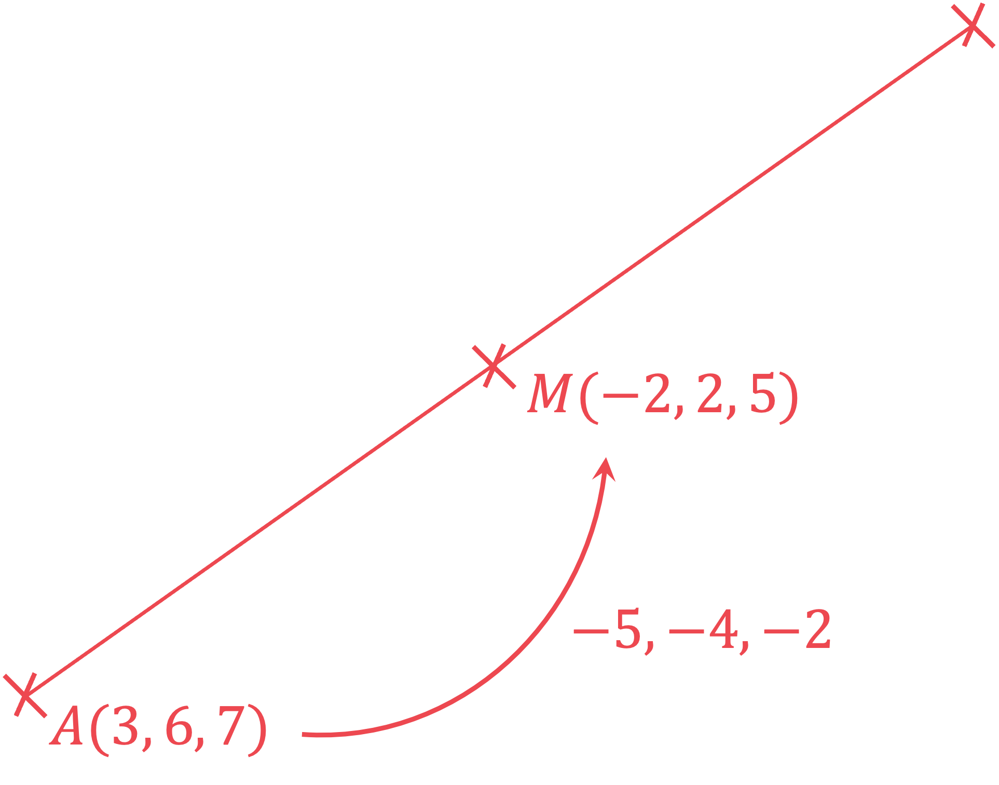

> *To go from the *$x,y$* and  *$z$* coordinates of **A** to the corresponding coordinates of **M, **we subtract 5, subtract 4 and subtract 2 respectively *
*So subtract 5, subtract 4 and subtract 2 from the *$x,y,z$* from the coordinates of **M*

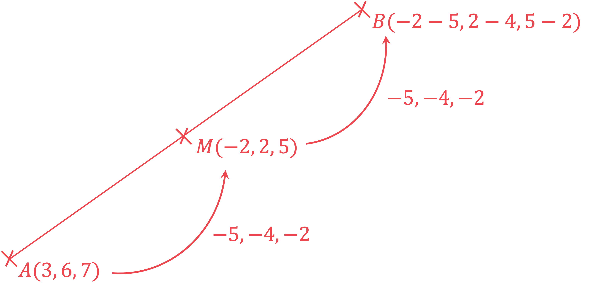

**Suitable method to find differences and subtract from M ****[1]**

**Answer = **$(-7,-2,3)$** ****[1]**

## Q13 — easy — 3 marks · exam-questions

### 1((a)) — 2 marks
*The midpoint of two coordinates can be thought of as the average (mean) of the two points.*

> *We can find the mean of the x-coordinates using *$\frac{x_{1}+x_{2}}{2}$* and find the mean of the y-coordinates using *$\frac{y_{1}+y_{2}}{2}$*.*

*Midpoint =* `open parentheses fraction numerator 5 space plus space 13 over denominator 2 end fraction space comma space fraction numerator negative 4 space plus space 1 over denominator 2 end fraction close parentheses`

**[1]**

**Midpoint = **$(9,-1.5)$** ****[1]**

### 1((b)) — 1 marks
> *When in the form **y** = **mx** + **c**,  **L** has gradient **m. *

> *Rearrange the equation given for **L **to the form **y** = **mx** + **c  **to determine its gradient. *

$y=-3x+2$

**m = -3**** [1]**

## Q14 — hard — 3 marks · exam-questions

### 25() — 3 marks
> *Two straight lines will always intersect unless they are parallel Parallel lines have the same gradients so find the gradient of both lines*

> *We can find the gradient of Line **A** ** by rearranging into the form *$y=mx+c$

`table row cell 2 y end cell equals cell 3 x plus 8 end cell row y equals cell 3 over 2 x plus 4 end cell end table`

> *Therefore Line **A** has a gradient of *$\frac{3}{2}$

**[1]**

> *Next we can find the gradient of Line **B**, using the gradient formula *$\frac{y_{1}-y_{2}}{x_{1}-x_{2}}$*, taking *`open parentheses negative 1 comma space 2 close parentheses`* **as *`open parentheses x subscript 1 comma space y subscript 1 close parentheses`* and *`open parentheses 2 comma space 8 close parentheses`* as *`open parentheses x subscript 2 comma space y subscript 2 close parentheses`

$\frac{2-8}{-1-2}=\frac{-6}{-3}=2$

> *Therefore Line **B** has a gradient of 2, which is not the same gradient as line **A*

**Line A and Line B must intersect as they are not parallel ****[1]**

**It is possible to answer this question by working out the equation of Lines A and B in the form **$y=mx+c$** and then equating them to see if there is a solution. But the method presented here is much more efficient!**

## Q15 — medium — 2 marks · exam-questions

### 19() — 2 marks
> *First we need to find **P.** Using the diagram we can see that *

`P equals open parentheses 6 comma space 4 comma space 3 close parentheses`

**[1]**

> *"**T** divided the line **OP** in the ratio 1:2" means that **T** is one third of the way from **O** to **P *

> *So multiply each of the coordinates by one third*

`P equals open parentheses 1 third cross times 6 comma space 1 third cross times 4 comma space 1 third cross times 3 close parentheses`

$(2,\frac{4}{3},1)$* ***[1]**

## Q16 — easy — 2 marks · exam-questions

### 16() — 2 marks
> *When in the form **y** = **mx** + **c**, a straight line has gradient **m.*

*Rearrange the equation given for the line to the form **y** = **mx** + **c  **to determine its gradient. *

> *Start by subtracting *$5x$* from both sides.*

$2y=-5x+7$

**[1]**

> *Divide both sides by 2.*

$y=\frac{-5}{2}x+\frac{7}{2}$

> *The gradient is the coefficient of **x.*

**m = -2.5 **** [1]**

## Q17 — hard — 7 marks · exam-questions

### 18() — 4 marks
> *Sketching a quick diagram may help to see the connection between the coordinates.*

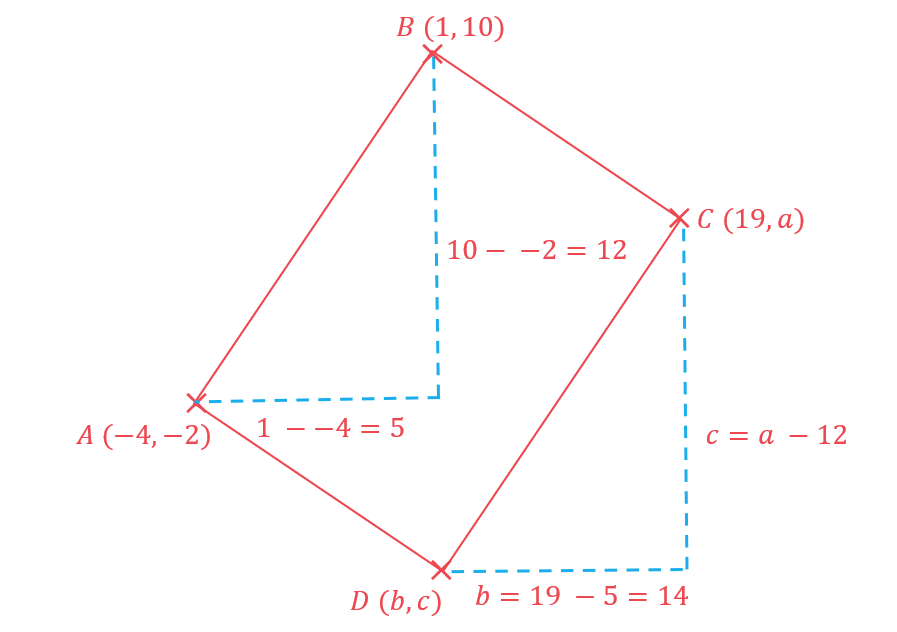

> *Considering the **x**- coordinates, the value of **b** can be found by subtracting the difference of the **x** coordinates of **A **and **B **from the **x-**coordinate of **C.*

`b equals space 19 space minus space open parentheses 1 minus open parentheses negative 4 close parentheses close parentheses space equals space 19 space minus space 5 space equals space 14`

**[1]**

> *To find the values of **a **and **c**, we will first need to find the gradient of the line connecting **AD. **This will be perpendicular to the gradient of the line connecting **A **and **B.*

$m_{AB}=\frac{10--2}{1--4}=\frac{12}{5}$

> *The gradients of perpendicular lines are negative reciprocals.*

$m_{AD}=m_{BC}=-\frac{1}{\frac{12}{5}}=-\frac{5}{12}$

**[1]**

> *Substitute the coordinates of **B **and **C **into the formula for the gradient of **BC.** *

$m_{BC}=\frac{10-a}{1-19}=-\frac{5}{12}$

**[1]**

> *Solve to find **a.*

`table row cell fraction numerator 10 minus space a over denominator negative 18 end fraction space end cell equals cell space minus 5 over 12 end cell row cell 10 space minus space a space end cell equals cell space 15 over 2 end cell row cell a space end cell equals cell space 10 space minus 15 over 2 space equals space 2.5 end cell end table`

> *Substitute into **c **=** a **- 12, using the difference in the **y**- coordinates on the diagram.*

`table row cell c space end cell equals cell space a space minus space 12 space equals space 2.5 space minus space 12 space equals space minus 9.5 end cell end table`

$a=2.5,b=14,c=-9.5$* ***[1]**

### 18((b)) — 3 marks
> *The perimeter of a rectangle is 2(length + width). Find the length of **AB **and **AD** using the formula for the length of a line.*

> *The formula for the length between the points (**x**1**, **y**1**) and (**x**2**, **y**2**) is *`square root of open parentheses x subscript 2 minus x subscript 1 close parentheses squared plus open parentheses y subscript 2 minus y subscript 1 close parentheses squared end root`*.*

> *For **AB **use the formula with the points (-4, -2) and (1, 10). Use brackets around negatives.*

`A B equals square root of open parentheses 1 minus open parentheses negative 4 close parentheses close parentheses squared plus open parentheses open parentheses 10 close parentheses minus open parentheses negative 2 close parentheses close parentheses squared end root`

**Correct expression**** [1]**

> *You could simplify before typing it into your calculator or just type it straight in.*

$AB=\sqrt{5^{2}+12^{2}}=\sqrt{25+144}=\sqrt{169}=13$

> *For **BC **use the formula with the points (1, 10) and (19, 2.5). *

`B C equals square root of open parentheses 19 minus 1 close parentheses squared plus open parentheses 2.5 minus 10 close parentheses squared end root`

**Correct expression**** [1]**

> *You could simplify before typing it into your calculator or just type it straight in.*

`B C equals square root of 18 squared space plus space open parentheses negative 7.5 close parentheses squared end root space equals space square root of 324 space plus space 56.25 end root space equals space square root of 380.25 end root space equals space 19.5`

> *Find the perimeter using 2(length + width).*

`Perimeter space equals 2 open parentheses 13 plus 19.5 close parentheses space equals space 2 space cross times space 32.5 space equals space 65`

**65 cm ****[1]**

## Q18 — medium — 3 marks · exam-questions

### 12() — 3 marks
*It's a good idea to start by sketching a diagram. Remember it doesn't have to be to scale* 
*We can see clearly from the sketch that to go from the **x** coordinate of **A** to the **x** coordinate of **B, **we add 2 units.*

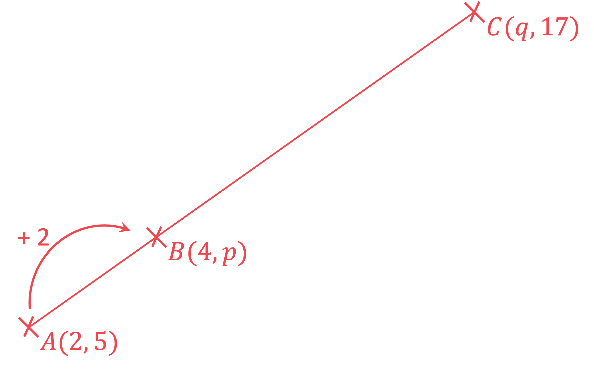

> *As **AC = **4**AB**, we need to multiply the distance travelled from **A **by 4. So the distance from **A** to **C** is now 8*

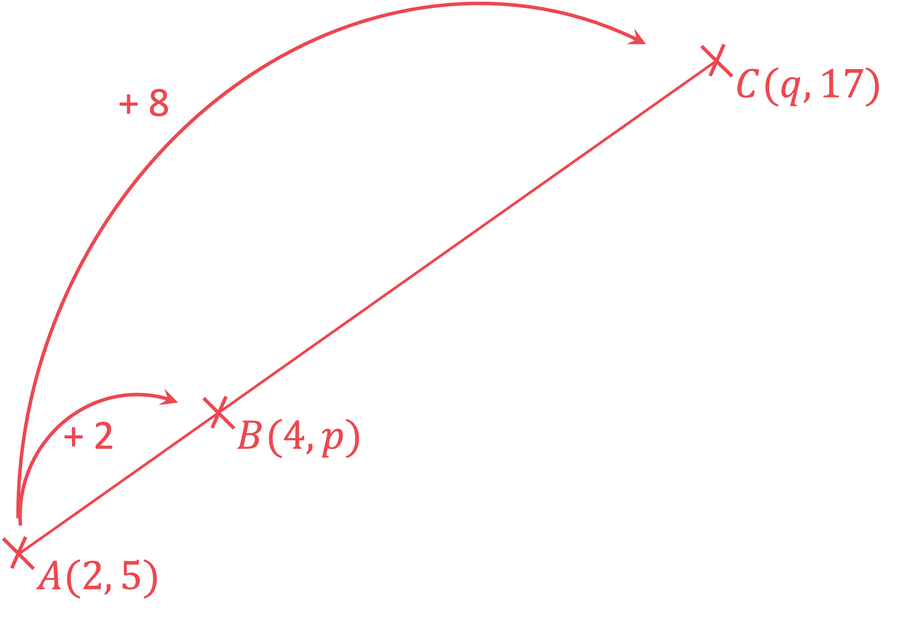

**similar method for q or p ****[1]**

> *To find **q** we add 8 to the **x** coordinate of **B*

$q=2+8$

$q=10$** [1]**

*Use the same approach for the **y** coordinate, but this time we look at the distance from **A** to **C** and then divide it by 4*

> *The distance from **A** to **C** is 12, so the distance from **A **to **B** must be 3*

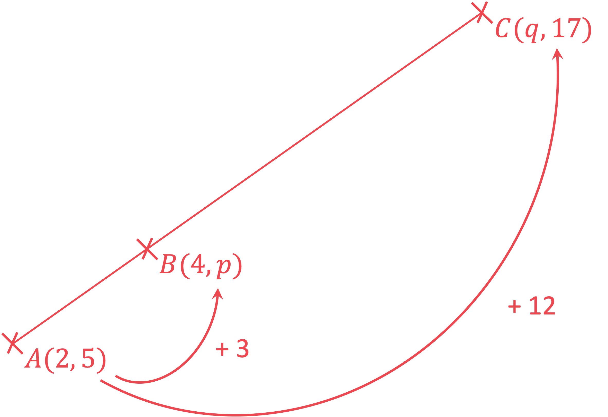

> *To find **p** we add 3 to the **y** coordinate of **A*

$p=5+3$

$p=8$* ***[1]**

## Q19 — easy — 1 marks · exam-questions

### 3() — 1 marks
> *Use the midpoint formula, *`open parentheses fraction numerator x subscript 1 plus x subscript 2 over denominator 2 end fraction space comma space fraction numerator y subscript 1 plus y subscript 2 over denominator 2 end fraction close parentheses`*.*

`table row M equals cell open parentheses fraction numerator 2 plus 10 over denominator 2 end fraction space comma space fraction numerator 13 plus 1 over denominator 2 end fraction close parentheses end cell row blank equals cell open parentheses 12 over 2 space comma space 14 over 2 close parentheses end cell end table`

> *Simplify.*

**The answer is the third option **$(6,7)$**[1]**

## Q20 — hard — 4 marks · exam-questions

### 28() — 4 marks
> *Let **P ** have the coordinates **x **and **y.*

> *Form an equation in terms of **x **and **y **for the gradient of **P, **using the formula for the gradient, *$\text{gradient}=\frac{\text{change in}y}{\text{change in}x}=\frac{y_{2}-y_{1}}{x_{2}-x_{1}}$*.*

$2=\frac{y-(0)}{x-0}=\frac{y}{x}$

> *Rearrange to find an expression for **y **in terms of **x.*

$y=2x$

** [1]**

> *Substitute into the formula for the length of a line segment, *`d equals square root of open parentheses x subscript 2 minus x subscript 1 close parentheses squared plus open parentheses y subscript 2 minus y subscript 1 close parentheses squared end root.`

`table row cell square root of open parentheses x minus 0 close parentheses squared plus open parentheses 2 x minus 0 close parentheses squared end root space end cell equals cell square root of 2645 space end cell row cell open parentheses x close parentheses squared plus open parentheses 2 x close parentheses squared space end cell equals cell 2645 space end cell end table`

**[1]**

> *Simplify.*

`table row cell x squared space plus space 4 x squared space end cell equals cell 2645 space end cell row cell 5 x squared space end cell equals cell 2645 space end cell end table`

> *Divide both sides by 5.*

`table row cell x squared space end cell equals cell 2645 over 5 space equals space 529 end cell end table`

**[1]**

> *Square root both sides to find **x**.*

`table row cell x space end cell equals cell space 23 end cell end table`

> *Substitute in to the original equation to find **y.*

`table row cell y space end cell equals cell space 2 x space equals 2 open parentheses 23 close parentheses space equals space 46 end cell end table`

$P(23,46)$ **[1]**

## Q21 — medium — 3 marks · exam-questions

### 16() — 3 marks
> *A right angle is made up of two lines that are perpendicular to each other. Perpendicular lines have gradients that multiply to -1.*

> *Find the gradient of each line separately using the gradient formula *$\frac{y_{2}-y_{1}}{x_{2}-x_{1}}.$

> *Substitute the values of **P **and **Q** into the gradient formula to find the gradient of **PQ**.*

$m_{PQ}=\frac{8-14}{6-2}=\frac{-6}{4}=-\frac{3}{2}$

**[1]**

> *Substitute the values of **Q **and **R** into the gradient formula.*

$m_{QR}=\frac{5-8}{2-6}=\frac{-3}{-4}=\frac{3}{4}$

**[1]**

> *Multiply the gradients together to see if the answer is -1.*

$m_{PQ}\timesm_{QR}=-\frac{3}{2}\times\frac{3}{4}=-\frac{9}{8}$

**Angle ****PQR ****is not a right angle as the product of their gradient = **$-\frac{9}{8}$** ****[1]**

## Q22 — easy — 1 marks · exam-questions

### 2() — 1 marks
> *Use the midpoint formula, *`open parentheses fraction numerator x subscript 1 plus x subscript 2 over denominator 2 end fraction space comma space fraction numerator y subscript 1 plus y subscript 2 over denominator 2 end fraction close parentheses`*.*

`M equals open parentheses fraction numerator 4 plus open parentheses negative 2 close parentheses over denominator 2 end fraction space comma space fraction numerator 9 plus 1 over denominator 2 end fraction close parentheses`

> *Simplify by hand.*

**The answer is the first option **$(1,5)$**[1]**

## Q23 — hard — 5 marks · exam-questions

### 7() — 5 marks
> *For demonstration purposes, we will add the points E, F and G to the diagram below.*

> *As AC is parallel to the **x**-axis, we know that the **y**-coordinate of G is 9, the same as A. And as BG and AC are perpendicular, BG is parallel to the **y**-axis so the **x**-coordinate of G is 17, the same as B:*

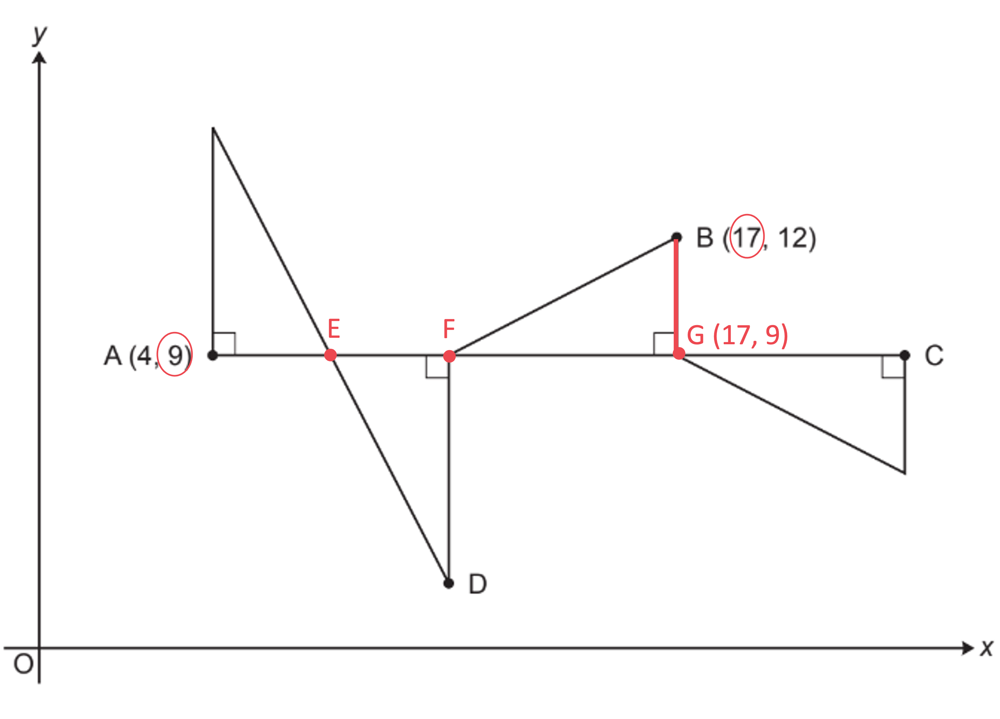

> *We can see that the length of BG is the difference between the **y**-coordinates of B and G*

$\mathrm{BG}=12-9=3$

> *And BG = AE = EF because all the triangles are congruent. If we like we can add these lengths to the diagram. *

> *We also know that AG is the difference between the **x**-coordinates of A and G.*

$\mathrm{AG}=17-4=13$

> * And (from the diagram):*

`table row 13 equals cell 3 plus 3 plus FG space end cell end table`

> *We can use this to find FG.*

`table row 13 equals cell 6 plus FG space end cell row FG equals 7 end table`

**[1]**

> *FG = DF = GC because all the triangles are congruent. If we like we can add these lengths to the diagram. *

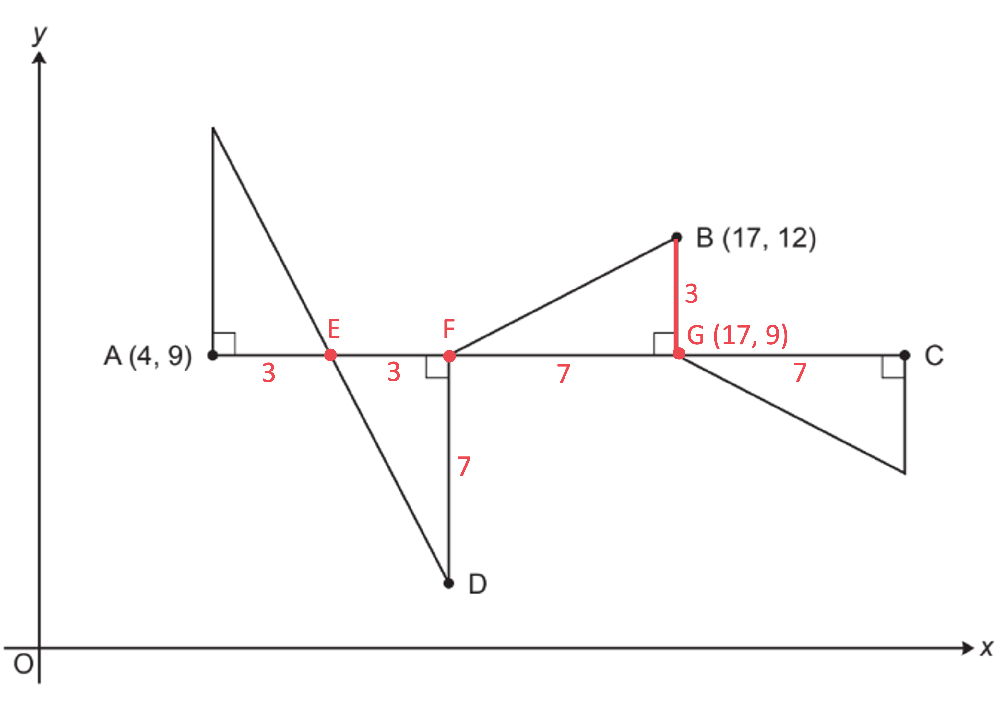

> *Now we can find the coordinates of C and D by starting at A(4, 9) and adding or subtracting the horizontal and vertical lengths found.*

> *C has the same **y-**coordinate as A but we need to add 3 + 3 + 3 + 7 to the **x**-coordinate. *

`table row straight C equals cell open parentheses open square brackets 4 plus 3 plus 3 plus 7 plus 7 close square brackets comma space 9 close parentheses end cell row blank equals cell open parentheses 24 comma space 9 close parentheses end cell end table`

**Final answer:** $C=(24,9)$** **

**correct x-coordinate**** [1] **
**correct y-coordinate**** [1]**

> *For D, we need to add 3 + 3 to the **x**-coordinate of A and subtract 7 from the **y**-coordinate*

`table row straight D equals cell open parentheses open square brackets 4 plus 3 plus 3 close square brackets comma space open square brackets 9 minus 7 close square brackets close parentheses end cell row blank equals cell open parentheses 10 comma space 2 close parentheses end cell end table`

**Final answer:** $D=(10,2)$** **

**correct x-coordinate**** [1] **
**correct y-coordinate**** [1]**

## Q24 — medium — 3 marks · exam-questions

### 7() — 3 marks
> *AB** = **BC **so **B **is the midpoint of the coordinates **A **and **C. *

> *Use the midpoint formula, *`open parentheses fraction numerator x subscript 1 plus x subscript 2 over denominator 2 end fraction space comma space fraction numerator y subscript 1 plus y subscript 2 over denominator 2 end fraction close parentheses`*, substitute the coordinates for **A** into the formula and let **B** be *`open parentheses x comma space y close parentheses`*. *

> *Set the formula equal to the coordinates given for **B.*

`open parentheses 6 comma space 5 close parentheses equals open parentheses fraction numerator 0 space plus space x over denominator 2 end fraction comma space fraction numerator 2 space plus space y over denominator 2 end fraction close parentheses`

> *Now separate the *$x$* part of the formula from the *$y$* part.*

$6=\frac{0+x}{2}\mathrm{and}5=\frac{2+y}{2}$

> *Solve the *$x$* part, starting by multiplying both sides by the denominator to clear the fraction*

`table row cell 12 space end cell equals cell space 0 space plus space x end cell row cell x space end cell equals cell space 12 end cell end table`

**Correct x or y coordinate**** [1]**

> *Solve the *$y$* part, starting by multiplying both sides by the denominator to clear the fraction*

`table row cell 10 space end cell equals cell space 2 space plus space y end cell row cell y space end cell equals cell space 8 end cell end table`

> *So the coordinates of **C** are (12, 8)*

**Correct coordinates for C**** [1]**

> *BC** = **CD **so **C **is the midpoint of the coordinates **B **and **D. *

> *Use the midpoint formula, *`open parentheses fraction numerator x subscript 1 plus x subscript 2 over denominator 2 end fraction space comma space fraction numerator y subscript 1 plus y subscript 2 over denominator 2 end fraction close parentheses`*, substitute the coordinates for **B** into the formula and let **D** be *`open parentheses x comma space y close parentheses`*.*

> * Set the formula equal to the coordinates found for **C.*

`open parentheses 12 comma space 8 close parentheses equals open parentheses fraction numerator 6 space plus space x over denominator 2 end fraction comma space fraction numerator 5 space plus space y over denominator 2 end fraction close parentheses`

> *Now separate the *$x$* part of the formula from the *$y$* part.*

$12=\frac{6+x}{2}\mathrm{and}8=\frac{5+y}{2}$

> *Solve the *$x$* part, starting by multiplying both sides by the denominator to clear the fraction*

`table row cell 24 space end cell equals cell space 6 space plus space x end cell row cell x space end cell equals cell space 18 end cell end table`

> *Solve the *$y$* part, starting by multiplying both sides by the denominator to clear the fraction*

`table row cell 16 space end cell equals cell space 5 space plus space y end cell row cell y space end cell equals cell space 11 end cell end table`

**The coordinates for D = (18, 11) ****[1]**

## Q25 — easy — 1 marks · exam-questions

### 3() — 1 marks
> *Substitute the *`open parentheses x comma space y close parentheses`* values into the equation *$y=x^{3}$*, check each coordinate to see if the *$y$* coordinate is the *$x$* coordinate cubed.*

> *Option 1 cannot be the correct answer as:*

`open parentheses negative 1 half close parentheses cubed space equals space minus 1 over 8`

> *Option 2 cannot be the correct answer as:*

`open parentheses 5 close parentheses cubed space equals space 125`

> *Option 4 cannot be the correct answer as:*

`open parentheses negative 1 close parentheses cubed space equals space minus 1`

> *Option 3 must be the correct answer as:*

`open parentheses 1 third close parentheses cubed space equals space 1 over 27 space not equal to space 1 over 9`

** The correct answer is option 3, **$(\frac{1}{3},\frac{1}{9})$ **[1]**

## Q26 — hard — 3 marks · exam-questions

### 14() — 3 marks
> *If *$r=p+2$* and *$s=q+4$* then we can rewrite *`open parentheses r comma space s close parentheses`* in terms of *$p$* and *$q$*.*

`open parentheses r comma space s close parentheses equals open parentheses p plus 2 comma space q plus 4 close parentheses`

> *Now we can substitute into the gradient formula *$\frac{y_{1}-y_{2}}{x_{1}-x_{2}}$*, taking *`open parentheses p plus 2 comma space q plus 4 close parentheses`* **as *`open parentheses x subscript 1 comma space y subscript 1 close parentheses`* and *`open parentheses p comma space q close parentheses`* as *`open parentheses x subscript 2 comma space y subscript 2 close parentheses`*.*

$m=\frac{q+4-q}{p+2-p}$

**[1]**

> *Collecting like terms cancels out the *$p$*s and *$q$*s in the denominator and numerator so that;*

$m=\frac{4}{2}$

**[1]**

> *Simplify *$\frac{4}{2}$* to 2.*

**The gradient of the line is 2 ****[1]**

## Q27 — medium — 4 marks · exam-questions

### 17((a)) — 2 marks
> *As you are given two coordinate points rather than a diagram, it's best to use the gradient formula *$\frac{y_{2}-y_{1}}{x_{2}-x_{1}}.$

> *Substitute the values into the gradient formula, make sure that you use the corresponding **x **and **y **coordinates when substituting into the formula.*

`m space equals space fraction numerator open parentheses negative 5 close parentheses space minus space open parentheses negative 9 close parentheses over denominator 2 space minus space 4 end fraction`

**[1]**

> *Take care with the negative numbers, put them in brackets if using your calculator.*

$m=\frac{-5+9}{-2}=\frac{4}{-2}$

**The gradient = **$-2$** ****[1] **

**Working must be shown clearly**

### 17((b)) — 2 marks
> *Method 1*

> *Use the gradient given in part (a) and one of the coordinates **A **or **B  **to see if the gradient is still the same.*

> *Substitute the coordinates of **A **and **C **into the formula for the gradient.*

`m subscript A C end subscript space equals space fraction numerator 601 minus open parentheses negative 5 close parentheses over denominator negative 301 minus 2 end fraction`

**[1]**

> *Take care with the negative numbers, put them in brackets if using a calculator.*

$m_{AC}=\frac{606}{-303}=-2$

**Yes, ****C**** lies on the line passing through ****A ****and ****B**** ****[1]**

> *Method 2*

> *Use the gradient given in part (a) and one of the coordinates **A **or **B  **to find the equation of the line passing through **AB**.*

> *Substitute the gradient and the coordinates of **A **into the** **formula for the equation of a straight line **y **= **mx **+ **c**.*

`table row cell y space end cell equals cell space minus 2 x space plus space c end cell row cell open parentheses negative 5 close parentheses space end cell equals cell space open parentheses negative 2 close parentheses open parentheses 2 close parentheses space plus space c end cell end table`

> *Rearrange to find the value of **c**.*

`table row cell negative 5 space end cell equals cell space minus 4 space plus space c end cell row cell c space end cell equals cell space minus 1 end cell end table`

**[1]**

> *Substitute the coordinates of **C **into the equation found.*

`table row cell y space end cell equals cell space minus 2 x space minus space 1 end cell row cell open parentheses 601 close parentheses space end cell equals cell space minus 2 open parentheses negative 301 close parentheses space minus space 1 end cell row cell 601 space end cell equals cell space 602 space minus space 1 end cell end table`

**Yes, ****C**** lies on the line passing through ****A ****and ****B**** ****[1]**

## Q28 — easy — 1 marks · exam-questions

### 3() — 1 marks
> *Use the midpoint formula, *`open parentheses fraction numerator x subscript 1 plus x subscript 2 over denominator 2 end fraction space comma space fraction numerator y subscript 1 plus y subscript 2 over denominator 2 end fraction close parentheses`*.*

`M equals open parentheses fraction numerator 2 plus 8 over denominator 2 end fraction space comma space fraction numerator 12 plus 2 over denominator 2 end fraction close parentheses`

> *Simplify by hand or use your calculators to find the midpoint coordinates.*

**The answer is the third option **$(5,7)$**[1]**

## Q29 — medium — 2 marks · exam-questions

### 21() — 2 marks
> *The formula for the area of a triangle is *$A=\frac{1}{2}bh$* where *$b$* is the base and *$h$* is the height.*

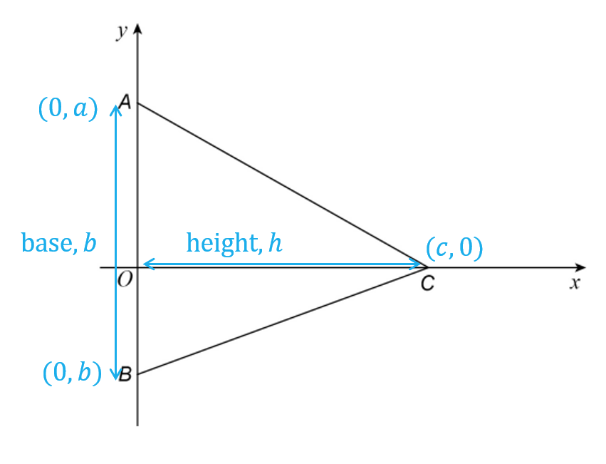

> *To find the distance apart the coordinates should be, set the formula equal to 28 square units and solve to find the product of the base and the height. *

`table row cell 1 half b h space end cell equals cell space 28 end cell row cell b h space end cell equals cell space 56 end cell end table`

**[1]**

> *Choose coordinates such that the distance from (0, 0) to (**c, **0) multiplied by the distance from (0, **a**) to (0, **b**) equals 56.*

> *Find a factor pair of 56 that is easy to work with, for example 7 and 8.*

> *Choosing the height to be 7, then **c **= 7 and the distance from (0, **a**) to (0, **b**) needs to be 8, with **a **positive and **b **negative. Choosing **a **= 5 and the distance from (0, **a**) to (0, **b**) needs to be 8, with **a **positive and **b **negative, so **b **will be -3.*

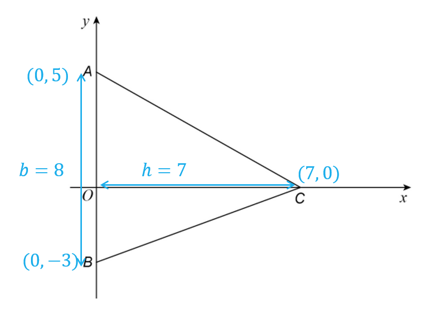

**Final answer:** $A(0,5)\,B(0,-3)\,C(7,0)$**  **

**Any correct coordinates that give an area of 28** **[1]**

## Q30 — easy — 2 marks · exam-questions

### 12() — 2 marks
> *As you are given two coordinate points rather than a diagram, it's best to use the gradient formula *$\frac{y_{2}-y_{1}}{x_{2}-x_{1}}.$

> *Substitute the values into the gradient formula.*

`m space equals space fraction numerator 9 minus open parentheses 3 close parentheses over denominator 1 minus open parentheses negative 2 close parentheses end fraction`

> *Take care with the negative numbers, use your calculator to help you.*

$m=\frac{6}{3}$

**The gradient = **$2$** ****[1]**

## Q31 — easy — 2 marks · exam-questions

### 12((a)) — 1 marks
> *Choose two coordinate points that are easy to work with and draw a right angled triangle onto the diagram.*

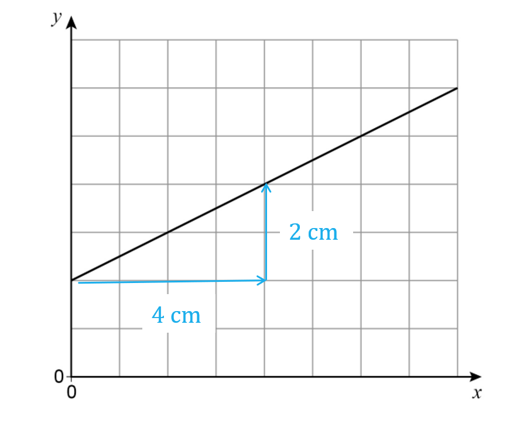

> *The gradient is the difference in **y **divided by the difference in **x**.*

$m=\frac{2}{4}=\frac{1}{2}$

**Gradient = **$\frac{1}{2}$** ****[1]**

### 12((b)) — 1 marks
> *If the scale changes on both axis then there will be no difference in the fraction, so the gradient will stay the same.*

**The answer to part (a) stays the same ****[1]**

> * *
