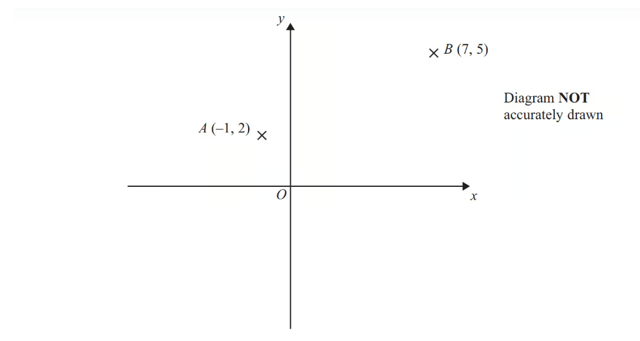
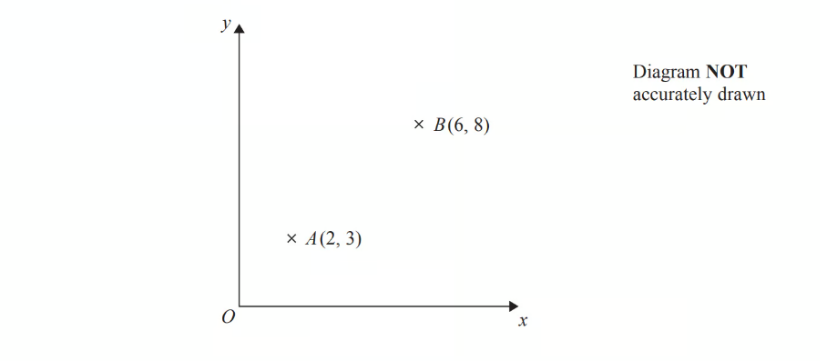
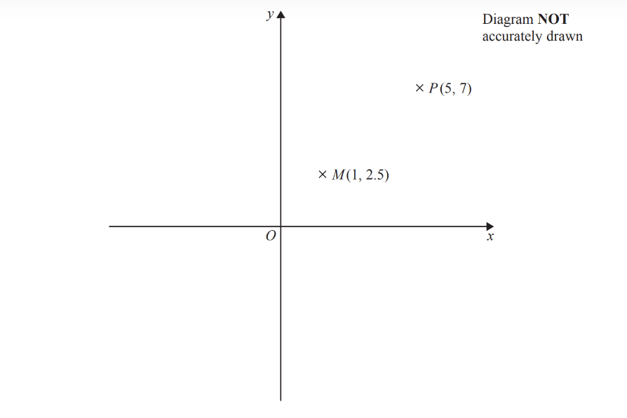
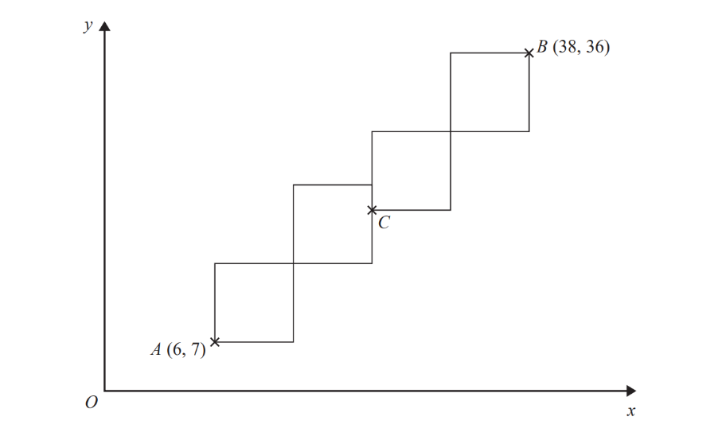
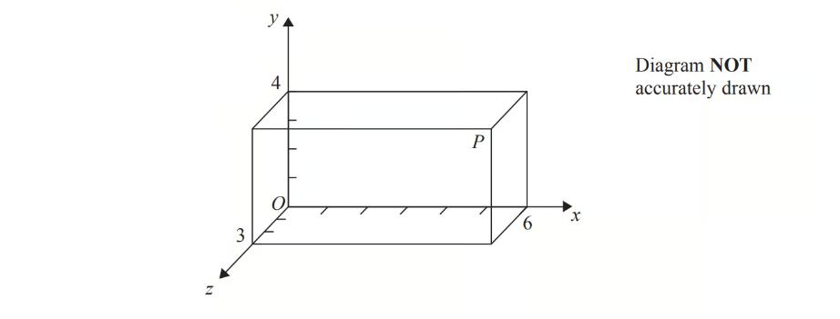
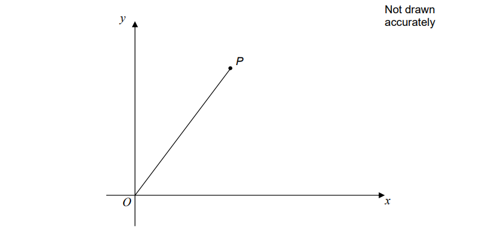
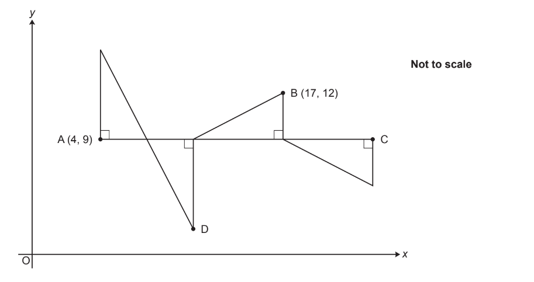
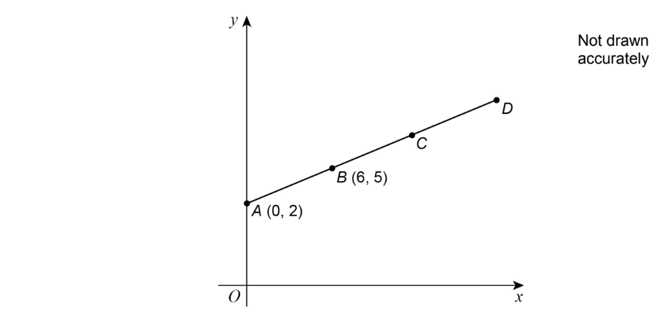
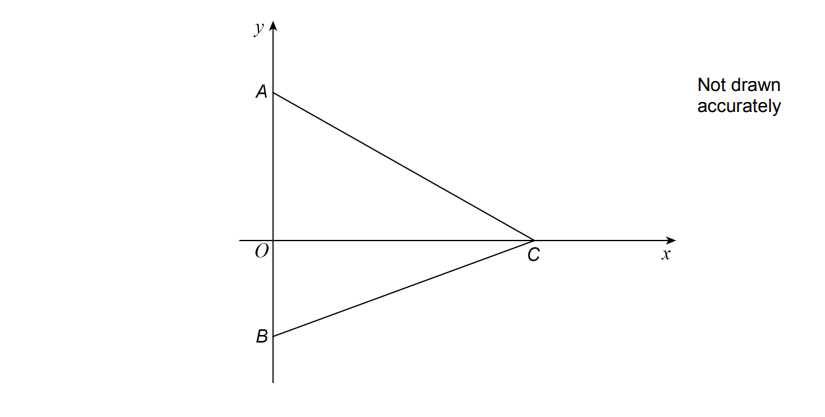
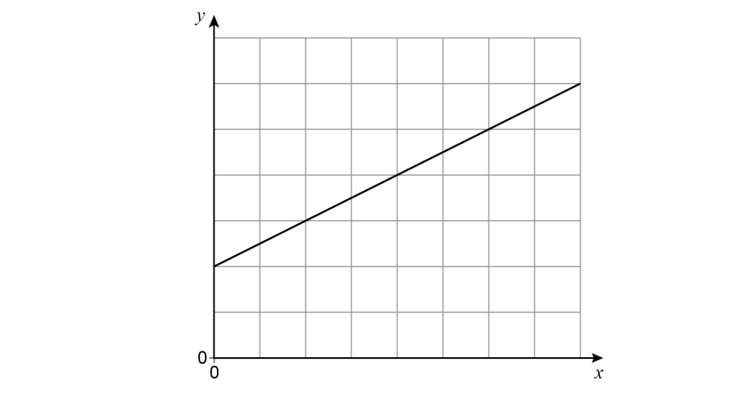

# Exam Questions — Coordinate Geometry
**Graphs & Coordinates** · Edexcel IGCSE Maths A (Modular) (4XMAF/4XMAH) — 24/Higher Unit 1
> Source: [https://www.savemyexams.com/igcse/maths/edexcel/a-modular/24/higher-unit-1/topic-questions/graphs-and-coordinates/coordinate-geometry/exam-questions/](https://www.savemyexams.com/igcse/maths/edexcel/a-modular/24/higher-unit-1/topic-questions/graphs-and-coordinates/coordinate-geometry/exam-questions/) · 31 questions · total 91 marks

## Q1 — very_hard — 6 marks · exam-questions

### 22() — 6 marks — command: find — structured — from paper Jan 2020 · 4MA1/1H
Triangle $HJK$ is isosceles with $HJ=HK$ and $JK=\sqrt{80}$

$H$ is the point with coordinates $(-4,1)$ 
$J$ is the point with coordinates $(j,15)$ where $j<0$ 
$K$ is the point with coordinates $(6,k)$

$M$is the midpoint of $JK$. 
The gradient of $HM$ is 2

Find the value of $j$and the value of $k$.

## Q2 — hard — 5 marks · exam-questions

### 15((a)) — 2 marks — command: find — structured — from paper 2015	June · 1MA0/1H
$A$ and $B$are two points.

Point $A$ has coordinates (—2, 4).
Point $B$ has coordinates (8, 9).

$C$ is the midpoint of the line segment $AB$.

Find the coordinates of $C$.

### 15((b)) — 3 marks — command: show — structured — from paper 2015	June · 1MA0/1H
$D$ is the point with coordinates (100, 56).

Does point $D$ lie on the straight line that passes through $A$ and $B$?
 You must show how you work out your answer.

## Q3 — medium — 4 marks · exam-questions

### 13((b)) — 2 marks — command: find — structured — from paper 2013	June · 1MA0/2H

$A$ is the point (—1, 2) 
$B$ is the point (7, 5)

Find the coordinates of the midpoint of $AB$.

### 13((b)) — 2 marks — command: find — structured — from paper 2013	June · 1MA0/2H
$P$ is the point (—4, 4) 
$Q$ is the point (1, —5)

Find the gradient of $PQ$.

## Q4 — easy — 2 marks · exam-questions

### 1() — 2 marks — command: find — structured — from paper 2014	June · 1MA0/2H
The point $A$ has coordinates (2, 3). 
The point $B$ has coordinates (6, 8).

$M$ is the midpoint of the line $AB$. 
Find the coordinates of $M$.

## Q5 — hard — 3 marks · exam-questions

### 11() — 3 marks — command: work_out — structured — from paper 2017	June · 1MA0/1H
$Q,R$ and $S$ are points on a grid.

$Q$ is the point with coordinates (106, 103) 
$R$ is the point with coordinates (106, 105) 
$S$ is the point with coordinates (104, 105.5)

$P$ and $A$ are two other points on the grid such that

$R$ is the midpoint of $PQ$  
  $S$ is the midpoint of $PA$

Work out the coordinates of the point $A$.

## Q6 — medium — 2 marks · exam-questions

### 10() — 2 marks — command: find — structured — from paper 2016	June · 1MA0/1H

Point $P$ has coordinates (5, 7). 
Point $M$ has coordinates (1, 2.5).

Point $M$ is the midpoint of the line $PQ$.

Find the coordinates of point $Q$.

## Q7 — easy — 2 marks · exam-questions

### 10((a)) — 2 marks — command: find — structured — from paper Jan 2022 · 4MA1/1H
The straight line $L$ has equation $2y+7x=10$

Find the gradient of $L$

## Q8 — hard — 4 marks · exam-questions

### 19() — 4 marks — command: prove — structured — from paper 2017	November · 1MA1/2H
A triangle has vertices $P,Q$ and $R$.

The coordinates of $P$ are (—3, —6)
 The coordinates of $Q$ are (1, 4) 
The coordinates of $R$ are (5, —2)

$M$ is the midpoint of $PQ$.
 $N$ is the midpoint of $QR$.

Prove that $MN$ is parallel to $PR$. 
You must show each stage of your working.

## Q9 — medium — 2 marks · exam-questions

### 6() — 2 marks — command: find — structured — from paper Nov 2020 · 4MA1/1HR
Point $A$ has coordinates $(--3,11)$ 
Point $B$ has coordinates $(47,b)$ 
The midpoint of $AB$ has coordinates $(a,--19)$

Find the value of $a$ and the value of $b$.

a = ................................................

b = ................................................

## Q10 — easy — 2 marks · exam-questions

### 13((a)) — 2 marks — command: work_out — structured — from paper Jan 2021 · 4MA1/1H
Point $A$ has coordinates (5, 8) 
Point $B$ has coordinates (9, –4)

Work out the gradient of $AB$.

## Q11 — hard — 5 marks · exam-questions

### 6() — 5 marks — command: work_out — structured — from paper 2018	June · 1MA1/1H
A pattern is made from four identical squares.

The sides of the squares are parallel to the axes.

Point $A$ has coordinates (6, 7) 
Point $B$ has coordinates (38, 36) 
Point $C$ is marked on the diagram.

Work out the coordinates of $C$.

## Q12 — medium — 2 marks · exam-questions

### 17() — 2 marks — command: find — structured — from paper 2013	November · 1MA0/1H
*AB* is a line segment.

*A* is the point with coordinates (3, 6, 7). 
The midpoint of *AB* has coordinates (−2, 2, 5).

Find the coordinates of* B.*

## Q13 — easy — 3 marks · exam-questions

### 1((a)) — 2 marks — command: work_out — structured — from paper Jan 2020 · 4MA1/1H
The point* *$A$ has coordinates (5, −4) 
The point $B$ has coordinates (13, 1)

Work out the coordinates of the midpoint of $AB$.

### 1((b)) — 1 mark — command: write — structured — from paper Jan 2020 · 4MA1/1H
Line $L$ has equation $y=2-3x$

Write down the gradient of line $L$.

## Q14 — hard — 3 marks · exam-questions

### 25() — 3 marks — command: show — structured — from paper 2013	November · 1MA0/2H
$A$ and $B$ are straight lines.

Line $A$ has equation $2y=3x+8$ 
Line $B$ goes through the points $(---1,2)$ and $(2,8)$

Do lines $A$ and $B$ intersect? 
You must show all your working.

## Q15 — medium — 2 marks · exam-questions

### 19() — 2 marks — command: find — structured — from paper 2014	June · 1MA0/2H
Here is a cuboid drawn on a 3-D grid.

$P$ is a vertex of the cuboid.

$T$ divides the line $OP$ in the ratio 1 : 2

Find the coordinates of $T$.

## Q16 — easy — 2 marks · exam-questions

### 16() — 2 marks — command: find — structured — from paper Nov 2020 · 4MA1/2HR
Find the gradient of the straight line with equation $5x+2y=7$

## Q17 — hard — 7 marks · exam-questions

### 18() — 4 marks — command: work_out — structured — from paper Jan 2021 · 4MA1/2H
A rectangle $ABCD$ is to be drawn on a centimetre grid such that

$A$ has coordinates (–4, –2)
 $B$ has coordinates (1, 10) 
$C$ has coordinates (19, $a$) 
$D$ has coordinates $(b,c)$

Work out the value of $a$, the value of $b$ and the value of $c$.

$a=.................................\,b=.................................\,c=.................................$

### 18((b)) — 3 marks — command: calculate — structured — from paper 2021 Jan · 4MA1/2J
Calculate the perimeter, in centimetres, of rectangle ABCD.

...................................................... cm

## Q18 — medium — 3 marks · exam-questions

### 12() — 3 marks — command: find — structured — from paper 2015	June · 1MA0/2H
The points $A,B$ and $C$ lie in order on a straight line.

The coordinates of $A$ are (2, 5) 
The coordinates of $B$ are (4, $p$) 
The coordinates of $C$ are ($q$, 17)

Given that $AC=4AB$, find the values of $p$ and $q$.

## Q19 — easy — 1 marks · exam-questions

### 3() — 1 mark — command: circle — structured — from paper Nov 2019 · 8300/1H
$A$ is (2, 13) and $B$ is (10, 1)

Circle the midpoint of $AB$.

| (4, 6) | (5, 6.5) | (6, 7) | (8, 12) |
|---|---|---|---|

## Q20 — hard — 4 marks · exam-questions

### 28() — 4 marks — command: work_out — structured — from paper Specimen 2015 · 8300/3H
The diagram shows a line joining $O$ to $P$.

The gradient of the line is 2

The length of the line is $\sqrt{2645}$

Work out the coordinates of $P.$

## Q21 — medium — 3 marks · exam-questions

### 16() — 3 marks — command: show — structured — from paper Nov 2021 · 8300/3H
$P$ is the point (2, 14)
 $Q$ is the point (6, 8) 
$R$is the point (2, 5)

Use gradients to show that angle $PQR$ is not a right angle.

## Q22 — easy — 1 marks · exam-questions

### 2() — 1 mark — command: circle — structured — from paper Nov 2018 · 8300/2H
$P$ is (4, 9) and $Q$ is (–2, 1) 
Circle the midpoint of $PQ$.

| (1, 5) | (3, 4) | (3, 5) | (6, 8) |
|---|---|---|---|

## Q23 — hard — 5 marks · exam-questions

### 7() — 5 marks — command: work_out — structured — from paper Nov 2020 · J560/05
A pattern is made from four congruent right-angled triangles.

The line AC is parallel to the *x *- axis. 
The point A has coordinates (4, 9) and the point B has coordinates (17, 12).

Work out the coordinates of point C and point D.

$C(...........................,..........................)\,D(...........................,..........................)$

## Q24 — medium — 3 marks · exam-questions

### 7() — 3 marks — command: work_out — structured — from paper June 2018 · 8300/1H
$A$ (0, 2) and $B$ (6, 5) are points on the straight line $ABCD$.

$AB=BC=CD$ 
Work out the coordinates of $D$.

## Q25 — easy — 1 marks · exam-questions

### 3() — 1 mark — command: circle — structured — from paper Nov 2017 · 8300/2H
Circle the point that does **not** lie on the curve   $y=x^{3}$

| `open parentheses negative 1 half comma space minus 1 over 8 close parentheses` | $(5,125)$ | `open parentheses 1 third comma space 1 over 9 close parentheses` | $(--1,--1)$ |
|---|---|---|---|

## Q26 — hard — 3 marks · exam-questions

### 14() — 3 marks — command: find — structured — from paper Specimen 2015 · J560/06
A straight line goes through the points ($p,q$) and ($r,s$), where

- $p+2=r$
- $q+4=s.$

Find the gradient of the line.

## Q27 — medium — 4 marks · exam-questions

### 17((a)) — 2 marks — command: show — structured — from paper June 2017 · 8300/1H
$A$ is the point (2, –5)

$B$ is the point (4, –9)

Show that the gradient of the straight line passing through $A$ and $B$ is –2

### 17((b)) — 2 marks — command: show — structured — from paper June 2017 · 8300/1H
$C$ is the point (–301, 601)

Does $C$lie on the straight line passing through $A$and $B$?

You **must** show your working.

## Q28 — easy — 1 marks · exam-questions

### 3() — 1 mark — command: circle — structured — from paper June 2017 · 8300/2H
$A$ is (2, 12) and $B$ is (8, 2) 
Circle the midpoint of $AB$.

| $(3,5)$ | (4, 6) | (5, 7) | (6, 10) |
|---|---|---|---|

## Q29 — medium — 2 marks · exam-questions

### 21() — 2 marks — command: work_out — structured — from paper Nov 2017 · 8300/1H
$A,B$ and $C$ are points on the axes as shown.

The area of triangle $ABC$ is 28 square units.

Work out possible coordinates for $A,B$ and $C$.

$A$ ( ......... , .......... )

$B$ ( ......... , .......... )

$C$ ( ......... , .......... )

## Q30 — easy — 2 marks · exam-questions

### 12() — 2 marks — command: work_out — structured — from paper Nov 2020 · 8300/2H
Work out the gradient of the straight line through (–2, 3) and (1, 9)

## Q31 — easy — 2 marks · exam-questions

### 12((a)) — 1 mark — command: work_out — structured — from paper June 2018 · 8300/2H
A straight line is drawn on the centimetre grid.

Fay assumes that the scale is 1 cm represents 1 unit.

Use her assumption to work out the gradient of the line.

### 12((b)) — 1 mark — command: tick — structured — from paper June 2018 · 8300/2H
In fact, the scale is 1 cm represents 2 units.

Which statement is correct? Tick **one** box.

`square`      The answer to part (a) is too big

`square`        The answer to part (a) stays the same

`square`        The answer to part (a) is too small
