# Mark Schemes — Graphs of Functions
**Graphs & Coordinates** · Edexcel IGCSE Maths A (Modular) (4XMAF/4XMAH) — 24/Higher Unit 1

## Q1 — easy — 1 marks · exam-questions

### 7() — 1 marks
**The points should be joined with a smooth curve**** [1]**

## Q2 — easy — 4 marks · exam-questions

### 17((a)) — 2 marks
> *Use the TABLE function on your calculator for *`f open parentheses x close parentheses equals x cubed minus 4 x`*, starting at -3, ending at 3 and with steps of 1*

> *If your calculator does not have a TABLE function then substitute the values of *$x$* into the function one by one for the missing values, being careful to put negative numbers in brackets, e.g.*

`x equals negative 3 comma space y equals open parentheses negative 3 close parentheses cubed minus 4 open parentheses negative 3 close parentheses equals negative 15`

| $x$ | $-3$ | $-2$ | $-1$ | $0$ | $1$ | $2$ | $3$ |
|---|---|---|---|---|---|---|---|
| $y$ | $-15$ | $0$ | $3$ | $0$ | $-3$ | $0$ | $15$ |

**2 or 3 correct values**** [1]** 
**all values correct ****[1]**

**Before writing your answers in the table, double check that the **$y$**-values the calculator gives you match the values that are already in the table**

### 17((b)) — 2 marks
*Carefully plot the points from your table of values in (a) on the grid, noting the different scales on the *$x$* and *$y$* axes* 
*For example, the first column represents the point *`open parentheses negative 3 comma space minus 15 close parentheses`

> *After plotting the points, join them with a smooth curve- do not use a ruler!*

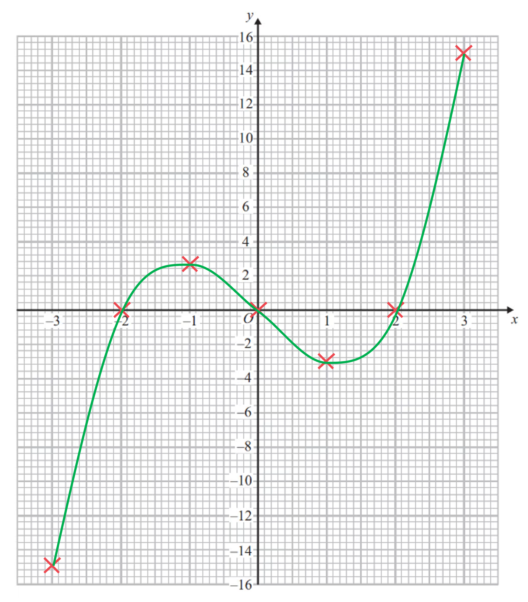

**at least 5 points plotted correctly**** [1]** 
**smooth curve through points**** [1]** 
**here is some margin of error permitted for the curve so long as it passes through the points**

## Q3 — easy — 4 marks · exam-questions

### 13((a)) — 2 marks
> *Use the TABLE function on your calculator for *`f open parentheses x close parentheses equals x cubed minus 3 x plus 1`*, starting at -2, ending at 2 and with steps of 1*

> *If your calculator does not have a TABLE function then substitute the values of *$x$* into the function one by one for the missing values, being careful to put negative numbers in brackets, e.g.*

`x equals negative 2 comma space y equals open parentheses negative 2 close parentheses cubed minus 3 open parentheses negative 2 close parentheses plus 1 equals negative 1`

| $x$ | $-2$ | $-1$ | $0$ | $1$ | $2$ |
|---|---|---|---|---|---|
| $y$ | $-1$ | $3$ | $1$ | $-1$ | $3$ |

**2 correct values**** [1]** 
**all values correct ****[1]**

**Before writing your answers in the table, double check that the **$y$**-values the calculator gives you match the values that are already in the table**

### 13((b)) — 2 marks
*Carefully plot the points from your table of values in (a) on the grid, noting the different scales on the *$x$* and *$y$* axes* 
*For example, the first column represents the point *`open parentheses negative 2 comma space minus 1 close parentheses`

> *After plotting the points, join them with a smooth curve- do not use a ruler!*

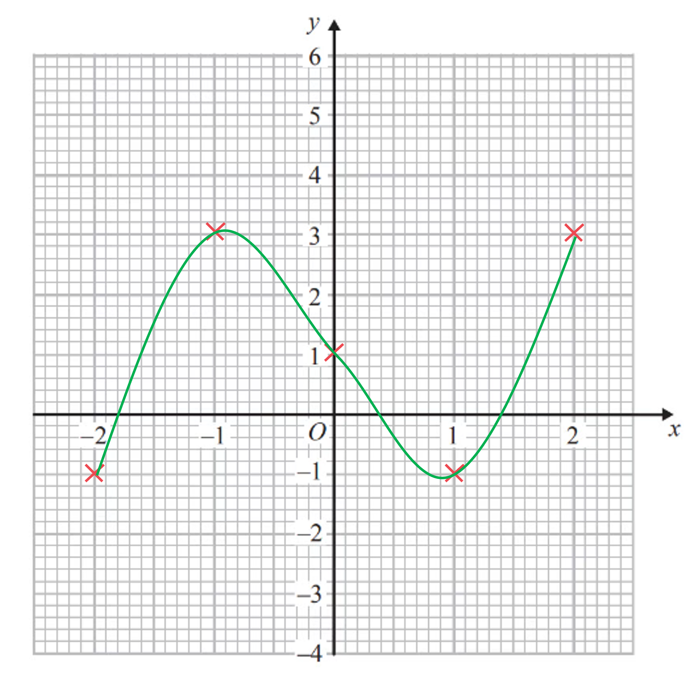

**at least 4 points plotted correctly**** [1]** 
**smooth curve through points**** [1]**

**There is some margin of error permitted for the curve so long as it passes through the points and is the correct shape**

## Q4 — easy — 4 marks · exam-questions

### 18((a)) — 2 marks
*It is possible to answer this question using the TABLE function of your calculator, if your calculator has it* 
*However the steps between **x** values are not regular, and it is a simple substitution to do manually as below*

$x=0.5,y=\frac{6}{0.5}=12\,x=3,y=\frac{6}{3}=2\,x=5,y=\frac{6}{5}=1.2$

> *Put the values found into the table*

| $x$ | $0.5$ | $1$ | $2$ | $3$ | $4$ | $5$ | $6$ |
|---|---|---|---|---|---|---|---|
| $y$ | $12$ | $6$ | $3$ | $2$ | $1.5$ | $1.2$ | $1$ |

**two correct values**** [1]** 
**all correct values**** [1]**

### 18((b)) — 2 marks
*Carefully plot the points from your table of values in (a) on the grid, noting the different scales on the *$x$* and *$y$* axes* 
*For example, the first column represents the point *`open parentheses 0.5 comma space 12 close parentheses`

> *After plotting the points, join them with a smooth curve- do not use a ruler!*

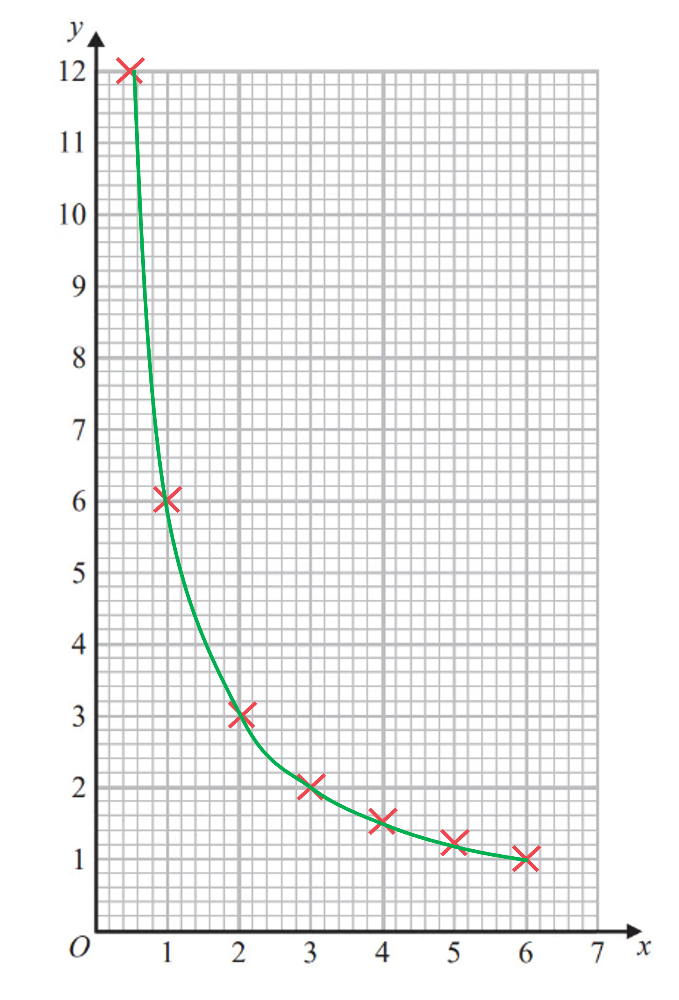

**at least 6 points plotted correctly**** [1]** 
**smooth through points**** [1]**

## Q5 — easy — 4 marks · exam-questions

### 19((a)) — 2 marks
> *Method 1*

> *Use the TABLE function on your calculator for *`f open parentheses x close parentheses equals 4 over x`*, starting at 1, ending at 6 and with steps of 1 to fill in the 5 columns on the right. Edit one of x values to 0.5 (or go back to settings and start at 0.5) for the remaining x = 0.5 column*

| $x$ | $0.5$ | $1$ | $2$ | $4$ | $5$ | $6$ |
|---|---|---|---|---|---|---|
| $y$ | $8$ | $6$ | $2$ | $1$ | $0.8$ | $0.5$ |

**2 or 3 correct values**** [1]** 
**all values correct**** [1]**

> *Method 2*

> *Substitute each **x** value into *$y=\frac{4}{x}$*, by hand or using your calculator*

$x=0.5,y=\frac{4}{0.5}=8\,x=4,y=\frac{4}{4}=1\,x=5,y=\frac{4}{5}=0.8\,x=8,y=\frac{4}{8}=0.5$

> *Put the values found into the table*

| $x$ | $0.5$ | $1$ | $2$ | $4$ | $5$ | $6$ |
|---|---|---|---|---|---|---|
| $y$ | $8$ | $6$ | $2$ | $1$ | $0.8$ | $0.5$ |

**2 or 3 correct values**** [1]** 
**all values correct**** [1] **
**Answers as decimals or fractions are accepted. But as you will use these to plot points on a graph, it may be more useful to write the answers as decimals**

### 19((b)) — 2 marks
*Carefully plot the points from your table of values in (a) on the grid, noting the different scales on the *$x$* and *$y$* axes* 
*For example, the first column represents the point *`open parentheses 0.5 comma space 8 close parentheses`

> *After plotting the points, join them with a smooth curve- do not use a ruler!*

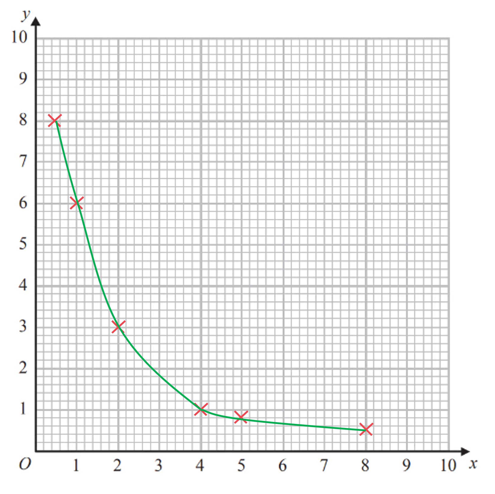

**at least 5 points plotted correctly**** [1]** 
**smooth through points**** [1]**

## Q6 — easy — 3 marks · exam-questions

### 7((a)) — 1 marks
> *Read the turning point from the graph. It lies on the axis of symmetry, and is marked below*

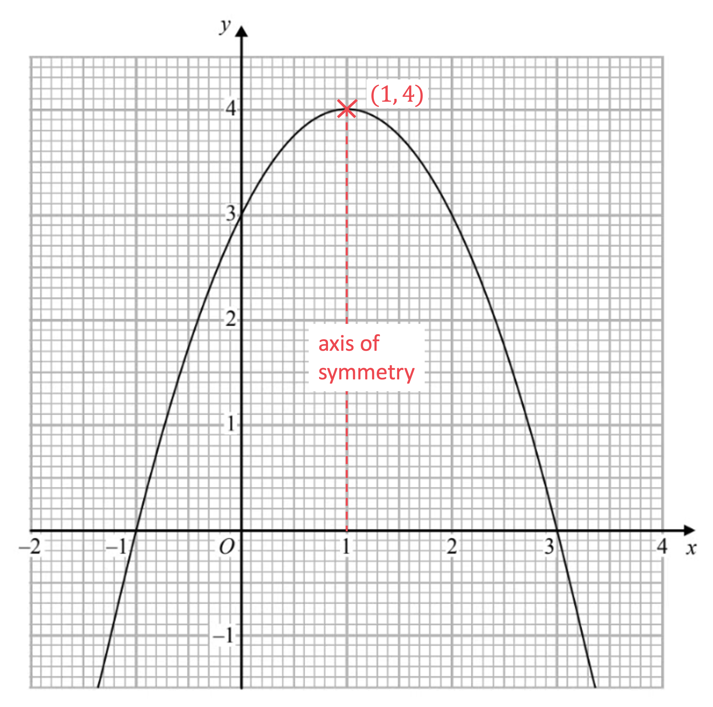

**(1, 4) ****[1]**

### 7((b)) — 1 marks
> *To find the roots of *`straight f open parentheses x close parentheses equals 2`*, draw the horizontal line *$y=2$* on the grid and read the *$x$*-coordinates where the graph of *`y equals straight f open parentheses x close parentheses`* intersects *$y=2$* *

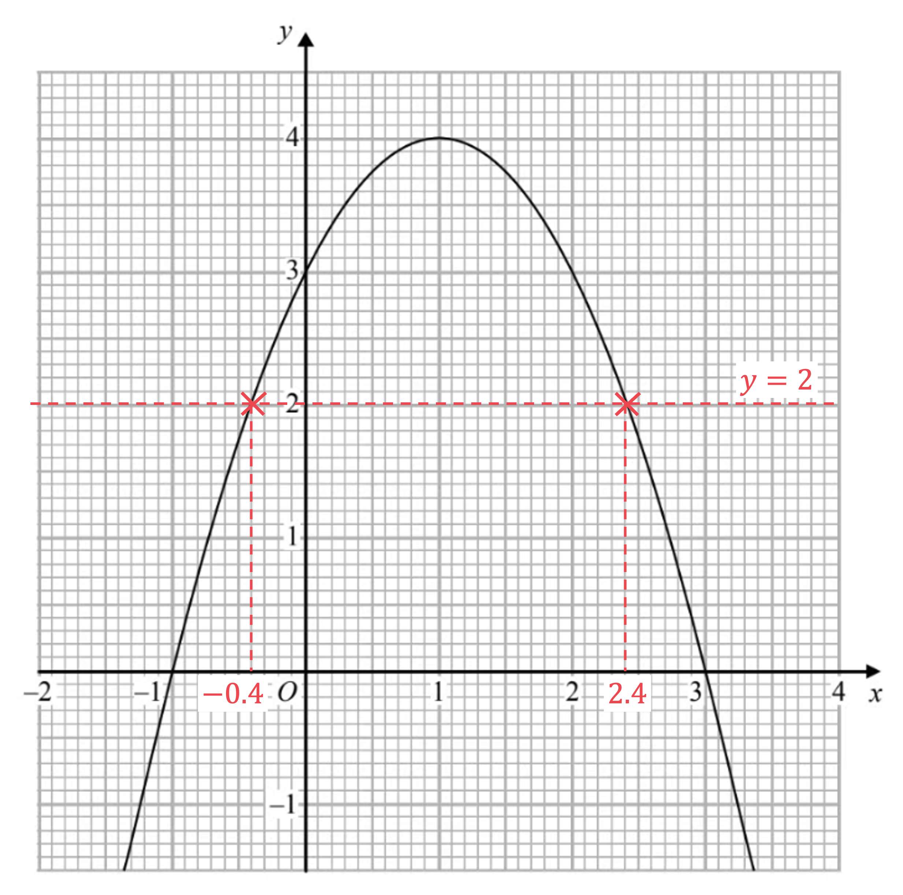

$x=-0.4,x=2.4$ **[1]**

**Both roots must be shown to achieve the mark**

### 7((c)) — 1 marks
> *Read up from 0.5 on the *$x$*-axis until you hit the graph of *`straight f open parentheses x close parentheses`*, then across to the *$y$*-axis to read the value*

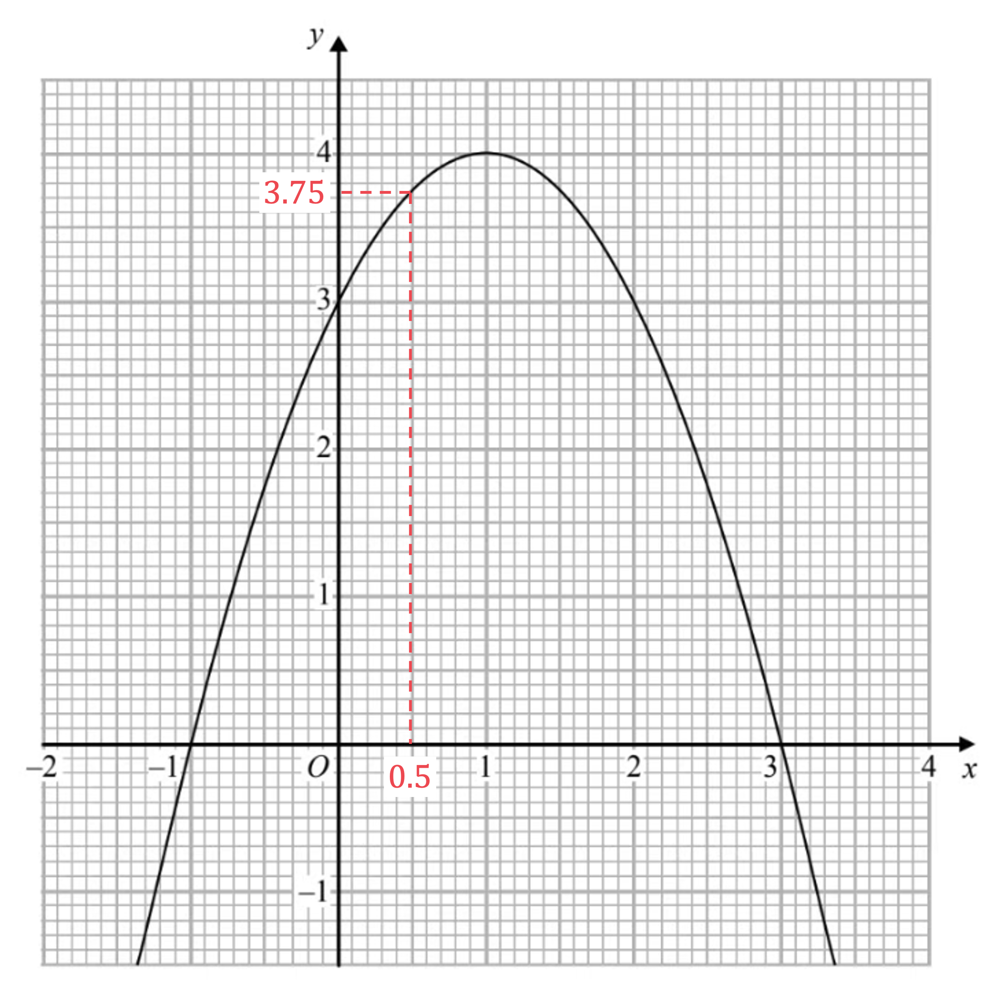

**Final answer:** **3.75**

**any value from 3.7 to 3.8**** [1]**

## Q7 — easy — 3 marks · exam-questions

### 11((a)) — 1 marks
*Read the turning point from the graph. It lies on the axis of symmetry, and is marked below*

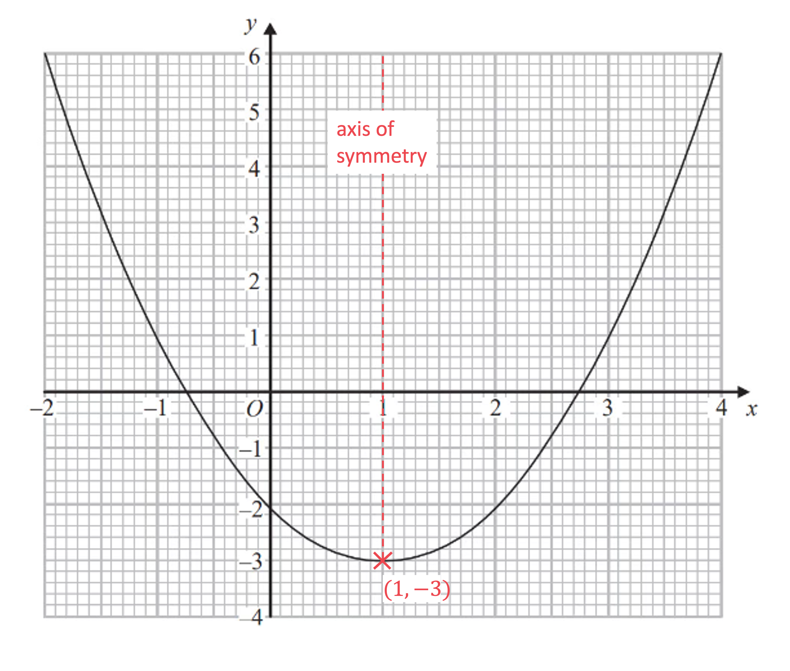

**(1, −3) ****[1]**

### 11((b)) — 1 marks
> *The roots of *`straight f open parentheses x close parentheses equals 0`*, are where the graph of *`y equals straight f open parentheses x close parentheses`* intersects *$y=0$* (the **x**-axis)** *

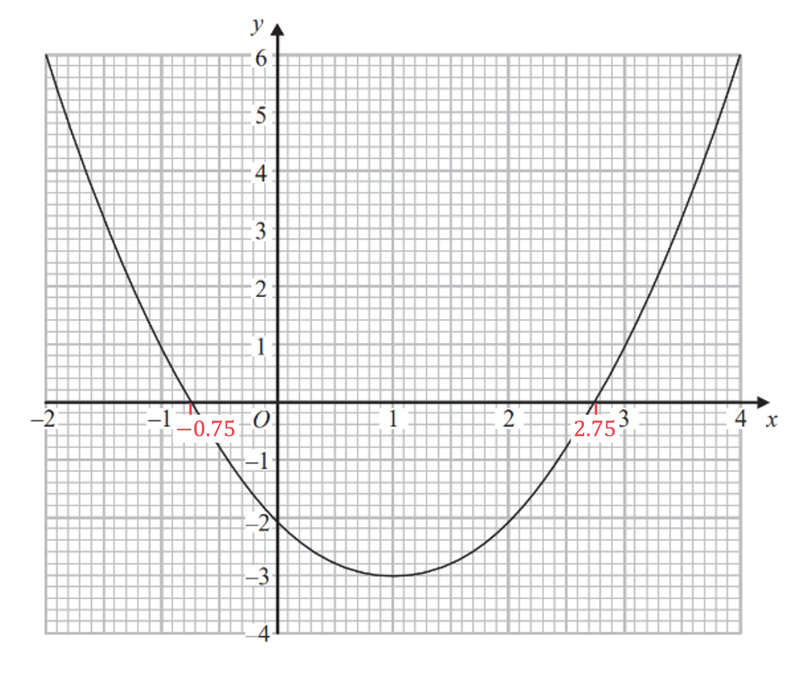

$x=-0.75,x=2.75$ **[1]**

**values of**** **$x$** from −0.8 to −0.7, and from 2.7 to 2.8, are accepted **

### 11((c)) — 1 marks
> *Read up down from 1.5 on the *$x$*-axis until you hit the graph of *`straight f open parentheses x close parentheses`*, then across to the *$y$*-axis to read the value*

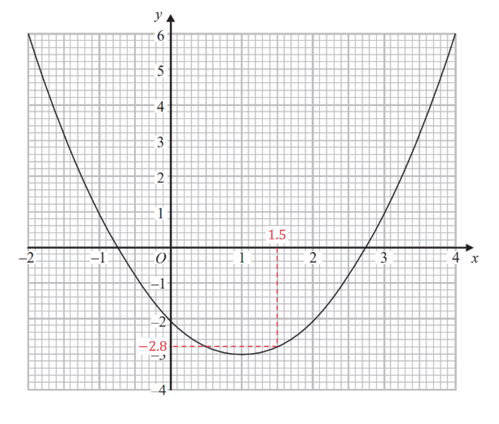

**−2.8 ****[1]**

## Q8 — easy — 4 marks · exam-questions

### 15((a)) — 2 marks
> *The differences in the steps for the **x **values makes using the table function on your calculator for *`straight f open parentheses x close parentheses space equals space 1 over x open parentheses x squared space plus space 4 close parentheses`* more difficult here. Instead, use your calculator to substitute the values of *$x$* into the function one by one for the missing values. *

> *Type the function into your calculator carefully, using the fraction button and the brackets. Use the arrow keys to check your work is correct and to go back through and change the values for each one.*

`x equals 0.5 comma space space y equals fraction numerator 1 over denominator 0.5 end fraction open parentheses 0.5 squared plus 4 close parentheses space equals space 8.5
x equals 1 comma space space y equals 1 over 1 open parentheses 1 squared plus 4 close parentheses space equals space 5
x equals 2 comma space space y equals 1 half open parentheses 2 squared plus 4 close parentheses space equals space 4
x equals 4 comma space space y equals 1 fourth open parentheses 4 squared plus 4 close parentheses space equals space 5`

| $x$ | 0.25 | 0.5 | 1 | 2 | 4 | 8 |
|---|---|---|---|---|---|---|
| $y$ | 16.25 | **Final answer:** **8.5** | **Final answer:** **5** | **Final answer:** **4** | **Final answer:** **5** | 8.5 |

**2 or 3 correct values**** [1]**

**all values correct ****[1]**

### 15((b)) — 2 marks
*Carefully plot the points from your table of values in (a) on the grid, noting the different scales on the *$x$* and *$y$* axes* 
*For example, the first column represents the point *`open parentheses 0.25 comma space 16.25 close parentheses`*.*

> *After plotting the points, join them with a smooth curve- do not use a ruler!*

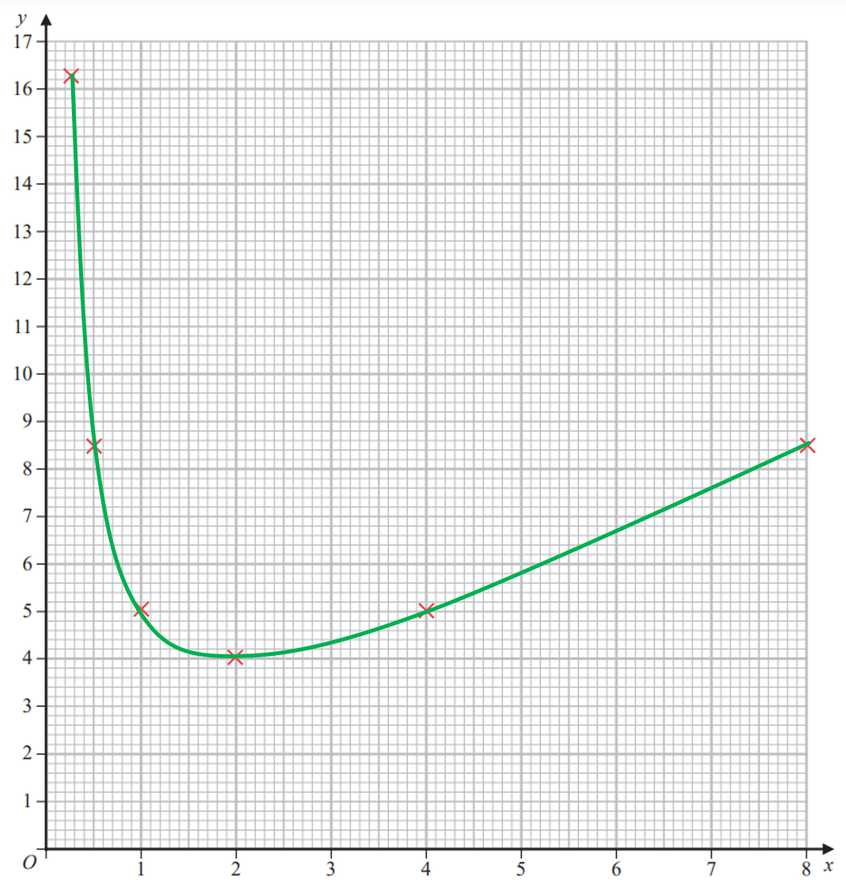

**at least 5 points plotted correctly**** [1]** 
**smooth curve through points**** [1]**
 **There is some margin of error permitted for the curve so long as it passes through the points**

## Q9 — easy — 3 marks · exam-questions

### 15() — 3 marks
> *Consider each function separately.*

> $y=\frac{2}{x^{2}}$* is a positive reciprocal graph with *$x^{2}$* on the denominator so it cannot have any negative **y **values - **C.    *

> $y=-\frac{1}{2}x^{3}$*  is a negative cubic function which intercepts the **y **axis at the origin - **B**.    *

> $y=-\frac{5}{x}$* is a negative reciprocal graph - **E .  *

> *If you are unsure between **A **and **E  **for the last one, consider some coordinates and look at which quadrant they are in.*

| **Equation** | **Graph** |
|---|---|
| $y=\frac{2}{x^{2}}$ | **Final answer:** **C** |
| $y=-\frac{1}{2}x^{3}$ | **Final answer:** **B** |
| $y=-\frac{5}{x}$ | **Final answer:** **E** |

**1 mark for each correct answer ****[3]**

## Q10 — easy — 4 marks · exam-questions

### 16((a)) — 2 marks
> *You should to know the key points of **trig graphs**, which are marked on the diagram below for **y** = sin**x.*

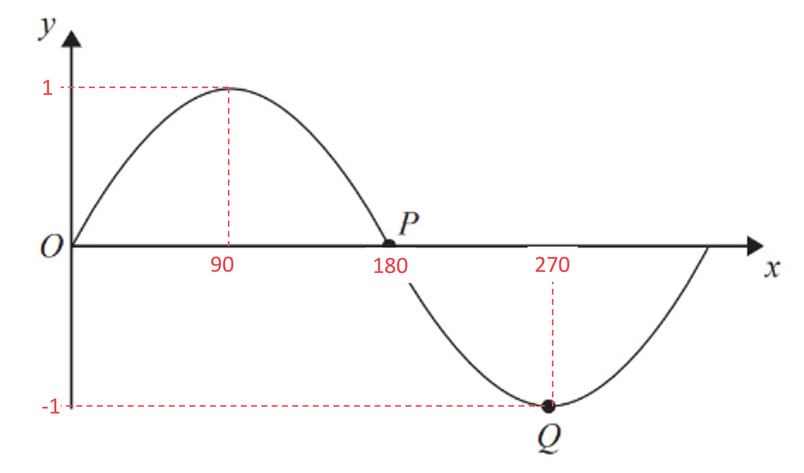

i) *Check by using your calculator to input sin180°, it will give you '0'.*

**P ****= (180, 0) ****[1]**

ii) *Check by using your calculator to input sin270°, your calculator will give you "-1" (and -1 ≤ sin x ≤ 1 so this must be a minimum point).*

**Q**** = (270, −1) ****[1]**

### 16((b)) — 2 marks
> *Sketch the graph of *$y=\mathrm{tan}x$* on the graph.  *
*You should know the shape of the graph but you can use your calculator to find and plot key values to help you.*
* *$y=\mathrm{tan}x$* has no value at *$x=90^{\circ}$*and *$x=270^{\circ}$* so asymptotes have been included through these two points.  *

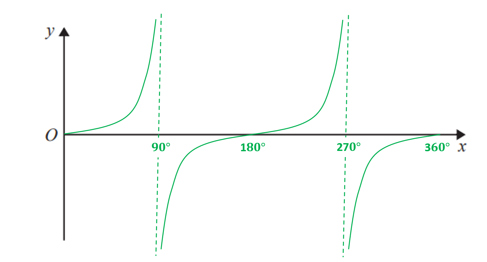

** ****Correct shape of the graph in any section ****[1] **** **
**Correct asymptotes and position of the graph**** ****[1]**

## Q11 — easy — 4 marks · exam-questions

### 11((a)) — 2 marks
> *The differences in the steps for the **x **values makes using the table function on your calculator for *`straight f open parentheses x close parentheses space equals space 1 over x open parentheses x squared space plus space 4 close parentheses`* more difficult here. Instead, use your calculator to substitute the values of *$x$* into the function one by one for the missing values. *

> *Type the function into your calculator carefully using the fraction button. Use the arrow keys to go back through and change the values for each one.*

$x=0.5,y=\frac{6}{0.5}=12\,x=2,y=\frac{6}{2}=3\,x=4,y=\frac{6}{4}=1.5\,x=5,y=\frac{6}{5}=1.2$

| $x$ | 0.5 | 1 | 2 | 3 | 4 | 5 | 6 |
|---|---|---|---|---|---|---|---|
| $y$ | **Final answer:** **12** | 6 | **Final answer:** **3** | 2 | **Final answer:** **1.5** | **Final answer:** **1.2** | 1 |

**2 or 3 correct values**** [1]** 
**all values correct ****[1]**

### 11((b)) — 2 marks
> *Carefully plot the points from your table of values in (a) on the grid.*

> *The coordinates are (0.5, 12), (1, 6), (2, 3), (3, 2), (4, 1.5), (5, 1.2), (6, 1).*

> *After plotting the points, join them with a smooth curve- do not use a ruler!*

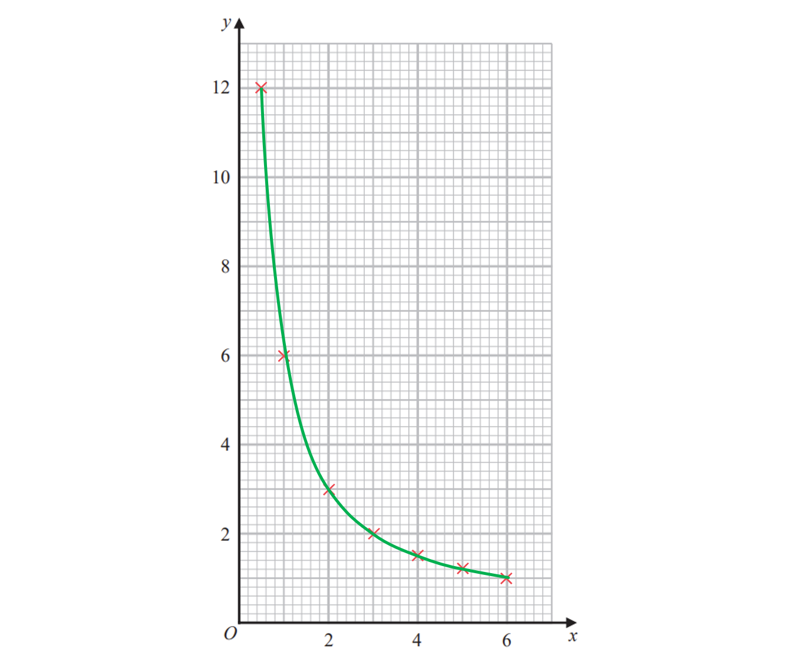

**at least 6 points plotted correctly**** [1]** 
**smooth curve through points**** [1]**

## Q12 — easy — 1 marks · exam-questions

### 21((a)) — 1 marks
> *Test each option by substituting the coordinates into *$y=\frac{1}{x}$* individually.*

> *For option 1, *$x=-1,y=1$* therefore*

$1=\frac{1}{-1}=-1$* **not true*

> *So it cannot be option 1.*

> *For option 2, *$x=0.3,y=3$* therefore*

$3=\frac{1}{0.3}=3.333....$* **not true*

> *So it cannot be option 2.*

> *For option 3, *$x=0.8,y=0.2$* therefore*

$0.2=\frac{1}{0.8}=1.25$* **not true*

> *So it cannot be option 3.*

> *For option 4, *$x=2.5,y=0.4$* therefore*

$2.5=\frac{1}{0.4}=2.5$* **true*

**The correct answer is option 4, (2.5, 0.4)** **[1]**

## Q13 — easy — 1 marks · exam-questions

### 27() — 1 marks
*Quadratic curves given in the form *$y=(x+a)^{2}+b$* have turning points at *$(-a,b).$ 
*For *$y=(x-1)^{2}-6$* the value of *$a$* is -1 and the value of *$b$* is -6.*

$a=-1,b=-6$

> *So the turning point is at *`open parentheses negative open parentheses negative 1 close parentheses comma space minus 6 close parentheses`*.*

**The correct answer is option 4, (1, -6)** **[1]**

## Q14 — easy — 1 marks · exam-questions

### 19((a)) — 1 marks
> *The solution to **x**3** − x**2** − 2 = 0 is where **y **=** x**3** − x**2** − 2 crosses **y **=** **0 (the **x-**axis).*

> *Read the **x**-value where the curve crosses the **x**-axis. There are 10 small squares between 1.5 and 2. So one small square on the **x**-axis represents 0.05 (0.5 ÷ 10).*

**1.7** **[1]**

## Q15 — easy — 2 marks · exam-questions

### 10() — 2 marks
> *The solutions to **x**2** + **x** − 6 = 0 are where **y **=** x**2** +** x **− 6 crosses **y **=** **0 (the **x-**axis).*

> *Read the **x**-values where the curve crosses the **x**-axis.*

**x**** = −3 or ****x**** = 2** **[2] **

**one mark for each correct value**

## Q16 — easy — 2 marks · exam-questions

### 4((a)) — 2 marks
i) *Direct proportion takes the form *$y=kx$*; it is a linear relationship and passes through (0, 0).*

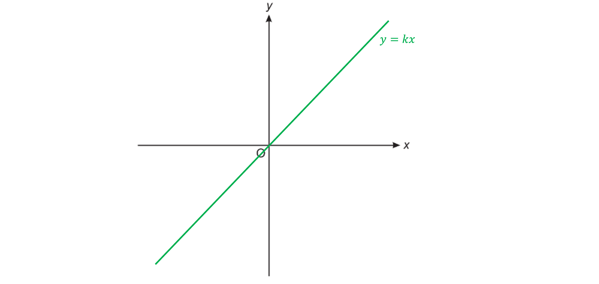

**straight line  ****[1]**
**passes through (0, 0)  ****[1]**
**The gradient of the line does not matter- so long as it is straight and passes through (0, 0)**

ii) * *$y=x^{3}$* is one of the graphs you are expected to know the shape of. It passes through (0, 0).*

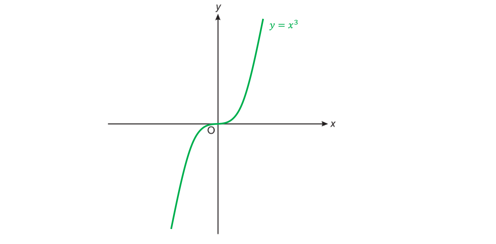

**correct shape curve  ****[1]**
**passes through (0, 0)  ****[1]**

## Q17 — medium — 6 marks · exam-questions

### 5((a)) — 2 marks
> *Use the TABLE function on your calculator for *`f open parentheses x close parentheses equals x squared minus x minus 6`*, starting at -3, ending at 3 and with steps of 1*

> *If your calculator does not have a TABLE function then substitute the values of *$x$* into the function one by one for the missing values, being careful to put negative numbers in brackets, e.g.*

`x equals negative 2 comma space y equals open parentheses negative 2 close parentheses squared minus open parentheses negative 2 close parentheses minus 6 equals 0`

| $x$ | $-3$ | $-2$ | $-1$ | $0$ | $1$ | $2$ | $3$ |
|---|---|---|---|---|---|---|---|
| $y$ | $6$ | $0$ | $-4$ | $-6$ | $-6$ | $-4$ | $0$ |

**at least 2 correct values**** [1]** 
**all values correct ****[1]**

**Before writing your answers in the table, double check that the **$y$**-values the calculator gives you match the values that are already in the table**

### 5((b)) — 2 marks
*Carefully plot the points from your table of values in (a) on the grid, noting the different scales on the *$x$* and *$y$* axes* 
*For example, the first column represents the point *`open parentheses negative 3 comma space minus 6 close parentheses`

> *After plotting the points, join them with a smooth curve- do not use a ruler!*

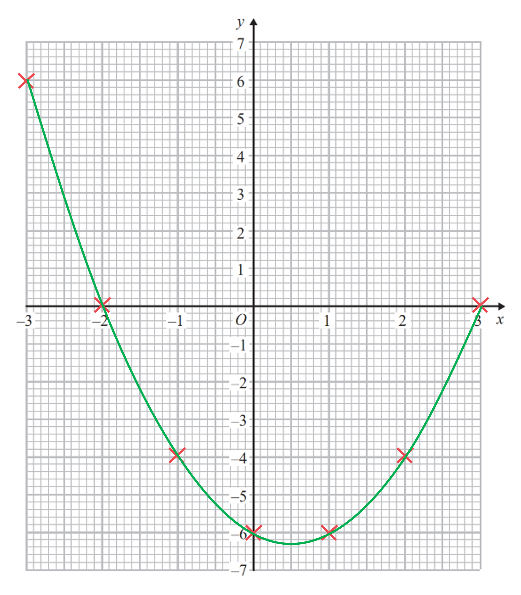

**at least 5 points plotted correctly**** [1]**
 **smooth curve through points**** [1] **
**It is a quadratic function so its graph should be symmetrical**

### 5((c)) — 2 marks
> *Draw the graph of *$y=-2$* and read off the graph the *$x$*-values where *$y=-2$* intersects with *$y=x^{2}-x-6$

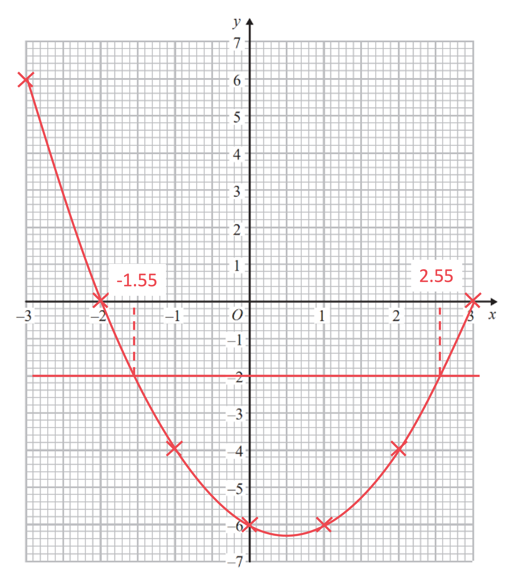

> *There is some margin of error due to the drawing of the curve by hand. However your answers must be consistent with your graph. In this case the answers would be:*

**−1.55 and 2.55**
**any answer between −1.5 and −1.7 ****[1]** 
**any answer between 2.5 and 2.7 ****[1]**

## Q18 — medium — 2 marks · exam-questions

### 19((a)) — 2 marks
> *Method 1*

> *Know the properties of the **trig graphs**. The key points to know on the graph of **y **= cos**x** are;*

*  ***x*** = 0, ***y*** = 1* 
*  ***x*** = 90, ***y*** = 0* 
*  ***x*** = 180, ***y*** = -1* 
*  ***x*** = 270, ***y*** = 0* * *
* ***x*** = 360, ***y*** = 1*

> *Label -1 and 1 on the **y**-axis, the same distance from 0. Mark the above key points on the diagram, labelling any points not on the axes*

> *Draw a smooth curve through these points*

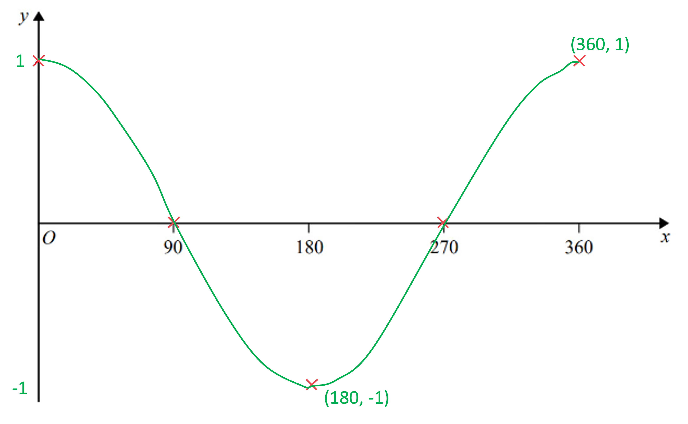

**smooth curve the correct shape**** [1]*** *
**key points clearly labelled**** [1]**

> *Method 2*

> *If in doubt you could use your calculator to obtain the key points. *

> *Making sure your calculator is in degrees;   *

> * -create a table of values using the TABLE function of your calculator, starting at **x** = 0 and ending at **x **= 360, steps of 90 *
*   -if your calculator does not have a TABLE function, substitute the key **x** values into **y** = cos**x*

* ***x*** = 0, ***y*** = 1* * *
* ***x*** = 90, ***y*** = 0* * *
* ***x*** = 180, ***y*** = -1* 
*  ***x*** = 270, ***y*** = 0* 
*  ***x*** = 360, ***y*** = 1*

> *Label -1 and 1 on the **y**-axis, the same distance from 0. Mark the above key points on the diagram, labelling any points not on the axes*

> *Draw a smooth curve through these points*

**smooth curve the correct shape**** [1]**
* ***key points clearly labelled**** [1]**

## Q19 — medium — 2 marks · exam-questions

### 26((a)) — 1 marks
> *You should to know the key points of **trig graphs**, which are marked on the diagram below for **y** = sin**x*

> *If unsure, use your calculator to check by inputing sin180, your calculator will give you "0"*

**P ****= (180, 0) ****[1]**

### 26((b)) — 1 marks
> *You need to know the key points of **trig graphs**, which are marked on the diagram below for **y** = sin**x*

> *If unsure, use your calculator to check by inputing sin270, your calculator will give you "-1" (and -1 ≤ sin x ≤ 1 so this must be a minimum point)*

**Q**** = (270, −1) ****[1]**

## Q20 — medium — 6 marks · exam-questions

### 12((a)) — 2 marks
> *Use the TABLE function on your calculator for *`f open parentheses x close parentheses equals x squared minus 3 x plus 2`*, starting at -1, ending at 5 and with steps of 1*

> *If your calculator does not have a TABLE function then substitute the values of *$x$* into the function one by one for the missing values, being careful to put negative numbers in brackets, e.g.*

`x equals 1 comma space y equals open parentheses 1 close parentheses squared minus 3 open parentheses 1 close parentheses plus 2 equals 0`

> *Put the values found into the table*

| $x$ | $-1$ | $0$ | $1$ | $2$ | $3$ | $4$ | $5$ |
|---|---|---|---|---|---|---|---|
| $y$ | $6$ | $2$ | $0$ | $0$ | $2$ | $6$ | $12$ |

> *Check that you have entered f(x) correctly by checking that your calculator gives you y = 6, y = 2 and y = 12 when x = -1, x = 3 and x = 5 respectively*

**2 or 3 correct values**** [1]** 
**all values correct**** [1]**

### 12((b)) — 2 marks
*Carefully plot the points from your table of values in (a) on the grid, noting the different scales on the *$x$* and *$y$* axes* 
*For example, the first column represents the point *`open parentheses negative 1 comma space 6 close parentheses`

> *After plotting the points, join them with a smooth curve- do not use a ruler!*

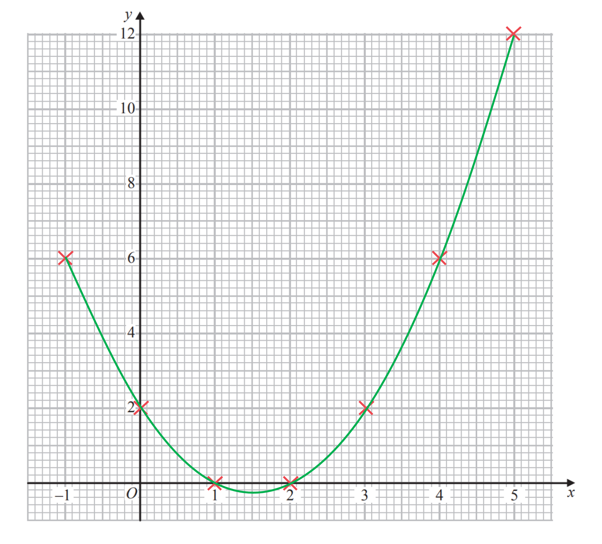

**at least 5 points plotted correctly**** [1]** 
**smooth curve through all points**** [1] **
**It is a quadratic function so its graph should be symmetrical about the turning point**

### 12((c)) — 2 marks
> *Draw the graph of *$y=4$* and read off the graph the *$x$*-values where it intersects with *$y=x^{2}-3x+2$

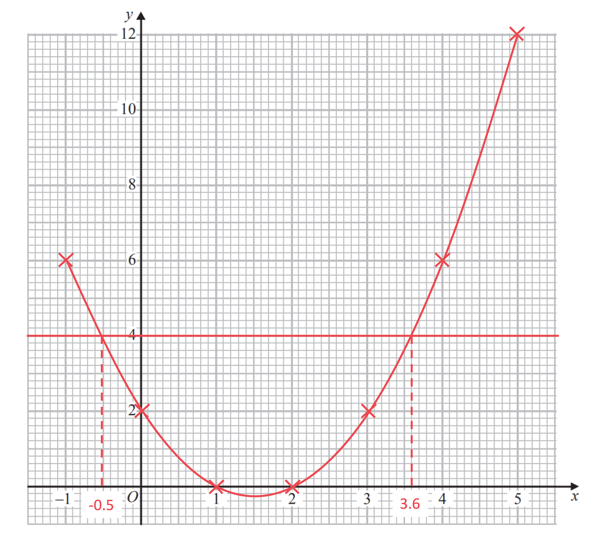

> *There is some margin of error due to the drawing of the curve by hand. However your answers must be consistent with your graph. In this case the answers would be:*

**−0.5 and 3.6** 
**any value between −0.5 and −0.6 ****[1]** 
**any value between 3.5 and 3.6 ****[1]**

## Q21 — medium — 6 marks · exam-questions

### 13((a)) — 2 marks
> *Use the TABLE function on your calculator for *`f open parentheses x close parentheses equals x squared minus 3 x plus 1`*, starting at -2, ending at 4 and with steps of 1*

> *If your calculator does not have a TABLE function then substitute the values of *$x$* into the function one by one for the missing values, being careful to put negative numbers in brackets, e.g.*

`x equals negative 1 comma space y equals open parentheses negative 1 close parentheses squared minus 3 open parentheses negative 1 close parentheses plus 1 equals 5`

> *Put the values found into the table*

| $x$ | $-2$ | $-1$ | $0$ | $1$ | $2$ | $3$ | $4$ |
|---|---|---|---|---|---|---|---|
| $y$ | $11$ | $5$ | $1$ | $-1$ | $-1$ | $1$ | $5$ |

> *Check that you have entered f(x) correctly by checking that your calculator gives you the same y values that are given in the question*

**2 correct values**** [1]**

**all 3 values correct**** [1]**

### 13((b)) — 2 marks
*Carefully plot the points from your table of values in (a) on the grid, noting the different scales on the *$x$* and *$y$* axes*

> *For example, the first column represents the point *`open parentheses negative 2 comma space 11 close parentheses`

> *After plotting the points, join them with a smooth curve- do not use a ruler!*

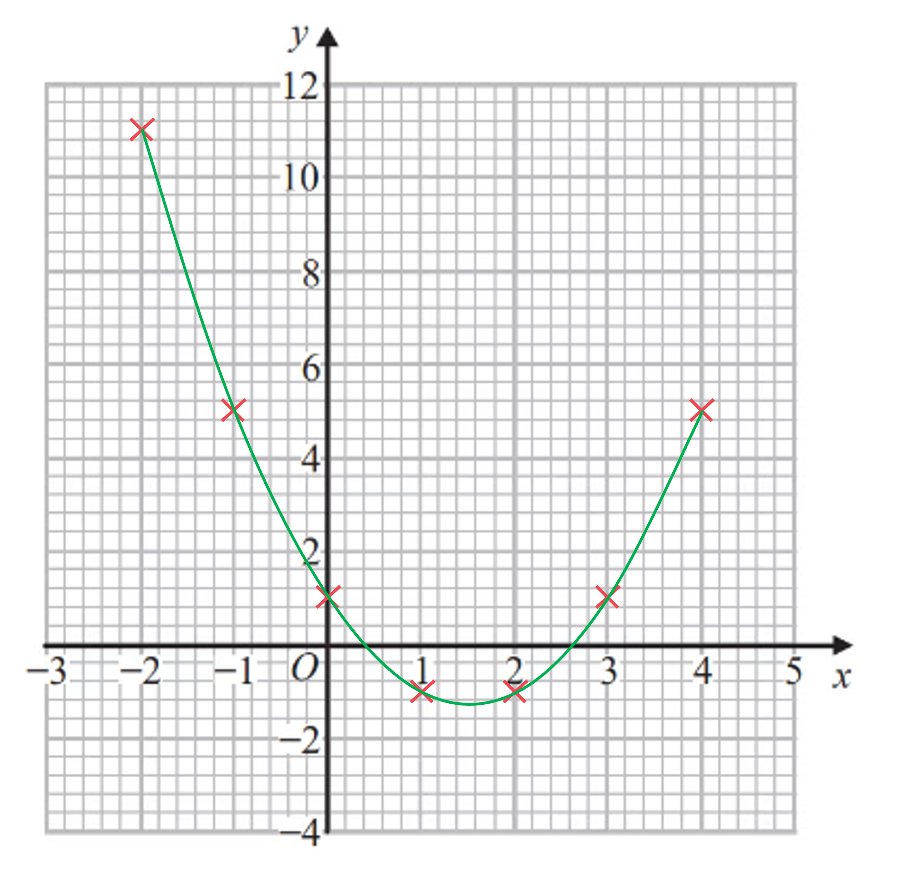

**at least 5 points plotted correctly**** [1]**

**smooth curve through all points**** [1] **

**It is a quadratic function so its graph should be symmetrical about the turning point**

### 13((c)) — 2 marks
> *Draw the graph of *$y=3$* and read off the graph the *$x$*-values where it intersects with *$y=x^{2}-3x+1$

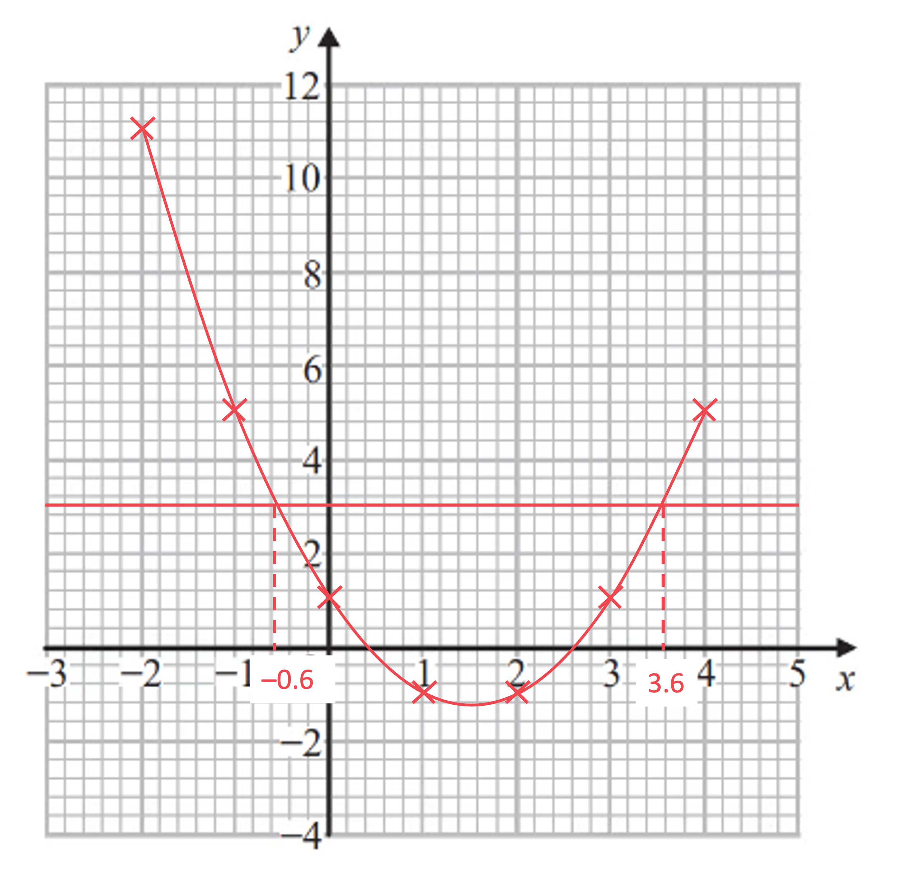

> *There is some margin of error due to the drawing of the curve by hand. However your answers must be consistent with your graph. In this case the answers would be:*

**−0.6 and 3.6**

**any value between −0.5 and −0.6 ****[1]**

**any value between 3.5 and 3.6 ****[1]**

## Q22 — medium — 6 marks · exam-questions

### 8((a)) — 1 marks
> *This can be done by either using the table function on your calculator or by substituting each value of **x **in separately. Use the table function if possible to save time, this also allows you to check your work by checking the other values of **x.*

> *Use the TABLE function on your calculator for *`f open parentheses x close parentheses equals x squared minus 5 x plus 6`*, starting at 0, ending at 5 and with steps of 1.*

> *If your calculator does not have a TABLE function then substitute the values of *$x$* into the function one by one for the missing values.*

`x equals 1 comma space space space y equals open parentheses 1 close parentheses squared minus 5 open parentheses 1 close parentheses plus 6 equals 2
x equals 5 comma space space space y equals open parentheses 5 close parentheses squared minus 5 open parentheses 5 close parentheses plus 6 equals 6`

| $x$ | $0$ | $1$ | $2$ | $3$ | $4$ | $5$ |
|---|---|---|---|---|---|---|
| $y$ | $6$ | **Final answer:** **2** | $0$ | $0$ | 2 | **Final answer:** **6** |

**both values correct ****[1]**

### 8((b)) — 2 marks
*Carefully plot the points from your table of values in (a) on the grid, noting the different scales on the *$x$* and *$y$* axes*

> *For example, the first column represents the point *`open parentheses 0 comma space 6 close parentheses`*.*

> *After plotting the points, join them with a smooth curve- do not use a ruler!*

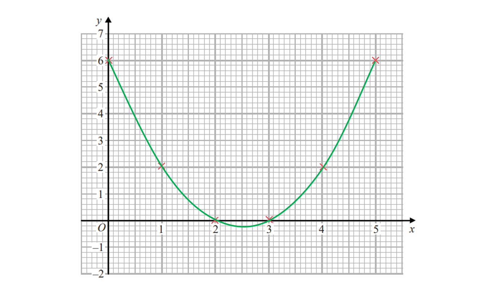

**at least 5 points plotted correctly**** [1]** 
**smooth curve through points**** [1] **
**It is a quadratic function so its graph should be symmetrical**

### 8((c)) — 3 marks
> *We have the graph of *$y=x^{2}-5x+6$* (from part (b)). We need to rearrange *$x^{2}-5x=x-7$* so that "*$x^{2}-5x+6$*" appears on its own on one side of the equation.*

> *In this case, add 6 to both sides.*

`table row cell x squared space minus space 5 x space plus space 6 space end cell equals cell space x space minus space 7 space plus space 6 end cell row cell x squared space minus space 5 x space plus space 6 space end cell equals cell space x space minus space 1 end cell end table`

**[1]**

> *Now draw the line *$y=x-1$* on the graph and read the *$x$* values where this line and *$y=x^{2}-5x+6$* intersect.*

> *To draw the line *$y=x-1$*, draw a straight line through *`open parentheses 0 comma space minus 1 close parentheses`* with a gradient of 1.*

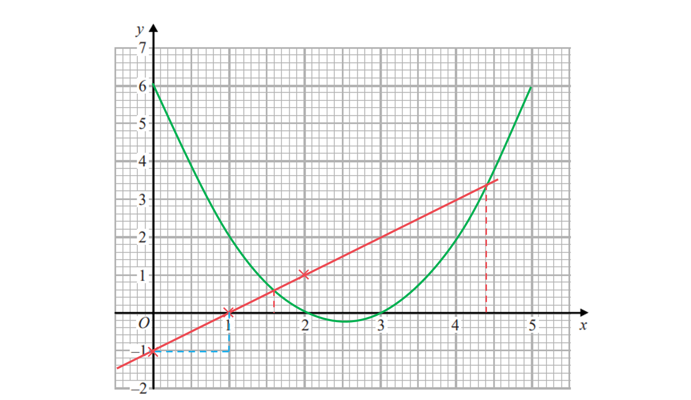

> * *

**y = x - 1 drawn correctly on the grid**** [1]**

**x**** = 1.6, ****x ****= 4.4 ****[1] **
**Both possible ****x**** values must be stated to achieve full marks**

## Q23 — medium — 5 marks · exam-questions

### 21((a)) — 2 marks
> *To find the solutions of *$2x^{2}-4x-1=0$*,  read the *$x$*-coordinates where the graph intersects the **x **axis.*

$x=-0.2,x=2.2$ **[2] **
**1 mark for each correct answer.**

### 21((b)) — 3 marks
> *To rearrange the given equation such that it has the function of the drawn graph on one side, begin by multiplying both sides by 2, so that the coefficient of **x**2 **is the same.*

`table row cell 2 open parentheses x to the power of 2 space end exponent minus space x space minus space 1 close parentheses space end cell equals cell space 2 open parentheses 0 close parentheses end cell row cell 2 x squared space minus space 2 x space minus space 2 space end cell equals cell space 0 end cell end table`

> *Rearrange *$2x^{2}-2x-2=0$*so that it has the function of the drawn graph *$y=2x^{2}-4x-1$* on the left hand side.*

`table row cell 2 x squared space minus space 2 x space minus space 2 space minus space 2 x space plus space 1 end cell equals cell space 0 space minus space 2 x space plus space 1 end cell row cell 2 x squared space minus space 4 x space minus 1 space end cell equals cell space minus 2 x space plus space 1 end cell end table`

> *Use your knowledge of linear graphs to plot *$y=-2x+1$*on the grid. The easiest method is to consider the points where the graph crosses the axes.  *

`x space equals space 0 space rightwards arrow space y equals negative 2 open parentheses 0 close parentheses plus 1 space equals space 1
y space equals space 0 space rightwards arrow space 0 equals negative 2 open parentheses x close parentheses plus 1 space rightwards arrow space x space equals space 1 half`

> *Draw a straight line through (0, 1) and (0.5, 0) on the given axes, check that the graph goes through (0, 1) and has a gradient of -2.*

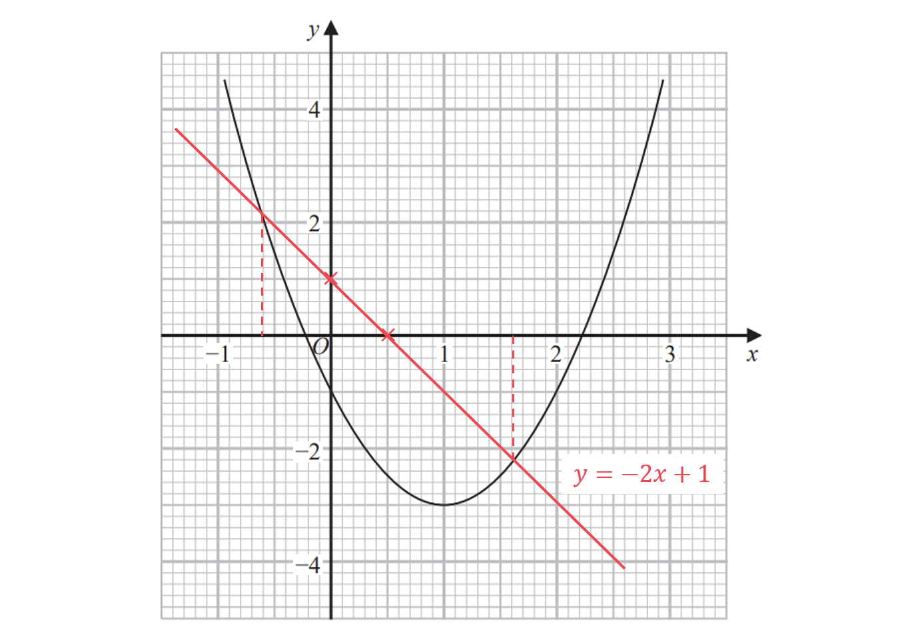

$y=-2x+1$** drawn correctly on the grid**** [1]**

> *Read the **x** values where the straight line intersects with the graph of *$y=2x^{2}-4x-1$*. *

$x=-0.6,x=1.6$** [1]*** *

## Q24 — medium — 2 marks · exam-questions

### 18((b)) — 2 marks
> *There are only two possible solutions of *`straight f open parentheses x close parentheses space equals space k`* at the values of *$x$* where there are only two possible *$y$* values.  *

> *The graph has three possible *$y$*-coordinates for every *$x$*-coordinate except at the two turning points. *

> *Read off the *$y$*-coordinates at the two turning points.*

$k=3,k=-1$ **[2] **

**1 mark for each correct answer.**

## Q25 — medium — 4 marks · exam-questions

### 23((a)) — 3 marks
> *The formula for completing the square for a quadratic in the form*$ax^{2}+bx+c$* is *`space space a open parentheses x plus fraction numerator b over denominator 2 a end fraction close parentheses squared minus fraction numerator b squared over denominator 4 a end fraction plus c`*. *

> *Applying this formula gives*

`3 x squared minus 12 x plus 7 equals 3 open parentheses x plus fraction numerator negative 12 over denominator 2 cross times 3 end fraction close parentheses squared minus fraction numerator open parentheses negative 12 close parentheses squared over denominator 4 cross times 3 end fraction plus 7`

**[1]**

> *Simplify.*

`table row cell 3 x squared minus 12 x plus 7 end cell equals cell 3 open parentheses x minus 2 close parentheses squared minus 12 plus 7 end cell row blank equals cell 3 open parentheses x minus 2 close parentheses squared minus 5 end cell end table`

**[1]**
** **`begin bold style therefore 3 bold italic x squared minus 12 bold italic x plus 7 equals 3 open parentheses bold italic x minus 2 close parentheses squared minus 5 end style`* ***[1]**

**i.e.  **$a=3,b=-2,c=-5$**.**

### 23((b)) — 1 marks
> *Quadratic graphs are parabolas that have a line of symmetry that passes through the turning point.*

> *The quadratic graph *$y=3x^{2}-12x+7$* is a positive quadratic (positive x**2** term) so its turning point will be a minimum point.*

> *The minimum point is found by completing the square (part (a)).*

`3 x squared minus 12 x plus 7 equals 3 open parentheses x minus 2 close parentheses squared minus 5`

> *The minimum point of *`a open parentheses x plus b close parentheses squared plus c`* is *`open parentheses negative b comma space c close parentheses`*.*

`therefore Min. space point space is space open parentheses 2 comma space minus 5 close parentheses`

*The line of symmetry will be a vertical line passing through this point, but we need its equation for the answer.*

> *Vertical lines have equations of the form *$x=k$*.*

**The line of symmetry L has equation** $x=2$** ****[1] **
**You could sketch the graph if it helps you to see the symmetry.**

## Q26 — medium — 1 marks · exam-questions

### 1() — 1 marks
> *Test each option by substituting *$x=-1$* into *$y=x^{2}-4x+1$* individually.*

> *The *$x-$*coordinate of each option is the same, so they can all be tested together. Make sure you type it carefully into your calculator, using brackets around the negative.*

> `open parentheses negative 1 close parentheses squared space minus 4 open parentheses negative 1 close parentheses space plus space 1 space equals space 6`* *

> *So the answer must be option 4, (-1, 6).*

**The correct answer is option 4, (-1, 6)** **[1]**

## Q27 — medium — 4 marks · exam-questions

### 4((a)) — 2 marks
> *Substitute the *$x$* values into the equation to calculate the *$y$* values. Be careful when squaring negative numbers*

`open parentheses negative 3 close parentheses squared minus open parentheses negative 3 close parentheses minus 4 equals 8`

`open parentheses negative 1 close parentheses squared minus open parentheses negative 1 close parentheses minus 4 equals negative 2`

$0^{2}-0-4=-4$

$2^{2}-2-4=-2$

$3^{2}-3-4=2$

| $x$ | **Final answer:** **-3** | **Final answer:** **-2** | **Final answer:** **-1** | **Final answer:** **0** | **Final answer:** **1** | **Final answer:** **2** | **Final answer:** **3** |
|---|---|---|---|---|---|---|---|
| $y$ | **Final answer:** **8** | **Final answer:** **2** | **Final answer:** **-2** | **Final answer:** **-4** | **Final answer:** **-4** | **Final answer:** **-2** | **Final answer:** **2** |

**[B1 B1]**

> **[mark-scheme]**
> **B1**: For 3 or 4 correct values.
> 
> **B1**: For having all the correct values.

### 4((b)) — 2 marks
> *Plot your coordinates from a) onto the axes*

**[M1]**

> *Join your points with a smooth curve*

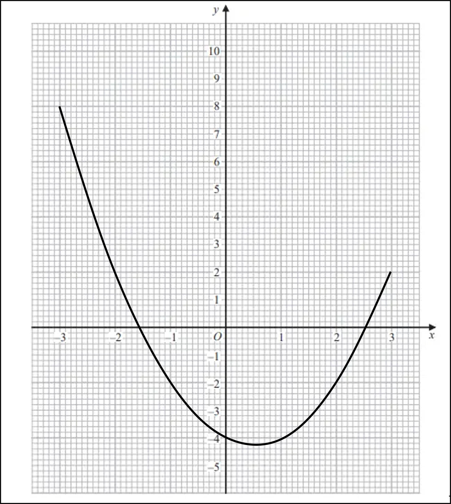

**[A1]**

## Q28 — medium — 5 marks · exam-questions

### 12((a)) — 2 marks
> *Use your calculator to work out each value*

`open parentheses negative 2 close parentheses cubed space minus space 3 open parentheses negative 2 close parentheses space plus thin space 1 space equals space minus 1`

`open parentheses negative 1 close parentheses cubed space minus space 3 open parentheses negative 1 close parentheses space plus thin space 1 space equals space 3`

`open parentheses 0 close parentheses cubed space minus space 3 open parentheses 0 close parentheses space plus thin space 1 space equals space 1`

`open parentheses 2 close parentheses cubed space minus space 3 open parentheses 2 close parentheses space plus thin space 1 space equals space 3`

| $x$ | -2 | -1 | 0 | 1 | 2 |
|---|---|---|---|---|---|
| $y$ | **Final answer:** **-1** | **Final answer:** **3** | **Final answer:** **1** | -1 | **Final answer:** **3** |

**[B1 B1]**

> **[mark-scheme]**
> **B1**: 2 or 3 values correct.
> 
> **B1**: All values correct.

### 12((b)) — 2 marks
> *Use the values in the table to plot the co-ordinates. Join with a smooth curve*

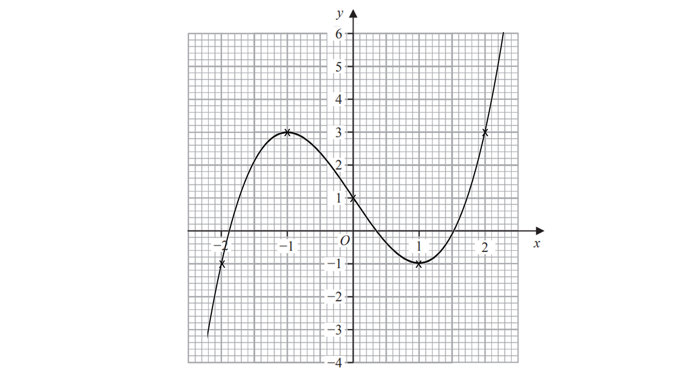

**[M1 A1]**

> **[mark-scheme]**
> **M1**: 4 or 5 points from table plotted correctly.
> 
> **A1**: Fully correct graph.

### 12((c)) — 1 marks
**Correct answer: D** — 

> *Graph A is the basic reciprocal graph *$y=\frac{1}{x}$

> *Graph B has only positive *$y$* values so must be the graph *$y=\frac{1}{x^{2}}$

> *Graph C is the negative reciprocal graph *$y=-\frac{1}{x}$

> *Graph D has only negative *$y$* values so must be the graph *$y=-\frac{1}{x^{2}}$

**Final answer:** **Graph D**

**[B1]**

## Q29 — hard — 6 marks · exam-questions

### 15((a)) — 2 marks
> *Use the TABLE function on your calculator for *`f open parentheses x close parentheses equals x squared minus 2 x`*, starting at -2, ending at 4 and with steps of 1*

> *If your calculator does not have a TABLE function then substitute the values of *$x$* into the function one by one for the missing values, being careful to put negative numbers in brackets, e.g.*

`x equals negative 2 comma space y equals open parentheses negative 2 close parentheses squared minus 2 open parentheses negative 2 close parentheses equals 8`

| $x$ | $-2$ | $-1$ | $0$ | $1$ | $2$ | $3$ | $4$ |
|---|---|---|---|---|---|---|---|
| $y$ | $8$ | $3$ | $0$ | $-1$ | $0$ | $3$ | $8$ |

**at least 2 correct values**** [1]**

**all values correct ****[1]**

**Before writing your answers in the table, double check that the **$y$**-values the calculator gives you match the values that are already in the table**

### 15((b)) — 2 marks
*Carefully plot the points from your table of values in (a) on the grid, noting the different scales on the *$x$* and *$y$* axes*

> *For example, the first column represents the point *`open parentheses negative 2 comma space 8 close parentheses`

> *After plotting the points, join them with a smooth curve- do not use a ruler!*

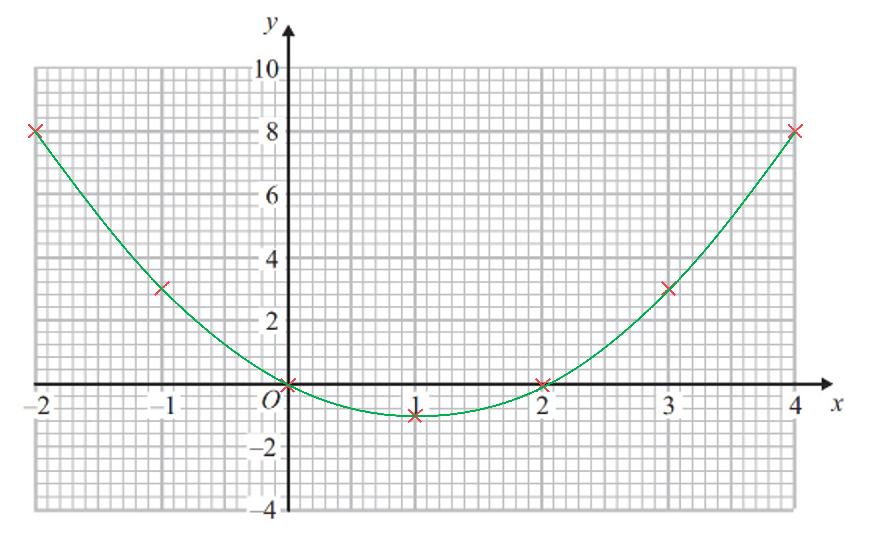

**at least 4 points plotted correctly**** [1]** 
**smooth curve with correct shape through all points**** [1] **
**It is a quadratic function so its graph should be symmetrical about the turning point**

### 15((c)) — 2 marks
> *Method 1** Solving using the graph*

> *We have the graph of *$y=x^{2}-2x$* (from part (b)). We need to rearrange *$x^{2}-2x-2=1$* so that "*$x^{2}-2x$*" appears on its own on one side of the equation*

> *In this case, add 2 to both sides*

`table attributes columnalign right center left columnspacing 0px end attributes row cell x squared minus 2 x minus 2 end cell equals 1 row cell x squared minus 2 x end cell equals 3 end table`

> *Now draw the line *$y=3$* on the graph and read the *$x$* values where this line and *$y=x^{2}-2x$* intersect*

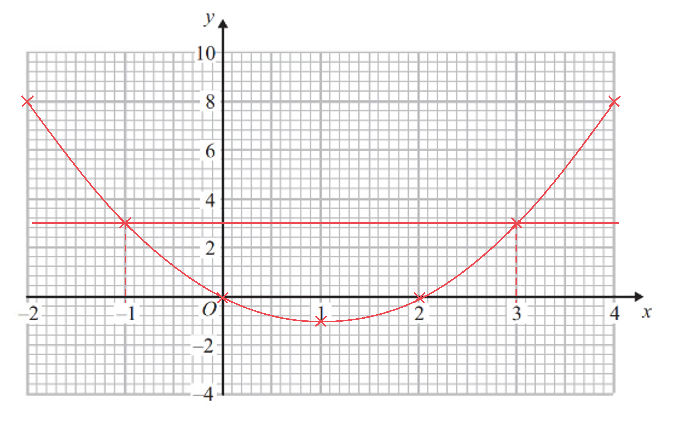

**y = 3 drawn correctly on the grid**** [1]**
**x**** = −1, ****x ****= 3 ****[1] **
**Both possible ****x**** values must be stated to achieve full marks**

> *Method 2** Solving by factorisation*

> *Rearrange *$x^{2}-2x-2=1$* to a quadratic equaling 0*

$x^{2}-2x-3=0$

> *Factorise*

`open parentheses x minus 3 close parentheses open parentheses x plus 1 close parentheses equals 0`

**[1]**

> *If A × B = 0, either A = 0 or B = 0 therefore*

`table row cell x minus 3 end cell equals cell 0 space space space space space or space space space space x plus 1 equals 0 end cell end table`

**x**** = −1, ****x ****= 3 ****[1]**
**Both possible ****x**** values must be stated to achieve full marks**

## Q30 — hard — 6 marks · exam-questions

### 15((a)) — 2 marks
> *Use the TABLE function on your calculator for *`f open parentheses x close parentheses equals x squared minus 2 x minus 1`*, starting at -2, ending at 4 and with steps of 1*

> *If your calculator does not have a TABLE function then substitute the values of *$x$* into the function one by one for the missing values, being careful to put negative numbers in brackets, e.g.*

`x equals 1 comma space y equals open parentheses negative 1 close parentheses squared minus 2 open parentheses negative 1 close parentheses minus 1 equals 2`

> *Put the values found into the table*

| $x$ | $-2$ | $-1$ | $0$ | $1$ | $2$ | $3$ | $4$ |
|---|---|---|---|---|---|---|---|
| $y$ | $7$ | $2$ | $-1$ | $-2$ | $-1$ | $2$ | $7$ |

> *Check that you have entered f(x) correctly by checking that your calculator gives you the same y values as those already given in the question*

**2 or 3 correct values**** [1]** 
**all values correct**** [1]**

### 15((b)) — 2 marks
*Carefully plot the points from your table of values in (a) on the grid, noting the different scales on the *$x$* and *$y$* axes*

> *For example, the first column represents the point *`open parentheses negative 2 comma space 7 close parentheses`

> *After plotting the points, join them with a smooth curve- do not use a ruler!*

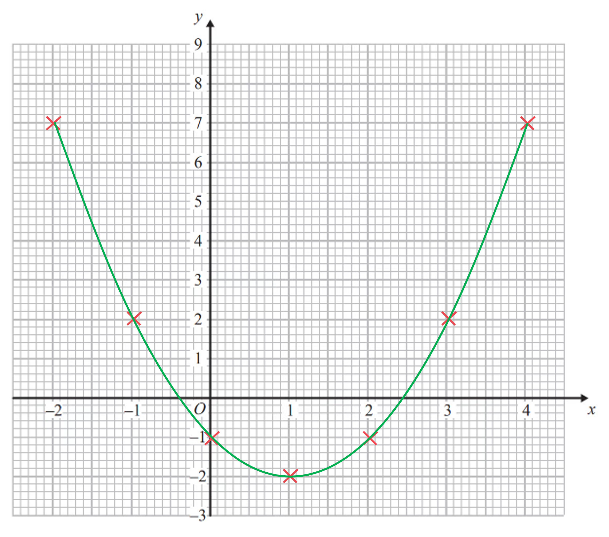

**at least 5 points plotted correctly**** [1]** 
**smooth curve through all points**** [1] **
**It is a quadratic function so its graph should be symmetrical either side of the turning point**

### 15((c)) — 2 marks
> *From part (b), we already have the graph of *$y=x^{2}-2x-1$* so we can plot *$y=x+3$* to see where they intersect *

> *Using your knowledge of **linear graphs **y** = **mx** + **c**, draw a straight line through 3 on the **y**-axis with a gradient of 1*

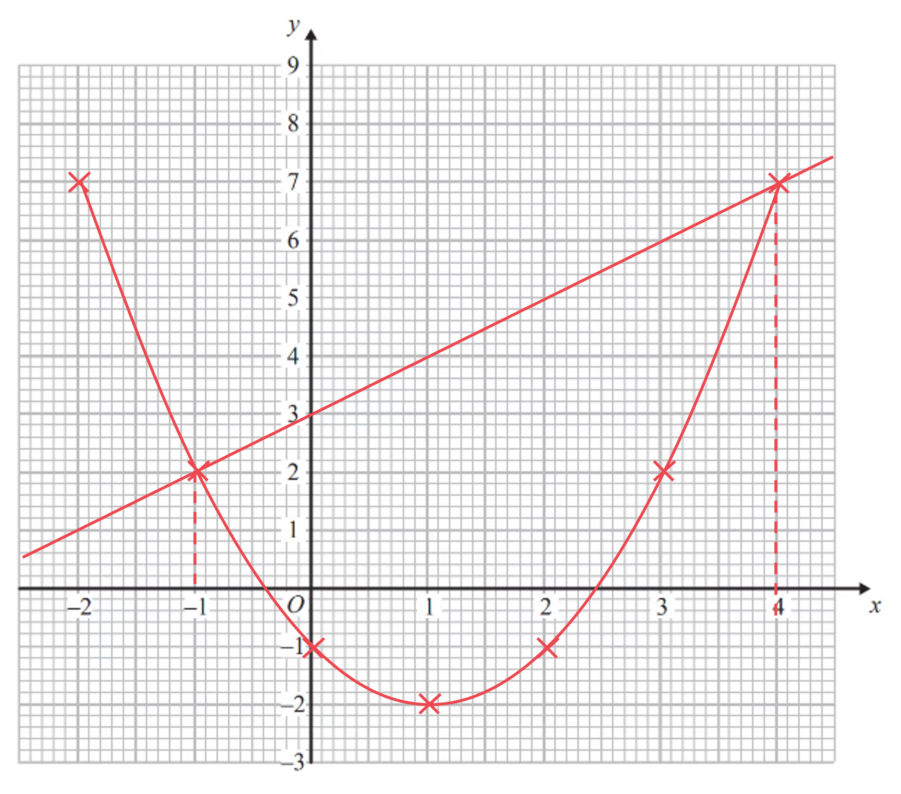

**correct straight line**** [1]**

> *Read the **x**-coordinates of where your straight line intersects with the curve drawn in part (b)*

**x**** = −1, ****x**** = 4**** ****[1] **

**Both possible ****x**** values must be stated to achieve full marks**

> *Method 2** Solving by factorisation*

> *Rearrange *$x^{2}-2x-1=x+3$* to a quadratic equaling 0*

`table row cell x squared minus 2 x minus x minus 1 minus 3 end cell equals 0 row cell x squared minus 3 x minus 4 end cell equals 0 end table`

> *Factorise*

`open parentheses x minus 4 close parentheses open parentheses x plus 1 close parentheses equals 0`

**[1]**

> *If A × B = 0, either A = 0 or B = 0 therefore*

`table row cell x minus 4 end cell equals cell 0 space space space space space or space space space space x plus 1 equals 0 end cell end table`

**x**** = −1, ****x ****= 4 ****[1]**

**Both possible ****x**** values must be stated to achieve full marks**

## Q31 — hard — 6 marks · exam-questions

### 19((a)) — 3 marks
> *The question states to "use the graph" so **do not **try to factorise, complete the square or use the quadratic formula!*

i) *The solution to *$x^{2}-4x-2=0$* is where *$y=x^{2}-4x-2$* and *$y=0$* intersect. As *$y=0$* is the *$x$*-axis, simply read off the grid the *$x$*-values where *$y=x^{2}-4x-2$* crosses the *$x$*-axis Some margin of error is permitted in the answers*

**x**** = −0.4, ****x ****= 4.4 ****[1] **

**one x-value from −0.5 to −0.4 and another x-value from 4.4 to 4.5 ****[1]**

ii) *As we have the graph of *$y=x^{2}-4x-2$*, we need to rearrange *$x^{2}-4x-6=0$* so that *$x^{2}-4x-2$* appears on its own on one side of the equation In this case, we add 4 to both sides of *$x^{2}-4x-6=0$

$x^{2}-4x-2=4$

> *Draw the line *$y=4$* on the grid*

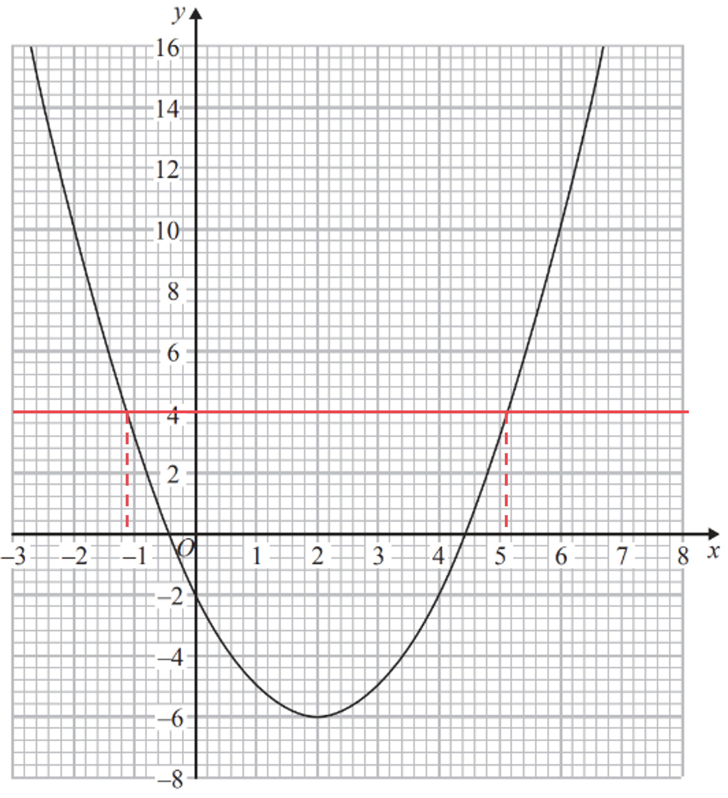

**y = 4 drawn on the grid**** [1]**

> *Read the **x** values where *$y=4$* intersects with  *$y=x^{2}-4x-2$*. Some margin of error is permitted in the answers*

**Final answer:** **x**** = −1.1, ****x**** = 5.1**** **

**one x-value from −1.0 to −1.2 and another x-value from 5.0 to 5.2 ****[1]**

### 19((b)) — 3 marks
> *Rearrange *$x+y=6$* to the form *$y=mx+c$* and use your knowledge of linear graphs to plot it on the grid*

$x+y=6\rightarrowy=-x+6$

> *Draw a straight line through 6 on the **y**-axis with a gradient of −1 on the grid, noting that the **x-** and **y-** axes have a different scale*

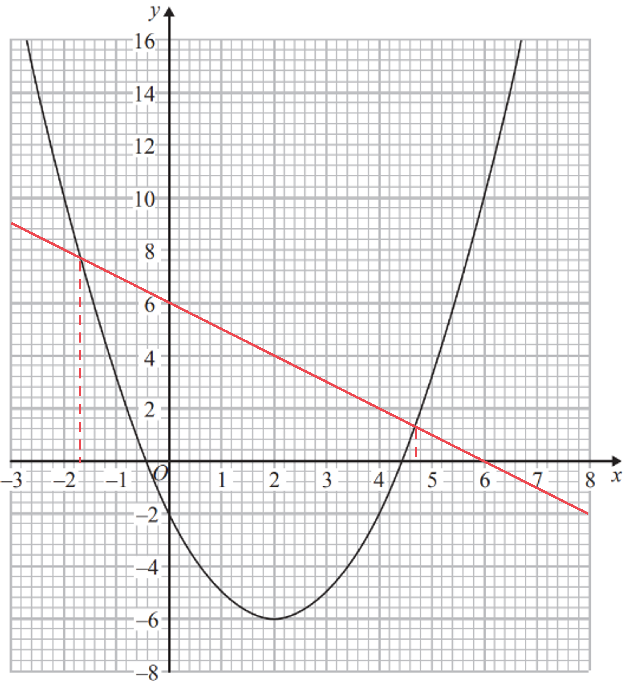

$x+y=6$** drawn correctly on the grid**** [1]**

> *Read the **x** values where the straight line intersects with *$y=x^{2}-4x-2$*. Some margin of error is permitted in the answers*

**Final answer:** **x**** = −1.7, ****x**** = 4.7**** **

**one x-value from −1.6 to −1.8 and another x-value from 4.6 to 4.8 ****[1]**

## Q32 — hard — 8 marks · exam-questions

### 14((a)) — 2 marks
> *Use the TABLE function on your calculator for *`straight f open parentheses x close parentheses space equals space x cubed space minus space 2 x squared space minus space 3 x space plus space 4`*, starting at -2, ending at 3 and with steps of 1.*

> *Before writing your answers in the table, double check that the **y **-values the calculator gives you match the values that are already in the table.*

> *If your calculator does not have a TABLE function then substitute the values of *$x$* into the function one by one for the missing values, being careful to put negative numbers in brackets.*

`x equals negative 2 comma space space space space space y equals open parentheses negative 2 close parentheses cubed space minus space 2 open parentheses negative 2 close parentheses to the power of 2 space end exponent minus 3 open parentheses negative 2 close parentheses space plus space 4 space equals space minus 6
x equals negative 1 comma space space space space space y equals open parentheses negative 1 close parentheses cubed space minus space 2 open parentheses negative 1 close parentheses to the power of 2 space end exponent minus 3 open parentheses negative 1 close parentheses space plus space 4 space equals space 4
x equals space 1 comma space space space space space space space space y equals open parentheses 1 close parentheses cubed space minus space 2 open parentheses 1 close parentheses to the power of 2 space end exponent minus 3 open parentheses 1 close parentheses space plus space 4 space equals space 0
x equals space 2 comma space space space space y equals open parentheses 2 close parentheses cubed space minus space 2 open parentheses 2 close parentheses to the power of 2 space end exponent minus 3 open parentheses 2 close parentheses space plus space 4 space equals space minus 2
x equals 3 comma space space space space y equals open parentheses 3 close parentheses cubed space minus space 2 open parentheses 3 close parentheses to the power of 2 space end exponent minus 3 open parentheses 3 close parentheses space plus space 4 space equals space 4`

| $x$ | -2 | -1 | -0.5 | 0 | 1 | 1.5 | 2 | 3 |
|---|---|---|---|---|---|---|---|---|
| $y$ | **Final answer:** **- 6** | **Final answer:** **4** | 4.875 | 4 | **Final answer:** **0** | -1.625 | **Final answer:** **- 2** | **Final answer:** **4** |

**at least 2 correct values**** [1]** 
**all values correct ****[1]**

### 14((a)) — 2 marks
*Carefully plot the points from your table of values in (a) on the grid, noting the different scales on the *$x$* and *$y$* axes*

> *For example, the first column represents the point *`open parentheses negative 2 comma negative 6 close parentheses`*.*

> *After plotting the points, join them with a smooth curve- do not use a ruler.*

> *The function is a positive cubic so check that your graph is a cubic in the positive direction.*

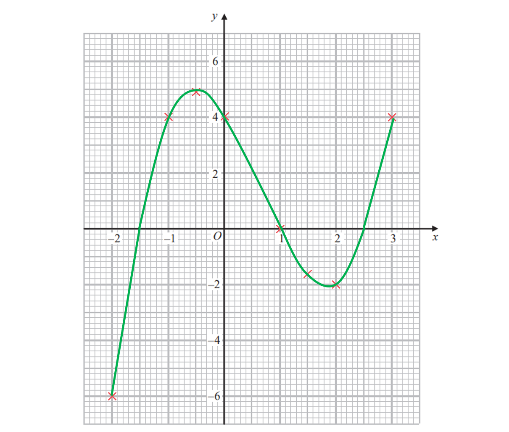

**at least 5 points plotted correctly**** [1]** 
**smooth curve through all points**** [1]**

### 14((c)) — 4 marks
> *We have the graph of *$y=x^{3}-2x^{2}-3x+4$* (from part (b)). We need to rearrange *$x^{3}-2x^{2}-x+1=0$* so that "*$x^{3}-2x^{2}-3x+4$*" appears on its own on one side of the equation.*

> *For the constants, we have + 1 but we want + 4, so add 3 to both sides.*

`table row cell x cubed space minus space 2 x squared space minus space x space plus space 1 space plus space 3 space end cell equals cell space 0 space plus space 3 end cell row cell x cubed space minus space 2 x squared space minus space x space plus space 4 space end cell equals cell space 3 space end cell end table`

> *For the *$x$* **term, we have *$-x$* but we want *$-3x$*, so subtract *$2x$* from both sides.*

`table row cell x cubed space minus space 2 x squared space minus space x space plus space 4 space minus space 2 x space end cell equals cell space 3 space minus space 2 x end cell row cell x cubed space minus space 2 x squared space minus space 3 x space plus space 4 space end cell equals cell space 3 space minus space 2 x space end cell end table`

**[1]**

> *This shows that the solution of *$x^{3}-2x^{2}-x+1=0$* is at the intersection of *$y=x^{3}-2x^{2}-3x+4$* and *$y=3-2x$*.*`blank`

> *Now draw the line *$y=3-2x$* on the graph and read the *$x$* values where this line and *$y=x^{3}-2x^{2}-3x+4$* intersect.*

> *The easiest way to draw the line is to plot 3 values and join them up.*

> *When *$x=0,y=3$*. When *$x=1,y=1$*. When *$x=2,y=-1$*.*

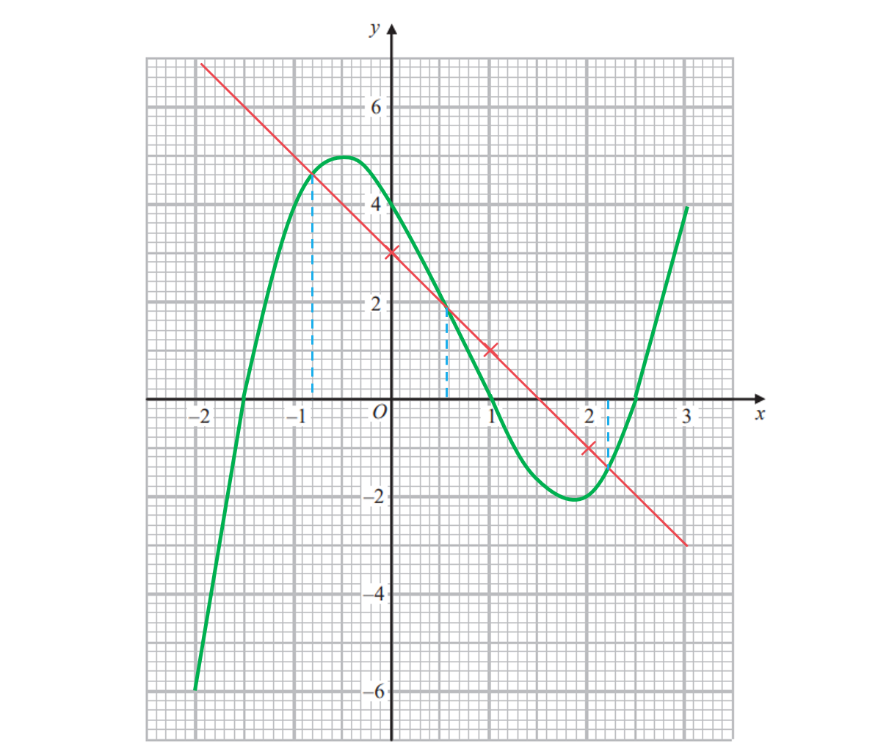

**y = 3 - 2x drawn correctly on the grid**** [1]**

**x**** = −0.8,  ****x ****= 0.6,  ****x ****= 2.2 **
**Any one correct answer ****[1] **
**All three correct answers ****[1]**

## Q33 — hard — 4 marks · exam-questions

### 20() — 4 marks
> *This is a quadratic function so will be the shape of a parabola (∪).*

> *You need to find where the graph crosses the coordinate axes.*

> *The graph crosses the **y**-axis when **x **= 0.*

`x equals 0 space rightwards double arrow space y equals 4 open parentheses 0 minus 1 close parentheses squared space minus space a space equals space 4 space minus space a`

> *We know that **a  **> 4, so the graph crosses the **y **axis **below **zero. *

> *The graph crosses the **x**-axis when **y **= 0.*

`y equals 0 space rightwards double arrow space 0 space equals space 4 open parentheses x minus 1 close parentheses squared space minus space a`

> *Add **a** to both sides and divide by 4.*

`4 open parentheses x minus 1 close parentheses squared space equals space a
open parentheses x space minus space 1 close parentheses squared space equals space a over 4`

> *Square root both sides and then add 1 to both sides.*

`table row cell x minus 1 space end cell equals cell plus-or-minus square root of a over 4 end root end cell row x equals cell 1 space plus-or-minus space square root of a over 4 end root end cell end table`

> *We know that **a  **> 4, so both answers are possible and the graph goes through the **x **axis twice.*

> *The turning point of *`a open parentheses x space plus space b close parentheses to the power of 2 space end exponent plus space c space`*is at the point *$(-b,c).$

`b space equals space minus 1 space comma space space c space equals space minus a space rightwards double arrow space space Minimum space point colon space open parentheses 1 space comma space minus a close parentheses`

> *We know that **a  **> 4, so -**a **< -4 and the minimum point must be in the fourth quadrant.*

> *Draw the parabola by drawing a symmetrical ∪ shape which goes through *$(0,4-a)$*, crosses through *$(1-\sqrt{\frac{a}{4}},0)$* and *$(1+\sqrt{\frac{a}{4}},0)$* and has a minimum point at *$(1,-a)$*.*

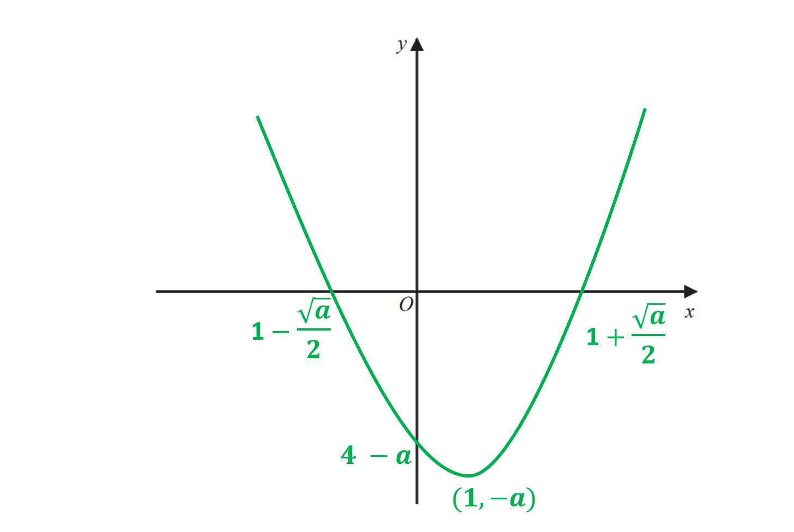

**Drawing a ****∪**** shaped-parabola**** [1] **
**Finding the correct minimum point ****[1] **
**Finding any correct intercept with the axes ****[1]**
**Fully correct graph ****[1]**

## Q34 — hard — 4 marks · exam-questions

### 20((a)) — 3 marks
> *Method 1*

> *The formula for completing the square for a quadratic in the form*$ax^{2}+bx+c$* is *`space space a open parentheses x plus fraction numerator b over denominator 2 a end fraction close parentheses squared minus fraction numerator b squared over denominator 4 a end fraction plus c`*.*

> *Rearrange *$7+12x-3x^{2}$* into the form *$ax^{2}+bx+c.$

$7+12x-3x^{2}=-3x^{2}+12x+7$

> *Therefore *$a=-3,b=12\mathrm{and}c=7$*.*

> *Applying the formula gives*

`negative 3 x squared plus 12 x plus 7 space equals space minus 3 open parentheses x plus fraction numerator 12 over denominator 2 cross times negative 3 end fraction close parentheses squared minus fraction numerator open parentheses 12 close parentheses squared over denominator 4 cross times negative 3 end fraction plus 7`

**[1]**

> *Simplify.*

`table row cell negative 3 x squared plus 12 x plus 7 space end cell equals cell space minus 3 open parentheses x space minus space 2 close parentheses squared space plus space 12 plus 7 end cell row blank equals cell space minus 3 open parentheses x space minus space 2 close parentheses squared space plus space 19 end cell end table`

**[1]**

> *Rearrange into the format required.*

`19 space minus space 3 open parentheses bold italic x bold italic space minus space 2 close parentheses squared`* ***[1]**

** i.e.  **$a=19,b=-3,c=-2$**.**

> *Method 2*

> *Expand the given expression in terms of *$a,b\mathrm{and}c.$

`a space plus space b open parentheses x space plus space c close parentheses squared space equals space a space plus space b open parentheses x squared space plus space 2 c x space plus space c squared close parentheses`

> *Simplify.*

`a space plus space b open parentheses x space plus space c close parentheses squared space equals space a space plus space b x squared space plus space 2 b c x space plus space b c squared`

> *Therefore *$7+12x-3x^{2}=a+bx^{2}+2bcx+bc^{2}$*.*

> *Equating the *$x^{2}$* term gives*

$-3x^{2}=bx^{2}\thereforeb=-3$

**[1]**

> *Equating the *$x$* term gives*

$12x=2bcx$

> *Substitute *$b=-3$*.*

`table row cell 12 x space end cell equals cell space 2 open parentheses negative 3 close parentheses c x space end cell row cell 12 space end cell equals cell space minus 6 c end cell row cell c space end cell equals cell space minus 2 end cell end table`

**[1]**

> *Equating the constant terms gives*

$7=a+bc^{2}$

> *Substitute *$b=-3$* and *$c=-2$*.*

`table row cell 7 space end cell equals cell space a space plus space open parentheses negative 3 close parentheses open parentheses negative 2 close parentheses squared end cell row cell 7 space end cell equals cell space a space plus space open parentheses negative 12 close parentheses end cell row cell a space end cell equals cell space 7 space plus space 12 space end cell row cell a space end cell equals cell space 19 end cell end table`

> *Rearrange into the format required.*

`19 space minus space 3 open parentheses bold italic x bold italic space minus space 2 close parentheses squared`* ***[1]**

** i.e.  **$a=19,b=-3,c=2$**.**

### 20((b)) — 1 marks
> *The turning point of *`a open parentheses x plus b close parentheses squared plus c`* is *`open parentheses negative b comma space c close parentheses`*.*

> *Rearrange *`19 space minus space 3 open parentheses x space minus space 2 close parentheses squared`* into the form *`a open parentheses x plus b close parentheses squared plus c.`

`19 space minus space 3 open parentheses x space minus space 2 close parentheses to the power of 2 space end exponent equals space minus 3 open parentheses x space minus space 2 close parentheses squared space plus space 19`

> *Therefore *$a=-3,b=-2\mathrm{and}c=19$*.*

**The maximum point of C is at** $A(2,19)$ **[1]**

## Q35 — hard — 6 marks · exam-questions

### 22((a)) — 2 marks
> *Use the table function on your calculator for *`straight f open parentheses x close parentheses space equals space 1 half x cubed minus 2 x space plus space 3`*, starting at -3, ending at 3 and with steps of 1.*

> *If your calculator does not have a table function then substitute the values of *$x$* into the function one by one for the missing values, being careful to put negative numbers in brackets.*

`x space equals negative 2 comma space space y space equals space 1 half open parentheses negative 2 close parentheses cubed minus 2 open parentheses negative 2 close parentheses plus 3 space equals space 3
x space equals negative 1 comma space space y space equals space 1 half open parentheses negative 1 close parentheses cubed minus 2 open parentheses negative 1 close parentheses plus 3 space equals space 4.5
x space equals space 1 comma space space y space equals space 1 half open parentheses 1 close parentheses cubed minus 2 open parentheses 1 close parentheses plus 3 space equals space 1.5
x space equals space 3 comma space space y space equals space 1 half open parentheses 3 close parentheses cubed minus 2 open parentheses 3 close parentheses plus 3 space equals space 10.5`

| $x$ | $--3$ | –2 | $--1$ | $0$ | $1$ | $2$ | $3$ |
|---|---|---|---|---|---|---|---|
| $y$ | $--4.5$ | **Final answer:** **3** | **Final answer:** **4.5** | $3$ | **Final answer:** **1.5** | $3$ | **Final answer:** **10.5** |

**at least 2 correct values**** [1]**

**all values correct ****[1]**

**Before writing your answers in the table, double check that the **$y$**-values the calculator gives you match the values that are already in the table**

### 22((b)) — 2 marks
> *Carefully plot the points from your table of values in (a) on the grid, noting the different scales on the *$x$* and *$y$* axes.*

> *The coordinates to plot are (-3, -4.5), (-2, 3), (-1, 4.5), (0, 3), (1, 1.5), (2, 3), (3, 10.5).*

> *After plotting the points, join them with a smooth curve- do not use a ruler!*

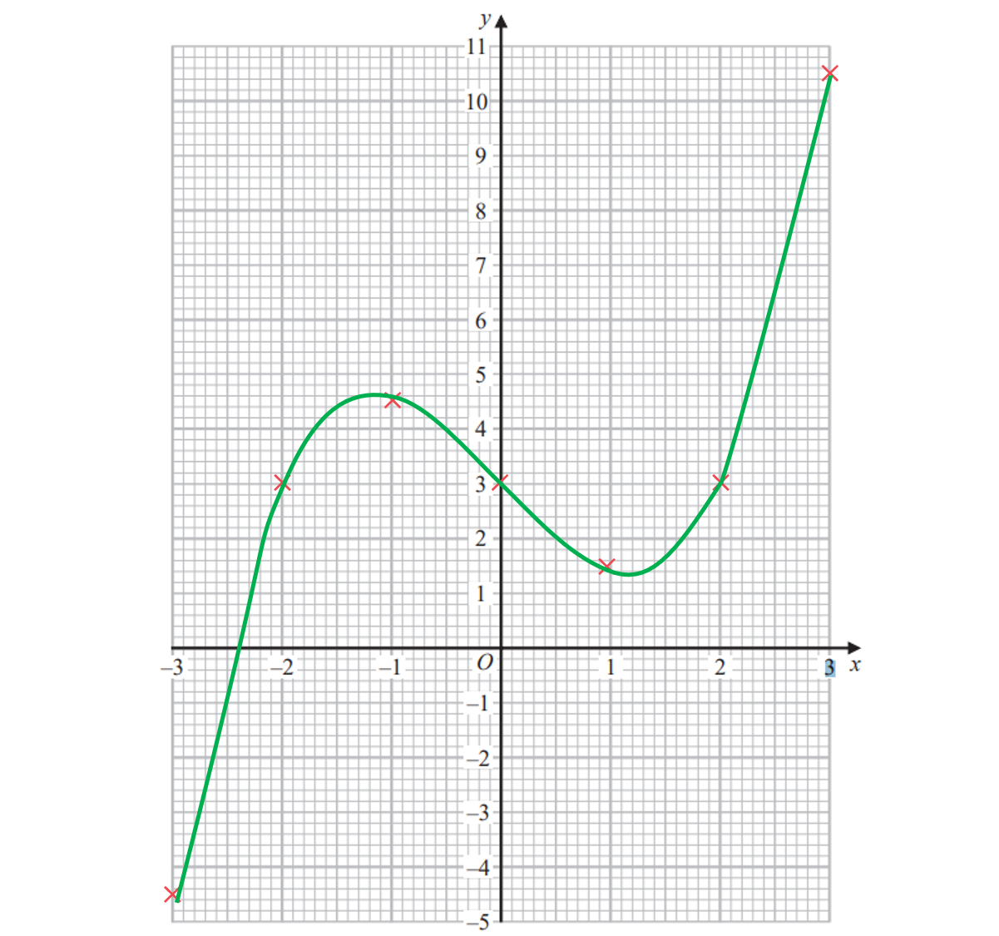

**at least 5 points plotted correctly**** [1]**

**smooth curve with correct shape through all points**** [1]**

### 22((c)) — 2 marks
> *We have the graph of *$y=\frac{1}{2}x^{3}-2x+3$* (from part (b)). We need to rearrange *$\frac{1}{2}x^{3}-x+4=0$* so that "*$\frac{1}{2}x^{3}-2x+3$*" appears on its own on one side of the equation.*

> *In this case, subtract *$x$* and subtract 1 to both sides.*

`table row cell 1 half x cubed minus x plus space 4 space minus space x space minus space 1 end cell equals cell 0 space minus space x space minus space 1 end cell row cell 1 half x cubed space minus 2 x space plus space 3 space end cell equals cell negative x space minus 1 end cell end table`

**[1]**

> *Now draw the line *$y=-x-1$* on the graph and read the *$x$* values where this line and *$y=\frac{1}{2}x^{3}-2x+3$* intersect.*

> * To draw the line *$y=-x-1$* draw a straight line through *$y=-1$* with a gradient of -1. Be careful with the scale on the axis.*

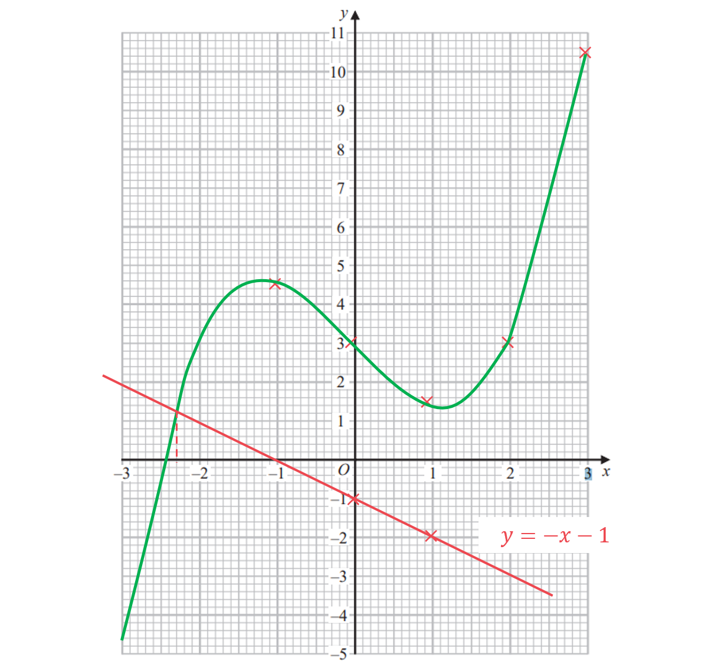

**y = -x -1 drawn correctly on the grid**** [1]**

$x=-2.3$** ****[1] **
**An ****x**** value from -2.3 to -2.4 accepted or from graph if method correct**

## Q36 — hard — 1 marks · exam-questions

### 30() — 1 marks
> *The turning point of *`a open parentheses x plus b close parentheses squared plus c`* is *`open parentheses negative b comma space c close parentheses`*.*

> *Rearrange *`3 space minus space 5 open parentheses x space plus space 1 close parentheses squared`* into the form *`a open parentheses x plus b close parentheses squared plus c.`

`3 space minus space 5 open parentheses x space plus space 1 close parentheses to the power of 2 space end exponent equals space minus 5 open parentheses x space plus space 1 close parentheses squared space plus space 3`

> *Therefore *$a=-5,b=1\mathrm{and}c=3$*.*

**The maximum point of C is at**** **$A(-1,3)$ **[1]**

## Q37 — hard — 6 marks · exam-questions

### 21() — 6 marks
> *This is a quadratic function so will be the shape of a parabola (∪).*

> *You need to find where the graph crosses the coordinate axes.*

> *The graph crosses the **y**-axis when **x **= 0.*

`x equals 0 space rightwards double arrow space y equals open parentheses 0 close parentheses squared space minus space 6 open parentheses 0 close parentheses space plus space 4 space equals space 4 space`

> *So the graph crosses the **y **axis at the point (0, 4). *

> *The graph crosses the **x**-axis when **y **= 0.*

$y=0\Rightarrow0=x^{2}-6x+4$

> *This cannot be factorised so complete the square.*

`table row cell open parentheses x space minus space 3 close parentheses squared space minus 9 space plus space 4 space end cell equals cell space 0 end cell row cell open parentheses x space minus space 3 close parentheses squared space minus 5 space end cell equals cell space 0 end cell end table`

**[1]**

> *Add 5 to both sides.*

`table row cell open parentheses x space minus space 3 close parentheses squared space space end cell equals cell space 5 end cell end table`

**[1]**

> *Square root both sides and then add 3 to both sides.*

`table row cell x minus 3 space end cell equals cell plus-or-minus square root of 5 end cell row cell x space end cell equals cell space 3 space plus-or-minus space square root of 5 end cell end table`

**[1]**

> *The graph goes through the **x **axis twice, at the points *$(3+\sqrt{5},0)$* and *$(3-\sqrt{5},0)$*.*

> *The turning point of *`a open parentheses x space plus space b close parentheses to the power of 2 space end exponent plus space c space`*is at the point *$(-b,c).$

`b space equals space minus 3 space comma space space c space equals space minus 5 space rightwards double arrow space space Minimum space point colon space open parentheses 3 space comma space minus 5 close parentheses`

**[1]**

> *Draw the parabola by drawing a symmetrical ∪ shape which goes through *$(0,4)$*, crosses through *$(3+\sqrt{5},0)$* and *$(3-\sqrt{5},0)$* and has a minimum point at *$(3,-5)$*.*

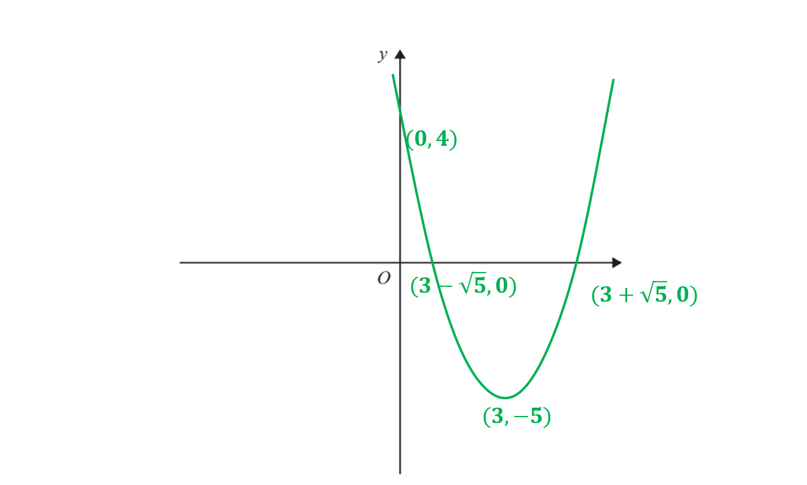

> * *

**Drawing a ****∪**** shaped-parabola through (0,4)**** [1] **
**Fully correct graph ****[1]**

## Q38 — hard — 2 marks · exam-questions

### 21((a)) — 1 marks
> *Write *`straight f open parentheses x close parentheses`* in the form *`y equals a open parentheses x plus p close parentheses squared plus q`*. *`open parentheses negative p comma space q close parentheses`* is the turning point.*

`y equals negative 3 open parentheses x plus 2 close parentheses squared plus 9`

> *From this we can derive the turning point, **A.*

$A=(-2,9)$* ***[1]**

### 21((c)) — 1 marks
> *Method 1: Using "transformations of functions"*

> *Curve *$C$* has the equation *`y equals straight f open parentheses x close parentheses`* where  *`straight f open parentheses x close parentheses equals negative 3 open parentheses x plus 2 close parentheses squared plus 9`*. Therefore;*

`table row cell negative straight f open parentheses x close parentheses end cell equals cell negative open parentheses negative 3 open parentheses x plus 2 close parentheses squared plus 9 close parentheses end cell row blank equals cell 3 open parentheses x plus 2 close parentheses squared minus 9 end cell end table`

> *This is the same equation as curve *$T$*. And *`negative straight f open parentheses x close parentheses`* represents a reflection in the **x**-axis.*

**A reflection in the ****x****-axis*** ***[1]**

> *Method 2: Using "quadratic graphs" and "turning point by completing the square"*

> *Using your knowledge of **quadratic graphs** and **turning point by completing the square**, sketch the curve *$C$* and curve *$T$*.*

> *The equation *`y equals negative 3 open parentheses x plus 2 close parentheses squared plus 9`* tells us curve *$C$* is a n-shaped parabola with a turning point (−2, 9).*

> *The equation *`y equals 3 open parentheses x plus 2 close parentheses squared minus 9`* tells us curve *$T$* is a u-shaped parabola, the same "width" as curve *$C$* and with a turning point (−2, −9).*

> *We can see from the sketch or from the information above that *$C$* and *$T$* are reflections of each other in the **x**-axis.*

**A reflection in the ****x****-axis*** ***[1]r**

## Q39 — hard — 6 marks · exam-questions

### 18((a)) — 3 marks
> *The format required is in completed square form.*

> *The formula for completing the square for a quadratic in the form*$x^{2}+bx+c$*is*`space space open parentheses x space plus space b over 2 close parentheses squared space space minus space open parentheses b over 2 close parentheses squared space plus space c`*.*

> *Complete the square by dividing the middle term (4) by 2.*

`table row cell x squared space plus space 4 x space minus space 16 space end cell equals cell space open parentheses x space plus 4 over 2 close parentheses to the power of 2 space end exponent minus open parentheses 4 over 2 close parentheses squared space minus space 16 end cell row blank equals cell space open parentheses x space plus space 2 close parentheses squared space minus space 2 squared space minus space 16 end cell end table`

**Correct expression in the brackets**** [1] **
**Comparison outside of brackets**** [1]**

> *Simplify.*

`table row blank blank cell open parentheses x space plus space 2 close parentheses squared space minus 4 space minus space 16 end cell end table`

`open parentheses bold italic x space plus space 2 close parentheses squared space minus space 20`* ***[1]**

### 18((b)) — 3 marks
> *You are not asked for axis intercepts however from *$y=x^{2}+4x-16$* it should be apparent that the **y**-intercept is (0, −16).*

> *For the turning point, when a quadratic equation is in the form **y **= **a**(**x − q**)**2** + **r **, the turning point is (**q**, **r **). From (a) we know that **y** = (**x **+ 2)**2** − 20; this tells us that the turning point is (−2, −20).*

> *Now we can sketch the graph.*

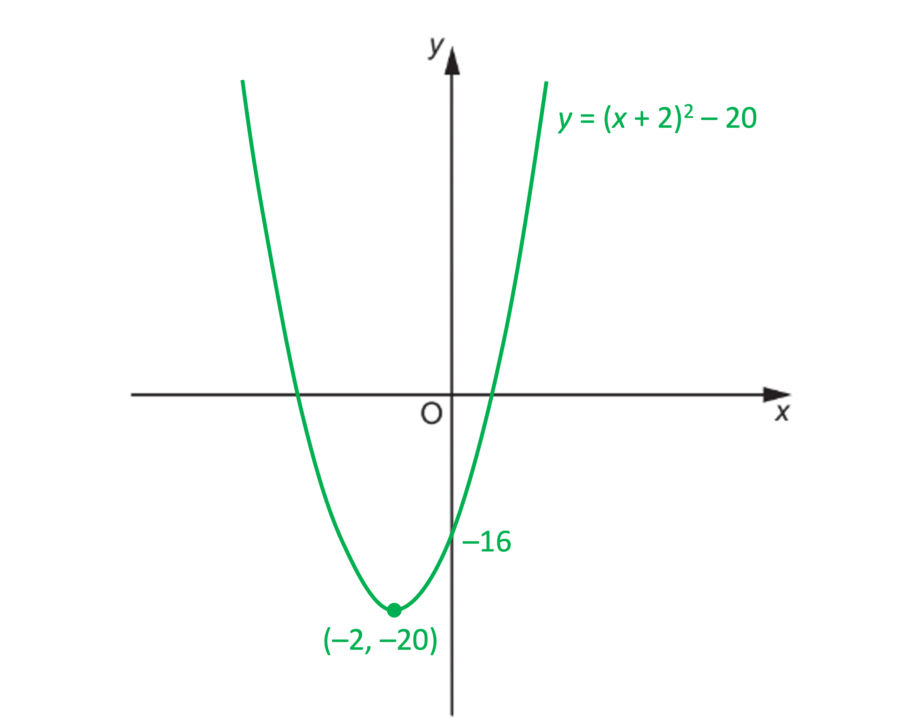

> *(It is not necessary to mark the **y**-intercept, but it serves as an additional check if it looks like it's in the correct part of the graph)*

**u-shaped parabola ****[1]** 
**turning point at (−2, −20) (one mark each ordinate) ****[2]**

## Q40 — hard — 7 marks · exam-questions

### 19((a)) — 3 marks
> *The formula for completing the square for a quadratic in the form*$x^{2}+bx+c$*is*`space space open parentheses x space plus space b over 2 close parentheses squared space space minus space open parentheses b over 2 close parentheses squared space plus space c`*.*

> *Complete the square by dividing the middle term (−10) by 2.*

`table row cell x squared space minus space 10 x space plus space 22 space end cell equals cell space open parentheses x space minus 10 over 2 close parentheses to the power of 2 space end exponent minus space open parentheses fraction numerator negative 10 over denominator 2 end fraction close parentheses squared space plus 22 end cell row blank equals cell space open parentheses x space minus space 5 close parentheses squared space minus space 5 squared space plus 22 end cell end table`

**Correct expression in the brackets**** [1]**

> *Simplify.*

`table row space equals cell open parentheses x space minus space 5 close parentheses squared space minus 25 space plus space 22 end cell end table`

**'− 25 + 22' outside the brackets ****[1]**

> *Simplify to its final form.*

`open parentheses bold italic x space minus space 5 close parentheses squared space minus space 3`* ***[1]**

### 19((b)) — 4 marks
> $\circ$* **y** = **x**2** − 10**x** + 22 is a quadratic equation with a positive coefficient of **x**2** so its graph is a u-shaped parabola.*

> $\circ$* When **x** = 0, **y** = 22 so the **y**-intercept is (0, 22).*

> $\circ$* When a quadratic equation is in the form **y **= **a**(**x − q**)**2** + **r **, the turning point is (**q**, **r **). From part (a), **y** = (**x **− 5)**2** − 3 which tells us that the turning point is (5, −3).*

> *Now sketch using these three key bits of information; u-shaped parabola, (0, 22) and (5, −3).*

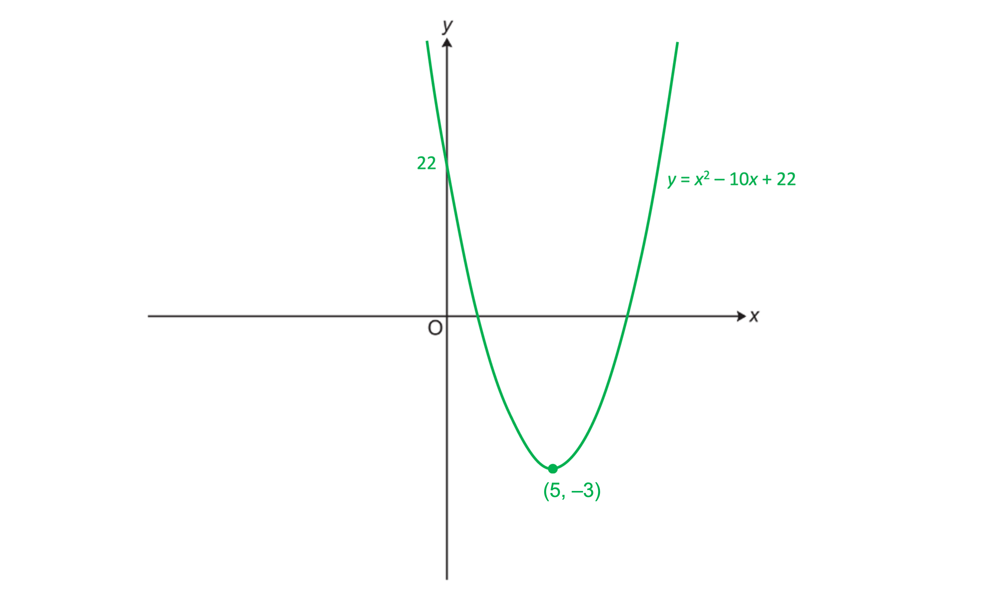

**u-shaped parabola ****[1]**** **
**y-intercept at (0, 22) marked ****[1]** 
**turning point at (5, -3) (one mark each ordinate) ****[2]**

## Q41 — hard — 2 marks · exam-questions

### 19((a)) — 2 marks
> *The solutions to 2**x**2** + 3x** − **9 = 0 are where the graph of **y** = 2**x**2** + 3x** − **9 intersects the graph of **y** = 0; i.e. where it crosses the **x**-axis.*

**x**** = −3 ****  [1]** 
**x**** = 1.5****  [1]**

## Q42 — hard — 8 marks · exam-questions

### 19((a)) — 3 marks
> *You are not asked for axis intercepts so don't need to find the **y**-intercept.*

> *For the turning point, when a quadratic equation is in the form **y **= **a**(**x − q**)**2** + **r **, the turning point is (**q**, **r **). **y** = (**x **− 2)**2** − 3 tells us that the turning point is (2, −3).*

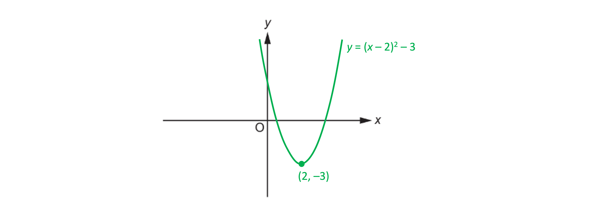

**u-shaped parabola ****[1]** 
**turning point at (2, −3) (one mark each ordinate) ****[2]**

### 19((b)) — 5 marks
> *The roots of the quadratic equation are (−3, 0) and (−1, 0) which tells you that the equation takes the form;*

`y equals a open parentheses x plus 3 close parentheses open parentheses x plus 1 close parentheses`

**[1]**

> *Expand the brackets.*

$y=a(x^{2}+4x+3)$

**[1]**

> *To find **a**, substitute in the point (0, 12) and solve for **a**.*

`table attributes columnalign right center left columnspacing 0px end attributes row size 16px 12 size 16px equals cell size 16px a begin mathsize 16px style stretchy left parenthesis 0 squared plus 4 open parentheses 0 close parentheses plus 3 stretchy right parenthesis end style end cell row size 16px 12 size 16px equals cell size 16px 3 size 16px a end cell row size 16px 4 size 16px equals size 16px a end table`

`table row bold italic a bold equals bold 4 end table`* ***[1]**

> *Replace **a** with 4 in *$y=a(x^{2}+4x+3)$* and expand to find **b** and **c**.*

`table row y equals cell 4 stretchy left parenthesis x squared plus 4 x plus 3 stretchy right parenthesis end cell row blank equals cell 4 x squared plus 16 x plus 12 end cell end table`

$b=16$** [1] **
$c=12$** [1]**

## Q43 — hard — 6 marks · exam-questions

### 21() — 6 marks
> **[exam-tip]**
> The question refers to 'exact' coordinates of any points of intersection with the coordinate axes.
> 
> This is a hint that $x^{2}--6x+4=0$  is unlikely to be solvable by factorising. Therefore, either completing the square or the quadratic formula should be used.
> 
> As the completed square form is also a way to find the coordinates of the turning point, it is more efficient here to use this method for both the turning point and the roots.

> *The coordinates of the turning point are found by writing the function in completed square form (*`open parentheses x minus a close parentheses squared plus b`*, where *`open parentheses a comma space b close parentheses`* are the coordinates of the turning point)*

`table row cell x squared minus 6 x plus 4 end cell equals cell open parentheses x minus 3 close parentheses squared minus 9 plus 4 end cell row blank equals cell space open parentheses x minus 3 close parentheses squared minus 5 end cell end table`

**[M1 A1]**

*The coordinates of the turning point are (3, -5)*

> *The roots of the function (the intersection with **x**-axis) occur when *$y=0$

> *Therefore you can solve the equation for **x** using the completed square form*

`table row cell open parentheses x minus 3 close parentheses squared minus 5 end cell equals 0 row cell open parentheses x minus 3 close parentheses squared end cell equals 5 row cell x minus 3 end cell equals cell plus-or-minus square root of 5 end cell end table`

$x=3+\sqrt{5}$* or *$x=3-\sqrt{5}$

**[M1 A1]**

*The coordinates of the intersections with the ***x***-axis are *`open parentheses 3 minus square root of 5 space comma space 0 close parentheses`* and *`open parentheses 3 plus square root of 5 space comma space 0 close parentheses`

> *The y-intercept can be found by substituting *$x=0$* into the function*

`open parentheses 0 close parentheses squared minus 6 open parentheses 0 close parentheses plus 4 equals 4`

*The y-intercept is (0, 4)*

> *Make a sketch of the curve, C, labelling the coordinates of the intersections with the axes and the coordinates of the turning point as below*

**[B1 B1]**

> **[mark-scheme]**
> **M1**: Showing a correct first step for a correct method for finding the coordinates of the turning points (e.g. initial completed the square form `open parentheses x minus 3 close parentheses squared minus 3 squared plus 4` or differentiating to give $\frac{dy}{dx}=2x-6$ for example)
> 
> **A1**: For calculating the* x*-coordinate of the turning point correctly. This mark will still be awarded for an incorrectly evaluated *x*-coordinate of the turning point as long as the first M1 mark has been awarded.
> 
> **M1**: Showing a  correct method for calculating the roots of the equation will gain this mark (e.g. substituting correctly into the quadratic formula or completing the square).
> 
> **A1**: This mark is awarded for the two exact solutions of the roots of the equations calculated in any equivalent form (e.g. $x=3\pm\sqrt{5}$)
> 
> **B1**: A positive parabola drawn on the axes intercepting the* y*-axis at (0,4) will gain this mark.
> 
> **B1**: For a fully correct graph sketched on the axes with correct labelling of *x*-intercepts, *y*-intercept and coordinate of the turning point.

## Q44 — hard — 4 marks · exam-questions

### 16((a)) — 2 marks
> **[exam-tip]**
> Having secure recall of the points of intersection with the axes, coordinates of turning points and equations of asymptotes for the trigonometric functions will support answering this question.

(i)

> $\mathrm{sin}x=0$* whenever *$x$* is a multiple of 180°*

> $P$* is the first positive solution*

`sin open parentheses 180 degree close parentheses equals 0`

**Final answer:** **(180, 0)**

**[B1]**

(ii)

> *The minimum value of *$\mathrm{sin}x$* is -1*

> *This occurs when *$x=270^{\circ}$

`sin open parentheses 270 degree close parentheses equals negative 1`

**Final answer:** **(270, -1)**

**[****B1]**

### 16((b)) — 2 marks
> *The graph of *`tan open parentheses x close parentheses`* intersects the *$x$*-axis at 0**o**, 180**o** and 360**o** within the given range*

> *It intersects the *$y$*-axis at 0*

> *It has asymptotes with equations *$x=90^{\circ}$* and *$x=270^{\circ}$

> *The graph is disconnected and repeats in s-shaped curves*

> *You can use a table of values and a calculator to generate coordinates to plot to guide you*

> *For example:*

| $x$ | $y$ |
|---|---|
| *0* | *0* |
| *45* | *1* |
| *90* | *undefined* |
| *135* | *-1* |
| *180* | *0* |
| *225* | *1* |
| *270* | *Undefined* |
| *315* | *-1* |
| *360* | *0* |

> *Correct sketch is below*

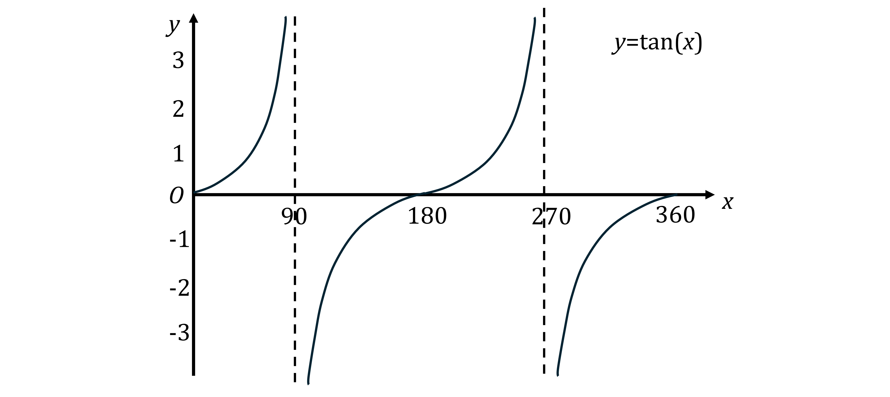

**[M1 A1]**

> **[mark-scheme]**
> **M1**: For the correct shape curve which would require placement of asymptotes to show that that the graph is disconnected.
> 
> **A1**: For the correct intersection with the $x$-axis at 0o, 180o and 360o.

## Q45 — hard — 3 marks · exam-questions

### 18() — 3 marks
> *For *$y=\mathrm{sin}x$* you need to look for a graph that has the key points of a sine graph*

- *A wave that goes through the origin*

> **[exam-tip]**
> Don't be confused by Graph A here! Graph A looks like part of a sine curve. But $\mathrm{sin}x$ becomes positive as it moves away from the origin to the right, so Graph A cannot be the graph of $y=\mathrm{sin}x$.

**Final answer:** **Graph C**

**[B1]**

> *For *$y=-\frac{3}{x}$*you are looking for a negative reciprocal graph*

> *Both B and F are reciprocals but only F is negative*

**Final answer:** **Graph F**

**[B1]**

> *For *$y=4x^{3}-5x$*you are looking for a positive cubic graph*

> *This is sort of an "s on its side" shape which should *

- *increase at the start to a maximum point*
- *then decrease to a minimum point*
- *and finally keep increasing as it moves to the right from the minimum*

**Final answer:** **Graph A**

**[B1]**

| Equation | Graph |
|---|---|
| $y=\mathrm{sin}x$ | **Final answer:** **C** |
| $y=-\frac{3}{x}$ | **Final answer:** **F** |
| $y=4x^{3}-5x$ | **Final answer:** **A** |

> **[exam-tip]**
> Graph B is a positive reciprocal, Graph D is a positive quadratic, and Graph E is a cosine graph.
