# Mark Schemes — Linear Graphs y = mx + c
**Graphs & Coordinates** · Edexcel IGCSE Maths A (Modular) (4XMAF/4XMAH) — 24/Higher Unit 1

## Q1 — easy — 3 marks · exam-questions

### 4() — 3 marks
> *Method 1** Using **y **= **mx** + **c*

> *c **represents the **y**-intercept. In this case **c** = −2, so draw a point at (0, −2)*

**point at or line passing through (0, −2) ****[1]**

> *m **represents the gradient. In this case **m** = 3 so *$\frac{\mathrm{rise}}{\mathrm{run}}=\frac{3}{1}$

*From (0, −2), count 3 units up and 1 unit right, noting that the scale on the **y-**axis is different to the scale on the **x**-axis. Mark a new point at (1, 1)*

> *Repeat: from (1, 1), count 3 units up and 1 unit right. Mark a new point at (2, 4)*

**line with a gradient of 3**** [1]**

> *Using a ruler or straight edge, draw a straight line through the three points, making sure your line extends in both directions between **x** = −1 and **x** = 3*

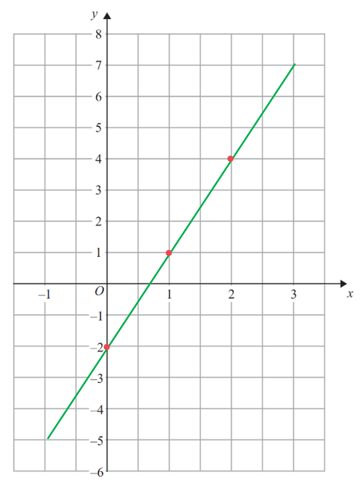

**fully correct line between x = −1*** ***and x = 3**** [1]**

**Be careful to check the scale on the ****x**** and ****y**** axes!**

> *Method 2** Using a table*

> *Use the TABLE function of your calculator with f(x) = 3**x − ** 2 from **x** = **−**1 to **x** = 3 to produce the table below *

> *(If you don't have the TABLE function on your calculator then you can produce the table manually by substituting **x** values into f(x) = 3**x − ** 2) *

| **x** | *−1* | *0* | *1* | *2* | *3* |
|---|---|---|---|---|---|
| *f(***x***)* | *−5* | *−2* | *1* | *4* | *7* |

> *Copy the table down as it is worth a method mark!*

**at least 2 correct coordinate pairs found  ****[1]**

> *Plot the points on the grid, noting that the scale on the **x- **and **y-** axes are different. *

> *For example, the first column of the table represents the point (−1, −5). *

> *Using a ruler or straight edge, join the points with a straight line. The line should go through all the points if they have been calculated correctly*

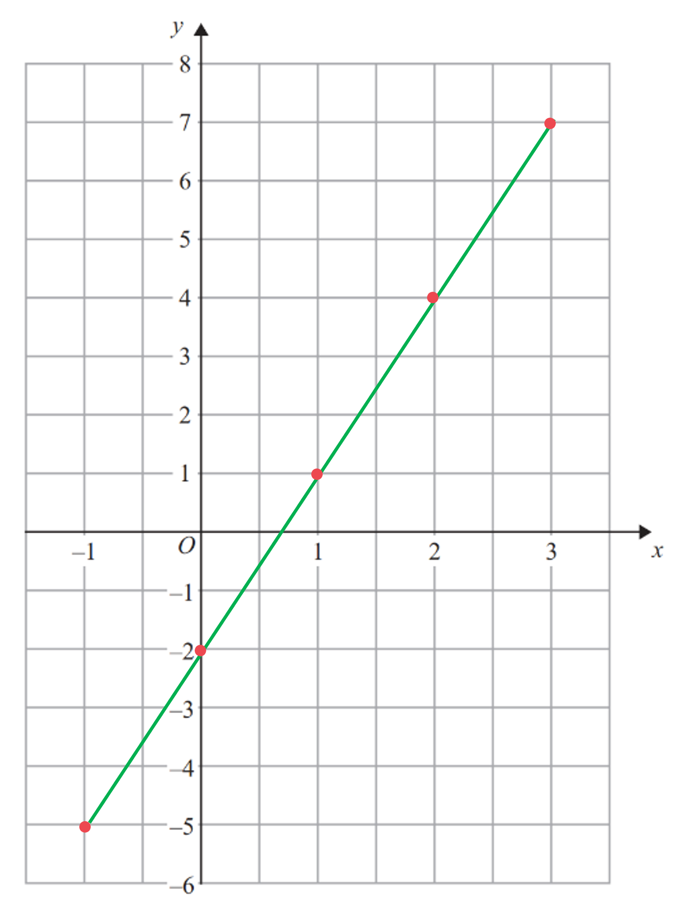

**straight line through at least 3 correct points**** [1] **
**fully correct line between x = −1*** ***and x = 3**** [1]**

**Be careful to check the scale on the ****x**** and ****y**** axes!**

## Q2 — easy — 3 marks · exam-questions

### 3() — 3 marks
> *Using **y** =** mx** + **c**...*

> *The line passes through 1 on the y-axis. This tells us that **c** = 1.*

**[1]**

> *To find the gradient, pick two points on the line that pass through vertices of the grid. *

> *For example, below we have picked (0, 1) and (4, 9)*

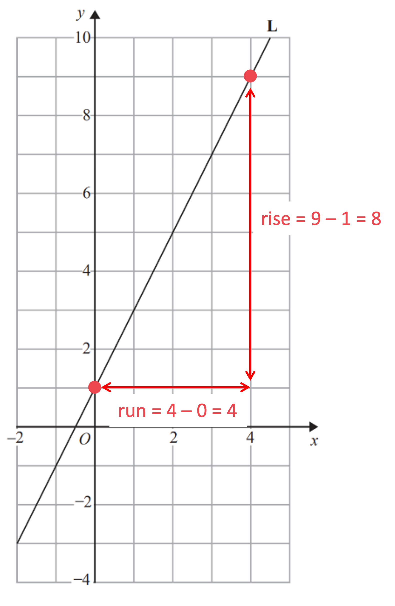

> *By counting squares on the grid, we see that the gradient is*

**m**$=\frac{8}{4}=2$

> *Alternatively, we could use the gradient formula *$\frac{y_{1}-y_{2}}{x_{1}-x_{2}}$* with (0, 1) and (4, 9)*

**m**$=\frac{9-1}{4-0}=\frac{8}{4}=2$

**suitable method to find m**** [1]**

> *Put **m** and **c** together in the form **y **= **mx **+ **c*

**Final answer:** **y ****= 2****x**** + 1 ****[1]**

## Q3 — easy — 3 marks · exam-questions

### 12() — 3 marks
> *Method 1** Using **y **= **mx** + **c*

> *c **represents the **y**-intercept. In this case **c** = 5, so draw a point at (0, 5)*

**point at or line passing through (0, 5) ****[1]**

> *m **represents the gradient. In this case **m** = *$\frac{1}{2}$* so *$\frac{\mathrm{rise}}{\mathrm{run}}=\frac{1}{2}$

*From (0, 5), count 1 unit up and 2 units right. Mark a new point at (2, 6)*

> *Repeat: from (2, 6), count 1 unit up and 2 units right. Mark a new point at (4, 7)*

**line with a gradient of 0.5**** [1]**

> *Using a ruler or straight edge, draw a straight line through the three points, making sure your line extends in both directions between **x** = −2 and **x** = 4*

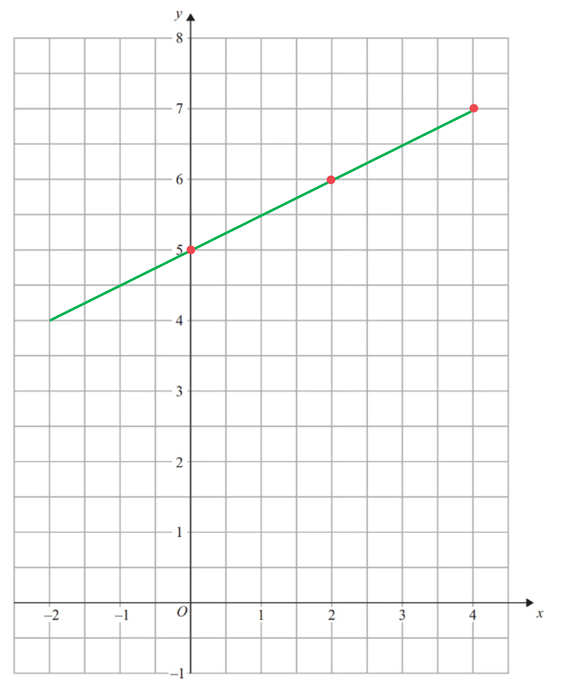

**fully correct line**** [1]**

> *Method 2** Using a table*

> *Set up a table of values as below. You don't have to include every integer between −2 and 4, but you should include at least three values*

| $x$ | *−2* | *0* | *2* | *4* |
|---|---|---|---|---|
| $y$ |   |   |   |   |

> *Use the TABLE application of your calculator to complete the table, using f(x) = *$\frac{1}{2}$*x + 5, starting at -2 and ending at 4. I*

> *f your calculator doesn't have a TABLE application, substitute **x** values **y** = *$\frac{1}{2}$*x** + 5 to find the **y **values*

| $x$ | *−2* | *0* | *2* | *4* |
|---|---|---|---|---|
| $y$ | *4* | *5* | *6* | *7* |

**at least 2 correct y-values found by substituting x ****[1]**

> *Plot the points on the grid. For example the first column of the table represents the point (−2, 4)*

**at least 2 points correctly plotted**** [1]**

> *Using a ruler or straight edge, draw a straight line through the points, from **x** = −2 to **x** = 4*

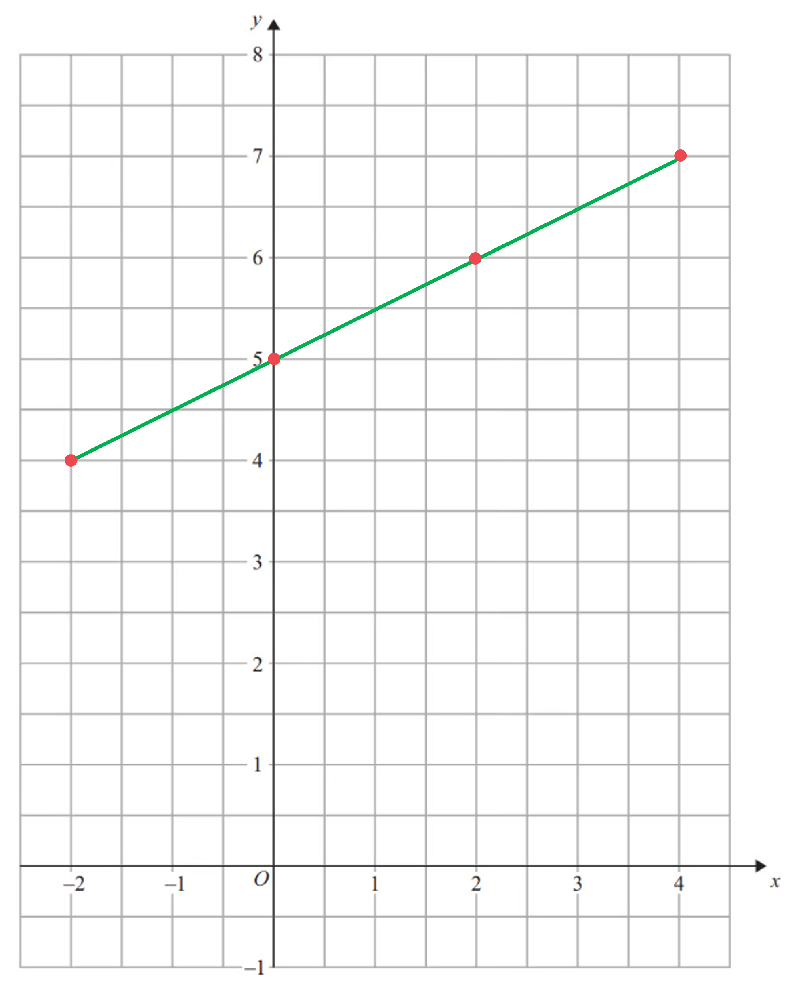

**fully correct line**** [1]**

## Q4 — easy — 4 marks · exam-questions

### 4((a)) — 2 marks
> *Method 1*

> *Use the TABLE application of your calculator with f(x) = 2x + 5, starting at -1 and ending at 2, steps of 1, to complete the table.*

> *If your calculator doesn't have a TABLE application, substitute **x** values **y** = 2**x** + 5 to find the **y **values*

| $x$ | $-2$ | $-1$ | $0$ | $1$ | $2$ |
|---|---|---|---|---|---|
| $y$ | $1$ | $3$ | $5$ | $7$ | $9$ |

** 2 correct values ****[1] **

**all 3 correct values ****[1]**

> *Method 2 *

> *Recognise that *$y=2x+5$* is a linear equation, so as the *$x$* values are increasing by 1 each time, the *$y$* values increase by 2 each time *

> *Starting with the first missing value:*

$1+2=3$

| $x$ | $-2$ | $-1$ | $0$ | $1$ | $2$ |
|---|---|---|---|---|---|
| $y$ | $1$ | $3$ | $5$ |   |   |

> *Repeat for the next two missing values*

$5+2=7\,7+2=9$

| $x$ | $-2$ | $-1$ | $0$ | $1$ | $2$ |
|---|---|---|---|---|---|
| $y$ | $1$ | $3$ | $5$ | $7$ | $9$ |

**2 correct values ****[1] **

**all 3 correct values ****[1]**

### 4((b)) — 2 marks
> *Plot the columns of the table as coordinate points. For example, the first column is plotted as (−2, 1) *

> *Note that the scale on the **x-**axis is two squares for one unit whereas the scale on the **y**-axis is one square for one unit*

> *Join all the points with a ruled straight line*

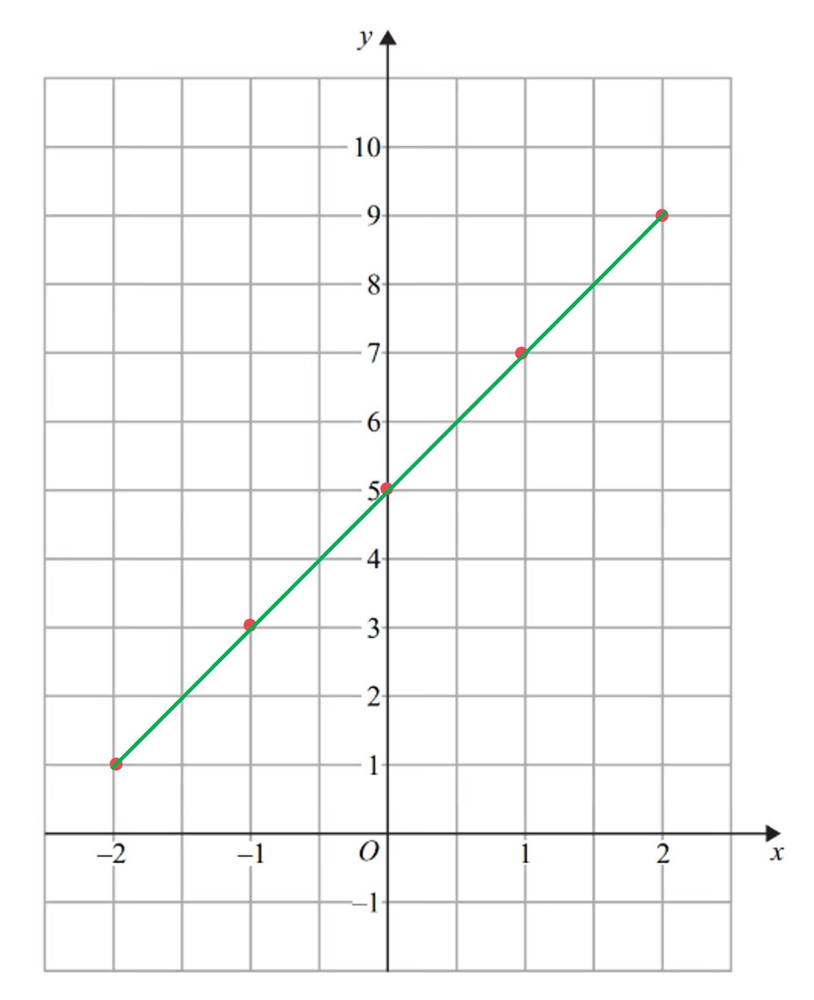

**straight line with correct gradient of 2 or straight line through 5 on the y-axis [1]**

**fully correct answer [1]**

**Be careful with the different scales on the ****y****- and ****x****- axes!**

## Q5 — easy — 3 marks · exam-questions

### 7() — 3 marks
> *Method 1** Using **y** =** mx** + **c*

> *Rearrange *$y=8-2x$* to *$y=-2x+8$* if necessary*

> *c **represents the **y**-intercept. In this case **c** = 8, so draw a point at (0, 8)*

**point at or line passing through (0, 8) ****[1]**

> *m **represents the gradient. In this case **m** = −2 so *$\frac{\mathrm{rise}}{\mathrm{run}}=\frac{-2}{1}\mathrm{or}\frac{2}{-1}$

*From (0, 8), count 2 units down and 1 unit right, and mark a new point at (1, 6) *
*Noting that 1 unit on the **x** axis is 2 squares, but 1 unit on the **y-**axis is 1 square!*
 *Repeat, marking new points at (2, 4), (3, 2) and (4, 0)*

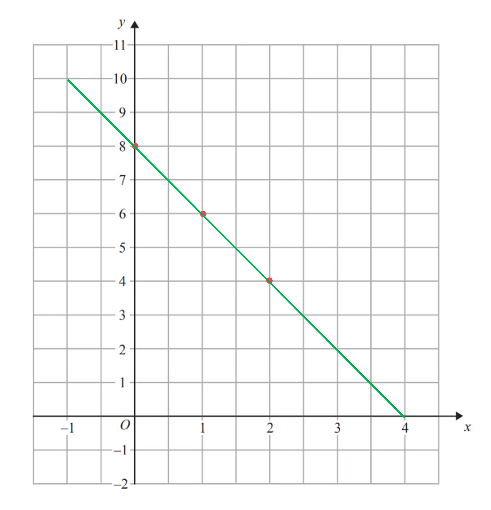

> *Note we could also count 2 units up and one unit left from (0, 8)*

**line with a gradient of −2**** [1] **
**fully correct line between x = −1 and x = 4**** [1]**

**Be careful to check the scale on the ****x**** and ****y**** axes!**

> *Method 2** Using a table*

> *Use the TABLE function of your calculator with f(x) = 8** − ** 2**x**  from **x** = −1 to** x **= 4 to produce the table below *

> *(If you don't have the TABLE function on your calculator then you can produce points manually by substituting **x** values into f(x) = 8** −  2x**)*

| **x** | *−1* | *0* | *1* | *2* | *3* | *4* |
|---|---|---|---|---|---|---|
| *f(***x***)* | *10* | *8* | *6* | *4* | *2* | *0* |

> *Copy the table down as it is worth a method mark!*

**at least 2 correct coordinate pairs found  ****[1]**

> *Plot the points on the grid, noting that the scale on the **x- **and **y-** axes are different. *

> *For example, the first column of the table represents the point (−1, 10).*

> * Using a ruler or straight edge, join the points with a straight line. The line should go through all the points if they have been calculated correctly*

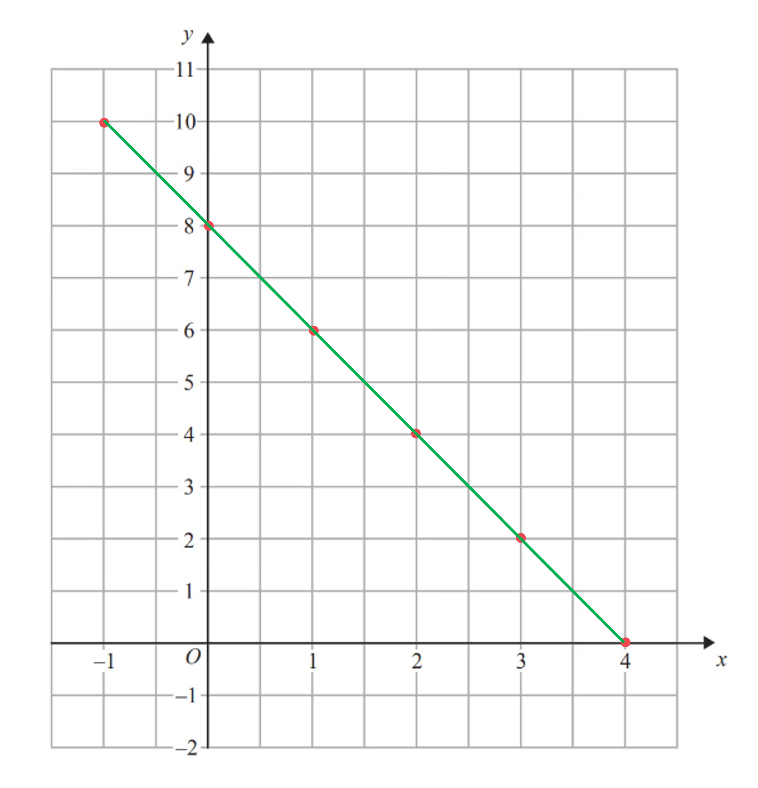

**straight line through at least 3 correct points**** [1] **
**fully correct line between x = −1*** ***and x = 4**** [1]**

**Be careful to check the scale on the ****x**** and ****y**** axes!**

## Q6 — easy — 3 marks · exam-questions

### 3() — 3 marks
> *Using **y** =** mx** + **c**...*

> *The line passes through −6 on the y-axis. This tells us that **c** = −6.*

**[1]**

> *To find the gradient, pick two points on the line that pass through vertices of the grid. For example, pick (0, −6) and (2, 0)*

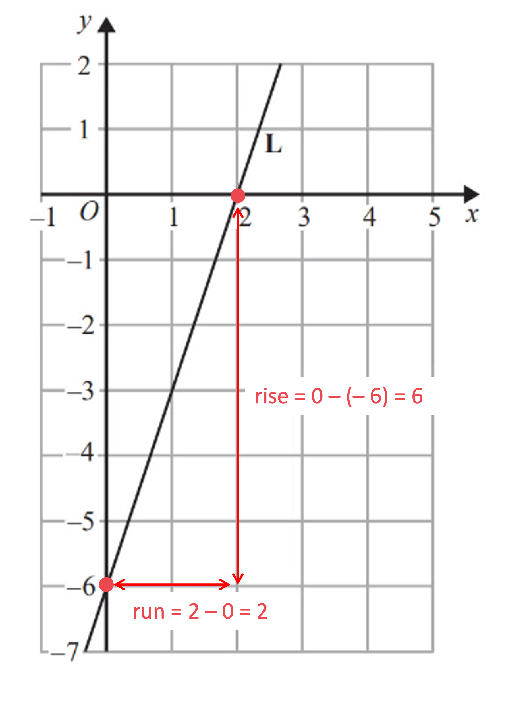

> *By counting squares on the grid, we see that the gradient is*

**m**$=\frac{6}{2}=3$

> *Alternatively, we could use the gradient formula *$\frac{y_{1}-y_{2}}{x_{1}-x_{2}}$* with (0, −6) and (2, 0)*

**m**`equals fraction numerator 0 minus open parentheses negative 6 close parentheses over denominator 2 minus 0 end fraction equals 6 over 2 equals 3`

**suitable method to find m**** [1]**

> *Put **m** and **c** together in the form **y **= **mx **+ **c*

**y ****= 3****x**** − 6 ****[1]**

## Q7 — easy — 3 marks · exam-questions

### 2() — 3 marks
> *Method 1** Using **y **= **mx** + **c*

> *c **represents the **y**-intercept. In this case **c** = −3, so draw a point at (0, −3)*

**point at or line passing through (0, −3) ****[1]**

> *m **represents the gradient. In this case **m** = 2 so *$\frac{\mathrm{rise}}{\mathrm{run}}=\frac{2}{1}$

*From (0, −3), count 2 units up and 1 unit right, noting that the scale on the **y-**axis is different to the scale on the **x**-axis. Mark a new point at (1, −1)*

> *Repeat: from (1, −1), count 2 units up and 1 unit right. Mark a new point at (2, 1)*

**line with a gradient of 2**** [1]**

> *Using a ruler or straight edge, draw a straight line through the three points, making sure your line extends in both directions between **x** = −2 and **x** = 4*

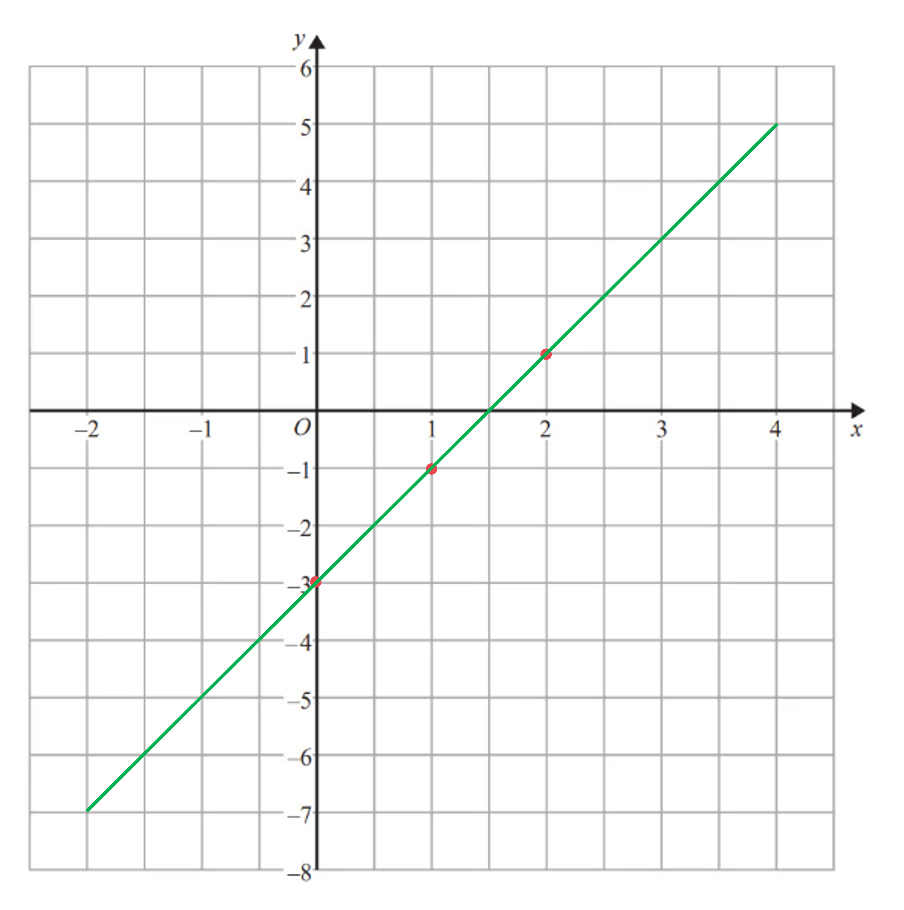

**fully correct line between x = −2*** ***and x = 4**** [1]**

**Be careful to check the scale on the ****x**** and ****y**** axes!**

> *Method 2** Using a table*

> *Use the TABLE function of your calculator with f(x) = 3**x − ** 2 to produce the table below *

> *(If you don't have the TABLE function on your calculator then you can produce the table manually by substituting **x** values into f(x) = 3**x − ** 2) *

| **x** | *−2* | *−1* | *0* | *1* | *2* | *3* | *4* |
|---|---|---|---|---|---|---|---|
| *f(***x***)* | *−7* | *−5* | *−3* | *−1* | *1* | *3* | *5* |

> *Copy the table down as it is worth a method mark!*

**at least 2 correct coordinate pairs found  ****[1]**

> *Plot the points on the grid, noting that the scale on the **x- **and **y-** axes are different. *

F*or example, the first column of the table represents the point (−2, −7). *

> *Using a ruler or straight edge, join the points with a straight line. The line should go through all the points if they have been calculated correctly*

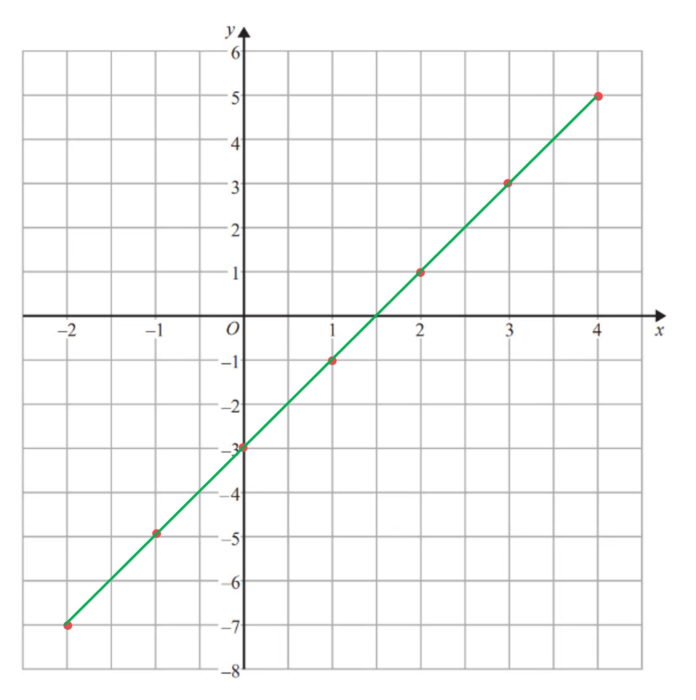

**straight line through at least 3 correct points**** [1] **
**fully correct line between x = −2*** ***and x = 4**** [1]**

**Be careful to check the scale on the ****x**** and ****y**** axes!**

## Q8 — easy — 1 marks · exam-questions

### 10((b)) — 1 marks
> *The graph crosses the **y-**axis at the point where **x **= 0.*

*Find the point where the graph crosses the **y** axis by substituting **x **= 0 into the equation of the line.*

`2 y space plus space 7 open parentheses 0 close parentheses space equals space 10`

**[1]**

> *Solve to find **x.*

`table row cell 2 y space end cell equals cell space 10 end cell row cell y space end cell equals cell space 10 over 2 end cell end table`

$(0,5)$* ***[1]**

## Q9 — easy — 2 marks · exam-questions

### 7((a)) — 2 marks
> *The equation of a straight line is given in the form **y **=** mx **+** c, **where **m **is the gradient and **c** is the **y-**intercept.*

> *Substitute **m **= -3 and **c **= 5 into **y **= **mx **+ **c.*

`y space equals space open parentheses negative 3 close parentheses x space plus space open parentheses 5 close parentheses`

**Final answer:** $y=-3x+5$**  **

**Gradient in the correct place**** [1] **
**c = 5 in the correct place**** [1]**

## Q10 — easy — 1 marks · exam-questions

### 19((a)) — 1 marks
> $y=7-4x$* can be written in the form **y **=** mx **+** c, **where **m **is the gradient and **c** is the **y-**intercept.*

$y=-4x+7$

> *Its gradient is therefore −4. Any line with gradient −4 is parallel to it so "*$y=-4x$*" must stay the same but the "**c**" value must be changed. For example,*

**Final answer:** $y=-4x$**  **

**Any line in the form "**$y=-4x$**" or  "**$y=-4x+k$**" ****where**** ****k**** is a number  [1]**

## Q11 — easy — 1 marks · exam-questions

### 3() — 1 marks
> *The equation of a straight line can be written *$y=mx+c$* where *`open parentheses 0 comma space c close parentheses`* is the **y-**intercept (the intercept of the line with the *$y$*-axis).*

> *Rearrange the equation to the form *$y=mx+c$* by dividing both sides by 3.*

$y=\frac{3x}{3}-\frac{2}{3}$

**The fourth option is correct, **$(0,-\frac{2}{3})$ **[1]**

## Q12 — easy — 3 marks · exam-questions

### 7((a)) — 1 marks
> *Choose two integer points on the diagram such as (-2, -6) and (2, 4), and substitute into the gradient formula, *$m=\frac{y_{1}-y_{2}}{x_{1}-x_{2}}$

> * *

$m=\frac{-6-4}{-2-2}=\frac{-10}{-4}=\frac{5}{2}=2.5$

**substituting into gradient formula and showing the answer comes to 2.5 ****[1]**

**You can choose any two points but integer points are much easier!**

### 7((b)) — 2 marks
> *The equation of a straight line takes the form *$y=mx+c$* where *$m$* is the gradient and *$c$* is the *$y$*-intercept.*

> *From part (a) you know that the gradient is 2.5. Therefore the line takes the form*

$y=2.5x+c$

**[1]**

> *From the graph you can see that the line passes through -1 on the *$y$*-axis therefore *$c=-1$

$y=2.5x-1$ **[1]**

## Q13 — medium — 4 marks · exam-questions

### 12() — 4 marks
> *Use the TABLE function of your calculator with f(x) = 2**x − ** 3 from **x** = −2 to** x **= 3  to produce the table below *
*(If you don't have the TABLE function on your calculator then you can produce the table manually by substituting **x** values into f(x) = 2**x − ** 3) *

| **x** | *−2* | *−1* | *0* | *1* | *2* | *3* |
|---|---|---|---|---|---|---|
| *f(***x***)* | *−7* | *−5* | *−3* | *−1* | *1* | *3* |

> *Copy the table down as it is worth a method mark!*

**at least 2 correct coordinate pairs found  ****[1]**

> *No scale is specified in the question so just draw the axes using a scale of one square for one unit on both axes *

> *Position the axes anywhere in the grid *

> *Label the **x** and **y** axes and write the scale- make sure the **x-**axis extends between at least **−**2 and 3, while the **y-**axis extends between at least **−**7 and 3 (the range of values found in the table)*

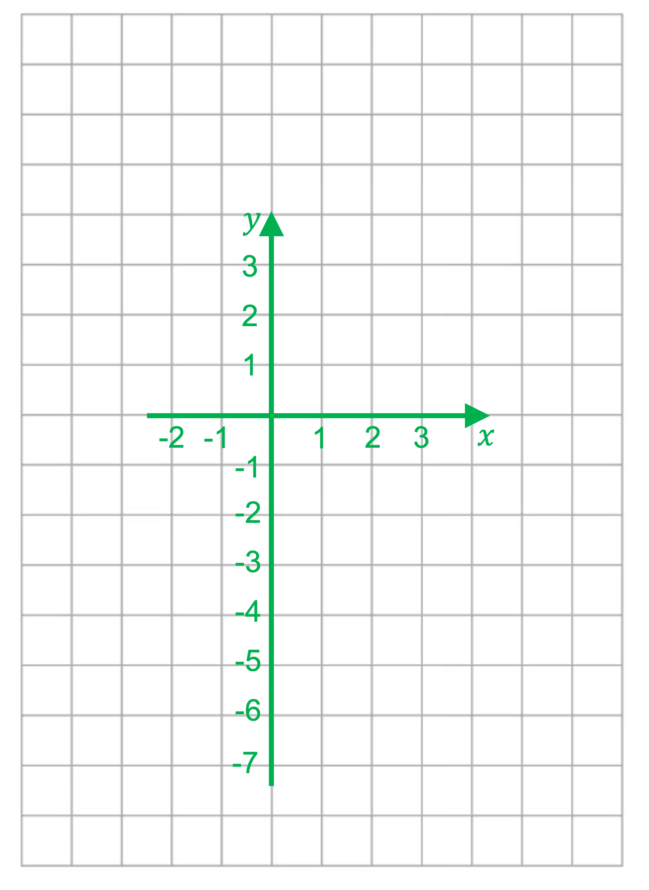

**axes drawn and labelled with scale ****[1]**

> *Plot the points from the table of values on the grid*

**at least 2 points plotted correctly ****[1]**

> *Using a ruler or straight edge, join the points with a straight line. The line should go through all the points if they have been calculated correctly*

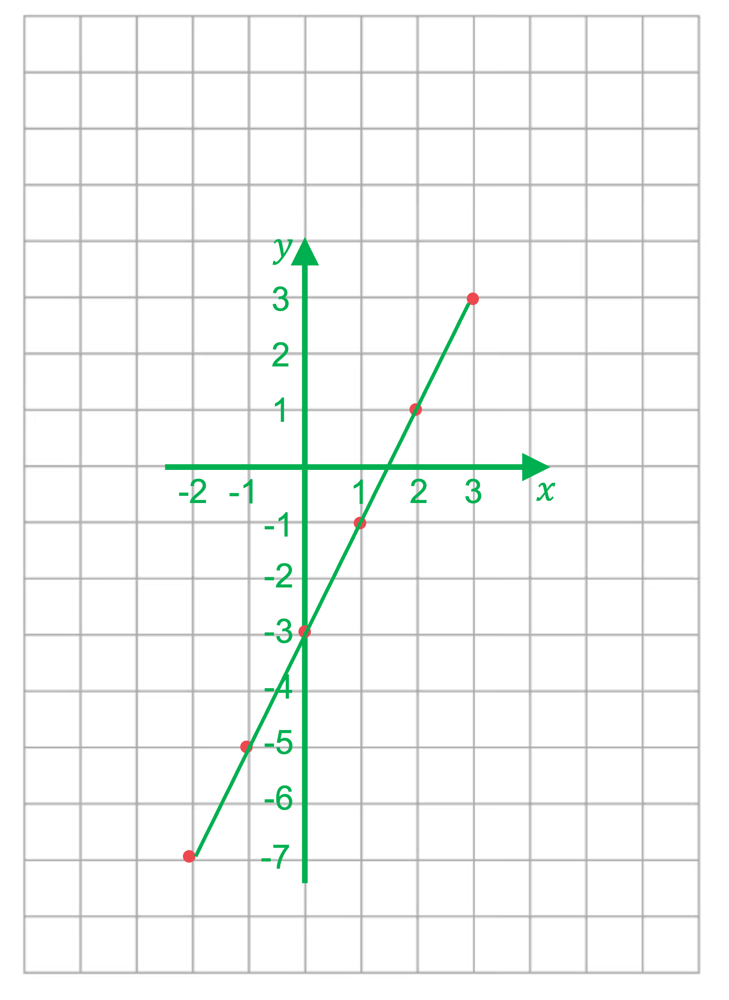

**fully correct line between x = −2*** ***and x = 3**** [1]**

**It is also possible to answer this question using ****y ****= ****mx ****+ ****c****, but using a table allows you to decide on the scale of the axes easily**

## Q14 — medium — 4 marks · exam-questions

### 12() — 4 marks
> *Use the TABLE function of your calculator with f(x) = 3**x** + 2 from **x** = −2 to** x **= 2  to produce the table below *

> *(If you don't have the TABLE function on your calculator then you can produce the table manually by substituting **x** values into f(x) = 3**x **+ 2) *

| **x** | *−2* | *−1* | *0* | *1* | *2* |
|---|---|---|---|---|---|
| *f(***x***)* | *−4* | *−1* | *2* | *5* | *8* |

> *Copy the table down as it is worth a method mark!*

**at least 2 correct coordinate pairs found  ****[1]**

> *No scale is specified in the question so just draw the axes using a scale of one square for one unit on both axes *

> *Position the axes anywhere in the grid *

L*abel the **x** and **y** axes and write the scale- make sure the **x **axis extends between at least **−**2 and 2, while the **y** axis extends between at least **−**4 and 8 (the range of values found in the table)*

> * *

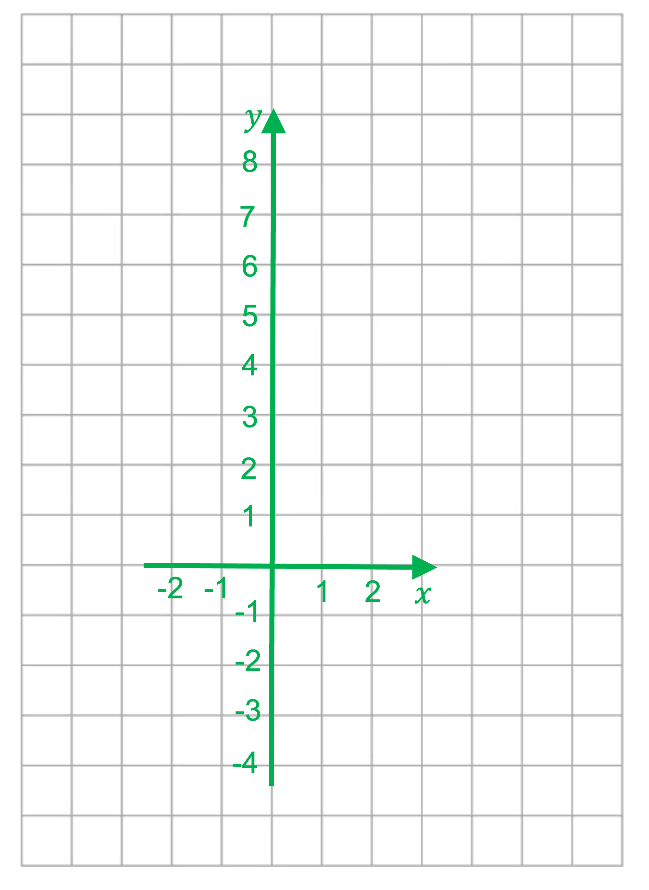

**axes drawn and labelled with scale ****[1]**

> *Plot the points from the table of values on the grid*

**at least 2 points plotted correctly ****[1]**

> *Using a ruler or straight edge, join the points with a straight line. The line should go through all the points if they have been calculated correctly *

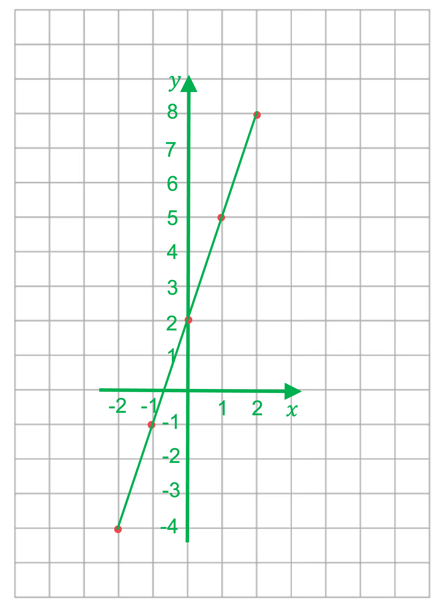

**fully correct line between x = −2*** ***and x = 2**** [1]**

**It is also possible to answer this question using ****y ****= ****mx ****+ ****c****, but using a table allows you to decide on the scale of the axes easily**

## Q15 — medium — 2 marks · exam-questions

### 6() — 2 marks
*Two lines are parallel if they have the same gradient* 
*Using **y** = **mx** + **c**, we know that L**1** has gradient 3*

*Rearrange L**2** to the form **y** = **mx** + **c **to determine its gradient*
 *For example, start by adding *$9x$* and subtracting *$5$* from both sides*

$3y=9x-5$

**attempt to rearrange L****2**** to the form y = mx + c ****[1]**

> *divide both sides by 3*

$y=3x-\frac{5}{3}$

** [1]**

> *We can write a statement to summarise*

**Final answer:** **"The gradient of L****2**** is also 3 so the two lines are parallel"**

## Q16 — medium — 3 marks · exam-questions

### 17() — 3 marks
*Parallel lines have the same gradient*

> *Using *$y=mx+c$*, ** L**1** has a gradient of 3, so the gradient of L**2** is also 3. Therefore L**2** takes the form*

$y=3x+c$

**[1]**

> *L**2** passes through *`open parentheses 3 comma space 4 close parentheses`* so substitute *$x=3$* **and *$y=4$* into the equation above*

`4 equals 3 open parentheses 3 close parentheses plus c`

**[1]**

> *Solve to find *$c$

$4=9+c\,c=-5$

> *Replace *$c$* with *$-5$* in the equation *$y=3x+c$

$y=3x-5$ **[1]**

## Q17 — medium — 3 marks · exam-questions

### 19() — 3 marks
> *Parallel lines have the same gradient *

> *Choose two point on the diagram such as (0, 3) and (6, 6) as shown below and use *$\frac{\mathrm{rise}}{\mathrm{run}}$* to find the gradient of L**1*

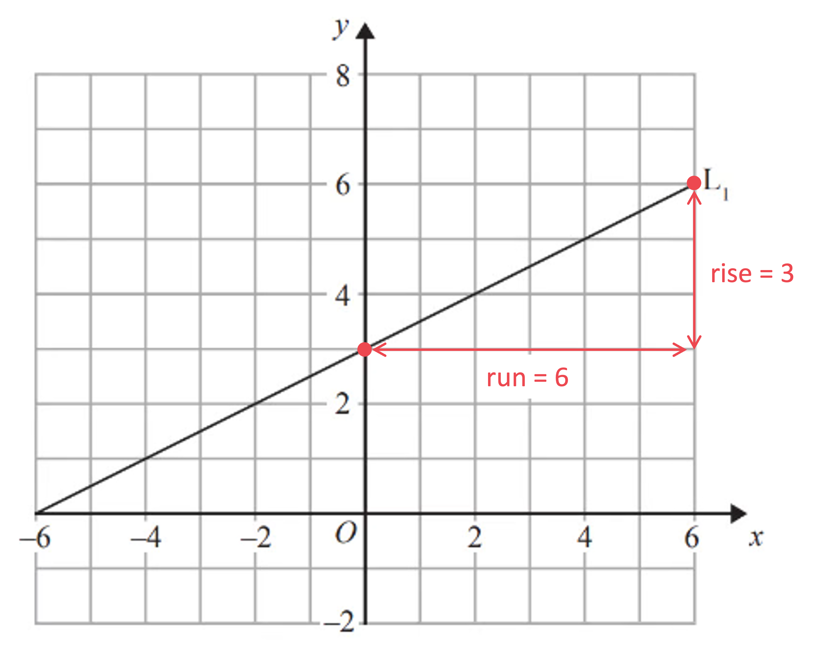

$\frac{\mathrm{rise}}{\mathrm{run}}=\frac{3}{6}=\frac{1}{2}$

**[1]**

> *So the gradient of L**2** is also *$\frac{1}{2}$*. Therefore L**2** takes the form*

$y=\frac{1}{2}x+c$

**[1]**

> *The questions states that L**2** passes through *`open parentheses 0 comma negative 5 close parentheses`*; this is on the **y**-axis, so it is the **y**-intersect, therefore*

$c=-5$

> *Replace *$c$* with *$-5$* in the equation of L**2*

$y=\frac{1}{2}x-5$ **[1]**

## Q18 — medium — 5 marks · exam-questions

### 15((a)) — 2 marks
> *Method 1*

> *Let **M **be the midpoint of **AB**. Draw and label **A**, **M** and **B** on a line, ignoring their orientation in relation to each other *

> *Consider how to go from the *$x$* and *$y$* coordinates of **A** to the corresponding coordinates of **M*

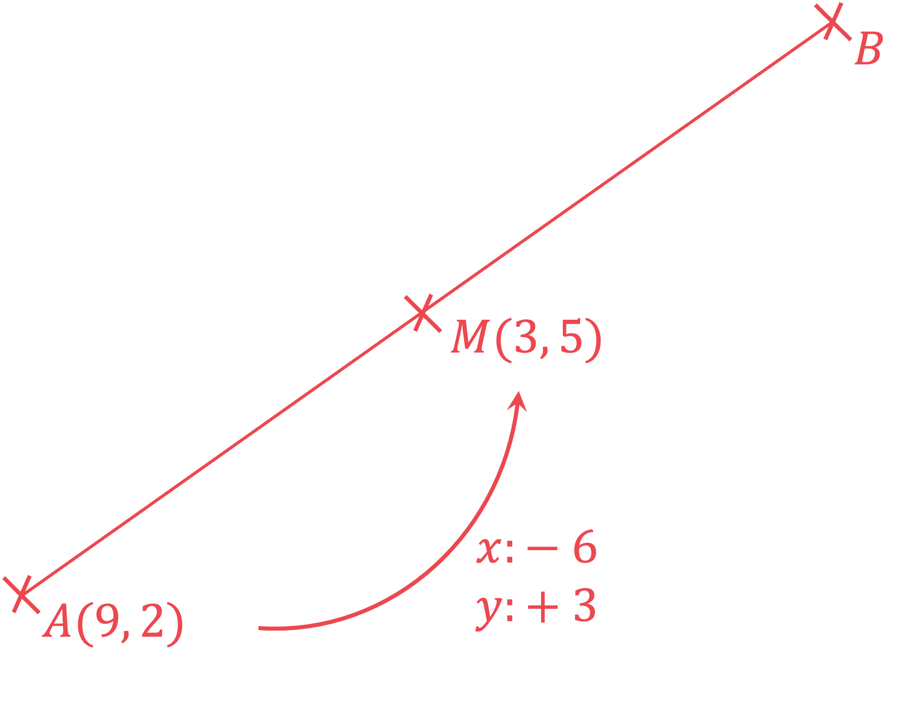

> *To go from **A** to **M,** we subtract 6 from the *$x$* coordinate and add 3 to the *$y$* coordinate So to go from **M **to **B, **subtract 6 from the *$x$* coordinate and add 3 to the *$y$* coordinate*

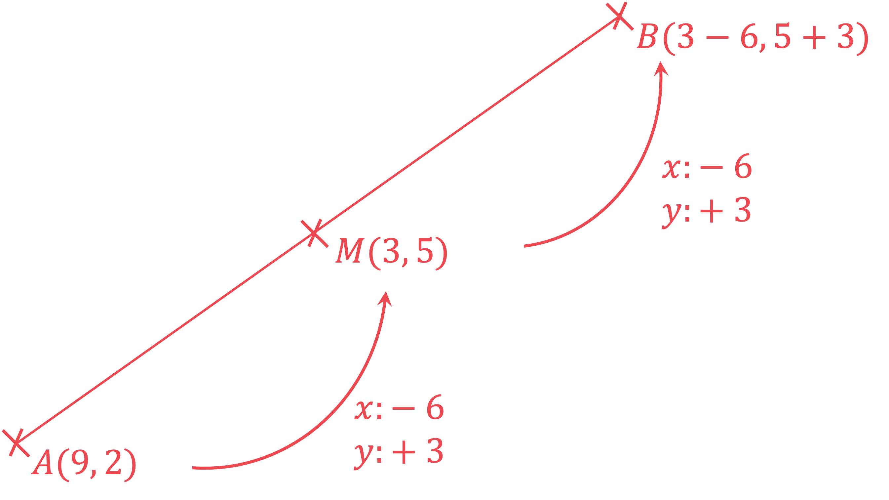

$B=(-3,8)$** ****[2]**

> *Method 2*

> *Use the midpoint formula, *`open parentheses fraction numerator x subscript 1 plus x subscript 2 over denominator 2 end fraction space comma space fraction numerator y subscript 1 plus y subscript 2 over denominator 2 end fraction close parentheses`

`open parentheses 3 comma space 5 close parentheses equals open parentheses fraction numerator 9 plus x over denominator 2 end fraction space comma space fraction numerator 2 plus y over denominator 2 end fraction close parentheses`

> *Separate into the **x** and **y** coordinates*

$3=\frac{9+x}{2},5=\frac{2+y}{2}$

> *And solve for both*

$6=9+x,10=2+y\,x=-3,y=8$

** **$B=(-3,8)$ **[2]**

### 15((b)) — 3 marks
> *Find the gradient of the line using *$m=\frac{y_{1}-y_{2}}{x_{1}-x_{2}}$*, taking *`open parentheses 9 comma space 2 close parentheses`* **as *`open parentheses x subscript 1 comma space y subscript 1 close parentheses`* and *`open parentheses 3 comma space 5 close parentheses`* as *`open parentheses x subscript 2 comma space y subscript 2 close parentheses`

$m=\frac{2-5}{9-3}$

**[1]**

> *                 *$=-\frac{1}{2}$

> *The gradient of the line is *$-\frac{1}{2}$* so the line takes the form *$y=-\frac{1}{2}x+c$*. *

> *Choose either of the points given in the question and substitute the *$x$* and *$y$* value into this equation Here we will use *`open parentheses 9 comma space 2 close parentheses`

`2 equals negative 1 half open parentheses 9 close parentheses plus c`

**[1]**

> *Solve to find *$c$

$2=-4\frac{1}{2}+c\,c=6\frac{1}{2}$

> *Replace *$c$* with *$6\frac{1}{2}$* in the equation *$y=-\frac{1}{2}x+c$

$y=-\frac{1}{2}x+6\frac{1}{2}$ **[1]**

## Q19 — medium — 5 marks · exam-questions

### 1() — 2 marks
> *Rearrange the equation into the form *$y=mx+c$

`table row cell 3 x plus 5 y minus 2 end cell equals 0 row cell 5 y end cell equals cell negative 3 x plus 2 end cell row y equals cell negative 3 over 5 x plus 2 over 5 end cell end table`

**[1]**

> *Using *$y=mx+c$*, we know that the gradient is *$-\frac{3}{5}$

$-\frac{3}{5}$** [1]**

**Do not write your final answer as "**$-\frac{3}{5}x$**"**

### 2() — 3 marks
*The gradients of perpendicular lines are negative reciprocals so if from, part (a), *$-\frac{3}{5}$ *is the gradient of *$l_{1}$*, then the gradient of *$l_{2}$* is*

$m=\frac{5}{3}$

**[1]**

> $l_{2}$* therefore takes the form *$y=\frac{5}{3}x+c$* and passes through *`open parentheses 3 comma space 1 close parentheses`*. Replace *$x$* with *$3$* and *$y$* with *$1$

`1 equals 5 over 3 open parentheses 3 close parentheses plus c`

**[1]**

> *Solve for *$c$

`table attributes columnalign right center left columnspacing 0px end attributes row 1 equals cell 5 plus c end cell row c equals cell negative 4 end cell end table`

> *Now we can write the equation of the line in the form *$y=mx+c$* *

$y=\frac{5}{3}x-4$ **[1]**

## Q20 — medium — 1 marks · exam-questions

### 7() — 1 marks
*Two lines are parallel if they have the same gradient*

> *Using **y** = **mx** + **c**, we know that*

*Line A has gradient 2*

> *Rearrange Lines B, C and D to the form **y** = **mx** + **c **to determine their gradients*

*Line B: *$y=\frac{1}{2}x+2$

*Line C: *`table attributes columnalign right center left columnspacing 0px end attributes row y equals cell negative x plus 2 end cell end table`

*Line D: *$y=2x-4$

> *Line A and Line D have a gradient of 2 so are parallel. (And Lines B and C do not have the same gradients as any of the other lines)*

**Line A and Line D**** ****[1]**

## Q21 — medium — 5 marks · exam-questions

### 4((a)) — 1 marks
> *Substitute *$x=3$* into *$y=5-2x$* to verify that when *$x=3$*, *$y=-1$

`Error converting from MathML to accessible text.`**, therefore (3, −1) lies on ****L**** ****[1]**

### 4((b)) — 4 marks
> *Using *$y=mx+c$*, we know that the gradient of **L** is −2 *

> *The gradients of perpendicular lines are negative reciprocals so the gradient of the line perpendicular to **L **is*

$m=\frac{1}{2}$

**[1]**

> *The line perpendicular to **L **therefore takes the form *$y=\frac{1}{2}x+c$* and passes through *`open parentheses 3 comma space minus 1 close parentheses`*. *

> *Replace *$x$* with *$3$* and *$y$* with *$-1$

`negative 1 equals 1 half open parentheses 3 close parentheses plus c`

**[1]**

> *Solve for *$c$

`table row cell negative 1 end cell equals cell 3 over 2 plus c end cell row c equals cell negative 5 over 2 end cell end table`

**[1]**

> *Now we can write the equation of the line in the form *$y=mx+c$* *

`table attributes columnalign right center left columnspacing 0px end attributes row y equals cell 1 half x minus 5 over 2 end cell end table`* ***[1]**

## Q22 — medium — 3 marks · exam-questions

### 14() — 3 marks
> *The lines are perpendicular if their gradients are negative reciprocals of each other (the product of their gradients are -1). Find the gradient of the lines **L**1 **and **L**2** .*

> *The equation of the line **L**1 ** **can be rearranged into the form **y **= **mx **+ c to find the gradient, **m**.*

`table row cell 2 y space end cell equals cell space minus x space plus space 4 end cell row cell y space end cell equals cell negative 1 half x plus space 4 over 2 end cell end table`

> *So the gradient of the line **L**1 ** **= -0.5.*

$m_{L_{1}}=-\frac{1}{2}$

**[1]**

> *Calculate the gradient of the line **L**2** from the two given points by dividing the rise by the run, *$m=\frac{y_{2}-y_{1}}{x_{2}-x_{1}}$*.*

`straight m subscript bold italic L subscript bold italic 2 end subscript equals space fraction numerator 9 minus open parentheses negative 7 close parentheses over denominator 7 minus open parentheses negative 1 close parentheses end fraction equals space 16 over 8 space equals space 2`

**[1]**

> *Multiply the two gradients together, if their product is -1 then the lines are perpendicular.*

> * *$m_{L_{1}}\timesm_{L_{2}}=-\frac{1}{2}\times2=-1$

**Yes, Michael is correct because**** **$m_{L_{1}}\timesm_{L_{2}}=-1$* ***[1]**

## Q23 — medium — 4 marks · exam-questions

### 15() — 4 marks
> *Find the gradient of line **L**1  **by rearranging its equation to the form *$y=mx+c$*.*

$y=\frac{6x-5}{2}=3x-2.5$* **therefore gradient of *****L********1 ****$=3$

**[1]**

> *The gradients of perpendicular lines are negative reciprocals so the gradient of the line **L**2  **which is perpendicular to **L**1 ** **is*

$m_{L_{2}}=-\frac{1}{3}$

**[1]**

> *The line **L**2 ** therefore takes the form *$y=-\frac{1}{3}x+c$* and passes through *`open parentheses 9 comma space minus 1 close parentheses`*. *

> *Find the value of **c** by substituting *$x$* with *$9$* and *$y$* with *$-1$*.*

`negative 1 equals space minus 1 third open parentheses 9 close parentheses space plus space c`

**[1]**

> *Simplify and solve to find *$c$*.*

`table row cell negative 1 space end cell equals cell negative 3 space plus space c end cell row cell c space end cell equals cell space minus 1 space plus space 3 space equals space 2 end cell end table`

> *Now we can write the equation of the line in the form *$y=mx+c$*. *

`table row cell y space end cell equals cell space minus 1 third x space plus 2 end cell end table`

> *Rearrange into the form *$ay+bx=c$* by adding the term in **x **to the other side.*

`table row cell y space plus 1 third x space end cell equals cell space 2 end cell end table`

> *It is not necessary to make the values of **a, b, **and **c **integers for the answer, but you can by multiplying every term by 3.*

$3y+x=6$ **[1]**

## Q24 — medium — 2 marks · exam-questions

### 9() — 2 marks
> *Work out the gradient between the points*

$\frac{y_{2}-y_{1}}{x_{2}-x_{1}}=\frac{-3-0}{0-2}=\frac{3}{2}$

**[B1]**

> *The y-intercept is given in the question *`open parentheses 0 comma space minus 3 close parentheses`

$y=\frac{3}{2}x-3$

**[B1]**

## Q25 — medium — 1 marks · exam-questions

### 19() — 1 marks
> *The line crosses the *$x$*-axis when *$y=0$*. Substitute *$y=0$* into *$3x+2y=24$* and solve for *$x$*.*

`table attributes columnalign right center left columnspacing 0px end attributes row cell 3 x plus 2 open parentheses 0 close parentheses end cell equals 24 row cell 3 x end cell equals 24 row x equals 8 end table`

> *Therefore *$x=8$* and *$y=0$*.*

**The fourth option is correct, **$(8,0)$** ****[1]**

**A common mistake is to find where the line crosses the **$y$**-axis (see third option below)**

> *At the first option *`open parentheses 0 comma space 8 close parentheses`*, *$x=0$* so this point lies on the *$y$*-axis.*

> *At the second option *`open parentheses 12 comma space 0 close parentheses`*, *$y=0$* so this point does indeed lie on the *$x$*-axis. However, substituting it into the equation, *`3 open parentheses 12 close parentheses plus 2 open parentheses 0 close parentheses not equal to 24`* so the point does not lie on the line with equation *$3x+2y=24$*.*

> *At the third option *`open parentheses 0 comma space 12 close parentheses`*, *$x=0$* so this point lies on the *$y$*-axis. (It is actually the *$y$*-intersect of the line with equation *$3x+2y=24$* as *`3 open parentheses 0 close parentheses plus 2 open parentheses 12 close parentheses equals 24`*.)*

## Q26 — medium — 3 marks · exam-questions

### 13() — 3 marks
> *Using *$y=mx+c$*, ** with a gradient of 3, gives;*

$y=6x+c$

**[1]**

> *The line passes through *`open parentheses 3 comma space 19 close parentheses`* so substitute *$x=3$* **and *$y=19$* into the equation above.*

`19 equals 6 open parentheses 3 close parentheses plus c`

**[1]**

> *Solve to find *$c$*.*

`table row 19 equals cell 18 plus c end cell row cell negative 18 space space space space end cell equals cell space space space space space space space space space minus 18 end cell row 1 equals c end table`

> *Replace *$c$* with *$1$* in the equation *$y=6x+c$*.*

$y=6x+1$ **[1]**

## Q27 — medium — 3 marks · exam-questions

### 17() — 3 marks
> *The graph is a straight line in the form of *$y=mx+c$*, ** but the horizontal axis is *$n$* instead of *$x$* and the vertical axis is *$h$* instead of *$y$*. *

> *So use the form *$h=mn+c$* where *$m$* is the gradient and *$c$* is the vertical axis intercept.*

> *You can see that the graph intersects the vertical axis at 20 so,*

$h=mn+20$

**vertical axis intercept is 20 ****[1]**

> *To find *$m$*, use *$m=\frac{y_{1}-y_{2}}{x_{1}-x_{2}}$* or *$\frac{\mathrm{rise}}{\mathrm{run}}$*. For example;*

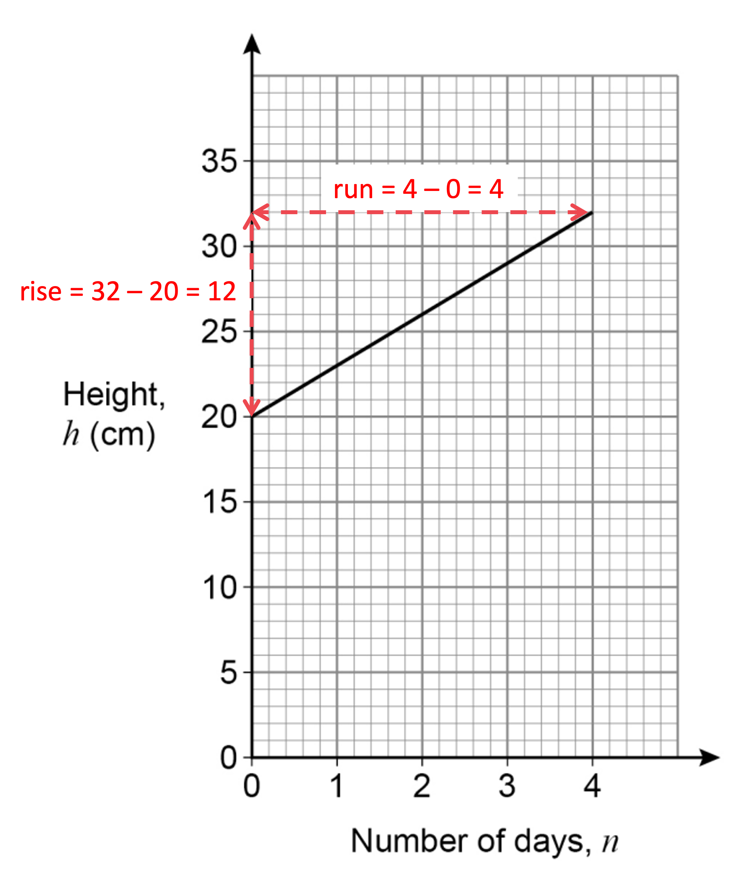

$m=\frac{32-20}{4-0}=\frac{12}{4}=3$

**gradient is 3 ****[1]**

> *Replace *$m$* with *$3$* in the equation *$h=mn+20$*.*

$h=3n+20$ **[1]**

## Q28 — medium — 4 marks · exam-questions

### 8() — 4 marks
> *Parallel lines have the same gradient*

*Using *$y=mx+c$*, ** Line A has a gradient of 6, so*

*the gradient of Line B is 6*

**[1]**

> *Therefore Line B takes the form*

$y=6x+c$

**[1]**

> *Line B passes through *`open parentheses 4 comma space 26 close parentheses`* so substitute *$x=4$* **and *$y=26$* into the equation above*

`26 equals 6 open parentheses 4 close parentheses plus c`

**[1]**

> *Solve to find *$c$

`table row 26 equals cell 24 plus c end cell row 2 equals c end table`

> *Replace *$c$* with *$2$* in the equation *$y=6x+c$

$y=6x+2$ **[1]**

## Q29 — medium — 3 marks · exam-questions

### 18((a)) — 3 marks
> *The gradient of **y** = 4**x** − 5 is 4. *

> *The gradients of perpendicular lines are negative reciprocals so the gradient of the line perpendicular to **y** = 4**x** − 5** **is*

$m=-\frac{1}{4}$

**correct gradient ****[1]**

> *The line therefore takes the form *$y=-\frac{1}{4}x+c$*. *

> *In addition it passes through (0, 6). (0, 6) is on the *$y$*-axis; it is the *$y$*-intercept! Therefore;*

*c = 6*

**correct c value ****[1]**

> *Now write the equation*

$y=-\frac{1}{4}x+6$ **[1]**

## Q30 — medium — 6 marks · exam-questions

### 5((a)) — 4 marks
i) *Find the gradient, *$m$*, using the formula *$m=\frac{y_{1}-y_{2}}{x_{1}-x_{2}}$

`m equals fraction numerator 6 minus 3 over denominator negative 4 minus 8 end fraction space space space or space space fraction numerator 3 minus 6 over denominator 8 minus open parentheses negative 4 close parentheses end fraction`

**either of the above two substitutions**** [1]**

> *Simplify*

$=\frac{3}{-12}=-\frac{1}{4}$

**gradient of line AB = **$-\frac{1}{4}$ **[1]**

ii) *The equation of a straight line take the form *$y=mx+c$*. You know *$m=-\frac{1}{4}$*. Substitute in either of the points A or B; B may be easier as both its ordinates are positive values.*

`y equals negative 1 fourth plus c comma space space B open parentheses 8 comma space 3 close parentheses
3 equals negative 1 fourth cross times 8 plus c`

**substituting A or B into **$y=-\frac{1}{4}+c$** [1]**

> *Solve to find *$c$

$3=-2+c\,5=c$

> *Replace *$c$* with 5 in *$y=-\frac{1}{4}x+c$

$y=-\frac{1}{4}+5$ **[1]**

### 5((b)) — 2 marks
> *Parallel lines have the same gradient*

> *From part (a), you know that the gradient of AB is *$-\frac{1}{4}$*.Therefore using *$y=mx+c$*, ** the line parallel to AB through P takes the form*

$y=-\frac{1}{4}x+c$

**[1]**

> *It passes through *`open parentheses 0 comma space minus 2 close parentheses`* which is the *$y$*-intercept so*

$c=-2$

> *You can write the equation in the form *$y=mx+c$

$y=-\frac{1}{4}x-2$ **[1]**

**You could also substitute **`open parentheses 0 comma space minus 2 close parentheses`** into **$y=-\frac{1}{4}x+c$** and solve to find **$c$** but it's quicker to recognise **`open parentheses 0 comma space minus 2 close parentheses`** as the **$y$**-intercept **

## Q31 — medium — 4 marks · exam-questions

### 14() — 4 marks
> *First rearrange both equations into the form *$y=mx+c$*, as **m** is the gradient*

> *Starting with *$3y=4x-14$*. Divide both sides by 3.*

$y=\frac{4}{3}x-\frac{14}{3}$

*The gradient of this line is *$\frac{4}{3}$

**identifying gradient of second line ****[1]**

> *Next take *$4y=-3x+48$*. Divide both sides by 4.*

$y=-\frac{3}{4}x+12$

*The gradient of this line is *$-\frac{3}{4}$

**identifying gradient of second line ****[1]**

> *If two gradients **m**1** and **m**2** are perpendicular then **m**1** × **m**2** = −1. Multiply together the two gradients and check whether the product is indeed −1.*

$\frac{4}{3}\times(-\frac{3}{4})$

**multiplying the gradients ****[1]**

$\frac{4}{3}\times(-\frac{3}{4})=-1$ **therefore the lines are perpendicular ****[1]**

## Q32 — medium — 4 marks · exam-questions

### 13() — 4 marks
> **[exam-tip]**
> Remember that when finding an equation of a line between two given points, the gradient needs to be calculated first.
> 
> Writing down the formulae $y=mx+c$ or $y-y_{1}=m(x-x_{1})$* *can be useful as well.

> *Calculate the gradient between the two points by substituting the given coordinates into the formula *`m equals fraction numerator open parentheses y subscript 2 minus y subscript 1 close parentheses over denominator open parentheses x subscript 2 minus x subscript 1 close parentheses end fraction`* *

> *You can  also think of this as the change in **y**-coordinates divided by the change in** x**-coordinates ('rise over run')*

`open parentheses x subscript 1 space comma space y subscript 1 close parentheses space space space space open parentheses x subscript 2 space comma space y subscript 2 close parentheses
open parentheses 1 space comma negative 1 close parentheses space space space space space space open parentheses 4 space comma space 7 close parentheses

fraction numerator open parentheses 7 minus negative 1 close parentheses over denominator open parentheses 4 minus 1 close parentheses end fraction equals 8 over 3`

**[M1]**

> *Substitute the gradient and one of the given coordinates into *$y-y_{1}=m(x-x_{1})$* (**Alternatively you can substitute into** *$y=mx+c$* and solve to find the value of *$c$*)*

`y minus open parentheses negative 1 close parentheses equals 8 over 3 open parentheses x minus 1 close parentheses`

**[M1]**

> *Simplify terms and rearrange to make **y** the subject*

`table row cell y plus 1 end cell equals cell 8 over 3 x minus 8 over 3 end cell row y equals cell 8 over 3 x minus 8 over 3 minus 1 end cell row y equals cell 8 over 3 x minus 11 over 3 end cell end table`

**[M1]**

> *Rearrange to get into the form *$ax+by=c$

> *Start by multiplying both sides by 3 to get rid of the fractions*

`table row cell 3 y end cell equals cell 8 x minus 11 end cell row 0 equals cell 8 x minus 3 y minus 11 end cell row 11 equals cell 8 x minus 3 y end cell end table`

$8x-3y=11$

**[A1]**

## Q33 — medium — 3 marks · exam-questions

### 13() — 3 marks
> *Calculate the gradient of the line between the two points. Change in y divided by change in x*

`fraction numerator negative 48 minus 12 over denominator 19 minus open parentheses negative 5 close parentheses end fraction equals fraction numerator negative 60 over denominator 24 end fraction equals negative 2.5`

**[M1]**

> *Substitute into *$y=mx+c$* using one of the two points and solve to calculate c*

`table row 12 equals cell negative 2.5 cross times open parentheses negative 5 close parentheses plus c end cell end table`

`table row c equals cell negative 0.5 end cell end table`

**[M1]**

> **[exam-tip]**
> Alternatively, you could use   `y minus y subscript 1 equals m open parentheses x minus x subscript 1 close parentheses`  to calculate the equation in one go instead of finding c separately.

> *Write the equation of the line in **y **=** mx **+** c** form*

$y=-2.5x-0.5$

**[A1]**

> **[mark-scheme]**
> **A1**: Writing with fractions, $y=-\frac{5}{2}x-\frac{1}{2}$, will also get this mark. As will other equivalent equations, e.g. `y minus 12 equals negative 2.5 open parentheses x plus 5 close parentheses` or $5x+2y+1=0$.

## Q34 — hard — 3 marks · exam-questions

### 17() — 3 marks
> *Choose two point on the diagram such as (0, -2) and (1, 1) as shown below and use *$\frac{\mathrm{rise}}{\mathrm{run}}$* to find the gradient of Line **N*

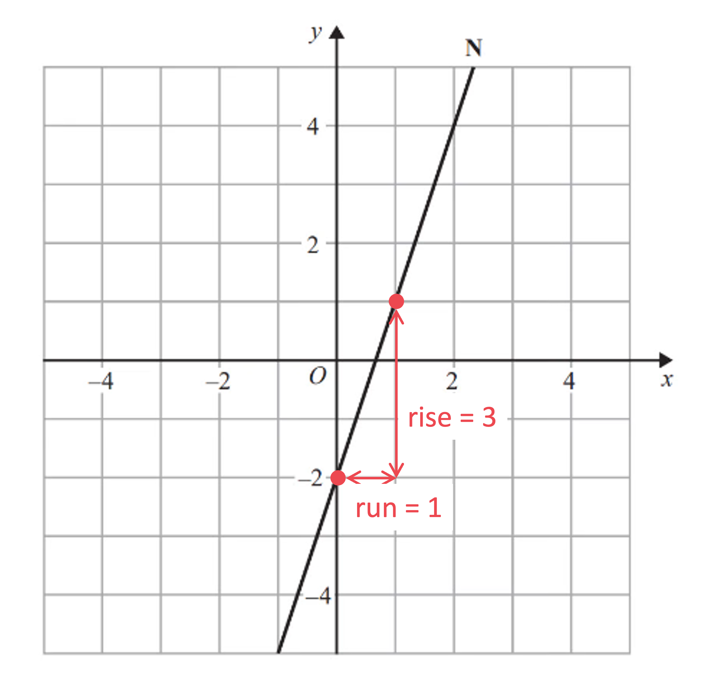

$\frac{\mathrm{rise}}{\mathrm{run}}=\frac{3}{1}=3$

**[1]**

> *The gradients of perpendicular lines are negative reciprocals, so if *$m$* is the gradient of the line perpendicular to line **N** then*

$m=-\frac{1}{3}$

**[1]**

> *The questions states that the line passes through *`open parentheses 0 comma space 1 close parentheses`* so*

$c=1$

> *Replace *$m$* with *$-\frac{1}{3}$* and *$c$* with *$1$* in the equation of *$y=mx+c$

$y=-\frac{1}{3}x+1$ **[1]**

## Q35 — hard — 4 marks · exam-questions

### 24() — 4 marks
> *Find the gradient of line **L **by rearranging to the form *$y=mx+c$

$y=-4x+7$* **therefore gradient of ****L***$=-4$

**[1]**

> *The gradients of perpendicular lines are negative reciprocals so the gradient of the line perpendicular to **L **is*

$m=\frac{1}{4}$

**[1]**

> *The line therefore takes the form *$y=\frac{1}{4}x+c$* and passes through *`open parentheses negative 8 comma space 3 close parentheses`*. Replace *$x$* with *$-8$* and *$y$* with *$3$

`3 equals 1 fourth open parentheses negative 8 close parentheses plus c`

**[1]**

> *Solve for *$c$

`table attributes columnalign right center left columnspacing 0px end attributes row 3 equals cell negative 2 plus c end cell row c equals 5 end table`

> *Now we can write the equation of the line in the form *$y=mx+c$* *

$y=\frac{1}{4}x+5$ **[1]**

## Q36 — hard — 3 marks · exam-questions

### 16() — 3 marks
> *Find the gradient of line **L **by rearranging to the form *$y=mx+c$

$y=\frac{4}{3}x+\frac{7}{3}$* **therefore gradient of ****L***$=\frac{4}{3}$

> *The gradients of perpendicular lines are negative reciprocals so the gradient of the line perpendicular to **L **is*

$m=-\frac{3}{4}$

**[1]**

> *The line therefore takes the form *$y=-\frac{3}{4}x+c$* and passes through *`open parentheses 3 comma space minus 5 close parentheses`*. Replace *$x$* with *$3$* and *$y$* with *$-5$

`negative 5 equals negative 3 over 4 open parentheses 3 close parentheses plus c`

**[1]**

> *Solve for *$c$

`table row cell negative 5 end cell equals cell negative 9 over 4 plus c end cell row c equals cell negative 11 over 4 end cell end table`

> *Now we can write the equation of the line in the form *$y=mx+c$* *

$y=-\frac{3}{4}x-\frac{11}{4}(\mathrm{or}y=-0.75x-2.75)$ **[1]**

## Q37 — hard — 4 marks · exam-questions

### 23() — 4 marks
> *Use *$\frac{\mathrm{rise}}{\mathrm{run}}$* between the points **A **and **B **to find the gradient of **AB*

> * *

$\frac{\mathrm{rise}}{\mathrm{run}}=\frac{4}{2}=2$

**[1]**

> *The gradients of perpendicular lines are negative reciprocals, so if *$m$* is the gradient of the line perpendicular to **AB** then*

$m=-\frac{1}{2}$

**[1]**

> *The line takes the form *$y=-\frac{1}{2}x+c$* and passes through *`open parentheses 5 comma space minus 1 close parentheses`*. Replace *$x$* with *$5$* and *$y$* with *$-1$

`negative 1 equals negative 1 half open parentheses 5 close parentheses plus c`

**[1]**

> *Solve for *$c$

`table row cell negative 1 end cell equals cell negative 5 over 2 plus c end cell row c equals cell 3 over 2 end cell end table`

> *Now we can write the equation of the line in the form *$y=mx+c$* *

$y=-\frac{1}{2}x+\frac{3}{2}$ **[1]**

## Q38 — hard — 7 marks · exam-questions

### 1() — 3 marks
*Using *$y=mx+c$*, we know that the gradient of *$l_{1}$* is −2*

> *The gradients of perpendicular lines are negative reciprocals so the gradient of the line perpendicular to **L **is*

$m=\frac{1}{2}$

**[1]**

> *The line perpendicular to *$l_{1}$* **therefore takes the form *$y=\frac{1}{2}x+c$* and passes through *`open parentheses 5 comma space 6 close parentheses`*. *

> *Replace *$x$* with *$5$* and *$y$* with *$6$

`6 equals 1 half open parentheses 5 close parentheses plus c`

**[1]**

> *Solve for *$c$

`table attributes columnalign right center left columnspacing 0px end attributes row 6 equals cell 5 over 2 plus c end cell row c equals cell 7 over 2 end cell end table`

> *Now we can write the equation of the line in the form *$y=mx+c$* *

`table attributes columnalign right center left columnspacing 0px end attributes row y equals cell 1 half x plus 7 over 2 end cell end table`

> *Note that the question asks for the answer in the form *$ax+by+c=0$* so multiply all terms by 2 to clear the fractions and rearrange so that all terms are on one side of the equation (leaving 0 on the other side)*

`table row cell 2 y end cell equals cell x plus 7 end cell row cell 2 y minus x minus 7 end cell equals 0 end table`

$-x+2y-7=0\mathrm{or}x-2y+7=0$** [1] **

**You will not be penalised for writing the terms in a different order However the terms must all be on one side of the equation (with the other side equal to 0) and with no fractions**

### 2() — 2 marks
> *From (a), the equation of *$l_{2}$* is *$x-2y+7=0$* *

> *The line crosses the *$x$*-**axis (at the point **A**) where *$y=0$* so solve *$x-2y+7=0$* for *$x$* when *$y=0$

$x+7=0$

** **$x=-7$** [1]**

> *The line crosses the *$y$*-**axis (at the point **B**) where *$x=0$* so solve *$x-2y+7=0$* for *$y$* when *$x=0$

`table row cell negative 2 y plus 7 end cell equals 0 row 7 equals cell 2 y end cell end table`

$y=\frac{7}{2}\mathrm{or}y=3.5$** [1]**

### 3() — 2 marks
> *Area of a triangle *$=\frac{1}{2}\times\mathrm{base}\times\mathrm{height}$

> *Sketch a diagram showing **O**, **A** and **B*

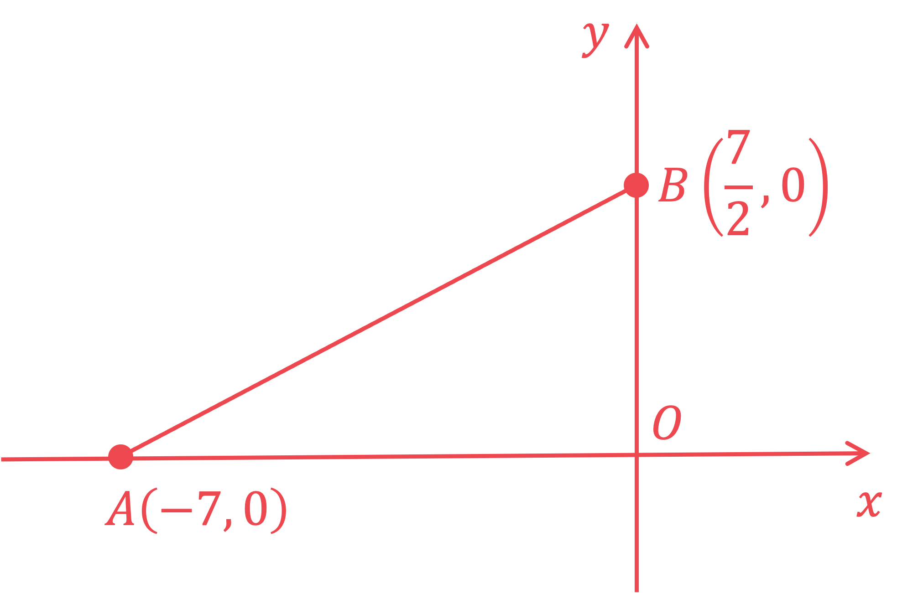

> *From the sketch we can see that:*

*area of triangle ***OAB **$=\frac{1}{2}\times7\times\frac{7}{2}$

**[1]**

**area of triangle ****OAB **$=\frac{49}{4}$* ***[1]**

**There is no need to state units as no units are given in the question**

## Q39 — hard — 5 marks · exam-questions

### 5() — 5 marks
> *First find the gradient of **PQ. **Here we will take **P **as *`open parentheses x subscript 1 comma space y subscript 1 close parentheses`* and **Q** as *`open parentheses x subscript 2 comma space y subscript 2 close parentheses`*. Gradient = *$\frac{y_{1}-y_{2}}{x_{1}-x_{2}}$

$\frac{6-0}{-1-9}=\frac{6}{-10}=-\frac{3}{5}$

**[1]**

*The gradients of perpendicular lines are negative reciprocals so if *$-\frac{3}{5}$ *is the gradient of **PQ**, then the gradient of *$l$* is*

$m=\frac{5}{3}$

**[1]**

> $l$* therefore takes the form *$y=\frac{5}{3}x+c$*. To find *$c$*, we need a point *`open parentheses x comma space y close parentheses`* to substitute into the equation. We need the midpoint of **PQ*

*Use the midpoint formula, *`open parentheses fraction numerator x subscript 1 plus x subscript 2 over denominator 2 end fraction space comma space fraction numerator y subscript 1 plus y subscript 2 over denominator 2 end fraction close parentheses` *for **P **and **Q** again*

`open parentheses fraction numerator negative 1 plus 9 over denominator 2 end fraction space comma space fraction numerator 6 plus 0 over denominator 2 end fraction close parentheses equals open parentheses 4 comma space 3 close parentheses`

**[1]**

> *Now we can substitute *$x=4$* and *$y=3$* into *$y=\frac{5}{3}x+c$* to find *$c$

`3 equals 5 over 3 open parentheses 4 close parentheses plus c`

**[1]**

> *Solve for *$c$

`table attributes columnalign right center left columnspacing 0px end attributes row 3 equals cell 20 over 3 plus c end cell row c equals cell negative 11 over 3 end cell end table`

> *Now we can write the equation of the line in the form *$y=mx+c$* *

$y=\frac{5}{3}x-\frac{11}{3}$ **[1]**

## Q40 — hard — 8 marks · exam-questions

### 4((a)) — 1 marks
> *Rearrange *$l_{1}$* into the form *$y=mx+c$* to find the gradient, *$m$

`table attributes columnalign right center left columnspacing 0px end attributes row cell 2 x plus 12 end cell equals cell 3 y end cell row y equals cell 2 over 3 x plus 4 end cell end table`

$m=\frac{2}{3}$

** ****Gradient = **$\frac{2}{3}$** ****[1]**

### 4((b)) — 3 marks
> *From (a) we know that the gradient of *$l_{1}$* is *$\frac{2}{3}$* *

> *The gradients of perpendicular lines are negative reciprocals so the gradient of *$l_{2}$* **is*

$m=-\frac{3}{2}$

**[1]**

> *From (a), we also know that the equation of *$l_{1}$* is *$y=\frac{2}{3}x+4$* which tells us **B**, its *$y$*-intercept, is *`open parentheses 0 comma space 4 close parentheses`* *

`B equals open parentheses 0 comma space 4 close parentheses`

**[1]**

> *B** is also the *$y$*-intercept of *$l_{2}$* so we can now write the equation of *$l_{2}$* in the form *$y=mx+c$* *

$y=-\frac{3}{2}x+4$ **[1]**

### 4((c)) — 4 marks
> *Area of a triangle = *$\frac{1}{2}\times\mathrm{base}\times\mathrm{height}$

> *From parts (a) and (b) we know point **B**, mark it on the diagram*

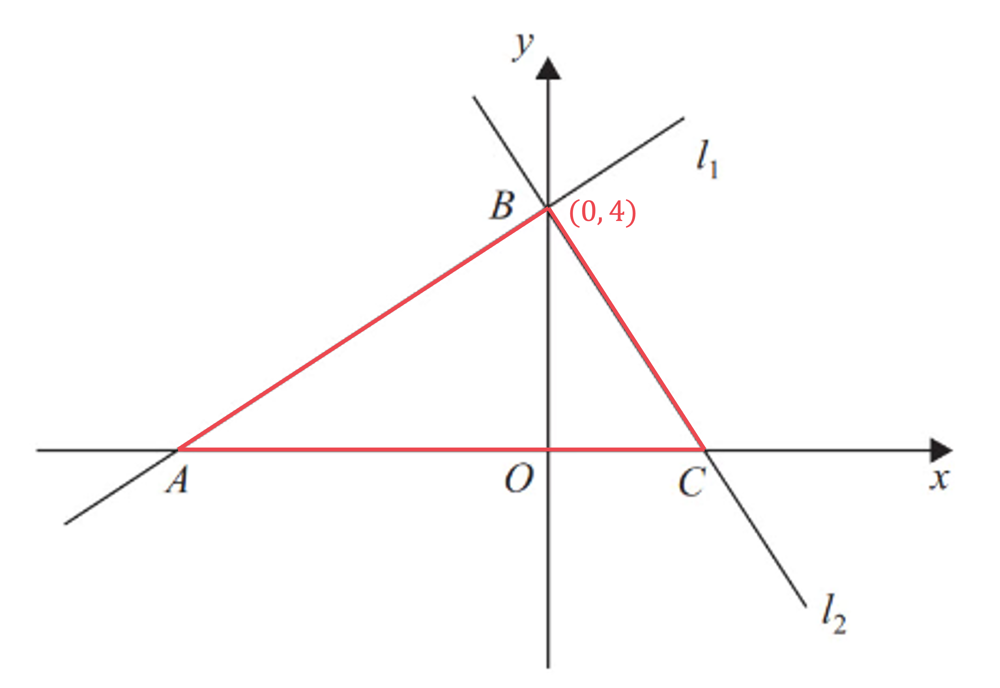

> *We can see that the height of triangle **ABC** is 4. To find the base of the triangle, we need to find the *$x$*-intercepts of *$l_{1}$* and *$l_{2}$* by substituting *$y=0$* into their equations and solving for *$x$

$l_{1}:0=\frac{2}{3}x+4$         $l_{2}:0=-\frac{3}{2}x+4$

**[1]**

`table row cell l subscript 1 colon space space 2 over 3 x end cell equals cell negative 4 end cell row x equals cell negative 4 divided by 2 over 3 end cell row blank equals cell negative 6 end cell end table`.           `table row cell l subscript 2 colon space space 3 over 2 x end cell equals 4 row x equals cell 4 divided by 3 over 2 end cell row blank equals cell 8 over 3 end cell end table`

**[1]**

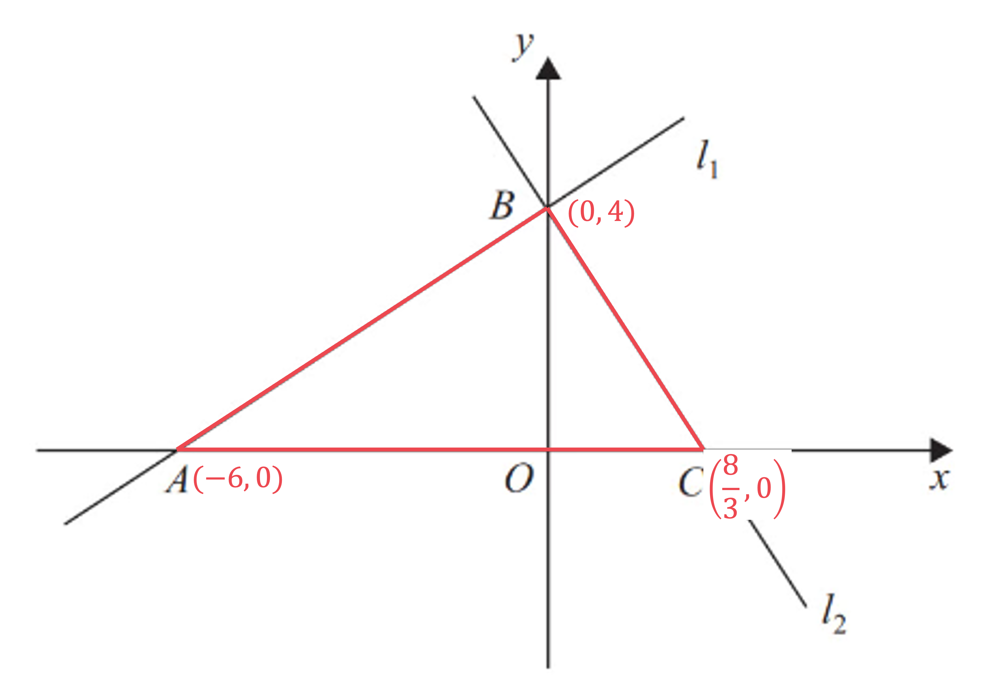

> *The base width of the triangle is *

`table row cell 6 plus 8 over 3 end cell equals cell 26 over 3 end cell end table`

**[1]**

`table row cell Area space of space triangle space A B C space end cell equals cell 1 half cross times 26 over 3 cross times 4 end cell row blank equals cell 52 over 3 end cell end table`

$\frac{52}{3}$ **[1]**

## Q41 — hard — 4 marks · exam-questions

### 24() — 4 marks
*Find the gradient of **AB** using *$m=\frac{y_{1}-y_{2}}{x_{1}-x_{2}}$*, taking **A** **as *`open parentheses x subscript 1 comma space y subscript 1 close parentheses`* and **B** as *`open parentheses x subscript 2 comma space y subscript 2 close parentheses`

`m subscript 1 equals fraction numerator 3 minus open parentheses negative 1 close parentheses over denominator 1 minus 4 end fraction`

**[1]**

$m_{1}=\frac{4}{-3}$

> *We can find the gradient of the line with equation *$2y=3x-4$* by rearranging into the form *$y=mx+c$

$y=\frac{3}{2}x-2$* **so** *$m_{2}=\frac{3}{2}$

**[1]**

> *If the lines are perpendicular then *$m_{1}\timesm_{2}=-1$

`open parentheses fraction numerator 4 over denominator negative 3 end fraction cross times 3 over 2 equals fraction numerator 12 over denominator negative 6 end fraction equals negative 2 close parentheses`

$\frac{4}{-3}\times\frac{3}{2}\neq-1$* ***[1]**

**The lines are not perpendicular ****[1]**

## Q42 — hard — 4 marks · exam-questions

### 1() — 4 marks
> *Using *$y=mx+c$*, we know that the gradient of **L** is −2 *

> *The gradients of perpendicular lines are negative reciprocals so the gradient of the line perpendicular to **L **is*

$m=\frac{1}{2}$

**[1]**

> *The line perpendicular to **L **therefore takes the form *$y=\frac{1}{2}x+c$* and passes through *`open parentheses 3 comma space minus 1 close parentheses`*. *

> *Replace *$x$* with *$3$* and *$y$* with *$-1$

`negative 1 equals 1 half open parentheses 3 close parentheses plus c`

**[1]**

> *Solve for *$c$

`table row cell negative 1 end cell equals cell 3 over 2 plus c end cell row c equals cell negative 5 over 2 end cell end table`

> *Now we can write the equation of the line in the form *$y=mx+c$* *

`table attributes columnalign right center left columnspacing 0px end attributes row y equals cell 1 half x minus 5 over 2 end cell end table`

**[1]**

> *Note that this is not the final answer as it is not in the required form *

> *Rearrange into the required form by passing all terms to the left hand side and multiplying by 2 to clear the fractions*

`table attributes columnalign right center left columnspacing 0px end attributes row cell y minus 1 half x plus 5 over 2 end cell equals 0 row cell 2 y minus x plus 5 end cell equals 0 end table`

$-x+2y+5=0\mathrm{or}x-2y-5=0$** [1] **

**You will not be penalised for writing the terms in a different order However the terms must all be on one side of the equation (with the other side equal to 0) and with no fractions**

## Q43 — hard — 4 marks · exam-questions

### 17() — 4 marks
> *The line **M **is perpendicular to the line **L **so their gradients will be negative reciprocals of each other.*

> * Use the coordinates of the points given to find the gradient of the line** L**.*

$m_{L}=\frac{4--1}{6-4}=\frac{5}{2}$

**[1]**

> *The gradients of perpendicular lines are negative reciprocals, use this to find the gradient of the line **M**.*

$m_{M}=-\frac{1}{\frac{5}{2}}=-\frac{2}{5}$

**[1]**

> *The coordinate (0, 8) is on the line **M **and on the **y-**axis so the equation of the straight line **M** can be found by substituting *$m=-\frac{2}{5}$* and **c **= 8  into **y **= **mx **+ **c.*

$y=-\frac{2}{5}x+8$

** [1]**

> *The line **M **intersects the **x-**axis at the point where **y **= 0 so find the coordinate by substituting **y **= 0 into the equation for **M.*

$0=-\frac{2}{5}x+8$

> *Solve to find **x.*

`table row cell 2 over 5 x space end cell equals cell space 8 end cell row cell x space end cell equals cell space fraction numerator 8 cross times 5 over denominator 2 end fraction space end cell row blank equals cell space 40 over 2 end cell end table`

$(20,0)$** ****[1]**

## Q44 — hard — 4 marks · exam-questions

### 25() — 4 marks
> *The diagonals of a rhombus **bisect **each other at **right angles.** Line **AC **is perpendicular to the line **BD **so their gradients will be negative reciprocals of each other.*

> * Lines **AC **and **BD **both pass through **M** (6, -11).*

> *The equation of the line through the points **A **and **C **can be rearranged to find the gradient.*

`table row cell 2 y space end cell equals cell space minus 7 x space plus space 20 end cell row cell y space end cell equals cell negative 7 over 2 x plus space 20 over 2 end cell end table`

> *So the gradient of the line **AC **= -3.5.*

$m_{AC}=-\frac{7}{2}$

**[1]**

> *The gradients of perpendicular lines are negative reciprocals, use this to find the gradient of the line **BD.*

$m_{BD}=-\frac{1}{-\frac{7}{2}}=\frac{2}{7}$

**[1]**

> *The point **M **(6, -11) is on the line **BD** **so the equation of the straight line **BD** can be found by substituting *$m=-\frac{2}{5}$* and (6, -11)  into **y **= **mx **+ **c.*

`table row cell y space end cell equals cell 2 over 7 x space plus space c end cell row cell open parentheses negative 11 close parentheses space end cell equals cell space 2 over 7 open parentheses 6 close parentheses space plus space c end cell end table`

** [1]**

> *Rearrange to find **c.*

$-11=\frac{12}{7}+c\,c=-11-\frac{12}{7}=-\frac{89}{7}$

> *When in the format **y **= **mx **+ **c **the **y**- intercept is the value of **c.*

$(0,-\frac{89}{7})$* ***[1]**

## Q45 — hard — 4 marks · exam-questions

### 15() — 4 marks
> *You need to find the scale of the **x** and **y** axes.*

> *The line *$y=x-1$* is in the form *$y=mx+c$* therefore the **y**-intercept is *$-1$*. This allows you to mark the scale on the **y** axis.*

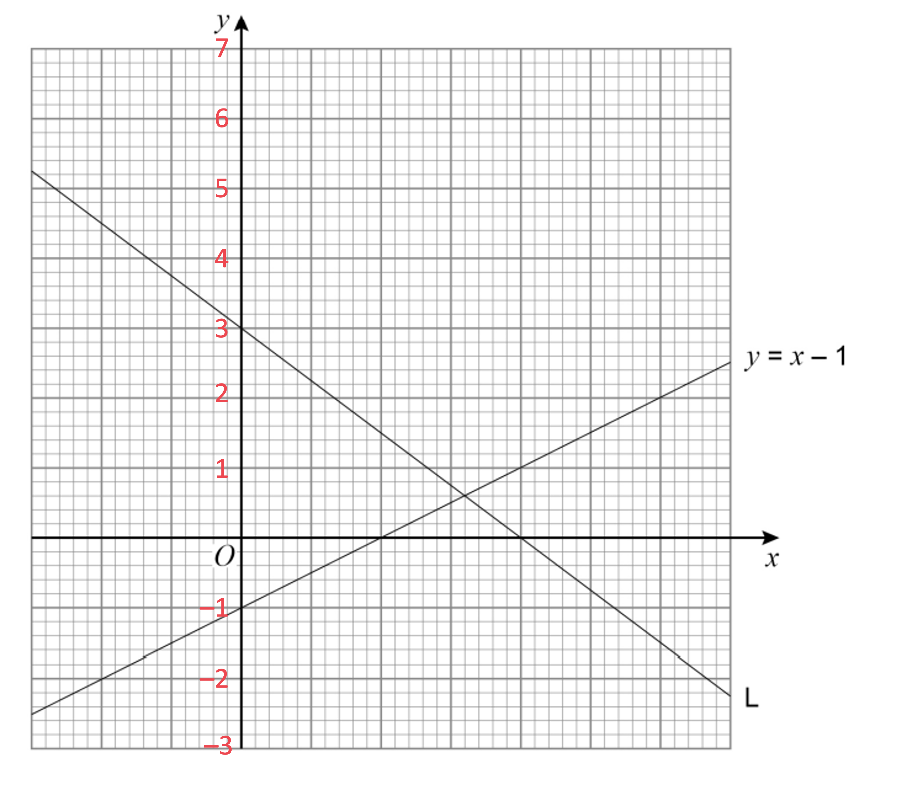

**[1]**

> *Now consider the gradient of the line *$y=x-1$*. The gradient is 1. Therefore from (0, -1) to the point where the line crosses the **x**-axis, the rise is 1 and the run must also be 1. So;*

$y=x-1$* **crosses the ***x*** axis at** *`open parentheses 1 comma space 0 close parentheses`

> *This allows you to mark the scale on the **x** axis.*

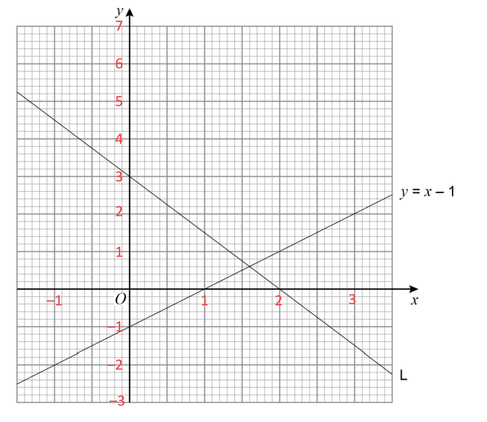

**[1]**

> *Therefore the line L** **crosses the **y** axis at (0, 3) and takes the form;*

$y=mx+3$

**gradient or y-intercept of  ****L**** found ****[1]**

> *Find the gradient using  *$\frac{\mathrm{rise}}{\mathrm{run}}$* .*

$m=-\frac{3}{2}$

> *Now you can write the equation of line L.*

$y=-\frac{3}{2}x+3$* ***[1]**

## Q46 — hard — 5 marks · exam-questions

### 8((a)) — 3 marks
> $y=3x+7$* is already in the form *$y=mx+c$*, ** where *$m$* is the gradient.*

*the gradient of *$y=3x+7$* is 3*

**[1]**

> *Now rearrange *$2y-6x=8$* into the form *$y=mx+c$* in order to show that its gradient is also 3.*

`table row cell 2 y minus 6 x end cell equals 8 row cell plus 6 x space space space space space space space space space space space end cell equals cell space space plus 6 x end cell end table`

`table row cell 2 y end cell equals cell 6 x plus 8 end cell row cell divided by 2 space space space end cell equals cell space space space space space space space space space divided by 2 end cell row cell space space y end cell equals cell 3 x plus 4 end cell end table`

** for "**`table attributes columnalign right center left columnspacing 0px end attributes row cell italic space y end cell italic equals cell italic 3 x italic plus italic 4 end cell end table`**"**** [1]**

> *Write a short statement to conclude.*

**The gradient of **$2y-6x=8$** is also 3 so the lines are parallel ** **[1]**

### 8((b)) — 2 marks
> *Method 1*

> *Substitute *$x=-5$* of the point *`open parentheses negative 5 comma space minus 6 close parentheses`* into the line *$y=3x+7$*.*

`y equals 3 open parentheses negative 5 close parentheses plus 7`

> *Evaluate.*

$y=-15+7\,y=-8$

**[1]**

> *Therefore when *$x=-5$*, *$y=-8$*; the line *$y=-3x+7$* passes through *`open parentheses negative 5 comma space minus 8 close parentheses`*. *`open parentheses negative 5 comma space minus 6 close parentheses`* is above this point.*

**The first box is correct, "Above"** **[1]**

**"Above" ****and**** "**$y=-8$**" must be seen to score full marks**

> *Method 2*

> *Using *$y=mx+c$*, you know that the line *$y=3x+7$* passes through *`open parentheses 0 comma space 7 close parentheses`* and has gradient 3.*

> *From *`open parentheses negative 5. space minus 6 close parentheses`* to the *$y$*-axis the "run" is 5 so the "rise" is 3×5 = 15.*

> *Therefore the line through *`open parentheses negative 5. space minus 6 close parentheses`* with gradient 3 has the *$y$*-intercept;*

$c=-6+15=9$

> *The line through *`open parentheses negative 5 comma space minus 6 close parentheses`* with a gradient 3 has equation;*

$y=3x+9$

**[1]**

> *This line passes through *`open parentheses 0 comma space 9 close parentheses`*and therefore is **above** the line *$y=3x+7$* which passes through *`open parentheses 0 comma space 7 close parentheses`*.*

**The first box is correct, "Above"** **[1]**

**"Above" ****and**** "**$y=3x+9$**" must be seen to score full marks**

> *Method 2*

> *Using *$y=mx+c$*, you know that the line *$y=3x+7$* passes through *`open parentheses 0 comma space 7 close parentheses`* and has gradient 3.*

> *From *`open parentheses negative 5. space minus 6 close parentheses`* to the *$y$*-axis the "run" is 5 so the "rise" is 3×5 = 15.*

> *Therefore the line through *`open parentheses negative 5. space minus 6 close parentheses`* with gradient 3 has the *$y$*-intercept;*

$c=-6+15=9$

> *The line through *`open parentheses negative 5 comma space minus 6 close parentheses`* with a gradient 3 has equation;*

$y=3x+9$

**[1]**

> *This line passes through *`open parentheses 0 comma space 9 close parentheses`*and therefore is **above** the line *$y=3x+7$* which passes through *`open parentheses 0 comma space 7 close parentheses`*.*

**The first box is correct, "Above"** **[1]**

**"Above" ****and**** "**$y=3x+9$**" must be seen to score full marks **
**There are other variations of both the methods above which are valid methods**

## Q47 — hard — 5 marks · exam-questions

### 18() — 5 marks
> *First find the gradient of the line through P(0, -1) and Q(5, 9) using gradient *$m=\frac{y_{1}-y_{2}}{x_{1}-x_{2}}$* *

$m_{1}=\frac{-1-9}{0-5}$

**substitution into gradient formula ****[1]**

$=\frac{-10}{-5}=2$

**correct gradient of PQ ****[1]**

> *The gradients of perpendicular lines are **negative reciprocals** so the gradient of the line perpendicular to the line through PQ is*

$-1\div2=-\frac{1}{2}$

**correct perpendicular gradient ****[1]**

> *The line therefore takes the form;*

$y=-\frac{1}{2}x+c$

> *It passes through P(0, -1). (0, -1) is on the *$y$*-axis; it is the *$y$*-intercept! Therefore;*

$c=-1$

**correct c value ****[1]**

> *Now write the equation*

$y=-\frac{1}{2}x-1$ **[1]**

## Q48 — very_hard — 4 marks · exam-questions

### 18() — 4 marks
> *The diagonals of a rhombus intersect at right angles. Therefore*

**AC*** is perpendicular to the line *$y=\frac{1}{2}x+6$

**(this does not have to be stated explicitly, it can instead be implied by subsequent working)**** [1]**

> *Gradients of perpendicular lines are negative reciprocals so*

*gradient of ***AC*** is −2*

**[1]**

> *AC **therefore takes the form *$y=-2x+c$* and passes through *`open parentheses 5 comma space 11 close parentheses`*. Replace *$x$* with *$5$* and *$y$* with *$11$

`11 equals negative 2 open parentheses 5 close parentheses plus c`

**[1]**

> *Solve for *$c$

`table row 11 equals cell negative 10 plus c end cell row c equals 21 end table`

> *Now we can write the equation of the line in the form *$y=mx+c$* *

$y=-2x+21$** [1]**

## Q49 — very_hard — 4 marks · exam-questions

### 19() — 4 marks
> *If we can find the coordinates of** E** and **B, **we can use the fact that **AE = EB** to work back and find **A*

> *E **is the **y**-intercept of **L**, so find **B** by substituting *$x=0$* into **L*

`table attributes columnalign right center left columnspacing 0px end attributes row cell 0 plus 2 y end cell equals 12 row cell 2 y end cell equals 12 row y equals 6 end table`

> *B **is the **x**-intercept of **L**, so find **B** by substituting *$y=0$* into **L*

`table row cell x plus 2 open parentheses 0 close parentheses end cell equals 12 row x equals 12 end table`

**x-coordinate of B and y-coordinate of E ****[1]**

> *To go from **B **to **E, **we go 12 left and 6 up. As **AE = EB** , we can find **A** by starting at **E **and going 12 left and 6 up as in the diagram below*

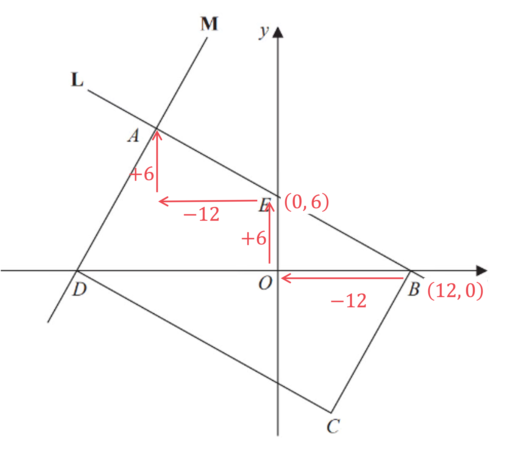

`table row A equals cell open parentheses negative 12 comma space 12 close parentheses end cell end table`

**[1]**

> *M **and **L** are perpendicular (as **ABCD** is a rectangle) *

> *Rearrange **L** into the form *$y=mx+c$* to find its gradient, and use the fact that gradients of perpendicular lines are negative reciprocals to find the gradient of **M*

> *  *`table attributes columnalign right center left columnspacing 0px end attributes row cell 2 y end cell equals cell negative x plus 12 end cell row y equals cell negative 1 half x plus 6 end cell end table`

*Gradient of ****L ****is *`table row blank blank cell negative 1 half end cell end table`*, gradient of ****M**** is *`table row blank blank 2 end table`

**[1]**

> *M **takes the form *$y=2x+c$* and passes through *`open parentheses negative 12 comma space 12 close parentheses`*. Substitute the point into the equation to find *$c$

`table attributes columnalign right center left columnspacing 0px end attributes row 12 equals cell 2 open parentheses negative 12 close parentheses plus c end cell row 12 equals cell negative 24 plus c end cell row 36 equals c end table`

> *Now we can write the equation of **M** *

$y=2x+36$* ***[1]**

## Q50 — very_hard — 4 marks · exam-questions

### 2((a)) — 4 marks
> *Rearrange *$l_{1}$* into the form *$y=mx+c$* in order to determine its gradient*

`table row cell 3 y end cell equals cell negative 2 x plus 26 end cell row y equals cell negative 2 over 3 x plus 26 over 3 end cell end table`

*The gradient of *`table attributes columnalign right center left columnspacing 0px end attributes row blank blank cell l subscript 2 end cell end table`* is *`table row blank blank cell negative 2 over 3 end cell end table`

**[1]**

> *Gradients of perpendicular lines are negative reciprocals so the gradient of *$l_{2}$* is*

$m=\frac{3}{2}$

**[1]**

> $l_{2}$* therefore takes the form *$y=\frac{3}{2}x+c$

> *We are told in the question and on the diagram that *$l_{2}$* passes through the origin or *`open parentheses 0 comma space 0 close parentheses`*. Therefore*

$c=0$

**[1]**

> *Now we can write the equation of the line in the form *$y=mx+c$* *

$y=\frac{3}{2}x$ **[1]**

## Q51 — very_hard — 5 marks · exam-questions

### 19() — 5 marks
> *Find the gradient **PQ **in terms of *$a$* and *$b$*using** ** *$m=\frac{y_{1}-y_{2}}{x_{1}-x_{2}}$*, taking **P **as *`open parentheses x subscript 1 comma space y subscript 1 close parentheses`* and **Q** as *`open parentheses x subscript 2 comma space y subscript 2 close parentheses`

$m=\frac{4-b}{3-a}$

**[1]**

> *We need to find a value for *$m$* to equate this to and rearrange to "*$b=...$*" (*$b$* in terms of *$a$*) *

> *Find the gradient of the line perpendicular to **PQ **by rearranging it to the form *$y=mx+c$

`table attributes columnalign right center left columnspacing 0px end attributes row cell 2 y end cell equals cell negative 3 x plus 7 end cell row y equals cell negative 3 over 2 x plus 7 over 2 end cell end table`

**[1]**

> *Therefore the gradient of the line perpendicular to **PQ** is *$-\frac{3}{2}$*. Gradients of perpendicular lines are negative reciprocals so*

*gradient of ***PQ*** *`table attributes columnalign right center left columnspacing 0px end attributes row blank equals cell 2 over 3 end cell end table`

**[1]**

> *Equate the two forms of *$m$* found*

`table row cell 2 over 3 end cell equals cell fraction numerator 4 minus b over denominator 3 minus a end fraction end cell end table`

**[1]**

> *Cross multiply to clear the fractions*

`table attributes columnalign right center left columnspacing 0px end attributes row cell 2 open parentheses 3 minus a close parentheses end cell equals cell 3 open parentheses 4 minus b close parentheses end cell end table`

> *Expand the brackets and rearrange to get *$b$* on its own on one side of the equation*

`table attributes columnalign right center left columnspacing 0px end attributes row cell 6 minus 2 a end cell equals cell 12 minus 3 b end cell row cell 3 b end cell equals cell 12 minus 6 plus 2 a end cell row blank equals cell 2 a plus 6 end cell row b equals cell fraction numerator 2 a plus 6 over denominator 3 end fraction end cell end table`

$b=\frac{2a+6}{3}\mathrm{or}b=\frac{2}{3}a+2$ ** ****[1]**

## Q52 — very_hard — 4 marks · exam-questions

### 23() — 4 marks
> *D **is the y-intersect of  *$y=-2x+6$* so we know that *

`D equals open parentheses 0 comma space 6 close parentheses`

> *We also need the coordinate of **P**, which we can find by finding the equation of **AP, **which** **is perpendicular to **AD*

> *Finding the equation of** AD:*

> *A** is the **x**-intersect of *$y=-2x+6$* so substitute *$y=0$* into *$y=-2x+6$

`table row 0 equals cell negative 2 x plus 6 end cell row cell 2 x end cell equals 6 row x equals 3 row A equals cell open parentheses 3 comma space 0 close parentheses end cell end table`

**finding the coordinates of D or A**** [1]**

> *Now find the gradient of **AD** using *`m equals fraction numerator y subscript 1 minus y subscript 2 over denominator x subscript 1 minus x subscript 2 end fraction comma space A open parentheses 3 comma space 0 close parentheses comma space D open parentheses 0 comma space 6 close parentheses`

$m_{AD}=\frac{0-6}{3-0}=-2$

> *(we can get the same result simply using *$m=\frac{\mathrm{rise}}{\mathrm{run}}$* from the lengths marked on the diagram below)*

> *Finding the equation of **AP**:*

> *AD **and **AP** are perpendicular therefore their gradients are negative reciprocals therefore*

$m_{AP}=\frac{1}{2}$

> *Now we can substitute *$m=2$*, and *`A open parentheses 3 comma space 0 close parentheses`* into *$y=mx+c$* to find *$c$*, which is the **y**-coordinate of** P*

`table row 0 equals cell 1 half open parentheses 3 close parentheses plus c end cell end table`

**[1]**

`table row c equals cell negative 1.5 end cell end table`

> *Plotting these points on the diagram:*

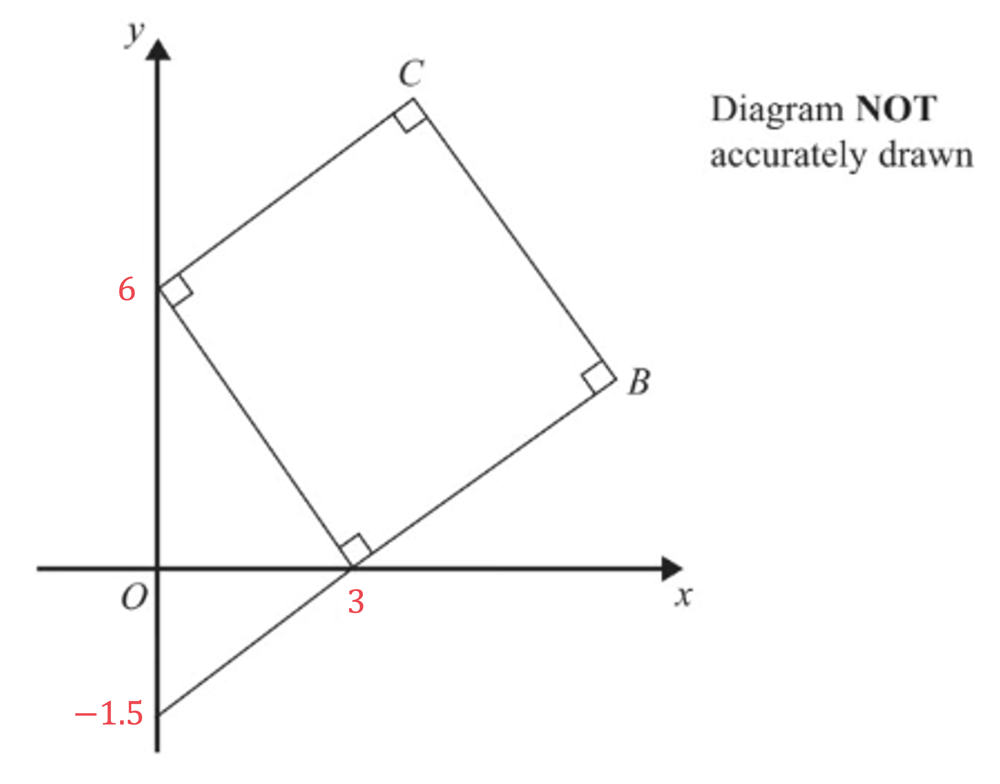

> *We see that the length **PD **simply by adding 6 and 1.5*

**PD ***= 6 + 1.5*

**[1]**

**PD**** = 7.5** **[1]**

## Q53 — very_hard — 5 marks · exam-questions

### 25() — 5 marks
> *Start by sketching a diagram of the information given, to help you visualise the problem and break it down into smaller steps You don't have to include the axes, but try to put the points in roughly the correct place according to the coordinates, and show a right-angle at angle **ABC*

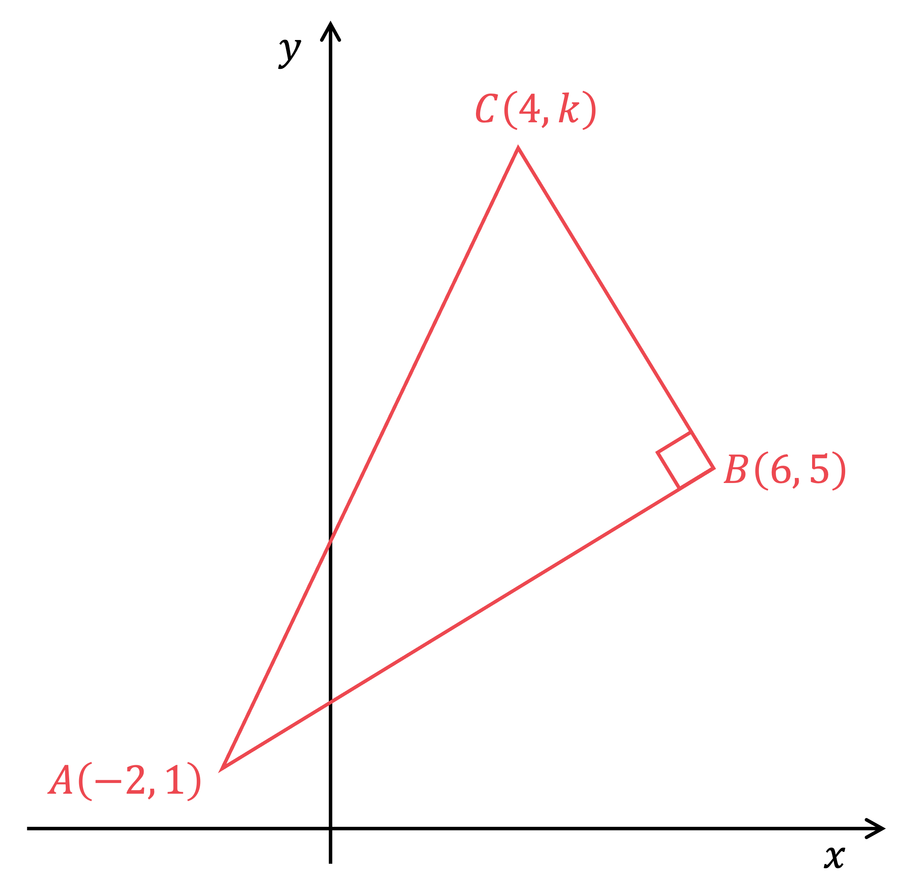

**any sensible sketch ****[1]**

> *To find the missing value *$k$* we can find the gradient of **AB** and substitute it into the gradient formula for the perpendicular gradient of **BC*

> *The gradient of **AB** using the gradient formula, *$m=\frac{y_{1}-y_{2}}{x_{1}-x_{2}}$*, is*

$m_{AB}=\frac{1-5}{-2-6}=\frac{1}{2}$

> *AB **and **BC** are perpendicular therefore their gradients are negative reciprocals therefore*

$m_{BC}=-2$

**[1]**

> *Now we can substitute *$m=-2$*, *`open parentheses 6 comma space 5 close parentheses`* and *`open parentheses 4 comma space k close parentheses`* into the gradient formula for **BC **and solve to find *$k$

`table row cell negative 2 end cell equals cell fraction numerator 5 minus k over denominator 6 minus 4 end fraction end cell row cell negative 2 end cell equals cell fraction numerator 5 minus k over denominator 2 end fraction end cell row cell negative 4 end cell equals cell 5 minus k end cell row k equals 9 end table`

**[1]**

*Now we know that *$C$* is *`open parentheses 4 comma space 9 close parentheses`* and we can find the equation of a line through *`A open parentheses negative 2 comma space 1 close parentheses`* and *`C open parentheses 4 comma space 9 close parentheses` *First find the gradient*

$m_{AC}=\frac{1-9}{-2-4}=\frac{4}{3}$

> *Substitute either *`A open parentheses 2 comma space minus 1 close parentheses`* or *`C open parentheses 4 comma space 9 close parentheses`* into *$y=\frac{4}{3}x+c$* and solve to find *$c$*. Here we will use *`C open parentheses 4 comma space 9 close parentheses`* (as it has no negative numbers)*

`table attributes columnalign right center left columnspacing 0px end attributes row 9 equals cell 4 over 3 open parentheses 4 close parentheses plus c end cell row 9 equals cell 16 over 3 plus c end cell row c equals cell 11 over 3 end cell end table`

> *Now we can write the equation of the line through **A **and** C*

`table attributes columnalign right center left columnspacing 0px end attributes row y equals cell 4 over 3 x plus 11 over 3 end cell end table`

**[1]**

> *Finally we can rearrange into the form *$ay+bx=c$*. Start by multiplying all terms by 3 to clear the fractions, then collect the terms in *$x$* and *$y$* on the left hand side*

`table row cell 3 y end cell equals cell 4 x plus 11 end cell row cell 3 y minus 4 x end cell equals 11 end table`

`table row cell bold 3 bold italic y bold minus bold 4 bold italic x end cell bold equals bold 11 end table` **[1]**

## Q54 — very_hard — 4 marks · exam-questions

### 6() — 4 marks
> *Start by sketching a diagram of the information given, to help you visualise the problem and break it down into smaller steps *
*You don't have to include the axes, but try to put the points in roughly the correct place according to the coordinates.*

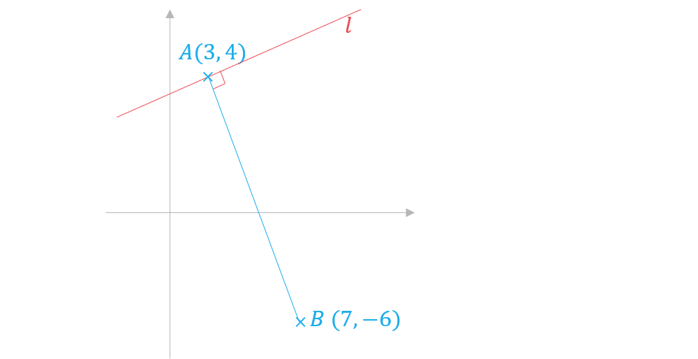

> *Find the gradient of the line joining **A** and **B.*

> *The gradient of **AB** using the gradient formula, *$m=\frac{y_{1}-y_{2}}{x_{1}-x_{2}}$*, is*

$m_{AB}=\frac{-6-4}{7-3}=-\frac{5}{2}$

**[1]**

> *AB **and the line **l **are perpendicular therefore their gradients are negative reciprocals therefore*

$m_{l}=\frac{2}{5}$

**[1]**

> *Substitute into the equation of a line, *$y=mx+c$*.*

$y=\frac{2}{5}x+c$

> *Substitute *`A open parentheses 3 comma space 4 close parentheses`*  into *$y=\frac{2}{5}x+c$* and solve to find *$c$*. *

> *Note that *`B open parentheses 7 comma space minus 6 close parentheses`* is not on *$l$* so this coordinate cannot be used to substitute.*

`table attributes columnalign right center left columnspacing 0px end attributes row 4 equals cell 2 over 5 open parentheses 3 close parentheses plus c end cell row 4 equals cell 6 over 5 plus c end cell row c equals cell 14 over 5 end cell end table`

**[1]**

> *Now we can write the equation of the line *$l$

`table row y equals cell 2 over 5 x plus 14 over 5 end cell end table`

**[1]**

> *Finally we can rearrange into the form *$ax+by+c=0$*. Start by multiplying all terms by 5 to clear the fractions, then collect the terms in *$x$* and *$y$* on the left hand side*

`table row cell 5 y end cell equals cell 2 x plus 14 end cell row cell negative 5 y space space space space space space space space space space space space space space space space end cell equals cell space space space space space space space space space space space space space space space space space space space space space space minus 5 y space end cell row 0 equals cell 2 x space minus space 5 y space plus space 14 end cell end table`

`table row cell bold 2 bold italic x bold space bold minus bold space bold 5 bold italic y bold space bold plus bold space bold 14 bold space end cell bold equals cell bold space bold 0 end cell end table` **[1]**

## Q55 — very_hard — 5 marks · exam-questions

### 22() — 5 marks
> *Find the coordinates of **M** (the midpoint of **BC** ) using the formula for the midpoint of two coordinates, *`M space equals space open parentheses fraction numerator x subscript 1 space plus space x subscript 2 over denominator 2 end fraction space comma space fraction numerator y subscript 1 space plus y subscript 2 over denominator 2 end fraction close parentheses`*.*

`table row cell M space end cell equals cell space open parentheses fraction numerator negative 1 space plus space 2 over denominator 2 end fraction space comma space fraction numerator 5 space plus space 10 over denominator 2 end fraction close parentheses space equals space open parentheses 1 half space comma space 15 over 2 close parentheses space equals space open parentheses 0.5 comma space 7.5 close parentheses end cell end table`

** ****[1]**

> *The line connecting the top vertex of an isosceles triangle (**A**) to the midpoint of its base** **(**BC**) is perpendicular to the base, so the lines **AM **and **BC **are perpendicular. *

> *A diagram will help to see this. *

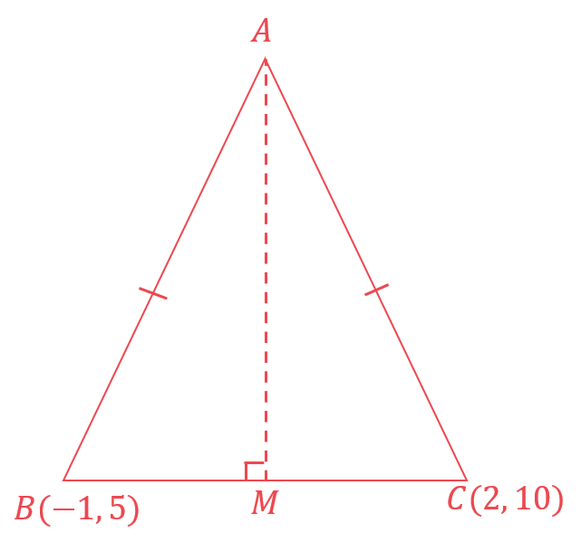

> *The gradients of perpendicular lines are negative reciprocals of each other so the product of the gradients of **AM** and **BC **will be -1.*

> *Find the gradient of **BC** using the formula for the gradient of a line connecting two coordinates, *`straight m space equals space open parentheses space fraction numerator y subscript 2 space minus space y subscript 1 over denominator x subscript 2 space minus space x subscript 1 end fraction close parentheses`*, and the points **B **and **C.*

`straight m subscript B C end subscript space equals space fraction numerator 10 space minus space 5 over denominator 2 space minus space open parentheses negative 1 close parentheses end fraction space equals space 5 over 3`

**[1]**

> *Find the gradient of **AM** using the fact that the lines are perpendicular so *$m_{AM}=-\frac{1}{m_{BC}}$*.*

$m_{AM}=-\frac{1}{m_{BC}}=-\frac{1}{\frac{5}{3}}=-\frac{3}{5}$

**[1]**

> *The coordinate **M **(0.5, 7.5) is on the line **AM** **so the equation of the straight line **AM** can be found by substituting *$m=-\frac{3}{5}$* and (0.5, 7.5)  into **y **= **mx **+ **c.*

`table row cell y space end cell equals cell negative 3 over 5 x space plus space c end cell row cell open parentheses 7.5 close parentheses space end cell equals cell space minus 3 over 5 open parentheses 0.5 close parentheses space plus space c end cell end table`

** [1]**

> *Rearrange to find **c.*

$7.5=-\frac{3}{10}+c\,c=7.5+\frac{3}{10}=\frac{39}{5}$

> *Substitute the gradient (**m**) **and** the value of **c** into the equation **y **= **mx **+ **c.*

`table row cell y space end cell equals cell negative 3 over 5 x space plus space 39 over 5 end cell end table`

> *Get rid of the fractions by multiplying everything through by 5.*

`table row cell 5 y space end cell equals cell negative 3 x space plus space 39 end cell end table`

> *Rearrange into the required format by adding 3**x **to both sides**.*

`table row cell 5 y space plus 3 x space end cell equals 39 end table`

$5y+3x=39$* ***[1]**

## Q56 — very_hard — 5 marks · exam-questions

### 24() — 5 marks
> *Although you do not know all of the information, sketching a graph with a rough idea of where the lines go will help you to visualise this question. It does not matter if your lines are not in the exact places but make sure that they intersect each other according to the question.*

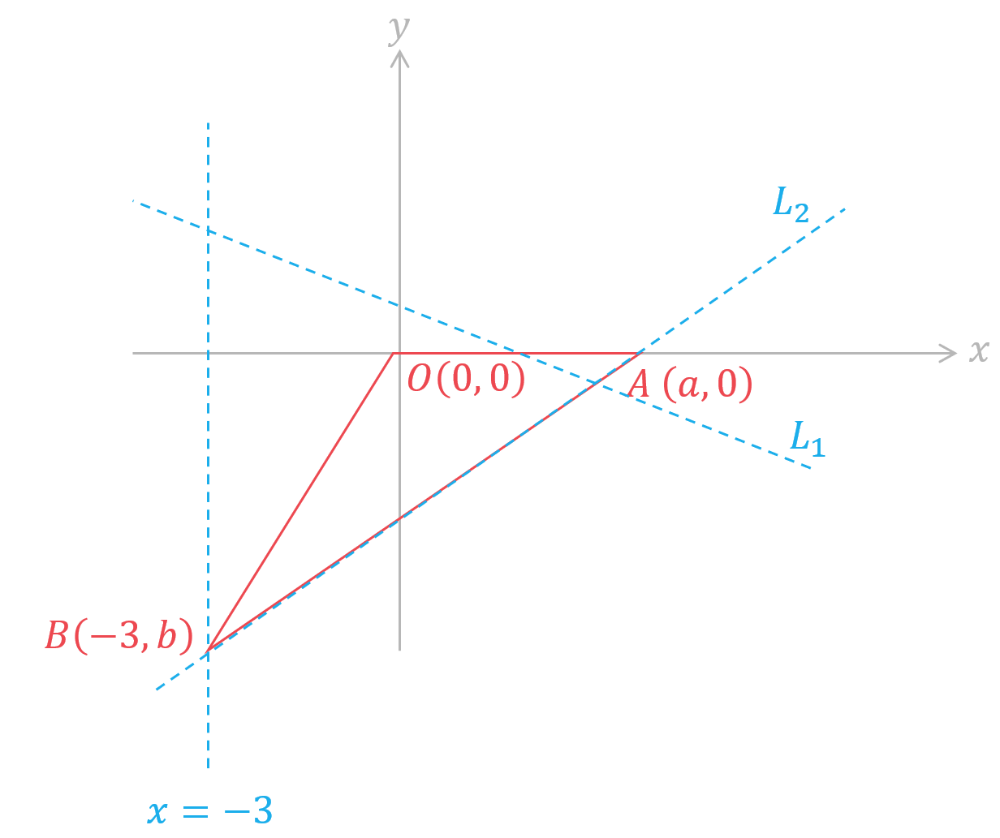

> *We can see from the graph that to find the area of the triangle we will need to find the values of **a **(the base of the triangle)** **and **b **(the perpendicular height to the base).*

> *Find the gradient of line **L**1  **by rearranging its equation to the form *$y=mx+c$*.*

`table row cell 10 y space end cell equals cell space minus 5 x space plus space 8 end cell row cell y space end cell equals cell space fraction numerator negative 5 x space plus space 8 over denominator 10 end fraction space end cell row cell y space end cell equals cell space minus 1 half x space plus space 2 over 5 end cell end table`

*therefore gradient of *****L********1 ****$=-\frac{1}{2}$

> *The gradients of perpendicular lines are negative reciprocals so the gradient of the line **L**2 ** **is*

$m_{L_{2}}=-\frac{1}{-\frac{1}{2}}=2$

**[1]**

> *The line **L**2 ** therefore takes the form *$y=2x+c$* and passes through *`open parentheses 8 comma space 6 close parentheses`*. *

> *Find the value of **c** by substituting *$x$* with 8 and *$y$* with 6.*

`6 equals space 2 open parentheses 8 close parentheses space plus space c`

> *Simplify and solve to find *$c$*.*

`table row cell 6 space end cell equals cell 16 space plus space c end cell row cell c space end cell equals cell space minus 10 end cell end table`

> *Now we can write the equation of the line in the form *$y=mx+c$*. *

`table attributes columnalign right center left columnspacing 0px end attributes row cell y space end cell equals cell space 2 x space minus space 10 end cell end table`

**[1]**

> *The line **L**2 ** crosses the *$x$*- axis at the point where *$y=0$*. *

> *Find the coordinates of **A** by substituting *$y$* with 0 and solving for *$x$*.*

`table row 0 equals cell space 2 x space minus space 10 end cell row cell 10 space end cell equals cell space 2 x end cell row cell x space end cell equals cell space 5 end cell end table`

*The coordinates of ***A ***are (5, 0) and the value of ***a ***= 5*

> *Find the coordinates of **B, **the point of intersection of **L**2**  with the line *$x=-3$*, by substituting *$x=-3$* into the equation for **L**2** **.*

`table row cell y space end cell equals cell space 2 open parentheses negative 3 close parentheses space minus 10 space equals space minus 6 space minus space 10 space equals space minus 16 end cell end table`

*The coordinates of ***B ***are (-3, -16) and the value of ***b ***= -16*

**[1]**

> *The formula for the area of a triangle is *$A=\frac{1}{2}bh$* where **b **is the base and **h **is the perpendicular height. Substitute the **x **coordinate of **A **and the **y **coordinate of **B **(ignoring the negative as we are looking for a height and height must be positive) into the formula.*

`table row cell A space end cell equals cell space 1 half open parentheses 5 close parentheses open parentheses 16 close parentheses end cell end table`

**[1]**

$\mathrm{Area}=40\mathrm{units}^{2}$ **[1]**

## Q57 — very_hard — 7 marks · exam-questions

### 20() — 7 marks
> *Although you do not know all of the information, sketching a graph with a rough idea of where the lines go will help you to visualise this question. It does not matter if your lines are not in the exact places but make sure that they intersect each other according to the question.*

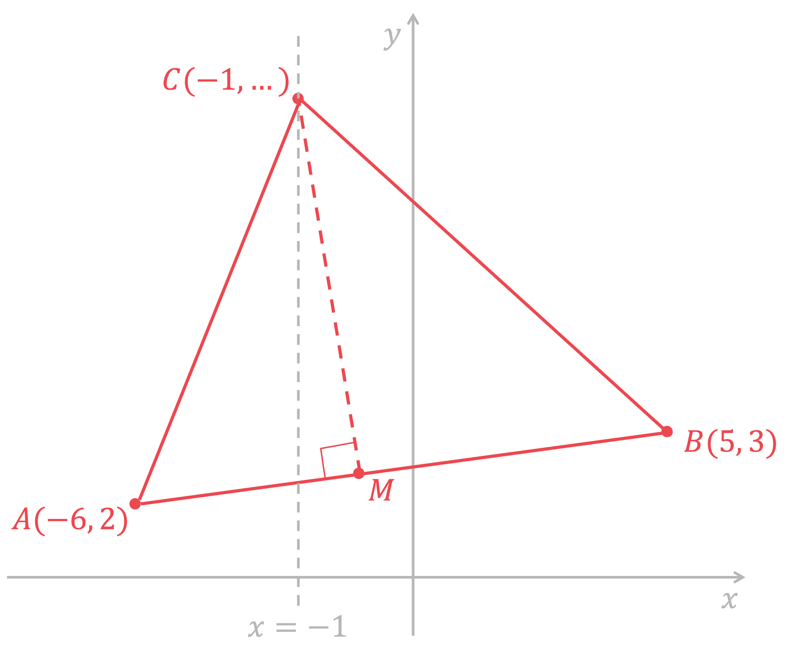

> *We can see from the graph that to find the area of the triangle we will need to find the length of **AB** (the base of the triangle) and the length of **CM** (the height of the triangle).*

> *First let's consider **CM. **We can find the coordinates of **M** using the midpoint formula, *`M equals open parentheses fraction numerator x subscript 1 plus space x subscript 2 over denominator 2 end fraction comma space fraction numerator y subscript 1 space plus space y subscript 2 over denominator 2 end fraction close parentheses`*.*

`table row M equals cell open parentheses fraction numerator 5 plus space open parentheses negative 6 close parentheses over denominator 2 end fraction comma space fraction numerator 3 space plus space 2 over denominator 2 end fraction close parentheses end cell row blank equals cell open parentheses negative 1 half comma space 5 over 2 close parentheses end cell end table`

**[1]**

> *To find **C**, we can find the equation of **CM** and examine where it intersects the line *$x=-1$*.*

> *To find the equation of **CM**, start by finding the gradient of **AB, **which is perpendicular to **CM**, using gradient *$m=\frac{y_{1}-y_{2}}{x_{1}-x_{2}}$*.*

`table attributes columnalign right center left columnspacing 0px end attributes row cell m subscript A B end subscript end cell equals cell fraction numerator 3 minus 2 over denominator 5 minus open parentheses negative 6 close parentheses end fraction end cell row blank equals cell 1 over 11 end cell end table`

**[1]**

> *Perpendicular gradients are negative reciprocals so from this we can deduce the gradient of **CM** .*

`table row cell m subscript C M end subscript end cell equals cell negative 1 divided by 1 over 11 end cell row blank equals cell negative 11 end cell end table`

**[1]**

> *Now find the equation of **CM** by substituting the point *`M table row blank blank cell open parentheses negative 1 half comma space 5 over 2 close parentheses end cell end table`* and the gradient *$-11$* into *$y=mx+c$*, and solving for **c**.*

> * *`table attributes columnalign right center left columnspacing 0px end attributes row y equals cell m x plus c end cell row cell 5 over 2 end cell equals cell negative 11 open parentheses negative 1 half close parentheses plus c end cell row cell 5 over 2 end cell equals cell 11 over 2 plus c end cell row cell fraction numerator 5 minus 11 over denominator 2 end fraction end cell equals c row c equals cell fraction numerator negative 6 over denominator 2 end fraction equals negative 3 end cell end table`

**[1]**

> *Now we know that the equation of **CM** is:*

`table attributes columnalign right center left columnspacing 0px end attributes row y equals cell negative 11 x minus 3 end cell end table`

> *Substitute *$x=-1$* into the equation of **CM** to find the **y**-coordinate of **C.*

`table row y equals cell negative 11 open parentheses negative 1 close parentheses plus 3 end cell row blank equals cell 11 minus 3 end cell row blank equals 8 end table`

**[1]**

> *Now we can find the length of **CM** using the length of a line segment formula, *`length equals square root of open parentheses x subscript 1 minus x subscript 2 close parentheses squared space plus space open parentheses y subscript 1 minus y subscript 2 close parentheses squared end root`*.*

`table row cell C M end cell equals cell square root of open parentheses negative 1 half minus open parentheses negative 1 close parentheses close parentheses squared space plus space open parentheses 5 over 2 minus 8 close parentheses squared end root end cell row blank equals cell square root of open parentheses 1 half close parentheses squared plus open parentheses 11 over 2 close parentheses squared end root end cell row blank equals cell fraction numerator square root of 122 over denominator 2 end fraction end cell end table`

> *And finding the length of **AB** is straightforward as we already have the coordinates of **A **and** B.*

`table row cell A B end cell equals cell square root of open parentheses 3 minus 2 close parentheses squared space plus space open parentheses 5 minus open parentheses negative 6 close parentheses close parentheses squared end root end cell row blank equals cell square root of 122 end cell end table`

**length of CM and AB**** ****found**** [1]**

> *Finally, we are ready to find the area of triangle **ABC** using area of a triangle = *$\frac{1}{2}$*× base × height.*

$\mathrm{Area}=\frac{1}{2}\times\sqrt{122}\times\frac{\sqrt{122}}{2}$

**[1]**

`table row blank equals cell 122 over 4 end cell row blank equals cell 61 over 2 end cell end table`

$\mathrm{Area}=30.5\mathrm{units}^{2}$ **[1]**

## Q58 — very_hard — 4 marks · exam-questions

### 28() — 4 marks
> *From *$y=mx+c$*, Line A has gradient 4. The gradients of perpendicular lines are negative reciprocals so the gradient of the line perpendicular to Line A** **is;*

$m=-1\div4=-\frac{1}{4}$

**[1]**

> *Line B therefore takes the form *$y=-\frac{1}{4}x+c$* and passes through *`open parentheses 8 comma space 5 close parentheses`*. Substitute this point into the equation.*

`5 equals negative 1 fourth open parentheses 8 close parentheses plus c`

**[1]**

> *Solve for *$c$*.*

`table row 5 equals cell negative 2 plus c end cell row 7 equals c end table`

> *Now we can write the equation of Line B in the form *$y=mx+c$*.*

`table row y equals cell negative 1 fourth x plus 7 end cell end table`

> *Substitute *$y=0$* into Line B and solve for *$x$* to find where it intersects the *$x$*-axis.*

`table row 0 equals cell negative 1 fourth x plus 7 end cell end table`

**[1]**

> *(Subtract 7 from both sides)*

`table attributes columnalign right center left columnspacing 0px end attributes row cell negative 7 end cell equals cell negative 1 fourth x end cell end table`

> *(Multiply both sides by -4)*

`table row 28 equals x end table`

> *Write the final answer as a pair of coordinates.*

$(28,0)$ **[1]**
