# Exam Questions — Linear Graphs y = mx + c
**Graphs & Coordinates** · Edexcel IGCSE Maths A (Modular) (4XMAF/4XMAH) — 24/Higher Unit 1
> Source: [https://www.savemyexams.com/igcse/maths/edexcel/a-modular/24/higher-unit-1/topic-questions/graphs-and-coordinates/linear-graphs/exam-questions/](https://www.savemyexams.com/igcse/maths/edexcel/a-modular/24/higher-unit-1/topic-questions/graphs-and-coordinates/linear-graphs/exam-questions/) · 58 questions · total 217 marks

## Q1 — easy — 3 marks · exam-questions

### 4() — 3 marks — command: draw — structured — from paper 2012	June · 1MA0/2H
On the grid, draw the graph of $y=3x---2$ for values of $x$ from $---1\mathrm{to}3$

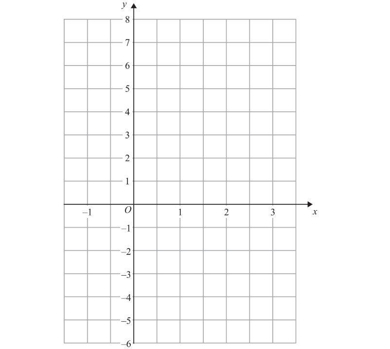

## Q2 — easy — 3 marks · exam-questions

### 3() — 3 marks — command: find — structured — from paper 2015	Spec1 · 1MA1/3H
Line $L$ is drawn on the grid below.

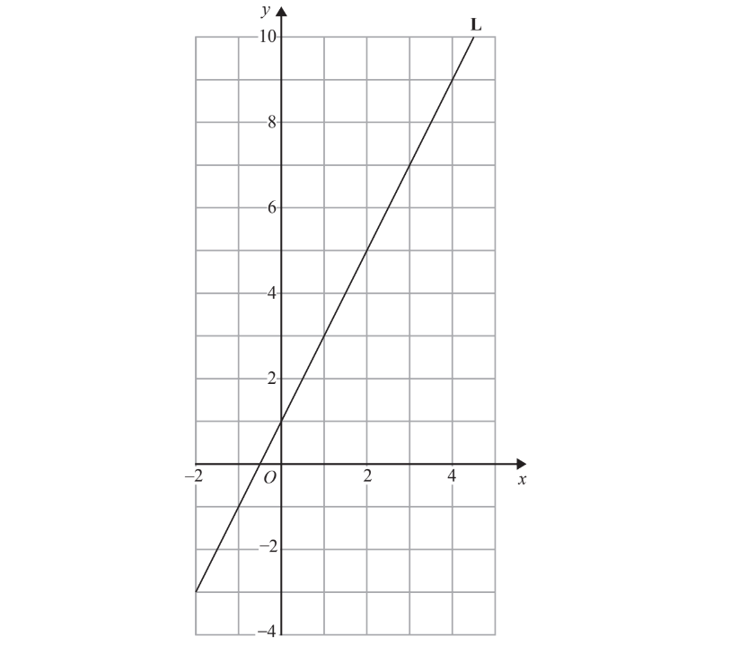

Find the equation for the straight line $L$. 
Give your answer in the form $y=mx+c$

## Q3 — easy — 3 marks · exam-questions

### 12() — 3 marks — command: draw — structured — from paper 2013	June · 1MA0/1H
On the grid, draw the graph of $y=\frac{1}{2}x+5$ for values of $x$ from $-2\mathrm{to}4$

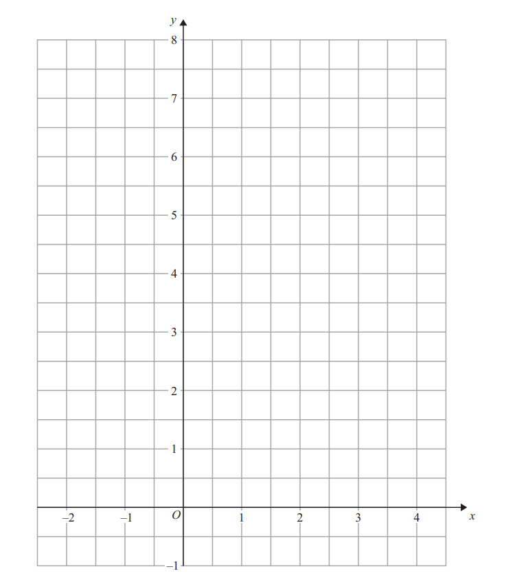

## Q4 — easy — 4 marks · exam-questions

### 4((a)) — 2 marks — command: complete — structured — from paper 2013	March · 1MA0/1H
Complete the table of values for $y=2x+5$

| $x$ | $-2$ | $-1$ | $0$ | $1$ | $2$ |
|---|---|---|---|---|---|
| $y$ | $1$ |   | $5$ |   |   |

### 4((b)) — 2 marks — command: draw — structured — from paper 2013	March · 1MA0/1H
On the grid, draw the graph of $y=2x+5$ for values of $x$ from $x=-2\mathrm{to}x=2$

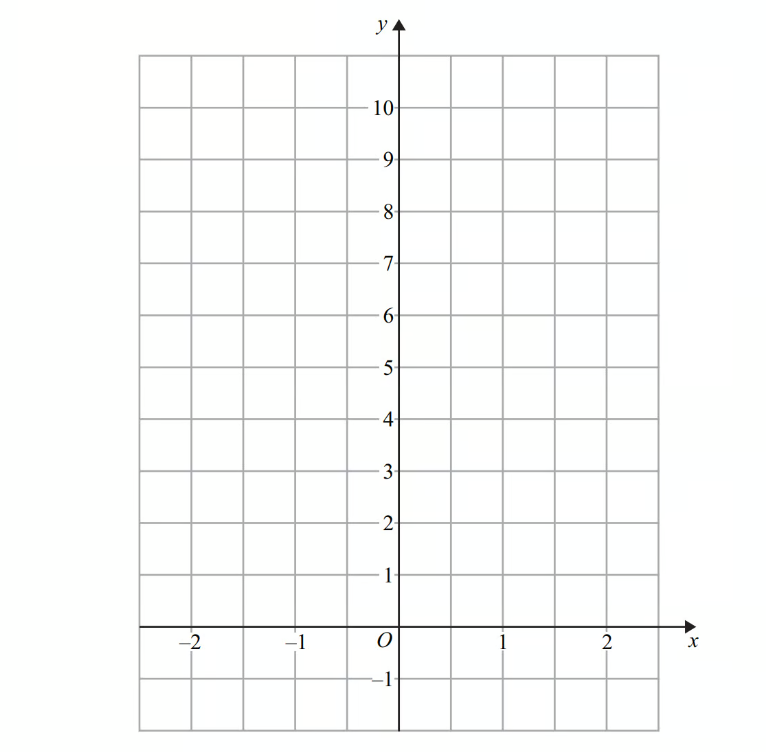

## Q5 — easy — 3 marks · exam-questions

### 7() — 3 marks — command: draw — structured — from paper 2016	November · 1MA0/2H
On the grid, draw the graph of $y=8---2x$ for values of $x$ from —1 to 4

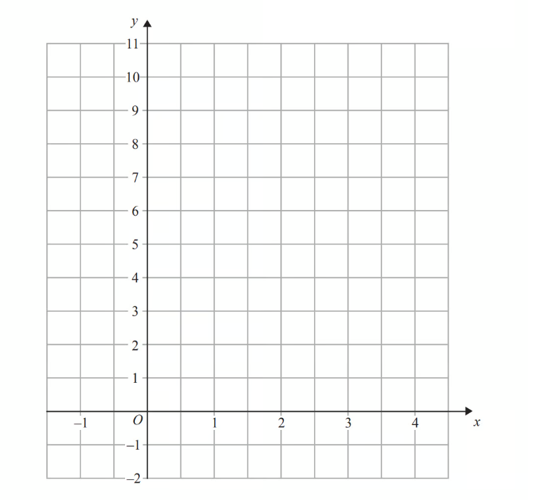

## Q6 — easy — 3 marks · exam-questions

### 3() — 3 marks — command: find — structured — from paper 2018	June · 1MA1/2H
The line $L$ is shown on the grid.

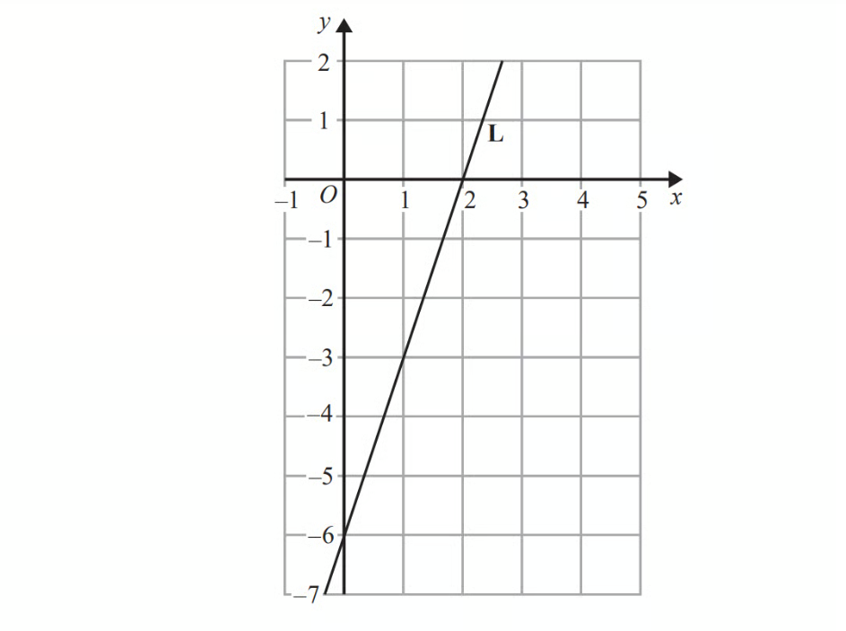

Find an equation for $L$.

## Q7 — easy — 3 marks · exam-questions

### 2() — 3 marks — command: draw — structured — from paper June 2019 · 1MA1/2H
On the grid below, draw the graph of $y=2x---3$ for values of $x$ from $---2\mathrm{to}4$

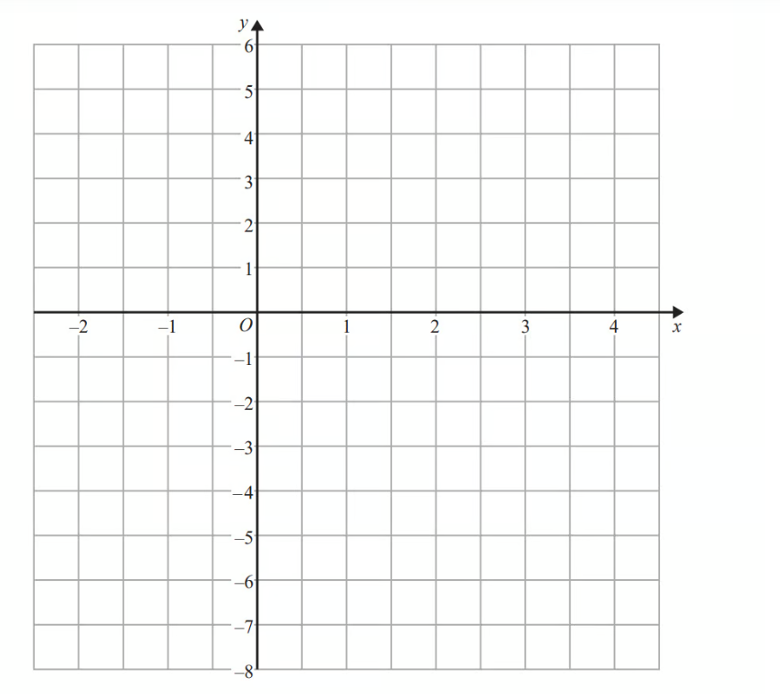

## Q8 — easy — 1 marks · exam-questions

### 10((b)) — 1 mark — command: find — structured — from paper Jan 2022 · 4MA1/1H
The straight line $L$ has equation $2y+7x=10$ 
Find the coordinates of the point where $L$ crosses the y‐axis.

## Q9 — easy — 2 marks · exam-questions

### 7((a)) — 2 marks — command: write — structured — from paper Jan 2022 · 4MA1/2HR
Write down an equation of the straight line with gradient –3 and which passes through the point with coordinates (0, 5)

## Q10 — easy — 1 marks · exam-questions

### 19((a)) — 1 mark — command: write — structured — from paper Jan 2020 · 4MA1/2H
Write down an equation of a line that is parallel to the line with equation $y=7--4x$

## Q11 — easy — 1 marks · exam-questions

### 3() — 1 mark — command: circle — structured — from paper Nov 2021 · 8300/3H
A line has equation $3y=3x--2$

Circle the coordinates of the intercept of the line with the $y$-axis.

| (0, 1) | (0, –1) | `open parentheses 0 comma 2 over 3 close parentheses` | `open parentheses 0 comma negative 2 over 3 close parentheses` |
|---|---|---|---|

## Q12 — easy — 3 marks · exam-questions

### 7((a)) — 1 mark — command: show — structured — from paper Nov 2020 · J560/04
This graph shows part of a straight line.

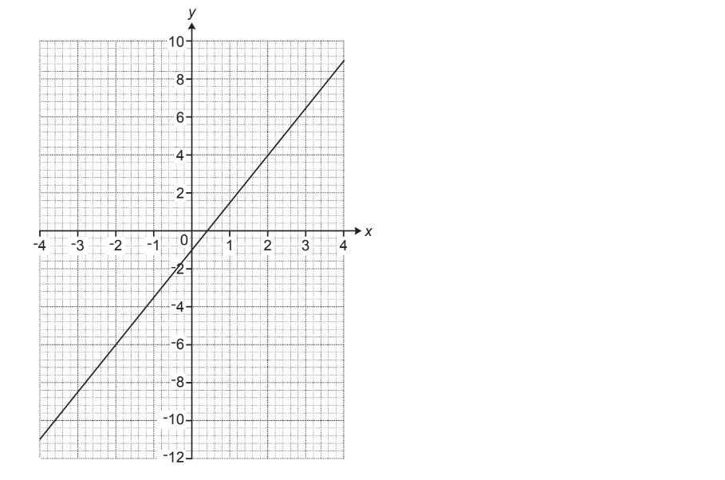

Show that the gradient of the line is 2.5.

### 7((b)) — 2 marks — command: write — structured — from paper Nov 2020 · J560/04
Write down the equation of the line.

## Q13 — medium — 4 marks · exam-questions

### 12() — 4 marks — command: draw — structured — from paper 2014	November · 1MA0/2H
On the grid, draw the graph of $y=2x-3$ for values of $x$ from $-2\mathrm{to}3$

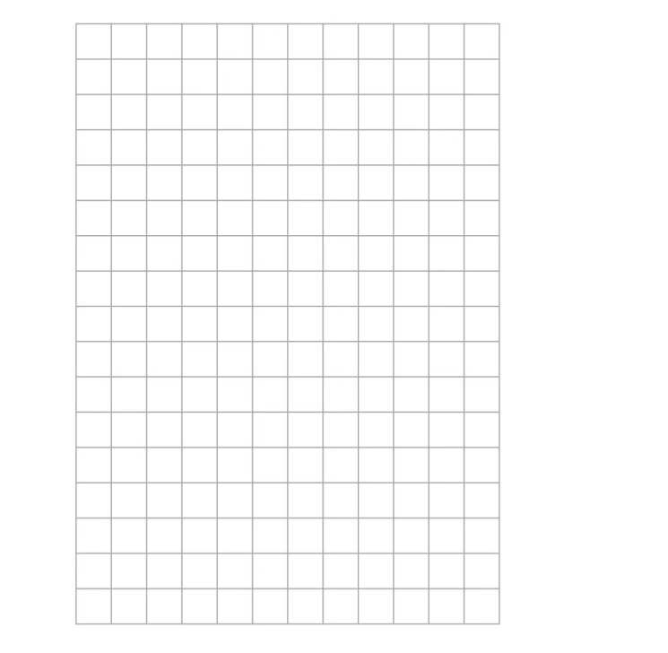

## Q14 — medium — 4 marks · exam-questions

### 12() — 4 marks — command: draw — structured — from paper 2013	November · 1MA0/1H
On the grid, draw the graph of $y=3x+2$ for values of $x$ from $-2\mathrm{to}2$

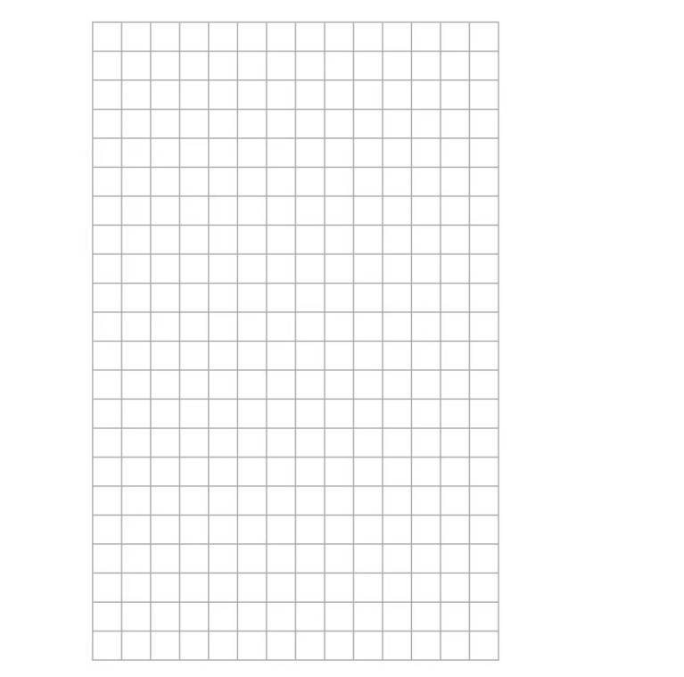

## Q15 — medium — 2 marks · exam-questions

### 6() — 2 marks — command: show — structured — from paper 2017	June · 1MA1/1H
The equation of the line $L_{1}$ is $y=3x-2$
 The equation of the line $L_{2}$ is $3y-9x+5=0$

Show that these two lines are parallel.

## Q16 — medium — 3 marks · exam-questions

### 17() — 3 marks — command: find — structured — from paper 2015	November · 1MA0/2H
$L_{1}$ and $L_{2}$ are parallel lines.

The equation of $L_{1}$ is $y=3x+2$
 $L_{2}$ passes through the point  $(3,4)$.

Find an equation for $L_{2}$.

## Q17 — medium — 3 marks · exam-questions

### 19() — 3 marks — command: find — structured — from paper 2014	June · 1MA0/1H
The diagram shows a straight line, $L_{1}$, drawn on a grid.

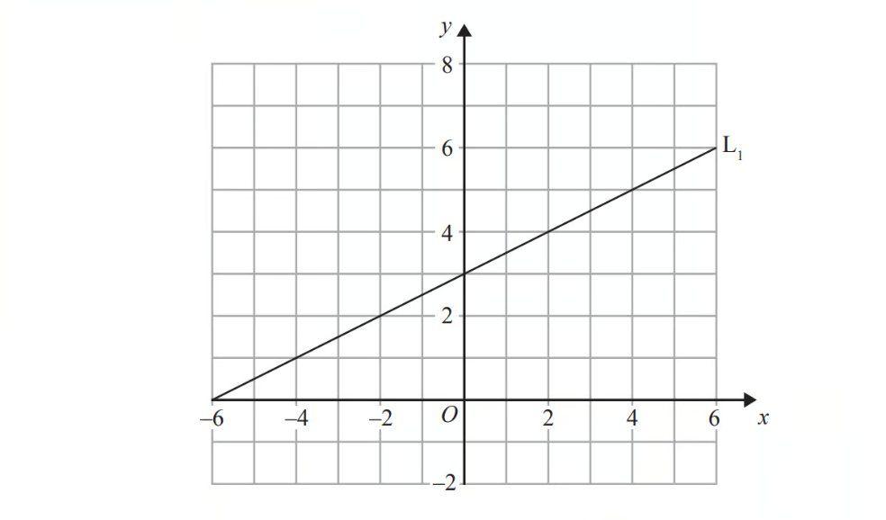

A straight line, $L_{2}$, is parallel to the straight line $L_{1}$ and passes through the point $(0,-5)$. 
Find an equation of the straight line $L_{2}$.

## Q18 — medium — 5 marks · exam-questions

### 15((a)) — 2 marks — command: work_out — structured — from paper 2016	November · 1MA0/1H
$AB$is a line segment.

The midpoint of the line segment $AB$has coordinates (3, 5) Point $A$has coordinates (9, 2)

Work out the coordinates of point $B$.

### 15((b)) — 3 marks — command: work_out — structured — from paper 2016	November · 1MA0/1H
Work out an equation of the straight line that passes through (9, 2) and (3, 5)

## Q19 — medium — 5 marks · exam-questions

### 1() — 2 marks — command: find — structured — from paper Pre2017
The line $l_{1}$ has equation $3x+5y-2=0$

Find the gradient of $l_{1}$.

### 2() — 3 marks — command: find — structured — from paper Pre2017
The line $l_{2}$ is perpendicular to $l_{1}$ and passes through the point (3, 1).

Find the equation of $l_{2}$ in the form $y=mx+c$, where $m$ and $c$ are constants.

## Q20 — medium — 1 marks · exam-questions

### 7() — 1 mark — command: write — structured — from paper 2015	Spec1 · 1MA1/3H
Here are the equations of four straight lines.

Line A    $y$ = 2$x$ + 4 
Line B    2$y$ = $x$ + 4 
Line C    2$x$ + 2$y$ = 4 
Line D    2$x$ – $y$ = 4

Two of these lines are parallel.

Write down the two parallel lines?

## Q21 — medium — 5 marks · exam-questions

### 4((a)) — 1 mark — command: show — structured — from paper SME Topic Papers · 6663/Straight Lines Core 1 QP5
The line $L$ has equation $y=5-2x.$

Show that the point $P(3,---1)$ lies on $L$.

### 4((b)) — 4 marks — command: find — structured — from paper SME Topic Papers · 6663/Straight Lines Core 1 QP5
Find an equation of the line perpendicular to $L$, which passes through $P$.

## Q22 — medium — 3 marks · exam-questions

### 14() — 3 marks — command: show — structured — from paper Jan 2019 · 4MA1/2HR
The straight line $L_{1}$ has equation $x+2y=4$

The straight line $L_{2}$ passes through the points $(-1,-7)$ and $(7,9)$ Michael says that the lines $L_{1}$ and $L_{2}$ are perpendicular.

Is Michael correct? 
You must show clearly how you get your answer.

## Q23 — medium — 4 marks · exam-questions

### 15() — 4 marks — command: find — structured — from paper June 2019 · 4MA1/1HR
The straight line $L_{1}$has equation $2y=6x-5$

The straight line $L_{2}$ is perpendicular to $L_{1}$ and passes through the point (9 , -1)

Find an equation for $L_{2}$

Give your answer in the form $ay+bx=c$

## Q24 — medium — 2 marks · exam-questions

### 9() — 2 marks — command: find — structured — from paper 2023 Nov · 4MA1/2H
A straight line passes through the points with coordinates (0, –3) and (2, 0)

Find an equation of the line.

## Q25 — medium — 1 marks · exam-questions

### 19() — 1 mark — command: circle — structured — from paper June 2018 · 8300/3H
The equation of a straight line is    $3x+2y=24$

Circle the point where the line crosses the $x$-axis.

| (0, 8) | (12, 0) | (0, 12) | (8, 0) |
|---|---|---|---|

## Q26 — medium — 3 marks · exam-questions

### 13() — 3 marks — command: work_out — structured — from paper Nov 2021 · 8300/2H
A straight line

has gradient 6 
and 
passes through the point (3, 19)

Work out the equation of the line. 
Give your answer in the form $y=mx+c$

## Q27 — medium — 3 marks · exam-questions

### 17() — 3 marks — command: work_out — structured — from paper Nov 2020 · 8300/1H
Jim buys a plant of height 20 cm.

The graph shows how the height of the plant changes during the next 4 days.

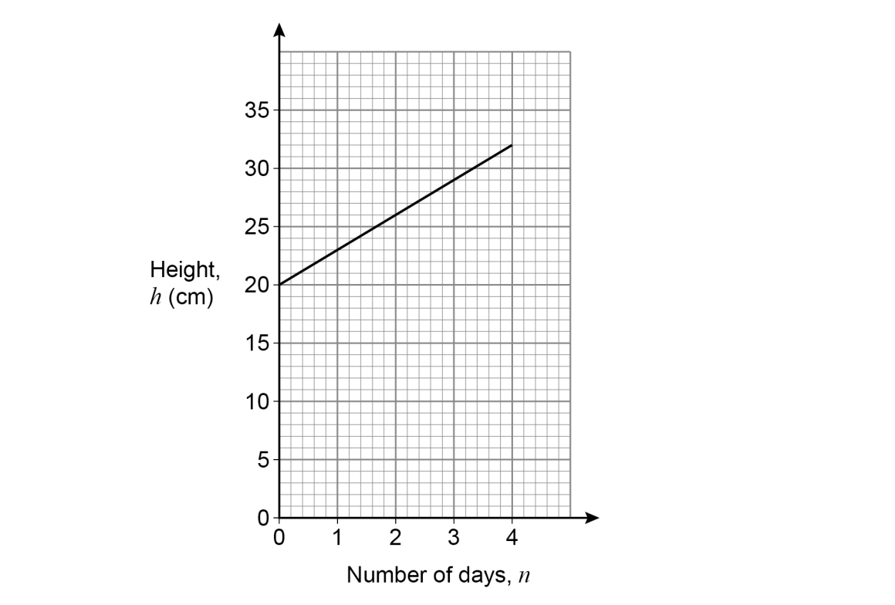

Work out a formula for$h$ in terms of $n$.

## Q28 — medium — 4 marks · exam-questions

### 8() — 4 marks — command: find — structured — from paper June 2019 · J560/06
The graph shows two parallel lines, Line A and Line B.

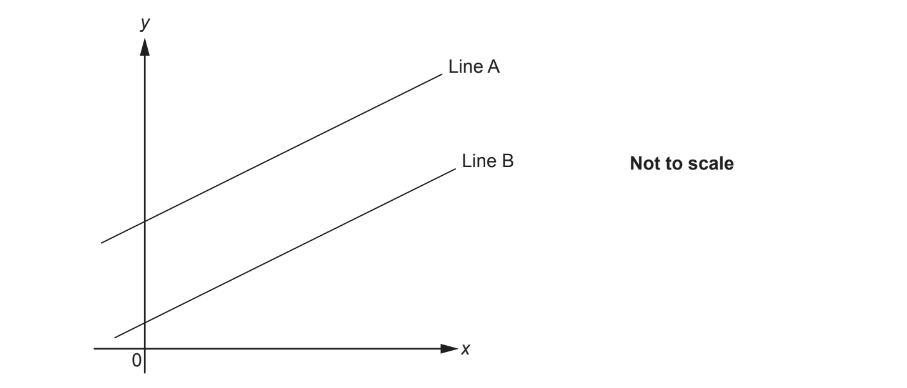

Line A has equation $y=6x+7$. 
Line B passes through the point (4, 26).

Find the equation of Line B.

## Q29 — medium — 3 marks · exam-questions

### 18((a)) — 3 marks — command: find — structured — from paper June 2018 · J560/05
A straight line passes through the point (0, 6) and is perpendicular to  *y *= 4*x − *5*.*

Find the equation of this line, giving your answer in the form *y *=* mx *+* c.*

## Q30 — medium — 6 marks · exam-questions

### 5((a)) — 4 marks — command: find — structured — from paper June 2017 · J560/06
Point A has coordinates (-4, 6) and point B has coordinates (8, 3).

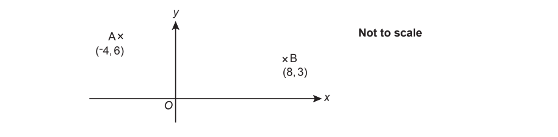

(i) Find the gradient of line AB.

[2]

(ii) Find the equation of line AB.

[2]

### 5((b)) — 2 marks — command: write — structured — from paper June 2017 · J560/06
Point P has coordinates (0, -2).

Write down the equation of the line parallel to line AB that passes through P.

## Q31 — medium — 4 marks · exam-questions

### 14() — 4 marks — command: show — structured — from paper Specimen 2015 · J560/05
Show that line 3*y* = 4x − 14 is perpendicular to line 4*y* = −3*x* + 48.

## Q32 — medium — 4 marks · exam-questions

### 13() — 4 marks — command: find — structured — from paper Specimen paper · 4MA1/1H
The points (1, –1) and (4, 7) lie on the straight line **L**.

Find an equation for **L**. 
Give your equation in the form  $ax+by=c$ where $a,b$ and $c$ are integers.

## Q33 — medium — 3 marks · exam-questions

### 13() — 3 marks — command: find — structured — from paper 2023 June  · 4MA1/1H
$A$ is the point with coordinates `open parentheses – 5 comma space 12 close parentheses` 
$B$ is the point with coordinates `open parentheses 19 comma space – 48 close parentheses`
Find an equation of the straight line that passes through the points $A$ and $B$

## Q34 — hard — 3 marks · exam-questions

### 17() — 3 marks — command: find — structured — from paper 2015	June · 1MA0/2H
The line $N$ is drawn below.

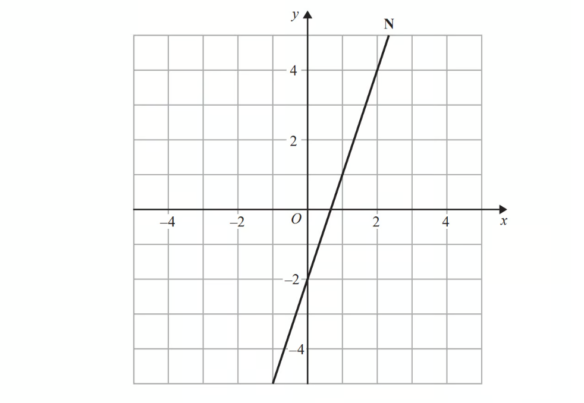

Find an equation of the line perpendicular to line $N$ that passes through the point (0, 1).

## Q35 — hard — 4 marks · exam-questions

### 24() — 4 marks — command: find — structured — from paper 2017	June · 1MA0/2H
The straight line $L$ has equation $4x+y=7$

Find an equation of the straight line perpendicular to $L$ that passes through (-8, 3).

## Q36 — hard — 3 marks · exam-questions

### 16() — 3 marks — command: find — structured — from paper June 2019 · 1MA1/2H
The straight line $L$ has the equation $3y=4x+7$ 
The point $A$ has coordinates (3, —5)

Find an equation of the straight line that is perpendicular to $L$ and passes through $A$.

## Q37 — hard — 4 marks · exam-questions

### 23() — 4 marks — command: find — structured — from paper 2015	Spec1 · 1MA1/1H
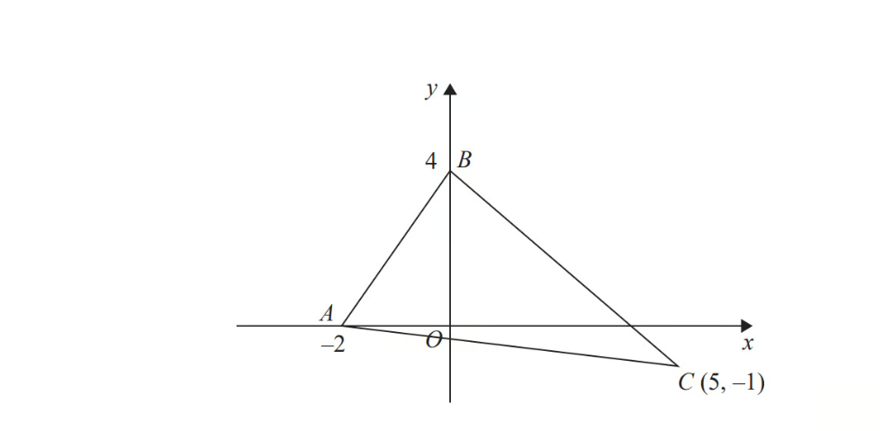

Find an equation of the line that passes through $C$ and is perpendicular to $AB$.

## Q38 — hard — 7 marks · exam-questions

### 1() — 3 marks — command: find — structured — from paper Pre2017
The line $l_{1}$ has equation $y=-2x+3$ 
The line $l_{2}$ is perpendicular to $l_{1}$ and passes through the point $(5,6)$.

Find an equation for $l_{2}$ in the form $ax+by+c=0$, where $a,b$ and $c$ are integers.

### 2() — 2 marks — command: find — structured — from paper Pre2017
The line $l_{2}$ crosses the $x$-axis at the point $A$ and the $y$-axis at the point $B$.

Find the $x$-coordinate of $A$ and the $y$-coordinate of $B$.

### 3() — 2 marks — command: find — structured — from paper Pre2017
Given that $O$ is the origin,

find the area of the triangle $OAB$.

## Q39 — hard — 5 marks · exam-questions

### 5() — 5 marks — command: find — structured — from paper Pre 17 · A Level
The points $P$ and $Q$* *have coordinates `open parentheses negative 1 comma space 6 close parentheses` and `open parentheses 9 comma space 0 close parentheses` respectively.

The line $l$ is perpendicular to $PQ$ and passes through the midpoint of $PQ.$

Find an equation for $l.$

## Q40 — hard — 8 marks · exam-questions

### 4((a)) — 1 mark — command: find — structured — from paper SME Topic Papers · 6663/Straight Lines Core 1 QP4
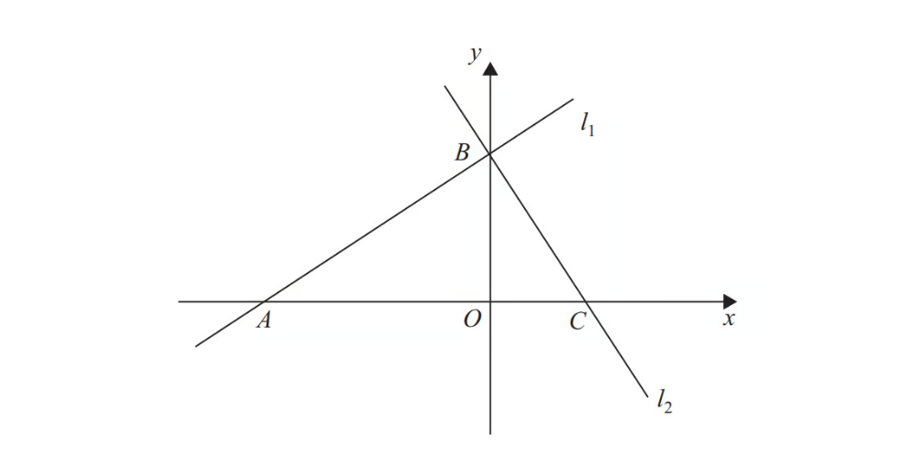

**Figure 1**

The line $l_{1}$ has equation $2x-3y+12=0$

Find the gradient of $l_{1}$.

### 4((b)) — 3 marks — command: find — structured — from paper SME Topic Papers · 6663/Straight Lines Core 1 QP4
The line $l_{1}$ crosses the $x$-axis at the point $A$and the $y$-axis at the point $B$, as shown in Figure 1.

The line $l_{2}$ is perpendicular to $l_{1}$ and passes through $B$.

Find an equation of $l_{2}$.

### 4((c)) — 4 marks — command: find — structured — from paper SME Topic Papers · 6663/Straight Lines Core 1 QP4
The line $l_{2}$ crosses the $x$-axis at the point $C$.

Find the area of triangle $ABC$.

## Q41 — hard — 4 marks · exam-questions

### 24() — 4 marks — command: show — structured — from paper 2014	November · 1MA0/1H
$A$ is the point with coordinates $(1,3)$

$B$ is the point with coordinates $(4,-1)$ 
The straight line $L$ goes through both $A$ and $B$.

Is the line with equation $2y=3x---4$ perpendicular to line $L$? You must show how you got your answer.

## Q42 — hard — 4 marks · exam-questions

### 1() — 4 marks — command: find — structured
The line $L$ has equation $y=5-2x.$ The point $P$ with coordinates $(3,---1)$ lies on $L$.

Find an equation of the line perpendicular to $L$, which passes through $P$.

Give your answer in the form $ax+by+c=0$, where $a,b$ and $c$ are integers.

## Q43 — hard — 4 marks · exam-questions

### 17() — 4 marks — command: find — structured — from paper June 2021 · 4MA1/2H
The straight line $L$ passes through the points (4, −1) and (6, 4)

The straight line $M$ is perpendicular to $L$ and intersects the $y$-axis at the point (0, 8)

Find the coordinates of the point where $M$ intersects the $x$-axis.

## Q44 — hard — 4 marks · exam-questions

### 25() — 4 marks — command: find — structured — from paper Nov 2020 · 4MA1/1H
$ABCD$ is a rhombus.

The diagonals, $AC$ and $BD$, intersect at the point $M$. The coordinates of $M$ are $(6,-11)$

The points $A$ and $C$ both lie on the line with equation $2y+7x=20$

Find the exact coordinates of the point where the line through $B$ and $D$ intersects the $y-\mathrm{axis}$.

## Q45 — hard — 4 marks · exam-questions

### 15() — 4 marks — command: work_out — structured — from paper June 2019 · 8300/2H
Here is line L and the graph of $y=x--1$

The scales of the axes are not shown.

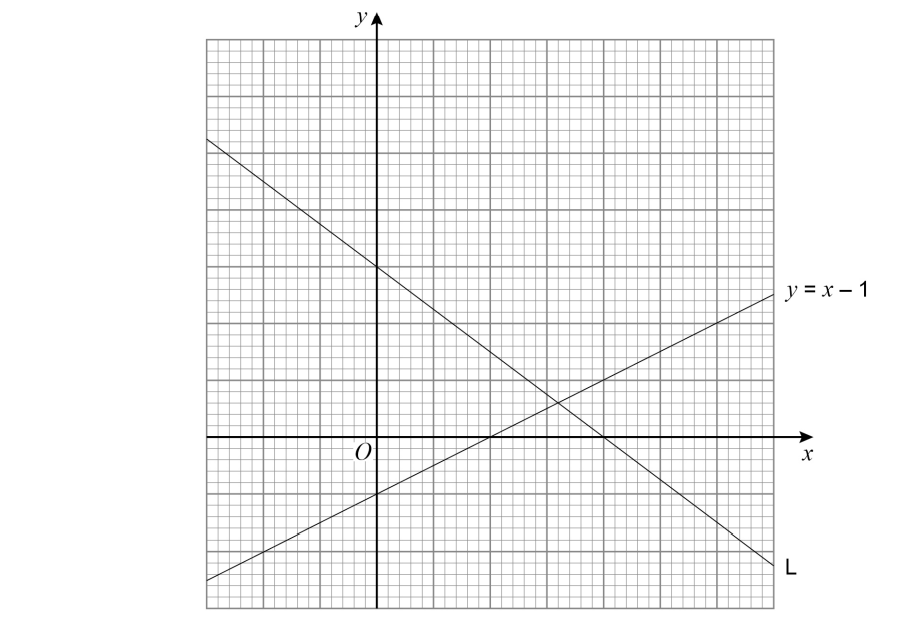

Work out the equation of line L.

## Q46 — hard — 5 marks · exam-questions

### 8((a)) — 3 marks — command: show — structured — from paper June 2018 · 8300/3H
Show that the lines $y=3x+7$ and $2y--6x=8$ are parallel.

Do **not** use a graphical method.

### 8((b)) — 2 marks — command: show — structured — from paper June 2018 · 8300/3H
Is the point (–5, –6) above, below or on the line $y=3x+7$ ?

Tick **one** box.

`square` Above   `square` Below   `square`On the line

You **must** show your working. 
Do **not** use a graphical method.

## Q47 — hard — 5 marks · exam-questions

### 18() — 5 marks — command: find — structured — from paper Nov 2018 · J560/04
P is the point (0, -1) and Q is the point (5, 9).

Find the equation of the line through P that is perpendicular to the line PQ.

## Q48 — very_hard — 4 marks · exam-questions

### 18() — 4 marks — command: find — structured — from paper 2017	June · 1MA1/1H
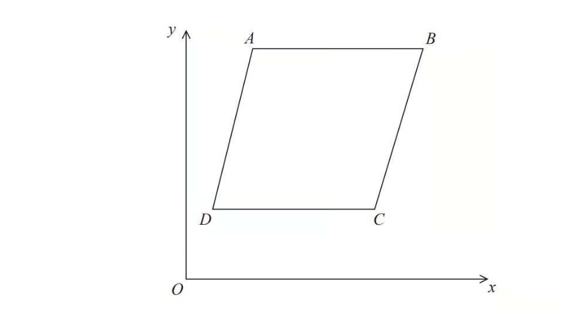

$ABCD$ is a rhombus. 
The coordinates of $A$ are `open parentheses 5 comma 11 close parentheses`

The equation of the diagonal $DB$ is $y=\frac{1}{2}x+6$

Find an equation of the diagonal $AC$.

## Q49 — very_hard — 4 marks · exam-questions

### 19() — 4 marks — command: find — structured — from paper 2017	November · 1MA1/1H
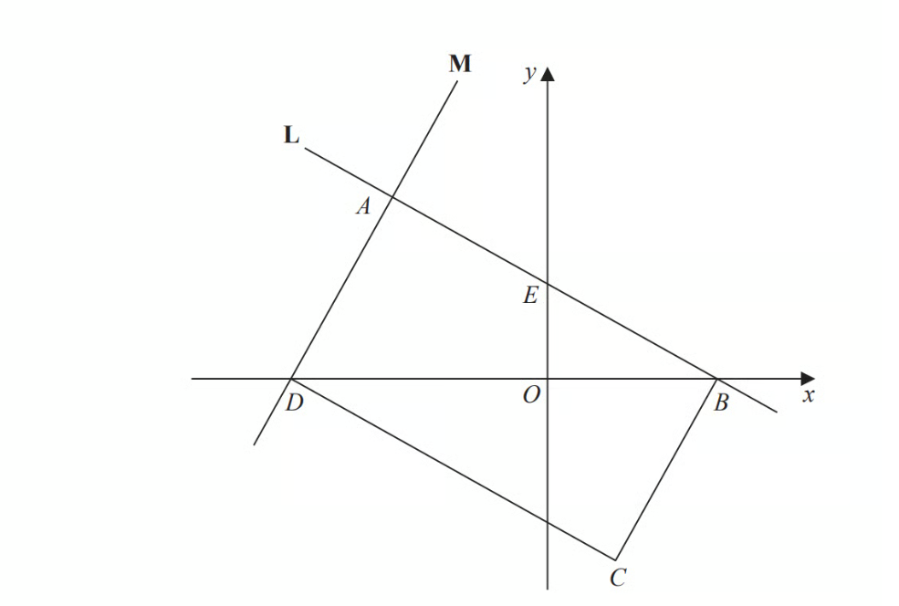

$ABCD$is a rectangle.

$A,E$ and $B$ are points on the straight line $L$with equation $x+2y=12$ $A$ and $D$ are points on the straight line $M$.

$AE=EB$

Find an equation for $M$.

## Q50 — very_hard — 4 marks · exam-questions

### 2((a)) — 4 marks — command: find — structured — from paper SME Topic Papers · 6663/Straight Lines Core 1 QP1
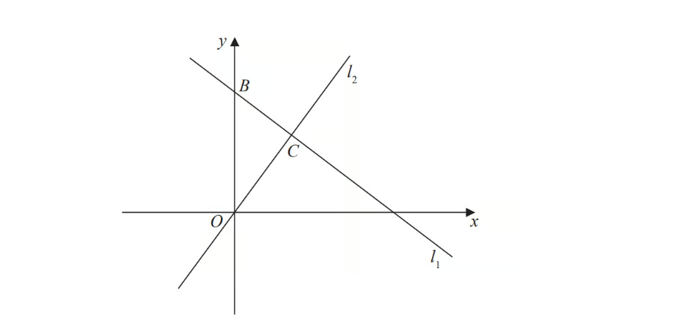

**Figure 2**

The line $l_{1}$, shown in Figure 2 has equation $2x+3y=26$ 
The line $l_{2}$ passes through the origin $O$ and is perpendicular to $l_{1}$

Find an equation for the line $l_{2}$

## Q51 — very_hard — 5 marks · exam-questions

### 19() — 5 marks — command: find — structured — from paper 2018	June · 1MA1/1H
The point $P$ has coordinates $(3,4)$ 
The point $Q$ has coordinates $(a,b)$

A line perpendicular to $PQ$ is given by the equation $3x+2y=7$

Find an expression for $b$ in terms of $a$.

## Q52 — very_hard — 4 marks · exam-questions

### 23() — 4 marks — command: find — structured — from paper 2012	November · 1MA0/1H
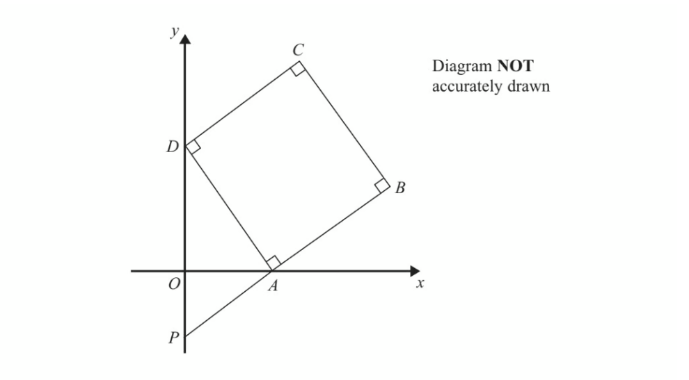

$ABCD$ is a square.

$P$ and $D$ are points on the $y$-axis.

$A$ is a point on the $x$-axis. $PAB$ is a straight line.

The equation of the line that passes through the points $A$ and $D$ is $y=---2x+6$

Find the length of $PD$.

## Q53 — very_hard — 5 marks · exam-questions

### 25() — 5 marks — command: find — structured — from paper 2015	Sample · 1MA1/1H
$A$(—2, 1), $B$(6, 5) and $C$(4, $k$) are the vertices of a right-angled triangle $ABC$. 
Angle $ABC$ is the right angle.

Find an equation of the line that passes through $A$ and $C$. 
Give your answer in the form $ay+bx=c$ where $a$, $b$ and $c$are integers.

## Q54 — very_hard — 4 marks · exam-questions

### 6() — 4 marks — command: find — structured — from paper SME Topic Papers · 6663/Straight Lines Core 1 QP5
The points $A$ and $B$ have coordinates (3, 4) and (7, —6) respectively. The straight line $l$ passes through $A$ and is perpendicular to $AB$.

Find an equation for $l$, giving your answer in the form $ax+by+c=0$, where $a,b$ and $c$ are integers.

## Q55 — very_hard — 5 marks · exam-questions

### 22() — 5 marks — command: find — structured — from paper Jan 2021 · 4MA1/1HR
$ABC$ is an isosceles triangle with $AB=AC.$

$B$ is the point with coordinates (–1, 5) 
$C$ is the point with coordinates (2, 10) 
$M$ is the midpoint of $BC$.

Find an equation of the line through the points $A$ and $M$. 
Give your answer in the form $py+qx=r$ where  $p,q$ and $r$ are integers.

## Q56 — very_hard — 5 marks · exam-questions

### 24() — 5 marks — command: show — structured — from paper Jan 2020 · 4MA1/2HR
$L_{1}$and $L_{2}$ are two straight lines. 
The origin of the coordinate axes is $O$.

$L_{1}$ has equation $5x+10y=8$ 
$L_{2}$ is perpendicular to $L_{1}$ and passes through the point with coordinates (8, 6)

$L_{2}$ crosses the $x$-axis at the point $A$. 
$L_{2}$ intersects the straight line with equation $x=--3$ at the point $B$.

Find the area of triangle $AOB$. 
Show your working clearly.

## Q57 — very_hard — 7 marks · exam-questions

### 20() — 7 marks — command: calculate — structured — from paper Nov 2021 · 4MA1/1H
The straight line $L$ passes through point $A$ (– 6, 2) and point $B$ (5, 3) 
The straight line $M$ is perpendicular to $L$ and passes through the midpoint of $A$ and $B$. 
The line $M$ intersects the line $x=--1$ at point $C$.

Calculate the area of triangle $ABC$.

## Q58 — very_hard — 4 marks · exam-questions

### 28() — 4 marks — command: work_out — structured — from paper Nov 2020 · 8300/3H
Line A has equation $y=4x--1$

Line B is

perpendicular to line A 
and 
passes through the point (8, 5)

Work out the coordinates of the point where line B intersects the $x$-axis.
