# Exam Questions — Real-Life Graphs
**Graphs & Coordinates** · Edexcel IGCSE Maths A (Modular) (4XMAF/4XMAH) — 24/Higher Unit 1
> Source: [https://www.savemyexams.com/igcse/maths/edexcel/a-modular/24/higher-unit-1/topic-questions/graphs-and-coordinates/real-life-graphs/exam-questions/](https://www.savemyexams.com/igcse/maths/edexcel/a-modular/24/higher-unit-1/topic-questions/graphs-and-coordinates/real-life-graphs/exam-questions/) · 34 questions · total 137 marks

## Q1 — easy — 4 marks · exam-questions

### 3((a)) — 1 mark — command: how — structured — from paper 2013	March · 1MA0/2H
Simon went for a cycle ride. 
He left home at 2 pm.

The travel graph represents part of Simon's cycle ride.

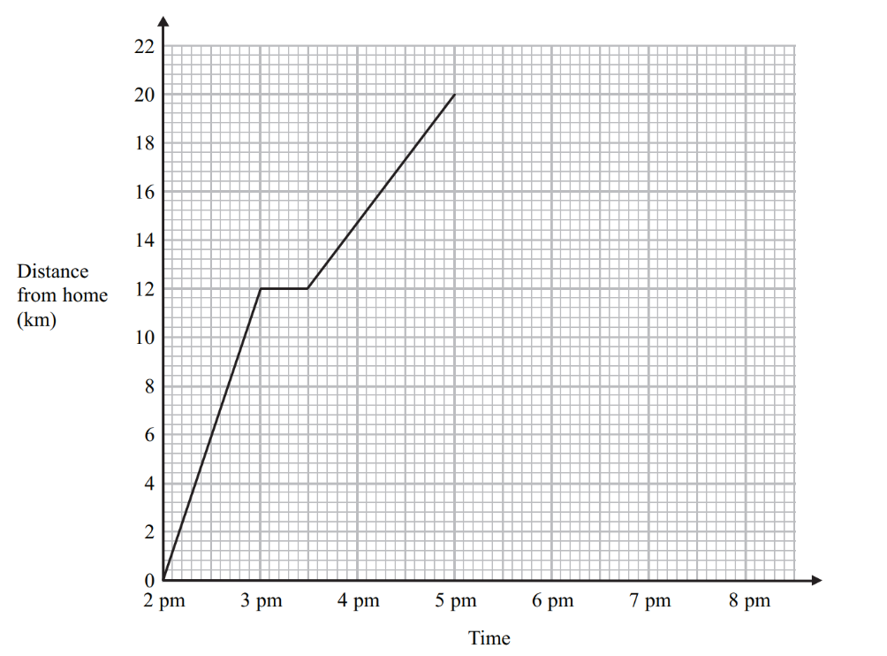

At 3 pm Simon stopped for a rest.

How many minutes did he rest?

### 3((b)) — 1 mark — command: how — structured — from paper 2013	March · 1MA0/2H
How far was Simon from home at 5 pm?

### 3((c)) — 2 marks — command: complete — structured — from paper 2013	March · 1MA0/2H
At 5 pm Simon stopped for 30 minutes. 
Then he cycled home at a steady speed. 
It took him 1 hour 30 minutes to get home.

Complete the travel graph.

## Q2 — easy — 3 marks · exam-questions

### 4((a)) — 1 mark — command: how — structured — from paper 2016	November · 1MA0/1H
Jane walked from her home to the ice rink. 
The travel graph for Jane's journey to the ice rink is shown below.

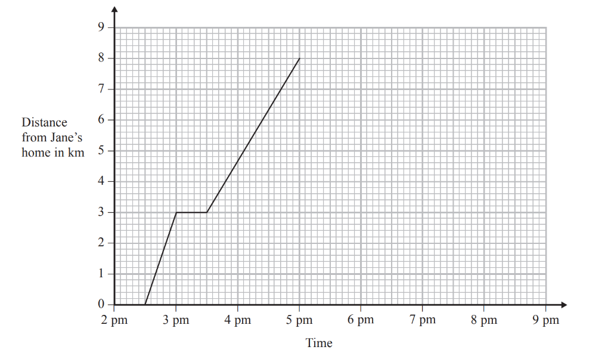

On the way to the ice rink Jane stopped at her friend's house.

How far is it from her friend's house to the ice rink?

### 4((b)) — 2 marks — command: complete — structured — from paper 2016	November · 1MA0/1H
Jane was at the ice rink for 1 hour 30 minutes. 
She then walked home at a steady speed.
Jane took 2 hours to walk home.

Complete the travel graph for this information.

## Q3 — easy — 3 marks · exam-questions

### 10((a)) — 2 marks — command: which — structured — from paper 2017	November · 1MA1/2H
Here is part of a distance-time graph for a car's journey.

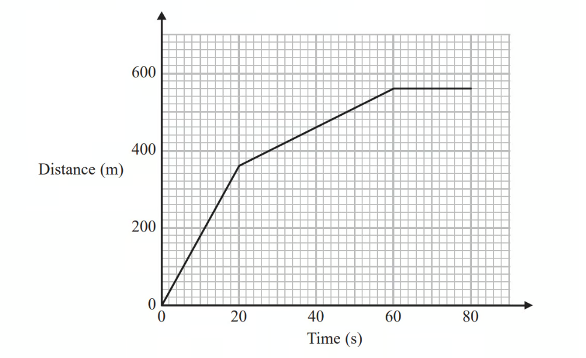

Between which two times does the car travel at its greatest speed? 
Give a reason for your answer.

### 10((b)) — 1 mark — command: work_out — structured — from paper 2017	November · 1MA1/2H
Work out this greatest speed.

## Q4 — easy — 3 marks · exam-questions

### 10((a)) — 2 marks — command: find — structured — from paper 2015	Spec1 · 1MA1/2H
The graph shows the depth, $d$ cm, of water in a tank after $t$ seconds.

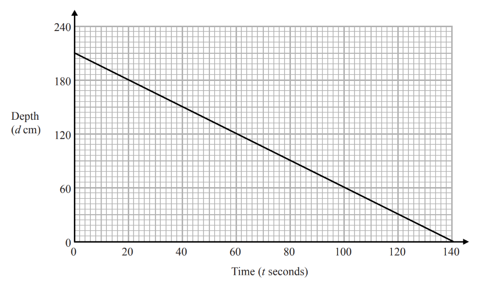

Find the gradient of this graph.

### 10((b)) — 1 mark — command: explain — structured — from paper 2015	Spec1 · 1MA1/2H
Explain what this gradient represents.

## Q5 — easy — 4 marks · exam-questions

### 12((a)) — 2 marks — command: find — structured — from paper 2018	June · 1MA1/3H
The graph shows the volume of liquid ($L$ litres) in a container at time $t$ seconds.

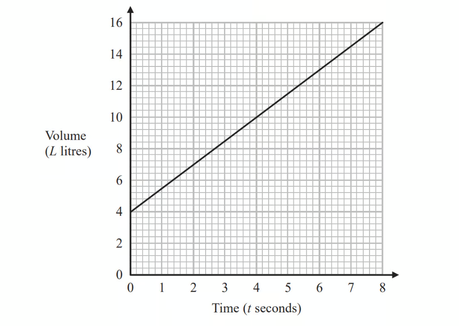

Find the gradient of the graph.

### 12((b)) — 1 mark — command: explain — structured — from paper 2018	June · 1MA1/3H
Explain what this gradient represents.

### 12((c)) — 1 mark — command: explain — structured — from paper 2018	June · 1MA1/3H
The graph intersects the volume axis at $L=4$

Explain what this intercept represents.

## Q6 — easy — 3 marks · exam-questions

### 6() — 3 marks — command: work_out — structured — from paper Nov 2018 · 8300/1H
A ship is sailing in a straight line from its home port.

The distance-time graph shows 4 hours of the journey.

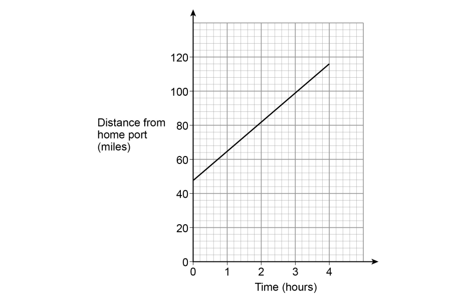

Work out the speed of the ship during these 4 hours.

..........................mph

## Q7 — easy — 6 marks · exam-questions

### 3((a)) — 3 marks — command: estimate — structured — from paper Nov 2020 · J560/06
The graph shows the cost of electricity with Company A.

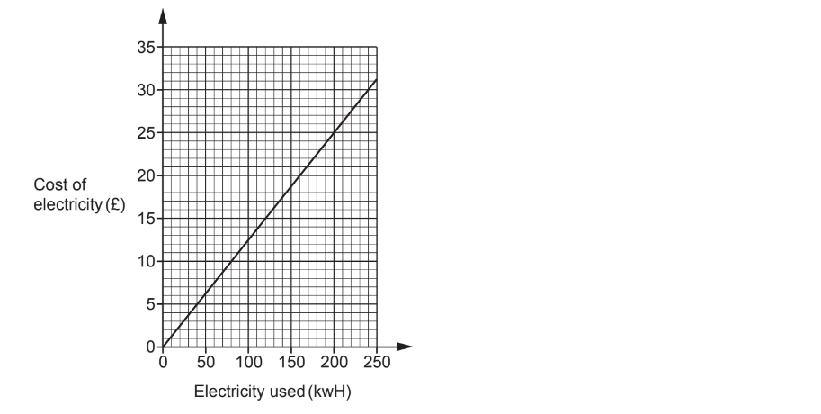

Use the information in the graph to estimate the cost of electricity for a customer who uses 450kwH of electricity.

£ ........................................................

### 3((b)) — 3 marks — command: explain — structured — from paper Nov 2020 · J560/06
Company B charges 14.3 pence per kwH of electricity used.

If Company B’s cost of electricity was plotted on the same axes as Company A’s cost of electricity, which line would be steeper? Explain how you know.

Company ................ would have the steeper line because ......................................................

## Q8 — easy — 3 marks · exam-questions

### 8((a)) — 3 marks — command: find — structured — from paper Nov 2018 · J560/06
The graph shows the speed of a cyclist during 20 seconds of a journey.

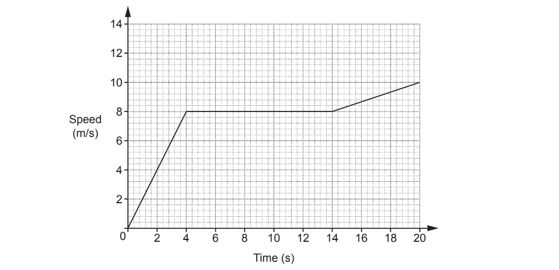

Find the acceleration of the cyclist

(i) for the first 4 seconds

......................m/s2 [2]

(ii) between 4 seconds and 14 seconds.

......................m/s2 [1]

## Q9 — medium — 5 marks · exam-questions

### 6((b)) — 1 mark — command: change — structured — from paper 2013	March · 1MA0/1H
You can use this conversion graph to change between pounds (£) and dollars (\$).

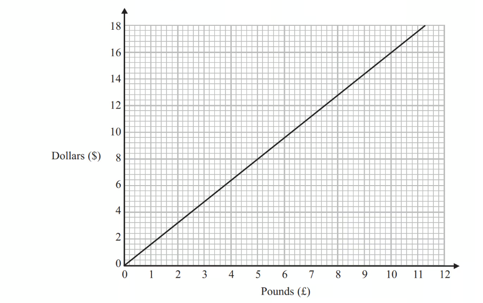

Use the conversion graph to change £5 to dollars.

### 2() — 4 marks — command: work_out — structured — from paper PRE 2017
Ella has \$200 and £800

Her hotel bill is \$600

Ella pays the bill with the \$200 and some of the pounds.

Use the conversion graph to work out how many pounds she has left.

## Q10 — medium — 4 marks · exam-questions

### 11() — 4 marks — command: explain — structured — from paper 2013	June · 1MA0/1H
Debbie drove from Junction 12 to Junction 13 on a motorway.

The travel graph shows Debbie's journey.

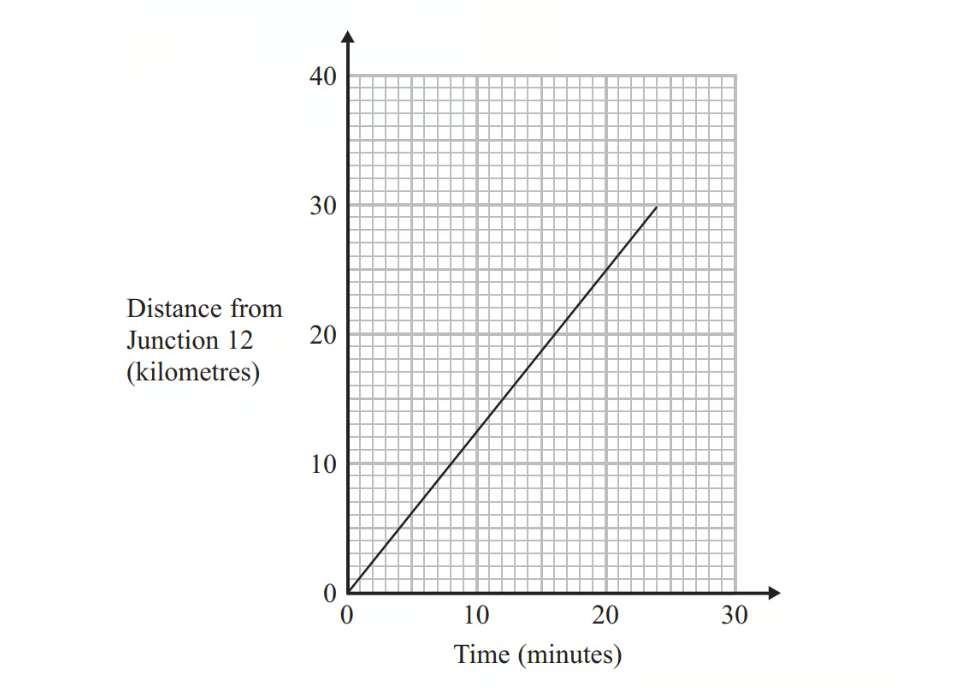

Ian also drove from Junction 12 to Junction 13 on the same motorway. 
He drove at an average speed of 66 km/hour.

Who had the faster average speed, Debbie or Ian? 
You must explain your answer.

## Q11 — medium — 5 marks · exam-questions

### 5((a)) — 3 marks — command: draw — structured — from paper 2015	Spec1 · 1MA1/2H
At 9 am, Bradley began a journey on his bicycle.

From 9 am to 9.36 am, he cycled at an average speed of 15 km/h From 9.36 am to 10.45 am, he cycled a further 8 km.

Draw a travel graph to show Bradley's journey.

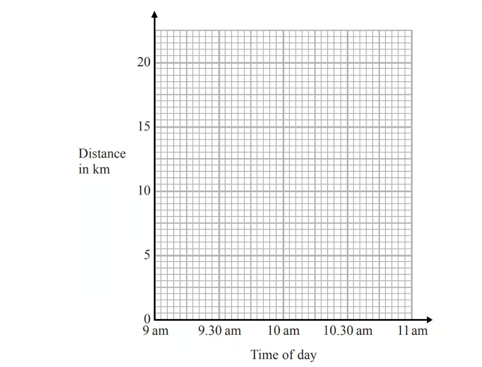

### 5((b)) — 2 marks — command: work_out — structured — from paper 2015	Spec1 · 1MA1/2H
From 10.45 am to 11 am, Bradley cycled at an average speed of 18 km/h.

Work out the distance Bradley cycled from 10.45 am to 11 am.

## Q12 — medium — 5 marks · exam-questions

### 10((a)) — 2 marks — command: work_out — structured — from paper 2015	November · 1MA0/2H
A coach travels from Dronston to Luscoe. 
The travel graph for this journey is shown below.

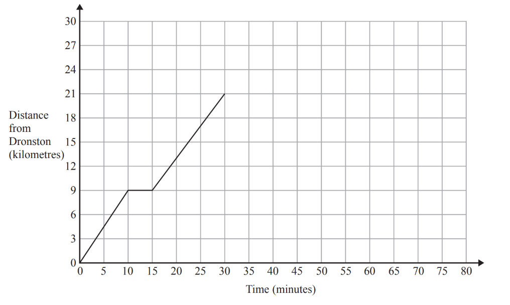

Work out the average speed of the coach, in kilometres per hour, for the first 10 minutes of the journey.

### 10((b)) — 3 marks — command: show — structured — from paper 2015	November · 1MA0/2H
The coach stops in Luscoe for 15 minutes.

The coach then returns to Dronston at a constant speed of 42 km/h.

Show this information on the travel graph.

## Q13 — medium — 4 marks · exam-questions

### 3((a)) — 1 mark — command: how — structured — from paper 2012	June · 1MA0/1H
Bill uses his van to deliver parcels. 
For each parcel Bill delivers there is a fixed charge plus £1.00 for each mile.

You can use the graph to find the total cost of having a parcel delivered by Bill.

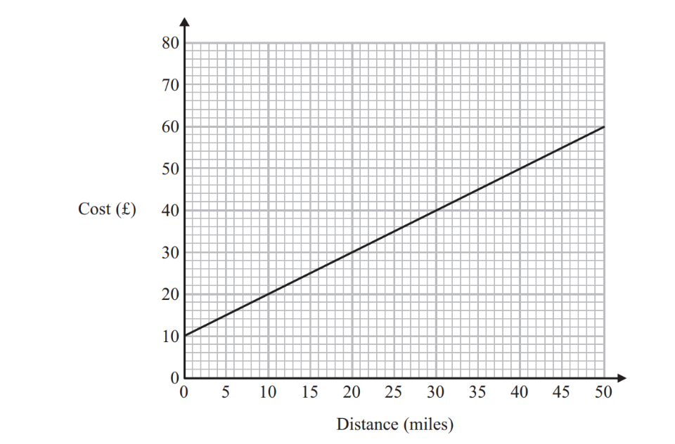

How much is the fixed charge?

### 3((b)) — 3 marks — command: compare — structured — from paper 2012	June · 1MA0/1H
Ed uses a van to deliver parcels. 
For each parcel Ed delivers it costs £1.50 for each mile.
 There is **no **fixed charge.

Compare the cost of having a parcel delivered by Bill with the cost of having a parcel delivered by Ed.

## Q14 — medium — 3 marks · exam-questions

### 17() — 3 marks — command: work_out — structured — from paper Nov 2020 · 8300/1H
Jim buys a plant of height 20 cm.

The graph shows how the height of the plant changes during the next 4 days.

Work out a formula for$h$ in terms of $n$.

## Q15 — medium — 3 marks · exam-questions

### 8() — 3 marks — command: work_out — structured — from paper Nov 2020 · 8300/3H
Chris visits a library.

He cycles to the library in half an hour at a speed of 12 miles per hour. 
He stays at the library for one hour. 
He then cycles home.

The sketch graph represents his visit.

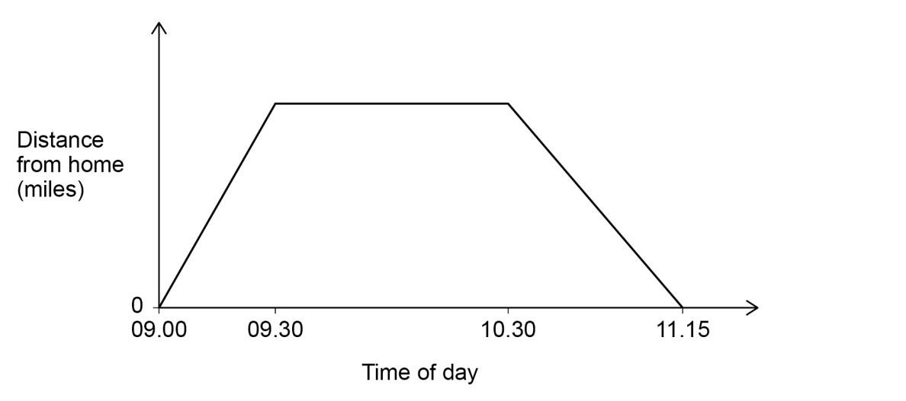

Work out the speed, in miles per hour, at which Chris cycles home.

..........................mph

## Q16 — medium — 2 marks · exam-questions

### 23((b)) — 2 marks — command: work_out — structured — from paper June 2019 · 8300/1H
Here is a velocity-time graph of a motorbike for 25 seconds.

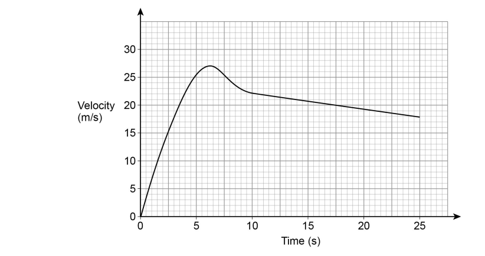

Work out the distance travelled in the last 15 seconds.

## Q17 — medium — 7 marks · exam-questions

### 14((a)) — 1 mark — command: what — structured — from paper June 2019 · J560/04
The graph shows the speed of a train during the first 60 seconds of motion.

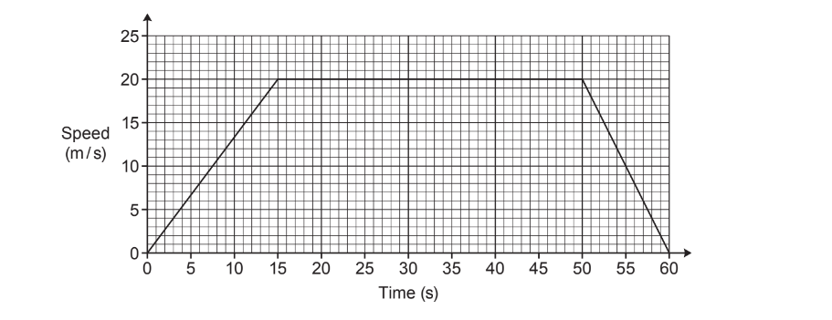

What is the speed of the train after 9 seconds?

................................................... m/s

### 14((b)) — 1 mark — command: what — structured — from paper June 2019 · J560/04
What does the straight line suggest about the speed of the train over the first 15 seconds?

### 14((c)) — 5 marks — command: work_out — structured — from paper June 2019 · J560/04
Work out the average speed of the train, in m/ s, during the 60 seconds.

................................................... m/ s

## Q18 — medium — 4 marks · exam-questions

### 8((b)) — 4 marks — command: work_out — structured — from paper Nov 2018 · J560/06
The graph shows the speed of a cyclist during 20 seconds of a journey.

Work out the distance travelled by the cyclist during the 20 seconds.

......................... m

## Q19 — medium — 3 marks · exam-questions

### 2() — 3 marks — command: calculate — structured — from paper June 2017 · J560/05
The graph shows Mia’s journey from her home to university.

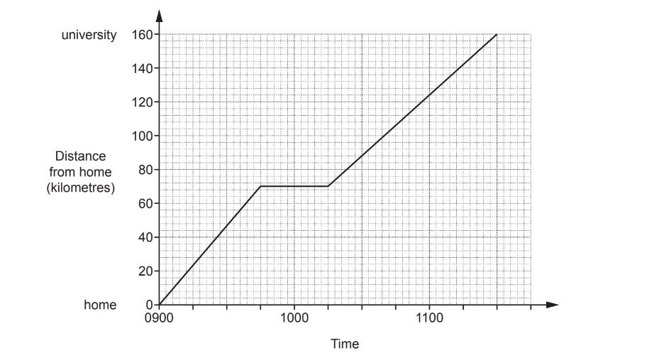

Calculate Mia’s average speed for the whole journey.

.................................................. km/h

## Q20 — medium — 9 marks · exam-questions

### 8((a)) — 2 marks — command: calculate — structured — from paper June 2018 · J560/06
The graph shows the speed of a tram as it travels from the library to the town hall.

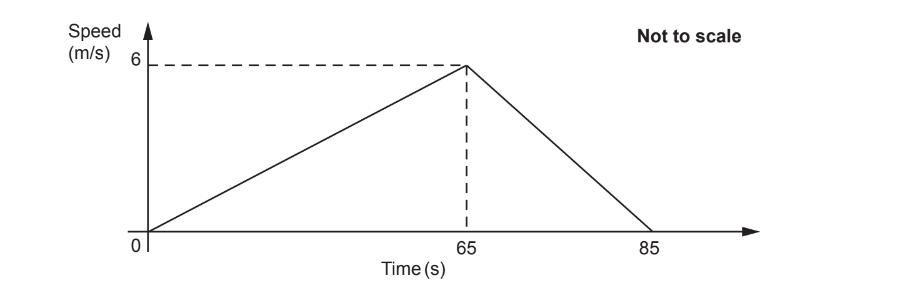

Calculate the deceleration of the tram as it approaches the town hall.

........................ m/s2

### 8((b)) — 3 marks — command: calculate — structured — from paper June 2018 · J560/06
Calculate the distance travelled by the tram between the library and the town hall.

........................ m

### 8((c)) — 4 marks — command: what — structured — from paper June 2018 · J560/06
What was the maximum speed of the tram as it travelled between the library and the town hall? Give your answer in **kilometres per hour**.

..................... km/h

## Q21 — medium — 3 marks · exam-questions

### 19() — 3 marks — command: calculate — structured — from paper Nov 2020 · J560/04
The graph shows the speed of a vehicle during the first 40 seconds of motion.

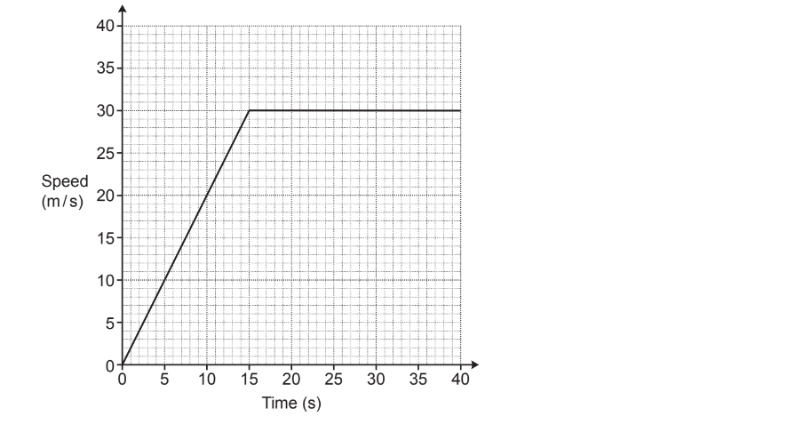

Calculate the distance travelled by the vehicle during the 40 seconds.

...................................................... m

## Q22 — hard — 5 marks · exam-questions

### 21((a)) — 3 marks — command: work_out — structured — from paper 2015	Sample · 1MA1/1H
Here is a speed-time graph for a car journey.

The journey took 100 seconds.

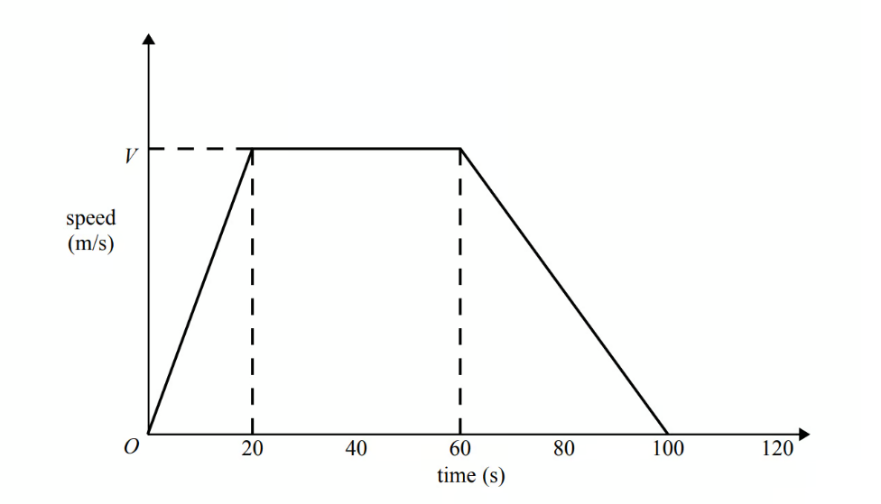

The car travelled 1.75km in the 100 seconds.

Work out the value of $V$.

### 21((b)) — 2 marks — command: describe — structured — from paper 2015	Sample · 1MA1/1H
Describe the acceleration of the car for each part of this journey.

## Q23 — hard — 6 marks · exam-questions

### 2((a)) — 1 mark — command: give — structured — from paper June 2019 · 4MA1/1H
Jalina left her home at 10 00 to cycle to a park. 
On her way to the park, she stopped at a friend’s house and then continued her journey to the park. 
Here is the distance-time graph for her journey to the park.

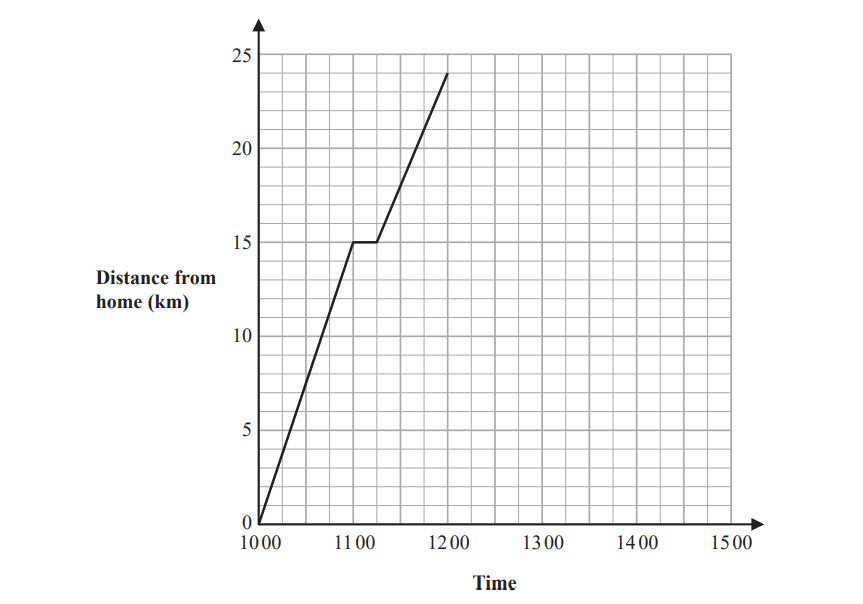

On her journey to the park, did Jalina cycle at a faster speed before or after she stopped at her friend’s house? 
Give a reason for your answer.

### 2((b)) — 2 marks — command: show — structured — from paper June 2019 · 4MA1/1H
Jalina stayed at the park for 45 minutes. 
She then cycled, without stopping, at a constant speed of 16 km/h from the park back to her home.

Show all this information on the distance-time graph.

### 2((c)) — 3 marks — command: work_out — structured — from paper June 2019 · 4MA1/1H
Work out Jalina’s average cycling speed, in kilometres per hour, for the complete journey to the park and back. 
Do **not** include the times when she was not cycling in your calculation. 
Give your answer correct to 1 decimal place.

.........................km/h

## Q24 — hard — 3 marks · exam-questions

### 28() — 3 marks — command: how — structured — from paper Nov 2020 · 8300/2H
A horse runs in a field.

The speed-time graph represents the first 12 seconds of the run.

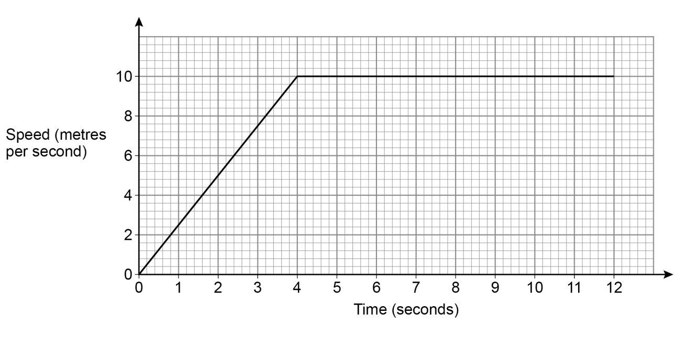

After how many seconds had the horse run a distance of 75 metres?

.........................seconds

## Q25 — hard — 1 marks · exam-questions

### 17((a)) — 1 mark — command: how — structured — from paper June 2018 · 8300/2H
A ball is thrown vertically upwards.

The graph shows the height of the ball above the ground after it is thrown.

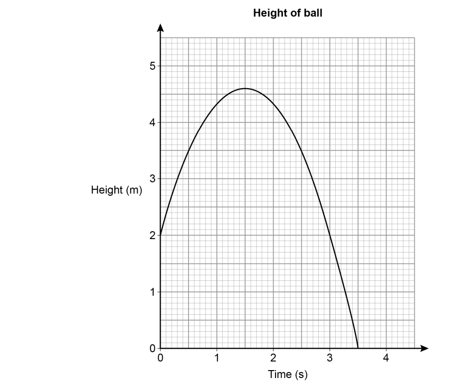

For how many seconds is the ball at a height of **more than** 2 metres?

............................s

## Q26 — hard — 3 marks · exam-questions

### 24() — 3 marks — command: determine — structured — from paper Nov 2017 · 8300/2H
Beth ran a 200 metre race.

Here is a graph of the first 8 seconds of her race.

She completed the race at a constant speed of 9 m/s

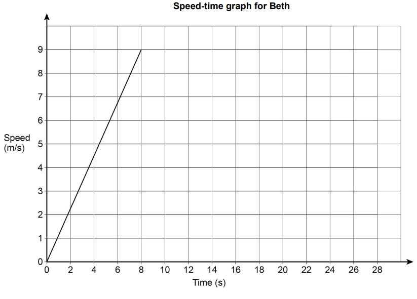

Amy completed the race in 27 seconds.

Did Beth finish before Amy? 
You **must** show your working.

## Q27 — hard — 4 marks · exam-questions

### 8((a)) — 3 marks — command: draw — structured — from paper June 2017 · 8300/2H
Lily goes on a car journey.

For the first 30 minutes her average speed is 40 miles per hour. She then stops for 15 minutes. 
She then completes the journey at an average speed of 60 miles per hour. 
The total journey time is 1 hour.

Draw a distance-time graph for her journey.

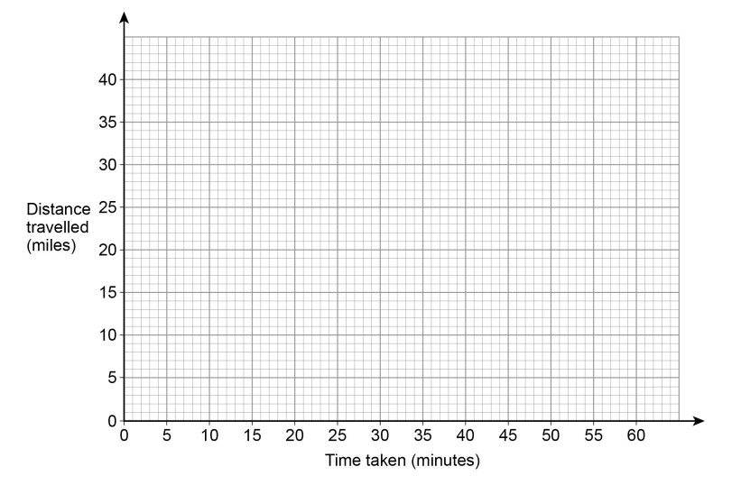

### 8((b)) — 1 mark — command: write — structured — from paper June 2017 · 8300/2H
Write down the average speed for the total journey.

................................... mph

## Q28 — hard — 4 marks · exam-questions

### 24() — 4 marks — command: who — structured — from paper Specimen 2015 · 8300/3H
Amina and Ben had a cycle race.

Here is Amina’s speed-time graph from the start of the race.

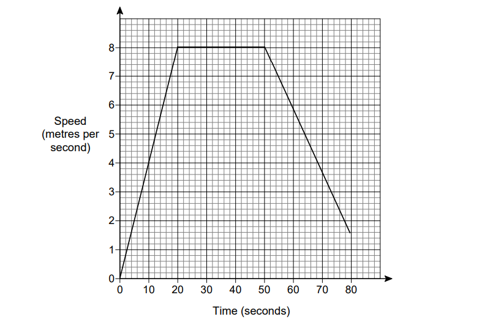

The distance of the race was 400 metres.

Ben cycled the 400 metres in 64 seconds.

Who won the race?

You **must** show your working.

## Q29 — hard — 1 marks · exam-questions

### 19() — 1 mark — command: circle — structured — from paper Nov 2021 · 8300/2H
The graph shows the height above ground of a toy rocket for 10 seconds.

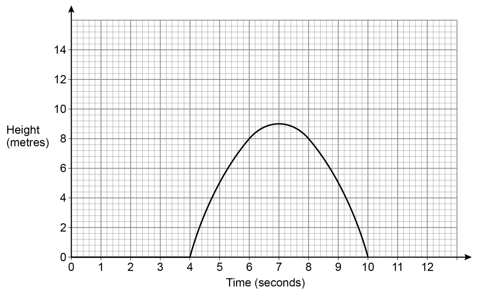

For how long is the rocket in the air?

Circle your answer.

| 10 seconds | 9 seconds | 6 seconds | 4 seconds |
|---|---|---|---|

## Q30 — hard — 3 marks · exam-questions

### 12() — 3 marks — command: work_out — structured — from paper Nov 2019 · 8300/3H
The graph shows how much Molly is paid for working for up to 40 hours. She receives

a basic rate of pay for the first 35 hours worked

a higher rate of pay for the next 5 hours worked.

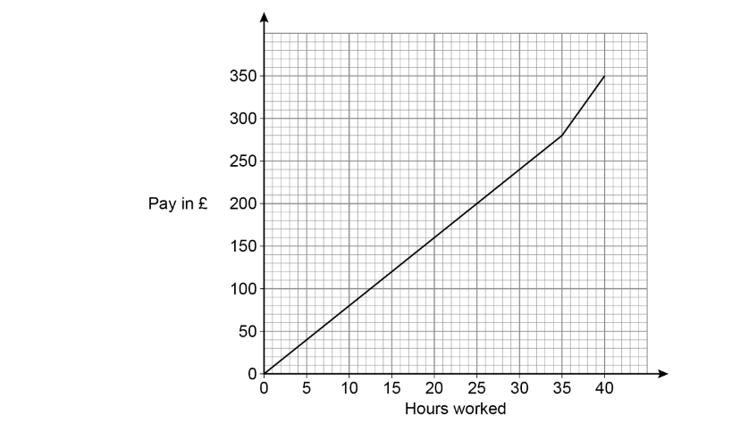

Work out the difference between the higher rate of pay and the basic rate of pay.

Give your answer in £ per hour.

£.....................................per hour

## Q31 — hard — 6 marks · exam-questions

### 28((a)) — 2 marks — command: work_out — structured — from paper Nov 2018 · 8300/2H
Izzy runs an 80-metre race in 14 seconds.

During the first 6 seconds her speed increases at a constant rate.
During the last 8 seconds her speed increases at a different constant rate.  
Her speed at 14 seconds is 2 m/s more than her speed at 6 seconds.

Here is a sketch of her speed-time graph.

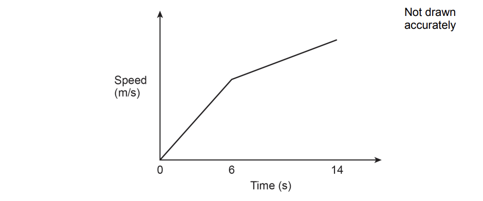

Work out her acceleration during the last 8 seconds.

State the units of your answer.

### 28((b)) — 4 marks — command: work_out — structured — from paper Nov 2018 · 8300/2H
When Izzy finishes the 80-metre race, her speed is $vm/s$

Work out the value of $v$.

## Q32 — hard — 7 marks · exam-questions

### 15((a)) — 1 mark — command: find — structured — from paper June 2017 · J560/04
The graph shows the speed, *v* metres per second (m/s), of a car at time *t* seconds.

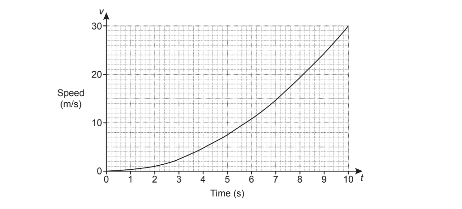

Find the speed of the car at *t *= 7.

.................................................... m/s

### 15((b)) — 5 marks — command: show — structured — from paper June 2017 · J560/04
It is claimed that the car has accelerated from 0 to 60 miles per hour in the first 10 seconds.

Does the graph support this claim?

Show your reasoning. Use 1 mile = 1.6 kilometres.

### 15((e)) — 1 mark — command: comment — structured — from paper June 2017 · J560/04
Georgina says that the graph shows that the speed of the car will continue to increase after 10 seconds.

Make one comment to show that this statement is incorrect.

## Q33 — hard — 5 marks · exam-questions

### 13((a)) — 2 marks — command: work_out — structured — from paper Nov 2017 · J560/05
The graph shows information about the speed of a vehicle during the final 50 seconds of a journey.

At the start of the 50 seconds the speed is k metres per second. The distance travelled during the 50 seconds is 1.35 kilometres.

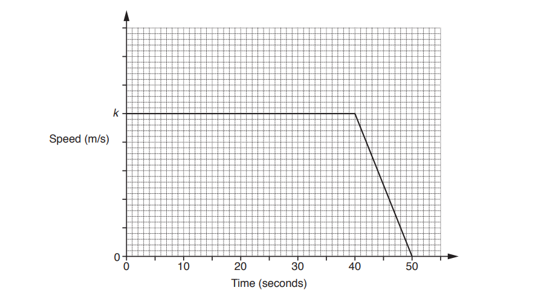

Work out the average speed of the vehicle during the 50 seconds.

Give your answer in metres per second.

................... m/s

### 13((c)) — 3 marks — command: multiple — structured — from paper Nov 2017 · J560/05
(i) Calculate the gradient of the graph in the final 10 seconds of the journey.

[1]

(ii) Describe what this gradient represents.

[2]

## Q34 — hard — 3 marks · exam-questions

### 11((b)) — 3 marks — command: work_out — structured — from paper Specimen 2015 · J560/05
A toy car is placed on the floor of a sports hall.

It moves in a straight line starting from rest. 
It travels with constant acceleration for 4 seconds reaching a velocity of 5 m/s.
 It then slows down with constant deceleration of 1 m/s2 for 2 seconds. 
It then hits a wall and stops.

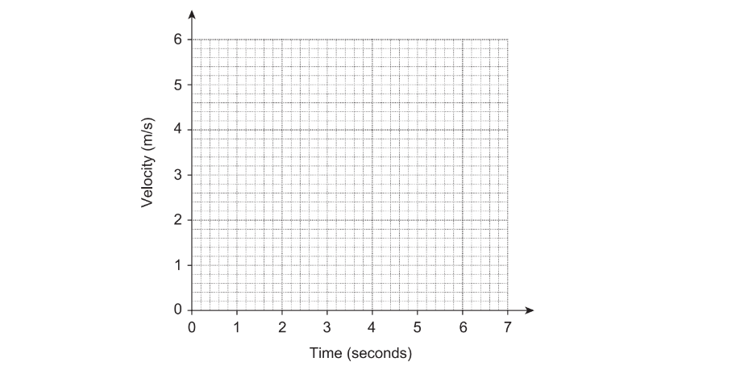

Work out the total distance travelled by the toy car.

....................... m
