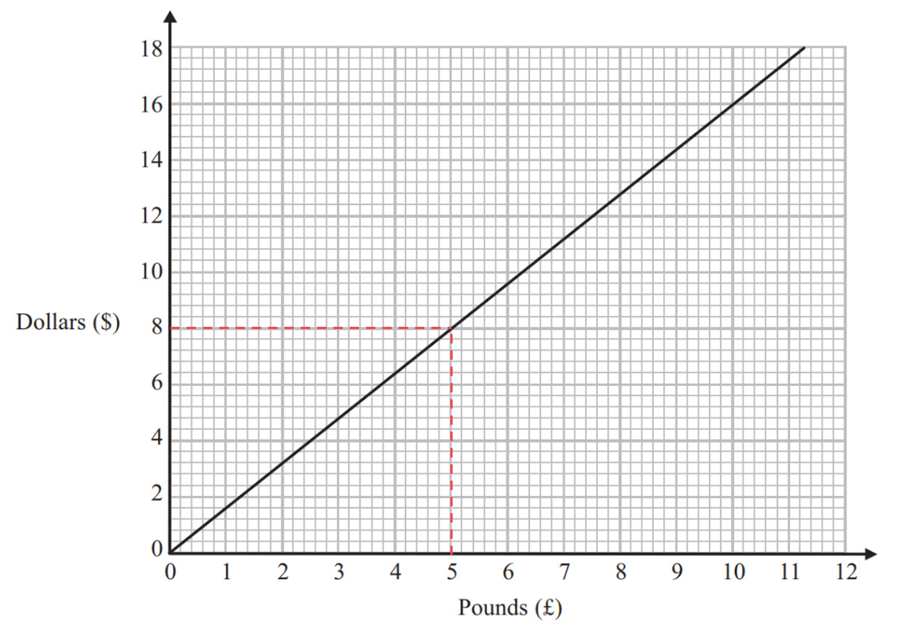

# Mark Schemes — Exchange Rates & Best Buys
**Number** · Edexcel IGCSE Maths A (Modular) (4XMAF/4XMAH) — 24/Higher Unit 1

## Q1 — hard — 4 marks · exam-questions

### 8() — 4 marks
> *First find the price at Bathroom Mart. *
*2/3 **off **normal price means that the sale price is 1/3 of normal price. *
*So find 1/3 of £1500.*

`Bathroom space Mart colon space space 1 third space cross times space 1500 space equals space 1500 over 3 space equals space £ 500`

**[1]**

> *Now find the price at Mega Bathrooms. *
*60% **off **normal price means that what's left is 40% of normal price. *
*So start by finding 40% of £1500 using a multiplier of 0.4*

$0.4\times1500=600$

**[1]**

> *So after taking 60% off, £600 is left. *
*Now we need to take 15% off of that, which leaves 85% Find 85% of 600*

`Mega space Bathrooms colon space space 0.85 space cross times space 600 space equals space £ 510`

**[1]**

> *Interpret your results in the context of the question.*

**The price is £500 at Bathroom Mart and £510 at Mega Bathrooms.  So she should buy from Bathroom Mart.****  [1]**

## Q2 — medium — 4 marks · exam-questions

### 6() — 4 marks
> *Divide cost of each option by the number of kilograms of potatoes to find cost per kilogram.*

`farm space shop colon space space 9 space divided by space 12.5 space equals space £ 0.72 space space per space kg

supermarket colon space space space space 1.83 space divided by space 2.5 space equals space £ 0.732 space space per space kg`

**[3] **
**1 mark for dividing to find one price per kg.  1 mark for dividing to find both prices per kg.  1 mark for both answers correct.**

> *Interpret your results in the context of the question.*

**The farm shop is the better value, because the price per kg of potatoes is lower.****  [1]**

**You could also get full marks by dividing 'the other way round' to find the number of kg per pound for each option. **
**I.e., farm shop = 12.5 ÷ 9 = 1.388... kg per £, and supermarket = 2.5 ÷ 1.83 = 1.366... kg per £. **
**So farm shop is the better value because you get the most kg per pound. **
**(Any other reasonable method allowing for a correct comparison will also get full marks.)**

## Q3 — easy — 4 marks · exam-questions

### 7() — 4 marks
> *Divide cost of each tray by the number of plants to find cost per plant.*

`small colon space space 6.50 space divided by space 30 space equals space £ 0.216666... space space per space plant

medium colon space space 8.95 space divided by space 40 space equals space £ 0.22375 space space per space plant

large table row blank blank colon end table table row blank blank space end table table row blank blank space end table table row blank blank 10 end table table row blank blank. end table table row blank blank 99 end table table row blank blank space end table table row blank blank divided by end table table row blank blank space end table table row blank blank 50 end table table row blank blank space end table table row blank equals blank end table table row blank blank cell space £ end cell end table table row blank blank 0 end table table row blank blank. end table table row blank blank 2198 end table table row blank blank space end table table row blank blank space end table table row blank blank per end table table row blank blank space end table table row blank blank plant end table`

**[3]**

**1 mark for dividing to find one price per plant.  **
**1 mark for dividing to find all three prices per plant.  **
**1 mark for all three answers correct.**

> *Interpret your results in the context of the question.*

**Kaz should buy the small tray, because it has the lowest price per plant.****  [1]**

## Q4 — hard — 5 marks · exam-questions

### 5() — 5 marks
> *First divide 180 by 1000 to find out how many cubic metres Henry uses each day.*

$180\div1000=0.18\mathrm{cubic} \mathrm{metres}$

**[1]**

> *Now multiply by 91.22p to find the cost per day with the water meter.*

`0.18 space cross times space 91.22 space equals space 16.4196 space straight p space equals space £ 0.164196`

**[1]**

> *Then multiply by 365 (the number of days in a normal year) to find the price for water used per year.*
* (You don't need to worry about leap years here!)*

`0.164196 space cross times space 365 space equals space £ 59.93154`

**[1]**

> *Add £28.20 to find the total cost with a water meter per year.*

`59.93154 space plus space 28.20 space equals space 88.13154 space equals space £ 88.13 space open parentheses nearest space penny close parentheses`

**[1]**

> *And finally interpret your results in the context of the question.*

**It will cost Henry £88.13 per year with the water meter, which is cheaper than the £107 without the meter.  Therefore he should have a water meter.****  [1]**

## Q5 — medium — 3 marks · exam-questions

### 10() — 3 marks
> *Divide cost of each option by the number of pints to find cost per pint. *
*It might be easier to convert the prices to 118 p and 174 p first, before dividing.*

$4\mathrm{pints}:118\div4=29.5p\mathrm{per} \mathrm{pint}\,\,6\mathrm{pints}:174\div6==29p\mathrm{per} \mathrm{pint}$

**[2] **
**1 mark for dividing to find both prices per pint.  **
**1 mark for both answers correct.**

> *Interpret your results in the context of the question.*

**The 6 pint bottle is the best value, because the price per pint is lower.****  [1]**

**Any other reasonable method allowing for a correct comparison will also get full marks.**

## Q6 — easy — 4 marks · exam-questions

### 6() — 4 marks
> *Divide cost of each size box by the number of sachets to find cost per sachet.*

`small colon space space 5.65 space divided by space 12 space equals space £ 0.470833... space space per space sachet

medium colon space space 9.20 space divided by space 20 space equals space £ 0.46 space space per space sachet

large colon space space 15.75 space divided by space 35 space equals space £ 0.45 space space per space sachet`

**[3]**

**1 mark for dividing to find one price per sachet.  **
**1 mark for dividing to find all three prices per sachet.  **
**1 mark for all three answers correct.**

> *Interpret your results in the context of the question.*

**The large box gives the best value, because it has the lowest price per sachet.****  [1]**

## Q7 — hard — 4 marks · exam-questions

### 10() — 4 marks
> *First multiply 3.79 litres by £1.24 per litre, to find the UK price per US gallon in £.*

`3.79 space cross times space 1.24 space equals space £ 4.6996`

**[1]**

> *£1 = 1.47 dollars, so multiply 4.6996 by 1.47 to find the UK price per US gallon in dollars.*

`4.6996 space cross times space 1.47 space equals space 6.908412 space equals space 6.91 space dollars space open parentheses 2 space straight d. straight p. close parentheses`

**[2] **
**1 mark for multiplying to find the price in US dollars.  1 mark for the correct answer.**

> *Interpret your results in the context of the question.*

**In the UK petrol costs 6.91 US dollars per US gallon, but in the US it is only 3.15 dollars per US gallon.  So it is cheaper in the USA.****  [1]**

**You can also answer the question and get full marks by making the comparison in £s. E.g., 3.15 dollars per US gallon = 3.15 ÷ 3.79 = 0.8311... US dollars per litre. **
**Which is 0.8311 ÷ 1.47 = £0.5653... per litre, so it's cheaper in the USA.  **

## Q8 — medium — 3 marks · exam-questions

### 9() — 3 marks
> *£1 is 25.82 koruna.  So £200 is equivalent to 200 × 25.82 koruna.*

$200\times25.82=5164\mathrm{koruna}$

**[1]**

> *Divide by 100 to see how many hundreds of koruna that is equal to.*

$5164\div100=51.64$

**[1]**

> *But she can only get 100 koruna notes, and £200 is not enough for 52 of those (5200 koruna). *
*So round **down**.*

**51 [****1]**

## Q9 — easy — 4 marks · exam-questions

### 8() — 4 marks
> *Divide cost of each size tube by the volume to find cost per ml.*

`50 space ml colon space space 1.09 space divided by space 50 space equals space £ 0.0218 space space per space ml

75 space ml colon space space 1.68 space divided by space 75 space equals space £ 0.0224 space space per space ml

125 space ml colon space space 15.75 space divided by space 35 space equals space £ 0.02152 space space per space ml`

**[3]**

**1 mark for dividing to find one price per ml.**
**1 mark for dividing to find all three prices per ml.**
**1 mark for all three answers correct.**

> *Interpret your results in the context of the question.*

**The 125 ml tube gives the best value, because it has the lowest price per millilitre.****  [1]**

## Q10 — hard — 3 marks · exam-questions

### 3() — 3 marks
> *£1 = 1.39 Swiss francs, so divide 189 by 1.39 to find the Geneva price in pounds.*

`189 space divided by space 1.39 space equals space 135.9712... space equals space £ 135.97 space open parentheses nearest space penny close parentheses`

**[1]**

> *£1 = 1.27 euros, so divide 174 by 1.27 to find the Paris price in pounds.*

`174 space divided by space 1.27 space equals space 137.0078... space equals space £ 137.01 space open parentheses nearest space penny close parentheses`

**[1]**

> *Interpret your results in the context of the question.*

**£115 in London is cheaper than £135.97 in Geneva and £137.01 in Paris.  So the best value for money is in London.****  [1]**

**Because both exchange rates are given in terms of £1 it is easiest to answer the question in pounds. **
**But you can also answer the question and get full marks by making the comparisons in Swiss francs or euros. **
**In Swiss francs it is 159.85 in London, 189 in Geneva, and 190.44 in Paris. **
**In euros it is 146.05 in London, 172.68 in Geneva, and 174 in Paris.  **

## Q11 — medium — 3 marks · exam-questions

### 5() — 3 marks
> *£1 is HK\$12.30.  So HK\$3179.55 is equivalent to 3179.55 ÷ 12.30 £s.*

`3179.55 space divided by space 12.30 space equals space £ 258.50`

**[1]**

> *Subtract that from the London price to find out how much he saved.*

`285 space minus space 258.50 space equals space £ 26.50`

**[1]**

**£26.50 cheaper****  [1]**

**You can also answer this and get full marks by comparing both prices in HK\$. **
**I.e., £285 = 285 × 12.30 = HK\$3505.50.  So it's 3505.50 - 3179.55 = HK\$325.95 cheaper.**

## Q12 — easy — 4 marks · exam-questions

### 4() — 4 marks
> *Divide cost of each pack by the number of bags of crisps to find cost per bag.*

`small colon space space 4 space divided by space 18 space equals space £ 0.222222... space space per space bag

medium colon space space 4.99 space divided by space 20 space equals space £ 0.2495 space space per space bag

large colon space space space space 6 space divided by space 26 space equals space £ 0.230769... space space per space bag`

**[3]**

**1 mark for dividing to find one price per bag.  **
**1 mark for dividing to find all three prices per bag.  **
**1 mark for all three answers correct.**

> *Interpret your results in the context of the question.*

**The small pack with 18 bags is the best value, because it has the lowest price per bag of crisps.****  [1]**

## Q13 — hard — 3 marks · exam-questions

### 2() — 3 marks
> *First multiply 3.785 litres by 108.9p per litre, to find the London price per US gallon in £.*

`3.785 space cross times space 108.9 space equals space 412.1865 space straight p space equals space £ 4.121865`

**[1]**

> *£1 = \$1.46, so multiply 4.121865 by 1.46 to find the London price per US gallon in \$.*

`4.121865 space cross times space 1.46 space equals space 6.0179229 space equals space $ 6.02 space open parentheses 2 space straight d. straight p. close parentheses`

**[1]**

> *Interpret your results in the context of the question.*

**In London petrol costs \$6.02 per US gallon, but in New York it is only \$2.83 dollars per US gallon.  So it is better value in New York.****  [1]**

**You can also answer the question and get full marks by making the comparison in £s. **
**E.g., \$2.83 per US gallon = 2.83 ÷ 3.785 = \$0.7476... per litre. Which is 0.7476... ÷ 1.46 = £0.5121... = 51.2p per litre, so it's cheaper in New York.  **

## Q14 — medium — 3 marks · exam-questions

### 6() — 3 marks
> *£1 is 1.16 euros.  So 5 euros is equivalent to 5 ÷ 1.16 £s.*

`5 space divided by space 1.16 space equals space 4.3103... space equals space £ 4.31 space open parentheses nearest space penny close parentheses`

**[1]**

> *Subtract the price in England from that to find the difference.*

`4.31 space minus space 2.50 space equals space £ 1.81`

**[1]**

**£1.81****  [1]**

**You can also answer this and get full marks by comparing both prices in euros. I.e., £2.50 = 2.50 × 1.16 = 2.90 euros.  **
**So it's 5 - 2.90 = 2.10 euros cheaper.**

## Q15 — easy — 3 marks · exam-questions

### 10() — 3 marks
> *Divide cost of each carton by the number of grams of crisps to find cost per gram.*

`small colon space space 1.60 space divided by space 125 space equals space £ 0.0128 space space per space gram

large colon space space space space 2.80 space divided by space 225 space equals space £ 0.012444... space space per space gram`

**[2]**

**1 mark for dividing to find one price per gram.  1 mark for dividing to find the other price per gram.**

> *Interpret your results in the context of the question.*

**The large carton is the best value, because it has the lowest price per gram of blueberries.****  [1]**

**You could also get full marks by dividing 'the other way round' to find the number of grams per pound for each carton. I.e., small = 125 ÷ 1.60 = 78.125 g per £, and large = 225 ÷ 2.80 = 80.357... g per £. **
**So large is the best value because you get the most grams per pound.**

## Q16 — hard — 3 marks · exam-questions

### 2() — 3 marks
> *£1 = €1.34, so divide 1980 by 1.34 to find the Paris price in pounds.*

`1980 space divided by space 1.34 space equals space 1477.6119... space equals space £ 1477.61 space open parentheses nearest space penny close parentheses`

**[1]**

> *£1 = \$1.52, so divide 2250 by 1.52 to find the New York price in pounds.*

`2250 space divided by space 1.52 space equals space 1480.2631... space equals space £ 1480.26 space open parentheses nearest space penny close parentheses`

**[1]**

> *Interpret your results in the context of the question.*

**£1477.61 in Paris is cheaper than £1480 in London and £1480.26 in New York.  So Jardins of Paris sells it at the lowest price.****  [1]**

**Because both exchange rates are given in terms of £1 it is easiest to answer the question in pounds. **
**But you can also answer the question and get full marks by making the comparisons in euros or dollars. **
**In euros it is €1983.20 in London, €1980 in Paris, and €1983.55 in New York. **
**In dollars it is \$2249.60 in London, \$2245.97 in Paris, and \$2250 in New York.**

## Q17 — medium — 3 marks · exam-questions

### 8() — 3 marks
> *£1 is 1.34 euros.  So 31 euros is equivalent to 31 ÷ 1.34 euros.*

`31 space divided by space 1.34 space equals space 23.1343... space equals space £ 23.13 space open parentheses nearest space penny close parentheses`

**[2] **
**1 mark for dividing to find the price in £.  **
**1 mark for the correct answer.**

> *Make a comparison in the context of the question.*

**The wallet is only £23.13 in France, which is slightly cheaper than the £23.50 London price.**** [1]**

**You can also answer this and get full marks by comparing both prices in euros.**
** I.e., £23.50 = 23.50 × 1.34 = 31.49 euros.  That is slightly more expensive than the 31 euro price in France.**

## Q18 — easy — 5 marks · exam-questions

### 6((a)) — 1 marks
> *Draw a line up from £5 on the horizontal axis until it hits the line. Then draw a line across and read off the vertical \$ axis*

**\$8 ****[1]**

### 6((b)) — 4 marks
> *Work out how much money is left to pay*

*\$600 − \$200 = \$400*

**[1]**

> *Ella needs to pay \$400 in pounds *
*The Dollars axis does not go up to \$400 but \$400 = \$4 × 100, so convert \$4 to pounds and then multiply by 100 (we could also convert \$8 and multiply by 50, or convert \$10 and multiply by 40)*

*\$4 = £2.50*

> *Multiply by 100*

*£2.50 × 100 = £250*

**[1]**

> *Subtract this amount from the £800 that Ella has*

*Amount Ella has left = £800 − £250*

**[1]**

**Amount Ella has left = £550 ****[1]**

## Q19 — hard — 5 marks · exam-questions

### 4() — 5 marks
> *First find the price at Kirsty's Plants. *
*To do 2.39 × 25 you can either use a long multiplication technique such as lattice method or you can multiply 2.39 by 100 and divide this by 4 (as 100 ÷ 4 = 25).*

$\mathrm{Kirsty}'s\mathrm{Plants}:2.39\times25=59.75$

**Correct calculation**** [2]**

> *At Kirsty's Plants the plants will cost £59.75.*

> *Find the cost of the 25 plants (1 pack) at Hedge World by adding the 20% VAT to the total price of £52.50.*

> *Find 20% of 52.5 using a multiplier of 0.2*

$0.2\times52.50=10.50$

> *Now we need to add the 20% to the total.*

`52.50 space plus space 10.50 space equals space 63.00
Hedge space World colon space £ 63`

**[1]**

> *Interpret your results in the context of the question.*

**The price is £59.75 at Kirsty's Plants and £63 at Hedge World.  So Tom should buy from Kirsty's Plants.****  **** **
**Both prices correct**** [1] **** **
**Conclusion correct ****[1]**

## Q20 — medium — 5 marks · exam-questions

### 2((a)) — 2 marks
> *£1 is 3.5601 lira.  So £550 is equivalent to 550 × 3.5601 lira.*

$550\times3.5601=1958.055$

**[1]**

> *Round to the nearest lira.*

**1958 lira ****  [1]**

### 2((b)) — 2 marks
> *In the approximation, each 'lot' of 7 lira is equal to £2. *
*Divide 210 by 7 to find how may lots of 7 lira there are. *
*Then multiply by 2 to find the approximation in pounds.*

$210\div7=30\,\,30\times2=60$

**£60****  [2] **
**1 mark for a correct method to find the approximate cost in £.  **
**1 mark for all calculations in the method correct.**

### 2((c)) — 1 marks
> *In your answer, use the facts that he doesn't have a calculator, and that £2 = 7 lira is the same as £1 = 3.50 lira.*

**It is a sensible start, because with his approximation he can do the calculations in his head.  Also £2 = 7 lira is the same as £1 = 3.50 lira, so his approximation is quite close to the actual exchange rate.  ****[1]**

## Q21 — easy — 1 marks · exam-questions

### 5() — 1 marks
> *Multiply \$0.0099 by 40 000.*

$40000\times0.0099$

**\$396**** [1]**

## Q22 — hard — 4 marks · exam-questions

### 12() — 4 marks
> *Find the cost, in Krone, of 1 litre of oil from Dane Oil by dividing its price by the number of litres.*

$2500000\div4.2\times10^{5}=5.952380952...\mathrm{Krone}$

**[1]**

> *Find the cost, in dollars, of 1 litre of oil from Arctic Oil by dividing its price by the number of litres.*

$770000\div8.6\times10^{5}=0.8953488372...\mathrm{Dollars}$

**[1]**

> *To compare this cost per litre with the cost per litre of Dane Oil, convert it into Krone. 1 Dollar = 6.57 Krone so multiply by 6.57.*

$0.8953488372...\times6.57=5.88244186...\mathrm{Krone}$

**[1]**

> *Compare the prices per litre*

$5.952380952...>5.88244186...$* therefore Dane Oil is more expensive than Arctic Oil*

**Astrid should buy from Arctic Oil**** [1] **
**This question could also be completed by finding the cost per litre from both companies in dollars, by ****dividing**** the Dane Oil price by 6.57**

## Q23 — medium — 2 marks · exam-questions

### 5() — 2 marks
> *Every \$1.0697 can be changed into €1. *
*Divide to find how many times \$1.0697 goes into \$500.*

*\$500 ÷ \$1.0697 = 467.4207...*

**[1]**

> *Round euros to 2 decimal places.*

**€467.42** **[1]** 
**Rounding to 3sf is also acceptable: \$467**

## Q24 — easy — 2 marks · exam-questions

### 7() — 2 marks
> *Divide the number of rupees by 68.14 to convert it into dollars.*

$30000\div68.14$

**[1]**

$440.270032...$

** **`bold $ bold 440`** [1]**

**Answers between 440.2 and 440.3 will be accepted.**

## Q25 — hard — 3 marks · exam-questions

### 18() — 3 marks
> *Consider buying exactly 8 bottles in each shop separately. Imagine each bottle costs £1.*

> *Shop A sells 2 at half price for every 1 full price bottle bought, so it makes sense to consider buying these bottles in groups of 3. You could either buy 3 or 6 bottle from shop A. *

`Shop space straight A colon
3 space bottles space equals space 1 space cross times space £ 1 space plus space 2 cross times space £ 0.50 space equals space £ 2
6 space bottles space equals space 2 space cross times space £ 1 space plus space 4 cross times space £ 0.50 space equals space £ 4`

> *Shop B sells 3 at half price for every 2 full price bottles bought, so it makes sense to consider buying these bottles in groups of 5. You could buy 5 bottles from shop B. *

`Shop space straight B colon space
5 space bottles space equals space 2 space cross times space £ 1 space plus space 3 space cross times space £ 0.50 space equals space £ 3.50`

> *Shop C sells every bottle at 30% off, so you could buy any number of the bottles at 30% off the full price.*

> *Consider the different options. *

> *Option 1: Buy all 8 at shop C.*

> *To buy something at 30% off the price, you still need to pay 70% of the original price, so the easiest way to take 30% off of £1 is to multiply is by 0.7.*

`Shop space straight C colon space
8 space bottles space equals space 8 space cross times space £ 1 space cross times space 0.7 space space equals space £ 5.60`

** ****Any of the above ****[1]**

> *Looking at the other shops you can see that buying 5 bottles from shop B and 3 from shop A is less than this, so this is a better option.*

> *Option 2: Buy 5 from shop B and 3 from shop A.*

`Shop space straight A space open parentheses 3 space bottles close parentheses space and space shop space straight B space open parentheses 5 space bottles close parentheses space equals space £ 2 space plus space £ 3.50 space equals space £ 5.50`

> *The third option is buying 6 from shop A, but then you could not benefit from the offer at shop B, so you could buy the other 2 from shop C at 30% off.*

> * *`Shop space straight A space open parentheses 6 space bottles close parentheses space and space shop space straight C space open parentheses 2 space bottles close parentheses space equals space £ 4 space plus space space open parentheses 2 space cross times space £ 1 space cross times space 0.7 close parentheses space equals space £ 4 space plus space £ 1.4 0 space equals space £ 5.40`

**Any combination found ****[1]**

**The cheapest option is to buy 6 bottles from shop A and 2 from shop C. ****[1]**

## Q26 — medium — 2 marks · exam-questions

### 1((c)) — 2 marks
> *We need to work out how many times 0.0154 goes in to 64.*

$\frac{64}{0.0154}=4155.844155...$

**[1]**

**4160 rupees**** ****[1]**

## Q27 — easy — 1 marks · exam-questions

### 1((c)) — 1 marks
> *Divide the number of Namibian dollars by the number of \$.*

*3891 ÷ 300 = 12.97*

**\$1 = 12.97 Namibian dollars**** [1]**

## Q28 — hard — 3 marks · exam-questions

### 1((c)) — 3 marks
> *As we are asked to give the difference in dollars, we should convert the price in euros, to dollars*

> *If \$1=0.9416 euros, we can **divide both sides by 0.9416** to find the price in dollars for 1 euro*

`table row cell $ 1 space end cell equals cell space 0.9416 space euros end cell row cell $ 1.06202209 space end cell equals cell space 1 space euro end cell end table`

**[1]**

> *We can now use this to find the price of the 2.25 euro newspaper, in dollars*

`2.25 space euros space equals space 2.25 space cross times $ 1.06202209 equals $ 2.389549703`

> *Find the difference between this price and the \$1.13 Maria paid at home*

$2.389549703-1.13=1.259549703...$

**[1]**

`bold $ bold space bold 1 bold. bold 26` **[1]** 
**Rounded to 2 decimal places (as it is money)**

## Q29 — medium — 2 marks · exam-questions

### 1((a)) — 2 marks
*€1 = \$1.091 means that \$1 = € *$\frac{1}{1.091}$ 
*Convert \$6 into euros (by multiplying by *$\frac{1}{1.091}$*)* * *

$6\times\frac{1}{1.091}=5.4995...$

**[1]**

> *Round your answer to 2 decimal places for euros*

**€5.50** **[1]**

## Q30 — easy — 2 marks · exam-questions

### 1((c)) — 2 marks
> *€1 is worth \$1.125. Note that the number in Euros is less than the number in dollars *
*If you're not sure whether to multiply or divide \$306 by 1.125, remember that the resulting number in dollars should be less than the 306 Euros! *

> *Another way to think about this is that if we want to go from Euros to dollars, we multiply by 1.125. But here we want to go from dollars to Euros, so we divide by 1.125*

$306\div1.125$

**[1]**

**€272 ****[1]**

## Q31 — medium — 2 marks · exam-questions

### 1((a)) — 2 marks
> *Work out \$1 in € euros (by dividing by 1.635*

*\$1 =  € *$\frac{1}{1.635}$* *

> *Find \$1962 in euros (by multiplying by *$\frac{1}{1.635}$*)*

$1962\times\frac{1}{1.635}$

**[1] **
**€1200** **[1]**

## Q32 — easy — 3 marks · exam-questions

### 1((d)) — 3 marks
> *Work out the total cost of the apples*

`5 cross times $ 2.69 equals $ 13.45`

**[1]**

> *Subtract this from the total spend*

`$ 17.56 minus $ 13.45 equals $ 4.11`

> *Divide the resulting amount by 3 to find the cost per kilograms of bananas*

`$ 4.11 divided by 3`

**[1]**

`bold $ bold 1 bold. bold 37`** [1]**

## Q33 — medium — 2 marks · exam-questions

### 1((b)) — 2 marks
*The answer is required in rupees so we need to convert the charge in US *
*Dollars to rupees.* 
*We need to find how many times 0.0153 goes into 35.*

$35\div0.0153=2287.581...$

**[1]**

> *Now find the difference between this and the amount the dressmaker charges in rupees.*

$2300-2287.581...=12.418...$

**12.42 rupees** **[1]**
