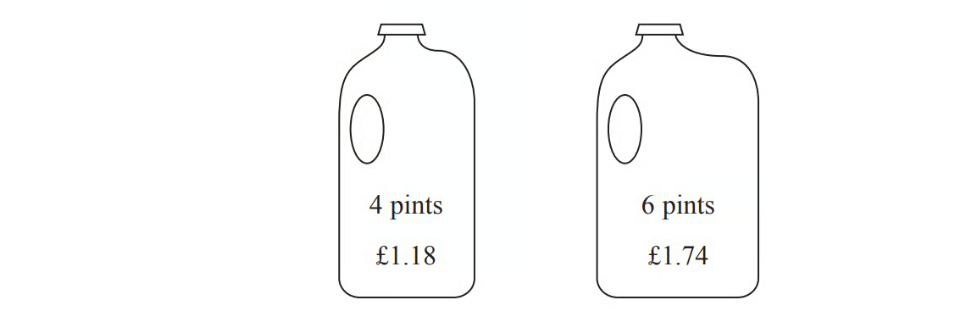
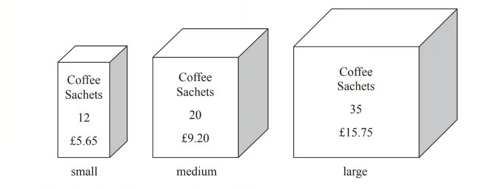
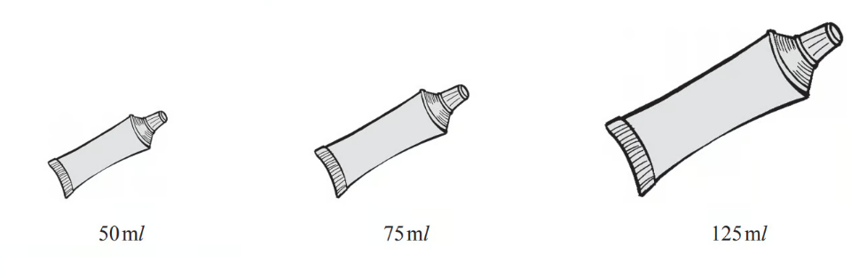
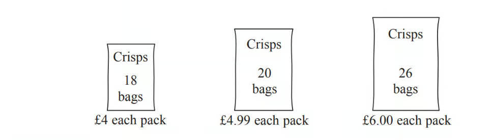
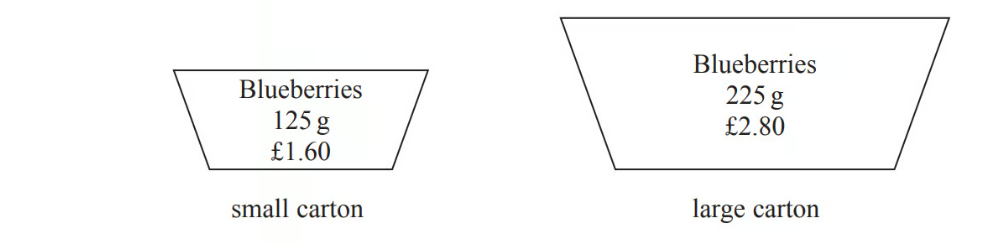
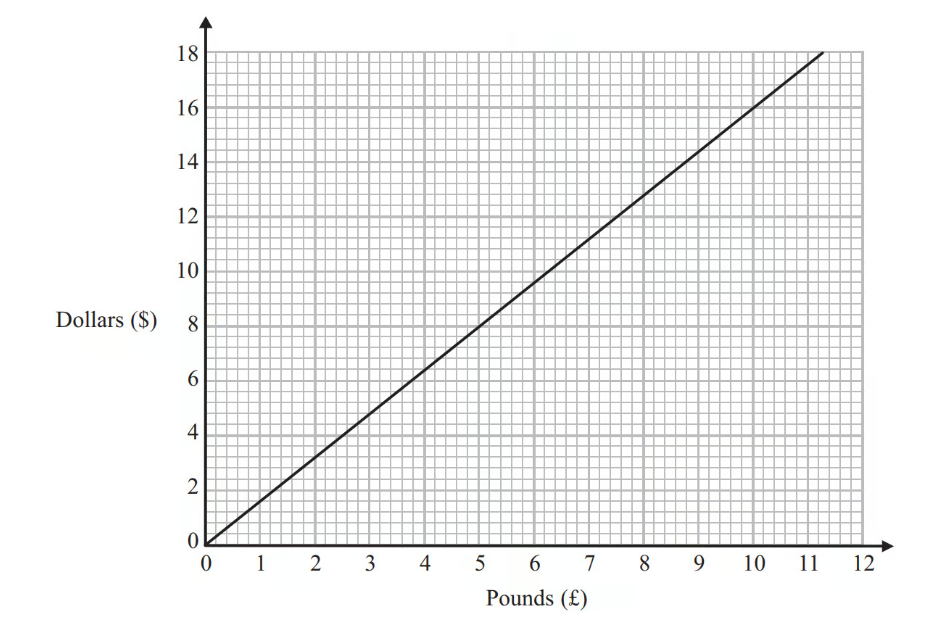
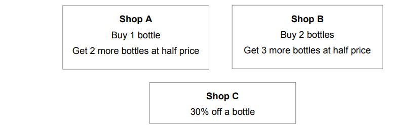

# Exam Questions — Exchange Rates & Best Buys
**Number** · Edexcel IGCSE Maths A (Modular) (4XMAF/4XMAH) — 24/Higher Unit 1
> Source: [https://www.savemyexams.com/igcse/maths/edexcel/a-modular/24/higher-unit-1/topic-questions/number/exchange-rates-and-best-buys/exam-questions/](https://www.savemyexams.com/igcse/maths/edexcel/a-modular/24/higher-unit-1/topic-questions/number/exchange-rates-and-best-buys/exam-questions/) · 33 questions · total 104 marks

## Q1 — hard — 4 marks · exam-questions

### 8() — 4 marks — command: show — structured — from paper 2016	November · 1MA0/1H
Two shops, Mega Bathrooms and Bathroom Mart, each have a sale.

| **Mega Bathrooms ** Sale  $60$% off normal price  **then**  $15$% off |
|---|

| **Bathroom Mart**  Sale  $\frac{2}{3}$ off normal price |
|---|

Sally wants to buy some bathroom units. 
The units have a normal price of £1500.

Sally wants to buy the units as cheaply as possible.

Which shop should she buy the units from? 
You must show all your working.

## Q2 — medium — 4 marks · exam-questions

### 6() — 4 marks — command: where — structured — from paper 2012	June · 1MA0/2H
Potatoes cost £9 for a 12.5 kg bag at a farm shop. 
The same type of potatoes cost £1.83 for a 2.5 kg bag at a supermarket.

Where are the potatoes the better value, at the farm shop or at the supermarket? 
You must show your working.

## Q3 — easy — 4 marks · exam-questions

### 7() — 4 marks — command: show — structured — from paper 2013	November · 1MA0/2H
Plants are sold in three different sizes of tray.
    
    A small tray of 30 plants costs £6.50
     A medium tray of 40 plants costs £8.95
     A large tray of 50 plants costs £10.99

Kaz wants to buy the tray of plants that is the best value for money.

Which size tray of plants should she buy? 
You must show all your working.

## Q4 — hard — 5 marks · exam-questions

### 5() — 5 marks — command: determine — structured — from paper 2015	Sample · 1MA1/3H
Henry is thinking of having a water meter.

These are the two ways he can pay for the water he uses.

| **Water Meter**  A charge of £28.20 per year  **plus**  91.22p for every cubic metre of water used  1 cubie metre = 1000 litres |
|---|

| **No Water Meter**  A charge of £107 per year |
|---|

Henry uses an average of 180 litres of water each day.

Use this information to determine whether or not Henry should have a water meter.

## Q5 — medium — 3 marks · exam-questions

### 10() — 3 marks — command: which — structured — from paper 2014	June · 1MA0/1H
Milk is sold in two sizes of bottle.

A 4 pint bottle of milk costs £1 .18 
A 6 pint bottle of milk costs £1 .74

Which bottle of milk is the best value for money? 
You must show all your working.

## Q6 — easy — 4 marks · exam-questions

### 6() — 4 marks — command: work_out — structured — from paper 2015	June · 1MA0/2H
Coffee sachets are sold in three different sizes of box.

A small box has 12 coffee sachets and costs £5.65 
A medium box has 20 coffee sachets and costs £9.20 
A large box has 35 coffee sachets and costs £15.75

Work out which size of box gives the best value for money. 
You must show all your working.

## Q7 — hard — 4 marks · exam-questions

### 10() — 4 marks — command: compare — structured — from paper 2012	November · 1MA0/2H
In the UK, petrol cost £1.24 per litre. 
In the USA, petrol cost 3.15 dollars per US gallon.

1 US gallon = 3.79 litres 
£1 = 1.47 dollars

Was petrol cheaper in the UK or in the USA?

## Q8 — medium — 3 marks · exam-questions

### 9() — 3 marks — command: how — structured — from paper 2012	June · 1MA0/2H
Linda is going on holiday to the Czech Republic. 
She needs to change some money into koruna.

She can only change her money into 100 koruna notes.

Linda only wants to change up to £200 into koruna. 
She wants as many 100 koruna notes as possible.

The exchange rate is £1 = 25.82 koruna.

How many 100 koruna notes should she get?

## Q9 — easy — 4 marks · exam-questions

### 8() — 4 marks — command: which — structured — from paper 2015	November · 1MA0/2H
Toothpaste is sold in three different sizes of tube.

A 50 *ml* tube costs £ 1.09 
A 75 *ml* tube costs £ 1.68 
A 125 *ml *tube costs £ 2.69

Which tube of toothpaste is the best value for money? 
You must show all your working.

## Q10 — hard — 3 marks · exam-questions

### 3() — 3 marks — command: show — structured — from paper 2017	June · 1MA0/2H
Identical pairs of boots are sold in London, in Geneva and in Paris.

These boots have a price of

£115 in London
 189 Swiss francs in Geneva
 174 euros in Paris

The exchange rates are

£1 = 1.39 Swiss francs 
£1 = 1.27 euros

Are the boots the best value for money in London or in Geneva or in Paris? 
You must show how you get your answer.

## Q11 — medium — 3 marks · exam-questions

### 5() — 3 marks — command: how — structured — from paper 2013	November · 1MA0/2H
Ben goes on holiday to Hong Kong.

In Hong Kong, Ben sees a camera costing HK\$3179.55 
In London, an identical camera costs £285

The exchange rate is £1 = HK\$12.30

Ben buys the camera in Hong Kong.

How much cheaper is the camera in Hong Kong than in London?

## Q12 — easy — 4 marks · exam-questions

### 4() — 4 marks — command: which — structured — from paper 2016	June · 1MA0/2H
A shop sells bags of crisps in different size packs.

There are

18 bags of crisps in a small pack
20 bags of crisps in a medium pack 
26 bags of crisps in a large pack

Which size pack is the best value for money? 
You must show all your working.

## Q13 — hard — 3 marks · exam-questions

### 2() — 3 marks — command: which — structured — from paper 2017	November · 1MA1/3H
In London, 1 litre of petrol costs 108.9p 
In New York, 1 US gallon of petrol costs \$2.83

1 US gallon = 3.785 litres    
£1 = \$1.46

In which city is petrol better value for money, London or New York? 
You must show your working.

## Q14 — medium — 3 marks · exam-questions

### 6() — 3 marks — command: work_out — structured — from paper 2014	November · 1MA0/2H
Margaret is on holiday in France.

She buys an English newspaper. 
The cost of the newspaper is 5 euros. 
In England, the cost of the same newspaper is £2.50

The exchange rate is £1 = 1.16 euros.

Work out the difference between the cost of the newspaper in France and the cost of the newspaper in England.

## Q15 — easy — 3 marks · exam-questions

### 10() — 3 marks — command: which — structured — from paper 2016	November · 1MA0/2H
Blueberries are sold in small cartons and in large cartons.

There are 125 g of blueberries in a small carton. 
Each small carton costs £1.60

There are 225 g of blueberries in a large carton. 
Each large carton costs £2.80

Which size of carton is the better value for money? You must show your working.

## Q16 — hard — 3 marks · exam-questions

### 2() — 3 marks — command: show — structured — from paper 2015	Spec1 · 1MA1/2H
Three companies sell the same type of furniture.

The price of the furniture from Pooles of London is £1480 
The price of the furniture from Jardins of Paris is €1980 The price of the furniture from Outways of New York is \$2250

The exchange rates are

£1 = €1.34
£1 = \$1.52

Which company sells this furniture at the lowest price? 
You must show how you get your answer.

## Q17 — medium — 3 marks · exam-questions

### 8() — 3 marks — command: compare — structured — from paper 2016	November · 1MA0/2H
Colin is on holiday in France.

He buys a wallet.    
   The wallet costs 31 euros.

In London a wallet costs £23.50

The exchange rate is £1 = 1.34 euros.

Compare the cost of the wallet in France with the cost of the wallet in London.

## Q18 — easy — 5 marks · exam-questions

### 6((a)) — 1 mark — command: change — structured — from paper 2013	March · 1MA0/1H
You can use this conversion graph to change between pounds (£) and dollars (\$).

Use the conversion graph to change £5 to dollars.

### 6((b)) — 4 marks — command: work_out — structured — from paper 2013	March · 1MA0 1H
Ella has \$200 and £800 
Her hotel bill is \$600

Ella pays the bill with the \$200 and some of the pounds.

Use the conversion graph to work out how many pounds she has left.

## Q19 — hard — 5 marks · exam-questions

### 4() — 5 marks — command: recommend — structured — from paper 2015	June · 1MA0/1H
Tom is going to buy 25 plants to make a hedge. 
Here is information about the cost of buying the plants.

| **Kirsty's Plants**  £2.39 each |
|---|

| **Hedge World**  Pack of 25  £52.50 plus VAT at 20% |
|---|

Tom wants to buy the 25 plants as cheaply as possible.

Should Tom buy the plants from Kirsty's Plants or from Hedge World? 
You must show all your working.

## Q20 — medium — 5 marks · exam-questions

### 2((a)) — 2 marks — command: work_out — structured — from paper 2015	Sample · 1MA1/3H
Asif is going on holiday to Turkey.

The exchange rate is £1 = 3.5601 lira.

Asif changes £550 to lira.

Work out how many lira he should get. 
Give your answer to the nearest lira.

### 2((b)) — 2 marks — command: show — structured — from paper 2015	Sample · 1MA1/3H
Asif sees a pair of shoes in Turkey. The shoes cost 210 lira.

Asif does not have a calculator. 
He uses £2 = 7 lira to work out the approximate cost of the shoes in pounds.

Use £2 = 7 lira to show that the approximate cost of the shoes is £60

### 2((c)) — 1 mark — command: justify — structured — from paper 2015	Sample · 1MA1/3H
Is using £2 = 7 lira instead of using £1 = 3.5601 lira a sensible start to Asif's method to work out the cost of the shoes in pounds?

You must give a reason for your answer.

## Q21 — easy — 1 marks · exam-questions

### 5() — 1 mark — command: work_out — structured — from paper 2020 Oct/Nov · 0580/23
Thor changes 40 000 Icelandic Krona into dollars when the exchange rate is 1 krona = \$0.0099.

Work out how many dollars he receives.

\$ ................................................

## Q22 — hard — 4 marks · exam-questions

### 12() — 4 marks — command: which — structured — from paper Jan 2020 · 4MA1/2H
Astrid wants to buy some oil. 
She can buy the oil from either Dane Oil or Arctic Oil.

Here is information about the price that each company will charge Astrid.

| **Dane Oil** | **Arctic Oil** |
|---|---|
| $(4.2\times10^{5})\mathrm{litres}\,\mathrm{for}2500000\mathrm{Krone}$ | $(8.6\times10^{5})\mathrm{litres}\,\mathrm{for}770000\mathrm{Dollars}$ |

Astrid wants to get the better value for money for the oil.

$1\mathrm{Dollar}=6.57\mathrm{Krone}$

From which company should she buy her oil, Dane Oil or Arctic Oil? 
You must show your working.

## Q23 — medium — 2 marks · exam-questions

### 5() — 2 marks — command: calculate — structured — from paper 2019 March · 0580/22
A tourist changes \$500 to euros (€) when the exchange rate is €1 = \$1.0697.

Calculate how many euros he receives.

€ ..................................................

## Q24 — easy — 2 marks · exam-questions

### 7() — 2 marks — command: how — structured — from paper 2019	Oct/Nov · 0580/22
Rashid changes 30 000 rupees to dollars when the exchange rate is \$1 = 68.14 rupees.

How many dollars does he receive?

\$ ...................................................

## Q25 — hard — 3 marks · exam-questions

### 18() — 3 marks — command: what — structured — from paper June 2017 · 8300/1H
Bottles of drink are for sale at three shops.

The normal price of a bottle is the same at each shop.

What is the cheapest way to buy **exactly **8 bottles?

You can buy from more than one shop.

You **must **show your working.

## Q26 — medium — 2 marks · exam-questions

### 1((c)) — 2 marks — command: calculate — structured — from paper 2020 March · 0580/42
A new model locomotive costs \$64.

Calculate the cost of the locomotive in rupees when the exchange rate is 1 rupee = \$0.0154. 
Give your answer correct to the nearest 10 rupees.

...................................... rupees

## Q27 — easy — 1 marks · exam-questions

### 1((c)) — 1 mark — command: complete — structured — from paper 2020 Oct/Nov · 0580/42
Karel changed \$300 into 3891 Namibian dollars.

Complete the statement.

\$1 = ............................ Namibian dollars

## Q28 — hard — 3 marks · exam-questions

### 1((c)) — 3 marks — command: calculate — structured — from paper 2019	May/June · 0580/42
On holiday Maria paid 2.25 euros for a newspaper when the exchange rate was 
\$1 = 0.9416 euros. 
At home Maria paid \$1.13 for the newspaper.

Calculate the difference in price. 
Give your answer in dollars, correct to the nearest cent.

\$ ..............................................

## Q29 — medium — 2 marks · exam-questions

### 1((a)) — 2 marks — command: calculate — structured — from paper 2018	Oct/Nov · 0580/41
Marianne sells photos. 
The selling price of each photo is \$6.
Calculate the selling price of a photo in euros (€) when the exchange rate is

€1 = \$1.091 .

€ ...............................................

## Q30 — easy — 2 marks · exam-questions

### 1((c)) — 2 marks — command: calculate — structured — from paper 2018	May/June · 0580/41
Adele changes \$306 into euros (€) when the exchange rate is €1 = \$1.125.

Calculate the number of euros she receives.

€ ...............................................

## Q31 — medium — 2 marks · exam-questions

### 1((a)) — 2 marks — command: calculate — structured — from paper 2018	Oct/Nov · 0580/42
The Muller family are on holiday in New Zealand.

They change some euros (€) and receive \$1962 (New Zealand dollars). 
The exchange rate is €1 = \$1.635 .

Calculate the number of euros they change.

€ ................................................

## Q32 — easy — 3 marks · exam-questions

### 1((d)) — 3 marks — command: calculate — structured — from paper 2018	May/June · 0580/41
Barbara spends a total of \$17.56 on 5 kg of apples and 3 kg of bananas. 
Apples cost \$2.69 per kilogram.

Calculate the cost per kilogram of bananas.

\$ ...............................................

## Q33 — medium — 2 marks · exam-questions

### 1((b)) — 2 marks — command: calculate — structured — from paper 2018	Feb/Mar · 0580/42
A dressmaker charges \$35 or 2300 rupees to make a dress.

Calculate the difference in price when the exchange rate is 1 rupee = \$0.0153 . 
Give your answer in rupees.

..................................... rupees
