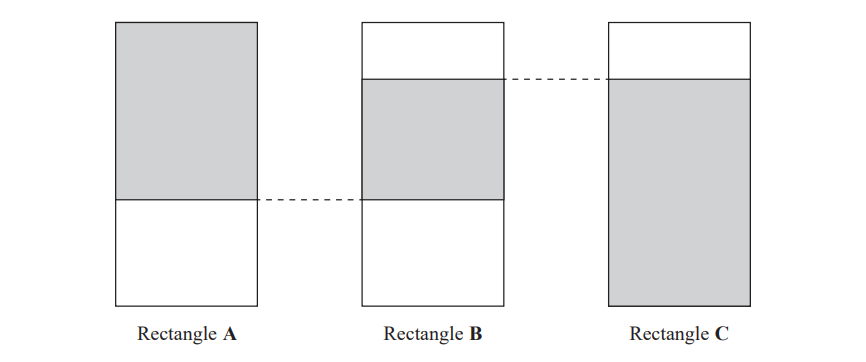
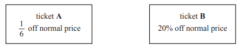

# Exam Questions — Fractions, Decimals & Percentages
**Number** · Edexcel IGCSE Maths A (Modular) (4XMAF/4XMAH) — 24/Higher Unit 1
> Source: [https://www.savemyexams.com/igcse/maths/edexcel/a-modular/24/higher-unit-1/topic-questions/number/fractions-decimals-and-percentages/exam-questions/](https://www.savemyexams.com/igcse/maths/edexcel/a-modular/24/higher-unit-1/topic-questions/number/fractions-decimals-and-percentages/exam-questions/) · 53 questions · total 157 marks

## Q1 — hard — 2 marks · exam-questions

### 16((a)) — 1 mark — command: show — structured — from paper Nov 2019 · 8300/2H
Show that      `a percent sign space of space b equals b percent sign space of space a`

### 16((b)) — 1 mark — command: give — structured — from paper Nov 2019 · 8300/2H
Rosie says,

“160% of 40 = 140% of 60 because `a percent sign` of $b$ = `b percent sign` of $a$”

Is she correct? 
Tick a box.

`square` Yes            `square` No

Give a reason for your answer.

## Q2 — medium — 4 marks · exam-questions

### 10() — 4 marks — command: compare — structured — from paper 2012	June · 1MA0/1H
Railtickets and Cheaptrains are two websites selling train tickets.

Each of the websites adds a credit card charge and a booking fee to the ticket price.

Nadia wants to buy a train ticket. 
The ticket price is £60 on each website. 
Nadia will pay by credit card.

Will it be cheaper for Nadia to buy the train ticket from Railtickets or from Cheaptrains?

## Q3 — easy — 4 marks · exam-questions

### 11() — 4 marks — command: work_out — structured — from paper 2014	November · 1MA0/1H
Ria is going to buy a caravan.

The total cost of the caravan is £7000 **plus** VAT at 20%.

Ria pays a deposit of £3000 She pays the rest of the total cost in 6 equal monthly payments.

Work out the amount of each monthly payment.

## Q4 — hard — 5 marks · exam-questions

### 2() — 5 marks — command: calculate — structured — from paper Nov 2019 · J560/06
Amrit’s income is 32% more than Bethan’s income. 
Amrit and Bethan’s combined income is £54868.

Calculate Amrit’s income.

£ ........................................................

## Q5 — medium — 5 marks · exam-questions

### 3() — 5 marks — command: work_out — structured — from paper 2012	November · 1MA0/2H
A company sells boxes to factories. 
Fred buys boxes. 
The boxes are sold in packs of 1000. 
Each pack costs £193.86

Fred orders 3 packs of boxes. 
He gets a discount on his total order.

The table shows the discount he will get.

| **Total Order** | **Discount** |
|---|---|
| £100 - £300 | 5% |
| £301 - £400 | 10% |
| £401 and above | 15% |

Work out the total cost of the order after the discount. You must show your working.

## Q6 — easy — 3 marks · exam-questions

### 6((c)) — 3 marks — command: work_out — structured — from paper 2016	June · 1MA0/2H
Tom is a ski jumper.

The maximum length of skis he can use is 145% of his height. Tom's height is 1.80 m.

Work out the maximum length of skis Tom can use.

## Q7 — hard — 3 marks · exam-questions

### 24() — 3 marks — command: express — structured — from paper 2012	June · 1MA0/1H
Express the recurring decimal $0.2\overset{.}{8}\overset{.}{1}$ as a fraction in its simplest form.

## Q8 — medium — 5 marks · exam-questions

### 11() — 5 marks — command: work_out — structured — from paper 2013	March · 1MA0/1H
Greg sells car insurance and home insurance.

The table shows the cost of these insurances.

| **Insurance** | car insurance | home insurance |
|---|---|---|
| **Cost** | £200 | £350 |

Each month Greg earns

£530 basic pay

5% of the cost of all the car insurance he sells

and   10% of the cost of all the home insurance he sells

In May Greg sold

6 car insurances

and   4 home insurances

Work out the total amount of money Greg earned in May.

## Q9 — easy — 3 marks · exam-questions

### 6() — 3 marks — command: what — structured — from paper 2017	June · 1MA0/2H
George wants to watch all 23 games that a football team will play at home next season.

He can buy

a season ticket costing £425 
or 23 separate tickets costing £24 each ticket.

What percentage of the total cost of 23 separate tickets does George save by buying a season ticket?

## Q10 — hard — 3 marks · exam-questions

### 21() — 3 marks — command: prove — structured — from paper 2015	June · 1MA0/1H
$x=0.0\overset{.}{4}\overset{.}{5}$

Prove algebraically that $x$ can be written as $\frac{1}{22}$

## Q11 — medium — 3 marks · exam-questions

### 9() — 3 marks — command: determine — structured — from paper 2014	November · 1MA0/2H
The table gives some information about student attendance at a school on Friday.

|   | **Number of students** |   |   |
|---|---|---|---|
| **Year** | **Present** | **Absent** | **Total** |
| Year 7 | 192 | 16 | 208 |
| Year 8 | 219 | 22 | 241 |
| Year 9 | 234 | 28 | 262 |
| Year 10 | 233 | 28 | 261 |
| Year 11 | 214 | 24 | 238 |

The school has a target of 94% of students being present each day.

Did the school meet its target on Friday?

## Q12 — easy — 3 marks · exam-questions

### 2() — 3 marks — command: work_out — structured — from paper 2017	November · 1MA1/2H
Emily buys a pack of 12 bottles of water. The pack costs £5.64

Emily sells all 12 bottles for 50p each.

Work out Emily's percentage profit. 
Give your answer correct to 1 decimal place.

## Q13 — hard — 3 marks · exam-questions

### 16() — 3 marks — command: prove — structured — from paper 2017	June · 1MA1/2H
Using algebra, prove that $0.1\overset{.}{3}\overset{.}{6}\times0.\overset{.}{2}$  is equal in value to $\frac{1}{33}$

## Q14 — medium — 5 marks · exam-questions

### 2() — 5 marks — command: work_out — structured — from paper 2017	June · 1MA0/1H
Bill buys and sells laptops.

Last month Bill bought 50 laptops. 
He paid £400 for each laptop.

He sold

40 of these laptops at a profit of 30% on each laptop 
10 of these laptops at a profit of 15% on each laptop

Bill's target last month was to sell all 50 laptops for a total of at least £25 000 
Did Bill reach this target?

## Q15 — easy — 3 marks · exam-questions

### 3((a)) — 3 marks — command: work_out — structured — from paper Jan 2021 · 4MA1/2H
Gladys buys a table for \$465 to sell in her shop.

She sells the table for \$520

Work out the percentage profit that Gladys makes from the sale of the table.

Give your answer correct to 3 significant figures.

......................................................%

## Q16 — hard — 3 marks · exam-questions

### 15() — 3 marks — command: prove — structured — from paper 2017	November · 1MA1/1H
$x=0.4\overset{.}{3}\overset{.}{6}$

Prove algebraically that $x$ can be written as $\frac{24}{55}$

## Q17 — medium — 4 marks · exam-questions

### 3() — 4 marks — command: work_out — structured — from paper 2018	June · 1MA1/1H
Renee buys 5 kg of sweets to sell. 
She pays £10 for the sweets.

Renee puts all the sweets into bags. 
She puts 250 g of sweets into each bag. 
She sells each bag of sweets for 65p.

Renee sells all the bags of sweets.

Work out her percentage profit.

## Q18 — easy — 3 marks · exam-questions

### 8() — 3 marks — command: work_out — structured — from paper Nov 2021 · 4MA1/1H
In 2018, the population of Sydney was 5.48 million. 
This was 22% of the total population of Australia.

Work out the total population of Australia in 2018 
Give your answer correct to 3 significant figures.

...................................................... million

## Q19 — hard — 2 marks · exam-questions

### 19() — 2 marks — command: prove — structured — from paper 2015	Spec2 · 1MA1/3H
Prove algebraically that the recurring decimal $0.3\overset{.}{1}\overset{.}{8}$ can be written as $\frac{7}{22}$

## Q20 — medium — 4 marks · exam-questions

### 4() — 4 marks — command: work_out — structured — from paper 2014	June · 1MA0/1H
Mr Brown and his 2 children are going to London by train.

An adult ticket costs £24 
A child ticket costs £12

Mr Brown has a Family Railcard.

| **Family Railcard gives**  $\frac{1}{3}$ off adult tickets `space 60 percent sign space` off child tickets |
|---|

Work out the total cost of the tickets when Mr Brown uses his Family Railcard.

## Q21 — easy — 1 marks · exam-questions

### 3() — 1 mark — command: work_out — structured — from paper Nov 2020 · 8300/3H
Work out 320 as a percentage of 80

Circle your answer.

| 25% | 75% | 300% | 400% |
|---|---|---|---|

## Q22 — hard — 2 marks · exam-questions

### 1() — 2 marks — command: show — structured
Show that the recurring decimal $0.0\overset{.}{1}\overset{.}{5}=\frac{1}{66}$

## Q23 — medium — 2 marks · exam-questions

### 8() — 2 marks — command: write — structured — from paper 2017	November · 1MA1/1H
Write these numbers in order of size. 
Start with the smallest number.

| $0.2\overset{.}{4}\overset{.}{6}$ | $0.24\overset{.}{6}$ | $0.\overset{.}{24}\overset{.}{6}$ | $0.246$ |
|---|---|---|---|

## Q24 — easy — 1 marks · exam-questions

### 4() — 1 mark — command: work_out — structured — from paper June 2018 · 8300/2H
Work out 40 as a percentage of 10

Circle your answer.

| 4% | 25% | 300% | 400% |
|---|---|---|---|

## Q25 — hard — 2 marks · exam-questions

### 17() — 2 marks — command: show — structured — from paper June 2021 · 4MA1/1H
Use algebra to show that the recurring decimal `0.28 1 with dot on top 3 with dot on top equals 557 over 1980`

## Q26 — medium — 3 marks · exam-questions

### 23() — 3 marks — command: prove — structured — from paper 2009	November · 1380/3H
Prove that the recurring decimal $0.\overset{.}{3}\overset{.}{6}=\frac{4}{11}$

## Q27 — easy — 4 marks · exam-questions

### 2() — 4 marks — command: work_out — structured — from paper 2013	June · 1MA0/1H
Mr Mason asks $240$Year $11$ students what they want to do next year. `15 percent sign` of the students want to go to college.
 $\frac{3}{4}$  of the students want to stay at school. 
The rest of the students do not know. 
Work out the number of students who do not know.

## Q28 — hard — 3 marks · exam-questions

### 18() — 3 marks — command: show — structured — from paper Nov 2021 · 4MA1/1H
`0.4 space x with bold dot on top` is a recurring decimal.

$x$ is a whole number such that `1 space less-than or slanted equal to space x space less-than or slanted equal to space 9`

Find, in terms of $x$, the recurring decimal `0.4 space x with dot on top` as a fraction. 
Give your fraction in its simplest form. 
Show clear algebraic working.

## Q29 — medium — 2 marks · exam-questions

### 1() — 2 marks — command: show — structured
Show that the recurring decimal $0.\overset{.}{3}9\overset{.}{6}$ $=\frac{44}{111}$

## Q30 — easy — 2 marks · exam-questions

### 10() — 2 marks — command: show — structured — from paper 2013	November · 1MA0/2H
Sasha takes a music exam. 
The table shows the result that Sasha can get for different percentages in her music exam.

| **Percentage** | **Result** |
|---|---|
| 50% - 69% | Pass |
| 70% - 84% | Merit |
| 85% - 100% | Distinction |

Sasha gets 62 out of 80 in her music exam.

What result does Sasha get? 
You must show your working.

## Q31 — hard — 2 marks · exam-questions

### 14((a)) — 2 marks — command: show — structured — from paper Specimen 2016 · 4MA1/2H
Use algebra to show that `0.3 2 with bold dot on top 4 with bold dot on top space equals 107 over 330`

## Q32 — medium — 2 marks · exam-questions

### 1() — 2 marks — command: show — structured
Use algebra to show that the recurring decimal $0.\overset{.}{4}1\overset{.}{7}=\frac{139}{333}$

## Q33 — easy — 2 marks · exam-questions

### 2() — 2 marks — command: which — structured — from paper 2014	November · 1MA0/1H
Karen got 32 out of 80 in a maths test. 
She got 38% in an English test.

Karen wants to know if she got a higher percentage in maths or in English. 
Did Karen get a higher percentage in maths or in English?

## Q34 — hard — 5 marks · exam-questions

### 6() — 5 marks — command: how — structured — from paper Nov 2021 · 8300/3H
At a country park there is a house, a museum and a garden.

The table shows the prices per person to visit the park.

|   | **Price per person** |
|---|---|
| Garden only | Free |
| House and museum | £12.50 |
| House only | £8 |
| Museum only | £7 |

One day, 480 people visit the park.

67 visit the garden **only**. 
40% visit the house **and **the museum.
$\frac{3}{8}$ visit the house **only**.
 The rest visit the museum **only**.

In total, how much do the 480 people pay to visit the park? 
You may use the Venn diagram to help you.

## Q35 — medium — 3 marks · exam-questions

### 10() — 3 marks — command: work_out — structured — from paper Jan 2021 · 4MA1/2H
The people working for a company work in Team $A$ or in Team $B$.

number of people in Team $A$ : number of people in Team $B$ = 3 : 4

$\frac{4}{5}$ of Team $A$ work full time. 
24% of Team $B$ work full time.

Work out what fraction of the people working for the company work full time. 
Give your fraction in its simplest form.

## Q36 — easy — 4 marks · exam-questions

### 5() — 4 marks — command: work_out — structured — from paper 2015	November · 1MA0/2H
Celina and Zoe both sing in a band.

One evening the band plays for $80$minutes. 
Celina sings for `65 percent sign` of the $80$minutes.

Zoe sings for $\frac{5}{8}$ of the $80$minutes. 
Celina sings for more minutes than Zoe sings.

Work out for how many more minutes. 
You must show all your working.

## Q37 — hard — 3 marks · exam-questions

### 27() — 3 marks — command: prove — structured — from paper June 2018 · 8300/2H
Prove algebraically that `2.7 5 with bold dot on top` converts to the fraction $\frac{124}{45}$

## Q38 — medium — 2 marks · exam-questions

### 15() — 2 marks — command: show — structured — from paper June 2019 · 4MA1/1H
Use algebra to show that the recurring decimal `0.2 5 with bold dot on top 4 with bold dot on top` = $\frac{14}{55}$

## Q39 — easy — 2 marks · exam-questions

### 15() — 2 marks — command: prove — structured — from paper 2015	Sample · 1MA1/2H
Prove algebraically that the recurring decimal $0.2\overset{.}{5}$ has the value $\frac{23}{90}$

## Q40 — hard — 3 marks · exam-questions

### 18() — 3 marks — command: write — structured — from paper Nov 2020 · J560/06
Write `0.4 1 with dot on top 6 with dot on top` as a fraction in its simplest form. 
You must **show full working** in support of your answer.

## Q41 — medium — 5 marks · exam-questions

### 5((a)) — 5 marks — command: calculate — structured — from paper June 2019 · 4MA1/2H
Josh buys and sells books for a living.

He buys 120 books for £4 each.

He sells $\frac{1}{2}$  of the books for £5 each.

He sells 40% of the books for £7 each. 
He sells the rest of the books for £8 each.

Calculate Josh’s percentage profit.

## Q42 — easy — 2 marks · exam-questions

### 1() — 2 marks — command: show — structured
Show that the recurring decimal $0.1\overset{.}{7}$$=\frac{8}{45}$

## Q43 — hard — 2 marks · exam-questions

### 14((a)) — 2 marks — command: show — structured — from paper Specimen paper · 4MA1/2H
Use algebra to show that  `0.3 2 with dot on top 4 with dot on top equals 107 over 330`

## Q44 — medium — 4 marks · exam-questions

### 2() — 4 marks — command: find — structured — from paper Nov 2020 · J560/04
James is taking three examination papers in Spanish. Here are his first two results.

Paper 1:   $\frac{43}{80}$         Paper 2:   $\frac{38}{65}$

Paper 3 is out of 95. 
The marks in each of the three papers are added together.

Find the lowest mark that James needs in Paper 3 to achieve 60% of the total marks.

## Q45 — easy — 2 marks · exam-questions

### 1() — 2 marks — command: show — structured
Use algebra to show that the recurring decimal $0.3\overset{.}{8}$ $=\frac{7}{18}$

## Q46 — hard — 2 marks · exam-questions

### 15((a)) — 2 marks — command: show — structured — from paper 2023 Nov · 4MA1/2H
Use algebra to show that `0.3 7 with dot on top 2 with dot on top equals 41 over 110`

## Q47 — medium — 5 marks · exam-questions

### 14((a)) — 3 marks — command: show — structured — from paper Nov 2018 · J560/06
**Without using a calculator**, show that `0.1 with bold dot on top 9 with bold dot on top` o can be written as $\frac{19}{99}$.

### 14((b)) — 2 marks — command: explain — structured — from paper Nov 2018 · J560/06
Explain how `19 over 99 space equals space 0.1 with bold dot on top 9 with bold dot on top` can be used to find $\frac{19}{990}$ as a decimal and write down its value.

$\frac{19}{990}$ = ...............

## Q48 — easy — 2 marks · exam-questions

### 1() — 2 marks — command: show — structured
Use algebra to show that the recurring decimal $0.2\overset{.}{6}$ $=\frac{4}{15}$

## Q49 — medium — 3 marks · exam-questions

### 5() — 3 marks — command: what — structured — from paper Specimen paper · 4MA1/1H
The diagram shows three identical rectangles.

$\frac{5}{8}$of rectangle **A** is shaded.

80% of rectangle **C** is shaded.

What fraction of rectangle **B** is shaded?

## Q50 — easy — 2 marks · exam-questions

### 15((a)) — 2 marks — command: show — structured — from paper Jan 2021 · 4MA1/1HR
Use algebra to show that `4.5 with dot on top 7 with dot on top equals 4 19 over 33`

## Q51 — easy — 3 marks · exam-questions

### 5() — 3 marks — command: what — structured — from paper Specimen 2016 · 4MA1/1H
The diagram shows three identical rectangles.

$\frac{5}{8}$ of rectangle $A$ is shaded.

80% of rectangle $C$ is shaded.

What fraction of rectangle $B$ is shaded?

## Q52 — easy — 1 marks · exam-questions

### 2() — 1 mark — command: circle — structured — from paper Nov 2021 · 8300/3H
Circle the largest number.

| `0.5 with bold dot on top` | $0.55$ | $0.545$ | `0.5 4 with bold dot on top 5 with bold dot on top` |
|---|---|---|---|

## Q53 — easy — 4 marks · exam-questions

### 6() — 4 marks — command: work_out — structured — from paper 2023 Nov · 4MA1/1H
Juan wants to buy a ticket to fly from Madrid to Berlin.

He finds two different types of ticket he can buy in a sale, ticket **A **and ticket **B**

The sale price of ticket **A** is 140 euros.
The sale price of ticket **B** is 136 euros.

Work out the difference between the normal price of ticket** A** and the normal price of ticket **B**
