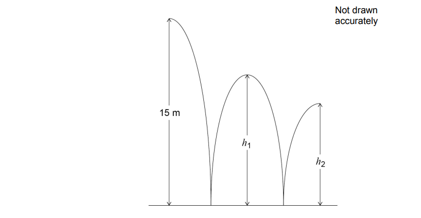

# Exam Questions — Fractions
**Number** · Edexcel IGCSE Maths A (Modular) (4XMAF/4XMAH) — 24/Higher Unit 1
> Source: [https://www.savemyexams.com/igcse/maths/edexcel/a-modular/24/higher-unit-1/topic-questions/number/fractions/exam-questions/](https://www.savemyexams.com/igcse/maths/edexcel/a-modular/24/higher-unit-1/topic-questions/number/fractions/exam-questions/) · 49 questions · total 141 marks

## Q1 — hard — 4 marks · exam-questions

### 6((a)) — 3 marks — command: show — structured — from paper 2015	Spec2 · 1MA1/1H
Show that $2\frac{1}{4}\times3\frac{1}{3}=7\frac{1}{2}$

### 6((b)) — 1 mark — command: write — structured — from paper 2015	Spec2 · 1MA1/1H
Write the numbers 3, 4, 5 and 6 in the boxes to give the greatest possible total.

You may write each number only once.

## Q2 — medium — 6 marks · exam-questions

### 18((a)) — 3 marks — command: show — structured — from paper 2016	June · 1MA0/1H
Show that $1\frac{1}{5}\times2\frac{1}{3}=2\frac{4}{5}$

### 2() — 3 marks — command: show — structured — from paper 2016	June · 1MA0/1H
Show that $2\frac{7}{15}-1\frac{2}{3}=\frac{4}{5}$

## Q3 — easy — 3 marks · exam-questions

### 1((a)) — 1 mark — command: show — structured — from paper 2014	June · 1MA0/1H
Show that $\frac{1}{7}\times\frac{2}{3}$ is equal to $\frac{2}{21}$

### 1((b)) — 2 marks — command: show — structured — from paper 2014	June · 1MA0/1H
Show that $\frac{3}{5}-\frac{1}{3}$ is equal to $\frac{4}{15}$

## Q4 — hard — 3 marks · exam-questions

### 1() — 3 marks — command: show — structured — from paper Jan 2019 · 4MA1/1HR
Show that $1\frac{2}{3}+2\frac{3}{4}=4\frac{5}{12}$

## Q5 — medium — 4 marks · exam-questions

### 1((a)) — 2 marks — command: show — structured — from paper 2018	June · 1MA1/1H
Show that $2\frac{1}{7}+1\frac{1}{4}=3\frac{11}{28}$

### 1((b)) — 2 marks — command: show — structured — from paper 2018	June · 1MA1/1H
Show that $1\frac{1}{5}\div\frac{3}{4}=1\frac{3}{5}$

## Q6 — easy — 3 marks · exam-questions

### 1() — 3 marks — command: show — structured — from paper Nov 2020 · 4MA1/1HR
Show that $3\frac{3}{4}\times\frac{7}{9}=2\frac{11}{12}$

## Q7 — hard — 3 marks · exam-questions

### 2() — 3 marks — command: show — structured — from paper June 2019 · 4MA1/2HR
Show that $5\frac{2}{3}-2\frac{3}{4}=2\frac{11}{12}$

## Q8 — medium — 3 marks · exam-questions

### 9() — 3 marks — command: show — structured — from paper June 2019 · 1MA1/1H
Show that $3\frac{1}{2}\times1\frac{3}{5}=5\frac{3}{5}$

## Q9 — easy — 1 marks · exam-questions

### 1() — 1 mark — command: work_out — structured — from paper June 2019 · 8300/2H
Work out £1.50 as a fraction of 60p

Circle your answer.

| $\frac{2}{5}$ | $\frac{1}{4}$ | $\frac{4}{1}$ | $\frac{5}{2}$ |
|---|---|---|---|

## Q10 — hard — 4 marks · exam-questions

### 13() — 4 marks — command: work_out — structured — from paper June 2018 · 4MA1/1HR
Each month Edna spends all her income on rent, on travel and on other living expenses.

She spends $\frac{1}{3}$ of her income on rent.

She spends $\frac{1}{5}$ of her income on travel.

She spends `$ 420` of her income on other living expenses.

Work out her income each month.

## Q11 — medium — 3 marks · exam-questions

### 2() — 3 marks — command: show — structured — from paper Jan 2022 · 4MA1/2H
Show that  $6\frac{3}{4}\div2\frac{4}{7}=2\frac{5}{8}$

## Q12 — easy — 1 marks · exam-questions

### 1() — 1 mark — command: circle — structured — from paper Nov 2017 · 8300/2H
Circle the fraction that is equivalent to  $3.875$

| $\frac{15}{4}$ | $\frac{29}{8}$ | $\frac{31}{8}$ | $\frac{15}{8}$ |
|---|---|---|---|

## Q13 — hard — 4 marks · exam-questions

### 14((a)) — 2 marks — command: work_out — structured — from paper Nov 2017 · 8300/2H
A ball is thrown from a height of 15 metres.

It bounces to height $h_{1}$, then to height $h_{2}$ as shown.

$h_{1}$ is three quarters of the original height.

Jack expects $h_{2}$ to be three quarters of $h_{1}$

Work out the value of $h_{2}$ that he expects.

.........................metres

### 14((b)) — 2 marks — command: show — structured — from paper Nov 2017 · 8300/2H
In fact, $h_{2}$ is two thirds of $h_{1}$

How does this affect the answer to part (a)? Tick a box.

`square`      The ball bounced higher than he expected

`square`        The ball bounced lower than he expected

Show working to support your answer.

## Q14 — medium — 3 marks · exam-questions

### 1() — 3 marks — command: show — structured — from paper Jan 2021 · 4MA1/1HR
Show that   $3\frac{1}{5}\times1\frac{5}{6}=5\frac{13}{15}$

## Q15 — easy — 2 marks · exam-questions

### 1((a)) — 2 marks — command: give — structured — from paper 2020 May/June · 0580/42
Write \$24.60 as a fraction of \$2870.

Give your answer in its lowest terms.

## Q16 — hard — 3 marks · exam-questions

### 10() — 3 marks — command: show — structured — from paper 2020 Oct/Nov · 0580/22
**Without using a calculator**, work out $\frac{5}{6}\div1\frac{1}{3}$.

You must show all your working and give your answer as a fraction in its simplest form.

## Q17 — medium — 3 marks · exam-questions

### 2() — 3 marks — command: show — structured — from paper June 2021 · 4MA1/2H
Show that  $2\frac{4}{7}\div1\frac{1}{8}=2\frac{2}{7}$

## Q18 — easy — 1 marks · exam-questions

### 1() — 1 mark — command: work_out — structured — from paper 2018	Oct/Nov · 0580/23
Work out $\frac{7}{11}$ of 198 kg.

........................................... kg

## Q19 — hard — 3 marks · exam-questions

### 6() — 3 marks — command: work_out — structured — from paper 2020 Oct/Nov · 0580/02
**Without using a calculator**, work out  $2\frac{2}{3}\times2\frac{3}{4}$.

You must show all your working and give your answer as a mixed number in its simplest form.

## Q20 — medium — 3 marks · exam-questions

### 3() — 3 marks — command: show — structured — from paper Jan 2020 · 4MA1/2H
Show that $4\frac{2}{3}+3\frac{4}{5}=8\frac{7}{15}$

## Q21 — hard — 3 marks · exam-questions

### 9() — 3 marks — command: show — structured — from paper 2020 Oct/Nov · 0580/23
**Without using a calculator**, work out $1\frac{1}{7}\times2\frac{1}{10}$.

You must show all your working and give your answer as a mixed number in its simplest form.

## Q22 — medium — 3 marks · exam-questions

### 2() — 3 marks — command: show — structured — from paper Jan 2020 · 4MA1/1HR
Show that   $3\frac{1}{5}\times2\frac{5}{8}=8\frac{2}{5}$

## Q23 — medium — 2 marks · exam-questions

### 6() — 2 marks — command: work_out — structured — from paper 2018	May/June · 0580/22
**Without using your calculator**, work out $\frac{2}{3}-\frac{1}{12}$.

You must show all your working and give your answer as a fraction in its simplest form.

## Q24 — hard — 4 marks · exam-questions

### 8() — 4 marks — command: show — structured — from paper 2020	May/June · 0580/21
**Without using a calculator**, work out  `open parentheses 2 1 third minus 7 over 8 close parentheses cross times 6 over 25.`

You must show all your working and give your answer as a fraction in its simplest form.

## Q25 — medium — 3 marks · exam-questions

### 1() — 3 marks — command: show — structured — from paper June 2019 · 4MA1/1H
Show that $4\frac{2}{3}\div1\frac{1}{9}=4\frac{1}{5}$

## Q26 — medium — 3 marks · exam-questions

### 12() — 3 marks — command: work_out — structured — from paper 2018	Feb/Mar · 0580/22
**Without using your calculator**, work out $\frac{7}{8}+\frac{1}{6}$.

You must show all your working and give your answer as a mixed number in its simplest form.

## Q27 — medium — 3 marks · exam-questions

### 1() — 3 marks — command: show — structured — from paper 2023 June  · 4MA1/2H
Show that $4\frac{2}{3}\div1\frac{1}{5}=3\frac{8}{9}$

## Q28 — hard — 3 marks · exam-questions

### 11() — 3 marks — command: work_out — structured — from paper 2020 May/June · 0580/22
**Without using a calculator**, work out $1\frac{3}{4}-\frac{11}{12}.$ 
You must show all your working and give your answer as a fraction in its simplest form.

## Q29 — medium — 3 marks · exam-questions

### 4() — 3 marks — command: show — structured — from paper June 2018 · 4MA1/2H
Show that $3\frac{4}{7}-1\frac{5}{8}=1\frac{53}{56}$

## Q30 — medium — 3 marks · exam-questions

### 6() — 3 marks — command: show — structured — from paper 2023 Nov · 4MA1/2H
Show that $3\frac{3}{7}\div2\frac{2}{3}=1\frac{2}{7}$

## Q31 — hard — 3 marks · exam-questions

### 7() — 3 marks — command: work_out — structured — from paper 2020 May/June · 0580/23
**Without using a calculator**, work out $3\frac{1}{4}-2\frac{2}{3}$.

You must show all your working and give your answer as a fraction in its simplest form.

## Q32 — medium — 1 marks · exam-questions

### 3() — 1 mark — command: circle — structured — from paper Nov 2019 · 8300/2H
Circle the number half way between  $\frac{7}{12}$ and $\frac{3}{4}$

| $\frac{7}{32}$ | $\frac{5}{8}$ | $\frac{2}{3}$ | $\frac{1}{2}$ |
|---|---|---|---|

## Q33 — hard — 3 marks · exam-questions

### 14() — 3 marks — command: work_out — structured — from paper 2020 Specimen · 0580/02
**Without using your calculator**, work out  $1\frac{7}{12}+\frac{13}{20}$. 
You must show all your working and give your answer as a mixed number in its simplest form.

## Q34 — medium — 3 marks · exam-questions

### 15() — 3 marks — command: write — structured — from paper Specimen 2015 · J560/06
A unit fraction has a numerator equal to 1, for example $\frac{1}{3},\frac{1}{7}$ and $\frac{1}{25}$.

Unit fractions can be written as the sum of two different unit fractions, for example

$\frac{1}{2}=\frac{1}{3}+\frac{1}{6}$

Write each of the following unit fractions as the sum of two **different** unit fractions.

`1 fourth space equals space 1 over square space plus space 1 over square`

`1 fifth space equals space 1 over square space plus space 1 over square`

`1 over 6 space equals space 1 over square space plus space 1 over square`

## Q35 — hard — 2 marks · exam-questions

### 8() — 2 marks — command: show — structured — from paper 2019	Oct/Nov · 0580/21
**Without using a calculator**, work out  $\frac{5}{16}\times1\frac{1}{7}$.

You must show all your working and give your answer as a fraction in its simplest form.

## Q36 — medium — 3 marks · exam-questions

### 5() — 3 marks — command: work_out — structured — from paper 2020 March · 0580/22
**Without using a calculator,** work out  $\frac{15}{28}\div\frac{4}{7}$.

You must show all your working and give your answer as a fraction in its simplest form.

## Q37 — hard — 3 marks · exam-questions

### 11() — 3 marks — command: work_out — structured — from paper 2019	Oct/Nov · 0580/22
**Without using a calculator**, workout  $3\frac{5}{8}-1\frac{2}{3}$.

You must show all your working and give your answer as a mixed number in its simplest form.

## Q38 — medium — 4 marks · exam-questions

### 15() — 4 marks — command: work_out — structured — from paper 2019	Oct/Nov · 0580/23
**Without using a calculator**, work out  $\frac{2}{3}+\frac{1}{4}\times\frac{2}{3}$. 
Write down all the steps of your working and give your answer as a fraction in its simplest form.

## Q39 — hard — 3 marks · exam-questions

### 13() — 3 marks — command: show — structured — from paper 2019	May/June · 0580/22
**Without using a calculator**, work out  $2\frac{1}{4}\div\frac{3}{7}$ .

You must show all your working and give your answer as a mixed number in its simplest form.

## Q40 — medium — 3 marks · exam-questions

### 14() — 3 marks — command: show — structured — from paper 2019	May/June · 0580/21
**Without using a calculator**, work out $\frac{5}{6}+\frac{2}{3}.$ 
You must show all your working and give your answer as a mixed number in its simplest form.

## Q41 — hard — 4 marks · exam-questions

### 21() — 4 marks — command: show — structured — from paper 2019 March · 0580/22
**Without using a calculator**, work out $3\frac{1}{8}\div\frac{5}{12}$.

You must show all your working and give your answer as a mixed number in its simplest form.

## Q42 — medium — 1 marks · exam-questions

### 3() — 1 mark — command: find — structured — from paper 2019	May/June · 0580/23
Giulio’s reaction times are measured in two games. 
In the first game his reaction time is $\frac{1}{3}$ of a second. 
In the second game his reaction time is $\frac{1}{8}$ of a second.

Find the difference between the two reaction times.

.................................................. s

## Q43 — hard — 3 marks · exam-questions

### 14() — 3 marks — command: work_out — structured — from paper 2018	Oct/Nov · 0580/21
**Without using your calculator**, work out  $\frac{3}{8}\div2\frac{1}{4}$.

You must show all your working and give your answer as a fraction in its simplest form.

## Q44 — medium — 2 marks · exam-questions

### 9() — 2 marks — command: show — structured — from paper 2019	May/June · 0580/23
**Without using a calculator**, work out $\frac{12}{35}\times\frac{7}{9}$. 
You must show all your working and give your answer as a fraction in its simplest form.

## Q45 — hard — 3 marks · exam-questions

### 13() — 3 marks — command: show — structured — from paper 2018	May/June · 0580/21
**Without using your calculator**, work out  $1\frac{3}{4}\times\frac{6}{35}$.

You must show all your working and give your answer as a fraction in its simplest form.

## Q46 — medium — 2 marks · exam-questions

### 5() — 2 marks — command: work_out — structured — from paper 2018	Oct/Nov · 0580/22
**Without using a calculator**, work out  $\frac{1}{15}+\frac{2}{5}$. 
Write down all the steps of your working and give your answer as a fraction in its simplest form.

## Q47 — hard — 3 marks · exam-questions

### 15() — 3 marks — command: work_out — structured — from paper 2018	May/June · 0580/23
**Without using a calculator**, work out $\frac{2}{3}\div1\frac{1}{5}$.

You must show all your working and give your answer as a fraction in its simplest form.

## Q48 — medium — 2 marks · exam-questions

### 9() — 2 marks — command: work_out — structured — from paper 2018	Oct/Nov · 0580/23
**Without using a calculator**, work out  $\frac{1}{4}\div\frac{2}{3}$. 
You must show all your working and give your answer as a fraction.

## Q49 — medium — 3 marks · exam-questions

### 1((e)) — 3 marks — command: calculate — structured — from paper 2018	May/June · 0580/41
Collette has \$136 and spends half of her money on clothes and $\frac{1}{5}$ of her money on books.

Calculate the amount she has left.

\$ ...............................................
