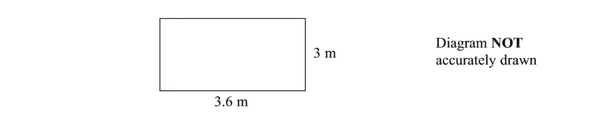
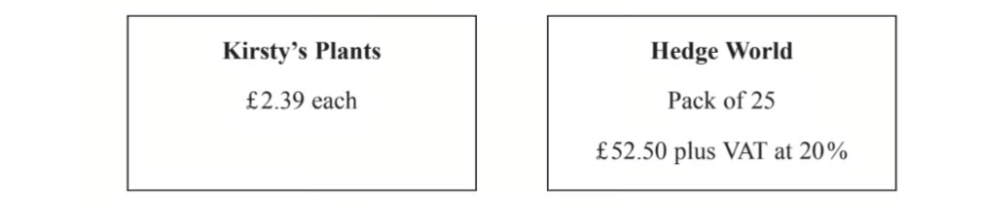

# Exam Questions — Number Toolkit
**Number** · Edexcel IGCSE Maths A (Modular) (4XMAF/4XMAH) — 24/Higher Unit 1
> Source: [https://www.savemyexams.com/igcse/maths/edexcel/a-modular/24/higher-unit-1/topic-questions/number/number-toolkit/exam-questions/](https://www.savemyexams.com/igcse/maths/edexcel/a-modular/24/higher-unit-1/topic-questions/number/number-toolkit/exam-questions/) · 28 questions · total 52 marks

## Q1 — easy — 1 marks · exam-questions

### 2() — 1 mark — command: circle — structured — from paper June 2018 · 8300/3H
Circle the list of **all** the integers that satisfy `– 2 space less than space x space less-than or slanted equal to space 4`

| –2, –1, 0, 1, 2, 3 | –1, 0, 1, 2, 3 |
|---|---|
| –2, –1, 0, 1, 2, 3, 4 | –1, 0, 1, 2, 3, 4 |

## Q2 — easy — 1 marks · exam-questions

### 11((a)) — 1 mark — command: give — structured — from paper Specimen 2015 · J560/04
Give one reason why 0 is an even number.

## Q3 — easy — 2 marks · exam-questions

### 3((b)) — 2 marks — command: give — structured — from paper Specimen 2015 · J560/06
Marta says

odd square numbers have exactly three factors.

Give one example where this is correct and another where this is not correct. 
In each case, write down the number and its factors.

## Q4 — easy — 1 marks · exam-questions

### 1() — 1 mark — command: write — structured — from paper 2020 Oct/Nov · 0580/22
Write two hundred thousand and seventeen in figures.

## Q5 — easy — 1 marks · exam-questions

### 2() — 1 mark — command: work_out — structured — from paper 2020 May/June · 0580/22
At noon the temperature in Maseru was 21°C. 
At midnight the temperature had fallen by 26 °C.

Work out the temperature at midnight.

............................................. °C

## Q6 — easy — 3 marks · exam-questions

### 1((a)) — 3 marks — command: write — structured — from paper 2020 May/June · 0580/23
$3233343536373839$

From the list of numbers, write down

i) a multiple of 8,

[1]

ii) a square number,

[1]

iii) a prime number.

[1]

## Q7 — easy — 1 marks · exam-questions

### 4((a)) — 1 mark — command: write — structured — from paper 2019	Oct/Nov · 0580/21
Write 15 060 in words.

## Q8 — easy — 1 marks · exam-questions

### 1() — 1 mark — command: write — structured — from paper 2019	Oct/Nov · 0580/23
Write down the temperature that is 7 °C below -3 °C.

............................................... °C

## Q9 — easy — 2 marks · exam-questions

### 3((a)) — 2 marks — command: write — structured — from paper 2019	Oct/Nov · 0580/23
Here is a list of numbers.

87          77          57          47          27

From this list, write down

i)  a cube number,

[1]

ii) a prime number.

[1]

## Q10 — easy — 3 marks · exam-questions

### 12((a)) — 3 marks — command: write — structured — from paper 2019	May/June · 0580/21
| 27 | 28 | 29 | 30 | 31 | 32 | 33 |
|---|---|---|---|---|---|---|

From the list of numbers, write down

i) a multiple of 7,

[1]

ii) a cube number,

[1]

iii) a prime number.

[1]

## Q11 — easy — 1 marks · exam-questions

### 1() — 1 mark — command: find — structured — from paper 2019 March · 0580/22
The temperature at 07 00 is -3 °C. 
This temperature is 11 °C higher than the temperature at 01 00.

Find the temperature at 01 00.

................................................ °C

## Q12 — easy — 1 marks · exam-questions

### 6((a)) — 1 mark — command: write — structured — from paper 2018	Oct/Nov · 0580/23
Write the number five million, two hundred and seven in figures.

## Q13 — easy — 1 marks · exam-questions

### 1() — 1 mark — command: write — structured — from paper 2018	May/June · 0580/23
One day in Chamonix the temperature at noon was 6°C. 
At midnight the temperature was 11°C lower.

Write down the temperature at midnight.

............................................ °C

## Q14 — easy — 2 marks · exam-questions

### 4() — 2 marks — command: complete — structured — from paper 2018	May/June · 0580/23
Complete the list of factors of 36.

1, 2, ............................................. , 36

## Q15 — medium — 6 marks · exam-questions

### 2((a)) — 3 marks — command: determine — structured — from paper 2012	June · 1MA0/1H
The diagram shows a patio in the shape of a rectangle.

The patio is 3.6m long and 3 m wide.

Matthew is going to cover the patio with paving slabs. 
Each paving slab is a square of side 60 cm.

Matthew buys 32 of the paving slabs.

Does Matthew buy enough paving slabs to cover the patio? 
You must show all your working.

### 2((b)) — 3 marks — command: work_out — structured — from paper 2012	June · 1MA0/1H
The paving slabs cost £8.63 each.

Work out the total cost of the 32 paving slabs.

## Q16 — medium — 2 marks · exam-questions

### 6() — 2 marks — command: determine — structured — from paper 2014	November · 1MA0/1H
Steve wants to put a hedge along one side of his garden.

He needs to buy 27 plants for the hedge. Each plant costs £5.54.

Steve has £150 to spend on plants for the hedge.

Does Steve have enough money to buy all the plants he needs?

## Q17 — medium — 4 marks · exam-questions

### 2() — 4 marks — command: how — structured — from paper 2016	November · 1MA0/1H
| **Train tickets**  day return £6.45  monthly saver £98.50 |
|---|

Sue goes to work by train.

Sue worked for 18 days last month. 
She bought a day return ticket each day she worked.

A monthly saver ticket is cheaper than 18 day return tickets. 
How much cheaper?

## Q18 — medium — 5 marks · exam-questions

### 4() — 5 marks — command: recommend — structured — from paper 2015	June · 1MA0/1H
Tom is going to buy 25 plants to make a hedge.

Here is information about the cost of buying the plants.

Tom wants to buy the 25 plants as cheaply as possible.

Should Tom buy the plants from Kirsty's Plants or from Hedge World? 
You must show all your working.

## Q19 — medium — 1 marks · exam-questions

### 1() — 1 mark — command: write — structured — from paper 2020 Oct/Nov · 0580/23
Write down the cube number that is greater than 50 but less than 100.

## Q20 — medium — 1 marks · exam-questions

### 4((a)) — 1 mark — command: write — structured — from paper 2020 May/June · 0580/22
Write down a square number greater than 10.

## Q21 — medium — 1 marks · exam-questions

### 1() — 1 mark — command: what — structured — from paper 2019	Oct/Nov · 0580/22
The lowest temperature recorded at Scott Base in Antarctica is -57.0 °C. 
The highest temperature recorded at Scott Base is 63.8 °C more than this.

What is the highest temperature recorded at Scott Base?

................................................°C

## Q22 — medium — 1 marks · exam-questions

### 1() — 1 mark — command: write — structured — from paper 2019	May/June · 0580/22
Write down a prime number between 50 and 60.

## Q23 — medium — 1 marks · exam-questions

### 6((a)) — 1 mark — command: calculate — structured — from paper 2019	May/June · 0580/23
Calculate $-12\div-2$.

## Q24 — medium — 1 marks · exam-questions

### 1() — 1 mark — command: write — structured — from paper 2018	May/June · 0580/21
Write down a prime number between 20 and 30.

## Q25 — medium — 2 marks · exam-questions

### 5() — 2 marks — command: work_out — structured — from paper 2018	May/June · 0580/22
22            17            25            41            39            4

Work out the difference between the two prime numbers in the list above.

## Q26 — hard — 1 marks · exam-questions

### 8((a)) — 1 mark — command: write — structured — from paper 2020 Oct/Nov · 0580/02
1, 2, 3, 5 and 7 are all common factors of two numbers.

Write down the digit that the two numbers must end in.

## Q27 — hard — 4 marks · exam-questions

### 6() — 4 marks — command: what — structured — from paper Nov 19 · J560/06
The table shows the children nominated to win the subject prize in Mathematics and the subject prize in English.

| **Mathematics** | **English** |
|---|---|
| Alice | Alice |
| Ben | Claire |
| Emma | Gabi |
| Paddy | Simon |

The winner of each subject prize is picked at random.
It is possible for Alice to win both prizes.

In what percentage of the combinations of prize winners does Alice win **at least** one prize?

## Q28 — hard — 1 marks · exam-questions

### 2() — 1 mark — command: insert — structured — from paper 2020 Oct/Nov · 0580/22
Insert one pair of brackets to make this calculation correct.

$7-5-3+4=9$
