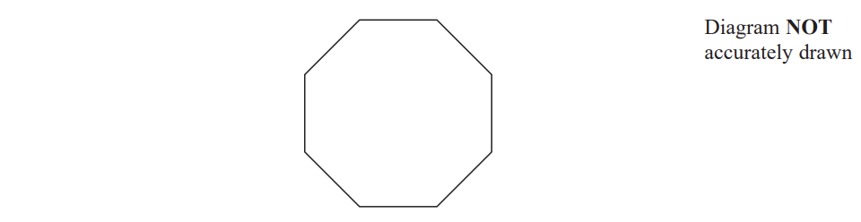
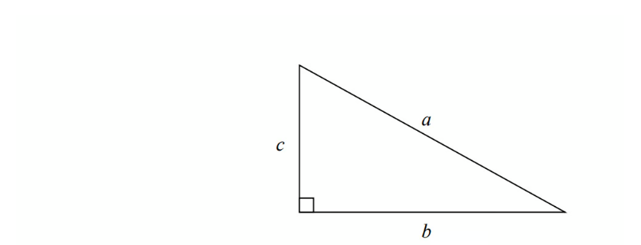
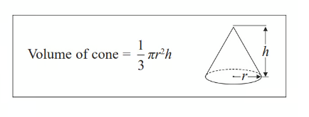
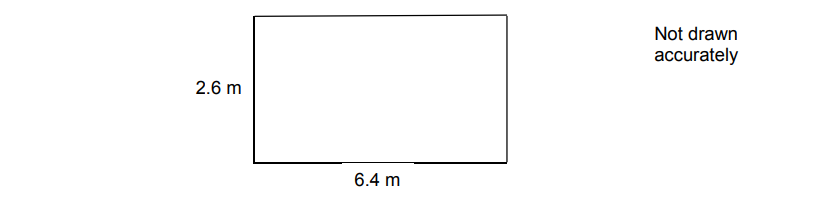

# Exam Questions — Rounding, Estimation & Bounds
**Number** · Edexcel IGCSE Maths A (Modular) (4XMAF/4XMAH) — 24/Higher Unit 1
> Source: [https://www.savemyexams.com/igcse/maths/edexcel/a-modular/24/higher-unit-1/topic-questions/number/rounding-estimation-and-bounds/exam-questions/](https://www.savemyexams.com/igcse/maths/edexcel/a-modular/24/higher-unit-1/topic-questions/number/rounding-estimation-and-bounds/exam-questions/) · 42 questions · total 146 marks

## Q1 — easy — 2 marks · exam-questions

### 2() — 2 marks — command: complete — structured — from paper 2015	Spec1 · 1MA1/3H
The length, $L$ cm, of a line is measured as 13 cm correct to the nearest centimetre.

Complete the following statement to show the range of possible values of $L$

................. ≤ $L$ < .................

## Q2 — easy — 2 marks · exam-questions

### 4() — 2 marks — command: write — structured — from paper Jan 2022 · 4MA1/2H
Each side of a regular octagon has a length of 18 mm, correct to the nearest 0.5 mm

i) Write down the lower bound of the length of each side of the octagon.

[1]

ii) Write down the upper bound of the length of each side of the octagon.

[1]

## Q3 — easy — 2 marks · exam-questions

### 11((a)) — 2 marks — command: write — structured — from paper Jan 2020 · 4MA1/1HR
The mass of a cat is 4.3 kg correct to 2 significant figures.

i) Write down the upper bound of the weight of the cat.

........................... kg [1]

ii) Write down the lower bound of the weight of the cat.

........................... kg [1]

## Q4 — easy — 2 marks · exam-questions

### 7() — 2 marks — command: write — structured — from paper Nov 2020 · 4MA1/2HR
The length of a book is 33.8 cm, correct to one decimal place.

i) Write down the lower bound of the length of the book.

.............................................. cm [1]

ii) Write down the upper bound of the length of the book.

.............................................. cm [1]

## Q5 — easy — 2 marks · exam-questions

### 5((a)) — 2 marks — command: write — structured — from paper Nov 2020 · 8300/3H
To the nearest 1000, there are 18 000 people at a festival.

i) Write down the minimum possible number of people at the festival.

[1]

ii) Write down the maximum possible number of people at the festival.

[1]

## Q6 — easy — 3 marks · exam-questions

### 3() — 3 marks — command: write — structured — from paper June 2018 · J560/06
Asha worked out `fraction numerator 326.8 space cross times open parentheses 6.94 space minus space 3.4 close parentheses over denominator 59.4 end fraction`

She got an answer of 19.5, correct to 3 significant figures.

Write each number correct to 1 significant figure to decide if Asha’s answer is reasonable.

## Q7 — medium — 4 marks · exam-questions

### 19((a)) — 1 mark — command: write — structured — from paper 2015	November · 1MA0/2H
The value of $p$ is 4.3 
The value of $q$ is 0.4

Both $p$ and $q$ are given correct to the nearest $0.1$

Write down the lower bound for $p$.

### 19((b)) — 3 marks — command: work_out — structured — from paper 2015	November · 1MA0/2H
$r=p+\frac{1}{q}$

Work out the upper bound for $r$. 
You must show all your working.

## Q8 — medium — 3 marks · exam-questions

### 21() — 3 marks — command: work_out — structured — from paper 2016	June · 1MA0/2H
$I=5(v---u)$

$v=14\mathrm{correct} \mathrm{to}2\mathrm{significant} \mathrm{figures}\,u=8.7\mathrm{correct} \mathrm{to}2\mathrm{significant} \mathrm{figures}$

Work out the upper bound for the value of $I$. 
You must show your working.

## Q9 — medium — 3 marks · exam-questions

### 22() — 3 marks — command: show — structured — from paper 2017	June · 1MA0/2H
$a=\frac{v-u}{t}$

`table row cell v space end cell equals cell space 37.6 space correct space to space 3 space significant space figures. end cell row cell u space end cell equals cell space 11.3 space correct space to space 3 space significant space figures. end cell row cell t space end cell equals cell space 8.4 space correct space to space 2 space significant space figures. end cell end table`

Work out the upper bound for the value of $a$. 
Show your working clearly.

## Q10 — medium — 3 marks · exam-questions

### 22() — 3 marks — command: work_out — structured — from paper 2015	Spec1 · 1MA1/2H
$D=\frac{x}{y}$

$x=99.7\mathrm{correct} \mathrm{to}1\mathrm{decimal} \mathrm{place}.\,y=67\mathrm{correct} \mathrm{to}2\mathrm{significant} \mathrm{figures}.$

Work out an upper bound for $D$.

## Q11 — medium — 2 marks · exam-questions

### 5() — 2 marks — command: estimate — structured — from paper 2016	June · 1MA0/1H
There are $892$litres of oil in Mr Aston's oil tank. 
He uses $18.7$litres of oil each day.

**Estimate** the number of days it will take him to use all the oil in the tank.

## Q12 — medium — 3 marks · exam-questions

### 5() — 3 marks — command: work_out — structured — from paper 2012	November · 1MA0/1H
Work out an estimate for $\frac{31\times9.87}{0.509}$

## Q13 — medium — 3 marks · exam-questions

### 8((a)) — 2 marks — command: work_out — structured — from paper June 2019 · 1MA1/1H
Work out an estimate for the value of  $\sqrt{63.5\times101.7}$.

### 8((c)) — 1 mark — command: show — structured — from paper June 2019 · 1MA1/1H
Show that $5^{-2}=\frac{1}{25}$

## Q14 — medium — 3 marks · exam-questions

### 19() — 3 marks — command: show — structured — from paper Jan 2021 · 4MA1/1HR
$k=\frac{t}{a-h}$

$t$= 14 correct to 2 significant figures 
$a$ = 7.8 correct to 2 significant figures 
$h$ = 3.4 correct to 2 significant figures

Work out the lower bound for the value of $k$. 
Show your working clearly.

## Q15 — medium — 2 marks · exam-questions

### 8() — 2 marks — command: verify — structured — from paper Nov 2020 · 4MA1/2HR
Nav has worked out $\frac{68.3\times42.8}{0.021}$ on his calculator.

His answer is $139201.9048$

Without using a calculator and using suitable approximations, check that his answer is sensible. 
Show your working clearly.

## Q16 — medium — 4 marks · exam-questions

### 20((a)) — 2 marks — command: show — structured — from paper Jan 2019 · 4MA1/2HR
$P=ef$

`table row cell e space end cell equals cell space 4.8 space correct space to space 2 space significant space figures. space end cell row cell f space end cell equals cell space 0.26 space correct space to space 2 space significant space figures. end cell end table`

Work out the lower bound for the value of $P$. 
Show your working clearly. 
Give your answer correct to $3$ significant figures.

### 20((b)) — 2 marks — command: show — structured — from paper Jan 2019 · 4MA1/2HR
$Q=\frac{t}{w}$
 `table row cell t space end cell equals cell space 2.73 space correct space to space 3 space significant space figures. space end cell row cell w space end cell equals cell space 0.04 space correct space to space 1 space significant space figure. end cell end table`

Work out the upper bound for the value of $Q$. 
Show your working clearly. 
Give your answer correct to $2$ significant figures.

[2]

## Q17 — medium — 3 marks · exam-questions

### 6() — 3 marks — command: work_out — structured — from paper June 2019 · 8300/3H
To the nearest pound, Jon has £9

To the nearest 50p, Ellie has £6.50

Work out the maximum possible total amount of money.

£........................................

## Q18 — hard — 4 marks · exam-questions

### 23() — 4 marks — command: calculate — structured — from paper 2013	June · 1MA0/2H
Dan does an experiment to find the value of $π.$
He measures the circumference and the diameter of a circle.

He measures the circumference, $C,$ as $170$ mm to the nearest millimetre. 
He measures the diameter, $d,$ as $54$ mm to the nearest millimetre.

Dan uses $π=\frac{C}{d}$ to find the value of $π$. 
Calculate the upper bound and the lower bound for Dan's value of $π.$

## Q19 — hard — 4 marks · exam-questions

### 24() — 4 marks — command: calculate — structured — from paper 2015	June · 1MA0/2H
Steve travelled from Ashton to Barnfield.

He travelled $235$miles, correct to the nearest $5$ miles.    
The journey took him $200$ minutes, correct to the nearest $5$ minutes.

Calculate the lower bound for the average speed of the journey.
Give your answer in **miles per hour**, correct to $3$ significant figures.    
You must show all your working.

## Q20 — hard — 3 marks · exam-questions

### 20() — 3 marks — command: calculate — structured — from paper 2016	November · 1MA0/2H
Jarek uses the formula

$\mathrm{Area}=\frac{1}{2}ab\mathrm{sin}C$

to work out the area of a triangle.

For this triangle,

$a=7.8\mathrm{cm} \mathrm{correct} \mathrm{to} \mathrm{the} \mathrm{nearest} \mathrm{mm}.\,b=5.2\mathrm{cm} \mathrm{correct} \mathrm{to} \mathrm{the} \mathrm{nearest} \mathrm{mm}.\,C=63^{\circ}\mathrm{correct} \mathrm{to} \mathrm{the} \mathrm{nearest} \mathrm{degree}.$

Calculate the lower bound for the area of the triangle.

## Q21 — hard — 4 marks · exam-questions

### 17() — 4 marks — command: calculate — structured — from paper 2015	Spec2 · 1MA1/2H

$a$ is 8.3 cm correct to the nearest mm 
$b$ is 6.1 cm correct to the nearest mm

Calculate the upper bound for $c$. 
You must show your working.

## Q22 — hard — 5 marks · exam-questions

### 17((a)) — 4 marks — command: show — structured — from paper 2017	June · 1MA1/3H
A train travelled along a track in 110 minutes, correct to the nearest 5 minutes.

Jake finds out that the track is 270 km long. 
He assumes that the track has been measured correct to the nearest 10 km.

Could the average speed of the train have been greater than 160 km/h? 
You must show how you get your answer.

### 17((b)) — 1 mark — command: explain — structured — from paper 2017	June · 1MA1/3H
Jake's assumption was wrong. 
The track was measured correct to the nearest 5 km.

Explain how this could affect your decision in part (a).

## Q23 — hard — 3 marks · exam-questions

### 16() — 3 marks — command: show — structured — from paper 2017	November · 1MA1/3H
The petrol consumption of a car, in litres per 100 kilometres, is given by the formula

$\mathrm{Petrol} \mathrm{consumption}=\frac{100\times\mathrm{Number} \mathrm{of} \mathrm{litres} \mathrm{of} \mathrm{petrol} \mathrm{used}}{\mathrm{Number} \mathrm{of} \mathrm{kilometres} \mathrm{travelled}}$

Nathan's car travelled 148 kilometres, correct to 3 significant figures. The car used 11.8 litres of petrol, correct to 3 significant figures.

Nathan says,

"My car used less than 8 litres of petrol per 100 kilometres."

Could Nathan be wrong? 
You must show how you get your answer.

## Q24 — hard — 4 marks · exam-questions

### 15((a)) — 3 marks — command: work_out — structured — from paper 2017	June · 1MA1/1H
A cone has a volume of 98 cm3. 
The radius of the cone is 5.13 cm.

Work out an estimate for the height of the cone.

### 15((b)) — 1 mark — command: give — structured — from paper 2017	June · 1MA1/1H
John uses a calculator to work out the height of the cone to 2 decimal places.

Will your estimate be more than John's answer or less than John's answer? 
Give reasons for your answer.

## Q25 — hard — 3 marks · exam-questions

### 8() — 3 marks — command: work_out — structured — from paper 2015	Spec2 · 1MA1/1H
Work out an estimate for $\sqrt{4.98+2.16\times7.35}$

## Q26 — hard — 3 marks · exam-questions

### 8() — 3 marks — command: work_out — structured — from paper 2013	June · 1MA0/1H
Margaret has some goats. 
The goats produce an average total of 21.7 litres of milk per day for 280 days. 
Margaret sells the milk in $\frac{1}{2}$ litre bottles.

Work out an estimate for the total number of bottles that Margaret will be able to fill with the milk. 
You must show clearly how you got your estimate.

## Q27 — hard — 4 marks · exam-questions

### 13() — 4 marks — command: work_out — structured — from paper 2014	June · 1MA0/1H
| **Competition ** a prize every 2014 seconds |
|---|

In a competition, a prize is won every 2014 seconds.

Work out an estimate for the number of prizes won in 24 hours. You must show your working.

## Q28 — hard — 5 marks · exam-questions

### 19((a)) — 3 marks — command: calculate — structured — from paper June 2019 · 1MA1/3H
$D=\frac{u^{2}}{2a}$

`table row cell u space end cell equals cell space 26.2 space correct space to space 3 space significant space figures space end cell row cell a space end cell equals cell space 4.3 space correct space to space 2 space significant space figures end cell end table`

Calculate the upper bound for the value of $D$. 
Give your answer correct to $6$ significant figures. 
You must show all your working.

### 19((b)) — 2 marks — command: give — structured — from paper June 2019 · 1MA1/3H
The lower bound for the value of $D$ is $78.6003$ correct to $6$ significant figures.

By considering bounds, write down the value of $D$ to a suitable degree of accuracy. 
You must give a reason for your answer.

## Q29 — hard — 4 marks · exam-questions

### 26() — 4 marks — command: show — structured — from paper Nov 2020 · 8300/2H
Edith’s van can safely carry a maximum load of 920 kilograms.

She wants to use her van to carry

30 sacks of potatoes, each of mass 25 kilograms to the nearest kilogram

and

20 sacks of carrots, each of mass 7.5 kilograms to 1 decimal place.

Can she definitely use her van safely in one journey?

You **must **show your working.

## Q30 — hard — 3 marks · exam-questions

### 19() — 3 marks — command: work_out — structured — from paper Nov 2018 · 8300/3H
The length of a roll of ribbon is 30 metres, correct to the nearest half-metre.

A piece of length 5.8 metres, correct to the nearest 10 centimetres, is cut from the roll.

Work out the maximum possible length of ribbon left on the roll.

...................metres

## Q31 — hard — 6 marks · exam-questions

### 12((b)) — 6 marks — command: calculate — structured — from paper Nov 2019 · J560/06
Claudine cycled a distance of 53 km in 2.7 hours. 
The distance is measured correct to the nearest km. 
The time is given correct to 1 decimal place.

Calculate the lower and upper bounds of her average speed.

Give your answers correct to 2 decimal places.

Lower bound = ................................ km/h     
    Upper bound = ..................................... km/h

## Q32 — hard — 4 marks · exam-questions

### 11() — 4 marks — command: show — structured — from paper June 2017 · J560/06
Sunil makes 7.5 litres of soup, correct to the nearest 0.5 litre. 
He serves the soup in 300 ml portions, correct to the nearest 10 ml. 24 people order this soup.

Does Sunil definitely have enough soup to serve the 24 people? Show how you decide.

## Q33 — hard — 4 marks · exam-questions

### 17() — 4 marks — command: work_out — structured — from paper Specimen paper · 4MA1/2H
A solid metal cube has sides of length 125 mm, correct to 3 significant figures.

The cube is melted down and the metal used to make solid spheres. 
The volume of each sphere is to be 140 cm³, correct to the nearest 10 cm³

Work out the greatest number of spheres that could be made from the metal. 
Show your working clearly

## Q34 — hard — 4 marks · exam-questions

### 25() — 4 marks — command: work_out — structured — from paper 2023 June · 4MA1/2H
A solid sphere has a radius of 2.8 centimetres, correct to 1 decimal place. 
The sphere has a mass of $Mπ$ grams, where $M=260$ correct to 2 significant figures.

Work out the upper bound for the density of the sphere.
Give your answer in g / cm3 correct to 2 decimal places. Show your working clearly.

## Q35 — hard — 3 marks · exam-questions

### 17() — 3 marks — command: show — structured — from paper 2023 Nov · 4MA1/2H
`P equals a open parentheses c plus y close parentheses`

$a=$8.3 correct to 2 significant figures

$c=$2  correct to 1 significant figure

$y=$15  correct to the nearest 5

Work out the upper bound for the value of $P$

Show your working clearly

## Q36 — very_hard — 5 marks · exam-questions

### 24() — 5 marks — command: show — structured — from paper 2013	March · 1MA0/2H
$m=\frac{\sqrt{s}}{t}$

$s=3.47\mathrm{correct} \mathrm{to}2\mathrm{decimal} \mathrm{places}\,t=8.132\mathrm{correct} \mathrm{to}3\mathrm{decimal} \mathrm{places}$

By considering bounds, work out the value of $m$ to a suitable degree of accuracy. 
You must show all your working and give a reason for your final answer.

## Q37 — very_hard — 4 marks · exam-questions

### 23() — 4 marks — command: show — structured — from paper 2014	November · 1MA0/2H
A road is 4530 m long, correct to the nearest 10 metres.   
Kirsty drove along the road in 205 seconds, correct to the nearest 5 seconds.

The average speed limit for the road is 80 km/h.

Could Kirsty's average speed have been greater than 80 km/h?    You must show your working.

## Q38 — very_hard — 5 marks · exam-questions

### 21() — 5 marks — command: show — structured — from paper 2018	June · 1MA1/2H
Jackson is trying to find the density, in g/cm3, of a block of wood. The block of wood is in the shape of a cuboid.

He measures    
the length as 13.2 cm, correct to the nearest mm    
the width as 16.0 cm, correct to the nearest mm    
the height as 21.7 cm, correct to the nearest mm

He measures the mass as 1970 g, correct to the nearest 5 g. 

By considering bounds, work out the density of the wood. 
Give your answer to a suitable degree of accuracy. 

You must show all your working and give a reason for your final answer.

## Q39 — very_hard — 4 marks · exam-questions

### 4((a)) — 3 marks — command: estimate — structured — from paper 2018	June · 1MA1/1H
A cycle race across America is 3069.25 miles in length.

Juan knows his average speed for his previous races is 15.12 miles per hour. 
For the next race across America he will cycle for 8 hours per day.

Estimate how many days Juan will take to complete the race.

### 4((b)) — 1 mark — command: how — structured — from paper 2018	June · 1MA1/1H
Juan trains for the race. 
The average speed he can cycle at increases. 
It is now 16.27 miles per hour.

How does this affect your answer to part (a)?

## Q40 — very_hard — 4 marks · exam-questions

### 11((a)) — 3 marks — command: work_out — structured — from paper 2015	Sample · 1MA1/1H
One uranium atom has a mass of $3.95\times10^{-22}$ grams.

Work out an estimate for the number of uranium atoms in 1 kg of uranium.

### 11((b)) — 1 mark — command: give — structured — from paper 2015	Sample · 1MA1/1H
Is your answer to (a) an underestimate or an overestimate?

Give a reason for your answer.

## Q41 — very_hard — 5 marks · exam-questions

### 25() — 5 marks — command: work_out — structured — from paper Nov 2017 · 8300/2H
The dimensions of a rectangular floor are to the nearest 0.1 metres.

A force of 345 Newtons is applied to the floor.
 The force is to the nearest 5 Newtons.

| $\mathrm{pressure}=\frac{\mathrm{force}}{\mathrm{area}}$ |
|---|

Work out the upper bound of the pressure. 
Give your answer to 4 significant figures. 
You **must** show your working.

........................N/m2 [5]

## Q42 — very_hard — 3 marks · exam-questions

### 16() — 3 marks — command: show — structured — from paper Nov 2018 · J560/06
A £1 coin weighs 8.75 g, correct to the nearest 0.01 g. Mitul weighs the contents of a large bag of £1 coins. The coins weigh 2.63 kg, correct to the nearest 10 g.

Mitul says

I am sure that the bag contains exactly £300 because, using bounds,
    2625 ÷ 8.755 = 299.8 to 1 decimal place.

Show that Mitul may not be correct.

[3]
