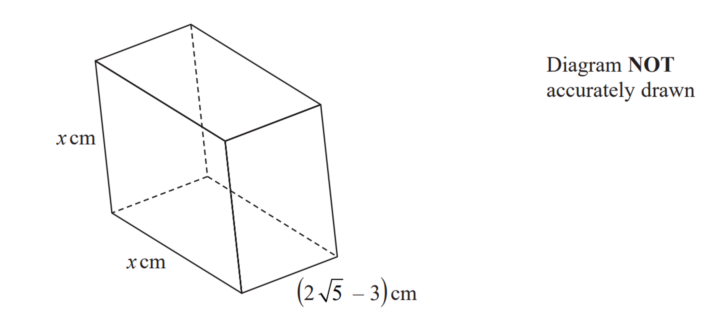

# Exam Questions — Surds
**Number** · Edexcel IGCSE Maths A (Modular) (4XMAF/4XMAH) — 24/Higher Unit 1
> Source: [https://www.savemyexams.com/igcse/maths/edexcel/a-modular/24/higher-unit-1/topic-questions/number/surds/exam-questions/](https://www.savemyexams.com/igcse/maths/edexcel/a-modular/24/higher-unit-1/topic-questions/number/surds/exam-questions/) · 34 questions · total 99 marks

## Q1 — very_hard — 4 marks · exam-questions

### 21() — 4 marks — command: show — structured — from paper 2017	June · 1MA0/1H
$a=\sqrt{8}+2$ 
$b=\sqrt{8}-2$ 
$T=a^{2}-b^{2}$

Show that $T=c\sqrt{2}$ stating the value of $c$

## Q2 — hard — 4 marks · exam-questions

### 26((a)) — 2 marks — command: show — structured — from paper 2012	November · 1MA0/1H
Show that $\frac{5}{\sqrt{2}}$ can be written as $\frac{5\sqrt{2}}{2}$

### 26((b)) — 2 marks — command: show — structured — from paper 2012	November · 1MA0/1H
Show that `open parentheses 2 plus square root of 3 close parentheses squared space minus space open parentheses 2 minus square root of 3 close parentheses squared space equals space 8 square root of 3`

## Q3 — medium — 4 marks · exam-questions

### 25((a)) — 2 marks — command: show — structured — from paper 2014	June · 1MA0/1H
Show that $\frac{12}{\sqrt{3}}$ can be rewritten as $4\sqrt{3}$

### 25((b)) — 2 marks — command: show — structured — from paper 2014	June · 1MA0/1H
Show that `open parentheses square root of 2 plus square root of 8 close parentheses squared equals 18`

## Q4 — very_hard — 3 marks · exam-questions

### 21() — 3 marks — command: show — structured — from paper 2017	November · 1MA1/1H
Show that  $\frac{6-\sqrt{8}}{\sqrt{2}-1}$  can be written in the form $a+b\sqrt{2}$  where $a$ and $b$ are integers.

## Q5 — hard — 2 marks · exam-questions

### 21() — 2 marks — command: show — structured — from paper 2014	November · 1MA0/1H
Show that `open parentheses 1 plus square root of 2 close parentheses open parentheses 3 minus square root of 2 close parentheses space equals space 1 plus 2 square root of 2`

## Q6 — medium — 2 marks · exam-questions

### 22((c)) — 2 marks — command: show — structured — from paper 2015	June · 1MA0/1H
Show that `open parentheses square root of 12 minus square root of 3 close parentheses squared space equals space 3`

## Q7 — very_hard — 3 marks · exam-questions

### 23() — 3 marks — command: show — structured — from paper 2015	Sample · 1MA1/1H
Show that $\frac{1}{1+\frac{1}{\sqrt{2}}}$ can be written as $2-\sqrt{2}$

## Q8 — hard — 2 marks · exam-questions

### 20((a)) — 1 mark — command: find — structured — from paper 2018	June · 1MA1/2H
Martin did this question.

| Rationalise the denominator of     $\frac{14}{2+\sqrt{3}}$ |
|---|

Here is how he answered the question.

`table row cell fraction numerator 14 over denominator 2 space plus space square root of 3 end fraction end cell equals cell fraction numerator 14 space cross times space open parentheses 2 minus space square root of 3 close parentheses over denominator open parentheses 2 space plus space square root of 3 close parentheses open parentheses 2 space minus space square root of 3 close parentheses end fraction end cell row blank blank blank row blank equals cell space fraction numerator 28 space minus space 14 square root of 3 over denominator 4 space plus space 2 square root of 3 space minus space 2 square root of 3 plus 3 end fraction end cell row blank equals cell space fraction numerator 28 space minus space 14 square root of 3 over denominator 7 end fraction end cell row blank equals cell space 4 minus space 2 square root of 3 end cell end table`

Martin's answer is wrong.

Find Martin's mistake.

### 20((b)) — 1 mark — command: find — structured — from paper 2018	June · 1MA1/2H
Sian did this question.

| Rationalise the denominator of    $\frac{5}{\sqrt{12}}$ |
|---|

Here is how she answered the question.

*      *`table row cell fraction numerator 5 over denominator square root of 12 end fraction space end cell equals cell space fraction numerator 5 square root of 12 over denominator square root of 12 space cross times square root of 12 end fraction end cell row blank blank blank row blank equals cell space fraction numerator 5 space cross times 3 square root of 2 over denominator 12 end fraction end cell row blank equals cell space fraction numerator 5 square root of 2 over denominator 4 end fraction end cell end table`

Sian's answer is wrong.

Find Sian's mistake.

## Q9 — medium — 2 marks · exam-questions

### 18() — 2 marks — command: show — structured — from paper 2015	November · 1MA0/1H
Show that $\frac{10}{\sqrt{5}}$ can be rewritten as $2\sqrt{5}$

## Q10 — very_hard — 3 marks · exam-questions

### 13() — 3 marks — command: show — structured — from paper Jan 2022 · 4MA1/2HR
`table attributes columnalign right center left columnspacing 0px end attributes row a equals cell square root of 8 plus 4 end cell row b equals cell square root of 8 minus 4 end cell end table`

$(a--b)(a+b)$ can be written in the form $y\sqrt{4y}$

Find the value of $y$ 
Show your working clearly.

## Q11 — hard — 3 marks · exam-questions

### 19() — 3 marks — command: simplify — structured — from paper 2015	Spec1 · 1MA1/1H
Simplify fully  `fraction numerator open parentheses 6 minus square root of 5 close parentheses open parentheses 6 plus square root of 5 close parentheses over denominator square root of 31 end fraction`

You must show your working.

## Q12 — medium — 2 marks · exam-questions

### 1() — 2 marks — command: show — structured
Show that $\frac{\sqrt{12}}{\sqrt{3+2}}$

can be written in the form $a\sqrt{b}$where $a$ is a simplified fraction and $b$ is an integer.

## Q13 — very_hard — 3 marks · exam-questions

### 19() — 3 marks — command: simplify — structured — from paper Jan 2019 · 4MA1/1H
Rationalise the denominator of $\frac{a+\sqrt{4b}}{a-\sqrt{4b}}$ where $a$ is an integer and $b$ is a prime number.

Simplify your answer.

## Q14 — hard — 3 marks · exam-questions

### 13() — 3 marks — command: show — structured — from paper 2018	June · 1MA1/1H
Show that `square root of 5 open parentheses square root of 8 plus square root of 18 close parentheses` can be written in the form $a\sqrt{10}$ and state the value of $a$. You must show your full working.

## Q15 — medium — 3 marks · exam-questions

### 17((a)) — 3 marks — command: show — structured — from paper Jan 2020 · 4MA1/1H
Show that `open parentheses 6 space plus 2 root index blank of 12 close parentheses squared space equals space 12 open parentheses 7 space plus space 4 square root of 3 close parentheses`

Show each stage of your working.

## Q16 — very_hard — 3 marks · exam-questions

### 15((b)) — 3 marks — command: show — structured — from paper Jan 2021 · 4MA1/1HR
Show that $\frac{2}{6-3\sqrt{2}}$ can be written in the form $\frac{a+\sqrt{a}}{b}$

where $a$ and $b$ are integers. 
Show your working clearly.

## Q17 — hard — 2 marks · exam-questions

### 14() — 2 marks — command: show — structured — from paper 2015	Spec2 · 1MA1/1H
Show that    `fraction numerator open parentheses 4 minus square root of 3 close parentheses open parentheses 4 plus square root of 3 close parentheses over denominator square root of 13 end fraction` simplifies to  $\sqrt{13}$.

## Q18 — medium — 3 marks · exam-questions

### 22() — 3 marks — command: show — structured — from paper June 2018 · 4MA1/2HR
Show that $\frac{\sqrt{20}+\sqrt{80}}{\sqrt{3}}$ can be expressed in the form $\sqrt{a}$ where $a$ is an integer.

Show your working clearly.

## Q19 — very_hard — 3 marks · exam-questions

### 17() — 3 marks — command: show — structured — from paper Nov 2021 · 4MA1/2H
Express $\frac{8}{\sqrt{5}-1}$ in the form $\sqrt{a}+b$ where a and b are integers.

Show each stage of your working clearly.

## Q20 — hard — 5 marks · exam-questions

### 18((a)) — 2 marks — command: show — structured — from paper June 2019 · 1MA1/1H
Show that $\sqrt{3}+\sqrt{12}$ can be rewritten as $3\sqrt{3}$

### 18((b)) — 3 marks — command: show — structured — from paper June 2019 · 1MA1/1H
Show that `open parentheses fraction numerator 1 over denominator square root of 3 end fraction close parentheses to the power of 7 space equals space fraction numerator square root of 3 over denominator 81 end fraction`

## Q21 — medium — 2 marks · exam-questions

### 21((a)) — 2 marks — command: show — structured — from paper June 2018 · 4MA1/2H
Show that $\sqrt{45}+\sqrt{20}=5\sqrt{5}$ 
Show your working clearly.

## Q22 — very_hard — 3 marks · exam-questions

### 20() — 3 marks — command: find — structured — from paper Jan 2020 · 4MA1/2H
The area of a rectangle is $18$ $\mathrm{cm}^{2}$

The length of the rectangle is `open parentheses square root of 7 space end root plus space 1 close parentheses` $\mathrm{cm}$.

Without using a calculator and showing each stage of your working, find the width of the rectangle.

Give your answer in the form $a\sqrt{b}+c$ where $a$, $b$ and $c$ are integers.

.....................$\mathrm{cm}$

## Q23 — hard — 3 marks · exam-questions

### 14((b)) — 3 marks — command: show — structured — from paper Specimen 2016 · 4MA1/2H
Rationalise the denominator of  $\frac{4}{7-\sqrt{5}}$

Show each stage of your working.

Give your answer in the form $a+b\sqrt{5}$ where $a$ and $b$ are fractions in their simplest forms.

## Q24 — medium — 2 marks · exam-questions

### 12((a)) — 2 marks — command: show — structured — from paper Specimen 2015 · J560/04
Without using a calculator, show that $\sqrt{20}=2\sqrt{5}$.

## Q25 — very_hard — 3 marks · exam-questions

### 16() — 3 marks — command: show — structured — from paper June 2019 · 4MA1/2H
Show that $\frac{4+\sqrt{8}}{\sqrt{2}-1}$can be written in the form $a+b\sqrt{2}$, where $a$ and $b$ are integers.

Show each stage of your working clearly and give the value of a and the value of $b$.

## Q26 — hard — 2 marks · exam-questions

### 13((b)) — 2 marks — command: express — structured — from paper Jan 2020 · 4MA1/1HR
Given that $y$ is a prime number,

express $\frac{3}{2-\sqrt{y}}$ in the form $\frac{a+b\sqrt{y}}{c-y}$ where $a$ , $b$ and $c$are integers.

## Q27 — very_hard — 4 marks · exam-questions

### 15() — 4 marks — command: show — structured — from paper Nov 2017 · J560/04
Show that `fraction numerator open parentheses 4 space plus space 2 square root of 5 close parentheses over denominator square root of 5 space minus space 1 end fraction` can be simplified to $\frac{3\sqrt{5}+7}{2}$

## Q28 — hard — 3 marks · exam-questions

### 22() — 3 marks — command: simplify — structured — from paper Nov 2020 · 4MA1/1H
Without using a calculator, rationalise the denominator of $\frac{6}{3-\sqrt{7}}$

Simplify your answer. 
You must show each stage of your working.

## Q29 — very_hard — 4 marks · exam-questions

### 23() — 4 marks — command: show — structured — from paper 2023 June · 4MA1/2H
The diagram shows a cuboid with a square cross section.

The volume of the cuboid is `open parentheses 13 plus 6 square root of 5 close parentheses`cm3

Without using a calculator, find the value of $x$
Give your answer in the form $a+\sqrt{b}$ where $a$ and $b$ are integers. 
Show your working clearly

## Q30 — hard — 3 marks · exam-questions

### 21() — 3 marks — command: show — structured — from paper Jan 2019 · 4MA1/1HR
Show that  $\frac{\sqrt{8}}{\sqrt{8}-2}$ can be written in the form $n+\sqrt{n}$ , where $n$ is an integer.

Show your working clearly.

## Q31 — hard — 2 marks · exam-questions

### 21((b)) — 2 marks — command: show — structured — from paper June 2018 · 4MA1/2H
Express $\frac{2}{\sqrt{3}-1}$ in the form $p+\sqrt{q}$

where $p$ and $q$ are integers. 
Show your working clearly.

## Q32 — hard — 3 marks · exam-questions

### 22() — 3 marks — command: show — structured — from paper June 2019 · 8300/2H
Show that  `open parentheses 5 square root of 3 minus square root of 12 close parentheses squared`  simplifies to an integer.

## Q33 — hard — 3 marks · exam-questions

### 14((b)) — 3 marks — command: show — structured — from paper Specimen paper · 4MA1/2H
Rationalise the denominator of  $\frac{4}{7-\sqrt{5}}$

Show each stage of your working.

Give your answer in the form $a+b\sqrt{5}$ where $a$ and $b$ are fractions in their simplest forms.

## Q34 — hard — 3 marks · exam-questions

### 15((b)) — 3 marks — command: show — structured — from paper 2023 Nov · 4MA1/2H
Express $\frac{\sqrt{125}+\sqrt{80}}{\sqrt{3}}$ in the form $\sqrt{n}$ where $n$ is an integer.
Show your working clearly.
