# Mark Schemes — Area & Perimeter
**Shape, Space & Measure** · Edexcel IGCSE Maths A (Modular) (4XMAF/4XMAH) — 24/Higher Unit 1

## Q1 — easy — 4 marks · exam-questions

### 2() — 4 marks
> **[exam-tip]**
> When using $π$ in calculations it is helpful to use exact values, working in terms of $π$ throughout until the final answer is evaluated.
> 
> This ensures that the final answers is accurate.

> *Calculate the area of the circle using *$πr^{2}$

$π\times8.5^{2}=72.25π$

**[M1]**

> *Substitute known values into the formula for the area of a trapezium,*`1 half open parentheses a plus b close parentheses h`

`1 half open parentheses 20 plus 25 close parentheses h`

**[M1]**

> *Form an equation by, equating the expression for the area of the trapezium to the area of the circle, and solve to find the value of *$h$

`1 half open parentheses 20 plus 25 close parentheses h equals 72.25 pi`

> *Simplify*

`table row cell 1 half cross times 45 cross times h end cell equals cell 72.25 pi end cell row cell 22.5 h end cell equals cell 72.25 pi end cell end table`

> *Solve to find the value of *$h$

$h=\frac{72.25π}{22.5}\,h=10.088...$

**[M1]**

> *Round the value of *$h$* to 1 decimal place as stated in the question*

$h=10.1$

**[A1]**

## Q2 — very_hard — 4 marks · exam-questions

### 20() — 4 marks
> *Method 1:*

> *Calculate the area of the square **ABCD**.*

$4x\times4x=16x^{2}$

**[1]**

> *Calculate the area of the triangle **ABN, **using *$A=\frac{1}{2}bh$*, where *$b$* is the base of the triangle and *$h$* is its perpendicular height.*

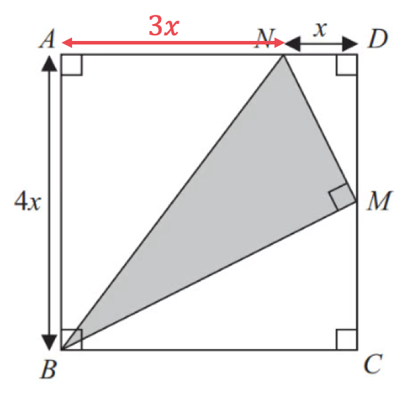

$A=\frac{1}{2}\times4x\times3x$

**[1]**

> *Simplify.*

$A=6x^{2}$

> *Calculate the area of the triangle **BMC**.*

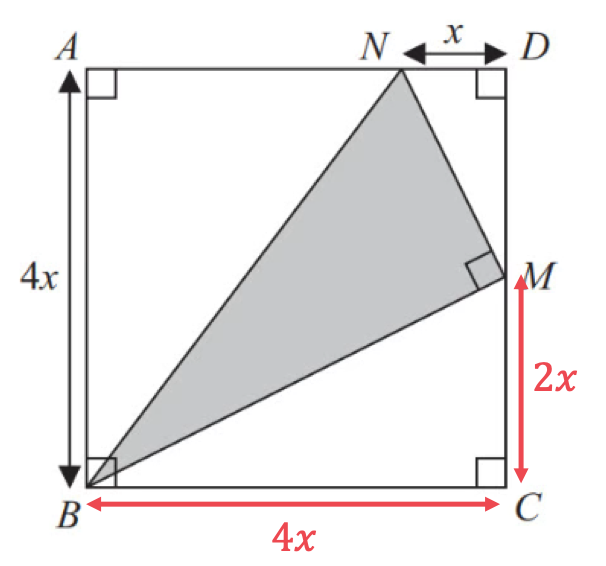

$A=\frac{1}{2}\times4x\times2x$

> *Simplify.*

$A=4x^{2}$

> *Calculate the area of the triangle **MND**.*

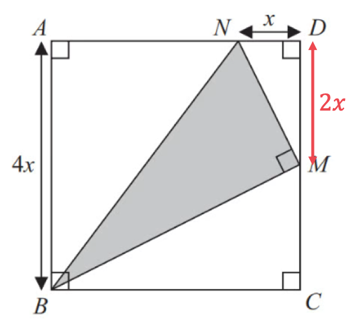

$A=\frac{1}{2}\timesx\times2x$

> *Simplify.*

$A=x^{2}$

> *Find the area of the shaded triangle **BNM** by subtracting the area of triangles **BMC **and** ABN **from the area of the square** ABCD.*

$16x^{2}-6x^{2}-4x^{2}-x^{2}$

**[1]**

> *Simplify.*

$5x^{2}$* ***[1]**

** **

> *Method 2:*

> *Calculate the length **NM** on the right-angled triangle **NDM**, using Pythagoras' theorem, *$a^{2}+b^{2}=c^{2}$*.*

> *Substitute the given values into the formula.*

> `x squared plus open parentheses 2 x close parentheses squared equals N M squared`* *

> *Simplify.*

`table attributes columnalign right center left columnspacing 0px end attributes row cell x squared plus 4 x squared end cell equals cell N M squared end cell row cell 5 x squared end cell equals cell N M squared end cell end table`

> *Take the square root of both sides.*

$\sqrt{5}x=NM$

**[1]**

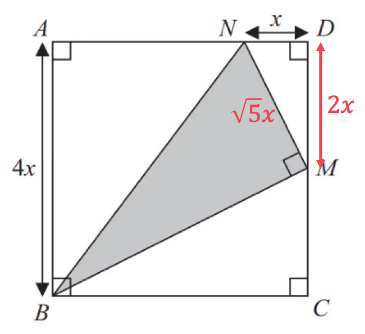

> *Calculate the length **BM** on the right-angled triangle **BMC.*

> *Substitute the given values into Pythagoras' theorem.*

> `open parentheses 2 x close parentheses squared plus open parentheses 4 x close parentheses squared equals B M squared`* *

> *Simplify.*

`table attributes columnalign right center left columnspacing 0px end attributes row cell 4 x squared plus 16 x squared end cell equals cell B M squared end cell row cell 20 x squared end cell equals cell B M squared end cell end table`

> *Take the square root of both sides.*

$\sqrt{20}x=BM$

**[1]**

> *Simplify.*

$2\sqrt{5}x=BM$

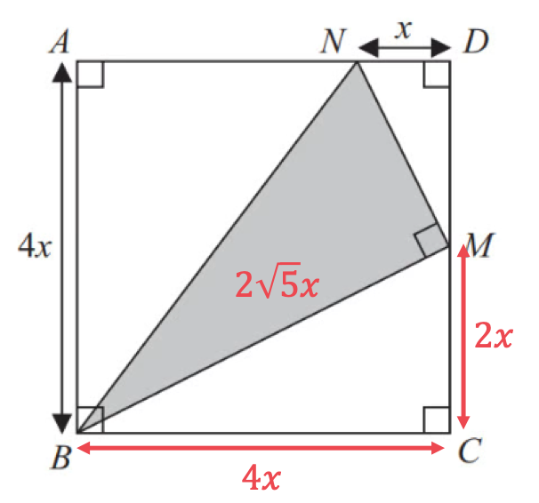

> *Calculate the area of the triangle **BNM**, using *$A=\frac{1}{2}bh$*, where *$b$* is the base of the triangle and *$h$* is its perpendicular height.*

$A=\frac{1}{2}\times2\sqrt{5}x\times\sqrt{5}x$

**[1]**

> *Simplify.*

$5x^{2}$* ***[1]**

## Q3 — very_hard — 4 marks · exam-questions

### 20() — 4 marks
> *The formula for a triangle is *$A=\frac{1}{2}ab\mathrm{sin}C$* where **a **and **b **are the lengths of two sides that form angle **C**.** *
*Let **x** denote the length **PQ**. Triangle **PQR** is an equilateral triangle so all the lengths are equal and all the angles are 60°. Find the area by substituting **a** = **x**, **b** = **x **and **C** = 60. Simplify the expression,*

`table row cell Area space of space P Q R end cell equals cell 1 half cross times x cross times x cross times sin open parentheses 60 close parentheses end cell row blank equals cell 1 half cross times x cross times x cross times fraction numerator square root of 3 over denominator 2 end fraction end cell row blank equals cell fraction numerator square root of 3 over denominator 4 end fraction x squared end cell end table`

**[1]**

> *The length **PQ** = 1.5**x**. A regular hexagon is made up of 6 equilateral triangles. *
*Find the area of the hexagon by finding substituting **a** = 1.5**x**, **b** = 1.5**x** and **C** = 60 into the formula and multiplying by 6.*

`table row cell Area space of space A B C D E F end cell equals cell 1 half cross times 1.5 x cross times 1.5 x cross times sin open parentheses 60 close parentheses cross times 6 end cell row blank equals cell 1 half cross times 1.5 x cross times 1.5 x cross times fraction numerator square root of 3 over denominator 2 end fraction cross times 6 end cell row blank equals cell fraction numerator 27 square root of 3 over denominator 8 end fraction x squared end cell end table`

**[1]**

> *Form an equation using the fact that the difference between the area of the triangle and the hexagon is equal to *$72\sqrt{3}$* cm**2**.*

`table row cell fraction numerator 27 square root of 3 over denominator 8 end fraction x squared minus fraction numerator square root of 3 over denominator 4 end fraction x squared end cell equals cell 72 square root of 3 end cell end table`

**[1]**

> *Divide both sides √3 and multiply both sides by 8. Then solve the equation to find **x **(which is a positive value so you can ignore the negative square root).*

`table row cell 27 x squared minus 2 x squared end cell equals 576 row cell 25 x squared end cell equals 576 row cell x squared end cell equals cell 576 over 25 end cell row x equals cell square root of 576 over 25 end root end cell row x equals cell 24 over 5 end cell end table`

**The length of ****PQ**** is 4.8 cm ****[1]**

## Q4 — medium — 4 marks · exam-questions

### 7() — 4 marks
> *Split the field into two rectangles, label them 1 and 2. Find the length of rectangle 2.*

*Length of rectangle 2 = 16 - 7 = 9 m*

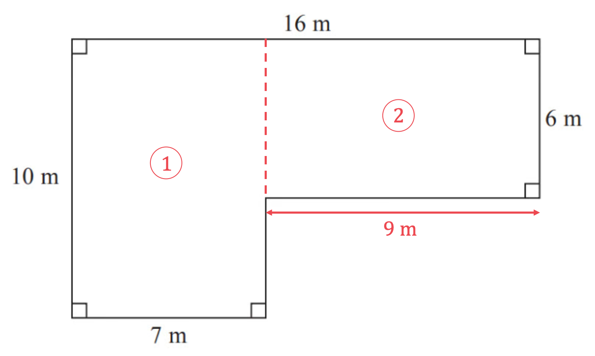

> *Calculate the area of each of the rectangles.*

`table row cell A subscript 1 end cell equals cell 7 cross times 10 equals 70 space straight m squared end cell row cell A subscript 2 end cell equals cell 9 cross times 6 equals 54 space straight m squared end cell end table`

**At least one correct area**** [1]**

> *Add the areas together to find the total area of the field.*

`table row A equals cell 70 plus 54 equals 124 space straight m squared end cell end table`

**[1]**

> *Calculate the number of pigs that could be kept in the field by dividing the total area of the field by the space required per pig.*

$124\div36=3.4444...$

**[1]**

> *Round down.*

**3 pigs*** ***[1]**

## Q5 — very_hard — 5 marks · exam-questions

### 10() — 5 marks
> *Split the shape into a rectangle and two identical triangles.*

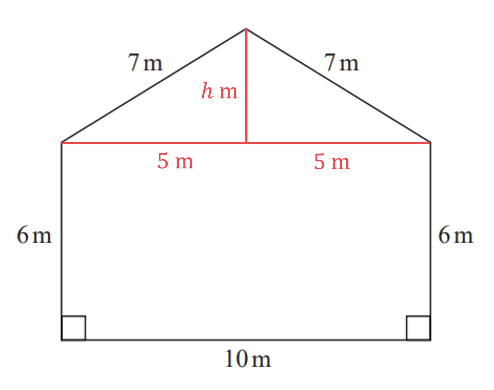

> *Find the area of the rectangle by multiplying the lengths of the two perpendicular sides.*

`table row cell Area space of space rectangle end cell equals cell 10 cross times 6 end cell row blank equals cell 60 space straight m squared end cell end table`

> *The length of the base of the triangle is 5 m. The triangle is right angled therefore the perpendicular height can be found using Pythagoras' theorem.*

`table attributes columnalign right center left columnspacing 0px end attributes row cell h squared plus 5 squared end cell equals cell 7 squared end cell row cell h squared end cell equals cell 7 squared minus 5 squared end cell row h equals cell square root of 7 squared minus 5 squared end root end cell row h equals cell square root of 24 end cell end table`

**Correct Pythagoras equation**** [1] **
**Correct height**** [1]**

> *Find the area of the triangle by using the formula *$A=\frac{1}{2}bh$* where **b** and **h** are the lengths of the base and the perpendicular height.*

`table row cell Area space of space triangle end cell equals cell 1 half cross times 5 cross times square root of 24 end cell row blank equals cell 5 square root of 6 space straight m squared end cell end table`

> *Add the areas together.*

`table row cell Total space area end cell equals cell 60 plus 5 square root of 6 plus 5 square root of 6 end cell row blank equals cell 84.494897... space straight m squared end cell end table`

**[1]**

> *Divide the total area by 16 to find out how many tins are needed.*

$84.494897...\div16=5.280931...$

**[1]**

> *Round up to the next integer as more than 5 tins are needed.*

**6 tins** **[1]**

## Q6 — medium — 2 marks · exam-questions

### 3() — 2 marks
> *Calculate the area of the trapezium using: *`A equals 1 half open parentheses a plus b close parentheses h`*, where *$a$* and *$b$* are the lengths of the parallel sides and *$h$* is the perpendicular height of the trapezium.*

`table row A equals cell 1 half cross times open parentheses 2 plus 7 close parentheses cross times 4 end cell row blank equals cell 18 space cm squared end cell end table`

**[1]**

> *Draw a triangle with an area of 18 cm**2**.*

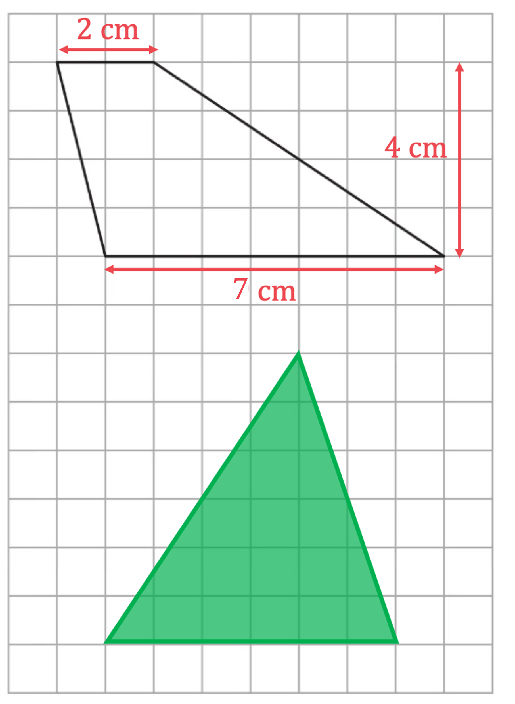

**Any triangle drawn that has an area of 18 cm****2**** [1]**

**There are multiple triangles that could be drawn with the correct area.**

## Q7 — very_hard — 4 marks · exam-questions

### 8() — 4 marks
> *The formula for the area of a triangle is *$A=\frac{1}{2}bh$* where **b** and **h **are the lengths of the base and the perpendicular height. Substitute **A** = 12 and **b** = 5** **into the formula and solve for **h**.*

`table row 12 equals cell 1 half cross times 5 cross times h end cell row cell fraction numerator 12 cross times 2 over denominator 5 end fraction end cell equals h row cell 4.8 end cell equals h end table`

**[1]**

> *Split the triangle into two identical triangles using the perpendicular height. *
*You can use Pythagoras' theorem on one of the triangles to find the hypotenuse.*

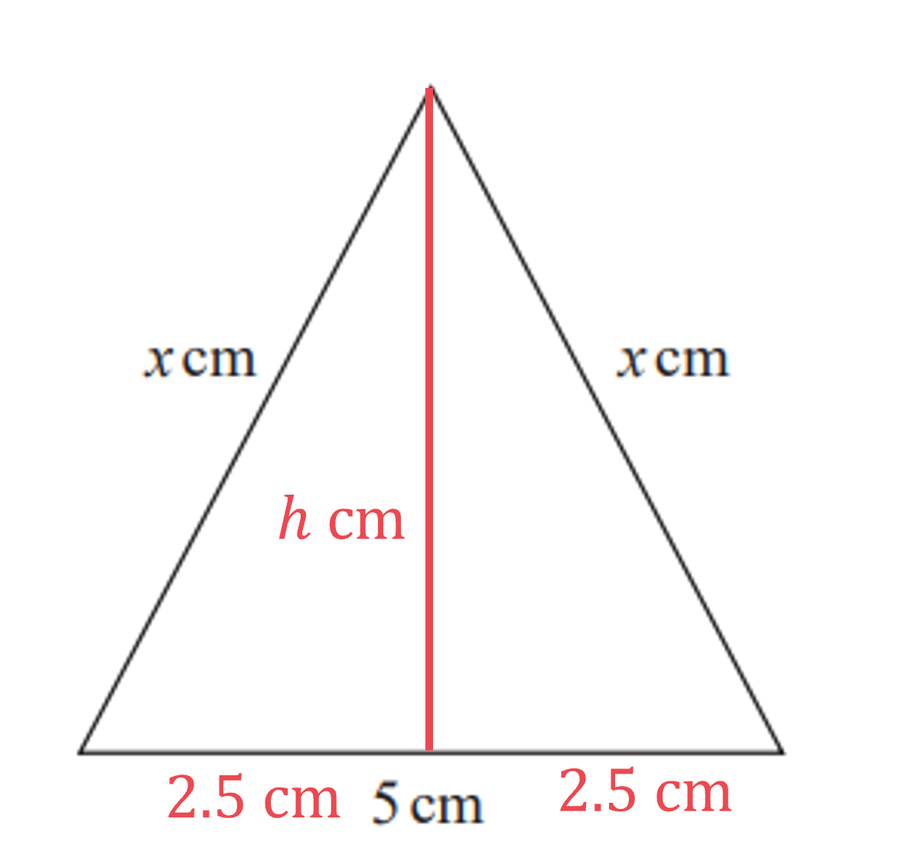

`table row cell x squared end cell equals cell 2.5 squared plus 4.8 squared end cell row x equals cell square root of 2.5 squared plus 4.8 squared end root end cell row x equals cell 5.412023... end cell end table`

**[1]**

> *Find the perimeter by adding together the lengths of all three sides.*

$2\times5.412023...+5=15.824047...$

**[1]**

> *Round to 3 significant figures.*

$x=15.8(3sf)$ **[1]**

## Q8 — medium — 4 marks · exam-questions

### 1() — 4 marks
> *Calculate the area of the trapezium using: *`A equals 1 half open parentheses a plus b close parentheses h`*, where *$a$* and *$b$* are the lengths of the parallel sides and *$h$* is the perpendicular height of the trapezium.*

`table row A equals cell 1 half cross times open parentheses 28 plus 12 close parentheses cross times 14 end cell row blank equals cell 280 space cm squared end cell end table`

**[1]**

> *Divide the length of the base of the trapezium by 4 to find the radius of the semi-circles.*

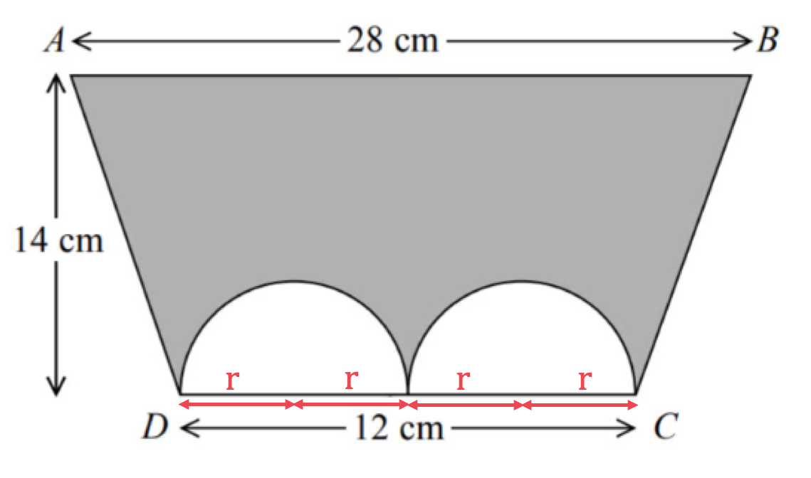

`table row r equals cell 12 divided by 4 end cell row r equals cell 3 space cm end cell end table`

**[1]**

> *Calculate the area of a circle (two semi-circles) using: *$A=πr^{2}$*.*

`A equals straight pi open parentheses 3 close parentheses squared
A equals 9 straight pi`

> *Calculate the area that is shaded by subtracting the area of the circle from the area of the trapezium.*

`table row A equals cell 280 minus 9 straight pi end cell end table`

**[1]**

`table row A equals cell 251.725666... end cell end table`

> *Round the answer to 3 significant figures.*

$252\mathrm{cm}^{2}$**[1]**

## Q9 — very_hard — 5 marks · exam-questions

### 5() — 5 marks
*Call the longer length of the tile **x** and the smaller length **y**.* 
*4 long lengths and one short length make up the length of 123 cm.* 
*2 long lengths and one short length make up the length of 67 cm.* 
*Form two equations with this information.*

`table attributes columnalign right center left columnspacing 0px end attributes row cell 4 x plus y end cell equals 123 row cell 2 x plus y end cell equals 67 end table`

**[1]**

> *Subtract the equations to eliminate the **y** variable. Then solve for **x**.*

`stack attributes charalign center stackalign right end attributes row 4 x plus up diagonal strike y equals 123 none end row row minus left parenthesis 2 x plus up diagonal strike y equals none 67 right parenthesis end row horizontal line row 2 x none none equals none 56 none end row none row x none none equals none 28 none end row end stack space`

**[1]**

> *Substitute the value of **x** back into one of the equations to find **y**.*

`table row cell 4 open parentheses 28 close parentheses plus y end cell equals 123 row cell 112 plus y end cell equals 123 row y equals 11 end table`

**[1]**

> *The area of the shaded bit can be found by finding the area of the whole rectangle and subtracting the area of 12 tiles.*

$123\times67-12\times28\times11=4545$

**[1]**

> *Include the units for the area.*

**Area is**** 4545 cm****2** **[1]**

## Q10 — medium — 7 marks · exam-questions

### 5((a)) — 5 marks
> *Calculate the area of the trapezium using: *`A equals 1 half open parentheses a plus b close parentheses h`*, where *$a$* and *$b$* are the lengths of the parallel edges and *$h$* is the perpendicular height.*

`table row A equals cell 1 half cross times open parentheses 1.8 plus 2.7 close parentheses cross times 0.8 end cell row blank equals cell 1.8 space straight m squared end cell end table`

**[1]**

> *Convert the lengths of the tile from cm to m by dividing by 100.*

`table attributes columnalign right center left columnspacing 0px end attributes row blank blank cell 15 over 100 end cell end table equals 0.15
table attributes columnalign right center left columnspacing 0px end attributes row blank blank cell fraction numerator 7.5 over denominator 100 end fraction end cell end table equals 0.075`

**[1]**

> *Calculate the area of a single tile in m**2**.*

`table row A equals cell 0.15 cross times 0.075 end cell row blank equals cell 0.01125 space straight m squared space end cell end table`

> *Calculate the number of tiles required by dividing the total area of the wall by the area of an individual tile.*

$\frac{1.8}{0.01125}=160$

**[1]**

> *Calculate the number of packs of tiles required by dividing the number of individual tiles required by the number in each pack.*

$\frac{160}{9}=17.777777...$

**[1]**

> *Round to the next pack up to make sure Karen has enough tiles.*

**18 packs**** ****[1]**

### 5((b)) — 2 marks
> *Look at the percentages in terms of packs.*

> *Calculate the new number of packs required by dividing the number of packs calculated in part (a) by 100 and multiplying by 10, then adding them to the original number of packs required.*

$\frac{18}{100}\times10+180=19.8$

**[1]**

*Karen must buy 20 packs*

> *Look at the number of individual tiles required.*

> *Calculate the new number individual tiles required by dividing the number of tiles calculated in part (a) by 100 and multiplying by 10, then adding them to the original number of individual tiles required.*

$\frac{160}{100}\times10+160=176$

> *Divide the new number of individual tiles by the number in a pack to find the new number of packs required.*

$\frac{176}{9}=19.555555...$* Karen must buy 20 packs*

**Yes Karen's assumption is correct as she must buy two more packs ****[1]**

## Q11 — very_hard — 4 marks · exam-questions

### 2() — 4 marks
> *Calculate the area of the circle, using *$A=πr^{2}$*.*

`table row cell A subscript S C end subscript end cell equals cell space pi open parentheses 8.5 close parentheses squared end cell row blank equals cell space 72.25 pi space space cm squared end cell end table`

**[1]**

> *It is best to leave the area of the circle in terms of π for accuracy.*

> *FInd an expression for the area of the trapezium, using the formula: *`A equals 1 half open parentheses a plus b close parentheses h`*, where *$a$* and *$b$* are the lengths of the parallel sides and *$h$*is the perpendicular height.*

`table row A equals cell 1 half open parentheses 20 space plus space 25 close parentheses cross times h end cell row blank equals cell 22.5 h space cm squared end cell end table`

**[1]**

> *Form an equation by setting the expression for the area of the trapezium equal to the area of the circle.*

$22.5h=72.25π$

> *Rearrange and solve for **h**.*

`table row cell h space end cell equals cell space 72.25 straight pi space divided by space 22.5 space equals space 10.088... end cell end table`

**[1]**

> *Round to 1 decimal place.*

**h**** = 10.1 cm**** [1]**

## Q12 — medium — 4 marks · exam-questions

### 8() — 4 marks
> *The shaded area is formed by a rectangle with a semi-circle removed.*

> *Calculate the area of the rectangle **ABCD.*

$19\times16=304\mathrm{cm}^{2}$

> *Calculate the radius of the circle by dividing the height of the rectangle by 2.*

$\frac{16}{2}=8\mathrm{cm}$

> *Calculate the area of the circle, using: *$A=πr^{2}$*.*

`table row A equals cell straight pi cross times open parentheses 8 close parentheses squared end cell row blank equals cell 64 straight pi space cm squared end cell end table`

**Correct process to find EITHER the area of the rectangle OR the area of the circle**** [1]**

> *Find the area of the shaded section by subtracting the area of half of the circle from the area of the rectangle.*

`table row A equals cell 304 minus 1 half cross times 64 straight pi end cell row blank equals cell 203.469035... end cell end table`

**[1]**

> *Calculate the percentage of the rectangle that is shaded by dividing the shaded area by the area of the rectangle and multiplying the result by 100%.*

`fraction numerator 203.469035... over denominator 304 end fraction cross times 100 percent sign equals 66.930603...`*%*

**[1]**

> *Round the result to 1 decimal place.*

**66.9 % ****[1]**

**Answers in the range of 66 - 68% will be accepted.**

## Q13 — very_hard — 6 marks · exam-questions

### 22() — 6 marks
> *Find the interior angle of the regular octagon using: *`size space of space interior space angle space equals fraction numerator 180 open parentheses n minus 2 close parentheses over denominator n end fraction`*, where *$n$* is the number of sides of the polygon.*

`fraction numerator 180 open parentheses 8 minus 2 close parentheses over denominator 8 end fraction equals 135 degree`

**[1]**

> *Therefore angle **ABC** = 135°, and triangle **ABC **is an isosceles triangle with sides of 10cm. Mark this on the diagram.*

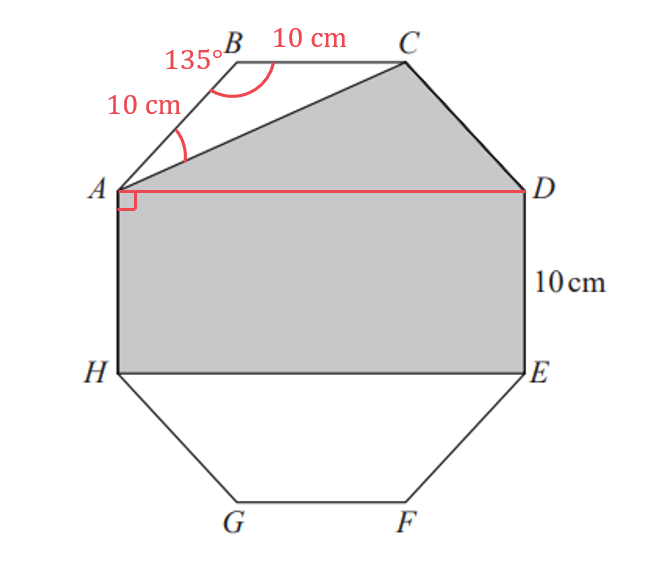

> *Triangle **ABC **is an isosceles triangle, so angle **BAC **= angle **BCA **= 1/2(180 - 135). *

*Angle ***BAC ***= Angle ***BCA ***= ** *$\frac{180-135}{2}=22.5^{\circ}$

> *Find angles **ACD **and **CAD **in triangle **ACD.*

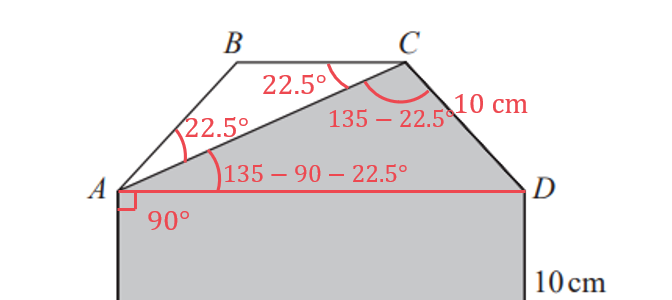

*Angle ***ACD*** = Angle ***BCD*** - Angle ***ABC*** = 135 - 22.5 = 112.5°*

*Angle ***CAD*** = Angle ***BAH ***- Angle ***DAH*** - Angle ***BAC ***= 135 - 90 - 22.5 = 22.5°*

> *To find the length of **AD, y**ou know the length of one side (**CD**) and the angle opposite it (**CAD**). You also know angle **ACD** so you can find the length of the side opposite that using the sine rule.*

> *The formula for the sine rule is *$\frac{a}{\mathrm{sin}A}=\frac{b}{\mathrm{sin}B}$*, where **a** and **b** are the lengths of the two sides that are opposite the angles **A **and **B **respectively. Substitute **a** = **AD**, **b** = 10, **A** = 112.5 and **B** = 22.5 into the formula.*

`fraction numerator A D over denominator sin open parentheses 112.5 close parentheses end fraction equals fraction numerator 10 over denominator sin open parentheses 22.5 close parentheses end fraction`

**[1]**

> *Multiply both sides by sin(112.5) and type into your calculator.*

`table row cell A D end cell equals cell fraction numerator 10 over denominator sin open parentheses 22.5 close parentheses end fraction cross times sin open parentheses 112.5 close parentheses end cell row blank equals cell 24.14213... end cell end table`

> *Now find the area of rectangle **ADEH.*

**Area ADEH ***= 24.14213... × 10 = 241.4213... cm**2*

**[1]**

> *Now look at triangle **ACD**.*

> *Find angle **ADC.*

*Angle ***ADC*** = Angle ***CDE*** - Angle ***ADE*** = 135 - 90 = 45°*

> *The formula for the area of a triangle is *$\mathrm{Area}=\frac{1}{2}ab\mathrm{sin}C$*, where **a** and **b** are the lengths of the two sides that form angle **C**. Substitute **a** = 24.14213..., **b** = 10 and **C** = 45 into the formula.*

`table row Area equals cell 1 half cross times 24.14213... cross times 10 cross times sin open parentheses 45 close parentheses end cell end table`

**[1]**

> *Type into your calculator.*

`table row cell Area subscript A C D end subscript end cell equals cell space 85.35531... space cm squared end cell end table`

**[1]**

> *Find the shaded area by adding the area of the rectangle to the area of the triangle.*

`table row cell Area space end cell equals cell space 241.4213... space plus space 85.35531... space equals space 326.776... space cm squared end cell end table`

> *Round to 3 significant figures. Remember to include the units for the area.*

$\mathrm{Area}=327\mathrm{cm}^{2}(3\mathrm{sf})$ **[1]**
** Answers from 326 - 327 accepted.**

## Q14 — medium — 4 marks · exam-questions

### 7() — 4 marks
> *Find the dimensions of outer edges of the path.*

*Length = 7 + 3 + 3 = 13 m Width = 4 + 3 + 3 = 10 m*

> *Calculate the entire area of the path and the pond.*

*13 x 10 = 130 m**2*

> *Calculate the area of the pond.*

*7 x 4 = 28 m**2*

**One correct area of EITHER the pond OR the pond and the path**** [1]**

> *Calculate the total area of the path by subtracting the area of the pond from the entire area of the pond and the path.*

*130 - 28 = 102 m**2*

**[1]**

> *Calculate the number of bags of gravel that Ali needs to buy by dividing the total area of the path by the area that one bag of gravel will cover.*

*102*$\div$*10 = 10.2*

**[1]**

> *Round up to the next whole number of bags.*

**11 bags**** [1]**

## Q15 — very_hard — 5 marks · exam-questions

### 8() — 5 marks
> *The area of the shaded region is equal to the area of the circle minus the area of the triangle.*

> *The radius of the circle is equal to half of the hypotenuse of the right-angled triangle. *
*Use Pythagoras to find the hypotenuse of triangle **ABC.*

$AC^{2}=AB^{2}+BC^{2}\,AC^{2}=8^{2}+15^{2}$

**[1]**

> *Rearrange and solve for **AC.*

$AC=\sqrt{8^{2}+15^{2}}=17\mathrm{cm}$

**[1]**

> *Find the radius by dividing **AC **by 2.*

$r=\frac{AC}{2}=\frac{17}{2}=8.5\mathrm{cm}$

> *Calculate the area of the circle, using *$A=πr^{2}$*.*

`table row cell A subscript C i r c l e end subscript end cell equals cell space pi open parentheses 8.5 close parentheses squared end cell row blank equals cell space 289 over 4 pi space end cell row blank equals cell space 72.25 pi space cm squared end cell end table`

> *Calculate the area of the triangle.*

*Area triangle = *`table row blank blank cell 1 half end cell end table b h space equals space 1 half cross times 8 cross times 15 space equals space 60 space cm squared`

**Either area found ****[1]**

> *Calculate the area of the shaded area by subtracting the area of the triangle from the area of the circle.*

`table row cell A space end cell equals cell space 72.25 pi space minus space 60 space equals space 166.9800... end cell end table`* **cm**2*

**[1]**

> *Round to 3 significant figures.*

**Area = 167 cm****2**** [1]**

## Q16 — medium — 5 marks · exam-questions

### 5() — 5 marks
> *Calculate the area of the entire garden.*

*17 x 9.5 = 161.5 m**2*

> *Calculate the area of the patio.*

*2.8 x 9.5 = 26.6 m**2*

**[1]**

> *Find the radius of a pond by dividing its diameter by 2.*

$r=\frac{3.8}{2}=1.9m$

> *Calculate the area of one pond, using *$A=πr^{2}$*.*

`table row A equals cell straight pi open parentheses 1.9 close parentheses squared end cell row blank equals cell space 11.341149... straight m squared end cell end table`

**[1]**

> *Calculate the area of the grass by subtracting the areas of the patio and two ponds from the area of the entire garden.*

`table row A equals cell 161.5 minus 26.6 minus 2 cross times 11.341149... end cell end table`

**[1]**

`A table row blank equals blank end table table row blank blank 112 end table table row blank blank. end table table row blank blank 2177 end table table row blank blank. end table table row blank blank. end table table row blank blank. end table table row blank blank space end table table row blank blank straight m end table squared`

**Values between 112 - 113 are accepted**** [1]**

> *Calculate the number of boxes that Mr Weaver will need by dividing the area of the grass by the area that one box of fertiliser will cover.*

$\frac{112.2177...}{25}=4.4887...$

> *Round up to the next number of whole boxes.*

**5 boxes**** [1]**

## Q17 — very_hard — 5 marks · exam-questions

### 11() — 5 marks
> *Calculate the length **AC** from the right-angled triangle **ACD** using Pythagoras' theorem, *$a^{2}+b^{2}=c^{2}$*.*

`table row cell 17 squared end cell equals cell 15 squared plus A C squared end cell end table`

**[1]**

`table row 289 equals cell 225 plus A C squared end cell row 64 equals cell A C squared end cell end table`

**[1]**

`table row cell A C end cell equals 8 end table`

> *The diameter of the semi-circle is therefore 8 cm.*

> *Calculate the arc length of the semi-circle by using the formula for the circumference of a circle, *$C=πd$*, and multiplying it by *$\frac{1}{2}$*.*

> * *`table row cell A r c space l e n g t h space end cell equals cell 1 half cross times straight pi cross times 8 end cell end table`

**[1]**

`table row cell A r c space l e n g t h space end cell equals cell 4 straight pi end cell end table`

> *Work out the perimeter of the shaded shape by adding together the arc length of the semi-circle and the lengths of the sides **AD** and **CD**.*

`table row cell P e r i m e t e r end cell equals cell 4 straight pi plus 17 plus 15 end cell end table`

**[1]**

`table attributes columnalign right center left columnspacing 0px end attributes row cell P e r i m e t e r end cell equals cell 44.5663... end cell end table`

> *Round to 3 significant figures.*

**44.6 cm**** [1]**

## Q18 — medium — 4 marks · exam-questions

### 8() — 4 marks
> *Split the shape into two parts, a rectangle and a trapezium.*

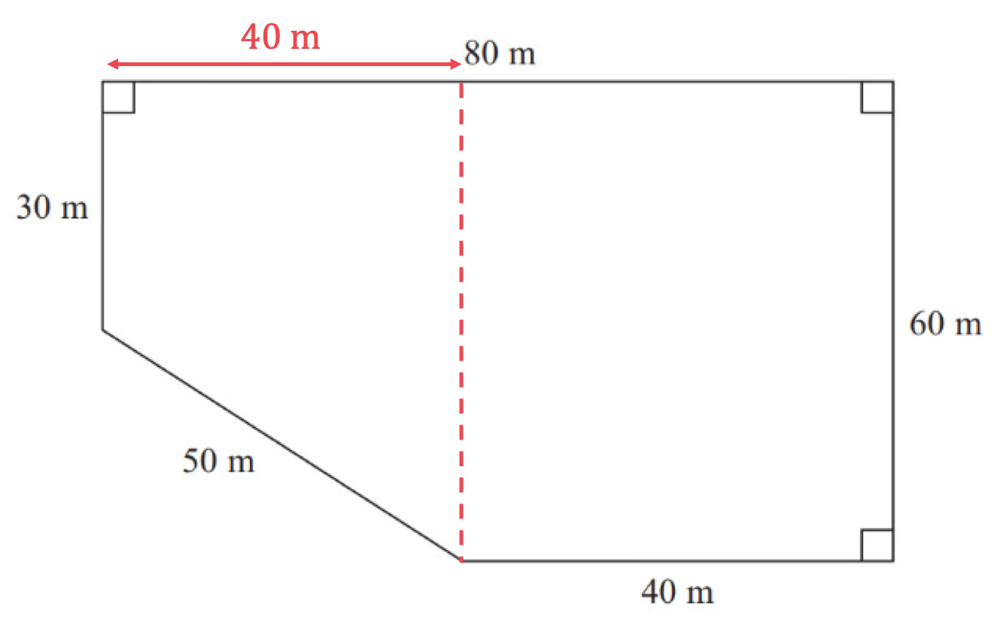

**[1]**

> *Calculate the area of the trapezium: *`A space equals 1 half open parentheses a plus b close parentheses h`

`table row cell A subscript T end cell equals cell 1 half open parentheses 30 plus 60 close parentheses cross times 40 end cell row blank equals 1800 end table`

> *Calculate the area of the rectangle.*

`table row cell A subscript R end cell equals cell 60 cross times 40 end cell row blank equals 2400 end table`

> *Add the area of the trapezium and the rectangle to calculate the total area of the playground*

`table row A equals cell 1800 plus 2400 end cell row blank equals cell 4200 space straight m squared end cell end table`

**[1]**

> *Find the total cost by multiplying the total area of the playground by the cost per square metre.*

*Cost*$=4200\times2.56$

**[1]**

`bold £ bold 10752`** [1]**

**Any correct method of splitting the shape into different areas to find the total area will be accepted.**

## Q19 — very_hard — 6 marks · exam-questions

### 25() — 6 marks
> *The area of the region **R **is the area of the larger segment from circle centre **O** added to the area of the smaller segment from circle centre **P**. *

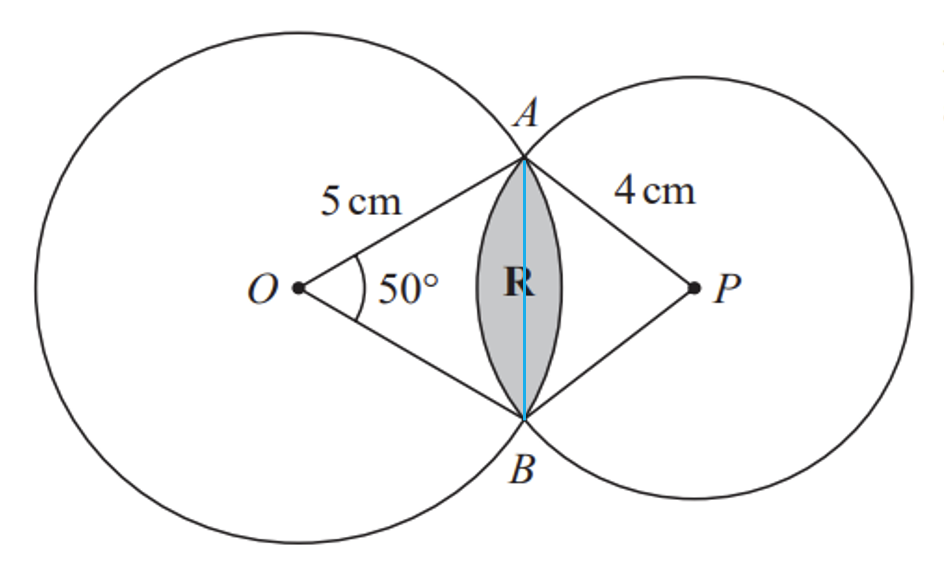

> *To find the area of the segment in circle centre **O, **subtract the area of triangle **AOB **from the area of sector **AOB.*

> *Find the area of triangle **AOB** using the area of a triangle formula, *$A=\frac{1}{2}ab\mathrm{sin}C$*, where *$a$* and *$b$* are the two known sides and *$C$* is the included angle. **OA **and **OB **are both radii so are both equal to 5 cm.*

`A r e a subscript t r i a n g l e space A O B end subscript space equals 1 half cross times open parentheses 5 close parentheses cross times open parentheses 5 close parentheses cross times sin open parentheses 50 close parentheses space equals space 25 over 2 sin space 50`

> *It is best to leave working as exact values as you work through the problem, but if you choose to round make sure you use at least 4 significant figures throughout. *

> *Find the area of the sector **AOB **using the formula for area of a sector *$=\frac{θ}{360^{\circ}}\timesπr^{2}$*.*

> *Substitute the given values into the formula, letting *$θ=50$* and *$r=5$*.*

$\frac{50}{360}\timesπ\times5^{2}=\frac{125}{36}π$

**[1]**

> *Find the area of the segment by subtracting the area of triangle **AOB **from the area of sector **AOB.*

*Area segment (circle ***O***) =*$\frac{125}{36}π-\frac{25}{2}\mathrm{sin}50$

> *To find the area of the segment in circle centre **P, **we first need to find angle **APB.*

> *Triangles **AOB **and **APB **are both isosceles triangles so the line **OP **is a line of symmetry. The sine rule can be used with triangle **AOP **to find the value of angle **APO **which can then be doubled to find angle **APB.*

> *Use the sine rule with the angles on the numerators, *$\frac{\mathrm{sin}A}{a}=\frac{\mathrm{sin}B}{b}=\frac{\mathrm{sin}C}{c}$*.*

`fraction numerator sin space open parentheses A P O close parentheses over denominator 5 end fraction equals fraction numerator sin space open parentheses 25 close parentheses over denominator 4 end fraction`

**[1]**

> *Multiply both sides by 5 and use the inverse sin to find the angle **APO**.*

`sin space A P O space equals space 5 cross times fraction numerator sin space 25 over denominator 4 end fraction space equals space 0.528272...
angle space A P O space equals space sin to the power of negative 1 end exponent open parentheses space 0.528272... close parentheses space equals space 31.88883...`

**[1]**

> *Angle **APB **= 2 × angle **APO**.*

`A P B space equals space 2 open parentheses 31.88883... close parentheses space equals space 63.77766...`

> *Find the area of triangle **APB** using the area of a triangle formula, *$A=\frac{1}{2}ab\mathrm{sin}C$*.*

`A r e a subscript t r i a n g l e space A P B end subscript space equals 1 half cross times open parentheses 4 close parentheses cross times open parentheses 4 close parentheses cross times sin open parentheses 63.77766... close parentheses space equals space 7.176689...`

> *Find the area of the sector **APB **using the formula for area of a sector *$=\frac{θ}{360^{\circ}}\timesπr^{2}$*.*

$\frac{63.77766...}{360}\timesπ\times4^{2}=8.905041...$

**[1]**

> *Find the area of the segment by subtracting the area of triangle **APB **from the area of sector **APB.*

*Area segment (circle ***P***) = *$8.905041...-7.176689...=1.728352...$

> *Find the area of the shaded section by adding the area of the two segments together.*

*Area shaded = *`open parentheses 125 over 36 pi space minus space 25 over 2 sin space 50 close parentheses plus 1.728352... space equals space 3.061104...`

**[1]**

> *Round the final answer to 3 significant figures. *

**Area = 3.06 cm****2**** ****[1]**
**Answers in the range 3 to 3.1 accepted**

## Q20 — medium — 5 marks · exam-questions

### 7() — 5 marks
> *Method 1:*

> *Calculate the area of the rectangle of length 10 m and width 6 m.*

**A*** = 10 x 6 = 60 m**2*

> *Calculate the area of the small rectangle at the top centre.*

**A*** = 5 x 2 = 10 m**2*

**[1]**

> *Calculate the area of the floor by subtracting the area of the smaller rectangle from the area of the larger rectangle.*

**A*** = 60 - 10 = 50 m**2*

**Complete method to find the area of the floor ****[1]**

> *Calculate the area of the floor that Angie can varnish with her three tins. *
*Multiply the number of tins of varnish by the number of litres of varnish in each tin by the area that 1 litre will cover.*

*3 x 2.5 x 5 = 37.5 m**2*

**Complete method to find the area the varnish will cover**** [1]**** Correct areas for both the floor and the area the varnish will cover**** [1]**

> *Compare the area that the varnish will cover with the area of the floor.*

*37.5 m**2** < 50 m**2*

**Angie does not have enough varnish to cover all of the floor**** [1]**

> *Method 2:*

> *Calculate the area of the rectangle of length 10 m and width 6 m.*

**A*** = 10 x 6 = 60 m**2*

> *Calculate the area of the small rectangle at the top centre.*

**A*** = 5 x 2 = 10 m**2*

**[1]**

> *Calculate the area of the floor by subtracting the area of the smaller rectangle from the area of the larger rectangle.*

**A*** = 60 - 10 = 50 m**2*

**Complete method to find the area of the floor ****[1]**

> *Calculate the number of litres required to cover the floor by dividing the area of the floor by the number of m**2** that each litre will cover.*

*50*$\div$*5 = 10 litres*

**Complete method to find number of litres required to cover the floor**** [1]**

> *Calculate the number of litres of varnish that Angie has by multiply the number of tins by the number of litres in each tin.*

*3 x 2.5 = 7.5 litres*

**Correct values for both the number of litres of varnish required to cover the whole floor and the number of litres of varnish in the three tins**** [1]**

> *Compare the number of litres that Angie has with the number of litres required to cover the whole floor.*

*7.5 litres < 10 litres*

**Angie does not have enough varnish to cover all of the floor**** [1]**

## Q21 — very_hard — 6 marks · exam-questions

### 26() — 6 marks
> *Method 1*

> *Divide the shape into two rectangles as below:*

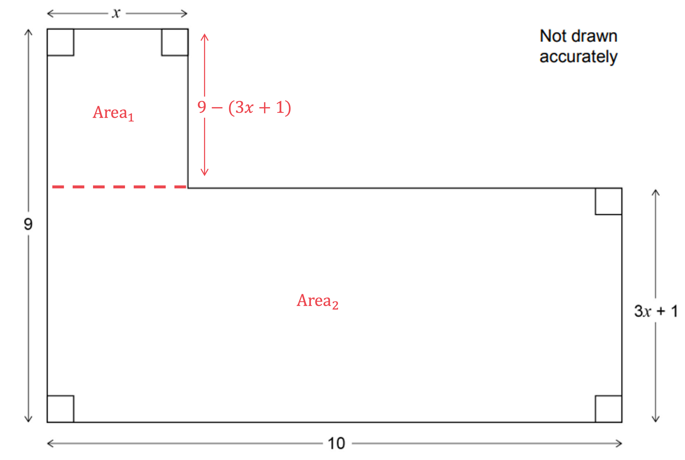

> *The height of the top rectangle is unknown but we can write it in terms of **x **and simplify:*

`table attributes columnalign right center left columnspacing 0px end attributes row cell 9 minus open parentheses 3 x plus 1 close parentheses end cell equals cell 9 minus 3 x minus 1 end cell row blank equals cell 8 minus 3 x end cell end table`

> *Write the area of the top rectangle in terms of **x**:*

`table attributes columnalign right center left columnspacing 0px end attributes row cell Area subscript 1 end cell equals cell x open parentheses 8 minus 3 x close parentheses end cell end table`

> *The area of the bottom rectangle in terms of **x** is:*

`table attributes columnalign right center left columnspacing 0px end attributes row cell Area subscript 2 end cell equals cell 10 open parentheses 3 x plus 1 close parentheses end cell end table`

**either of the two areas above expressed in terms of x ****[1]**

> *The area of the shape is 65 cm**2** so add theareas of the two rectangles together and equate to 65.*

> `table attributes columnalign right center left columnspacing 0px end attributes row cell x open parentheses 8 minus 3 x close parentheses plus 10 open parentheses 3 x plus 1 close parentheses end cell equals 65 end table`* *

**[1]**

> *Expand the brackets and collect like terms (on the left hand side).*

`table attributes columnalign right center left columnspacing 0px end attributes row cell 8 x minus 3 x squared plus 30 x plus 10 end cell equals 65 row cell negative 3 x squared plus 38 x plus 10 end cell equals 65 end table`

**left hand side fully expanded and simplified ****[1]**

> *Now rearrange into the form *$ax^{2}+bx+c=0$* (where **a** is a positive number) in order to solve the quadratic equation.*

`table attributes columnalign right center left columnspacing 0px end attributes row cell negative 3 x squared plus 38 x minus 55 end cell equals 0 row cell 3 x squared minus 38 x plus 55 end cell equals 0 end table`

**[1]**

> *There is no common factor of 3, 38 and 55. Although you could try to solve by factorising or completing the square, the numbers look quite daunting and it is a calculator question, so it is probably quicker and less risky to use the quadratic formula. (It does actually factorise if you want to try it)*

> *Be careful with the negative numbers.*

`table row x equals cell fraction numerator negative open parentheses negative 38 close parentheses plus-or-minus square root of open parentheses negative 38 close parentheses squared minus 4 cross times 3 cross times 55 end root over denominator 2 cross times 3 end fraction end cell end table`

**quadratic formula correctly applied, or left-hand-side of equation factorised ****[1]**

`table row blank equals cell fraction numerator 38 plus-or-minus square root of 1444 minus 660 end root over denominator 6 end fraction end cell row blank equals cell fraction numerator 38 plus-or-minus square root of 784 over denominator 6 end fraction end cell row x equals cell 5 over 3 comma space up diagonal strike x equals 11 end strike end cell end table`

> *If **x** = 11 was a solution, then the short side on the diagram marked **x** would be longer than the side marked 10- so 11 would be smaller than 10! This is clearly a contradiction so **x** is not a valid answer. *
*You can acknowledge that **x **= 11** **is a solution to the equation by writing it down, but make sure you cross it out to show that you understand that it cannot be an answer to the question!*

$x=\frac{5}{3}$ **[1]**

**You may give this answer as a mixed fraction or a rounded decimal but you will lose a mark for writing "****x ****= 11" as an answer**

> *Method 2*

> *Divide the shape into two rectangles as below:*

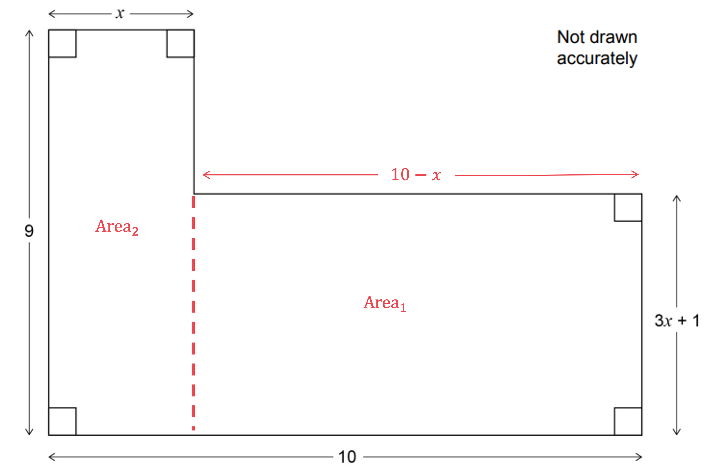

> *The length of the right-hand rectangle can be written in terms of **x**:*

`table row blank blank cell 10 minus x end cell end table`

> *Write the area of the right-hand rectangle in terms of **x**:*

`table attributes columnalign right center left columnspacing 0px end attributes row cell Area subscript 1 end cell equals cell open parentheses 3 x plus 1 close parentheses open parentheses 10 minus x close parentheses end cell end table`

> *The area of the left-hand rectangle in terms of **x** is:*

`table attributes columnalign right center left columnspacing 0px end attributes row cell Area subscript 2 end cell equals cell 9 x end cell end table`

**either of the two areas above expressed in terms of x ****[1]**

> *The area of the shape is 65 cm**2** so add theareas of the two rectangles together and equate to 65.*

> `table attributes columnalign right center left columnspacing 0px end attributes row cell open parentheses 3 x plus 1 close parentheses open parentheses 10 minus x close parentheses plus 9 x end cell equals 65 end table`* *

**[1]**

> *Expand the brackets and collect like terms (on the left hand side).*

`table row cell 30 x minus 3 x squared plus 10 minus x plus 9 x end cell equals 65 row cell negative 3 x squared plus 38 x plus 10 end cell equals 65 end table`

**left hand side fully expanded and simplified ****[1]**

> *Now rearrange into the form *$ax^{2}+bx+c=0$* (where **a** is a positive number) in order to solve the quadratic equation.*

`table attributes columnalign right center left columnspacing 0px end attributes row cell negative 3 x squared plus 38 x minus 55 end cell equals 0 row cell 3 x squared minus 38 x plus 55 end cell equals 0 end table`

**[1]**

> *There is no common factor of 3, 38 and 55. Although you could try to solve by factorising or completing the square, the numbers look quite daunting and it is a calculator question, so it is probably quicker and less risky to use the quadratic formula. (It does actually factorise if you want to try it).*

> *Be careful with the negative numbers.*

`table row x equals cell fraction numerator negative open parentheses negative 38 close parentheses plus-or-minus square root of open parentheses negative 38 close parentheses squared minus 4 cross times 3 cross times 55 end root over denominator 2 cross times 3 end fraction end cell end table`

**quadratic formula correctly applied, or left-hand-side of equation factorised ****[1]**

`table row blank equals cell fraction numerator 38 plus-or-minus square root of 1444 minus 660 end root over denominator 6 end fraction end cell row blank equals cell fraction numerator 38 plus-or-minus square root of 784 over denominator 6 end fraction end cell row x equals cell 5 over 3 comma space up diagonal strike x equals 11 end strike end cell end table`

> *If **x** = 11 was a solution, then the short side on the diagram marked **x** would be longer than the side marked 10- so 11 would be smaller than 10! This is clearly a contradiction so **x** is not a valid answer.*
* You can acknowledge that **x **= 11** **is a solution to the equation by writing it down, but make sure you cross it out to show that you understand that it cannot be an answer to the question!*

$x=\frac{5}{3}$ **[1]**

**You may give this answer as a mixed fraction or a rounded decimal but you will lose a mark for writing "****x ****= 11" as an answer**

## Q22 — medium — 5 marks · exam-questions

### 5() — 5 marks
*Calculate the length of the diagonal bar. *
*Substitute the given lengths into Pythagoras' theorem,* $a^{2}+b^{2}=c^{2}$*, where *$a$* and *$b$* are the length of the two shorter sides of a right-angled triangle and *$c$* is the length of the longest side.*

`table attributes columnalign right center left columnspacing 0px end attributes row cell 12 squared plus 5 squared end cell equals cell c squared end cell end table`

**[1]**

> *Simplify.*

`table row 169 equals cell c squared end cell end table`

> *Square root both sides.*

`table row 13 equals c end table`

**[1]**

> *Find the total length of metal that makes up the frame.*

*12 + 12 + 5 + 5 + 13 = 47 m*

**[1]**

> *Multiply the total length of the frame by the weight of the metal per metre to find the total weight of the metal in the frame.*

*47 x 1.5*

**[1]**

**70.5 kg ****[1]**

**Note that that it is actually the mass of the frame rather than the weight that is discussed in this question.**

## Q23 — very_hard — 5 marks · exam-questions

### 25() — 5 marks
> *The area of the logo is the area of the two triangles added to the area of the sector.*

> *Find the area of the triangles using the area of a triangle formula, *$A=\frac{1}{2}ab\mathrm{sin}C$*, where *$a$* and *$b$* are the two known sides and *$C$* is the included angle. The triangles are congruent, which means identical, so the calculation is the same for both of them.*

`Area subscript triangle space equals 1 half cross times open parentheses 15 close parentheses cross times open parentheses 26 close parentheses cross times sin open parentheses 38 close parentheses space equals space 195 space sin space 38`

**[1]**

> *It is best to leave working as exact values where possible as you work through the problem so leaving it in terms of sin here will make it easier to work with later. *

> *To find the area of the sector, you will first need to find its radius. You know the lengths of two sides and the angle between them of the triangle and the radius of the sector is the side opposite the angle, so you can use the cosine rule, *$a^{2}=b^{2}+c^{2}-2bc\mathrm{cos}A$*, where **b** and **c** are the lengths of the two sides that form angle **A** and **a** is the length of the side opposite **A**.*

`r squared space equals space 26 squared space plus space 15 squared space minus space 2 open parentheses 26 close parentheses open parentheses 15 close parentheses cos open parentheses 38 close parentheses
r space equals space square root of 26 squared space plus space 15 squared space minus space 2 open parentheses 26 close parentheses open parentheses 15 close parentheses cos open parentheses 38 close parentheses end root`

**[1]**

> *Type the expression into your calculator altogether as one line to get a value for **r.*

`table row cell r space end cell equals cell space 16.921926... end cell end table`

> *Find the area of the sector** **using the formula for area of a sector *$=\frac{θ}{360^{\circ}}\timesπr^{2}$*, the angle for the sector is *$θ=108$* and use the unrounded value found for **r.** *

`A r e a subscript s e c t o r end subscript equals space space 108 over 360 space space cross times space pi space space cross times space open parentheses 16.921926 close parentheses squared space equals space 269.880036...`

**Correct fraction**** [1] **
**Correct method to find area**** [1]**

> *Find the area of the logo by adding 2 lots of the area of the triangle to the area of the sector**.*

*Area logo = *`2 open parentheses 195 space sin space 38 close parentheses space plus space 269.880036...`

**Final answer:** **Area = **$509.988...=510\mathrm{cm}^{2}(2s.f.)$** ****[1]**

## Q24 — medium — 3 marks · exam-questions

### 25() — 3 marks
> *Calculate the area of the triangle **ABD**, using** *$A=\frac{1}{2}bh$*, where *$b$* is the length of the base and *$h$* is the perpendicular height.*

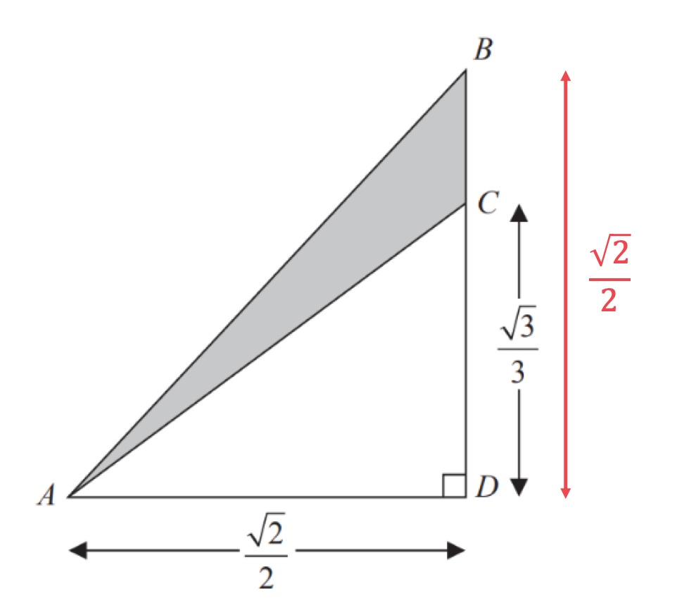

$A=\frac{1}{2}\times\frac{\sqrt{2}}{2}\times\frac{\sqrt{2}}{2}$

**[1]**

> *Multiply the numerators and multiply the denominators to simplify.*

$A=\frac{1}{4}$

> *Calculate the area of the triangle **ACD**.*

$A=\frac{1}{2}\times\frac{\sqrt{2}}{2}\times\frac{\sqrt{3}}{3}$

**[1]**

> *Multiply the numerators and multiply the denominators to simplify.*

$A=\frac{\sqrt{6}}{12}$

> *Calculate the area of the shaded region by subtracting the area of triangle **ACD** from the area of triangle **ABD**.*

$A=\frac{1}{4}-\frac{\sqrt{6}}{12}$* ***[1]**

## Q25 — very_hard — 6 marks · exam-questions

### 10() — 6 marks
> *Calculate the area of the lawn by adding the area of the square to the area of the three semi-circles.*

> *Area of a square with a side of 36m: *

$A_{sq}=36\times36=36^{2}=1296m^{2}$

**[1]**

> *Calculate the area of one semi-circle using *$A=\frac{1}{2}πr^{2}$*, where *$r$* is the radius of the semi-circle. *
* The diameter of one semi-circle is equal to the side of the square, and the radius is half of the diameter, so *`r space equals space 1 half open parentheses 36 close parentheses space equals space 18`* m.*

$A_{SC}=\frac{1}{2}\timesπ\times18^{2}=162πm^{2}$

**[1]**

> *The area of the lawn = area square + 3(area semi-circle).*

`A equals A subscript s q space end subscript plus space 3 A subscript S C end subscript space equals space 1296 space plus space 3 open parentheses 162 pi close parentheses space equals space 2822.8140... space straight m squared`

> *Multiply the area of the lawn by the amount of fertiliser per m**2** to find the total amount of fertiliser.*

$F=2822.8140...\times30=84684.4208...g$

**[1]**

> *Convert the amount of fertiliser needed from grams to kg by dividing by 1000.*

$84684.4208...g\div1000=84.684....\mathrm{kg}$

> *The fertiliser is sold in bags of 10 kg, so divide the amount of fertiliser needed in kg by 10 to find the number of bags needed.*

$84.684....\mathrm{kg}\div10=8.4684...\mathrm{bags}$

**[1]**

> *To complete the whole lawn Jane will need to buy 9 full bags, multiply 9 by the cost of one bag.*

$C=9\times15.8=142.2$

**[1]**

> *Write money in pounds to 2 decimal places.*

**£142.20 ****[1] **

## Q26 — medium — 4 marks · exam-questions

### 7() — 4 marks
> *Find the length *$PQ$* by dividing the area by the length *$QR$

$\frac{45}{10}=4.5$

**[1]**

> *Find the sum of the lengths *$BC$* and *$AD$

$4.5+4.5=9$

> *Subtract from the perimeter*

$26-9=17$

**[1]**

> *Divide by 2*

$17\div2=8.5$

**[1]**

**8.5 cm** **[1]**

## Q27 — very_hard — 7 marks · exam-questions

### 20() — 7 marks
> *Split 56 cm in the ratio 5 : 12 : 6 : 5 to find the length of each side of the trapezium.*

> *Add the parts of the ratio together.*

$5+12+6+5=28$

> *Divide 56 by the total number of ratio parts.*

$56\div28=2$

**[1]**

> *Multiply each part of the ratio by 2 to find the lengths of each side.*

$\mathrm{AD}=5\times2=10\mathrm{cm}\,\mathrm{AB}=12\times2=24\mathrm{cm}\,\mathrm{DC}=6\times2=12\mathrm{cm}\,\mathrm{BC}=5\times2=10\mathrm{cm}$

**[1]**

> *The area of a trapezium can be found using the formula *`A equals 1 half open parentheses a space plus space b close parentheses h`*, where *$a$* and *$b$* are the parallel sides and *$h$* is the **perpendicular **height.  *
*The perpendicular height is not known, but can be found using Pythagoras' theorem. The trapezium is an isosceles trapezium so the property that there is a line of symmetry down the middle can be used.*

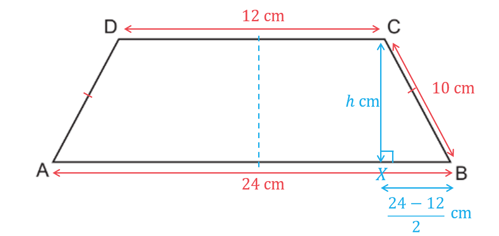

> *Find the distance from the point **X **(the base of the perpendicular height) to the point B.*

$XB=\frac{24-12}{2}=6\mathrm{cm}$

**[1]**

> *Use Pythagoras' theorem *$a^{2}+b^{2}=c^{2}$* with the sides XB, CX and BC to find the perpendicular height of the trapezium.*

`table row cell h to the power of 2 space end exponent plus space X straight B squared space end cell equals cell space BC squared end cell row cell h to the power of 2 space end exponent plus space 6 squared space end cell equals cell space 10 squared end cell end table`

**[1]**

> *Rearrange and solve to find **h.*

`table row cell h to the power of 2 space end exponent end cell equals cell space 10 squared space minus space 6 squared end cell row blank equals cell space 100 space minus space 36 end cell row blank equals cell space 64 end cell row cell h space end cell equals cell space square root of 64 end cell row blank equals cell space 8 space cm end cell end table`

**[1]**

> *Substitute into the formula for the area of a trapezium,  *`A equals 1 half open parentheses a space plus space b close parentheses h`*, where *$a=\mathrm{AB}=24\mathrm{cm}$*, *$b=\mathrm{CD}=12\mathrm{cm}$*and *$h=8\mathrm{cm}$*.*

`A space equals space 1 half open parentheses 24 space plus space 12 close parentheses cross times 8`

**[1]**

**Area = 144 cm****2**** ****[1] **

## Q28 — medium — 4 marks · exam-questions

### 3() — 4 marks
> *The right-angled triangles are identical, label the longer side of each triangle with 12.8 cm.*

> *Let the side of the square be *$x$*cm.*

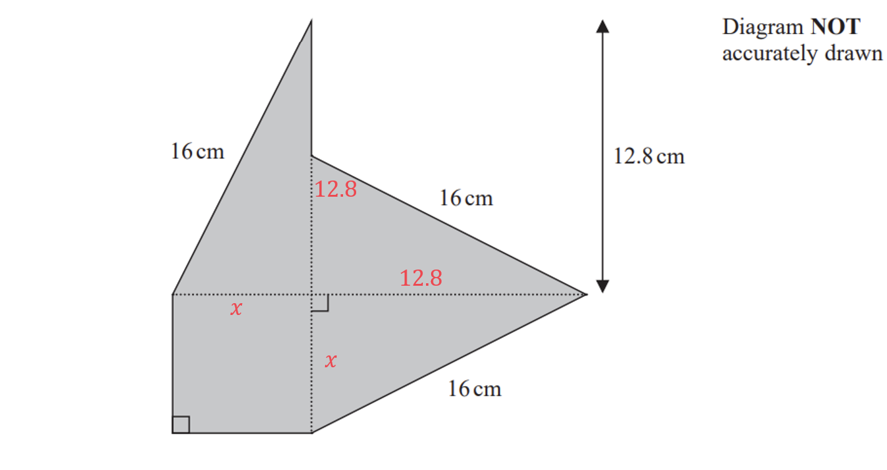

> *Use Pythagoras' theorem to calculate the shorter side of each of the triangles.*

`table row cell x to the power of 2 space end exponent plus space 12.8 squared space end cell equals cell space 16 squared end cell end table`

**[1]**

> *Rearrange and solve to find **x.*

`table row cell x squared space end cell equals cell space 16 squared space minus space 12.8 squared space end cell row cell x squared space end cell equals cell space 92.16 end cell row cell x space end cell equals cell space square root of 92.16 end root space equals space 9.6 end cell end table`

**[1]**

> *Add this to each part of the perimeter on the diagram.*

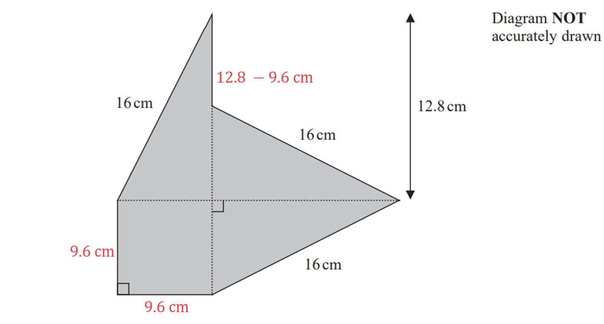

> *The perimeter is the sum of the lengths of the sides around the outside. *

`straight P space equals space 9.6 space plus space 9.6 space plus space 16 space plus space open parentheses 12.8 space minus space 9.6 close parentheses space plus thin space 16 space plus space 16`

**[1]**

> *Find the total.*

**Perimeter = 70.4 cm*** ***[1]**

## Q29 — very_hard — 6 marks · exam-questions

### 7() — 6 marks
> *Convert everything into the same units, either m or cm. Working in cm will usually be easier. *

*Width: 3 m = 300 cm *
*Length: 4.5 m = 450 cm*

> *To find the number of carpet tiles needed, first check that the tiles fit exactly into the room by checking that both the width and the length divide exactly by 50 cm. Find the number of tiles that go along the width of the room.*

*Width: 300 ÷ 50 = 6 tiles*

**[1]**

> *Find the number of tiles that go along the length of the room.*

*Length: 450 ÷ 50 = 9 tiles*

**[1]**

> *So to fit the tiles perfectly into the room there will be 9 tiles by 6 tiles.  Find the total number of tiles needed.*

*Width × Length = 6 × 9 tiles *
*Total = 54 tiles.*

**[1]**

> *Tiles are sold in packs of ten, so the total number of packs needed will be 6 packs.  Find the cost of 6 packs, at £20 per pack.*

*Total cost of 6 packs at £20 per pack = 6 × £20 = £120*

**[1]**

> *To find the cost of fitting, calculate the area of the room by multiplying the length (4.5 m) by the width (3 m). The cost is given per square metre here so it is easier to work in metres.*

$A_{\mathrm{room}}=4.5\times3=13.5m^{2}$

> *Round this up to the nearest square metre before finding the cost, as any fraction of a square metre is rounded up.*

*13.5 m**2 ** = 14 m**2 **(next m**2**)*

> *The fitting costs £7.50 per square metre, so multiply this by the number of s quare metres in the room. *

*14 × £7.50 = £105.00*

**[1]**

> *Add this to the cost of the carpet tiles.*

*£105.00 + £120.00*

> *Write money in pounds to 2 decimal places.*

**£225.00 ****[1] **

## Q30 — medium — 4 marks · exam-questions

### 1() — 4 marks
> *The hexagon can be split up in more than one way, the easiest is to join the points **B **to **E.*

> *Label the rectangle **A **and the trapezium **B.*

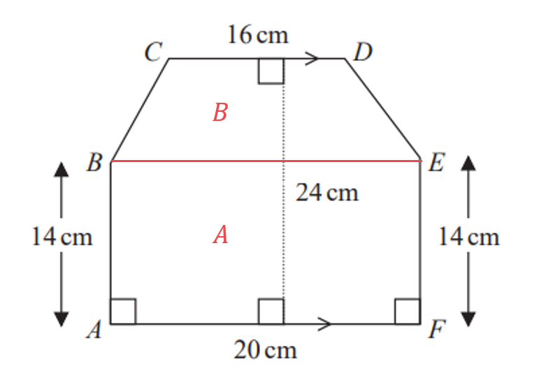

> *Find the area of rectangle **A.*

*Area of rectangle ***A*** = 20 × 14 = 280 cm**2*

**[1]**

> *To calculate the area of trapezium **B **the perpendicular height is needed.*

*Height of trapezium ***B*** = 24 - 14 = 10 cm*

> *The formula for the area of a trapezium is *`A space equals space 1 half open parentheses a space plus space b close parentheses h`*, where **a **and **b **are the parallel sides and **h **is the perpendicular height.*

*Area of trapezium ***B *** = *`table row cell 1 half open parentheses 20 space plus space 16 close parentheses cross times 10 space end cell equals cell space 180 space end cell end table`*cm**2*

**[1]**

> *Add the two areas together.*

*Total area = 180 + 280 cm**2*

**[1]**

**Area = 460 cm****2*** ***[1]**

## Q31 — very_hard — 3 marks · exam-questions

### 7() — 3 marks
> *The area of a square, side *$x$* **units, is *$x^{2}$*, **so if *$x$* is an integer then the area of both squares must be square numbers.*

> *Find two square numbers with a difference of 36. *

> *Listing the first square numbers may help.*

*1, 4, 9, 16, 25, 36, 49, 64, 81, 100, 121, 144*

> *Consider the differences of these numbers.*

*The two square numbers that have a difference of 36 are 64 and 100.*

**[1]**

> *Find the side lengths of the two squares by taking the square root of these two numbers. *

$\sqrt{64}=8\mathrm{cm}\,\sqrt{100}=10\mathrm{cm}$

**[1]**

> *Note that this is an example of a Pythagorean triple (3 integers that satisfy *$a^{2}+b^{2}=c^{2}$*).*

**8 cm and 10 cm ****[1]*** *

## Q32 — medium — 3 marks · exam-questions

### 8() — 3 marks
> *Find the perimeter by multiplying the length of the shorter side by 9.*

*Perimeter = *`6.5 space cross times space 9 space equals space open parentheses 6 space cross times space 9 close parentheses space plus space open parentheses 0.5 space cross times space 9 close parentheses space equals space 54 space plus space 4.5 space equals space 58.5`* cm.*

**[1]**

> *Let the longer side of the parallelogram be *$x.$

> *Form an equation for the perimeter by adding the four edges of the parallelogram together and letting it equal 58.5.*

$6.5+x+6.5+x=58.5$

> *Simplify and solve to find *$x$*.*

`table row cell 13 space plus space 2 x space end cell equals cell space 58.5 end cell row cell 2 x space end cell equals cell space 58.5 space minus space 13 space end cell row cell 2 x space end cell equals cell space 45.5 end cell row cell x space end cell equals cell space fraction numerator 45.5 over denominator 2 end fraction end cell end table`

**[1]**

** 22.75 cm**** [1]**

## Q33 — medium — 3 marks · exam-questions

### 13() — 3 marks
> *Substitute into the formula for the area of the trapezium: *`A space equals 1 half open parentheses a plus b close parentheses h`*, *
*where** a** and **b **are the parallel sides and **h **is the** **perpendicular height.*

`table row cell A space end cell equals cell space 1 half open parentheses 2.8 space plus space 2.1 close parentheses h end cell end table`

**[1]**

> *Form an equation by setting the expression for the area equal to 39.2 m**2**.*

`table row cell 1 half open parentheses 2.8 space plus space 2.1 close parentheses h space end cell equals cell space 39.2 end cell end table`

**[1]**

> *Simplify.*

`table row cell 1 half open parentheses 4.9 close parentheses h space end cell equals cell space 39.2 end cell row cell 2.45 h space end cell equals cell space 39.2 space end cell end table`

**[1]**

> *Solve by dividing both sides by 2.45.*

`table row cell h space end cell equals cell space fraction numerator 39.2 space over denominator 2.45 end fraction end cell end table`

$h=16m$** [1]**

## Q34 — medium — 4 marks · exam-questions

### 5() — 4 marks
> *Calculate the length DC, which is equal to AB, using Pythagoras' theorem*

$7.2^{2}+5.4^{2}=81$

**[M1]**

$\sqrt{7.2^{2}+5.4^{2}}=9$

**[M1]**

> *Add up all the sides*

*9 + 6 + 7.2 + 5.4 + 6 *

**[M1]**

**Final answer:** **33.6cm**

**[A1]**

## Q35 — hard — 4 marks · exam-questions

### 16() — 4 marks
> *Form an equation for the perimeter of the triangle in terms of *$x$*.*

`open parentheses x minus 1 close parentheses plus open parentheses 3 x plus 1 close parentheses plus 3 x equals 56`

**[1]**

> *Simplify by collecting like terms.*

$7x=56$

**[1]**

> *Divide both sides by 7.*

$x=8$

> *Substitute *$x=8$* into the expressions for the base and the perpendicular height of the triangle.*

*Base: *`3 open parentheses 8 close parentheses equals 24`* *
*Perpendicular height: *`open parentheses 8 close parentheses minus 1 equals 7`

> *Calculate the area of the triangle, using *$A=\frac{1}{2}bh$*, where *$b$*is the base *$h$* and is the perpendicular height.*

$A=\frac{1}{2}\times24\times7$

**[1]**

$84m^{2}$* ***[1]**

## Q36 — hard — 4 marks · exam-questions

### 21() — 4 marks
Calculate the width of the rectangle by using the radii of the circles.

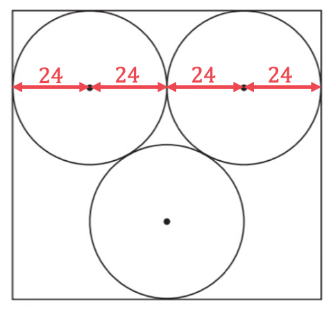

$4\times24=96$

**[1]**

> *Let *$x$* be the vertical distance between the centre of circle at the bottom and the centres of the top two circles.*

> *Find an expression for the height of the rectangle in terms of *$x$*.*

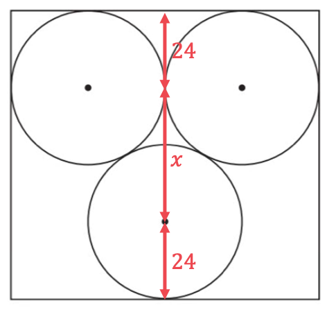

$\mathrm{Height}=x+48$

*A right-angled triangle can be formed involving *$x$*.* 
*Take a horizontal line from the point where the two top circles touch to the centre of one circle, the length is *$r$*.* 
*Take a diagonal line reaching from the centre of the top circle to the centre of the lower circle, the length is *$2r$*.*

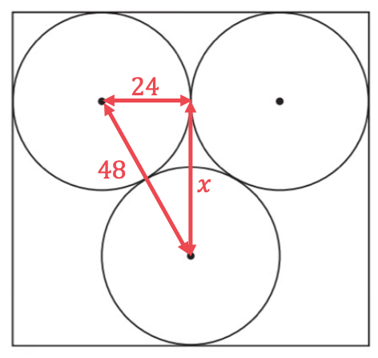

> *Calculate *$x$*using Pythagoras' theorem, *$a^{2}+b^{2}=c^{2}$*.*

$24^{2}+x^{2}=48^{2}$

> *Subtract 24**2** from both sides.*

$x^{2}=48^{2}-24^{2}$

> *Simplify.*

$x^{2}=1728$

> *Take the square root of both sides.*

$x=24\sqrt{3}$

**[1]**

> *Substitute *$x=24\sqrt{3}$* into the equation for the height of the rectangle.*

$\mathrm{Height}=24\sqrt{3}+48$

**[1]**

> *Calculate the area of the rectangle.*

> `A equals 96 cross times open parentheses 24 square root of 3 plus 48 close parentheses`* *$A=8598.6450...$

> *Round to 3 significant figures.*

$A=8600\mathrm{mm}$* ***[1]**

**Answers in the range 8592 - 8602 are accepted.**

## Q37 — hard — 3 marks · exam-questions

### 7() — 3 marks
> *Method 1:*

> *Label the diagram with the dimensions of the triangles.*

> *Calculate the length of the hypotenuse of one of the right-angled triangles using Pythagoras' theorem, *$a^{2}+b^{2}=c^{2}$*.*

> *Substitute the lengths of the edges into the formula.*

`table row cell x squared plus y squared end cell equals cell A D squared end cell end table`

> *Take the square root of both sides.*

`table row cell square root of x squared plus y squared end root end cell equals cell A D end cell end table`

**[1]**

> *Calculate the area of the square **ABCD**.*

`table row cell Area space end cell equals cell space A D cross times A B end cell row blank equals cell square root of x squared plus y squared end root cross times square root of x squared plus y squared end root end cell end table`

**[1]**

> *Simplify.*

$x^{2}+y^{2}$ **[1]**

> *Method 2:*

> *Label the diagram with the dimensions of the triangles.*

> *Calculate area of the larger square.*

`Area space equals open parentheses x plus y close parentheses open parentheses x plus y close parentheses`

**[1]**

> *Calculate the area of one of the triangles, using the formula: *$A=\frac{1}{2}bh$*.*

$\mathrm{Area}=\frac{1}{2}xy$

> *Find the area of the square **ABCD** by subtracting the area of four triangles from the area of the larger square.*

`table row cell Area space end cell equals cell space open parentheses x plus y close parentheses open parentheses x plus y close parentheses minus 4 cross times 1 half x y end cell end table`

**[1]**

> *Expand brackets.*

$\mathrm{Area}=x^{2}+xy+xy+y^{2}-2xy$

> *Simplify.*

$x^{2}+y^{2}$ **[1]**

## Q38 — hard — 4 marks · exam-questions

### 7() — 4 marks
> *Calculate the area of the garden using the formula for the area of a trapezium: *`A equals 1 half open parentheses a plus b close parentheses h`*, where *$a$* and *$b$* are the lengths of the parallel sides and *$h$* is the perpendicular height.*

`table row A equals cell 1 half open parentheses 12 plus 18 close parentheses cross times 9 end cell row blank equals 135 end table`

**[1]**

> *Calculate the number of bags of grass seed that are required to cover the area of the garden by dividing the area of the garden by the area covered by one bag of grass seed. Round your answer up to the next integer.*

$135\div20=6.75$ *7 bags of grass seed are required*

**[1]**

> *Multiply the number of bags of grass seed required by the cost of one bag.*

$\mathrm{Cost}=7\times4.99$

**[1]**

`bold £ bold 34 bold. bold 93` **[1]**

## Q39 — hard — 2 marks · exam-questions

### 15((a)) — 2 marks
> *Calculate the area of the trapezium **QRST**, using the formula: *`A equals 1 half open parentheses a plus b close parentheses h`*, where *$a$* and *$b$* are the lengths of the parallel lines and *$h$* is the perpendicular height.*

`table row A equals cell 1 half open parentheses 4 plus 12 close parentheses cross times 10 end cell end table`

**[1]**

$80\mathrm{cm}^{2}$ **[1]**

## Q40 — hard — 4 marks · exam-questions

### 18() — 4 marks
> *Split the triangle into two right-angled triangles.*

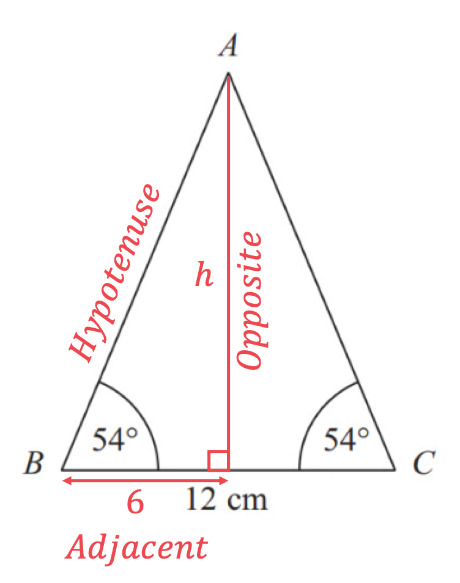

> *Calculate the perpendicular height of the triangle, using SOHCAHTOA. *
*Use *$\mathrm{tan}θ=\frac{Opp}{Adj}$* because you know the length of the adjacent side and you want to work out the length of the opposite side.*

`tan open parentheses 54 close parentheses space equals fraction numerator space h over denominator 6 end fraction`

**[1]**

`h equals 6 space tan open parentheses 54 close parentheses`

**[1]**

$h=8.258291...$

> *Calculate the area of the triangle, using the formula: *$A=\frac{1}{2}bh$*.*

`table row A equals cell 1 half cross times 12 cross times 8.258291... end cell end table`

**[1]**

`table attributes columnalign right center left columnspacing 0px end attributes row A equals cell 49.549749... end cell end table`

$49.5\mathrm{cm}^{2}$* ***[1]**

**Answers between 49.2 and 50 will be accepted.**

## Q41 — hard — 3 marks · exam-questions

### 23() — 3 marks
> *Draw a vertical line on the parallelogram to split the shape into a trapezium and a right-angled triangle.*

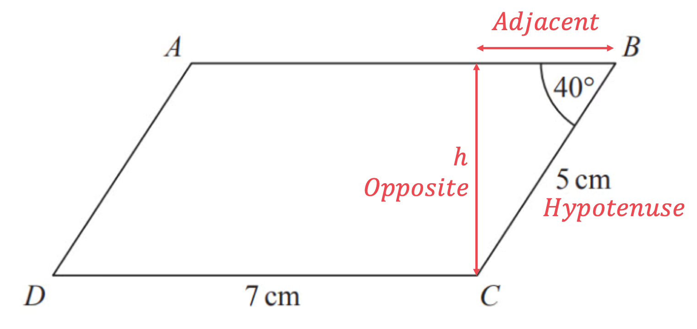

> *Calculate the perpendicular height of the triangle (and parallelogram) using SOHCAHTOA. *
*Use *$\mathrm{sin}θ=\frac{Opp}{Hyp}$*, as you know the hypotenuse and you want to find the opposite.*

`sin open parentheses 40 close parentheses equals h over 5`

> *Multiply both sides by 5.*

`table attributes columnalign right center left columnspacing 0px end attributes row cell 5 sin open parentheses 40 close parentheses end cell equals h end table`

**[1]**

`table attributes columnalign right center left columnspacing 0px end attributes row cell 3.213938... end cell equals h end table`

> *Calculate the area of the parallelogram by using the formula: *$A=bh$*, where *$b$* is the base and *$h$* is the perpendicular height.*

`table row A equals cell 7 cross times 3.213938... end cell end table`

**[1]**

`table attributes columnalign right center left columnspacing 0px end attributes row A equals cell 22.497566... end cell end table`

> *Round to 1 decimal place.*

$22.5\mathrm{cm}^{2}$* ***[1]**

**Answers between 22.4 and 22.5 will be accepted.**

## Q42 — hard — 4 marks · exam-questions

### 26() — 4 marks
> *Calculate the width of the rectangle, *$x$*, using Pythagoras' theorem, *$a^{2}+b^{2}=c^{2}$*, on the top right-angled triangle.*

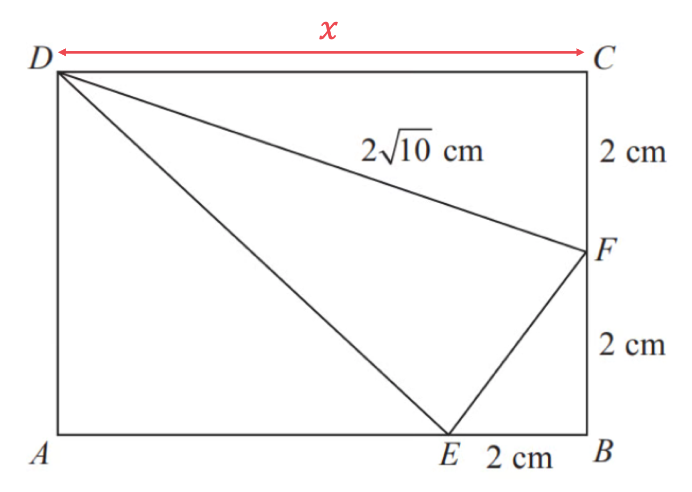

`x squared plus 2 squared equals open parentheses 2 square root of 10 close parentheses squared`

> *Rearrange.*

`x squared equals open parentheses 2 square root of 10 close parentheses squared minus 2 squared`

**[1]**

> *Simplify.*

$x^{2}=40-4\,x^{2}=36$

> *Take the square root of both sides.*

$x=6$

**[1]**

> *Calculate the area of the rectangle **ABCD**.*

$4\times6=24$

> *Calculate the area of the triangle **CDF**, using: *$A=\frac{1}{2}bh$*.*

`table row A equals cell 1 half cross times 2 cross times 6 end cell row blank equals 6 end table`

> *Calculate the area of the triangle **BEF**.*

`table row A equals cell 1 half cross times 2 cross times 2 end cell row blank equals 2 end table`

> *Find the length **AE**.*

$AE=6-2=4$

> *Calculate the area of the triangle **ADE**.*

`table row A equals cell 1 half cross times 4 cross times 4 end cell row blank equals 8 end table`

> *Calculate the area of triangle **DEF** by subtracting the areas of triangles **CDF**,** BEF **and **ADE **from the rectangle** ABCD**.*

$\mathrm{Area} \mathrm{of} \mathrm{Triangle}AED=24-6-2-8$

**[1]**

**8 cm****2**** ****[1]**

## Q43 — hard — 4 marks · exam-questions

### 15() — 4 marks
> *Calculate the length **AB** using Pythagoras' theorem: *$a^{2}+b^{2}=c^{2}$*.*

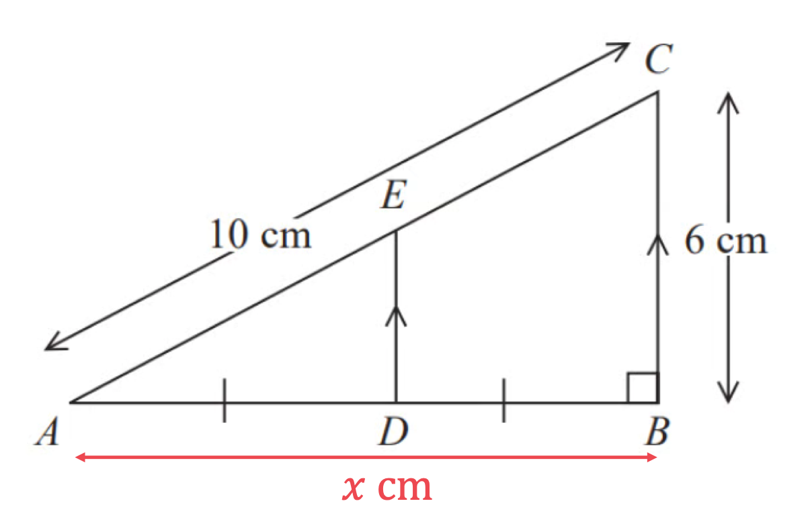

$x^{2}+6^{2}=10^{2}$

> *Subtract 6**2** from both sides.*

$x^{2}=10^{2}-6^{2}$

**[1]**

> *Simplify.*

$x^{2}=64$

> *Take the square root of both sides.*

$x=8$

> *Find the length **BD.*

**BD***  = *$\frac{1}{2}x$* = 4 cm*

**[1]**

> *Calculate the area of the trapezium **BCED,** using the formula: *`A equals 1 half open parentheses a plus b close parentheses h`*, where *$a$* and *$b$* are the lengths of the parallel sides and *$h$* is the perpendicular height.*

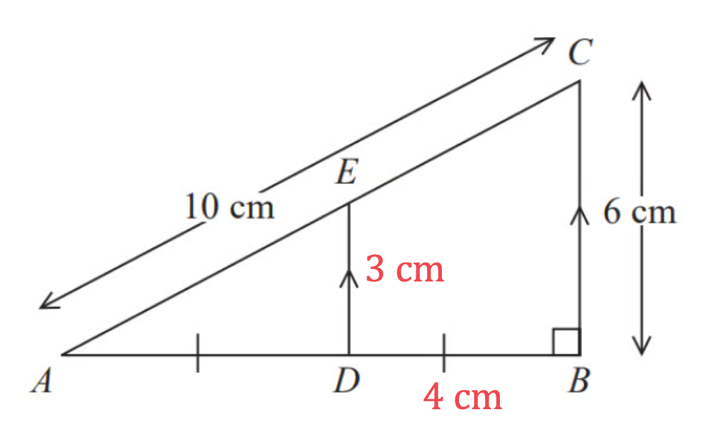

`table row A equals cell 1 half open parentheses 3 plus 6 close parentheses cross times 4 end cell end table`

**[1]**

`table row A equals cell 1 half cross times 9 cross times 4 end cell end table`

$18\mathrm{cm}^{2}$* ***[1]**

## Q44 — hard — 4 marks · exam-questions

### 8() — 4 marks
> *First add up the ratio numbers to find how many 'parts' the ratio divides the perimeter into. *
*Then divide the perimeter by that sum to find the size of one part.*

$3+4+5=12\,\,72\div12=6$

**[1]**

> *So each part is 6 cm. *
*Now multiply that by the ratio numbers to find the sizes of the three sides of the triangle.*

$3\times6=18\mathrm{cm}4\times6=24\mathrm{cm}5\times6=30\mathrm{cm}$

**[1]**

> *Now use the  *$\frac{1}{2}\times\mathrm{base}\times\mathrm{height}$*  formula for the area of a triangle. *
*In a right-angled triangle the two sides that are **not **the hypotenuse are the 'base' and 'height' for that formula. *
*And the longest side is the hypotenuse, so use 18 and 24 as the base and height.*

`table row cell Area space end cell equals cell space 1 half space cross times space 18 space cross times space 24 space end cell row blank equals cell space 216 end cell end table`

**[1]**

$216\mathrm{cm}^{2}$**  [1]**

## Q45 — hard — 5 marks · exam-questions

### 2() — 5 marks
> *Calculate the length of one side of the square by dividing the perimeter by 4.*

$\frac{16}{4}=4$

**[1]**

*Put the dimensions of the shape on the diagram and label the two unshaded triangles **A** and **B**.*

> *Calculate the area of the first triangle marked **A**, using: *$A=\frac{1}{2}bh$*.*

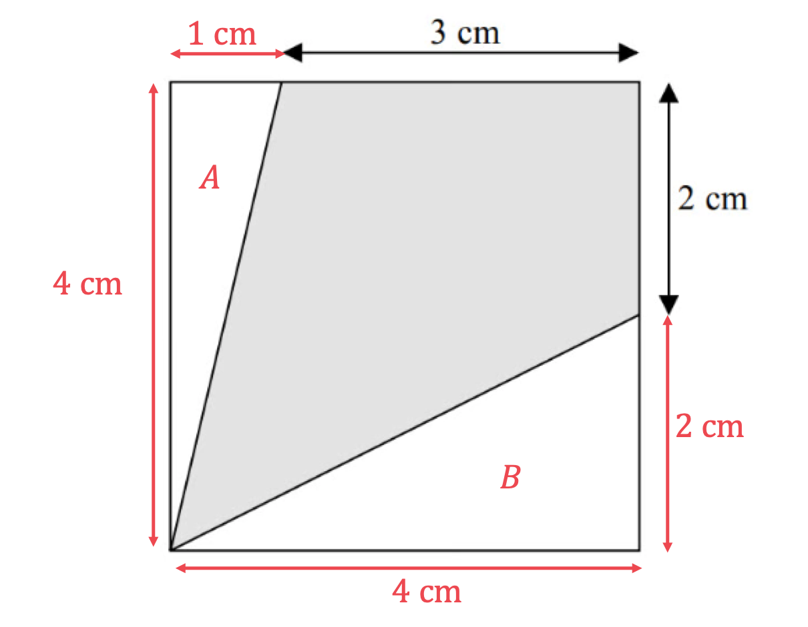

`table row A equals cell 1 half cross times 1 cross times 4 end cell end table`

**[1]**

`table row A equals cell 2 space cm squared end cell end table`

> *Calculate the area of the first triangle marked **B**.*

`table row A equals cell 1 half cross times 4 cross times 2 end cell row blank equals cell 4 space cm squared end cell end table`

**[1]**

> *Calculate the area of the square.*

`table row A equals cell 4 cross times 4 end cell row blank equals cell 16 space cm squared end cell end table`

> *Calculate the area of the shaded part by subtracting the area of triangles **A** and **B** from the area of the square.*

`table row A equals cell 16 minus 2 minus 4 end cell row blank equals cell 10 space cm squared end cell end table`

**[1]**

> *Calculate the proportion of the area of the square that is shaded by dividing the shaded area by the total area of the shape.*

$\frac{10}{16}$

> *Simplify.*

$\frac{5}{8}$* ***or ****0.625*** ***[1]**

## Q46 — hard — 5 marks · exam-questions

### 10() — 5 marks
> *Split the shape of the floor into two rectangles.*

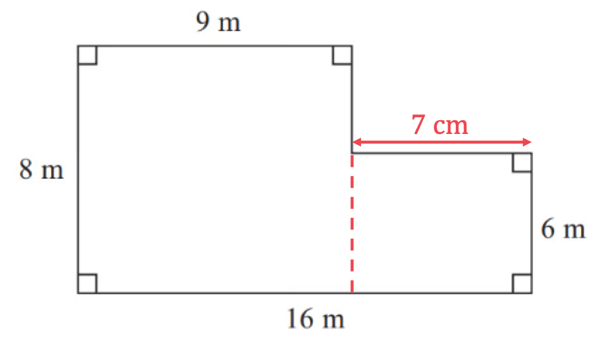

> *Calculate the area of each of the rectangles and add them together to find the total area of the floor.*

`table row A equals cell 9 cross times 8 plus 7 cross times 6 end cell end table`

**Splitting up the shape and correct method for one part of the area of the shape**** [1] **
**Complete correct method for finding the area of the whole shape**** [1]**

`table attributes columnalign right center left columnspacing 0px end attributes row A equals cell 72 plus 42 end cell row blank equals 114 end table`

> *Calculate how many tins of polish are required to cover the floor by dividing the total area of the floor by the number of square metres that one tin can cover. Round your answer up to the next integer.*

$\frac{114}{12}=9.5$
* **10 tins will be required to cover the whole floor*

> *Work out the normal cost of the polish by multiplying the number of tins required by the cost of each tin.*

$10\times19=190$

> *The price of the polish with the discount, will be 100% - 30% = 70% of the normal price. Turn 70% into a decimal by dividing by 100 and then multiply this by the cost of a tin.*

$\frac{70}{100}\times190=133$

**[1]**

** Correct values of 114 m****2**** and £133 seen**** [1]**

**No, the caretaker does not have enough money to buy the polish for the floor as he needs £133 but only has £130** **[1]**

## Q47 — hard — 5 marks · exam-questions

### 10() — 5 marks
> *Split the shape of the floor into a rectangle and a trapezium.*

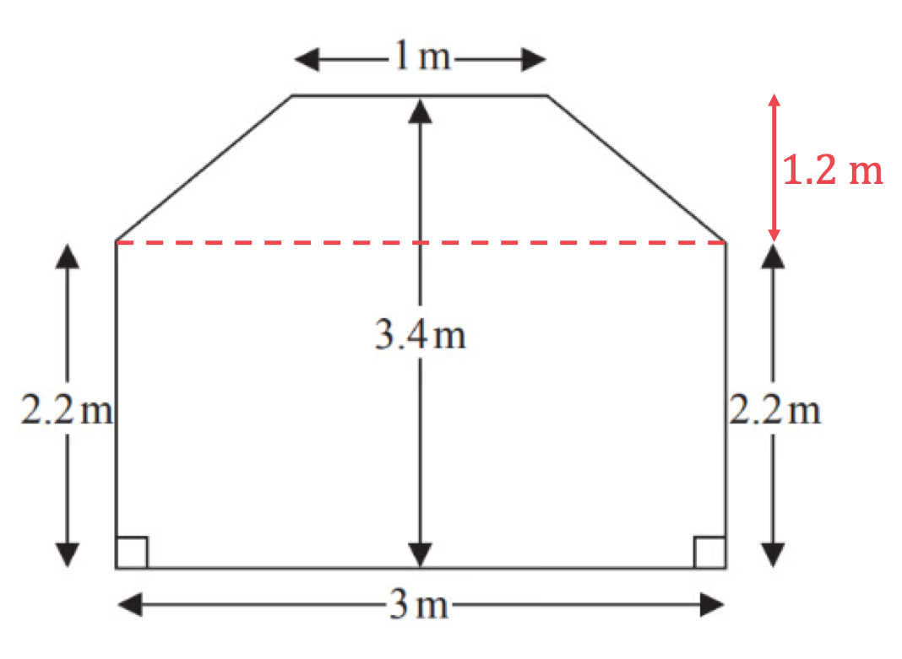

> *Calculate the area of the rectangle.*

`table row A equals cell 2.2 cross times 3 end cell row blank equals cell 6.6 space straight m squared end cell end table`

**[1]**

> *Calculate the area of the trapezium, using the formula: *`A equals 1 half open parentheses a plus b close parentheses h`*, where *$a$* and *$b$* are the lengths of the parallel sides and *$h$*is the perpendicular height.*

`table row A equals cell 1 half open parentheses 3 plus 1 close parentheses cross times 1.2 end cell row blank equals cell 2.4 space straight m squared end cell end table`

> *Calculate the total area of the floor by adding together the area of the rectangle and the trapezium.*

`table row A equals cell 6.6 plus 2.4 end cell row blank equals cell 9 space straight m squared end cell end table`

**[1]**

> *Calculate the number of packs of tiles that Mary will need by dividing the total floor area by the area covered by each pack of tiles.*

$\frac{9}{2}=4.5$* *
*Mary will need 5 packs of tiles*

**[1]**

> *A pack of tiles discounted by 25% will be 100% - 25% = 75% of its original cost. Convert this to a decimal by dividing by 100. Calculate the discounted cost of a pack of tiles by multiplying the normal cost by 0.75.*

`table row cell 24.80 cross times 0.75 end cell equals cell 18.60 end cell end table`

> *Find the total cost of tiling the floor by multiplying the cost of the discounted packs of tiles by the number of packs required.*

`table row cell 5 cross times 18.60 end cell equals 93 end table`

**[1]**

**Yes, Mary has enough money to buy all the tiles she needs as she only needs £93 but has £100 available ****[1]**

## Q48 — hard — 3 marks · exam-questions

### 2() — 3 marks
> *The area of the shaded region is equal to the area of the rectangle minus the area of the semicircle.*

> *Find the radius of the semicircle by dividing its diameter by 2.*

$r=\frac{12}{2}=6\mathrm{cm}$

> *Calculate the area of the semicircle, using *$A=\frac{1}{2}πr^{2}$*.*

`table row cell A subscript S C end subscript end cell equals cell space 1 half pi open parentheses 6 close parentheses squared end cell row blank equals cell space 36 over 2 pi space end cell row blank equals cell space 18 pi space cm squared end cell end table`

> *The width of the rectangle is equal to the radius of the semicircle.*

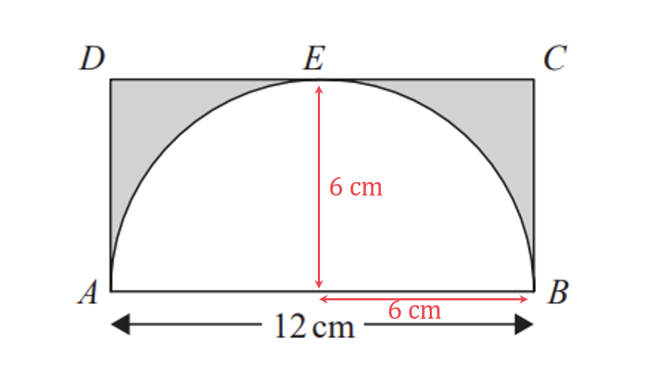

**AD*** = 12 ÷ 2 = 6 cm*

> *Calculate the area of the rectangle.*

*Area rectangle = 12 × 6 = 72 cm**2*

**Either area found ****[1]**

> *Calculate the area of the shaded area by subtracting the area of the semicircle  from the area of the rectangle.*

`table row cell A space end cell equals cell space 72 space minus space 18 pi space equals space 15.4513322... end cell end table`* **cm**2*

**[1]**

> *Round to 3 significant figures.*

**Area = 15.5 cm****2**** [1]**

## Q49 — hard — 4 marks · exam-questions

### 3() — 4 marks
> *Split the shape into two rectangles and label them **A **and **B**.*

> *The shorter side of rectangle **B** can be found.*

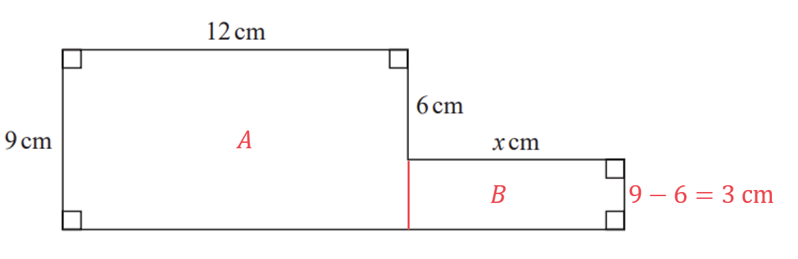

> *Calculate the area of each of the rectangles and add them together. *
*The area of rectangle **B **is found in terms of **x.*

`table row cell A space end cell equals cell space 9 cross times 12 space plus space 3 cross times x space equals space 108 space plus space 3 x end cell end table`

**Area for either rectangle found**** [1]**

> *Form an equation by setting the area equal to 129.*

$108+3x=129$

**[1]**

> *Solve the equation by subtracting 108 and dividing by 3.*

`table row cell 3 x space end cell equals cell space 129 space minus space 108 end cell row cell 3 x space end cell equals cell space 21 end cell row cell x space end cell equals cell space 21 over 7 end cell end table`

**[1]**

$x=7$ **[1]**

## Q50 — hard — 4 marks · exam-questions

### 9() — 4 marks
> *Calculate the length *$x$* using the ratio: *$4:x=1:2$*.*

$4:x\,1:2\,\,x=4\div1\times2=8$

**[1]**

> *The width of the smaller white rectangle is *$12\div4=3$* cm.*

> *Find the area of the top right rectangle (smaller shaded rectangle).*

*Area smaller shaded = *$3\times8=24$* **cm**2*

> *The width of the larger white rectangle is *$56\div8=7$* cm.*

> *Find the area of the bottom right rectangle (larger shaded rectangle).*

*Area larger shaded = *$4\times7=28$* **cm**2*

**[1]**

> *Find the total shaded area.*

*Area shaded = *$24+28=52$ *cm*2

**[1]**

> *Write as a ratio, putting shaded area first.*

`shaded space colon space unshaded space
space 52 space space colon space open parentheses 12 space plus space 56 close parentheses
52 space colon space 68 space space space space space space space space space space space space space space`

> *Simplify by dividing both parts by their highest common factor, 4.*

$13:17$* ***[1]**

## Q51 — hard — 4 marks · exam-questions

### 11() — 4 marks
> *Notice that the width of the rectangle is half of its length. *

*Let the width of the rectangle be *$x$*, then the length of the rectangle is *$2x$*.*

**[1]**

> *Add these dimensions to a small rectangle on the diagram.*

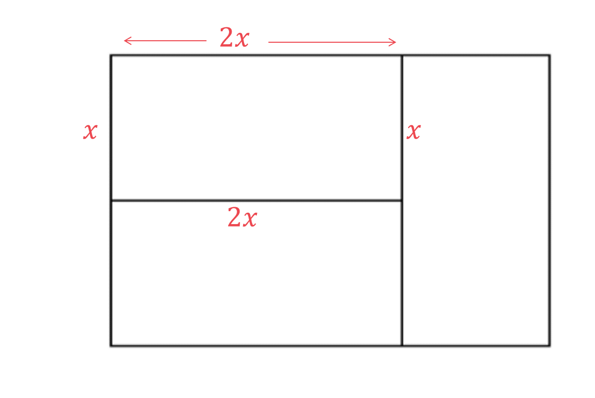

> *Form an equation by adding the four edges of the small rectangle together and letting it equal 15.*

$2x+x+2x+x=15$

**[1]**

> *Simplify and solve to find *$x$*.*

`table row cell 6 x space end cell equals cell space 15 end cell row cell x space end cell equals cell space 15 over 6 space equals space 2.5 space cm end cell end table`

**[1]**

> *So the width of a small rectangle is 2.5 cm and the length is 5 cm.*

> *Add these to the outside of the diagram.*

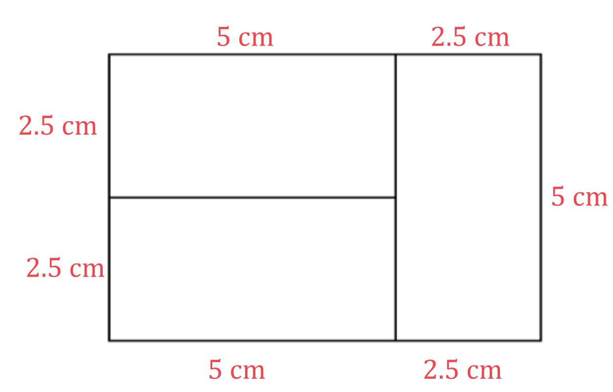

> *Find the perimeter by adding the lengths around edge of the big rectangle together.*

$P=5+2.5+5+2.5+5+2.5+2.5$

** ****Perimeter = 25 cm**** [1]**

## Q52 — hard — 4 marks · exam-questions

### 20() — 4 marks
> *First find the area of the whole triangle*

> **[exam-tip]**
> Remember the area for any triangle can be found using the formula $\frac{1}{2}ab\mathrm{sin}C$. It is an equilateral triangle, so the angles are all equal to 60°.

`table row cell 1 half space cross times space 10 space cross times space 10 space cross times space sin open parentheses 60 close parentheses space end cell equals cell space 25 square root of 3 end cell row blank equals cell 43.30... cm squared end cell end table`

**[M1]**

> *Create a right-angled triangle to find the radius of the circle*

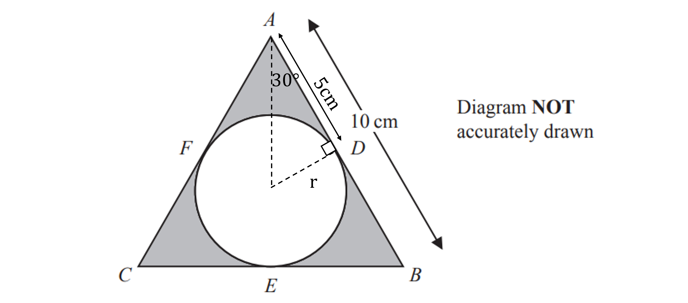

> *Use SOHCAHTOA to find *$r$

`tan open parentheses 30 close parentheses space equals fraction numerator space r over denominator 5 end fraction`

`5 space cross times space tan open parentheses 30 close parentheses space equals space r`

$r=\frac{5\sqrt{3}}{3}$

**[M1]**

> *Find the area of the circle*

`table row cell straight pi space cross times space open parentheses fraction numerator 5 square root of 3 over denominator 3 end fraction close parentheses squared space end cell equals cell fraction numerator space 25 over denominator 3 end fraction straight pi end cell row blank equals cell 26.17... space cm squared end cell end table`

**[A1]**

> *Subtract the area of the circle from the area of the triangle to find the shaded area*

$25\sqrt{3}-\frac{25}{3}π=17.121...$

> *Round to 3 significant figures*

$17.1\mathrm{cm}^{2}$

**[A1]**
