# Exam Questions — Circles, Arcs & Sectors
**Shape, Space & Measure** · Edexcel IGCSE Maths A (Modular) (4XMAF/4XMAH) — 24/Higher Unit 1
> Source: [https://www.savemyexams.com/igcse/maths/edexcel/a-modular/24/higher-unit-1/topic-questions/shape-space-and-measure/circles-arcs-and-sectors/exam-questions/](https://www.savemyexams.com/igcse/maths/edexcel/a-modular/24/higher-unit-1/topic-questions/shape-space-and-measure/circles-arcs-and-sectors/exam-questions/) · 60 questions · total 229 marks

## Q1 — very_hard — 4 marks · exam-questions

### 20() — 4 marks — command: work_out — structured — from paper 2015	November · 1MA0/2H
Here are two watch faces, **A** and **B**.

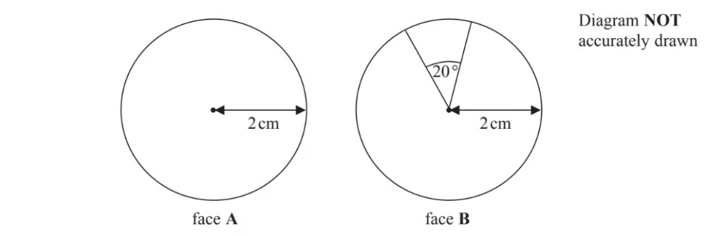

Both watch faces are circular with radius 2cm.

The materials used to make both watch faces have the same thickness.

**A** is made entirely of plastic. 
**B** has a 20° sector of metal and a 340° sector of plastic.

The ratio of the cost per cm2 of the metal to the cost per cm2 of the plastic is 3 : 2

Work out the ratio of the cost of the materials for **A** to the cost of the materials for **B**. 
Give your answer in its simplest form. 
You must show all your working.

## Q2 — hard — 5 marks · exam-questions

### 11() — 5 marks — command: determine — structured — from paper 2017	June · 1MA0/2H
The diagram shows a plan of Brian's lawn.

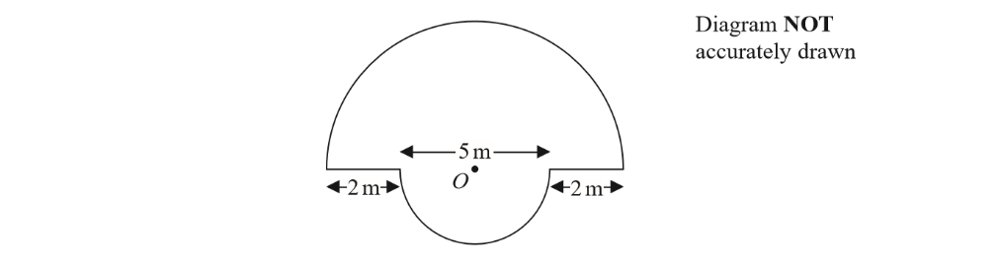

The edge of the lawn consists of two semicircles and two straight lines. 
Each semicircle has centre $O$. 
The diameters of the semicircles are 9 m and 5 m.

Brian is going to put lawn edging around the edge of the lawn. Lawn edging is sold in 2.4 metre rolls.

Brian has £35

| **Lawn edging**  £3.99 per roll or 3 rolls for £10 |
|---|

Has Brian got enough money to buy all the rolls of lawn edging he needs? 
You must show all your working.

## Q3 — easy — 2 marks · exam-questions

### 12() — 2 marks — command: work_out — structured — from paper November 2013 · 1MA0/2H
A circle has a diameter of 140 cm.

Work out the circumference of the circle. Give your answer correct to 3 significant figures.

## Q4 — very_hard — 5 marks · exam-questions

### 9() — 5 marks — command: work_out — structured — from paper Jan 2022 · 4MA1/2HR
In the diagram, $ABC$ is a right-angled triangle and $DEF$ is a semicircular arc.

In triangle $ABC$

| $BC=24\mathrm{cm}$ | $\mathrm{angle}ABC=90^{\circ}$ | $\mathrm{angle}BCA=30^{\circ}$ |
|---|---|---|

The points $D$ and $F$ lie on $AC$ so that $DF$ is the diameter of the semicircular arc $DEF$ 
The radius of the semicircular arc is 3cm.

Work out the length of $AFEDC$ 
Give your answer correct to 2 significant figures.

## Q5 — hard — 4 marks · exam-questions

### 11() — 4 marks — command: determine — structured — from paper 2014	November · 1MA0/2H
Saphia is organising a conference.

People at the conference will sit at circular tables.

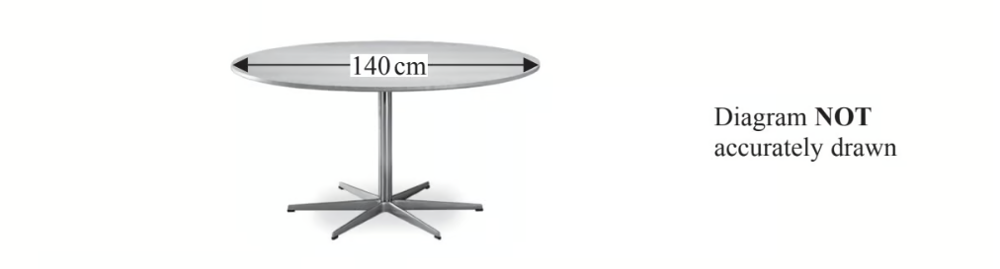

Each table has a diameter of 140 cm. 
Each person needs 60 cm around the circumference of the table.

There are 12 of these tables in the conference room. 
A total of 90 people will be at the conference.

Are there enough tables in the conference room?

## Q6 — easy — 2 marks · exam-questions

### 4() — 2 marks — command: work_out — structured — from paper June 2014 · 1MA0/2H
Here is a circle.

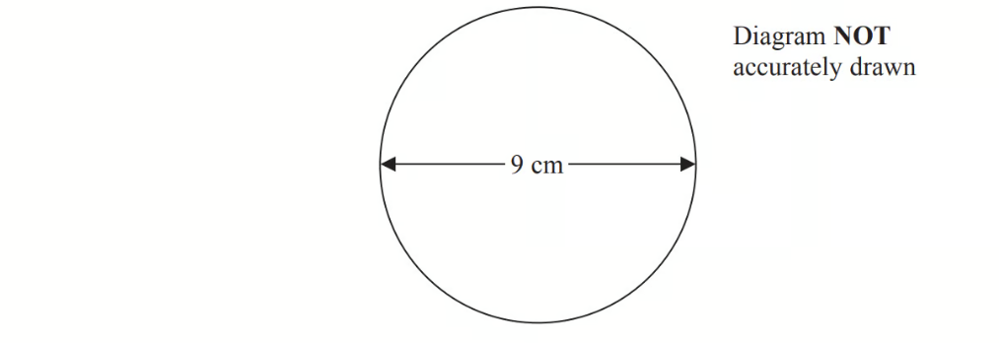

The diameter of the circle is 9 cm.

Work out the circumference of this circle. Give your answer correct to 3 significant figures.

## Q7 — very_hard — 6 marks · exam-questions

### 22() — 6 marks — command: find — structured — from paper Jan 2021 · 4MA1/2H
The diagram shows a sector $OBC$ of a circle with centre $O$ and radius $(6+x)\mathrm{cm}$.

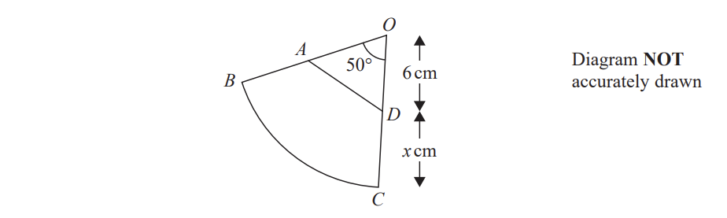

$A$ is the point on $OB$ and $D$ is the point on $OC$ such that $OA=OD=6\mathrm{cm}$

Angle $BOC=50^{\circ}$

Given that

the perimeter of sector $OBC=2\times$the perimeter of triangle $OAD$

find the value of $x$. 
Give your answer correct to 3 significant figures.

## Q8 — hard — 5 marks · exam-questions

### 17() — 5 marks — command: calculate — structured — from paper June 2017 · 1MA1/2H
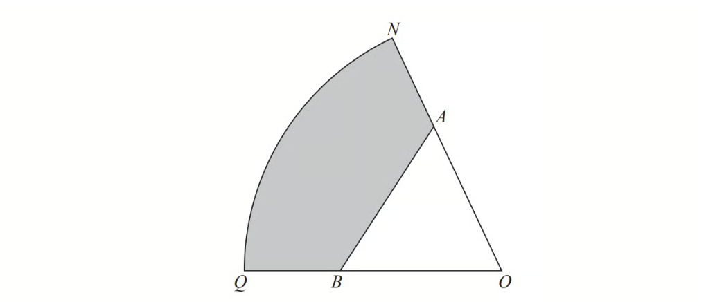

$ONQ$ is a sector of a circle with centre $O$ and radius 11 cm.

$A$ is the point on $ON$ and $B$ is the point on $OQ$ such that $AOB$ is an equilateral triangle of side 7 cm.

Calculate the area of the shaded region as a percentage of the area of the sector $ONQ$. 
Give your answer correct to 1 decimal place.

## Q9 — easy — 2 marks · exam-questions

### 19() — 2 marks — command: calculate — structured — from paper March 2013 · 1MA0/2H
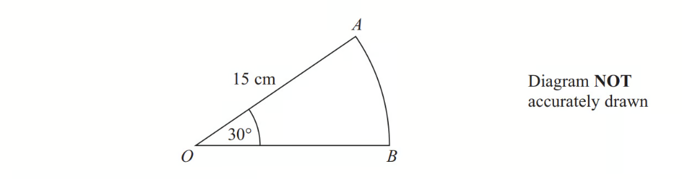

$OAB$ is a sector of a circle, centre $O$. The radius of the circle is 15 cm. The angle of the sector is $30^{\circ}$.

Calculate the area of sector $OAB$. Give your answer correct to 3 significant figures.

## Q10 — very_hard — 6 marks · exam-questions

### 25() — 6 marks — command: calculate — structured — from paper June 2021 · 4MA1/1H
The diagram shows two circles such that the region $R$, shown shaded in the diagram, is the region common to both circles.

One of the circles has centre $O$ and radius 5cm. 
The other circle has centre $P$ and radius 4 cm. 
Angle $AOB=50^{\circ}$

Calculate the area of region $R$. 
Give your answer correct to 3 significant figures.

...................................................... cm2

## Q11 — hard — 4 marks · exam-questions

### 11() — 4 marks — command: work_out — structured — from paper November 2016 · 1MA0/2H
The diagram shows a square $ABCD$ inside a circle.

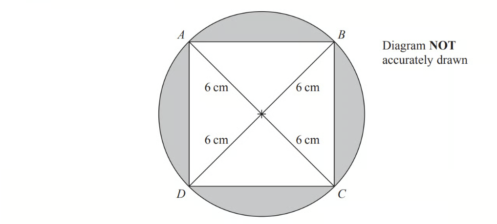

The points $A,B,C$ and $D$ lie on the circle.

The radius of the circle is 6 cm.

Work out the total area of the shaded regions. 
Give your answer correct to 3 significant figures.

## Q12 — easy — 2 marks · exam-questions

### 17() — 2 marks — command: work_out — structured — from paper Sample 2015 · 1MA1/2H
The diagram shows a sector of a circle of radius 7 cm.

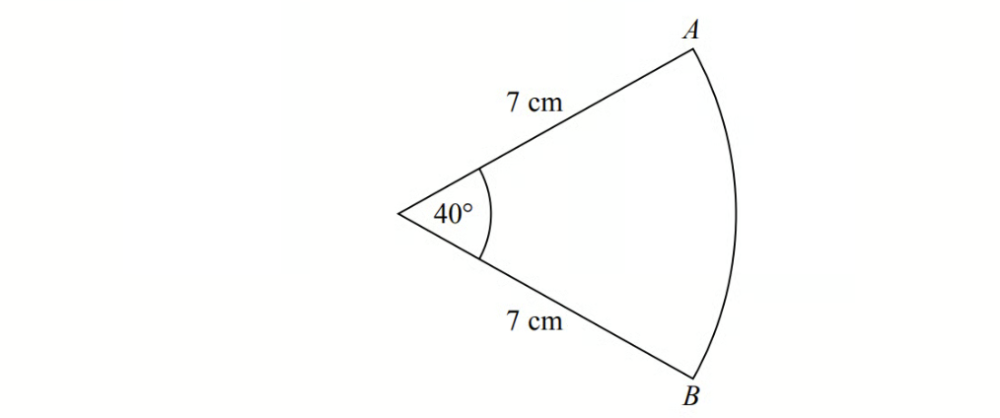

Work out the length of arc $AB$. Give your answer correct to 3 significant figures.

## Q13 — very_hard — 6 marks · exam-questions

### 26() — 6 marks — command: work_out — structured — from paper Jan 2020 · 4MA1/2H
Here is a sector, $AOB$ , of a circle with centre $O$and angle $AOB$= $x^{\circ}$

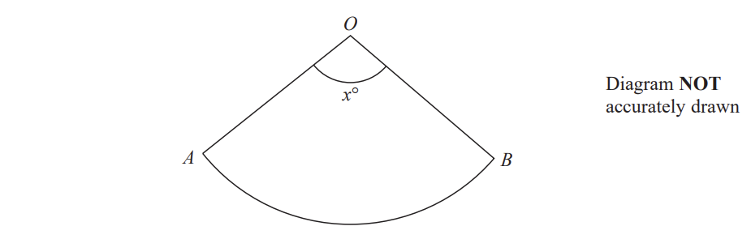

The sector can form the curved surface of a cone by joining $OA$to $OB$ .

The height of the cone is $25\mathrm{cm}$. 
The volume of the cone is $1600\mathrm{cm}^{3}$

Work out the value of $x.$ 
Give your answer correct to the nearest whole number.

$x=$.......................

## Q14 — hard — 4 marks · exam-questions

### 4() — 4 marks — command: show — structured — from paper November 2017 · 1MA1/1H
The diagram shows a logo made from three circles.

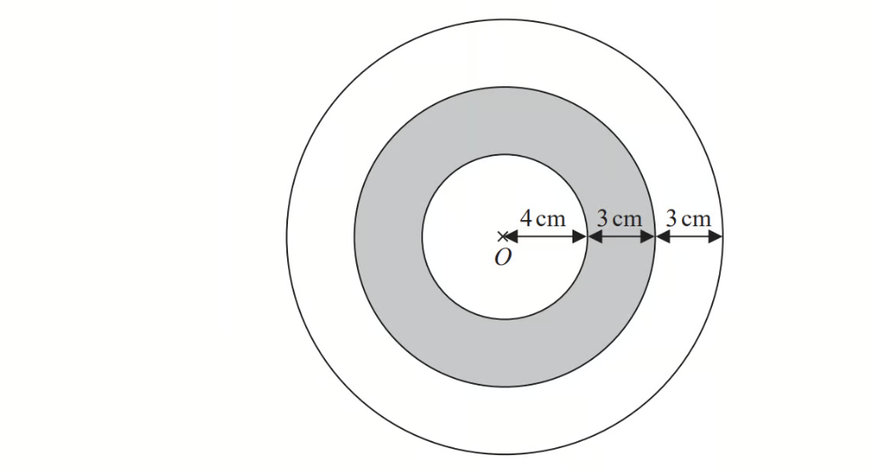

Each circle has centre $O$. 
Daisy says that exactly $\frac{1}{3}$ of the logo is shaded.

Is Daisy correct? 
You must show all your working.

## Q15 — easy — 2 marks · exam-questions

### 16() — 2 marks — command: work_out — structured — from paper Spec2 2015 · 1MA1/3H
The diagram shows a sector of a circle of radius 4 cm.

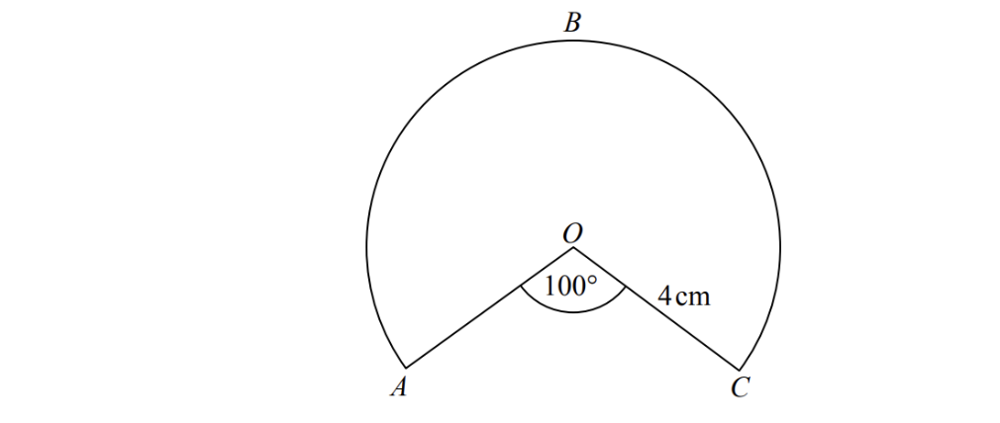

Work out the length of the arc $ABC$. Give your answer correct to 3 significant figures.

## Q16 — very_hard — 6 marks · exam-questions

### 25() — 6 marks — command: work_out — structured — from paper Jan 2019 · 4MA1/2HR
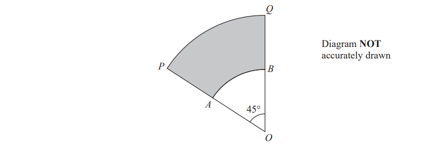

$OPQ$ is a sector of a circle, centre $O$
 $OAB$ is a sector of a circle, centre $O$

$A\mathrm{is} \mathrm{the} \mathrm{point} \mathrm{on}OP\mathrm{such} \mathrm{that}OA:AP=3:2\,B\mathrm{is} \mathrm{the} \mathrm{point} \mathrm{on}OQ\mathrm{such} \mathrm{that}OB:BQ=3:2$ 
Angle $POQ=45^{\circ}$

The area of the shaded region is $\frac{81}{2}π\mathrm{cm}^{2}$

Work out the perimeter of the shaded region. 
Give your answer in terms of $π$.

## Q17 — hard — 3 marks · exam-questions

### 7() — 3 marks — command: work_out — structured — from paper Spec2 2015 · 1MA1/2H
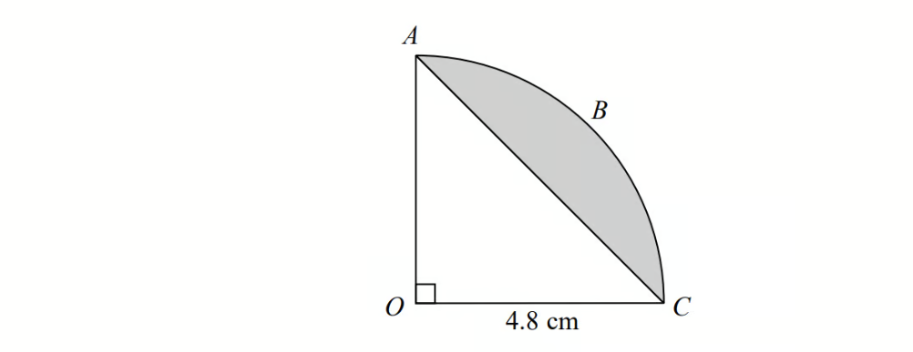

The arc $ABC$ is a quarter of a circle with centre $O$ and radius 4.8 cm. $AC$ is a chord of the circle.

Work out the area of the shaded segment. Give your answer correct to 3 significant figures.

## Q18 — easy — 2 marks · exam-questions

### 11() — 2 marks — command: calculate — structured — from paper Jan 2022 · 4MA1/1HR
The diagram shows sector $OPQ$of a circle, centre $O$

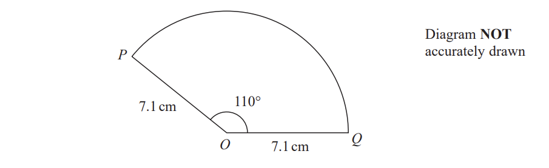

$OP=OQ=7.1\mathrm{cm}$ Angle $POQ=110^{\circ}$ Calculate the area of sector $OPQ$ Give your answer correct to one decimal place.

## Q19 — very_hard — 6 marks · exam-questions

### 19() — 6 marks — command: work_out — structured — from paper June 2019 · 4MA1/2HR
The diagram shows a sector $OAPB$ of a circle, centre $O$

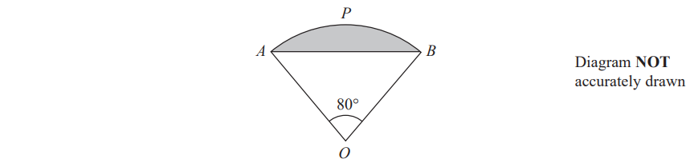

$AB$ is a chord of the circle.

Angle$AOB=80^{\circ}$

The area of sector $OAPB$ is $\frac{25}{2}π\mathrm{cm}^{2}$

Work out the perimeter of the shaded segment. 
Give your answer correct to 3 significant figures.

......................$\mathrm{cm}$

## Q20 — hard — 3 marks · exam-questions

### 22() — 3 marks — command: calculate — structured — from paper June 2016 · 1MA0/2H
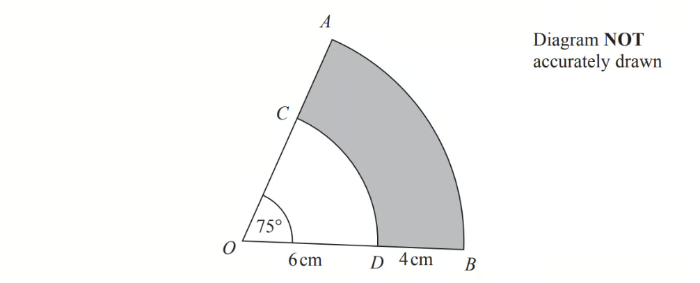

$OAB$ is a sector of a circle, centre $O$. 
$OCD$ is a sector of a circle, centre $O$. 
$OCA$ and $ODB$ are straight lines.

Angle $AOB=75^{\circ}$
 $OD=6\mathrm{cm}\,DB=4\mathrm{cm}$

Calculate the perimeter of the shaded region. 
Give your answer correct to 3 significant figures.

## Q21 — easy — 2 marks · exam-questions

### 12() — 2 marks — command: work_out — structured — from paper June 2021 · 4MA1/1H
The diagram shows a sector of a circle with radius 7 cm.

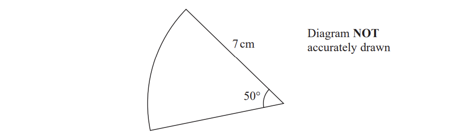

Work out the length of the arc of the sector. Give your answer correct to one decimal place.

....................................................... cm

## Q22 — very_hard — 4 marks · exam-questions

### 27() — 4 marks — command: work_out — structured — from paper Nov 2021 · 8300/1H
The vertices of a regular hexagon lie on a circle with centre $O$ and radius 5 cm

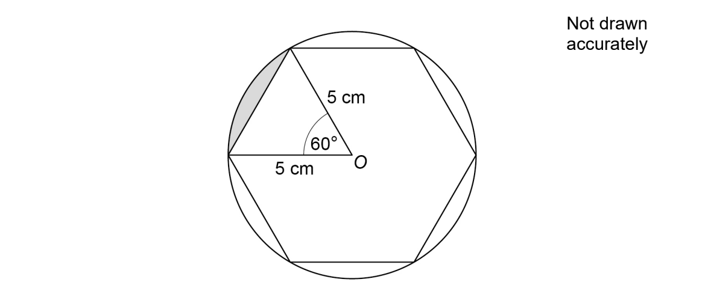

Work out the shaded area. 
Give your answer in the form $\frac{aπ-b\sqrt{c}}{12}$ where $a,b$ and $c$ are integers.

## Q23 — hard — 5 marks · exam-questions

### 18() — 5 marks — command: work_out — structured — from paper June 2017 · 1MA1/3H
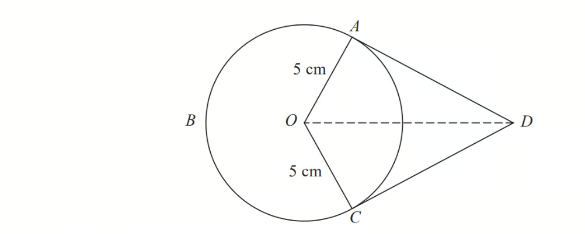

$A,B$ and $C$ are points on a circle of radius 5 cm, centre $O$.
 $DA$ and $DC$ are tangents to the circle. 
$DO=9\mathrm{cm}$

Work out the length of arc $ABC$. 
Give your answer correct to 3 significant figures.

## Q24 — easy — 3 marks · exam-questions

### 10() — 3 marks — command: calculate — structured — from paper Jan 2019 · 4MA1/1HR
The shape, shown shaded in the diagram, is the region between two semicircles.

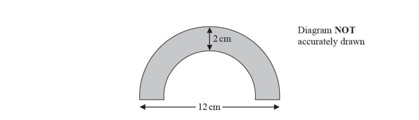

The diameter of the outer semicircle is $12\mathrm{cm}$. The shape has constant thickness $2\mathrm{cm}$.

Calculate the area of the shape. Give your answer as a multiple of $π$.

$\mathrm{cm}^{2}$

## Q25 — very_hard — 4 marks · exam-questions

### 26() — 4 marks — command: work_out — structured — from paper Nov 2019 · 8300/1H
Here are a circle and a sector of the circle.

They each have radius $r$.

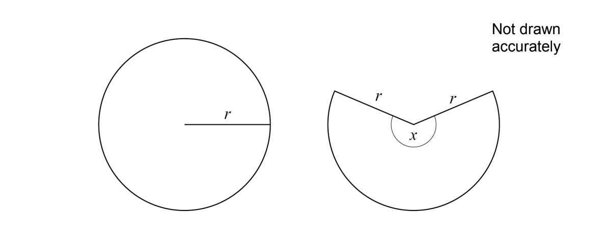

circumference of circle = perimeter of sector

Work out the size of angle $x$.

Give your answer in terms of $π$.

...................................degrees

## Q26 — hard — 5 marks · exam-questions

### 20() — 5 marks — command: calculate — structured — from paper November 2017 · 1MA1/2H
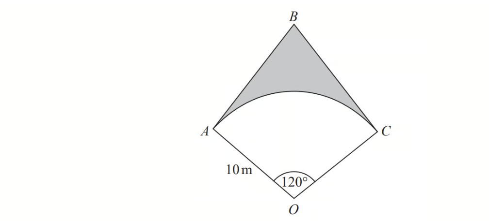

$OAC$ is a sector of a circle, centre $O$, radius 10 m.

$BA$ is the tangent to the circle at point $A$.
$BC$ is the tangent to the circle at point $C$.

Angle $AOC=120^{\circ}$

Calculate the area of the shaded region. 
Give your answer correct to 3 significant figures.

## Q27 — easy — 1 marks · exam-questions

### 3() — 1 mark — command: work_out — structured — from paper June 2019 · 8300/1H
Work out the arc length, in metres, of a semicircle of radius 6 metres.

Circle your answer.

| $3\text{π}$ | $6π$ | $12π$ | $18π$ |
|---|---|---|---|

## Q28 — very_hard — 5 marks · exam-questions

### 9() — 5 marks — command: what — structured — from paper Nov 2018 · 8300/3H
A motor racing circuit consists of

two parallel straight sections, each of length 0.75 km    
   a semicircle of diameter 0.9 km
   three equal, smaller semicircles.

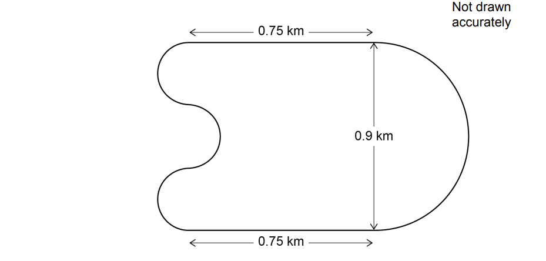

The length of a motor race must be greater than 305 km

What is the lowest number of **full** laps needed at this circuit? You **must** show your working.

## Q29 — hard — 5 marks · exam-questions

### 11() — 5 marks — command: work_out — structured — from paper Jan 2020 · 4MA1/2H
The diagram shows a shaded shape $ABCD$made from a semicircle 
$ABC$and a right-angled triangle $ACD$.

$AC$is the diameter of the semicircle $ABC$.

Work out the perimeter of the shaded shape. 
Give your answer correct to 3 significant figures.

....................$\mathrm{cm}$

## Q30 — easy — 1 marks · exam-questions

### 5() — 1 mark — command: what — structured — from paper Nov 2018 · 8300/2H
A circle has circumference $C$ and diameter $d$.    $C=kd$ What **value** does the constant $k$ represent?

## Q31 — very_hard — 5 marks · exam-questions

### 18() — 5 marks — command: work_out — structured — from paper June 2018 · 8300/1H
Here is a tunnel for a toy train.

The diagram below shows the cross section of the tunnel.

$AD$ is a semicircular arc of radius 10 cm 
$BC$ is a semicircular arc of radius 7 cm 
The length of the tunnel is 30 cm

Work out the total area of all **six** faces of the tunnel. 
Give your answer in terms of $π$.

....................cm2

## Q32 — hard — 5 marks · exam-questions

### 12() — 5 marks — command: find — structured — from paper Nov 2018 · J560/05
AOB is a sector of a circle, centre O and radius 6cm. The length of arc AB is $5π$cm.

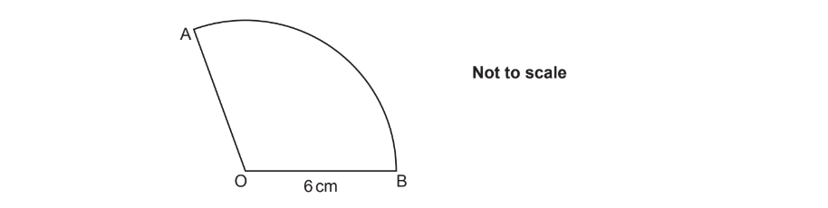

Find the area of the sector. 
Give your answer in terms of $π$.

......................... cm2

## Q33 — easy — 2 marks · exam-questions

### 7() — 2 marks — command: work_out — structured — from paper Nov 2017 · 8300/1H
Here is a quarter circle of radius 6 cm

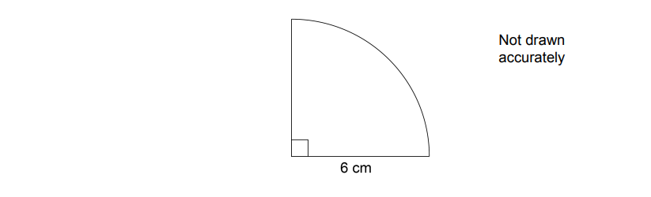

Work out the area of the quarter circle. Give your answer in terms of $π$.

............................cm2

## Q34 — very_hard — 5 marks · exam-questions

### 22() — 5 marks — command: show — structured — from paper Nov 2017 · 8300/2H
The cross section of an earring is a semicircle, centre $C$, radius 25 mm 
The earring is black and white.

The shaded area is black.

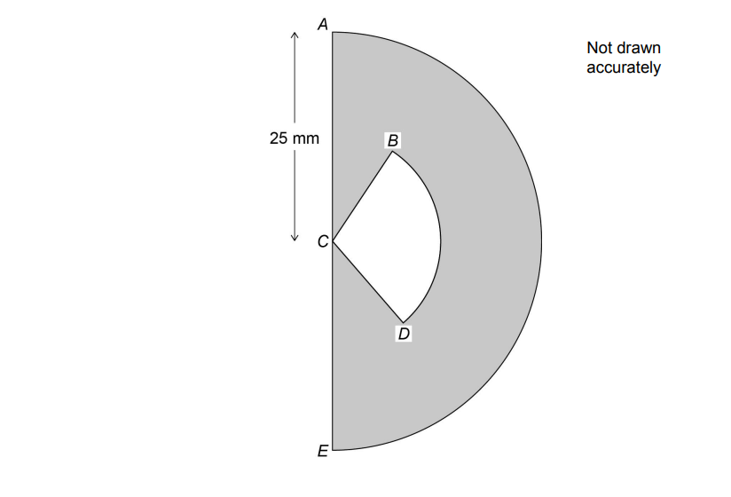

Sector $BCD$ is white and has radius 12 mm

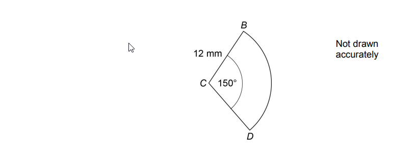

Is more than 20% of the semicircle white?

You **must** show your working.

## Q35 — hard — 5 marks · exam-questions

### 6() — 5 marks — command: calculate — structured — from paper June 2017 · J560/04
The diagram shows a semi-circle inside a rectangle of length 120 m. 
The semi-circle touches the rectangle at A, B and C.

Calculate the **perimeter **of the shaded region. 
Give your answer correct to 3 significant figures.

...................................................... m

## Q36 — easy — 2 marks · exam-questions

### 2((a)) — 2 marks — command: calculate — structured — from paper June 2017 · J560/04
A circular table top has radius 70 cm.

Calculate the area of the table top in cm2, giving your answer as a multiple of$π$.

....................... cm2

## Q37 — very_hard — 5 marks · exam-questions

### 25() — 5 marks — command: show — structured — from paper June 2017 · 8300/2H
The diagram shows a logo.

$ABE$ and $DCE$ are congruent triangles. 
$BCE$ is a sector of a circle, centre $E$.

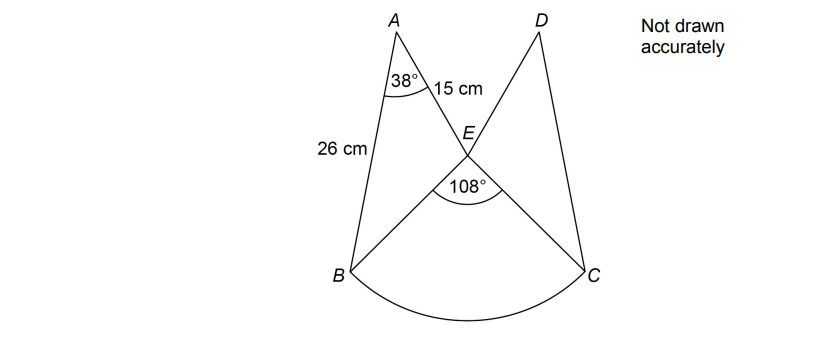

Show that the area of the logo is 510 cm2 to 2 significant figures.

## Q38 — hard — 4 marks · exam-questions

### 18() — 4 marks — command: find — structured — from paper Specimen 2015 · J560/04
Four pencils are held together with a band. 
The figure below shows the bottom end of the pencils and the band.

Each of the pencils has diameter 9 mm. 
Find the length of the band in this position.

............................ mm

## Q39 — medium — 3 marks · exam-questions

### 5() — 3 marks — command: work_out — structured — from paper March 2013 · 1MA0/2H
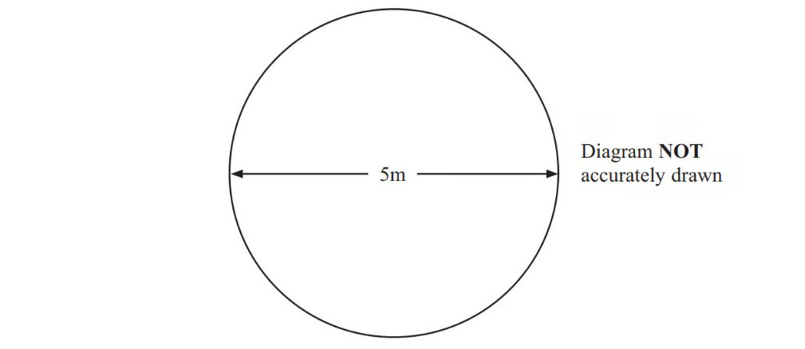

Jon has a flower garden in the shape of a circle. 
The diameter of the garden is 5 metres.

Jon wants to put fencing around the edge of the garden. 
The fencing costs £1.80 per metre.

Work out the total cost of the fencing.

£ .................................

## Q40 — very_hard — 6 marks · exam-questions

### 7() — 6 marks — command: work_out — structured — from paper June 2019 · J560/04
The diagram shows a shape ABCDE. 
The shape is made from a rectangle, a right-angled triangle and a quarter of a circle.

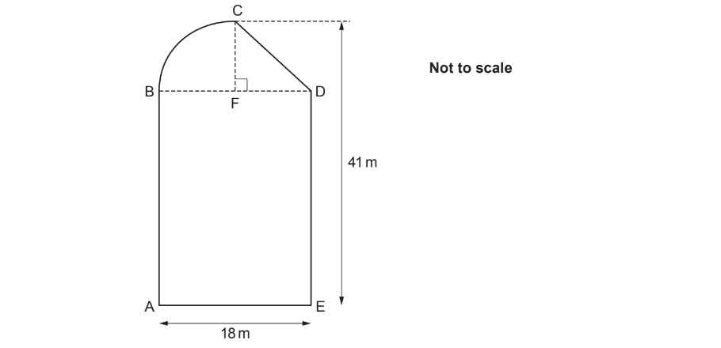

F is the mid-point of BD. 
AE = 18 m and the perpendicular distance from C to AE is 41 m.

Work out the **perimeter **of the shape ABCDE.

....................................................... m

## Q41 — medium — 3 marks · exam-questions

### 12() — 3 marks — command: work_out — structured — from paper November 2012 · 1MA0/1H
The diagram shows a circle drawn inside a square.

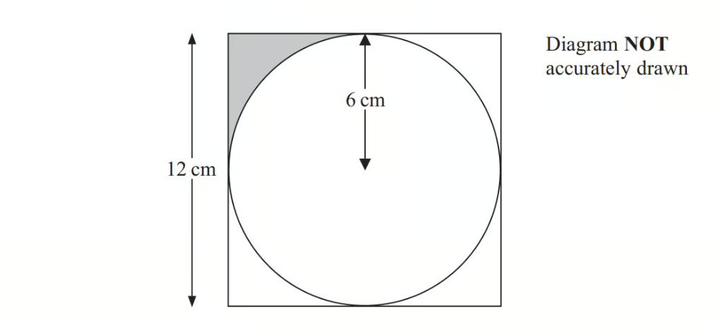

The circle has a radius of 6 cm. 
The square has a side of length 12 cm.

Work out the shaded area. 
Give your answer in terms of $π$.

## Q42 — very_hard — 6 marks · exam-questions

### 15() — 6 marks — command: show — structured — from paper June 2019 · J560/05
OAB is a sector of a circle, centre O.

OA = 6 cm and AX is perpendicular to OB.

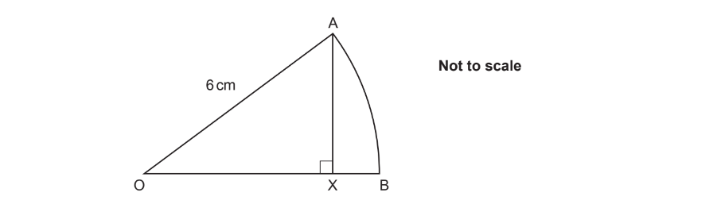

The area of sector OAB is 6$π$cm2. 
Show that AX = 3 $\sqrt{3}$ cm.

## Q43 — medium — 3 marks · exam-questions

### 12() — 3 marks — command: work_out — structured — from paper June 2016 · 1MA0/1H
The diagram shows a circle inside a square.

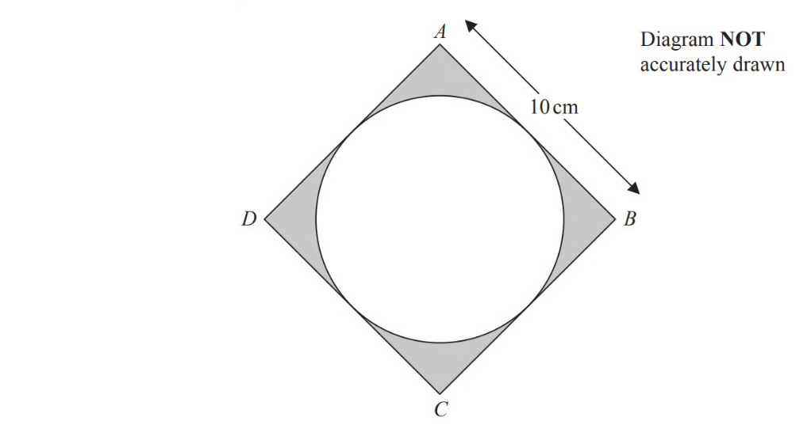

$ABCD$ is a square of side 10cm. 
Each side of the square is a tangent to the circle.

Work out the total area of the shaded regions in terms of $π$. 
Give your answer in its simplest form.

## Q44 — very_hard — 5 marks · exam-questions

### 8() — 5 marks — command: calculate — structured — from paper June 2018 · J560/04
A, B, C and D are points on the circumference of a circle, centre O.

Angle CAD = 28° and CD = 6.4cm. 
BD is a diameter of the circle.

Calculate the area of the circle.

...................... cm2

## Q45 — medium — 4 marks · exam-questions

### 11() — 4 marks — command: work_out — structured — from paper June 2015 · 1MA0/2H
The diagram shows the top of Levi's birthday cake.

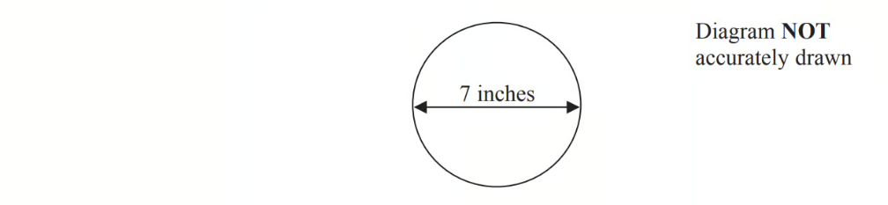

The top of the cake is in the shape of a circle. The diameter of the circle is 7 inches.

A ribbon is going to be put around the side of the cake. Ribbons are sold in 50 cm lengths.

1 inch is 2.54 cm.

Work out if one length of ribbon is long enough to go all the way around the cake. 
You must show your working.

## Q46 — very_hard — 3 marks · exam-questions

### 12() — 3 marks — command: find — structured — from paper Specimen 2015 · J560/05
Three identical small circles are drawn inside one large circle, as shown in the diagram. The centres of the small circles lie on the diameter of the large circle.

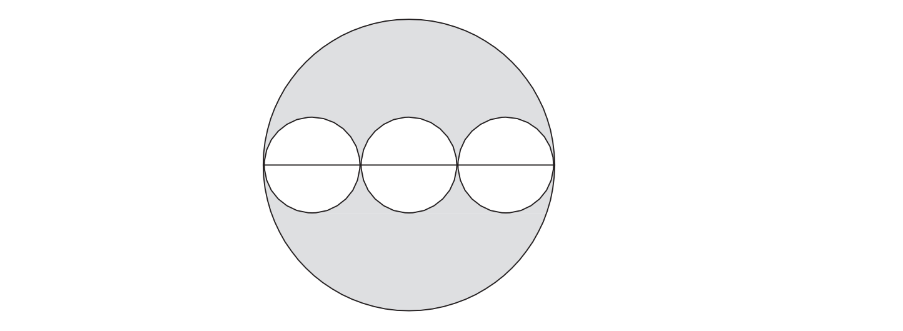

Find the fraction of the large circle that is shaded.

## Q47 — medium — 3 marks · exam-questions

### 3((a)) — 2 marks — command: find — structured — from paper November 2017 · 1MA0/2H
Hasmeet walks once round a circle with diameter 80 metres.

There are 8 points equally spaced on the circumference of the circle.

Find the distance Hasmeet walks between one point and the next point.

### 3((b)) — 1 mark — command: give — structured — from paper November 2017 · 1MA1/2H
Four of the points are moved, as shown in the diagram below.

Hasmeet walks once round the circle again.

Has the mean distance that Hasmeet walks between one point and the next point changed?
 You must give a reason for your answer.

## Q48 — medium — 4 marks · exam-questions

### 12() — 4 marks — command: calculate — structured — from paper June 2019 · 1MA1/2H
$OAB$ is a sector of a circle with centre $O$ and radius 7 cm.

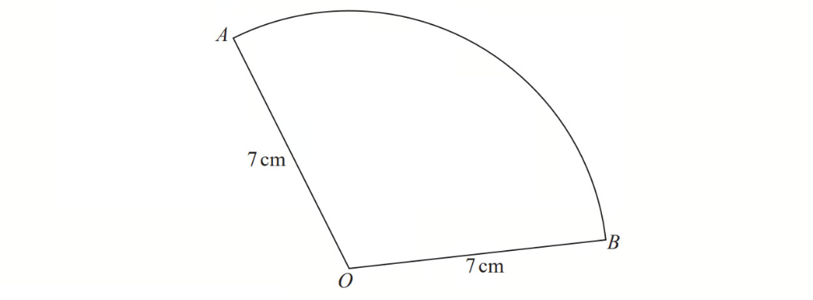

The area of the sector is 40 cm2.

Calculate the perimeter of the sector. 
Give your answer correct to 3 significant figures.

## Q49 — medium — 4 marks · exam-questions

### 16() — 4 marks — command: work_out — structured — from paper Jan 2022 · 4MA1/1H
The diagram shows a circle with centre $O$

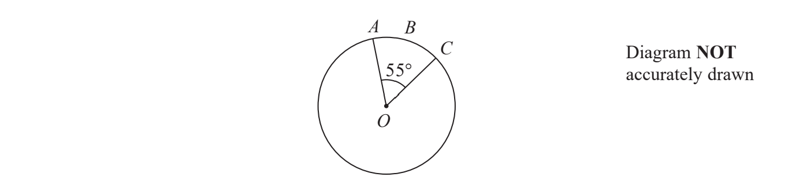

$A,B$ and $C$are points on the circle so that the length of the arc $ABC$ is 5 cm.

Given that angle $AOC$ = 55°

work out the area of the circle. 
Give your answer correct to one decimal place.

## Q50 — medium — 3 marks · exam-questions

### 8() — 3 marks — command: work_out — structured — from paper Jan 2021 · 4MA1/1H
The region, shown shaded in the diagram, is a path.

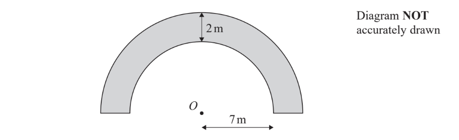

The boundary of the path is formed by two semicircles, with the same centre $O$, and two straight lines.

The inner semicircle has a radius of 7 metres. 
The path has a width of 2 metres.

Work out the perimeter of the path. 
Give your answer correct to one decimal place.

...................................................... m

## Q51 — medium — 4 marks · exam-questions

### 11() — 4 marks — command: calculate — structured — from paper Jan 2021 · 4MA1/2HR
A circle centre $O$ has radius 9 cm.

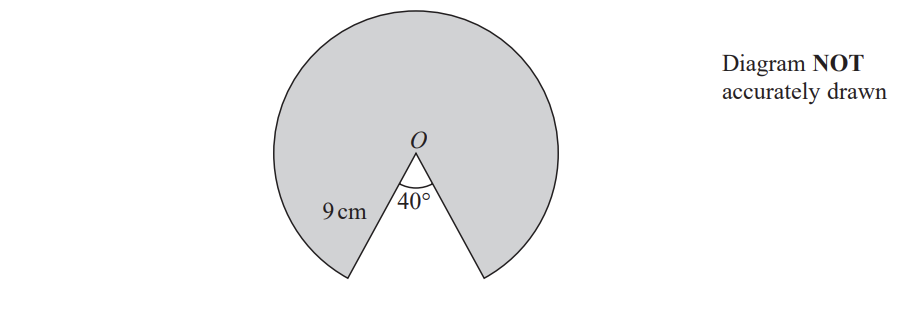

Calculate the perimeter of the shaded sector of the circle. 
Give your answer correct to 3 significant figures.

...................................................... cm

## Q52 — medium — 3 marks · exam-questions

### 5() — 3 marks — command: show — structured — from paper Jan 2020 · 4MA1/1HR
The diagram shows Yuen’s garden.

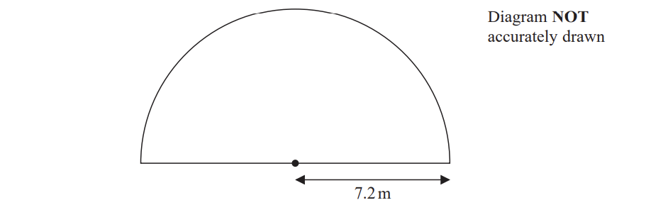

The garden is in the shape of a semicircle of radius $7.2m$. 
Yuen is going to cover his garden with grass seed.

Yuen has 12 boxes of grass seed. 
Each box of grass seed contains enough seed to cover $6m^{2}$ of the garden.

Has Yuen enough grass seed for his garden? 
Show your working clearly.

## Q53 — medium — 4 marks · exam-questions

### 12((b)) — 4 marks — command: work_out — structured — from paper Nov 2020 · 8300/1H
Two wire shapes make an earring. 
The shapes are

a circle with radius 21 mm

and

a quarter circle.

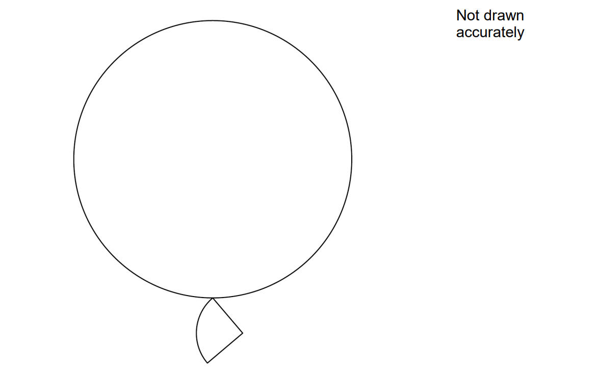

| radius of circle : radius of quarter circle = 7 : 2 |
|---|

Work out the **total **length of the wire in the earring.

Give your answer in the form $aπ+b$ where $a$ and $b$ are integers.

...............................mm

## Q54 — medium — 4 marks · exam-questions

### 9() — 4 marks — command: how — structured — from paper June 2019 · 8300/1H
A shaded semicircle is inside a circle as shown.

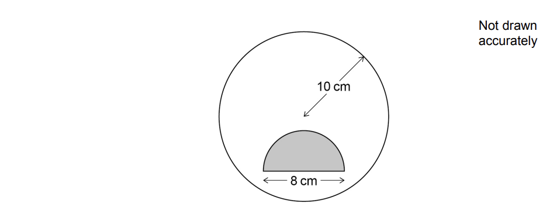

The **radius **of the circle is 10 cm 
The **diameter **of the semicircle is 8 cm

How many times bigger is the unshaded area than the shaded area?

## Q55 — medium — 2 marks · exam-questions

### 16() — 2 marks — command: show — structured — from paper June 2019 · 8300/3H
Here are two sectors from different circles.

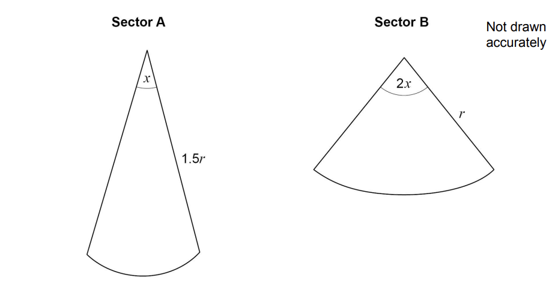

Which sector has the bigger area?

Tick a box.

`square` Sector A            `square` Sector B

Show working to support your answer.

## Q56 — medium — 4 marks · exam-questions

### 8() — 4 marks — command: work_out — structured — from paper Nov 2018 · 8300/2H
Two identical quarter circles are cut from a rectangle as shown.

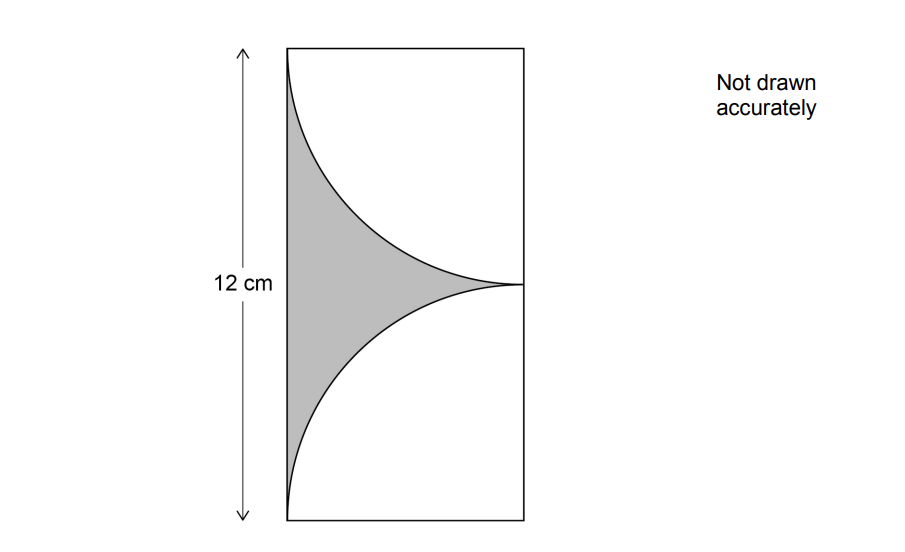

Work out the shaded area.

..........................cm2

## Q57 — medium — 3 marks · exam-questions

### 12() — 3 marks — command: work_out — structured — from paper June 2017 · 8300/1H
Here is a circle touching a square.

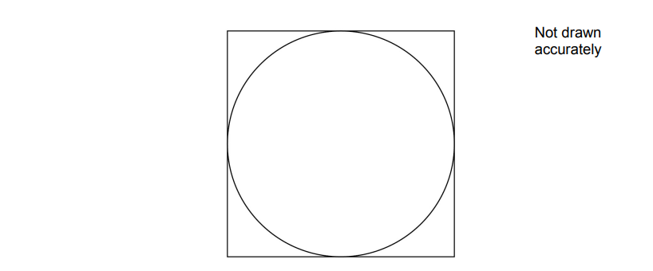

The area of the square is 64 cm2

Work out the area of the circle.

Give your answer in terms of $π$.

........................................ cm2 

## Q58 — medium — 3 marks · exam-questions

### 13() — 3 marks — command: find — structured — from paper Nov 2018 · J560/06
The shape below is formed from two semicircles and a straight line.

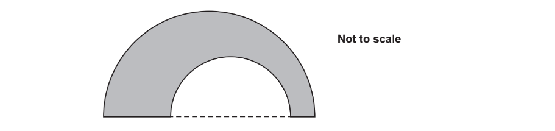

The radius of the large semicircle is 8cm. 
The radius of the small semicircle is $t$cm.

Find an expression, in terms of $t$, for the **exact perimeter** of the shaded shape.

........................ cm

## Q59 — medium — 5 marks · exam-questions

### 8() — 5 marks — command: calculate — structured — from paper Nov 2017 · J560/06
The design below is made from two sectors of circles, centre O.

Calculate the perimeter of the shaded part. 
Give your answer correct to 3 significant figures.

......................... cm

## Q60 — medium — 3 marks · exam-questions

### 5() — 3 marks — command: work_out — structured — from paper 2023 Nov · 4MA1/1H
The diagram shows a shaded shape made from three identical semicircles, $X$, $Y$ and  $Z$.

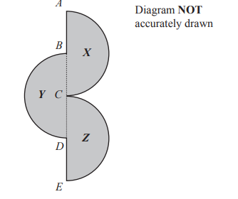

$ABCDE$ is a straight line.

$AC$is the diameter of semicircle $X$ and $B$ is the centre of semicircle $X$ 
$BD$ is the diameter of semicircle $Y$ and $C$ is the centre of semicircle $Y$
$CE$ is the diameter of semicircle $Z$ and $D$ is the centre of semicircle $Z$ 

$AC=BD=CE=20\mathrm{cm}$

Work out the perimeter of the shaded shape. 
Give your answer correct to the nearest whole number.
