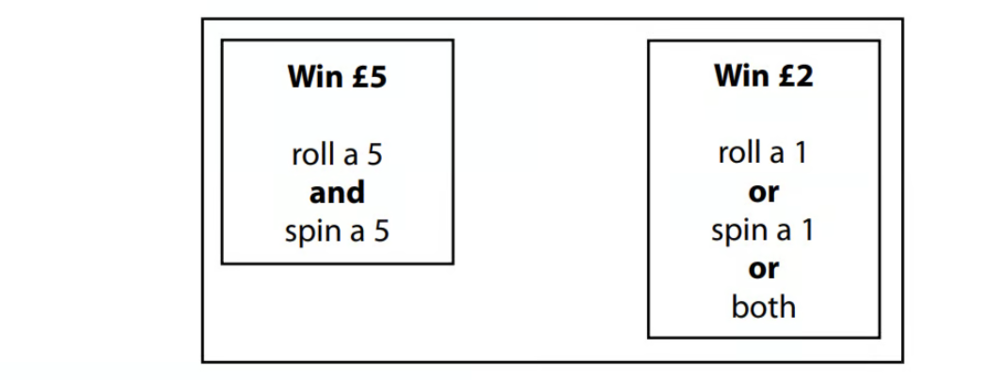
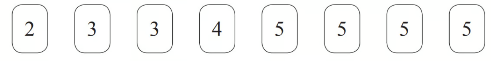
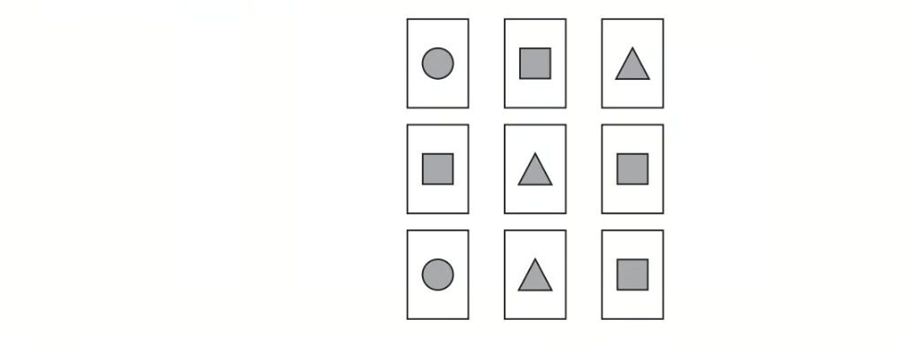
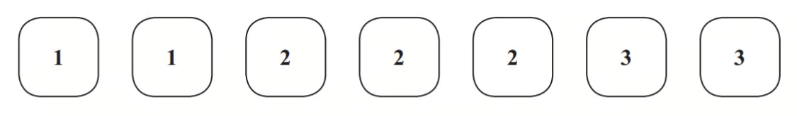
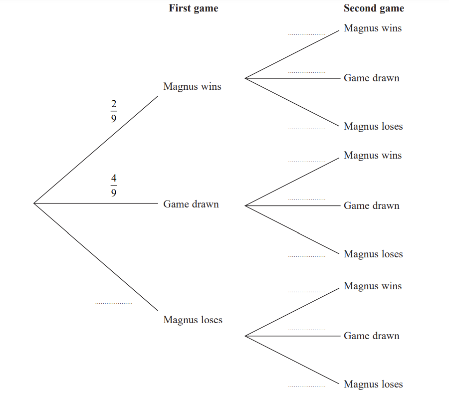
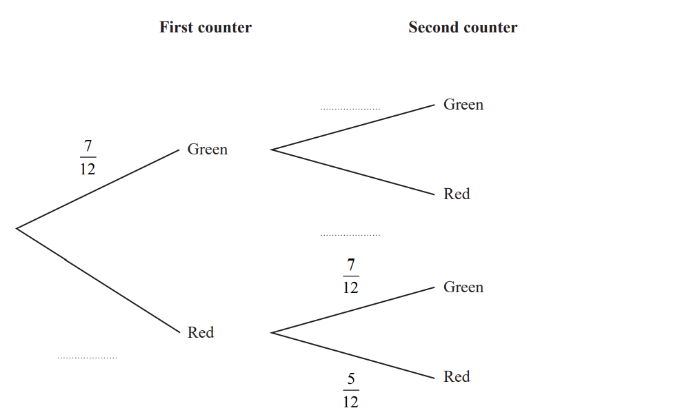
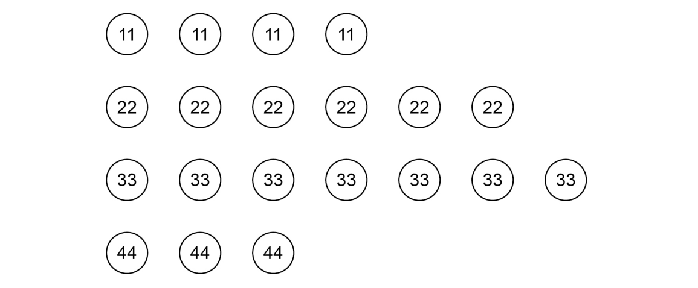

# Exam Questions — Combined & Conditional Probability
**Statistics & Probability** · Edexcel IGCSE Maths A (Modular) (4XMAF/4XMAH) — 24/Higher Unit 1
> Source: [https://www.savemyexams.com/igcse/maths/edexcel/a-modular/24/higher-unit-1/topic-questions/statistics-and-probability/combined-and-conditional-probability/exam-questions/](https://www.savemyexams.com/igcse/maths/edexcel/a-modular/24/higher-unit-1/topic-questions/statistics-and-probability/combined-and-conditional-probability/exam-questions/) · 46 questions · total 200 marks

## Q1 — very_hard — 5 marks · exam-questions

### 3((a)) — 4 marks — command: work_out — structured — from paper 2015	Spec2 · 1MA1/1H
David has designed a game. 
He uses a fair 6-sided dice and a fair 5-sided spinner. 
The dice is numbered 1 to 6 
The spinner is numbered 1 to 5

Each player rolls the dice once and spins the spinner once. 
A player can win £5 or win £2

David expects 30 people will play his game. 
Each person will pay David £1 to play the game.

Work out how much profit David can expect to make.

### 3((b)) — 1 mark — command: give — structured — from paper 2015	Spec2 · 1MA1/1H
Give a reason why David's actual profit may be different to the profit he expects to make.

## Q2 — hard — 5 marks · exam-questions

### 6((a)) — 1 mark — command: justify — structured — from paper 2015	Spec1 · 1MA1/1H
Four friends each throw a biased coin a number of times. The table shows the number of heads and the number of tails each friend got.

|   | **Ben** | **Helen** | **Paul** | **Sharif** |
|---|---|---|---|---|
| heads | 34 | 66 | 80 | 120 |
| tails | 8 | 12 | 40 | 40 |

The coin is to be thrown one more time.

Which of the four friends' results will give the best estimate for the probability that the coin will land heads?
Justify your answer.

### 6((b)) — 2 marks — command: justify — structured — from paper 2015	Spec1 · 1MA1/1H
Paul says,

"With this coin you are twice as likely to get heads as to get tails."

Is Paul correct? 
Justify your answer.

### 6((c)) — 2 marks — command: work_out — structured — from paper 2015	Spec1 · 1MA1/1H
The coin is to be thrown twice.

Use all the results in the table to work out an estimate for the probability that the coin will land heads both times.

## Q3 — medium — 3 marks · exam-questions

### 8((a)) — 1 mark — command: give — structured — from paper 2017	November · 1MA1/3H
When a drawing pin is dropped it can land point down or point up.

Lucy, Mel and Tom each dropped the drawing pin a number of times.

The table shows the number of times the drawing pin landed point down and the number of times the drawing pin landed point up for each person.

|   | **Lucy** | **Mel** | **Tom** |
|---|---|---|---|
| **point down** | 31 | 53 | 16 |
| **point up** | 14 | 27 | 9 |

Rachael is going to drop the drawing pin once.

Whose results will give the best estimate for the probability that the drawing pin will land point up? 
Give a reason for your answer.

### 8((b)) — 2 marks — command: work_out — structured — from paper 2017	November · 1MA1/3H
Stuart is going to drop the drawing pin twice.

Use all the results in the table to work out an estimate for the probability that the drawing pin will land point up the first time and point down the second time.

## Q4 — very_hard — 4 marks · exam-questions

### 23() — 4 marks — command: work_out — structured — from paper 2014	November · 1MA0/1H
Paul has 8 cards.   There is a number on each card.

Paul takes at random 3 of the cards.   
He adds together the 3 numbers on the cards to get a total $T.$

Work out the probability that $T$ is an odd number.

## Q5 — hard — 3 marks · exam-questions

### 19() — 3 marks — command: work_out — structured — from paper 2013	November · 1MA0/1H
In a supermarket, the probability that John buys fruit is 0.7

In the same supermarket, the probability that John independently buys vegetables is 0.4

Work out the probability that John buys fruit or buys vegetables or buys both.

## Q6 — medium — 1 marks · exam-questions

### 16() — 1 mark — command: what — structured — from paper 2015	Spec2 · 1MA1/1H
The probability that Sanay is late for school tomorrow is $0.05$ The probability that Jaden is late for school tomorrow is $0.15$

Alfie says that the probability that Sanay and Jaden will both be late for school tomorrow is $0.0075$ because $0.05\times0.15=0.0075$

What assumption has Alfie made?

## Q7 — very_hard — 4 marks · exam-questions

### 24() — 4 marks — command: how — structured — from paper 2015	Sample · 1MA1/1H
John has an empty box. 
He puts some red counters and some blue counters into the box.

The ratio of the number of red counters to the number of blue counters is $1:4$

Linda takes at random $2$ counters from the box.

The probability that she takes $2$ red counters is $\frac{6}{155}$

How many red counters did John put into the box?

## Q8 — hard — 3 marks · exam-questions

### 18() — 3 marks — command: calculate — structured — from paper 2015	Spec1 · 1MA1/3H
Thelma spins a biased coin twice. The probability that it will come down heads both times is 0.09

Calculate the probability that it will come down tails both times.

## Q9 — medium — 3 marks · exam-questions

### 22() — 3 marks — command: show — structured — from paper 2014	June · 1MA0/2H
Shabeen has a biased coin.  The probability that the coin will land on heads is 0.6

Shabeen is going to throw the coin 3 times.

She says the probability that the coin will land on tails 3 times is less than 0.1

Is Shabeen correct?  
You must show all your working.

## Q10 — very_hard — 7 marks · exam-questions

### 22((a)) — 4 marks — command: show — structured — from paper 2015	Spec2 · 1MA1/3H
There are $y$ black socks and $5$ white socks in a drawer.

Joshua takes at random two socks from the drawer.

The probability that Joshua takes one white sock and one black sock is $\frac{6}{11}$

Show that $3y^{2}---28y+60=0$

### 22((b)) — 3 marks — command: find — structured — from paper 2015	Spec2 · 1MA1/3H
Find the probability that Joshua takes two black socks.

## Q11 — hard — 4 marks · exam-questions

### 25() — 4 marks — command: show — structured — from paper 2016	November · 1MA0/1H
Here are 9 cards. 
Each card has a shape on it.

In a game the cards are turned over so that the shapes are hidden. 
The cards are then mixed up.

Katie turns over at random two of the cards.

Work out the probability that these two cards have different shapes on them. 
You must show all your working.

## Q12 — medium — 5 marks · exam-questions

### 21((a)) — 2 marks — command: calculate — structured — from paper 2012	November · 1MA0/2H
Here are seven tiles.

Jim takes at random a tile. 
He does **not** replace the tile.

Jim then takes at random a second tile.

Calculate the probability that both the tiles Jim takes have the number 1 on them.

### 21((b)) — 3 marks — command: calculate — structured — from paper 2012	November · 1MA0/2H
Calculate the probability that the number on the second tile Jim takes is greater than the number on the first tile he takes.

## Q13 — very_hard — 6 marks · exam-questions

### 19((a)) — 3 marks — command: show — structured — from paper 2015	June · 1MA0/1H
There are $n$ sweets in a bag.  
 $6$ of the sweets are orange.   
The rest of the sweets are yellow.

Hannah takes at random a sweet from the bag.   She eats the sweet.

Hannah then takes at random another sweet from the bag.   She eats the sweet.

The probability that Hannah eats two orange sweets is $\frac{1}{3}$   
Show that $n^{2}---n---90=0$

### 19((b)) — 3 marks — command: solve — structured — from paper 2015	June · 1MA0/1H
Solve $n^{2}---n---90=0$ to find the value of $n$.

## Q14 — hard — 4 marks · exam-questions

### 25() — 4 marks — command: work_out — structured — from paper 2012	June · 1MA0/2H
Carolyn has 20 biscuits in a tin.

She has

12 plain biscuits 
5 chocolate biscuits 
3 ginger biscuits

Carolyn takes at random two biscuits from the tin.

Work out the probability that the two biscuits were **not** the same type.

## Q15 — medium — 4 marks · exam-questions

### 17() — 4 marks — command: work_out — structured — from paper 2017	June · 1MA1/1H
There are 9 counters in a bag.

7 of the counters are green. 
2 of the counters are blue.

Ria takes at random two counters from the bag.

Work out the probability that Ria takes one counter of each colour. 
You must show your working.

## Q16 — very_hard — 8 marks · exam-questions

### 15() — 2 marks — command: complete — structured — from paper Nov 2021 · 4MA1/1H
Magnus and Garry play 2 games of chess against each other.

The probability that Magnus beats Garry in any game is $\frac{2}{9}$

The probability that any game between Magnus and Garry is drawn is $\frac{4}{9}$

The result of any game is independent of the result of any other game.

Complete the probability tree diagram.

### 15((b)) — 3 marks — command: work_out — structured — from paper Nov 2021 · 4MA1/1H
For each game of chess,

the winner gets 2 points and the loser gets 0 points,

when the game is drawn, each player gets 1 point.

Work out the probability that, after 2 games, Magnus and Garry have the same number of points.

### 15((c)) — 3 marks — command: work_out — structured — from paper Nov 2021 · 4MA1/1H
Magnus and Garry now play a third game of chess.

Work out the probability that, after 3 games, Magnus and Garry have the same number of points.

## Q17 — hard — 5 marks · exam-questions

### 24() — 5 marks — command: work_out — structured — from paper 2013	March · 1MA0/1H
There are three different types of sandwiches on a shelf.

There are

|   | 4 egg sandwiches, |
|---|---|
|   | 5 cheese sandwiches |
| and | 2 ham sandwiches. |

Erin takes at random 2 of these sandwiches.

Work out the probability that she takes 2 different types of sandwiches.

## Q18 — medium — 4 marks · exam-questions

### 26() — 4 marks — command: work_out — structured — from paper 2013	June · 1MA0/1H
Fiza has 10 coins in a bag. 
There are three £1 coins and seven 50 pence coins.

Fiza takes at random, 3 coins from the bag.

Work out the probability that she takes exactly £2.50

## Q19 — very_hard — 4 marks · exam-questions

### 18() — 4 marks — command: work_out — structured — from paper Jan 2020 · 4MA1/1H
There are 16 sweets in a bowl.

4 of the sweets are blackcurrant. 
5 of the sweets are lemon. 
7 of the sweets are orange.

Anna, Ravi and Sam each take at random one sweet from the bowl.

Work out the probability that the 5 lemon sweets are still in the bowl.

## Q20 — hard — 4 marks · exam-questions

### 25() — 4 marks — command: work_out — structured — from paper 2015	November · 1MA0/2H
Nomusa has 30 sweets.

She has

18 fruit sweets 
7 aniseed sweets 
5 mint sweets

Nomusa is going to take at random two sweets.

Work out the probability that the two sweets will **not** be the same type of sweet.   
You must show all your working.

## Q21 — medium — 6 marks · exam-questions

### 23((a)) — 3 marks — command: work_out — structured — from paper 2017	June · 1MA0/1H
There are 7 blue counters, 3 green counters and 1 red counter in a bag. 
There are no other counters in the bag.

Hubert takes at random 2 counters from the bag.

Work out the probability that both counters are blue.

### 23((b)) — 3 marks — command: work_out — structured — from paper 2017	June · 1MA0/1H
Work out the probability that the 2 counters are different colours.

## Q22 — very_hard — 4 marks · exam-questions

### 23() — 4 marks — command: show — structured — from paper Nov 2020 · 4MA1/1HR
In a bag, there are only

$3$ blue beads 
$4$ white beads 
and $x$ orange beads.

Jean is going to take at random two beads from the bag. 
The probability that Jean will take two beads of the same colour is $\frac{3}{8}$

Find the total number of beads in the bag. 
Show clear algebraic working.

## Q23 — hard — 4 marks · exam-questions

### 21((a)) — 2 marks — command: work_out — structured — from paper 2017	November · 1MA1/2H
There are 12 counters in a bag. 
There is an equal number of red counters, blue counters and yellow counters in the bag. 
There are no other counters in the bag.

3 counters are taken at random from the bag.

Work out the probability of taking 3 red counters.

### 21((b)) — 2 marks — command: show — structured — from paper 2017	November · 1MA1/2H
The 3 counters are put back into the bag.

Some more counters are now put into the bag. 
There is still an equal number of red counters, blue counters and yellow counters in the bag. 
There are no counters of any other colour in the bag.

3 counters are taken at random from the bag.

Is it now less likely or equally likely or more likely that the 3 counters will be red? 
You must show how you get your answer.

## Q24 — medium — 3 marks · exam-questions

### 16() — 3 marks — command: work_out — structured — from paper Nov 2021 · 4MA1/2H
A box contains 15 counters.

There are 4 red counters, 5 green counters and the rest are yellow counters.

Niklas takes at random a counter from the box and writes down the colour of his counter. 
He then puts the counter back into the box.

Sasha then takes at random a counter from the box and writes down the colour of her counter.

Work out the probability that the counters taken by Niklas and Sasha both have the same colour.

## Q25 — very_hard — 5 marks · exam-questions

### 23() — 5 marks — command: show — structured — from paper June 2021 · 4MA1/2H
Pippa has a box containing $N$ pens.

There are only black pens and red pens in the box. 
The number of black pens in the box is 3 more than the number of red pens.

Pippa is going to take at random 2 pens from the box.

The probability that she will take a black pen **followed** by a red pen is $\frac{9}{35}$

Find the possible values of $N$. 
Show clear algebraic working.

## Q26 — hard — 5 marks · exam-questions

### 21() — 5 marks — command: find — structured — from paper 2015	Spec1 · 1MA1/1H
There are 10 pens in a box.

There are $x$ red pens in the box. 
All the other pens are blue.

Jack takes at random two pens from the box.

Find an expression, in terms of $x$, for the probability that Jack takes one pen of each colour. 
Give your answer in its simplest form.

## Q27 — medium — 5 marks · exam-questions

### 15((a)) — 3 marks — command: work_out — structured — from paper Jan 2019 · 4MA1/2HR
Barney has a biased coin.

When the coin is thrown once, the probability that the coin will land heads is $0.3$

Barney throws the coin $4$ times.

Work out the probability that the coin will land heads exactly $3$ times.

### 15((b)) — 2 marks — command: work_out — structured — from paper Jan 2019 · 4MA1/2HR
Work out the probability that the coin will land heads at least once.

## Q28 — very_hard — 6 marks · exam-questions

### 20() — 6 marks — command: show — structured — from paper Jan 2019 · 4MA1/1H
A bowl contains $n$ pieces of fruit. Of these, $4$ are oranges and the rest are apples.

Two pieces of fruit are going to be taken at random from the bowl. The probability that the bowl will then contain $(n--6)$ apples is $\frac{1}{3}$

Work out the value of $n$
 Show your working clearly.

## Q29 — hard — 7 marks · exam-questions

### 13((a)) — 2 marks — command: complete — structured — from paper Jan 2022 · 4MA1/1HR
Hector has a bag that contains 12 counters. 
There are 7 green counters and 5 red counters in the bag.

Hector takes at random a counter from the bag. 
He looks at the counter and puts the counter back into the bag.

Hector then takes at random a second counter from the bag. 
He looks at the counter and puts the counter back into the bag.

Complete the probability tree diagram.

### 13((b)) — 2 marks — command: work_out — structured — from paper Jan 2022 · 4MA1/1HR
Work out the probability that both counters are red.

### 13((c)) — 3 marks — command: work_out — structured — from paper Jan 2022 · 4MA1/1HR
Meghan has a jar containing 15 counters. 
There are only blue counters, green counters and red counters in the jar.

Hector is going to take at random one of the counters from his bag of 12 counters. 
He will look at the counter and put the counter back into the bag.

Hector is then going to take at random a second counter from his bag. 
He will look at the counter and put the counter back into the bag.

Meghan is then going to take at random one of the counters from her jar of counters. 
She will look at the counter and put the counter back into the jar.

The probability that the 3 counters each have a different colour is $\frac{7}{24}$

Work out how many blue counters there are in the jar.

## Q30 — medium — 4 marks · exam-questions

### 16() — 4 marks — command: work_out — structured — from paper Jan 2020 · 4MA1/1HR
Steffi is going to play one game of tennis and one game of chess.

The probability that she will win the game of tennis is 0.6 
The probability that she will win **both** games is 0.42

Work out the probability that she will **not** win either game.

## Q31 — very_hard — 4 marks · exam-questions

### 22() — 4 marks — command: work_out — structured — from paper Nov 2021 · 8300/2H
Liam is trying to remember a 3-digit code. He knows the rule that

the first digit is a cube number 
the second digit is a factor of 16 
the third digit is an odd number.

Liam tries at random a code that matches the rule.

Work out the probability that this is the correct code.

## Q32 — hard — 4 marks · exam-questions

### 19() — 4 marks — command: work_out — structured — from paper June 2018 · 4MA1/1H
Jack plays a game with two fair spinners, $A$ and$B.$

Spinner $A$ can land on the number 2 or 3 or 5 or 7 
Spinner $B$ can land on the number 2 or 3 or 4 or 5 or 6

Jack spins both spinners. 
He wins the game if one spinner lands on an odd number **and** the other spinner lands on an even number.

Jack plays the game twice. 
Work out the probability that Jack wins the game both times.

## Q33 — medium — 3 marks · exam-questions

### 15() — 3 marks — command: work_out — structured — from paper Specimen 2016 · 4MA1/2H
Sophie takes an examination. 
If she fails the examination, she will resit.

The probability that Sophie passes the examination on her first attempt is 0.7 
If she fails the examination on any attempt, the probability she passes on the next attempt is 0.9

Work out the probability that Sophie takes at most 2 attempts to pass the examination.

## Q34 — very_hard — 4 marks · exam-questions

### 27() — 4 marks — command: work_out — structured — from paper Nov 2020 · 8300/2H
These 20 discs are in a bag.

Two of the discs are taken at random from the bag.

Work out the probability that the first disc has a **smaller **number than the second disc.

## Q35 — hard — 4 marks · exam-questions

### 25((a)) — 1 mark — command: write — structured — from paper Nov 2019 · 8300/1H
A bag contains 8 balls.

3 are red and 5 are blue.

2 balls are taken from the bag at random without replacement.

Write down the probability that there is **at least** 1 red ball still in the bag.

### 25((b)) — 3 marks — command: work_out — structured — from paper Nov 2019 · 8300/1H
Work out the probability that there are **at least** 2 red balls still in the bag.

## Q36 — medium — 5 marks · exam-questions

### 17((a)) — 3 marks — command: work_out — structured — from paper Nov 2021 · 8300/2H
20 people were asked which device they used more often, laptop or phone.

The table shows the results.

|   | **Laptop** | **Phone** |
|---|---|---|
| **Male** | 2 | 9 |
| **Female** | 4 | 5 |

One male and one female are chosen at random.

Work out the probability that **exactly **one of them said laptop.

### 17((b)) — 2 marks — command: work_out — structured — from paper Nov 2021 · 8300/2H
Two males are chosen at random.

Work out the probability that they **both **said phone.

## Q37 — very_hard — 3 marks · exam-questions

### 27() — 3 marks — command: work_out — structured — from paper June 2018 · 8300/3H
A bag contains 30 discs.

10 are red and 20 are blue.

One disc is taken out at random and replaced by **two** of the other colour.

Another disc is then taken out at random and replaced by **two** of the other colour.

Another disc is then taken out at random.

Work out the probability that all three discs taken out are **red.**

## Q38 — hard — 3 marks · exam-questions

### 12() — 3 marks — command: what — structured — from paper Nov 2020 · J560/06
Students are asked to choose one subject from Option A and one subject from Option B.

| **Option A** |   | **Option B** |
|---|---|---|
| Economics Geography History Media Studies |   | Art Drama Engineering German Graphics Music PE |

If a student chooses their subjects at random, what is the probability that both subjects have the same first letter?

## Q39 — medium — 2 marks · exam-questions

### 18((a)) — 2 marks — command: work_out — structured — from paper Nov 2018 · 8300/2H
A bag contains 20 discs.

10 are red, 7 are blue and 3 are green.

Marnie takes a disc at random before putting it back in the bag. Nick then takes a disc at random before putting it back in the bag. 
Olly then takes a disc at random.

Work out the probability that they all take a red disc.

## Q40 — very_hard — 4 marks · exam-questions

### 22() — 4 marks — command: show — structured — from paper Specimen 2015 · 8300/3H
Bag X contains 9 blue balls and 18 red balls. 
Bag Y contains 7 blue balls and 14 red balls.

Liz picks a ball at random from bag X. 
She puts the ball into bag Y. 
Mike now picks a ball at random from bag Y.

Show that

P (Liz picks a blue ball) = P (Mike picks a blue ball)

## Q41 — hard — 6 marks · exam-questions

### 18() — 6 marks — command: find — structured — from paper June 2019 · J560/05
21 people travelled to a meeting.

- 12 used a train.
- 6 used a car.
- 7 did not use a train or a car.
- Some used a train and a car.

Two people are chosen at random from those who used a train.

Find the probability that both these people also used a car.

## Q42 — medium — 4 marks · exam-questions

### 15() — 4 marks — command: calculate — structured — from paper Nov 2020 · J560/06
A bus company has a large number of buses. 25% of the buses are more than 10 years old.

If a bus is more than 10 years old, the probability that it will start first time is 0.3. 
If a bus is less than 10 years old, the probability that it will start first time is 0.65.

Amir is asked to drive one of the company’s buses, chosen at random.

Calculate the probability that the bus starts first time.

## Q43 — very_hard — 5 marks · exam-questions

### 22() — 5 marks — command: work_out — structured — from paper Specimen paper · 4MA1/1H
There are 7 red counters in a bag.
The rest of the counters in the bag are blue.

There are more blue counters than red counters in the bag.

Two counters are to be taken at random from the bag.
The probability that there will be one counter of each colour is $\frac{7}{15}$

Work out the total number of counters in the bag before any counters are taken from the bag.

## Q44 — hard — 3 marks · exam-questions

### 20() — 3 marks — command: work_out — structured — from paper 2023 June · 4MA1/2H
There are 12 counters in a bag.

3 of the counters are red 
9 of the counters are green

Ameya, Jack and Ella each take at random one counter from the bag.

Work out the probability that at least one red counter is still in the bag.

## Q45 — medium — 5 marks · exam-questions

### 13() — 5 marks — command: calculate — structured — from paper Nov 2019 · J560/06
Dani has a pack of 45 cards. 
Each card is either red or black.

One-third of the cards in the pack are **red.**

She picks two cards from the pack, without replacement.

Calculate the probability that Dani picks two **black **cards.

## Q46 — medium — 6 marks · exam-questions

### 12((a)) — 2 marks — command: complete — structured — from paper June 2019 · J560/06
Antonio rolls two fair six-sided dice and calculates the **difference **between the scores. 
For example, if the two scores are 2 and 5 or 5 and 2 then the difference is 3.

Complete the sample space diagram to show the possible outcomes from Antonio’s dice.

Dice 2

| Dice 1 | difference | 1 | 2 | 3 | 4 | 5 | 6 |
|---|---|---|---|---|---|---|---|
| 1 | 0 |   |   |   |   |   |   |
| 2 |   |   |   |   | 3 |   |   |
| 3 |   | 1 |   |   |   |   |   |
| 4 |   |   |   |   |   |   |   |
| 5 |   | 3 |   |   |   |   |   |
| 6 |   |   |   |   |   |   |   |

### 12((b)) — 4 marks — command: calculate — structured — from paper June 2019 · J560/06
Antonio rolls the two dice three times.

Calculate the probability that he gets a difference of 1 on all three rolls. 
Give your answer as a fraction in its lowest terms.
