# Mark Schemes — Probability Diagrams: Venn & Tree Diagrams
**Statistics & Probability** · Edexcel IGCSE Maths A (Modular) (4XMAF/4XMAH) — 24/Higher Unit 1

## Q1 — easy — 5 marks · exam-questions

### 1((a)) — 3 marks
> *{6, 9} are in *$A$* and *$B$

> *{3, 4, 7} are not in *$A$* or *$B$

> *{1, 5, 8} are in *$A$* but not *$B$

> *{2} is in *$B$* but not *$A$

**6 and 9 in the middle [1]**

**One other section correct [1]**

**Fully correct [1]**

### 1((b)) — 2 marks
> *There are 2 numbers (6 and 9) in the 'overlap' region *$A\capB$

> *And there are 9 numbers in total in the universal set*

$\frac{2}{9}$

**Correct numerator [1]**

**Correct denominator [1]**

## Q2 — easy — 5 marks · exam-questions

### 1() — 3 marks
> *The number of people who don't own a cat or a dog can be written outside the circles but inside the box.*

*Add up the the number of people who owned a cat, owned a dog and owned neither.* *Subtract it from the total number of people who were surveyed to find the number of people who owned both a cat and a dog.*

*30 + 25 + 6 = 61*

*61 - 50 = 11*

> *Find the number of people who owned a cat only by subtracting the number of people who owned a cat and a dog from the number of people who owned a cat.*

*30 - 11 = 19*

> *Find the number of people who owned a dog only by subtracting the number of people who owned a cat and a dog from the number of people who owned a dog.*

*25 - 11 = 14*

> *Write the values in the appropriate sections of the Venn diagram.*

**Correct value for the intersection****  [1]** 
**Correct value in another section **** [1]** 
**Fully correct Venn diagram **** [1]**

### 2() — 2 marks
> *People who own a cat AND a dog belong to the intersection or 'overlap' set *$C\capD$*. From part (a) we know that there are 11 people in that set. And there were 50 people in total in the survey. So the probability is simply 11 divided by 50.*

$\frac{11}{50}$**  [2]**

**1 mark for using 11 in the numerator, or for circling the **$C\capD$** number in the diagram. 1 mark for a fully correct answer. Decimal form 0.22 would also get the mark for the final answer.**

## Q3 — easy — 4 marks · exam-questions

### 13((a)) — 2 marks
> *The probability of red can be found by subtracting the probability of green from 1.*

`table row cell straight P open parentheses Red close parentheses end cell equals cell 1 minus 7 over 12 end cell row blank equals cell 5 over 12 end cell end table`

**[1]**

> *As the counter is returned the events are independent. This means both pairs of branches for the second encounter should be the same.*

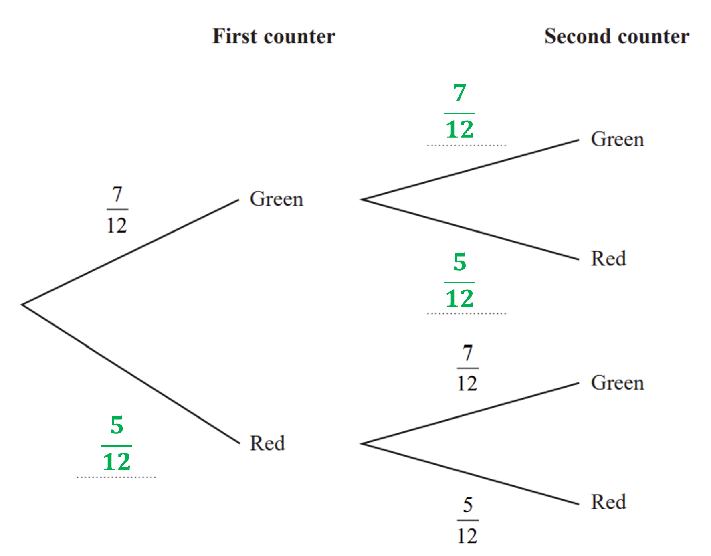

**[1]**

### 13((b)) — 2 marks
> *To find the probability that both are red you multiply the probabilities for red along the branches.*

`straight P open parentheses Red space and space Red close parentheses equals 5 over 12 cross times 5 over 12`

**[1]**

$\frac{25}{144}$** [1]**

## Q4 — easy — 5 marks · exam-questions

### 14((a)) — 2 marks
> *To find the probability that Ding wins both games, multiply the probabilities for 'Ding wins' in the 'Ding against Marco' branches and for 'Ding wins' in the 'Ding against Judd' branches. In the 'Ding against Judd' branches, make sure you use the 'Ding wins' branch that follows on from the first 'Ding wins'.*

$0.6\times0.9$

**[1]**

**0.54****  [1]**

### 14((b)) — 3 marks
> *'Wins exactly one of the games' includes the possibilities 'win, lose' and 'lose, win'.*

> *In the tree diagram these probabilities can be found by multiplying along the following branches (AND rule):*

> *       Ding wins against Marco (0.6) × Ding loses against Judd (0.1)        Ding loses against Marco (0.4) × Ding wins against Judd (0.25)*

> *(Be sure to use the correct branches in 'Ding against Judd' based on what happened in 'Ding against Marco'!)*

> *Then add those products together to find the total probability (OR rule).*

`open parentheses 0.6 cross times 0.1 close parentheses space plus space open parentheses 0.4 cross times 0.25 close parentheses space equals space 0.06 space plus space 0.1 space equals space 0.16`

**[2] 1 mark for one correct product.  1 mark for both correct products added together.**

**0.16****  [1]**

## Q5 — easy — 4 marks · exam-questions

### 7() — 4 marks
> *We can use the fact "12 are singers but not guitar players" to fill in a region of the Venn diagram*

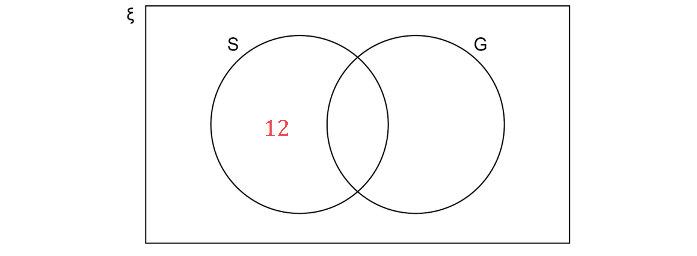

**[1]**

> *30% of the 80 people are neither a singer nor guitar player*

*10% of 80 = 8* *30% of 80 = 3×8 =24*

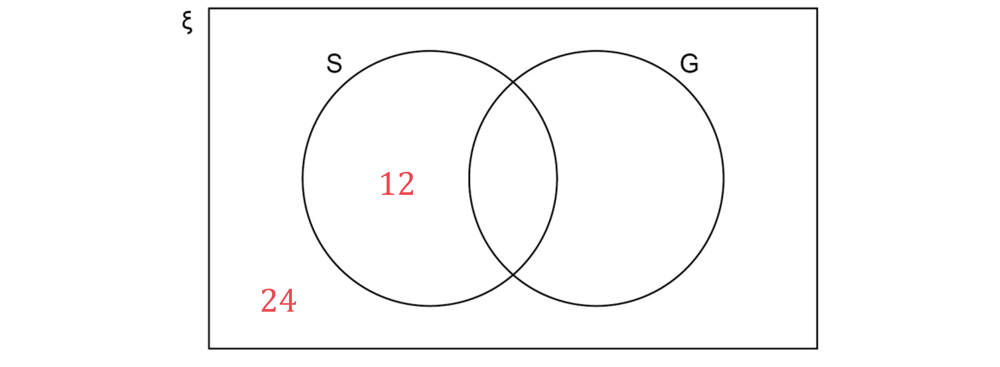

**[1]**

> *As the total is 80, there are*

*80 - 24 -12 = 44 people left over*

*The two remaining regions (only guitar players, and those who play both guitar and sing) must sum to 44* *This means there are 44 guitar players in total*

> *It is stated that *$\frac{1}{4}$* of the guitar players are also singers*

$\frac{1}{4}$* of 44 = 11*

**11 or 33**** [1]**

> *There are 80 people in total, so all regions on the Venn diagram must sum to 80*

*80 - 24 - 12 - 11 = 33*

**All values correct**** [1]**

## Q6 — easy — 1 marks · exam-questions

### 1() — 1 marks
> *A ∪ B means the **union** of A and B (everything in A **or** B **or** both) P(A ∪ B) means "the probability of A or B or both"*

**The top-left option, A or B or both, is correct** **[1]**

> *A but not B would be *$A\capB'$* Not A and not B would be *$A'\capB'$* or *`open parentheses straight A union straight B close parentheses apostrophe`* A and B would be *$A\capB$

## Q7 — easy — 1 marks · exam-questions

### 4() — 1 marks
*The shaded region is the intersection of A and B, or where both A and B are true* *This can be written as *$A\capB$

**The third option, **$A\capB$**, is correct ****[1]**

> $A\cupB$* would look like   *

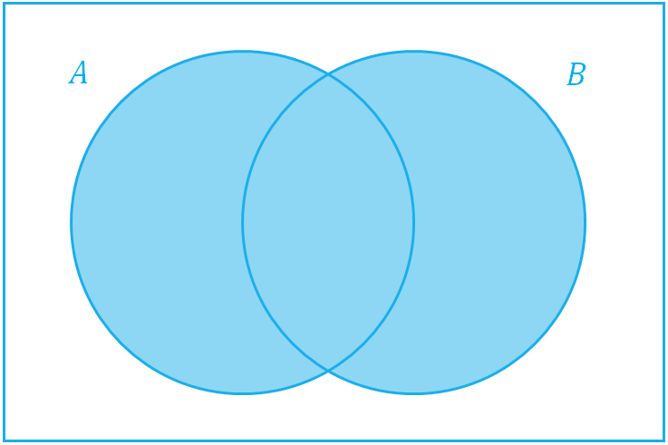

> *Both *`open parentheses straight A intersection straight B close parentheses apostrophe`* and *$A'\cupB'$* would look like*

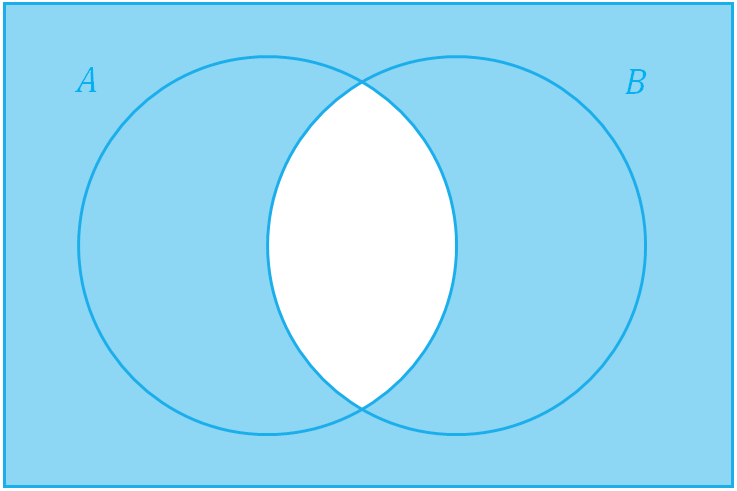

## Q8 — easy — 5 marks · exam-questions

### 9((a)) — 3 marks
*The easiest section to fill in first is "12 have both" which will be the overlapping section in the middle* *We can also fill in "5 have neither" on the outside of the two circles*

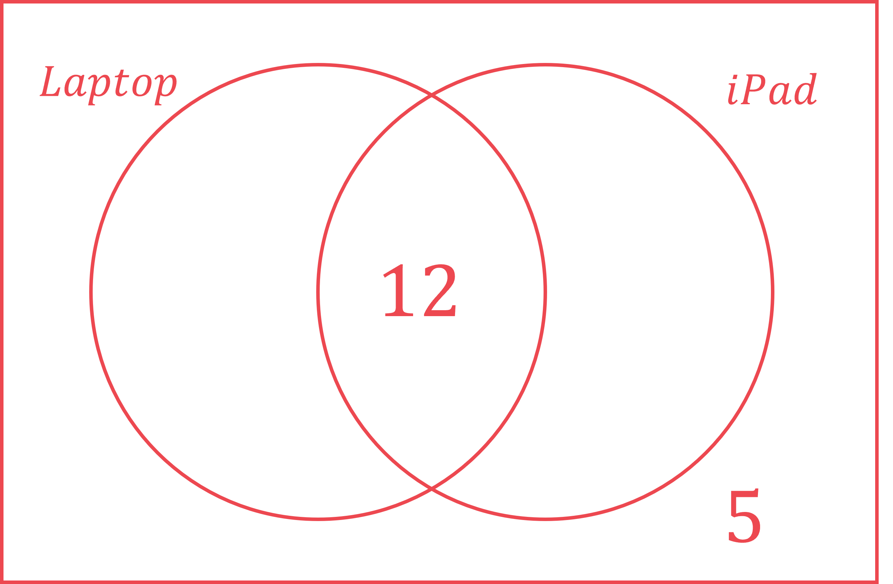

**[1]**

> *We can now use the statement "31 have a laptop", the left circle needs to sum to 31*

*31 - 12 = 19*

> *We can now use the statement "48 have an iPad", the right circle needs to sum to 48*

*48 - 12 = 36*

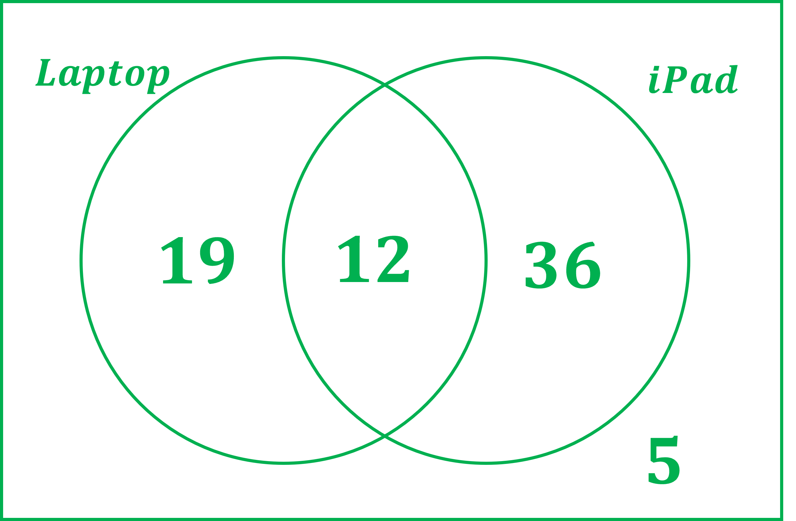

**[2]**

### 9((b)) — 2 marks
> *The number of children who own an iPad but not a laptop has been circled in red*

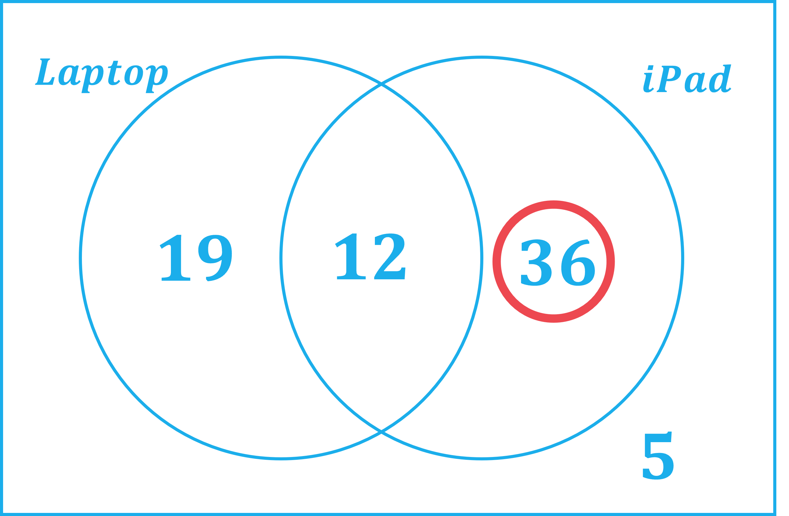

> *There are 72 children in total*

$\frac{36}{72}=\frac{1}{2}$ **[2]** 
**1 mark out of 2 available for incorrect "36" value used **

## Q9 — easy — 2 marks · exam-questions

### 21((b)) — 2 marks
*As we are only looking at those who grow melons, we are only looking at the blue highlighted region, containing 16 gardeners* *Out of those gardeners, we only want those who do not lie in the C-circle; these are circled in red*

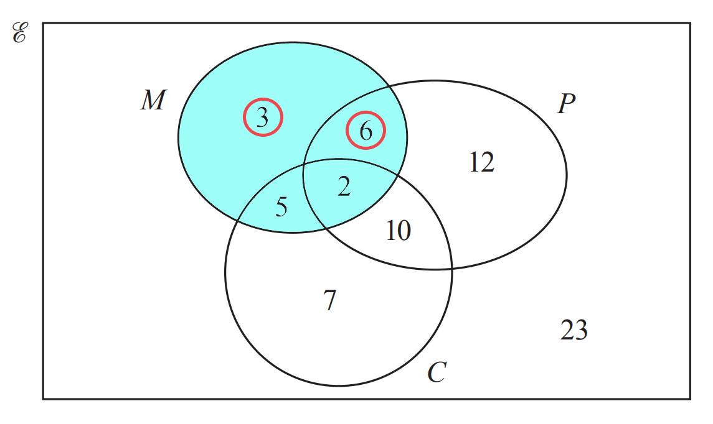

> *Therefore the probability is*

$\frac{3+6}{3+6+5+2}=\frac{9}{16}$

**Correct numerator or denominator ****[1]**

$\frac{9}{16}$ **[1]**

## Q10 — easy — 3 marks · exam-questions

### 22() — 3 marks
> *Method 1*

> *The quickest method is to subtract the probability that the team wins no matches from 1.*

`table row cell straight P left parenthesis At space least space 1 space match right parenthesis space end cell equals cell space 1 space minus space straight P left parenthesis lose comma space lose right parenthesis end cell row blank equals cell space 1 space minus space open parentheses 2 over 3 cross times 1 fourth close parentheses space end cell row blank equals cell space 1 space minus space 1 over 6 end cell end table`

**Finding probability of losing both matches ****[1] **
**Subtracting from 1 ****[1]**

$P(\mathrm{At} \mathrm{least}1\mathrm{match})=\frac{5}{6}$** [1]**

> *Method 2 *
*Find the sum of the probability of winning one or both of the matches.*

`table row cell straight P left parenthesis At space least space 1 space match right parenthesis space end cell equals cell space straight P left parenthesis win comma space win right parenthesis space plus space straight P space left parenthesis win comma space lose right parenthesis space plus space straight P left parenthesis lose comma space win right parenthesis space end cell row blank equals cell space space open parentheses 1 third cross times 3 over 4 close parentheses space space plus space space open parentheses 1 third cross times 1 fourth space close parentheses space plus space space open parentheses 2 over 3 cross times 3 over 4 close parentheses space end cell end table`

**Finding probability of winning one of the matches ****[1] **
**Adding all three probabilities together ****[1]**

$P(\mathrm{At} \mathrm{least}1\mathrm{match})=\frac{5}{6}$** [1]**

## Q11 — medium — 6 marks · exam-questions

### 1((a)) — 4 marks
> *Start by labelling the circles in the diagram.*

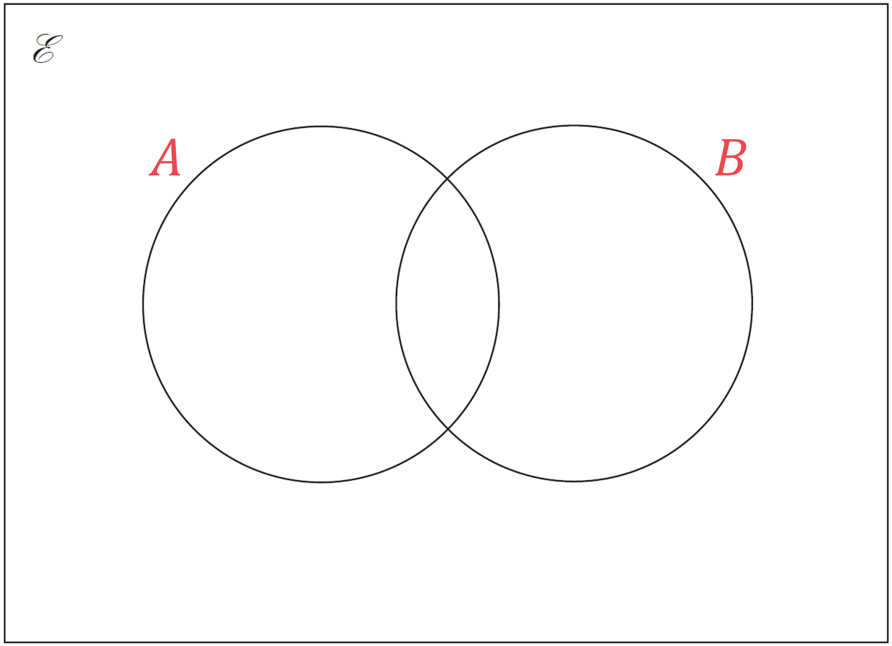

**[1]**

> *15 is the only number that's in **A** **and** **B**, so put that that in the 'overlap' (middle) part of the diagram. *

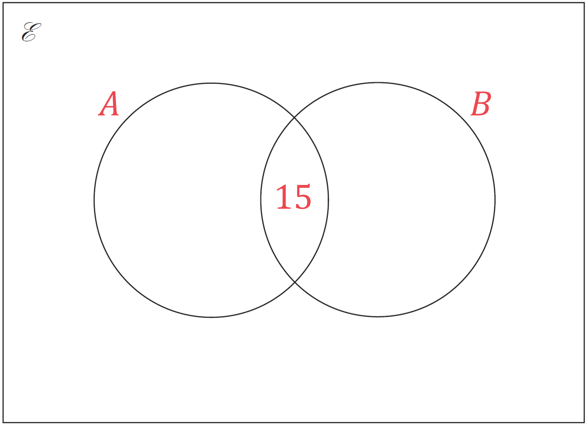

**[1]**

> *The numbers in **A** that aren't also in **B** (3, 9, 21, 27) go in the '**A** only' part of the **A** circle. *
*The numbers in **B** that aren't also in **A** (5, 25) go in the '**B** only' part of the **B** circle. {odd numbers less than 30} = {1, 3, 5, 7, 9, 11, 13, 15, 17, 19, 21, 23, 25, 27, 29} *
*The numbers in that set that aren't in **A** or** B** (1, 7, 11, 13, 17, 19, 23, 29) go inside the rectangle outside the two circles.*

> * *

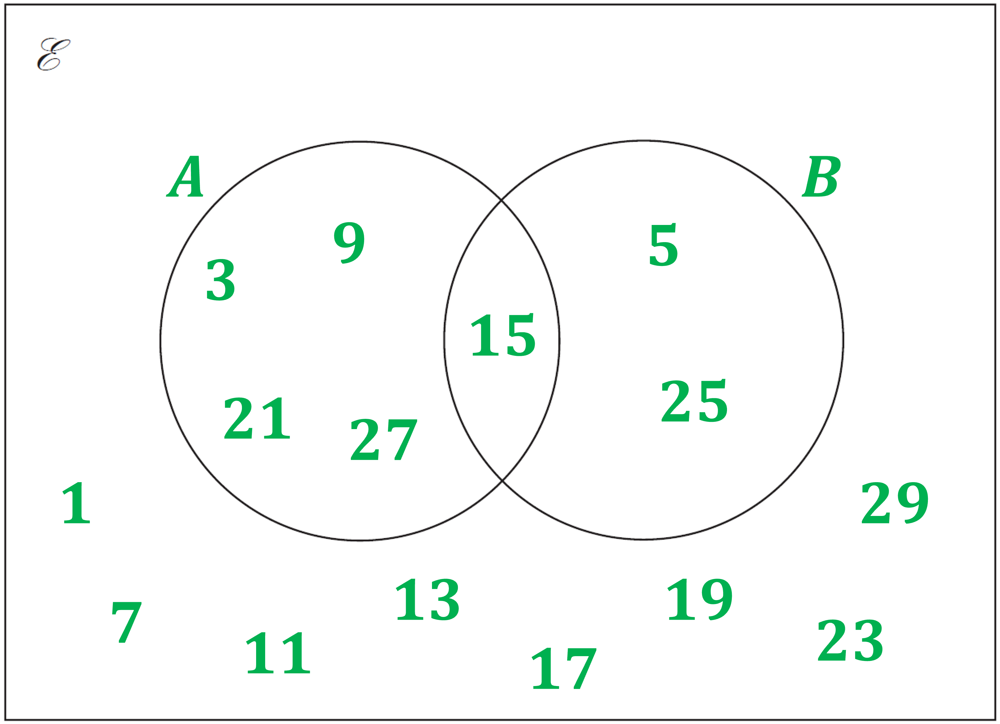

**  [2]**

**1 mark for the 'only A' part, the 'only B' part, or the 'outside the circles' part being correct.**
** 2 marks for ALL those numbers being in the correct place.**

### 1((b)) — 2 marks
> *There are 15 numbers in the universal set. *
$A\cupB$* is all the numbers that are in either or both of the circles. So *`A union B space equals space open curly brackets 3 comma space 5 comma space 9 comma space 15 comma space 21 comma space 25 comma space 27 close curly brackets`*, with 7 numbers in that set.*

$\frac{7}{15}$**  [2]**

**1 mark for 7 in the numerator (as long as the denominator is **$\geq$**7****), or for 15 in the denominator (as long as the numerator is **$\leq$**7****).  **
**2 marks for 7/15.  **
**If your part (a) answer was wrong, you can still get the part (b) marks for correctly interpreting your incorrect part (a) diagram.**

## Q12 — medium — 4 marks · exam-questions

### 5((a)) — 2 marks
(i)

> $A\cupB$* is the set of all numbers that are in **A** or in **B** or in both.*

**10, 12, 14, 15, 16, 18****  [1]**

**The numbers don't need to be put in order to get the mark, but it can help you make sure you haven't repeated any!**

(ii)   $A\capB$*is the set of all numbers that are in **A **and in **B**.*

* ***12, 18****  [1]**

### 5((b)) — 2 marks
> *A**' is the set of all numbers that **aren't** in **A**.  (It's called the 'complement' of** A.**) Basically, the question is asking you 'What's the probability that the number isn't in set **A**?'*

`A apostrophe space equals space open curly brackets 10 comma space 11 comma space 13 comma space 14 comma space 16 comma space 17 comma space 19 close curly brackets`

**[1] **
**You can also get this mark for indicating where set A' is on the Venn diagram.**

> *There are 7 numbers in set **A'**. There are a total of 10 numbers in the diagram.*

$\frac{7}{10}$**  [1]**

## Q13 — medium — 2 marks · exam-questions

### 12((a)) — 1 marks
> *This is an example of 'conditional probability'. *
*After choosing the first student, there are only 29 students left.  So the denominators in the '2nd student' probabilities should be 29.*

**The denominators for the '2nd student' probabilities should be 29.***  ***[1]**

**You can also get the mark here for pointing out that the probabilities for '2nd student' do not add up to 1.**

### 12((b)) — 1 marks
> *With combined probabilities, 'and' usually means 'multiply', and 'or' usually means 'add'. *
*Here we want the probability that Owen scores a goal AND Wasim scores a goal.*

**He is not right.  The probabilities should be multiplied together. *** ***[1]**

## Q14 — medium — 4 marks · exam-questions

### 19((a)) — 2 marks
> *The probabilities on each branch of the tree must add up to 1. So we can subtract the known probabilities from 1 to find the missing probabilities.*

$1-0.4=0.6\,\,1-0.3=0.7$

** *** *

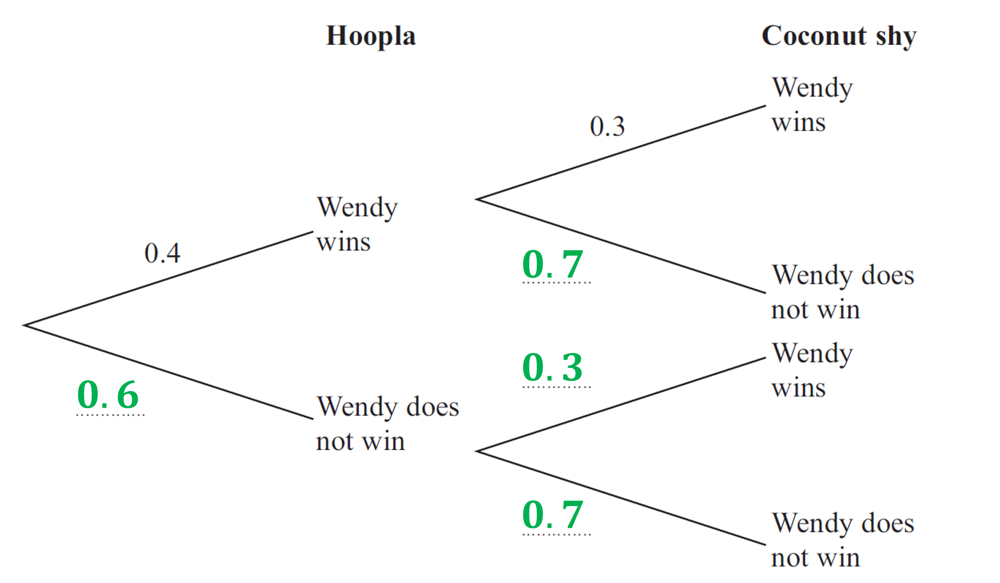

**  [2]**

**1 mark for 0.6 in the right place.  **
**1 mark for 0.7, 0.3 and 0.7 in the right places.**

### 19((b)) — 2 marks
> *In combined probabilities, 'and' usually means 'multiply'. So multiply the 'wins Hoopla' probability (0.4) by the 'wins coconut shy' probability (0.3).*

$0.4\times0.3=0.12$

**[1]**

**0.12 *** ***[1]**

## Q15 — medium — 2 marks · exam-questions

### 4() — 2 marks
> *The probabilities on each set of branches in a tree diagram should add up to 1.*

**Under 'first throw', 0.65 + 0.25 = 0.9.  They should add up to 1.***  ***[1]**

> *Probabilities for the same thing should be the same everywhere in the tree diagram.*

**In the top set of branches under 'second throw', 0.35 and 0.65 are the wrong way round.***  ***[1]**

## Q16 — medium — 5 marks · exam-questions

### 21((a)) — 3 marks
> *The probabilities on each branch of the tree must add up to 1. *
*So we can subtract the known probabilities from 1 to find the missing probabilities.*

$1-0.2=0.81-0.7=0.31-0.95=0.05$

** *** *

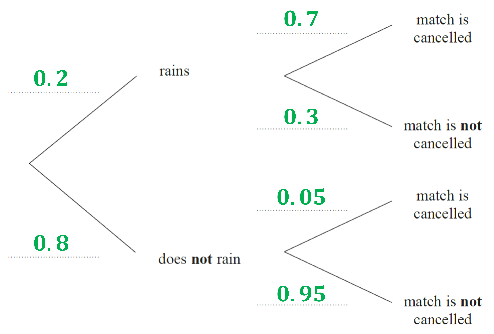

**  [3]**

**1 mark for 0.2 and 0.8 in the right place.  **
**1 mark for 0.7 and 0.3 in the right place.  **
**1 mark for 0.05 and 0.95 in the right place.**

### 21((b)) — 2 marks
> *With combined probabilities, 'and' usually means 'multiply'. *
*So multiply the 'does not rain' and 'does not rain, match is cancelled' probabilities to find the answer.*

$0.8\times0.05=0.04$

**  [1]**

**Final answer:** ** ****0.04****  [1]**

## Q17 — medium — 4 marks · exam-questions

### 1((a)) — 2 marks
*(i) **List the numbers that appear in set **A  **AND in set **B  **(i.e., in the 'overlap' of the two sets in the Venn diagram).*

**2, 4, 6, 12**  **[1]**

** **

*(ii)  **List the numbers that are NOT in set **B  **(i.e., all the numbers anywhere in the Venn diagram outside of the **B** circle). **B'**  is the **complement** of set **B**, and includes everything in the universal set *$ℰ$* that isn't in set **B**.*

**5, 7, 8, 9, 10, 11, 13, 14**  **[1]**

### 1((b)) — 2 marks
> *There are three numbers that are in set **A** but not in set **B  **(8, 10, and 14). There are 14 numbers in total in the Venn diagram.*

$\frac{3}{14}$**  [2]**

**1 mark for 3 in the numerator (with the denominator greater than 3) or for 14 in the denominator (with the numerator less than 14). 1 mark for a fully correct answer.**

## Q18 — medium — 5 marks · exam-questions

### 16((a)) — 2 marks
> $A\cupB$* is everything inside the two circles. *
*The region inside the rectangle but outside the two circles includes all of the things that are in *$ℰ$* but aren't in *$A\cupB$*. Therefore the number of things outside the circles is equal to  *`straight n open parentheses ℰ close parentheses minus straight n open parentheses A union B close parentheses`*.*

$80-68=12$

> *If you add together *`straight n open parentheses A close parentheses`* and *`straight n open parentheses B close parentheses`*, then you have included the 'overlap region' *$A\capB$* twice. *
*Therefore  *`straight n open parentheses A close parentheses space plus space straight n open parentheses B close parentheses space equals space straight n open parentheses A italic union B close parentheses space plus space straight n open parentheses A italic intersection B close parentheses.`* *
*This means that  *`straight n open parentheses straight A italic intersection straight B close parentheses space equals space straight n open parentheses A close parentheses space plus space straight n open parentheses B close parentheses space minus space straight n open parentheses straight A italic union straight B close parentheses.`

$62+30-68=24$

> *Finally, the number of things inside *$A$*but outside *$A\capB$* is equal to  *`straight n open parentheses straight A close parentheses minus straight n open parentheses A italic intersection B close parentheses.`* *
*And the number of things inside *$B$* but outside *$A\capB$* is equal to *`straight n open parentheses B close parentheses space minus space straight n open parentheses straight A italic intersection straight B close parentheses.`

$62-24=38\,\,30-24=6$

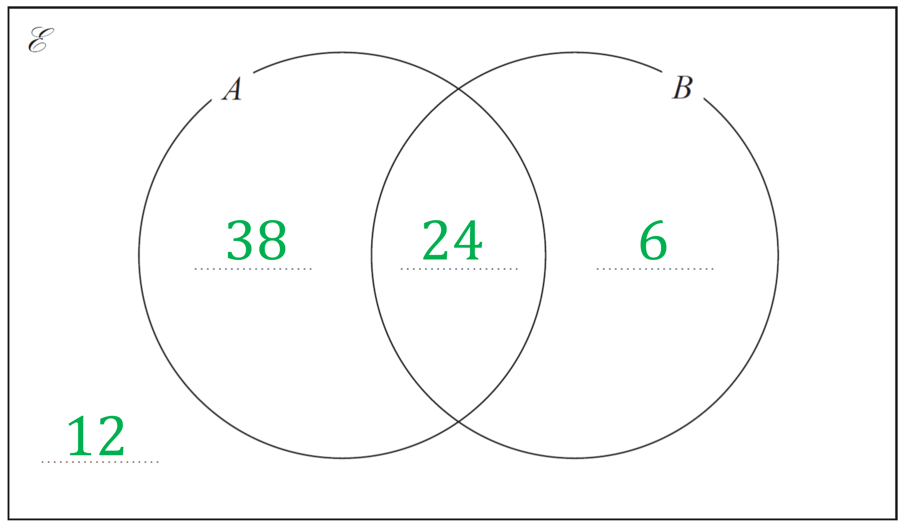

**  [2]**

**1 mark for 2 or 3 correct values in the correct regions, or 2 marks for all 4 correct values in the correct regions.**

### 16((b)) — 3 marks
*(i) **There are 24 elements in *$A\capB$* and 80 elements in the universal set *$ℰ$*.*

$\frac{24}{80}$  **[1]**

**Simplifying to 12/40, 6/20, or 3/10 will also get the mark, but is not necessary.  **
**Decimal form 0.3 will also get the mark.**

** **

*(ii) *$A\cupB'$* is everything that is either in *$A$* or isn't in *$B$*. *
*This means it is everything inside the rectangle **except **for the part of *$B$* that isn't also in *$A.$* *
*Add up the three numbers in the Venn diagram that correspond to this.*

$12+38+24=74$

**[1]**

> *And once again, there are 80 elements in *$ℰ$*.*

$\frac{74}{80}$  **[1]**

**Simplifying to 37/40 will also get the mark, but is not necessary. Decimal form 0.925 will also get the mark.**

## Q19 — medium — 4 marks · exam-questions

### 14((a)) — 2 marks
> *In packet A, there are 12 seeds in total. *
*And *$12-7=5$* of the seeds are **not** sunflower seeds. *
*Therefore the 'not sunflower' probability is 5/12.*

> *In packet B, there are 15 seeds in total. *
*8 of them are sunflower seeds, so the 'sunflower' probability is 8/15. *
*And *$15-8=7$* of the seeds are **not** sunflower seeds. *
*Therefore the 'not sunflower' probability is 7/15.*

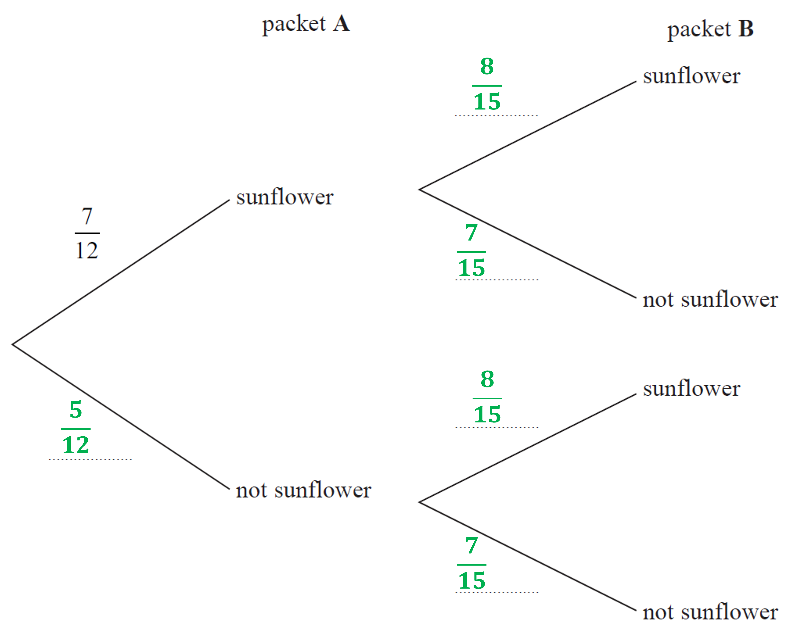

**  [2]**

**1 mark for either the 'packet A' probabilities all correct, or the 'packet B' probabilities all correct. **
**2 marks for all probabilities in the diagram correct.**

### 14((b)) — 2 marks
> *With combined probabilities, 'and' usually means 'multiply'. *
*So multiply the 'Packet A sunflower' and 'Packet B sunflower' probabilities to find the answer.*

$\frac{7}{12}\times\frac{8}{15}=\frac{56}{180}$

**  [1]**

**Final answer:** ** **$\frac{56}{180}$**  [1]**

**Simplifying to 28/90 or 14/45 will also get the mark, although it isn't necessary. **
**0.31(111...) or 31(.111...)% will also get the mark.**

## Q20 — medium — 5 marks · exam-questions

### 15((a)) — 2 marks
> *On spinner A, there are 2 red segments and 3 green segments. So the 'red' and 'green' probabilities are 2/5 and 3/5, respectively.*

> *On spinner B, there are 4 red segments and 1 green segment. *
*So the 'red' and 'green' probabilities are 4/5 and 1/5, respectively.*

> * *

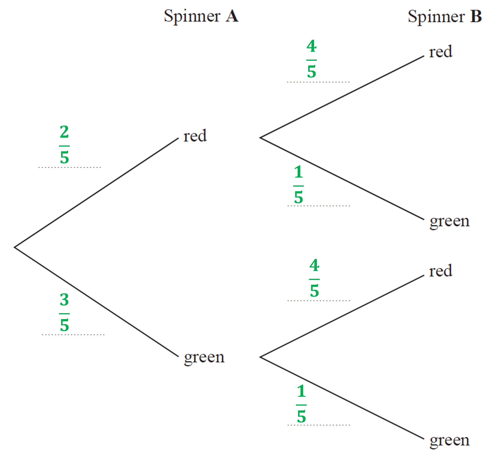

**  [2]**

**1 mark for all the 'Spinner A' probabilities correct. **
** 1 mark for all the 'Spinner B' probabilities correct.**

### 15((b)) — 3 marks
> *'At least one green' includes the possibilities 'red, green', 'green, red', and 'green, green'.*

> *You can multiply along the appropriate branches to get each of those individual probabilities (AND rule). *
*Then add them all together to get the total probability.*

`open parentheses 2 over 5 cross times 1 fifth close parentheses space plus space open parentheses 3 over 5 cross times 4 over 5 close parentheses space plus space open parentheses 3 over 5 cross times 1 fifth close parentheses space equals space 2 over 25 space plus space 12 over 25 space plus space 3 over 25 space equals space 17 over 25`

**  [2] **
**1 mark for any one correct product.  **
**1 mark for all three correct products added together.**

** **$\frac{17}{25}$**  [1] **
**0.68 or 68% will also get the mark.**

> *'At least one green' means that 'red, red'** **didn't happen. So you can also do this (and get the marks) by subtracting the probability for 'red, red' (8/25) from 1. 1 - 8/25 = 17/25*

## Q21 — medium — 4 marks · exam-questions

### 16((a)) — 2 marks
> *On the spinner, the numbers 2 and 4 are the only even numbers, so the probability of an even number is *$\frac{2}{5}$* and the probability of an odd number is *$\frac{3}{5}$

> *The dice has five red faces and one green, so the probability of red is *$\frac{5}{6}$* and the probability of green is *$\frac{1}{6}$

> *Note that the dice is only thrown if the spinner shows an even number, so we do not need any branches after the odd branch*

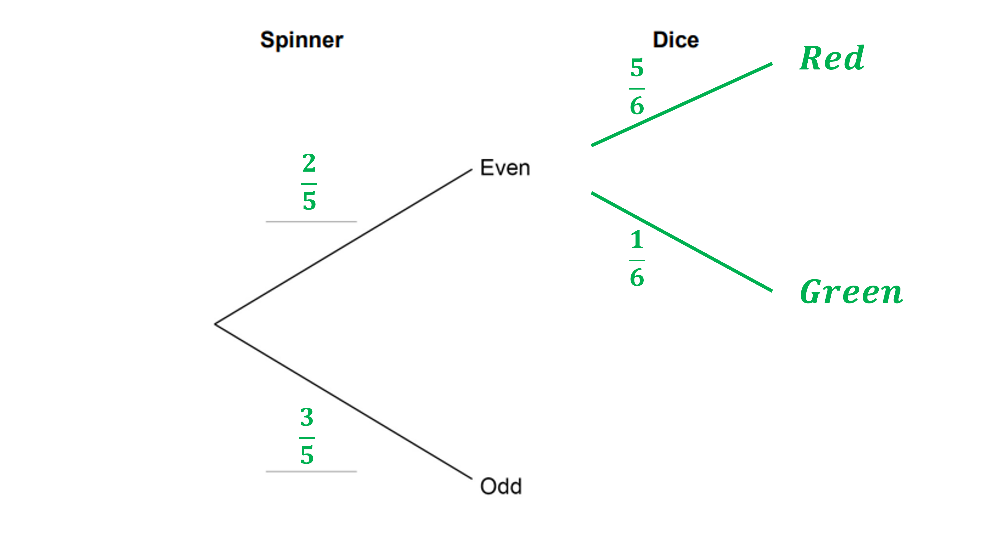

$\frac{2}{5}$** ****and **$\frac{3}{5}$** [1]**
 $\frac{5}{6}$** ****and**** **$\frac{1}{6}$** [1]**

### 16((b)) — 2 marks
> *Multiply the probability of getting an even number on the spinner *`open parentheses 2 over 5 close parentheses`* by the probability of getting a green face on the dice *`open parentheses 1 over 6 close parentheses`

$\frac{2}{5}\times\frac{1}{6}=\frac{2}{30}=\frac{1}{15}$

**Multiplying correct two probabilities ****[1]**

$\frac{1}{15}$**[1]**

## Q22 — medium — 3 marks · exam-questions

### 8() — 3 marks
> *As "rains" and "does not rain" are the only two possible states (they are said to be "exhaustive")*

**The probability of not raining on Monday should be 1-0.55=0.45 ****[1]**

> *We are told the probability of rain on Tuesday is 0.25, this has been placed in the wrong position.*

**The probabilities on the branches of the Tuesday part of the diagram should be switched ****[1]**

**A pair of branches is missing after "does not rain" on Monday ****[1]**

## Q23 — medium — 4 marks · exam-questions

### 6((a)) — 2 marks
> *The branches for each pick should sum to , as the counters are either red or blue only*

$1-\frac{4}{7}=\frac{3}{7}$

> *The counter is always replaced, so the probabilities for the second pick are the same*

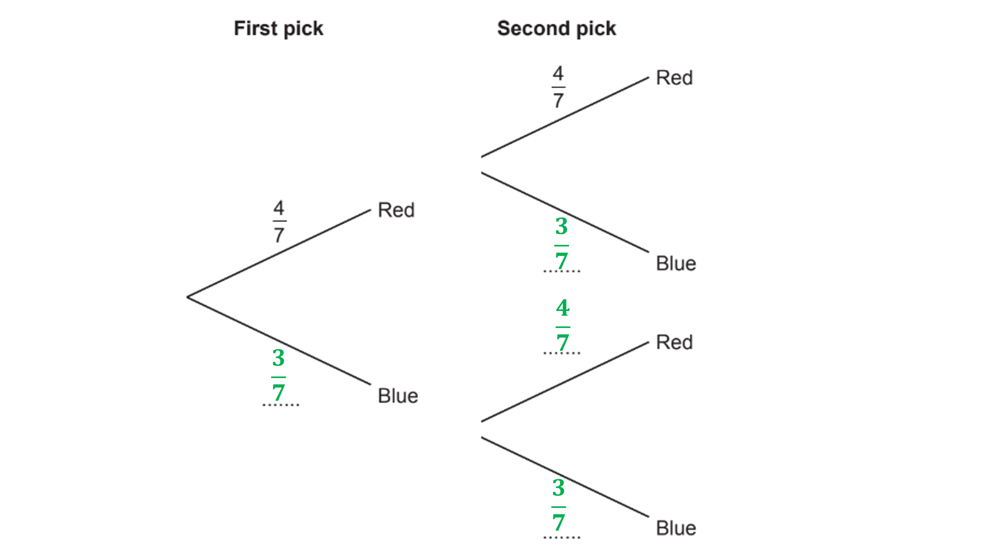

**[2]**

### 6((b)) — 2 marks
> *Two red counters is the following combination of branches:*

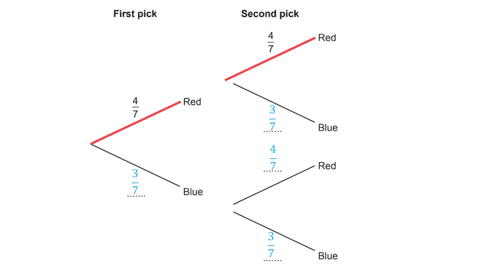

> *The probability of this combination is*

$\frac{4}{7}\times\frac{4}{7}=\frac{16}{49}$

$\frac{16}{49}$ **[2]**

## Q24 — medium — 8 marks · exam-questions

### 13((a)) — 1 marks
> *The lights can only be either "red" or "not red", these events are said to be exhaustive and their probabilities must sum to 1*

> *We can use this fact to find the missing information on each branch, e.g. 1 - 0.6 = 0.4*

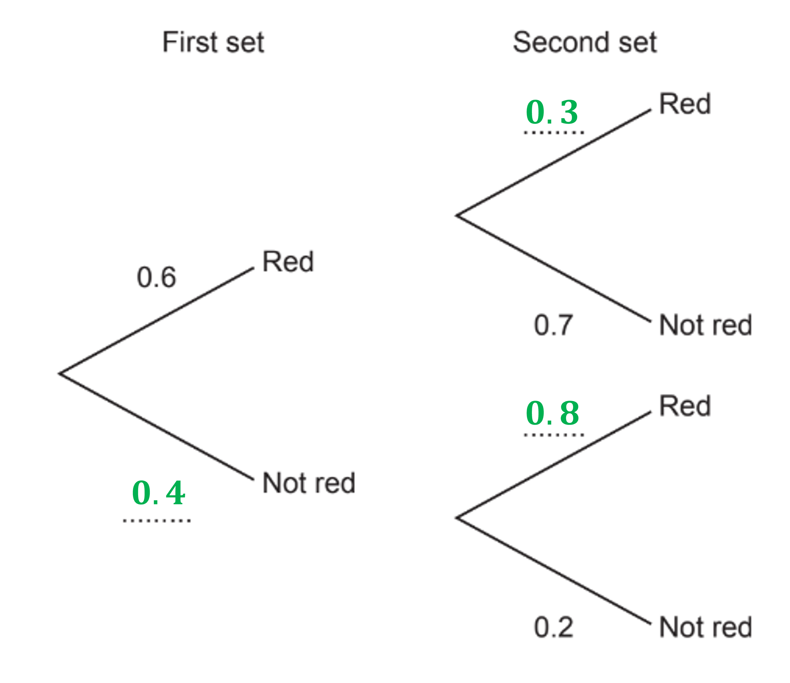

**[1]**

### 13((b)) — 1 marks
> *This can be read from the diagram, looking at the first pair of branches*

**0.4**** ****[1]**

### 13((c)) — 1 marks
> *"Given that the first set is red" means we are looking at the top half of the tree diagram for the second set of lights, and the probability of the second set not being red can be read off the diagram*

**0.7** **[1]**

### 13((d)) — 2 marks
> *Consider the branches highlighted in red, and multiply the probabilities of these branches*

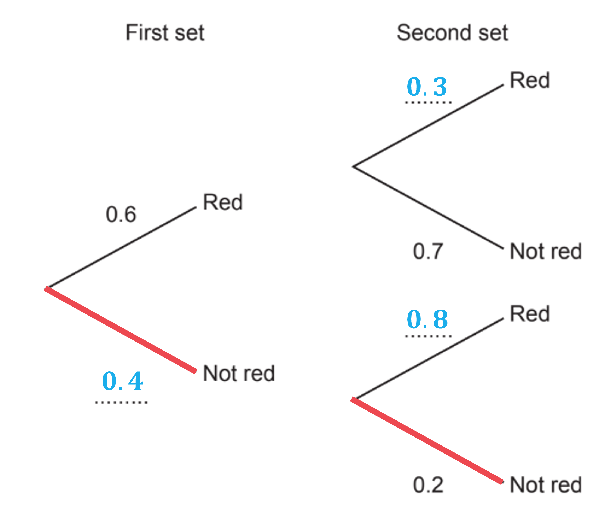

*0.4 × 0.2*

**[1]**

**0.08** **[1]**

### 13((e)) — 3 marks
*At least one set of lights not being red could be any of;* 
*Red, then Not Red* 
*Not Red, then Red* 
*Not Red, then Not Red* 
*These are shown below on the tree diagram*

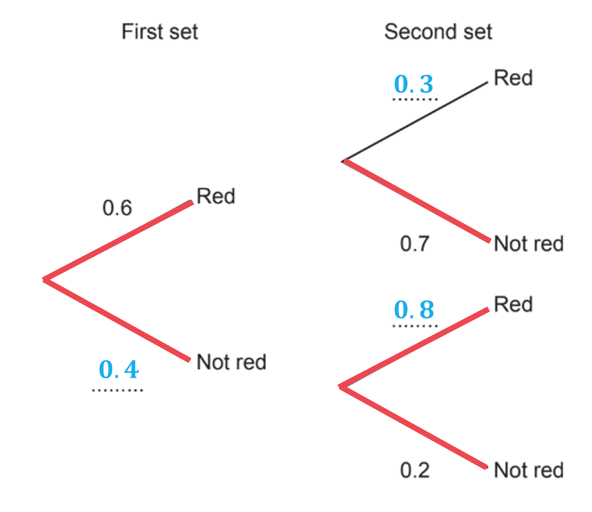

> *Calculating the probabilities*

*Red, then Not Red: 0.6 × 0.7 = 0.42* 
*Not Red, then Red: 0.4 × 0.8 = 0.32* 
*Not Red, then Not Red: 0.4 × 0.2 = 0.08*

**Finding relevant probabilities**** [1]**

> *Then sum these three probabilities*

*0.42 + 0.32 + 0.08 = 0.82*

**Summing possible cases**** [1]**

**0.82** **[1]**

**Alternatively, the probability for Red, then Red could be found, and then the inverse of this can be found** 
**0.6 × 0.3 = 0.18** 
**1 - 0.18 = 0.82**

## Q25 — medium — 2 marks · exam-questions

### 14() — 2 marks
> *The probabilities in a Venn diagram must sum to 1, as they are exhaustive (cover all possibilities) so we can use this to find the probability on the outside of the circles*

*1-0.3-0.15-0.35=0.2*

> $P(A'UB)$* means "the probability of not A, or B", note that this is different to "not A or B"*

> *The blue shaded area shows the regions which satisfy "not A, or B"*

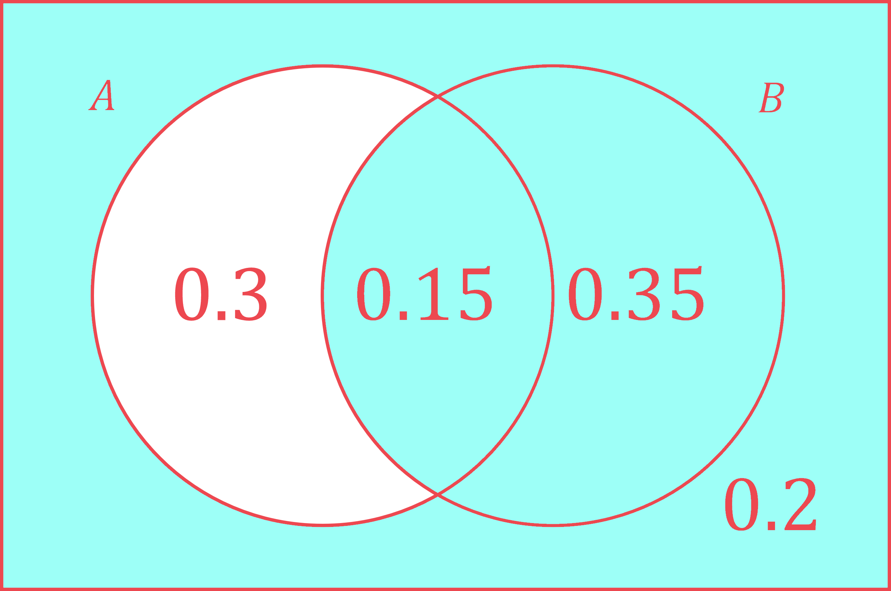

**[1]**

*The outside is shaded as it satisfies "not A"* 
*The 0.35 is shaded as it satisfies "not A"* 
*The 0.15 is shaded as it satisfies "...or B"*

> *Summing the probabilities in the shaded regions*

*0.15+0.35+0.2=0.7*

**0.7** **[1]**

## Q26 — medium — 4 marks · exam-questions

### 6((a)) — 3 marks
> *The square numbers in the list are*

*Squares: 1, 4, 9*

> *The even numbers in the list are*

*Even: 2, 4, 6, 8, 10, 12*

*The only number in both lists is 4, so 4 will be the only number in the central overlapping region* 
*3, 5, 7, 11 are not square or even, so will be on the outside of the circles*

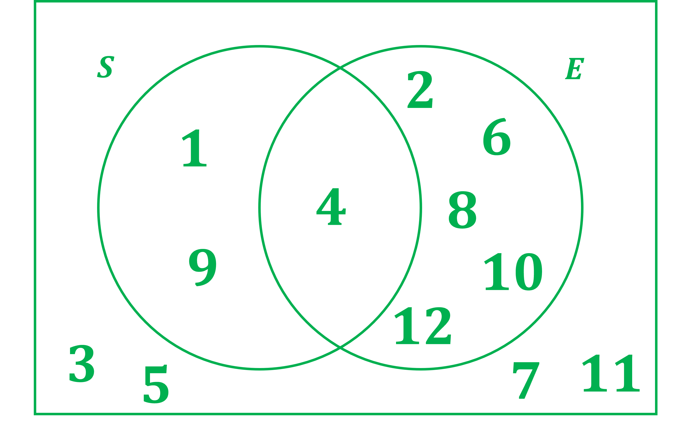

**1 of the 4 sections correct**** [1]** 
**2 or 3 of the 4 sections correct**** [1]** 
**4 of the 4 sections correct**** [1]**

### 6((b)) — 1 marks
> $P(S\capE)$* means "the probability of the number being square and even"*

> *The only number that satisfies this is 4*

> *So this is 1 number, out of a total of 12 numbers*

$\frac{1}{12}$ **[1]**

## Q27 — medium — 5 marks · exam-questions

### 4() — 5 marks
> *We are told there are 60 students in total, so all the values (or in this case expressions) in the circles must sum to 60*

`table attributes columnalign right center left columnspacing 0px end attributes row cell x plus 2 x plus open parentheses x minus 1 close parentheses plus open parentheses 5 x minus 2 close parentheses end cell equals 60 end table`

**Forming equation**** [1]**

> *Simplify and solve the equation*

`table row cell 9 x minus 3 end cell equals 60 row cell 9 x end cell equals 63 row x equals 7 end table`

**Simplifying and solving ****[2]**

*The students who have a bank account are those in the left circle, *$2x$*, and the students in the middle overlapping section, *$x-1$ *We now know that *$x=7$

*Number of students who have a bank account: *`2 x space plus thin space open parentheses x minus 1 close parentheses space equals space 2 open parentheses 7 close parentheses plus open parentheses 7 minus 1 close parentheses equals 20`

**[1]**

> *Expressing as a probability out of the total of 60 students*

$\frac{20}{60}=\frac{2}{6}=\frac{1}{3}$

$\frac{1}{3}$** [1] **
**Any equivalent fraction accepted**

## Q28 — medium — 4 marks · exam-questions

### 13((a)) — 2 marks
> **[exam-tip]**
> Probabilities on the branches should add up to 1.

> *Use the information given about the number of each colour to complete the tree diagram*

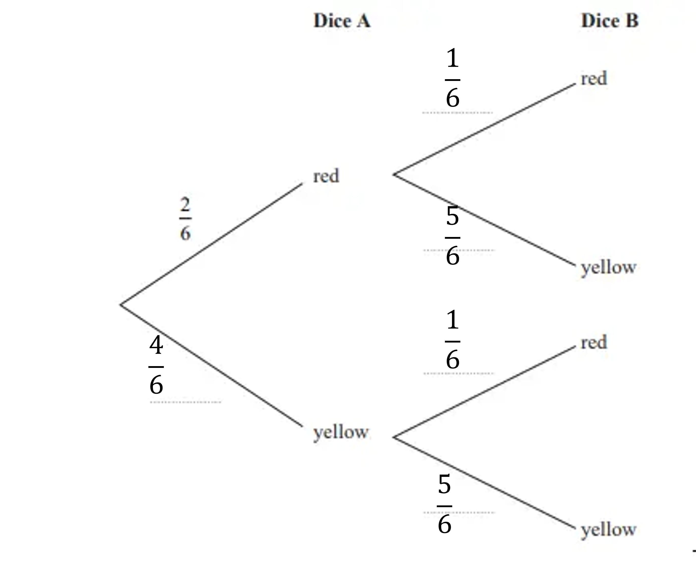

**[B1 B1]**

> **[mark-scheme]**
> **B1**: For having 4/6 on the first yellow branch.
> 
> **B1**: For having all of the dice B branches correct.

### 13((b)) — 2 marks
> *Multiply the probabilities of yellow on dice A and yellow on dice B*

$\frac{4}{6}\times\frac{5}{6}$

**[M1]**

$\frac{20}{36}\mathrm{or}\frac{5}{9}$

**[A1]**

## Q29 — medium — 5 marks · exam-questions

### 11((a)) — 2 marks
> *The branches of a probability tree sum to 1*

$1-\frac{5}{16}=\frac{11}{16}$

$1-\frac{7}{20}=\frac{13}{20}$

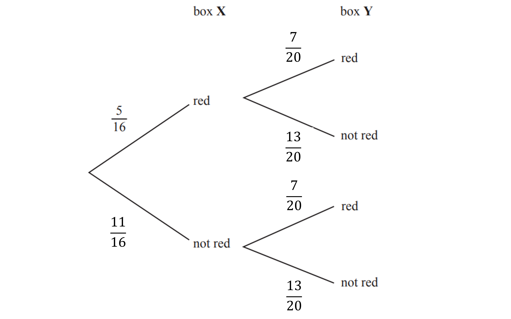

**[B1 B1]**

> **[mark-scheme]**
> **B1:** For $\frac{11}{16}$.
> 
> **B1:** For $\frac{7}{20},\frac{13}{20},\frac{7}{20},\frac{13}{20}$.

### 11((b)) — 3 marks
> *First work out the probability that both crayons are red by multiplying along the top branches*

`P open parentheses R comma space R close parentheses space equals 5 over 16 space cross times 7 over 20 space equals 35 over 320`

**[M1]**

> *Work out the probability that both crayons are not red by multiplying along the bottom branches*

`P open parentheses R apostrophe comma space R apostrophe close parentheses space equals 11 over 16 space cross times 13 over 20 space equals 143 over 320`

> *Add the fractions together*

$\frac{35}{320}+\frac{143}{320}=\frac{178}{320}=\frac{89}{160}$

**[M1]**

$\frac{89}{160}$

**[A1]**

## Q30 — hard — 6 marks · exam-questions

### 12((a)) — 4 marks
> *Because it's possible to like more than one drink, we want to use a Venn diagram here. *
*Start by drawing and labelling a blank diagram (T = 'tea', C = 'coffee', M = 'milk'). *
*Don't forget the rectangle around the three circles, and the label for the universal set (the 'curly E' *$E$*). *
*Then put 19 in the middle because we're told that 19 people like all three drinks.*

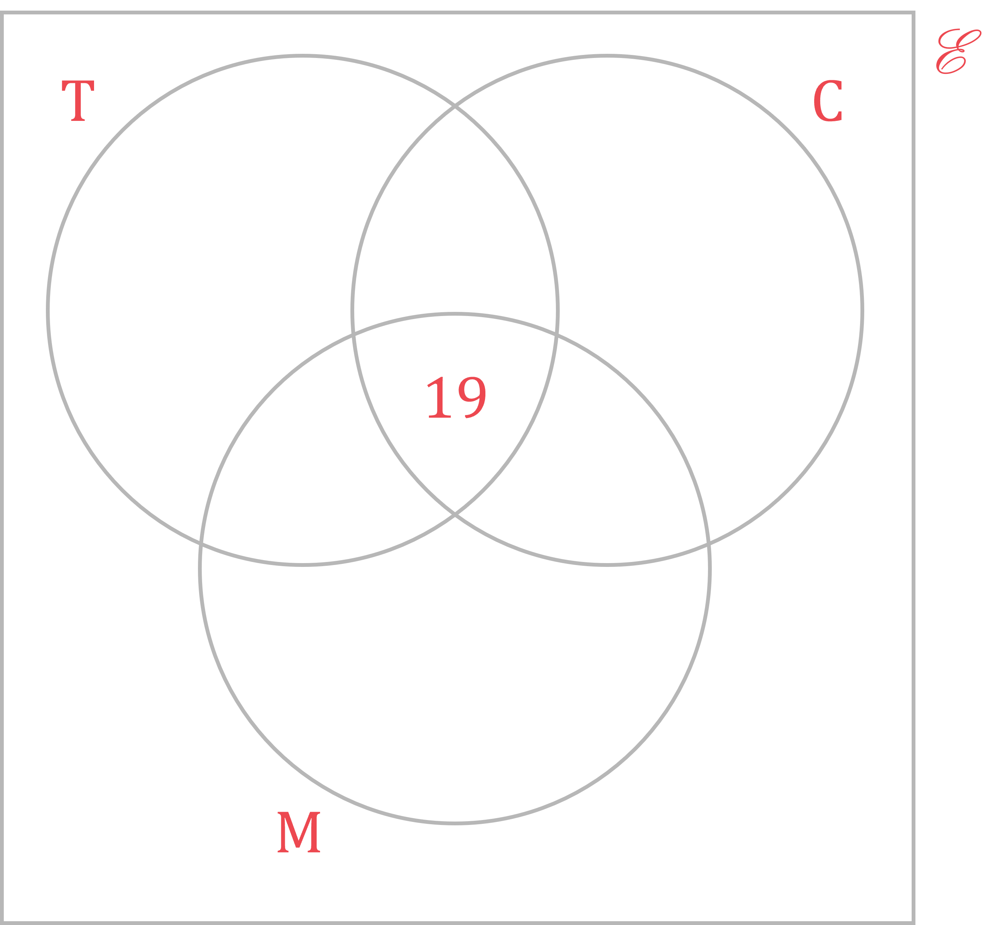

**[1]**

> *Now start using the other information to fill in other parts of the diagram. *
*Put a '1' in the 'M only' part of the M circle, because 1 person likes only milk. *
*Put a '16' in the 'T and C but not M' region. *
*Subtract 19 from 21 to find 'C and M but not T'. *
*Subtract 19 from 24 to find 'T and M but not C'.*

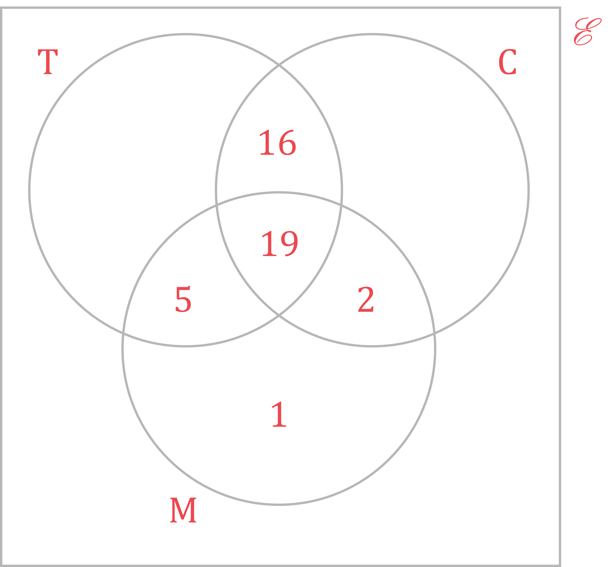

**[1]**

> *That leaves three regions to fill in. *
*Subtract (16 + 19 + 2) from 40 to find 'only C'. *
*Everyone likes at least one drink, so put a zero outside the circles inside the rectangle. *
*Then subtract all the other numbers (16 + 19 + 2 + 5 + 3 + 1) from 50 to find 'only T'.*

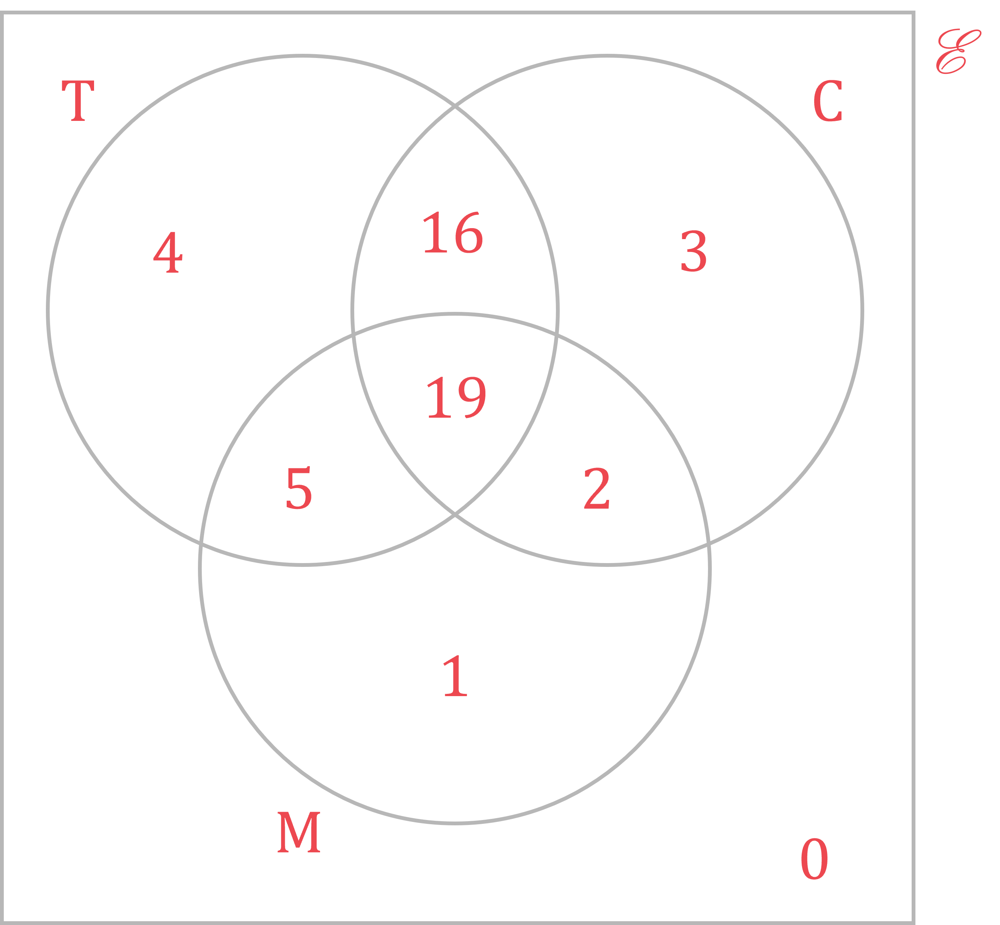

**[1] **
**You will get 3 marks for a correct and complete Venn diagram, however you managed to find all the numbers!**

> *Then add up the numbers in the T circle to find the total that like tea. *
*And divide that by 50 to find the probability that a randomly selected person likes tea.*

$\frac{4+5+16+19}{50}=\frac{44}{50}$

$\frac{44}{50}$** *** ***[1]**

**0.88 (decimal form) or **$\frac{22}{25}$**(simplified fraction) will also get the mark.**

### 12((b)) — 2 marks
> *This is a conditional probability ('given that'), so we're only interested in people who like tea. *
*'Likes tea and likes exactly one other drink' is the region 'T and M but not C' (5 people) combined with 'T and C but not M' (16 people). *
*Add those together and divide by 44 (the total who like tea) to find the probability asked for.*

$\frac{5+16}{44}=\frac{21}{44}$

**[1]**

$\frac{21}{44}$** *** ***[1]**

**Leave answer as an exact fraction here to get the mark!**

## Q31 — hard — 5 marks · exam-questions

### 20() — 5 marks
> *Because it's possible to speak more than one language, we want to use a Venn diagram here. *
*Start by drawing and labelling a blank diagram (F = 'French', G = 'German', S = 'Spanish'). *
*To get the marks here, you don't need to include the rectangle around the three circles or the label for the universal set (the 'curly E' *$E$*), but it's still nice to include them. *
*Then fill in the numbers that you know right away from the given info:*
*        Put 2 in the middle because we're told that 2 people speak all three languages*
*        Put 4 in the 'F and S but not G' region, because we're told 4 people speak French and Spanish but not German*
*        Put 8 outside the circles inside the rectangle, because we're told 8 people do not speak any of the languages. *
*Then start to fill in the other regions.  *
*We're told 7 people speak German and Spanish, and we know that 2 speak all 3 languages, so subtract 2 from 7 to find 'G and S but not F'.*

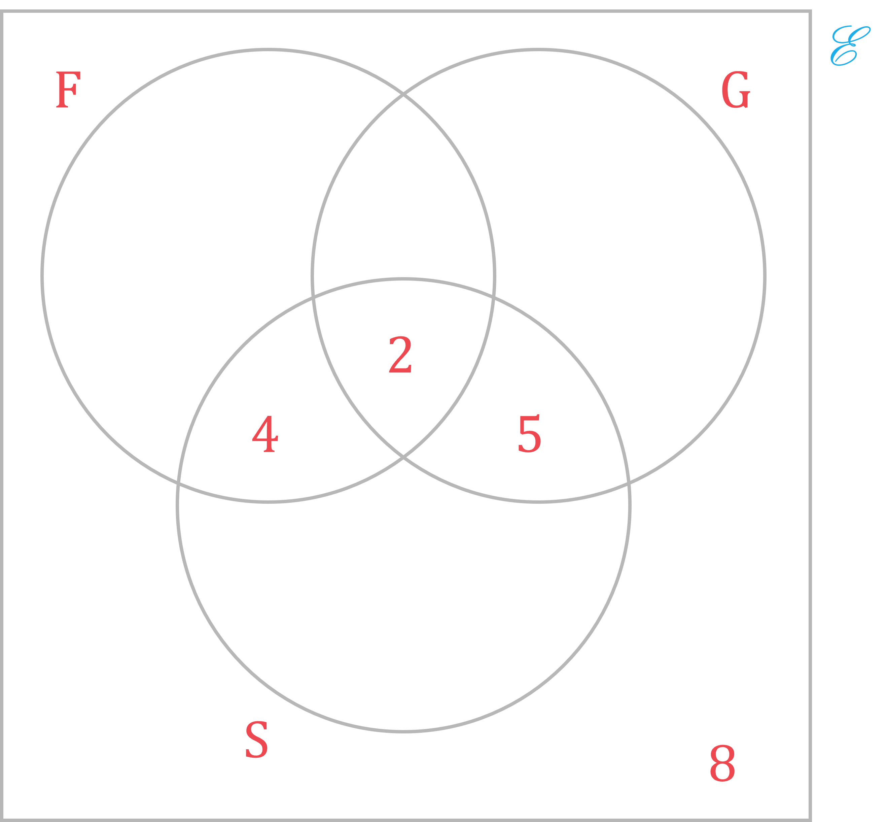

**[1]**

> *Now start using the other information to fill in other parts of the diagram. Put a '0' in the 'G only' part of the G circle, because all German speakers speak at least one other language.*
* Subtract (0 + 5 + 2) from 10 to find 'G and F but not S', because there are 10 German speakers. *
*Then subtract (4 + 2 + 3) from 31 to find 'F only', because there are 31 French speakers.*

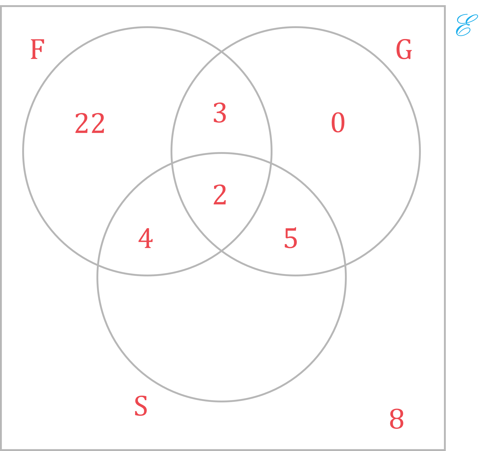

**[1]**

> *That leaves one region to fill in. *
*There are 50 people in total, so subtract (22 + 3 + 0 + 4 + 2 + 5 + 8) from 50 to find 'only S'.*

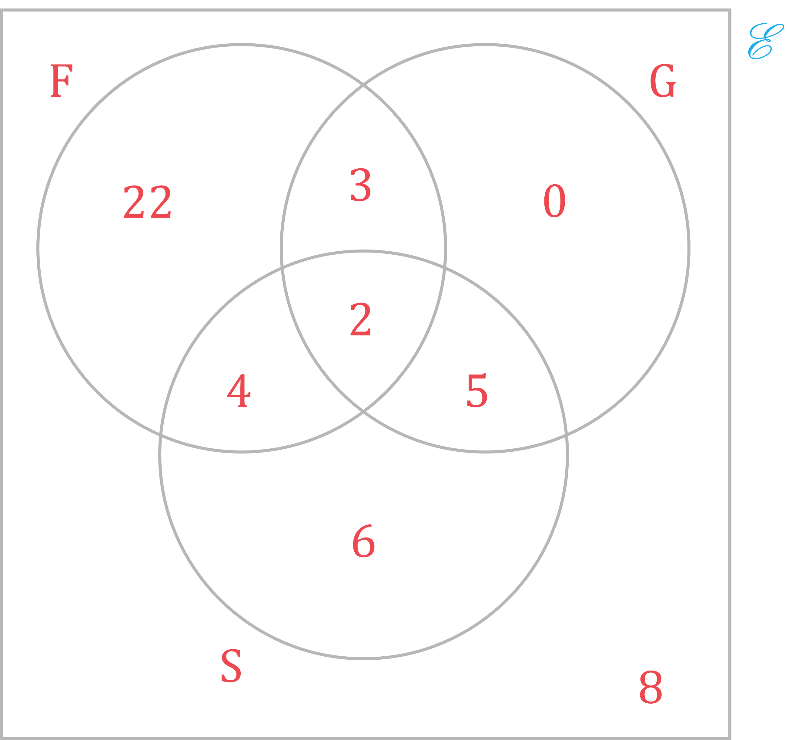

**[1] **
**You will get 3 marks for a correct and complete Venn diagram, however you managed to find all the numbers!**

> *Now we know that 6 out of the 50 people speak only Spanish. With combined probabilities, 'and' usually means 'multiply'. 'They both only speak Spanish' is the same thing as 'the first person chosen only speaks Spanish (6/50)' AND 'the second person chosen also only speaks Spanish (5/49)'. *
*(If the first person chosen is a Spanish-only speaker, then there are only 5 Spanish-only speakers left out of 49 total people left, so the second probability has to change!) *
*Multiply those two fractions together to find the probability that both people chosen only speak Spanish.*

$\frac{6}{50}\times\frac{5}{49}=\frac{3}{245}$

**[1]**

$\frac{3}{245}$**  [1]**

**Unsimplified fractions like 30/2450 or 6/490 will also get the mark.  **
**Decimal form 0.01(22...) or percentage form 1(.22...)% will also get the mark, ****if**** accompanied by correct working.**

## Q32 — hard — 4 marks · exam-questions

### 11((a)) — 2 marks
> *In combined probabilities, 'and' usually means 'multiply'. *
*The probability of winning is 0.7 each time, so multiply 0.7 by 0.7.*

$0.7\times0.7=0.49$

**[1]**

**0.49 *** ***[1]**

### 11((b)) — 2 marks
> *Multiply the probabilities for 'win AND lose', 'lose AND win', and 'lose AND lose'. *
*But in combined probabilities 'or' usually means 'add'. *
*So add those products together to get 'win AND lose' OR 'lose AND win' OR 'lose AND lose'.*

`open parentheses 0.7 space cross times space 0.3 close parentheses space plus space open parentheses 0.3 space cross times space 0.7 close parentheses space plus space open parentheses 0.3 space cross times space 0.3 close parentheses space equals space 0.51`

**[1]**

**0.51 *** ***[1]**

**'Loses at least one match' is the same as 'didn't win both matches'.  So you can also get this by subtracting the answer to part (a) from 1.  I.e., 1 - 0.49 = 0.51.**

## Q33 — hard — 5 marks · exam-questions

### 19((a)) — 2 marks
> *The probabilities on each branch of the tree must add up to 1. *
*So we can subtract the known probabilities from 1 to find the missing probabilities.*

$1-0.7=0.3$

** *** *

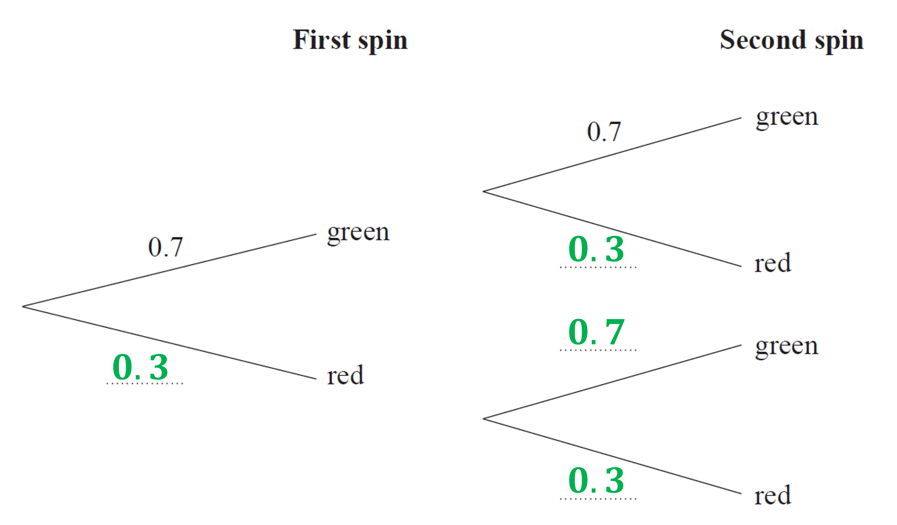

**  [2]**

**1 mark for 0.3 in the right place on 'First spin'.  **
**1 mark for 0.3, 0.7 and 0.3 in the right places on 'Second spin'.**

### 19((b)) — 3 marks
> *In combined probabilities, 'and' usually means 'multiply' and 'or' usually means 'add'. *
*Multiply the probabilities for 'green AND red' and 'red AND green'.*
*Then add those products together to get 'green AND red' OR 'red AND green' .*

`open parentheses 0.7 space cross times space 0.3 close parentheses space plus space open parentheses 0.3 space cross times space 0.7 close parentheses space equals space 0.42`

**[2] **
**1 mark for multiplying 0.7 and 0.3 together.  **
**1 mark for adding the two products together.**

**0.42 *** ***[1]**

## Q34 — hard — 5 marks · exam-questions

### 19((a)) — 2 marks
> *The probabilities on each branch of the tree must add up to 1. *
*So we can subtract the known probabilities from 1 to find the missing probabilities.*

$1-0.02=0.98\,\,1-0.05=0.95$

** *** *

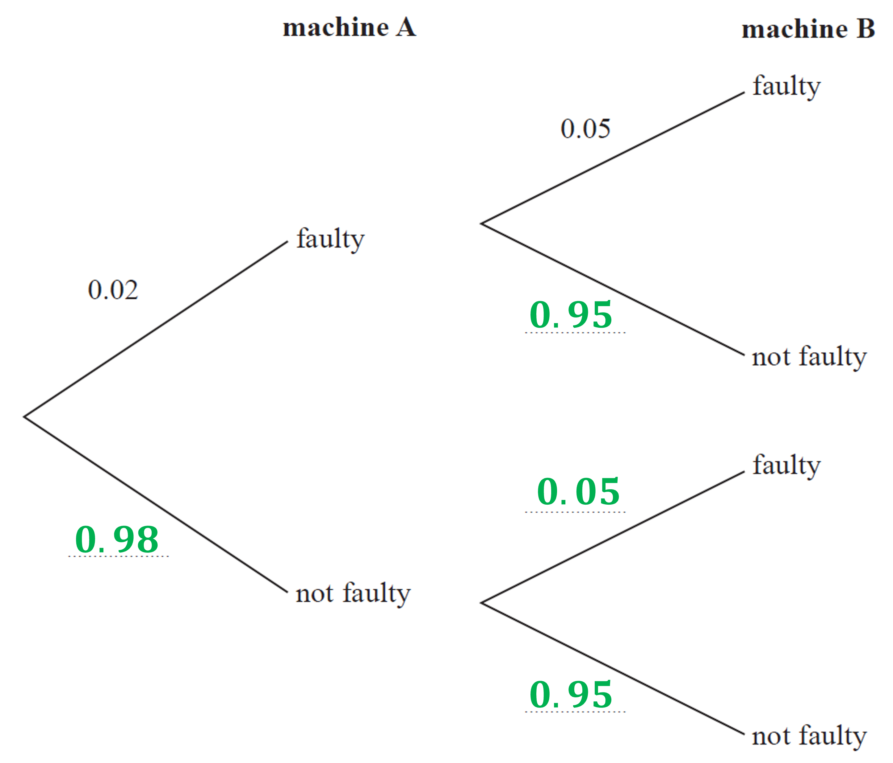

**  [2]**

**1 mark for 0.98 in the right place on 'machine A'.  **
**1 mark for 0.95, 0.05 and 0.95 in the right places on 'machine B'.**

### 19((b)) — 3 marks
> *'At least one is faulty' is the same thing as 'both aren't not faulty'. The easiest way to do this is to find the 'not faulty AND not faulty' probability and subtract it from 1. *
*In combined probabilities, 'and' usually means 'multiply'. *
*So multiply 0.98 by 0.95 to find the probability both bottles are **not **faulty.*

$0.98\times0.95=0.931$

**[1]**

> *Then subtract that from 1 to find the probability that at least one is faulty.*

$1-0.931=0.069$

**0.069 *** ***[1]**

**You can also do this by multiplying to get the probabilities for 'faulty AND faulty', 'faulty AND not faulty', and 'not faulty AND faulty', and then adding those together to get the answer. **
**I.e., **`open parentheses 0.02 space cross times space 0.05 close parentheses space plus space open parentheses 0.02 space cross times space 0.95 close parentheses space plus space open parentheses 0.98 space cross times space 0.05 close parentheses space equals space 0.069`

## Q35 — hard — 5 marks · exam-questions

### 10((a)) — 2 marks
> *The probability of 'not late' is *$1-0.15=0.85$

> *The probabilities are the same for any day*

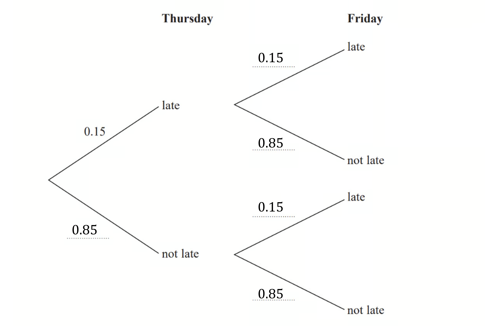

**For 0.85 [1]**

**Correct tree [1]**

### 10((b)) — 3 marks
**Method 1**

> *Find the probability that the train is not late on both days by multiplying the relevant probabilities*

$0.85\times0.85=0.7225$

**[1]**

> *Subtract this from 1*

$1-0.7225=0.2775$

**[1]**

**0.2775 or **$\frac{111}{400}$ **[1]**

**Method 2**

> *Find the probabilities of the three possibilities where the train is late at least once by multiplying the relevant probabilities*

*Late and late: *$0.15\times0.15=0.0225$

*Late and not late (or not late and late): *$0.15\times0.85=0.1275$

**At least one correct product [1]**

> *Add them together*

$0.0225+0.1275+0.1275=0.2775$

**[1]**

**0.2775 or **$\frac{111}{400}$ **[1]**

## Q36 — hard — 5 marks · exam-questions

### 15((a)) — 2 marks
> *The probabilities on each branch of the tree must add up to 1. *
*So we can subtract the known probabilities from 1 to find the missing probabilities.*

$1-0.45=0.551-0.67=0.331-0.35=0.65$

** *** *

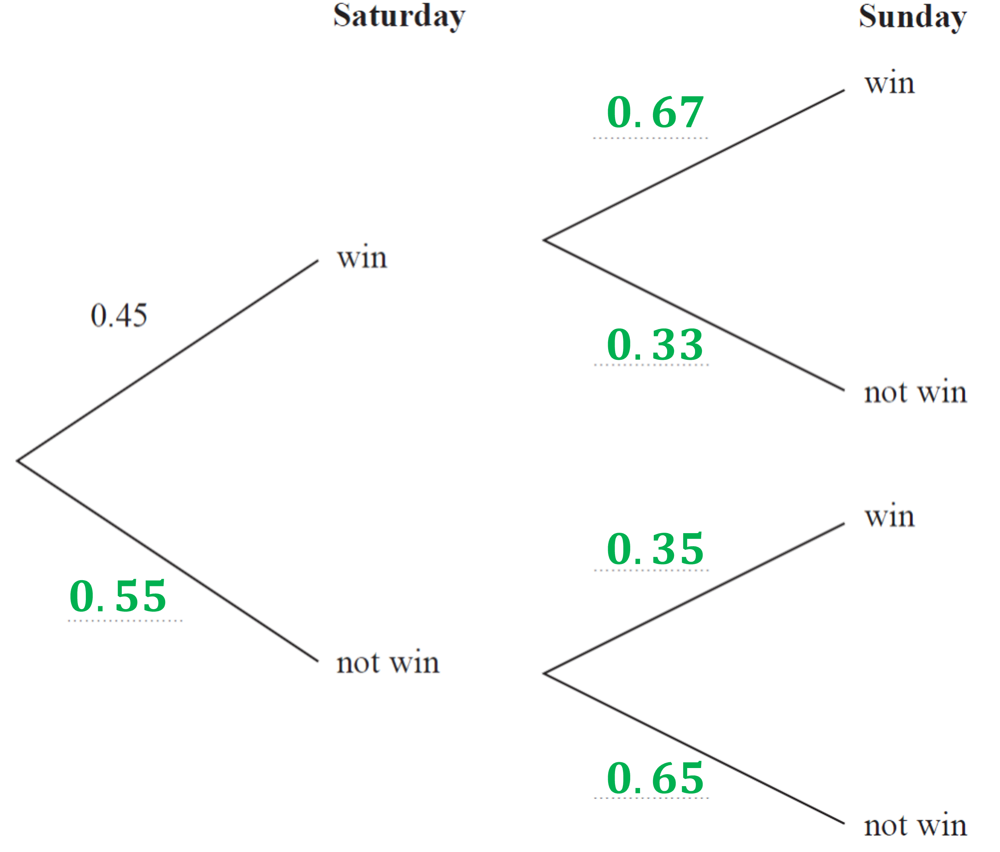

**  [2]**

**1 mark for 0.55 in the right place on 'Saturday'.  **
**1 mark for the other 4 numbers in the right places on 'Sunday'.**

### 15((b)) — 3 marks
> *With combined probabilities, 'and' usually means 'multiply' and 'or' usually means 'add'. *
*'Wins exactly one match' is the same as 'wins on Saturday AND does not win on Sunday' OR 'does not win on Saturday AND wins on Sunday'. *
*So multiply the probabilities from the corresponding parts of the tree diagram, and then add the products together to get the answer.*

`open parentheses 0.45 space cross times space 0.33 close parentheses space plus space open parentheses 0.55 space cross times space 0.35 close parentheses space equals space 0.341`

**  [2] **
**1 mark for one correct product.  **
**1 mark for two correct products added together.**

** ****0.341****  [1]**
** ****Answers between 0.34 and 0.341 will get the mark here.**

## Q37 — hard — 5 marks · exam-questions

### 23((a)) — 2 marks
> *After the 1st bulb is chosen only 9 bulbs remain, so 9 should be in the denominators of the probabilities for '2nd bulb'. *
*If the 1st bulb is red, 6 red and 3 yellow will be left for choosing the 2nd bulb.  *
*If the 1st bulb is yellow, 7 red and 2 yellow will be left for choosing the 2nd bulb.*
* The numerators for '2nd bulb' should show these differences. And as always, make sure the probabilities for each branch add up to 1!*

$1-\frac{7}{10}=\frac{3}{10}$

** *** *

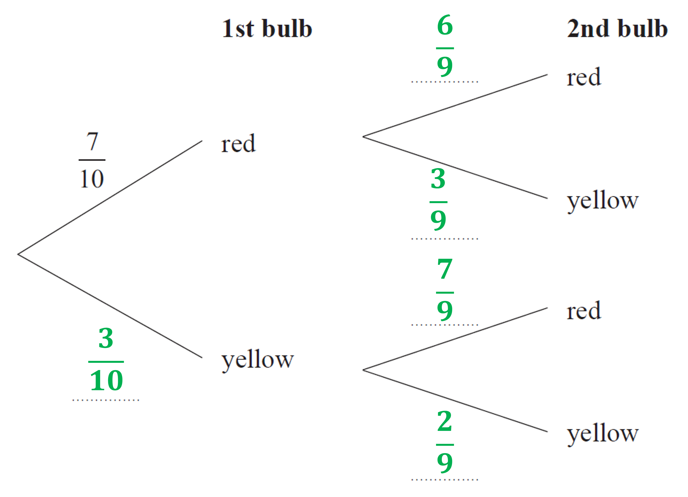

**  [2]**

**1 mark for 3/10 in the right place on '1st bulb'.  1 mark for the other 4 numbers in the right places on '2nd bulb'.**

**You will still get the mark if you simplify 6/9 to 2/3 and 3/9 to 1/3.  But you don't have to do that, and often it is easiest to keep all probabilities at a given 'stage' of the tree diagram with the same denominator.**

### 23((b)) — 3 marks
> *With combined probabilities, 'and' usually means 'multiply' and 'or' usually means 'add'. *
*'At least one yellow' is the same as 'yellow AND yellow' OR 'yellow AND red' OR 'red AND yellow'. *
*So multiply the probabilities from the corresponding parts of the tree diagram, and then add the products together to get the answer.*

`open parentheses 3 over 10 space cross times space 2 over 9 close parentheses space plus space open parentheses 3 over 10 space cross times space 7 over 9 close parentheses space plus space open parentheses 7 over 10 space cross times space 3 over 9 close parentheses space equals space 6 over 90 space plus space 21 over 90 space plus space 21 over 90 space equals space 48 over 90 space space`

**  [2] **
**1 mark for one correct product.  **
**1 mark for three correct products added together.**

** **$\frac{48}{90}$**  [1] **
**Simplifying to 24/45 will also get the mark here.**

**You can also get the answer (and full marks) by first finding P(red, red) **$=\frac{7}{10}\times\frac{6}{9}=\frac{42}{90}$**. **
**'At least one yellow' means 'red, red' ****didn't ****happen.  **
**So subtract P(red, red) from 1 to find the answer. I.e., P(at least 1 yellow)**$=1-\frac{42}{90}=\frac{90}{90}-\frac{42}{90}=\frac{48}{90}$

## Q38 — hard — 4 marks · exam-questions

### 18((a)) — 3 marks
> $\frac{1}{3}$* of the 42 male teachers have blue eyes*

$\frac{1}{3}\times42=14$* male teachers with blue eyes*

> *So there are 14 teachers in the middle, overlapping region*

> *We are told that there are 42 male teachers in total, so we can fill in the remaining part of the M circle*

*42 - 14 = 28*

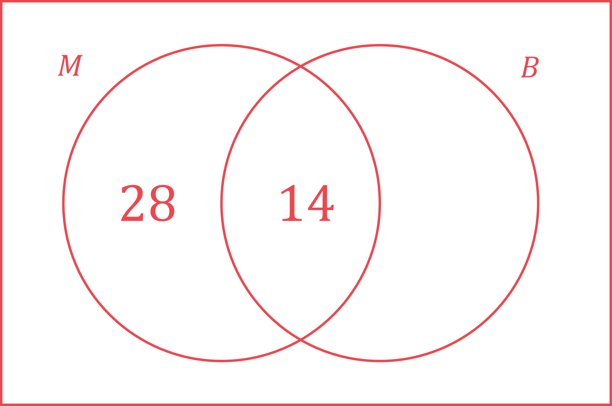

> *There are 44 female teachers, and we are told *$\frac{1}{4}$* of them have blue eyes*

$\frac{1}{4}\times44=11$* female teachers with blue eyes* 
*44 - 11 = 33 female teachers without blue eyes*

> *Males with blue eyes are in the middle, and females without blue eyes are outside both circles, so the 11 females with blue eyes will be in the "only B" part of the circle*

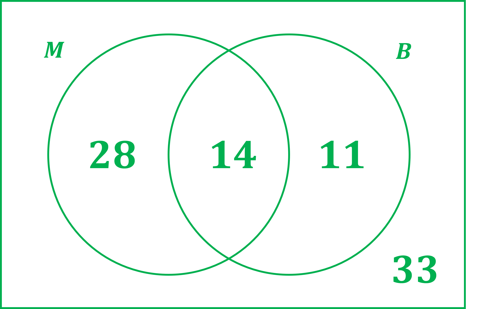

**One correct number in correct place**** [1] **
**Two or three correct numbers in correct places**** [1] **
**Fully correct diagram**** [1] **
**As a check, add up all the numbers in the diagram to make sure they agree with the stated total of 86** 
**28+14+11+33=86**

### 18((b)) — 1 marks
> *We are only considering teachers with blue eyes, the B circle, which is a total of 14+11=25 teachers*

> *Out of these, we want those that are male, which is the 14 in the middle overlapping section*

$\frac{14}{25}$ **[1]**

## Q39 — hard — 3 marks · exam-questions

### 14((a)) — 1 marks
> *We are told there are 121 students in total, so all the values (and expressions) in the circles must sum to 121*

$41+x+18+35=121$

> *Simplify and solve*

`table attributes columnalign right center left columnspacing 0px end attributes row cell x plus 94 end cell equals 121 row x equals 27 end table`

$x=27$* ***[1]**

### 14((b)) — 2 marks
> *"Given that they study Physics" means we are only considering those who study Physics; which is the 18 and the *$x$

*We then want the probability that they study maths as well, so this is the region in the centre, *$x$ 
*We do not consider the 41 as these are students who only study Maths*

$\frac{x}{18+x}=\frac{27}{18+27}=\frac{27}{45}=\frac{3}{5}$

**Correct numerator of 27**** [1]**

$\frac{3}{5}$ **[1]** 
**Any equivalent fraction allowed**

## Q40 — hard — 6 marks · exam-questions

### 1() — 2 marks
> *The intersection of A and B is 12, so place that in the appropriate place on the diagram.*

> *Subtract the number of elements in the intersection of **A** and **B** from the number of elements in set **A** to find the number of elements that are only in set **A**.*

$22-12=10$

> *Subtract the number of elements in set **A** from the number of elements in the union of **A** and **B** to find the number of elements that are only in set **B**.*

$30-22=8$

> *Subtract the number of elements in the union of **A** and **B** from the number of elements in the universal set to find the number of elements that are not in set **A** or **B**.*

$37-30=7$

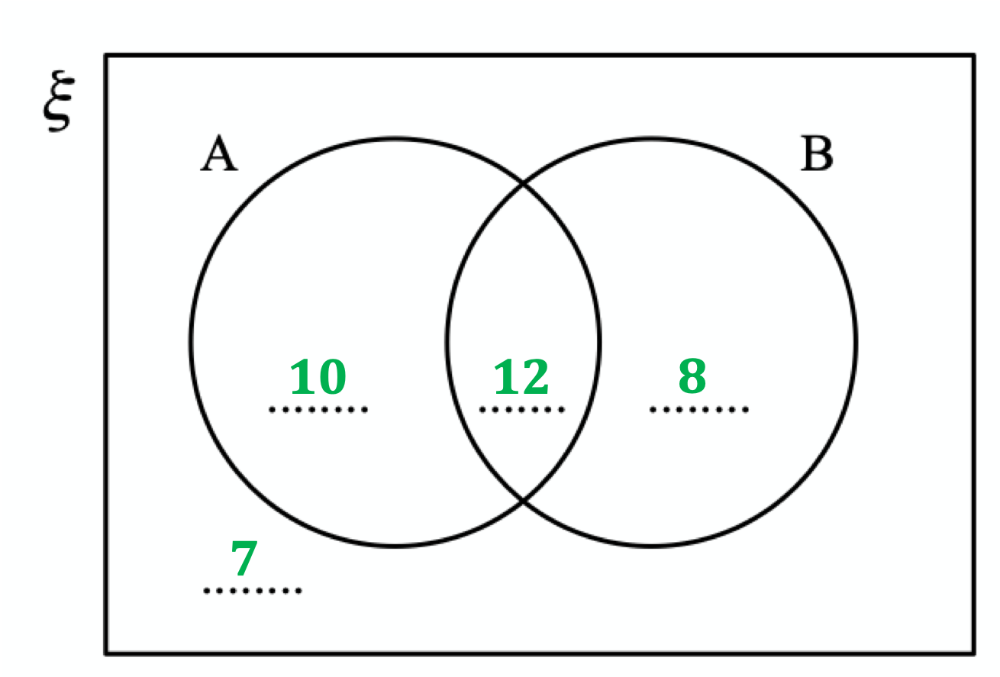

**Finding any correct missing value **** [1] **
**All values correct****  [1]**

### 2() — 2 marks
*(i) **The number of elements that are in **A** AND not in **B**.*

**10**** ****[1]**

** **

*(ii) **The number of elements that are not in **A** OR are not in **B**.*

$10+8+7=25$

**25*** ***[1]**

### 3() — 2 marks
> *From the Venn diagram in part (a), add together the two set *$B$* numbers to find the number of elements in set *$B$*.*

$12+8=20$

**[1] **
**You would also get this mark for writing down  **`straight n open parentheses B close parentheses equals 20`**, or for using '20' in the numerator of a probability fraction.**

> *The number chosen is from set *$B$*, which has 20 elements**. *
*There are 37 elements in the universal set.** *
*So the probability is 20 (the number of elements in set *$B$*) divided by 37 (the number of elements in the universal set).*

$\frac{20}{37}$**  [1]**

## Q41 — hard — 6 marks · exam-questions

### 1() — 4 marks
> *6 students study neither French nor Spanish, so put 6 outside both sets.*

> *Add together the number of students studying French, Spanish and no languages, and compare it to the total number of students in the class.*

$17+15+6=38$

$38-31=7$

**[1]**

> *There must be 7 students who study both French and Spanish, place 7 in the intersection of the two sets.*

> *Find the number of students who study French only by subtracting the number who study both languages from the number who study French.*

$17-7=10$

> *Find the number of students who study Spanish only by subtracting the number who study both languages from the number who study Spanish.*

$15-7=8$

**[1]**

> *Write all values in the appropriate places of a Venn diagram.*

**[1]**

### 2() — 2 marks
> *From the Venn diagram in part (a), we can see there are 10 students who studied French but not Spanish. *
*(This is the part of the **F **circle that is outside the **S **circle.) *
*And there are 31 students in total in the class.** *
*So the probability is 10 divided by 31.*

$\frac{10}{31}$**  [1]**

**1 mark for having '10' in the numerator.  **
**1 mark for a fully correct answer.**

## Q42 — hard — 7 marks · exam-questions

### 11((a)) — 3 marks
> *As everyone passed at least one section of the test, this means 100% of people are within the two circles, so we can put a zero on the outer region*

> *To help solve the question, we will also label the regions as *$x,y,z$

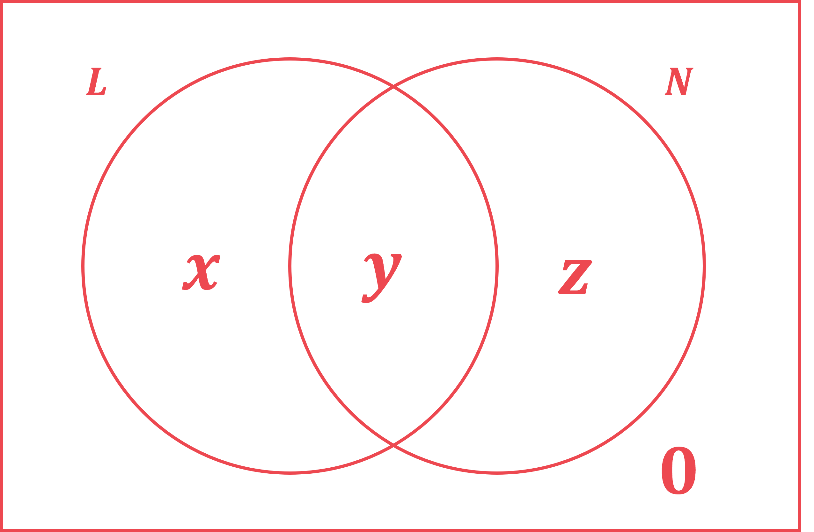

> *88% passed the literacy section, all of these people are within the L circle*

$x+y=88$

> *76% passed the numeracy section, all of these people are within the N circle*

$y+z=76$

> *As everyone passed at least one section, 100% of people are within the three circles*

$x+y+z=100$

> *Substitute the 2**nd** equation into the 3**rd** equation*

$x+76=100$

> *Solve for *$x$

$x=24$

**[1]**

> *Substitute the found value for *$x$* into the first equation *$x+y=88$*, and solve for *$y$

`table row cell 24 plus y end cell equals 88 row y equals 64 end table`

**[1]**

> *Substitute the values for *$x$* and *$y$* into the third equation, *$x+y+z=100$* and solve for *$z$

`table attributes columnalign right center left columnspacing 0px end attributes row cell 24 plus 64 plus z end cell equals 100 row z equals 12 end table`

**[1]**

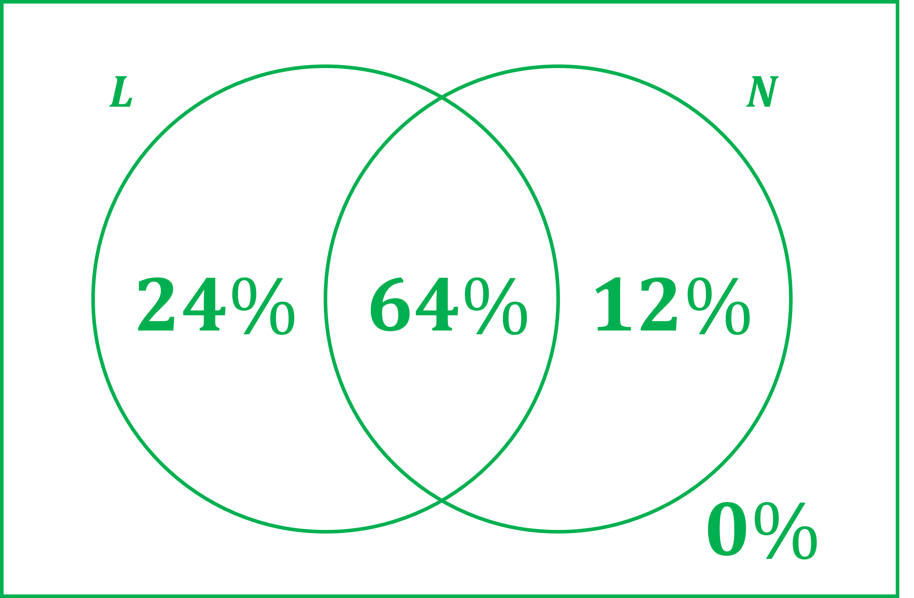

### 11((b)) — 4 marks
*i) "Given that they passed the literacy section" means we are only looking at people in the middle and left-hand sections (64 and 24)* 
*Out of these people, we want those who passed numeracy, so these are the people in the middle section*

$\frac{64}{24+64}=\frac{64}{88}=\frac{8}{11}$

$\frac{8}{11}$**[2]** 
**Mark for each of numerator and denominator **

*ii) "Given that they only passed one section" means we are only looking at the people in the right-hand or left-hand regions (12 and 24)* 
*Out of these people, we want those who passed literacy, so these people are in the left-hand section*

$\frac{24}{24+12}=\frac{24}{36}=\frac{2}{3}$

$\frac{2}{3}$**[2]**
**Mark for each of numerator and denominator **

## Q43 — hard — 7 marks · exam-questions

### 1() — 2 marks
> *6 appears in set **B** and set **C**.*

> *1, 4 and 10 are in the universal set but do not appear in any of the sets **A, B** or **C**.*

**Any 2 or 3 values correct****  [1]** 
**All values correct  ****[1]**

### 2() — 1 marks
> *List the elements that are not in **B**  AND are in **C**.*

**2, 5, 7, 8 ** **[1]**

### 3() — 1 marks
> *List the elements that are not in (**A** OR **C**) AND are in **B**.*

**9, 12  ****[1]**

### 4() — 1 marks
> *Identify which elements are not in **A** AND are not in **B**.*

*2, 5, 8, 1, 4, 10*

**6 ** **[1]**

### 5() — 2 marks
> *Set *$A\capB$* is the intersection (or 'overlap') of sets *$A$* and *$B$*, including the part that is also in set *$C$*. *
*From the Venn diagram in part (a), there are 2 numbers in that set (3 and 13). *
*And there are 13 numbers in total in the Venn diagram.** **So the probability is 2 divided by 13.*

$\frac{2}{13}$**  [2]**

**1 mark for '2' in the numerator, or for indicating that  **`A intersection B equals open curly brackets 3 comma space 13 close curly brackets`** or  **`straight n open parentheses A intersection B close parentheses equals 2`**.  **
**1 mark for a fully correct answer.**

## Q44 — hard — 6 marks · exam-questions

### 9() — 6 marks
> *Draw a Venn diagram use the circle M for "male" and S for "speaks Spanish". *
*You know the middle, outside and the total. *
*You also know the total number of people who do not speak Spanish so you can subtract values to find the missing regions.*

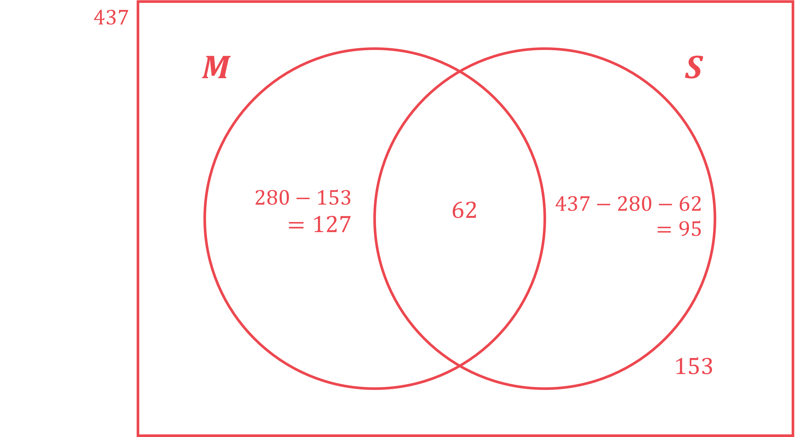

**2 correct values in Venn diagram**** [1] **
**3 correct values in Venn diagram**** [1] **
**All correct values in Venn diagram**** [1]**

> *Find the total number of females.*

*153 + 95 = 248*

> *Find the fraction of females that speak Spanish. Convert to a percentage so that you can compare with *$\frac{2}{5}$* which is 40%.*

`95 over 248 cross times 100 percent sign equals 38.306... percent sign`

**Correct numerator ****[1] **
**Correct fraction ****[1]**

**Jeff is ****not correct ****as roughly ****38% ****of females in the town speak Spanish which is ****less than 40%** **[1]**

## Q45 — hard — 4 marks · exam-questions

### 1() — 3 marks
> *Work through each statement, one at a time.*

> *5 students have all three, place 5 in the intersection of all three sets.*

> *Find the number of students who have both a laptop and a tablet but not a desktop by subtracting the number who have all three from the 7 students who have both a laptop and a tablet.*

$7-5=2$

> *Find the number of students who have both a desktop and a tablet but not a laptop by subtracting the number who have all three from the 11 students who have both a desktop and a tablet.*

$11-5=6$

> *Find the number of students who have both a desktop and a  laptop but not a tablet by subtracting the number who have all three from the 9 students who have both a desktop and a laptop.*

$9-5=4$

> *Find the number of students who have a tablet only by subtracting the number who have a tablet and another item from the 16 students who have a tablet.*

$16-6-5-2=3$

> *Find the number of students who have a laptop only by subtracting the number who have a laptop and another item from the 17 students who have a laptop.*

$17-4-5-2=6$

> *Find the number of students who have a desktop only by subtracting the number who have a desktop and another item from the 19 students who have a desktop.*

$19-4-5-6=4$

> *Find the number of students who have none of the items by subtracting the values within all the remaining sections of the Venn diagram from the total number of students in the group.*

$32-5-6-4-2-6-4-3=2$

> *Label the different parts of the Venn diagram with the appropriate values.*

**Correct values for the intersections  ****[1]*** *
**Correct values for the remaining sections  ****[1]*** *
**Venn diagram fully correct****  [1]**

### 2() — 1 marks
> *All you need to do here is pick the correct numbers from the information given. *
*You are told that 9 students have both a desktop computer and a laptop**. *
*You are also told that 5 students have all three, i.e. that 5 students have a desktop computer and a laptop and ALSO a tablet.** *
*So the probability is 5 divided by 9.*

$\frac{5}{9}$** **** [1]**

**Note that you could answer this question part from the information given in the question, even if you didn't know how to complete the Venn diagram in part (a).**

## Q46 — hard — 3 marks · exam-questions

### 15() — 3 marks
> **[exam-tip]**
> A probability tree diagram will help to structure the question.

> *Represent the outcomes and probabilities on a probability tree diagram using the fact that probability of mutually exclusive outcomes add to 1*

> *Identify the combined outcomes and probabilities that will satisfy the question*

*Sophie passes on first attempt = 0.7*

*Sophie passes on second attempt:*

* *`table row cell straight P open parentheses fail close parentheses cross times straight P open parentheses pass close parentheses end cell equals cell 0.3 cross times 0.9 end cell row blank equals cell 0.27 end cell end table`

**[M1]**

> *Use the addition rule to calculate the combined probability of either event occurring*

$0.7+0.27=0.97$

**[M1]**

**Final answer:** **0.97**

**[A1]**

> **[mark-scheme]**
> Any equivalent form of 0.97 will gain the final mark.

## Q47 — hard — 4 marks · exam-questions

### 14((a)) — 2 marks
> *There are 20 glasses, so 20 should be in the denominator in the first set of probabilities. *
*After the 1st glass is chosen only 19 glasses remain, so 19 should be in the denominator in the second set of probabilities. *
*If the 1st glass is large, 12 large and 7 small glasses will be left for choosing the 2nd glass.  *
*If the 1st glass is small, 13 large and 6 small glasses will be left for choosing the 2nd glass.  *
*The numerators for the second set of probabilities should show these differences.*

** *** *

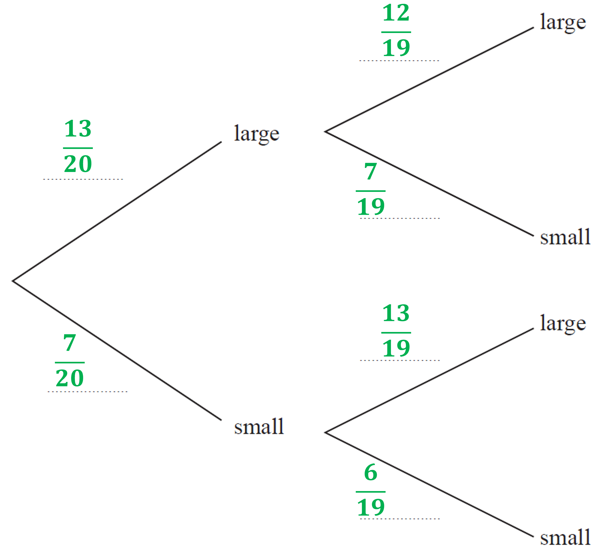

**  [2]**

**1 mark for all the 1st glass probabilities correct.  **
**1 mark for all the 2nd glass probabilities correct.**

### 14((b)) — 2 marks
*To find this probability, multiply the probabilities along the 'small, small' branches.* 
*For the 2nd glass, be sure to use the 'small' probability that corresponds to a small glass also being chosen the first time.*

$\frac{7}{20}\times\frac{6}{19}=\frac{42}{380}$

**[1]**

$\frac{42}{380}$**  [1]**

**You will also get the mark for simplifying to 21/190, thought that isn't necessary. **
**Digital form 0.11(052...) will also get the mark.**

## Q48 — hard — 4 marks · exam-questions

### 20() — 4 marks
> *The only way that the mean could be *$\frac{49}{121}$* is if both coins are 10 cents*

> *Therefore, the probability that one coin chosen is 10 cents is given by*

$\sqrt{\frac{49}{121}}=\frac{7}{11}$

**[M1]**

> *Work out the probability that the coin chosen is 20 cents*

$1-\frac{7}{11}=\frac{4}{11}$

**[M1]**

> *To have a mean of 15 cents, one coin must be 10 cents and the other must be 20 cents*

> *These could be picked in either order*

`straight P open parentheses 10 comma space 20 close parentheses space equals 7 over 11 space cross times 4 over 11 space equals 28 over 121`

`straight P open parentheses 20 comma space 10 close parentheses space equals 4 over 11 space cross times 7 over 11 space equals 28 over 121`

**[M1]**

> *Add the probabilities*

$\frac{28}{121}+\frac{28}{121}=\frac{56}{121}$

$\frac{56}{121}$

**[A1]**

## Q49 — hard — 5 marks · exam-questions

### 19((a)) — 2 marks
*P(pass 1st check) = 0.9* 
*Work out the probability of failing the first check* * *

*P(fail 1st check) = 1 - 0.9 = 0.1* * *

*P(pass 2nd check) = 0.99* 
*Work out the probability of failing the second check* * *

*P(fail 2nd check) = 1 - 0.99 = 0.01* * *

> *Fill in the tree diagram*

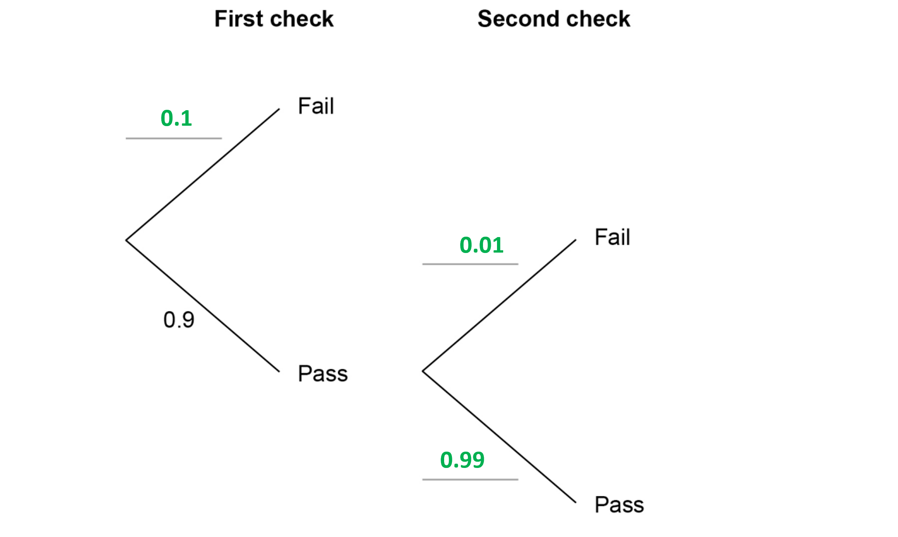

**0.1 correct**** [1]** 
**0.01 and 0.99 correct**** [1]**

### 19((b)) — 3 marks
*Method 1** *
*If it fails the 1st check, the item is scrapped* *Find P(fails 1st check)* * *

*P(fails 1st check) = 0.1* * *

*If the item passes the 1st check then fails the 2nd check, the item is scrapped* *Find P(passes 1st check and fails 2nd check), using "and means ×"* * *

*P(passes 1st check and fails 2nd check) = 0.9 × 0.01*

*Work out 0.9 × 0.01 (for example, by moving the decimal place in 0.9 two places to the left)* * *

*0.9 × 0.01 = 0.009*

**[1]**

*Either the first scenario or ***the*** second scenario happens ("or" means +)* *Find the total probability of being scrapped* * *

*0.1 + 0.009*

**[1]**

**0.109*** ***[1]**

**Fraction, decimal or percentage accepted**

> *Method 2*
* **The probability it is scrapped is 1 - P(item passes) *
*Find P(item passes)  *

*P(item passes) = P(passes the 1st check and passes the 2nd check) = 0.9 × 0.99**  *

> *Work out 0.9 × 0.99 (for example, by finding 9 × 99 then shifting the answer by 3 decimal places)  *

*0.9 × 0.99 = 0.891*

**[1]**

> *Find the probability the item is scrapped, by subtracting P(item passes) from 1  *

*1 - 0.891*

**[1]**

**0.109**** ****[1]**

**Fraction, decimal or percentage accepted**

## Q50 — hard — 4 marks · exam-questions

### 11((a)) — 1 marks
*Find P(3 or more) by subtracting a third from 1* * *

$1-\frac{1}{3}=\frac{2}{3}$ * *

> *Fill in the tree diagram*

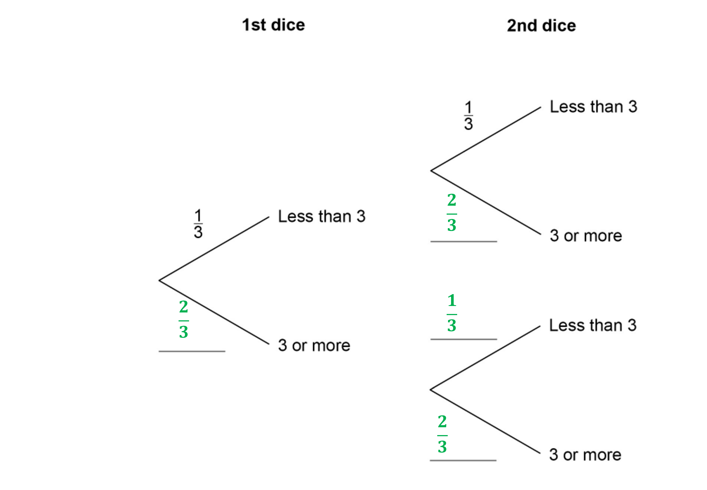

**[1]**

### 11((b)) — 1 marks
*P(both dice land on "less than 3") = P(1st one lands on "less than 3") × P(2nd one lands on "less than 3")*

$\frac{1}{3}\times\frac{1}{3}$

$\frac{1}{9}$ **[1]**

### 11((c)) — 2 marks
*Method 1 *
*To get exactly one "less than 3", either the 1st one is "less than 3" **and** the 2nd one is "3 or more", **or** the 1st one is "3 or more" **and** the 2nd one is "less than 3" *
*("and" means × and "or" means +)*

$\frac{1}{3}\times\frac{2}{3}+\frac{2}{3}\times\frac{1}{3}$

**first or second product of fractions**** [1]**

$\frac{2}{9}+\frac{2}{9}$

$\frac{4}{9}$ **[1]**

*Method 2 *
*Getting exactly one "less than 3" means definitely not getting no less than 3s and definitely not getting both less than 3s Subtract these impossible scenarios from 1*

$1-\frac{2}{3}\times\frac{2}{3}-\frac{1}{3}\times\frac{1}{3}$

** [1]**

$1-\frac{4}{9}-\frac{1}{9}$

$\frac{4}{9}$ **[1]**

## Q51 — hard — 5 marks · exam-questions

### 7((b)) — 5 marks
*(i) **Find the probability that it is not delivered within a week on Monday (by subtracting 0.62 from 1)* * *

*1 - 0.62 = 0.38* * *

*Find the probability that it is not delivered within a week on Friday (by subtracting 0.41 from 1)* * *

*1 - 0.41 = 0.59* * *

> *Fill in the tree diagram*

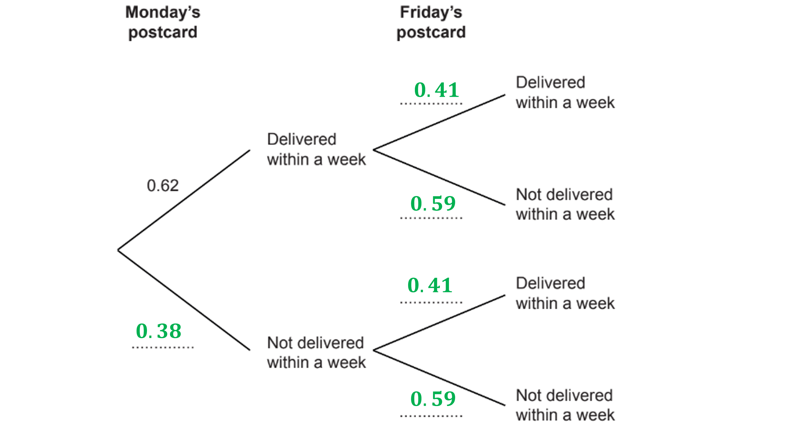

**0.38 and at least one 0.59 correct ****[1]** 
**all correct**** [1]**

*(ii) **If only one is delivered in a week, then either Monday's is within a week and Friday's isn't, or Friday's is within a week and Monday's isn't* *Find the probability that Monday's is within a week and Friday's isn't ("and" means multiply)* * *

*0.62 × 0.59*

**[1]**

*Find the probability that Monday's is not within a week and Friday's is ("and" means multiply)* * *

*0.38 × 0.41* * *

*Find the probability of the first scenario or the second scenario happening ("or" means add)* * *

*0.62 × 0.59 + 0.38 × 0.41*

**[1]**

> *Work out this value*

**0.5216*** ***[1]** 
**0.522 or 0.52 or **$\frac{326}{625}$**accepted**

## Q52 — hard — 4 marks · exam-questions

### 25() — 4 marks
*To find the probability that a Physics student also studies Chemistry, we are only looking at Physics students, so it will be "out of" (divided by) the total number of Physics students, which is *$x+35$ 
*We are interested in students who study both Physics and Chemistry, this is the region in the middle; *$x$

> *We are told that the probability is *$\frac{5}{12}$*, so we can write*

$\frac{x}{x+35}=\frac{5}{12}$

**[1]**

> *Multiply both sides by *$x+35$

`x equals 5 over 12 open parentheses x plus 35 close parentheses`

> *Multiply both sides by 12 to get rid of the fraction, and expand the bracket*

`12 x equals 5 open parentheses x plus 35 close parentheses
12 x equals 5 x plus 175`

> *Subtract *$5x$* from both sides, and divide by 7 to find *$x$

$7x=175\,x=25$

**[1]**

> *We can fill this in on the Venn diagram*

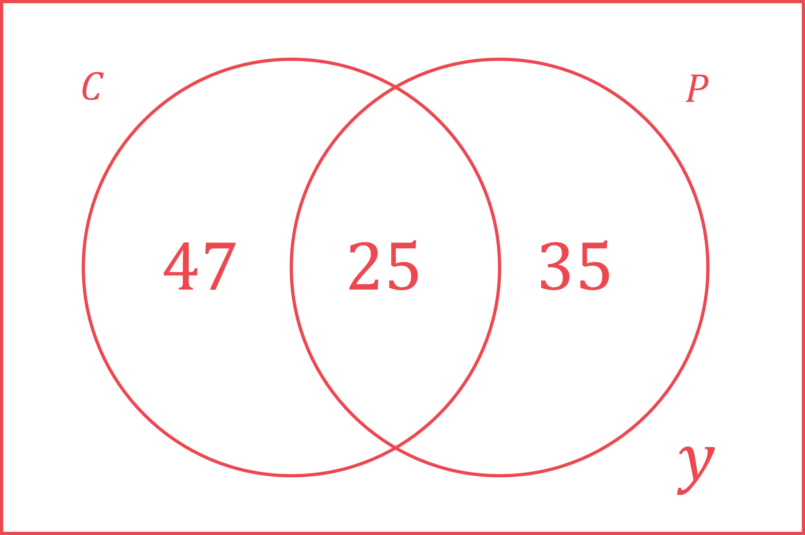

> *The question states there are 150 students in total, so we can use this to find *$y$

$150-47-25-35=y=43$

**[1]**

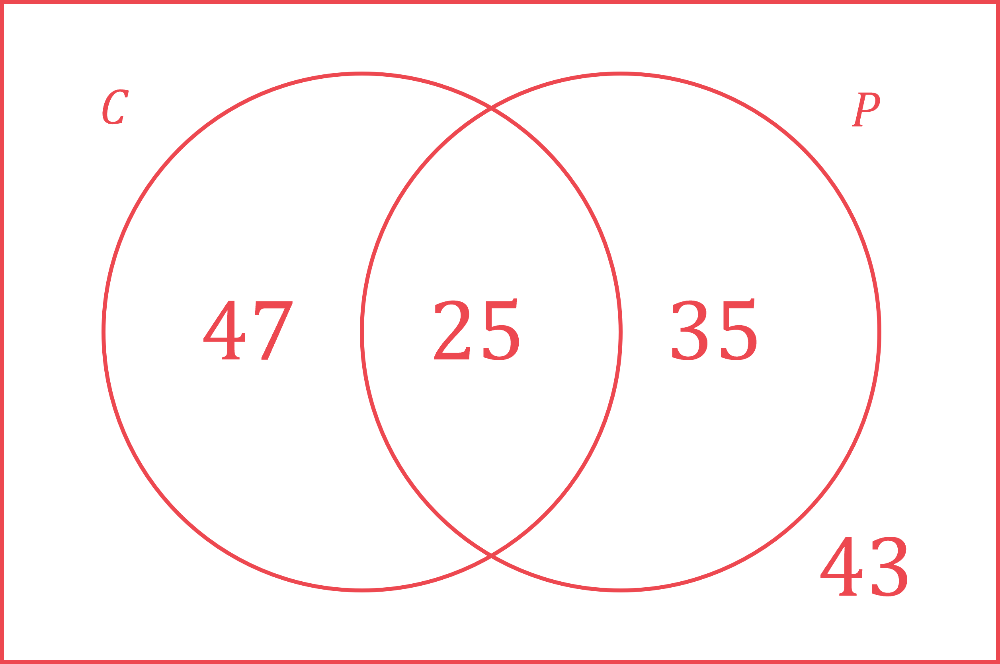

> *The probability of picking a student that does not study Physics or Chemistry is therefore *

$\frac{43}{150}$ **[1]** 
**0.28666... also allowed**

## Q53 — hard — 2 marks · exam-questions

### 22((a)) — 1 marks
> *The highlighted regions are students who own a cat or a dog, but not both:*

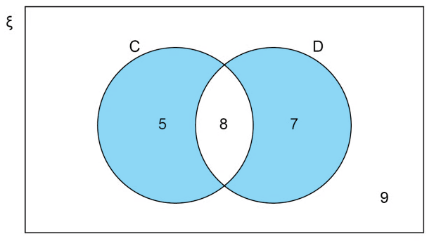

> *Therefore the probability is*

$\frac{5+7}{29}=\frac{12}{29}$

**The first option, **$\frac{12}{29}$** is correct** **[1]**

### 22((b)) — 1 marks
*We are now only looking at students who own a dog, so only those in the below highlighted region, a total of 15 students* 
*Out of these students we are looking for those who own a cat; these students have been circled*

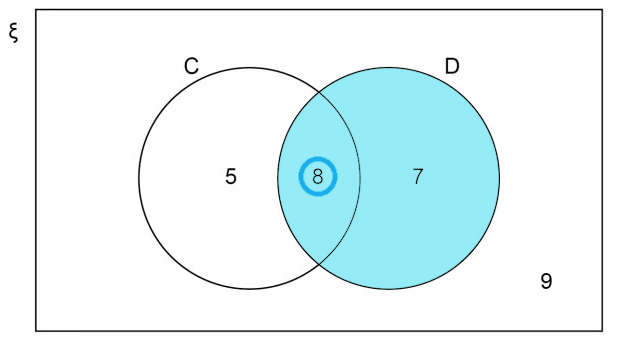

**The second option, **$\frac{8}{15}$**, is correct ****[1]**

## Q54 — hard — 4 marks · exam-questions

### 20() — 1 marks
> *As the house has a garage, we are only considering houses within the G circle, a total of 13 + 8 = 21 houses*

> *The number of houses with a garage, that have a shed, is 8*

> *Therefore the probability is*

$\frac{8}{21}$ **[1]**

### 20((b)) — 1 marks
*The house does not have a garage, so we are only considering the houses outside the G circle* *This is the 11 and the 4; a total of 15 houses*

> *Out of these, the houses that do not have a shed are the 4 houses on the outside of either circle*

$\frac{4}{15}$ **[1]**

### 20((c)) — 2 marks
> *We are aiming to show that one probability is larger than the other probability*

> *The first probability, *`text P end text open parentheses straight G intersection straight S close parentheses apostrophe`*, means "the probability of not having: a garage and a shed"*

> *The probability of having a garage and a shed is 8 (the overlap in the centre) out of the total number of houses which is 13+8+11+4=36*

`straight P open parentheses straight G intersection straight S close parentheses equals 8 over 36`

> *We can find the probability of not having a garage and a shed by subtracting this from 1 (finding the inverse)*

`straight P open parentheses straight G intersection straight S close parentheses apostrophe equals 1 minus 8 over 36 equals 28 over 36`

**[1]**

> *The second probability, *`straight P open parentheses straight G union straight S apostrophe close parentheses`*, means "the probability of having a garage, or not having a shed"*

> *The total number of houses which have a garage, or do not have a shed is *

*13+8+4=25*

> *So this can be written as a probability out of the total number of houses*

`straight P open parentheses straight G union straight S apostrophe close parentheses equals 25 over 36`

**[1]**

> *We can now compare the two probabilities*

$\text{P}(G\capS)'>P(G\cupS')\,\frac{28}{36}>\frac{25}{36}$

## Q55 — hard — 4 marks · exam-questions

### 14((a)) — 3 marks
> *We are told that the Venn diagram represents 31 students in total, so we can write that*

$6+5+2x+x+2=31$

> *Simplify the equation*

$3x+13=31$

> *Subtract 13 from both sides, then divide both sides by 3 to solve the equation*

`table attributes columnalign right center left columnspacing 0px end attributes row cell 3 x end cell equals 18 row x equals 6 end table`

**[1]**

> *We can then use this value later on in the question*

> *The number of students who have a dog are the 5 in the overlap; who have a dog and a cat, plus the *$2x$* who only have a dog*

> *The probability that a student from the class has a dog is therefore*

$\frac{5+2x}{31}$

**[1]**

> *Substitute in the value of *$x=6$* found earlier*

`fraction numerator 5 plus 2 open parentheses 6 close parentheses over denominator 31 end fraction equals fraction numerator 5 plus 12 over denominator 31 end fraction equals 17 over 31`

$\frac{17}{31}$ **[1]**

### 14((b)) — 1 marks
> *We are only considering students who have a cat; a total of 6+5=11 students (just within the C circle)*

> *There are 5 students who own a cat, that own a dog too (the students in the overlap)*

$\frac{5}{11}$ **[1]**

## Q56 — very_hard — 3 marks · exam-questions

### 12() — 3 marks
> *In combined probabilities 'and' usually means 'multiply'. So multiply 0.25 by 0.6 to get the probability of 'Spinner A red AND Spinner B red'.*

`straight P open parentheses red comma space red close parentheses space equals space 0.25 space cross times space 0.6 space equals space 0.15`

**[1]**

> *Let **N** be the number of time Alan spun the spinner. *
*Then *$0.15\timesN$* is the expected number of times both spinners would land on red. *
*Set that equal to 24 and solve to find an estimate for **N**.*

`table row cell 0.15 space cross times space N space end cell equals cell space 24 end cell row cell N space end cell equals cell space 24 space divided by space 0.15 end cell row cell N space end cell equals cell space 160 end cell end table`

**[1]**

> *Multiply 0.75 by 0.4 to find the probability of both spinners landing on white. *
*Then multiply that by 160 to find an estimate for the number of times both spinners landed on white.*

`straight P open parentheses white comma space white close parentheses space equals space 0.75 space cross times space 0.4 space equals space 0.3

0.3 space cross times space 160 space equals space 48`

**48 *** ***[1]**

**You could also do this by finding P(red, red) (1 mark) and P(white, white) (1 mark). **
**Then note that the spinners are twice as likely to both land on white as they are to both land on red! **
**So  **$\frac{0.3}{0.15}\times24=2\times24=48$** (1 mark).**

## Q57 — very_hard — 5 marks · exam-questions

### 12((a)) — 2 marks
> *The probabilities on each branch of the tree must add up to 1. So we can subtract the known probabilities from 1 to find the missing probabilities.*

$1-0.4=0.61-0.7=0.31-0.2=0.8$

** *** *

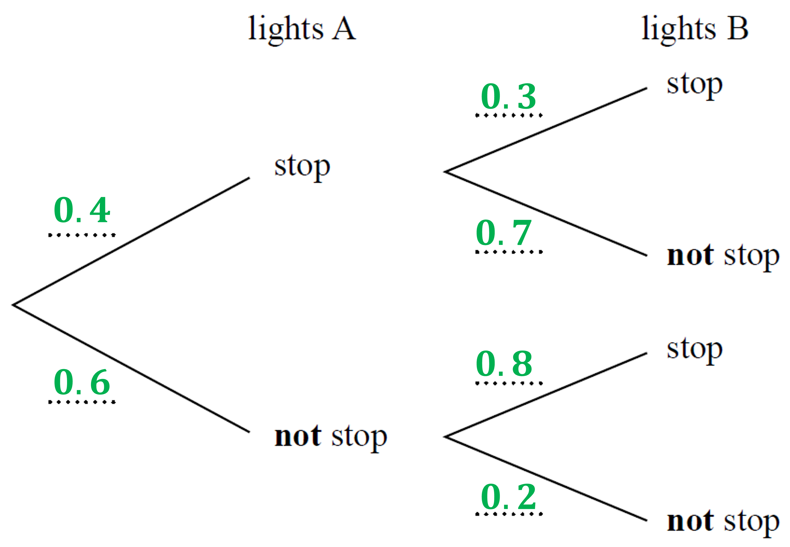

**  [2]**

**1 mark for both 'lights A' numbers in the right places.  **
**1 mark for all four 'lights B' numbers in the right places.**

### 19((b)) — 3 marks
> *With combined probabilities, 'and' usually means 'multiply'. Mark was only stopped by one set of traffic lights. *
*That might have been 'stop at A AND not stop at B', or it might have been 'not stop at A AND stop at B'. *
*Multiply the appropriate probabilities from the tree diagram, to find the probability of each of those things happening.*

`straight P open parentheses stop space straight A comma space not space stop space straight B close parentheses space equals space 0.4 space cross times space 0.7 space equals space 0.28

straight P open parentheses not space stop space straight A comma space stop space straight B close parentheses space equals space 0.6 space cross times space 0.8 space equals space 0.48`

**  [2] **
**1 mark for one correct product.  **
**1 mark for both products correct.**

> *Interpret your results in the context of the question.*

** ****The probability of stopping at B but not at A (0.48) is higher than the probability of stopping at A but not at B (0.28).  Therefore it is more likely that he was stopped by lights B.****  [1]**

## Q58 — very_hard — 8 marks · exam-questions

### 16((a)) — 2 marks
Work out how many of the counters in each bag are even. Then write down the probability for each option. Remember there are 10 counters in bag A and 12 in bag B.

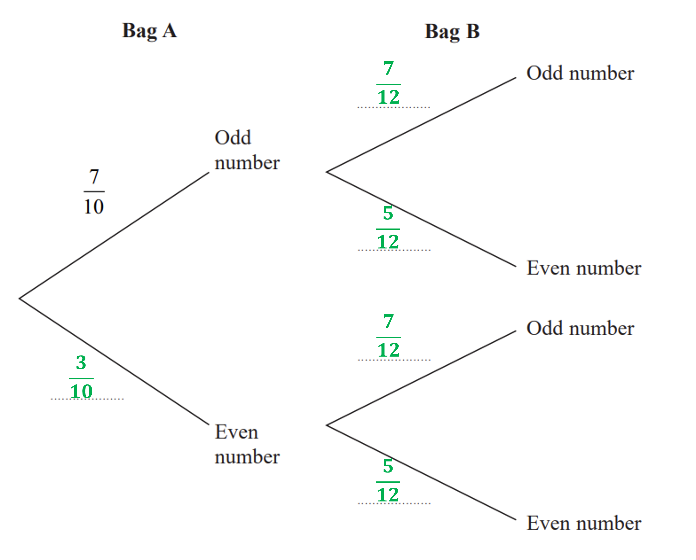

$\frac{3}{10}$ **correct**** [1]** 
**All probabilities correct [1]**

### 16((b)) — 3 marks
> *If the total of two integers is odd then one of the numbers must be even and one must be odd.*

> *Find the probability that the first is even and the second is odd.*

`table row cell straight P open parentheses Bag space straight A space even space and space Bag space straight B space odd close parentheses end cell equals cell 3 over 10 cross times 7 over 12 end cell row blank equals cell 7 over 40 end cell end table`

**Multiplying a correct pair**** [1]**

> *Find the probability that the first is odd and the second is even.*

`table row cell straight P open parentheses Bag space straight A space odd space and space Bag space straight B space even close parentheses end cell equals cell 7 over 10 cross times 5 over 12 end cell row blank equals cell 7 over 24 end cell end table`

**[1]**

> *Add together the probabilities of the two options.*

$\frac{7}{40}+\frac{7}{24}$

$\frac{7}{15}$ **[1]**

### 16((c)) — 3 marks
> *You could add branches for bag C to the diagram for Harriet's bag of counters. The only bit we are interested in is the possibility that all of them are even. Let **p** be the probability that Harriet selects an even number from her bag.*

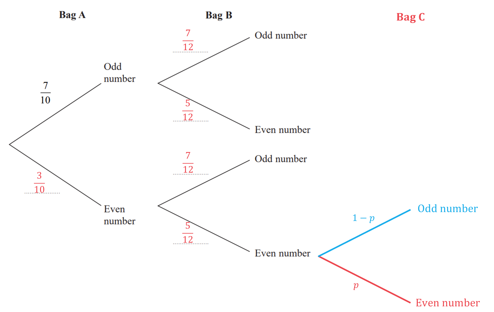

> *To find the probability that all three counters are even you multiply the probabilities together. You know this probability so form an equation.*

$\frac{3}{10}\times\frac{5}{12}\timesp=\frac{3}{100}$

**[1]**

> *Simplify the equation and then solve for **p**. Write the probability as a simplified fraction.*

`table row cell 1 over 8 p end cell equals cell 3 over 100 end cell row p equals cell 3 over 100 cross times 8 end cell row p equals cell 6 over 25 end cell end table`

**[1]**

> *As the fraction is simplified the total number of counters in Harriet's bag must be a multiple of 25.*

**The least number of counters is 25** **[1]**

## Q59 — very_hard — 6 marks · exam-questions

### 14((a)) — 2 marks
> *The probabilities on a pair of branches should add up to 1. Find the probability that Barney walks to college.*

$1-0.3=0.7$

> *If Barney takes the bus, the probability he is late is 0.2 so put this on the branch coming out of the bus option. Find the probability that he is not late if he takes the bus.*

$1-0.2=0.8$

> *If Barney gets walks, the probability he is late is 0.1 so put this on the branch coming out of the walk option. Find the probability that he is not late if he walks.*

$1-0.1=0.9$

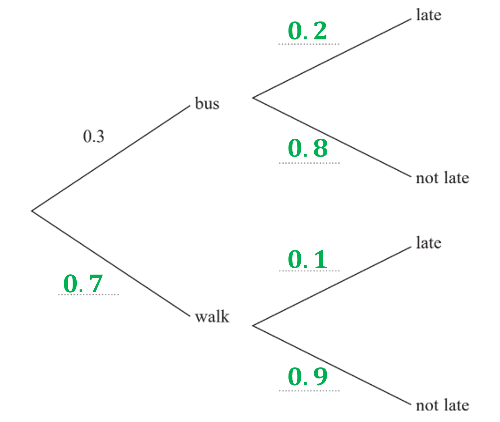

**2 probabilities correct**** [1]**
**All probabilities correct**** [1]**

### 14((b)) — 4 marks
> *First you need to find the probability that Barney is late. To do this find the probabilities of all possibilities of Barney being late. The possibilities are that he takes the bus and is late or that he walks and is late. *
*For each possibility multiply the probabilities along the branches.*

`straight P open parentheses bus space and space late close parentheses equals 0.3 cross times 0.2 equals 0.06
straight P open parentheses walk space and space late close parentheses equals 0.7 cross times 0.1 equals 0.07`

**Finding one of these probabilities****  [1]**

> *Find the probability that Barney is late by adding these probabilities together.*

`straight P open parentheses late close parentheses equals 0.06 plus 0.07 equals 0.13`

**[1]**

> *To find the expected number of times Barney is late you need to multiply the probability by 200.*

$0.13\times200=26$

**[1]**

**The expected number of times Barney will be late is 26** **[1]**

## Q60 — very_hard — 5 marks · exam-questions

### 16() — 2 marks
> *Subtract the number of students who passed all three tests from the numbers of students who passed two.*

$18-x$* **passed the tests in Maths and English only* 
$11-x$* passed the tests in Maths and French only*

> *25 students passed the test in Maths. Use this to form an equation by adding together the number of students who passed one, two or three tests.*

`x plus open parentheses 18 minus x close parentheses plus open parentheses 11 minus x close parentheses plus 3 equals 25`

**[1]**

> *Simplify and solve for **x**.*

`table row cell 32 minus x end cell equals 25 row x equals cell 32 minus 25 end cell end table`

$x=7$ **[1]**

### 16((b)) — 2 marks
> *Fill in the centre and the section outside with circles with the numbers 7 and 4 respectively.*

> *Substitute **x** = 7 into the expressions from the previous part.*

$18-7=11$* **passed the tests in Maths and English only* 
$11-7=4$* passed the tests in Maths and French only*

> *Find the number of students who passed English only and French only by subtracting the numbers in those circle from 20 and 14 respectively.*

$20-2-11-7=0$* **passed the test in English only** *$14-2-4-7=1$* passed the test in French only*

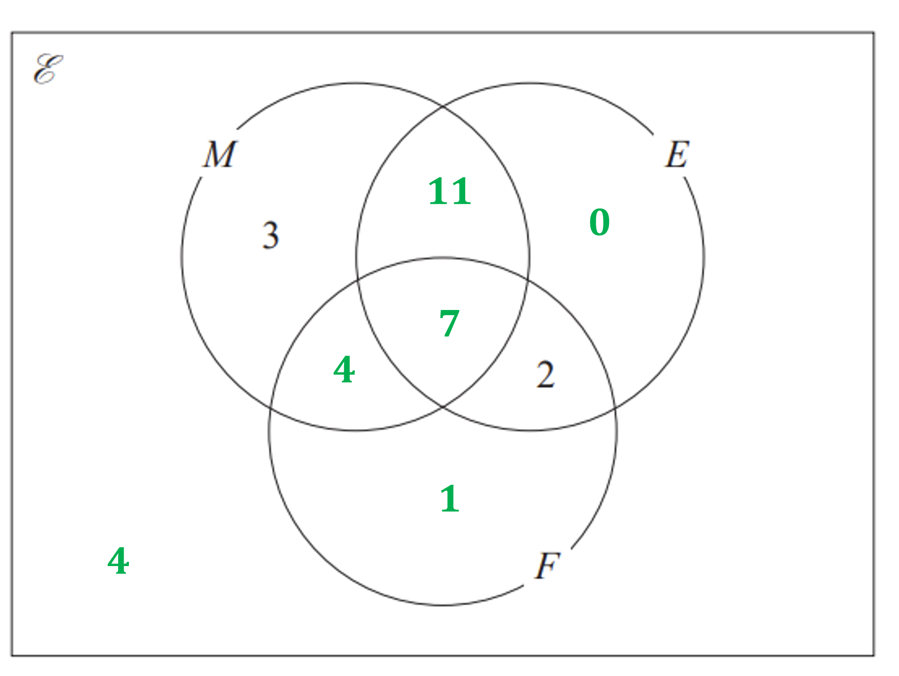

**4 values correct**** [1] **
**All values correct**** [1]**

### 16((c)) — 1 marks
> *Only look at the numbers in the Maths circle. The total is 25 so this will be the denominator of the fraction.*

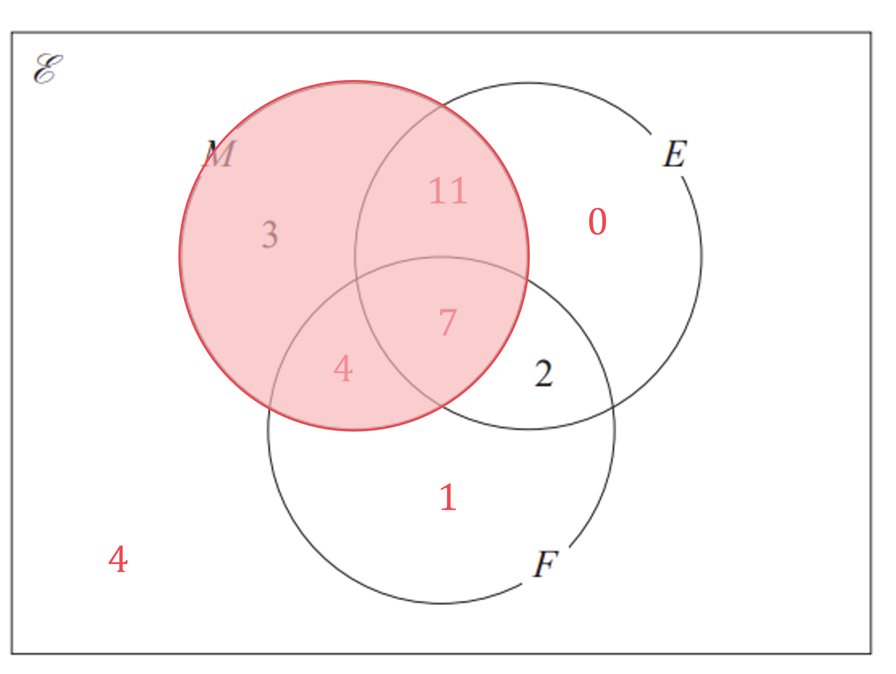

> *The students that failed French are the ones not in the French circle. So add together the number of students who passed Maths and English only or Maths and French only. This will be the numerator of the fraction.*

$\frac{3+11}{25}$

$\frac{14}{25}$ **[1]**

## Q61 — very_hard — 5 marks · exam-questions

### 13((a)) — 2 marks
> *After taking the first card, there will only be 9 cards left. Therefore the denominators should all be 9 in the 'Second card' part of the diagram.*

> *Also remember to reduce the correct numerators by 1 in the 'Second card' part of the diagram. *
*For example, if the first card is red then there will be 4 red cards, 4 blue cards, and 1 green card left. *
*So the top three probabilities in 'Second card' (after 'First card red') will be 4/9, 4/9, and 1/9.*

> *Be careful with green. If the first card is green, then there are no green cards left and the probability of getting a green card the second time is 0.*

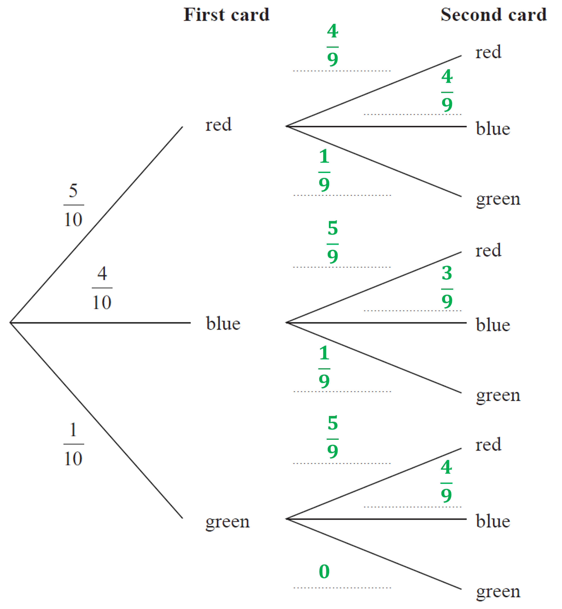

**  [2]**

**1 mark for any three probabilities correct, or 2 marks for all nine correct. 0/9 is also correct for the 'green, green' probability.**

**You would also get the mark if you simplified 3/9 to 1/3 for 'blue, blue'. **
**In tree diagram questions, however, it is often helpful to keep the denominator the same for all probabilities in a set of branches.**

### 13((b)) — 3 marks
> *'At least one blue card and no green card' includes the possibilities 'red, blue', 'blue, red', and 'blue, blue'. *
*In the tree diagram these probabilities can be found by multiplying along the following branches (AND rule):*

> *       First card red × Second card blue*
*       First card blue × Second card red *
*       First card blue × Second card blue*

> *Then add those products together to find the total probability (OR rule).*

`open parentheses 5 over 10 cross times 4 over 9 close parentheses space plus space open parentheses 4 over 10 cross times 5 over 9 close parentheses space plus space open parentheses 4 over 10 cross times 3 over 9 close parentheses space equals space 20 over 90 space plus space 20 over 90 space plus space 12 over 90 space equals space 52 over 90`

**[2] **
**1 mark for any one correct product.  1 mark for all three correct products added together.**

$\frac{52}{90}$**  [1]**

**You will also get the mark for simplifying to 26/45, though that is not necessary. **
**You will also get the mark for 0.577... or 57.7...%.**

## Q62 — very_hard — 5 marks · exam-questions

### 15() — 2 marks
> *Because the games are independent, all the probabilities for 'Second game' will be the same as the corresponding probabilities in 'First game'. Also, because probabilities must add up to 1, the probability for 'Magnus loses' must be  *`1 space minus space open parentheses 2 over 9 plus 4 over 9 close parentheses space space equals space 3 over 9`*.*

*   ***[2]**

**1 mark for the 'Magnus loses' probability correct in 'First game'. 1 mark for all probabilities correct in 'Second game'.**

**You would also get the mark if you simplified 3/9 to 1/3 for 'Magnus loses'. In tree diagram questions, however, it is often helpful to keep the denominator the same for all probabilities in a set of branches.**

### 15((b)) — 3 marks
> *The only way for them to end up with the same number of points is if they both win one game and lose the other, or if they draw both games. In the tree diagram these probabilities can be found by multiplying along the following branches (AND rule):*

> *       Magnus wins (First game) × Magnus loses (Second game)        Magnus loses (First game) × Magnus wins (Second game)        Game drawn (First game) × Game drawn (Second game)*

> *Then add those products together to find the total probability (OR rule).*

`open parentheses 2 over 9 cross times 3 over 9 close parentheses space cross times space open parentheses 3 over 9 cross times 2 over 9 close parentheses space cross times space open parentheses 4 over 9 cross times 4 over 9 close parentheses space equals space 6 over 81 space plus space 6 over 81 space plus space 16 over 81 space equals space 28 over 81`

**[2] **
**1 mark for a correct product.  **
**2 marks for all three correct products added together.**

$\frac{28}{81}$**  [1]**

**You will also get the mark for 0.345... or 34.5...%.**

## Q63 — very_hard — 8 marks · exam-questions

### 13((a)) — 2 marks
> *As always, the probabilities for each branch must add up to 1.*

> *So in 'First race', the 'Emilie does not win' probability must be 1 - 0.7 = 0.3. *
*And in 'Second race', the 'Emilie does not win' probability must be 1 - 0.4 = 0.6.*

> *Because the outcomes are independent, the probabilities in both sets of branches of 'Second race' will be the same.*

** *** *

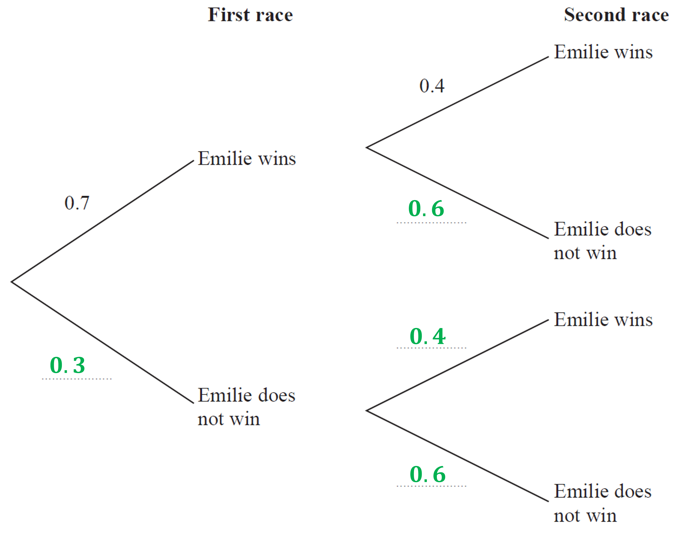

**  [2]**

**1 mark for 'First race' probabilities correct.  **
**1 mark for all 'Second race' probabilities correct.**

### 13((b)) — 3 marks
> *With combined probabilities, 'and' usually means 'multiply' and 'or' usually means 'add'.*
* 'Emily wins exactly one race' means:*
*      Emilie wins the first race (0.7) AND Emilie does not win the second race (0.6)*
* OR*
*      Emilie does not win the first race (0.3) AND Emilie wins the second race (0.4)*
* Multiply those together and then add the products to find the total probability.*

`open parentheses 0.7 cross times 0.6 close parentheses space plus space open parentheses 0.3 cross times 0.4 close parentheses space equals space 0.42 space plus space 0.12 space equals space 0.54`

**  [2] **
**1 mark for one correct product.  **
**1 mark for two correct products added together.**

**Final answer:** **0.54****  [1]**

### 13((c)) — 3 marks
> *With combined probabilities, 'and' usually means 'multiply' and 'or' usually means 'add'.*

> *'Wins exactly two of the three races' means:*
*      wins the first two races AND loses the third race *
*OR*
*      wins exactly one of the first two races AND wins the third.*

> *From the tree diagram, the probability of winning the first two races is 0.7 × 0.4. *
*If that happens, then the probability of NOT winning the third race is 1 - 0.6 = 0.4. *
*So multiply all those probabilities together to find the probability of 'win the first two and lose the third' (AND rule).*

$0.7\times0.4\times0.4=0.112$

**[1]**

> *From part (b) we know that the probability of winning exactly one of the first two races is 0.54. *
*If that happens, then the probability of winning the third race is 0.3. *
*So multiply those probabilities together to find the probability of winning exactly one of the first two and then also winning the third (AND rule again).*

$0.54\times0.3=0.162$

> *Then add those products to find the total probability (OR rule).*

$0.112+0.162=0.274$

**  [1] **
**The mark here  is for two correct products added together.**

**Final answer:** **0.274****  [1]**

## Q64 — very_hard — 7 marks · exam-questions

### 13((a)) — 2 marks
> *There are 14 children in group C, so 14 should be in the denominator in the first set of probabilities. *
*The numerators for 'girl' and 'boy' will be 6 and 8, respectively. The resulting probabilities (6/14 and 8/14) can then be simplified to 3/7 and 4/7.*

> *There are 10 children in group D, so 10 should be in the denominator in the second set of probabilities. *
*The numerators for 'girl' and 'boy' will be 3 and 7, respectively.*

** *** *

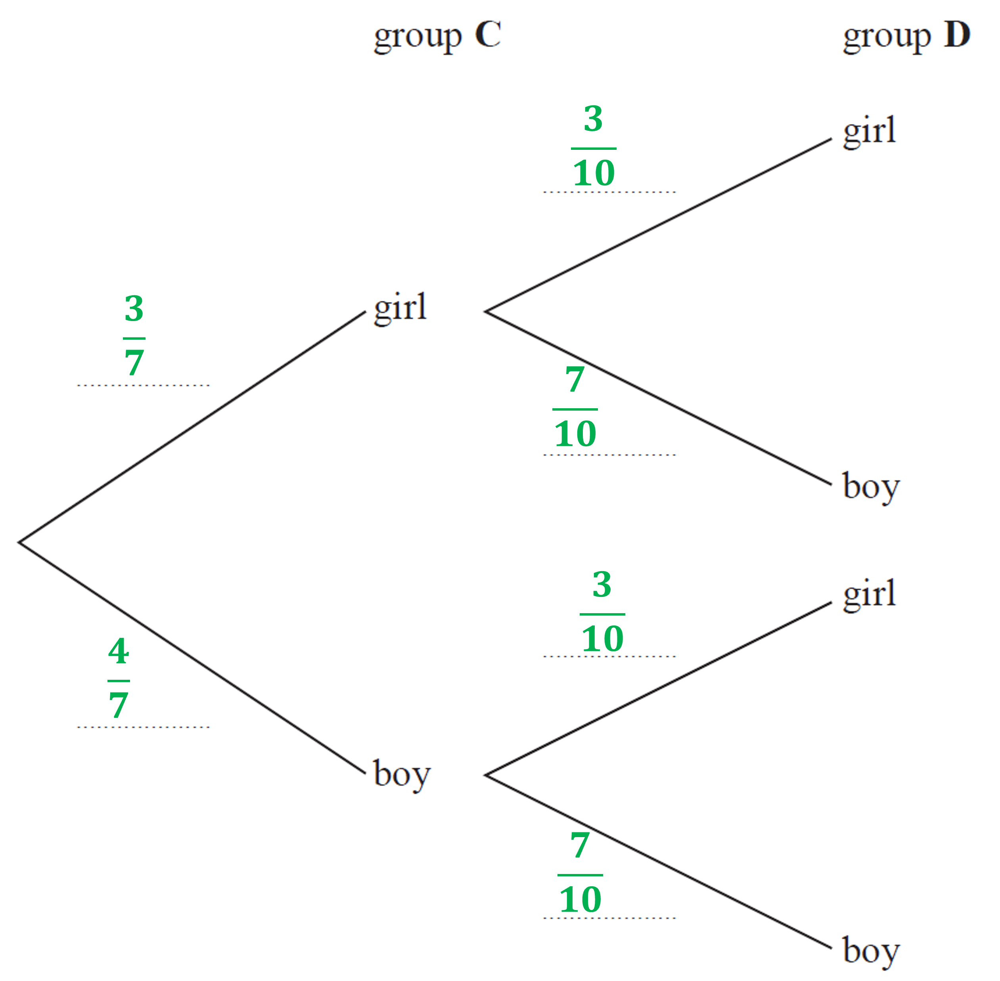

**  [2]**

**1 mark for all the group C probabilities correct.  **
**1 mark for all the group D probabilities correct. **
**Unsimplified probabilities 6/14 and 8/14 will also get the mark for group C.**

### 13((b)) — 2 marks
> *To find this probability, multiply the probabilities along the 'boy, boy' branches.*

$\frac{4}{7}\times\frac{7}{10}=\frac{2}{5}$

**  [1]**

**Final answer:** $\frac{2}{5}$**  [1]**

**Unsimplified probabilities like 56/140, 28/70, 14/35, or 4/10 will also get the mark. **
**Decimal form 0.4 will also get the mark.**

### 13((c)) — 3 marks
> *With combined probabilities, 'and' usually means 'multiply'.*

> *'There are two boys in each of the two teams' means:      the first team has two boys AND the second team has two boys.*

> *From part (b) we already know that the probability of two boys in the first team is 2/5.*

> *If there there are two boys in the first team then there are:*
*      7 boys out of 13 total children left in group C*
*      6 boys out of 9 total children left in group D. *
*So the probability of picking a boy in group C is 7/13, and the probability of picking a boy in group D is 6/9. *
*Multiply those probabilities together to find the probability of 'boy from group C' AND 'boy from group D'.*

$\frac{7}{13}\times\frac{6}{9}=\frac{42}{117}$

**[1]**

> *So if two boys are picked for the first team, then the probability of also picking two boys for the second team is 42/117. *
*Multiply that by the probability of two boys in the first team (2/5) to find the probability of 'two boys in the first team' AND 'two boys in the second team'.*

$\frac{2}{5}\times\frac{42}{117}=\frac{28}{195}$

**[1]**

$\frac{28}{195}$**  ****[1]**

**Unsimplified equivalent fractions (like 84/585, etc.) will also get the mark. **
**Digital form 0.14(3589...) will also get the mark.**

## Q65 — very_hard — 6 marks · exam-questions

### 6((a)) — 2 marks
> *The probability of rolling a 1 is *$\frac{1}{6}$

> *The probability of rolling a 2 or a 3 is *$\frac{1}{6}+\frac{1}{6}=\frac{2}{6}=\frac{1}{3}$

*The probability of rolling an even number (2, 4, or 6) is *$\frac{3}{6}=\frac{1}{2}$ 
*The probability of rolling an odd number (1, 3, or 5) is *$\frac{3}{6}=\frac{1}{2}$

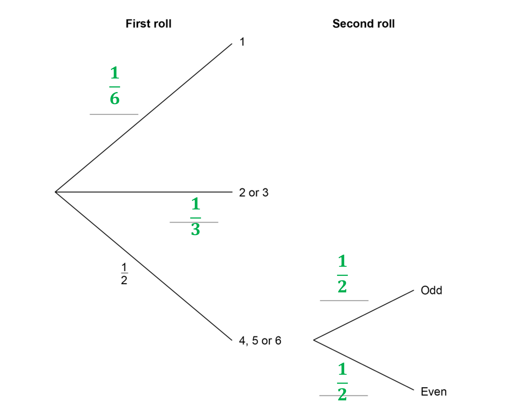

$\frac{1}{6}$** ****and **$\frac{1}{3}$** (or **$\frac{2}{6}$**)**** ****[1]**
** **$\frac{1}{2}$** and **$\frac{1}{2}$** [1]**

### 6((b)) — 4 marks
> *Read the rules of the game carefully*

> *There are two ways to win;*

> *The first way to win is by rolling a 1; this has a probability of *$\frac{1}{6}$

*The second way to win is by rolling a 4,5,6 (a probability of *$\frac{1}{2}$*) and then rolling an odd number, with a probability of *$\frac{1}{2}$ *Finding the probability of winning using the second way*

$\frac{1}{2}\times\frac{1}{2}=\frac{1}{4}$

**Identifying **$\frac{1}{6}$** and**** **$\frac{1}{4}$**[1]**

> *This means the total probability of winning is*

$\frac{1}{6}+\frac{1}{4}=\frac{2}{12}+\frac{3}{12}=\frac{5}{12}$

**[1]**

> *The only other outcome is losing (there is no case where players do not win or lose) so we can calculate the probability of losing as*

$1-\frac{5}{12}=\frac{7}{12}$

**[1]**

**Therefore Anna is more likely to lose as **$\frac{7}{12}>\frac{5}{12}$** [1]**

## Q66 — very_hard — 4 marks · exam-questions

### 20((a)) — 2 marks
*If Greg qualifies on any jump, then the process ends so the tree diagram stops at these points* 
*Complete the tree diagram (by continuing branches along the "does not qualify" route)*

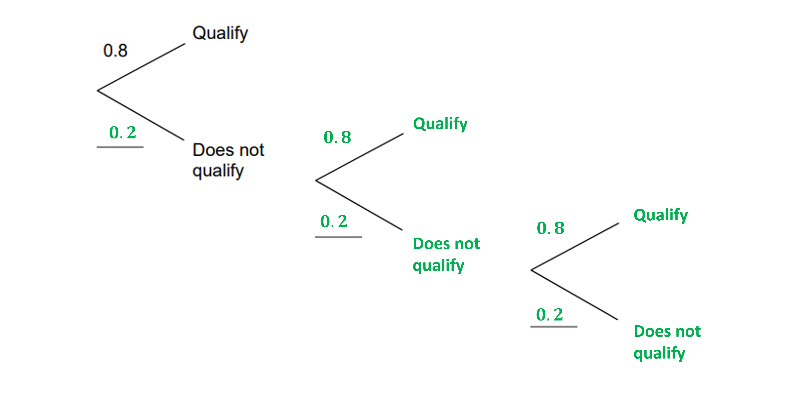

**0.2 on "does not qualify" branch**** [1]** 
**all correct with correct labels**** [1]**

### 20((b)) — 2 marks
*If he does not need the 3rd jump to qualify, he either qualifies on the 1st jump or the 2nd jump* 
*Find the probability he qualifies on the 1st jump* * *

*P(qualifies on 1st jump) = 0.8* * *

*Find the probability he qualifies on the 2nd jump* 
*This is the same as the probability he does not qualify on the 1st jump and the probability he qualifies on the 2nd jump (where "and" means multiply)* * *

*P(qualifies on 2nd jump) = 0.2 × 0.8* * *

*Work out this value, for example by noting 2 × 8 = 16 then moving the decimal place 2-to-the-left* * *

*0.16*

**[1]**

*Either the first scenario happens or the second scenario happens ("or" means add)* 
*Add the two probabilities* * *

*0.8 + 0.16* * *

**0.96*** ***[1]**

## Q67 — very_hard — 5 marks · exam-questions

### 11((a)) — 2 marks
*Remember that the card is not replaced, so the 9 cards become 8 cards when one is taken* 
*Complete the tree diagram*

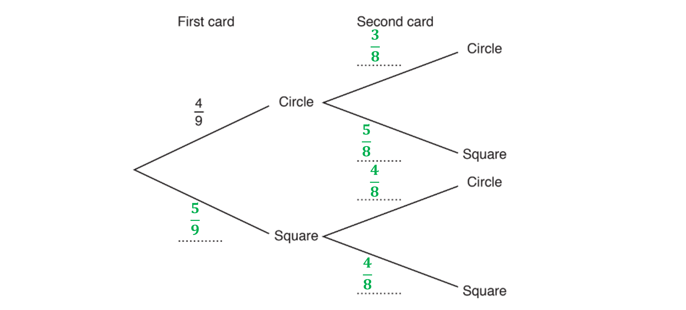

$\frac{5}{9}$** seen and at least one other correct fraction ****[1]**
 **all correct ****[1]**

### 11((b)) — 3 marks
*He wins if the cards are different, so either the 1st card is a circle and the 2nd card is a square, or the 1st card is a square and the 2nd card is a circle* 
*Find the probability that the 1st card is a circle and the 2nd card is a square ("and" means multiply)* * *

$\frac{4}{9}\times\frac{5}{8}$

**[1]**

*Find the probability that the 1st card is a square and the 2nd card is a circle ("and" means multiply)* * *

$\frac{5}{9}\times\frac{4}{8}$ * *

*Find the probability that either the first scenario happens or the second scenario ("or" means add")* * *

$\frac{4}{9}\times\frac{5}{8}+\frac{5}{9}\times\frac{4}{8}$

**[1]**

> *Calculate this value*

$\frac{5}{9}$* ***[1]**
