# Exam Questions — Probability Diagrams: Venn & Tree Diagrams
**Statistics & Probability** · Edexcel IGCSE Maths A (Modular) (4XMAF/4XMAH) — 24/Higher Unit 1
> Source: [https://www.savemyexams.com/igcse/maths/edexcel/a-modular/24/higher-unit-1/topic-questions/statistics-and-probability/probability-diagrams/exam-questions/](https://www.savemyexams.com/igcse/maths/edexcel/a-modular/24/higher-unit-1/topic-questions/statistics-and-probability/probability-diagrams/exam-questions/) · 67 questions · total 304 marks

## Q1 — easy — 5 marks · exam-questions

### 1((a)) — 3 marks — command: complete — structured — from paper June 2019 · 1MA1/3H
`calligraphic E space equals space open curly brackets 1 comma space 2 comma space 3 comma space 4 comma space 5 comma space 6 comma space 7 comma space 8 comma space 9 close curly brackets
A space equals space open curly brackets 1 comma space 5 comma space 6 comma space 8 comma space 9 close curly brackets
B space equals space open curly brackets 2 comma space 6 comma space 9 close curly brackets`

Complete the Venn diagram to represent this information.

### 1((b)) — 2 marks — command: find — structured — from paper June 2019 · 1MA1/3H
A number is chosen at random from the universal set $E$.

Find the probability that the number is in the set $A\capB$.

## Q2 — easy — 5 marks · exam-questions

### 1() — 3 marks — command: complete — structured
In a survey of 50 people,

30 owned a cat     
    25 owned a dog     
     6 owned neither a cat or a dog

Complete the Venn diagram to show this information.

### 2() — 2 marks — command: find — structured
One person is chosen at random.

Find the probability that the person owns a cat and a dog.

## Q3 — easy — 4 marks · exam-questions

### 13((a)) — 2 marks — command: complete — structured — from paper Jan 2022 · 4MA1/1HR
Hector has a bag that contains 12 counters. 
There are 7 green counters and 5 red counters in the bag.

Hector takes at random a counter from the bag. 
He looks at the counter and puts the counter back into the bag.

Hector then takes at random a second counter from the bag. 
He looks at the counter and puts the counter back into the bag.

Complete the probability tree diagram.

### 13((b)) — 2 marks — command: work_out — structured — from paper Jan 2022 · 4MA1/1HR
Work out the probability that both counters are red.

## Q4 — easy — 5 marks · exam-questions

### 14((a)) — 2 marks — command: work_out — structured — from paper Jan 2021 · 4MA1/1H
Ding is going to play one game of snooker against each of two of his friends, Marco and Judd. The probability tree diagram gives information about the probabilities that Ding will win or lose each of these two games.

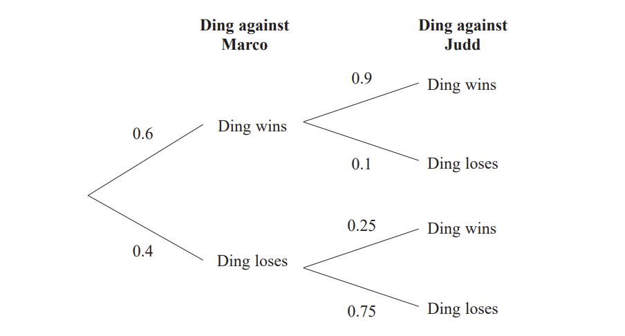

Work out the probability that Ding will win both games.

### 14((b)) — 3 marks — command: work_out — structured — from paper Jan 2021 · 4MA1/1H
Work out the probability that Ding will win exactly one of the games.

## Q5 — easy — 4 marks · exam-questions

### 7() — 4 marks — command: complete — structured — from paper Nov 2020 · 8300/1H
Here is some information about 80 people who play in bands.

12 are singers but not guitar players. 
30% are neither a singer nor a guitar player. 
$\frac{1}{4}$ of the guitar players are also singers.

Complete this Venn diagram to represent the information.

ξ = 80 people who play in bands 
S = singers 
G = guitar players

## Q6 — easy — 1 marks · exam-questions

### 1() — 1 mark — command: what — structured — from paper Nov 2020 · 8300/3H
What does A U B represent in P(A U B) ?

Circle your answer.

| A or B or both | A but not B |
|---|---|
| not A and not B | A and B |

## Q7 — easy — 1 marks · exam-questions

### 4() — 1 mark — command: which — structured — from paper June 2019 · 8300/1H
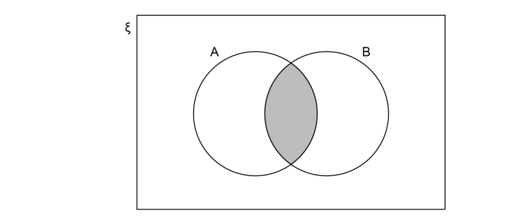

Which of these represents the shaded region? Circle your answer.

| A U B | (A ∩ B)' | A ∩ B | A' U B' |
|---|---|---|---|

## Q8 — easy — 5 marks · exam-questions

### 9((a)) — 3 marks — command: draw — structured — from paper Nov 2018 · J560/04
72 children are asked whether they have a laptop or an iPad.

- 31 have a laptop.
- 48 have an iPad.
- 12 have both.
- 5 have neither.

Represent this information on a Venn diagram.

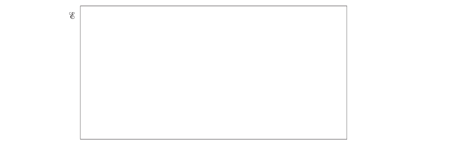

### 9((b)) — 2 marks — command: write — structured — from paper Nov 2018 · J560/04
One of the children is chosen at random.

Write down the probability that they have an iPad but not a laptop.

## Q9 — easy — 2 marks · exam-questions

### 21((b)) — 2 marks — command: find — structured — from paper 2019	May/June · 0580/22
The Venn diagram below shows information about the number of gardeners who grow melons ($M$ ), potatoes ($P$ ) and carrots ($C$ ).

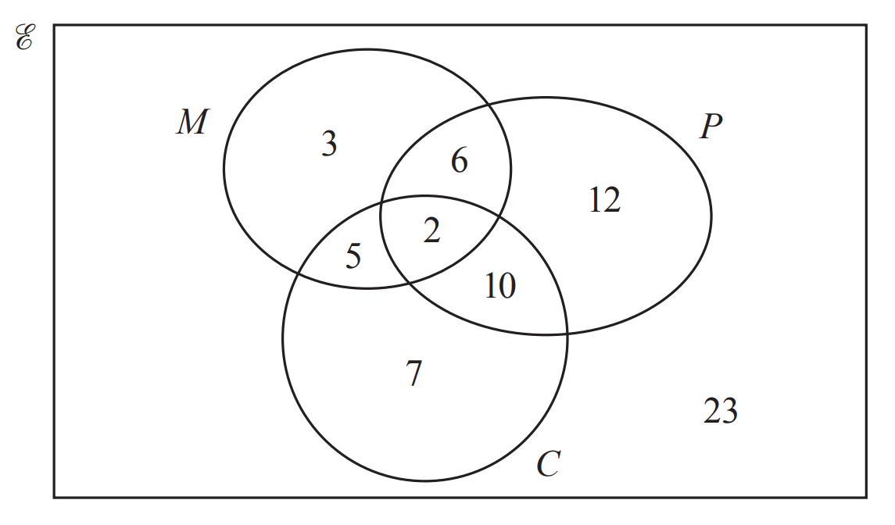

A gardener is chosen at random from the gardeners who grow melons.

Find the probability that this gardener does not grow carrots.

## Q10 — easy — 3 marks · exam-questions

### 22() — 3 marks — command: find — structured — from paper 2020 Specimen · 0580/02
A soccer team plays two matches. 
The tree diagram shows the probability of the team winning or losing the matches.

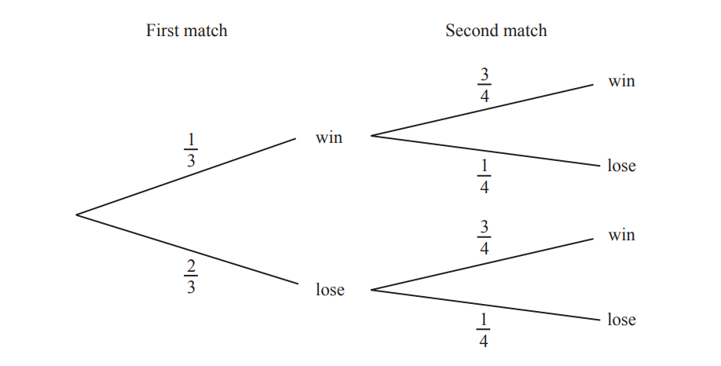

Find the probability that the soccer team wins at least one of the two matches.

## Q11 — medium — 6 marks · exam-questions

### 1((a)) — 4 marks — command: complete — structured — from paper 2017	June · 1MA1/3H
$E=${odd numbers less than 30}
 $A=${3, 9, 15, 21, 27} 
$B=${5, 15, 25}

Complete the Venn diagram to represent this information.

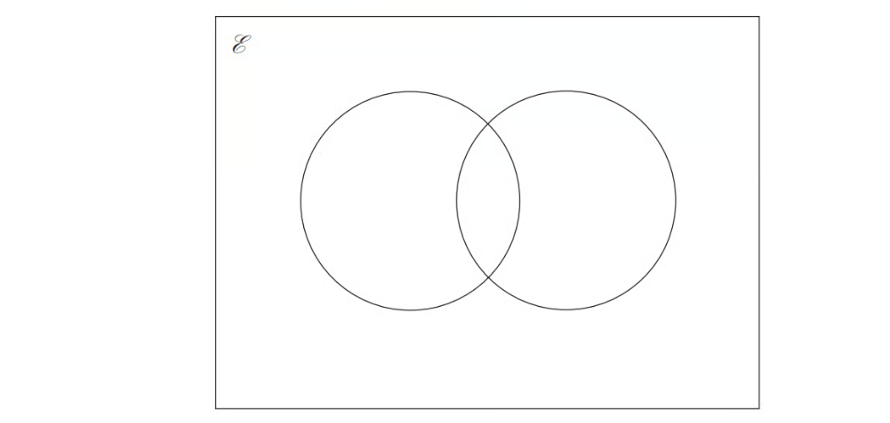

### 1((b)) — 2 marks — command: what — structured — from paper 2017	June · 1MA1/3H
A number is chosen at random from the universal set, $E$.

What is the probability that the number is in the set $A\cupB$?

## Q12 — medium — 4 marks · exam-questions

### 5((a)) — 2 marks — command: write — structured — from paper 2015	Spec2 · 1MA1/2H
Here is a Venn diagram.

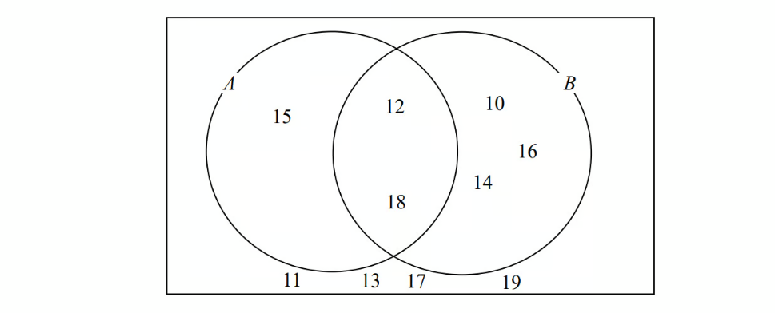

Write down the numbers that are in set

i) $A\cupB$

[1]

ii) $A\capB$

[1]

### 5((b)) — 2 marks — command: find — structured — from paper 2015	Spec2 · 1MA1/2H
One of the numbers in the diagram is chosen at random.

Find the probability that the number is in set $A'$.

## Q13 — medium — 2 marks · exam-questions

### 12((a)) — 1 mark — command: write — structured — from paper 2017	June · 1MA1/2H
There are 30 students in Mr Lear's class.
 16 of the students are boys.

Two students from the class are chosen at random.

Mr Lear draws this probability tree diagram for this information.

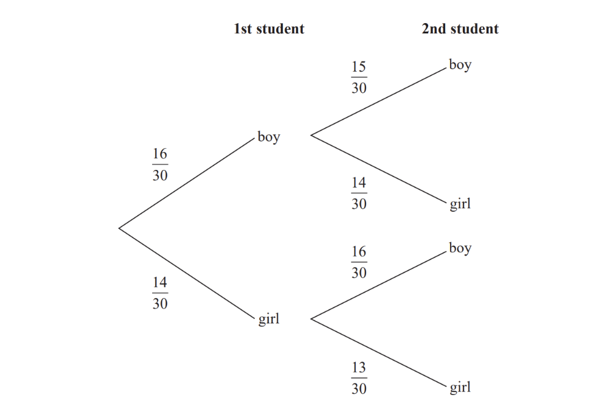

Write down **one** thing that is wrong with the probabilities in the probability tree diagram.

### 12((b)) — 1 mark — command: give — structured — from paper 2017	June · 1MA1/2H
Owen and Wasim play for the school football team.

The probability that Owen will score a goal in the next match is $0.4$ 
The probability that Wasim will score a goal in the next match is $0.25$

Mr Slater says,

"The probability that both boys will score a goal in the next match is $0.4+0.25$"

Is Mr Slater right? 
Give a reason for your answer.

## Q14 — medium — 4 marks · exam-questions

### 19((a)) — 2 marks — command: complete — structured — from paper 2012	June · 1MA0/1H
Wendy goes to a fun fair. 
She has one go at Hoopla. 
She has one go on the Coconut shy.

The probability that she wins at Hoopla is 0.4 
The probability that she wins on the Coconut shy is 0.3

Complete the probability tree diagram.

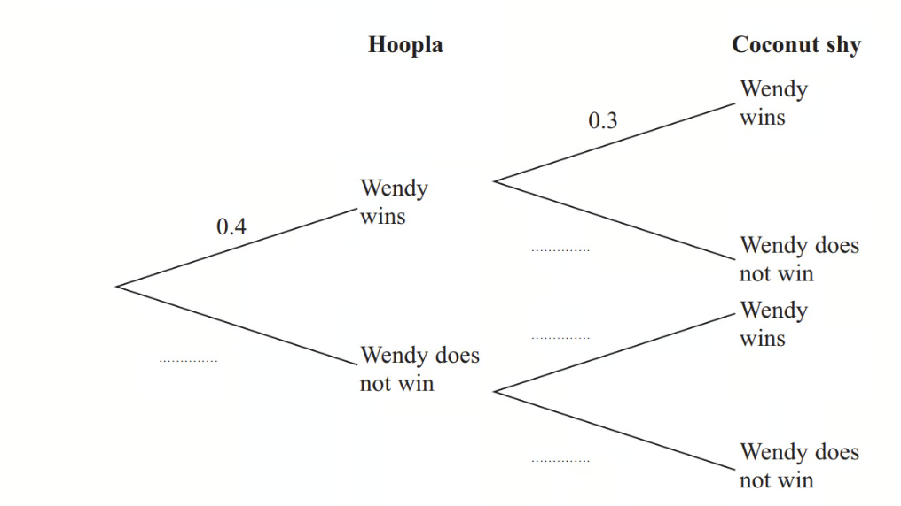

### 19((b)) — 2 marks — command: work_out — structured — from paper 2012	June · 1MA0/1H
Work out the probability that Wendy wins at Hoopla and also wins on the Coconut shy.

## Q15 — medium — 2 marks · exam-questions

### 4() — 2 marks — command: write — structured — from paper 2018	June · 1MA1/3H
When a biased 6-sided dice is thrown once, the probability that it will land on 4 is 0.65 
The biased dice is thrown twice.

Amir draws this probability tree diagram. 
The diagram is **not** correct.

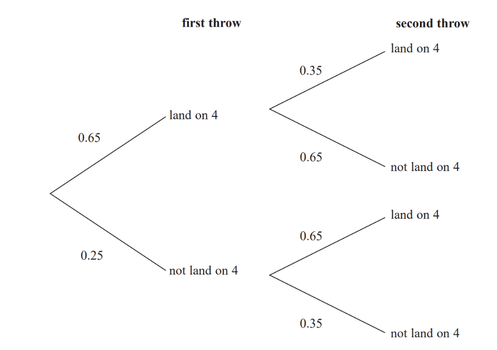

Write down **two** things that are wrong with the probability tree diagram.

## Q16 — medium — 5 marks · exam-questions

### 21((a)) — 3 marks — command: complete — structured — from paper 2016	June · 1MA0/1H
The probability that it will rain on a day in June is 0.2

When it rains the probability that my tennis match is cancelled is 0.7

When it does **not** rain, the probability that my tennis match is **not** cancelled is 0.95

Complete the probability tree diagram for this information.

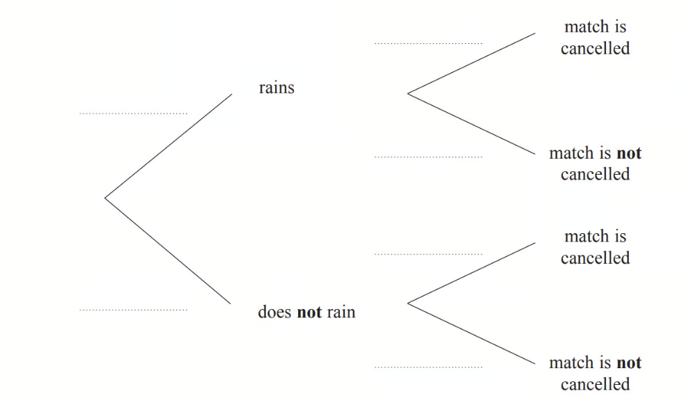

### 21((b)) — 2 marks — command: work_out — structured — from paper 2016	June · 1MA0/1H
Work out the probability that, on a day in June, it does **not** rain and my tennis match is cancelled.

## Q17 — medium — 4 marks · exam-questions

### 1((a)) — 2 marks — command: list — structured — from paper Nov 2020 · 4MA1/1H
The numbers from $1$ to $14$ are shown in the Venn diagram.

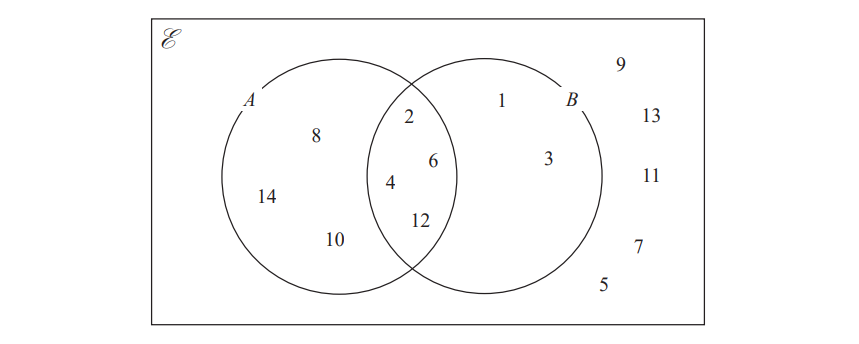

i) List the members of the set $A\capB$

[1]

ii) List the members of the set $Bʹ$

[1]

### 1((b)) — 2 marks — command: find — structured — from paper Nov 2020 · 4MA1/1H
A number is picked at random from the numbers in the Venn diagram.

Find the probability that this number is in set $A$but is **not** in set $B$.

## Q18 — medium — 5 marks · exam-questions

### 16((a)) — 2 marks — command: complete — structured — from paper Jan 2021 · 4MA1/2HR
Two events $A$ and $B$ are such that  $n(A)=62$,  $n(B)=30$  and  $n(A\cupB)=68.$

Given that  $n(E)=80$, 
complete the Venn diagram to show the number of elements in each region.

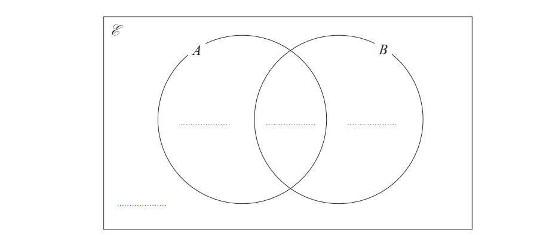

### 16((b)) — 3 marks — command: find — structured — from paper Jan 2021 · 4MA1/2HR
An element is chosen at random from $ℰ$.

Using the Venn diagram, find the probability that this element is in

i) $A\capB$

[1]

ii) $A\cupBʹ$

[2]

## Q19 — medium — 4 marks · exam-questions

### 14((a)) — 2 marks — command: complete — structured — from paper Jan 2022 · 4MA1/1H
Aika has 2 packets of seeds, packet A and packet **B **

There are 12 seeds in packet** A** and 7 of these are sunflower seeds.
 There are 15 seeds in packet **B **and 8 of these are sunflower seeds.

Aika is going to take at random a seed from packet **A** and a seed from packet **B **

Complete the probability tree diagram.

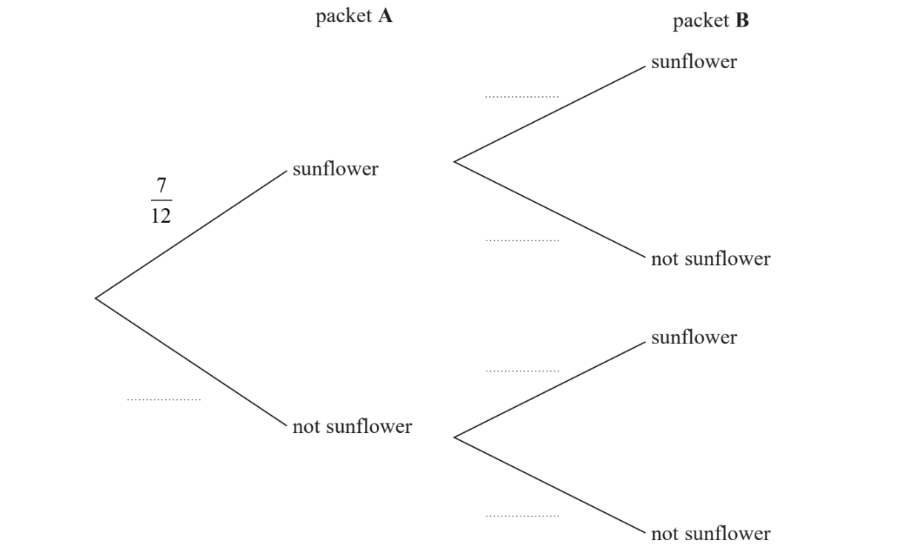

### 14((b)) — 2 marks — command: calculate — structured — from paper Jan 2022 · 4MA1/1H
Calculate the probability that Aika will take two sunflower seeds.

## Q20 — medium — 5 marks · exam-questions

### 15((a)) — 2 marks — command: complete — structured — from paper Nov 2020 · 4MA1/1H
Harry has two fair 5-sided spinners.

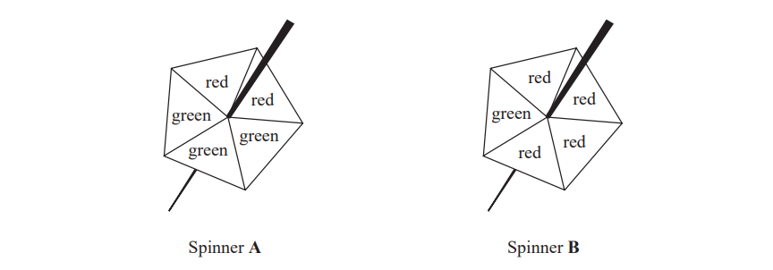

Harry is going to spin each spinner once.

Complete the probability tree diagram.

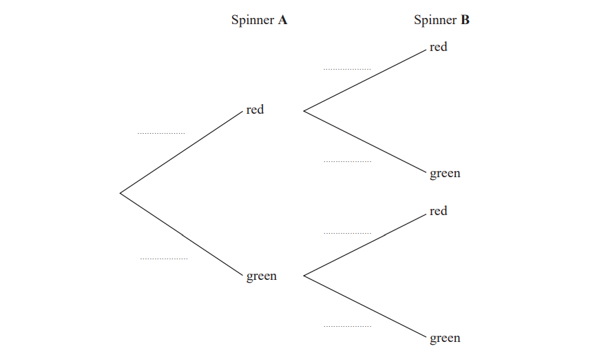

### 15((b)) — 3 marks — command: work_out — structured — from paper Nov 2020 · 4MA1/1H
Work out the probability that at least one of the spinners will land on green.

## Q21 — medium — 4 marks · exam-questions

### 16((a)) — 2 marks — command: complete — structured — from paper June 2017 · 8300/1H
A fair spinner has five equal sections numbered 1, 2, 3, 4 and 5

A fair six-sided dice has five red faces and one green face.

The spinner is spun.

If the spinner shows an even number, the dice is thrown.

Complete the tree diagram for the spinner and the dice.

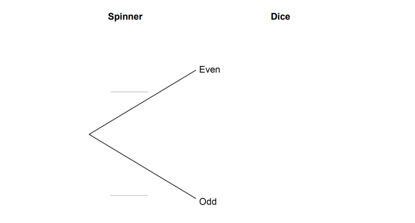

### 16((b)) — 2 marks — command: work_out — structured — from paper June 2017 · 8300/1H
Work out the probability of getting an even number and the colour green.

## Q22 — medium — 3 marks · exam-questions

### 8() — 3 marks — command: write — structured — from paper Nov 2020 · J560/05
A weather forecast says

- the probability that it will rain on Monday is 0.55 and
- the probability that it will rain on Tuesday is 0.25.

Ella draws a tree diagram to show this information.

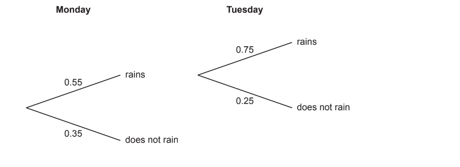

Write down three errors that Ella has made with her tree diagram.

## Q23 — medium — 4 marks · exam-questions

### 6((a)) — 2 marks — command: complete — structured — from paper June 2019 · J560/05
A bag contains 4 red counters and 3 blue counters only. Jack picks a counter at random and then replaces it. Jack then picks a second counter at random. Complete the tree diagram.

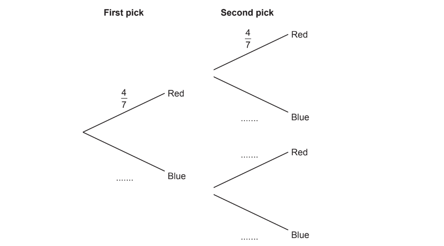

### 6((b)) — 2 marks — command: work_out — structured — from paper June 2019 · J560/05
Work out the probability that Jack picks two red counters.

## Q24 — medium — 8 marks · exam-questions

### 13((a)) — 1 mark — command: complete — structured — from paper June 2017 · J560/04
Rashid drives his car along a road passing through two sets of traffic lights.

The tree diagram shows the probabilities of the lights being red when he reaches them.

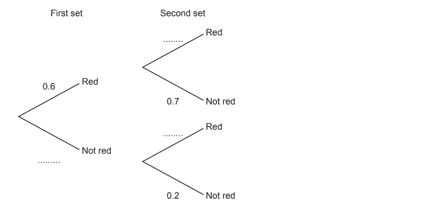

Complete the tree diagram.

### 13((b)) — 1 mark — command: write — structured — from paper June 2017 · J560/04
Write down the probability that the first set is **not red**.

### 13((c)) — 1 mark — command: write — structured — from paper June 2017 · J560/04
Given that the first set is **red**, write down the probability that the second set is** not red**.

### 13((d)) — 2 marks — command: work_out — structured — from paper June 2017 · J560/04
Work out the probability that both sets are **not red**.

### 13((e)) — 3 marks — command: work_out — structured — from paper June 2017 · J560/04
Work out the probability that at least one set is **not red**.

## Q25 — medium — 2 marks · exam-questions

### 14() — 2 marks — command: work_out — structured — from paper Nov 2018 · 8300/1H
A and B are two events.

Some probabilities are shown on the Venn diagram.

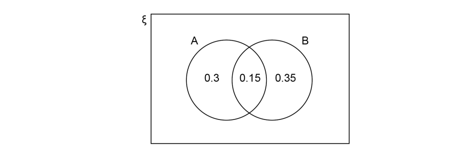

Work out $P(A'UB)$

## Q26 — medium — 4 marks · exam-questions

### 6((a)) — 3 marks — command: complete — structured — from paper Specimen 2015 · 8300/2H
ξ = {1, 2, 3, 4, 5, 6, 7, 8, 9, 10, 11, 12}

S = square numbers

E = even numbers

Complete the Venn diagram.

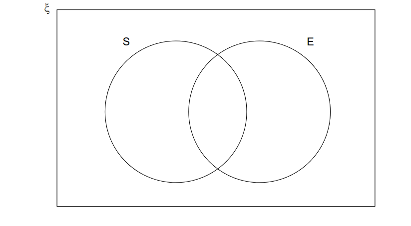

### 6((b)) — 1 mark — command: write — structured — from paper Specimen 2015 · 8300/2H
One of the numbers is chosen at random. 
Write down $P(S\capE)$

## Q27 — medium — 5 marks · exam-questions

### 4() — 5 marks — command: show — structured — from paper Nov 2020 · J560/04
In a survey, 60 students were asked whether they have a bank account (B) and whether they have a part-time job (J).

The number of students who had neither a bank account nor a part-time job was *x*.

The Venn diagram shows the results in terms of *x*.

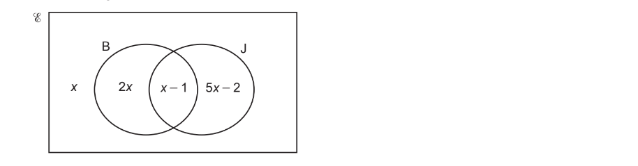

One of the 60 students is chosen at random. Find the probability that they have a bank account. Show your working.

## Q28 — medium — 4 marks · exam-questions

### 13((a)) — 2 marks — command: complete — structured — from paper 2023 June · 4MA1/2H
Narin has two fair 6-sided dice.

Dice** A** has 2 red faces and 4 yellow faces. 
Dice **B** has 1 red face and 5 yellow faces.

Narin is going to throw each dice once.

Complete the probability tree diagram.

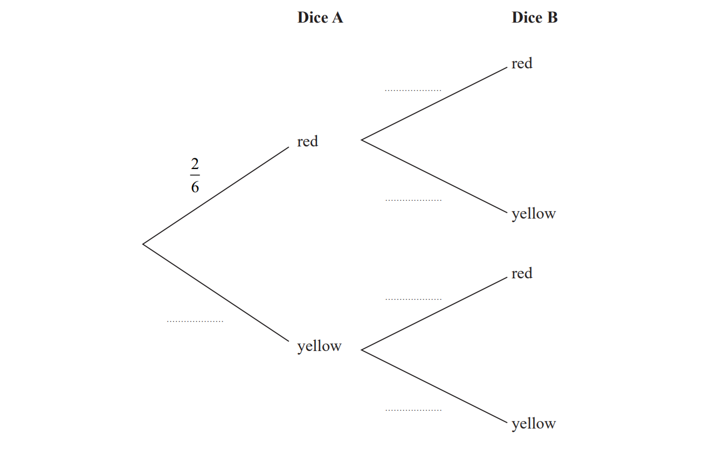

### 13((b)) — 2 marks — command: work_out — structured — from paper 2023 June · 4MA1/2H
Work out the probability that both dice land on yellow.

## Q29 — medium — 5 marks · exam-questions

### 11((a)) — 2 marks — command: complete — structured — from paper 2023 Nov · 4MA1/2H
Sid has 2 boxes of crayons, box **X **and box **Y**

5 of the 16 crayons in box **X** are red.
7 of the 20 crayons in box **Y** are red.
Sid takes at random one crayon from box **X **and one crayon from box **Y**

Complete the probability tree diagram.

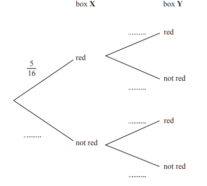

### 11((b)) — 3 marks — command: work_out — structured — from paper 2023 Nov · 4MA1/2H
Work out the probability that Sid takes two crayons that are red or two crayons that are not red.

## Q30 — hard — 6 marks · exam-questions

### 12((a)) — 4 marks — command: work_out — structured — from paper 2015	Sample · 1MA1/3H
Sami asked 50 people which drinks they liked from tea, coffee and milk.

All 50 people like at least one of the drinks 
19 people like all three drinks. 
16 people like tea and coffee but do **not** like milk. 
21 people like coffee and milk. 
24 people like tea and milk. 
40 people like coffee. 
1 person likes only milk.

Sami selects at random one of the 50 people.

Work out the probability that this person likes tea.

### 12((b)) — 2 marks — command: find — structured — from paper 2015	Sample · 1MA1/3H
Given that the person selected at random from the 50 people likes tea, find the probability that this person also likes exactly one other drink.

## Q31 — hard — 5 marks · exam-questions

### 20() — 5 marks — command: work_out — structured — from paper 2018	June · 1MA1/3H
50 people were asked if they speak French or German or Spanish.

Of these people,

31 speak French 
2 speak French, German and Spanish 
4 speak French and Spanish but not German 
7 speak German and Spanish 
8 do not speak any of the languages 
all 10 people who speak German speak at least one other language

Two of the 50 people are chosen at random.

Work out the probability that they both only speak Spanish.

## Q32 — hard — 4 marks · exam-questions

### 11((a)) — 2 marks — command: work_out — structured — from paper 2015	Spec1 · 1MA1/2H
Finlay plays two tennis matches.

The probability that he will win a match and the probability that he will lose a match are shown in the probability tree diagram.

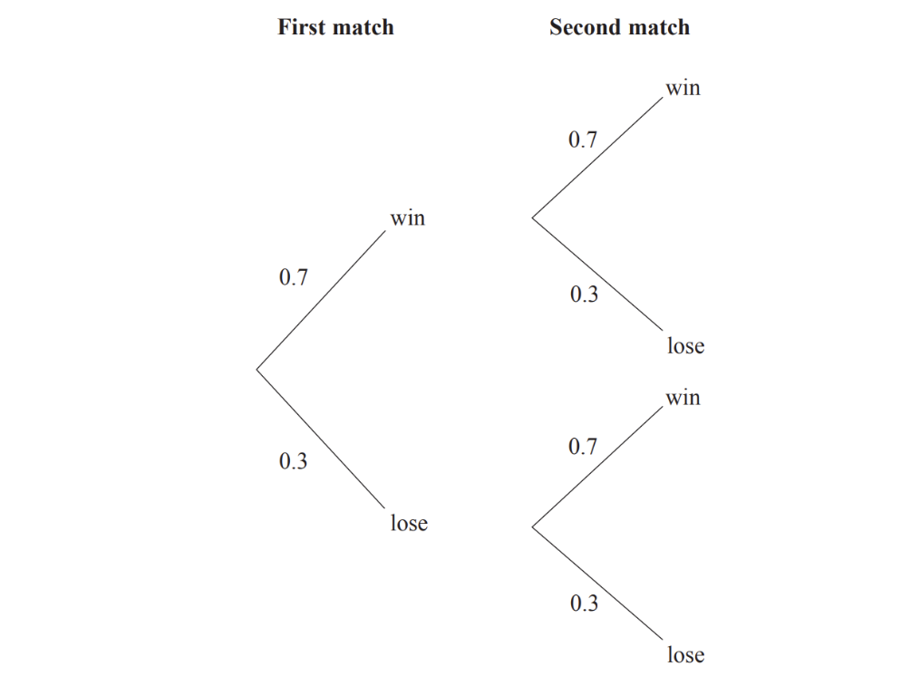

Work out the probability that Finlay wins both matches.

### 11((b)) — 2 marks — command: work_out — structured — from paper 2015	Spec1 · 1MA1/2H
Work out the probability that Finlay loses at least one match.

## Q33 — hard — 5 marks · exam-questions

### 19((a)) — 2 marks — command: complete — structured — from paper 2014	November · 1MA0/2H
Louise makes a spinner.

The spinner can land on green or on red.   
The probability that the spinner will land on green is 0.7

Louise spins the spinner twice.

Complete the probability tree diagram.

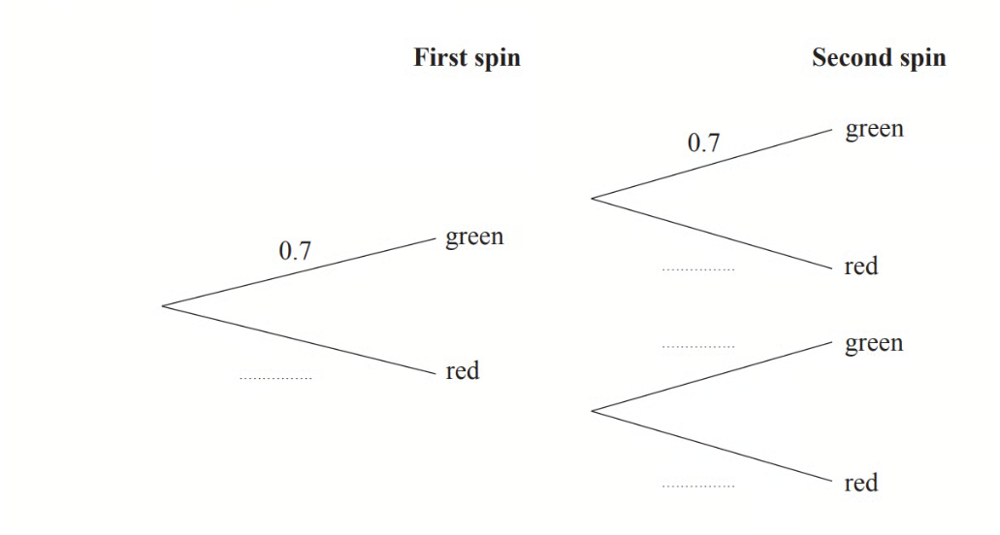

### 19((b)) — 3 marks — command: work_out — structured — from paper 2014	November · 1MA0/2H
Work out the probability that the spinner lands on two different colours.

## Q34 — hard — 5 marks · exam-questions

### 19((a)) — 2 marks — command: complete — structured — from paper 2017	June · 1MA0/2H
Machine A and machine B make bottles.

The probability that a bottle made by machine A is faulty is 0.02 The probability that a bottle made by machine B is faulty is 0.05

Complete the probability tree diagram.

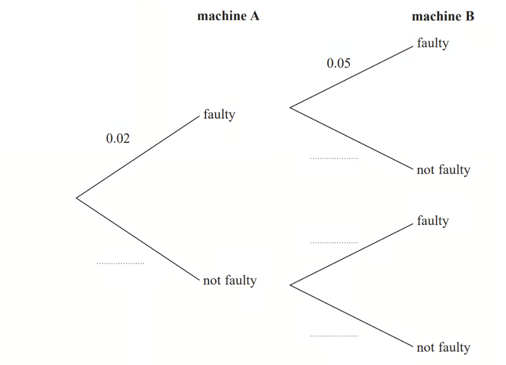

### 19((b)) — 3 marks — command: work_out — structured — from paper 2017	June · 1MA0/2H
Shazia takes at random one bottle made by machine A and one bottle made by machine B.

Work out the probability that at least one of these bottles is faulty.

## Q35 — hard — 5 marks · exam-questions

### 10((a)) — 2 marks — command: complete — structured — from paper June 2019 · 1MA1/2H
Mary travels to work by train every day. 
The probability that her train will be late on any day is 0.15

Complete the probability tree diagram for Thursday and Friday.

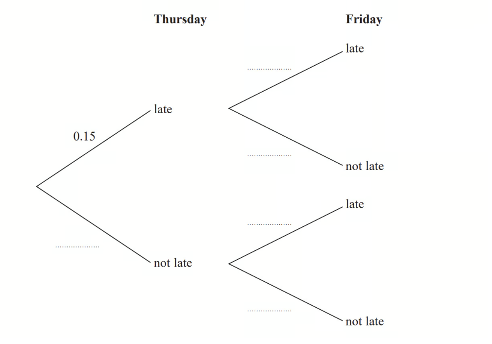

### 10((b)) — 3 marks — command: work_out — structured — from paper June 2019 · 1MA1/2H
Work out the probability that her train will be late on at least one of these two days.

## Q36 — hard — 5 marks · exam-questions

### 15((a)) — 2 marks — command: complete — structured — from paper 2018	June · 1MA1/2H
A darts team is going to play a match on Saturday and on Sunday. 
The probability that the team will win on Saturday is 0.45

If they win on Saturday, the probability that they will win on Sunday is 0.67
If they do **not** win on Saturday, the probability that they will win on Sunday is 0.35

Complete the probability tree diagram.

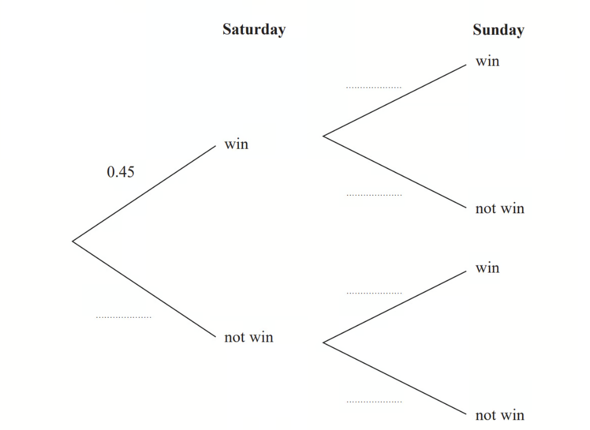

### 15((b)) — 3 marks — command: find — structured — from paper 2018	June · 1MA1/2H
Find the probability that the team will win exactly one of the two matches.

## Q37 — hard — 5 marks · exam-questions

### 23((a)) — 2 marks — command: complete — structured — from paper 2014	June · 1MA0/1H
Yvonne has 10 tulip bulbs in a bag.

7 of the tulip bulbs will grow into red tulips. 
3 of the tulip bulbs will grow into yellow tulips.

Yvonne takes at random two tulip bulbs from the bag. 
She plants the bulbs.

Complete the probability tree diagram.

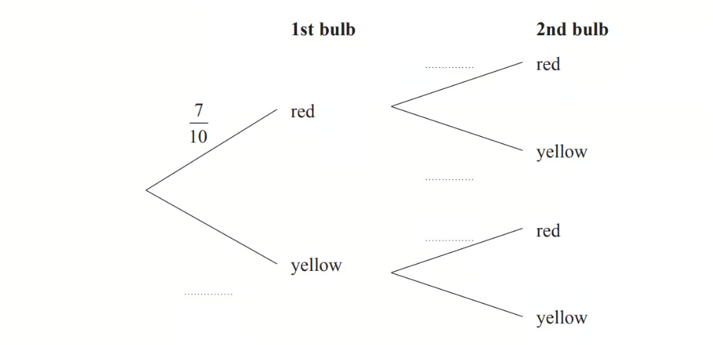

### 23((b)) — 3 marks — command: work_out — structured — from paper 2014	June · 1MA0/1H
Work out the probability that at least one of the bulbs will grow into a yellow tulip.

## Q38 — hard — 4 marks · exam-questions

### 18((a)) — 3 marks — command: complete — structured — from paper June 2017 · 8300/2H
A school has 86 teachers.

42 are male and 44 are female.

$\frac{1}{3}$ of the male teachers have blue eyes.

$\frac{1}{4}$ of the female teachers have blue eyes.

ξ   = teachers in the school 
M = male teachers 
B  = teachers who have blue eyes

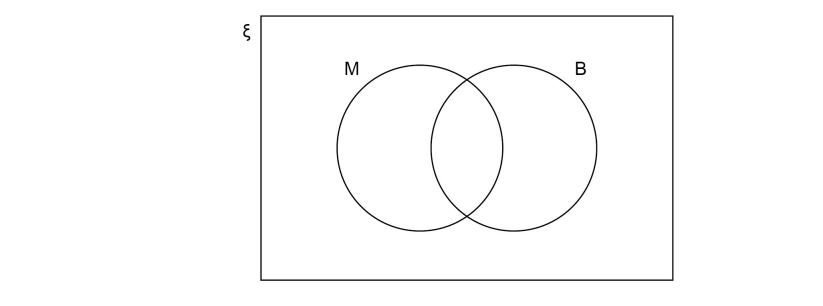

Complete the Venn diagram.

### 18((b)) — 1 mark — command: work_out — structured — from paper June 2017 · 8300/2H
One teacher who has blue eyes is chosen at random.

Work out the probability that the teacher is male.

## Q39 — hard — 3 marks · exam-questions

### 14((a)) — 1 mark — command: find — structured — from paper June 2018 · J560/04
The Venn diagram shows the number of students studying Mathematics (M) and the number of students studying Physics (P) in a college. 
35 students do not study either subject.

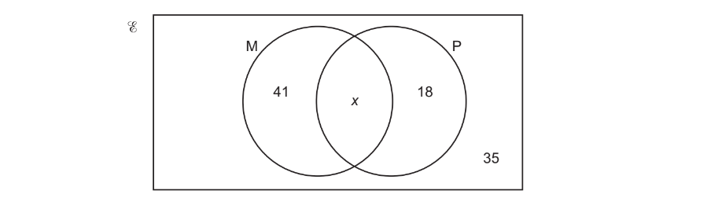

The total number of students is 121.
Find the value of $x$.

$x$ = ....................

### 14((b)) — 2 marks — command: find — structured — from paper June 2018 · J560/04
One of the 121 students is selected at random.

Find the probability that this student studies Mathematics, given that they study Physics.

## Q40 — hard — 6 marks · exam-questions

### 1() — 2 marks — command: complete — structured
$A$ and $B$are two sets. `straight n open parentheses xi close parentheses equals 37
straight n open parentheses A close parentheses equals 22
straight n open parentheses A intersection B close parentheses equals 12
straight n open parentheses A union B close parentheses equals 30` Complete the Venn diagram to show the **number of elements** in each region.

### 2() — 2 marks — command: find — structured
Find

i) `straight n open parentheses A intersection B apostrophe close parentheses`

[1]

ii) `straight n open parentheses A apostrophe union B apostrophe close parentheses`

[1]

### 3() — 2 marks — command: find — structured
One of the elements from the universal set $ξ$ is chosen at random.

Find the probability that this element is in set $B$.

## Q41 — hard — 6 marks · exam-questions

### 1() — 4 marks — command: work_out — structured
There are 31 students in a class.

The only languages available for the class to study are French and Spanish. 
17 students study French. 
15 students study Spanish. 
6 students study neither French not Spanish.

Using a Venn diagram, or otherwise, work out how many students study only one language.

### 2() — 2 marks — command: find — structured
One of the students is chosen at random.

Find the probability that this student studied French but not Spanish.

## Q42 — hard — 7 marks · exam-questions

### 11((a)) — 3 marks — command: show — structured — from paper Specimen 2015 · J560/06
A skills test has two sections, literacy (L) and numeracy (N). 
One day everyone who took the skills test passed at least one section. 
88% passed the literacy section and 76% passed the numeracy section.

Represent this information on a Venn diagram. 
Show clearly the **percentage** in each section of the diagram.

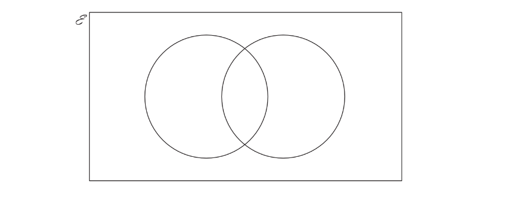

### 11((b)) — 4 marks — command: what — structured — from paper Specimen 2015 · J560/06
One person is chosen at random from all the people who took the skills test that day.

What is the probability that this person

i) passed the numeracy section, given that they passed the literacy section,

[2]

ii) passed the literacy section, given that they passed only one section?

[2]

## Q43 — hard — 7 marks · exam-questions

### 1() — 2 marks — command: complete — structured
ξ = {1, 2, 3, 4, 5, 6, 7, 8, 9, 10, 11, 12, 13} 
*A* = {3, 7, 11, 13} *B* = {3, 6, 9, 12, 13} 
*C* = {2, 3, 5, 6, 7, 8}

Complete the Venn diagram

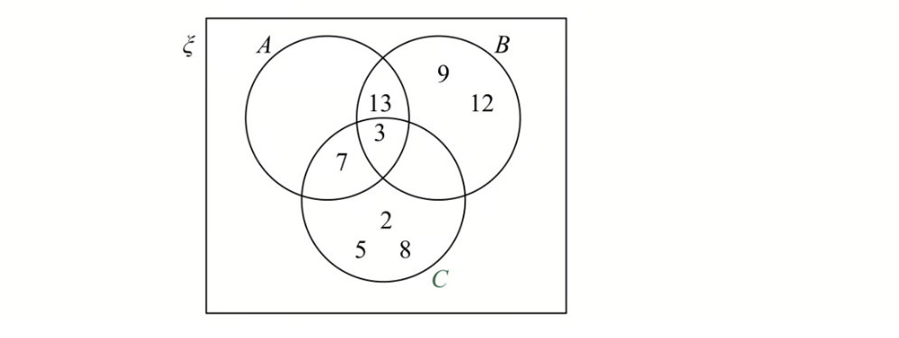

### 2() — 1 mark — command: list — structured
List the members of the set *B' ∩ C.*

### 3() — 1 mark — command: list — structured
List the members of the set (*A* U *C*)' ∩ *B*.

### 4() — 1 mark — command: find — structured
Find n(*A*' ∩ *B*')

### 5() — 2 marks — command: find — structured
One of the numbers in the Venn diagram is chosen at random.

Find the probability that this number is in set (*A* ∩ *B*)

## Q44 — hard — 6 marks · exam-questions

### 9() — 6 marks — command: show — structured — from paper Nov 2017 · J560/04
Here are the results of a survey of 437 people in a town.

- 62 males speak Spanish.
- 153 females do not speak Spanish.
- 280 people do not speak Spanish.

Jeff says

At least 2 out of every 5 females in the town can speak Spanish.

Is he correct? 
Show clearly how you reached your decision.

## Q45 — hard — 4 marks · exam-questions

### 1() — 3 marks — command: complete — structured
Each student in a group of 32 students was asked the following question.

"Do you have a desktop computer (*D*), a laptop (*L*) or a tablet (*T*)?"

Their answers showed that,

19 students have a desktop computer, 
17 students have a laptop, 
16 students have a tablet, 
9 students have both a desktop computer and a laptop, 
11 students have both a desktop computer and a tablet,
 7 students have both a laptop and a tablet, 
5 students have all three.

Using this information, complete the Venn diagram to show the number of students in each appropriate subset.

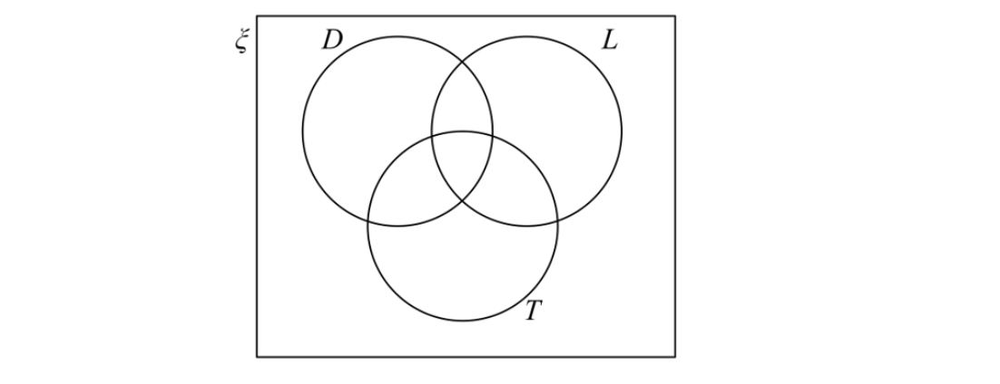

### 2() — 1 mark — command: find — structured
One of the students with both a desktop computer and a laptop is chosen at random.

Find the probability that this student also has a tablet.

## Q46 — hard — 3 marks · exam-questions

### 15() — 3 marks — command: work_out — structured — from paper Specimen paper · 4MA1/2H
Sophie takes an examination. 
If she fails the examination, she will resit.

The probability that Sophie passes the examination on her first attempt is 0.7
 If she fails the examination on any attempt, the probability she passes on the next attempt is 0.9

Work out the probability that Sophie takes at most 2 attempts to pass the examination.

## Q47 — hard — 4 marks · exam-questions

### 14((a)) — 2 marks — command: complete — structured — from paper Jan 2020 · 4MA1/2H
There are 20 glasses in a cupboard.

13 of the glasses are large

7 of the glasses are small

Roberto takes at random two glasses from the cupboard.

Complete the probability tree diagram.

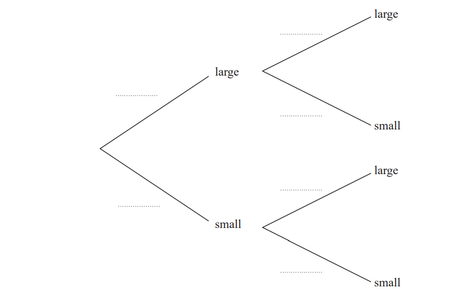

### 14((b)) — 2 marks — command: work_out — structured — from paper Jan 2020 · 4MA1/2H
Work out the probability that Roberto takes two small glasses.

## Q48 — hard — 4 marks · exam-questions

### 20() — 4 marks — command: work_out — structured — from paper 2023 Nov · 4MA1/1H
A bag contains only 10 cent coins and 20 cent coins.

Josip takes at random a coin from the bag, records its value and replaces it in the bag. He then takes at random a second coin from the bag, records its value and replaces it in the bag.

Josip finds the mean value of the two coins

The probability that the two coins have a mean value of 10 cents is  $\frac{49}{121}$

Work out the probability that the two coins have a mean value of 15 cents

## Q49 — hard — 5 marks · exam-questions

### 19((a)) — 2 marks — command: complete — structured — from paper Nov 2021 · 8300/1H
Items made at a factory have to pass two checks.

90% pass the first check.
 The items that fail are scrapped. 
99% of the items that pass the first check pass the second check. 
The items that fail are scrapped.

Complete the tree diagram.

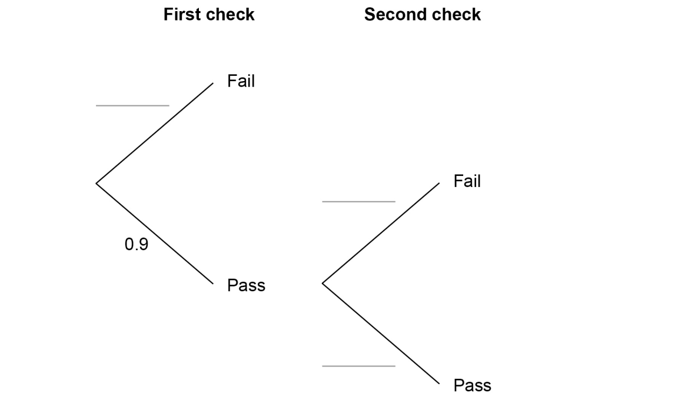

### 19((b)) — 3 marks — command: work_out — structured — from paper Nov 2021 · 8300/1H
An item is chosen at random before the checks.

Work out the probability that the item is scrapped.

## Q50 — hard — 4 marks · exam-questions

### 11((a)) — 1 mark — command: complete — structured — from paper June 2018 · 8300/2H
Two ordinary fair dice are rolled.

Complete the tree diagram.

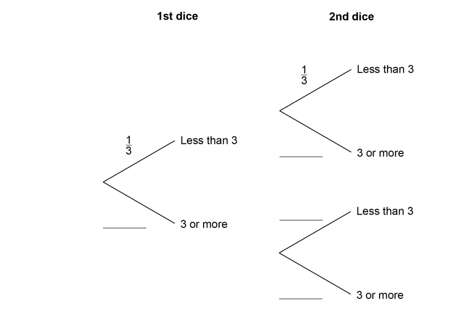

### 11((b)) — 1 mark — command: work_out — structured — from paper June 2018 · 8300/2H
Work out the probability that **both** dice land on a number less than 3

### 11((c)) — 2 marks — command: work_out — structured — from paper June 2018 · 8300/2H
Work out the probability that **exactly one** of the dice lands on a number less than 3

## Q51 — hard — 5 marks · exam-questions

### 7((b)) — 5 marks — command: multiple — structured — from paper Nov 2018 · J560/06
The probability that any postcard posted in Portugal on Monday is delivered to the UK within a week is 0.62. 
The probability that any postcard posted in Portugal on Friday is delivered to the UK within a week is 0.41.

Sergio is in Portugal. 
He posts one postcard to the UK on Monday. 
He posts another postcard to the UK on Friday.

i) Complete the probability tree to show the possible outcomes for the postcards.

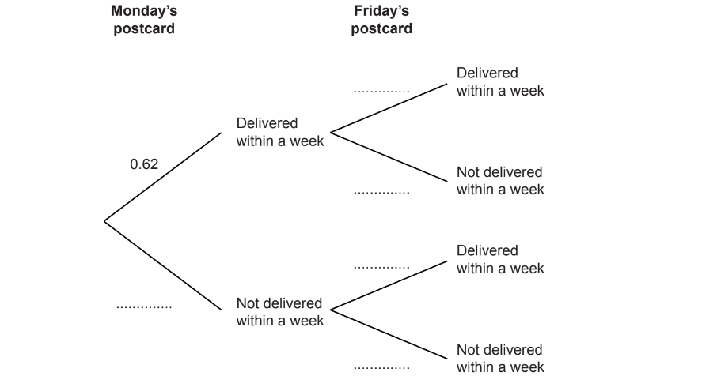

[2]

ii) Calculate the probability that only one of Sergio’s postcards is delivered within a week.

[3]

## Q52 — hard — 4 marks · exam-questions

### 25() — 4 marks — command: work_out — structured — from paper June 2018 · 8300/2H
The Venn diagram shows some information about 150 students.

$ξ$ = 150 students 
$C$ = students who study Chemistry 
$P$ = students who study Physics

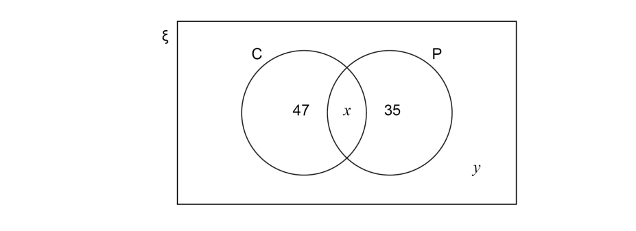

The probability that a Physics student, chosen at random, also studies Chemistry is  $\frac{5}{12}$

One of the 150 students is chosen at random.

Work out the probability that the student does **not** study either Chemistry or Physics.

## Q53 — hard — 2 marks · exam-questions

### 22((a)) — 1 mark — command: circle — structured — from paper June 2019 · 8300/3H
ξ = 29 students in a class

C = students who own a cat

D = students who own a dog

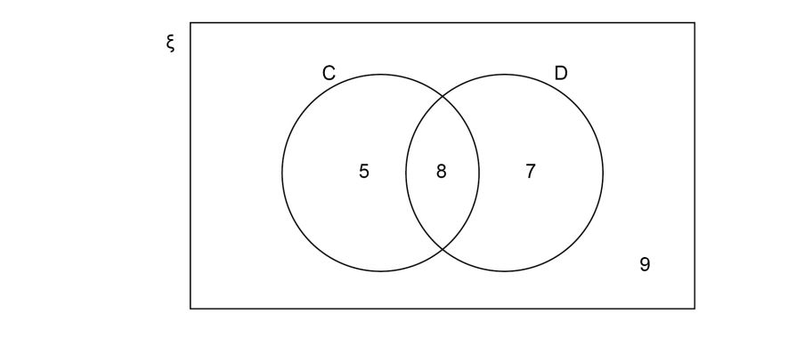

A student is chosen at random.

Circle the probability that the student owns a cat or a dog but not both.

| $\frac{12}{29}$ | $\frac{13}{29}$ | $\frac{15}{29}$ | $\frac{20}{29}$ |
|---|---|---|---|

### 22((b)) — 1 mark — command: circle — structured — from paper June 2019 · 8300/3H
A student who owns a dog is chosen at random.

Circle the probability that the student also owns a cat.

| $\frac{7}{15}$ | $\frac{8}{15}$ | $\frac{7}{29}$ | $\frac{8}{29}$ |
|---|---|---|---|

## Q54 — hard — 4 marks · exam-questions

### 20() — 1 mark — command: what — structured — from paper Nov 2019 · 8300/1H
The Venn diagram shows information about some houses.

G = houses with a garage 
S = houses with a shed

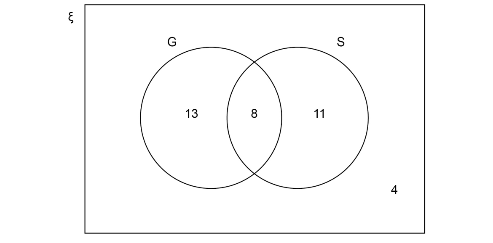

A house is chosen at random.

The house has a garage.

What is the probability that it has a shed?

### 20((b)) — 1 mark — command: what — structured — from paper Nov 2019 · 8300/1H
The house does **not **have a garage.

What is the probability that it does **not **have a shed?

### 20((c)) — 2 marks — command: show — structured — from paper Nov 2019 · 8300/1H
Show that      `text P end text open parentheses straight G intersection straight S close parentheses apostrophe greater than straight P open parentheses straight G union straight S apostrophe close parentheses`

## Q55 — hard — 4 marks · exam-questions

### 14((a)) — 3 marks — command: work_out — structured — from paper Nov 2017 · 8300/3H
In the Venn diagram

ξ represents 31 students in a class    
C is students who have a cat    
D is students who have a dog

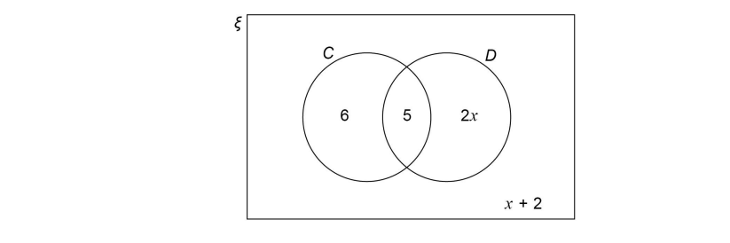

One student from the class is picked at random.

Work out the probability that the student has a dog.

### 14((b)) — 1 mark — command: work_out — structured — from paper Nov 2017 · 8300/3H
One of the students who has a cat is picked at random.

Work out the probability that this student has a dog.

## Q56 — very_hard — 3 marks · exam-questions

### 12() — 3 marks — command: work_out — structured — from paper 2017	November · 1MA1/3H
Alan has two spinners, spinner **A** and spinner **B**. Each spinner can land on only red or white.

The probability that spinner **A** will land on red is 0.25 
The probability that spinner **B** will land on red is 0.6

The probability tree diagram shows this information.

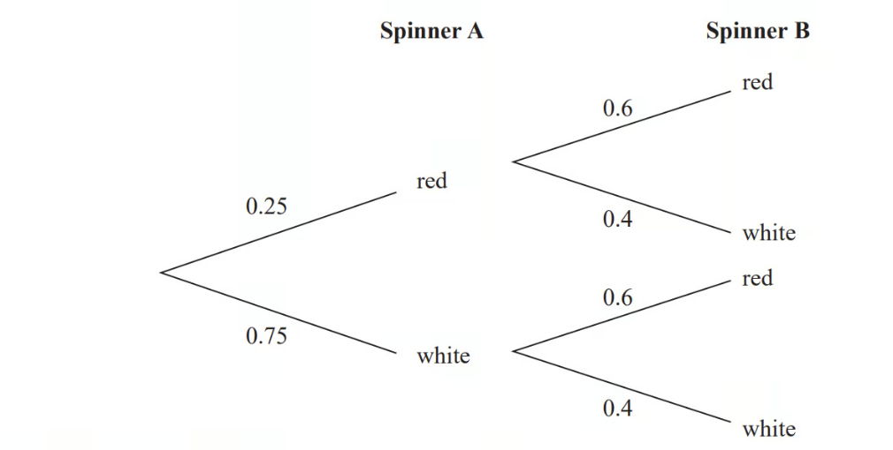

Alan spins spinner **A** once and he spins spinner **B** once. He does this a number of times.

The number of times **both** spinners land on red is 24.

Work out an estimate for the number of times **both** spinners land on white.

## Q57 — very_hard — 5 marks · exam-questions

### 12((a)) — 2 marks — command: complete — structured — from paper 2015	Sample · 1MA1/2H
A and B are two sets of traffic lights on a road.

The probability that a car is stopped by lights A is 0.4

If a car is stopped by lights A, then the probability that the car is **not** stopped by lights B is 0.7

If a car is **not** stopped by lights A, then the probability that the car is **not** stopped by lights B is 0.2

Complete the probability tree diagram for this information.

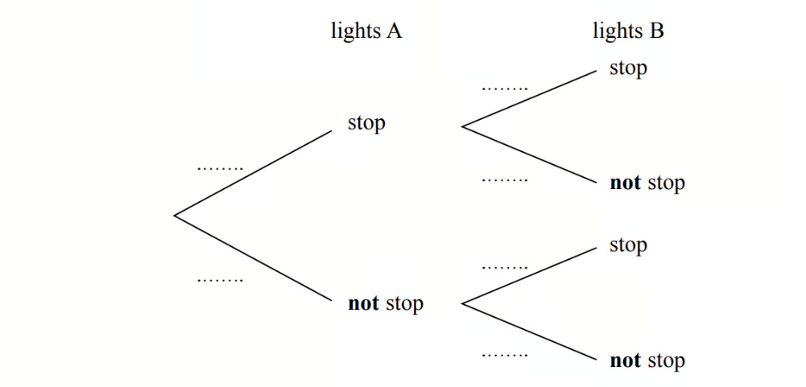

### 19((b)) — 3 marks — command: show — structured — from paper 2015	Sample · 1MA1/2H
Mark drove along this road. 
He was stopped by just one of the sets of traffic lights.

Is it more likely that he was stopped by lights A or by lights B? 
You must show your working.

## Q58 — very_hard — 8 marks · exam-questions

### 16((a)) — 2 marks — command: complete — structured — from paper Jan 2020 · 4MA1/2HR
Cody has two bags of counters, bag $A$ and bag $B$.

Each of the counters has either an odd number or an even number written on it.

There are 10 counters in bag $A$ and 7 of these counters have an **odd** number written on them. 
There are 12 counters in bag $B$ and 7 of these counters have an **odd** number written on them.

Cody is going to take at random a counter from bag $A$ and a counter from bag $B$.

Complete the probability tree diagram.

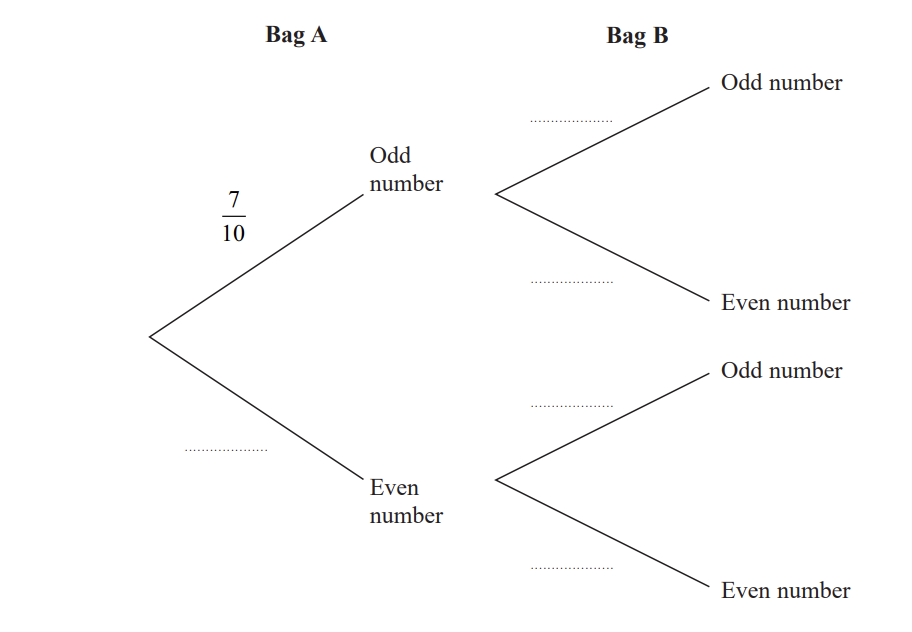

### 16((b)) — 3 marks — command: calculate — structured — from paper Jan 2020 · 4MA1/2HR
Calculate the probability that the total of the numbers on the two counters will be an odd number.

### 16((c)) — 3 marks — command: show — structured — from paper Jan 2020 · 4MA1/2HR
Harriet also has a bag of counters. 
Each of her counters also has either an odd number or an even number written on it.

Harriet is going to take at random a counter from her bag of counters.

The probability that the number on each of Cody’s two counters **and** the number on Harriet’s counter will all be even is $\frac{3}{100}$

Find the least number of counters that Harriet has in her bag. Show your working clearly.

## Q59 — very_hard — 6 marks · exam-questions

### 14((a)) — 2 marks — command: complete — structured — from paper June 2019 · 4MA1/1HR
Each day that Barney goes to college, he either goes by bus or he walks. 
The probability that Barney will go to college by bus on any day is 0.3

When Barney goes to college by bus, the probability that he will be late is 0.2 
When Barney walks to college, the probability that he will be late is 0.1

Complete the probability tree diagram.

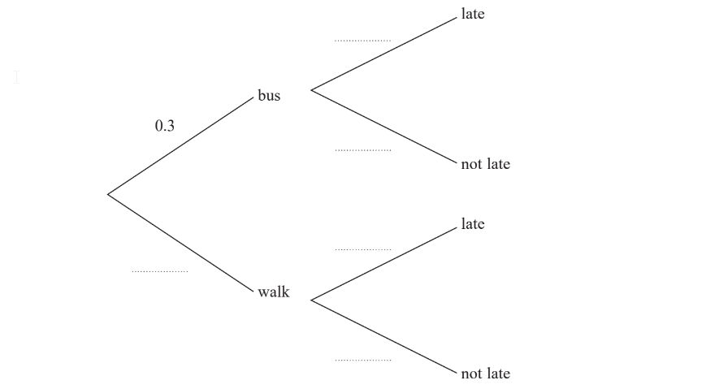

### 14((b)) — 4 marks — command: work_out — structured — from paper June 2019 · 4MA1/1HR
Barney will go to college on 200 days next year.

Work out an estimate for the number of days Barney will be late for college next year.

## Q60 — very_hard — 5 marks · exam-questions

### 16() — 2 marks — command: find — structured — from paper Nov 2021 · 4MA1/1H
There are 32 students in a class. In one term these 32 students each took a test in Maths `open parentheses M close parentheses`, in English `open parentheses E close parentheses` and in French `open parentheses F close parentheses`.

25 students passed the test in Maths. 
20 students passed the test in English. 
14 students passed the test in French. 
18 students passed the tests in Maths and English. 
11 students passed the tests in Maths and French. 
4 students failed all three tests. 
$x$ students passed all three tests.

The incomplete Venn diagram gives some more information about the results of the 32 students.

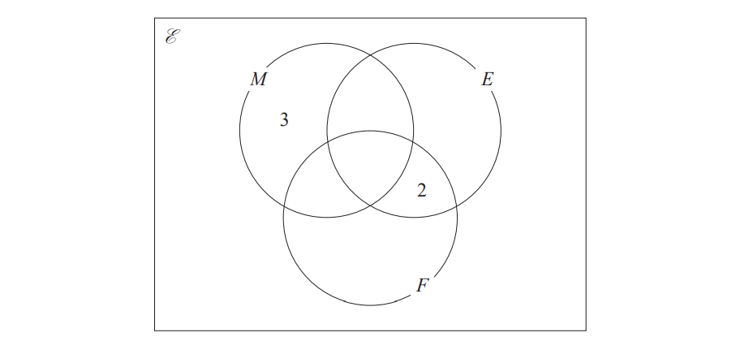

Use all the given information about the results of students who passed the test in Maths to find the value of $x$.

$x=$ .......................................................

### 16((b)) — 2 marks — command: complete — structured — from paper Nov 2021 · 4MA1/1H
Use your value of $x$ to complete the Venn diagram to show the number of students in each subset.

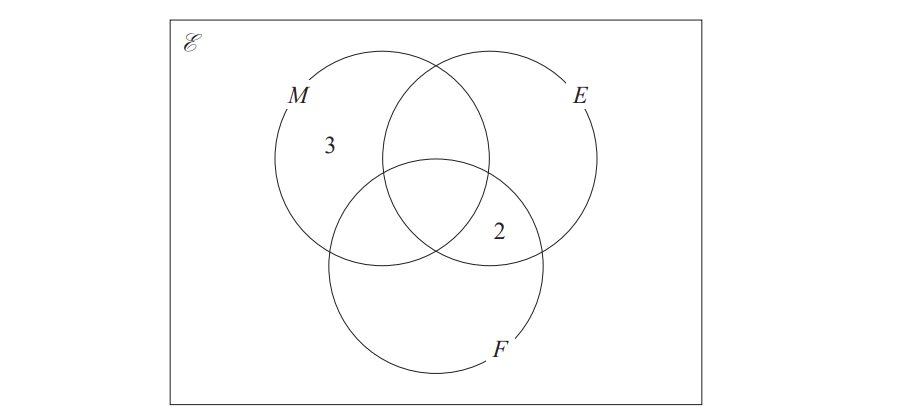

### 16((c)) — 1 mark — command: find — structured — from paper Nov 2021 · 4MA1/1H
A student who passed the test in Maths is chosen at random. Find the probability that this student failed the test in French.

## Q61 — very_hard — 5 marks · exam-questions

### 13((a)) — 2 marks — command: complete — structured — from paper June 2018 · 4MA1/2H
Felix has 10 cards. 
There are 5 red cards, 4 blue cards and 1 green card.

Felix takes at random one of the cards. 
He does not replace the card. 
Felix then takes at random a second card.

Complete the probability tree diagram.

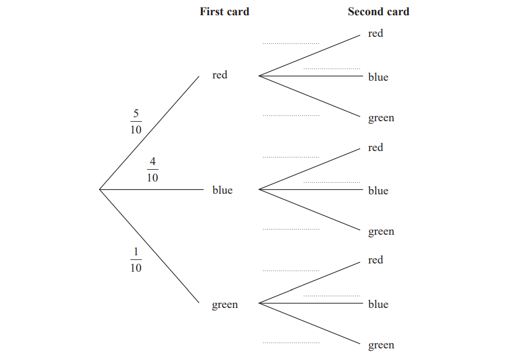

### 13((b)) — 3 marks — command: work_out — structured — from paper June 2018 · 4MA1/2H
Work out the probability that Felix takes at least one blue card and no green card.

## Q62 — very_hard — 5 marks · exam-questions

### 15() — 2 marks — command: complete — structured — from paper Nov 2021 · 4MA1/1H
Magnus and Garry play 2 games of chess against each other.

The probability that Magnus beats Garry in any game is $\frac{2}{9}$

The probability that any game between Magnus and Garry is drawn is $\frac{4}{9}$

The result of any game is independent of the result of any other game.

Complete the probability tree diagram.

### 15((b)) — 3 marks — command: work_out — structured — from paper Nov 2021 · 4MA1/1H
For each game of chess,

the winner gets 2 points and the loser gets 0 points,

when the game is drawn, each player gets 1 point.

Work out the probability that, after 2 games, Magnus and Garry have the same number of points.

## Q63 — very_hard — 8 marks · exam-questions

### 13((a)) — 2 marks — command: complete — structured — from paper June 2021 · 4MA1/2H
Emilie takes part in two races.

The probability that she wins the first race is 0.7 
The probability that she wins the second race is 0.4
 The outcomes of the two races are independent.

Complete the probability tree diagram.

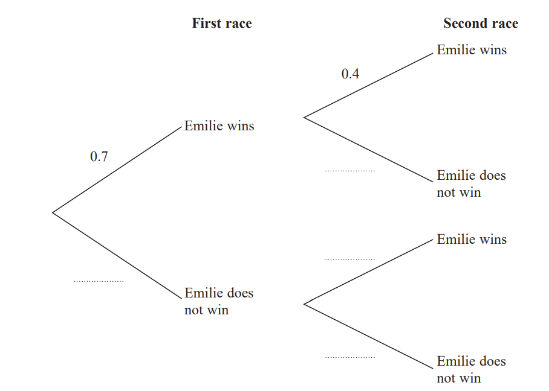

### 13((b)) — 3 marks — command: work_out — structured — from paper June 2021 · 4MA1/2H
Work out the probability that Emilie wins exactly one of the two races.

### 13((c)) — 3 marks — command: work_out — structured — from paper June 2021 · 4MA1/2H
Emilie is going to take part in a third race.

If she wins both of the first two races, the probability that she will win the third race is 0.6

If she wins exactly one of the first two races, the probability that she will win the third race is 0.3

Work out the probability that Emilie will win exactly two of the three races.

## Q64 — very_hard — 7 marks · exam-questions

### 13((a)) — 2 marks — command: complete — structured — from paper June 2019 · 4MA1/1H
In group $C$, there are 6 girls and 8 boys. 
In group $D$, there are 3 girls and 7 boys.

A team is made by picking at random one child from group $C$ and one child from group $D$.

Complete the probability tree diagram.

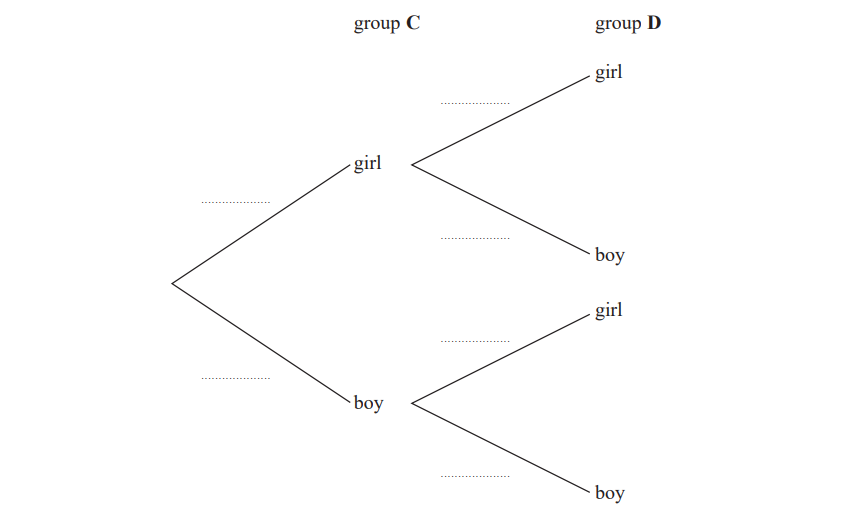

### 13((b)) — 2 marks — command: work_out — structured — from paper June 2019 · 4MA1/1H
Work out the probability that there are two boys in the team.

### 13((c)) — 3 marks — command: work_out — structured — from paper June 2019 · 4MA1/1H
After the first team has been picked, a second team is picked. One child is picked at random from the children left in group $C$ and one child is picked at random from the children left in group $D$  .

Work out the probability that there are two boys in each of the two teams.

## Q65 — very_hard — 6 marks · exam-questions

### 6((a)) — 2 marks — command: complete — structured — from paper June 2019 · 8300/1H
Anna plays a game with an ordinary, fair dice.

If she rolls 1 she wins. 
If she rolls 2 or 3 she loses. 
If she rolls 4, 5 or 6 she rolls again.

When she has to roll again,

if she rolls an odd number she wins 
if she rolls an even number she loses.

Complete the tree diagram with the four missing probabilities.

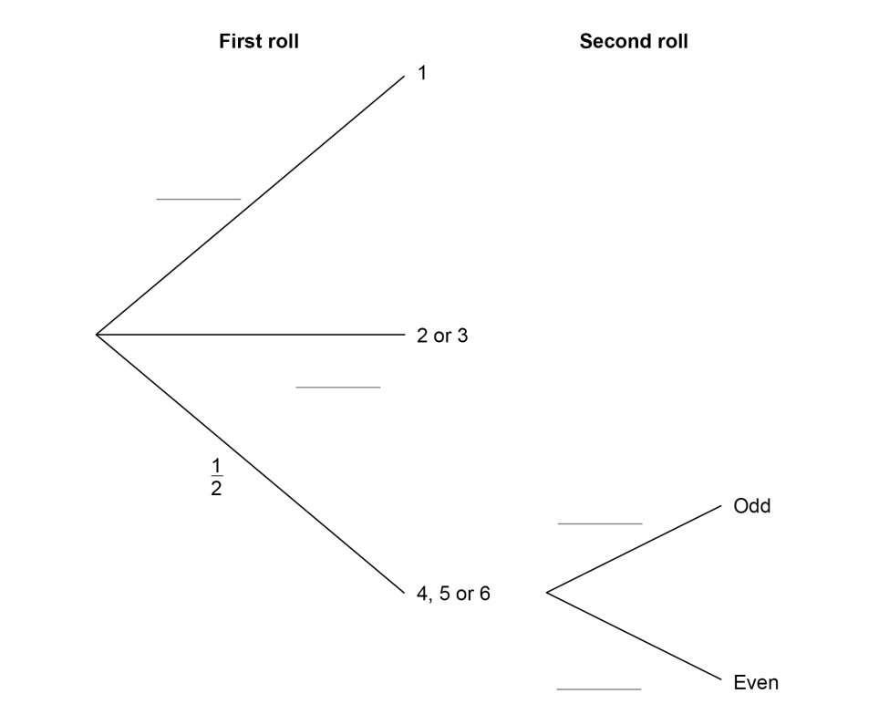

### 6((b)) — 4 marks — command: work_out — structured — from paper June 2019 · 8300/1H
Is Anna more likely to win or to lose?

You **must **work out the probability that she wins.

## Q66 — very_hard — 4 marks · exam-questions

### 20((a)) — 2 marks — command: complete — structured — from paper Specimen 2015 · 8300/1H
On Friday, Greg takes part in a long jump competition. He has to jump at least 7.5 metres to qualify for the final on Saturday.

- He has up to three jumps to qualify.
- If he jumps at least 7.5 metres he does **not **jump again on Friday.

Each time Greg jumps, the probability he jumps at least 7.5 metres is 0.8 
Assume each jump is independent. Complete the tree diagram.

| **First jump** | **Second jump** | **Third jump** |
|---|---|---|

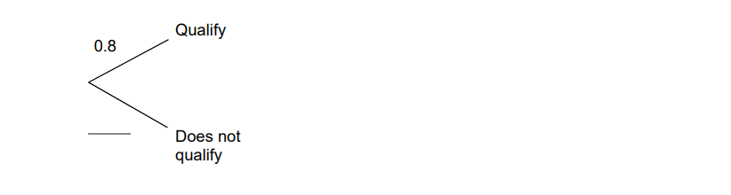

### 20((b)) — 2 marks — command: work_out — structured — from paper Specimen 2015 · 8300/1H
Work out the probability that he does **not **need the third jump to qualify.

## Q67 — very_hard — 5 marks · exam-questions

### 11((a)) — 2 marks — command: complete — structured — from paper Nov 2017 · J560/06
Reuben is playing a matching game with these cards.

He turns the cards over and shuffles them. Reuben takes a card and keeps it. 
He then takes a second card. If the cards are different, he wins the game.

Complete this tree diagram to show the probabilities for each card picked in the game.

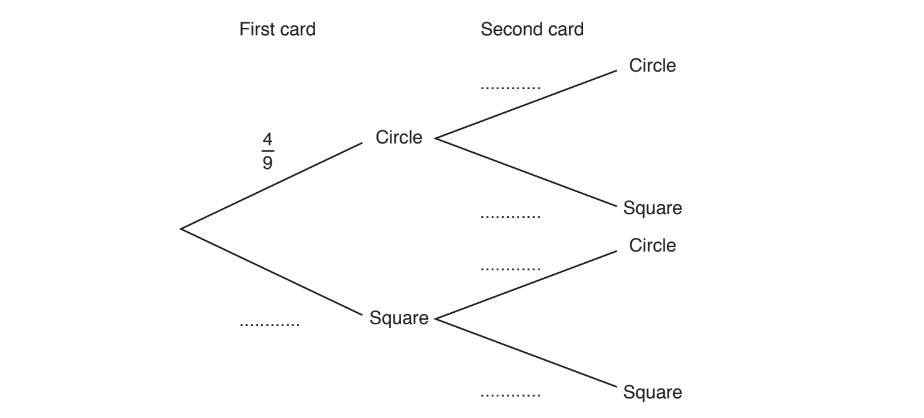

### 11((b)) — 3 marks — command: what — structured — from paper Nov 2017 · J560/06
What is the probability that Reuben wins the game?
