# Mark Schemes — 3D Pythagoras & Trigonometry
**Trigonometry** · Edexcel IGCSE Maths A (Modular) (4XMAF/4XMAH) — 24/Higher Unit 1

## Q1 — very_hard — 6 marks · exam-questions

### 21() — 6 marks
> *Start by marking the given information on the diagram.*

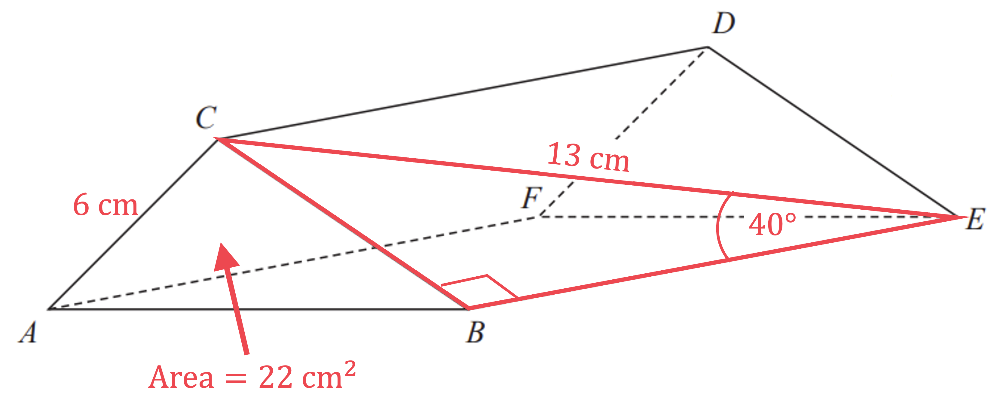

> *We cannot assume that **BC** is 6 cm as we are not told that triangle **ABC **is isosceles. Therefore we need to use trigonometry with triangle **BCE **to find** BC**.*

`sin space open parentheses 40 degree close parentheses equals fraction numerator B C over denominator 13 end fraction`

**[1]**

> *Multiply both sides by 13 to find **BC.*

`B C equals 13 space sin space open parentheses 40 degree close parentheses equals 8.356 space 238 space...`

*Store this result in your calculator to preserve accuracy in future calculations.* *Use this result and "*$\frac{1}{2}absinC$*" with the area of triangle **ABC** to find angle **C.*

`1 half open parentheses 6 close parentheses open parentheses 8.356 space 238 space... close parentheses space sin space C equals 22`

**[1]**

> *Rearrange to find angle **C.*

`table row cell sin space C end cell equals cell fraction numerator 22 over denominator 1 half open parentheses 6 close parentheses open parentheses 8.356 space 238 space... close parentheses end fraction end cell row C equals cell sin to the power of negative 1 end exponent open parentheses fraction numerator 22 over denominator 1 half open parentheses 6 close parentheses open parentheses 8.356 space 238 space... close parentheses end fraction close parentheses end cell row C equals cell 61.352 space 736 space... degree end cell end table`

**[1]**

> *We are told that angle **C **is obtuse, so subtract this acute answer from 180° to find the obtuse angle.*

$180^{\circ}-61.352736...^{\circ}=118.647263...^{\circ}$

**[1]**

> *Finally, use the cosine rule "*$a^{2}=b^{2}+c^{2}-2bccosA$*" with triangle **ACB** (we have two sides and the included angle) to find **AB*

`A B squared equals 6 squared plus open parentheses 8.356 space... close parentheses squared minus 2 open parentheses 6 close parentheses open parentheses 8.356... close parentheses space c o s space open parentheses 118.647 space... degree close parentheses`

**[1]**

> *Evaluate and square root both sides to find **AB**.*

`table row cell A B end cell equals cell square root of 6 squared plus open parentheses 8.356 space... close parentheses squared minus 2 open parentheses 6 close parentheses open parentheses 8.356 space... close parentheses space c o s space open parentheses 118.647 space... degree close parentheses end root end cell row cell A B end cell equals cell 12.405 space 647 space... end cell end table`

> *Round your answer to 1 decimal place as requested.*

**AB**** = 12.4 cm** **[1]**

## Q2 — hard — 4 marks · exam-questions

### 22() — 4 marks
> *To find the angle between a line and a plane it is helpful to draw a right angled triangle using the line that is perpendicular to the plane:*

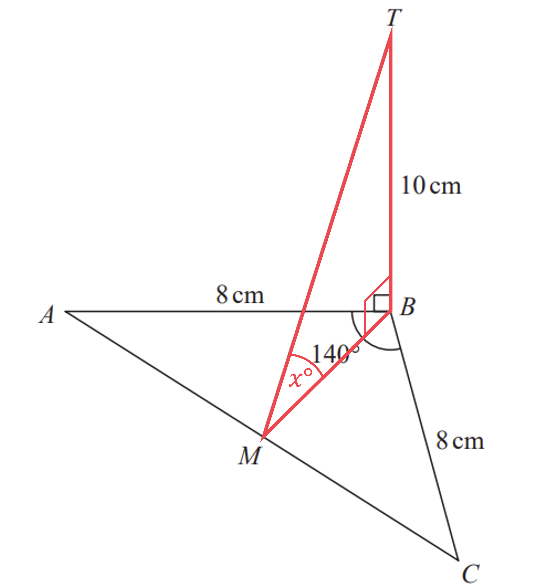

> *In order to find the required angle you will first need to find the length of the side **MB**.*

> *Triangle **ABC**  is isosceles as **AB **= **BC** = 8 cm. Therefore we can divide triangle **ABC** in two, to form two right-angle triangles. One of the right-angle triangles is shown below. Angle **ABC** is bisected so we know that angle **MBC** is 70°:*

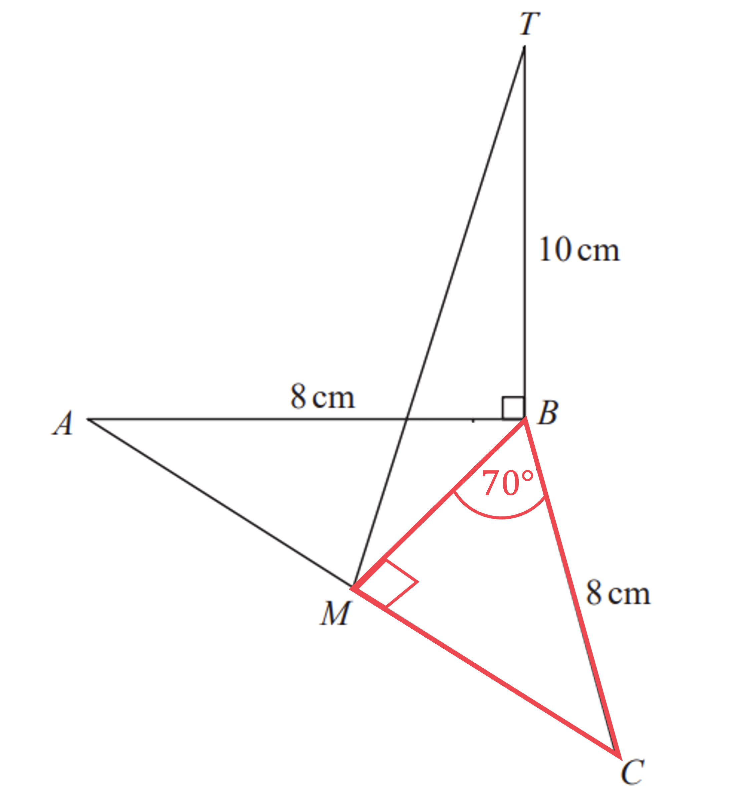

> *Now we can find **MB** as we have an angle and a hypotenuse in a right-angle triangle. We need the adjacent side, so use the cosine ratio.*

`cos open parentheses 70 close parentheses equals fraction numerator M B over denominator 8 end fraction`

**[1]**

> *Multiply both sides by 8*

`table row cell M B end cell equals cell 8 cos open parentheses 70 close parentheses end cell row blank equals cell 2.736161147... end cell end table`

**[1]**

> *It's best to store this result as an exact value on your calculator. We can mark it on the diagram:*

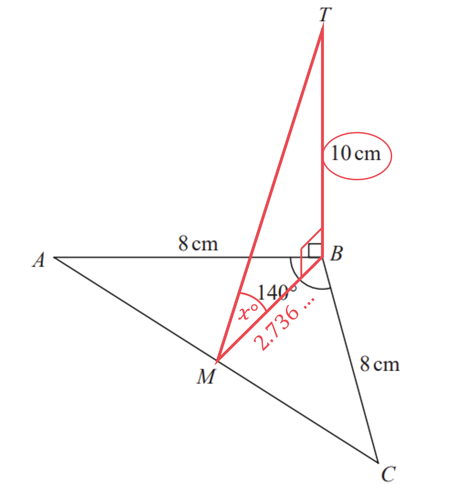

> *Now we have two known sides on a right-angle triangle; the adjacent (2.736...) and the opposite (10, circled above). Use the tangent ratio to find the required angle.*

`table row cell tan open parentheses x close parentheses end cell equals cell fraction numerator 10 over denominator 2.736... end fraction end cell end table`

**[1]**

> *Use the inverse tangent function ("SHIFT tan") on your calculator to find **x.*

`table row x equals cell tan to the power of negative 1 end exponent open parentheses fraction numerator 10 over denominator 2.736... end fraction close parentheses end cell end table`

> *Round your answer to 1 decimal place as requested. Remember to include the units.*

**Answer = 74.7°**  **[1]**

## Q3 — medium — 4 marks · exam-questions

### 18() — 4 marks
> *To find the angle between a line and a plane it is helpful to draw a right angled triangle using the line that is perpendicular to the plane.*

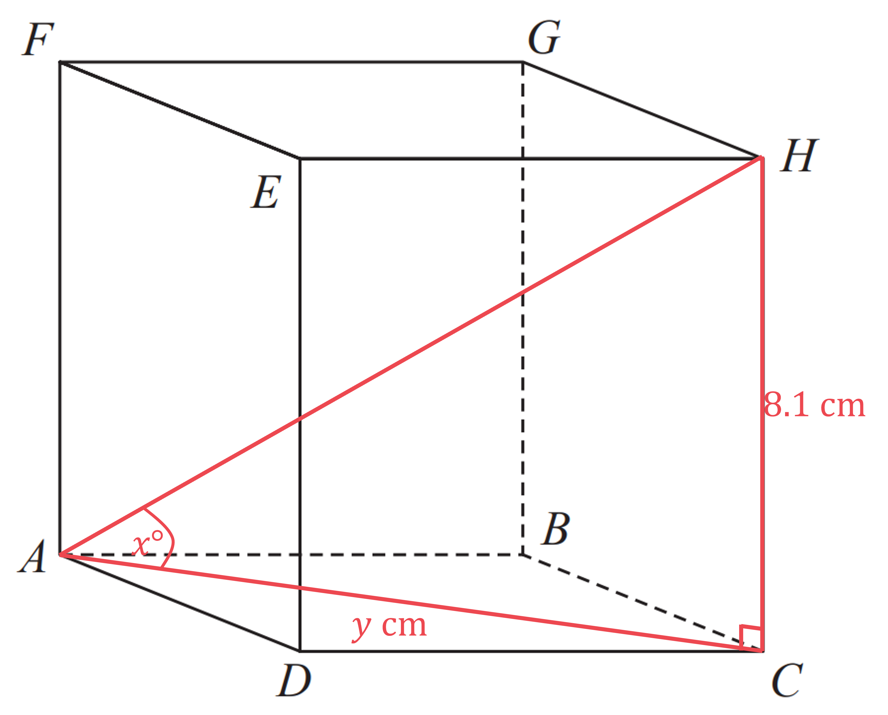

> *In order to find the required angle you will first need to find the length of the side **AC**. To do this draw a right angled triangle using the other information you are given.*

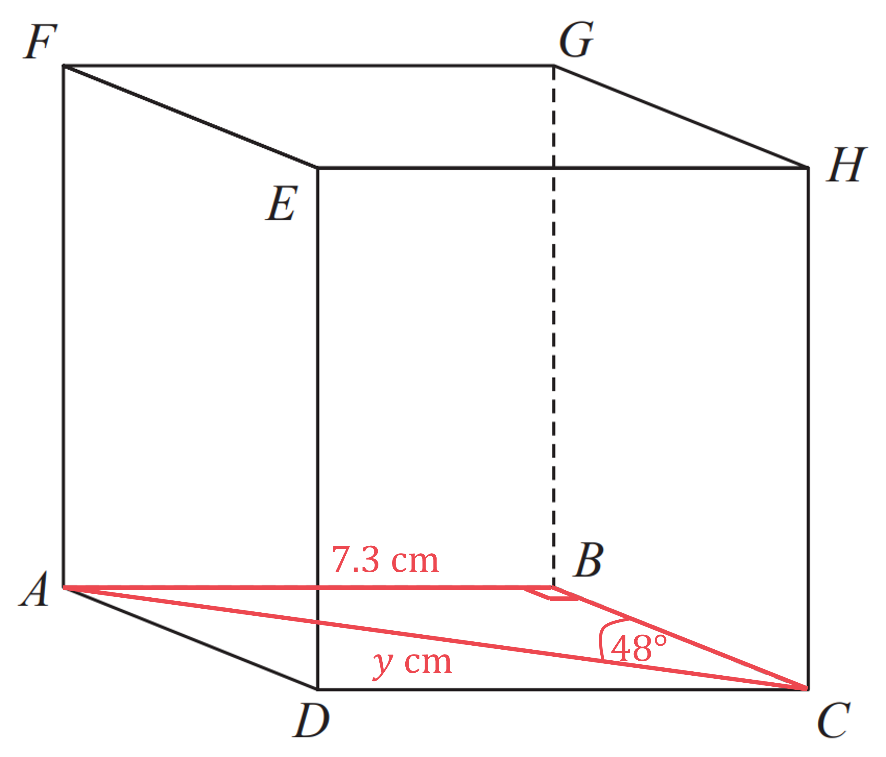

> *In the triangle **ABC** you know an angle and the length of the side opposite. You want to find the hypotenuse so use the sin ratio.*

`sin open parentheses 48 close parentheses equals fraction numerator 7.3 over denominator x end fraction`

**[1]**

> *Multiply both sides by **x** and divide by sin(48).*

`table attributes columnalign right center left columnspacing 0px end attributes row x equals cell fraction numerator 7.3 over denominator sin open parentheses 48 close parentheses end fraction end cell row blank equals cell 9.823118... end cell end table`

**[1]**

> *Now you can use the triangle **CAH**. In this triangle you want to find an angle and you know the lengths of the sides that are opposite and adjacent to the angle so use the tan ratio. Use the answer button or the exact value for the length of the side **AC**.*

`tan open parentheses x close parentheses equals fraction numerator 8.1 over denominator 9.823118... end fraction`

**[1]**

> *Find the angle by using the inverse tan function.*

`table row x equals cell tan to the power of negative 1 end exponent open parentheses fraction numerator 8.1 over denominator 9.823118... end fraction close parentheses end cell row blank equals cell 39.508492... end cell end table`

> *Round your answer to 1 decimal place. Remember to include the units.*

$\mathrm{Angle} \mathrm{between}AH\mathrm{and} \mathrm{the} \mathrm{plane}ABCD=39.5^{\circ}(1\mathrm{dp})$ **[1]**

## Q4 — very_hard — 3 marks · exam-questions

### 17((b)) — 3 marks
> *To identify the angle between a line and a plane it is helpful to draw a right angled triangle using **AD** and the line that is perpendicular to the plane:*

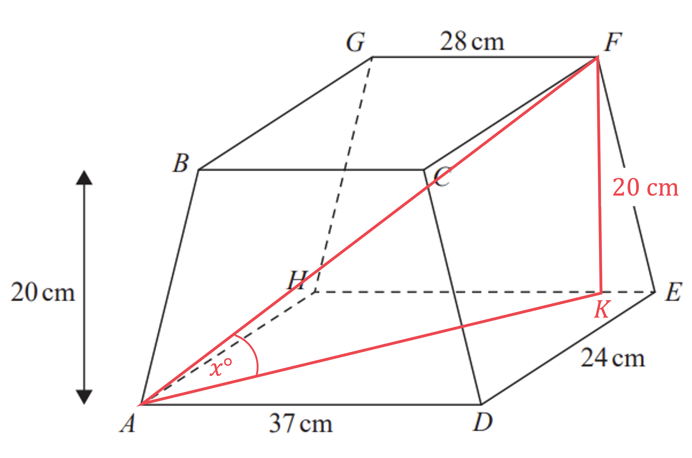

> *We have added **K **to the diagram. To find **x**, we need to obtain the length **AK **so we can consider triangle **AHK**:*

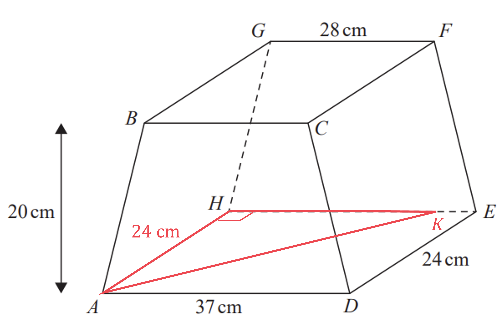

> *In right-angle triangle **AHK**, we already have length **AH** so to find **AK** we need length **HK.** We can deduce **HK** by considering trapezium **EFGH**:*

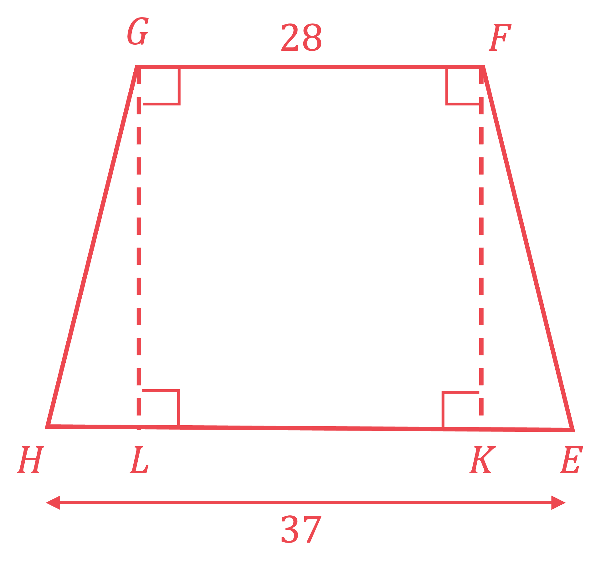

$HL=KE\mathrm{and}HL+KE=37-28\,KE=\frac{37-28}{2}=4.5\,HK=37-4.5=32.5$

> *Now we can find **AK **using Pythagoras' Theorem in triangle **AHK **(our second diagram).*

`table row cell A K end cell equals cell square root of A H squared plus H K squared end root end cell row blank equals cell square root of 24 squared plus 32.5 squared end root end cell row blank equals cell 40.40111385... end cell end table`

**[1]**

> *(This mark was hard won! But the remaining two marks are now close!)*

> *Save this result in your calculator to preserve accuracy. *
*Find **x** using triangle **AFK **(our first diagram) and the tangent ratio.*

`tan open parentheses x close parentheses equals fraction numerator 20 over denominator 40.40111385... end fraction`

**[1]**

> *Use the inverse tangent function ("SHIFT tan" on your calculator) to find the required angle.*

`table row x equals cell tan to the power of negative 1 end exponent open parentheses fraction numerator 20 over denominator 40.40111385... end fraction close parentheses end cell row blank equals cell 26.33706009... end cell end table`

> *Round your answer to 1 decimal place as requested. Remember to include the units.*

**Answer = **$26.3^{\circ}$ **[1]**

## Q5 — hard — 4 marks · exam-questions

### 22() — 4 marks
> *To identify the angle between a line and a plane it is helpful to draw a right angled triangle using **AD **and the line that is perpendicular to the plane:*

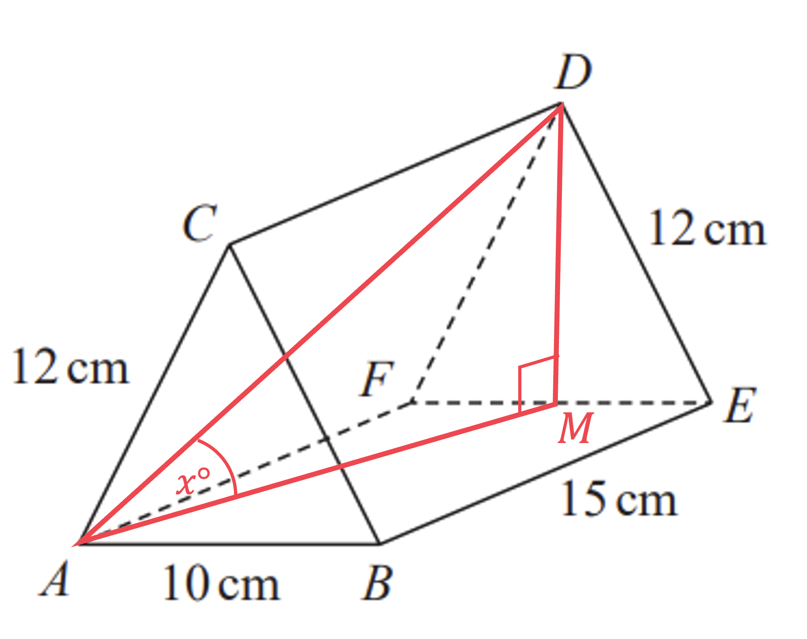

> *Triangle** EDF** is isosceles so **M** is the midpoint of **FE. **In order to find the required angle we need to find two lengths on triangle **AMD**. We will find **DM** and **AM** as follows.*

> *We can draw two new right-angle triangles to help us find sides **DM** and **AM **as below. Because **M **is the midpoint of **FE**, we know that **FM **= **ME **= 5cm.*

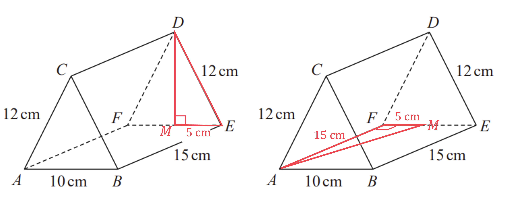

> *We can see from the diagrams that to find **DM** and **AM**, we can use Pythagoras' Theorem with two different triangles.*

$DM=\sqrt{12^{2}-5^{2}}=\sqrt{119}$

**[1]**

$AM=\sqrt{15^{2}+5^{2}}=5\sqrt{10}$

**[1]**

> *We can mark these results on our diagram:*

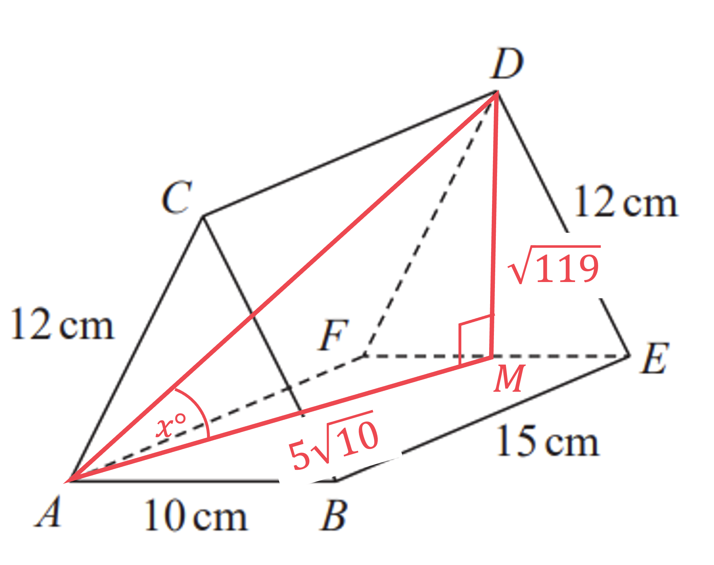

> *Now we have the opposite and adjacent side so can use the tangent ratio to find the required angle*

`table row cell tan open parentheses x close parentheses end cell equals cell fraction numerator square root of 119 over denominator 5 square root of 10 end fraction end cell end table`

**[1]**

> *Use the inverse tangent function ("SHIFT tan" on your calculator) to find the required angle*

`table attributes columnalign right center left columnspacing 0px end attributes row x equals cell tan to the power of negative 1 end exponent open parentheses fraction numerator square root of 119 over denominator 5 square root of 10 end fraction close parentheses end cell row blank equals cell 34.60286258... end cell end table`

> *Round your answer to 3 significant figures as requested. Remember to include the units.*

**Answer = **$34.6^{\circ}$ **[1]**

## Q6 — medium — 3 marks · exam-questions

### 19() — 3 marks
> *To identify the angle between a line and a plane it is helpful to draw a right angled triangle using the line that is perpendicular to the plane:*

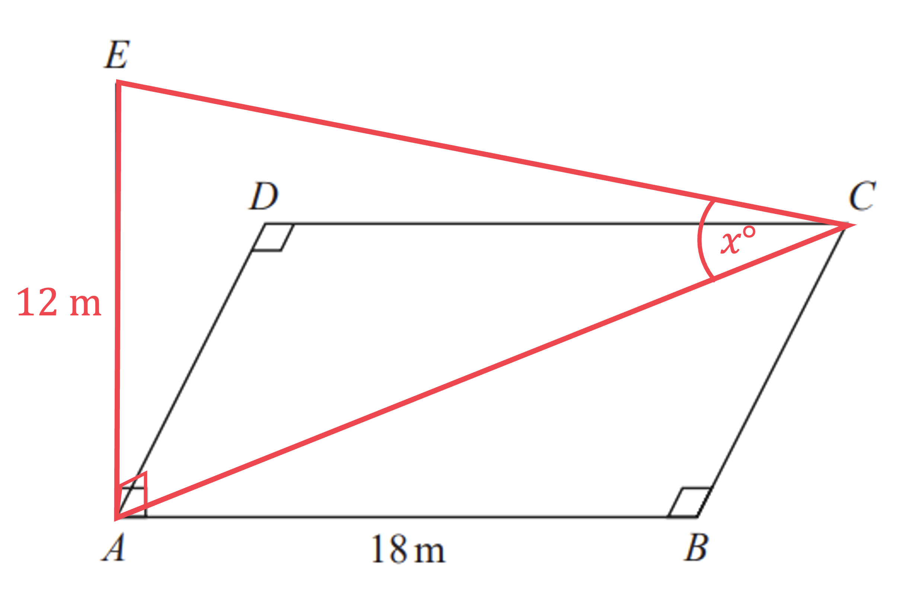

> *We need to find angle **x**. Notice that we have side **AE.** In order to find the required angle we first need to find the length of the side **AC**. To do this draw a right angled triangle connecting hypotenuse **AC** with sides whose lengths are known:*

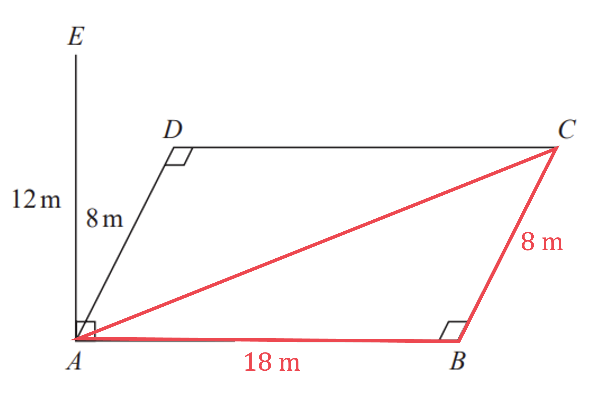

> *In triangle **ABC** we can use Pythagoras' Theorem to find **AC.*

$AC=\sqrt{18^{2}+8^{2}}$

**[1]**

$=2\sqrt{97}$

> *It is best to leave this result in its exact form for accuracy. We can add this result to our diagram:*

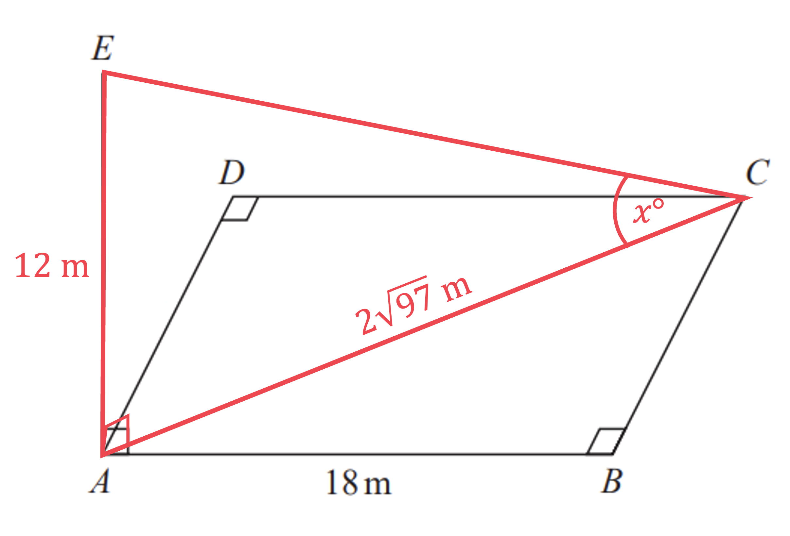

> *Now we can use right-angle trigonometry to find the required angle.*

`table row cell tan open parentheses x close parentheses end cell equals cell fraction numerator 12 over denominator 2 square root of 97 end fraction end cell end table`

**[1]**

> *Use the inverse tangent function ("SHIFT tan" on your calculator) to find **x.*

`table row x equals cell tan to the power of negative 1 end exponent open parentheses fraction numerator 12 over denominator 2 square root of 97 end fraction close parentheses end cell row blank equals cell 31.35009472... end cell end table`

> *Round your answer to 1 decimal place as requested. Remember to include the units.*

**Answer = **$31.4^{\circ}$ **[1]**

## Q7 — very_hard — 5 marks · exam-questions

### 21() — 5 marks
> *Start by marking the information given on the diagram. We don't know any lengths but we can assign arbitray values so long as they are kept in the given ratios. *
*We can start by labeling the smallest known segments, **GM **and **MF**, as** **"1". *
*We can also mark angle **MAJ** as **y**.*

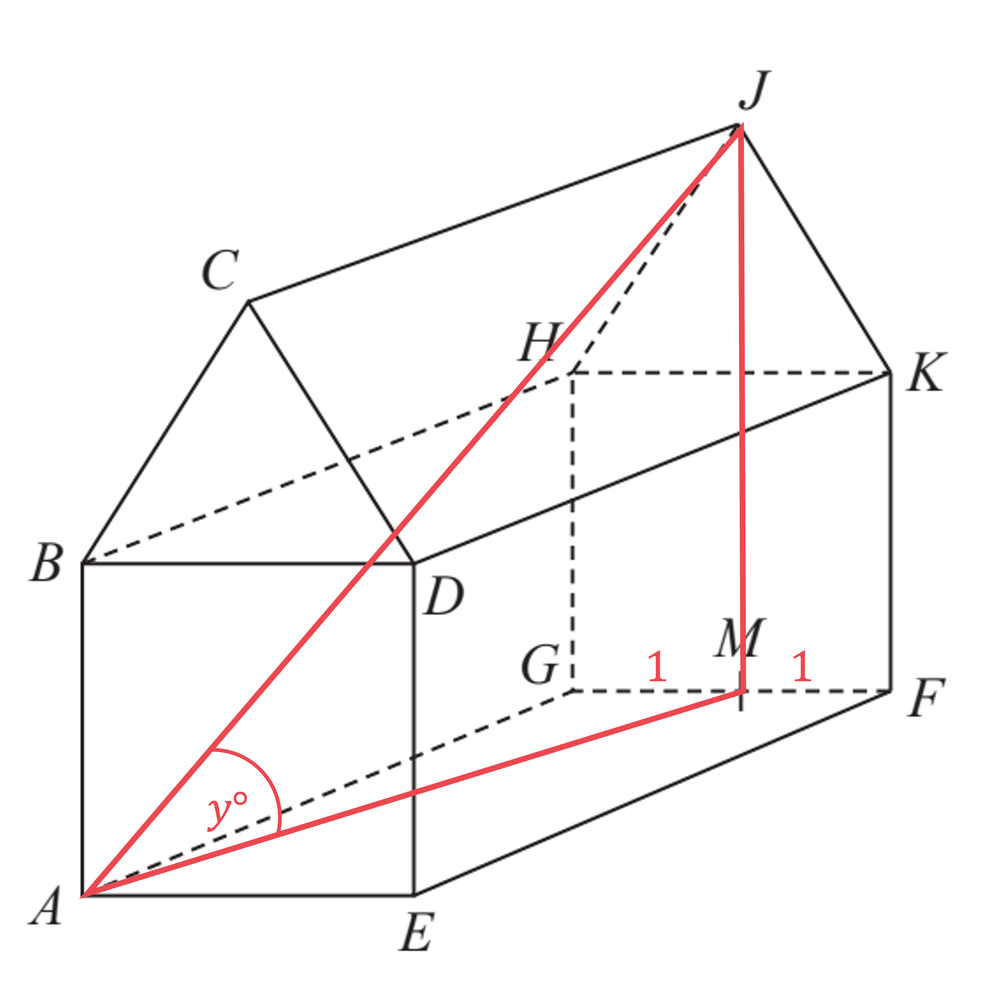

> *To find **y**, we need to find two lengths on triangle **AJM**. *

> *First, we will find **AM**.*

> *If **GM **= **MF **= 1 then **GF **= 2 so **AE **= 2.  *
*From the question**, EF** = 2 × **AE** so **EF** = **AG **= 4.*

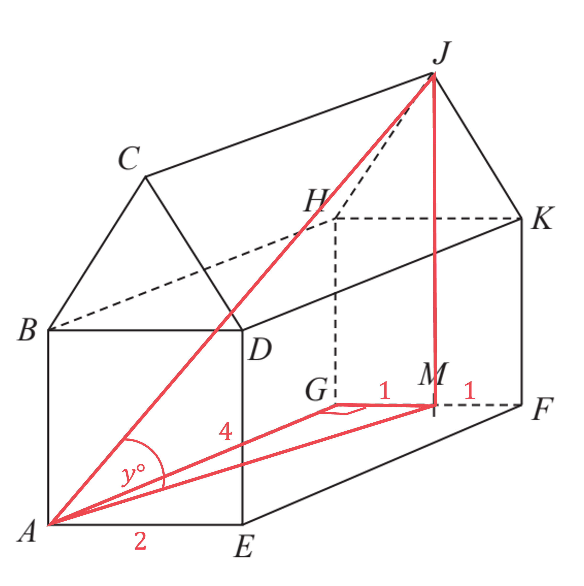

> *Using Pythagoras' Theorem with triangle **AGM**, we can find **AM**. *

`table row cell A M end cell equals cell square root of 1 squared plus 4 squared end root end cell row blank equals cell square root of 1 plus 16 end root end cell row blank equals cell square root of 17 end cell end table`

**[1]**

> *Now we turn our attention to finding **MJ**.*

> *Add a point **N** to the line **HK** directly above **M**. Triangle **HJK** is equilateral so **NK** = 1 and **JK **= 2:*

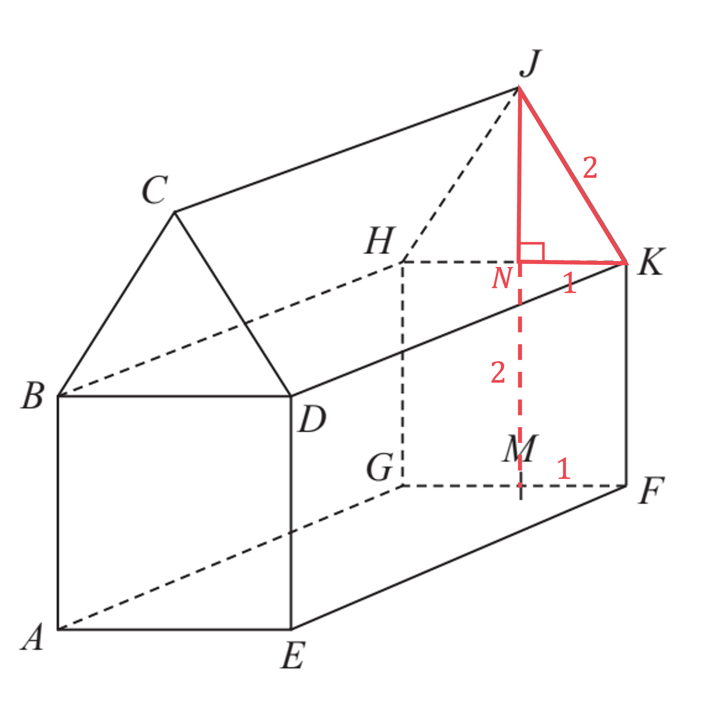

> *Using Pythagoras' Theorem with triangle **JKN, **we can find **JN*

`table row cell J N end cell equals cell square root of 2 squared minus 1 squared end root end cell row blank equals cell square root of 4 minus 1 end root end cell row blank equals cell square root of 3 end cell end table`

**[1]**

> *We add **MN** and **JN** to get **MJ.*

`table row cell M J end cell equals cell square root of 3 plus 2 end cell end table`

> *Mark **MJ **and **AM** on triangle **AMJ.*

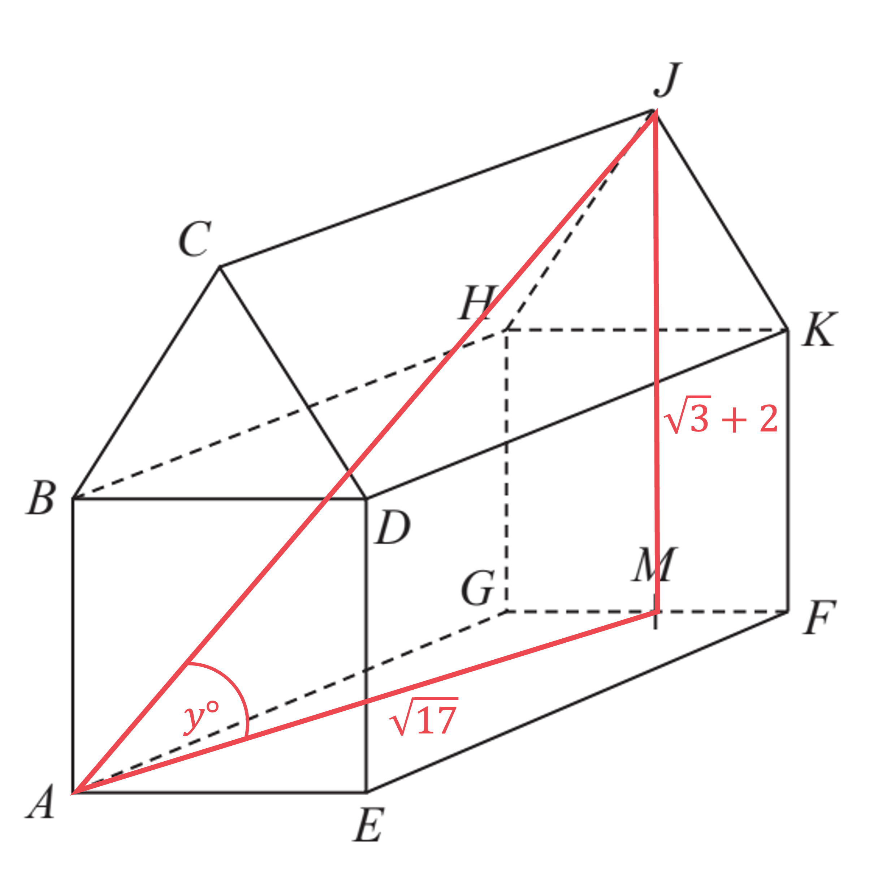

> *Now we can use trigonometry with triangle** AMJ** to find the value of tan(y), or **T**.*

`table attributes columnalign right center left columnspacing 0px end attributes row T equals cell tan open parentheses y close parentheses equals fraction numerator square root of 3 plus 2 over denominator square root of 17 end fraction end cell end table`

**[1]**

> *Finally we need to rationalise the denominator*

`table row T equals cell fraction numerator square root of 17 open parentheses square root of 3 plus 2 close parentheses over denominator square root of 17 square root of 17 end fraction end cell row blank equals cell fraction numerator square root of 51 plus 2 square root of 17 over denominator 17 end fraction end cell end table`

**[1]**

> *We are almost there! We need to write the answer in the form requested. 2 is the same as √4 so...*

`table row blank equals cell fraction numerator square root of 51 plus square root of 4 square root of 17 over denominator 17 end fraction end cell row blank equals cell fraction numerator square root of 51 plus square root of 68 over denominator 17 end fraction end cell end table`

`bold italic T table row blank bold equals blank end table table row blank blank cell fraction numerator square root of bold 51 bold plus square root of bold 68 over denominator bold 17 end fraction end cell end table` **[1]**

## Q8 — hard — 6 marks · exam-questions

### 21((a)) — 3 marks
> *Look at the base from above and find the length **FH** using Pythagoras' theorem on the right-angled triangle **FHE**.*

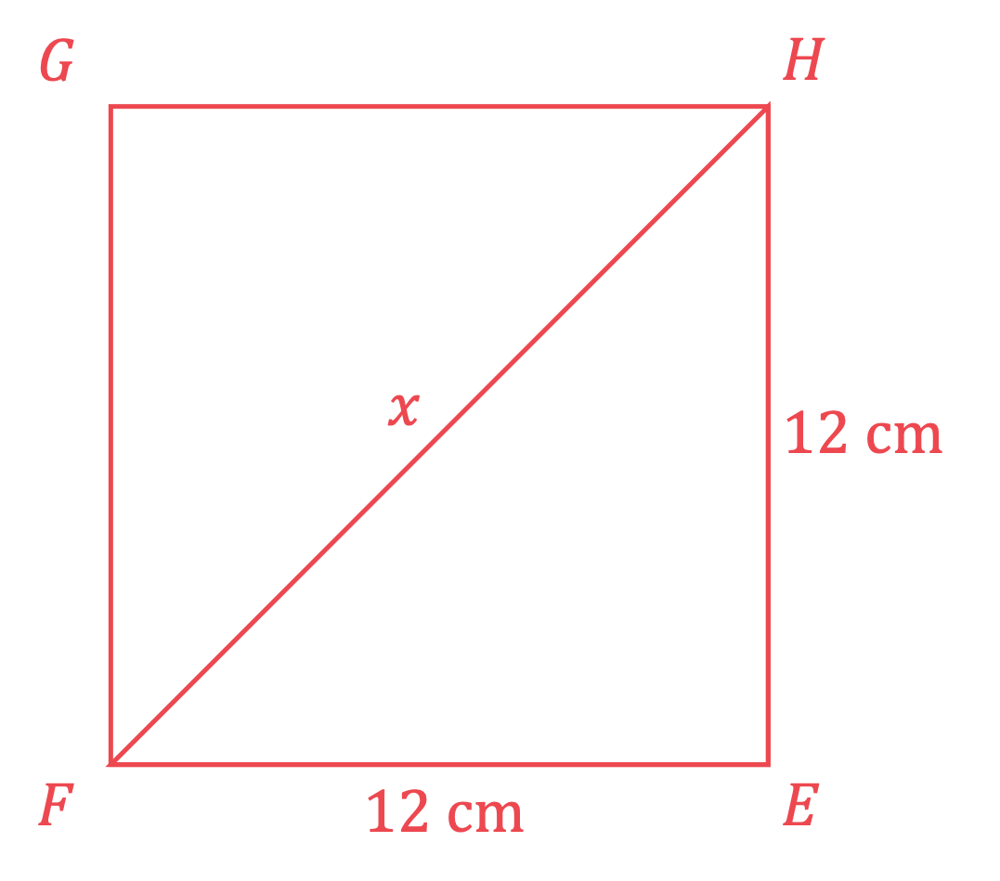

`table row cell x squared end cell equals cell 12 squared plus 12 squared end cell row cell x squared end cell equals 288 row x equals cell square root of 288 end cell end table`

**[1]**

> *Use trigonometry on the right-angled triangle **FCH**. *

> *You know the opposite side and the adjacent side, so use *$\mathrm{tan}θ=\frac{Opp}{Adj}$*.*

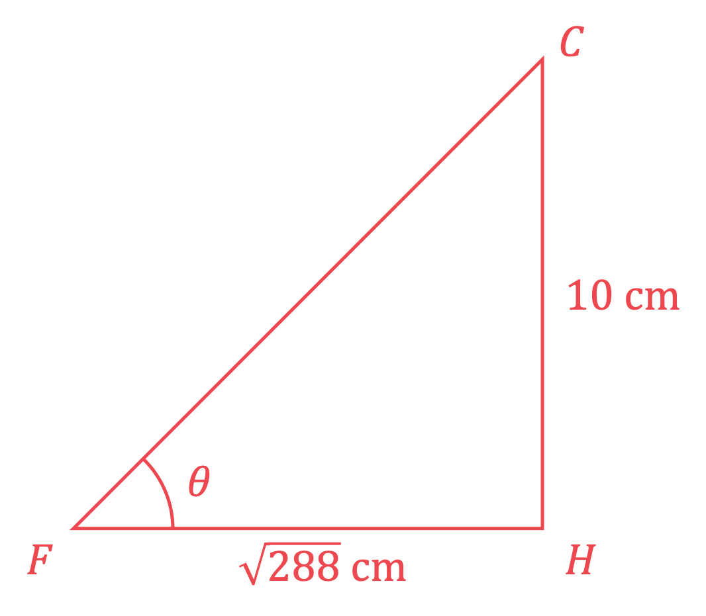

`table row cell tan space theta end cell equals cell fraction numerator 10 over denominator square root of 288 end fraction end cell end table`

**[1]**

`table row theta equals cell tan to the power of negative 1 end exponent open parentheses fraction numerator 10 over denominator square root of 288 end fraction close parentheses end cell row theta equals cell 30.5089... end cell end table`

**30.5****o**** ****[1]**

### 21((b)) — 3 marks
> *Looking at the face **BCHG**, split the trapezium into a right-angled triangle and a rectangle.*

> *Use Pythagoras' theorem to calculate the length **BP.*

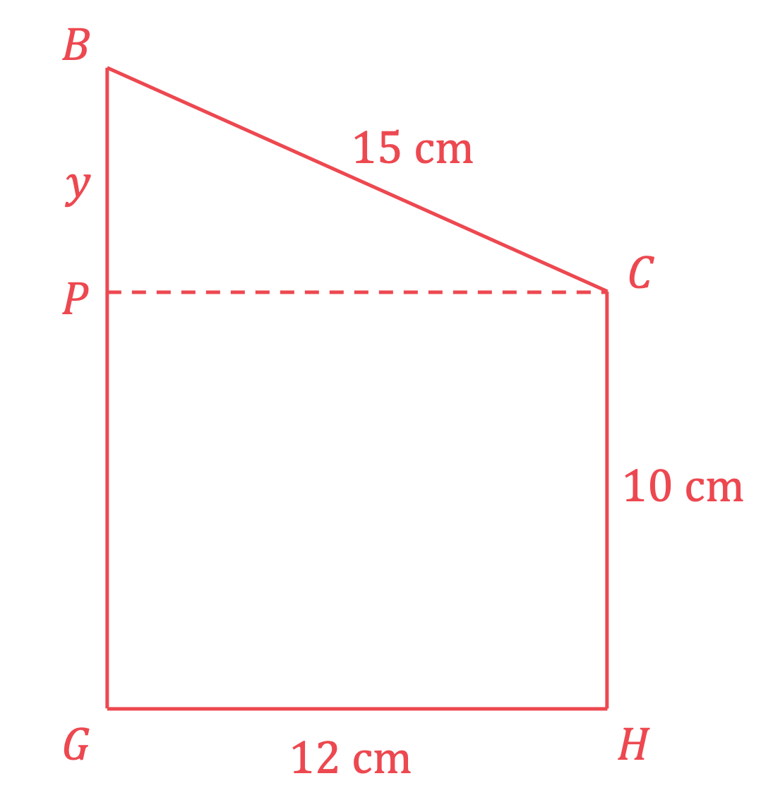

`table attributes columnalign right center left columnspacing 0px end attributes row cell y squared end cell equals cell 15 squared minus 12 squared end cell row cell y squared end cell equals 81 row y equals 9 end table`

> *Add the length **BP** to the length **GP** to find the length **BG**.*

$BG=9+10=19$

**[1]**

> *Sketch the right-angled triangle **BEG**. *
*EG** = **FH** = *$\sqrt{288}$*.*

> *Use Pythagoras' theorem to calculate the length **BE**.*

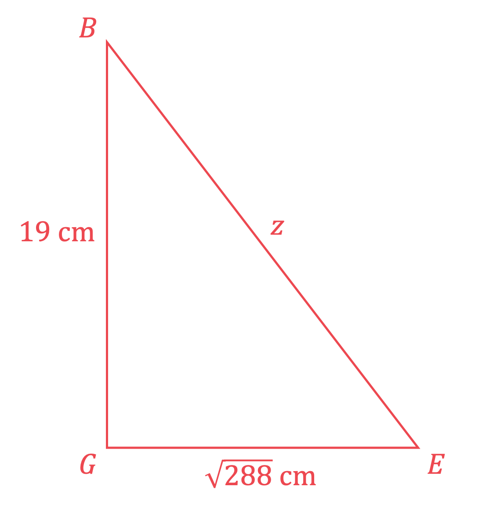

`table row cell z squared end cell equals cell 19 squared plus open parentheses square root of 288 close parentheses squared end cell row cell z squared end cell equals 649 row z equals cell 25.4754... end cell end table`

**[1]**

**25.5 cm** **[1]**

**Answers between 25.4 and 25.6 will be accepted**

## Q9 — medium — 4 marks · exam-questions

### 19() — 4 marks
> *To identify the angle between a line and a plane it is helpful to draw a right angled triangle using the line that is perpendicular to the plane.*

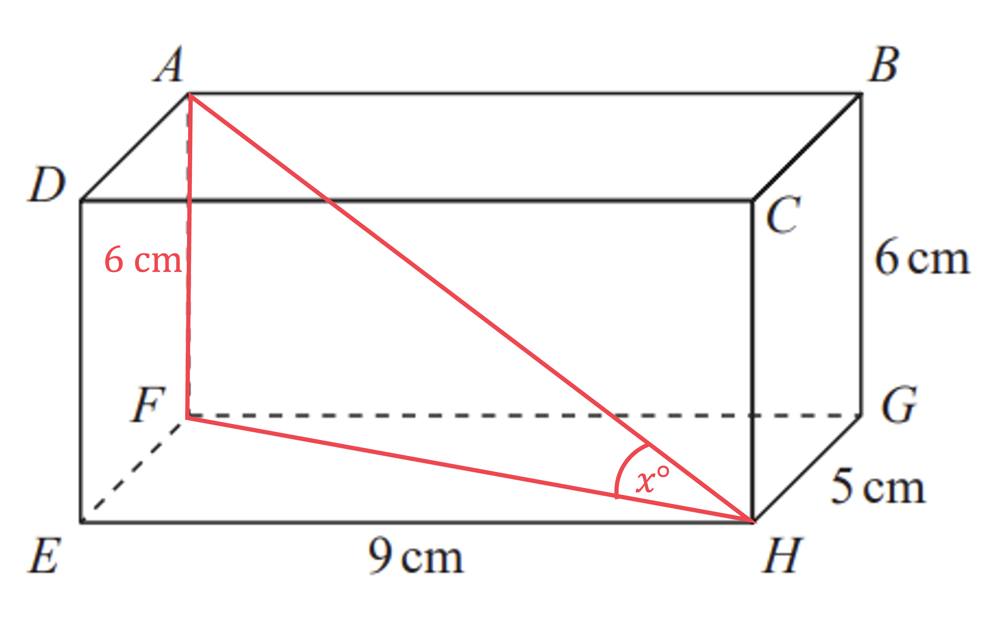

> *We need to find angle **x**. Notice that we have side **AF.** In order to find the required angle we first need to find the length of the side **FH**. To do this draw a right angled triangle connecting hypotenuse **FH** with two sides whose lengths are known.*

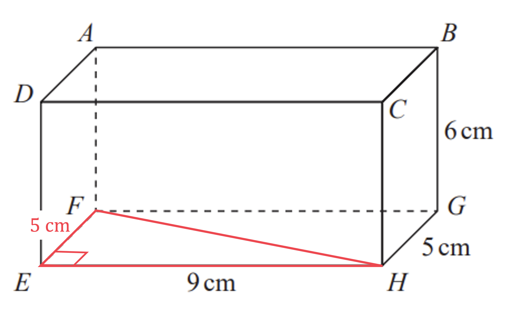

> *In triangle **EFH **we can use Pythagoras' Theorem to find **FH.*

$FH=\sqrt{9^{2}+5^{2}}$

**[1]**

$=\sqrt{106}$

> *It is best to leave this result in its exact form for accuracy. We can add this result to our diagram.*

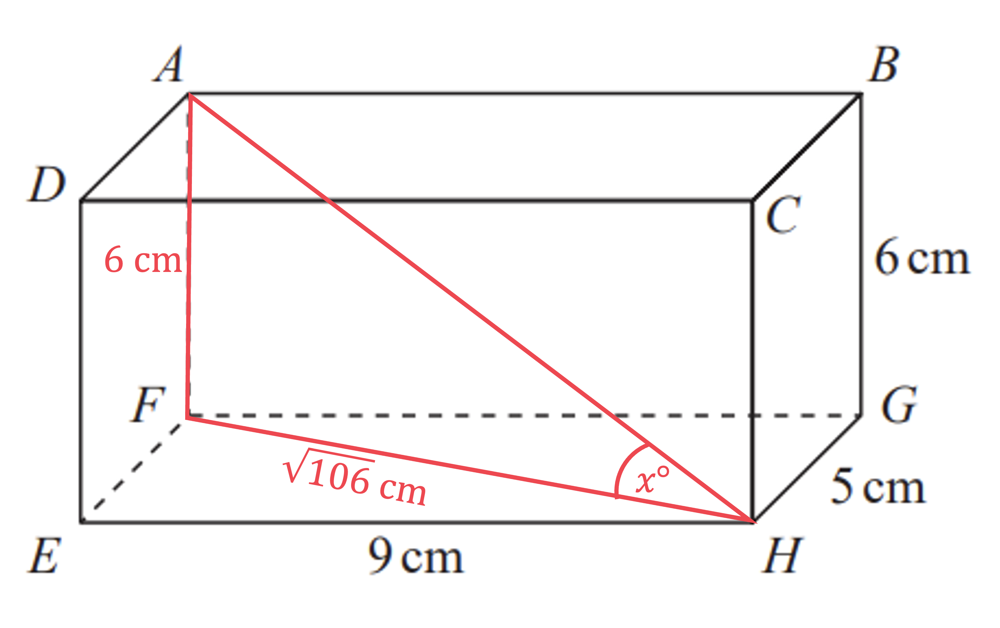

> *Now we can use right-angle trigonometry to find the required angle.*

`table row cell tan open parentheses x close parentheses end cell equals cell fraction numerator 6 over denominator square root of 106 end fraction end cell end table`

**[1]**

> *Use the inverse tangent function ("SHIFT tan" on your calculator) to find **x.*

`table row x equals cell tan to the power of negative 1 end exponent open parentheses fraction numerator 6 over denominator square root of 106 end fraction close parentheses end cell end table`

**[1]**

`table row blank equals cell 30.23241412... end cell end table`

> *Round your answer to 3 significant figures as requested. Remember to include the units.*

**Answer = **$30.2^{\circ}$ **[1]**

## Q10 — very_hard — 7 marks · exam-questions

### 18((a)) — 4 marks
> *Draw the stick on the diagram such that it extends from a bottom corner through the diagonally opposite top corner and out of the crate.  *
*Let the length of the stick inside the crate be **x **cm, then the length of the stick outside of the crate will be 95 - **x **cm.*

> *It also may help to add the right-angled triangles that the diagonal makes with the edges onto the diagram.*

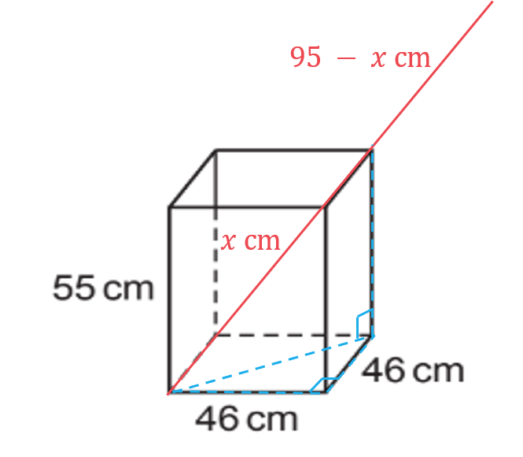

> *Use Pythagoras' theorem, *$a^{2}+b^{2}=c^{2}$*, on the right-angled triangle on the base of the crate to find length of the diagonal on the base.*

`table row cell 46 squared space plus space 46 squared space end cell equals cell space c squared end cell end table`

**[1]**

`table row cell c squared space end cell equals cell space 2 open parentheses 46 squared close parentheses space end cell row blank equals cell space 4232 end cell row cell c space end cell equals cell square root of 4232 space end cell row blank equals cell space 46 square root of 2 space cm end cell end table`

**[1]**

> *Use Pythagoras' theorem on the right-angled triangle made up of the diagonal at the base, the side with length 55 cm and the diagonal made by the part of the stick inside the crate, **x.*

`table row cell open parentheses 46 square root of 2 close parentheses squared space plus space 55 squared space end cell equals cell space x squared end cell row cell 4232 space plus space 3025 end cell equals cell space x squared end cell row cell x squared space end cell equals cell space 7257 end cell row cell x space end cell equals cell square root of 7257 space cm end cell end table`

**[1]**

> *Calculate the length of the stick that extends out of the crate by subtracting **x** from the length of the stick.*

`table row cell 95 space minus space x space end cell equals cell space 95 space minus space square root of 7257 space end cell row blank equals cell space 95 space minus space 85.188027... space end cell end table`

$9.81\mathrm{cm}$* ***[1]**

### 18((b)) — 3 marks
> *To find the angle between a line and a plane it is helpful to draw a right angled triangle using the line that is perpendicular to the plane.*

> *Add the lengths that are known either from the question or found in part (a) to the diagram.*

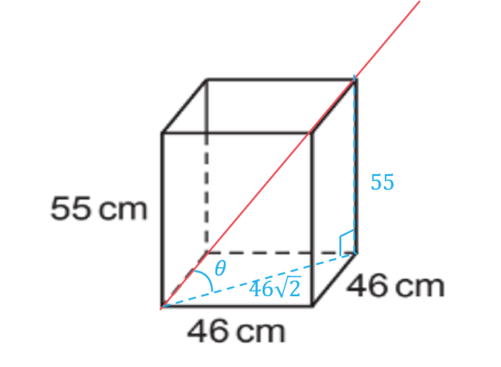

**Indicating correct angle ****[1]**

> *In the triangle you know the length of the side opposite the angle and the length of the side adjacent to the angle so use the tan ratio. Use the exact value found in part (a) for the length of the diagonal of the base.*

`tan open parentheses theta close parentheses equals straight O over straight A space equals space fraction numerator 55 over denominator 46 square root of 2 end fraction`

**[1]**

> *Find the angle by using the inverse tan function.*

`table row cell theta space end cell equals cell space tan to the power of negative 1 end exponent open parentheses fraction numerator 55 over denominator 46 square root of 2 end fraction close parentheses end cell row blank equals cell 40.212974... end cell end table`

> *Round your answer to 1 decimal place. Remember to include the units.*

$\mathrm{Angle}=40.2^{\circ}(1\mathrm{dp})$ **[1]**

## Q11 — hard — 6 marks · exam-questions

### 25((a)) — 2 marks
*Triangle** BCD** is a right-angled triangle, so SOHCAHTOA can be used* 
*Use tan **x** = *$\frac{\mathrm{opp}}{\mathrm{adj}}$* * * *

$\mathrm{tan}6=\frac{CD}{500}$

**[1]**

*Multiply both sides by 500 to calculate the length **CD* * *

$500\mathrm{tan}6=CD$

**52.6 m** **[1]**

**Answers between 52.5 and 52.6 are accepted (and so is the rounded answer 53)**

### 25((b)) — 4 marks
*On the diagram, label angle **DAC** as **x**, mark on **CD **= 52.6 from part (a) and highlight triangle **DAC* * *

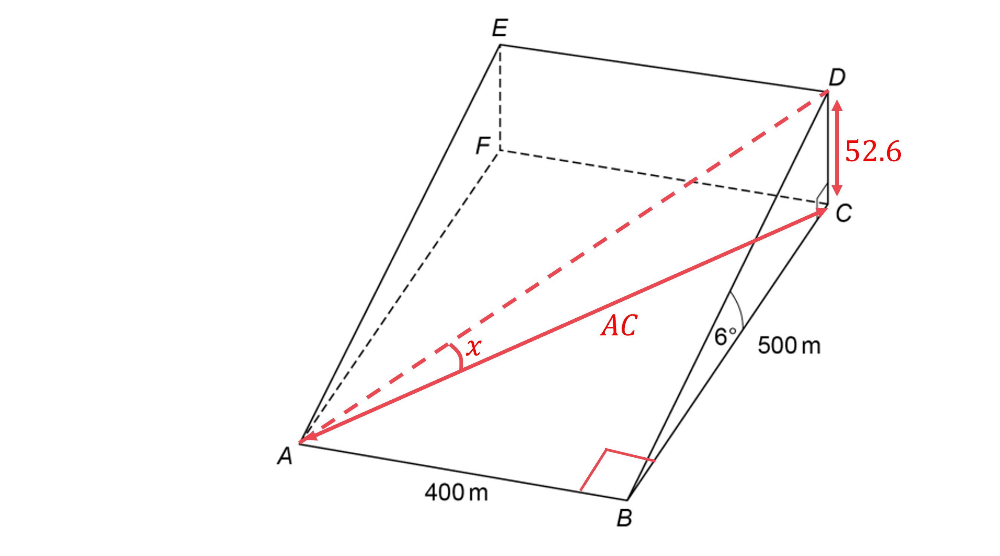

> * *

*Triangle **DAC **is right-angled at **C** so SOHCAHTOA can be used* 
*Use tan **x** = *$\frac{\mathrm{opp}}{\mathrm{adj}}$ * *

$\mathrm{tan}x=\frac{52.6}{AC}$ * *

> *Find **AC** using Pythagoras' Theorem in the rectangle **ABCF  *

$AC^{2}=500^{2}+400^{2}\,AC=\sqrt{500^{2}+400^{2}}\,AC=640.3...$

**500****2**** + 400****2**** seen**** [1]**

**AC correct ****[1]**

> *Substitute this into the expression for tan **x *

$\mathrm{tan}x=\frac{52.6}{640.3...}$

**[1]*** *

*Take inverse tan of both sides* * *

`x equals tan to the power of negative 1 end exponent open parentheses fraction numerator 52.6 over denominator 640.3... end fraction close parentheses`

**4.7°** **[1]**

**Answers between 4.6° and 4.75° are accepted (and so is the rounded answer 5°)**

## Q12 — medium — 3 marks · exam-questions

### 19() — 3 marks
> *To find the angle between a line and a plane it is helpful to draw a right angled triangle using the line that is perpendicular to the plane:*

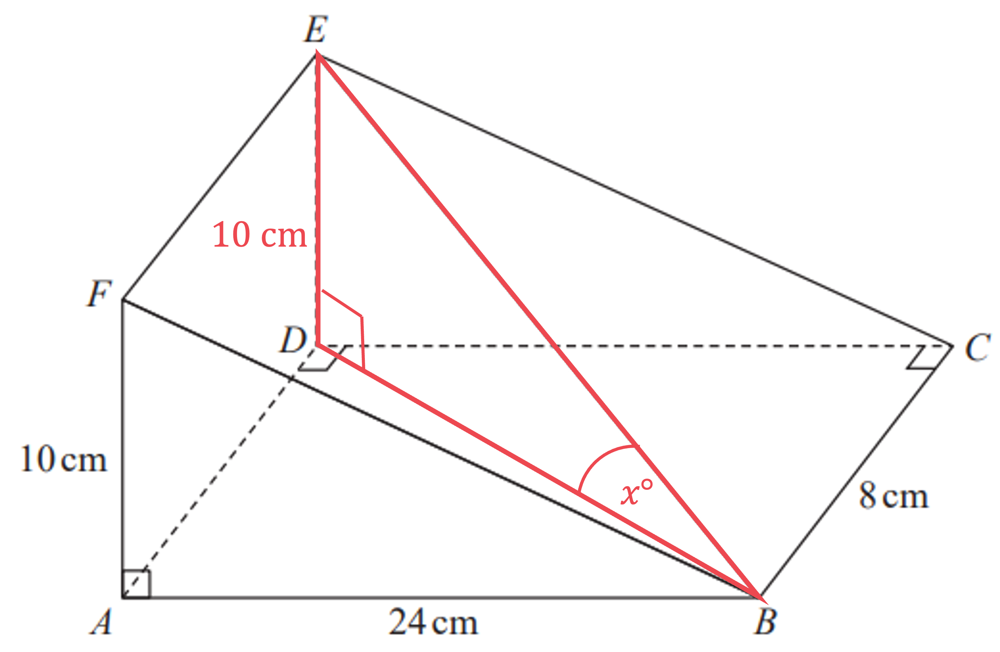

> *In order to find the required angle you will first need to find the length of the side **DB**. To do this draw a right angled triangle joining **DB** with two other known sides:*

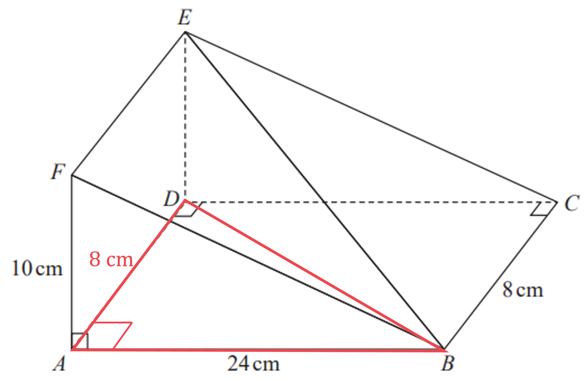

> *Now we can use Pythagoras to find **DB**.*

`table row cell D B squared end cell equals cell 8 squared plus 24 squared end cell row cell D B end cell equals cell square root of 8 squared plus 24 squared end root end cell row blank equals cell 8 square root of 10 end cell end table`

**[1]**

> *Mark this length on the diagram*

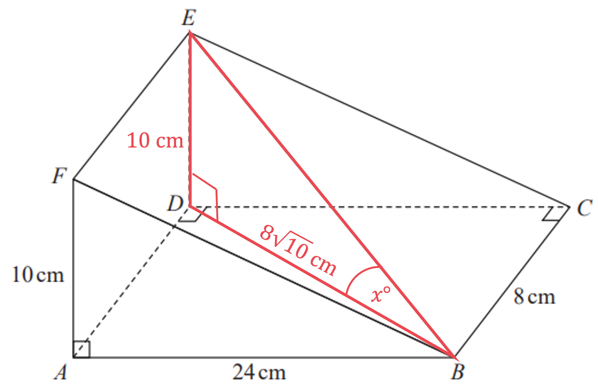

> *Now we know the opposite and adjacent sides in a right-angle triangle so use the tangent ratio to find the required angle*

`tan open parentheses x close parentheses equals fraction numerator 10 over denominator 8 square root of 10 end fraction`

**[1]**

> *Find the angle by using the inverse tan function ("SHIFT tan" on your calculator)*

`table row x equals cell tan to the power of negative 1 end exponent open parentheses fraction numerator 10 over denominator 8 square root of 10 end fraction close parentheses end cell row blank equals cell 21.5681294... end cell end table`

> *Round your answer to 1 decimal place as requested. Remember to include the units*

**Answer = **$21.6^{\circ}$ **[1]**

## Q13 — very_hard — 4 marks · exam-questions

### 21() — 4 marks
> *Drawing a diagram of the angle we are trying to find using triangle *$AMV$

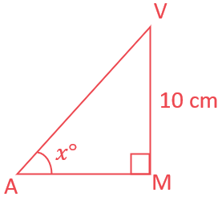

> *This would be solvable using tan if we knew the length of *$AM$

> *Considering the base of the pyramid*

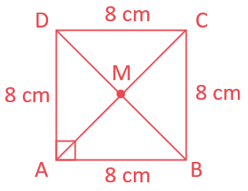

> *Find the length of the diagonals using Pythagoras*

$AC=\sqrt{8^{2}+8^{2}}=8\sqrt{2}$

**Finding diagonal length**** [1]**

> *Length *$AM$* is half the length of a diagonal*

$AM=4\sqrt{2}$

**Finding length that helps find angle**** [1]**

> *We can then fill this information in on the first diagram*

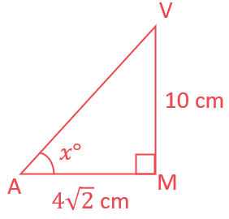

> *This can then be solved using the tan ratio; *$\text{tan}θ=\frac{\text{opposite}}{\text{adjacent}}$

`table row cell text tan end text x end cell equals cell fraction numerator 10 over denominator 4 square root of 2 end fraction end cell row x equals cell text tan end text to the power of negative 1 end exponent open parentheses fraction numerator 10 over denominator 4 square root of 2 end fraction close parentheses equals 60.5037915 degree end cell end table`

**Using tan ratio correctly**** [1]**

$60.5^{\circ}$ **[1] **
**Angles should be rounded to 1 decimal place**

## Q14 — hard — 6 marks · exam-questions

### 25() — 2 marks
*On the diagram, mark on **AE** = 17 and **AM** = 8 (as it is half of **AB** = 16)* * *

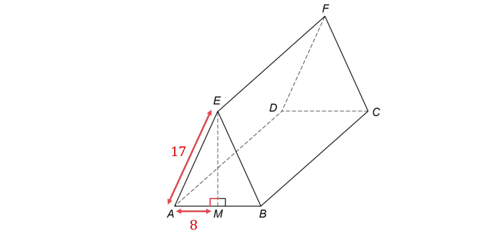

> * *

*Use Pythagoras' Theorem to find **EM**2* * *

`table attributes columnalign right center left columnspacing 0px end attributes row cell 8 squared plus E M squared end cell equals cell 17 squared end cell row cell E M squared end cell equals cell 17 squared minus 8 squared end cell end table`

**[1]*** *

> *Take square roots of both sides to find **EM*

`table row cell E M end cell equals cell square root of 17 squared minus 8 squared end root end cell row blank equals cell square root of 225 end cell end table`

**15** **[1]**

**Square rooting must be seen for the final mark, as it is a "show that" question**

### 25((b)) — 4 marks
*Triangle **ECM** is right-angled at **M** so SOHCAHTOA can be used* *Label angle **ECM **as** x** and write **EM** as 15 on the diagram, from part (a)*

*Method 1* * *

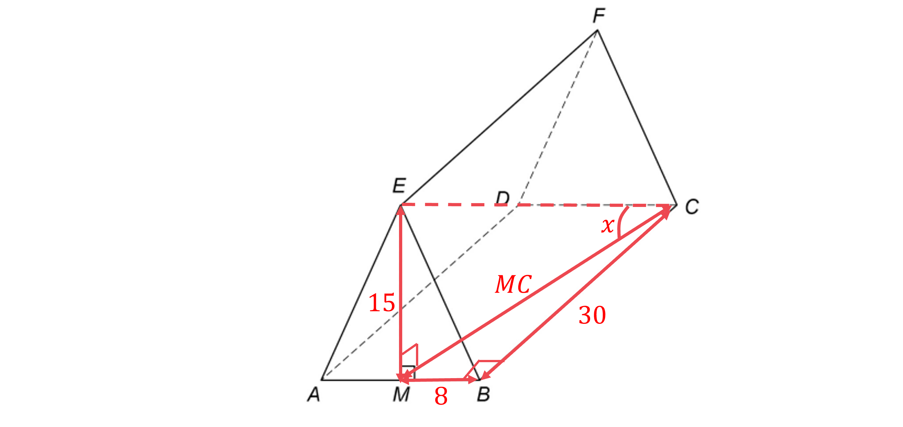

> * *

*Find **MC** using Pythagoras' Theorem in triangle **MBC* * *

`table row cell M C squared end cell equals cell 8 squared plus 30 squared end cell row cell M C end cell equals cell square root of 8 squared plus 30 squared end root end cell row cell M C end cell equals cell 31.048... end cell end table`

**correct under the square root ****[1] **** correct with the square root ****[1]**

*Use tan **x** = *$\frac{\mathrm{opp}}{\mathrm{adj}}$* in triangle** ECM* * *

$\mathrm{tan}x=\frac{15}{31.048...}$

**[1]*** *

*Find inverse tan of both sides*

`x equals tan to the power of negative 1 end exponent open parentheses fraction numerator 15 over denominator 31.048... end fraction close parentheses
x equals 25.78...`

**25.8°** **[1]**

**Answers between 25.7 and 26 are accepted**

*Method 2* * *

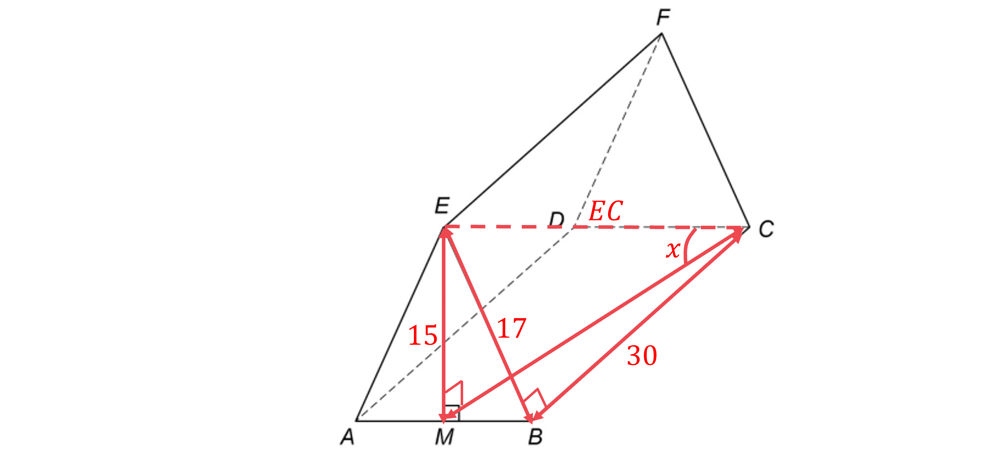

> * *

*Find **EC** using Pythagoras' Theorem in triangle **EBC* * *

`table row cell E C squared end cell equals cell 17 squared plus 30 squared end cell row cell E C end cell equals cell square root of 17 squared plus 30 squared end root end cell row cell E C end cell equals cell 34.481... end cell end table`

**correct under the square root ****[1] **** **
**correct with the square root ****[1]**

*Use sin **x** = *$\frac{\mathrm{opp}}{\mathrm{hyp}}$* in triangle** ECM* * *

$\mathrm{sin}x=\frac{15}{34.481...}$

**[1]*** *

*Find inverse sin of both sides*

`x equals sin to the power of negative 1 end exponent open parentheses fraction numerator 15 over denominator 34.481... end fraction close parentheses
x equals 25.78...`

**25.8°** **[1]**

**Answers between 25.7 and 26 are accepted**

## Q15 — medium — 1 marks · exam-questions

### 16((a)) — 1 marks
*Write the side-lengths on the diagram (it is a cube so they will all be **x**)* * *

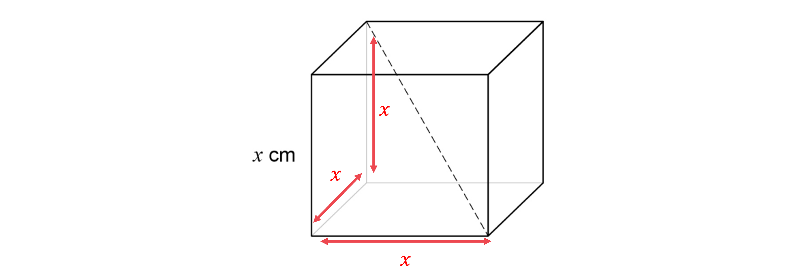

> * *

*Use the 3D Pythagoras rule, that  *$x^{2}+y^{2}+z^{2}=d^{2}$*, to find the length of the diagonal* * *

`table attributes columnalign right center left columnspacing 0px end attributes row cell x squared plus x squared plus x squared end cell equals cell d squared end cell row cell 3 x squared end cell equals cell d squared end cell end table` * *

*Square root both sides*

`table row cell square root of 3 x squared end root end cell equals d row cell square root of 3 space x end cell equals d end table`

$\sqrt{3}x$ **[1]**

*From the square-rooting line of working, **the second and fourth options can be eliminated** (there is no cube rooting)*

> *From the last two lines of algebra, **the third option can be eliminated** (there is no **x**3 **on the left-hand side)*

## Q16 — very_hard — 5 marks · exam-questions

### 9((b)) — 5 marks
i) *Considering a diagram may help.*

> * *

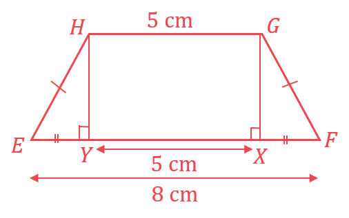

> * *

> *EH **= **FG** so the trapezium is isosceles and has a line of symmetry through the centre.  *
*Hence, **EY **=** XF **= ½(8 - 5) = 1.5 cm.*

**EX**** = 8 - ½(8 - 5) = 6.5 cm ****[1]**

ii) *Consider the diagram, **AEX** is a right-angled triangle where **AE **= 12 cm, **EX** = 6.5 cm.*

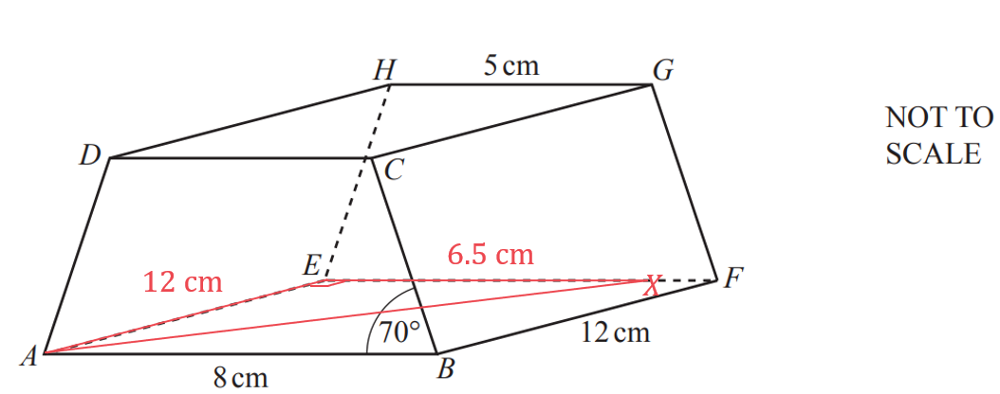

> *  *

> *Use Pythagoras'  theorem to find **AX.*

$AX^{2}=AE^{2}+EX^{2}\,AX^{2}=12^{2}+6.5^{2}$

**[1]**

> *Solve.*

`table row cell A X to the power of space end cell equals cell square root of 12 squared space plus space 6.5 squared end root end cell row blank equals cell space 13.64734... end cell end table`

**AX **** = 13.6 cm (3 s.f.)****  [1]**

iii) *Draw the line from **A** to **G** and use it to form a right-angled triangle on the diagram.  *
*Use the perpendicular height, **h**, and the point **X** to help.*

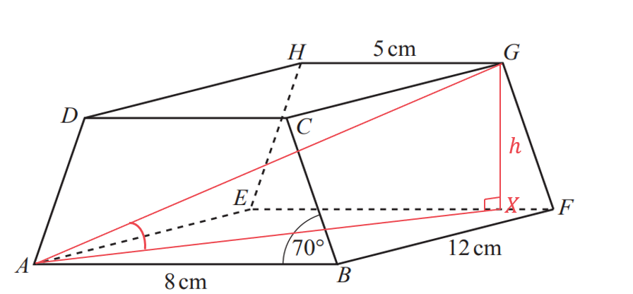

**[1]**

> *Angle **GAX  **is needed so use the triangle formed by the points **G, A **and **X**. *
*GX** = **h** = 4.121216... cm*
*AX** = 13.64735... cm.*

> *The sides opposite and adjacent to the angle are known so use the tan ratio.  *

`table row cell tan space G A X space end cell equals cell fraction numerator space G X over denominator A X end fraction end cell row blank equals cell fraction numerator space 4.121216... over denominator 13.64735 end fraction end cell row blank equals cell space 0.301979... end cell end table`

> *Use the tan**-1** button to find the answer.*

`table row cell tan space G A X space end cell equals cell space 0.301979... end cell row cell G A X space end cell equals cell space tan to the power of negative 1 end exponent open parentheses 0.301979... close parentheses space end cell end table`

**Angle ****GAX**** = 16.8°**** [1]**

## Q17 — hard — 5 marks · exam-questions

### 14() — 5 marks
> *Find the length FH on the right-angled triangle FGH.*

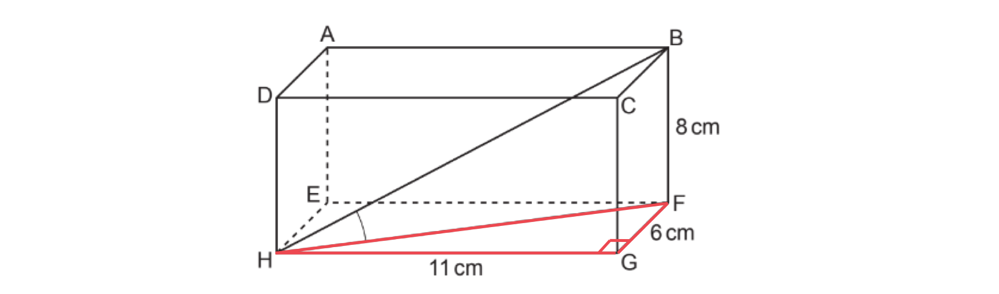

> *Use Pythagoras' theorem, *$c^{2}=a^{2}+b^{2}$*, where *$a$* and *$b$* are the two shorter sides and *$c$* is the hypotenuse.*

`table row cell F H squared end cell equals cell 6 squared plus 11 squared end cell row cell F H end cell equals cell square root of 6 squared plus 11 squared end root end cell end table`

**[1]**

`table row cell F H end cell equals cell square root of 157 end cell end table`

**[1]**

> *Now use SOHCAHTOA on the right-angled triangle BFH to work out the size of the angle BHF.*

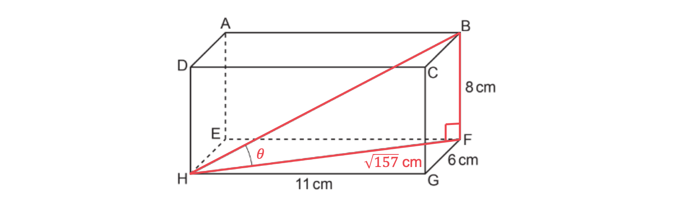

> *You know the lengths of both the adjacent and the opposite sides so use *$\mathrm{tan}θ=\frac{Opp}{Adj}$*.*

$\mathrm{tan}θ=\frac{8}{\sqrt{157}}$

**[1]**

> *Take *$\mathrm{tan}^{-1}$* of both sides to find the size of the angle.*

`theta equals tan to the power of negative 1 end exponent open parentheses fraction numerator 8 over denominator square root of 157 end fraction close parentheses`

**[1]**

$θ=32.5569...$

> *The question does not ask you to give your answer to a specific degree of accuracy but it would be sensible to round your answer to 1 or 2 decimal places.*

$32.6^{\circ}$** [1]**

**An answer of 32.56 or 32.556... will also be accepted**

## Q18 — medium — 4 marks · exam-questions

### 18((c)) — 4 marks
> *Begin by drawing the diagonal from A to C on the base of the diagram. This forms the right-angled triangle ACD**.*

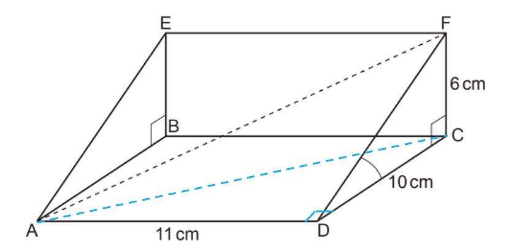

> *Use Pythagoras' theorem, *$a^{2}+b^{2}=c^{2}$*, on the right-angled triangle ACD to find the length AC.*

`table row cell A C to the power of 2 space end exponent end cell equals cell space 11 squared space plus space 10 squared end cell end table`

**[1]**

`table row cell A C squared space end cell equals cell space 221 end cell row cell A C space end cell equals cell space square root of 221 italic space cm end cell end table`

> *Use Pythagoras' theorem on the right-angled triangle ACF to find the length AF, make sure you use the exact value for the length AC.*

`table row cell A F squared space end cell equals cell space A C squared space plus space C F squared end cell row blank equals cell space open parentheses square root of 221 close parentheses squared space plus space 6 squared end cell end table`

**[1]**

`table row cell A F to the power of 2 space end exponent end cell equals cell space 221 space plus space 36 end cell row cell A F space end cell equals cell space square root of 221 space plus space 36 end root end cell end table`

**[1]**

> *The question asks for the exact value of the length AF, so leave the answer as a surd, do not evaluate.*

`table row cell A F space end cell equals cell space square root of 257 end cell end table`

$AF=\sqrt{257}\mathrm{cm}$* ***[1]**

## Q19 — very_hard — 4 marks · exam-questions

### 6((b)) — 4 marks
> *The longest part of the cuboid will be a diagonal from a bottom corner to the opposite top corner.  Draw this diagonal onto the diagram. *

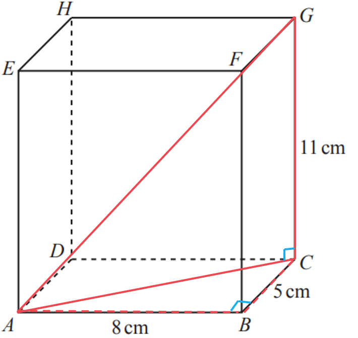

> *ACG** is a right-angled triangle. *
*ABC** is a right-angled triangle, where **AB **= 8 cm, **BC** = 5 cm.*

> *Use Pythagoras'  theorem with triangle **ABC **to find the length of **AC**.*

*  *$AC^{2}=AB^{2}+BC^{2}\,AC^{2}=8^{2}+5^{2}$

**[1]**

> *Solve**.*

`table row cell A C to the power of space end cell equals cell square root of 8 squared space plus space 5 squared end root end cell row blank equals cell square root of 89 space end cell row blank equals cell space 9.43398... end cell end table`

> *It is better to use the exact value of **AC** in the next part. *
*Use Pythagoras'  theorem with triangle **ACG **to find the length of **AG**.*

> *  *`table attributes columnalign right center left columnspacing 0px end attributes row cell A G to the power of space 2 space end exponent end cell equals cell space A C to the power of space 2 space end exponent plus space C G to the power of space 2 end exponent end cell row cell A G to the power of space 2 space end exponent end cell equals cell open parentheses square root of 89 close parentheses squared space plus space 11 squared end cell end table`

**[1]**

> *Solve**.*

`table row cell A G to the power of space end cell equals cell square root of 89 space plus space 11 squared end root end cell row blank equals cell square root of 210 space end cell row blank equals cell space 14.4914... end cell end table`

**[1]**

**AG ****= 14.5 (3 s.f.****) ****cm > 13 cm so yes the pencil will fit. ****[1]**

## Q20 — hard — 6 marks · exam-questions

### 20() — 6 marks
> *Add the lines AF and FB to the diagram and indicate the angle AFB onto the diagram.*

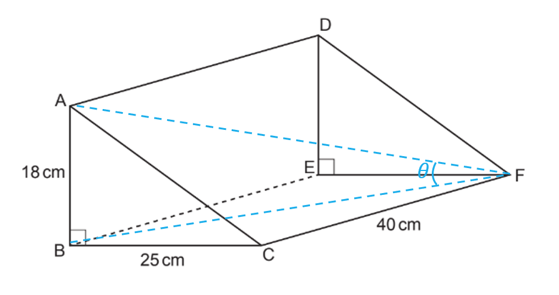

**[1]**

> *Look at the right-angled triangle BCF, use Pythagoras' theorem, *$a^{2}+b^{2}=c^{2}$*, to calculate the length BF.*

`table row cell B F squared space end cell equals cell space 25 squared space plus space 40 squared end cell row cell B F squared space end cell equals cell 625 space plus space 1600 end cell end table`

**[1]**

`table row cell B F squared space end cell equals cell space 2225 end cell row cell B F space end cell equals cell space square root of 2225 space equals space 5 square root of 89 end cell end table`

**[1]**

> *Use SOHCAHTOA on the right-angled triangle ABF with the length AB = 18 cm and the exact value for the length of BF. *
*You have the length AB** **(opposite the angle) and the length BF (adjacent to the angle) so use: *$\mathrm{tan}θ=\frac{Opp}{Hyp}$*.*

> * *`table row cell tan theta space end cell equals cell space fraction numerator A B over denominator B F end fraction end cell row cell tan theta space end cell equals cell space fraction numerator 18 over denominator 5 square root of 89 end fraction end cell end table`

**[1]**

> *Use the inverse tan button (tan**-1**) on your calculator to find the value of the angle AFB (**θ**).*

`table row cell theta space end cell equals cell space tan to the power of negative 1 end exponent open parentheses fraction numerator 18 over denominator 5 square root of 89 end fraction close parentheses space equals space 20.8868... end cell end table`

**[1]**

> *Round the answer to 1 decimal place.*

$\mathrm{Angle} \mathrm{AFB}=20.9^{\circ}$* ***[1]**

## Q21 — medium — 3 marks · exam-questions

### 21() — 3 marks
> *The line **PV, **the line **PT **and the angle **PVT  **form a right-angled triangle so SOHCAHTOA can be used to find the missing side **PT.*

> *Draw the sides of the triangle onto the diagram to make the right-angled triangle clearer.*

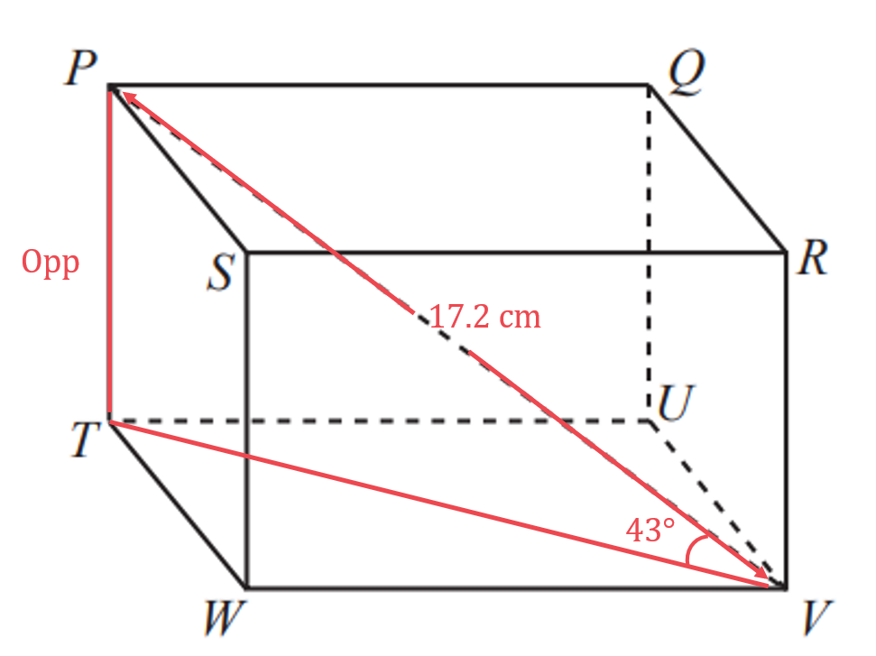

** Identifying the angle on the diagram correctly**** [1]**

> *The side opposite the angle is needed and the hypotenuse is known so use  *$\mathrm{sin}x^{\circ}=\frac{\mathrm{Opp}}{\mathrm{Hyp}}$*.*

$\mathrm{sin}43^{\circ}=\frac{PT}{17.2}$

**[1]**

> * Solve the trigonometric equation to find the side **PT.** *

`table row cell P T space end cell equals cell space 17.2 space sin space 43 degree space end cell row blank equals cell space 11.7303... end cell end table`

**PT**** = 11.7 cm (3 s.f.)**** [1]**

## Q22 — very_hard — 3 marks · exam-questions

### 4((d)) — 3 marks
> *Length **BX** is half the length of **BD** as **X**  is at the centre of the base.*

$BX=8\div2=4$* **cm*

*Triangle** PXB** is a right angled triangle.* *The angle between **PB** and the base **ABCD** is angle **PXB**.*

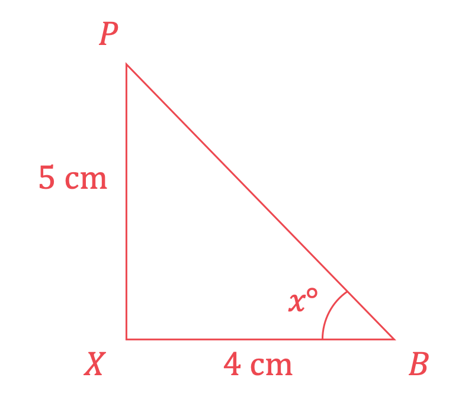

**[1]**

*Use simple trigonometry to find the angle **PXB**.* 
*You know the opposite and adjacent sides, so use the tan ratio.*

$\mathrm{tan}x=\frac{5}{4}$

**[1]**

> *Find the inverse tan of both sides.*

`x equals tan to the power of negative 1 end exponent open parentheses 5 over 4 close parentheses`

$x=51.34019...$

$51.3^{\circ}$ **[1]**

**A value of 51.34... will be accepted.**

## Q23 — medium — 4 marks · exam-questions

### 6((c)) — 4 marks
i) *The angle **CAB **is opposite the side **BC **and adjacent to the side **AB**, so use the tan ratio.  *

`table attributes columnalign right center left columnspacing 0px end attributes row cell tan space C A B space end cell equals cell fraction numerator B C over denominator A B end fraction end cell row cell tan space C A B space end cell equals cell space 5 over 8 end cell end table`

**[1]**

> *Use the tan**-1 **button on your calculator to find the angle.*

`table row cell C A B space end cell equals cell space tan to the power of negative 1 end exponent open parentheses 5 over 8 close parentheses end cell row blank equals cell space 32.0053... end cell end table`

**Angle ****CAB ****= 32.0° (1 d.p.) ****[1]**

ii) *The angle **GAC **is opposite the side **CG. **The hypotenuse is the diagonal **AG**, so use the sine ratio. Use the unrounded version of your answer for **AG **from part (b).  *

`table row cell sin space G A C space end cell equals cell fraction numerator G C over denominator A G end fraction end cell row cell sin space G A C space end cell equals cell space fraction numerator 11 over denominator square root of 210 end fraction end cell end table`

**[1]**

> *Use the sin**-1 **button on your calculator to find the angle.  *

`table row cell G A C space end cell equals cell space sin to the power of negative 1 end exponent open parentheses fraction numerator 11 over denominator square root of 210 end fraction close parentheses end cell row blank equals cell space 49.3824... end cell end table`

**Angle ****GAC ****= 49.4° (1 d.p.) ****[1]**

## Q24 — medium — 4 marks · exam-questions

### 6((b)) — 4 marks
> *The line *$AR$* and the line *$AB$* form a right-angle triangle with the line *$RB$*- which is on the plane *$BCRQ$* as shown below. The angle between the diagonal *$AR$* and the plane *$BCRQ$* is therefore the angle between *$AR$*and the line *$AB$*.*

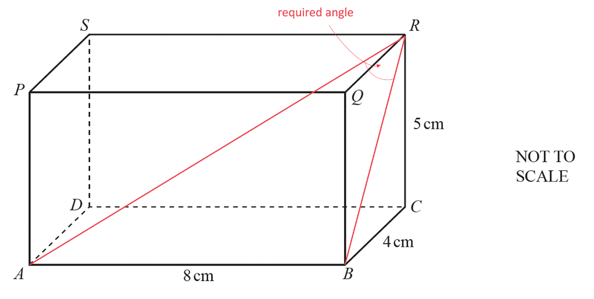

**identifying the required angle ****[1]**

> *Angle *$ABR$* is a right angle so to find angle *$ARB$* we can use the tangent ratio with *$AB=8$* and *$BR$*.*

> *To find *$BR$* we can use Pythagoras' theorem with *$CR=5$* and *$BC=4$*.*

$BR=\sqrt{4^{2}+5^{2}}$

**[1]**

> *Now we can apply the tangent ratio to find the angle. *

`tan open parentheses A R B close parentheses equals fraction numerator 8 over denominator square root of 4 squared plus 5 squared end root end fraction`

**[1]**

> *Inverse tangent on your calculator to find the angle.*

`table row cell A R B end cell equals cell tan to the power of negative 1 end exponent open parentheses fraction numerator 8 over denominator square root of 4 squared plus 5 squared end root end fraction close parentheses end cell row blank equals cell 51.32655062... degree end cell end table`

**51.3° ****[1] **
**Give answers in degrees to at least one decimal place**
