# Mark Schemes — Sine, Cosine Rule & Area of Triangles
**Trigonometry** · Edexcel IGCSE Maths A (Modular) (4XMAF/4XMAH) — 24/Higher Unit 1

## Q1 — very_hard — 5 marks · exam-questions

### 15() — 5 marks
> *The formula for the area of a triangle is *$\mathrm{Area}=\frac{1}{2}ab\mathrm{sin}C$*, where **a** and **b** are the lengths of the two sides that form angle **C**. *
*Substitute Area = *$6\sqrt{2}$*, **a** = *`open parentheses x plus 3 close parentheses`*, **b** = *`open parentheses 2 x minus 1 close parentheses`* and **C** = 45 into the formula.*

`table row cell 6 square root of 2 end cell equals cell 1 half cross times open parentheses x plus 3 close parentheses cross times open parentheses 2 x minus 1 close parentheses cross times sin open parentheses 45 close parentheses end cell end table`

**Correct expression on the right hand side**** [1] **
**Forming a correct equation ****[1]**

> *Multiply both sides by 2 and divide both sides by sin(45).*

`table row cell fraction numerator 2 cross times 6 square root of 2 over denominator sin open parentheses 45 close parentheses end fraction end cell equals cell open parentheses x plus 3 close parentheses open parentheses 2 x minus 1 close parentheses end cell end table`

> *Type *`table row blank blank cell fraction numerator 2 cross times 6 square root of 2 over denominator sin open parentheses 45 close parentheses end fraction end cell end table`* into your calculator to simplify that term.*

`table row 24 equals cell open parentheses x plus 3 close parentheses open parentheses 2 x minus 1 close parentheses end cell end table`

> *Expand the brackets then simplify.*

$2x^{2}-x+6x-3=24\,2x^{2}+5x-3=24$

**[1]**

> *Subtract 24 from both sides to make the quadratic equal 0.*

$2x^{2}+5x-27=0$

> *As the question asks for 3 significant figures, this suggests that the quadratic does not factorise. Solve by using the quadratic formula, *$x=\frac{-b\pm\sqrt{b^{2}-4ac}}{2a}$*. Substitute **a** = 2, **b** = 5 and **c =** -27 into the formula.*

`table row x equals cell fraction numerator negative 5 plus-or-minus square root of 5 squared minus 4 open parentheses 2 close parentheses open parentheses negative 27 close parentheses end root over denominator 2 open parentheses 2 close parentheses end fraction end cell end table`

**[1]**

> *Simplify using your calculator.*

`table row x equals cell fraction numerator negative 5 plus square root of 241 over denominator 4 end fraction equals 2.631043... end cell row blank blank or row x equals cell fraction numerator negative 5 minus square root of 241 over denominator 4 end fraction equals negative 5.131043... end cell end table`

> *As **x** + 3 is a length then it can not be negative, so **x** > -3. Therefore reject **x** = -5.131043... *
*Round the other solution to 3 significant figures.*

$x=2.63(3sf)$* ***[1]**

## Q2 — hard — 5 marks · exam-questions

### 17() — 5 marks
> *First look at triangle **BCD**.*

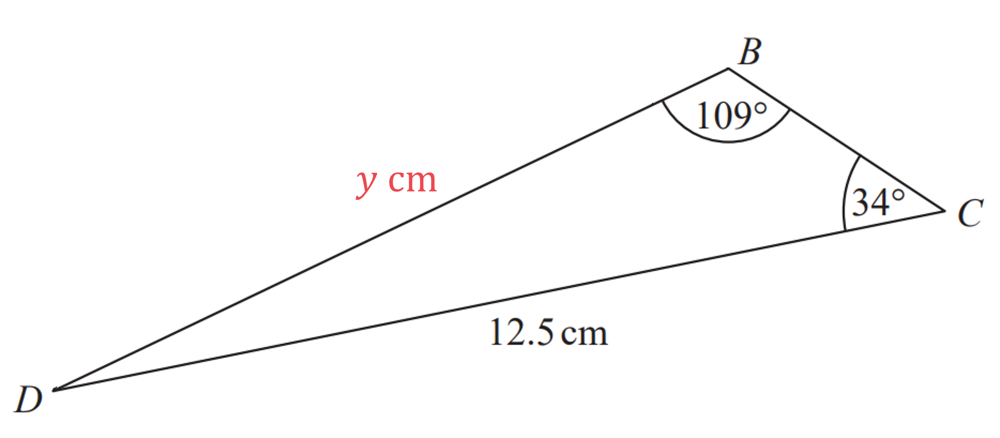

> *You know the length of one side and the angle opposite it. You also know another angle so you can find the length of the side opposite that using the sine rule.*

> *The formula for the sine rule is *$\frac{a}{\mathrm{sin}A}=\frac{b}{\mathrm{sin}B}$*, where **a** and **b** are the lengths of the two sides that are opposite the angles **A **and **B **respectively. *
*Substitute **a** = **y**, **b** = 12.5, **A** = 34 and **B** = 109 into the formula.*

`fraction numerator y over denominator sin open parentheses 34 close parentheses end fraction equals fraction numerator 12.5 over denominator sin open parentheses 109 close parentheses end fraction`

**[1]**

> *Multiply both sides by sin(34) and type into your calculator.*

`table row y equals cell fraction numerator 12.5 over denominator sin open parentheses 109 close parentheses end fraction cross times sin open parentheses 34 close parentheses end cell row blank equals cell 7.392674... end cell end table`

**[1]**

> *Now look at triangle **ABD**.*

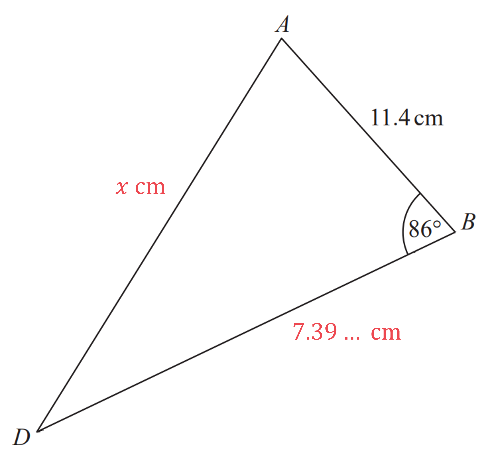

> *You know the lengths of two sides and the angle between them and you want to find the length of the third side. Therefore you need to use the cosine rule.*

> *The formula for the cosine rule is *$a^{2}=b^{2}+c^{2}-2bc\mathrm{cos}A$*, where **b** and **c** are the lengths of the two sides that form angle **A** and **a** is the length of the side opposite **A**. *
*Substitute **a** = **x**, **b** = 11.4, **c** = 7.392674... (using the answer button) and **A** = 86 into the formula.*

`x squared equals 11.4 squared plus 7.392674... squared minus 2 open parentheses 11.4 close parentheses open parentheses 7.392674... close parentheses cos open parentheses 86 close parentheses`

**[1]**

> *Type the expression into your calculator altogether as one line. If you do it separately you need to remember the order of operations (multiplication before addition).*

$x^{2}=172.853978...$

**[1]**

> *Take the positive square root of both sides.*

`table attributes columnalign right center left columnspacing 0px end attributes row x equals cell square root of 172.853978... end root end cell row blank equals cell 13.147394... end cell end table`

> *Round to 3 significant figures. Remember to include units for the length.*

$AD=13.1\mathrm{cm}(3\mathrm{sf})$* ***[1]**

## Q3 — medium — 5 marks · exam-questions

### 24((a)) — 2 marks
> *The formula for the area of a triangle is *$\mathrm{Area}=\frac{1}{2}ab\mathrm{sin}C$*, where **a** and **b** are the lengths of the two sides that form angle **C**. Substitute **a** = 7, **b** = 6 and **C** = 60 into the formula.*

`table row Area equals cell 1 half cross times 7 cross times 6 cross times sin open parentheses 60 close parentheses end cell end table`

**[1]**

> *Type into your calculator.*

`table row Area equals cell fraction numerator 21 square root of 3 over denominator 2 end fraction end cell row blank equals cell 18.186533... end cell end table`

> *Round to 3 significant figures. Remember to include square units for the area.*

$\mathrm{Area}=18.2\mathrm{cm}^{2}(3\mathrm{sf})$ **[1]**

### 24((b)) — 3 marks
> *You know the lengths of two sides and the angle between them and you want to find the length of the third side. Therefore you need to use the cosine rule.*

> *The formula for the cosine rule is *$a^{2}=b^{2}+c^{2}-2bc\mathrm{cos}A$*, where **b** and **c** are the lengths of the two sides that form angle **A** and **a** is the length of the side opposite **A**. *
*Substitute **a** = **AB**, **b** = 6, **c** = 7 and **A** = 60 into the formula.*

`A B squared equals 6 squared plus 7 squared minus 2 open parentheses 6 close parentheses open parentheses 7 close parentheses cos open parentheses 60 close parentheses`

**[1]**

> *Type the expression into your calculator altogether as one line. If you do it separately you need to remember the order of operations (multiplication before addition).*

$AB^{2}=43$

**[1]**

> *Take the positive square root of both sides.*

`table attributes columnalign right center left columnspacing 0px end attributes row cell A B end cell equals cell square root of 43 end cell row blank equals cell 6.557438... end cell end table`

> *Round to 3 significant figures. Remember to include units for the length.*

$AB=6.56\mathrm{cm}(3\mathrm{sf})$* ***[1]**

## Q4 — very_hard — 5 marks · exam-questions

### 17() — 5 marks
> *First use the area to form an equation using triangle **ADC**.*

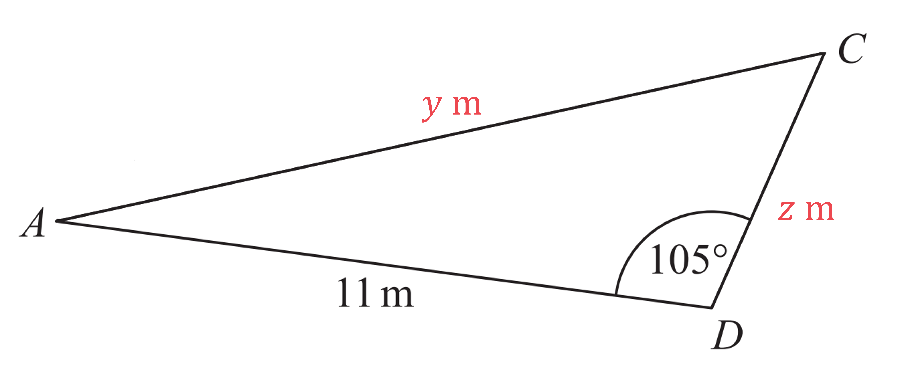

> *The formula for the area of a triangle is *$\mathrm{Area}=\frac{1}{2}ab\mathrm{sin}C$*, where **a** and **b** are the lengths of the two sides that form angle **C**. *
*Substitute Area = 56, **a** = **z**, **b** = 11 and **C** = 105 into the formula.*

`table row 56 equals cell 1 half cross times z cross times 11 cross times sin open parentheses 105 close parentheses end cell end table`

**[1]**

> *Rearrange to get **z** by itself by multiplying both sides by 2 and dividing both sides by 11sin(105). Type into your calculator.*

`table row z equals cell fraction numerator 56 cross times 2 over denominator 11 cross times sin open parentheses 105 close parentheses end fraction end cell row blank equals cell 10.540993... end cell end table`

**[1]**

> *You now know the lengths of two sides and the angle between them and you want to find the length of the third side. Therefore you need to use the cosine rule.*

> *The formula for the cosine rule is *$a^{2}=b^{2}+c^{2}-2bc\mathrm{cos}A$*, where **b** and **c** are the lengths of the two sides that form angle **A** and **a** is the length of the side opposite **A**. Substitute **a** = **y**, **b** = 11, **c** = 10.540993... (using the answer button) and **A** = 105 into the formula.*

`y squared equals 11 squared plus 10.540993... squared minus 2 open parentheses 11 close parentheses open parentheses 10.540993... close parentheses cos open parentheses 105 close parentheses`

**[1]**

> *Type the expression into your calculator altogether as one line. If you do it separately you need to remember the order of operations (multiplication before addition).*

$y^{2}=292.133170...$

> *Take the positive square root of both sides.*

`table attributes columnalign right center left columnspacing 0px end attributes row y equals cell square root of 292.133170... end root end cell row blank equals cell 17.091903... end cell end table`

> *Now use triangle **ABC**. You know the length of a side and the angle opposite it. You also know another angle so you can use the sine rule to find the length of the side opposite it.*

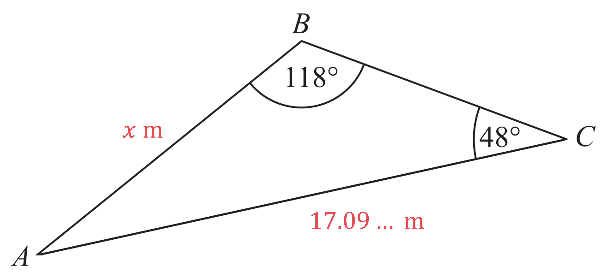

> *The formula for the sine rule is *$\frac{a}{\mathrm{sin}A}=\frac{b}{\mathrm{sin}B}$*, where **a** and **b** are the lengths of the two sides that are opposite the angles **A **and **B **respectively. *
*Substitute **a** = **x**, **b** = 17.091903... (using the answer button), **A** = 48 and **B** = 118 into the formula.*

`fraction numerator x over denominator sin open parentheses 48 close parentheses end fraction equals fraction numerator 17.091903... over denominator sin open parentheses 118 close parentheses end fraction`

**[1]**

> *Multiply both sides by sin(48) and type into your calculator.*

`table row x equals cell fraction numerator 17.091903... over denominator sin open parentheses 118 close parentheses end fraction cross times sin open parentheses 48 close parentheses end cell row blank equals cell 14.385632... end cell end table`

> *Round to 1 decimal place. Remember to include units for the length.*

$AB=14.4m(1\mathrm{dp})$* ***[1]**

## Q5 — hard — 5 marks · exam-questions

### 24() — 5 marks
> *You can find the angle between the sides **AC** and **AB** by spotting that the three interior angles of the triangle should add up to 180°.*

`table row cell Angle space B A C end cell equals cell 180 minus 64 minus 49 end cell row blank equals 67 end table`

> *To find the area of a triangle you need to know the lengths of two sides and the angle between them.*

> *You know the length of one side and the angle opposite it. You also know another angle so you can find the length of the side opposite that using the sine rule.*

> *The formula for the sine rule is *$\frac{a}{\mathrm{sin}A}=\frac{b}{\mathrm{sin}B}$*, where **a** and **b** are the lengths of the two sides that are opposite the angles **A **and **B **respectively. *
*Substitute **a** = **AC**, **b** = 8.7, **A** = 49 and **B** = 64 into the formula.*

`fraction numerator A C over denominator sin open parentheses 49 close parentheses end fraction equals fraction numerator 8.7 over denominator sin open parentheses 64 close parentheses end fraction`

**[1]**

> *Multiply both sides by sin(49) and type into your calculator.*

`table row cell A C end cell equals cell fraction numerator 8.7 over denominator sin open parentheses 64 close parentheses end fraction cross times sin open parentheses 49 close parentheses end cell row blank equals cell 7.305314... end cell end table`

**Rearranging correctly**** [1] **
**Correct answer**** [1]**

> *The formula for the area of a triangle is *$\mathrm{Area}=\frac{1}{2}ab\mathrm{sin}C$*, where **a** and **b** are the lengths of the two sides that form angle **C**. Substitute **a** = 7.305314... (using the answer button), **b** = 8.7 and **C** = 67 into the formula.*

`table row Area equals cell 1 half cross times 7.305314... cross times 8.7 cross times sin open parentheses 67 close parentheses end cell end table`

**[1]**

> *Type into your calculator.*

`table attributes columnalign right center left columnspacing 0px end attributes row Area equals cell 29.251912... end cell end table`

> *Round to 3 significant figures. Remember to include the units for the area.*

$\mathrm{Area}=29.3\mathrm{cm}^{2}(3\mathrm{sf})$ **[1]**

## Q6 — medium — 3 marks · exam-questions

### 20() — 3 marks
> *The lines on the sides **PQ** and **RQ** mean that they are equal so they are both 8 cm.*

> *You know the lengths of two sides and the angle between them and you want to find the length of the third side. Therefore you need to use the cosine rule.*

> *The formula for the cosine rule is *$a^{2}=b^{2}+c^{2}-2bc\mathrm{cos}A$*, where **b** and **c** are the lengths of the two sides that form angle **A** and **a** is the length of the side opposite **A**. *
*Substitute **a** = **PR**, **b** = 8, **c** = 8 and **A** = 140 into the formula.*

`P R squared equals 8 squared plus 8 squared minus 2 open parentheses 8 close parentheses open parentheses 8 close parentheses cos open parentheses 140 close parentheses`

**[1]**

> *Type the expression into your calculator altogether as one line. If you do it separately you need to remember the order of operations (multiplication before addition).*

$PR^{2}=226.053688...$

**[1]**

> *Take the positive square root of both sides. Use the answer button or your calculator's memory function.*

`table attributes columnalign right center left columnspacing 0px end attributes row cell P R end cell equals cell square root of 226.053688... end root end cell row blank equals cell 15.035081... end cell end table`

> *Round to 3 significant figures. Remember to include units for the length.*

$PR=15.0\mathrm{cm}(3\mathrm{sf})$* ***[1] **
**This can also be done using the right angled trigonometry**

## Q7 — very_hard — 5 marks · exam-questions

### 27() — 5 marks
> *The parallelogram is split into two identical triangles. To use the formula for the area of a triangle you need two sides and the angle between them. You do not currently have this so use triangle **ACD** to help find the required angle.*

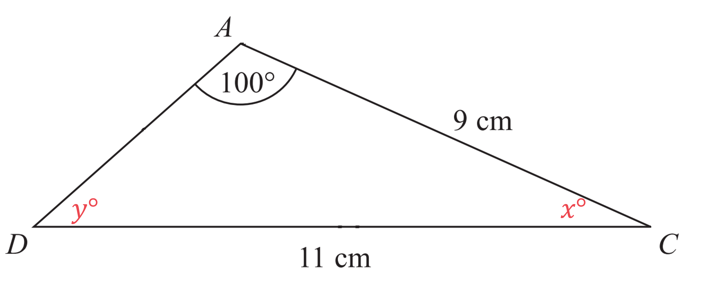

> *You know the length of one side and the angle opposite it. You also know the length of another side so you can use the sine rule to find the angle opposite it.*

> *The formula for the sine rule is *$\frac{\mathrm{sin}A}{a}=\frac{\mathrm{sin}B}{b}$*, where **a** and **b** are the lengths of the two sides that are opposite the angles **A **and **B **respectively. *
*Substitute **a** = **9**, **b** = 11, **A** = **y** and **B** = 100 into the formula.*

`fraction numerator sin open parentheses y close parentheses over denominator 9 end fraction equals fraction numerator sin open parentheses 100 close parentheses over denominator 11 end fraction`

**[1]**

> *Multiply both sides by 9 and then find the angle by using the inverse sin function.*

`table row cell sin open parentheses y close parentheses end cell equals cell fraction numerator sin open parentheses 100 close parentheses over denominator 11 end fraction cross times 9 end cell row y equals cell sin to the power of negative 1 end exponent open parentheses fraction numerator sin open parentheses 100 close parentheses over denominator 11 end fraction cross times 9 close parentheses end cell end table`

**[1]**

> *Type into your calculator.*

`table row y equals cell 53.682923... end cell end table`

> *You can find the third angle by spotting that the three interior angles of the triangle should add up to 180°. Use the answer button on your calculator.*

`table row x equals cell 180 minus 100 minus 53.682923... end cell row blank equals cell 26.317076... end cell end table`

**[1]**

> *You now have enough information to find the area of one of the triangles.*

> *The formula for the area of a triangle is *$\mathrm{Area}=\frac{1}{2}ab\mathrm{sin}C$*, where **a** and **b** are the lengths of the two sides that form angle **C**. Substitute **a** = 9, **b** = 11 and **C** = 26.317076... (using the answer button) into the formula.*

`table row Area equals cell 1 half cross times 9 cross times 11 cross times sin open parentheses 26.317076... close parentheses end cell row blank equals cell 21.945249... end cell end table`

**[1]**

> *Multiply by 2 to find the area of the parallelogram.*

`table row cell 2 cross times 21.945249... end cell equals cell 43.890498... end cell end table`

> *Round to 3 significant figures. Remember to include square units for the area.*

$\mathrm{Area}=43.9\mathrm{cm}^{2}(3\mathrm{sf})$** [1]**

## Q8 — hard — 5 marks · exam-questions

### 26() — 5 marks
> *Finding the angle opposite the side **LN** will help you.*

> *You know the length of one side and the angle opposite it. You also know the length of another side so you can use the sine rule to find the angle opposite it.*

> *The formula for the sine rule is *$\frac{\mathrm{sin}A}{a}=\frac{\mathrm{sin}B}{b}$*, where **a** and **b** are the lengths of the two sides that are opposite the angles **A **and **B **respectively. *
*Substitute **a** = **12.8**, **b** = 15.7, **A** = **MLN** and **B** = 136 into the formula.*

`fraction numerator sin open parentheses M L N close parentheses over denominator 12.8 end fraction equals fraction numerator sin open parentheses 136 close parentheses over denominator 15.7 end fraction`

**[1]**

> *Multiply both sides by 12.8 and then find the angle by using the inverse sin function.*

`table row cell sin open parentheses M L N close parentheses end cell equals cell fraction numerator sin open parentheses 136 close parentheses over denominator 15.7 end fraction cross times 12.8 end cell row cell M L N end cell equals cell sin to the power of negative 1 end exponent open parentheses fraction numerator sin open parentheses 136 close parentheses over denominator 15.7 end fraction cross times 12.8 close parentheses end cell end table`

**[1]**

> *Type into your calculator.*

`table row cell M L N end cell equals cell 34.495789... end cell end table`

**[1]**

> *You can find the angle between the sides **LM** and **MN** by spotting that the three interior angles of the triangle should add up to 180°. Use the answer button on your calculator.*

`table row cell Angle space L M N end cell equals cell 180 minus 136 minus 34.495789... end cell row blank equals cell 9.504210... end cell end table`

> *You now have enough information to find the side **LN** using either the sine rule or the cosine rule.*

> *Method 1 - Using the sine rule*

> *The formula for the sine rule is *$\frac{a}{\mathrm{sin}A}=\frac{b}{\mathrm{sin}B}$*, where **a** and **b** are the lengths of the two sides that are opposite the angles **A **and **B **respectively. *
*Substitute **a** = **LN**, **b** = 15.7, **A** = 9.504210... (using the answer button) and **B** = 136 into the formula.*

`fraction numerator L N over denominator sin open parentheses 9.504210... close parentheses end fraction equals fraction numerator 15.7 over denominator sin open parentheses 136 close parentheses end fraction`

**[1]**

> *Multiply both sides by sin(9.504210...) and type into your calculator.*

`table row cell L N end cell equals cell fraction numerator 15.7 over denominator sin open parentheses 136 close parentheses end fraction cross times sin open parentheses 9.504210... close parentheses end cell row blank equals cell 3.731885... end cell end table`

> *Round to 3 significant figures. Remember to include the units for the length.*

$LN=3.73\mathrm{cm}(3\mathrm{sf})$** [1]**

> *Method 2 - Using the cosine rule*

> *The formula for the cosine rule is *$a^{2}=b^{2}+c^{2}-2bc\mathrm{cos}A$*, where **b** and **c** are the lengths of the two sides that form angle **A** and **a** is the length of the side opposite **A**. *
*Substitute **a** = **LN**, **b** = 15.7, **c** = 12.8 and **A** = 9.504210... (using the answer button) into the formula.*

`L N squared equals 15.7 squared plus 12.8 squared minus 2 open parentheses 15.7 close parentheses open parentheses 12.8 close parentheses cos open parentheses 9.504210... close parentheses`

**[1]**

> *Type the expression into your calculator altogether as one line. If you do it separately you need to remember the order of operations (multiplication before addition).*

$LN^{2}=13.926966...$

> *Take the positive square root of both sides.*

`table row cell L N end cell equals cell square root of 13.926966... end root end cell row blank equals cell 3.731885... end cell end table`

> *Round to 3 significant figures. Remember to include the units for the length.*

$LN=3.73\mathrm{cm}(3\mathrm{sf})$** [1]**

## Q9 — medium — 5 marks · exam-questions

### 14((a)) — 2 marks
> *Draw a line between **E** and **G** to split the parallelogram into two identical triangles.*

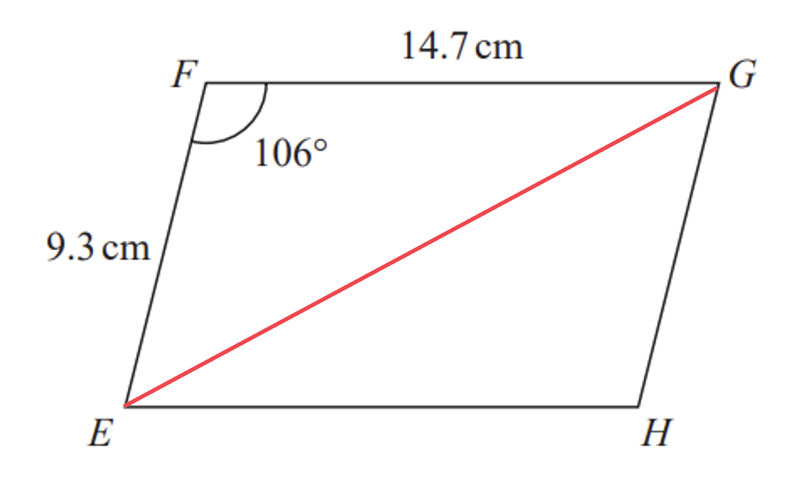

> *The formula for the area of a triangle is *$\mathrm{Area}=\frac{1}{2}ab\mathrm{sin}C$*, where **a** and **b** are the lengths of the two sides that form angle **C**. Substitute **a** = 9.3, **b** = 14.7 and **C** = 106 into the formula.*

`table row cell Area space of space Triangle end cell equals cell 1 half cross times 9.3 cross times 14.7 cross times sin open parentheses 106 close parentheses end cell end table`

> *Double this to find the area of the parallelogram.*

`table row cell Area space of space Parallelogram end cell equals cell 2 cross times 1 half cross times 9.3 cross times 14.7 cross times sin open parentheses 106 close parentheses end cell row blank equals cell 9.3 cross times 14.7 cross times sin open parentheses 106 close parentheses end cell end table`

**[1]**

> *Type into your calculator.*

`table row Area equals cell 131.414086... end cell end table`

> *Round to 3 significant figures.*

**Area = 131 cm****2*** ***[1]**

### 14((b)) — 3 marks
> *You know the lengths of two sides and the angle between them and you want to find the length of the third side. Therefore you need to use the cosine rule.*

> *The formula for the cosine rule is *$a^{2}=b^{2}+c^{2}-2bc\mathrm{cos}A$*, where **b** and **c** are the lengths of the two sides that form angle **A** and **a** is the length of the side opposite **A**. *
*Substitute **a** = **EG**, **b** = 9.3, **c** = 14.7 and **A** = 106 into the formula.*

`E G squared equals 9.3 squared plus 14.7 squared minus 2 open parentheses 9.3 close parentheses open parentheses 14.7 close parentheses cos open parentheses 106 close parentheses`

**[1]**

> *Type the expression into your calculator altogether as one line. If you do it separately you need to remember the order of operations (multiplication before addition).*

$EG^{2}=377.944765...$

**[1]**

> *Take the positive square root of both sides.*

`table row cell E G end cell equals cell square root of 377.944765... end root end cell row blank equals cell 19.440801... end cell end table`

> *Round to 3 significant figures.*

$EG=19.4\mathrm{cm}(3\mathrm{sf})$* ***[1]**

## Q10 — very_hard — 6 marks · exam-questions

### 25() — 6 marks
> *First use the area to form an equation.*

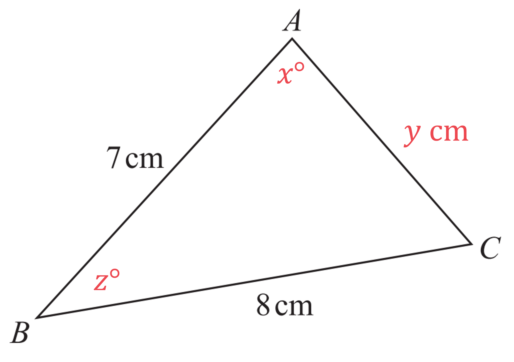

> *The formula for the area of a triangle is *$\mathrm{Area}=\frac{1}{2}ab\mathrm{sin}C$*, where **a** and **b** are the lengths of the two sides that form angle **C**. *
*Substitute Area = 18, **a** = 8, **b** = 7 and **C** = **z** into the formula.*

`table row 18 equals cell 1 half cross times 8 cross times 7 cross times sin open parentheses z close parentheses end cell end table`

**[1]**

> *Simplify the equation. Then rearrange to find the value of **z**.*

`table row cell 28 sin open parentheses z close parentheses end cell equals 18 row cell sin open parentheses z close parentheses end cell equals cell 18 over 28 end cell row z equals cell sin to the power of negative 1 end exponent open parentheses 18 over 28 close parentheses end cell row z equals cell 40.005200... end cell end table`

**[1]**

> *You now know the lengths of two sides and the angle between them so you can find the length of the third side using the cosine rule.*

> *The formula for the cosine rule is *$a^{2}=b^{2}+c^{2}-2bc\mathrm{cos}A$*, where **b** and **c** are the lengths of the two sides that form angle **A** and **a** is the length of the side opposite **A**. Substitute **a** = **y**, **b** = 8, **c** = 8 and **A** = 40.005200... (using the answer button) into the formula.*

`y squared equals 8 squared plus 7 squared minus 2 open parentheses 8 close parentheses open parentheses 8 close parentheses cos open parentheses 40.005200... close parentheses`

**[1]**

> *Type the expression into your calculator altogether as one line. If you do it separately you need to remember the order of operations (multiplication before addition).*

$y^{2}=27.209557...$

**[1]**

> *Take the positive square root of both sides.*

`table row y equals cell square root of 27.209557... end root end cell row blank equals cell 5.216278... end cell end table`

> *Now you can find the size of angle **BAC** using the formula for the triangle but this time using the sides **AB** and **AC**.*

> *Substitute Area = 18, **a** = 7, **b** = 5.216278... (using the answer button)  and **C** = **x** into the formula.*

`table attributes columnalign right center left columnspacing 0px end attributes row 18 equals cell 1 half cross times 7 cross times 5.216278... cross times sin open parentheses x close parentheses end cell end table`

**[1]**

> *Rearrange to find the value of **x**.*

`table row cell sin open parentheses x close parentheses end cell equals cell fraction numerator 18 cross times 2 over denominator 7 cross times 5.216278... end fraction end cell row x equals cell sin to the power of negative 1 end exponent open parentheses fraction numerator 18 cross times 2 over denominator 7 cross times 5.216278... end fraction close parentheses end cell row x equals cell 80.375501... end cell end table`

> *Round to 3 significant figures. Remember to include units for the angle.*

$\mathrm{Angle}BAC=80.4^{\circ}(3\mathrm{sf})$* ***[1]**

## Q11 — hard — 5 marks · exam-questions

### 21() — 5 marks
> *First look at triangle **ABD**.*

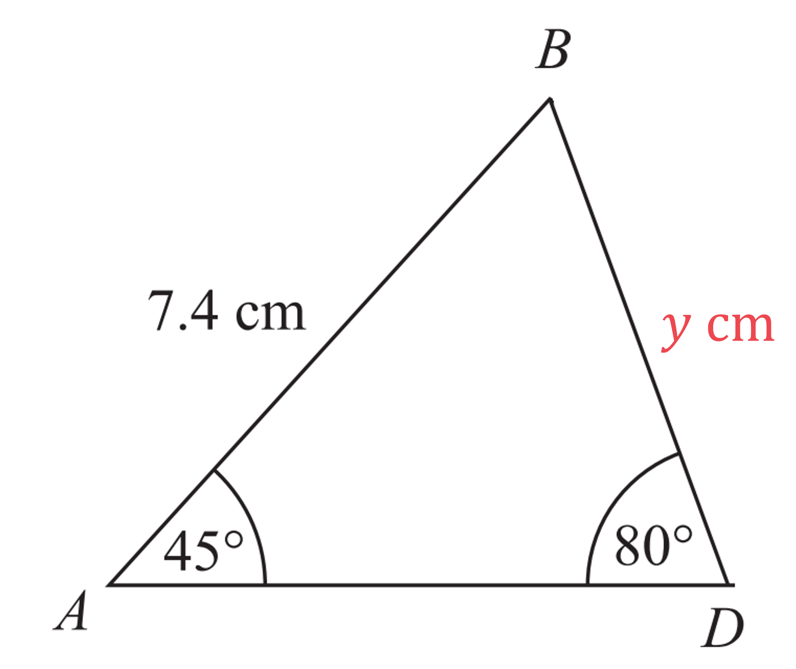

> *You know the length of one side and the angle opposite it. You also know another angle so you can find the length of the side opposite that using the sine rule.*

> *The formula for the sine rule is *$\frac{a}{\mathrm{sin}A}=\frac{b}{\mathrm{sin}B}$*, where **a** and **b** are the lengths of the two sides that are opposite the angles **A **and **B **respectively. Substitute **a** = **y**, **b** = 7.4, **A** = 45 and **B** = 80 into the formula.*

`fraction numerator y over denominator sin open parentheses 45 close parentheses end fraction equals fraction numerator 7.4 over denominator sin open parentheses 80 close parentheses end fraction`

**[1]**

> *Multiply both sides by sin(45) and type into your calculator.*

`table row y equals cell fraction numerator 7.4 over denominator sin open parentheses 80 close parentheses end fraction cross times sin open parentheses 45 close parentheses end cell row blank equals cell 5.313311... end cell end table`

**[1]**

> *Now look at triangle **BCD**. You know the angles **BDC** and **ADB** add up to 180° so you can find the missing angle.*

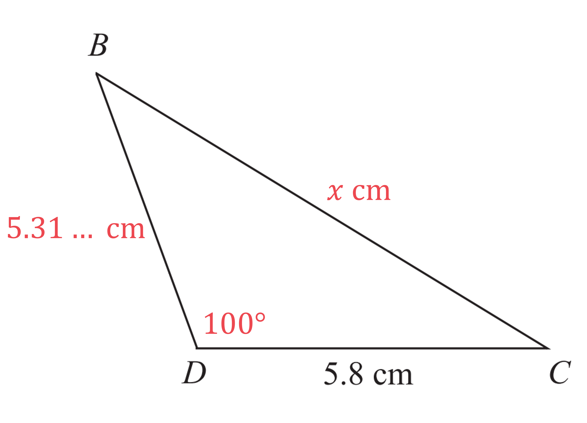

> *You know the lengths of two sides and the angle between them and you want to find the length of the third side. Therefore you need to use the cosine rule.*

> *The formula for the cosine rule is *$a^{2}=b^{2}+c^{2}-2bc\mathrm{cos}A$*, where **b** and **c** are the lengths of the two sides that form angle **A** and **a** is the length of the side opposite **A**. Substitute **a** = **x**, **b** = 5.8, **c** = 5.313311... (using the answer button) and **A** = 100 into the formula.*

`x squared equals 5.8 squared plus 5.313311... squared minus 2 open parentheses 5.8 close parentheses open parentheses 5.313311... close parentheses cos open parentheses 100 close parentheses`

**[1]**

> *Type the expression into your calculator altogether as one line. If you do it separately you need to remember the order of operations (multiplication before addition).*

$x^{2}=72.573980...$

**[1]**

> *Take the positive square root of both sides.*

`table attributes columnalign right center left columnspacing 0px end attributes row x equals cell square root of 72.573980... end root end cell row blank equals cell 8.519036... end cell end table`

> *Round to 3 significant figures. Remember to include units for the length.*

$BC=8.52\mathrm{cm}(3\mathrm{sf})$** ****[1]**

## Q12 — medium — 3 marks · exam-questions

### 18() — 3 marks
> *You know the lengths of two sides and the angle between them and you want to find the length of the third side. Therefore you need to use the cosine rule.*

> *The formula for the cosine rule is *$a^{2}=b^{2}+c^{2}-2bc\mathrm{cos}A$*, where **b** and **c** are the lengths of the two sides that form angle **A** and **a** is the length of the side opposite **A**. Substitute **a** = **PR**, **b** = 17.8, **c** = 26.3 and **A** = 36 into the formula.*

`P R squared equals 17.8 squared plus 26.3 squared minus 2 open parentheses 17.8 close parentheses open parentheses 26.3 close parentheses cos open parentheses 36 close parentheses`

**[1]**

> *Type the expression into your calculator altogether as one line. If you do it separately you need to remember the order of operations (multiplication before addition).*

$PR^{2}=251.063568...$

**[1]**

> *Take the positive square root of both sides.*

`table attributes columnalign right center left columnspacing 0px end attributes row cell P R end cell equals cell square root of 251.063568... end root end cell row blank equals cell 15.844985... end cell end table`

> *Round to 3 significant figures.*

$PR=15.8\mathrm{cm}(3\mathrm{sf})$* ***[1]**

## Q13 — very_hard — 6 marks · exam-questions

### 25() — 6 marks
> *First use the area to form an equation.*

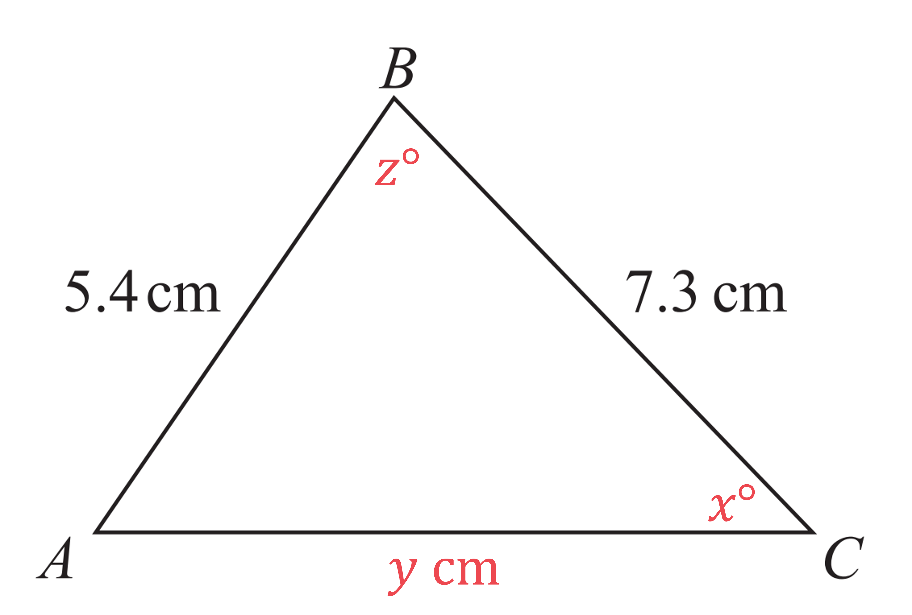

> *The formula for the area of a triangle is *$\mathrm{Area}=\frac{1}{2}ab\mathrm{sin}C$*, where **a** and **b** are the lengths of the two sides that form angle **C**. *
*Substitute Area = 19, **a** = 5.4, **b** = 7.3 and **C** = **z** into the formula.*

`table row 19 equals cell 1 half cross times 5.4 cross times 7.3 cross times sin open parentheses z close parentheses end cell end table`

**[1]**

> *Simplify the equation. Then rearrange to find the value of **z**.*

`table row cell 19.71 sin open parentheses z close parentheses end cell equals 19 row cell sin open parentheses z close parentheses end cell equals cell fraction numerator 19 over denominator 19.71 end fraction end cell row z equals cell sin to the power of negative 1 end exponent open parentheses fraction numerator 19 over denominator 19.71 end fraction close parentheses end cell row z equals cell 74.574619... end cell end table`

**[1]**

> *You now know the lengths of two sides and the angle between them so you can find the length of the third side using the cosine rule.*

> *The formula for the cosine rule is *$a^{2}=b^{2}+c^{2}-2bc\mathrm{cos}A$*, where **b** and **c** are the lengths of the two sides that form angle **A** and **a** is the length of the side opposite **A**. Substitute **a** = **y**, **b** = 5.4, **c** = 7.3 and **A** = 74.574619... (using the answer button) into the formula.*

`y squared equals 5.4 squared plus 7.3 squared minus 2 open parentheses 5.4 close parentheses open parentheses 7.3 close parentheses cos open parentheses 74.574619... close parentheses`

**[1]**

> *Type the expression into your calculator altogether as one line. If you do it separately you need to remember the order of operations (multiplication before addition).*

$y^{2}=61.479887...$

**[1]**

> *Take the positive square root of both sides.*

`table attributes columnalign right center left columnspacing 0px end attributes row y equals cell square root of 61.479887... end root end cell row blank equals cell 7.840911... end cell end table`

> *Now you can find the size of angle **BAC** using the formula for the triangle but this time using the sides **AB** and **AC**.*

> *Substitute Area = 19, **a** = 7.3, **b** = 7.840911... (using the answer button)  and **C** = **x** into the formula.*

`table row 19 equals cell 1 half cross times 7.3 cross times 7.840911... cross times sin open parentheses x close parentheses end cell end table`

**[1]**

> *Rearrange to find the value of **x**.*

`table row cell sin open parentheses x close parentheses end cell equals cell fraction numerator 19 cross times 2 over denominator 7.3 cross times 7.840911... end fraction end cell row x equals cell sin to the power of negative 1 end exponent open parentheses fraction numerator 19 cross times 2 over denominator 7.3 cross times 7.840911... end fraction close parentheses end cell row x equals cell 41.597000... end cell end table`

> *Round to 3 significant figures. Remember to include units for the angle.*

$\mathrm{Angle}ACB=41.6^{\circ}(3\mathrm{sf})$* ***[1]**

## Q14 — hard — 5 marks · exam-questions

### 24() — 5 marks
> *First use the area to form an equation.*

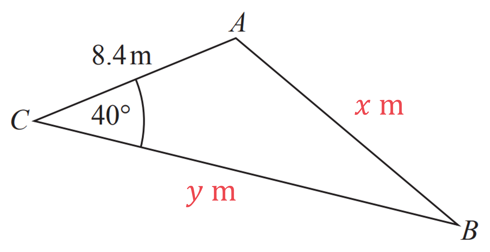

> *The formula for the area of a triangle is *$\mathrm{Area}=\frac{1}{2}ab\mathrm{sin}C$*, where **a** and **b** are the lengths of the two sides that form angle **C**. Substitute Area = 100, **a** = **y**, **b** = 8.4 and **C** = 40 into the formula.*

`table row 100 equals cell 1 half cross times y cross times 8.4 cross times sin open parentheses 40 close parentheses end cell end table`

**[1]**

> *Rearrange to get **y** by itself by multiplying both sides by 2 and dividing both sides by 8.4sin(40). Type into your calculator.*

`table row y equals cell fraction numerator 100 cross times 2 over denominator 8.4 cross times sin open parentheses 40 close parentheses end fraction end cell row blank equals cell 37.041043... end cell end table`

**[1]**

> *You now know the lengths of two sides and the angle between them and you want to find the length of the third side. Therefore you need to use the cosine rule.*

> *The formula for the cosine rule is *$a^{2}=b^{2}+c^{2}-2bc\mathrm{cos}A$*, where **b** and **c** are the lengths of the two sides that form angle **A** and **a** is the length of the side opposite **A**. Substitute **a** = **x**, **b** = 8.4, **c** = 37.041043... (using the answer button) and **A** = 40 into the formula.*

`x squared equals 8.4 squared plus 37.041043... squared minus 2 open parentheses 8.4 close parentheses open parentheses 37.041043... close parentheses cos open parentheses 40 close parentheses`

**[1]**

> *Type the expression into your calculator altogether as one line. If you do it separately you need to remember the order of operations (multiplication before addition).*

$x^{2}=965.897466...$

**[1]**

> *Take the positive square root of both sides.*

`table row x equals cell square root of 965.897466... end root end cell row blank equals cell 31.078891... end cell end table`

> *Round to 3 significant figures. Remember to include units for the length.*

$AB=31.1m(3\mathrm{sf})$* ***[1]**

## Q15 — medium — 3 marks · exam-questions

### 18() — 3 marks
> *Sketch the triangle. The largest angle will be opposite the longest side.*

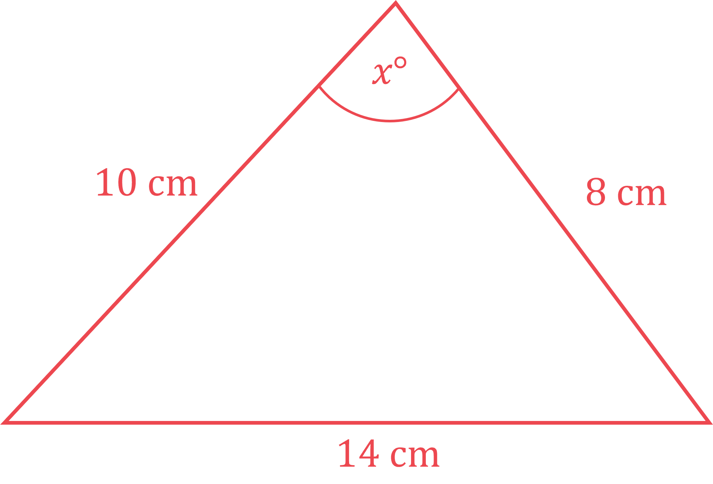

> *You know the lengths of all three sides and want to find an angle. Therefore you need to use the cosine rule.*

> *The formula for the cosine rule is *$\mathrm{cos}A=\frac{b^{2}+c^{2}-a^{2}}{2bc}$*, where **b** and **c** are the lengths of the two sides that form angle **A** and **a** is the length of the side opposite **A**. *
*Substitute **a** = 14, **b** = 10, **c** = 8 and **A** = **x** into the formula.*

`cos x equals fraction numerator 10 squared plus 8 squared minus 14 squared over denominator 2 open parentheses 10 close parentheses open parentheses 8 close parentheses end fraction`

**[1]**

> *Use the inverse cos function to find the angle.*

`x equals cos to the power of negative 1 end exponent open parentheses fraction numerator 10 squared plus 8 squared minus 14 squared over denominator 2 open parentheses 10 close parentheses open parentheses 8 close parentheses end fraction close parentheses`

**[1]**

> *Type the expression into your calculator altogether as one line.*

$x=101.53695...$

> *Round to 1 decimal place.*

**Largest angle is 101.5° (3sf)*** ***[1]**

## Q16 — very_hard — 5 marks · exam-questions

### 21() — 5 marks
> *To use the formula for the area of a triangle you need two sides and the angle between them. You do not currently have this so use triangle **ACD** to find the length **CD** and the angle **ADC **as this will give you angle **CDB**.*

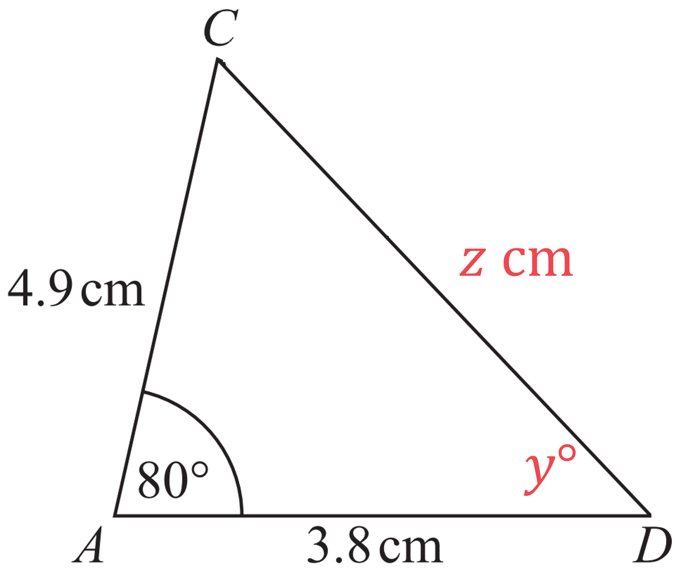

> *In triangle **ACD**, you know the lengths of two sides and the angle between them and you want to find the length of the third side. Therefore you need to use the cosine rule.*

> *The formula for the cosine rule is *$a^{2}=b^{2}+c^{2}-2bc\mathrm{cos}A$*, where **b** and **c** are the lengths of the two sides that form angle **A** and **a** is the length of the side opposite **A**. Substitute **a** = **z**, **b** = 4.9, **c** = 3.8 and **A** = 80 into the formula.*

`z squared equals 4.9 squared plus 3.8 squared minus 2 open parentheses 4.9 close parentheses open parentheses 3.8 close parentheses cos open parentheses 80 close parentheses`

**[1]**

> *Type the expression into your calculator altogether as one line. If you do it separately you need to remember the order of operations (multiplication before addition).*

$z^{2}=31.983341...$

> *Take the positive square root of both sides.*

`table attributes columnalign right center left columnspacing 0px end attributes row z equals cell square root of 31.983341... end root end cell row blank equals cell 5.655381... end cell end table`

> *Store this number in your calculator as you will need it later. You now know the length of one side and the angle opposite it. You also know the length of another side so you can use the sine rule to find the angle opposite it.*

> *The formula for the sine rule is *$\frac{\mathrm{sin}A}{a}=\frac{\mathrm{sin}B}{b}$*, where **a** and **b** are the lengths of the two sides that are opposite the angles **A **and **B **respectively. Substitute **a** = **4.9**, **b** = 5.655381... (using the memory function), **A** = **y** and **B** = 80 into the formula.*

`fraction numerator sin open parentheses y close parentheses over denominator 4.9 end fraction equals fraction numerator sin open parentheses 80 close parentheses over denominator 5.655381... end fraction`

**[1]**

> *Multiply both sides by 4.9 and then find the angle by using the inverse sin function.*

`table row cell sin open parentheses y close parentheses end cell equals cell fraction numerator sin open parentheses 80 close parentheses over denominator 5.655381... end fraction cross times 4.9 end cell row y equals cell sin to the power of negative 1 end exponent open parentheses fraction numerator sin open parentheses 80 close parentheses over denominator 5.655381... end fraction cross times 4.9 close parentheses end cell end table`

> *Type into your calculator.*

`table row y equals cell 58.568949... end cell end table`

> *You can find the angle **CDB **as angles that form a straight line add up to 180°.*

`table row cell Angle space C D B end cell equals cell 180 minus 58.568949... end cell row blank equals cell 121.431051... end cell end table`

> *Store this in your calculator as you will need this later. You can also find angle **CBD** as the interior angles in a triangle add up to 180°. Store this number too.*

`table row cell Angle space C B D end cell equals cell 180 minus 25 minus 121.431051... end cell row blank equals cell 33.568949... end cell end table`

> *Use can now use the other version of the sine rule, *$\frac{a}{\mathrm{sin}A}=\frac{b}{\mathrm{sin}B}$* , to find the length **CD**. *
*Substitute **a** = **x**, **b** = 5.655381... , **A** = 121.431051... and **B** = 33.568949... into the formula.*

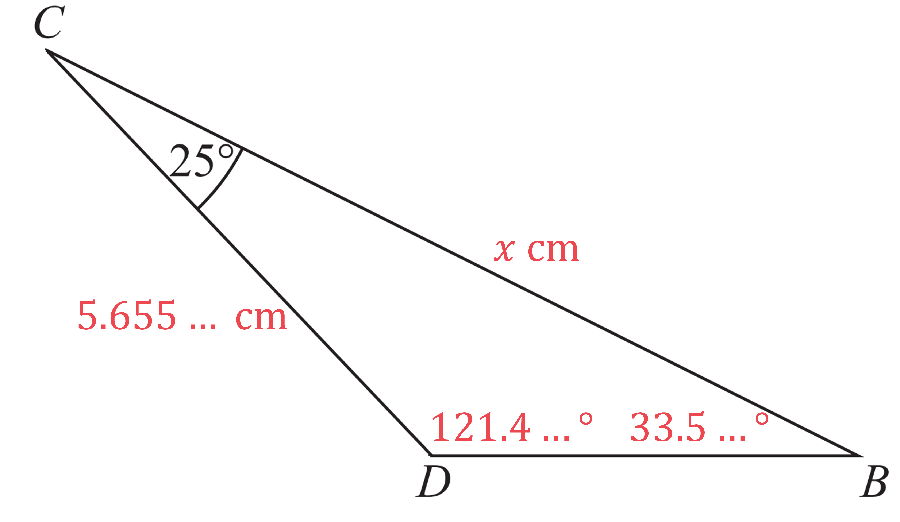

`fraction numerator x over denominator sin open parentheses 121.431051... close parentheses end fraction equals fraction numerator 5.655381.... over denominator sin open parentheses 33.568949... close parentheses end fraction`

**[1]**

> *Multiply both sides by sin(121.431051...) and type into your calculator.*

`table row x equals cell fraction numerator 5.655381.... over denominator sin open parentheses 33.568949... close parentheses end fraction cross times sin open parentheses 121.431051... close parentheses end cell row blank equals cell 8.727090... end cell end table`

> *The formula for the area of a triangle is *$\mathrm{Area}=\frac{1}{2}ab\mathrm{sin}C$*, where **a** and **b** are the lengths of the two sides that form angle **C**. *
*Substitute **a** = 8.727090... (using the answer button), **b** = 5.655381... and **C** = 25 into the formula.*

`table row Area equals cell 1 half cross times 8.727090... cross times 5.655381... cross times sin open parentheses 25 close parentheses end cell end table`

**[1]**

> *Type into your calculator.*

`table row Area equals cell 10.429167... end cell end table`

> *Round to 3 significant figures. Remember to include the square units for the area.*

$\mathrm{Area}=10.4\mathrm{cm}^{2}(3\mathrm{sf})$ **[1]**

## Q17 — hard — 5 marks · exam-questions

### 21((a)) — 4 marks
> *Sketch the diagram and label the relevant sides and angles.*

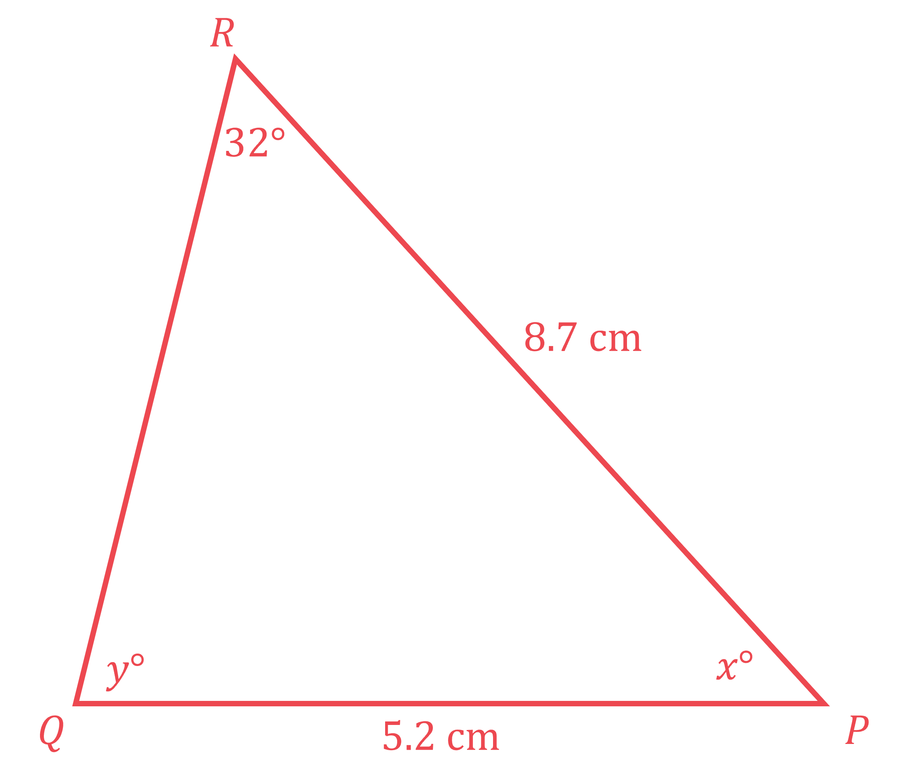

> *To find the area of a triangle formula you need to know the lengths of two sides and the angle between them. We currently do not know angle **RPQ** so work out what you can.*

> *You know the length of one side and the angle opposite it. You also know the length of another side so you can use the sine rule to find the angle opposite it.*

> *The formula for the sine rule is *$\frac{\mathrm{sin}A}{a}=\frac{\mathrm{sin}B}{b}$*, where **a** and **b** are the lengths of the two sides that are opposite the angles **A **and **B **respectively. *
*Substitute **a** = **8.7**, **b** = 5.2, **A** = **y** and **B** = 32 into the formula.*

`fraction numerator sin open parentheses y close parentheses over denominator 8.7 end fraction equals fraction numerator sin open parentheses 32 close parentheses over denominator 5.2 end fraction`

**[1]**

> *Multiply both sides by 8.7 and then find the angle by using the inverse sin function.*

`table row cell sin open parentheses y close parentheses end cell equals cell fraction numerator sin open parentheses 32 close parentheses over denominator 5.2 end fraction cross times 8.7 end cell row y equals cell sin to the power of negative 1 end exponent open parentheses fraction numerator sin open parentheses 32 close parentheses over denominator 5.2 end fraction cross times 8.7 close parentheses end cell end table`

**[1]**

> *Type into your calculator.*

`table attributes columnalign right center left columnspacing 0px end attributes row y equals cell 62.448531... end cell end table`

> *You can find the third angle by spotting that the three interior angles of the triangle should add up to 180°. Use the answer button on your calculator.*

`table attributes columnalign right center left columnspacing 0px end attributes row x equals cell 180 minus 32 minus 62.448531... end cell row blank equals cell 85.551468... end cell end table`

> *You now have enough information to find the area.*

> *The formula for the area of a triangle is *$\mathrm{Area}=\frac{1}{2}ab\mathrm{sin}C$*, where **a** and **b** are the lengths of the two sides that form angle **C**. Substitute **a** = 8.7, **b** = 5.2 and **C** = 85.551468... (using the answer button) into the formula.*

`table row Area equals cell 1 half cross times 8.7 cross times 5.2 cross times sin open parentheses 85.551468... close parentheses end cell row blank equals cell 22.551855... end cell end table`

**[1]**

> *Round to 3 significant figures. Remember to include square units for the area.*

$\mathrm{Area}=22.6\mathrm{cm}^{2}(3\mathrm{sf})$** [1]**

### 21((b)) — 1 marks
> *When using the sine rule to find an angle, it always gives you an acute angle. Sometimes it is possible that the angle could be obtuse or acute. You can sketch the triangle to see how it would look which shows the areas would be different.*

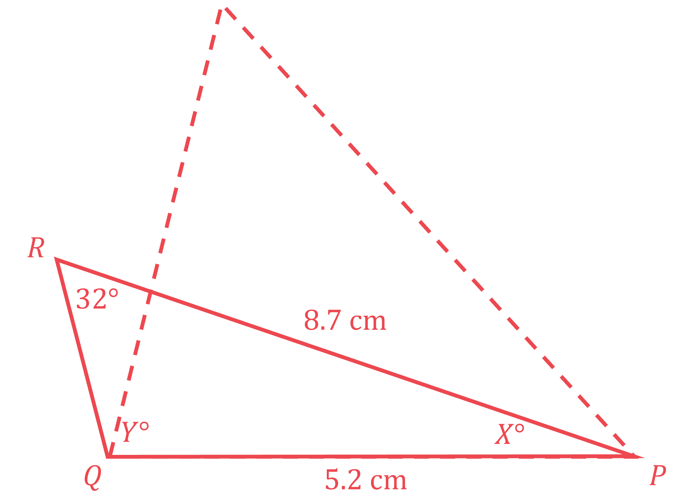

**The angle could be ****either acute or obtuse**** so there would be ****two areas**** to find** **[1]**

## Q18 — medium — 1 marks · exam-questions

### 17() — 1 marks
> *The sine rule can be written as either *$\frac{a}{\mathrm{sin}A}=\frac{b}{\mathrm{sin}B}$* or *$\frac{\mathrm{sin}A}{a}=\frac{\mathrm{sin}B}{b}$*, where **a **and **b** are lengths of two sides of the triangle and **A** and **B **are the angles opposite the sides respectively.*

> *x** cm is opposite 42° and 15 cm is opposite 104°.*

$\frac{x}{\mathrm{sin}42}=\frac{15}{\mathrm{sin}104}\mathrm{or}\frac{\mathrm{sin}42}{x}=\frac{\mathrm{sin}104}{15}$

$\frac{x}{sin42^{\circ}}=\frac{15}{sin104^{\circ}}$** [1]**

> $\frac{\mathrm{sin}x}{42}=\frac{\mathrm{sin}15}{104}\mathrm{and}\frac{\mathrm{sin}x}{34}=\frac{\mathrm{sin}15}{104}$* can be eliminated as they both contain terms where a length is after the sin rather than an angle.*

> $\frac{x}{\mathrm{sin}42}=\frac{15}{\mathrm{sin}34}$* can be eliminated as the length opposite 34° is unknown.*

## Q19 — very_hard — 6 marks · exam-questions

### 23() — 6 marks
> *To use the formula for the area of a triangle you need two sides and the angle between them. You do not currently have this so use the information to find any missing angles and sides that you can.*

> *You know one angle and the length of the side opposite it, you also know another length so you can use the sine rule to find the angle opposite it.*

> *The formula for the sine rule is *$\frac{\mathrm{sin}A}{a}=\frac{\mathrm{sin}B}{b}$*, where **a** and **b** are the lengths of the two sides that are opposite the angles **A **and **B **respectively. Substitute **a** = 4.2, **b** = 1.6, **A** = **x** and **B** = 18 into the formula.*

`fraction numerator sin open parentheses x close parentheses over denominator 4.2 end fraction equals fraction numerator sin open parentheses 18 close parentheses over denominator 1.6 end fraction`

**[1]**

> *Multiply both sides by 4.2 and then find the angle by using the inverse sin function.*

`table row cell sin open parentheses x close parentheses end cell equals cell fraction numerator sin open parentheses 18 close parentheses over denominator 1.6 end fraction cross times 4.2 end cell row x equals cell sin to the power of negative 1 end exponent open parentheses fraction numerator sin open parentheses 18 close parentheses over denominator 1.6 end fraction cross times 4.2 close parentheses end cell row blank equals cell 54.210363... end cell end table`

**[1]**

> *Angle **PQR** is obtuse so subtract this value from 180.*

`table attributes columnalign right center left columnspacing 0px end attributes row cell 180 minus 54.210363... end cell equals cell 125.789636... end cell end table`

**[1]**

> *You can find the angle **QPR **as angles that form a straight line add up to 180°.*

`table row cell Angle space Q P R end cell equals cell 180 minus 18 minus 125.789636... end cell row blank equals cell 36.210363... end cell end table`

**[1]**

> *The formula for the area of a triangle is *$\mathrm{Area}=\frac{1}{2}ab\mathrm{sin}C$*, where **a** and **b** are the lengths of the two sides that form angle **C**. Substitute **a** = 4.2, **b** = 1.6 and **C** = 36.210363... (using the answer button) into the formula.*

`table row Area equals cell 1 half cross times 4.2 cross times 1.6 cross times sin open parentheses 36.210363... close parentheses end cell end table`

**[1]**

> *Type into your calculator.*

`table row Area equals cell 1.984925... end cell end table`

> *Round to 3 significant figures. Remember to include the square units for the area.*

$\mathrm{Area}=1.98\mathrm{cm}^{2}(3\mathrm{sf})$ **[1]**

## Q20 — hard — 4 marks · exam-questions

### 18() — 4 marks
> *To find the area of a triangle formula you need to know the lengths of two sides and the angle between them. We currently only know one length. We can find the third angle by using the fact that the three interior angles in a triangle add up to 180°.*

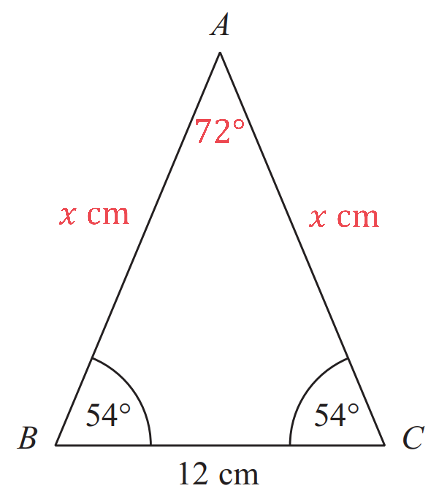

> *You know the length of one side and the angle opposite it. You also know another angle so you can find the length of the side opposite that using the sine rule.*

> *The formula for the sine rule is *$\frac{a}{\mathrm{sin}A}=\frac{b}{\mathrm{sin}B}$*, where **a** and **b** are the lengths of the two sides that are opposite the angles **A **and **B **respectively. Substitute **a** = x, **b** = 12, **A** = 54 and **B** = 72 into the formula.*

`fraction numerator x over denominator sin open parentheses 54 close parentheses end fraction equals fraction numerator 12 over denominator sin open parentheses 72 close parentheses end fraction`

**[1]**

> *Multiply both sides by sin(54) and type into your calculator.*

`table row x equals cell fraction numerator 12 over denominator sin open parentheses 72 close parentheses end fraction cross times sin open parentheses 54 close parentheses end cell row blank equals cell 10.207809... end cell end table`

**[1]**

> *You now have enough information to find the area.*

> *The formula for the area of a triangle is *$\mathrm{Area}=\frac{1}{2}ab\mathrm{sin}C$*, where **a** and **b** are the lengths of the two sides that form angle **C**. Substitute **a** = 12, **b** = 10.207809... (using the answer button) and **C** = 54 into the formula.*

`table row Area equals cell 1 half cross times 12 cross times 10.207809... cross times sin open parentheses 54 close parentheses end cell row blank equals cell 49.549749... end cell end table`

**[1]**

> *Round to 3 significant figures. Remember to include square units for the area.*

$\mathrm{Area}=49.5\mathrm{cm}^{2}(3\mathrm{sf})$** [1] **
**This can also be done using right angled trigonometry**

## Q21 — medium — 1 marks · exam-questions

### 18((b)) — 1 marks
> *The sine rule can be written as either *$\frac{a}{\mathrm{sin}A}=\frac{b}{\mathrm{sin}B}$* or *$\frac{\mathrm{sin}A}{a}=\frac{\mathrm{sin}B}{b}$*, where **a **and **b** are lengths of two sides of the triangle and **A** and **B **are the angles opposite the sides respectively.*

> *x°**  is opposite 31 mm and 72° is opposite 54 mm.*

$\frac{\mathrm{sin}x}{31}=\frac{\mathrm{sin}72}{54}\mathrm{or}\frac{31}{\mathrm{sin}x}=\frac{54}{\mathrm{sin}72}$

**Errors are:** $x$ **and 31 should be swapped Leah has used **$x$**as a length Leah has used 31 as an angle **
**Identifying any one of the errors** **[1]**

## Q22 — very_hard — 4 marks · exam-questions

### 22() — 4 marks
> *List out the lower and upper bounds for all of the given measurements.*

$c$*: 11.45 cm, 11.55 cm* 
$x$*: 79.5**o**, 80.5**o** * 
$y$*: 74.5**o**, 75.5**o*

**At least 1 correct bound seen ****[1]**

> *Use the sine rule, *$\frac{a}{\mathrm{sin}A}=\frac{b}{\mathrm{sin}B}$*, to find the length of *$b$*.*

`table row cell fraction numerator b over denominator sin space open parentheses A B C close parentheses end fraction end cell equals cell fraction numerator c over denominator sin space open parentheses y close parentheses end fraction end cell row b equals cell sin space open parentheses A B C close parentheses cross times fraction numerator c over denominator sin space open parentheses y close parentheses end fraction end cell end table`

> *To find the upper bound of *$b$*, the largest possible values are required for *`sin space open parentheses A B C close parentheses`* and *$c$*, but the smallest value for *`sin space open parentheses y close parentheses`* is required. This means using the upper bound for angle **ABC** and *$c$* but the lower bound for *$y$*.*

> *Find the upper bound of the angle **ABC** by subtracting both the lower bound values of *$x$* and *$y$* from 180**o** (angles in a triangle add up to 180**o**).*

`table row cell Upper space bound colon space A B C end cell equals cell 180 minus 74.5 minus 79.5 end cell row blank equals cell 26 degree end cell end table`

**[1]**

> *Substitute the correct bounds into the sine rule and solve to find the length *$b$*.*

$b=\mathrm{sin}26\times\frac{11.55}{\mathrm{sin}74.5}$

** [1]**

$b=5.2542...$

> *Round to 3 significant figures.*

**5.25 cm**** [1]**

## Q23 — hard — 3 marks · exam-questions

### 13() — 3 marks
> *Write down the upper and lower bounds for all measurements.*

*Length ***XZ***: 15.5 cm, 16.5 cm* 
*Angle ***YXZ***: 125**o**, 135**o* 
*Angle ***XYZ***: 24.5**o**, 25.5**o*

**At least one correct bound identified ****[1]**

> *To find the length **YZ**  you need to use the sine rule, *$\frac{a}{\mathrm{sin}A}=\frac{b}{\mathrm{sin}B}$*.*

`table row cell fraction numerator a over denominator sin space open parentheses Y X Z close parentheses end fraction end cell equals cell fraction numerator X Z over denominator sin space open parentheses X Y Z close parentheses end fraction end cell row a equals cell sin space open parentheses Y X Z close parentheses space cross times fraction numerator X Z over denominator sin space open parentheses X Y Z close parentheses end fraction end cell end table`

> *In order to find the upper bound for length **YZ**  you will need to use the upper bound for the length **XZ** . *
*For the angles, you want to have the largest value for sin **YXZ** (which will be using the lower bound of the angle) and the smallest value for sin **XYZ** (which will be using the upper bound of the angle).*

`table row a equals cell sin space 125 space cross times fraction numerator 16.5 over denominator sin space 24.5 end fraction end cell end table`

**Correct substitution into sine rule**** [1]**

`table attributes columnalign right center left columnspacing 0px end attributes row a equals cell 32.5927... end cell end table`

**32.6****o**** [1]**

**Answers between 32.5 and 32.6 will be accepted **

## Q24 — medium — 3 marks · exam-questions

### 20() — 3 marks
> *You have an angle and the length of the side opposite, you also have another length so you can use the sine rule to find the angle opposite it. *
*The sine rule can be written as *$\frac{\mathrm{sin}A}{a}=\frac{\mathrm{sin}B}{b}$*, where **a **and **b** are lengths of two sides of the triangle and **A** and **B **are the angles opposite the sides respectively.*

> *Substitute **A** = **x**, **B** = 125, **a** = 6 and **b** = 14 into the formula. *

$\frac{\mathrm{sin}x}{6}=\frac{\mathrm{sin}125}{14}$

> *Multiply both sides by 6.*

$\mathrm{sin}x=\frac{\mathrm{sin}125}{14}\times6$

> *Get the angle by itself by using the inverse sin function.*

`x equals sin to the power of negative 1 end exponent open parentheses fraction numerator sin 125 over denominator 14 end fraction cross times 6 close parentheses`

> *Type into your calculator.*

$x=20.552479...$

> *Round sensibly. The biggest degree of accuracy in the question is 3 significant figures so round your answer to 3 significant figures.*

$x=20.6\mathrm{degrees}(3\mathrm{sf})$ **[1]**

**Writing 21 or any number in the interval **$20.5\leqx\leq20.6$** is acceptable**

## Q25 — very_hard — 6 marks · exam-questions

### 22() — 6 marks
> *Find the interior angle of the regular octagon using: *`size space of space interior space angle space equals fraction numerator 180 open parentheses n minus 2 close parentheses over denominator n end fraction`*, where *$n$* is the number of sides of the polygon.*

`fraction numerator 180 open parentheses 8 minus 2 close parentheses over denominator 8 end fraction equals 135 degree`

**[1]**

> *Therefore angle **ABC** = 135°, and triangle **ABC **is an isosceles triangle with sides of 10cm. Mark this on the diagram.*

> *Triangle **ABC **is an isosceles triangle, so angle **BAC **= angle **BCA **= 1/2(180 - 135). *

*Angle ***BAC ***= Angle ***BCA ***= ** *$\frac{180-135}{2}=22.5^{\circ}$

> *Find angles **ACD **and **CAD **in triangle **ACD.*

*Angle ***ACD*** = Angle ***BCD*** - Angle ***ABC*** = 135 - 22.5 = 112.5°*

*Angle ***CAD*** = Angle ***BAH ***- Angle ***DAH*** - Angle ***BAC ***= 135 - 90 - 22.5 = 22.5°*

> *To find the length of **AD, y**ou know the length of one side (**CD**) and the angle opposite it (**CAD**). You also know angle **ACD** so you can find the length of the side opposite that using the sine rule.*

> *The formula for the sine rule is *$\frac{a}{\mathrm{sin}A}=\frac{b}{\mathrm{sin}B}$*, where **a** and **b** are the lengths of the two sides that are opposite the angles **A **and **B **respectively. Substitute **a** = **AD**, **b** = 10, **A** = 112.5 and **B** = 22.5 into the formula.*

`fraction numerator A D over denominator sin open parentheses 112.5 close parentheses end fraction equals fraction numerator 10 over denominator sin open parentheses 22.5 close parentheses end fraction`

**[1]**

> *Multiply both sides by sin(112.5) and type into your calculator.*

`table row cell A D end cell equals cell fraction numerator 10 over denominator sin open parentheses 22.5 close parentheses end fraction cross times sin open parentheses 112.5 close parentheses end cell row blank equals cell 24.14213... end cell end table`

> *Now find the area of rectangle **ADEH.*

**Area ADEH ***= 24.14213... × 10 = 241.4213... cm**2*

**[1]**

> *Now look at triangle **ACD**.*

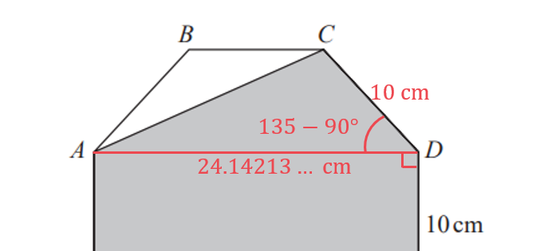

> *Find angle **ADC.*

*Angle ***ADC*** = Angle ***CDE*** - Angle ***ADE*** = 135 - 90 = 45°*

> *The formula for the area of a triangle is *$\mathrm{Area}=\frac{1}{2}ab\mathrm{sin}C$*, where **a** and **b** are the lengths of the two sides that form angle **C**. Substitute **a** = 24.14213..., **b** = 10 and **C** = 45 into the formula.*

`table row Area equals cell 1 half cross times 24.14213... cross times 10 cross times sin open parentheses 45 close parentheses end cell end table`

**[1]**

> *Type into your calculator.*

`table row cell Area subscript A C D end subscript end cell equals cell space 85.35531... space cm squared end cell end table`

**[1]**

> *Find the shaded area by adding the area of the rectangle to the area of the triangle.*

`table row cell Area space end cell equals cell space 241.4213... space plus space 85.35531... space equals space 326.776... space cm squared end cell end table`

> *Round to 3 significant figures. Remember to include the units for the area.*

$\mathrm{Area}=327\mathrm{cm}^{2}(3\mathrm{sf})$ **[1] **
**Answers from 326 - 327 accepted.**

## Q26 — hard — 6 marks · exam-questions

### 21() — 6 marks
> *Use the cosine rule, *$a^{2}=b^{2}+c^{2}-2bc\mathrm{cos}A$*, on triangle **PQS **in order to calculate the length **QS**.*

`table row cell Q S squared end cell equals cell 8 squared plus 12 squared minus 2 cross times 8 cross times 12 cross times cos space 120 end cell end table`

**[1]**

`table attributes columnalign right center left columnspacing 0px end attributes row cell Q S squared end cell equals 304 row cell Q S end cell equals cell square root of 304 end cell end table`

**[1]**

> *Use the sine rule, *$\frac{\mathrm{sin}A}{a}=\frac{\mathrm{sin}B}{b}$*, on triangle **QRS** to calculate the angle **SRQ**.*

`table row cell fraction numerator sin space open parentheses Q R S close parentheses over denominator square root of 304 end fraction end cell equals cell fraction numerator sin space 27 over denominator 9 end fraction end cell end table`

**[1]**

`table row cell sin space open parentheses Q R S close parentheses end cell equals cell square root of 304 cross times fraction numerator sin space 27 over denominator 9 end fraction end cell row cell Q R S end cell equals cell sin to the power of negative 1 end exponent open parentheses square root of 304 cross times fraction numerator sin space 27 over denominator 9 end fraction close parentheses end cell end table`

**[1]**

`table row cell Q R S end cell equals cell 61.5833... end cell end table`

**[1]**

> *Find angle **SQR **by subtracting angles **QRS** and **SRQ** from 180**o** as angles in a triangle add up to 180**o**.*

$180-27-61.5833...=91.4166...$

**91.4****o**** ****[1]**

## Q27 — medium — 4 marks · exam-questions

### 16() — 4 marks
*You can work out the perpendicular height of the triangle **ACD** as you are given the area of the triangle and you know the length of the base.*

> *Use the formula *$Area=\frac{1}{2}\timesbase\timesheight$*.*

`table row cell 80.5 end cell equals cell 1 half cross times 14 cross times A C end cell end table`

**[1]**

`table row cell 80.5 end cell equals cell 7 cross times A C end cell end table`

> *Divide both sides of the equation by 7.*

$\frac{23}{2}=AC$

**[1]**

> *Now you know the length of two sides, *$a$* and *$b$*, of the triangle **ABC** and the size of the angle in between them, *$C$*, you can use the area of a triangle formula, *$A=\frac{1}{2}ab\mathrm{sin}C$*, to calculate the area of the triangle **ABC.*

$A=\frac{1}{2}\times19\times\frac{23}{2}\times\mathrm{sin}36$

**[1]**

> *Simplify.*

$A=64.2155...$

> *Round to 3 significant figures.*

$64.2\mathrm{cm}^{2}$* ***[1]**

## Q28 — very_hard — 5 marks · exam-questions

### 25() — 5 marks
> *The area of the logo is the area of the two triangles added to the area of the sector.*

> *Find the area of the triangles using the area of a triangle formula, *$A=\frac{1}{2}ab\mathrm{sin}C$*, where *$a$* and *$b$* are the two known sides and *$C$* is the included angle. The triangles are congruent, which means identical, so the calculation is the same for both of them.*

`Area subscript triangle space equals 1 half cross times open parentheses 15 close parentheses cross times open parentheses 26 close parentheses cross times sin open parentheses 38 close parentheses space equals space 195 space sin space 38`

**[1]**

> *It is best to leave working as exact values where possible as you work through the problem so leaving it in terms of sin here will make it easier to work with later. *

> *To find the area of the sector, you will first need to find its radius. You know the lengths of two sides and the angle between them of the triangle and the radius of the sector is the side opposite the angle, so you can use the cosine rule, *$a^{2}=b^{2}+c^{2}-2bc\mathrm{cos}A$*, where **b** and **c** are the lengths of the two sides that form angle **A** and **a** is the length of the side opposite **A**.*

`r squared space equals space 26 squared space plus space 15 squared space minus space 2 open parentheses 26 close parentheses open parentheses 15 close parentheses cos open parentheses 38 close parentheses
r space equals space square root of 26 squared space plus space 15 squared space minus space 2 open parentheses 26 close parentheses open parentheses 15 close parentheses cos open parentheses 38 close parentheses end root`

**[1]**

> *Type the expression into your calculator altogether as one line to get a value for **r.*

`table row cell r space end cell equals cell space 16.921926... end cell end table`

> *Find the area of the sector** **using the formula for area of a sector *$=\frac{θ}{360^{\circ}}\timesπr^{2}$*, the angle for the sector is *$θ=108$* and use the unrounded value found for **r.** *

`Area subscript s e c t o r end subscript equals space space 108 over 360 space space cross times space pi space space cross times space open parentheses 16.921926 close parentheses squared space equals space 269.880036...`

**Correct fraction**** [1] **
**Correct method to find area**** [1]**

> *Find the area of the logo by adding 2 lots of the area of the triangle to the area of the sector**.*

*Area logo = *`2 open parentheses 195 space sin space 38 close parentheses space plus space 269.880036...`

**Final answer:** **Area = **$509.988...=510\mathrm{cm}^{2}(2s.f.)$** ****[1]**

## Q29 — hard — 5 marks · exam-questions

### 29() — 5 marks
> *You know the length of two sides of the triangle **ABC** and the angle between them, so you can use the cosine rule to find the length of the third side of the triangle.*

> *Use the cosine rule in the form *$a^{2}=b^{2}+c^{2}-2bc\mathrm{cos}A$*, where *$b$*and *$c$* are the two known sides, *$A$* is the angle between them and *$a$* is the side you are trying to find.*

> *Substitute the values from the diagram into the formula.*

$AC^{2}=8^{2}+10^{2}-2\times8\times10\times\mathrm{cos}114$

**[1]**

> *Simplify.*

$AC^{2}=229.0778...$

> *Find **AC** by taking the square root of both sides.*

$AC=\sqrt{229.0778...}$

**[1]**

$AC=15.1353...$

> *AC** is the diameter of the semi-circle.*

> *Find the radius of the semi-circle, *$r$*, by dividing the diameter by 2.*

`table attributes columnalign right center left columnspacing 0px end attributes row r equals cell fraction numerator 15.1353... over denominator 2 end fraction end cell row blank equals cell 7.5676... end cell end table`

> *Calculate the area of the semi-circle by using the area of a circle formula, *$A=πr^{2}$* and multiplying it by *$\frac{1}{2}$*.*

`table attributes columnalign right center left columnspacing 0px end attributes row cell A subscript s e m i minus c i r c l e end subscript end cell equals cell 1 half cross times straight pi cross times 7.5676... squared end cell end table`

**[1]**

`table row cell A subscript s e m i minus c i r c l e end subscript end cell equals cell 89.9586... end cell end table`

> *Calculate the area of the triangle **ABC** using the area of a triangle formula, *$A=\frac{1}{2}ab\mathrm{sin}C$*, where *$a$* and *$b$* are the lengths of two of the sides and *$C$* is the angle between them.*

$A_{triangle}=\frac{1}{2}\times8\times10\times\mathrm{sin}114$

**[1]**

> *Simplify.*

$A_{triangle}=36.5418...$

> *Add together the areas of the triangle and the semi-circle to find the total area of the shape.*

`table row cell A subscript t o t a l end subscript end cell equals cell 89.9586... plus 36.5418... end cell row blank equals cell 126.5004... end cell end table`

> *The question does not ask you to round your answer to a given degree of accuracy but it would be sensible to round your answer to 1 or 2 decimal places.*

$A=126.50\mathrm{cm}^{2}$* ***[1]**

**Answers between 125.99 and 126.572 will be accepted**

## Q30 — medium — 4 marks · exam-questions

### 21((a)) — 3 marks
> *If Tia and Liz walk at the same speed then whoever has the shortest distance to travel will reach the shop first.*

> *Find the distance that Tia has to walk.*

> *As you know the length of two of the sides of the triangle, *$b$* and *$c$*, and the size of the angle in between them, *$C$*, you can use the cosine rule, *$a^{2}=b^{2}+c^{2}-2bc\mathrm{cos}A$*, to find the length of the third side, *$a$*.*

$a^{2}=60^{2}+80^{2}-2\times60\times80\times\mathrm{cos}75$

**[1]**

> *Simplify.*

$a^{2}=7515.3371...$

> *Take the square root of both sides to find the value of *$a$*.*

$a=\sqrt{7515.3371...}$

**[1]**

$a=86.6910...$

> *Compare the distances that Tia and Liz have to walk to the shop.*

$86.6910>80$

**Liz will arrive at the shop first**** [1]**

**To get the answer mark, the distance that Tia will have to walk needs to be seen in the working**

### 21((b)) — 1 marks
**This will not affect the answer to part (a) as Liz will still arrive first ****[1]**

## Q31 — very_hard — 6 marks · exam-questions

### 22() — 6 marks
> *Split the pentagon into triangles and calculate the angle in the centre vertex*

$360\div5=72$

> *Split that triangle down the middle to create a right-angled triangle and use it to calculate the radius of the large circle with trigonometry*

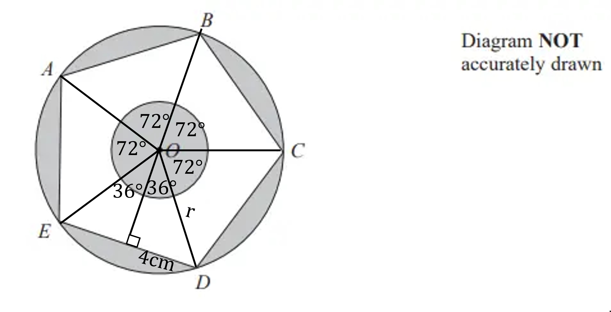

`table row cell sin 36 end cell equals cell 4 over r end cell row r equals cell fraction numerator 4 over denominator sin 36 end fraction end cell end table`

**[M1]**

> *Calculate the area of the large circle*

`A equals pi r squared
A equals pi cross times open parentheses fraction numerator 4 over denominator sin 36 end fraction close parentheses squared
A equals 145.48977...`

**[M1]**

> *Calculate the area of one triangle*

`A space equals fraction numerator space 1 over denominator 2 end fraction a b sin C
A space equals fraction numerator space 1 over denominator 2 end fraction open parentheses fraction numerator 4 over denominator sin 36 end fraction close parentheses squared sin 72
A space equals space 22.0221...`

**[M1]**

> *Form an equation using the shaded area = unshaded area*

> *Area of large circle - area of pentagon + area of small circle = area of pentagon - area of small circle*

$145.48977...-5\times22.0221...+πr^{2}=5\times22.0221...-πr^{2}$

**[M1]**

> *Rearrange and solve the equation to calculate the radius of the smaller circle*

> *Add  *$πr^{2}$* to both sides*

$145.48977...-5\times22.0221...+2πr^{2}=5\times22.0221...$

> *Subtract the area of the large circle and add the area of the pentagon to both sides*

$2πr^{2}=74.731...$

**[M1]**

> *Rearrange and solve to get r*

`table row cell r squared space end cell equals cell fraction numerator space 74.731... over denominator 2 pi end fraction end cell row cell r space end cell equals cell space square root of 11.893... end root end cell row cell r space end cell equals cell space 3.4487.... end cell end table`

> *Give your answer to 3 significant figures*

**Final answer:** **radius of small circle = 3.45 cm (3 s.f.)**

**[A1]**

> **[mark-scheme]**
> **A1**: Answers in the range 3.43-3.45 will get this final mark.

## Q32 — hard — 8 marks · exam-questions

### 26((a)) — 3 marks
> *Calculate the area, **A**, of the sail using the formula *$A=\frac{1}{2}ab\mathrm{sin}C$*, where *$a$* and *$b$* are two sides of the triangle and *$C$* is the angle between them.*

$A=\frac{1}{2}\times3.8\times9.7\times\mathrm{sin}73$

**[1]**

$A=17.6246...$

> *The sail will require 3 coats of waterproofing liquid on both sides of the sail. *
*Multiply the area of one side of the sail by 6 to find the total area that needs to be covered.*

`table row cell A subscript t o t a l end subscript end cell equals cell 6 cross times 17.6246... end cell row blank equals cell 105.7481... end cell end table`

> *Calculate the number of bottles of waterproofing liquid that required by dividing the total area by the area that one bottle will cover.*

$\mathrm{No}.\mathrm{of}1L\mathrm{bottles}=\frac{105.7481...}{8.5}$

**[1]**

$\mathrm{No}.\mathrm{of}1L\mathrm{bottles}=12.4409...$

> *Round up to the next number of whole bottles.*

$13$* ***[1]**

### 26((b)) — 5 marks
> *You know two sides of the original triangle and the size of the angle between them so you can use the cosine rule to find the length of the third side.*

> *Use the cosine rule in the form *$a^{2}=b^{2}+c^{2}-2bc\mathrm{cos}A$*, where *$b$* and *$c$* are the two known sides, *$A$* is the angle between them and *$a$* is the side you are trying to find.*

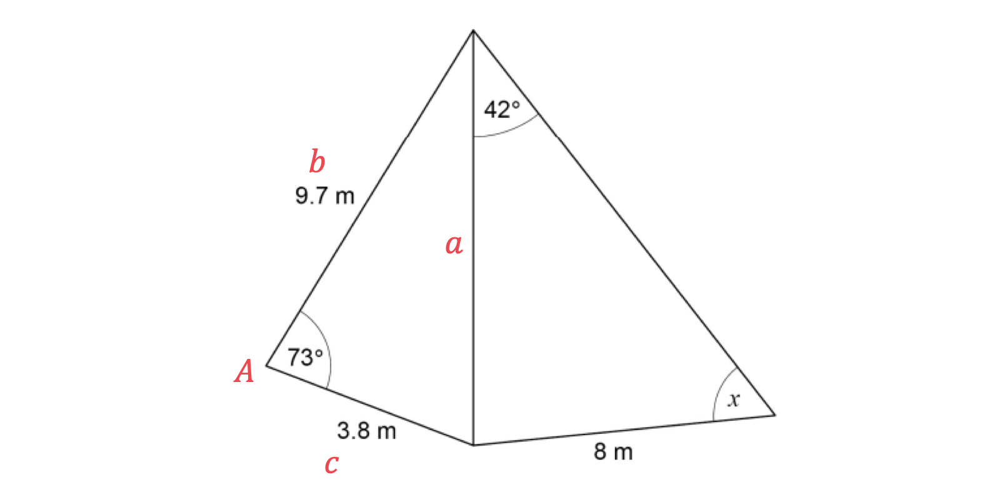

> *Substitute the values from the diagram into the formula.*

$a^{2}=9.7^{2}+3.8^{2}-2\times9.7\times3.8\times\mathrm{cos}73$

**[1]**

> *Simplify.*

$a^{2}=86.9763...$

> *Find the value of *$a$* by taking the square root of both sides.*

$a=\sqrt{86.9763...}$

**[1]**

$a=9.3261...$

> *You now have two pairs of opposite sides and angles on the second triangle with only one value you don't know, *$x$*.*

> *Use the sine rule, *$\frac{\mathrm{sin}A}{a}=\frac{\mathrm{sin}B}{b}$* to find unknown angle.*

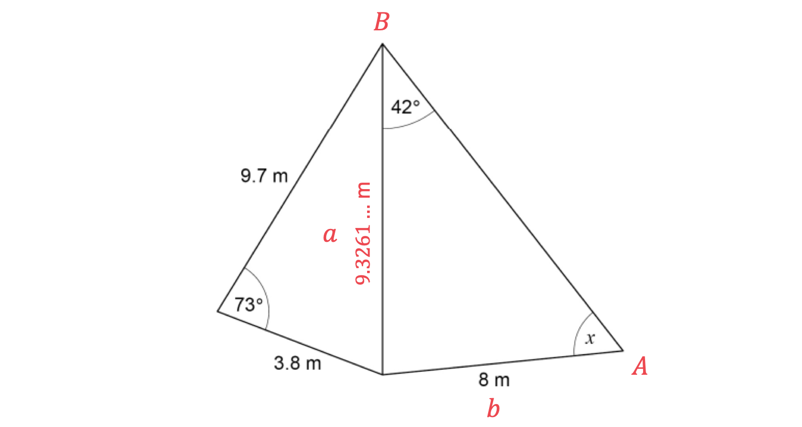

> *Substitute the values from the diagram into the formula.*

$\frac{\mathrm{sin}x}{9.3261...}=\frac{\mathrm{sin}42}{8}$

**[1]**

> *Multiply both sides by 9.3261...*

$\mathrm{sin}x=9.3261...\times\frac{\mathrm{sin}42}{8}$

> *Take *$\mathrm{sin}^{-1}$* of both sides.*

`x equals sin to the power of negative 1 space end exponent open parentheses 9.3261... cross times fraction numerator sin space 42 over denominator 8 end fraction close parentheses`

$x=51.2650...$

> *The question does not specify a degree of accuracy for your answer but it would be sensible to round it to 1 or 2 decimal places.*

$51.3$* ***[1]**

**An answer of 51 is also accepted**

## Q33 — medium — 3 marks · exam-questions

### 22() — 3 marks
*You know the length of two of the sides of the triangle, *$b$ *and *$c$*, and the size of the angle between them, *$C$*, so you can use the cosine rule, *$a^{2}=b^{2}+c^{2}-2bc\mathrm{cos}A$*, to work out the length of the third side, *$a$*.*

$PR^{2}=6^{2}+9^{2}-2\times6\times9\times\mathrm{cos}120$

**[1]**

> *Simplify.*

$PR^{2}=171$

> *Take the square root of both sides to find the length **PR**.*

$PR=\sqrt{171}$

**[1]**

$PR=13.0766...$

> *The degree of accuracy of for the answer is not given but it is sensible to round it to the nearest 1 or 2 decimal places.*

$13.1\mathrm{cm}$* ***[1]**

**Answers between 13 and 13.1 will be accepted Answers of **$\sqrt{171}$** or **$3\sqrt{19}$** will also be accepted**

## Q34 — hard — 6 marks · exam-questions

### 14() — 6 marks
> *Let angle DAE = *$θ$*, you can calculate *$θ$* as you know the lengths of all three sides of the triangle ADE.*

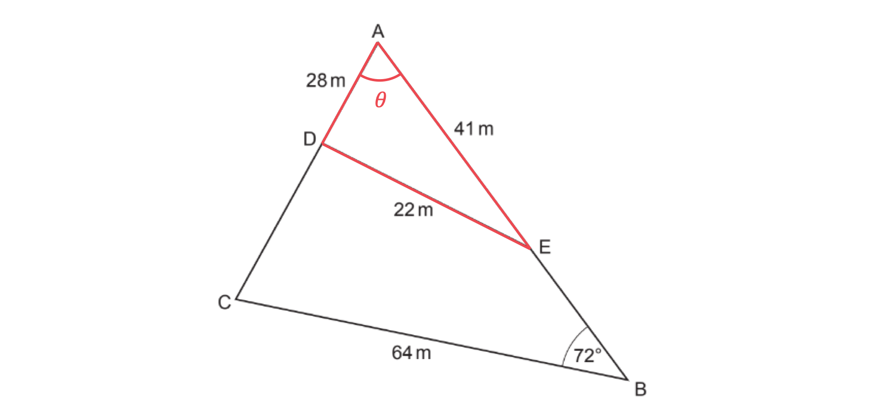

> *Use the cosine rule in the form *$\mathrm{cos}A=\frac{b^{2}+c^{2}-a^{2}}{2bc}$*, where *$a$*, *$b$* and *$c$* are the lengths of the three sides and *$A$* is the angle opposite side *$a$*.*

$\mathrm{cos}θ=\frac{28^{2}+41^{2}-22^{2}}{2\times28\times41}$

**Cosine rule seen in either form with no more than 1 error ****[1]*** ***Correct substitution into the cosine rule ****[1]*** *
**Correct substitution into the cosine rule in the form used to find the angle ****[1]**

$\mathrm{cos}θ=\frac{283}{328}$

> *Take *$\mathrm{cos}^{-1}$* of both sides.*

`theta equals cos to the power of negative 1 end exponent open parentheses 283 over 328 close parentheses`

$θ=30.3670...$

> *You now have two pairs of opposite angles and sides in the larger triangle ABC, where only one of the values is unknown.*

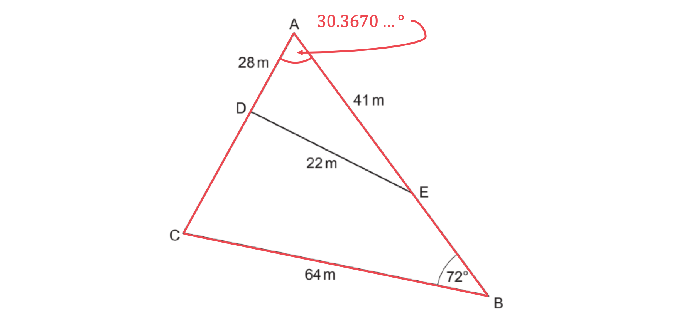

> *Work out the length of AC by substituting the values in the diagram into the sine rule, *$\frac{a}{\mathrm{sin}A}=\frac{b}{\mathrm{sin}B}$*.*

$\frac{\mathrm{AC}}{\mathrm{sin}72}=\frac{64}{\mathrm{sin}30.3670...}$

**[1]**

> *Multiply both sides by *$\mathrm{sin}72$*.*

$\mathrm{AC}=\mathrm{sin}72\times\frac{64}{\mathrm{sin}30.3670...}$

**[1]**

$\mathrm{AC}=120.4018...$

> *Find the length of DC by subtracting the length of AD from AC.*

$120.4018...-28=92.4018...$

> *The question does not ask for your answer to be given to a specific level of accuracy but it would be sensible to round your answer to 1 or 2 decimal places.*

$92.4m$* ***[1]**

**Answers between 92.28 and 92.6 will be accepted **
**Answers of 92 will also be accepted**

## Q35 — medium — 3 marks · exam-questions

### 20() — 3 marks
> *There are two pairs of opposite sides and angles in the diagram with only one unknown so you can use the sine rule, *$\frac{\mathrm{sin}A}{a}=\frac{\mathrm{sin}B}{b}$*, to find the size of the missing angle.*

$\frac{\mathrm{sin}y}{16}=\frac{\mathrm{sin}34}{10}$

**[1]**

> *Multiply both sides by 16.*

$\mathrm{sin}y=16\times\frac{\mathrm{sin}34}{10}$

**[1]**

> *Take *$\mathrm{sin}^{-1}$* of both sides.*

`y equals sin to the power of negative 1 end exponent open parentheses 16 cross times fraction numerator sin space 34 over denominator 10 end fraction close parentheses`

> *Put into your calculator and work out the value.*

$y=63.4710...$

> *The question states that angle *$y$* is obtuse but the current value is the acute angle.*

> *Find the obtuse angle by subtracting the acute angle from 180**o**.*

`table attributes columnalign right center left columnspacing 0px end attributes row y equals cell 180 minus 63.4710... end cell row blank equals cell 116.5289... end cell end table`

> *The question does not state a required degree of accuracy but it would be sensible to round the answer to 1 or 2 decimal places.*

$116.5\mathrm{degrees}$* ***[1]**

**Answers between 116.5 and 116.53 will be accepted**

## Q36 — hard — 7 marks · exam-questions

### 20() — 7 marks
> *Calculate the area, **A**, of the triangle ADC using the area of a triangle formula, *$A=\frac{1}{2}\timesbase\timesheight$*.*

`table row cell A subscript A D C end subscript end cell equals cell 1 half cross times 12 cross times 5 end cell end table`

**[1]**

`table row cell A subscript A D C end subscript end cell equals 30 end table`

> *Calculate the length AC using Pythagoras' theorem, *$c^{2}=a^{2}+b^{2}$*, on triangle ACD, where *$a$* and *$b$* are the lengths of the two shorter sides and *$c$* is the length of the hypotenuse.*

`table attributes columnalign right center left columnspacing 0px end attributes row cell AC squared end cell equals cell 5 squared plus 12 squared end cell end table`

**[1]**

`table attributes columnalign right center left columnspacing 0px end attributes row AC equals cell square root of 5 squared plus 12 squared end root end cell row AC equals cell square root of 25 plus 144 end root end cell row AC equals cell square root of 169 end cell end table`

**[1]**

`table row AC equals 13 end table`

> *You can now find the area of triangle ABC, **A**, using the formula for the area of a triangle, *$A=\frac{1}{2}ab\mathrm{sin}C$*, where *$a$* and *$b$* are two sides of the triangle and *$C$* is the angle in between them.*

$A_{ABC}=\frac{1}{2}\times3\times13\times\mathrm{sin}30$

**[1]**

> *Substitute the exact value *$\mathrm{sin}30=\frac{1}{2}$* into the equation.*

$A_{ABC}=\frac{1}{2}\times3\times13\times\frac{1}{2}$

**[1]**

> *Solve.*

$A_{ABC}=\frac{39}{4}=9.75$

> *Add the areas of both triangles together to find the total area of the land.*

$30+9.75=39.75$

**[1]**

> *Work out the total cost of the land by multiplying the total area by the cost per square kilometre.*

$10\times39.75$

`bold £ bold 397 bold. bold 5 bold space bold million`* ***[1]**

## Q37 — medium — 4 marks · exam-questions

### 18() — 4 marks
> *Calculate the area, **A**, of the field using the area of a triangle formula, *$A=\frac{1}{2}ab\mathrm{sin}C$*, where *$a$* and *$b$* are the lengths of two sides of the triangle and *$C$* is the angle between them.*

$A=\frac{1}{2}\times80\times100\times\mathrm{sin}30$

**[1]**

$A=2000$

**[1]**

> *Multiply the area of the field by the average mass of carrots that was harvested per square metre to find the total mass, **M**, that was harvested.*

$M=2.5\times2000$

**[1]**

$5000\mathrm{kg}$* ***[1]**

## Q38 — hard — 5 marks · exam-questions

### 22() — 5 marks
> *Draw D onto the diagram and then draw the right-angled triangle you are using to see the angle clearly*

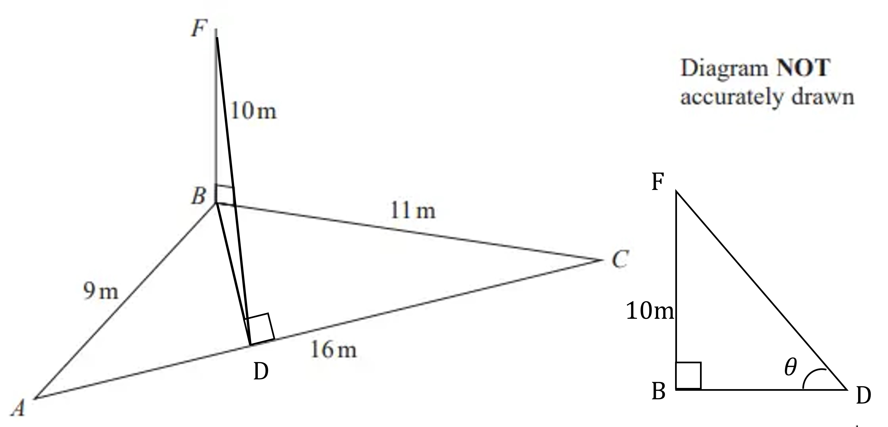

> *You need to know the length of BD or FD to be able to calculate the angle marked *$θ$* (which is the angle of elevation  of F from D)*

- *You do not have enough information to find FD*
- *So, using triangle ABC, start by calculating the angle BAC (or BCA)*
- *Then you'll be able to find the length BD using SOHCAHTOA*

> *Use the cosine rule to find angle BAC*

$a^{2}=b^{2}+c^{2}-2bc\mathrm{cos}A\,11^{2}=16^{2}+9^{2}-2\times16\times9\times\mathrm{cos}A$

**[M1]**

> *Simplify and solve that to find angle BAC (which is *$A$* in the equation)*

`table row 121 equals cell 256 plus 81 minus 288 cos A end cell row cell 288 cos A end cell equals cell 256 plus 81 minus 121 end cell row cell 288 cos A end cell equals 216 row cell cos A end cell equals cell 216 over 288 end cell end table`

`table row A equals cell cos to the power of negative 1 end exponent open parentheses 216 over 288 close parentheses equals cos to the power of negative 1 end exponent open parentheses 3 over 4 close parentheses equals 41.409... end cell end table`

**[M1]**

> *Calculate the length of BD using the triangle ABD*

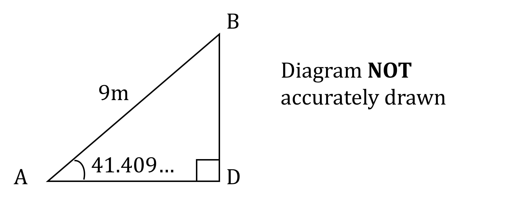

`table row cell sin open parentheses 41.409... close parentheses end cell equals cell fraction numerator B D over denominator 9 end fraction end cell end table`

`table row cell B D end cell equals cell 9 sin open parentheses 41.409... close parentheses equals 5.952... end cell end table`

**[M1]**

> *Now calculate the angle of elevation of F from D, which is angle BDF (this is marked as *$θ$* in the diagram near the top of this solution)*

`table row cell tan theta end cell equals cell fraction numerator 10 over denominator 5.952... end fraction end cell end table`

`table row theta equals cell tan to the power of negative 1 end exponent open parentheses fraction numerator 10 over denominator 5.952... end fraction close parentheses equals 59.234... end cell end table`

**[M1]**

> *Give your answer to 1 decimal place, as required*

**Final answer:** **59.2°**

**[A1]**

> **[mark-scheme]**
> Other valid methods leading to a correct solution will also get full marks. For example, you may start by finding angle *ACB* (instead of *BAC*), and then use that to find the length of *BD*.

## Q39 — medium — 7 marks · exam-questions

### 17((a)) — 4 marks
> *Find the length of AC in the triangle ADC as you know the length of two of the sides and the angle between them.*

> *You can use the cosine rule, *$a^{2}=b^{2}+c^{2}-2bc\mathrm{cos}A$*, where *$b$* and *$c$* are the sides that you know, *$A$* is the angle between them and *$a$* is the side that you are trying to find.*

$\mathrm{AC}^{2}=18^{2}+14^{2}-2\times18\times14\times\mathrm{cos}46$

**Attempt to use the cosine rule ****[1] **
**Correct substitution into the cosine rule**** [1]**

$\mathrm{AC}^{2}=169.8921...$

$\mathrm{AC}=13.0342...$

> *Round to 3 significant figures.*

$\mathrm{AC}=13.0\mathrm{cm}$* ***[1]**

### 17((b)) — 3 marks
> *Calculate the angle ABC by subtracting the angles BAC and ACB from 180 as angles in a triangle add up to 180**o**.*

*Angle ABC =** *$180-78-81=21$

**[1]**

> *You now have two pairs of opposite sides and angles on triangle ABC with only one unknown.*

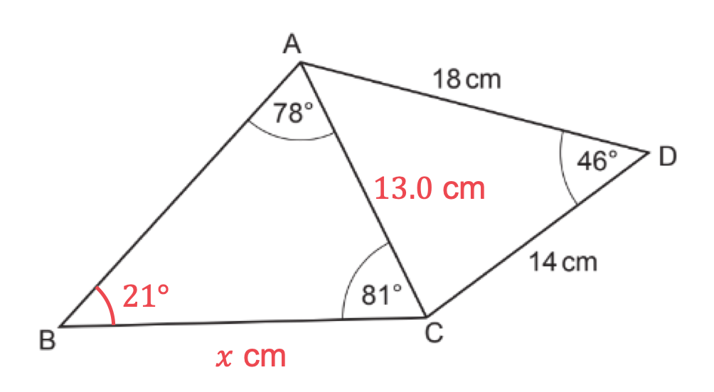

> *Use the sine rule, *$\frac{a}{\mathrm{sin}A}=\frac{b}{\mathrm{sin}B}$*, to find the length of the missing side BC.*

$\frac{x}{\mathrm{sin}78}=\frac{13}{\mathrm{sin}21}$

**[1]**

> *Multiply both sides of the equation by *$\mathrm{sin}78$*.*

$x=\mathrm{sin}78\times\frac{13}{\mathrm{sin}21}$

$x=35.4828...$

> *No specific accuracy is stated in the question but it would be sensible to round your answer to 1 or 2 decimal places.*

$35.5\mathrm{cm}$* ***[1]**

**Answers between 35.48 and 35.6 will be accepted**

## Q40 — medium — 3 marks · exam-questions

### 15((a)) — 3 marks
> *You know the lengths of two sides and the angle between them and you want to find the length of the third side. Therefore you need to use the cosine rule.*

> *The formula for the cosine rule is *$a^{2}=b^{2}+c^{2}-2bc\mathrm{cos}A$*, where **b** and **c** are the lengths of the two sides that form angle **A** and **a** is the length of the side opposite **A**. *
*Substitute **a** = **DF**, **b** = 10, **c** = 12 and **A** = 30 into the formula.*

`D F squared equals 10 squared plus 12 squared minus 2 open parentheses 10 close parentheses open parentheses 12 close parentheses cos open parentheses 30 close parentheses`

**[1]**

> *Type the expression into your calculator altogether as one line. If you do it separately you need to remember the order of operations (multiplication before addition).*

$DF^{2}=36.1539...$

**[1]**

> *Take the positive square root of both sides.*

`table row cell D F space end cell equals cell square root of 36.1539... end root end cell row blank equals cell 6.012811... end cell end table`

> *Round to 3 significant figures. Remember to include units for the length.*

$DF=6.01\mathrm{cm}(3s.f.)$* ***[1]**

## Q41 — medium — 4 marks · exam-questions

### 15((b)) — 4 marks
> *You know the length of one side and the angle opposite it. You also know another side so you can find the length of the side opposite that using the sine rule. *
*Note that the known angle is not in between the two known sides so you should not use the cosine rule here. *

> *The formula for the sine rule is *$\frac{\mathrm{sin}A}{a}=\frac{\mathrm{sin}B}{b}$*, where **a** and **b** are the lengths of the two sides that are opposite the angles **A **and **B **respectively.*

> *The side opposite angle ACB is not known, so we will need to find angle ABC first, let angle ABC be **x **and angle ACB be **y.*

> *Substitute **a** = **12.8**, **b** = 12.4, **A** = 63 and **B** = **x **into the formula for the sine rule.*

`fraction numerator sin open parentheses x close parentheses over denominator 12.4 end fraction equals fraction numerator sin open parentheses 63 close parentheses over denominator 12.8 end fraction`

**[1]**

> *Multiply both sides by 12.4 and type into your calculator.*

`table row cell sin open parentheses x close parentheses space end cell equals cell fraction numerator 12.4 cross times sin open parentheses 63 close parentheses over denominator 12.8 end fraction end cell row blank equals cell 0.863162... end cell end table`

**[1]**

> *Use the inverse sin (sin**-1**) button on your calculator to find **x.*

`x space equals space sin to the power of negative 1 end exponent open parentheses 0.863162... close parentheses space equals space 59.67355...`

> *Find **y **by subtracting angles ABC and BAC from 180°.*

$y=180-63-59.67355...$

**[1]**

> *Round to 1 decimal place. Remember to include units for the angle.*

$\mathrm{ACB}=57.3^{\circ}(1d.p.)$* ***[1]**
