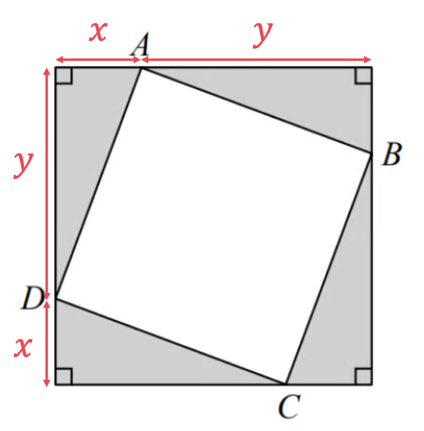
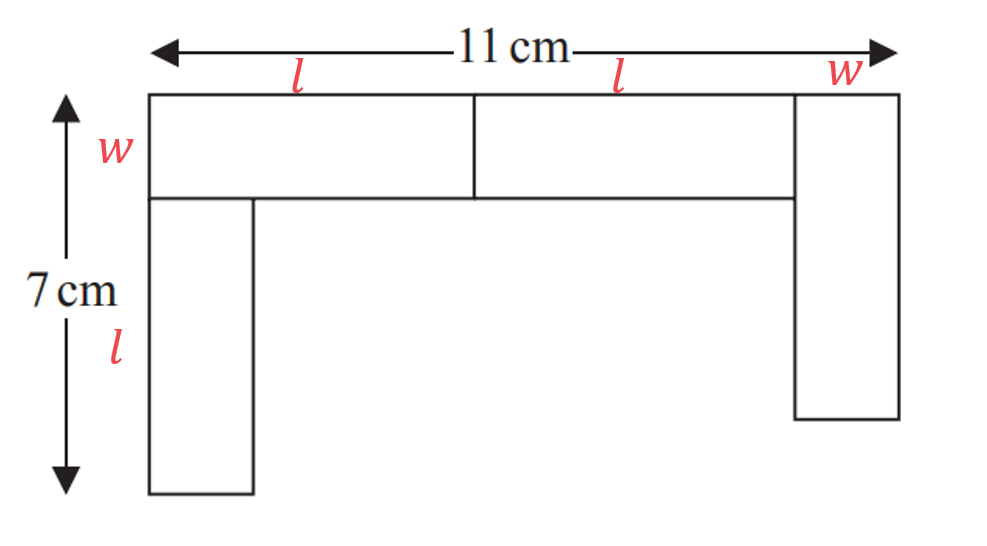
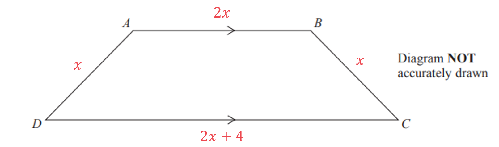
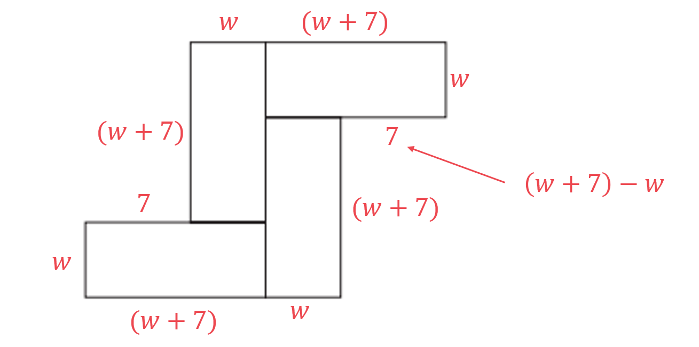
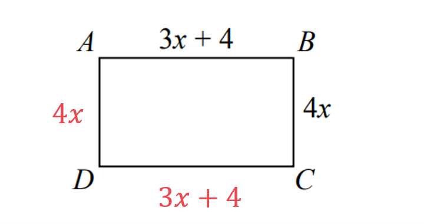
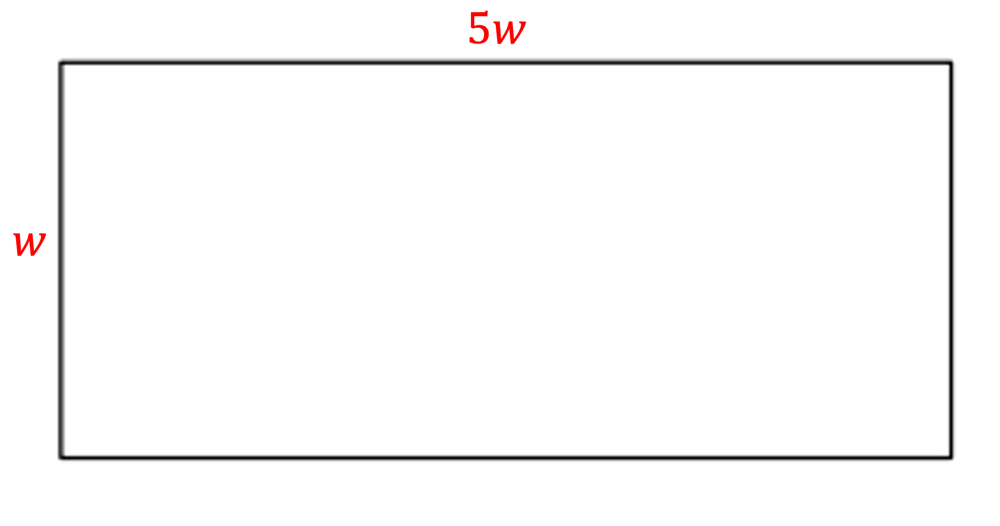
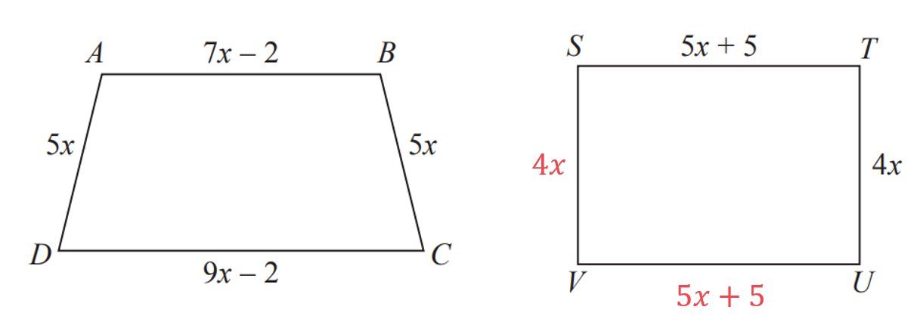
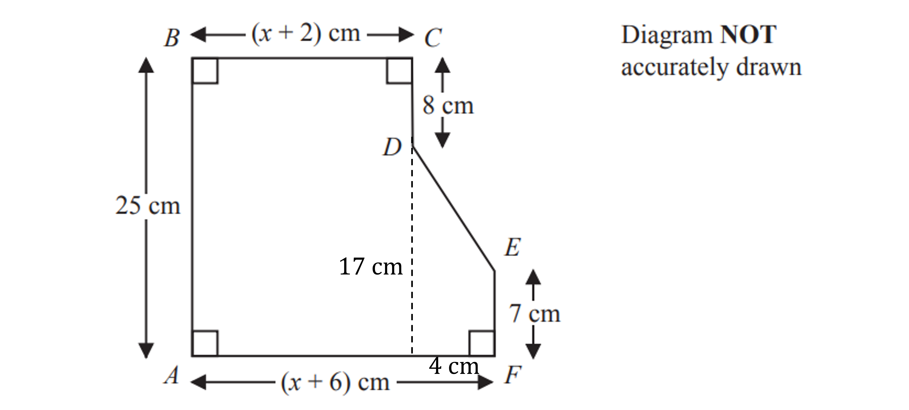

# Mark Schemes — Forming & Solving Equations
**Algebra & Sequences** · Edexcel IGCSE Maths A (Modular) (4XMAF/4XMAH) — 24/Higher Unit 2

## Q1 — hard — 4 marks · exam-questions

### 16() — 4 marks
> *Form an equation for the perimeter of the triangle in terms of *$x$*.*

`open parentheses x minus 1 close parentheses plus open parentheses 3 x plus 1 close parentheses plus 3 x equals 56`

**[1]**

> *Simplify by collecting like terms.*

$7x=56$

**[1]**

> *Divide both sides by 7.*

$x=8$

> *Substitute *$x=8$* into the expressions for the base and the perpendicular height of the triangle.*

*Base: *`3 open parentheses 8 close parentheses equals 24`* *

*Perpendicular height: *`open parentheses 8 close parentheses minus 1 equals 7`

> *Calculate the area of the triangle, using *$A=\frac{1}{2}bh$*, where *$b$*is the base *$h$* and is the perpendicular height.*

$A=\frac{1}{2}\times24\times7$

**[1]**

$84m^{2}$* ***[1]**

## Q2 — medium — 5 marks · exam-questions

### 16() — 5 marks
> *The both start with the same number, let this be *$x$*. *

> *Write down an expression for the number Julie has after she multiplies by 5 and adds 4. *

`Julie space open parentheses J close parentheses colon space 5 x space plus space 4`

> *Write down an expression for the number Liam has after he subtracts the number **from** 10. *

`Liam space open parentheses L close parentheses colon space 10 space minus space x`

** ****Either correct ****[1]**

> *We also know that Julie's answer is now two thirds of Liam's answer. Use this to form an equation.*

`table row cell J space end cell equals cell space 2 over 3 L end cell row cell 5 x space plus space 4 space end cell equals cell space 2 over 3 open parentheses 10 space minus space x close parentheses end cell end table`

**[1]**

> *Begin to solve the equation, remove the fraction by multiplying both sides by 3.*

`table attributes columnalign right center left columnspacing 0px end attributes row cell 3 open parentheses 5 x space plus space 4 close parentheses space end cell equals cell space 3 open parentheses 2 over 3 open parentheses 10 space minus space x close parentheses close parentheses end cell row cell 3 open parentheses 5 x space plus space 4 close parentheses space end cell equals cell space 2 open parentheses 10 space minus space x close parentheses end cell end table`

**[1]**

> *Expand the brackets on both sides.*

`table row cell 15 x space plus space 12 space end cell equals cell space 20 space minus space 2 x end cell end table`

> *Solve the linear equation, begin by adding *$2x$* to each side.*

`table row cell 15 x space plus space 12 space end cell equals cell space 20 space minus space 2 x end cell row cell plus 2 x space space space space space space space space space space space space space space space space space space end cell equals cell space space space space space space space space space space space space space space space space space space space plus 2 x end cell row cell 17 x space plus space 12 space end cell equals cell space 20 end cell row cell negative 12 space space space space space space space space space space space space space space space space space space end cell equals cell space space space space space space space space space space space space space space space space space space space minus 12 end cell row cell 17 x space end cell equals cell space 8 end cell row cell divided by 17 space space space space space space space space space space space space space space space space space space end cell equals cell space space space space space space space space space space space space space space space space divided by 17 end cell row cell x space end cell equals cell space 8 over 17 end cell end table`

** Method to isolate terms correct**** [1]**

**They both started with the number **$\frac{8}{17}$** [1]**

## Q3 — easy — 3 marks · exam-questions

### 3() — 3 marks
> *The perimeter of a shape is the sum of the lengths of its sides. For a rectangle this is length + width + length + width, or 2(length + width).*

> *Use this to form an expression for the perimeter of the rectangle.*

`table row cell P space end cell equals cell space l space plus space w space plus space l space plus space w space end cell row cell P space end cell equals cell space 2 l space plus space 2 w end cell row blank equals cell space 2 open parentheses x close parentheses space plus space 2 open parentheses x space plus space 4 close parentheses space end cell end table`

** **** [1]**

> *Form an equation for the perimeter of the rectangle, setting it equal to 45 cm.*

`table row cell Perimeter space end cell equals cell space 45 end cell row cell 2 open parentheses x close parentheses space plus space 2 open parentheses x space plus space 4 close parentheses space end cell equals cell space 45 end cell end table`

** **** [1]**

> *Simplify by first expanding the brackets and collecting the like terms.*

`table row cell 2 x space plus 2 x space plus space 8 space end cell equals cell space 45 end cell row cell 4 x space plus space 8 space end cell equals cell space 45 end cell end table`

> *Solve the equation to find *$x$*.*

`table row cell 4 x space plus space 8 space end cell equals cell space 45 end cell row cell negative 8 space space space space space space space space space space space space space space space space space space end cell equals cell space space space space space space space space space space space space space space space space space minus 8 end cell row cell 4 x space end cell equals cell space 37 end cell row cell divided by 4 space space space space space space space space space space space space space space space space space space end cell equals cell space space space space space space space space space space space space space space space space divided by 4 end cell row cell x space end cell equals cell space 37 over 4 space end cell end table`

$x=9.25\mathrm{cm}$**  ****[1]**

## Q4 — hard — 3 marks · exam-questions

### 7() — 3 marks
> *Method 1:*

> *Label the diagram with the dimensions of the triangles.*

> *Calculate the length of the hypotenuse of one of the right-angled triangles using Pythagoras' theorem, *$a^{2}+b^{2}=c^{2}$*.*

> *Substitute the lengths of the edges into the formula.*

`table row cell x squared plus y squared end cell equals cell A D squared end cell end table`

> *Take the square root of both sides.*

`table row cell square root of x squared plus y squared end root end cell equals cell A D end cell end table`

**[1]**

> *Calculate the area of the square **ABCD**.*

`table row cell Area space end cell equals cell space A D cross times A B end cell row blank equals cell square root of x squared plus y squared end root cross times square root of x squared plus y squared end root end cell end table`

**[1]**

> *Simplify.*

$x^{2}+y^{2}$ **[1]**

> *Method 2:*

> *Label the diagram with the dimensions of the triangles.*

> *Calculate area of the larger square.*

`Area space equals open parentheses x plus y close parentheses open parentheses x plus y close parentheses`

**[1]**

> *Calculate the area of one of the triangles, using the formula: *$A=\frac{1}{2}bh$*.*

$\mathrm{Area}=\frac{1}{2}xy$

> *Find the area of the square **ABCD** by subtracting the area of four triangles from the area of the larger square.*

`table row cell Area space end cell equals cell space open parentheses x plus y close parentheses open parentheses x plus y close parentheses minus 4 cross times 1 half x y end cell end table`

**[1]**

> *Expand brackets.*

$\mathrm{Area}=x^{2}+xy+xy+y^{2}-2xy$

> *Simplify.*

$x^{2}+y^{2}$ **[1]**

## Q5 — medium — 4 marks · exam-questions

### 4() — 4 marks
> *To find the area, the length and the width of the individual tiles needs to be found.*

> *Begin by labelling each part of the pattern with the length (**l **) and the width (**w **) of each tile.*

> *Use the given dimensions (7 cm and 11 cm) to form two equations in terms of **l ** and **w.*

`table row cell l space plus space w space end cell equals cell space 7 end cell row cell l space plus space l space plus space w space end cell equals cell space 11 end cell end table`

**Either correct**** [1]**

> *Simplify and number the equations.*

> `table row cell l space plus space w space end cell equals cell space 7 space space space space space space space space space space space space open parentheses 1 close parentheses end cell row cell 2 l space plus space w space end cell equals cell space 11 space space space space space space space space space space open parentheses 2 close parentheses end cell end table`* *

> *Eliminate the **w** terms by subtracting equation (1) from equation (2). Be careful to subtract every term.*

`space space space space space space space space space space 2 l space plus space w space equals space 11 space space space space space space space space space space space space
bottom enclose negative space space space space open parentheses space space space space l space plus space w space equals space 7 close parentheses space space space space space space end enclose
space space space space space space space space space space space space space l space space space space space space space space space space equals space 4`

**[1]**

> *Substitute *$l=4$* into either of the two original equations**.*

`open parentheses 1 close parentheses space space space space space 4 space plus space w space equals space 7`

> *Solve this equation to find** w.*

`table row cell w space end cell equals cell space 7 space minus space 4 space equals space 3 end cell end table`

> *So  **w**  =  3  and **l** = -4. Use this to find the area of one tile*

`table row cell Area subscript open parentheses o n e space t i l e close parentheses end subscript space end cell equals cell space 4 space cross times space 3 space equals space 12 space cm squared end cell end table`

> *The total area of the pattern will be the area of 4 tiles.*

`table row cell Area subscript open parentheses p a t t e r n close parentheses end subscript space end cell equals cell space 4 space cross times space 12 space equals space 48 space cm squared end cell end table`

**[1]**

$48\mathrm{cm}^{2}$* ***[1]**

## Q6 — easy — 3 marks · exam-questions

### 4() — 3 marks
> *Write down an expression, in terms of *$x$* for 6 currant buns.*

`table row cell 1 space currant space bun space end cell equals cell space x end cell row cell 6 space currant space buns space end cell equals cell 6 cross times space x space equals 6 x end cell end table`

> *Write down an expression, in terms of *$y$* for 8 iced buns.*

`table row cell 1 space iced space bun space end cell equals cell space y end cell row cell 8 space iced space buns space end cell equals cell 8 cross times space y space equals 8 y end cell end table`

** Either correct ****[1]**

> *T **is the total of 6 currant buns and 8 iced buns.*

> *Use this to write a formula for **T** in terms of **x** and **y**.*

`table row cell T space end cell equals cell space 6 space currant space buns space plus 8 space iced space buns space equals space 6 x space plus space 8 y end cell end table`

**Adding both terms ****[1]**

$T=6x+8y$**  ****[1]**

## Q7 — hard — 3 marks · exam-questions

### 7() — 3 marks
> *Let Becky (**B** ) have *$x$* marbles.*

> *Write down an expression, in terms of *$x$*, for the number of marbles that  Chris (**C **) and Dan (**D **) have.  *

`table row cell B space end cell equals cell space x end cell row cell C space end cell equals cell space 2 B space equals space 2 x end cell row cell D space end cell equals cell space C space plus space 7 space equals space 2 x space plus space 7 end cell end table`

**At least**** ****C**** ****or D correct**** [1]**

> *Use this to form an expression for the total number of marbles.*

`table row cell T space end cell equals cell space B space plus space C space plus space D end cell row blank equals cell space x space plus space 2 x space plus space open parentheses 2 x space plus space 7 close parentheses space end cell end table`

> *The total number of marbles is 57. *

> *Form an equation for the total number of marbles, setting it equal to 57.*

`table row cell T space end cell equals cell space 57 end cell row cell x space plus space 2 x space plus space 2 x space plus space 7 space end cell equals cell space 57 end cell row cell 5 x space plus space 7 space end cell equals cell space 57 end cell end table`

** **** [1]**

> *Solve the equation to find *$x$*.*

`table row cell 5 x space plus space 7 space end cell equals cell space 57 end cell row cell negative 7 space space space space space space space space space space space space space space space space space space end cell equals cell space space space space space space space space space space space space space space space space space minus 7 end cell row cell 5 x space end cell equals cell space 50 end cell row cell divided by 5 space space space space space space space space space space space space space space space space space space end cell equals cell space space space space space space space space space space space space space space space space divided by 5 end cell row cell x space end cell equals cell space 50 over 5 space equals space 10 end cell end table`

> *Dan can only be correct is his and Becky's marbles add up to double the number of Chris' marbles. *

> $x=10$* so Becky has 10 marbles, Chris has 2(10) = 20 marbles and Dan has 20 + 7 = 27 marbles.*

`table row cell B space plus space D space end cell equals cell space 10 space plus space 27 space not equal to space 2 C end cell end table`

**Dan is not correct, as he and Becky would need to have 40 marbles in total.****  [1]**

## Q8 — medium — 4 marks · exam-questions

### 9() — 4 marks
> *The perimeter of a shape is the sum of the lengths of its sides.*

> *Write down an expression, in terms of *$x$* for each of the lengths of the trapezium.*

`table row cell A D space end cell equals cell space x end cell row cell B C space end cell equals cell space A D space equals space x end cell row cell A B space end cell equals cell space 2 A D space equals space 2 x end cell row cell D C space end cell equals cell space A B space plus space 4 space equals space 2 x space plus space 4 end cell end table`

**At least AB or DC correct**** [1]**

> *Label the diagram with these expressions.*

> *Use this to form an expression for the perimeter of the trapezium.*

`table row cell P space end cell equals cell x space plus space 2 x space plus space x space plus space open parentheses 2 x space plus space 4 close parentheses space end cell end table`

** **** [1]**

> *Form an equation for the perimeter of the trapezium, setting it equal to 38 cm.*

`table row cell Perimeter space end cell equals cell space 38 end cell row cell x space plus space 2 x space plus space 2 x space plus space 4 space end cell equals cell space 38 end cell row cell 6 x space plus space 4 space end cell equals cell space 38 end cell end table`

** **** [1]**

> *Solve the equation to find *$x$*.*

`table attributes columnalign right center left columnspacing 0px end attributes row cell 6 x space plus space 4 space end cell equals cell space 38 end cell row cell negative 4 space space space space space space space space space space space space space space space space space space end cell equals cell space space space space space space space space space space space space space space space space space minus 4 end cell row cell 6 x space end cell equals cell space 34 end cell row cell divided by 6 space space space space space space space space space space space space space space space space space space end cell equals cell space space space space space space space space space space space space space space space space divided by 6 end cell row cell x space end cell equals cell space 34 over 6 space equals space 17 over 3 end cell end table`

$x=5\frac{2}{3}$**  ****[1] **

**Equivalent fraction or decimal also accepted**

## Q9 — easy — 3 marks · exam-questions

### 9() — 3 marks
> *Write down an expression, in terms of *$x$* for the number of small packets.*

`table row cell Number space of space envelopes space end cell equals cell 5 cross times space x space equals space 5 x end cell end table`

> *Write down an expression, in terms of *$y$* for the number of large packets.*

`table row cell Number space of space envelopes space end cell equals cell 20 cross times space y space equals space 20 y end cell end table`

** Either correct ****[1]**

> *T **is the total number of envelopes.*

> *Use this to write a formula for **T** in terms of **x** and **y**.*

`table row cell T space end cell equals cell space 5 x space plus space 20 y end cell end table`

**Adding both terms ****[1]**

$T=5x+20y$**  ****[1]**

## Q10 — hard — 5 marks · exam-questions

### 6() — 5 marks
> *Choose a variable for the width of the rectangle, for example, **w. **Form an expression in terms of **w**, for the length of the rectangle.*

`table row cell l space end cell equals cell space w space plus space 7 end cell end table`

**[1]**

> *Label each part of the diagram that would need to be added to form the perimeter.*

** At least 6 sides shown**** [1]**

> *Use the diagram to find an expression for the perimeter of the 8-sided shape. Make sure you add every part and do not miss any.  Starting at the top and working clockwise gives: *

`table row cell P space end cell equals cell space w space plus space open parentheses w space plus space 7 close parentheses space plus space w space plus space 7 space plus space open parentheses w space plus space 7 close parentheses space plus space w space plus space open parentheses w space plus space 7 close parentheses space plus space w space plus space 7 space plus space open parentheses w space plus space 7 close parentheses end cell end table`

**[1]**

> *Simplify by collecting the like terms.*

`table row cell P space end cell equals cell space w space plus space w space plus space w space plus space w space plus space w space plus space w space plus space w space plus space w space plus space 7 space space plus space 7 space plus space 7 plus space 7 space plus space 7 space plus space 7 end cell row blank equals cell space 8 w space plus space 42 end cell end table`

> *The perimeter is 70 cm, use this to form an equation.*

`table row cell 8 w space plus space 42 space end cell equals cell space 70 end cell end table`

> *Solve the equation to find **w**.*

> `table row cell 8 w space plus space 42 space end cell equals cell space 70 end cell row cell negative 42 space space space space space space space space space space space space space space space space space space space space space end cell equals cell space space space space space space space space space space space space space space space space minus 42 end cell row cell 8 w space end cell equals cell space 28 end cell row cell divided by 8 space space space space space space space space space space space space space space space space space space space space space end cell equals cell space space space space space space space space space space space space space space space space divided by 8 end cell row cell w space end cell equals cell space 28 over 8 space equals space 7 over 2 end cell end table`* *

> *Substitute **w** = 3.5 into the expression for the length of one of the rectangles.*

$l=w+7=3.5+7=10.5$

**[1]**

> *So  **w**  =  3.5  and **l**  = 10.5. Use this to find the area of one rectangle*

`table row cell Area subscript open parentheses o n e space r e c t a n g l e close parentheses end subscript space end cell equals cell space 3.5 space cross times space 10.5 space equals space 36.75 space cm squared end cell end table`

> *The total area of the 8-sided shape will be the area of 4 rectangles.*

`table row cell Area subscript open parentheses s h a p e close parentheses end subscript space end cell equals cell space 4 space cross times space 36.75 space equals space 147 space cm squared end cell end table`

$147\mathrm{cm}^{2}$* ***[1]**

## Q11 — medium — 4 marks · exam-questions

### 10() — 4 marks
> *The both start with the same number of sweets, let this be *$x$*. Write down an expression for the amount of sweets they each have after Gemma gives 24 sweets to Betty.*

`Gemma space open parentheses G close parentheses colon space x space minus space 24
Betty space open parentheses B close parentheses colon space x space plus space 24`

**[1]**

> *We also know that Betty now has 5 times as many sweets as Betty, use this and the expressions for the number of their sweets to form and equation.*

`table row cell B space end cell equals cell space 5 G end cell row cell open parentheses x space plus space 24 close parentheses space end cell equals cell space 5 open parentheses x space minus space 24 close parentheses end cell end table`

**[1]**

> *Begin to solve the equation by expanding the brackets on the right.*

`table row cell x space plus space 24 space end cell equals cell space 5 x space minus space 120 end cell end table`

> *Solve the linear equation, begin by subtracting *$x$* from each side.*

`table row cell x space plus space 24 space end cell equals cell space 5 x space minus space 120 end cell row cell negative x space space space space space space space space space space space space space space space space space space end cell equals cell space space space space space space space space space space space space space space space space space space space minus x end cell row cell 24 space end cell equals cell space 4 x space minus space 120 end cell row cell plus 120 space space space space space space space space space space space space space space space space space space end cell equals cell space space space space space space space space space space space space space space space space space space space plus 120 end cell row cell 144 space end cell equals cell space 4 x end cell row cell divided by 4 space space space space space space space space space space space space space space space space space space end cell equals cell space space space space space space space space space space space space space space space space divided by 4 end cell row cell fraction numerator 144 space over denominator 4 end fraction end cell equals cell space x space end cell row cell x space end cell equals cell space 36 end cell end table`

**[1]**

> *This shows that Gemma and Betty each started with 36 sweets.  In total, they started with 2(36) sweets.*

**72 sweets**** [1]**

## Q12 — easy — 3 marks · exam-questions

### 3() — 3 marks
> *We know that angle **AOB **and angle **AOC** are equal. *

> *Use this and the expressions given in the diagram to form an equation.*

`table attributes columnalign right center left columnspacing 0px end attributes row cell A O B space end cell equals cell space A O C end cell row cell 6 x space minus space 21 space end cell equals cell space 4 x space plus space 31 end cell end table`

**[1]**

> *Solve the linear equation, begin by subtracting *$x$* from each side.*

`table row cell 6 x space minus space 21 space end cell equals cell space 4 x space plus space 31 end cell row cell negative 4 x space space space space space space space space space space space space space space space space space space end cell equals cell space space space space space space space space space space space space space space space space space space space minus 4 x end cell row cell 2 x space minus space 21 space end cell equals cell space 31 end cell row cell plus 21 space space space space space space space space space space space space space space space space space space end cell equals cell space space space space space space space space space space space space space space space space space space space plus 21 end cell row cell 2 x space end cell equals cell space 52 end cell row cell divided by 2 space space space space space space space space space space space space space space space space space space end cell equals cell space space space space space space space space space space space space space space space space divided by 2 end cell row cell x space end cell equals cell space 52 over 2 space end cell end table`

** ****Correct method to isolate terms**** [1]**
** **`table row cell bold italic x bold space end cell bold equals cell bold space bold 26 bold degree end cell end table`** ****[1]**

## Q13 — hard — 5 marks · exam-questions

### 9() — 5 marks
> *Form an expression for the perimeter of the rectangle, remember that opposite sides are equal and label each of the other two sides. *

> *Use this to form an expression for the perimeter of the rectangle.*

`table row cell P subscript r e c t end subscript space end cell equals cell space 4 x space plus space open parentheses 3 x space plus space 4 close parentheses space plus space 4 x space plus space open parentheses 3 x space plus space 4 close parentheses space end cell end table`

> *Form an expression for the perimeter of the trapezium by adding the expressions given for each of the sides. *

`table row cell P subscript t r a p end subscript space end cell equals cell space 5 x space plus space open parentheses x space minus space 3 close parentheses space plus space 5 x space plus space open parentheses 7 x space minus space 3 close parentheses space end cell end table`

**Either expression formed **** [1]**

> *Form an equation by setting the expressions for the perimeter of the rectangle and the perimeter of the trapezium equal to each other.*

`table row cell 4 x space plus space open parentheses 3 x space plus space 4 close parentheses space plus space 4 x space plus space open parentheses 3 x space plus space 4 close parentheses space space end cell equals cell space 5 x space plus space open parentheses x space minus space 3 close parentheses space plus space 5 x space plus space open parentheses 7 x space minus space 3 close parentheses space end cell end table`

** **** [1]**

> *Simplify both sides by collecting the like terms together.*

`table row cell 4 x space plus space 3 x space plus space 4 space plus space 4 x space plus space 3 x space plus space 4 space space end cell equals cell space 5 x space plus space x space minus space 3 space plus space 5 x space plus space 7 x space minus space 3 space end cell row cell 4 x space plus space 3 x space plus space 4 x space plus space 3 x space plus space 4 space plus space 4 space space end cell equals cell space 5 x space plus space x space plus space 5 x space plus space 7 x space minus space 3 space minus space 3 space end cell row cell 14 x space plus space 8 space end cell equals cell space 18 x space minus space 6 end cell end table`

> *Solve the equation to find *$x$*, begin by subtracting the term with the smallest coefficient of *$x$*.*

`table row cell 14 x space plus space 8 space end cell equals cell space 18 x space minus space 6 end cell row cell negative 14 x space space space space space space space space space space space space space space space space space space end cell equals cell space space space space space space space space space space space space space space space space space minus 14 x end cell row cell space 8 space end cell equals cell space 4 x space minus space 6 end cell row cell plus 6 space space space space space space space space space space space space space space space space space space end cell equals cell space space space space space space space space space space space space space space space space space plus 6 end cell row cell 14 space end cell equals cell space 4 x end cell row cell divided by 4 space space space space space space space space space space space space space space space space space space end cell equals cell space space space space space space space space space space space space space space space space divided by 4 end cell row cell 14 over 4 space end cell equals cell space x space end cell end table`

**[1]**

> *Substitute *$x=3.5$* into the expression for the length and width of the rectangle.*

`w space equals space 4 x space equals space 4 open parentheses 3.5 close parentheses space equals space 14
l space equals space 3 x space plus space 4 space equals space 3 open parentheses 3.5 close parentheses space plus space 4 space equals space 14.5`

> *So  **w**  =  14 cm  and **l**  = 14.5 cm. *

> *Use this to find the area of the rectangle.*

`table row cell Area subscript open parentheses r e c t a n g l e close parentheses end subscript space end cell equals cell space 14 space cross times space 14.5 space equals space 203 space cm squared end cell end table`

**[1]**

$203\mathrm{cm}^{2}$* ***[1]**

## Q14 — medium — 3 marks · exam-questions

### 9() — 3 marks
*The volume of a cuboid is given by length × width × height.*

> *Write down an expression for the volume by multiplying the expressions for each together.*

$V=x\times3x\times2x=6x^{3}$

**[1]**

> *Write an **inequality** for the volume by setting this as **less than **900. *

> *The symbol for less than is <.*

$6x^{3}<900$

**[1]**

> *Begin to solve the inequality by dividing both sides by 6.*

`table row cell 6 x cubed space end cell less than cell space 900 end cell row cell x cubed space end cell less than cell fraction numerator space 900 over denominator 6 end fraction end cell row cell x cubed space end cell less than cell space 150 end cell end table`

> *This is a non calculator paper so finding the cube root of 150 is not possible. Instead, consider the values of the cube numbers you do know.*

`table row cell 5 cubed space end cell equals cell space 125 space less than space 150 space space rightwards double arrow space x space must space be space greater space than space 5 end cell end table`

`table row cell 6 cubed space end cell equals cell space 216 space greater than space 150 space space rightwards double arrow space x space must space be space less space than space 6 end cell end table`

> *This shows that *$x$* is between 5 and 6, and *$x$* is an integer so it can be at most 5. *

$x\leq5$ 
**Full reasoning shown**** [1]**

## Q15 — easy — 3 marks · exam-questions

### 4() — 3 marks
> *Method 1*

> *Write down an expression for the area of each part of the square individually.*

**At least two correct ****[1]**

> *The total area of the square will be the total of these four areas added together. *

> *Form an expression for the total area of the square.*

$\mathrm{Total} \mathrm{area}=9+3x+3x+x^{2}$

> *Form an equation by setting the total area equal to 10.*

`table attributes columnalign right center left columnspacing 0px end attributes row cell 9 space plus space 3 x space plus space 3 x space plus space x squared space end cell equals cell space 10 end cell end table`

**[1]**

> *Simplify.*

`table row cell x squared space plus space 6 x space plus space 9 space end cell equals cell space 10 end cell end table`

> *Reach the equation given in the question by subtracting 9 from each side.*

`table row cell x squared space plus space 6 x space plus space 9 space end cell equals cell space 10 end cell row cell negative 9 space space space space space space space space space space space space space space space space space space space space space space space space space space space end cell equals cell space space space space space space space space space space space space space space space space space space space minus 9 end cell row cell x squared space plus space 6 x space end cell equals cell space 1 end cell end table`

$x^{2}+6x=1$** [1]**

> *Method 2*

> *Add the two parts together to write down an expression for the side of the square.*

$AB=AD=3+x$

> *The total area of the square will be this expression squared. Form an expression for the total area of the square.*

`Total space area space equals open parentheses 3 space plus space x close parentheses squared`

** ****[1]**

> *Expand the brackets, remember to multiply each term in the first by each term in the second.*

`table row cell open parentheses 3 space plus space x close parentheses open parentheses 3 space plus space x close parentheses space end cell equals cell space 9 space plus space 3 x space plus space 3 x space plus space x squared end cell end table`

> *Simplify.*

`table row cell Total space area space end cell equals cell space x squared space plus space 6 x space plus space 9 space end cell end table`

> *Form an equation by setting this equal to 10.*

`table row cell x squared space plus space 6 x space plus space 9 space end cell equals cell space 10 end cell end table`

**[1]**

> *Reach the equation given in the question by subtracting 9 from each side.*

`table row cell x squared space plus space 6 x space plus space 9 space end cell equals cell space 10 end cell row cell negative 9 space space space space space space space space space space space space space space space space space space space space space space space space space space space end cell equals cell space space space space space space space space space space space space space space space space space space space minus 9 end cell row cell x squared space plus space 6 x space end cell equals cell space 1 end cell end table`

$x^{2}+6x=1$** [1]**

## Q16 — hard — 5 marks · exam-questions

### 23() — 5 marks
> *Form an expression for the area of the rectangle.*

`table row cell A subscript r e c t end subscript space end cell equals cell space length space cross times space width space equals space open parentheses 3 x space minus space 2 close parentheses open parentheses x space minus space 1 close parentheses space end cell end table`

> *Form an expression for the area of the triangle using the formula *$A=\frac{1}{2}bh$*. *

`table row cell A subscript t r i end subscript space end cell equals cell space 1 half open parentheses x close parentheses open parentheses 2 x close parentheses end cell end table`

**Both expressions formed **** [1]**

> *Form an **inequality **by setting the expression for the area of the rectangle **greater than **the expression for the area of the triangle.*

`table row cell open parentheses 3 x space minus space 2 close parentheses space open parentheses x space minus space 1 close parentheses space space end cell greater than cell space 1 half open parentheses x close parentheses open parentheses 2 x close parentheses end cell end table`

> *Simplify the left-hand side by expanding the double brackets and collecting the like terms together.*

`table row cell 3 x squared space minus space 3 x space minus space 2 x space plus space 2 space space end cell greater than cell space 1 half open parentheses x close parentheses open parentheses 2 x close parentheses end cell row cell 3 x squared space minus space 5 x space plus space 2 space space end cell greater than cell space 1 half open parentheses x close parentheses open parentheses 2 x close parentheses end cell end table`

> *Simplify the right-hand side by cancelling the 2s.*

`table row cell 3 x squared space minus space 5 x space plus space 2 space space end cell greater than cell space fraction numerator 1 over denominator up diagonal strike 2 end fraction open parentheses x close parentheses open parentheses up diagonal strike 2 x close parentheses end cell row cell 3 x squared space minus space 5 x space plus space 2 space space end cell greater than cell space space x squared end cell end table`

> *Rearrange to make this a quadratic equation equal to zero.*

`table row cell 3 x squared space minus space 5 x space plus space 2 space minus space x squared space end cell greater than cell space 0 end cell row cell 2 x squared space minus space 5 x space plus space 2 space space end cell greater than cell space 0 end cell end table`

** **** [1]**

> *Begin to factorise by multiplying 2 by 2.*

*2 × 2 = 4*

> *Find two numbers that multiply to give 4 and add to give -5 (the middle number)*

*-1 and -4*

> *Split the middle term into -**x** and -4**x.*

$2x^{2}-x-4x+2>0$

> *Factorise fully the first pair of terms and the second pair of terms, either 2 or -2 could be factorised out of the last two terms, but the aim is to get the brackets the same so -2 should be factorised. *

`x open parentheses 2 x space minus space 1 close parentheses space minus space 2 open parentheses 2 x space minus space 1 close parentheses space greater than space 0`

> *Factorise out the whole (2**x** - 1) bracket as if it were one term, leaving **x **and -2 in their own bracket.*

`open parentheses x space minus space 2 close parentheses open parentheses 2 x space minus space 1 close parentheses space greater than space 0`

** **** [1]**

> *This means that the graph of *$y=2x^{2}-5x+2$* has roots at *$x=2$* and *$x=\frac{1}{2}$*.*

> *We are interested in the region where **y** is greater than 0, so this will be where the graph is above the **x-**axis. *

> *As the quadratic is positive, this will be in the regions above and below the roots.*

> * *$x>2\mathrm{and}x<\frac{1}{2}$

**allowing sign errors**** [1]**

> *Considering the expressions given for the length and width of the rectangle, we can find restrictions on the value of **x. **Remember that both the length and the width must be positive.*

`l space equals space 3 x space minus space 2 space rightwards double arrow x space greater than fraction numerator space 2 space over denominator 3 end fraction open parentheses as space l space greater than space 0 close parentheses
w space equals space x space minus space 1 space space rightwards double arrow space x space greater than space 1 space space open parentheses as space w space greater than space 0 close parentheses`

> *As *$x>1$*, disregard *$x<\frac{1}{2}$*.*

$x>2$* ***[1]**

## Q17 — medium — 4 marks · exam-questions

### 14() — 4 marks
> *Method 1*

> *Let potatoes be **p** and carrots be **c. *

> *Use the information in the question to write two equations:*

> *3 kg of potatoes = 3**p, **4 kg of carrots = 4**c *

$3p+4c=440$

> *4 kg of potatoes = 4**p, **3 kg of carrots = 3**c *

$4p+3c=470$

> *Number the equations.*

> `table row cell 3 p space plus space 4 c space end cell equals cell space 440 space space space space space space space space space space space space open parentheses 1 close parentheses end cell row cell 4 p space plus space 3 c space end cell equals cell space 470 space space space space space space space space space space space space open parentheses 2 close parentheses end cell end table`* *

**[1]**

> *This is a non calculator paper so the easiest method is to spot that adding the two equations will give and equal number of potatoes and carrots.*

> *The questions asks for the price of 1 kg of potatoes and 1 kg of carrots, so there is no need to find their individual prices.*

> *Add equation (1) to equation (2).*

`table row cell space space space space space space 3 p space plus space 4 c space equals space 440 space end cell row cell bottom enclose plus space open parentheses 4 p space plus space 3 c space equals space 470 space close parentheses end enclose
space space space space space space 7 p space plus space 7 c space equals space 910 space end cell end table space space space space space space space space space space space space`

**[1]**

> *This gives the cost of 7 kg of potatoes and 7 kg of carrots. *

> *Find the cost of 1 kg of each by dividing by 7.*

`space space 7 p space plus space 7 c space equals space 910 space
7 open parentheses p space plus space c close parentheses space equals space 910 space
space space space space space p space plus space c space equals fraction numerator space 910 over denominator 7 end fraction`

**[1]**

> *This finds the total cost of 1 kg of carrots and 1 kg of potatoes.*

$p+c=130p$* ***[1]**

> *Method 2*

> *Let potatoes be **p** and carrots be **c. *

> *Use the information in the question to write two equations:*

> *3 kg of potatoes = 3**p, **4 kg of carrots = 4**c *

$3p+4c=440$

> *4 kg of potatoes = 4**p, **3 kg of carrots = 3**c *

$4p+3c=470$

> *Number the equations.*

> `table row cell 3 p space plus space 4 c space end cell equals cell space 440 space space space space space space space space space space space space open parentheses 1 close parentheses end cell row cell 4 p space plus space 3 c space end cell equals cell space 470 space space space space space space space space space space space space open parentheses 2 close parentheses end cell end table`* *

**[1]**

> *Make the **p** terms equal by multiplying all parts of equation (1) by 4 and all parts of equation (2) by 3.*

> `table row blank blank cell 4 open parentheses 1 close parentheses space space space space space space space space space space space space 4 open parentheses 3 p space plus space 4 c space equals space 440 close parentheses space end cell row blank blank cell 3 open parentheses 2 close parentheses space space space space space space space space space space space space 3 open parentheses 4 p space plus space 3 c space equals space 470 close parentheses space space space space end cell end table`*  *

> *This gives the two new equations:*

`table row cell 12 p space plus 16 c space end cell equals cell space 1760 space space space space space space space space space space space space space open parentheses 3 close parentheses end cell row cell 12 p space plus space space 9 c space end cell equals cell space 1410 space space space space space space space space space space space space space open parentheses 4 close parentheses end cell end table`

> *Eliminate the **p** terms by subtracting equation (4) from equation (3).*

`space space space space space space 12 p plus space 16 c space equals space 1760 space space space space space space space space space space space space
bottom enclose space minus open parentheses 12 p space plus space 9 c space equals space 1410 close parentheses space end enclose
space space space space space space space space space space space space space space space space space space space 7 c space equals space 350 space`

**[1]**

> *Solve the equation to find** c  **by dividing both sides by 7.*

`table row cell c space end cell equals cell space 350 over 7 equals space 50 end cell end table`

> *Substitute *$c=50$* into either of the two original equations**.*

`table row cell open parentheses 2 close parentheses space space space space space 3 p space plus space 4 c space end cell equals cell space 440 end cell row cell 3 p space plus space 4 open parentheses 50 close parentheses space end cell equals cell space 440 space end cell row cell 3 p space plus space 200 space end cell equals cell space 440 end cell end table`

> *Solve this equation to find** p.*

`table row cell 3 p space plus space 200 space end cell equals cell space 440 end cell row cell 3 p space end cell equals cell space 240 end cell row cell p space end cell equals cell 240 over 3 space equals 80 space end cell end table`

**[1]**

> *This means that 1 kg of carrots is 50p and 1 kg of potatoes is 80p.*

> *Add them together to get the total.*

$p+c=130p$* ***[1]**

## Q18 — easy — 4 marks · exam-questions

### 4() — 4 marks
> *The internal angles of a triangle sum to 180°.*

$30+4x+10+x+20=180$

**adding the three angles ****[1]** 
**equating the sum of the three angles to 180 ****[1]**

> *Simplify and collect all **x** terms on one side and all constant terms on the other.*

`table attributes columnalign right center left columnspacing 0px end attributes row cell 5 x plus 60 end cell equals 180 row cell 5 x end cell equals 120 end table`

**[1]**

> *Divide both sides by 5.*

$x=24$ **[1]**

## Q19 — hard — 4 marks · exam-questions

### 15() — 4 marks
> *Let adult tickets be **a** and child tickets be **c. *

> *Use the information in the question to write two equations.*

> *3 adult tickets = 3**a, **1 child ticket = **c,** add these and set equal to 30. *

$3a+c=30$

> *1 adult ticket = **a, **3 child tickets = 3**c,** add these and set equal to 22. *

$a+3c=22$

**[1]**

> *Number the equations.*

> `table row cell 3 a space plus space c space end cell equals cell space 30 space space space space space space space space space space space space open parentheses 1 close parentheses end cell row cell a space plus space 3 c space end cell equals cell space 22 space space space space space space space space space space space space open parentheses 2 close parentheses end cell end table`* *

> *Make the **c** terms equal by multiplying all parts of equation (1) by 3.*

> `3 open parentheses 1 close parentheses space space space space space space space space space space space space 3 open parentheses 3 a space plus space c space equals space 30 close parentheses space
space space open parentheses 2 close parentheses space space space space space space space space space space space space space space space space a space plus space 3 c space equals space 22 space space space space`*  *

> *This gives the two equation with the same coefficient of **c.*

`table row cell 9 a space plus 3 c space end cell equals cell space 90 space space space space space space space space space space space space space open parentheses 3 close parentheses end cell row cell a space plus space 3 c space end cell equals cell space 22 space space space space space space space space space space space space space open parentheses 2 close parentheses end cell end table`

> *Eliminate the **c** terms by subtracting equation (2) from equation (3).*

`space space space space space space space space space table row blank blank 9 end table table row blank blank a end table table row blank blank space end table table row blank blank plus end table table row blank blank 3 end table table row blank blank c end table table row blank blank space end table table row blank equals blank end table table row blank blank space end table table row blank blank 90 end table space space space space space space space space space space space space
bottom enclose space minus space space space open parentheses table row cell space a space plus 3 c space end cell equals cell space 22 end cell end table close parentheses space end enclose
space space space space space space space space 8 a space space space space space space space space space space space equals space 68 space`

**[1]**

> *Solve the equation to find** a  **by dividing both sides by 8.*

`table row cell a space end cell equals cell space 68 over 8 equals space 8.5 end cell end table`

> *Substitute *$a=8.5$* into either of the two original equations**.*

`table row cell open parentheses 1 close parentheses space space space space space 3 a space plus space c space end cell equals cell space 30 end cell row cell 3 open parentheses 8.5 close parentheses space plus space c space end cell equals cell space 30 space end cell row cell 25.5 space plus space c space end cell equals cell space 30 end cell end table`

**[1]**

> *Solve this equation to find** c.*

`table row cell c space plus space 25.5 space end cell equals cell space 30 end cell row cell c space end cell equals cell space 30 space minus space 25.5 end cell row cell c space end cell equals cell space 4.5 space end cell end table`

> *This means that 1 adult ticket costs £8.50 and 1 child ticket costs £4.50. *

**Adult ticket = £8.50 **
**      Child ticket =  £4.50 ****[1]**

## Q20 — medium — 3 marks · exam-questions

### 11() — 3 marks
> *Method 1*

> *Angles in a quadrilateral add up to 360**o**.*

*Write down an equation adding together all four angles.*

$2x+2x+(3x-15)+(2x+24)=360$

> *You can rewrite the equation without brackets.*

$2x+2x+3x-15+2x+24=360$

**[1]**

> *Rearrange the equation so that like terms are next to each other, remember to keep the sign in front of each term the same as it was when you re-arrange. *

$2x+2x+3x+2x-15+24=360$

> *Add/subtract the like terms, being careful with negatives!*

$9x+9=360$

**[1]**

> *Solve the equation. *

> *It may be easiest to factorise the 9 out first.*

`table row cell 9 x space plus space 9 space end cell equals cell space 360 end cell row cell 9 open parentheses x space plus space 1 close parentheses space end cell equals cell space 360 end cell row cell x space plus space 1 space end cell equals cell fraction numerator space 360 over denominator 9 end fraction space end cell row cell x space plus space 1 end cell equals cell space 40 end cell row cell x space end cell equals cell space 39 end cell end table`

$x=39^{\circ}$ **[1]**

> *Method 2*

> *Opposite angles in a parallelogram are equal.*

> *Write down an equation for the two opposite angles that have **different **expressions.*

$3x-15=2x+24$

**[1]**

> *Solve the equation by first bringing the **x** terms to one side. *

> * The easiest method is to subtract the **x** term with the smallest coefficient.*

`table row cell 3 x space minus space 15 space end cell equals cell space 2 x space plus space 24 space end cell row cell negative 2 x space space space space space space space space space space space space space space space space space space end cell equals cell space space space space space space space space space space space space space space space space minus 2 x end cell row cell x space minus space 15 space end cell equals cell space 24 end cell end table`

> *Add 15 to both sides.*

`table row cell x space minus space 15 space end cell equals cell space 24 end cell row cell plus space 15 space space space space space space space space space space space space space space space space space space end cell equals cell space space space space space space space space space space space space space space space space plus 15 end cell row cell x space end cell equals cell space 39 space end cell end table`

**[1]**

$x=39^{\circ}$ **[1]**

## Q21 — easy — 4 marks · exam-questions

### 3() — 4 marks
> *The number of buttons in tin **B** in terms of **x** is;*

$4x$

> *The number of buttons in tin **C** in terms of **x** is;*

$x-7$

**for  "**$4x$**" or "**$x-7$**" ****[1]**

> *Add the number of buttons in tin **A**, tin **B** and tin **C,** in terms of **x** and equate to 137.*

$x+4x+x-7=137$

**[1]**

> *Simplify and solve.*

`table row cell 6 x minus 7 end cell equals 137 row cell 6 x end cell equals 144 end table`

**[1]**

> *Divide both sides by 6 to obtain the number of buttons in tin **A.*

`table row x equals 24 end table`

> *Finally, subtract 7 to find the number of buttons in tin C.*

`table attributes columnalign right center left columnspacing 0px end attributes row cell 24 minus 7 end cell equals 17 end table`

**Answer = 17** **[1]**

## Q22 — hard — 4 marks · exam-questions

### 11() — 4 marks
> *Let the cost of a tea be **t** and the cost of a coffee be **c. *

> *Use the information in the question to write two equations.*

> *3 teas = 3**t, **2 coffees = 2**c,** add these and set equal to 7.8 (£7.80). *

$3t+2c=7.8$

> *5 teas = 5**t, **4 coffees = 4**c,** add these and set equal to 14.2 (£14.20). *

$5t+4c=14.2$

**[1]**

> *Number the equations.*

> `table row cell 3 t space plus space 2 c space end cell equals cell space 7.8 space space space space space space space space space space space space space space open parentheses 1 close parentheses end cell row cell space 5 t space plus space 4 c space end cell equals cell space 14.2 space space space space space space space space space space space space open parentheses 2 close parentheses end cell end table`* *

> *Make the **c** terms equal by multiplying all parts of equation (1) by 2.*

`2 open parentheses 1 close parentheses space space space space space space space space space space space space 2 open parentheses 3 t space plus space 2 c space equals 7.8 close parentheses space
space space open parentheses 2 close parentheses space space space space space space space space space space space space space space space table attributes columnalign right center left columnspacing 0px end attributes row blank blank space end table table attributes columnalign right center left columnspacing 0px end attributes row blank blank 5 end table table attributes columnalign right center left columnspacing 0px end attributes row blank blank t end table table attributes columnalign right center left columnspacing 0px end attributes row blank blank space end table table attributes columnalign right center left columnspacing 0px end attributes row blank blank plus end table table attributes columnalign right center left columnspacing 0px end attributes row blank blank space end table table attributes columnalign right center left columnspacing 0px end attributes row blank blank 4 end table table attributes columnalign right center left columnspacing 0px end attributes row blank blank c end table table attributes columnalign right center left columnspacing 0px end attributes row blank blank space end table table attributes columnalign right center left columnspacing 0px end attributes row blank equals blank end table table attributes columnalign right center left columnspacing 0px end attributes row blank blank space end table table attributes columnalign right center left columnspacing 0px end attributes row blank blank 14 end table table attributes columnalign right center left columnspacing 0px end attributes row blank blank. end table table attributes columnalign right center left columnspacing 0px end attributes row blank blank 2 end table space space`*  *

> *This gives two equations with the same coefficient of **c.*

`table row cell 6 t space plus space 4 c space end cell equals cell space 15.6 space space space space space space space space space space space space open parentheses 3 close parentheses end cell row cell space 5 t space plus space 4 c space end cell equals cell space 14.2 space space space space space space space space space space space space open parentheses 2 close parentheses end cell end table`

> *Eliminate the **c** terms by subtracting equation (2) from equation (3).*

`space space space space space space space space space table row blank blank space end table table row blank blank space end table table row blank blank 6 end table table row blank blank t end table table row blank blank space end table table row blank blank plus end table table row blank blank space end table table row blank blank 4 end table table row blank blank c end table table row blank blank space end table table row blank equals blank end table table row blank blank space end table table row blank blank 15 end table table row blank blank. end table table row blank blank 6 end table space space space space space space space space
bottom enclose space minus space space space open parentheses table row cell space 5 t space plus space 4 c space end cell equals cell space 14.2 end cell end table close parentheses space end enclose
space space space space space space space space space space space space space space t space space space space space space space space space space space equals space 1.4`

**[1]**

> *Substitute *$t=1.4$* into either of the two original equations**.*

`table row cell open parentheses 1 close parentheses space space space space space 3 t space plus 2 c space end cell equals cell space 7.8 end cell row cell 3 open parentheses 1.4 close parentheses space plus space 2 c space end cell equals cell space 7.8 space end cell row cell 4.2 space plus space 2 c space end cell equals cell space 7.8 end cell end table`

**[1]**

> *Solve this equation to find** c.*

`table row cell 2 c space end cell equals cell space 7.8 space minus space 4.2 end cell row cell 2 c space end cell equals cell space 3.6 end cell row cell c space end cell equals cell fraction numerator 3.6 over denominator 2 end fraction space equals space 1.8 end cell end table`

> *This means that 1 tea costs £1.40 and 1 coffee costs £1.80. *

**One tea = £1.40    **
**   One coffee = £1.80 ****[1]**

## Q23 — medium — 4 marks · exam-questions

### 10() — 4 marks
> *The perimeter of a shape is the sum of the lengths of its sides. For a rectangle this is length + width + length + width, or 2(length + width).*

> *Use this to form an expression for the perimeter of the rectangle.*

`table row cell P space end cell equals cell space l space plus space w space plus space l space plus space w space end cell row cell P space end cell equals cell space 2 l space plus space 2 w end cell row blank equals cell space 2 open parentheses 4 space plus space 3 x close parentheses space plus space 2 open parentheses x space plus space 6 close parentheses space end cell end table`

** **** [1]**

> *Form an equation for the perimeter of the rectangle, setting it equal to 32 metres.*

`table row cell Perimeter space end cell equals cell space 32 end cell row cell 2 open parentheses 4 space plus space 3 x close parentheses space plus space 2 open parentheses x space plus space 6 close parentheses space end cell equals cell space 32 end cell end table`

** **** [1]**

> *Simplify by first expanding the brackets and collecting the like terms.*

`table row cell 2 open parentheses 4 space plus space 3 x close parentheses space plus space 2 open parentheses x space plus space 6 close parentheses space end cell equals cell space 32 end cell row cell 8 space plus space 6 x space plus space 2 x space plus space 12 space end cell equals cell space 32 end cell row cell 8 x space plus space 20 space end cell equals cell space 32 end cell end table`

> *Solve the equation to find *$x$*.*

`table row cell 8 x space plus space 20 space end cell equals cell space 32 end cell row cell negative 20 space space space space space space space space space space space space space space space space space space end cell equals cell space space space space space space space space space space space space space space space space space minus 20 end cell row cell 8 x space end cell equals cell space 12 end cell row cell divided by 8 space space space space space space space space space space space space space space space space space space end cell equals cell space space space space space space space space space space space space space space space space divided by 8 end cell row cell x space end cell equals cell space 12 over 8 space end cell end table`

**[1]**

$x=1.5$**  ****[1]**

## Q24 — easy — 1 marks · exam-questions

### 1() — 1 marks
> *To find *$b$* you would first square root *$a$*, **then** add 3.*

**The first option is correct, **$b=\sqrt{a}+3$ **[1]**

> *The second option would mean *$b$* is 3 less than the square root of *$a$*.*

> *The third option would mean *$b$* is the square root of '*$a$* plus 3' (add three to *$a$* then square root).*

> *The fourth option would mean *$b$* is the square root of '3 less than *$a$*'.*

## Q25 — hard — 5 marks · exam-questions

### 22((a)) — 2 marks
> *Substitute the values in the diagram into the formula for the area of a trapezium. *

> *The formula is *`A equals 1 half open parentheses a space plus space b close parentheses h`*, where *$a$* and *$b$* are the two parallel sides and *$h$* is the perpendicular height.*

`A space equals space 1 half cross times open parentheses open parentheses x minus 4 close parentheses plus open parentheses x plus 5 close parentheses close parentheses cross times 2 x`

**[1]**

> *The area is given as 351 cm**2**, so set this expression equal to 351.*

`space 1 half cross times open parentheses open parentheses x minus 4 close parentheses plus open parentheses x plus 5 close parentheses close parentheses cross times 2 x space equals space 351`

> *Simplify the expression in the brackets.*

`table row cell space 1 half cross times open parentheses 2 x space plus space 1 close parentheses cross times 2 x space end cell equals cell space 351 end cell end table`

> *Cancel out the 2.*

`table row cell space fraction numerator 1 over denominator up diagonal strike 2 end fraction cross times open parentheses 2 x space plus space 1 close parentheses cross times up diagonal strike 2 x space end cell equals cell space 351 end cell row cell x open parentheses 2 x space plus space 1 close parentheses space end cell equals cell space 351 end cell end table`

> *Expand the brackets on the right hand side.*

`table row cell 2 x squared space plus space x space end cell equals cell space 351 end cell end table`

> *Subtract 351 from both sides.*

`table row cell 2 x squared space plus space x space minus space 351 space end cell equals cell space 0 end cell end table`

$2x^{2}+x-351=0$ **[1]**

### 22((b)) — 3 marks
> *Substitute the given values into the quadratic formula*

> *Given an equation of the form *$ax^{2}+bx+c=0$*, the quadratic formula is *$x=\frac{-b\pm\sqrt{b^{2}-4ac}}{2a}$*.*

> *Identify the values of **a, b **and **c.*

$a=2,b=1,c=-351$

> *Substitute into the quadratic formula.*

$x=\frac{-1\pm\sqrt{1^{2}-4\times2\times-351}}{2\times2}$

** [1]**

> *Simplify the right hand side.*

$x=\frac{-1\pm\sqrt{2809}}{4}$

** [1]**

> *Work out the two results by doing the calculation twice, once using the positive sign and once using the negative sign in front of the square root.*

$x=13$* or *$x=-13.5$

> *Considering the diagram in part (a), the height of the trapezium is *$2x$*, so *$x$* must be positive.*

** **$x=13$** ****[1]**

## Q26 — medium — 3 marks · exam-questions

### 1() — 3 marks
> *Angles in a triangle add up to 180°. *

> *The right angle equals 90°, so the two algebraic expression add up to 180° - 90°.*

> *Use this to form an equation.*

$7x+5x+18=180-90$

**[1]**

> *Simplify.*

$12x+18=90$

> *Solve the equation to find *$x$*.*

`table row cell 12 x space plus space 18 space end cell equals cell space 90 end cell row cell 12 x space end cell equals cell space 90 space minus space 18 space end cell row cell 12 x space end cell equals cell space 72 end cell row cell x space end cell equals cell space 72 over 12 space equals space 6 end cell end table`

** [1]**

> *Now substitute *$x=6$* into the expressions for each of the angles.*

`7 x space equals space 7 open parentheses 6 close parentheses space equals space 42 degree
5 x space plus space 18 space equals space 5 open parentheses 6 close parentheses space plus space 18 space equals space 48 degree`

**The smallest angle = 42°**** [1]**

## Q27 — easy — 3 marks · exam-questions

### 19() — 3 marks
> *If we call the width *$w$* then the length is *$5w$* we can label the shape as below.*

> *Area of a rectangle = length × width. Substitute 1620, '*$5w$*' and '*$w$*' into this formula.*

$1620=5w\timesw$

**[1]**

> *Simplify and start to solve by dividing both sides by 5.*

`table row 1620 equals cell 5 w squared end cell row cell divided by 5 space space space space space space space end cell equals cell space space space space divided by 5 end cell row 324 equals cell w squared end cell end table`

**[1]**

> *Square root both sides, ignoring the negative value as *$w$* is the width and must be positive.*

`table row cell square root of 324 end cell equals cell w equals 18 end cell end table`

**the width is 18 cm** **[1]**

## Q28 — easy — 4 marks · exam-questions

### 2((b)) — 4 marks
> *Find an expression for the total number of bars*

$y+3y+7+2y-5$

**[M1]**

> *Collect the like terms*

$6y+2$

> *Form an equation to solve*

$6y+2=56$

**[M1]**

> *Solve the equation by first subtracting *$2$* from each side*

$6y=54$

> *Divide both sides by *$6$

$y=9$

**[M1]**

> *Substitute this into the expression for the number of zinc bars*

$2\times9-5$

$18-5$

$13$

**[A1]**

## Q29 — hard — 4 marks · exam-questions

### 7() — 4 marks
> *Split the shape up into two rectangles, use a horizontal line to split the shape so that the length of the smaller rectangle can be determined in terms of *$x$*.*

> *Find the area of each rectangle separately. *

> *Rectangle **A** has a length of 15 m and a width of 8 m.*

$\mathrm{Area}_{A}=15\times8=120$

> *Rectangle **B** has a length of *`open parentheses 15 space minus space x close parentheses`* m and a width of 3 m.*

`Area subscript B space equals space 3 open parentheses 15 space minus space x close parentheses`

**[1]**

> *Write down an expression for the total area of the floor plan by adding the two expressions together.*

`Area space equals space 120 space plus space 3 open parentheses 15 space minus space x close parentheses`

> *Write an **equation **for the area by setting the expression for the area equal to 138.*

`120 space plus space 3 open parentheses 15 space minus space x close parentheses space equals space 138`

**[1]**

> *Expand the brackets and simplify by collecting like terms.*

`table row cell 120 space plus space 45 space minus space 3 x space end cell equals cell space 138 end cell row cell 165 space minus space 3 x space end cell equals cell space 138 end cell end table`

> *Isolate the **x** term by subtracting 165.*

`table row cell 165 space minus space 3 x space end cell equals cell space 138 end cell row cell negative 3 x space end cell equals cell space minus 27 end cell end table`

**[1]**

> *Solve the equation by dividing both sides by -3.*

`table row cell 165 space minus space 3 x space end cell equals cell space 138 end cell row cell negative 3 x space end cell equals cell space minus 27 end cell row cell x space end cell equals cell space fraction numerator negative 27 over denominator negative 3 end fraction end cell end table`

$x=9$** [1]**

## Q30 — medium — 5 marks · exam-questions

### 8() — 5 marks
> *The key to the question is to realise that because the two angles are equal, the shape is an isosceles triangle. *

> *The two longer sides given in terms of *$x$* must be equal. Hence*

$3x-5=19-x$

**[1]**

> *Now solve the equation to find *$x$*.*

`table row cell 3 x space minus space 5 space end cell equals cell space 19 space minus space x end cell row cell 4 x space minus space 5 space end cell equals cell space 19 end cell row cell 4 x space end cell equals cell space 24 end cell row cell x space end cell equals cell space 24 over 4 space equals space 6 end cell end table`

** ****Part of method correct**** [1]  **
**Answer correct**** [1]**

> *Now substitute *$x=6$* into the expressions for each of the side lengths and add them together to find the perimeter.*

`table row cell P space end cell equals cell space 3 x space minus space 5 space plus space 19 space minus space x space plus space 2 x end cell row blank equals cell space 3 open parentheses 6 close parentheses space minus space 5 space plus space 19 space minus space open parentheses 6 close parentheses space plus space 2 open parentheses 6 close parentheses end cell end table`

**[1]**

> *Evaluate the answer for the perimeter.*

$P=38\mathrm{cm}$** [1]**

## Q31 — hard — 5 marks · exam-questions

### 16() — 5 marks
> *Form an expression for the perimeter of the rectangle, remember that opposite sides are equal and label each of the other two sides. *

> *Use this to form an expression for the perimeter of the rectangle.*

`table row cell P subscript r e c t end subscript space end cell equals cell space 4 x space plus space open parentheses 5 x space plus space 5 close parentheses space plus space 4 x space plus space open parentheses 5 x space plus space 5 close parentheses space end cell end table`

**[1]**

> *Form an expression for the perimeter of the trapezium by adding the expressions given for each of the sides. *

`table row cell P subscript t r a p end subscript space end cell equals cell space 5 x space plus space open parentheses 7 x space minus space 2 close parentheses space plus space 5 x space plus space open parentheses 9 x space minus space 2 close parentheses space end cell end table`

**[1]**

> *Form an equation by setting the expressions for the perimeter of the rectangle and the perimeter of the trapezium equal to each other.*

`table row cell 4 x space plus space open parentheses 5 x space plus space 5 close parentheses space plus space 4 x space plus space open parentheses 5 x space plus space 5 close parentheses space space end cell equals cell space 5 x space plus space open parentheses 7 x space minus space 2 close parentheses space plus space 5 x space plus space open parentheses 9 x space minus space 2 close parentheses space end cell end table`

** **** [1]**

> *Simplify both sides by collecting the like terms together.*

`table row cell 4 x space plus space 5 x space plus space 5 space plus space 4 x space plus space 5 x space plus space 5 space space end cell equals cell space 5 x space plus 7 x space minus space 2 space plus space 5 x space plus space 9 x space minus space 2 space end cell row cell 4 x space plus space 5 x space plus space 4 x space plus space 5 x space plus space 5 space plus space 5 space space end cell equals cell space 5 x space plus space 7 x space plus space 5 x space plus space 9 x space minus space 2 space minus space 2 space end cell row cell 18 x space plus space 10 space end cell equals cell space 26 x space minus space 4 end cell end table`

> *Solve the equation to find *$x$*, begin by subtracting the term with the smallest coefficient of *$x$*.*

`table attributes columnalign right center left columnspacing 0px end attributes row cell 18 x space plus space 10 space end cell equals cell space 26 x space minus space 4 end cell row cell negative 18 x space space space space space space space space space space space space space space space space space space end cell equals cell space space space space space space space space space space space space space space space space space minus 18 x end cell row cell space 10 space end cell equals cell space 8 x space minus space 4 end cell row cell plus 4 space space space space space space space space space space space space space space space space space space end cell equals cell space space space space space space space space space space space space space space space space space plus 4 end cell row cell 14 space end cell equals cell space 8 x end cell row cell divided by 8 space space space space space space space space space space space space space space space space space space end cell equals cell space space space space space space space space space space space space space space space space divided by 8 end cell row cell 14 over 8 space end cell equals cell space x space end cell row cell x space end cell equals cell space 7 over 4 space equals space 1.75 end cell end table`

**[1]**

> *Substitute *$x=1.75$* into the expression for the length of **ST**.*

`S T space equals 5 x space plus space 5 space equals space 5 open parentheses 1.75 close parentheses space plus space 5 space equals space 8.75 space plus space 5`

$13.75\mathrm{cm}$* ***[1] **
**Equivalent fraction also accepted.**

## Q32 — medium — 5 marks · exam-questions

### 5() — 5 marks
> *Let Redlands, **R**, be **x **years old and use this to write expressions for the ages of St Samuels, **S**, and Francis Long School, **F. *

$R=x\,S=2x\,F=x-7$

** Either expression for S or F correct**** [1]**

> *Find the number of students by dividing the total amount paid by the amount paid by each student. *

`table attributes columnalign right center left columnspacing 0px end attributes row cell Number space of space students space end cell equals cell space 1155 over 15 space equals space 77 end cell end table`

**[1]**

> *The word total means 'the sum of', so add the expressions together and form an equation for the total number of students by setting this equal to 77.*

`table row cell R space plus space S space plus space F space end cell equals cell space 77 end cell row cell x space plus space 2 x space plus space open parentheses x space minus space 7 close parentheses space end cell equals cell space 77 end cell row cell 4 x space minus space 7 space end cell equals cell space 77 end cell end table`

**[1]**

> *Now solve the equation to find *$x$*.*

`table row cell 4 x space minus space 7 space end cell equals cell space 77 end cell row cell plus 7 space space space space space space space space space space space space space space space space space space end cell equals cell space space space space space space space space space space space space space space space space plus 7 end cell row cell 4 x space end cell equals cell space 84 end cell row cell divided by 4 space space space space space space space space space space space space space space space space space space end cell equals cell space space space space space space space space space space space space space space space space divided by 4 end cell row cell x space end cell equals cell space 84 over 4 space end cell row blank equals cell space 21 end cell end table`

> $x=21$* means that there were 21 students from Redlands School.  *

> *Now substitute *$x=21$* into the expressions for **S **and **F.*

`table row cell R space end cell equals cell space x space equals space 21 end cell row cell S space end cell equals cell space 2 x space equals space 2 open parentheses 21 close parentheses end cell row cell F space end cell equals cell space x space minus space 7 space equals space 21 space minus space 7 space end cell end table`

**Redlands: 21 students      **** **
**St Samuels: 42 students      **
** ****Francis Long: 14 students****  ****[2]**

## Q33 — hard — 4 marks · exam-questions

### 17() — 4 marks
> *The ratio states that the second part is double the first part*

> *Form an equation using the first ratio*

$3x+5=2x^{2}$

**[1]**

> *Rewrite as a quadratic expression equal to zero*

$2x^{2}-3x-5=0$

**[1]**

> *Find the solutions by factorising or using the quadratic formula*

`open parentheses 2 x minus 5 close parentheses open parentheses x plus 1 close parentheses equals 0`

**[1]**

> *Solve*

$x=\frac{5}{2},x=-1$

**[1]**

## Q34 — medium — 4 marks · exam-questions

### 6() — 4 marks
> *The key to the question is to realise that because the shape is a rectangle, the parallel sides given in terms of *$x$* must be equal. Hence*

$2x+6=5x-9$

**[1]**

> *Now solve the equation to find *$x$*.*

`table row cell 2 x space plus space 6 space end cell equals cell space 5 x space minus space 9 end cell row cell 6 space end cell equals cell space 3 x space minus space 9 end cell row cell 15 space end cell equals cell space 3 x end cell row cell x space end cell equals cell space 5 end cell end table`

**[1]**

> *Now substitute *$x=5$* into *$2x+6$* or *$5x-9$* to find the longest side length.*

`table row cell 2 open parentheses 5 close parentheses space plus space 6 space end cell equals cell space 16 space space space space space space space or space space space space space space 5 open parentheses 5 close parentheses space minus space 9 space equals space 16 end cell end table`

**[1]**

> *Area = length × width. We have a length of 16, a width of *$y$*, and the area is 48, so*

`table row cell 16 y space end cell equals cell space 48 end cell row cell y space end cell equals cell space 48 over 16 space equals space 3 end cell end table`

$y=3$** [1]**

## Q35 — hard — 5 marks · exam-questions

### 19((a)) — 2 marks
> *Method 1*

> *If 5 more boys and 8 more girls join there will be *

$x+5$* **boys and *$y+8$* girls*

> *If there are half as many boys as girls then;*

`x plus 5 equals 1 half open parentheses y plus 8 close parentheses`

**[1]**

> *Multiply both sides by 2 to clear the fraction.*

$2x+10=y+8$

> *And subtract 8 from both sides.*

$2x+2=y$** [1]**

> *Method 2*

> *If 5 more boys and 8 more girls join there will be *

$x+5$* **boys and *$y+8$* girls*

> *If there are half as many boys as girls then;*

`2 open parentheses x plus 5 close parentheses equals y plus 8`

**[1]**

> *Expand the bracket.*

$2x+10=y+8$

> *And subtract 8 from both sides.*

$2x+2=y$** [1]**

### 19((b)) — 3 marks
> *If 10 more boys and 1 more girls join there will be;*

*'*$x+10$*' boys and '*$y+1$*' girls*

> *The number of boys equals the number of girls.*

$x+10=y+1$

**[1]**

> *Subtract one from both sides.*

$x+9=y$

> *If we combine this with the equation given in part (a), then we have a pair of simultaneous equations.*

$y=x+9\mathrm{and}y=2x+2$

> *We can solve these by elimination or substitution. Here we will use substitution.*

$x+9=2x+2$

**[1]**

`table row cell x plus 9 end cell equals cell 2 x plus 2 end cell row cell negative x space space space space space space space space space end cell equals cell space space space space space space space space space minus x end cell row 9 equals cell x plus 2 end cell row cell negative 2 space end cell equals cell space space space space minus 2 end cell row 7 equals x end table`

> *Solve, in this case by subtracting  *`table row blank blank x end table`* and then subtracting 2 from both sides.*

$x=7$** [1]**

> *Be careful! We have not fully answered the question until we have found *`table attributes columnalign right center left columnspacing 0px end attributes row blank blank y end table`*. Substitute *`table row x equals 7 end table`* into *`table row y equals cell x plus 9 end cell end table`* or *`table attributes columnalign right center left columnspacing 0px end attributes row y equals cell 2 x plus 2 end cell end table`*.*

`table row y equals cell 7 plus 9 equals 16 space space space space or space space space y equals 2 open parentheses 7 close parentheses plus 2 equals 16 end cell end table`

$y=16$* ***[1]**

**Perform a mental check; "7 boys and 10 more join means 17 boys; 16 girls and one more joins means 17 girls; the same number of boys and girls" **

## Q36 — medium — 4 marks · exam-questions

### 3() — 4 marks
> *Let Ali, **A**, by **y  **years old and use this to write expressions for the ages of Bhavara, **B**, and Ceris, **C. *

$A=y\,B=2y\,C=y-3$

**[1]**

> *The word total means 'the sum of', so add the expressions together and form an equation by setting this equal to 125.*

`table row cell A space plus space B space plus space C space end cell equals cell space 125 end cell row cell y space plus space 2 y space plus space open parentheses y space minus space 3 close parentheses space end cell equals cell space 125 end cell row cell 4 y space minus space 3 space end cell equals cell space 125 end cell end table`

**[1]**

> *Now solve the equation to find *$y$*.*

`table row cell 4 y space minus space 3 space end cell equals cell space 125 end cell row cell plus 3 space space space space space space space space space space space space space space space space space space end cell equals cell space space space space space space space space space space space space space space space space plus 3 end cell row cell 4 y space end cell equals cell space 128 end cell row cell divided by 4 space space space space space space space space space space space space space space space space space space end cell equals cell space space space space space space space space space space space space space space space space divided by 4 end cell row cell y space end cell equals cell space 128 over 4 space end cell row blank equals cell space 32 end cell end table`

**[1]**

> $y=32$* means that Ali is 32 years old.  *

> *Now substitute *$y=32$* into the expressions for **B **and **C.*

`table row cell A space end cell equals cell space y space equals space 32 end cell row cell B space end cell equals cell space 2 y space equals space 2 open parentheses 32 close parentheses end cell row cell C space end cell equals cell space y space minus space 3 space equals space 32 space minus space 3 end cell end table`

**Ali: 32 years       **
** ****Bhavara: 64 years    **
**  **** ****Ceris: 29 years****  ****[1]**

## Q37 — hard — 4 marks · exam-questions

### 10((a)) — 2 marks
*The area of a trapezium *`equals 1 half open parentheses a plus b close parentheses h`* wh*ere $a$ and $b$ are the parallel lengths and $h$ is the height.

Theref*ore the area of the trapezium here is;*

`1 half open parentheses b plus 2 b close parentheses h`

**[1]**

> *Simplify the expression by collecting terms inside the bracket.*

`equals 1 half open parentheses 3 b close parentheses h equals 3 over 2 b h`

$\frac{3}{2}bh$ **[1] **

**Other forms such as **$\frac{3bh}{2}$** or **$1.5bh$** are accepted- but not with brackets**

### 10((b)) — 2 marks
> *First write an expression for the perimeter in terms of *$b$* and *$s$*.*

`table row perimeter equals cell b plus space 2 b plus s plus s end cell row blank equals cell 3 b plus 2 s end cell end table`

**[1]**

> *Convert the ratio *$b:s=2:3$* to a fraction.*

`table row cell b over s end cell equals cell fraction numerator space 2 over denominator 3 end fraction end cell end table`

> *Rearrange to find *$s$* in terms of *$b$*. We can start by "cross multiplying". *

`table row cell 3 b end cell equals cell 2 s end cell row cell 1.5 b end cell equals s end table`

> *Substitute *$s=1.5b$* into the expression found above for perimeter.*

`table row perimeter equals cell 3 b plus 2 open parentheses 1.5 b close parentheses end cell row blank equals cell 3 b plus 3 b end cell row blank equals cell 6 b end cell end table`

**perimeter =**** **$6b$** [1]**

## Q38 — medium — 4 marks · exam-questions

### 18((a)) — 3 marks
> *The area of the net is a large rectangle with four smaller squares taken off.*

> *The area of the large rectangle, in terms of *$x$*, is;*

`x open parentheses x plus 5 close parentheses`

> *The area of each corner that is taken off is;*

$10\times10=100$

> *So the area of the net is;*

`x open parentheses x plus 5 close parentheses minus 100`

**[1]**

> *The area of the net is 1000 cm**2** so the expression above can be equated to 1000.*

`x open parentheses x plus 5 close parentheses minus 100 equals 1400`

**[1]**

> *Expand the bracket and subtract 1400 from both sides.*

`table row cell x squared plus 5 x minus 100 end cell equals 1400 row cell negative 1400 space space space space space space space space space space space space space space space space space space space space end cell equals cell space space space space space space space minus 1400 end cell row cell x squared minus 5 x minus 1500 end cell equals 0 end table`

**[1]**

### 18((b)) — 1 marks
> *Although the solution to the quadratic equation is correct, in the context of the question, *$x$* cannot be negative as it is a length, and lengths must be positive.*

**Final answer:** **No, only **$x=35$** is correct because **$x$** cannot be negative (as it is a length).**** [1]**

**"No" must be accompanied by a valid statement to achieve the mark**

## Q39 — hard — 3 marks · exam-questions

### 8() — 3 marks
> *You could do this by trial and error, adding £4.50 and £4 to their respective totals over and over and checking each time whether the ratio has become 15 : 8. *

> *That could take a long time, however, so it's better to use a more algebraic approach.*

> *Call the number of weeks from the start "**N **". Then write a formula in terms of **N** for how much they each have after **N** weeks.*

$\mathrm{Theo}:18+4.5N\,\,\mathrm{James}:4N$

**[1]**

> *Next turn the ratio we are looking for into an equation with the expressions for James' and Theo's money. *

> *Begin solving the equation.*

`Theo over James space equals space fraction numerator 18 plus 4.5 N over denominator 4 N end fraction space equals space 15 over 8

8 space cross times space open parentheses 18 plus 4.5 N close parentheses space equals space 15 space cross times space 4 N

144 space plus space 36 N space equals space 60 space N`

**[1]**

> *Finish solving the equation to find the value of **N**.*

$144=60N-36N\,\,144=24N\,\,N=144\div24=6$

**Final answer:** **6 weeks****  [1]**

## Q40 — medium — 3 marks · exam-questions

### 12() — 3 marks
> *Angles that meet at a point add up to 360°. We can use this angle property to write an equation in *$x$*.*

`x plus 2 open parentheses 2 x plus 20 close parentheses plus 5 x plus 40 equals 360`

**[1]**

> *Expand the bracket and then collect like terms.*

`table attributes columnalign right center left columnspacing 0px end attributes row cell x plus 4 x plus 40 plus 5 x plus 40 end cell equals 360 row cell 10 x plus 80 end cell equals 360 end table`

> *Subtract 80 from both sides, and divide by 10.*

`table attributes columnalign right center left columnspacing 0px end attributes row cell 10 x end cell equals 280 row x equals 28 end table`

**[1]**

> *If **AC** is a diameter then the angle marked '*$5x+40$*' will be 180°. Substitute *$x=28$* into *$5x+40$*.*

`table row cell bold 5 stretchy left parenthesis 28 stretchy right parenthesis bold plus bold 40 end cell bold equals cell bold 180 bold space end cell end table`**, yes ****AC**** is a diameter ****[1]**

**"yes" without correct working does not achieve marks**

## Q41 — medium — 4 marks · exam-questions

### 3() — 4 marks
> *Using the angle rule for co-interior angles summing to 180°, form an equation to calculate the value of *$x$

$3x+46+4x-27=180$

**[M1]**

> *Solve the equation*

`table row cell 7 x plus 19 end cell equals 180 row cell 7 x end cell equals 161 row x equals 23 end table`

**[A1]**

> *Calculate the size of angle ABC*

`3 open parentheses 23 close parentheses plus 46 equals 115`

**[M1]**

> *Also calculate the size of angle BCD to see which is largest*

`180 minus open parentheses 3 cross times 23 plus 10 close parentheses equals 101`

> *Therefore angle ABC is the largest*

**Final answer:** **115°**

**[A1]**

## Q42 — hard — 5 marks · exam-questions

### 19() — 5 marks
> *Start by working out how many of each size cake she makes. Add up the ratio numbers to find the number of 'parts' that the 192 cakes are divided into.*

> * Then divide 192 by that sum to find the size of one part.*

$7+6+11=24\,\,192\div24=8$

**[1]**

> *So one part is 8 cakes. *

> *To find the amount of each size of cake, multiply 8 by the respective ratio numbers.*

$\mathrm{small}:8\times7=56\,\,\mathrm{medium}:8\times6=48\,\,\mathrm{large}:8\times11=88$

**[1]**

> *Call the profit for one small cake "**x** ". *

> *Then the profit for a medium cake is 2**x**, and the profit for a large cake is 3**x. *

> *Use this and the numbers of cakes from above to set up an equation equal to the total profit. *

> *Begin to solve the equation.*

`open parentheses 56 cross times x close parentheses space plus space open parentheses 48 cross times 2 x close parentheses space plus space open parentheses 88 cross times 3 x close parentheses space equals space 532.48

56 x space plus space 96 x space plus 264 x space equals space 532.48

416 x space equals space 532.48`

**[1] **
**The mark here is for setting up a correct equation.**

> *Finish solving the equation to find the value of **x**  (which is also the profit for one small cake).*

$x=532.48\div416=1.28$

**[1]**

**£1.28****  [1]**

## Q43 — hard — 4 marks · exam-questions

### 7() — 4 marks
> *We don't know how much money they have to start, all we know is the ratio. But because of that ratio, we can say that Sundip starts with £3**k** and Emma starts with £5**k** (where **k** is a constant).*

> *After Emma spends £450, Sundip still has £3**k** and Emma has £(5**k** - 450). Those amounts are in the ratio 2 : 3. Write that as a ratio and then rewrite the ratio as an equation with fractions.*

`3 k space colon space open parentheses 5 k minus 450 close parentheses space equals space 2 space colon space 3

fraction numerator 5 k minus 450 over denominator 3 k end fraction space equals space 3 over 2`

**[2] **

**1 mark for setting up an equation that will allow you to find how much money Sundip or Emma has..**
** ****1 mark for correctly using the ratio information in the equation (here that would be the 3/2 on the right hand side of the second equation).**

> *Now solve that equation for **k**.*

`2 cross times space open parentheses 5 k minus 450 close parentheses space equals space 3 space cross times space 3 k
10 k space minus space 900 space equals space 9 k
10 k space minus space 9 k space equals space 900
k space equals space 900`

**[1]**

> *Now just remember that Sundip's amount of money is equal to 3**k**.*

$3k=3\times900=2700$

**Sundip has £2700**** **** [1]**

**There are other methods that can be used to answer this question. **
**Any correct answer supported by fully correct working will receive full marks.**

## Q44 — hard — 5 marks · exam-questions

### 10() — 5 marks
> *Split the shape to find an expression for the area*

> *Use the opposite sides to find the missing values for the dimensions of the trapezium*

**[B1]**

> *Work out an expression for the area of the rectangle*

`open parentheses x space plus thin space 2 close parentheses space cross times space 25 space equals space 25 x space plus thin space 50`

> *Work out the area of the trapezium*

`1 half open parentheses 7 space plus thin space 17 close parentheses space cross times space 4 space
equals 1 half space cross times space 24 space cross times space 4 space
equals space 48`

**[M1]**

> *Add these together for the total area*

$25x+50+48=25x+98$

**[M1]**

> *Set this equal to the value given in the question*

$25x+98=258$

**[M1]**

> *Subtract 98 from both sides*

$25x=160$

> *Divide both sides by 25*

$x=\frac{160}{25}=6.4\mathrm{cm}$

$x=6.4\mathrm{cm}$

**[A1]**
