# Exam Questions — Solving Inequalities
**Algebra & Sequences** · Edexcel IGCSE Maths A (Modular) (4XMAF/4XMAH) — 24/Higher Unit 2
> Source: [https://www.savemyexams.com/igcse/maths/edexcel/a-modular/24/higher-unit-2/topic-questions/algebra-and-sequences/solving-inequalities/exam-questions/](https://www.savemyexams.com/igcse/maths/edexcel/a-modular/24/higher-unit-2/topic-questions/algebra-and-sequences/solving-inequalities/exam-questions/) · 54 questions · total 171 marks

## Q1 — hard — 4 marks · exam-questions

### 21() — 4 marks — command: solve — structured — from paper Spec2 2015 · 1MA1/1H
Solve the inequality $x^{2}>3(x+6)$

## Q2 — medium — 4 marks · exam-questions

### 14((a)) — 2 marks — command: draw — structured — from paper June 2013 · 1MA0/1H
`negative 2 space less than space n space less-than or slanted equal to 3`

Represent this inequality on the number line.

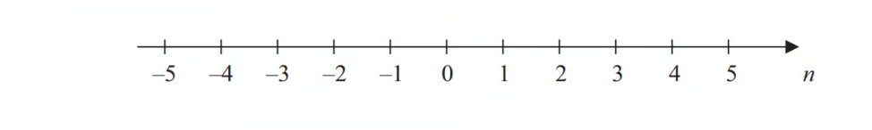

### 14((b)) — 2 marks — command: solve — structured — from paper June 2013 · 1MA0/1H
Solve the inequality `8 x minus 3 space greater-than or slanted equal to space 6 x space plus space 4`

## Q3 — easy — 5 marks · exam-questions

### 1((a)) — 2 marks — command: solve — structured — from paper June 2019 · 1MA1/2H
Solve $14n>11n+6$

### 1((b)) — 3 marks — command: show — structured — from paper June 2019 · 1MA1/2H
On the number line below, show the set of values of $x$ for which `negative 2 space less than space x space plus space 3 space less-than or slanted equal to space 4`

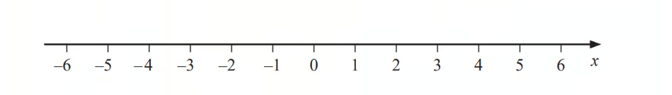

## Q4 — hard — 3 marks · exam-questions

### 19() — 3 marks — command: solve — structured — from paper Sample 2015 · 1MA1/1H
Solve   $x^{2}>3x+4$

## Q5 — medium — 4 marks · exam-questions

### 13((a)) — 2 marks — command: write — structured — from paper June 2014 · 1MA0/2H
`negative 5 space less than space y space less-than or slanted equal to 0`

$y$ is an integer.

Write down all the possible values of $y$.

### 13((b)) — 2 marks — command: solve — structured — from paper June 2014 · 1MA0/2H
Solve    `6 open parentheses x minus 2 close parentheses space greater than 15`

## Q6 — easy — 5 marks · exam-questions

### 8((a)) — 2 marks — command: list — structured — from paper November 2012 · 1MA0/2H
$n$ is an integer.

`negative 1 space less-than or slanted equal to n less than 4` 
List the possible values of $n$.

### 8((b)) — 2 marks — command: write — structured — from paper November 2012 · 1MA0/2H
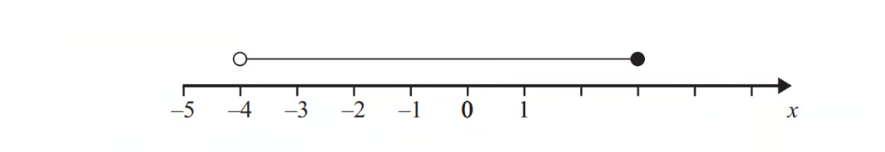

Write down the inequality shown in the diagram.

### 8((c)) — 1 mark — command: solve — structured — from paper November 2012 · 1MA0/2H
Solve        $y-2>5$

## Q7 — hard — 3 marks · exam-questions

### 19() — 3 marks — command: solve — structured — from paper June 2017 · 1MA1/3H
Solve   $2x^{2}+3x-2>0$

## Q8 — medium — 4 marks · exam-questions

### 10((a)) — 2 marks — command: write — structured — from paper June 2012 · 1MA0/2H
$m$ is an integer such that  `long dash 2 space less than space m space less-than or slanted equal to space 3`

Write down all the possible values of $m$.

### 10((b)) — 2 marks — command: solve — structured — from paper June 2012 · 1MA0/2H
Solve   $7x-9<3x+4$

## Q9 — easy — 4 marks · exam-questions

### 12((a)) — 2 marks — command: write — structured — from paper March 2013 · 1MA0/2H
`negative 3 space less than space n space less-than or slanted equal to space 1`

$n$ is an integer.

Write down all the possible values of $n$.

### 12((b)) — 2 marks — command: solve — structured — from paper March 2013 · 1MA0/2H
Solve the inequality $3p-7>11$

## Q10 — hard — 4 marks · exam-questions

### 25() — 4 marks — command: solve — structured — from paper June 2018 · 4MA1/2HR
Solve the inequality $4x^{2}--5x--6>0$

## Q11 — medium — 4 marks · exam-questions

### 9((b)) — 2 marks — command: solve — structured — from paper Sample 2015 · 1MA1/3H
Solve $6x+4>x+17$

### 9((c)) — 2 marks — command: write — structured — from paper Sample 2015 · 1MA1/3H
$n$ is an integer with `long dash 5 space less than space 2 n space less-than or slanted equal to space 6`

Write down all the values of $n$

## Q12 — easy — 2 marks · exam-questions

### 17((a)) — 2 marks — command: solve — structured — from paper June 2016 · 1MA0/1H
Solve    $3x-5<16$

## Q13 — hard — 4 marks · exam-questions

### 17((a)) — 3 marks — command: solve — structured — from paper Specimen 2016 · 4MA1/1H
Solve $x^{2}+2x>6x+5$

### 17((b)) — 1 mark — command: show — structured — from paper Specimen 2016 · 4MA1/1H
Represent your solution set to part (a) on the number line below.

## Q14 — medium — 3 marks · exam-questions

### 1((a)) — 1 mark — command: write — structured — from paper June 2019 · 4MA1/2HR

Write down the inequality shown on the number line.

### 1((b)) — 2 marks — command: solve — structured — from paper June 2019 · 4MA1/2HR
Solve the inequality `4 y space minus space 13 space less-than or slanted equal to space y space plus space 8`

## Q15 — easy — 4 marks · exam-questions

### 10((a)) — 2 marks — command: show — structured — from paper November 2016 · 1MA0/1H
Show the inequality $x<3$ on the number line below

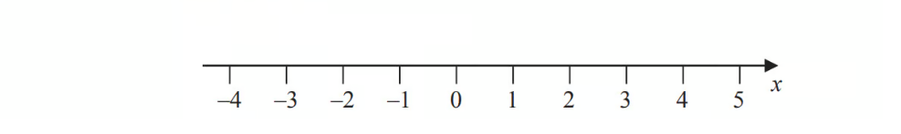

### 10((b)) — 2 marks — command: solve — structured — from paper November 2016 · 1MA0/1H
Solve the inequality     `4 x space minus 7 space greater-than or slanted equal to 13`

## Q16 — hard — 5 marks · exam-questions

### 20() — 5 marks — command: find — structured — from paper June 2018 · 1MA1/1H
$n$ is an integer such that `3 n plus 2 less-than or slanted equal to space 14 space and space fraction numerator 6 n over denominator n squared plus 5 end fraction space greater than 1`

Find all the possible values of $n$.

## Q17 — medium — 4 marks · exam-questions

### 3((a)) — 2 marks — command: show — structured — from paper Jan 2021 · 4MA1/1HR
On the number line, show the inequality `– 2 space less-than or slanted equal to space y space less than space 1`

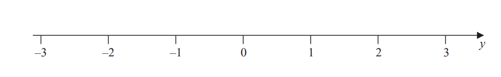

### 3((b)) — 2 marks — command: write — structured — from paper Jan 2021 · 4MA1/2H
$n$ is an integer.

Write down all the values of $n$ that satisfy `– 3.4 space less than space n space less-than or slanted equal to space 2`

## Q18 — easy — 4 marks · exam-questions

### 5((a)) — 2 marks — command: solve — structured — from paper November 2014 · 1MA0/1H
Solve the inequality  $6y+5>8$

### 5((b)) — 2 marks — command: write — structured — from paper November 2014 · 1MA0/1H
Here is an inequality, in $x$, shown on a number line.

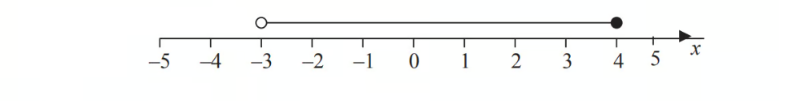

Write down the inequality.

## Q19 — hard — 5 marks · exam-questions

### 22() — 5 marks — command: find — structured — from paper Jan 2022 · 4MA1/2H
Here is a rectangle.

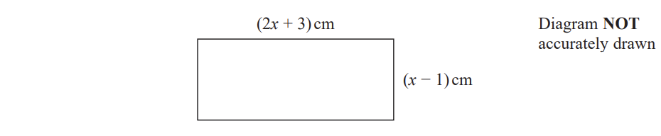

Given that the area of the rectangle is less than $75\mathrm{cm}^{2}$ 
find the range of possible values of $x$

## Q20 — medium — 4 marks · exam-questions

### 5((c)) — 3 marks — command: solve — structured — from paper Jan 2021 · 4MA1/2H
Solve the inequality $7t--8\leq2t+7$

### 5((c)) — 1 mark — command: show — structured — from paper Jan 2021 · 4MA1/2H
On the number line below, represent the solution set of the inequality solved in part (a).

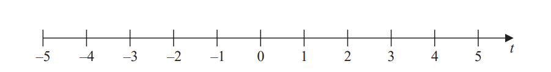

## Q21 — easy — 2 marks · exam-questions

### 7((a)) — 2 marks — command: write — structured — from paper June 2021 · 4MA1/1H
`negative 4 space less-than or slanted equal to space 2 y space less than space 6`

$y$ is an integer.

Write down all the possible values of $y$.

## Q22 — hard — 3 marks · exam-questions

### 19((b)) — 3 marks — command: solve — structured — from paper Jan 2020 · 4MA1/2HR
Solve the inequality `5 y squared space minus space 17 y space less-than or slanted equal to space 40`

## Q23 — medium — 2 marks · exam-questions

### 7((b)) — 2 marks — command: show — structured — from paper June 2021 · 4MA1/1H
Solve the inequality `7 t space – space 3 space less-than or slanted equal to space 2 t space plus space 31` 
Show your working clearly.

## Q24 — easy — 4 marks · exam-questions

### 9() — 3 marks — command: solve — structured — from paper Nov 2021 · 4MA1/1H
Solve the inequalities  `– 7 space less-than or slanted equal to space 2 x space – space 3 space less than space 5`

### 9() — 1 mark — command: show — structured — from paper 2021 November · 4MA1/1H
On the number line, represent the solution set to part a).

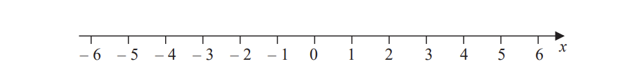

## Q25 — hard — 5 marks · exam-questions

### 23() — 5 marks — command: find — structured — from paper Nov 2020 · 4MA1/2H
The diagram shows a rectangle.

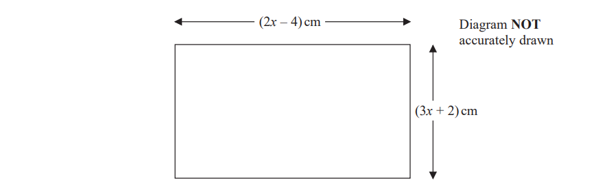

The area of the rectangle is $A\mathrm{cm}^{2}$ 
Given  that $A<3x+27$

find the range of possible values for $x.$

## Q26 — medium — 3 marks · exam-questions

### 12() — 3 marks — command: show — structured — from paper Nov 2020 · 4MA1/2HR
Solve the inequality $3x+15<8x+3$

Show clear algebraic working.

## Q27 — easy — 2 marks · exam-questions

### 6((a)) — 2 marks — command: solve — structured — from paper Jan 2022 · 4MA1/1H
Solve the inequality      `5 x minus 7 less-than or slanted equal to 2`

## Q28 — hard — 3 marks · exam-questions

### 24() — 3 marks — command: work_out — structured — from paper June 2019 · 8300/2H
Here is a sketch of the curve    $y=x^{2}+4x-12$

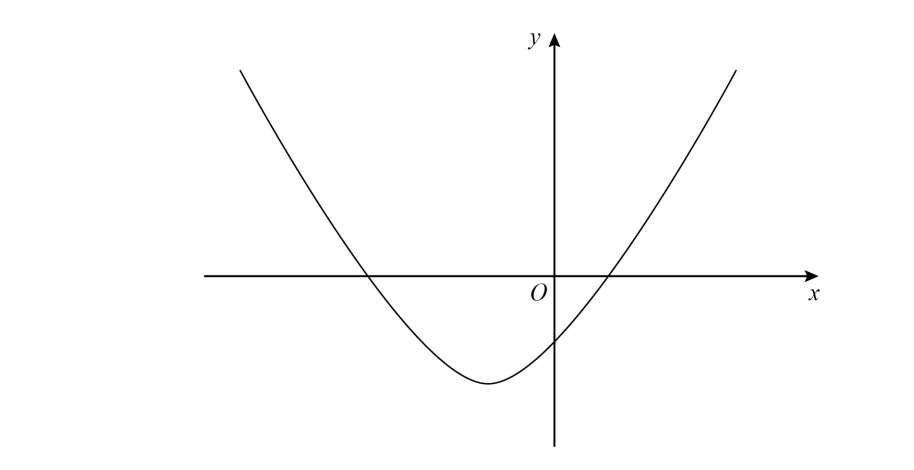

Work out the values of $x$ for which    $x^{2}+4x--12<0$

Give your answer as an inequality.

## Q29 — medium — 2 marks · exam-questions

### 1((c)) — 2 marks — command: solve — structured — from paper Specimen 2016 · 4MA1/2H
Solve the inequality `2 q space greater-than or slanted equal to space 31 space – space 3 q`

## Q30 — easy — 3 marks · exam-questions

### 1((a)) — 2 marks — command: write — structured — from paper Jan 2022 · 4MA1/1HR
$n$ is an integer. 
Write down all the values of $n$ such that`space – 2 space less-than or slanted equal to space n space less than space 3`

### 1((b)) — 1 mark — command: show — structured — from paper Jan 2022 · 4MA1/1HR
On the number line, represent the inequality `y space less-than or slanted equal to space 1`

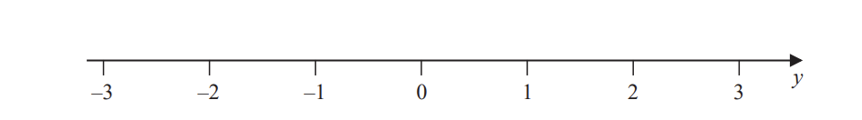

## Q31 — hard — 3 marks · exam-questions

### 24() — 3 marks — command: work_out — structured — from paper Nov 2019 · 8300/2H
Here are two inequalities.

`– 2 space less-than or slanted equal to space x space less-than or slanted equal to space 3`
 `9 space less-than or slanted equal to space x space plus space y space less-than or slanted equal to space 11`

$x$ and $y$ are integers.

Work out the **greatest** possible value of $y--x$

## Q32 — medium — 3 marks · exam-questions

### 2() — 3 marks — command: solve — structured — from paper Specimen 2015 · J560/06
Solve.

$5x+1>x+13$

## Q33 — medium — 2 marks · exam-questions

### 15() — 2 marks — command: solve — structured — from paper Nov 2020 · 8300/3H
Solve  $4>11-\frac{x}{3}$

## Q34 — easy — 2 marks · exam-questions

### 5() — 2 marks — command: solve — structured — from paper June 2018 · 8300/1H
Solve $5(x+3)<60$

## Q35 — medium — 4 marks · exam-questions

### 17((a)) — 3 marks — command: solve — structured — from paper Specimen paper · 4MA1/1H
Solve  $x^{2}+2x>6x+5$

### 17((b)) — 1 mark — command: show — structured — from paper Specimen paper · 4MA1/1H
Represent your solution set to part (a) on the number line below.

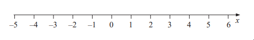

## Q36 — hard — 4 marks · exam-questions

### 9() — 4 marks — command: explain — structured — from paper June 2019 · J560/06
Martha’s solution to the inequality `8 x plus 5 less-than or slanted equal to 3 x minus 10` is shown on the number line.

Is her solution correct? 
Explain your reasoning.

## Q37 — medium — 3 marks · exam-questions

### 10() — 3 marks — command: work_out — structured — from paper June 2019 · 8300/2H
$x$ is an integer.

`– 4 space less than space x space less-than or slanted equal to space 2`

and

`2 space less-than or slanted equal to space x space plus space 3 space less than space 9`

Work out all the possible values of $x$.

## Q38 — easy — 1 marks · exam-questions

### 14() — 1 mark — command: solve — structured — from paper June 2017 · 8300/1H
Solve  $--3x>6$

## Q39 — medium — 2 marks · exam-questions

### 8((a)) — 2 marks — command: solve — structured — from paper 2023 Nov · 4MA1/1H
Solve the inequality  `8 x minus 4 greater-than or slanted equal to 3 x minus 10`

## Q40 — hard — 4 marks · exam-questions

### 17() — 4 marks — command: solve — structured — from paper Nov 2017 · J560/05
Solve the inequality.

`x squared minus space 5 x space minus space 6 less-than or slanted equal to 0`

## Q41 — medium — 2 marks · exam-questions

### 10() — 2 marks — command: solve — structured — from paper Nov 2018 · 8300/3H
Solve  $8>3-\frac{1}{2}x$

## Q42 — easy — 1 marks · exam-questions

### 1() — 1 mark — command: circle — structured — from paper Nov 2017 · 8300/3H
Circle the inequality shown by the diagram.

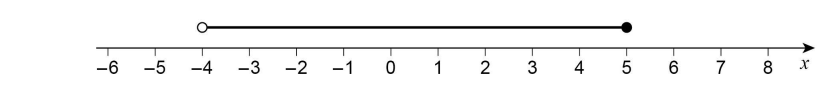

| `– 4 space less-than or slanted equal to space x space less than space 5` | `– 4 space less-than or slanted equal to space x space less-than or slanted equal to space 5` | $--4<x<5$ | `– 4 space less than space x space less-than or slanted equal to space 5` |
|---|---|---|---|

## Q43 — hard — 3 marks · exam-questions

### 20((a)) — 3 marks — command: find — structured — from paper Specimen 2015 · J560/05
Find the interval for which `x squared space minus space 7 x space plus space 10 space less-than or slanted equal to space 0.`

.......................... `less-than or slanted equal to space x space less-than or slanted equal to` ..........................

## Q44 — medium — 2 marks · exam-questions

### 5((b)) — 2 marks — command: solve — structured — from paper Nov 2017 · 8300/1H
Solve $7x+6>1+2x$

## Q45 — easy — 1 marks · exam-questions

### 21() — 1 mark — command: circle — structured — from paper June 2017 · 8300/3H
Here is a sketch of $y=f(x)$ where $f(x)$is a quadratic function. The graph intersects the $x$-axis where $x=--2.5$and $x=1$

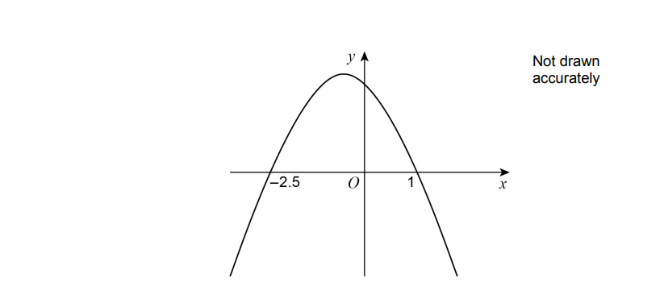

Circle the solution of $f(x)>0$

| $x<--2.5\mathrm{or}x>1$ | $x>--2.5\mathrm{or}x>1$ |
|---|---|
| $--2.5<x<1$ | $x>--2.5\mathrm{or}x<1$ |

## Q46 — medium — 2 marks · exam-questions

### 29() — 2 marks — command: write — structured — from paper Nov 2017 · 8300/3H
Here is the graph of $y=f(x)$ where $f(x)$ is a quadratic function.

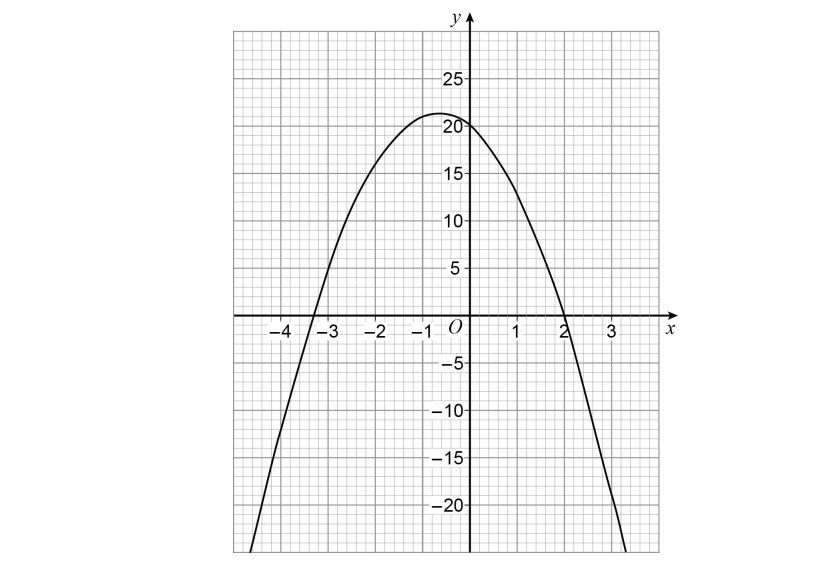

Write down all the **integer** solutions of `f left parenthesis x right parenthesis space greater-than or slanted equal to space 0`

## Q47 — easy — 2 marks · exam-questions

### 10((a)) — 2 marks — command: solve — structured — from paper June 2017 · J560/05
Solve the inequality.

$3x-2>10$

## Q48 — medium — 5 marks · exam-questions

### 8((a)) — 3 marks — command: solve — structured — from paper Nov 2021 · 8300/1H
Solve  $5x+6\geq3x+15$

### 8((b)) — 2 marks — command: write — structured — from paper Nov 2021 · 8300/1H
Write down the inequality represented by the number line.

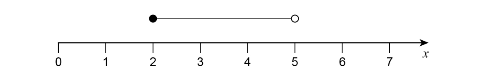

## Q49 — easy — 1 marks · exam-questions

### 2() — 1 mark — command: write — structured — from paper Specimen 2015 · J560/06
Write down the largest integer that satisfies $5x-1<10.$

## Q50 — easy — 4 marks · exam-questions

### 1((c)) — 2 marks — command: solve — structured — from paper Specimen paper · 4MA1/2H
Solve the inequality  `2 q space greater-than or slanted equal to space 31 space – space 3 q`

### 1((d)) — 2 marks — command: write — structured — from paper Specimen paper · 4MA1/2H
`– 2 space less-than or slanted equal to space n space less than space 3`

$n$ is an integer

Write down all the possible values of $n$.

## Q51 — medium — 1 marks · exam-questions

### 17() — 1 mark — command: circle — structured — from paper Nov 2021 · 8300/3H
$m^{2}>9$

Circle the possible value of $m$.

| $2\frac{7}{8}$ | 2.8 | 3 | $-\frac{7}{2}$ |
|---|---|---|---|

## Q52 — medium — 4 marks · exam-questions

### 2() — 4 marks — command: show — structured — from paper Nov 2020 · J560/06
Solve  $3x+4<19$.

Show your solution on the number line.

## Q53 — medium — 4 marks · exam-questions

### 1() — 4 marks — command: show — structured — from paper Nov 2019 · J560/06
Solve `3 x minus 5 greater-than or slanted equal to 10`

Show your solution on the number line.

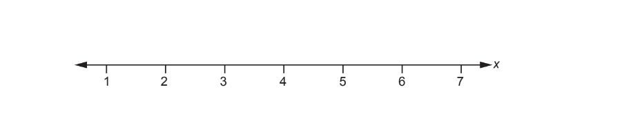

## Q54 — medium — 3 marks · exam-questions

### 2() — 3 marks — command: explain — structured — from paper June 2018 · J560/05
Gemma’s solution to the inequality $3x+1>-5$

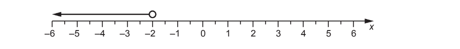

Is Gemma’s solution correct? 
Explain your reasoning.
