# Mark Schemes — Differentiation & Gradients
**Functions, Graphs & Differentiation** · Edexcel IGCSE Maths A (Modular) (4XMAF/4XMAH) — 24/Higher Unit 2

## Q1 — very_hard — 8 marks · exam-questions

### 1() — 2 marks
> *When **k** = 0, *

`table row y equals cell 2 x squared plus 8 open parentheses 0 close parentheses squared x minus 3 end cell row cell therefore space y end cell equals cell 2 x squared minus 3 end cell end table`

> *To find turning points by differentiating and equating the derivative to zero*

> *Differentiate:*

$\frac{dy}{dx}=4x$

> *Equate to zero and solve*

`table attributes columnalign right center left columnspacing 0px end attributes row cell 4 x end cell equals 0 row x equals 0 end table`

**[1]**

> *Find the y-coordinate by substituting x = 0 into y*

`table attributes columnalign right center left columnspacing 0px end attributes row y equals cell 2 open parentheses 0 close parentheses squared minus 3 end cell row blank equals cell negative 3 end cell end table`

> *Write the answer as a coordinate point*

$(0,-3)$ **[1]**

### 2() — 4 marks
> *Differentiate. To do this, we need to understand that *$k$* is a constant therefore *$k^{2}$* is also a constant*

*when *$k\neq0,\frac{dy}{dx}=4x+8k^{2}$

**[1]**

> *To find a turning point, equate the derivative to zero and solve*

`table row cell 4 x plus 8 k squared end cell equals 0 row cell 4 x end cell equals cell negative 8 k squared end cell row x equals cell negative 2 k squared end cell end table`

**[1]**

> *All square numbers are positive (because a negative number times a negative number is positive)*

**Since **$k\neq0$**, **$k^{2}>0$** for all values of **$k$* ***[1] **
**so **$-2k^{2}<0$** for all values of **$k$* ***[1]**

### 3() — 2 marks
> *Substitute *$x=-2k^{2}$* (from part (b)) into the equation for **y*

`y equals 2 open parentheses negative 2 k squared close parentheses squared plus 8 k squared open parentheses negative 2 k squared close parentheses minus 3`

**[1]**

> *Carefully expand the brackets and simplify*

`table row y equals cell 2 open parentheses 4 k to the power of 4 close parentheses minus 16 k to the power of 4 minus 3 end cell row blank equals cell 8 k to the power of 4 minus 16 k to the power of 4 minus 3 end cell row blank equals cell negative 8 k to the power of 4 minus 3 end cell end table`

> *Note that *`k to the power of 4 equals open parentheses k squared close parentheses squared`* so is positive*

$k^{4}>0$** therefore **$-8k^{4}-3<0$** for all values of **$k$** and therefore the ****y****-coordinate of the turning point is negative ****[1]**** **
**Correct answer with valid reason.**

## Q2 — medium — 3 marks · exam-questions

### 14() — 3 marks
*In a **distance-time graph**, the **speed is equivalent to the gradient** of the graph* 
*We can estimate the speed at time 5 seconds by drawing a tangent at time 5 seconds and calculating its gradient*

> *First draw a tangent at 5 seconds. This should be a straight line (use a ruler or straight edge) touching the curve at 5 seconds, but not crossing the curve*

**suitable tangent line drawn**** [1]**

> *Pick two points on the tangent, not too close to each other. Try to pick points that can be clearly read off the grid. E.g. in the diagram above, we have picked (8, 70) and (2.9, 0) *

> *Find the gradient between these two points using *$\frac{\mathrm{rise}}{\mathrm{run}}$* or *$\frac{y_{1}-y_{2}}{x_{1}-x_{2}}$* *

> *Your gradient will depend on your tangent so there is some margin of error permitted in exam questions. For the tangent drawn above, the calculation and answer would be as follows*

*gradient = *$\frac{70-0}{8-2.9}$

$\frac{rise}{run}$* ***or gradient formula used with tangent line**** [1]**

$=\frac{70}{5.1}=13.7254902...$

> *As the distance is in metres and the time is in seconds, the gradient is the speed in m/s. *

> *If your calculation does not result in an exact answer, write the answer to at least 3 significant figures*

**13.7 m/s ****[1]**** **
**Any answer from 11 to 19 m/s so long as it is consistent with the drawn tangent line**

## Q3 — very_hard — 7 marks · exam-questions

### 1() — 7 marks
> *First you need to find the coordinates of the turning points, so differentiate and equate the derivative to zero*

$\frac{dy}{dx}=8x^{3}-32x$

**[1]**

$8x^{3}-32x=0$

**[1]**

> *Solve for **x*

`x cubed minus 4 x equals 0
x open parentheses x squared minus 4 close parentheses equals 0
x equals 0 comma space space x squared equals 4
space space space space space space space space space space space space x equals plus-or-minus 2`

**all 3 x-coordinates found ****[1]**

> *Find **P, Q** and **R **by substituting **x** = -2, **x** = 0 and **x** = 2 respectively into **y **(you could also find **Q** by examining the equation for **y **and ignoring any terms in **x**, as it is the **y**-intercept)*

`P colon space x equals negative 2 comma space y equals 2 open parentheses negative 2 close parentheses to the power of 4 minus 16 open parentheses negative 2 close parentheses squared plus 3 equals negative 29
Q colon space x equals 0 comma space y equals 3
R colon space x equals 2 comma space y equals 2 open parentheses 2 close parentheses to the power of 4 minus 16 open parentheses 2 close parentheses squared plus 3 equals negative 29`

**all 3 y-coordinates found**** [1]**

> *Add these points to the diagram. We can see that*

*base of the triangle is 2 × 2 = 4*

*height of the triangle is 29 + 3 = 32*

**either correct base or correct height**** [1]**

> *Now find the area using area of triangle = *$\frac{1}{2}$*× base × height*

*area*$=\frac{1}{2}\times4\times32$

**[1]**

**64 (square units)** **[1]**

## Q4 — medium — 3 marks · exam-questions

### 1() — 2 marks

**Suitable tangent drawn [1]**

> *Draw a tangent at 3 to calculate gradient using *$\frac{rise}{run}$

$\mathrm{Gradient}=\frac{50-6}{6-0}=\frac{44}{6}$

$\mathrm{Gradient}=7.333...$

$7.3$

**Answers between 6.5 and 7.5 [1]**

### 2() — 1 marks
**Final answer:** **The gradient shows the acceleration of the parachutist after 3 seconds is 7.3 ms****-2**

**[1]**

## Q5 — very_hard — 10 marks · exam-questions

### 1() — 4 marks
> *The volume is given by*

$V=x^{2}y$

> *We need to replace *$y$* with an equation in *$x$

> *Think about nets here. The surface area has two squares (*$2\timesx\timesx$*) and four rectangles (*$4\timesx\timesy$*). And this surface area is equal to 25 cm**2** so*

$2x^{2}+4xy=25$

**[1]**

> *Rearrange to make *$y$* the subject*

`table row cell 4 x y end cell equals cell 25 minus 2 x squared end cell row y equals cell fraction numerator 25 minus 2 x squared over denominator 4 x end fraction end cell end table`

**[1]**

> *Substitute this version of *$y$* into the formula for volume*

`table row V equals cell x squared open parentheses fraction numerator 25 minus 2 x squared over denominator 4 x end fraction close parentheses end cell end table`

**[1]**

> *And expand*

`table attributes columnalign right center left columnspacing 0px end attributes row V equals cell fraction numerator 25 x squared minus 2 x to the power of 4 over denominator 4 x end fraction end cell row blank equals cell fraction numerator 25 x minus 2 x cubed over denominator 4 end fraction end cell end table`

> *Write in the form given in the question*

$V=\frac{25}{4}x-\frac{1}{2}x^{3}$ **[1]**

### 2() — 4 marks
> *Find a maximum by differentiating and equating to zero*

> *Differentiate*

$\frac{dV}{dx}=\frac{25}{4}-\frac{3}{2}x^{2}$

**[1]**

> *Equate to zero*

$\frac{25}{4}-\frac{3}{2}x^{2}=0$

**[1]**

$\frac{25}{4}=\frac{3}{2}x^{2}\,x^{2}=\frac{25}{6}\,x=\pm\frac{5}{\sqrt{6}}$

> *Reject the negative solution as **x** is a side length*

`up diagonal strike x equals negative fraction numerator 5 over denominator square root of 6 end fraction end strike space comma space space x equals fraction numerator 5 over denominator square root of 6 end fraction`

**[1]**

> *Rationalise the denominator*

$x=\frac{5\sqrt{6}}{\sqrt{6}\sqrt{6}}$

$x=\frac{5\sqrt{6}}{6}$ **[1]**

### 3() — 2 marks
> *Substitute the value of **x** found in (b) into the formula for **V, **taking care with brackets and powers in your calculator*

`V equals 25 over 4 open parentheses fraction numerator 5 square root of 6 over denominator 6 end fraction close parentheses minus 1 half open parentheses fraction numerator 5 square root of 6 over denominator 6 end fraction close parentheses cubed`

**[1]**

$=8.505172...$

> *Round to 3 significant figures as requested in the question*

**8.51 cm****3**** ****[1]**

## Q6 — medium — 3 marks · exam-questions

### 1() — 2 marks
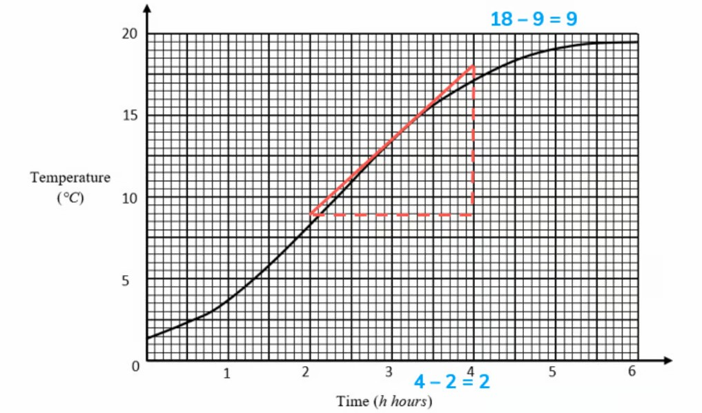

**Suitable tangent drawn [1]**

> *Draw a tangent at 3 to calculate the gradient using *$\frac{rise}{run}$

$\mathrm{Gradient}=\frac{18-9}{4-2}=\frac{9}{2}$

**Final answer:** **4.5**

**Answers between 4.1 and 4.9 [1]**

### 2() — 1 marks
**Final answer:** **The gradient shows the temperature is increasing at 4.5 °C per hour**

**[1]**

## Q7 — very_hard — 5 marks · exam-questions

### 24() — 5 marks
*Velocity will change sign when the direction of motion reverses.* *To find velocity, we differentiate displacement.*

$v=\frac{dx}{dt}=12t^{2}-27$

**[1]**

> *Solve *$v=0$* to find the time when the direction of motion reverses.*

`table row cell 12 t squared minus 27 end cell equals 0 row cell t squared end cell equals cell 27 over 12 end cell row t equals cell 3 over 2 end cell end table`

**Method to find t ****[1] **
**Correct value for t**** [1]**

> *Use your calculator to find that square root.  You need not consider the negative square root since *$t\geq0$*.*

> *To find acceleration, differentiate velocity.*

$"a"=\frac{dv}{dt}=24t$

**[1]**

> *At **A**, *$"a"=a$* and we now know that *$t=\frac{3}{2}$*, so we can set up and solve an equation for *$a$*.*

`a equals 24 open parentheses 3 over 2 close parentheses equals 36`

$a=36m/s^{2}$* ***[1]**

## Q8 — medium — 3 marks · exam-questions

### 1() — 1 marks
> *The gradient is zero at the turning point of the graph*

$x=3$

**[1]**

### 2() — 2 marks

**Suitable tangent drawn [1]**

> *Draw a tangent at 4 to calculate the gradient using *$\frac{y_{2}-y_{1}}{x_{2}-x_{1}}$

$\mathrm{Gradient}=\frac{5.2--6}{7-3}=\frac{11.2}{4}$

**Final answer:** **2.8**

**Between 2.6 and 3 [1]**

## Q9 — very_hard — 6 marks · exam-questions

### 23() — 6 marks
*The particles will be moving in the same direction when the velocities have the same sign.*

> *To find velocity, differentiate displacement.*

*Letting *$u$* be the velocity for ***P***,  *$u=\frac{ds}{dt}=3t^{2}-8t+5$

**[1]**

*Letting *$v$* be the velocity of ***Q***,  *$v=\frac{dx}{dt}=2t-4$

**[1]**

> *Velocity will change sign when velocity is 0, so solve *$u=0\mathrm{and}v=0$*.*

*For ***P*****,****  *$3t^{2}-8t+5=0$

**[1]**

`3 t squared minus 8 t plus 5 equals 0
open parentheses 3 t minus 5 close parentheses open parentheses t minus 1 close parentheses equals 0
t equals 5 over 3 comma space space space space t equals 1`

**[1]**

*For Q,  *$2t-4=0$* *`table row cell 2 t end cell equals 4 row t equals 2 end table`

**[1]**

> *It is easiest to see where these are positive and negative by sketching their graphs - this can be done on the same diagram. *$u$* is a positive quadratic, so U-shaped and crossing the **x**-axis at 1 and *$\frac{5}{3}$* and 1. *

> $v$* is a straight line graph crossing the **x**-axis at 2.*

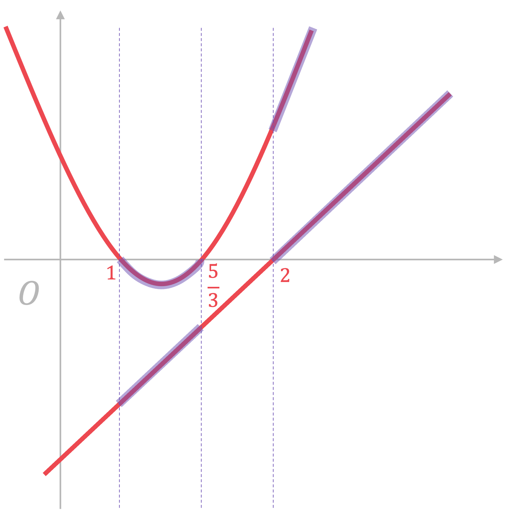

> *We can see that the graphs are both negative between *$t$* values of 1 and *$\frac{5}{3}$* and both positive for *$t$* values greater than 2. *

> *Write these as inequalities for the final answer.*

**The particles are moving in the same direction for **$1<t<\frac{5}{3}\mathrm{and}t>2$** ****[1]**

## Q10 — medium — 5 marks · exam-questions

### 20((a)) — 2 marks
*We have the graph of *$y=x^{2}-2x+3$* so we need to rearrange *$x^{2}-3x-1=0$* so that "*$x^{2}-2x+3$*" appears on its own on one side of the equation*

> *Add 4 to both sides*

$x^{2}-3x-1=0\,x^{2}-3x+3=4$

> *Add *$x$* to both sides*

$x^{2}-2x+3=x+4$

> *Draw the line *$y=x+4$* on the graph using your knowledge of linear graphs **y** = **mx** + **c**. Draw a line through 4 on the **y**-axis with gradient 1*

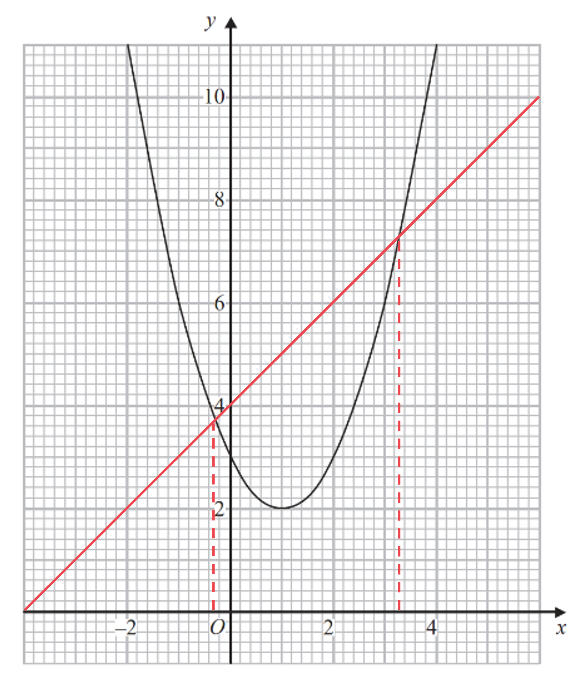

**y = x + 4 drawn correctly on the grid**** [1]**

> *Read the *$x$* values where *$y=x+4$* and *$y=x^{2}-2x+3$* intersect. There is some margin of error permitted (see below)*

**Final answer:** **x ****= 3.3, ****x**** = −0.3**

**x value from −0.2 to −0.4 and x value from 3.2 to 3.4 ****[1]**

### 20((b)) — 3 marks
> *We can estimate the gradient at *$x=2$* by drawing a tangent at *$x=2$* and calculating its gradient*

> *First draw a tangent at *$x=2$*. This should be a straight line (use a ruler or straight edge) touching the curve at *$x=2$*, but not crossing the curve*

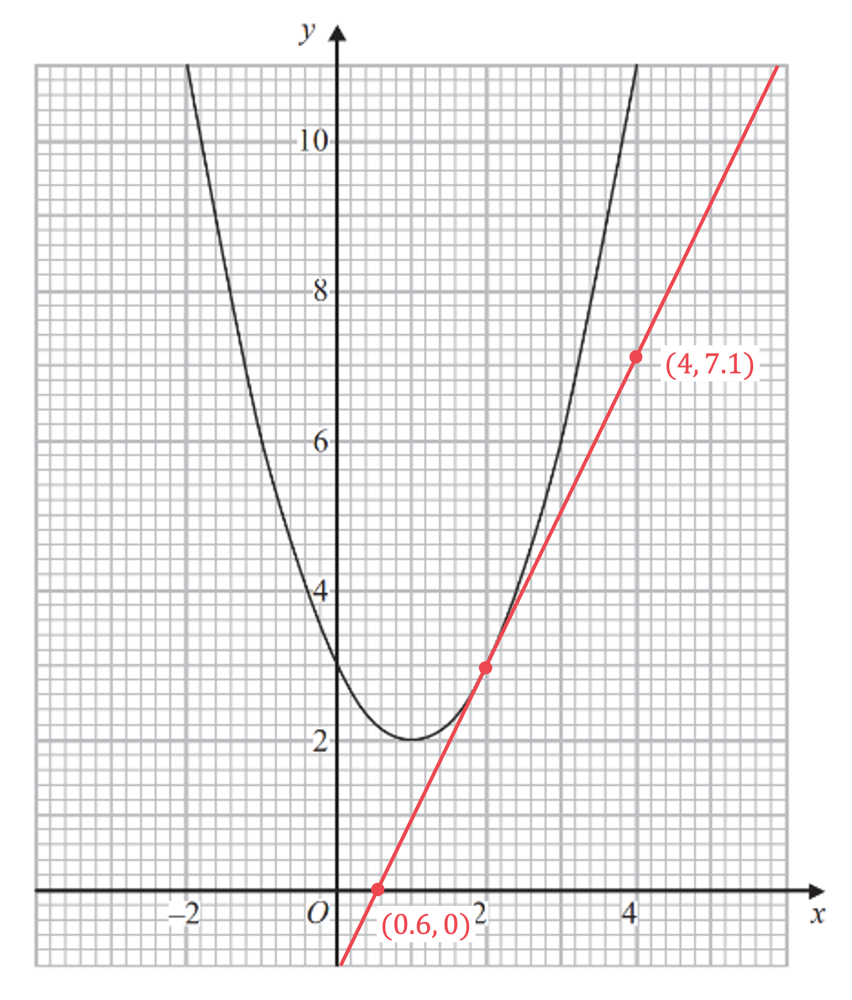

**suitable tangent line drawn**** [1]**

> *Pick two points on the tangent, not too close to each other. Try to pick points that can be clearly read off the grid. E.g. in the diagram above, we have picked (4, 7.1) and (0.6, 0) *

> *Find the gradient between these two points using *$\frac{\mathrm{rise}}{\mathrm{run}}$* or *$\frac{y_{1}-y_{2}}{x_{1}-x_{2}}$* *

> *Your gradient will depend on your tangent so there is some margin of error permitted in exam questions. For the tangent drawn above, the calculation and answer would be as follows*

*gradient = *$\frac{7.1-0}{4-0.6}$

$\frac{rise}{run}$* ***or gradient formula used with tangent line**** [1]**

$=\frac{7.1}{3.4}=2.088235294...$

> *If your calculation does not result in an exact answer, write the answer to at least 3 significant figures*

**Answer = 2.09 ****[1]**** **

**Any answer from 1.6 to 2.5 so long as it is consistent with the drawn tangent line**

## Q11 — very_hard — 5 marks · exam-questions

### 21() — 5 marks
*At a stationary point, the gradient, *$\frac{dy}{dx}=0$*, so differentiate.* *We will first need to rewrite the term *$\frac{16}{x}$* as a power of *$x$* using the law of indices "*$\frac{1}{a}=a^{-1}$*".* $k$* is a constant so treat it like any other number.*

$y=kx^{2}+16x^{-1}\,\frac{dy}{dx}=2kx-16x^{-2}$

**One term correctly differentiated ****[1]**** **
**Both terms correctly differentiated ****[1]**

> *Solve *$\frac{dy}{dx}=0$*.*

$2kx-\frac{16}{x^{2}}=0$

**[1]**

> *Multiply through by *$x^{2}$*.*

$2kx^{3}-16=0$

> *At **A**, *$x=\frac{2}{3}$*, so substitute in and rearrange to find *$k$*.*

`table row cell 2 k open parentheses 2 over 3 close parentheses cubed end cell equals 16 row cell 8 over 27 k end cell equals 8 row k equals cell fraction numerator 8 cross times 27 over denominator 8 end fraction end cell row k equals 27 end table`

**[1]**

> *Now we can write *$y$* in terms of *$x$* only,*

$y=27x^{2}+\frac{16}{x}$

> *and we can use this equation with the coordinates of **A **to set up and solve an equation for *$a$*.*

`table row a equals cell 27 open parentheses 2 over 3 close parentheses squared plus fraction numerator 16 over denominator open parentheses 2 over 3 close parentheses end fraction end cell row a equals cell 27 cross times 4 over 9 plus 16 cross times 3 over 2 end cell row a equals cell 12 plus 24 end cell row a equals 36 end table`

$a=36$** ****[1]**

## Q12 — medium — 5 marks · exam-questions

### 1() — 2 marks
> *The gradient is zero at the two turning points of the graph.*

**Final answer:** **(-1, 0) and (1, -4)**

**[2]**

### 2() — 1 marks
> *The gradient is negative in the middle section between the two turning points of the graph, this is where it slopes downwards*

$-1<x<1$

**[1]**

### 3() — 2 marks
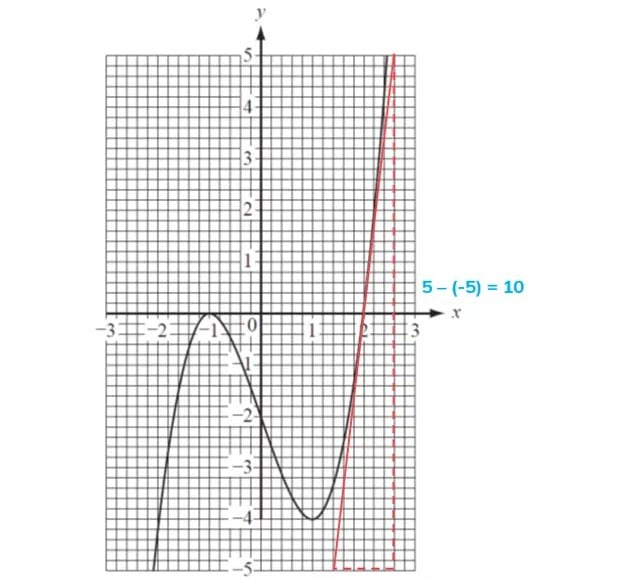

> *Draw a tangent at 2 to calculate gradient *$\frac{y_{2}-y_{1}}{x_{2}-x_{1}}$

$\mathrm{Gradient}=\frac{5--5}{2.6-1.4}=\frac{10}{1.2}=8.333...$

**Final answer:** **8.3**

**Answers between 8 and 8.5 [1]**

## Q13 — very_hard — 6 marks · exam-questions

### 24() — 6 marks
> *We can use the information given to form two simultaneous equations in *$a$* and *$b$*.*

> *"The point *$A$* with coordinates (2, –6) lies on *$C$*" so substitute the point into the equation to form one equation in *$a$* and *$b$*.*

`negative 6 equals a open parentheses 2 close parentheses cubed plus b open parentheses 2 close parentheses squared minus 12 open parentheses 2 close parentheses plus 6`

**[1]**

> *Simplify to form the first of two simultaneous equations.*

`table row cell negative 6 end cell equals cell 8 a plus 4 b minus 24 plus 6 end cell row cell 8 a plus 4 b end cell equals 12 row cell divided by 4 space space space space space space space space space space space space end cell equals cell space space space divided by 4 end cell row cell 2 a plus b end cell equals 3 end table`

> *To form the second equation in *$a$* and *$b$*, **we can use "the gradient of the curve at *$A$* is 16". Differentiate *$y$*.*

$\frac{dy}{dx}=3ax^{2}+2bx-12$

**[1]**

> *When *$x=2$*, *$\frac{dy}{dx}=16$*. Substitute these into the above.*

`16 equals 3 a open parentheses 2 close parentheses squared plus 2 b open parentheses 2 close parentheses minus 12`

**[1]**

> *Simplify this to form a second equation in *$a$* and *$b$*.*

`table row 16 equals cell 12 a plus 4 b minus 12 end cell row cell 12 a plus 4 b end cell equals 28 row cell divided by 4 space space space space space space space space space space space space space space end cell equals cell space space space space divided by 4 end cell row cell 3 a plus b end cell equals 7 end table`

> *Set up the two simultaneous equations next to each other and solve.*

`table row cell 3 a plus b end cell equals cell 7 space space space space circle enclose 1 end cell row cell 2 a plus b end cell equals cell 3 space space space space circle enclose 2 end cell row cell circle enclose 1 minus circle enclose 2 colon space space space space space space space space space a end cell equals 4 end table`

**[1]**

> *Substitute this into *`circle enclose 1`* or *`circle enclose 2`*. Choosing *`circle enclose 1`*;*

`table row cell 3 open parentheses 4 close parentheses plus b end cell equals 7 row cell 12 plus b end cell equals 7 row b equals cell negative 5 end cell end table`

**[1]**

> *Now we can define curve *$C$* only in terms of *$x$* and *$y$*.*

$y=4x^{3}-5x^{2}-12x+6$

> *And we can substitute *$x=3$* to find the *$y$* coordinate.*

`table row y equals cell 4 open parentheses 3 close parentheses cubed minus 5 open parentheses 3 close parentheses squared minus 12 open parentheses 3 close parentheses plus 6 end cell row blank equals 33 end table`

$y=33$* ***[1]**

## Q14 — medium — 3 marks · exam-questions

### 17() — 3 marks
> *We can estimate the gradient at the point where **x** = 2  by drawing a tangent and calculating its gradient.*

> *First draw a tangent at the point on the curve where **x** = 2. This should be a straight line (use a ruler or straight edge) touching, but not crossing the curve.*

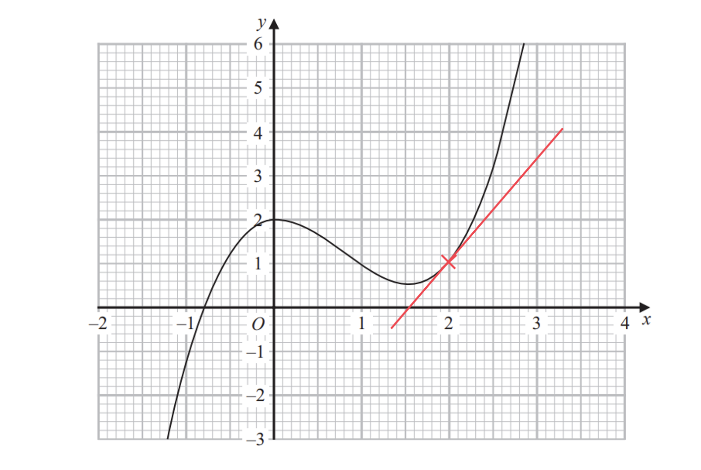

**suitable tangent line drawn**** [1]**

> *Pick two points on the tangent, not too close to each other. Try to pick points that can be clearly read off the grid.*

> *In the diagram above, we have picked (2, 1) and (3, 3.4). *

> *Find the gradient between these two points using *$\frac{\mathrm{rise}}{\mathrm{run}}$* or *$\frac{y_{1}-y_{2}}{x_{1}-x_{2}}$*. *

> *Your gradient will depend on your tangent so there is some margin of error permitted in exam questions. For the tangent drawn above, the calculation and answer would be as follows.*

*gradient = *$\frac{3.4-1}{3-2}$

$\frac{rise}{run}$* ***or gradient formula used with tangent line**** [1]**

$=\frac{2.4}{1}$

**Gradient = 2.4 ****[1]**

** ****Any answer from 1.5 to 3 as long as it is consistent with the drawn tangent line**

## Q15 — very_hard — 5 marks · exam-questions

### 20() — 5 marks
> *Method 1*

> *Differentiate *$s$* with respect to *$t$* to get an equation for the velocity.*

$\frac{ds}{dt}=v=3t^{2}-18t+33$

**[1]**

> *We need to find the minimum velocity, so differentiate again in order to equate *$\frac{dv}{dt}$* to zero and solve for *$t$*.*

$\frac{dv}{dt}=6t-18$

**[1]**

> *Equate *$\frac{dv}{dt}$* to zero and solve for *$t$*.*

`table attributes columnalign right center left columnspacing 0px end attributes row cell 6 t minus 18 end cell equals 0 row cell 6 t end cell equals 18 row t equals 3 end table`

**[1]**

> *Substitute *$t=3$* into the **velocity** equation, or *$\frac{ds}{dt}$*.*

`v equals fraction numerator d s over denominator d t end fraction equals 3 open parentheses 3 close parentheses squared minus 18 open parentheses 3 close parentheses plus 33`

**[1]**

> *Evaluate.*

**minimum speed = 6 m/s*** ***[1]**

**Note that speed and velocity are not always commensurate, however in this question it makes no difference to the answer (as the velocity is always positive because of its equation)**

> *Method 2*

> *Differentiate *$s$* with respect to *$t$* to get an equation for the velocity.*

$\frac{ds}{dt}=v=3t^{2}-18t+33$

**[1]**

> $v$* is quadratic so you can find the minimum point by completing the square to get *`v equals a open parentheses x plus p close parentheses squared plus q`* where *`open parentheses negative p comma space q close parentheses`* is the turning point.*

`table row v equals cell 3 open parentheses t squared minus 6 t close parentheses plus 33 end cell end table`

**attempt to complete the square ****[1]**

`table row blank equals cell 3 open square brackets open parentheses t minus 3 close parentheses squared minus 9 close square brackets plus 33 end cell row blank equals cell 3 open parentheses t minus 3 close parentheses squared minus 27 plus 33 end cell row blank equals cell 3 open parentheses t minus 3 close parentheses squared plus 6 end cell end table`

**completing the square**** ****correctly**** [1]**

> *Therefore;*

*minimum point of velocity equation is** *`table row blank blank cell open parentheses 3 comma space 6 close parentheses end cell end table`

**[1]**

**minimum speed = 6 m/s*** ***[1]**

**Note that in this question velocity and speed can be treated as the same thing, as the velocity is always positive (because its equation is a u-shaped parabola with the minimum above the ****x****-axis)**

## Q16 — medium — 3 marks · exam-questions

### 24() — 2 marks
> *We can estimate the gradient at the point **A ** by drawing a tangent on the graph at **A **and calculating its gradient.*

> *First draw a tangent at the point *`open parentheses 2 comma space 7 close parentheses`*. This should be a straight line (use a ruler or straight edge) touching the curve at **A **but not crossing the curve.*

**Suitable tangent line drawn**** [1]**

> *Pick two points on the tangent, not too close to each other. Try to pick points that can be clearly read off the grid. E.g. in the diagram below, we have picked (0.2, 4.6) and (3, 8.4).*

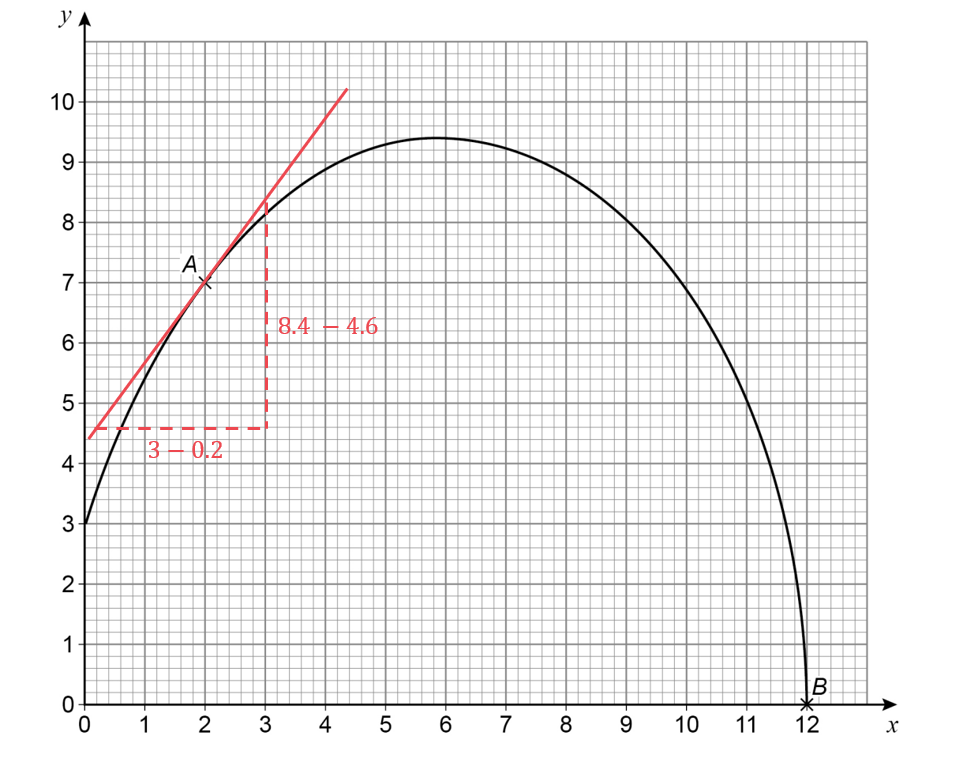

> *Find the gradient between these two points using *$\frac{\mathrm{rise}}{\mathrm{run}}$* or *$\frac{y_{1}-y_{2}}{x_{1}-x_{2}}$* *

> *Your gradient will depend on your tangent so there is some margin of error permitted in exam questions. For the tangent drawn above, the calculation and answer would be as follows*

*gradient = *$\frac{8.4-4.6}{3-0.2}=\frac{3.8}{2.8}=1.3571...$* *

> *If your calculation does not result in an exact answer, write the answer to at least 3 significant figures*

**Answer = 1.36 ****[1]**** **

**Answer must be consistent with the drawn tangent line**

### 24((b)) — 1 marks
*The average rate of change is the gradient of the line between the points **A **and **B.*

> *Draw the line onto the graph if needed to help.*

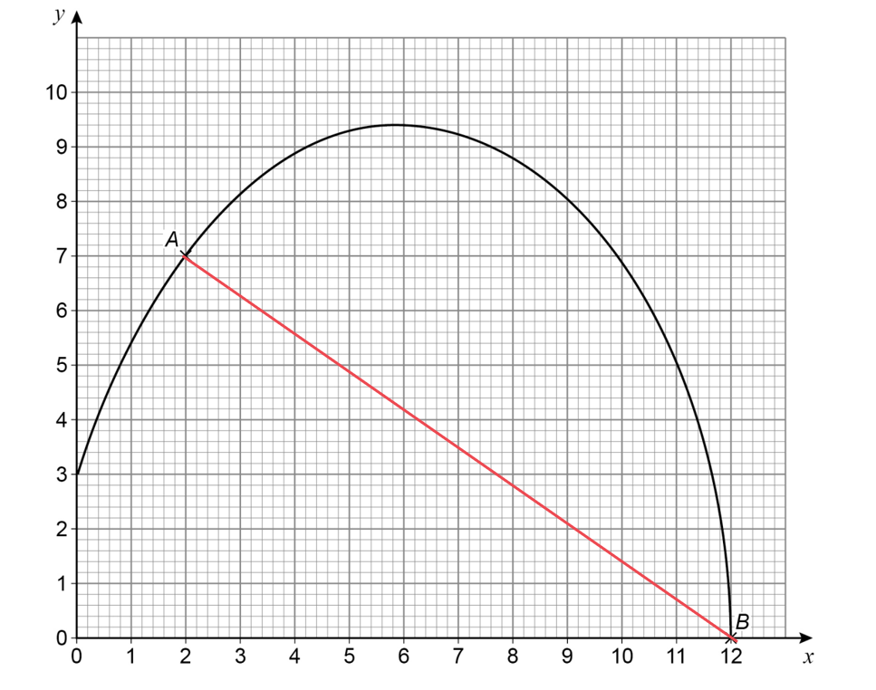

> *It is not necessary to find the gradient as we can see that it is going in the negative direction. *

**It is negative**** [1]**

## Q17 — very_hard — 6 marks · exam-questions

### 19((a)) — 3 marks
> *The length of **DE **and **CE** are both *$x$* so;*

$\mathrm{perimeter} \mathrm{of}ABCED=3x+2y$

> *Equate this to 100 and write *$y$* in terms of *$x$*.*

`table row cell 3 x plus 2 y end cell equals 100 row cell 2 y end cell equals cell 100 minus 3 x end cell row y equals cell fraction numerator 100 minus 3 x over denominator 2 end fraction end cell end table`

**[1]**

> *We can now write an expression for the area of rectangle **ABCD** in terms of *$x$* *

`table row cell area space A B C D end cell equals cell x y end cell row blank equals cell x open parentheses fraction numerator 100 minus 3 x over denominator 2 end fraction close parentheses end cell end table`

> *Triangle **CED **is equilateral so all its internal angles are 60°. So its area is;*

$\mathrm{area}CED=\frac{1}{2}x\timesx\times\mathrm{sin}60^{\circ}$

> *It's useful to know that *$\mathrm{sin}60^{\circ}=\frac{\sqrt{3}}{2}$* (and *$\mathrm{sin}30^{\circ}=\frac{1}{2}$*) but you can also obtain the exact value of *$\mathrm{sin}60^{\circ}$* from your calculator. *

`table row cell area space C E D end cell equals cell 1 half x squared cross times fraction numerator square root of 3 over denominator 2 end fraction end cell row blank equals cell fraction numerator square root of 3 over denominator 4 end fraction x squared end cell end table`

> *Thus *$R$*, the total area of **ABCED **in terms of *$x$*, **is;*

`table row R equals cell Area space A B C D plus Area space C E D end cell row blank equals cell x open parentheses fraction numerator 100 minus 3 x over denominator 2 end fraction close parentheses plus space fraction numerator square root of 3 over denominator 4 end fraction x squared end cell end table`

**[1]**

> *Rewrite by factorising *$\frac{x}{4}$* out of both parts of the equation.*

> `table row A equals cell x over 4 open parentheses 2 open parentheses 100 minus 3 x close parentheses close parentheses plus space x over 4 open parentheses square root of 3 x close parentheses end cell row blank equals cell x over 4 open parentheses 200 minus 6 x close parentheses plus x over 4 open parentheses square root of 3 x close parentheses end cell end table`* *

> *(note that the *$x$* lies outside the *$\sqrt{3}$*)*

> $\frac{x}{4}$* is outside both brackets so this can be simplified into one bracket using the distributive law.*

`table row A equals cell x over 4 open parentheses 200 minus 6 x plus square root of 3 x close parentheses end cell end table`

`equation`** ****[1]**

**Final line with at least one correct step in between this and penultimate method mark.**

### 19((b)) — 3 marks
*i)** **We need to differentiate *$R$*. Start by expanding the outer bracket.*

`table row R equals cell x over 4 cross times 200 minus x over 4 stretchy left square bracket 6 minus square root of 3 stretchy right square bracket x end cell row blank equals cell 50 x minus open parentheses fraction numerator 6 minus square root of 3 over denominator 4 end fraction close parentheses x squared end cell end table`

> *Now differentiate.*

`table row cell fraction numerator d R space over denominator d x end fraction end cell equals cell 50 minus 2 open parentheses fraction numerator 6 minus square root of 3 over denominator 4 end fraction close parentheses x end cell end table`

**[1]**

> *Simplify and equate to zero to find stationary points.*

`table attributes columnalign right center left columnspacing 0px end attributes row cell 50 minus open parentheses fraction numerator 6 minus square root of 3 over denominator 2 end fraction close parentheses x end cell equals 0 end table`

> *Solve for **x. **(This is a linear equation so there is only one stationary point, so it must be the maximum asked for in the question.)*

`table attributes columnalign right center left columnspacing 0px end attributes row 50 equals cell open parentheses fraction numerator 6 minus square root of 3 over denominator 2 end fraction close parentheses x end cell row 100 equals cell open parentheses 6 minus square root of 3 close parentheses x end cell end table`

`bold italic x bold equals table row blank blank cell fraction numerator bold 100 over denominator bold 6 bold minus square root of bold 3 end fraction end cell end table` **[1]**

> *ii) The intention of this question could be made clearer by asking "Explain how you know this is the maximum value of *$R$* rather than a minimum or point of inflection".*

> *The equation *`table attributes columnalign right center left columnspacing 0px end attributes row R equals cell 50 x minus stretchy left parenthesis fraction numerator 6 minus square root of 3 over denominator 4 end fraction stretchy right parenthesis x squared end cell end table`* is a **quadratic equation** with a negative coefficient of *$x^{2}$*. Therefore it is an** n-shaped parabola** and has only one stationary point, which is a maximum.*

$R$** is a quadratic with a negative coefficient of **$x^{2}$** so it is an n-shaped parabola ****[1]**

**Any suitable statement that makes reference to the shape of the quadratic curve of **$R$**.**

**(It is also valid to answer this question using **$\frac{d^{2}R}{dx^{2}}<0$** if you have been taught about second derivatives- though this knowledge is not required for IGCSE exams.)**

## Q18 — medium — 3 marks · exam-questions

### 23((a)) — 1 marks
> *Considering the shape of the graph, the gradient starts steep and becomes shallower, meaning that the depth increases at a slower and slower rate.*

> *This matches container C, which gets wider towards the top, meaning the rate of filling decreases as the depth increases.*

**The correct answer is Container C**** [1]**

### 23((b)) — 2 marks
> *We can estimate the gradient at 3 seconds by drawing a tangent at the point on the graph where *$t=3$* and calculating its gradient.*

> *First draw a tangent at *$t=3$*. This should be a straight line (use a ruler or straight edge) touching the curve at *$t=3$*, but not crossing the curve*

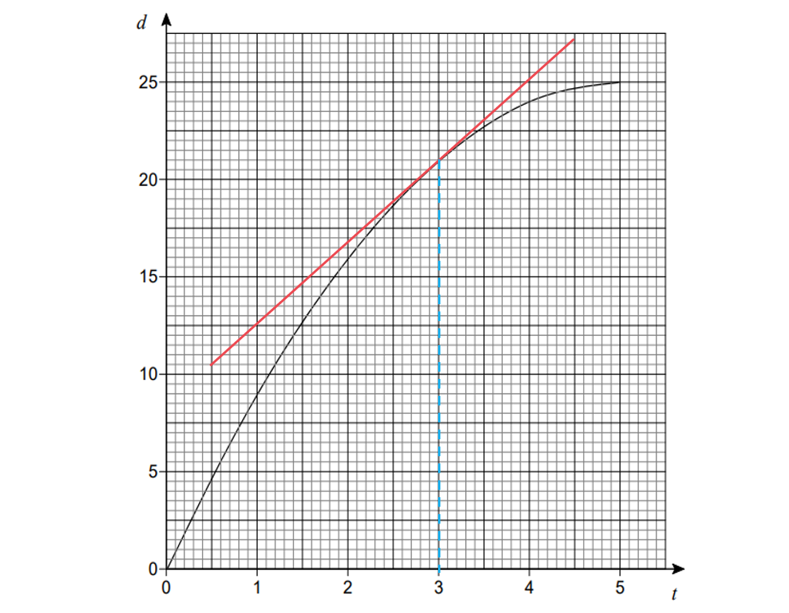

**Suitable tangent line drawn**** [1]**

> *Pick two points on the tangent, not too close to each other. Try to pick points that can be clearly read off the grid. E.g. in the diagram below, we have picked (1.6, 15) and (3.5, 23).*

> *Find the gradient between these two points using *$\frac{\mathrm{rise}}{\mathrm{run}}$* or *$\frac{y_{1}-y_{2}}{x_{1}-x_{2}}$* *

> *Your gradient will depend on your tangent so there is some margin of error permitted in exam questions. For the tangent drawn above, the calculation and answer would be as follows*

*gradient = *$\frac{23-15}{3.5-1.6}=\frac{8}{1.9}=4.2105...$* *

> *If your calculation does not result in an exact answer, write the answer to at least 3 significant figures*

**Final answer:** **Answer = 4.21 **

**Any answer from 3.6 to 4.4 as long as it is consistent with the drawn tangent line ****[1]**

## Q19 — very_hard — 6 marks · exam-questions

### 23() — 6 marks
> *Differentiate *$s$* with respect to *$t$* to get an equation for the velocity.*

$\frac{ds}{dt}=v=3t^{2}+8t-5$

**[1]**

> *Substitute *`open parentheses V comma space T close parentheses`* into the equation for velocity.*

$V=3T^{2}+8T-5$

**[1]**

> *Rearrange to equal zero.*

`table row cell 3 T squared plus 8 T minus 5 minus V end cell equals 0 end table`

> *Now solve for *$T$*, treating "*$-5-V$*" as the  *$c$* in *$ax^{2}+bx+c=0$* ! This can be done by completing the square or using the quadratic formula- but the quadratic formula is recommended as the easier method in this instance.*

`T equals fraction numerator negative 8 plus-or-minus square root of 8 squared minus 4 cross times 3 cross times open parentheses negative 5 minus V close parentheses end root over denominator 2 cross times 3 end fraction`

**correct substitution into quadratic formula, or at least one correct step of completing the square ****[1]**

> *Evaluate.*

`table row T equals cell fraction numerator negative 8 plus-or-minus square root of 64 minus 12 cross times open parentheses negative 5 minus V close parentheses end root over denominator 6 end fraction end cell row blank equals cell fraction numerator negative 8 plus-or-minus square root of 64 plus 60 plus 12 V end root over denominator 6 end fraction end cell row blank equals cell fraction numerator negative 8 plus-or-minus square root of 124 plus 12 V end root over denominator 6 end fraction end cell end table`

**[1]**

> *Factorise the 4 from *$124+12V$* so that the surd can be simplified.*

`table row blank equals cell fraction numerator negative 8 plus-or-minus square root of 4 open parentheses 31 plus 3 V close parentheses end root over denominator 6 end fraction end cell row blank equals cell fraction numerator negative 8 plus-or-minus square root of 4 square root of 31 plus 3 V end root over denominator 6 end fraction end cell row blank equals cell fraction numerator negative 8 plus-or-minus 2 square root of 31 plus 3 V end root over denominator 6 end fraction end cell end table`

**[1]**

> *Finally, cancel down the fraction.*

`table attributes columnalign right center left columnspacing 0px end attributes row blank bold equals cell fraction numerator bold minus up diagonal strike bold 8 bold plus-or-minus up diagonal strike bold 2 square root of bold 31 bold plus bold 3 bold V end root over denominator up diagonal strike bold 6 end fraction bold equals fraction numerator bold minus bold 4 bold plus-or-minus square root of bold 31 bold plus bold 3 bold V end root over denominator bold 3 end fraction end cell end table`* ***[1]**

## Q20 — medium — 2 marks · exam-questions

### 24() — 2 marks
> *We can estimate the speed of the ball after 1 second by finding the gradient.*

> *First draw a tangent at *$t=1$*. *

> *This should be a straight line (use a ruler or straight edge) touching the curve at *$t=1$*, but not crossing the curve*

**Suitable tangent line drawn**** [1]**

> *Pick two points on the tangent, not too close to each other. Try to pick points that can be clearly read off the grid, e.g. in the diagram below, we have picked (0, 6.6) and (2, 9.4).*

> *Find the gradient between these two points using *$\frac{\mathrm{rise}}{\mathrm{run}}$* or *$\frac{y_{1}-y_{2}}{x_{1}-x_{2}}$*. *

> *Your gradient will depend on your tangent so there is some margin of error permitted in exam questions. For the tangent drawn above, the calculation and answer would be as follows*

*gradient = *$\frac{9.4-6.6}{2-0}=\frac{2.8}{2}=1.4$* *

> *If your calculation does not result in an exact answer, write the answer to at least 3 significant figures*

**1.4 m/s ****[1]**** **

**Answer must be consistent with the drawn tangent line**

## Q21 — medium — 4 marks · exam-questions

### 19() — 4 marks
> *In a distance-time graph, the speed at any given point is equal to the gradient of the tangent at that point. So draw a tangent at Time = 5 and calculate its gradient. *
*The tangent is a straight line touching the curve but not crossing the curve (there is some margin of error- see note below final answer). E.g.:*

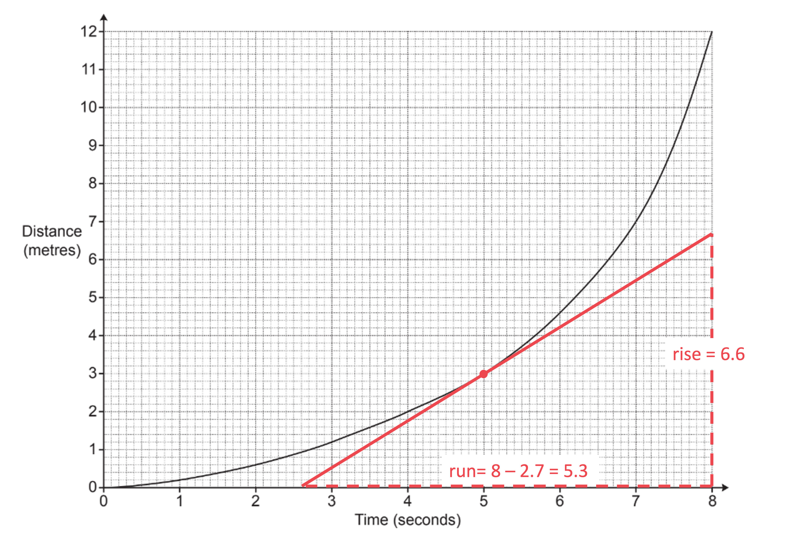

**suitable tangent drawn**** [1]**

> *Using gradient = *$\frac{y_{1}-y_{2}}{x_{1}-x_{2}}$* or *$\frac{\mathrm{rise}}{\mathrm{run}}$*;*

*speed = gradient = *$\frac{6.6}{5.3}$

**attempt to find gradient with no more than one error ****[1]**** **
**correct calculation for gradient based on your tangent line**** [1]**

*                                                            = 1.245283019...*

> *This answer will depend on your tangent line so there is some margin of error (see below). Round to at least 3 significant figures if necessary.*

**Acceleration = 1.25 m/s**** ****[1] **

**Any answer from 1.0 to 1.4 is accepted, so long as it is correct for your tangent line and rounded correctly**

## Q22 — medium — 3 marks · exam-questions

### 15((c)) — 3 marks
> *In a speed-time graph, the acceleration at any given point is equal to the gradient of the tangent at that point. So draw a tangent at **t** = 7 and calculate its gradient. *

> *The tangent is a straight line touching the curve at **t** = 7 but not crossing the curve (there is some margin of error- see note below final answer). E.g.:*

**suitable tangent drawn**** [1]**

> *Using gradient = *$\frac{y_{1}-y_{2}}{x_{1}-x_{2}}$* or *$\frac{\mathrm{rise}}{\mathrm{run}}$*;*

*acceleration = gradient = *$\frac{26}{6.2}$

**correct calculation for gradient based on your tangent line**** [1]**

*                                                            = 4.193548387...*

> *This answer will depend on your tangent line so there is some margin of error (see below). Round to at least 3 significant figures if necessary.*

**Acceleration = 4.19 m/s****2**** ****[1] **

**Any answer from 4 to 4.5 is accepted, so long as it is correct for your tangent line and rounded correctly**

## Q23 — hard — 3 marks · exam-questions

### 1() — 2 marks
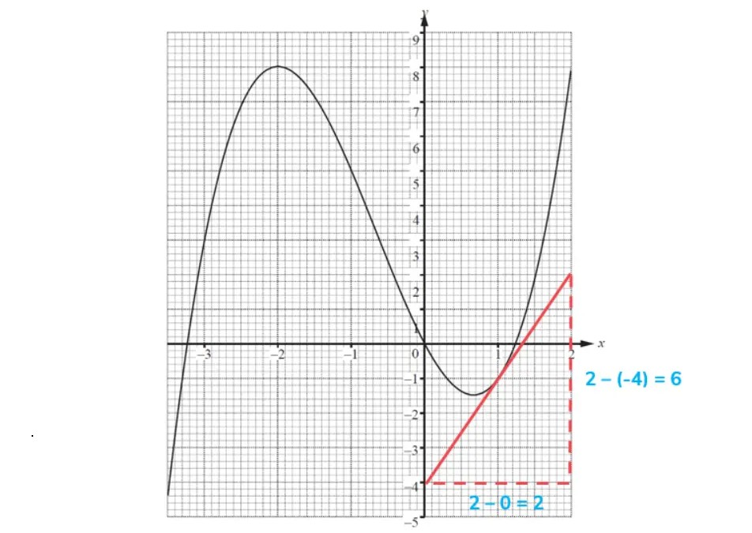

**Suitable tangent drawn [1]**

> *Draw a tangent at 1 to calculate the gradient using *$\frac{y_{2}-y_{1}}{x_{2}-x_{1}}$

$\mathrm{Gradient}=\frac{2--4}{2-0}=\frac{6}{2}$

**Final answer:** **Gradient = 3**

**Answers between 2.1 and 3.9 [1]**

### 2() — 1 marks
> *If the gradient of the tangent at D is 0, D must be one of the turning points where the curve is flat*

> *If the x-coordinate of D is negative, D must lie on the left-hand side of the y-axis therefore D is (-2, 8)*

**Final answer:** **(-2, 8)**

**[1]**

## Q24 — medium — 3 marks · exam-questions

### 1() — 1 marks
> *Reduce the power by one and multiply by the original power*

$\frac{dy}{dx}=4x^{3}$* ***[1]**

### 2() — 1 marks
> *Reduce the power by one and multiply by the original power*

`fraction numerator d y over denominator d x end fraction equals open parentheses negative 3 close parentheses cross times 2 x to the power of negative 4 end exponent`

$\frac{dy}{dx}=-6x^{-4}\mathrm{or}-\frac{6}{x^{4}}$* ***[1]**

**The question does not ask for the question in a particular form so either of the above are fine**

### 3() — 1 marks
> *Rewrite as powers using the laws of indices*

$y=4x^{-1}$

> *And differentiate*

`fraction numerator d y over denominator d x end fraction equals open parentheses negative 1 close parentheses cross times 4 x to the power of negative 2 end exponent`

$\frac{dy}{dx}=-4x^{-2}\mathrm{or}-\frac{4}{x^{2}}$* ***[1]**

## Q25 — hard — 4 marks · exam-questions

### 1() — 3 marks

**Suitable tangent drawn [1]**

> *Draw a tangent at 9 to calculate the gradient using *$\frac{rise}{run}$

> *Gradient is negative as tangent slopes downwards*

$\mathrm{Gradient}=-\frac{10.6-7.4}{11-7}=-\frac{3.2}{4}$

*Gradient = -0.8*

**between -1.2 and -0.6 [1]**

**Final answer:** **-0.8 ms****-2**

**Units must be stated, allow m/s****2**** [1]**

### 2() — 1 marks
**Final answer:** **After 7 seconds her speed decreases, i.e. she starts decelerating**

**[1]**

## Q26 — medium — 3 marks · exam-questions

### 1() — 1 marks
> *For each term, reduce the power by 1 and multiply by the original power*

$\frac{dy}{dx}=3\times4x^{2}+2x^{0}$

$\frac{dy}{dx}=12x^{2}+2$ **[1]**

### 2() — 1 marks
> *Reduce the power by one and multiply by the original power*

`fraction numerator d y over denominator d x end fraction equals open parentheses negative 2 close parentheses cross times negative 5 x to the power of negative 3 end exponent`

$\frac{dy}{dx}=10x^{-3}\mathrm{or}\frac{10}{x^{3}}$* ***[1]**

**Either version of the answer is accepted**

### 3() — 1 marks
> *Rewrite as powers using the laws of indices*

$y=\frac{1}{3}\times\frac{1}{x}=\frac{1}{3}x^{-1}$

> *And differentiate*

`fraction numerator d y over denominator d x end fraction equals open parentheses negative 1 close parentheses cross times 1 third x to the power of negative 2 end exponent`

$\frac{dy}{dx}=-\frac{1}{3}x^{-2}\mathrm{or}-\frac{1}{3x^{2}}$* ***[1]**

## Q27 — hard — 5 marks · exam-questions

### 1() — 2 marks
> *Draw a line at *$y=3$* to see where the line and curve intersect*

> *The solutions will be the *$x$*-coordinates of the points of intersection*

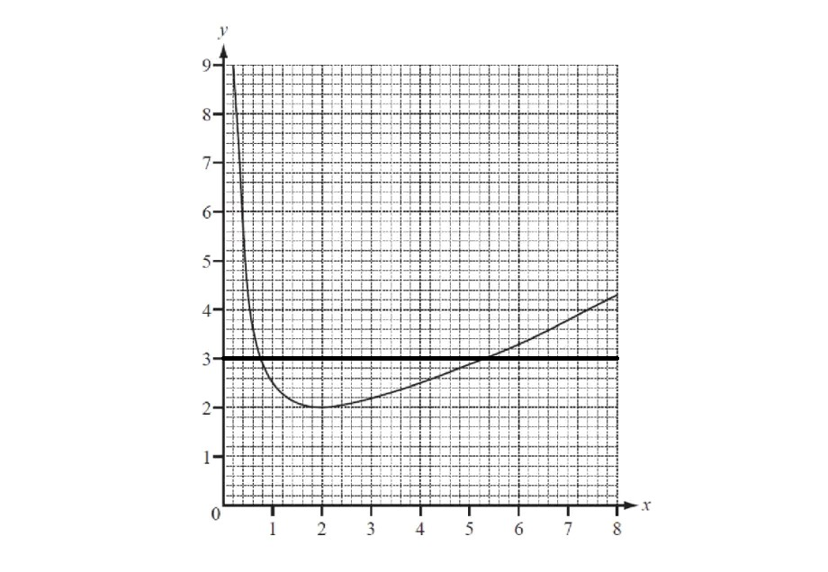

**Line at **$y=3$** [1]**

**Final answer:** $x=0.8$** and **$x=5.3$

**[1]**

### 2() — 3 marks
> *Draw a tangent at *$x=1$* to calculate the gradient using *$\frac{y_{2}-y_{1}}{x_{2}-x_{1}}$

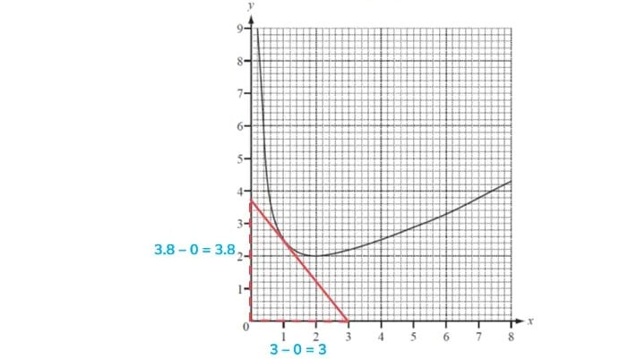

**Suitable tangent drawn [1]**

> *Gradient is negative as tangent slopes downwards*

`table row Gradient equals cell negative fraction numerator 3.8 minus 0 over denominator 3 minus 0 end fraction equals negative fraction numerator 3.8 over denominator 3 end fraction end cell row blank equals cell negative 1.2666... end cell end table`

**[1]**

**Final answer:** **Gradient = -1.27**

**Answers between -1.2 and -1.3 [1]**

## Q28 — medium — 5 marks · exam-questions

### 1() — 1 marks
> *For each term, reduce the power by 1 and multiply by the original power. The constant term, 4, disappears*

$\frac{dy}{dx}=3\times2x^{2}-2\times6x^{1}+3x^{0}$

> *Simplify*

$\frac{dy}{dx}=6x^{2}-12x+3$ **[1]**

### 2() — 2 marks
> *Rewrite as powers using the laws of indices*

$-\frac{5}{3x^{4}}=-\frac{5}{3}\times\frac{1}{x^{4}}=-\frac{5}{3}x^{-4}$

**[1]**

> *Reduce the power by 1 and multiply the original power*

`open parentheses negative 4 close parentheses cross times open parentheses negative 5 over 3 x to the power of negative 5 end exponent close parentheses`

$\frac{20}{3}x^{-5}\mathrm{or}\frac{20}{3x^{5}}$* ***[1]**

### 3() — 2 marks
> *Rewrite the last term as powers using the laws of indices*

$\frac{2}{3}x^{2}+\frac{1}{5}x-\frac{3}{2}x^{-1}$

**[1]**

> *Differentiate, taking care with fractions*

$\frac{4}{3}x+\frac{1}{5}+\frac{3}{2}x^{-2}\mathrm{or}\frac{4}{3}x+\frac{1}{5}+\frac{3}{2x^{2}}$* ***[1]**

## Q29 — hard — 6 marks · exam-questions

### 15((a)) — 3 marks
> *We can estimate the gradient at time 4 seconds by drawing a tangent at time 4 seconds and calculating its gradient*

> *First draw a tangent at 4 seconds. This should be a straight line (use a ruler or straight edge) touching the curve at 4 seconds, but not crossing the curve*

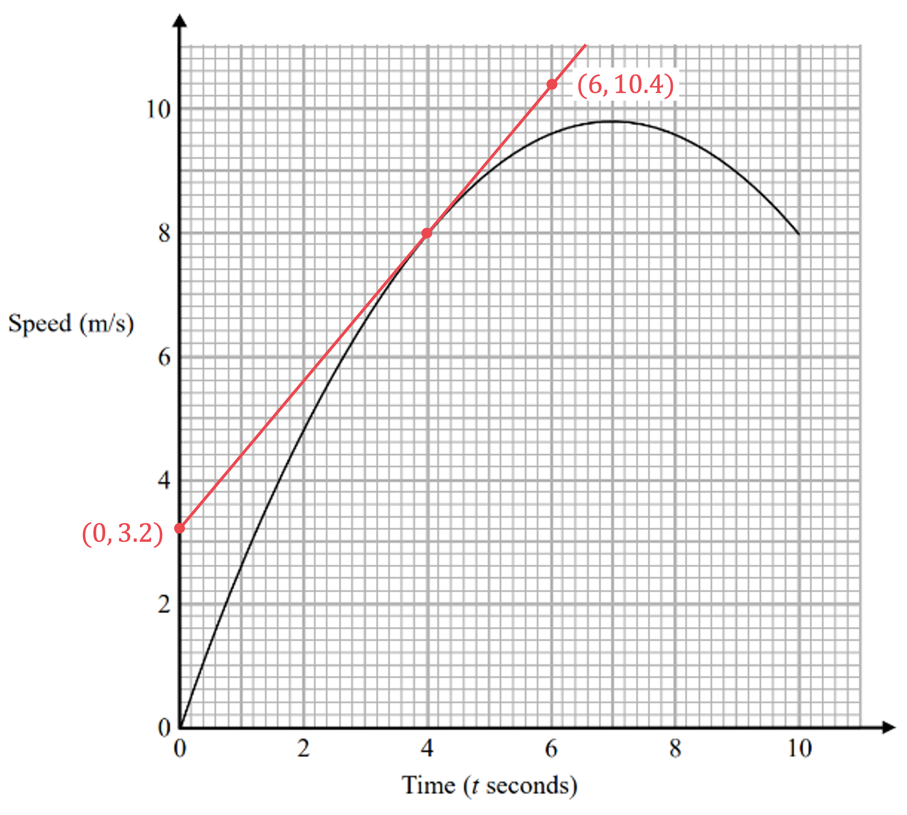

**suitable tangent line drawn**** [1]**

> *Pick two points on the tangent, not too close to each other. Try to pick points that can be clearly read off the grid. E.g. in the diagram above, we have picked (6, 10.4) and (0, 3.2) *

> *Find the gradient between these two points using *$\frac{\mathrm{rise}}{\mathrm{run}}$* or *$\frac{y_{1}-y_{2}}{x_{1}-x_{2}}$* *

> *Your gradient will depend on your tangent so there is some margin of error permitted in exam questions. For the tangent drawn above, the calculation and answer would be as follows*

*gradient = *$\frac{10.4-3.2}{6-0}$

$\frac{rise}{run}$* ***or gradient formula used with tangent line**** [1]**

$=\frac{7.2}{6}=1.2$

> *If your calculation does not result in an exact answer, write the answer to at least 3 significant figures*

**Answer = 1.2 ****[1]**** **

**Any answer from 1.0 to 1.3 so long as it is consistent with the drawn tangent line**

### 15((b)) — 2 marks
> *In a **speed-time graph**, the **gradient** of the graph represents the **acceleration*

**acceleration ****[1]**
**"****in m/s****2****" and/or "****4**** ****seconds after the start of the race****" and/or "****when the speed is 7.6 m/s****"**** ****[1]**
**"acceleration" plus any of the three options in the second line above will achieve full marks**

### 15((c)) — 1 marks
> *Two examples of suitable answers are;*

**Final answer:** **"the accuracy of the gradient depends on the accuracy of the tangent line"  **

**or**

**Final answer:** **"we can't be sure that the tangent line is correctly drawn"**

**[1]**

**any statement such as the ones above **

## Q30 — medium — 4 marks · exam-questions

### 1() — 2 marks
> *For each term, reduce the power by 1 and multiply by the original power. The constant term, 11, disappears*

$\frac{dy}{dx}=2\times2x^{1}-6x^{0}$

> *Simplify*

**Final answer:** $\frac{dy}{dx}=4x-6$** **

**one term correct ****[1] **
**both terms correct ****[1]**

### 2() — 2 marks
> *Equate the derivative (which is the gradient function) found in part (a) to 6*

$4x-6=2$

**[1]**

> *Solve for x*

`table row cell 4 x end cell equals 8 row x equals 2 end table`

> *The question asks for the coordinates, so the y coordinate is also needed. Substitute the found x value into the **original equation **for y*

`table row y equals cell 2 open parentheses 2 close parentheses squared minus 6 open parentheses 2 close parentheses minus 11 end cell row blank equals cell negative 15 end cell end table`

> *Write as a coordinate point*

$(2,-15)$ **[1]**

## Q31 — hard — 3 marks · exam-questions

### 1() — 2 marks
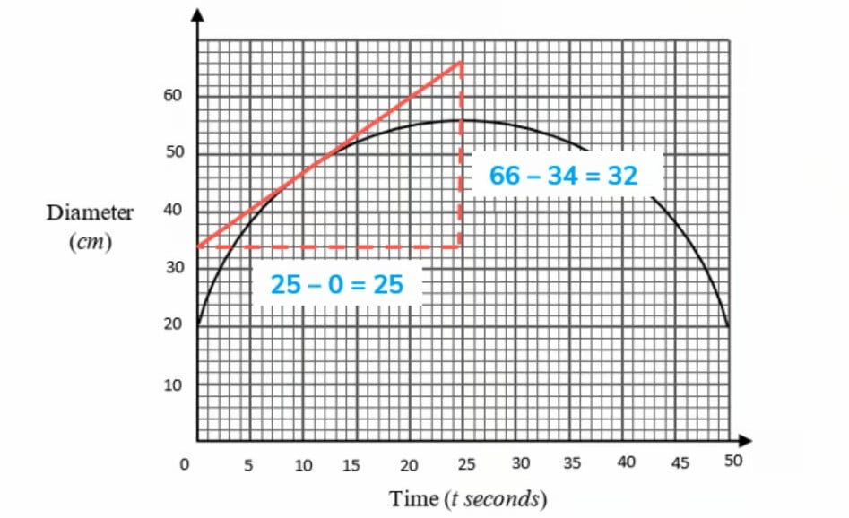

**Suitable tangent drawn [1]**

> *Draw a tangent at 10 to calculate the gradient using *$\frac{rise}{run}$

$\mathrm{Gradient}=\frac{66-34}{25-0}=\frac{32}{25}$

**Final answer:** **1.28**

**Answers between 1.2 and 1.4 [1]**

### 2() — 1 marks
**Final answer:** **The gradient shows the diameter of the fishbowl is increasing by 1.28 cm per second.**

**[1]**

## Q32 — hard — 8 marks · exam-questions

### 1() — 2 marks
> *y = 0 on the x-axis *

$2x^{2}+x-3=0$

**[1]**

> *Solve by factorising or using the quadratic formula. By factorising:*

`open parentheses 2 x plus 3 close parentheses open parentheses x minus 1 close parentheses equals 0
2 x plus 3 equals 0 comma space x minus 1 equals 0
x equals negative 3 over 2 comma space space x equals 1`

> *Write the answer as two coordinate points (where y = 0)*

$(-\frac{3}{2},0)\mathrm{and}(1,0)$ **[1]**

**Both coordinate points must be stated**

### 2() — 1 marks
> *On the y-axis, x = 0*

`x equals 0 comma space y equals 2 open parentheses 0 close parentheses squared plus 0 minus 3 equals negative 3`

> *Write the answer as a coordinate point*

**(0, -3) ****[1]**

### 3() — 3 marks
> *Differentiate*

$\frac{dy}{dx}=4x+1$

> *Any turning points are when the gradient (*$\frac{dy}{dx}$*) is equal to zero*

$4x+1=0$

**[1]**

> *Solve to find the x value of the turning point (notice that it is a quadratic graph, so there should only be one turning point and this matches the fact that *$\frac{dy}{dx}=0$* is linear*

`table row cell 4 x end cell equals cell negative 1 end cell row x equals cell negative 1 fourth end cell end table`

> *Substitute x value into the **original **equation for y*

`table attributes columnalign right center left columnspacing 0px end attributes row y equals cell 2 open parentheses negative 1 fourth close parentheses squared plus open parentheses negative 1 fourth close parentheses minus 3 equals negative 25 over 8 end cell end table`

> *Write down the final answer as a coordinate point*

$(-\frac{1}{4},-\frac{25}{8})$ **[1]**

### 4() — 2 marks
> *A sketch does not have to be to scale but it should be neat and clearly show the points found *

> *Draw the x- and y-axes with straight lines and don't forget to label them x and y*

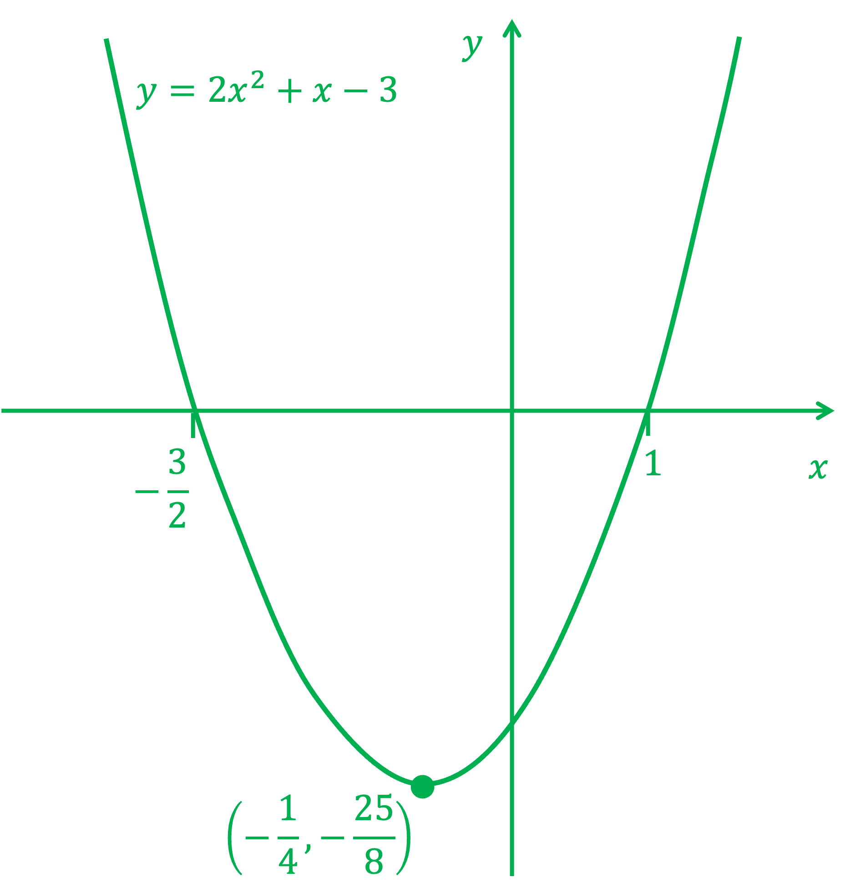

**correct shape curve ****[1]**
 **x-intercepts and turning point clearly labeled with values, and in correct position relative to axes ****[1]**

## Q33 — medium — 7 marks · exam-questions

### 1() — 2 marks
> *For each term, reduce the power by 1 and multiply by the original power. The constant term, 9, disappears*

$\frac{dy}{dx}=3x^{2}+2\times\frac{7}{2}x^{1}-2x^{0}$

> *Simplify*

**Final answer:** $\frac{dy}{dx}=3x^{2}+7x-2$** **

**one term correct ****[1]**
** ****fully correct answer ****[1]**

### 2() — 4 marks
> *i) Substitute x = -3 into the derivative (which is the gradient function) found in part (a)*

`table attributes columnalign right center left columnspacing 0px end attributes row cell fraction numerator d y over denominator d x end fraction end cell equals cell 3 open parentheses negative 3 close parentheses squared plus 7 open parentheses negative 3 close parentheses minus 2 end cell end table`

**[1]**

> *And evaluate, taking care with negative numbers-put them in brackets if using a calculator*

`table row blank equals cell 27 minus 21 minus 2 end cell row blank equals 4 end table`

**gradient = 4 ****[1]**

*ii)** **Substitute x = -2/3 into the derivative (which is the gradient function) found in part (a)*

`table attributes columnalign right center left columnspacing 0px end attributes row cell fraction numerator d y over denominator d x end fraction end cell equals cell 3 open parentheses 2 over 3 close parentheses squared plus 7 open parentheses 2 over 3 close parentheses minus 2 end cell end table`

**[1]**

> *And evaluate, taking care with fractions- put them in brackets if using a calculator*

`table row blank equals cell 4 over 3 plus 14 over 3 minus 2 end cell row blank equals 4 end table`

**gradient = 4 ****[1]**

### 3() — 1 marks
> *The gradients are equal therefore*

**the**** ****tangents**** ****are parallel ****[1] **

## Q34 — hard — 4 marks · exam-questions

### 1() — 2 marks
*In kinematics, the velocity is the rate of change of the displacement*

> *Differentiate the displacement function with respect to **t*

$v=\frac{ds}{dt}=6t^{2}-18t-60$

**one term correct ****[1]** 
**fully correct answer**** [1]**

### 2() — 2 marks
> *Equate the velocity function found in (a) to 0*

$6t^{2}-18t-60=0$

**[1]**

> *Solve for x. Start by looking for common factors; 6 is common so divide both sides of the equation by 6 before factorising*

`table attributes columnalign right center left columnspacing 0px end attributes row cell t squared minus 3 t minus 10 end cell equals 0 row cell open parentheses t minus 5 close parentheses open parentheses t plus 2 close parentheses end cell equals 0 end table`

> * *`table row t equals cell 5 comma space up diagonal strike t equals negative 2 end strike end cell end table`

> *t cannot be negative so reject t = -2 (it is best practice to acknowledge it by writing it down but cross it out to show you understand it can't be a solution)*

$t=5$ **[1]**

## Q35 — hard — 5 marks · exam-questions

### 18() — 3 marks
> *We can estimate the gradient at the point **P **by drawing a tangent and calculating its gradient.*

> *First draw a tangent at the point **P**. This should be a straight line (use a ruler or straight edge) touching the curve at **P**, but not crossing the curve.*

**suitable tangent line drawn**** [1]**

> *Pick two points on the tangent, not too close to each other. Try to pick points that can be clearly read off the grid.*

> *In the diagram above, we have picked (1, 3) and (4, 1.2) *

> *Find the gradient between these two points using *$\frac{\mathrm{rise}}{\mathrm{run}}$* or *$\frac{y_{1}-y_{2}}{x_{1}-x_{2}}$*. *

> *Your gradient will depend on your tangent so there is some margin of error permitted in exam questions. For the tangent drawn above, the calculation and answer would be as follows.*

*gradient = *$\frac{1.2-3}{4-1}$

$\frac{rise}{run}$* ***or gradient formula used with tangent line**** [1]**

$=\frac{-1.8}{3}=-0.6$

> *If your calculation does not result in an exact answer, write the answer to at least 3 significant figures.*

**Answer = -0.6 ****[1]**** **

**Any answer from -0.4 to -0.7 or answers consistent with the drawn tangent line**

### 18() — 2 marks
*The tangent is a straight line so it has equation *$y=mx+c$* where *$m$*is the gradient and *$c$*is the *$y$*-intercept*

> *Substitute in your answer from part (a), for example *$m=-0.6$

$y=-0.6x+c$

**[1]*** *

> *The value of *$c$* can be read off of your graph, it will be the point where your tangent intercepts the *$y$*-axis. *

> * On the diagram below, the tangent intercepts the *$y$*-axis at 3.6.*

$c=3.6$

> *Your answer should be read off of your graph, but must be greater than 3. *

> *Write the final answer as an equation in *$x$* and *$y$

$y=-0.6x+3.6$** [1]**

## Q36 — medium — 6 marks · exam-questions

### 1() — 4 marks
*In kinematics, velocity is the rate of change of displacement* *Differentiate the displacement function with respect to x*

$v=\frac{ds}{dt}=18t^{2}-24t+7$

**one term correct ****[1]** 
**fully correct expression for v**** [1]**

*In kinematics, acceleration is the rate of change of velocity*** ***Differentiate the velocity function with respect to x*

**Final answer:** $a=\frac{dv}{dt}=36t-24$** **

**one term correct ****[1] **
**fully correct expression for a**** [1]**

### 2() — 2 marks
> *Equate the expression for acceleration found in part (a) to 3*

$36t-24=3$

**[1]**

> *Solve*

`table attributes columnalign right center left columnspacing 0px end attributes row cell 36 t end cell equals 27 row t equals cell 27 over 36 end cell end table`

**t**** = 0.75 seconds**** [1]**

## Q37 — hard — 5 marks · exam-questions

### 1() — 2 marks
> *Differentiate with respect to x*

$\frac{dy}{dx}=3x^{2}-14x-5$

**one term correct**** [1]** 
**fully correct answer**** [1]**

### 2() — 2 marks
> *Any turning points are when the gradient (*$\frac{dy}{dx}$*) is equal to zero*

$3x^{2}-14x-5=0$

**[1]**

> *Use any quadratic method to solve for x (notice that it is a cubic graph, so there should be two turning points and this matches the fact that *$\frac{dy}{dx}=0$* is quadratic*

`open parentheses 3 x plus 1 close parentheses open parentheses x minus 5 close parentheses equals 0
3 x plus 1 equals 0 comma space space space x minus 5 equals 0`

> *Note that you are only asked for the x-coordinates*

$x=-\frac{1}{3},x=5$ **[1]**

### 3() — 1 marks
> *The graph is cubic (see **Types of Graph**) so has the shape;*

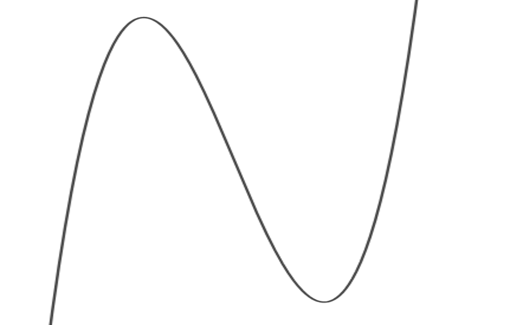

> *This means that the lowest (furthest left) x-coordinate will be the maximum point*

$x=-\frac{1}{3}$ **[1]**

## Q38 — hard — 3 marks · exam-questions

### 18((d)) — 3 marks
> *We can estimate the gradient at the point where **x** = -0.5  by drawing a tangent and calculating its gradient.*

> *First draw a tangent at the point on the curve where **x** = -0.5. This should be a straight line (use a ruler or straight edge) touching, but not crossing the curve.*

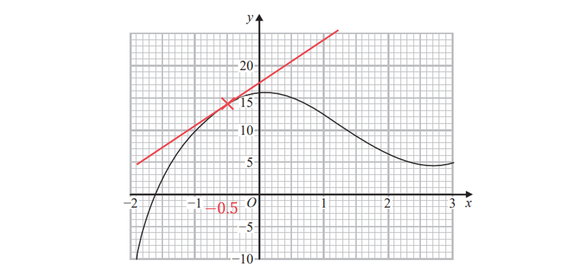

**suitable tangent line drawn**** [1]**

> *Pick two points on the tangent, not too close to each other. Try to pick points that can be clearly read off the grid.*

> *In the diagram above, we have picked (0, 17) and (-1.5, 7). *

> *Find the gradient between these two points using *$\frac{\mathrm{rise}}{\mathrm{run}}$* or *$\frac{y_{1}-y_{2}}{x_{1}-x_{2}}$*. *

> *Your gradient will depend on your tangent so there is some margin of error permitted in exam questions. For the tangent drawn above, the calculation and answer would be as follows.*

*gradient = *`fraction numerator 17 space minus space 7 over denominator 0 space minus space open parentheses negative 1.5 close parentheses end fraction`

$\frac{rise}{run}$* ***or gradient formula used with tangent line**** [1]**

$=\frac{10}{1.5}=\frac{20}{3}=6.6666....$

> *If your calculation does not result in an exact answer, write the answer to at least 3 significant figures.*

**Gradient = 6.67 ****[1]**** **

**Any answer from 5 to 7 as long as it is consistent with the drawn tangent line**

## Q39 — medium — 6 marks · exam-questions

### 17((a)) — 2 marks
> *Differentiate each term.*

$\frac{dy}{dx}=3\times5x^{2}-2x^{1}-6x^{0}$

$\frac{dy}{dx}=15x^{2}-2x-6$

**two terms correct (out of three) and no extra terms such as "4"**** [1]** 
**fully correct answer**** [1]**

### 17((b)) — 4 marks
> *The gradient is given by *$\frac{dy}{dx}$* for a given value of *$x$*. So equate *$\frac{dy}{dx}$* to 2.*

$15x^{2}-2x-6=2$

**[1]**

> *Start by subtracting 2 from both sides to leave a quadratic equal to zero.*

$15x^{2}-2x-8=0$

**[1]**

> *Solve using your preferred method; quadratic formula, completing the square or factorisation (the question doesn't ask for any rounding, which is a clue that the quadratic will factorise). Here we will use the quadratic formula as it looks like a trickier factorisation.*

`x equals fraction numerator negative open parentheses negative 2 close parentheses plus-or-minus square root of open parentheses negative 2 close parentheses squared minus 4 cross times 15 cross times open parentheses negative 8 close parentheses end root over denominator 2 cross times 15 end fraction`

** ****correct first step to solving using any of the above methods ****[1]**

$x=\frac{2\pm\sqrt{484}}{30}$

$x=\frac{4}{5},x=-\frac{2}{3}$  **[1]**

**Both answers must be stated (as fractions or decimals) for the final mark**

## Q40 — hard — 8 marks · exam-questions

### 1() — 1 marks
> *A is the y-intersect. The curve intersects the y-axis when x = 0*

`x equals 0 comma space y equals 1 minus 0 cubed minus 6 open parentheses 0 close parentheses squared minus 9 open parentheses 0 close parentheses`

> *(or just ignore/ cover up all terms with an x)*

> *Write the answer as a coordinate point*

**(0, 1) *** ***[1]**

### 2() — 5 marks
> *Differentiate with respect to x*

$\frac{dy}{dx}=-3x^{2}-12x-9$

**[1]**

> *Any turning points are when the gradient (*$\frac{dy}{dx}$*) is equal to zero*

$-3x^{2}-12x-9=0$

**[1]**

> *Use any quadratic method to solve for x. There is a common factor of -3 so start by dividing all terms by -3 *

> *(notice that it is a cubic graph, so there should be two turning points and this matches the fact that *$\frac{dy}{dx}=0$* is quadratic*

`x squared plus 4 x plus 3 equals 0
open parentheses x plus 3 close parentheses open parentheses x plus 1 close parentheses equals 0
x equals negative 3 comma space space x equals negative 1`

**[1]**

> *We need the full coordinates so substitute each x value into the original equation to find y*

`x equals minus 3 comma space y equals 1 minus open parentheses negative 3 close parentheses cubed minus 6 open parentheses negative 3 close parentheses squared minus 9 open parentheses negative 3 close parentheses equals 1`

*therefore there is a point at *`open parentheses negative 3 comma space 1 close parentheses`

`x equals minus 1 comma space y equals 1 minus open parentheses negative 1 close parentheses cubed minus 6 open parentheses negative 1 close parentheses squared minus 9 open parentheses negative 1 close parentheses equals 5`

*therefore there is a point at *`open parentheses negative 1 comma space 5 close parentheses`

> *x = -3 is further left than x = -1. We can see from the diagram that the minimum point B is the point with the smallest (furthest left) x-value, where x = -3 *

> *Likewise, C is the maximum point where x = -1*

**B is the minimum point at**** **`open parentheses negative 3 comma space 1 close parentheses`** ****[1] **

**C is the maximum point at **$(-1,5)$** [1]**

### 3() — 2 marks
*We can see from the diagram that the gradient is negative to the left of B and to the right of A* *Therefore*

$x<-3,x>-1$

**x < -3**** [1]** 
**x > -1**** [1]**

## Q41 — hard — 3 marks · exam-questions

### 25() — 3 marks
> *We can estimate the gradient at 10 seconds by drawing a tangent at the point on the graph where *$t=10$* and calculating its gradient.*

> *First draw a tangent at *$t=10$*. This should be a straight line (use a ruler or straight edge) touching the curve at *$t=10$*, but not crossing the curve.*

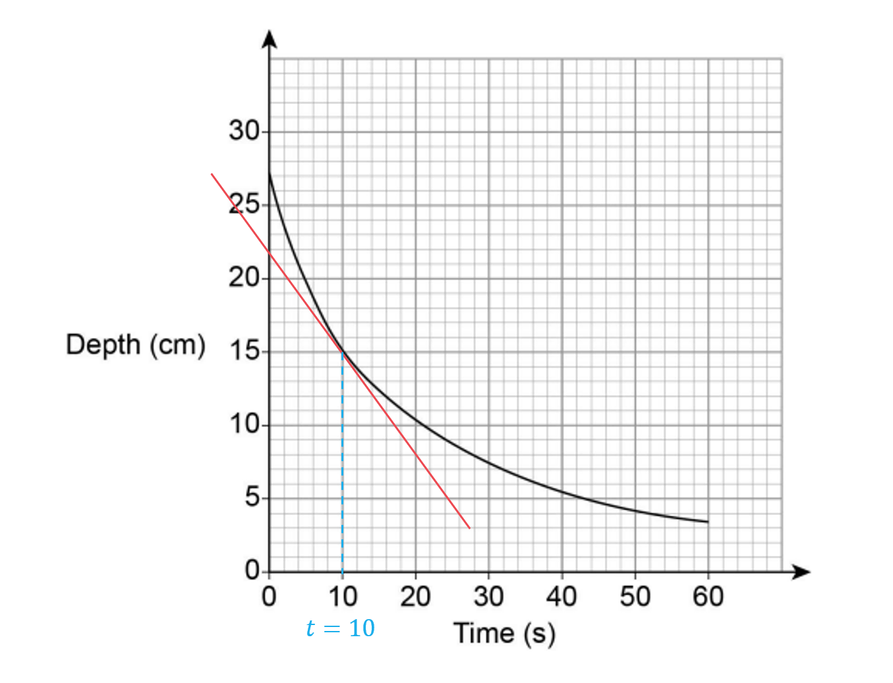

**Suitable tangent line drawn**** [1]**

> *Pick two points on the tangent that can be clearly read off the grid, e.g. in the diagram below, we have picked (0, 22) and (20, 8).*

> *Find the gradient between these two points using *$\frac{\mathrm{rise}}{\mathrm{run}}$* or *$\frac{y_{1}-y_{2}}{x_{1}-x_{2}}$*. *

> *Your gradient will depend on your tangent so there is some margin of error permitted in exam questions. For the tangent drawn above, the calculation and answer would be as follows*

*gradient = *$\frac{8-22}{20-0}=\frac{-14}{20}=-0.7$* *

**Attempt to find gradient from tangent ****[1]**

> *The gradient is -0.7, but the question asks for the rate of **decrease**, so the negative is not needed in the answer. *

**Answer = 0.7 ****[1]**** **

**Any answer from 0.6 to 0.8 as long as it is consistent with the drawn tangent line**

## Q42 — medium — 6 marks · exam-questions

### 12((a)) — 2 marks
> *Differentiate each term.*

$\frac{dy}{dx}=3\timesx^{2}-2\times6x^{1}-15x^{0}$

$\frac{dy}{dx}=3x^{2}-12x-15$

**two terms correct**** [1]** 
**fully correct answer**** [1]**

### 12((b)) — 4 marks
> *Stationary points occur where *$\frac{dy}{dx}=0$* so equate *$\frac{dy}{dx}$* to 0.*

$3x^{2}-12x-15=0$

**[1]**

> *Divide both sides by the common factor 3 to leave a quadratic equation in the form *$x^{2}+bx+c=0$

$x^{2}-4x-5=0$

> *This is a straightforward quadratic to factorise, however you could solve using the quadratic formula or by completing the square if you wish.*

`open parentheses x minus 5 close parentheses open parentheses x plus 1 close parentheses equals 0`

** ****correct first step to solving, using any of the above methods ****[1]**

$x=5,x=-1$

**both x values ****[1]**

> *Be careful! You are asked for the coordinates, not just the **x** value- so substitute each value of **x** into the equation of the curve to find the corresponding **y** value.*

`y equals open parentheses negative 1 close parentheses cubed minus 6 open parentheses negative 1 close parentheses squared minus 15 open parentheses negative 1 close parentheses equals 8
y equals open parentheses 5 close parentheses cubed minus 6 open parentheses 5 close parentheses squared minus 15 open parentheses 5 close parentheses equals negative 100`

$(-1,8)\mathrm{and}(5,-100)$  **[1]**

**Both coordinate points must be stated for the final mark**

## Q43 — hard — 5 marks · exam-questions

### 13((b)) — 5 marks
> *The **area** under a **speed-time graph** represents the **distance** (because distance = speed × time).*

> *The speed-time graph here is in the shape of a trapezium and area of a trapezium = *`1 half open parentheses a plus b close parentheses h`* where *$a$* and *$b$* are the parallel lengths and *$h$* is the perpendicular height. We can read these values from the graph:*

*Distance = area = *`1 half open parentheses 40 plus 50 close parentheses cross times k`

**attempt to find the area under graph ****[1] **
**correct expression in terms of k for area under graph ****[1]**

> *We can equate this to 1350, the total distance in metres.*

`1 half open parentheses 40 plus 50 close parentheses cross times k equals 1350`

**equating to a distance ****[1] **
**equating to 1350 ****[1]**

> *Solve for **k.*

`table attributes columnalign right center left columnspacing 0px end attributes row cell 45 k end cell equals 2700 end table`

$k=30$** ****[1]**

## Q44 — hard — 7 marks · exam-questions

### 1() — 2 marks
> *Rewrite *$\frac{64}{x}$* as a negative power of x using the **laws of indices*

$y=4x+64x^{-1}+7$

> *Differentiate with respect to x*

**Final answer:** $\frac{dy}{dx}=4-64x^{-2}$** **

**one term correct ****[1]** 
**fully correct answer ****[1]**

### 2() — 3 marks
> *Any turning points are when the gradient (*$\frac{dy}{dx}$*) is equal to zero*

$4-64x^{-2}=0$

**[1]**

> *Rewrite the second term as an algebraic fraction*

$4-\frac{64}{x^{2}}=0$

> *Multiply all terms by *$x^{2}$* to clear the fractions, and solve the resulting quadratic equation. There are many ways to do this but a straightforward method is shown below*

$4x^{2}-64=0\,x^{2}-16=0\,x^{2}=16\,x=\pm4$

** ****correct x values ****[1]**

> *For both x coordinates (4 and -4), the y coordinate is needed so substitute each into the original equation in y*

`x equals 4 comma space y equals 4 open parentheses 4 close parentheses plus 64 over 4 plus 7 equals 39
x equals negative 4 comma space y equals 4 open parentheses negative 4 close parentheses plus fraction numerator 64 over denominator negative 4 end fraction plus 7 equals negative 25`

> *Write both coordinate answers*

`open parentheses negative 4 comma space minus 25 close parentheses space and space open parentheses 4 comma space 39 close parentheses` **[1]** 
**Both points must be fully correct.**

### 3() — 2 marks
> *The distance between two points *`open parentheses x subscript 1 comma space y subscript 1 close parentheses`* and *`open parentheses x subscript 2 comma space y subscript 2 close parentheses`* is *`square root of open parentheses x subscript 1 minus x subscript 2 close parentheses squared plus open parentheses y subscript 1 minus y subscript 2 close parentheses squared end root`

`d equals square root of left parenthesis left parenthesis negative 4 right parenthesis minus 4 right parenthesis squared plus left parenthesis open parentheses negative 25 close parentheses minus 39 right parenthesis squared end root`

**correct use of distance between points formula ****[1]**

$=\sqrt{(-8)^{2}+(-64)^{2}}\,=\sqrt{4160}$

> *The **exact **answer is requested so give the answer in surd form, not as a rounded decimal*

$8\sqrt{65}$ **[1]**

## Q45 — medium — 5 marks · exam-questions

### 15((a)) — 2 marks
> *Differentiate each term by multiplying by the power and reducing the power by one.*

$\frac{dy}{dx}=3\times\frac{1}{3}x^{2}-1\times9x^{0}$

$\frac{dy}{dx}=x^{2}-9$* ***[2] **

**one mark for each correct term**

### 15((b)) — 3 marks
> *The gradient at any value of **x** is given by *$\frac{dy}{dx}=x^{2}-9$*. So the gradient is negative where *$\frac{dy}{dx}<0$*.*

$x^{2}-9<0$

**[1]**

> *To solve a quadratic inequality, first ignore the inequality sign and solve as an equation.*

`table row cell x squared minus 9 end cell equals 0 row cell x squared end cell equals 9 row x equals cell plus-or-minus 3 end cell end table`

> *Now you have the two roots, sketch the graph of *$\frac{dy}{dx}$* and mark the region where *$\frac{dy}{dx}<0$*.*

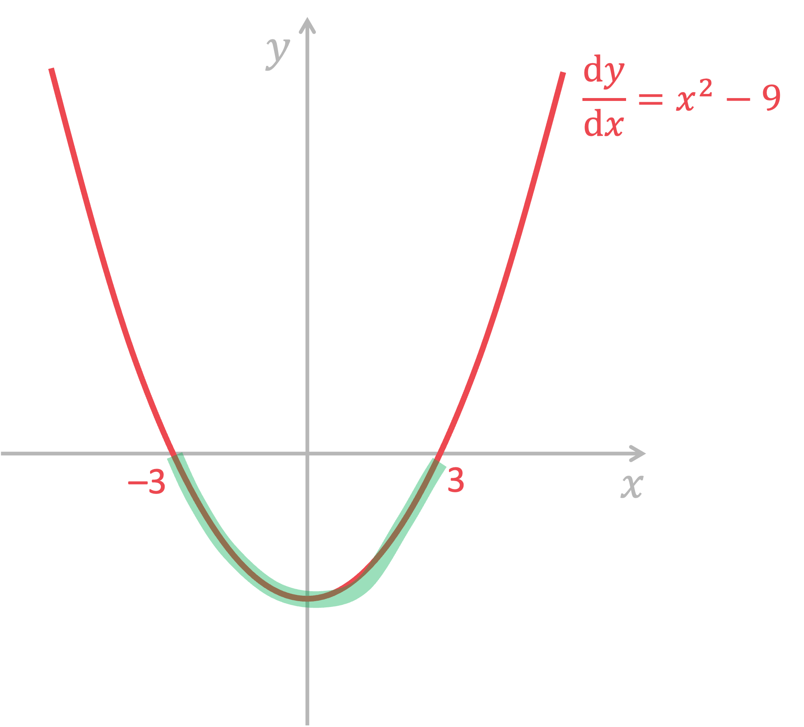

$-3<x<3$ **[2] **

**1 mark for only " **$x>-3$**" or  " **$x<3$**" **

## Q46 — very_hard — 5 marks · exam-questions

### 1() — 3 marks
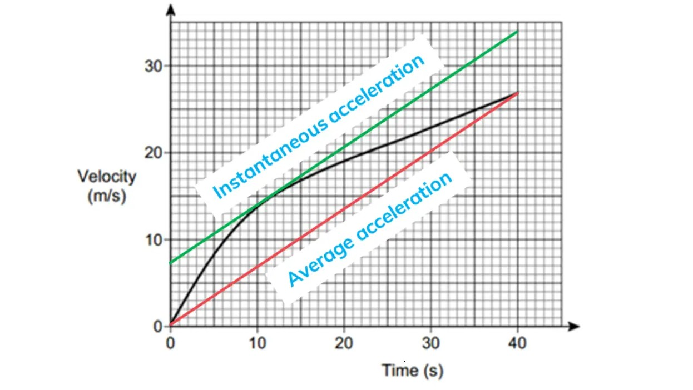

> *Using start and end points from the graph calculate gradient using *$\frac{rise}{run}$

$\mathrm{Gradient}=\frac{27-0}{40-0}=\frac{27}{40}$

**Appropriate values chosen [1]**

*Gradient = 0.675*

**Gradient calculated [1]**

**Final answer:** **0.675 ms****-2**

**Must include units, also allow m/s****2**** [1]**

### 2() — 2 marks
> *Two points have equal acceleration where their tangents are parallel to each other*

> *Instantaneous acceleration is equal to average acceleration where the tangent to the curve is parallel to the line from (0, 0) to (40, 27)*

**Suitable tangent drawn [1]**

> *You must draw both lines on the graph to show this*

**Final answer:** **12 seconds**

**[1]**

## Q47 — hard — 7 marks · exam-questions

### 1() — 1 marks
> *Initially means when the time is zero (**t** = 0) so substitute **t** = 0 into the displacement equation*

`t equals 0 comma space s equals 1 third open parentheses 0 close parentheses cubed minus 5 over 2 open parentheses 0 close parentheses squared plus 20 open parentheses 0 close parentheses minus 15
space space space space space space space space space space space space space equals negative 15`

*(or just ignore all terms except the constant term)* *This means that the initial displacement was -15 metres from point **O*

> *Be careful, the question asks "how far" so the direction does not matter, only the distance. In other words, ignore the negative sign*

**15 metres**** ****[1]**

### 2() — 2 marks
*In kinematics, velocity ifs the rate of change of the displacement* *Differentiate the displacement function with respect to **t*

$v=\frac{ds}{dt}=t^{2}-5t+20$** [1] **

**one term correct**** [1] **
**fully correct answer**** [1]**

### 3() — 2 marks
*To find a minimum, equate the derivative of the velocity to zero and solve*

> *First, differentiate the velocity function with respect to **t*

$\frac{dv}{dt}=2t-5$

**[1]**

> *Equate to zero*

`table attributes columnalign right center left columnspacing 0px end attributes row cell 2 t minus 5 end cell equals 0 row cell 2 t end cell equals 5 end table`

$t=2.5$** [1] **
**This means that the particle's velocity reached its minimum (and its acceleration was instantaneously 0) after 2.5 seconds**

### 4() — 2 marks
> *Method 1 *

*The particle is decelerating when its acceleration (the derivative of the velocity, which we found in part (c)), is negative* *Set the derivative of the velocity to "< 0" and solve*

$2t-5<0$

**[1]**

`table row cell 2 t end cell less than 5 row t less than cell 2.5 end cell end table`

**The particle is decelerating for 2.5 seconds ****[1]**

> *Method 2*

> *The velocity function, *$v=t^{2}-5t+20$*, is quadratic, so we know its shape is a u-shaped parabola. *

> *To know when its gradient is negative, we just need the **t**-value of the minimum point*

> *We already found **t**-value of the minimum point in part (b) but we could also **complete the square**, or use the knowledge that for any quadratic** *$y=ax^{2}+bx+c$*, the axis of symmetry is at *$x=\frac{-b}{2a}$

*axis of symmetry at *`t equals fraction numerator negative open parentheses negative 5 close parentheses over denominator 2 end fraction equals 2.5`

> *Now we can sketch; all we're really looking for is when the gradient is negative*

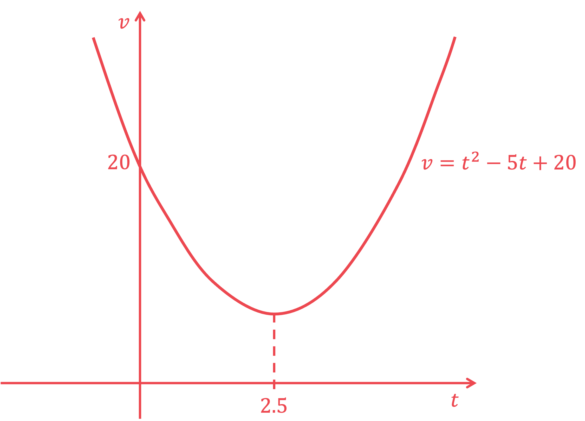

**[1]**

**The particle is decelerating for 2.5 seconds ****[1]**

## Q48 — medium — 3 marks · exam-questions

### 7((a)) — 3 marks
> *The gradient of the curve at a point can be determined by finding the derivative of the equation of the curve, and substituting the *$x$* coordinate in.*

> *Differentiate each term separately using the formula for differentiation.*

> * *$y=ax^{n}\Rightarrow\frac{dy}{dx}=n\timesax^{n-1}$*.*

> * To differentiate *$y=-x^{2}$*, bring the 2 in front of *$x$* and reduce the power by 1. *

> *If the power if 1 then the derivative is just the coefficient of *$x$*, *$y=5x\Rightarrow\frac{dy}{dx}=5$*.*

> * **If the power is 0 then the derivative is 0, *$y=24\Rightarrow\frac{dy}{dx}=0$*.*

> *Use this to find the derivative of each term.*

`table row cell y space end cell equals cell space 24 space plus space 5 x space minus space x to the power of 2 space end exponent end cell row cell fraction numerator straight d y over denominator straight d x end fraction end cell equals cell space 0 space plus thin space 5 space plus space 2 cross times open parentheses negative x to the power of 2 minus 1 end exponent space close parentheses end cell row blank equals cell space 5 space minus space 2 x end cell end table`

**  1 mark for each correct term**** [2]**

> *Find the gradient at the point where *$x=-1.5$* by substituting it into the derivative.*

`table row cell space 5 space minus space 2 open parentheses negative 1.5 close parentheses space end cell equals cell space 5 space minus space open parentheses negative 3 close parentheses end cell end table`

** **`table row blank blank bold 8 end table` **[1]**

## Q49 — very_hard — 6 marks · exam-questions

### 1() — 2 marks
> *Draw a tangent at 300 to calculate the gradient using *$\frac{rise}{run}$

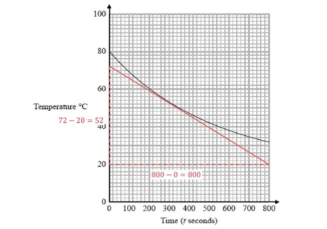

**Suitable tangent drawn [1]**

> *Gradient is negative as tangent slopes downwards*

$\mathrm{Gradient}=-\frac{72-20}{800-0}=-\frac{52}{800}$

**Final answer:** **Gradient = -0.065**

**Between -0.05 and -0.08 [1]**

### 2() — 2 marks
> *Using start and end points from the graph calculate gradient using *$\frac{rise}{run}$

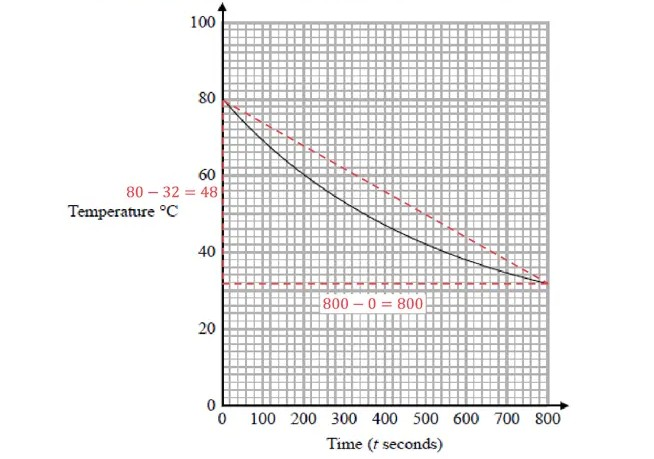

> *Gradient is negative as tangent slopes downwards*

$Gradient=-\frac{80-32}{800-0}=-\frac{48}{800}$

**Appropriate values chosen [1]**

**Final answer:** **Gradient = -0.06**

**[1]**

### 3() — 2 marks
> *Two points have equal rates of change where their tangents are parallel to each other*

> *Instantaneous rate of change is equal to the average rate of change where the tangent to the curve is parallel to the line from (0, 80) to (800, 32)*

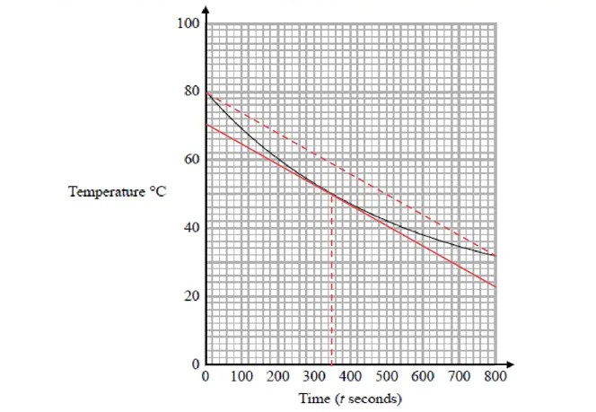

**Suitable parallel line, which is a tangent, drawn [1]**

> *You must draw both lines on the graph to show this*

**Final answer:** **350 seconds**

**[1]**

## Q50 — hard — 9 marks · exam-questions

### 1() — 1 marks
> *There are only three sides to the rectangle as one is an existing wall*

$w+w+l=40$

**[1]**

> *Simplify*

$2w+l=40$

> *Rearrange to the final answer*

$l=40-2w$

### 2() — 2 marks
> *Area of a rectangle = width × length*

$A=lw$

> *Substitute *$l$* with *$40-2w$

`A equals open parentheses 40 minus 2 w close parentheses w`

**[1]**

> *Expand the brackets*

$A=40w-2w^{2}$ **[1]**

### 3() — 2 marks
> *Differentiate with respect to **w*

$\frac{dA}{dw}=40-4w$

**one correct term**** [1]**
** ****fully correct answer**** [1]**

### 4() — 2 marks
> *The maximum occurs when the rate of change of the area with respect to the width (*$\frac{dA}{dw}$*) is zero*

$40-4w=0$

**[1]**

> *Solve for **w*

$40=4w$

$w=10$ **[1]**

### 5() — 2 marks
> *In other words, find *$l$* and *$A$*when *$w=10$* Starting with *$l$*;*

`table row l equals cell 40 minus 2 open parentheses 10 close parentheses end cell row blank equals 20 end table`

**Final answer:** **Dimensions are 10 m by 20 m ****[1]**

> *Now we can find *$A$* using either *$A=lw$* or *$A=40w-2w^{2}$

`table row A equals cell 20 cross times 10 space space space space or space space space A equals 40 open parentheses 10 close parentheses minus 2 open parentheses 10 close parentheses squared end cell row blank equals cell 200 space space space space space space space space space space space space space space space space space space space space space space equals space 200 end cell end table`

**Final answer:** **Area is  200 m****2**** ****[1]**

## Q51 — medium — 4 marks · exam-questions

### 21((a)) — 2 marks
> *Formula for differentiation:*

`table row y equals cell space a x to the power of b end cell row cell fraction numerator d y over denominator d x end fraction end cell equals cell space a b x to the power of b minus 1 end exponent end cell end table`

> *To differentiate the first term, 6, remember that the derivative of any constant term is zero.*

`table row cell y space end cell equals cell space 6 space end cell row cell fraction numerator d y over denominator d x end fraction space end cell equals cell space 0 end cell end table`

> *Differentiate the second term, *$4x$*.*

`table row cell y space end cell equals cell space 4 x to the power of space end cell row cell fraction numerator d y over denominator d x end fraction space end cell equals cell space open parentheses 4 cross times 1 close parentheses x to the power of 1 minus 1 end exponent space equals space 4 end cell end table`

> *Differentiate the third term, *$-x^{2}$*.*

`table row cell y space end cell equals cell space minus x squared space end cell row cell fraction numerator d y over denominator d x end fraction space end cell equals cell space open parentheses negative 1 cross times 2 close parentheses x to the power of 2 minus 1 end exponent space equals space minus x to the power of 1 space equals space minus x end cell end table`

$\frac{dy}{dx}=4-2x$

**Finding either term correctly ****[1]** 
**Both terms correct ****[1]**

### 21((b)) — 2 marks
> *To find the turning point, set *$\frac{dy}{dx}$* equal to zero.*

`table row cell fraction numerator d y over denominator d x end fraction end cell equals cell space space 0 end cell row cell 4 space minus space 2 x space end cell equals cell space 0 end cell end table`

**[1]**

> * Solve by subtracting 4 and dividing by -2.*

`table row cell negative 2 x space end cell equals cell space minus 4 end cell row cell x space end cell equals cell space 2 end cell end table`* *

> *Find the *$y$* coordinate by substituting the value of *$x$* into the equation for the curve.*

`table row cell y to the power of space end cell equals cell space 6 space plus space 4 open parentheses 2 close parentheses space minus open parentheses 2 close parentheses squared space end cell row blank equals cell space 6 space plus space 8 space minus space 4 end cell row blank equals cell space 10 end cell end table`

`equation` **[1]**

## Q52 — medium — 6 marks · exam-questions

### 12((a)) — 2 marks
> **[exam-tip]**
> The instruction to find $\frac{dy}{dx}$means that you need to differentiate the function.

> *Differentiate by multiplying the coefficient of the term by the power and then subtracting one from the power (*$nax^{n-1}$*)*

> *Treat each term separately*

`fraction numerator d y over denominator d x end fraction equals 3 cross times x to the power of open parentheses 3 minus 1 close parentheses end exponent minus 2 cross times 6 x to the power of open parentheses 2 minus 1 close parentheses end exponent minus 1 cross times 15 x to the power of open parentheses 1 minus 1 close parentheses end exponent`

> *Simplify to give*

$\frac{dy}{dx}=3x^{2}-12x-15$

**[B1 B1]**

> **[mark-scheme]**
> The first mark is gained for any two correct terms. The second mark is for fully correct expression.

### 12((b)) — 4 marks
> **[exam-tip]**
> Stationary points occur when the gradient of the curve is equal to zero.

> *Equate the derivative of the function *$y$* to zero*

$3x^{2}-12x-15=0$

**[M1]**

> *Solve the quadratic equation by factorising (completing the square or using the quadratic formula will give the same solutions)*

> *It's easiest to start by dividing through by 3 to simplify the equation*

`table row cell 3 x squared minus 12 x minus 15 end cell equals 0 row cell x squared minus 4 x minus 5 end cell equals 0 row cell open parentheses x plus 1 close parentheses open parentheses x minus 5 close parentheses end cell equals 0 end table`

`table row x equals cell negative 1 space or space x equals 5 end cell end table`

**[M1]**

> *Substitute in both solutions of *$x$*into the function *$y$*to give the coordinate pairs*

*When *$x=-1$

`y equals open parentheses negative 1 close parentheses cubed minus 6 open parentheses negative 1 close parentheses squared minus 15 open parentheses negative 1 close parentheses equals 8`

*Gives stationary point (-1,8)*
* *

*When *$x=5$

`y equals open parentheses 5 close parentheses cubed minus 6 open parentheses 5 close parentheses squared minus 15 open parentheses 5 close parentheses equals negative 100`

*Gives stationary point (5, -100)*

**Final answer:** **(-1, 8) and (5, -100)**

**[A1 A1]**

## Q53 — very_hard — 5 marks · exam-questions

### 20((a)) — 2 marks
*We have the graph of *$y=x^{2}-2x+3$* so we need to rearrange *$x^{2}-3x-1=0$* so that "*$x^{2}-2x+3$*" appears on its own on one side of the equation*

> *Add 4 to both sides*

$x^{2}-3x-1=0\,x^{2}-3x+3=4$

> *Add *$x$* to both sides*

$x^{2}-2x+3=x+4$

> *Draw the line *$y=x+4$* on the graph using your knowledge of linear graphs **y** = **mx** + **c**. Draw a line through 4 on the **y**-axis with gradient 1*

**y = x + 4 drawn correctly on the grid**** [1]**

> *Read the *$x$* values where *$y=x+4$* and *$y=x^{2}-2x+3$* intersect. There is some margin of error permitted (see below)*

**Final answer:** **x ****= 3.3, ****x**** = −0.3**

**x value from −0.2 to −0.4 and x value from 3.2 to 3.4 ****[1]**

### 20((b)) — 3 marks
> *We can estimate the gradient at *$x=2$* by drawing a tangent at *$x=2$* and calculating its gradient*

> *First draw a tangent at *$x=2$*. This should be a straight line (use a ruler or straight edge) touching the curve at *$x=2$*, but not crossing the curve*

**suitable tangent line drawn**** [1]**

> *Pick two points on the tangent, not too close to each other. Try to pick points that can be clearly read off the grid. E.g. in the diagram above, we have picked (4, 7.1) and (0.6, 0)*

> * Find the gradient between these two points using *$\frac{\mathrm{rise}}{\mathrm{run}}$* or *$\frac{y_{1}-y_{2}}{x_{1}-x_{2}}$* *

> *Your gradient will depend on your tangent so there is some margin of error permitted in exam questions. For the tangent drawn above, the calculation and answer would be as follows*

*gradient = *$\frac{7.1-0}{4-0.6}$

$\frac{rise}{run}$* ***or gradient formula used with tangent line**** [1]**

$=\frac{7.1}{3.4}=2.088235294...$

> *If your calculation does not result in an exact answer, write the answer to at least 3 significant figures*

**Final answer:** **Answer = 2.09 **

**Any answer from 1.6 to 2.5 so long as it is consistent with the drawn tangent line ****[1]**

## Q54 — hard — 8 marks · exam-questions

### 15((a)) — 3 marks
> *The volume of a cuboid is length × width × height.*

`V equals open parentheses 2 x plus 5 close parentheses open parentheses 3 minus x close parentheses open parentheses x plus 1 close parentheses`

> *Start by expanding two brackets; here we will start by expanding the first two brackets following "FOIL" (first outside inside last).*

`table row V equals cell open parentheses 6 x minus 2 x squared plus 15 minus 5 x close parentheses open parentheses x plus 1 close parentheses end cell end table`

**correctly expanding two brackets**** [1]**

> *Collect like terms in the left bracket and write terms in order of the highest power.*

`table row V equals cell open parentheses negative 2 x squared plus x plus 15 close parentheses open parentheses x plus 1 close parentheses end cell end table`

> *Expand the two brackets by multiplying all terms in the first bracket by all terms in the second bracket. Follow a systematic order such as the one below.*

`table row V equals cell negative 2 x cubed minus 2 x squared plus x squared plus x plus 15 x plus 15 end cell end table`

**4 out of 8 terms correct in this expansion**** [1]**

> *Collect like terms.*

`table row bold italic V bold equals cell bold minus bold 2 bold italic x to the power of bold 3 bold minus bold italic x to the power of bold 2 bold plus bold 16 bold italic x bold plus bold 15 end cell end table`** [1] **

**Throughout this question the terms can be written in any order**

### 15((b)) — 5 marks
> *Differentiate **V** with respect to **x**.*

$\frac{dV}{dx}=16-2x-6x^{2}$

**two terms correct ****[1]**
**fully correct differentiation ****[1]**

> *Equate *$\frac{dV}{dx}$* to zero.*

$16-2x-6x^{2}=0$

**[1]**

*Solve for **x**. The question asks for the answer to 3 significant figures which is a big clue that it can't be solved by factorising- use the quadratic formula or completing the square.*

> *Either way, it is easiest to start by rewriting in the form *$ax^{2}+bx+c=0$* where *$a$* is positive, and dividing by any common factor.*

`table row cell 6 x squared plus 2 x minus 16 end cell equals 0 row cell space divided by 2 space space space space space space space space space space space space space space space space space space space space space space space end cell equals cell space space divided by 2 end cell row cell 3 x squared plus x minus 8 end cell equals 0 end table`

> *Here we will use the quadratic formula to solve.*

`table row x equals cell fraction numerator negative 1 plus-or-minus square root of 1 squared minus 4 cross times 3 cross times open parentheses negative 8 close parentheses end root over denominator 2 cross times 3 end fraction end cell end table`

**correct first step using quadratic formula or completing the square**** [1]**

`x equals fraction numerator negative 1 plus-or-minus square root of 97 over denominator 6 end fraction
x equals 1.474809634... space comma space space up diagonal strike x equals negative 1.808142967... end strike`

> *x** cannot be *$-1.808142967...$* as this would make the height negative, so ignore or cross out this value. Round  *$1.474809634...$* to 3 significant figures as instructed.*

**Answer = 1.47 cm**** [1]**

## Q55 — medium — 6 marks · exam-questions

### 11((a)) — 2 marks
> *Differentiate each term by multiplying its coefficient by its power and subtracting one from the power*

$\frac{dy}{dx}=4\times3x^{3-1}+2x^{2-1}-20$

$\frac{dy}{dx}=12x^{2}+2x-20$

**[M1 A1]**

> **[mark-scheme]**
> **M1**: For at least two terms correct.
> 
> **A1**: Fully correct.

### 11((b)) — 4 marks
> *Set the expression for *$\frac{dy}{dx}$* equal to 4 and solve for **x*

`table row cell 12 x squared plus 2 x minus 20 end cell equals 4 end table`

**[M1]**

> *Set equal to zero by subtracting 4 from both sides*

`table row cell 12 x squared plus 2 x minus 24 end cell equals 0 end table`

> *Simplify the coefficients by dividing both sides by 2*

`table row cell 6 x squared plus x minus 12 end cell equals 0 end table`

**[M1]**

> *Factorise*

- *6 × -12 = - 72*
- *Two numbers that add to 1 and multiply to -72 are 9 and -8*
- *Write *$x$* as *$9x-8x$

`table row cell 6 x squared plus 9 x minus 8 x minus 12 end cell equals 0 row cell 3 x open parentheses 2 x plus 3 close parentheses minus 4 open parentheses 2 x plus 3 close parentheses end cell equals 0 row cell open parentheses 3 x minus 4 close parentheses open parentheses 2 x plus 3 close parentheses end cell equals 0 end table`

**[M1]**

> **[exam-tip]**
> You could also use the quadratic formula here.

$x=\frac{4}{3},x=-\frac{3}{2}$

**[A1]**

## Q56 — very_hard — 7 marks · exam-questions

### 1() — 2 marks
> *Plot the points from the table with depth on the y-axis and time on the x-axis*

**Points plotted accurately [1]**

**Points joined by a smooth curve [1]**

### 2() — 2 marks
> *Using values from the table calculate the gradient *$\frac{rise}{run}$

> *Gradient is negative as water is decreasing*

`table row Gradient equals cell negative fraction numerator 30 minus 9 over denominator 10 minus 0 end fraction equals negative 21 over 10 end cell row blank equals cell negative 2.1 end cell end table`

**Method to calculate gradient [1]**

**Final answer:** **Gradient = -2.1**

**[1]**

### 3() — 2 marks
> *Draw a tangent at *$t=7$* to calculate the gradient using *$\frac{rise}{run}$

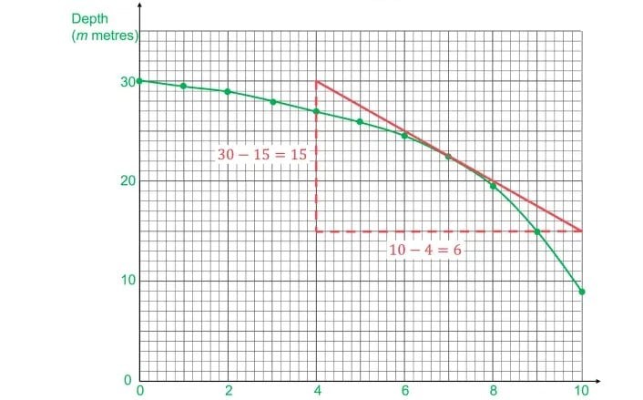

**Suitable tangent drawn [1]**

> *Gradient is negative as tangent slopes downwards*

`table row Gradient equals cell negative fraction numerator 30 minus 15 over denominator 10 minus 4 end fraction equals negative 15 over 6 end cell row blank equals cell negative 2.5 end cell end table`

**Final answer:** **Gradient = -2.5**

**Answers between -2.1 and -3.1 [1]**

### 4() — 1 marks
**Final answer:** **The gradients shows the depth of water is decreasing by 2.5 metres per minute**

**[1]**

## Q57 — hard — 5 marks · exam-questions

### 19() — 5 marks
> *Differentiate **s** to find a function for the velocity.*

$\frac{ds}{dt}=3t^{2}+10t-8$

**[1]**

> *P** is instantaneously at rest when the velocity is zero, so equate *$\frac{ds}{dt}$* to zero. *

$3t^{2}+10t-8=0$

**[1]**

> *Solve using your preferred method; quadratic formula, completing the square or factorisation (the question asks for the answer in the form of a fraction which is a big clue that the quadratic will factorise). Here we will use the quadratic formula though, as it looks like a trickier factorisation.*

`t equals fraction numerator negative 10 plus-or-minus square root of 10 squared minus 4 cross times 3 cross times open parentheses negative 8 close parentheses end root over denominator 2 cross times 3 end fraction`

`up diagonal strike t equals negative 4 end strike comma space space space space t space equals 2 over 3`

**[1]**

> *You are told in the question that *$t\geq0$* therefore discount the negative value of *$t$* by putting a line through it or ignoring it altogether. Substitute the positive value of *$t$* into the displacement formula.*

`table row s equals cell open parentheses 2 over 3 close parentheses cubed plus 5 open parentheses 2 over 3 close parentheses squared minus 8 open parentheses 2 over 3 close parentheses plus 10 end cell end table`

**[1]**

> *Leave your final answer as a fraction.*

$s=\frac{194}{27}$** [1]**

**An answer as a rounded decimal will not achieve the final mark**

## Q58 — medium — 4 marks · exam-questions

### 16() — 4 marks
> *First, find the gradient function by differentiating*

> *To differentiate a power of *$x$*, bring down the power and** **reduce the power by 1*

$\frac{dy}{dx}=12x^{2}-8$

**[B1 B1]**

> *Set the gradient function equal to *$\frac{1}{3}$

$\frac{1}{3}=12x^{2}-8$

**[M1]**

> *Solve the equation by first adding *$8$* to both sides*

$\frac{25}{3}=12x^{2}$

> *Divide by 12*

$\frac{25}{36}=x^{2}$

> *Take the square root of both sides, remembering that this will produce both a positive and a negative answer*

$x=\pm\frac{5}{6}$

**[A1]**

> **[mark-scheme]**
> **B1: **For one correct term.
> 
> **B1: **Fully correct.
> 
> **M1: **For equating your derivative with the given gradient.
> 
> **A1: **Correct final answer, or equivalent.

## Q59 — very_hard — 7 marks · exam-questions

### 1() — 1 marks
> *The top speed is reached when the graph reaches is highest point (maximum)*

**Final answer:** **6.6 seconds**

**[1]**

### 2() — 3 marks

**Suitable tangent drawn [1]**

> *Draw a tangent at 2 to calculate the gradient using *$\frac{rise}{run}$

`table row Gradient equals cell fraction numerator 11.4 minus 4.2 over denominator 3 minus 0 end fraction equals fraction numerator 7.2 over denominator 3 end fraction end cell row blank equals cell 2.4 end cell end table`

**Gradient between 2.3 and 2.8 [1]**

**Final answer:** **2.4 ms****-2**

**Units must be stated, allow m/s****2**** [1]**

### 3() — 3 marks

**Suitable tangent drawn [1]**

> *Draw a tangent at 6 to calculate the gradient using *$\frac{rise}{run}$

`table row Gradient equals cell fraction numerator 12.2 minus 11.2 over denominator 8 minus 4 end fraction equals 1 fourth end cell row blank equals cell 0.25 end cell end table`

**Gradient between 0.2 and 0.4 [1]**

> *Find the difference between the acceleration at t=2 and at t=6*

*2.4 - 0.25 = 2.15*

**Final answer:** **2.15**

**[1]**

## Q60 — hard — 11 marks · exam-questions

### 1() — 2 marks
*There will be four rods making the front facing square *
*There will be another four rods making the back facing square The front and back squares will be connected by four more rods*

**[1]**

**The 12 rods consist of**** 8 smaller rods length **$x$** cm and 4 larger rods length **$y$** cm ****[1]**

### 2() — 2 marks
> *8 small rods (8**x**) plus 4 larger rods (4**y**) equal to 36 cm*

$8x+4y=36$

**[1]**

> *Rearrange to make **y** the subject*

$4y=36-8x$

$y=9-2x$ **[1]**

### 3() — 2 marks
> *The volume is given by*

$V=x^{2}y$

> *We need to replace **y** with the equation in **x** found in part (c)*

`V equals x squared open parentheses 9 minus 2 x close parentheses`

**[1]**

> *Expand*

`table row bold italic V bold equals cell bold 9 bold italic x to the power of bold 2 bold minus bold 2 bold italic x to the power of bold 3 end cell end table`* ***[1]**

### 4() — 3 marks
> *Find the maximum by differentiating and equating the derivate function to zero*

> *Differentiate first*

$\frac{dV}{dx}=18x-6x^{2}$

**[1]**

> *Equate to zero*

$18x-6x^{2}=0$

**[1]**

> *And solve for **x*

`3 x minus x squared equals 0
x open parentheses 3 minus x close parentheses equals 0
up diagonal strike x equals 0 end strike comma space space x equals 3`

> *Reject "x = 0" as a length cannot be 0 or negative (it is best practice to write down both algebraic solutions but cross out the one to be discarded, showing the examiner good understanding)*

$x=3$ **[1]**

### 5() — 2 marks
> *Substitute the value of **x** found in part (c) to the volume formula found in part (c)*

`V equals 9 open parentheses 3 close parentheses squared minus 2 open parentheses 3 close parentheses cubed`

**[1]**

**27 cm****3**** ****[1]**

## Q61 — hard — 4 marks · exam-questions

### 18() — 4 marks
> *Differentiate the displacement function twice to get the acceleration*

$v=\frac{ds}{dt}=6t^{2}-10t+6$

**[M1]**

$a=\frac{dv}{dt}=12t-10$

**[M1]**

> *Set the expression equal to the value in the question*

$12t-10=5$

**[M1]**

> *Solve the equation*

$12t=15$

$t=\frac{15}{12}=1.25$

$1.25$

**[A1]**

## Q62 — very_hard — 11 marks · exam-questions

### 5((a)) — 2 marks
*Find the *$y$* coordinate when *$x=-2$* (by substituting *$x=-2$* into the equation)* * *

`y equals open parentheses negative 2 close parentheses cubed minus 3 cross times open parentheses negative 2 close parentheses minus 1`

$y=-3$* ***[1]**

*Find the *$y$* coordinate when *$x=3$* (by substituting *$x=3$* into the equation)*

`table row y equals cell 3 cubed minus 3 cross times 3 minus 1 end cell end table`

$y=17$ **[1]**

**You could also use your calculator's TABLE function to get the missing values if your calculator has it**

### 5((b)) — 4 marks
*Plot the coordinates on the grid and join them up using a smooth curve*

**6 or 7 points plotted correctly**** [1]** 
** 8 ****or 9 points plotted correctly ****[1]** 
**10 or 11 points plotted correctly ****[1]** 
**fully correct curve drawn**** [1]**

### 5((c)) — 5 marks
*i) **Use a ruler to draw a straight line from (0 , -17) to the point where the ruler just touches the curve*

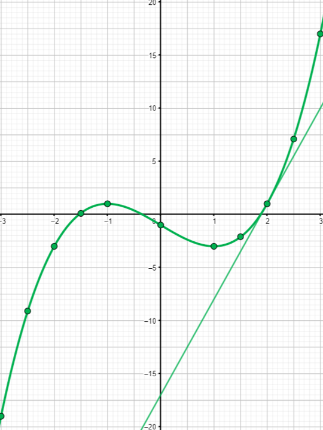

**[1]**

*ii) **Read off the coordinates where the tangent just touches the curve*

**(2, 1)** **[1]**

**The ranges (1.7 to 2.2, -1 to 2.5) are accepted**

*iii) **The equation of a straight line is *$y=mx+c$* where *$m$* is the gradient and *$c$* is the *$y$*-intercept* *Find *$m$* (by choosing two easy points on the tangent and calculating "rise" over "run")*

$\frac{\mathrm{rise}}{\mathrm{run}}=\frac{18}{2}=9$

**[1]**

*Write down *$c$* (by reading off where it crosses the *$y$*-axis)*

$c=-17$

**[1]**

> *Give your answer as an equation*

$y=9x-17$ **[1]**
