# Exam Questions — Differentiation & Gradients
**Functions, Graphs & Differentiation** · Edexcel IGCSE Maths A (Modular) (4XMAF/4XMAH) — 24/Higher Unit 2
> Source: [https://www.savemyexams.com/igcse/maths/edexcel/a-modular/24/higher-unit-2/topic-questions/functions-graphs-and-differentiation/differentiation-and-gradients/exam-questions/](https://www.savemyexams.com/igcse/maths/edexcel/a-modular/24/higher-unit-2/topic-questions/functions-graphs-and-differentiation/differentiation-and-gradients/exam-questions/) · 62 questions · total 326 marks

## Q1 — very_hard — 8 marks · exam-questions

### 1() — 2 marks — command: show — structured
A curve, $C$, has equation $y=2x^{2}+8k^{2}x-3$ where $k$ is a constant. 

Show that when $k$ = 0, the turning point on $C$ has coordinates (0, -3).

### 2() — 4 marks — command: show — structured
Show that when $k$ ≠ **0**, the turning point on $C$ must have a negative $x$-coordinate.

### 3() — 2 marks — command: determine — structured
When $k$≠ 0 determine whether or not the $y$-coordinate of the turning point is negative.

## Q2 — medium — 3 marks · exam-questions

### 14() — 3 marks — command: estimate — structured — from paper 2018	June · 1MA1/2H
The distance-time graph shows information about part of a car journey.

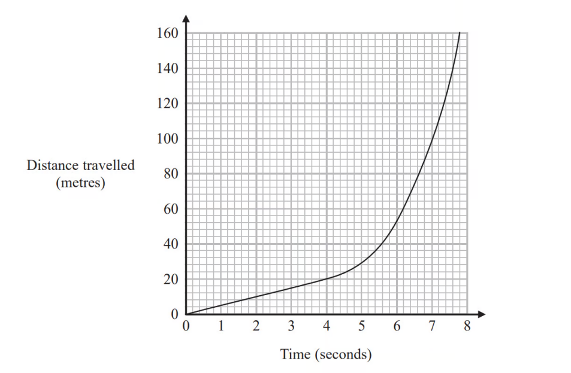

Use the graph to estimate the speed of the car at time 5 seconds.

## Q3 — very_hard — 7 marks · exam-questions

### 1() — 7 marks — command: find — structured
Part of the graph with equation $y=2x^{4}-16x^{2}+3$is shown below.

The graph has three stationary points, indicated on the graph by points $P$, $Q$ and$R$.
 Find the area of the triangle $P$$QR$.

## Q4 — medium — 3 marks · exam-questions

### 1() — 2 marks — command: estimate — structured — from paper Pre2017
The graph shows information about the velocity of a parachutist after jumping from a plane.

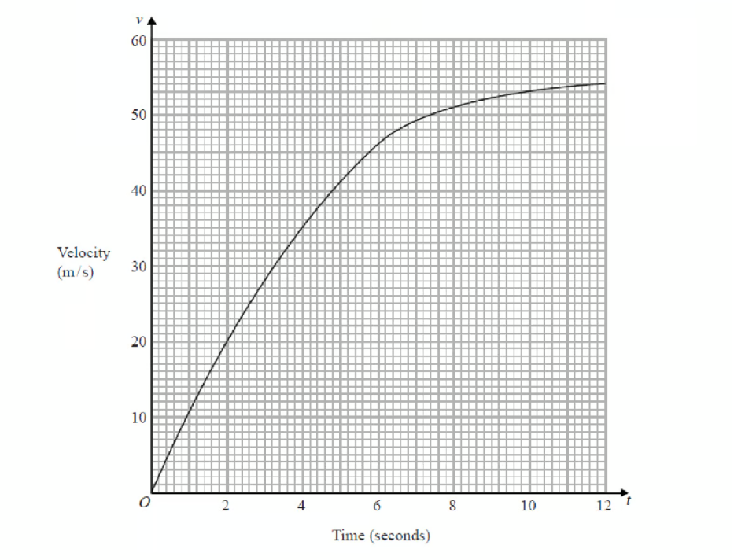

By drawing a suitable tangent, find an estimate of the gradient of the curve after 3 seconds.

### 2() — 1 mark — command: interpret — structured — from paper Pre2017
Interpret the value of the gradient.

## Q5 — very_hard — 10 marks · exam-questions

### 1() — 4 marks — command: show — structured
The diagram shows a cuboid with a square cross-section.

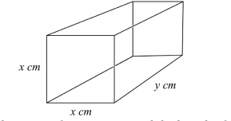

The sides of the square face are $x$cm and the length of the cuboid is $y$cm.

The cuboid is to have a fixed surface area, $A$, of 25 cm2.

Show that the volume of the cuboid, $V$ cm3 is given by

$V=\frac{25}{4}x-\frac{1}{2}x^{3}$

### 2() — 4 marks — command: show — structured
Show that the value of $x$ that maximises the volume of the cuboid is $\frac{5\sqrt{6}}{6}$

### 3() — 2 marks — command: find — structured
Find the maximum volume of the cuboid, correct to 3 significant figures.

## Q6 — medium — 3 marks · exam-questions

### 1() — 2 marks — command: estimate — structured — from paper Pre2017
The graph shows the temperature of a fish tank over the first 6 hours after a heater is added.

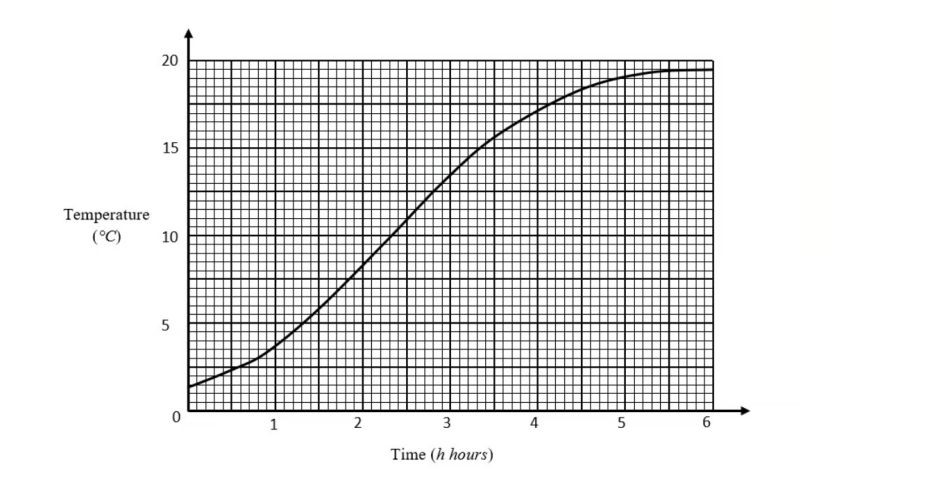

By drawing a suitable tangent, find an estimate of the gradient of the curve when $h$ = 3.

### 2() — 1 mark — command: interpret — structured — from paper Pre2017
Interpret the value of the gradient.

## Q7 — very_hard — 5 marks · exam-questions

### 24() — 5 marks — command: find — structured — from paper Jan 2022 · 4MA1/2H
A particle $P$ moves along a straight line that passes through the fixed point $O$

The displacement, $x$ metres, of$P$from $O$ at time t seconds, where `t greater-than or slanted equal to space 0`, is given by

$x=4t^{3}-27t+8$

The direction of motion of  $P$ reverses when $P$ is at the point $A$ on the line.

The acceleration of $P$ at the instant when $P$ is at $A$ is $am/s^{2}$. Find the value of  $a$.

a = .....................................

## Q8 — medium — 3 marks · exam-questions

### 1() — 1 mark — command: write — structured — from paper Pre2017
The diagram shows parts of the graphs of *y=*f*(x)* and *y=*g*(x)*

Write down the value of *x* where the gradient of the curve *y=*g*(x)* is zero.

### 2() — 2 marks — command: calculate — structured — from paper Pre2017
Calculate an estimate for the gradient of the curve *y = *f*(x)* at the point on the curve where *x = 4.*

## Q9 — very_hard — 6 marks · exam-questions

### 23() — 6 marks — command: find — structured — from paper Jan 2022 · 4MA1/1HR
Two particles, $P$ and $Q$, move along a straight line.

The fixed point $O$ lies on this line.

The displacement of $P$ from $O$ at time $t$ seconds is $s$ metres, where

$s=t^{3}--4t^{2}+5tfort>1$

The displacement of $Q$ from $O$ at time $t$ seconds is $x$ metres, where

$x=t^{2}--4t+4fort>1$

Find the range of values of $t$ where $t>1$ for which both particles are moving in the same direction along the straight line.

## Q10 — medium — 5 marks · exam-questions

### 20((a)) — 2 marks — command: draw — structured — from paper 2017	June · 1MA1/2H
The diagram shows part of the graph of $y=x^{2}---2x+3$

By drawing a suitable straight line, use your graph to find estimates for the solutions of $x^{2}---3x---1=0$

### 20((b)) — 3 marks — command: calculate — structured — from paper 2017	June · 1MA1/2H
$P$ is the point on the graph of $y=x^{2}---2x+3$ where $x=2$

Calculate an estimate for the gradient of the graph at the point $P$.

## Q11 — very_hard — 5 marks · exam-questions

### 21() — 5 marks — command: show — structured — from paper June 2021 · 4MA1/2H
The point A is the only stationary point on the curve with equation $y=kx^{2}+\frac{16}{x}$  where $k$is a constant.

Given that the coordinates of $A$ are `open parentheses 2 over 3 comma space a close parentheses`

find the value of $a$. 
Show your working clearly.

$a=$ .................................................

## Q12 — medium — 5 marks · exam-questions

### 1() — 2 marks — command: write — structured — from paper Pre2017
The curve $y=x^{3}---3x---2$is shown on the grid.

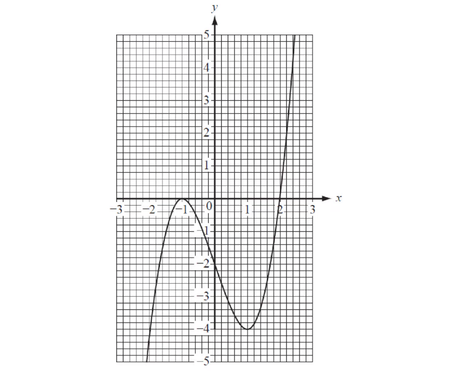

Write down the co-ordinates of the points where the gradient of the curve is zero.

### 2() — 1 mark — command: write — structured — from paper Pre2017
Write down the range of values of x when the gradient of the curve is negative.

### 3() — 2 marks — command: find — structured — from paper Pre2017
Find an estimate of the gradient of the curve when *x *= 2.

## Q13 — very_hard — 6 marks · exam-questions

### 24() — 6 marks — command: show — structured — from paper Jan 2022 · 4MA1/1H
The curve $C$ has equation $y=ax^{3}+bx^{2}--12x+6$ where $a$ and $b$ are constants.

The point $A$ with coordinates (2, –6) lies on $C$.

The gradient of the curve at $A$ is 16.

Find the $y$ coordinate of the point on the curve whose $x$ coordinate is 3. 
Show clear algebraic working.

## Q14 — medium — 3 marks · exam-questions

### 17() — 3 marks — command: estimate — structured — from paper Jan 2022 · 4MA1/2HR
Part of the curve with equation $y=f(x)$ is shown on the grid.

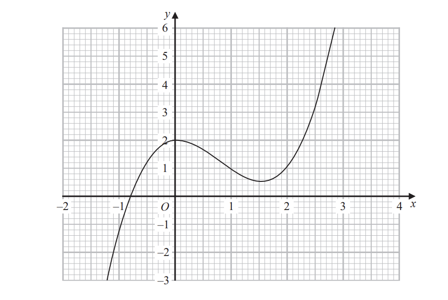

Find an estimate for the gradient of the curve at the point where $x=2$ Show your working clearly.

## Q15 — very_hard — 5 marks · exam-questions

### 20() — 5 marks — command: find — structured — from paper Jan 2021 · 4MA1/1HR
A particle $P$ is moving along a straight line.

The fixed point $O$ lies on the line.

At time t seconds `left parenthesis t space greater-than or slanted equal to space 0 right parenthesis`, the displacement of $P$ from $O$ is s metres where

$s=t^{3}--9t^{2}+33t--6$

Find the minimum speed of $P$.

...................................................... m/s

## Q16 — medium — 3 marks · exam-questions

### 24() — 2 marks — command: work_out — structured — from paper Nov 2020 · 8300/3H
$A$ and $B$ are points on a curve.

$A$ is $(2,7)$   $B$ is $(12,0)$

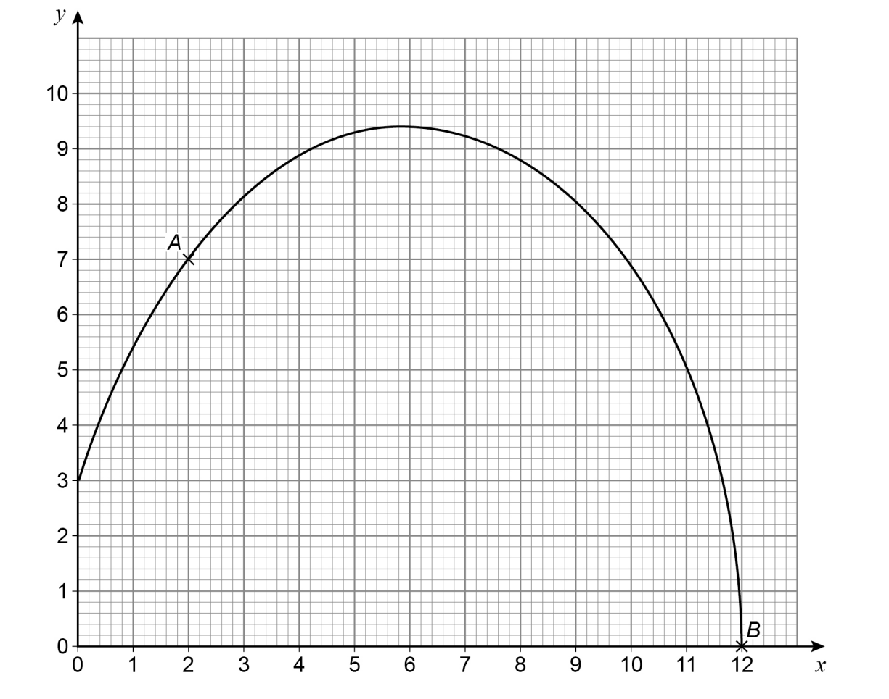

Work out the instantaneous rate of change of $y$ with respect to $x$ at point $A$.

### 24((b)) — 1 mark — command: tick — structured — from paper Nov 2020 · 8300/3H
The average rate of change of $y$with respect to $x$ between points $A$ and $B$ is worked out.

Which statement is correct? Tick **one **box.

| `square` | It is positive. |
|---|---|
| `square` | It is zero. |
| `square` | It is negative. |
| `square` | You cannot tell if it is positive or negative. |

## Q17 — very_hard — 6 marks · exam-questions

### 19((a)) — 3 marks — command: show — structured — from paper Nov 2021 · 4MA1/1H
$ABCED$ is a five-sided shape.

$ABCD$ is a rectangle.
 $CED$ is an equilateral triangle.

$AB=x\mathrm{cm}BC=y\mathrm{cm}$

The perimeter of $ABCED$is 100 cm.
 The area of $ABCED$is $R$ cm2

Show that `R equals x over 4 open parentheses 200 minus open square brackets 6 minus square root of 3 close square brackets x close parentheses`

### 19((b)) — 3 marks — command: multiple — structured — from paper Nov 2021 · 4MA1/1H
(i) Find the value of $x$ for which $R$ has its maximum value.

Give your answer in the form $\frac{p}{q-\sqrt{3}}$ where $p$ and $q$ are integers.

$x=$ ....................................................... [2]

(ii) Explain why the maximum value of $R$ is given by this value of $x$.

[1]

## Q18 — medium — 3 marks · exam-questions

### 23((a)) — 1 mark — command: which — structured — from paper Specimen 2015 · 8300/3H
A container is filled with water in 5 seconds.

The graph shows the depth of water, $d$ cm, at time $t$ seconds.

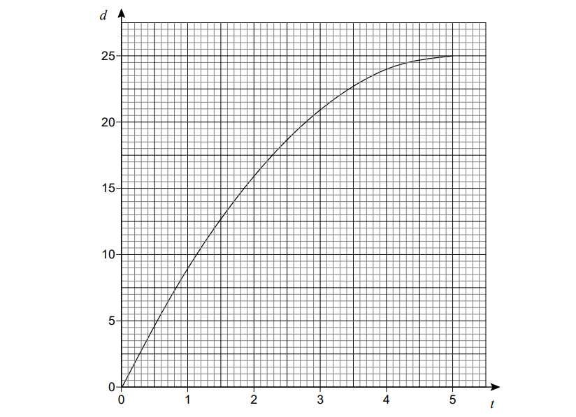

The water flows into the container at a constant rate.

Which diagram represents the container? Circle the correct letter.

### 23((b)) — 2 marks — command: estimate — structured — from paper Specimen 2015 · 8300/3H
Use the graph to estimate the rate at which the depth of water is increasing at 3 seconds.

You **must** show your working.

.....................cm/s

## Q19 — very_hard — 6 marks · exam-questions

### 23() — 6 marks — command: find — structured — from paper Jan 2020 · 4MA1/1HR
A particle moves along a straight line. 
The fixed point $O$ lies on this line. 
The displacement of the particle from $O$ at time $t$ seconds , `t space greater-than or slanted equal to space 0` , is $s$ metres where

$s=t^{3}+4t^{2}-5t+7$

At time $T$ seconds the velocity of $P$ is $Vm/s$ where `V space greater-than or slanted equal to space minus 5`

Find an expression for $T$ in terms of $V$.

Give your expression in the form $\frac{-4+\sqrt{k+mV}}{3}$ where $k$$m$ and  are integers to be found.

$T=...............$

## Q20 — medium — 2 marks · exam-questions

### 24() — 2 marks — command: estimate — structured — from paper June 2017 · 8300/3H
A ball is thrown from a point 6 metres above the ground.

The graph shows the height of the ball above the ground, in metres.

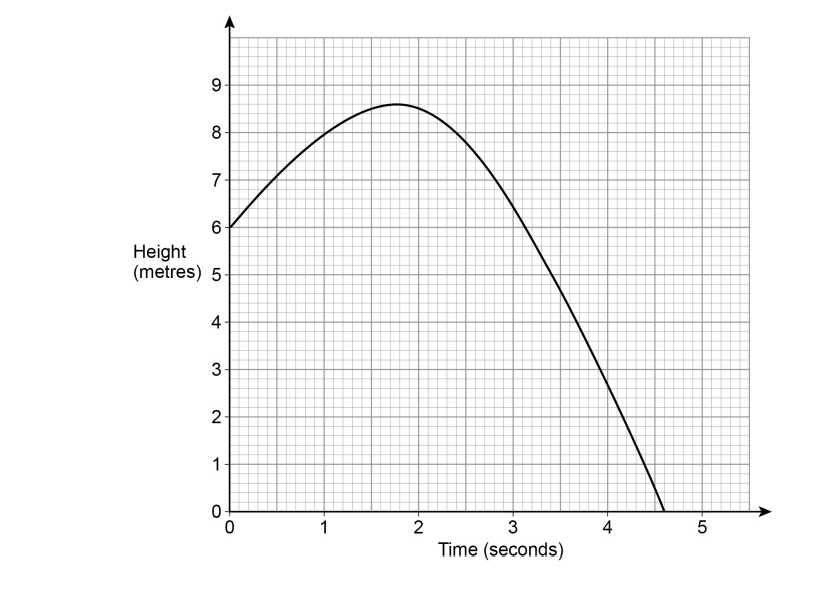

Estimate the speed of the ball, in m/s, after 1 second. 
You **must **show your working.

...............................m/s

## Q21 — medium — 4 marks · exam-questions

### 19() — 4 marks — command: estimate — structured — from paper Nov 2019 · J560/04
The graph shows the distance travelled by a particle over 8 seconds.

Estimate the speed of the particle at 5 seconds.

................................................... m/s

## Q22 — medium — 3 marks · exam-questions

### 15((c)) — 3 marks — command: estimate — structured — from paper June 2017 · J560/04
The graph shows the speed, v metres per second (m/s), of a car at time t seconds.

Use the graph to estimate the acceleration at* t *= 7.

...................................................m/s2

## Q23 — hard — 3 marks · exam-questions

### 1() — 2 marks — command: find — structured — from paper Pre2017
The curve $y=x^{3}+2x^{2}---4x$ is shown on the grid.

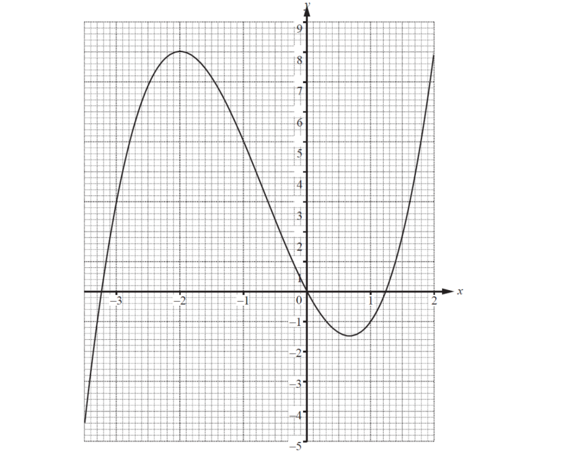

By drawing a suitable tangent, find an estimate of the gradient of the curve when *x* = 1.

### 2() — 1 mark — command: write — structured — from paper Pre2017
A point $D$ lies on the curve. 
The *x  *co-ordinate of $D$ is negative.
 The gradient of the tangent at $D$ is 0.

Write down the co-ordinates of $D$.

## Q24 — medium — 3 marks · exam-questions

### 1() — 1 mark — command: find — structured
Use differentiation to find $\frac{dy}{dx}$ for the following:

$y=x^{4}$

### 2() — 1 mark — structured
$y=2x^{-3}$

### 3() — 1 mark — structured
$y=\frac{4}{x}$

## Q25 — hard — 4 marks · exam-questions

### 1() — 3 marks — command: work_out — structured — from paper Pre2017
Ellie runs a race. The graph shows Ellie's speed in the first 10 seconds after the start of the race.

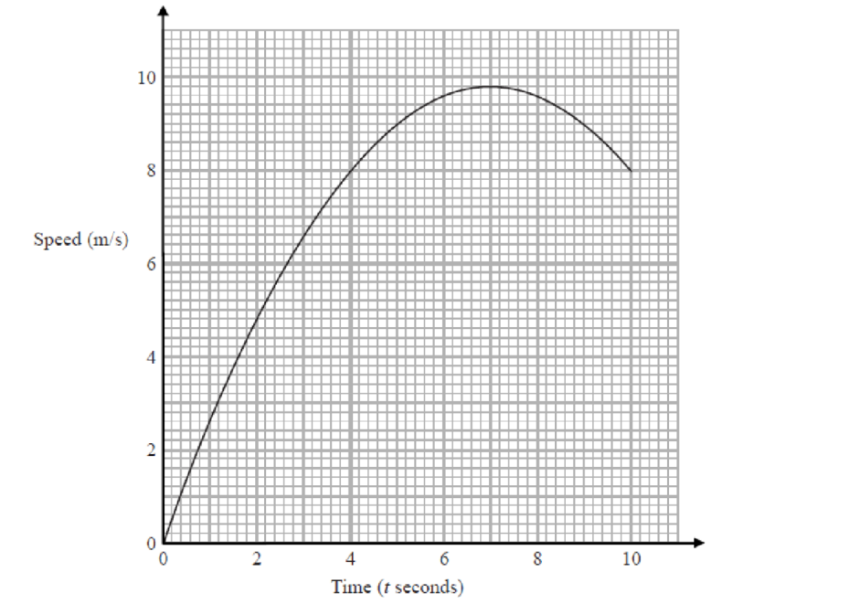

By drawing a suitable tangent, work out the acceleration when $t$ = 9. Give the units of your answer.

### 2() — 1 mark — command: describe — structured — from paper Pre2017
Describe what happens to Ellie after 7 seconds.

## Q26 — medium — 3 marks · exam-questions

### 1() — 1 mark — command: find — structured
Use differentiation to find $\frac{dy}{dx}$ for the following:

$y=4x^{3}+2x$

### 2() — 1 mark — structured
$y=-5x^{-2}$

### 3() — 1 mark — structured
$y=\frac{1}{3x}$

## Q27 — hard — 5 marks · exam-questions

### 1() — 2 marks — command: solve — structured — from paper Pre2017
The diagram shows the graph of $y=\frac{x}{2}+\frac{2}{x}$for $0<x\leq8.$

Use the graph to solve the equation $\frac{x}{2}+\frac{2}{x}=3\,$.

### 2() — 3 marks — command: find — structured — from paper Pre2017
By drawing a suitable tangent, find an estimate of the gradient of the graph when *x* = 1.

## Q28 — medium — 5 marks · exam-questions

### 1() — 1 mark — command: find — structured
Use differentiation to find $\frac{dy}{dx}$ for the following:

$y=2x^{3}-6x^{2}+3x-4$

### 2() — 2 marks — structured
$-\frac{5}{3x^{4}}$

### 3() — 2 marks — structured
$\frac{2}{3}x^{2}+\frac{1}{5}x-\frac{3}{2x}$

## Q29 — hard — 6 marks · exam-questions

### 15((a)) — 3 marks — command: calculate — structured — from paper 2015	Spec2 · 1MA1/2H
Karol runs in a race.

The graph shows her speed, in metres per second, $t$ seconds after the start of the race.

Calculate an estimate for the gradient of the graph when $t=4$ You must show how you get your answer.

### 15((b)) — 2 marks — command: describe — structured — from paper 2015	Spec2 · 1MA1/2H
Describe fully what your answer to part (a) represents.

### 15((c)) — 1 mark — command: explain — structured — from paper 2015	Spec2 · 1MA1/2H
Explain why your answer to part (a) is only an estimate.

## Q30 — medium — 4 marks · exam-questions

### 1() — 2 marks — command: find — structured
For the curve with equation $y=2x^{2}-6x-11$:

find $\frac{dy}{dx}$

### 2() — 2 marks — command: find — structured
Find the coordinates of the point on the curve where the gradient is 2.

## Q31 — hard — 3 marks · exam-questions

### 1() — 2 marks — command: find — structured — from paper Pre2017
A fish bowl is being filled with water. 
The graph shows how the diameter of the surface of the water changes with time.

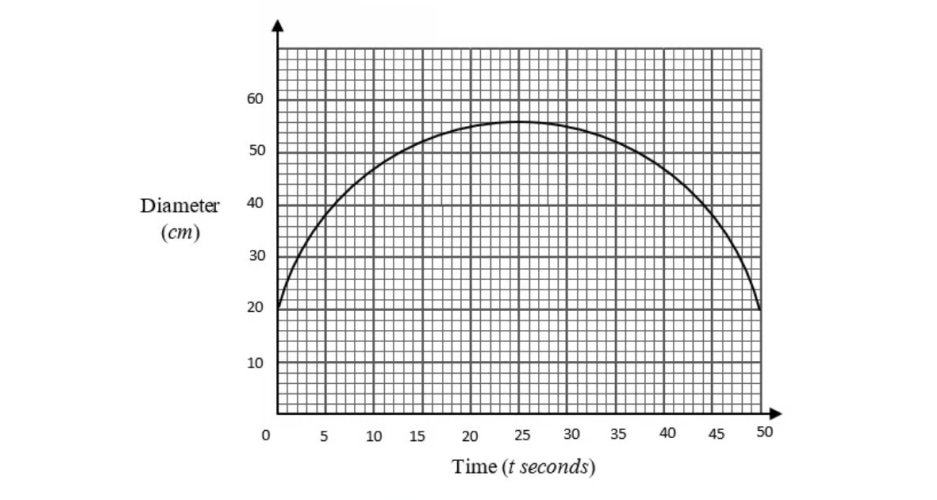

Find an estimate for the gradient at $t$ = 10.

### 2() — 1 mark — command: give — structured — from paper Pre2017
Give an interpretation of the gradient.

## Q32 — hard — 8 marks · exam-questions

### 1() — 2 marks — command: find — structured
A curve has equation $y=2x^{2}+x-3$.

Find: the coordinates where the curve crosses the $x$-axis,

### 2() — 1 mark — structured
the coordinates where the curve crosses the $y$-axis,

### 3() — 3 marks — structured
the coordinates of the turning point on the curve,

### 4() — 2 marks — command: sketch — structured
Sketch the curve showing the points you have found.

## Q33 — medium — 7 marks · exam-questions

### 1() — 2 marks — command: find — structured
A curve has equation $y=x^{3}+\frac{7}{2}x^{2}-2x+9$

Find $\frac{dy}{dx}$

### 2() — 4 marks — command: find — structured
Find the gradient of the curve at the point where:

(i) $x=-3$

[2]

(ii) $x=\frac{2}{3}$

[2]

### 3() — 1 mark — command: what — structured
What can you say about the tangents to the curves at these two points?

## Q34 — hard — 4 marks · exam-questions

### 1() — 2 marks — command: find — structured
A particle is moving along a straight line. The fixed point $O$ lies on this line.

The displacement of the particle from $O$ at time $t$ seconds is $s$ metres where

$s=2t^{3}-9t^{2}-60t$

Find an expression for the velocity, $v$ $m/s$ of the particle at time $t$ seconds.

### 2() — 2 marks — command: find — structured
Find the time at which the velocity is instantaneously zero.

## Q35 — hard — 5 marks · exam-questions

### 18() — 3 marks — command: estimate — structured — from paper Jan 2020 · 4MA1/1HR
The diagram shows the graph of $y=f(x)$ for `negative 4 space less-than or slanted equal to space x space less-than or slanted equal to space 12`

The point $P$on the curve has $x$ coordinate 2

Use the graph to find an estimate for the gradient of the curve at $P$.

### 18() — 2 marks — command: find — structured — from paper Jan 2020 · 4MA1/1HR
Hence find an equation of the tangent to the curve at $P$. Give your answer in the form $y=mx+c$ .

## Q36 — medium — 6 marks · exam-questions

### 1() — 4 marks — command: find — structured
A particle $P$ passes the fixed point $O$ whilst moving along a straight line.

The displacement of $P$, from $O$, at time $t$ seconds is $s$ metres where

$s=6t^{3}-12t^{2}+7t$

Find expressions for the velocity, $vm/s$, and the acceleration, $am/s^{2}$ of the particle at time $t$ seconds.

### 2() — 2 marks — command: find — structured
Find the time at which the acceleration is 3 $m/s^{2}$.

## Q37 — hard — 5 marks · exam-questions

### 1() — 2 marks — command: find — structured
For the curve with equation $y=x^{3}-7x^{2}-5x$: 
find $\frac{dy}{dx}$

### 2() — 2 marks — command: find — structured
find the $x$-coordinates of the two turning points on the curve.

### 3() — 1 mark — command: determine — structured
By considering the shape of the curve determine which of your answers to (b) is the $x$-coordinate of a maximum point.

## Q38 — hard — 3 marks · exam-questions

### 18((d)) — 3 marks — command: show — structured — from paper June 2019 · 4MA1/2HR
Part of the curve with equation $y=h(x)$ is shown on the grid.

Find an estimate for the gradient of the curve at the point where $x=-0.5$ 
Show your working clearly.

## Q39 — medium — 6 marks · exam-questions

### 17((a)) — 2 marks — command: find — structured — from paper Nov 2020 · 4MA1/1HR
The curve $C$ has equation $y=5x^{3}--x^{2}--6x+4$.

Find  $\frac{dy}{dx}$.

$\frac{dy}{dx}$ = ..............................................

### 17((b)) — 4 marks — command: show — structured — from paper Nov 2020 · 4MA1/1HR
There are two points on the curve $C$ at which the gradient of the curve is $2$.

Find the $x$ coordinate of each of these two points. Show clear algebraic working.

## Q40 — hard — 8 marks · exam-questions

### 1() — 1 mark — command: write — structured
The curve $G$ has equation $y=1-x^{3}-6x^{2}-9x$.

Part of the graph of $G$ is shown below.

Write the coordinates of A.

### 2() — 5 marks — command: find — structured
Points B and C are stationary points on $G$.

Find the coordinates of points B and C, stating the nature of the stationary point in each case.

### 3() — 2 marks — command: which — structured
For which values of $x$ is the gradient of the curve $G$ negative?

## Q41 — hard — 3 marks · exam-questions

### 25() — 3 marks — command: work_out — structured — from paper Nov 2017 · 8300/3H
Liquid is leaking out of a container.

The graph shows the depth of the liquid for 60 seconds.

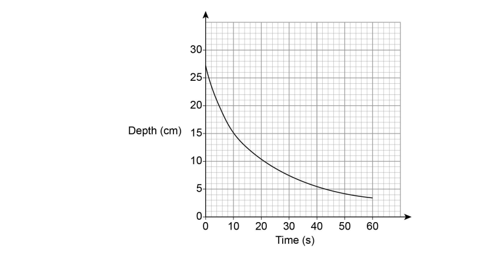

Use the graph to work out an estimate of the rate of decrease of depth at 10 seconds.

You **must** show your working.

...........................................cm/s

## Q42 — medium — 6 marks · exam-questions

### 12((a)) — 2 marks — command: find — structured — from paper Specimen 2016 · 4MA1/2H
$y=x^{3}--6x^{2}--15x$.

Find $\frac{dy}{dx}$.

$\frac{dy}{dx}=$....................................

### 12((b)) — 4 marks — command: work_out — structured — from paper Specimen 2016 · 4MA1/2H
The curve with equation $y=x^{3}--6x^{2}--15x$ has two stationary points.

Work out the coordinates of these two stationary points.

## Q43 — hard — 5 marks · exam-questions

### 13((b)) — 5 marks — command: work_out — structured — from paper Nov 2017 · J560/05
The graph shows information about the speed of a vehicle during the final 50 seconds of a journey.

At the start of the 50 seconds the speed is k metres per second. The distance travelled during the 50 seconds is 1.35 kilometres.

Work out the value of $k$.

$k$ = .......................

## Q44 — hard — 7 marks · exam-questions

### 1() — 2 marks — command: find — structured
For the curve with equation $y=4x+\frac{64}{x}+7$

find $\frac{dy}{dx}$

### 2() — 3 marks — command: find — structured
find the coordinates of the stationary points on the curve.

### 3() — 2 marks — command: find — structured
find the exact distance between the two stationary points.

## Q45 — medium — 5 marks · exam-questions

### 15((a)) — 2 marks — command: find — structured — from paper Jan 2019 · 4MA1/1H
The curve $C$ has equation $y=\frac{1}{3}x^{3}-9x+1$.

Find  $\frac{dy}{dx}$.

### 15((b)) — 3 marks — command: find — structured — from paper Jan 2019 · 4MA1/1H
Find the range of values of $x$ for which $C$ has a negative gradient.

## Q46 — very_hard — 5 marks · exam-questions

### 1() — 3 marks — command: work_out — structured — from paper Pre2017
The velocity-time graph shows the first 40 seconds of a car in a race.

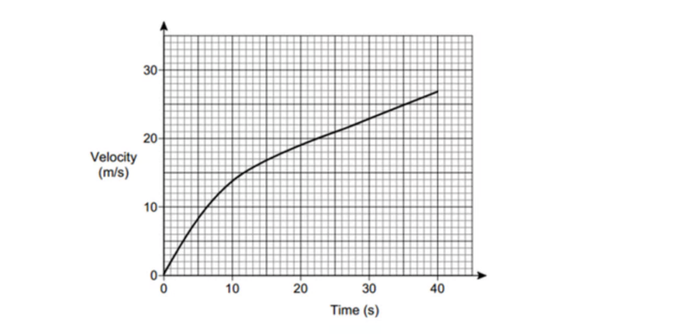

Work out the average acceleration for the first 40 seconds. 
Give the units of your answer.

### 2() — 2 marks — command: show — structured — from paper Pre2017
Estimate the time during the 40 seconds when the instantaneous acceleration = the average acceleration.

You must show your working on the graph.

## Q47 — hard — 7 marks · exam-questions

### 1() — 1 mark — command: how — structured
A particle is moving along a straight line and passes a fixed point $O$.

The displacement of the particle, from point $O$, at time $t$ seconds is

$s=\frac{1}{3}t^{3}-\frac{5}{2}t^{2}+20t-15$

where $s$ is measured in metres. Initially how far is the particle from $O$?

### 2() — 2 marks — command: find — structured
Find, in terms of $t$, the velocity of the particle.

### 3() — 2 marks — command: find — structured
Find the time at which the particle’s velocity is at its minimum.

### 4() — 2 marks — command: how — structured
For how long is the particle decelerating?

## Q48 — medium — 3 marks · exam-questions

### 7((a)) — 3 marks — command: calculate — structured — from paper 2020 Oct/Nov · 0580/43
Calculate the gradient of  $y=24+5x-x^{2}$ at $x=-1.5$.

## Q49 — very_hard — 6 marks · exam-questions

### 1() — 2 marks — command: work_out — structured — from paper Pre2017
The graph gives information about the variation in the temperature of an amount of water that is left to cool from 80° C.

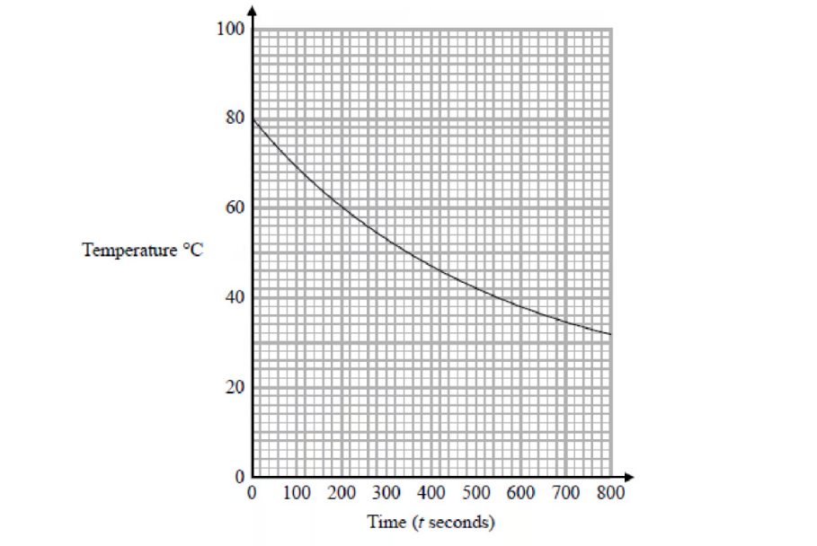

Work out an estimate for the rate of decrease of temperature at $t$= 300.

### 2() — 2 marks — command: work_out — structured — from paper Pre2017
Work out the average rate of decrease of the temperature of the water between $t$ = 0 and $t$ = 800.

### 3() — 2 marks — command: find — structured — from paper Pre2017
The instantaneous rate of decrease of the temperature of the water at time $T$ seconds is equal to the average rate of decrease of the temperature of the water between $t$ = 0 and $t$ = 800.

Find an estimate for the value of $T$. 
You must show how you got your answer.

## Q50 — hard — 9 marks · exam-questions

### 1() — 1 mark — command: show — structured
A homeowner wishes to enclose a rectangular part of their garden by building a fence, using an existing wall as one side of the rectangle as shown in the diagram below.

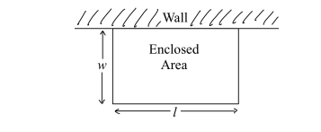

The width of the enclosed rectangle is $w$ metres and its length $l$ metres.

The homeowner has 40 metres of fence to use and would like to use it all in order to maximise the area of the garden to be enclosed. Show that $l=40-2w$

### 2() — 2 marks — command: show — structured
Show that the area of the garden to be enclosed, $A$, is given by $A$= 40$w$ − 2$w^{2}$

### 3() — 2 marks — command: find — structured
Find $\frac{dA}{dW}$

### 4() — 2 marks — command: find — structured
Find the value of $w$ that maximises $A$

### 5() — 2 marks — command: find — structured
Find the dimensions of the rectangle that produce the maximum area that can be enclosed using all of the fence.

Also find the maximum area.

## Q51 — medium — 4 marks · exam-questions

### 21((a)) — 2 marks — structured — from paper 2020 Oct/Nov · 0580/22
Differentiate $6+4x-x^{2}$.

### 21((b)) — 2 marks — command: find — structured — from paper 2020 Oct/Nov · 0580/22
Find the coordinates of the turning point of the graph of $y=6+4x-x^{2}$ .

( ...................... , ...................... )

## Q52 — medium — 6 marks · exam-questions

### 12((a)) — 2 marks — command: find — structured — from paper Specimen paper · 4MA1/2H
$y=x^{3}-6x^{2}-15x$

Find  $\frac{dy}{dx}$

### 12((b)) — 4 marks — command: work_out — structured — from paper Specimen paper · 4MA1/2H
The curve with equation $y=x^{3}-6x^{2}-15x$ has two stationary points.

Work out the coordinates of these two stationary points.

## Q53 — very_hard — 5 marks · exam-questions

### 20((a)) — 2 marks — command: draw — structured — from paper 2017	June · 1MA1/2H
The diagram shows part of the graph of  $y=x^{2}---2x+3$

By drawing a suitable straight line, use your graph to find estimates for the solutions of $x^{2}---3x---1=0$

### 20((b)) — 3 marks — command: calculate — structured — from paper 2017	June · 1MA1/2H
$P$ is the point on the graph of $y=x^{2}---2x+3$where $x=2$

Calculate an estimate for the gradient of the graph at the point $P$.

## Q54 — hard — 8 marks · exam-questions

### 15((a)) — 3 marks — command: show — structured — from paper Jan 2020 · 4MA1/1H
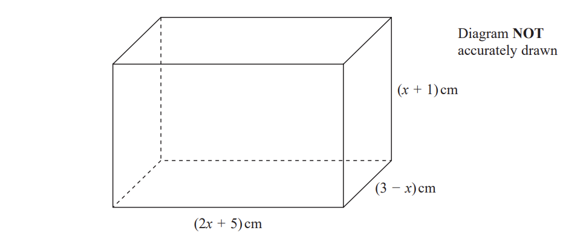

The diagram shows a cuboid of volume $V\mathrm{cm}^{3}$

Show that $V=15+16x-x^{2}-2x^{3}$

### 15((b)) — 5 marks — command: show — structured — from paper Jan 2020 · 4MA1/1H
There is a value of $x$ for which the volume of the cuboid is a maximum.

Find this value of $x$. 
Show your working clearly. 
Give your answer correct to 3 significant figures.

## Q55 — medium — 6 marks · exam-questions

### 11((a)) — 2 marks — command: find — structured — from paper 2023 June · 4MA1/1H
The curve **C** has equation  $y=4x^{3}+x^{2}-20x$

Find $\frac{dy}{dx}$

### 11((b)) — 4 marks — command: show — structured — from paper 2023 June · 4MA1/1H
Find the  $x$coordinates of the points on **C** where the gradient is 4 
Show clear algebraic working.

## Q56 — very_hard — 7 marks · exam-questions

### 1() — 2 marks — command: plot — structured — from paper Pre2017
Clare emptied a tank and recorded the depth of water each minute.

| Time (*t minutes*) | 0 | 1 | 2 | 3 | 4 | 5 | 6 | 7 | 8 | 9 | 10 |
|---|---|---|---|---|---|---|---|---|---|---|---|
| Depth (*m metres*) | 30 | 29.5 | 29 | 28 | 27 | 26 | 24.5 | 22.5 | 19.5 | 15 | 9 |

Plot the graph of depth against time.

### 2() — 2 marks — command: work_out — structured — from paper Pre2017
Work out the average rate of decrease of the depth of the water in Clare's tank between $t$ = 0 and $t$ = 10.

### 3() — 2 marks — command: find — structured — from paper Pre2017
Find an estimate for the gradient at $t$ = 7.

### 4() — 1 mark — command: give — structured — from paper Pre2017
Give an interpretation of part (c).

## Q57 — hard — 5 marks · exam-questions

### 19() — 5 marks — command: find — structured — from paper Jan 2021 · 4MA1/2H
A particle $P$ is moving along a straight line. 
The fixed point $O$ lies on this line. 
At time $t$ seconds where `t space greater-than or slanted equal to space 0`, the displacement, $s$ metres, of $P$ from $O$ is given by

$s=t^{3}+5t^{2}--8t+10$

Find the displacement of $P$ from $O$ when $P$ is instantaneously at rest.

Give your answer in the form $\frac{a}{b}$ where $a$ and $b$ are integers.

## Q58 — medium — 4 marks · exam-questions

### 16() — 4 marks — command: find — structured — from paper 2023 Nov · 4MA1/1H
A curve has equation  $y=4x^{3}-8x+5$

Find the  $x$ coordinates of the two points on the curve where the gradient is $\frac{1}{3}$

## Q59 — very_hard — 7 marks · exam-questions

### 1() — 1 mark — command: find — structured — from paper Pre2017
Olympic medallist Usain runs in a race. 
The graph shows his speed, in metres per second (m/s), during the first 10 seconds of the race.

Use the graph to find how long it took Usain to reach his top speed.

### 2() — 3 marks — command: work_out — structured — from paper Pre2017
Work out an estimate for Usain's acceleration at 2 seconds. Give the units of your answer.

### 3() — 3 marks — command: calculate — structured — from paper Pre2017
Calculate the difference in Usain's acceleration between 2 and 6 seconds.

## Q60 — hard — 11 marks · exam-questions

### 1() — 2 marks — command: explain — structured
A cuboid with a square cross section is to be made from rods as shown in the diagram. The shorter rods making the square are of length xx cm and the longer rods

are of length $y$ cm.

Explain why 12 rods in total will be needed to make the cuboid, and state how many of each length will be required.

The total length of the rods is to be fixed at 36 cm.

### 2() — 2 marks — command: find — structured
The total length of the rods is to be fixed at 36 cm.

Find $y$ in terms of $x$

### 3() — 2 marks — command: show — structured
Show that the volume of the cuboid, $V$ cm3 is $V$ = 9$x^{2}$ − 2$x^{3}$.

### 4() — 3 marks — command: find — structured
Find the value of $x$ that maximises the volume.

### 5() — 2 marks — command: find — structured
Find the maximum volume.

## Q61 — hard — 4 marks · exam-questions

### 18() — 4 marks — command: find — structured — from paper 2023 Nov · 4MA1/2H
A particle is moving along a straight line that passes through the fixed point O.
The displacement, $s$ metres, of the particle from O at time $t$ seconds is given by

$s=2t^{3}-5t^{2}+6t-5$

Find the value of* *$t$* *when the acceleration of the particle is 5 m/s²

## Q62 — very_hard — 11 marks · exam-questions

### 5((a)) — 2 marks — command: complete — structured — from paper 2018	Oct/Nov · 0580/42
The table shows some values of  $y=x^{3}-3x-1$.

| $x$ | -3 | -2.5 | -2 | -1.5 | -1 | 0 | 1 | 1.5 | 2 | 2.5 | 3 |
|---|---|---|---|---|---|---|---|---|---|---|---|
| $y$ | -19 | -9.1 |   | 0.1 | 1 | -1 | -3 | -2.1 | 1 | 7.1 |   |

Complete the table of values.

### 5((b)) — 4 marks — command: draw — structured — from paper 2018	Oct/Nov · 0580/42
Draw the graph of  $y=x^{3}-3x-1$  for  $-3\leqx\leq3$.

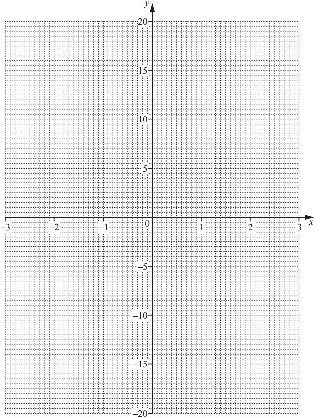

### 5((c)) — 5 marks — command: multiple — structured — from paper 2018	Oct/Nov · 0580/42
A straight line through (0, –17) is a tangent to the graph of  $y=x^{3}-3x-1$.

(i) On the grid, draw this tangent.

[1]

(ii) Find the co-ordinates of the point where the tangent meets your graph.

(................ , ................) [1]

(iii) Find the equation of the tangent. Give your answer in the form  $y=mx+c$.

$y$ = ................................................ [3]
