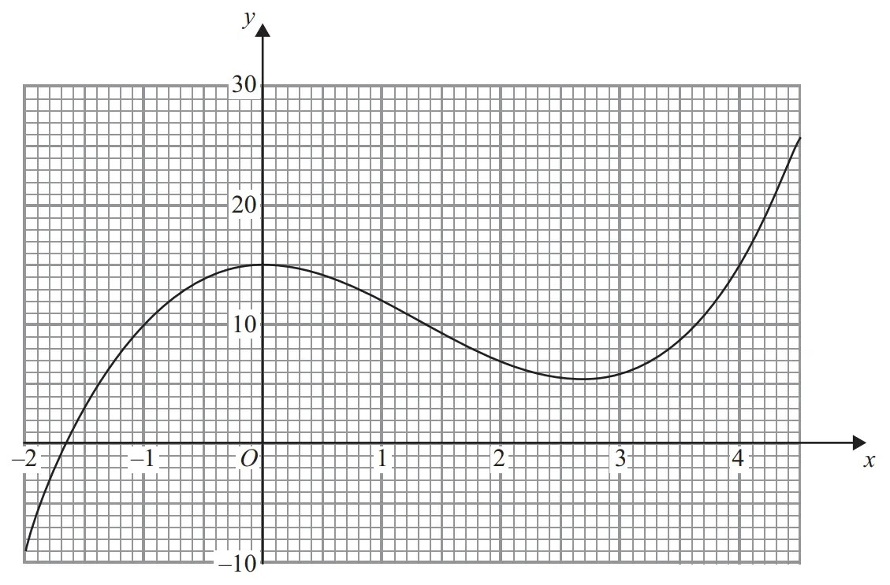
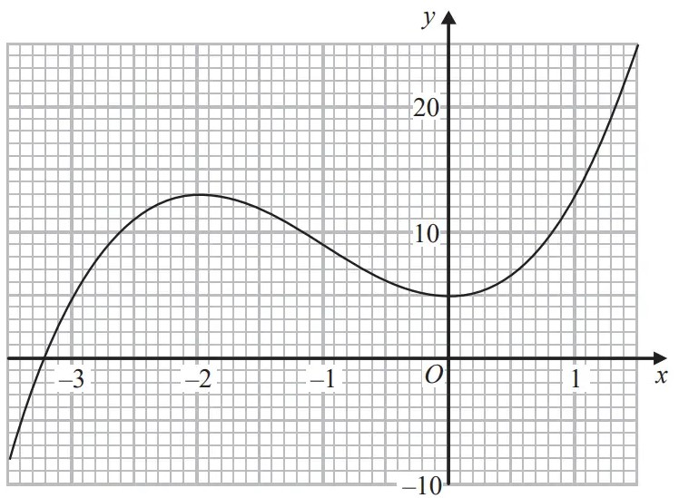
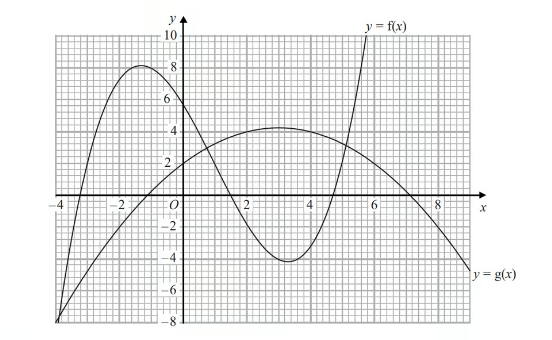
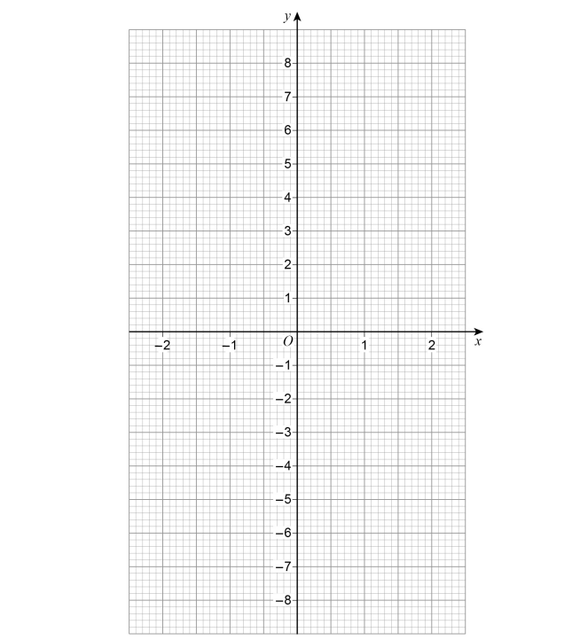
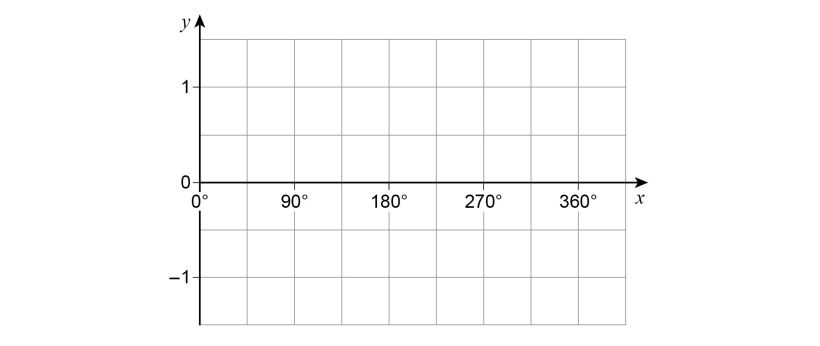
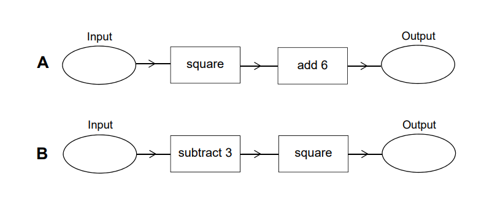

# Exam Questions — Functions
**Functions, Graphs & Differentiation** · Edexcel IGCSE Maths A (Modular) (4XMAF/4XMAH) — 24/Higher Unit 2
> Source: [https://www.savemyexams.com/igcse/maths/edexcel/a-modular/24/higher-unit-2/topic-questions/functions-graphs-and-differentiation/functions/exam-questions/](https://www.savemyexams.com/igcse/maths/edexcel/a-modular/24/higher-unit-2/topic-questions/functions-graphs-and-differentiation/functions/exam-questions/) · 57 questions · total 267 marks

## Q1 — very_hard — 5 marks · exam-questions

### 1() — 2 marks — command: show — structured
Show that $\frac{x^{2}+3x}{2x^{2}+5x-3}$ can be written as  $\frac{x}{kx-1}$

State the value of $k$.

### 2() — 3 marks — command: show — structured
$f(x)=\frac{x}{2x-1}$

Find the inverse function $f^{-1}$  in the form `straight f space to the power of negative 1 end exponent open parentheses x close parentheses space equals space.......`

Show your working clearly.

## Q2 — hard — 3 marks · exam-questions

### 17((b)) — 3 marks — command: show — structured — from paper Jan 2021 · 4MA1/2HR
The functions $f$and $g$ are defined as

`table row cell straight f left parenthesis x right parenthesis space end cell equals cell space x squared space plus space 6 space end cell row cell straight g left parenthesis x right parenthesis space end cell equals cell space x space – space 10 end cell end table`

Solve the equation $\mathrm{fg}(x)=f(x)$

Show clear algebraic working.

## Q3 — medium — 3 marks · exam-questions

### 11((a)) — 1 mark — command: find — structured — from paper 2018	June · 1MA1/2H
$f$ and $g$ are functions such that

`straight f open parentheses x close parentheses space equals space 2 over x squared space space space space space space space space space space and space space space space space space straight g open parentheses x close parentheses space equals space 4 x cubed`

Find $f(-5)$

### 11((b)) — 2 marks — command: find — structured — from paper 2018	June · 1MA1/2H
Find `fg open parentheses 1 close parentheses`

## Q4 — very_hard — 5 marks · exam-questions

### 22() — 5 marks — command: find — structured — from paper 2017 Nov · 1MA1/2H
The functions $f$ and $g$ are such that

$f(x)=5x+3g(x)=ax+b$ where $a$ and $b$ are constants.

$g(3)=20\mathrm{and}f^{-1}(33)=g(1)$

Find the value of $a$ and the value of $b$.

## Q5 — hard — 3 marks · exam-questions

### 18() — 3 marks — command: express — structured — from paper 2015	Spec1 · 1MA1/2H
$f(x)=3x^{2}---2x---8$

Express $f(x+2)$ in the form $ax^{2}+bx$

## Q6 — medium — 4 marks · exam-questions

### 1() — 2 marks — command: express — structured
`straight f open parentheses x close parentheses space equals space 3 x space minus space 2
straight g open parentheses x close parentheses space equals fraction numerator space 10 over denominator x plus 2 end fraction`

Express the inverse function $f^{-1}$ in the form `straight f to the power of negative 1 end exponent open parentheses x close parentheses space equals space...`

### 2() — 2 marks — command: simplify — structured
Find $\mathrm{gf}(x)$ 
Simplify your answer.

## Q7 — very_hard — 9 marks · exam-questions

### 1() — 1 mark — command: find — structured
`straight f open parentheses x close parentheses equals square root of x minus 6 end root`

Find f(10)

### 2() — 2 marks — command: state — structured
State which values of $x$ must be excluded from a domain of f

### 3() — 1 mark — command: find — structured — from paper PRE 2017
The diagram shows part of the graph of `y equals straight g open parentheses x close parentheses`

Find `straight g open parentheses 2 close parentheses`

### 4() — 2 marks — command: find — structured
Find `fg open parentheses 0 close parentheses`

### 5() — 3 marks — command: find — structured
One of the solutions of `straight g open parentheses x close parentheses equals k`, where $k$ is a number, is $x=1$

Find the other solutions 
Give your answers correct to 1 decimal place

## Q8 — hard — 6 marks · exam-questions

### 1() — 3 marks — command: find — structured
The functions $f$ and $g$ are such that $f(x)=x+3$     and       `straight g open parentheses x close parentheses space equals space fraction numerator 1 over denominator x minus 2 end fraction`

Find $\mathrm{fg}(x)$ 
Give your answer as a single algebraic fraction expressed as simply as possible.

### 2() — 3 marks — command: express — structured
Express the inverse function $g^{-1}$ in the form `straight g to the power of negative 1 end exponent open parentheses x close parentheses space equals space...`

## Q9 — medium — 3 marks · exam-questions

### 1() — 1 mark — command: find — structured
f is a function such that

`straight f open parentheses x close parentheses space equals space fraction numerator 1 over denominator x squared space plus space 1 end fraction`

Find `straight f open parentheses begin inline style 1 half end style close parentheses`

### 2() — 2 marks — command: find — structured
$g$ is a function such that

`straight g open parentheses x close parentheses space equals space square root of x minus 1 end root space space space space space space space space space x greater-than or slanted equal to 1`

Find `straight f g open parentheses x close parentheses`

Give your answer as simply as possible.

## Q10 — very_hard — 9 marks · exam-questions

### 1() — 1 mark — command: find — structured
The diagram shows the graph of $y=f(x)$  for  `negative 3.5 less-than or slanted equal to x less-than or slanted equal to 1.5`

Use the graph of `straight f open parentheses x close parentheses` to find the value of `straight f open parentheses 0 close parentheses`.

### 2() — 2 marks — command: which — structured
For which values of $k$ does the equation `straight f open parentheses x close parentheses equals k` have only one solution?

### 3() — 3 marks — command: find — structured
Find an estimate for the gradient of the curve at the point where $x$ = −2.5

### 4() — 1 mark — command: state — structured
`straight g open parentheses x close parentheses equals fraction numerator 1 over denominator 2 plus x end fraction`

State which value of $x$ must be excluded from any domain of $g$

### 5() — 2 marks — command: find — structured
Find fg(-3)

## Q11 — hard — 4 marks · exam-questions

### 10((a)) — 2 marks — command: find — structured — from paper 2015	Sample · 1MA1/3H
The function $f$ is such that

$f(x)=4x---1$

Find $f^{-1}(x)$

### 10((b)) — 2 marks — command: work_out — structured — from paper 2015	Sample · 1MA1/3H
The function $g$ is such that

$g(x)=kx^{2}$ where $k$ is a constant.

Given that $\mathrm{fg}(2)=12$

work out the value of $k$

## Q12 — medium — 9 marks · exam-questions

### 1() — 1 mark — command: find — structured
$f$is the function $f(x)=2x+5$

Find $f(3)$

### 2() — 2 marks — command: express — structured
Express the inverse function $f^{-1}$ in the form `straight f to the power of negative 1 end exponent open parentheses x close parentheses` =

### 3() — 1 mark — command: find — structured
$g$ is the function $g(x)=x^{2}---25$

Find $g(---3)$

### 4() — 5 marks — command: multiple — structured — from paper PRE 2017
(i) Find $\mathrm{gf}(x)$ Give your answer as simply as possible.

[3]

(ii) Solve $\mathrm{gf}(x)=0$

[2]

## Q13 — very_hard — 5 marks · exam-questions

### 25((a)) — 4 marks — command: express — structured — from paper Jan 2022 · 4MA1/2H
The function $g$ is defined as

`g colon space x space rightwards arrow from bar space 5 space plus space 6 x space minus space x squared`       with domain `open curly brackets x colon x greater-than or slanted equal to 3 close curly brackets`

Express the inverse function g−1 in the form `g to the power of negative 1 end exponent space colon space x space rightwards arrow from bar space...`

`g to the power of negative 1 end exponent space colon space x space rightwards arrow from bar`...................................................

### 25((b)) — 1 mark — command: state — structured — from paper Jan 2022 · 4MA1/2H
State the domain of  $g^{-1}$

## Q14 — hard — 7 marks · exam-questions

### 21((a)) — 2 marks — command: find — structured — from paper June 2019 · 1MA1/1H
The functions $f$ and $g$ are such that

`straight f open parentheses x close parentheses space equals space 3 x space minus 1 space space space space and space space space space space space space straight g open parentheses x close parentheses space equals space x squared plus 4`

Find $f^{-1}(x)$

### 21((b)) — 5 marks — command: show — structured — from paper June 2019 · 1MA1/1H
Given that $\mathrm{fg}(x)=2\mathrm{gf}(x)$,

show that $15x^{2}-12x---1=0$

## Q15 — medium — 8 marks · exam-questions

### 1() — 1 mark — command: work_out — structured
The functions $f$ and $g$ are defined as

`straight f open parentheses x close parentheses space equals space 1 half x space plus 4
straight g open parentheses x close parentheses space equals space fraction numerator 2 x over denominator x plus 1 end fraction
`

Work out $f(6)$

### 2() — 2 marks — command: work_out — structured
Work out  $\mathrm{fg}(---3)$

### 3() — 2 marks — command: work_out — structured
$g(a)=-2$

Work out the value of $a$.

### 4() — 3 marks — command: express — structured
Express the inverse function $f^{-1}$ in the form $f^{-1}(x)$ = ...

## Q16 — very_hard — 4 marks · exam-questions

### 23() — 4 marks — command: express — structured — from paper Jan 2022 · 4MA1/2HR
The functions $f$ and $g$ are such that

$f(x)=x+25g(x)=x^{2}--12x$

The function $h$ is such that $h(x)=\mathrm{fg}(x)$

The domain of $h$ is `open curly brackets x space colon space x less-than or slanted equal to 6 close curly brackets`

Express the inverse function $h^{--1}$ in the form $h^{--1}(x)=...$

$h^{--1}(x)=.....................$

## Q17 — hard — 7 marks · exam-questions

### 1() — 1 mark — command: find — structured
The function f is defined as

$f(x)=\frac{x-6}{2}$

Find f (8)

### 2() — 2 marks — command: express — structured
Express the inverse function $f^{-1}$in the form `straight f to the power of negative 1 end exponent open parentheses x close parentheses` = ......

### 3() — 2 marks — command: which — structured
The function $g$ is defined as

$g(x)=\sqrt{x-4}$

Which values of $x$ cannot be included in a domain of $g$?

### 4() — 2 marks — command: express — structured
Express the function $\mathrm{gf}$ in the form `gf space open parentheses x close parentheses`= .......

Give your answer as simply as possible.

## Q18 — medium — 9 marks · exam-questions

### 1() — 1 mark — command: find — structured
f is the function such that  f(*x*) = 2*x* - 5

g is the function such that g(*x*) = *x*2 - 10

Find f (4)

### 2() — 2 marks — command: find — structured
Find fg(-4)

### 3() — 2 marks — command: express — structured
Express the inverse function f-1 in the form f-1 (*x*) = ...

### 4() — 4 marks — command: solve — structured
Solve gf (*x*) = -1

## Q19 — very_hard — 6 marks · exam-questions

### 24((a)) — 2 marks — command: find — structured — from paper June 2021 · 4MA1/1H
The functions $f$ and $g$ are defined as

`table row cell straight f left parenthesis x right parenthesis space end cell equals cell space 5 x squared space minus space 10 x space plus space 7 space space space space space space space space space where space space space space space x greater-than or slanted equal to 1 end cell row cell straight g open parentheses x close parentheses end cell equals cell 7 x italic minus 6 end cell end table`

Find $\mathrm{fg}(2)$

### 24((b)) — 4 marks — command: express — structured — from paper June 2021 · 4MA1/1H
Express the inverse function $f^{-1}$ in the form  $f^{-1}(x)=...$

$f^{-1}(x)=$...............................

## Q20 — hard — 5 marks · exam-questions

### 1() — 1 mark — command: state — structured
`straight f open parentheses x close parentheses space equals fraction numerator 3 over denominator x space plus space 1 end fraction plus fraction numerator 1 over denominator x minus 2 end fraction`

State one value of $x$ which cannot be included in any domain of f.

### 2() — 1 mark — command: find — structured
Find the value of f(0)

### 3() — 3 marks — command: show — structured
Find the value of $x$ for which `straight f open parentheses x close parentheses space equals 0`

Show clear algebraic working.

## Q21 — medium — 5 marks · exam-questions

### 9((a)) — 1 mark — command: find — structured — from paper 2015	Spec2 · 1MA1/2H
The functions $f$ and $g$ are such that

$f(x)=3(x---4)\mathrm{and}g(x)=\frac{x}{5}+1$

Find the value of `straight f open parentheses 10 close parentheses`

### 9((b)) — 2 marks — command: find — structured — from paper 2015	Spec2 · 1MA1/2H
Find  `straight g to the power of negative 1 end exponent open parentheses x close parentheses`

### 9((c)) — 2 marks — command: show — structured — from paper 2015	Spec2 · 1MA1/2H
Show that $\mathrm{ff}(x)=9x---48$

## Q22 — very_hard — 5 marks · exam-questions

### 21() — 5 marks — command: express — structured — from paper Jan 2020 · 4MA1/1H
The functions $f$ and $g$are such that

$f(x)=x^{2}-2xg(x)=x+3$

The function $h$ is such that `straight h left parenthesis x right parenthesis space equals space fg left parenthesis x right parenthesis space for space x space greater-than or slanted equal to space minus 2`

Express the inverse function $h^{-1}(x)$ in the form $h^{-1}(x)$ = .........

$h^{-1}(x)$ = ................

## Q23 — hard — 3 marks · exam-questions

### 1() — 1 mark — command: find — structured
The diagram shows parts of the graphs of `y equals straight f open parentheses x close parentheses space`and `y equals g open parentheses x close parentheses`.

Find g(0)

### 2() — 2 marks — command: find — structured
Find $g$f(–1)

## Q24 — medium — 7 marks · exam-questions

### 1() — 1 mark — command: find — structured
The function f is defined as f($x$) = $\frac{3}{4+x}$

Find the value of f(1)

### 2() — 1 mark — command: state — structured
State which value of $x$ must be excluded from any domain of f.

### 3() — 1 mark — command: find — structured
The function $g$ is defined as $g(x)$ = 5 + $x$

Given that $g(a)$ = 7, find the value of $a$.

### 4() — 2 marks — command: calculate — structured
Calculate $fg$(1)

### 5() — 2 marks — command: simplify — structured
Find `fg open parentheses x close parentheses` Simplify your answer.

## Q25 — very_hard — 7 marks · exam-questions

### 27((a)) — 2 marks — command: express — structured — from paper Nov 2020 · 4MA1/2H
The function$f$ is such that $f(x)=5+6x--x^{2}$      for `x space less-than or slanted equal to space 3`

Express $5+6x--x^{2}$ in the form $p--(x--q)^{2}$ where $p$ and $q$ are constants.

### 27((b)) — 5 marks — command: find — structured — from paper Nov 2020 · 4MA1/2H
Using your answer to part (a), find the range of values of $x$ for which $f^{-1}(x)$ is positive.

## Q26 — hard — 7 marks · exam-questions

### 1() — 1 mark — command: state — structured
$f(x)=\frac{2}{x}$

`straight g open parentheses x close parentheses equals fraction numerator x plus 1 over denominator x end fraction`

State which value of $x$cannot be included in the domain of f or $g$.

### 2() — 3 marks — command: solve — structured
Solve `gf open parentheses a close parentheses equals 3`

### 3() — 3 marks — command: express — structured
Express the inverse function $g^{-1}$ in the form `straight g to the power of negative 1 end exponent open parentheses x close parentheses`

## Q27 — medium — 4 marks · exam-questions

### 17((c)) — 1 mark — command: state — structured — from paper Jan 2021 · 4MA1/2HR
The function $h$ is defined as

`straight h open parentheses x close parentheses equals fraction numerator 2 x minus 4 over denominator x end fraction`

State the value of $x$ that cannot be included in the domain of h

### 17((d)) — 3 marks — command: express — structured — from paper Jan 2021 · 4MA1/2HR
Express the inverse function h–1 in the form $h^{--1}(x)=...$

$h^{--1}(x)=$....................

## Q28 — very_hard — 5 marks · exam-questions

### 23((a)) — 1 mark — command: write — structured — from paper Jan 2019 · 4MA1/1H
$g$ is the function with domain `x space greater-than or slanted equal to space – 3` such that $g(x)=x^{2}+6x$

Write down the range of $g^{-1}$

### 23((b)) — 4 marks — command: express — structured — from paper Jan 2019 · 4MA1/1H
Express the inverse function $g^{-1}$ in the form `g to the power of negative 1 end exponent space colon space x space rightwards arrow from bar horizontal ellipsis`

`g to the power of negative 1 end exponent space colon space x space rightwards arrow from bar`

## Q29 — hard — 5 marks · exam-questions

### 1() — 2 marks — command: express — structured
f:$x$ → 2$x^{2}$$+$1  $g$:$x$→ $\frac{2x}{x-1}$ where $x$≠ 1

Express the composite function gf in the form $g$f:$x$ → .....

Give your answer as simply as possible.

### 2() — 3 marks — command: express — structured
Express the inverse function $g^{-1}$in the form `straight g to the power of negative 1 end exponent ∶ space x space`→ ......

## Q30 — medium — 4 marks · exam-questions

### 17((a)) — 1 mark — command: find — structured — from paper Jan 2020 · 4MA1/1HR
The function $f$ is such that $f(x)=(x-4)^{2}$ for all values of $x$.

Find $f(1)$

### 17((b)) — 1 mark — command: state — structured — from paper Jan 2020 · 4MA1/1HR
State the range of the function $f$

### 17((c)) — 2 marks — command: work_out — structured — from paper Jan 2020 · 4MA1/1HR
The function $g$ is such that `straight g open parentheses x close parentheses space equals space fraction numerator 4 over denominator x plus space 3 end fraction space space space space space space space space space space x space not equal to space minus 3`

Work out $\mathrm{fg}(2)$

## Q31 — very_hard — 6 marks · exam-questions

### 26((a)) — 3 marks — command: find — structured — from paper Jan 2019 · 4MA1/1HR
The function f is defined as $f(x)=\frac{\sqrt{x^{2}+k^{2}}}{x}$ for $x>0$ and where $k$ is a positive number.

Find the value of $p$ for which $f^{-1}(p)=k$

$p=$

### 26((b)) — 3 marks — command: find — structured — from paper Jan 2019 · 4MA1/1HR
The function $g$ is defined as $g(x)=x^{2}\mathrm{for}x>0$

Given that $\mathrm{gf}(a)=k\mathrm{for}k>1$ find an expression for $a$ in terms of $k$.

$a=$

## Q32 — hard — 3 marks · exam-questions

### 28((b)) — 3 marks — command: solve — structured — from paper June 2018 · 8300/2H
`straight g open parentheses x close parentheses space equals space 3 x plus 7`

Solve  $g^{--1}(x)=2x$

$x$ = ....................

## Q33 — hard — 7 marks · exam-questions

### 1() — 1 mark — command: find — structured
The functions $g$ and h are defined as

`straight g open parentheses x close parentheses equals fraction numerator x over denominator 2 x minus 5 end fraction`

`straight h open parentheses x close parentheses equals x plus 4`

Find the value of $g$(1)

### 2() — 1 mark — command: state — structured
State which value of $x$ must be excluded from any domain of $g$

### 3() — 2 marks — command: simplify — structured
Find `gh open parentheses x close parentheses`

Simplify your answer

### 4() — 3 marks — command: express — structured
Express the inverse function $g^{-1}$ in the form `straight g to the power of negative 1 end exponent open parentheses x close parentheses` = .....

## Q34 — medium — 1 marks · exam-questions

### 19() — 1 mark — command: circle — structured — from paper Specimen 2015 · 8300/2H
$f(x)=3x$

Circle the expression for$f^{-1}(x)$

| $-3x$ | $\frac{3}{x}$ | $\frac{1}{3x}$ | $\frac{x}{3}$ |
|---|---|---|---|

## Q35 — very_hard — 4 marks · exam-questions

### 30() — 4 marks — command: solve — structured — from paper Nov 2020 · 8300/3H
`straight f open parentheses x close parentheses equals 1 half x`      `straight g open parentheses x close parentheses equals x minus x squared`

Solve  $f^{--1}(x)=\mathrm{gf}(x)$

## Q36 — hard — 6 marks · exam-questions

### 1() — 1 mark — command: find — structured
$f(x)=\frac{2x}{x-1}$

Find the value of `straight f open parentheses 11 close parentheses`

### 2() — 1 mark — command: state — structured
State which value of $x$must be excluded from any domain of f

### 3() — 3 marks — command: find — structured
Find `straight f to the power of negative 1 end exponent open parentheses x close parentheses`

### 4() — 1 mark — command: state — structured
State the value which cannot be in any range of f

## Q37 — hard — 3 marks · exam-questions

### 8() — 3 marks — command: fill — structured — from paper Specimen 2015 · J560/04
A function machine is shown below.

If the Input is 3, the Output is 5.

If the Input is 7, the Output is 25.

Use this information to fill in the two boxes.

## Q38 — medium — 5 marks · exam-questions

### 8((a)) — 2 marks — command: work_out — structured — from paper Specimen 2015 · J560/04
A function is represented by the following function machine.

A number is input into the machine. 
The output is used as a new input. 
The second output is 11.

Work out the number that was the** first input**.

### 8((a)) — 3 marks — command: work_out — structured — from paper Specimen 2015 · J560/04
A number is input into the machine. 
The output given is the same number.

Work out the number.

## Q39 — very_hard — 5 marks · exam-questions

### 27() — 5 marks — command: work_out — structured — from paper June 2019 · 8300/2H
`straight f open parentheses x close parentheses equals fraction numerator 2 x over denominator 5 end fraction minus 1`

Work out the value of  $f^{--1}(3)+f(--0.5)$

## Q40 — hard — 7 marks · exam-questions

### 1() — 1 mark — command: find — structured
f is the function such that

`straight f open parentheses x close parentheses equals fraction numerator x over denominator 3 x plus 1 end fraction`

Find f(0.5)

### 2() — 2 marks — command: find — structured
Find ff(−1)

### 3() — 1 mark — command: find — structured
Find the value of $x$ that cannot be included in any domain of f

### 4() — 3 marks — command: show — structured
Express the inverse function $f^{-1}$ in the form `straight f to the power of negative 1 end exponent open parentheses x close parentheses`= ......

Show clear algebraic working.

## Q41 — hard — 3 marks · exam-questions

### 24((a)) — 3 marks — command: work_out — structured — from paper Nov 2021 · 8300/1H
`table attributes columnalign right center left columnspacing 0px end attributes row cell straight f open parentheses x close parentheses end cell equals cell c x plus d end cell row cell straight f open parentheses 4 close parentheses end cell equals 7 row cell straight f open parentheses 10 close parentheses end cell equals 22 end table`

Work out the values of $c$ and $d$.

$c=$.........................

$d=$.........................

## Q42 — medium — 1 marks · exam-questions

### 24((b)) — 1 mark — command: circle — structured — from paper Nov 2021 · 8300/1H
`straight g open parentheses x close parentheses equals 2 x` and  `straight h open parentheses x close parentheses equals fraction numerator x minus 1 over denominator 2 end fraction`

Circle the expression for $\mathrm{hg}(x)$

| $\frac{2x^{2}-x}{2}$ | $\frac{2x-1}{2}$ | $x^{2}-x$ | $x-1$ |
|---|---|---|---|

## Q43 — hard — 4 marks · exam-questions

### 17((a)) — 1 mark — command: what — structured — from paper 2023 June · 4MA1/1H
The functions $g$ and $h$ are such that

`straight g open parentheses x close parentheses equals fraction numerator 11 over denominator 2 x minus 5 end fraction`

`straight h open parentheses x close parentheses equals x squared plus 4 space space space space space space space space space x greater-than or slanted equal to 0`

What value of $x$ must be excluded from any domain of $g$?

### 17((b)) — 3 marks — command: solve — structured — from paper 2023 June · 4MA1/1H
Solve $\mathrm{gh}(x)=1$

## Q44 — very_hard — 3 marks · exam-questions

### 28((a)) — 3 marks — command: simplify — structured — from paper June 2018 · 8300/2H
`straight f open parentheses x close parentheses space equals space 5 minus x`  and     `straight g open parentheses x close parentheses space equals space 3 x plus 7`

Simplify $f(2x)+g(x--1)$

## Q45 — hard — 3 marks · exam-questions

### 22() — 3 marks — command: express — structured — from paper Jan 2021 · 4MA1/1H
The function f is such that $f(x)=x^{2}--8x+5$ where `x space less-than or slanted equal to space 4` Express the inverse function $f^{-1}$ in the form $f^{--1}(x)=...$

$f^{--1}(x)=................$

## Q46 — hard — 7 marks · exam-questions

### 19((a)) — 1 mark — command: state — structured — from paper 2023 Nov · 4MA1/2H
The functions $f$ and $g$ are such that

`straight f colon x rightwards arrow from bar 5 x plus 7
straight g colon x rightwards arrow from bar fraction numerator 5 over denominator 2 x minus 9 end fraction`

State which value of $x$ cannot be included in any domain of $g$

### 19((b)) — 2 marks — command: find — structured — from paper 2023 Nov · 4MA1-2H
Find $\mathrm{fg}(4)$

### 19((c)) — 4 marks — command: express — structured — from paper 2023 Nov · 4MA1-2H
The function $h$ is such that

`straight h colon x rightwards arrow from bar 3 x squared minus 12 x plus 8` where $x>2$

Express the inverse function $h^{-1}$ in the form `straight h to the power of negative 1 end exponent colon x rightwards arrow from bar....`

## Q47 — very_hard — 2 marks · exam-questions

### 27((a)) — 2 marks — command: draw — structured — from paper June 2017 · 8300/2H
`straight h left parenthesis x right parenthesis space equals space cube root of x`   for all values of $x$

On the grid, draw the graph of the inverse function `y equals straight h to the power of negative 1 end exponent open parentheses x close parentheses`  for  `negative 2 less-than or slanted equal to x less-than or slanted equal to 2`

## Q48 — hard — 4 marks · exam-questions

### 23() — 4 marks — command: express — structured — from paper June 2018 · 4MA1/1HR
Two functions, $f$ and $g$ are defined as

`straight f space colon space x space rightwards arrow from bar space 1 plus space 1 over x space space for space x space greater than space 0
straight g space colon space x space rightwards arrow from bar space fraction numerator x plus 1 over denominator 2 end fraction space space for space x space greater than space 0`

Given that $h=\mathrm{fg}$ 
express the inverse function $h^{-1}$ in the form `straight h to the power of negative 1 end exponent space colon space x space rightwards arrow from bar space...`

`straight h to the power of negative 1 end exponent space colon space x space rightwards arrow from bar space`.....................

## Q49 — very_hard — 2 marks · exam-questions

### 27((b)) — 2 marks — command: draw — structured — from paper June 2017 · 8300/2H
For all values of $x$

$f(x)=\mathrm{sin}x\,g(x)=x+90$

On the grid, draw the graph of the composite function  `y equals fg open parentheses x close parentheses`  for  `0 degree space less-than or slanted equal to space x space less-than or slanted equal to space 360 degree`

## Q50 — hard — 4 marks · exam-questions

### 28() — 4 marks — command: show — structured — from paper Nov 2019 · 8300/3H
`straight f open parentheses x close parentheses equals 2 x minus 3` and `straight g open parentheses x close parentheses equals x squared`

Show that  `straight f to the power of negative 1 end exponent open parentheses 55 close parentheses equals straight f g open parentheses 4 close parentheses`

## Q51 — very_hard — 4 marks · exam-questions

### 19() — 4 marks — command: work_out — structured — from paper Specimen 2015 · 8300/3H
Here are two function machines, **A** and **B**.

Both machines have the same input.

Work out the range of input values for which

the output of **A** is **less** than the output of **B**.

## Q52 — hard — 2 marks · exam-questions

### 30() — 2 marks — command: work_out — structured — from paper Nov 2017 · 8300/3H
$f(x)=\frac{x}{3}+4$  for all values of $x$.

$g(x)=6x^{2}+3$ for all values of $x$.

Work out $\mathrm{fg}(x)$.

Give your answer in the form $ax^{2}+b$   where $a$ and $b$ are integers.

## Q53 — very_hard — 3 marks · exam-questions

### 25() — 3 marks — command: work_out — structured — from paper Specimen 2015 · 8300/1H
$f(x)=2x+c$

$g(x)=cx+5$

$fg(x)=6x+d$

$c$ and $d$ are constants.

Work out the value of $d$.

## Q54 — hard — 2 marks · exam-questions

### 17() — 2 marks — command: show — structured — from paper Nov 2019 · 8300/3H
$f(x)=3x^{2}--4x+8$ for all values of $x$

Jenny says,

“f(10) must equal 2 × f(5), because 10 is 2 × 5”

Is Jenny correct? Show working to support your answer.

## Q55 — hard — 3 marks · exam-questions

### 26() — 3 marks — command: solve — structured — from paper June 2019 · 8300/3H
$g(x)=16--xh(x)=x^{3}$

Solve    `gh open parentheses x close parentheses equals 24`

## Q56 — hard — 3 marks · exam-questions

### 26() — 3 marks — command: work_out — structured — from paper Nov 2018 · 8300/2H
$f(x)=\frac{x}{x+2}g(x)=x^{2}--2$

Work out $\mathrm{fg}(x)$

Give your answer in the form    $a+bx^{n}$    where $a,b$ and $n$ are integers.

## Q57 — hard — 4 marks · exam-questions

### 26() — 4 marks — command: work_out — structured — from paper Nov 2018 · 8300/3H
$f(x)=\frac{2x+3}{x-4}$

Work out $f^{--1}(x)$
