# Mark Schemes — Graphing Inequalities
**Functions, Graphs & Differentiation** · Edexcel IGCSE Maths A (Modular) (4XMAF/4XMAH) — 24/Higher Unit 2

## Q1 — hard — 6 marks · exam-questions

### 13((a)) — 2 marks
> *List the integer values of **x **and** y*

**x ***:  4, 5, 6*

**y ***: 5, 6, 7, 8*

**correctly listing**** ****x or y values ****[1]**

> *There is no way to make 13 by adding 4 to one of the **y **values; the highest number that can be made from** **4 + **y** is 4 + 8 = 12*

> *However 13 can be made from **x** + **y **when **x** is 5 (5 + 7) or when **x** is 6 (6 + 7)*

**5 and 6 ****[1]**

### 13((b)) — 4 marks
> *First we need to draw the lines for the 3 inequalities. To draw the lines, treat them as equations and use your knowledge of **linear graphs **y** = **mx** + **c**.** All three inequalities are *$\leq$* or *$\geq$* so should be drawn with solid lines*

> *For** *$y\geq-1$*, draw *$y=-1$*, a horizontal line through −1 on the **y**-axis*

> *For *$y\geq4-x$*, draw *$y=-x+4$*, a line through (0, 4) with a gradient of −1*

> *For *$y\leq3x-1$*, draw *$y=3x-1$*, a line through (0, −1) with a gradient of 3*

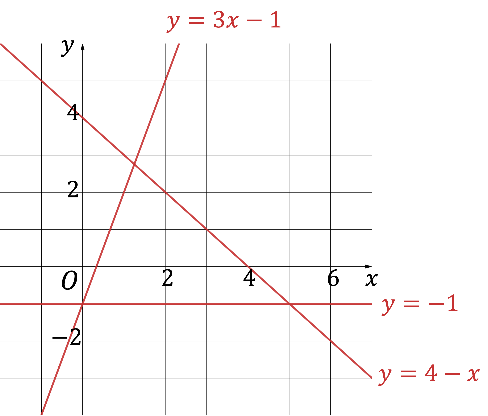

**one mark for each correctly drawn line ****[3]**

> *Shade the **unwanted **regions for each line*

> *For *$y\geq-1$*, the **unwanted** region is below the line, so simply shade below the line *$y=-1$

> *For *$y\leq4-x$*, the **unwanted** region is above the line, so shade above. To check, pick a point such as (0, 0) and substitute into the inequality:*

`table row 0 less or equal than cell 4 minus 0 comma space true end cell end table`

> *(0, 0) is in the wanted region so shade everything on the **other** side of the line *$y=4-x$

> *For *$y\leq3x-1$*, the **unwanted** region is above the line, so shade above. To check substitute (0, 0) again:*

`table row 0 less or equal than cell 3 cross times 0 minus 1 end cell row 0 less or equal than cell negative 1 comma space false end cell end table`

> *(0, 0) is in the **unwanted** region, so shade the (0, 0) side of the line *$y=3x-1$

> *Finally, don't forget to label the wanted region "R"!*

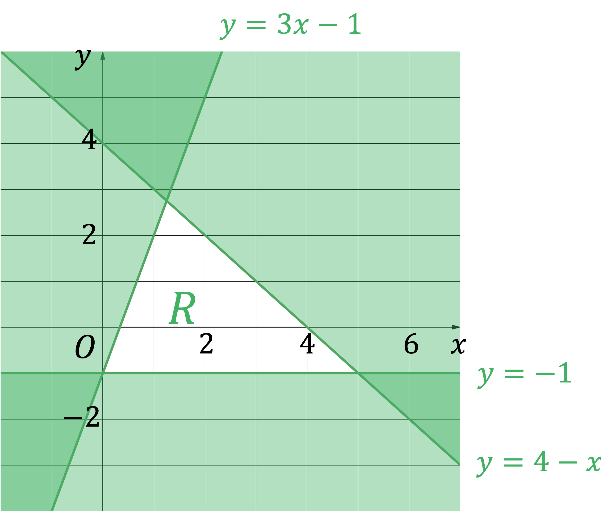

**correct region clearly indicated ****[1]**

## Q2 — medium — 3 marks · exam-questions

### 17() — 3 marks
> *Shade the **unwanted **regions for each line*

> $x>3$* is not plotted yet. Plot the line *$x=3$*on the grid and shade to the left of it*

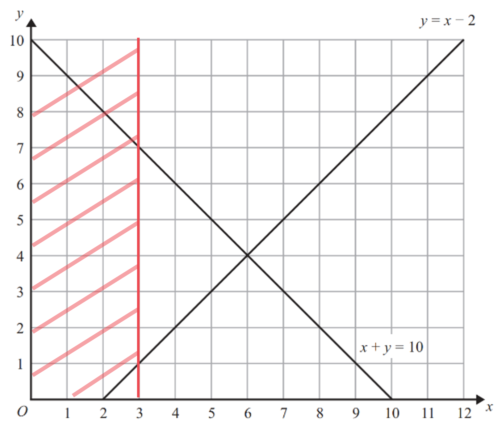

**"x > 3" plotted and shaded ****[1]**

> *For *$y>x-2$*, the **unwanted** (shaded) region is below the line. If unsure, pick a point- usually (0, 0)- to test which side of each line should be shaded*

`table row cell space y end cell greater than cell x minus 2 comma space open parentheses 0 comma space 0 close parentheses end cell row 0 greater than cell 0 minus 2 end cell row 0 greater than cell negative 2 space is space correct end cell end table`

> *This tells us *`open parentheses 0 comma space 0 close parentheses`* is on the side of the line that satisfies *$y>x-2$* so shade everything on the **other** side of the line *$y=x-2$

> *For *$x+y<10$*, rearrange to*

`table row cell space y end cell less than cell negative x plus 10 end cell end table`

> *Therefore the **unwanted** (shaded) region is above the line. If unsure, repeat the process above*

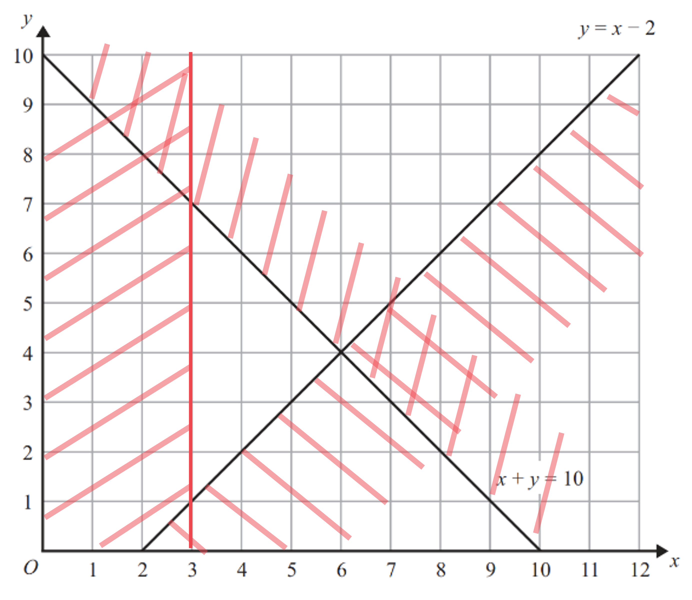

**correct area identified ****[1]**

> *We can now see that the permitted region is the triangle in the centre of the diagram*

> *All of the inequalities have < or >, so no integer values lie on the lines. Mark all the integer coordinates inside the permitted region*

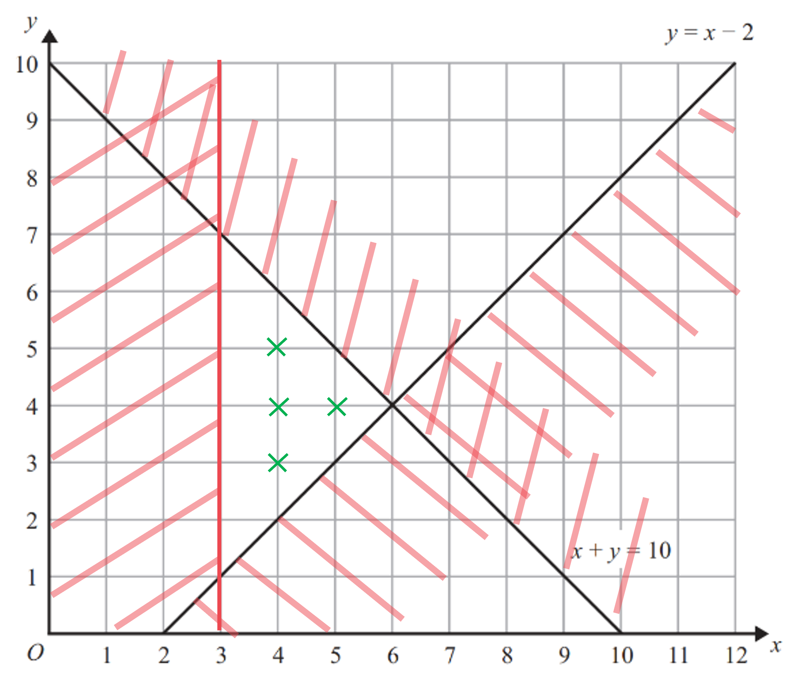

**all four correct points marked ****[1]**

## Q3 — easy — 3 marks · exam-questions

### 7() — 3 marks
> *The given equation, *$y=3x-2$* must be the diagonal line as horizontal lines are of the form "*$y=k$*" and vertical lines are of the form "*$x=k$*".*

> *The horizontal line intercepts the **y**-axis at 1 so its equation is*

$y=1$

> *The vertical line intercepts the **x**-axis at 3 so its equation is*

$x=3$

> *Now we need to consider the inequalities. *

> *All lines are drawn with solid lines (rather than dotted) so we only need consider ≥ and ≤.*

*The shading is below the line *$y=3x-2$* so the inequality required is *$y\leq3x+2$* *
*The shading is above the line *$y=1$* so the inequality is *$y\geq1$* *
*The shading is to the left of (so 'below') the line *$x=3$* s the inequality is *$x\leq3$

$y\leq3x+2$* ***[1]**
** **$x\leq3$** [1]**
** **$y\geq1$** [1]**

## Q4 — hard — 4 marks · exam-questions

### 10() — 4 marks
> *First we need to draw the lines for the 3 inequalities. To draw the lines, treat them as equations and use your knowledge of **linear graphs **y** = **mx** + **c**. **However all three inequalities are < or > so should be drawn with dotted lines*

> *For** *$x+y<4$*, draw *$x+y=4$*. Rearrange to *$y=mx+c$*...*

`table row cell space y end cell equals cell negative x plus 4 end cell end table`

> *... and plot a **dotted** **line** through (0, 4) with a gradient of −1*

> *For *$y>x-1$*, draw *$y=x-1$*, draw a **dotted** **line **through (0, −1) with a gradient of 1*

> *For *$y<3x$*, using *$y=3x$*, draw a **dotted** **line** through (0, 0) with a gradient of 3*

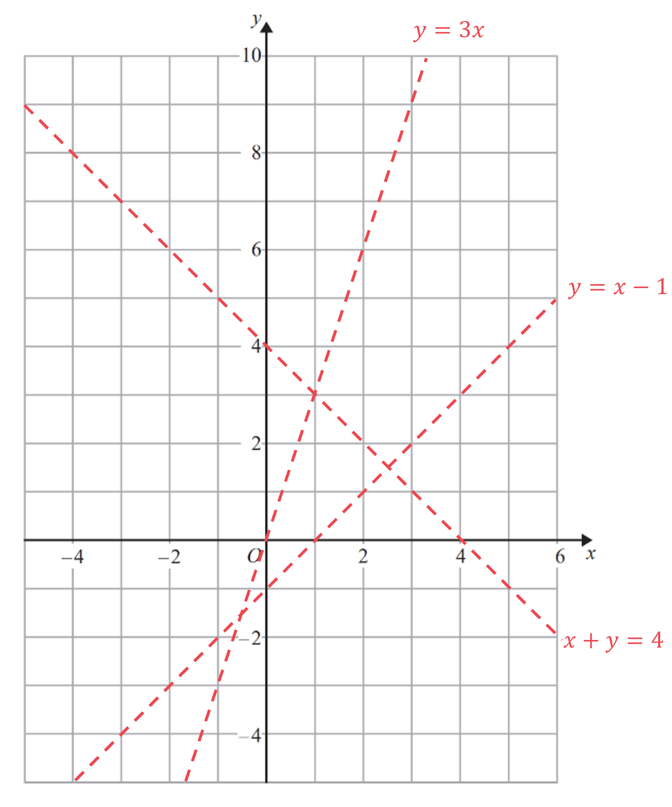

**one mark for each correctly drawn line ****[3]**

> *Shade the **unwanted **regions for each line*

> *For *$x+y<4$*, rearrange to*

$y<-x+4$

> *therefore the **unwanted** region is above the line, shade above the line. *

> *To check, pick an integer point that's not on the lines to test which side of each line should be shaded. For example, picking (0, 2);*

`table row cell space 0 plus 2 end cell less than cell 4 comma space true end cell end table`

> *(0, 2) is in the wanted region so shade everything on the **other** side of the line *$x+y=4$

> *For *$y>x-1$*, the **unwanted** region is below the line, shade below the line. To check, repeat the process of substituting (0, 2) into the inequality*

`table row 2 greater than cell 0 minus 1 comma space true end cell end table`

> *(0, 2) is in the wanted region so shade everything on the **other** side of the line *$y=x-1$

> *For *$y<3x$*, the **unwanted **region is above the line. To check,*

`table row 2 less than cell 3 cross times 0 end cell row 2 less than cell 0 comma space false end cell end table`

> *(0, 2) is in the **unwanted** region, so shade this side of the line *$y=\frac{3}{2}x$

> *Finally, don't forget to label the wanted region "R"!*

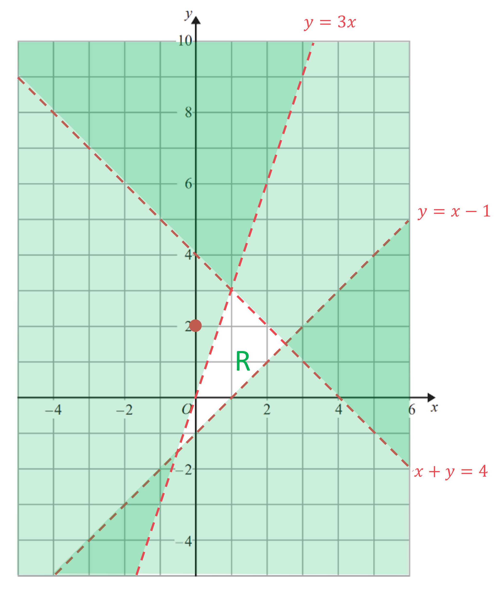

**correct region clearly indicated ****[1]**

## Q5 — medium — 4 marks · exam-questions

### 13() — 4 marks
> *For each line you need to find its equation, determine the type of inequality (with equals or without) and determine the direction of the inequality. For demonstration purposes, the lines are labelled Line 1, Line 2 and Line 3 below*

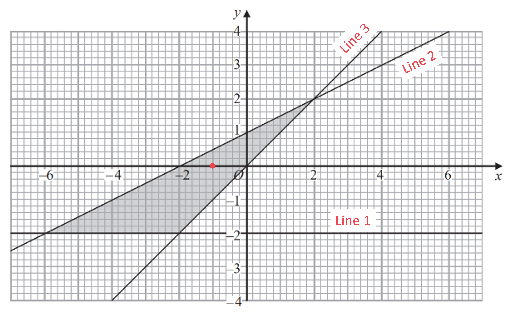

> *Line 1 is a straight horizontal line where all the **y **coordinates are equal to −2*

*The equation of Line 1 is *$y=-2$

**[1]**

> *The equation of a straight line is **y** = **mx** + **c** where **m **is the gradient and (0, **c**) is the **y**-intercept.*

> *Line 2 goes up 1 unit for every 2 units to the right so the gradient, *$\frac{\mathrm{rise}}{\mathrm{run}}=\frac{1}{2}$*. It crosses the **y**-axis at (0, 1).*

*The equation of Line 2 is *$y=\frac{1}{2}x+1$

**[1]**

> *Line 3 goes up 1 unit for every 1 unit to the right so the gradient, *$\frac{\mathrm{rise}}{\mathrm{run}}=1$*. It crosses the **y**-axis at (0, 0).*

*The equation of Line 3 is *$y=x$

**[1]**

> *All three lines are solid lines, so will take the sign*$\leq$* or *$\geq$

> *The shaded region is above Line 1 so*

$y\geq-2$

> *The shaded region is below Line 2 so*

$y\leq\frac{1}{2}x+1$

> *The shaded region is above Line 3 so*

$y\geqx$

> *Pick an integer point in the region **R** and substitute it into the equation of the lines to check the direction of the inequality. E.g. using the point (−1, 0) as in the diagram,*

$x=-1,y=0$*;*

*Line 1:  *$0\geq-2$* so *$y\geq-2$

*Line 2:  *$0\leq\frac{1}{2}\times0+1$*,  so *$y\leq\frac{1}{2}x+1$

*Line 3:  *$0\geq-1$*,  so *$y\geqx$

$y\geq-2,y\leq\frac{1}{2}x+1,y\geqx$ **[1]**

## Q6 — easy — 3 marks · exam-questions

### 15() — 3 marks
> *Start by drawing the lines of the equations.  Every one includes "equal to" so all will be drawn as solid lines.*

$x=4$* is a vertical line passing through 4 on the ***x***-axis* 
$y=-2$* is a horizontal line passing through -2 on the ***y***-axis* 
$y=x$* is a diagonal line passing through the origin, (1, 1), (2, 2), etc*

> *Now consider the inequalities remembering to shade the unwanted section.*

$x\leq4$* will be to the left of (below) 4 on the x-axis - so shade the part of the graph to the right *$x=4$

* *$y\geq-2$* will be above -2 on the y-axis - so shade the part of the graph below *$y=-2$

* *$y\leqx$* will be below the line - so shade the part above *$y=x$

> *Make your answer super clear by labelling the final region **R**, as instructed in the question.*

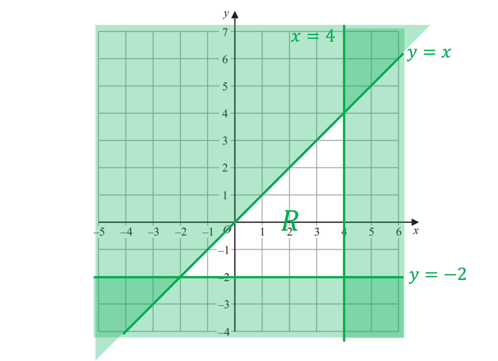

**The line y = x drawn correctly ****[1]** 
**The lines x = 4 and y = -2 drawn correctly ****[1]**
 **Region identified ****[1]**

## Q7 — hard — 3 marks · exam-questions

### 14() — 3 marks
> *First we need to draw the lines for the 3 inequalities. To draw the lines, treat them as equations and use your knowledge of **linear graphs **y** = **mx** + **c**. **However all three inequalities are < or > so should be drawn with **dotted lines*

> *For *$y>1$* simply draw *$y=1$*,  a horizontal dotted line through 1 on the **y-**axis*

> *For** *$x+y<5$*, draw *$x+y=5$*. Rearrange to *$y=mx+c$*...*

`table row cell space y end cell equals cell negative x plus 5 end cell end table`

> *... and plot a dotted line through (0, 5) with a gradient of −1*

> *For *$y>2x$*, draw *$y=2x$*, draw a dotted line** **through (0, 0) with a gradient of 2*

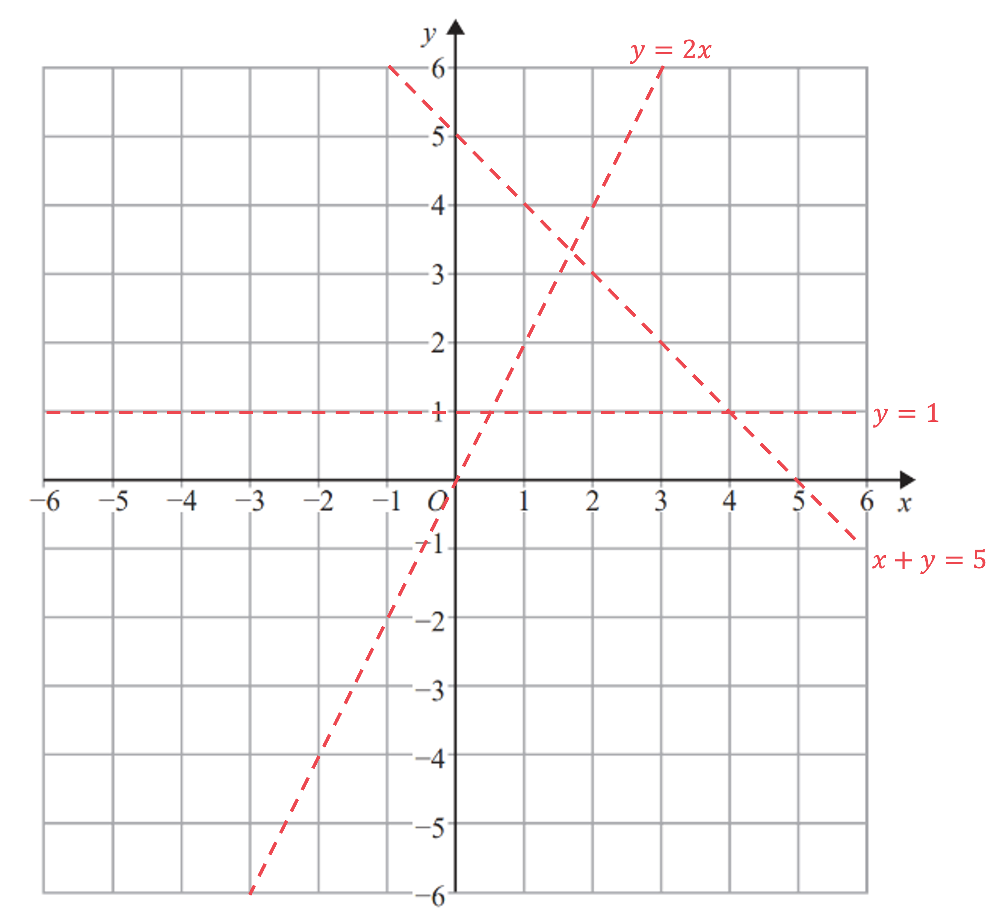

**one mark for each correctly drawn line ****[3]**

> *Shade the **unwanted **regions for each line*

> *For *$y>1$*, the **unwanted** region is **below** the line*

> *For *$x+y<5$*, the **unwanted** region is **above **the line*

> *For *$y>2x$*, the **unwanted** region is **below **the line*

> *To check either of the diagonal lines, pick a point, for example (1, 0). Substituting into *$y>2x$* we see that;*

`table row 0 greater than cell 2 cross times 1 comma space false end cell end table`

> *Therefore (1, 0) is in the **unwanted** region so shade everything on the (1, 0) side of the line *$y=2x$

> *Finally, don't forget to label the wanted region "R"!*

> * *

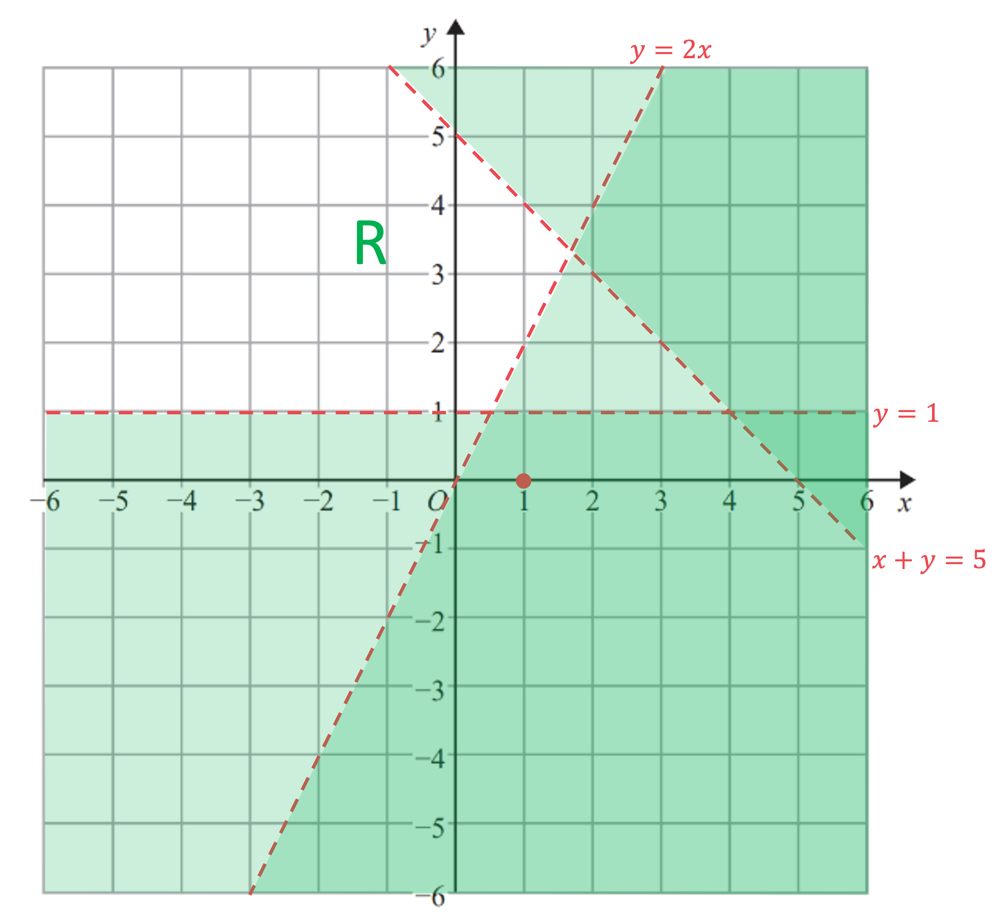

**correct region clearly indicated ****[1]**

## Q8 — medium — 3 marks · exam-questions

### 1() — 3 marks
> *First we need to draw the lines for the 3 inequalities. To draw the lines, treat them as equations and use your knowledge of **linear graphs **y** = **mx** + **c**.** All three inequalities are *$\leq$* or *$\geq$* so should be drawn with solid lines*

> *For** *$x\leq5$*, draw *$x=5$*, a vertical line through 5 on the **x**-axis*

> *For** *$y\geq3$*, draw *$y=3$*, a horizontal line through 3 on the **y**-axis*

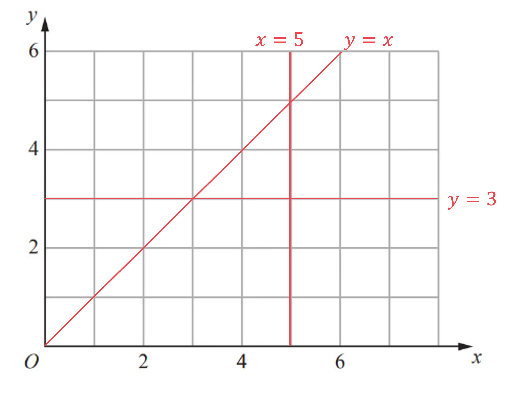

**x = 5 and y = 3 drawn ****[1]**

> *For *$y\leqx$*, draw *$y=x$*, a line through (0, 0) with a gradient of 1*

**y = x drawn ****[1]**

> *Shade the **unwanted **regions for each line*

> *For *$x\leq5$*, the **unwanted **region is right of the line, so simply shade right of the line *$y=5$

> *For *$y\geq3$*, the **unwanted **region is below the line, so shade below*

> *For *$y\leqx$*, the **unwanted **region is above the line, so shade above. To check this, pick an integer point (not on the line) and substitute into the inequality to test which side should be shaded. For example, picking (0, 1),*

`table row 1 less or equal than cell 0 comma space false end cell end table`

> *(0, 1) is in the **unwanted** region so shade everything on the (0, 1) side of the line *$y=x$

> *Finally, don't forget to label the wanted region "R"!*

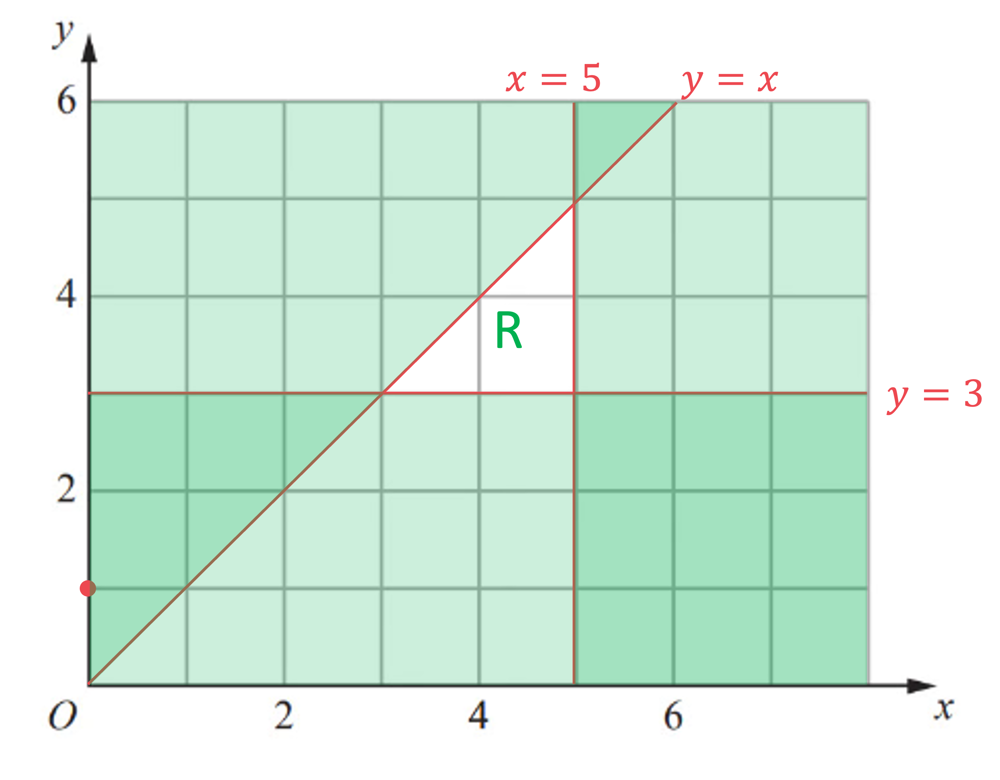

**correct region clearly indicated ****[1]**

## Q9 — easy — 2 marks · exam-questions

### 10((b)) — 2 marks
*R** is made from four straight lines - two horizontal, two vertical..* *The two horizontal lines will have equations of the form "*$y=k$*".* *The two vertical lines will have equations of the form "*$x=k$*".*

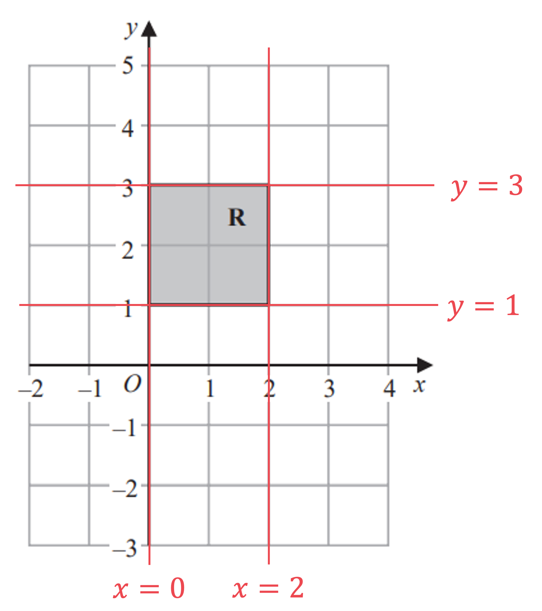

> *All four lines making **R** have been drawn with solid lines so "equal to" will be included in the inequality.*

**x*** needs to be between 0 and 2 *
**y*** needs to be between 1 and 3*

**R**** is defined by the inequalities **$0\leqx\leq2\mathrm{and}1\leqy\leq3$** **
**One mark for each inequality**** ****[2]**

**The inequalities may be split: **$x\geq0,x\leq2,y\geq1,y\leq3$

## Q10 — hard — 4 marks · exam-questions

### 18() — 4 marks
> *First we need to draw the lines for the 3 inequalities. To draw the lines, treat them as equations and use your knowledge of **linear graphs **y** = **mx** + **c**. **However all three inequalities are < or > so should be drawn with **dotted lines*

> *For** *$x+y<7$*, draw *$x+y=7$*. Rearrange to *$y=mx+c$*...*

`table row cell space y end cell equals cell negative x plus 7 end cell end table`

> *... and plot a dotted line through (0, 7) with a gradient of −1*

> *For *$y<2x$*, draw *$y=2x$*, draw a dotted line** **through (0, 0) with a gradient of 2*

> *For *$y>3$* simply draw *$y=1$*,  a horizontal dotted line through (0, 3)*

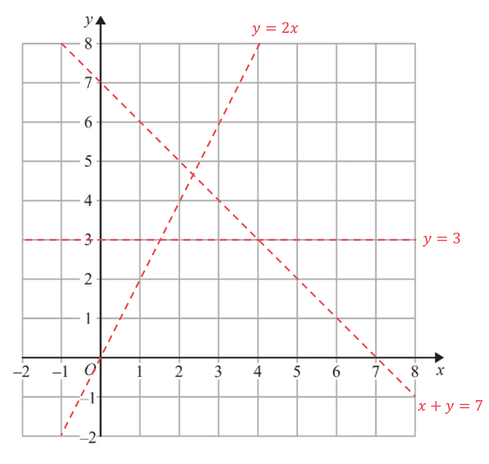

**one mark for each correctly drawn line ****[3]**

> *Shade the **unwanted **regions for each line*

> *For the diagonal lines, pick an integer point that's not on the lines to test which side of each line should be shaded. E.g. picking (1, 0)...*

> *For *$x+y<7$*, the **unwanted** region is above the line*

> *For *$y<2x$*, the **unwanted** region is above the line.*

> *To check either of these, pick a point such as (1, 0) and substitute into the inequality. For example, for *$y<2x$*;*

`table row 0 less than cell 2 cross times 1 comma space true end cell end table`

> *(1, 0) is in the wanted region so shade everything on the **other** side of the line *$y=2x$

> *For *$y>3$*, the **unwanted** region is below the line*

> *Finally, don't forget to label the wanted region "R"!*

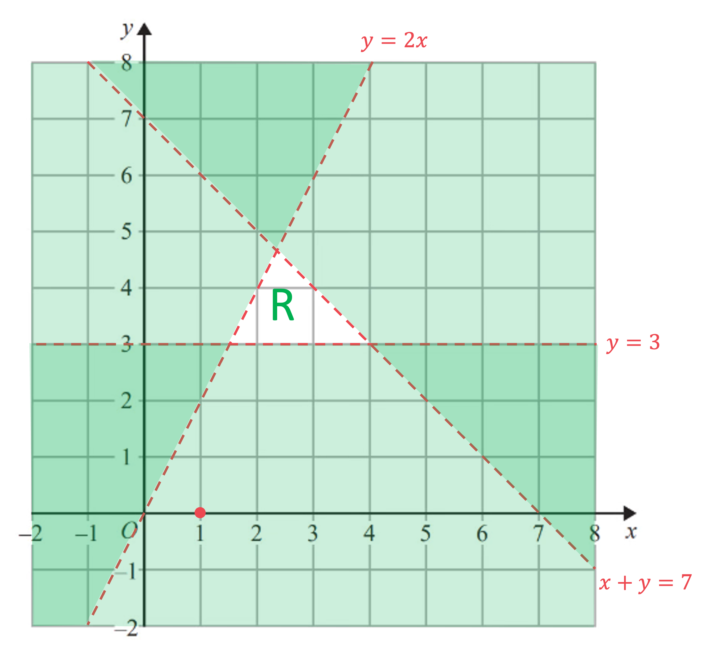

**correct region clearly indicated ****[1]**

## Q11 — medium — 4 marks · exam-questions

### 4((a)) — 3 marks
> *Consider the nature of each line from its equation.*

$x=1.5$* is a vertical line passing through 1.5 on the ***x***-axis *
$y=x$* is a diagonal line passing through the origin and (4, 4) (for example) *
$y=x+1$$x+y=6$ *is a diagonal line passing through (0, 1) and (8, 9)*

> *Label each line on the diagram.*

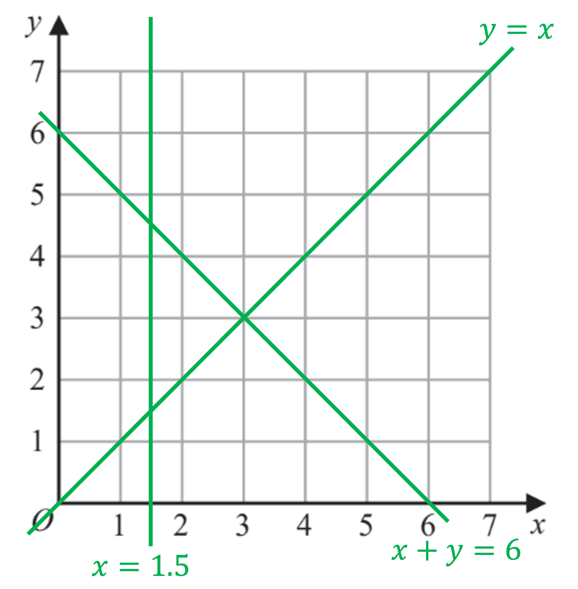

**One mark for each correct line**** [3]**

### 4((b)) — 1 marks
> *The lines for these inequalities have already been drawn in part (a). All include "equals to" so solid lines are also fine.*

> *Consider the nature of the inequalities to deduce the region needed, remembering to shade the unwanted section.*

$x\geq1.5$* will be to the right of ('above') its line - so shade the part of the graph to the left of ('below') it *

$y\geqx$* will be above its line - so shade the part of the graph below it *

$x+y\leq6$* **will be below its line - so shade the part of the graph above it*

> *Make your answer clear by labelling the final region **R**, as instructed in the question.*

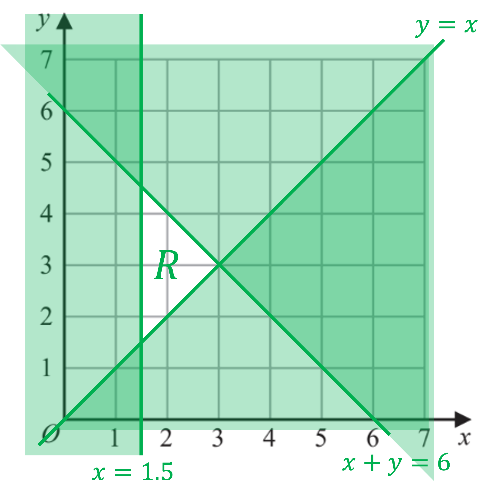

**[1]**

## Q12 — easy — 3 marks · exam-questions

### 12((b)) — 3 marks
> *There are a lot of inequalities in this question at first glance.  But two of the 'awkward' lines have already been drawn and two of them are the **x** and **y** axes! *

> *Start by drawing the lines of the equations.  Every one includes "equal to" so all will be drawn as solid lines.*

$x=0$* is the ***y***-axis*
* *$y=0$* is the ***x***-axis* 
$x+y=4$* is a diagonal line passing through (0, 4) and (4, 0)* 
*The other two lines are already drawn for us*

> *Now consider the inequalities remembering to shade the unwanted section.*

$x\geq0$* will be above the ***x***-axis - so shade the part of the graph below the ***x***-axis *
$y\geq0$* will be to the right of ('above') the ***y***-axis - so shade the part of the graph to the left of the ***y***-axis *
$x+y\geq4$* **will be above its line - so shade the part of the graph below it** *
$3y\leq2x+6$* will be below its line - so shade the part of the graph above it** *
$4x+3y\leq24$* will be below its line - so shade the part of the graph above it*

> *Make your answer clear by labelling the final region **R**, as instructed in the question.*

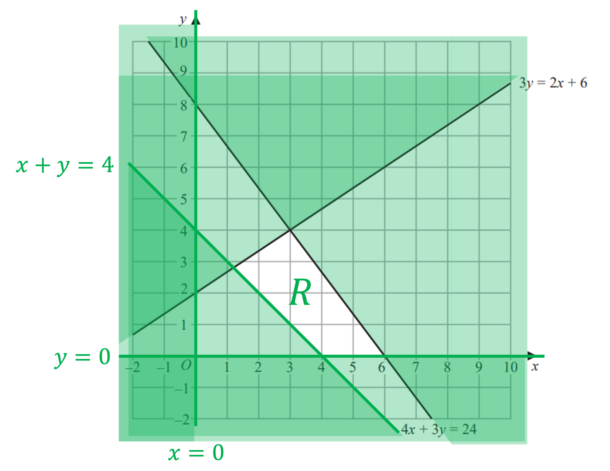

**For line x + y = 4 drawn ****[1]**
 **A region satisfying at least 3 of the inequalities ****[1]** 
**Fully correct region ****[1]**

## Q13 — hard — 3 marks · exam-questions

### 13() — 3 marks
> *Method 1*

> *All three lines are solid lines so take ≤ or ≥ (rather than < or >).*

> *For each line, first find its equation. One of them has already been given in the diagram: *$x+2y=8$*.*

> *The shaded region is below this line so the inequality is;*

$x+2y\leq8$* ***[1]**

> *We then have a vertical line and another diagonal line. Vertical lines are of the form "*$x=k$*" and in this case it passes through -1 on the **x**-axis so the equation is;*

$x=-1$

> *And the shaded area is to the right of the line so the inequality is;*

$x\geq-1$* ***[1]**

> *Diagonal lines are of the form "*$y=mx+c$*" where **m** is the gradient of the line and **c** is the **y**-intercept. We can find the gradient of the unlabelled diagonal line using *$\frac{\mathrm{rise}}{\mathrm{run}}=\frac{y_{1}-y_{2}}{x_{1}-x_{2}}$*, for example between (2, 2) and (0, 0).*

*gradient = *$\frac{\mathrm{rise}}{\mathrm{run}}=\frac{2-0}{2-0}=1$

> *Therefore the line takes the form *$y=x+c$*. And the y-intercept is 0 so the equation of the unlabelled diagonal line is;*

$y=x$

> *The shaded region is above this line so the inequality is;*

$y\geqx$** ****[1]**

> *Method 2*

> *For each first find its equation, one of them has already been given in the diagram - *$x+2y=8$*. *

> *We then have a vertical line and another diagonal line.*

> * Vertical lines are of the form "*$x=k$*". *

> *Diagonal lines are of the form "*`y minus y subscript 1 equals m open parentheses x plus x subscript 1 close parentheses`*" where **m** is the gradient of the line and (**x**1**, **y**1**) is a point the line passes through.  To find the gradient we will need a second point the line passes through.*

*The vertical lines passes through -1 on the ***x***-axis so has equation *$x=-1$* *

*The (unlablelled) diagonal line passes through (0, 0) and (2, 2) and has gradient *$\frac{\mathrm{rise}}{\mathrm{run}}=\frac{2-0}{2-0}=1$*, so has equation *`y minus 0 equals 1 open parentheses x minus 0 close parentheses comma space space y equals x`

> *Now consider the inequalities for all three lines, including the given one.*

*For *$x=-1$* the region shaded is on the right of (above) its line, so the inequality is *$x\geq-1$* *

*For *$y=x$* the region shaded is above the line, so the inequlaity is *$y\geqx$* *

*For *$x+2y=8$* the region shaded is below the line, so the inequality is *$x+2y\leq8$

> *Bring everything together for the final answer.*

**Final answer:** **The shaded region is defined by the inequalities **$x\geq-1,y\geqx\mathrm{and}x+2y\leq8$** **

**One mark for each correct inequality**** [3]**

## Q14 — medium — 3 marks · exam-questions

### 12((b)) — 3 marks
> *There are a lot of inequalities in this question at first glance.  But two of the 'awkward' lines have already been drawn and two of them are the **x** and **y** axes! *

> *Start by drawing the lines of the equations.  Every one includes "equal to" so all will be drawn as solid lines.*

$x=0$* is the ***y***-axis*

* *$y=0$* is the ***x***-axis*

$x+y=4$* is a diagonal line passing through (0, 4) and (4, 0)*

*The other two lines are already drawn for us*

> *Now consider the inequalities remembering to shade the unwanted section.*

$x\geq0$* will be above the ***x***-axis - so shade the part of the graph below the ***x***-axis *
$y\geq0$* will be to the right of ('above') the ***y***-axis - so shade the part of the graph to the left of the ***y***-axis *
$x+y\geq4$* **will be above its line - so shade the part of the graph below it*
* *$3y\leq2x+6$* will be below its line - so shade the part of the graph above it*
* *$4x+3y\leq24$* will be below its line - so shade the part of the graph above it*

> *Make your answer clear by labelling the final region **R**, as instructed in the question.*

**For line x + y = 4 drawn ****[1]** 
**A region satisfying at least 3 of the inequalities ****[1]** 
**Fully correct region ****[1]**

## Q15 — easy — 3 marks · exam-questions

### 7((b)) — 3 marks
> *Start by drawing the lines of the equations.  Every one includes "equal to" so all will be drawn as solid lines.*

$x=6$* is a vertical line passing through 6 on the ***x***-axis*
* *$y=2$* is a horizontal line passing through 2 on the ***y***-axis*
 $y=x+1$* is a diagonal line passing through (0, 1) and (8, 9)*

> *Now consider the inequalities remembering to shade the unwanted section.*

$x\leq6$* will be to the left of ('below') its line - so shade the part of the graph to the right of ('above') it *
$y\geq2$* will be above its line - so shade the part of the graph below it *
$y\leqx+1$* **will be below its line - so shade the part of the graph above it*

> *Make your answer clear by labelling the final region **R**, as instructed in the question.*

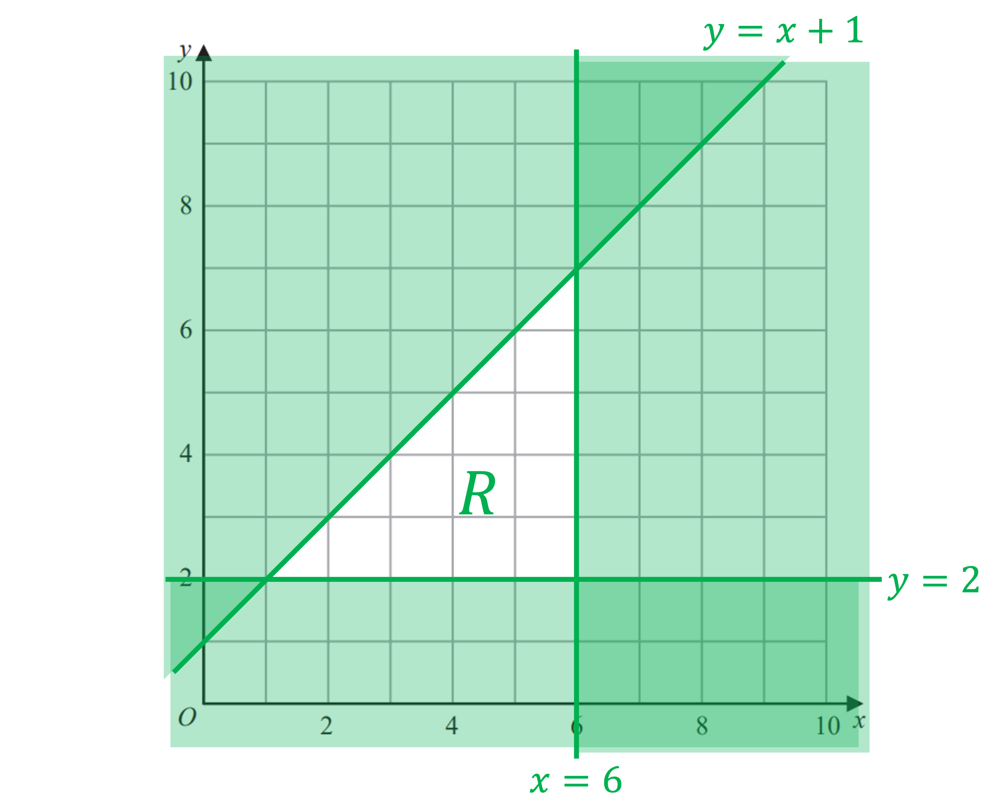

**For lines x = 6 and y = 2 drawn ****[1]**
 **For line y = x + 1 drawn  ****[1]** 
**Fully correct region ****[1]**

## Q16 — hard — 3 marks · exam-questions

### 13() — 3 marks
> *All three lines are solid lines so take ≤ or ≥ (rather than < or >).*

> *For each line, first find its equation. One of them has already been given in the diagram: *$y=2x+2$*.*

> *The shaded region is below this line so the inequality is;*

$y\leq2x+2$* ***[1]**

> *We then have a horizontal line and another diagonal line. Horizontal lines are of the form "*$y=k$*" and in this case it passes through -3 on the **y**-axis so the equation is;*

$y=-3$

> *And the shaded area is above the line so the inequality is;*

$y\geq-3$** ****[1]**

> *Diagonal lines are of the form "*$y=mx+c$*" where **m** is the gradient of the line and **c** is the **y**-intercept. We can find the gradient of the unlabelled diagonal line using *$\frac{\mathrm{rise}}{\mathrm{run}}=\frac{y_{1}-y_{2}}{x_{1}-x_{2}}$*, for example between (0, 1) and (1, 0).*

*gradient = *$\frac{\mathrm{rise}}{\mathrm{run}}=\frac{1-0}{0-1}=\frac{1}{-1}=-1$

> *Therefore the line takes the form *$y=-x+c$*. And the y-intercept is 1 so the equation of the unlabelled diagonal line is;*

$y=-x+1$

> *The shaded region is below this line so the inequality is;*

$y\leq-x+1$** ****[1]**

**Equivalent forms such as **$x+y\leq1$** are equally valid**

## Q17 — medium — 2 marks · exam-questions

### 11((b)) — 2 marks
> *All three lines are solid lines so take ≤ or ≥ (rather than < or >).*

> *Starting with *$y=6$*, the shaded region is below the line so*

$y\leq6$

> *Taking *$y=x-3$*, the shaded region is above the line so*

$y\geqx-3$

> *Taking *$x+y=5$*, if unsure we can rearrange to*$y=-x+5$*. The the shaded region is above the line so*

$y\geq-x+5$

> *(We can leave this inequality in this form, or rearrange to *$x+y\geq5$*)*

**Final answer:** **Answer: **$y\leq6,y\geqx-3,y\geq-x+5$

**two correct inequalities**** [1]** 
**fully correct answer**** [1]**

**Equivalent versions of the above inequalities are fine. For example, "**$x+y\geq5$**" instead of "**$y\geq-x+5$**"**

## Q18 — easy — 1 marks · exam-questions

### 19() — 1 marks
> *For the line *$x=1$*, the region that is shaded is to the left of the line, so the area shaded is *$x<1$*.*

> *For the line ,*$y=-3$* the region that is shaded is above the line, so the area shaded is *$y>-3$*.*

** ****The correct answer is option 2, **$x<1$** ****and**** **$y>-3$** ****[1]**

## Q19 — hard — 3 marks · exam-questions

### 10() — 3 marks
> *All three lines are solid lines so take ≤ or ≥ (rather than < or >).*

> *For each line, first find its equation. One of them has already been given in the diagram: *$y=\frac{1}{3}x-2$*.*

> *The shaded region is above this line so the inequality is;*

$y\geq\frac{1}{3}x-2$* ***[1]**

> *We then have a vertical line and another diagonal line. Vertical lines are of the form "*$x=k$*" and in this case it passes through -1 on the **x**-axis so the equation is;*

$x=-1$

> *And the shaded area is to the right of the line so the inequality is;*

$x\geq-1$* ***[1]**

> *Diagonal lines are of the form "*$y=mx+c$*" where **m** is the gradient of the line and **c** is the **y**-intercept. We can find the gradient of the unlabelled diagonal line using *$\frac{\mathrm{rise}}{\mathrm{run}}=\frac{y_{1}-y_{2}}{x_{1}-x_{2}}$*, for example between (4, 0) and (0, 4).*

*gradient = *$\frac{\mathrm{rise}}{\mathrm{run}}=\frac{0-4}{4-0}=\frac{-4}{4}=-1$

> *Therefore the line takes the form *$y=-x+c$*. And the y-intercept is 4 so the equation of the unlabelled diagonal line is;*

$y=-x+4$

> *The shaded region is below this line so the inequality is;*

$y\leq-x+4$** ****[1]**

** Equivalent forms such as **$x+y\leq4$** are equally valid**

## Q20 — medium — 3 marks · exam-questions

### 18() — 3 marks
> *Begin by drawing the lines for the 3 inequalities.*

> *To draw the lines, treat them as equations and use your knowledge of **linear graphs *$y=mx+c$*.*

> *The inequalities that are *$\leq$* or *$\geq$* should be drawn with solid lines and the inequality that is *$>$* should be drawn with a dashed line.*

> *For** *$x\leq5$*, draw *$x=5$*, a vertical, solid line through 5 on the **x**-axis.*

> *For** *$y\leq4$*, draw *$y=4$*, a horizontal solid line through 4 on the **y**-axis.*

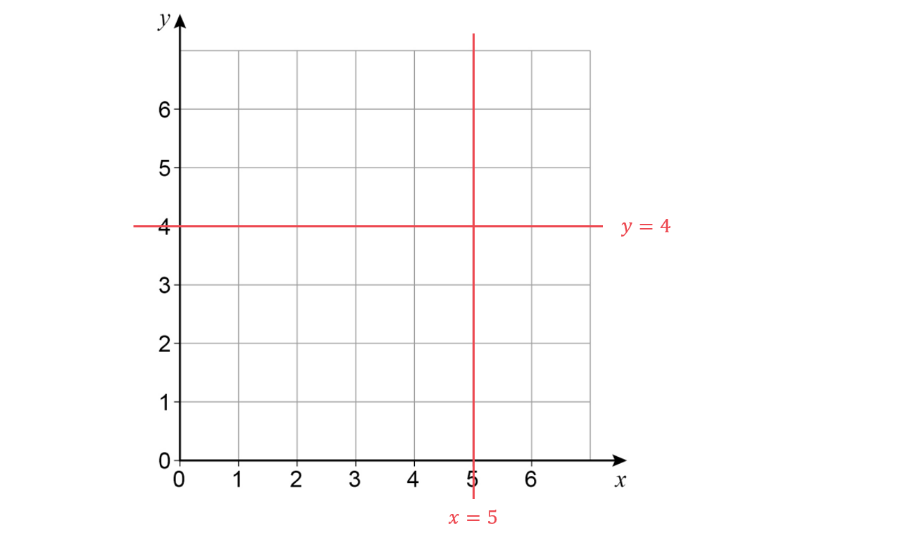

**x = 5 and y = 4 drawn ****[1]**

> *For *$x+y>6$*, the line with equation *$x+y=6$*  needs to be drawn. This is easiest to do by substituting in *$x=0$* and *$y=0$* separately and finding the coordinates where the line crosses the axes.*

`table row cell For space x space end cell equals cell space 0 colon space space space 0 space plus space y space equals space 6 space space space space space rightwards double arrow space space space y space equals space 6 end cell row cell For space y space end cell equals cell space 0 colon space space space 6 space plus space 0 space equals space 6 space space space space space rightwards double arrow space space space x space equals space 6 end cell end table`

> *Plot the points (0, 6) and (6, 0) and join them up. with a dashed line.*

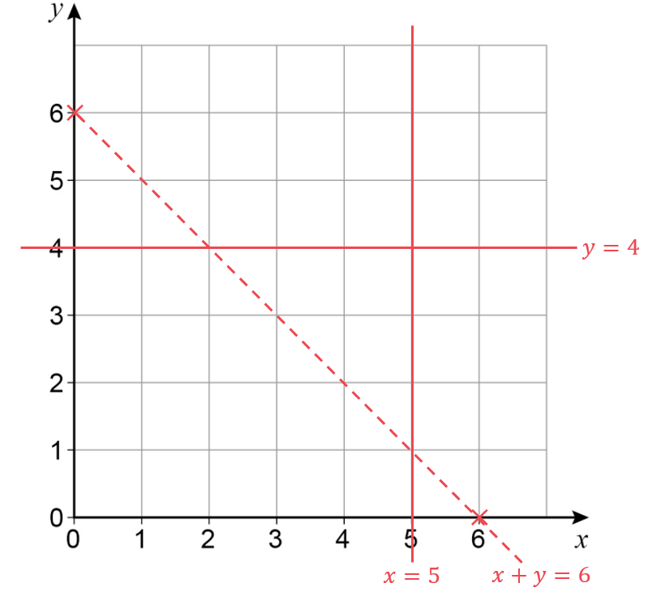

> * *

**y = x drawn ****[1]**

> *Shade the **unwanted **regions for each line.*

> *For *$x\leq5$*, the **unwanted **region is right of the line, so simply shade right of the line *$y=5$*.*

> *For *$y\leq4$*, the **unwanted **region is above the line, so shade above. *

> *For *$x+y>6$* it is less obvious which side is the wanted or unwanted region, so pick a point with integer coordinates either side of the line and substitute into the inequality to test which side should be shaded.*

> *For example, picking (4, 3),*

`table row cell 2 space plus space 3 space end cell greater than cell space 6 comma space false end cell end table`

> *(2, 3) is in the **unwanted** region so shade everything on the (2, 3) side of the line *$x+y=6$*.*

> *Finally, don't forget to label the wanted region "R"!*

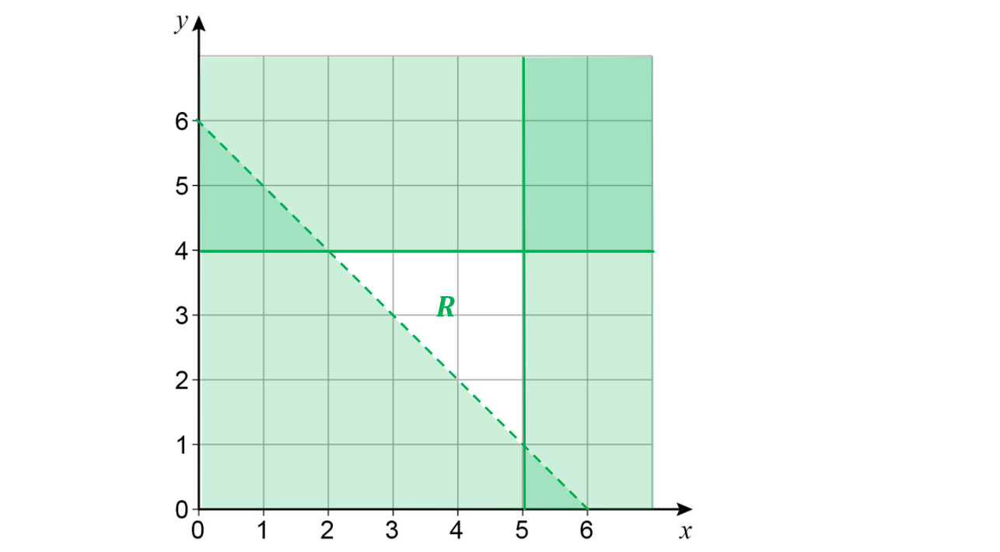

* ***Correct region clearly indicated ****[1]**

## Q21 — easy — 2 marks · exam-questions

### 23() — 2 marks
> *Begin by checking that the lines for the 3 inequalities are correctly drawn.*

> *The inequalities that are *$\leq$* or *$\geq$* should be drawn with solid lines and the inequalities that are *$<$* or *$>$* should be drawn with dashed lines.*

**For**** **$x<3$**, the line should be a dashed line**** ****[1]**

> *The other lines are correct.*

> *Next, check that the region is marked in the correct place. The easiest method to do this is to choose a point within the region marked R with integer coordinates and substitute into each of the inequalities to test which side should be shaded.*

> *For example, picking the point with coordinates (1, 1), which is in the region R:*

`table row cell 1 space end cell less or equal than cell space 1 space plus space 2 comma space true end cell row cell 1 space end cell greater than cell space 3 space minus space 1 comma space false end cell row cell 1 space end cell less than cell space 3 space true end cell end table`

> *The point (1, 1) is in the **unwanted** region for the inequality *$y>3-x$* so R should be marked on the other side of this line.*

**R is marked on the wrong side of the line **$y=3-x$** ****[1]**

## Q22 — hard — 6 marks · exam-questions

### 18() — 6 marks
> *Starting with  *$y>3$*, draw a horizontal **dotted** line through 3 on the **y-**axis. The required region is above the line; shade the **unwanted **region, **below the** line.*

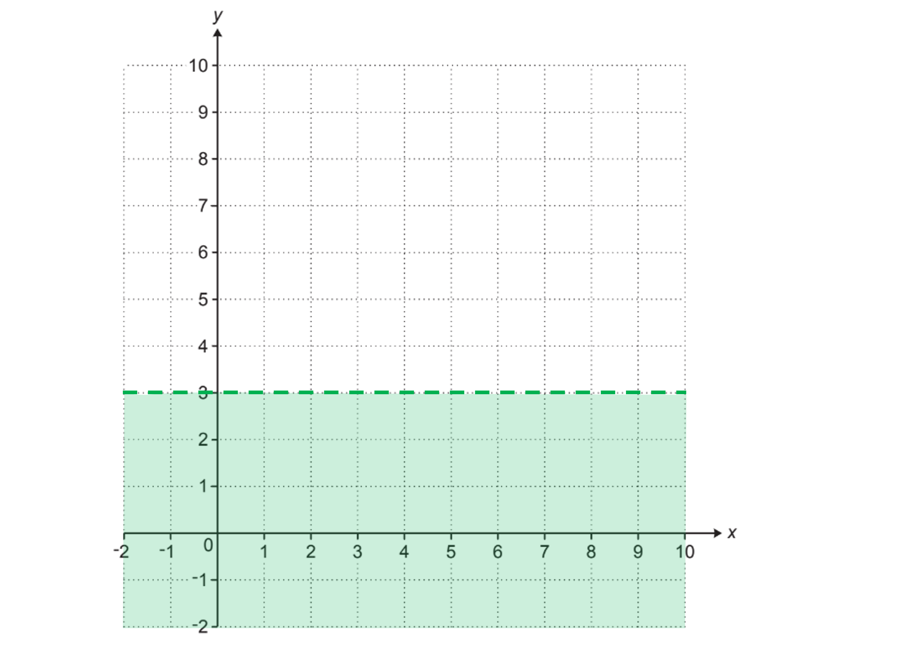

**dotted line drawn at y = 3 ****[1] **

**correct side shaded ****[1]**

> *For *$y\geqx$* draw *$y=x$* using your knowledge of **drawing linear graphs**; a line through (0, 0) with gradient 1. Draw as a solid line because of '≤'.*

> $y\geqx$*is everything above the line so shade the **unwanted** region **below the line**.*

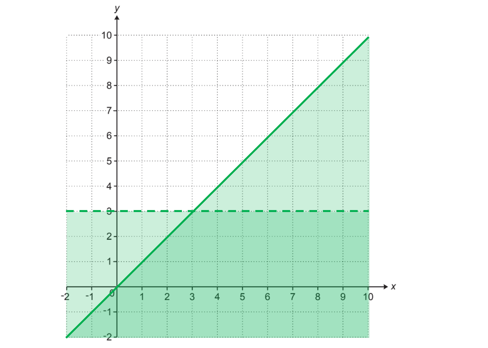

**y = x correctly drawn ****[1] **
**correct side shaded ****[1]**

> *For *$x+y\leq9$* you may prefer to rearrange to;*

> $y\leq-x+9$*.*

> *Draw *$y=-x+9$* using your knowledge of **drawing linear graphs**; a line through (0, 9) with gradient -1. Draw as a solid line because of '≤'.*

> $y\leq-x+9$* is everything below the line so shade the **unwanted** region **above the line**.*

> *The required region is revealed- don't forget to label it R!*

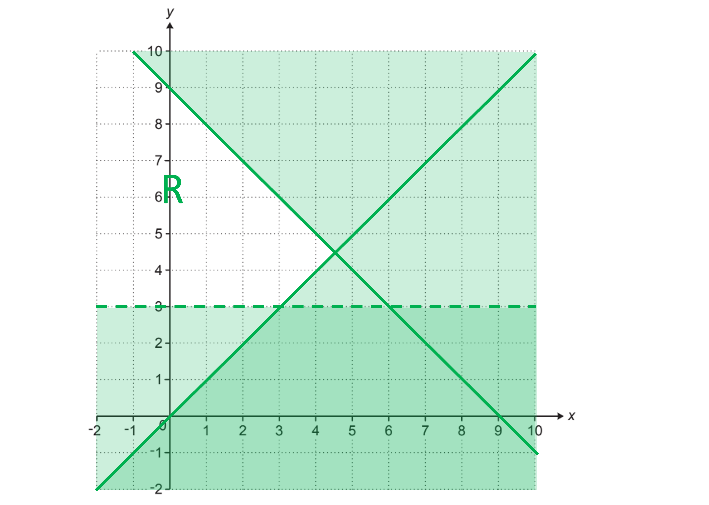

**x + y = 9 correctly drawn ****[1] **
**correct side shaded ****[1]**

## Q23 — medium — 6 marks · exam-questions

### 18() — 6 marks
> *For *$3y+6x\geq13$*, the line is drawn for you but you need to shade the **unwanted** region. If you like rearrange to *$3y\geq-6x+13$*. This is the region above the line is the so shade **below the line**.*

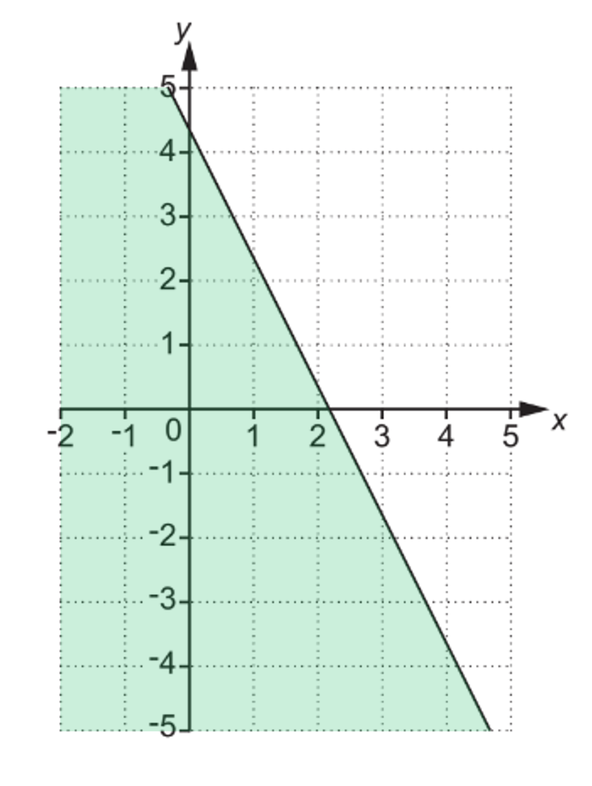

**shading correct side of line ****[1]**

> *You need to draw the line for the inequalities *$y\leqx-2$* and *$x>3$*.*

> *Starting with *$x>3$* (just because it's the quickest and easiest), draw a **dotted** (because '>' not '≥') vertical line at *$x=3$*. Shade the **unwanted** region; everything **left of the line**.*

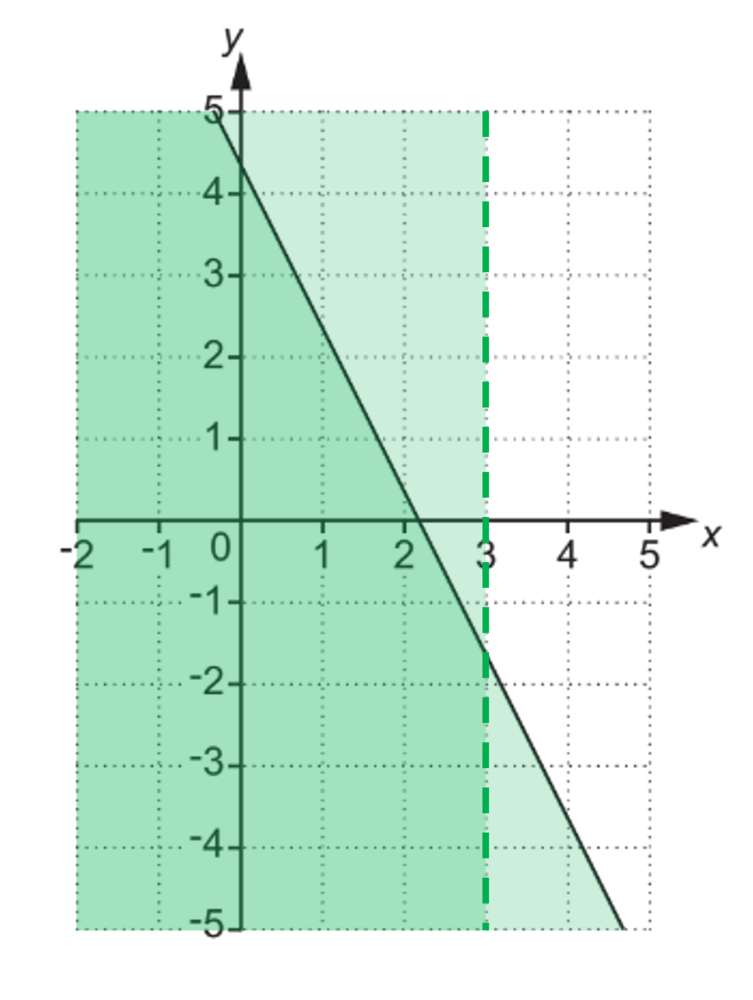

**x = 3  drawn in correct place ****[1]**** **
**x = 3  drawn as dotted line ****[1]**** **
**shading correct side of line ****[1]**

> *For *$y\leqx-2$*, draw *$y=x-2$* using your knowledge of **drawing linear graphs**; a line through -2 on the **y**-axis with gradient 1. Draw as a solid line because of '≤'.*

> $y\leqx-2$* is everything below the line so shade the **unwanted** region **above the line**.*

> *The required region is revealed- don't forget to label it R!*

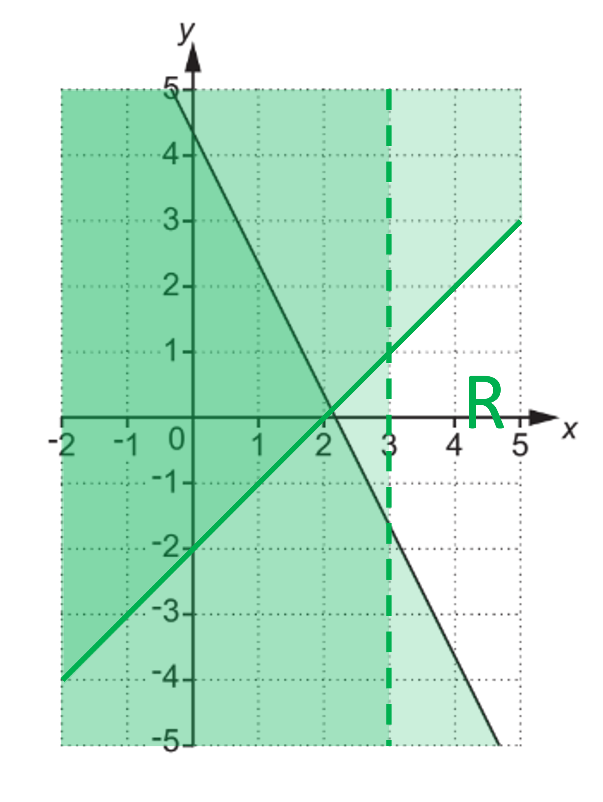

**y = x − 2 correctly drawn ****[1] **
**correct side shaded ****[1]**

## Q24 — easy — 2 marks · exam-questions

### 11() — 2 marks
> *Use the coordinates given to help you find the equations of the straight lines that the shape is enclosed by. *

*The vertical line connecting the coordinates (-1, 1) and (-1, 4) must be the line *$x=-1$*.*

*The horizontal line through the coordinate (-1, 1)  must be the line *$y=1$*.*

> *The horizontal line through the coordinate (-1, 4)  must be the line *$y=4$*.*

*The line of symmetry is *$x=2$* so the midpoint of the lower horizontal line is (2,1) and therefore the lower right coordinate of the rectangle is (5, 1). *

> *The vertical line bounding the rectangle of the right must be the line *$x=5$*.*

*The four coordinates of the rectangle are (-1, 1), (-1, 4), (5, 1) and (5, 4)*
* The rectangle is bounded by the lines with equations *$x=-1,x=5,y=1,y=4$

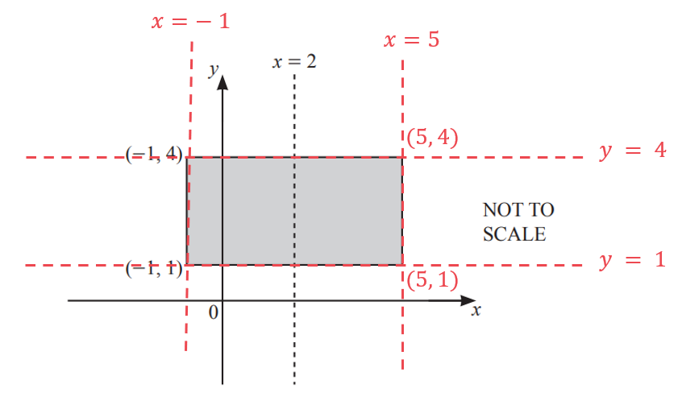

*The shaded region is defined by the inequalities *$-1\leqx\leq5$* and *$1\leqy\leq4$*.*

$a=-1\,b=5\,c=1\,d=4$

**Two or three correct answers ****[1] **
**All four correct answers ****[1] **

**Use the notation given in the question to make sure your answers are given in the correct form.**

## Q25 — hard — 11 marks · exam-questions

### 18((a)) — 4 marks
> *Firstly note that both lines are solid, so the inequalities take ≤ or ≥. Find the equations of both lines.*

> *The horizontal line passes through 2 on the **y-**axis so is*

$y=2$

> *Everything below the line is in Region A. So Region A is*

$y\leq2$* ***[1]**

> *The diagonal line is trickier. First, determine its gradient.*

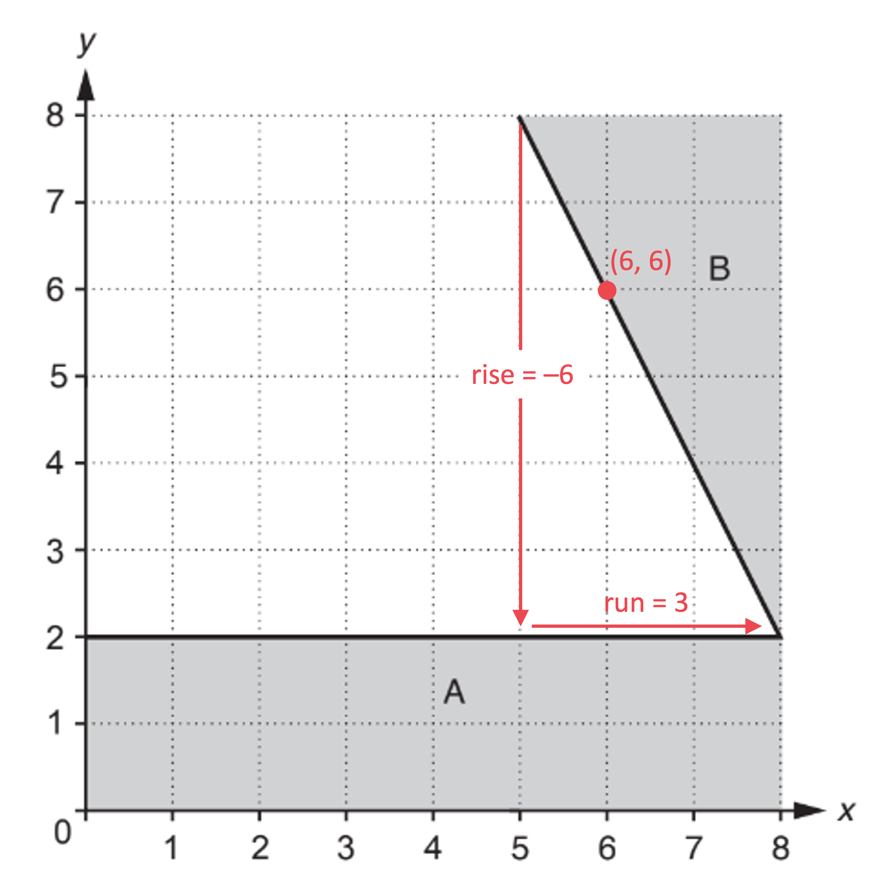

$m=\frac{\mathrm{rise}}{\mathrm{run}}=-\frac{6}{3}=-2$

**[1]**

> *Unfortunately we cannot see where the line crosses the **y**-axis so pick a point, e.g. (6, 6) marked above, and substitute into *$y=-2x+c$*.*

`6 equals negative 2 open parentheses 6 close parentheses plus c`

**[1]**

> *Solve for **c.*

$6=-12+c\,18=c$

> *The equation of the diagonal line is*

$y=-2x+18$

> *Region B is above the line so the wanted region is *$y\geq-2x+18$*. To check this, substitute the point (0, 0) (or any other point not on the line) into the inequality. (0, 0) is not in region B, so if we are correct that the inequality is *$y\geq-2x+18$*, (0, 0) will not make the inequality true.*

`0 greater or equal than negative 2 open parentheses 0 close parentheses plus 18 comma space false` *(0, 0) is not in* $y\geq-2x+18$

$y\geq-2x+18$ **[1]**

### 18((b)) — 2 marks
> *The inequality *$y\geq6$* takes a solid line. Draw the solid line *$y=6$*; a horizontal line through 6 on the **y**-axis.*

> *We are asked to shade the region given by *$y\geq6$*, so shade above the line.*

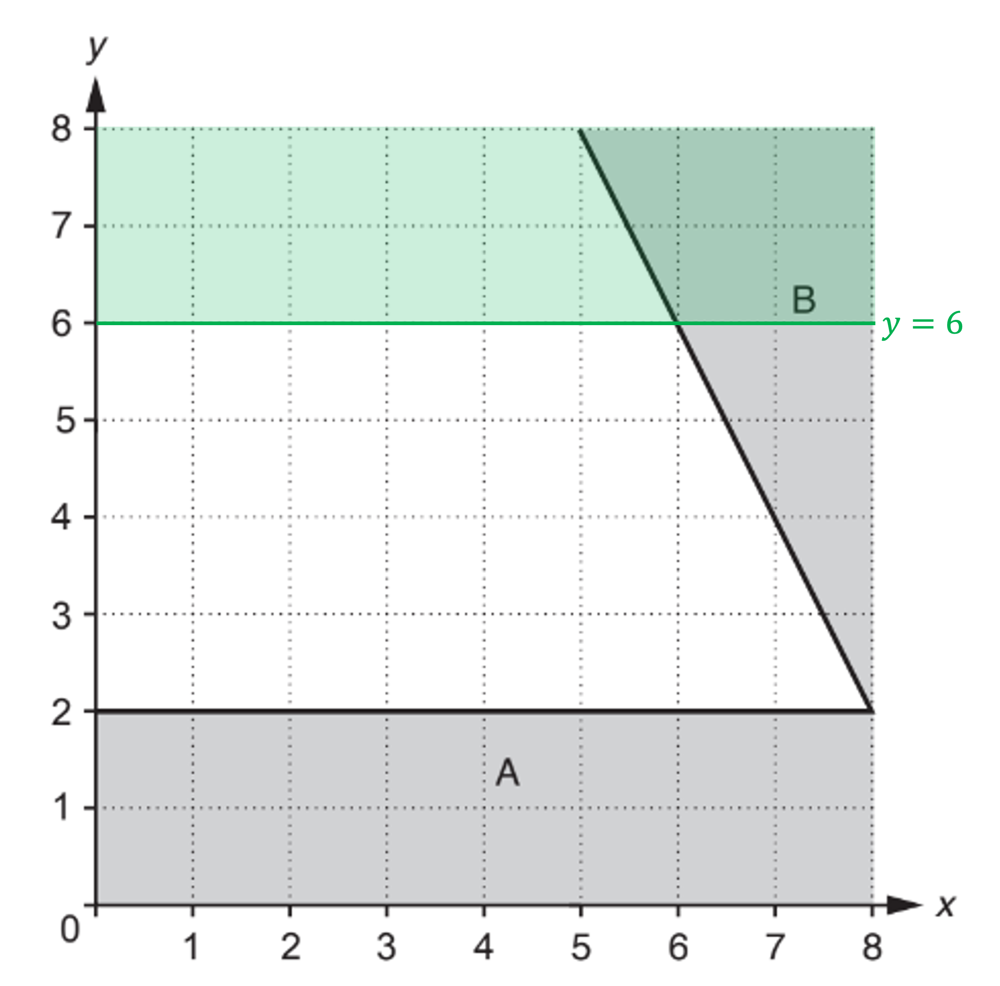

**y = 6 drawn as solid line ****[1]**** **
**correct region shaded**** [1]**

### 18((c)) — 5 marks
> *First find the area that is currently unshaded. It is a trapezium and the area of a trapezium is *`1 half open parentheses a plus b close parentheses h`*.*

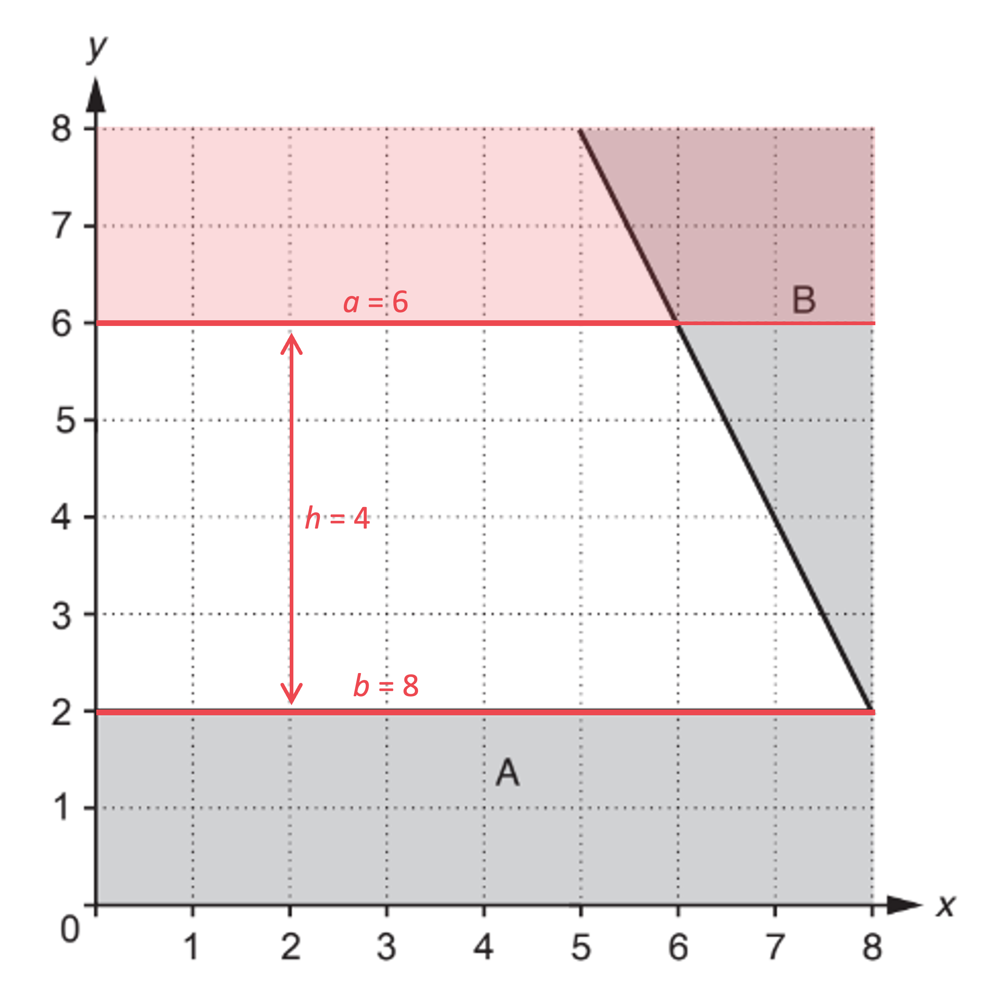

`Area equals 1 half open parentheses 6 plus 8 close parentheses cross times 4 equals 28`

**[1]**

> *So we now know we need to make this area smaller. From the equation of the line **y **= **kx** + 2, we know the line passes through (0, 2) and is a straight line. We can infer that it will have a positive gradient and intersect the line **y** = 6, the top of the trapezium.  *

> *So we need to find the value of **a**, the top width of the trapezium, that gives an area of 23.*

`23 equals 1 half open parentheses a plus 8 close parentheses cross times 4`

**[1]**

`table row 23 equals cell 2 open parentheses a plus 8 close parentheses end cell row 23 equals cell 2 a plus 16 end cell row 7 equals cell 2 a end cell row a equals cell 3.5 end cell end table`

**[1]**

> *We can sketch the new inequality on the grid.*

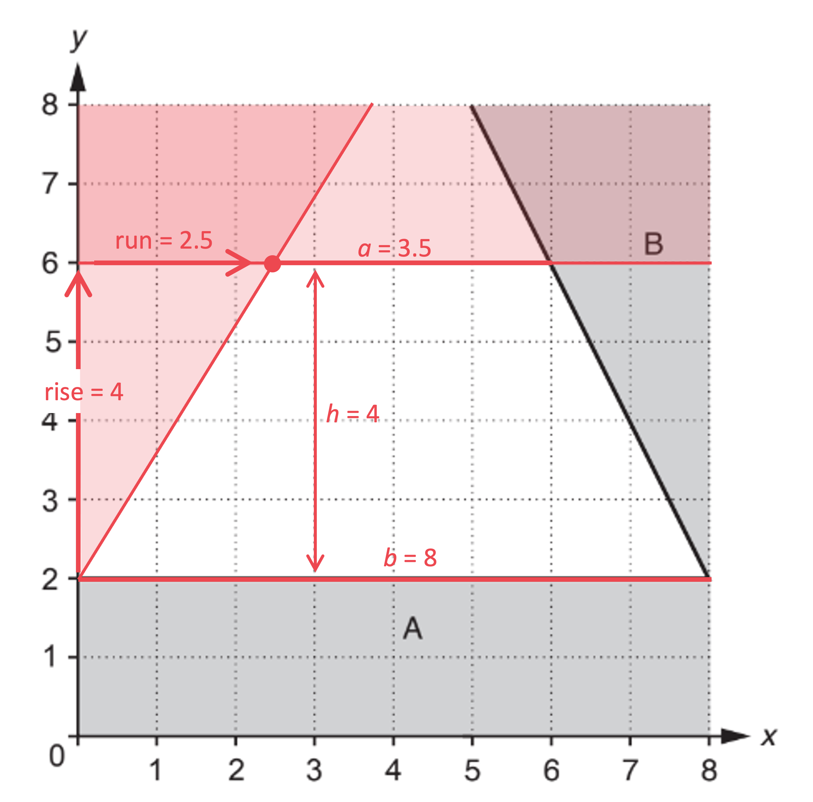

> *From the diagram we can determine **k**, which is the gradient of the new line.*

$k=\frac{\mathrm{rise}}{\mathrm{run}}=\frac{4}{2.5}$

**[1]**

$k=1.6$* ***[1]**

## Q26 — medium — 5 marks · exam-questions

### 17() — 5 marks
> *You need to draw the line for the inequality *$y<4-2x$*. Draw *$y=4-2x$* using your knowledge of **drawing linear graphs**, However note that the sign "<" takes a dotted line.*

> *Draw a **dotted** straight line through 4 on the **y**-axis with a gradient of −2.*

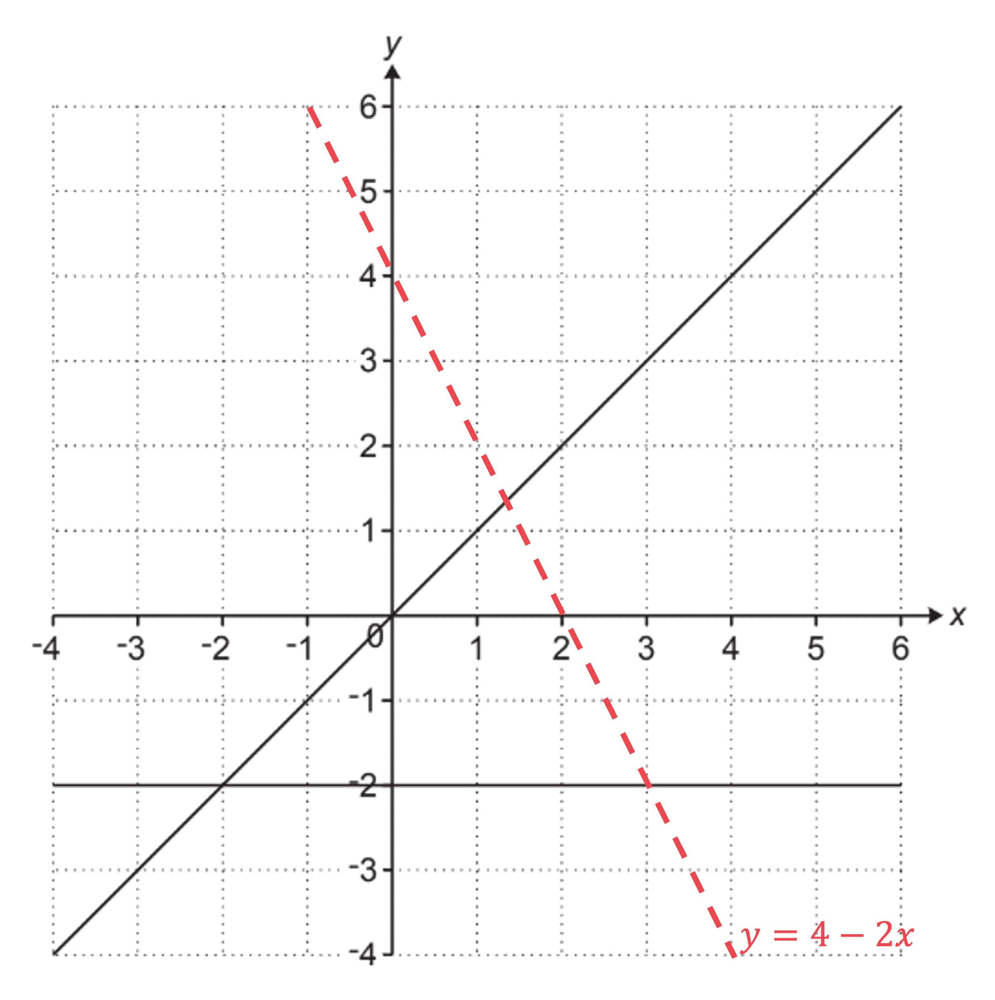

**y = 4 − 2x drawn ****[1]**
** ****y = 4 − 2x drawn with a dotted line ****[1]**

> *Now turn your attention to shading. Shade the **unwanted** regions.*

> *For *$y\geq-2$*, the **unwanted **region is below the line, so shade below *$y=-2$

> *For *$y\leqx$*, the **unwanted **region is above the line, so shade above *$y=x$*. To check this, pick an integer point (not on the line) and substitute into the inequality to test which side should be shaded. For example, picking (0, 1),*

`table row 1 less or equal than cell 0 comma space false end cell end table`

> *(0, 1) is in the **unwanted** region so everything on the (0, 1) side of the line *$y=x$* should be shaded.*

> *For *$y<4-2x$*, the **unwanted **region is above the line, so shade above *$y=4-2x$*. To check this, pick an integer point (not on the line) and substitute into the inequality to test which side should be shaded. For example, picking (0, 1),*

`table row 1 less than cell 4 minus 2 open parentheses 0 close parentheses comma space true end cell end table`

> *(0, 1) is in the **wanted** region so everything on the (0, 1) side of the line *$y=4-2x$* should be **unshaded**.*

> *Finally, don't forget to label the wanted region "R"!*

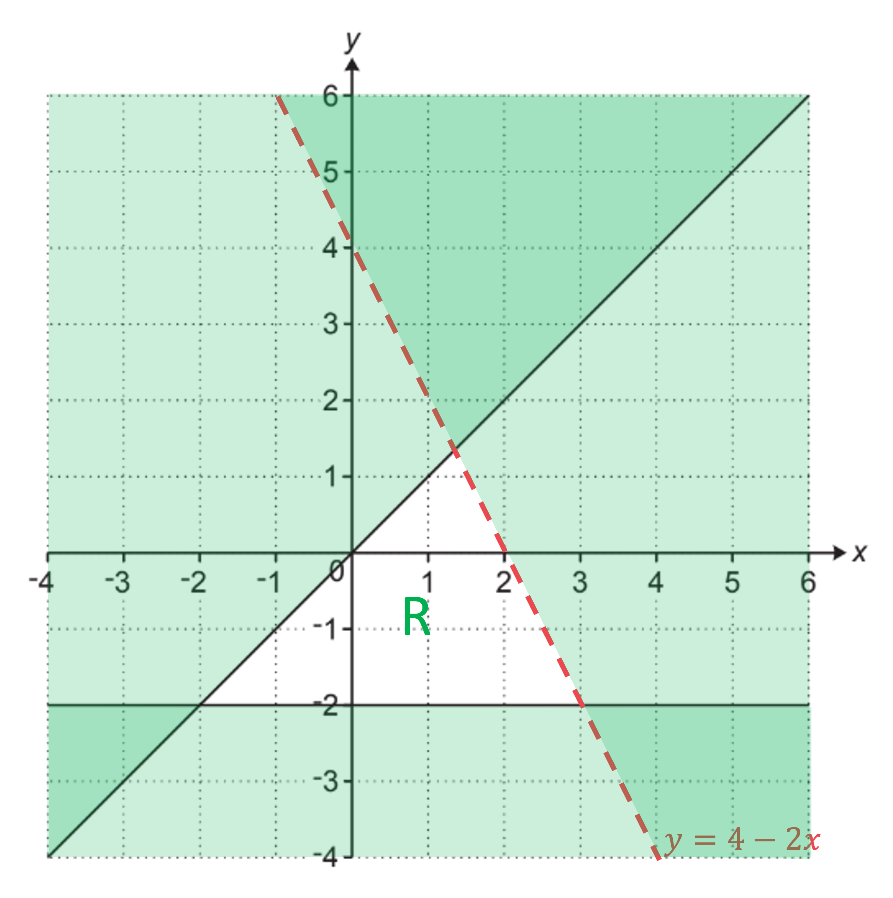

**correct side of y = −2 shaded ****[1]**** **
**correct side of y = x shaded ****[1] **
**correct side of y = 4 − 2x shaded ****[1]**

## Q27 — easy — 5 marks · exam-questions

### 24() — 5 marks
> *For the first inequality, *$y\leq2$*, we will shade above the line as the "unwanted" region. *

> *We can check this by picking a co-ordinate in the unwanted region, e.g. (0,3) and confirming that it does not satisfy the inequality when substituted in*

$y\leq2\,3\leq2$

> *Statement is false, so (0,3) lies in the "unwanted" region*

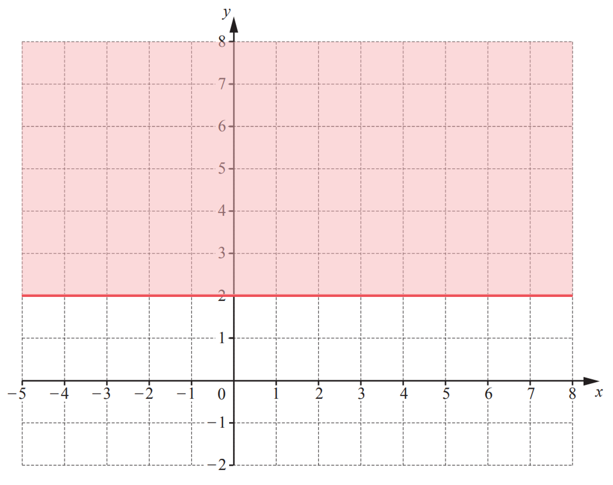

**[1]**

> *For the second inequality, *$x<3$*, we will shade to the right of the line as the "unwanted" region. *

> *We can check this by picking a co-ordinate in the unwanted region, e.g. (4,0) and confirming that it does not satisfy the inequality when substituted in*

$x<3\,4<3$

> *Statement is false, so (4,0) lies in the "unwanted" region As this line uses *$<$* rather than *$\leq$*, we can use a dashed line to represent it*

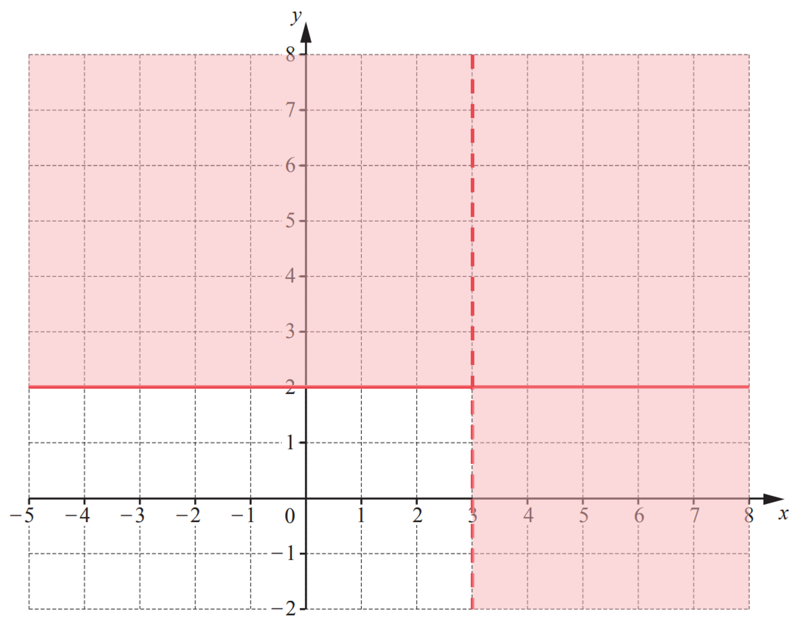

**Must be dashed [1]**

> *For the second inequality, *$y\leqx+4$*, we will shade above the line as the "unwanted" region. We can check this by picking a co-ordinate in the unwanted region, e.g. (-4,1) and confirming that it does not satisfy the inequality when substituted in*

$y\leqx+4\,1\leq-4+4\,1\leq0$

> *Statement is false, so (-4,1) lies in the "unwanted" region*

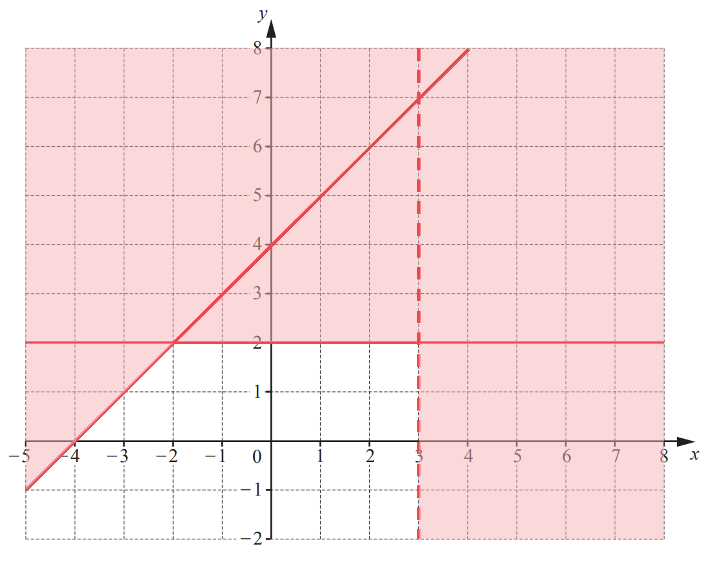

**[1]**

*The leftover unshaded region, **R**, is the region which satisfies all three inequalities*

> *Any coordinate in this region would satisfy all three inequalities*

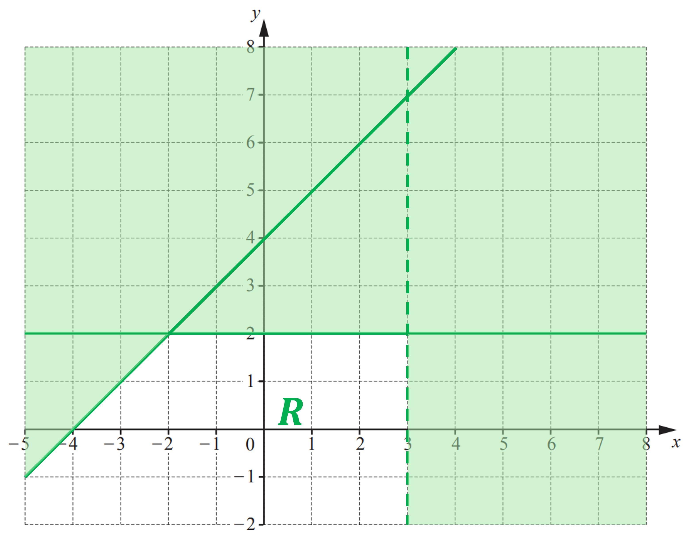

**Correctly selecting region**** [2]**

## Q28 — hard — 6 marks · exam-questions

### 9((b)) — 4 marks
> *There are two lines we need to identify. For demonstration purposes, the lines are labelled Line 1, Line 2 and Line 3 below*

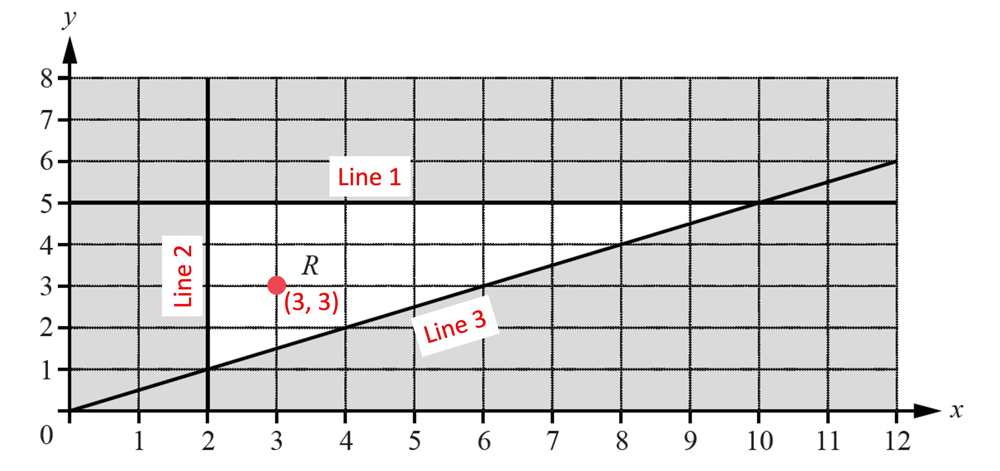

> *First let's consider Line 1. It is a horizontal line through 5 on the *$y$*-axis so*

*equation of Line 1 is *$y=5$

> *Now we need to consider the inequality sign.*

> *Remember that a solid line represents *$\leq$* or *$\geq$* but a broken line represents < or >.*

> *The unshaded area is below Line 1, and Line 1 is a solid line so*

$y\leq5$** ****[1]**

> *Now let's consider Line 2. It is a vertical line through 2 on the *$x$*-axis so*

*equation of Line 2 is *$x=2$

> *Now we need to consider the inequality sign. The unshaded area is to the right of Line 2, and Line 2 is another solid line so*

$x\geq2$** ****[1]**

> *Now let's consider Line 3. The first step is to get its equation in the form *$y=mx+c$*:*

*Line 3: gradient =*$\frac{\mathrm{rise}}{\mathrm{run}}=\frac{1}{2}$*      and      y-intercept at (0, 0)*

*equation of Line 2 is *$y=\frac{1}{2}x$

**[1]**

> *Now we need to determine the inequality sign. The unshaded region is above the line so *$y\geq\frac{1}{2}x$* *

*If unsure, pick a point inside the unshaded region. For example pick (3, 3), substitute *$x=3$* and *$y=3$* into the equation of the line, and decide which way the inequality sign should go:**     ** *

`table row y equals cell 1 half x end cell row 3 greater or equal than cell 1 half cross times 3 space space space open parentheses 3 space is space greater space than space or space equal space to space 1 1 half close parentheses end cell end table`

> *Therefore*

`table row bold italic y bold greater or equal than cell bold 1 over bold 2 bold italic x end cell end table`* ***[1]**** **

### 9((b)) — 2 marks
> *Use trial and error. Pick a point, and substitute the *$x$*- and *$y$*-coordinates into the equation *$3x+5y=35$*. For example;*

*Pick (3, 3):  *$3\times3+5\times5=9+25=34,3x+5y\neq35$*,  fail*

*Pick (4,4): *$3\times4+5\times4=12+20=32,3x+5y\neq35$*,  fail*

**a trial of at least one coordinate point seen**** [1]**

*Pick (5, 4): *$3\times5+5\times4=15+20=35,3x+5y=35$*, success!*

**(5, 4)**** [2]**

## Q29 — medium — 5 marks · exam-questions

### 14() — 5 marks
> *You need to draw the line for the inequality *$y>1$*. Draw a **dotted** horizontal line through 1 on the **y**-axis.*

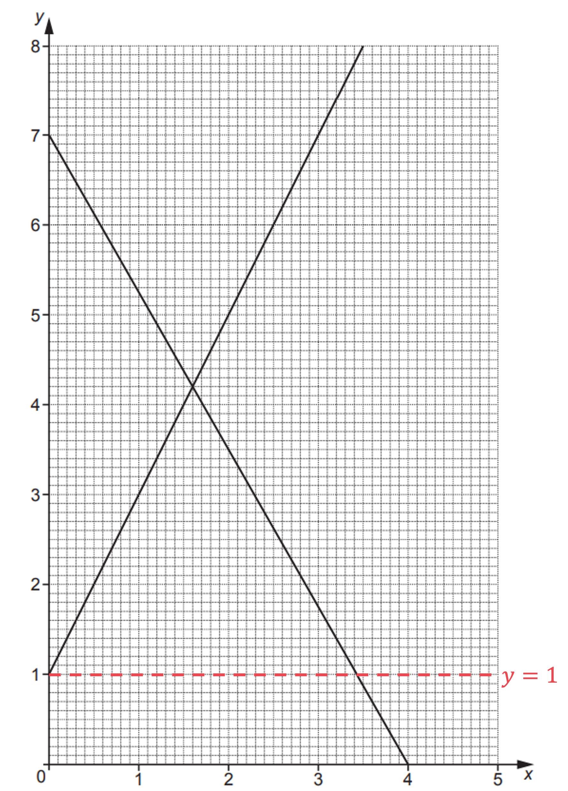

**y = 1 drawn ****[1]**

** ****y = 1 drawn with a dotted line ****[1]**

> *Now turn your attention to shading. Shade the **unwanted** regions.*

> *For *$y>1$*, the **unwanted **region is below the line, so shade below *$y=1$

> *For *$y\leq2x+1$*, the **unwanted **region is above the line, so shade above *$y=x$*. To check this, pick an integer point (not on the line) and substitute into the inequality to test which side should be shaded. For example, picking (0, 0),*

`table attributes columnalign right center left columnspacing 0px end attributes row 0 less or equal than cell 2 open parentheses 0 close parentheses plus 1 comma space true end cell end table`

> *(0, 0) is in the **wanted** region so everything on the (0, 1) side of the line *$y=2x+1$* should be **unshaded.*

> *For *$7x+4y\geq28$*, the **unwanted **region is below the line. To check this, pick an integer point (not on the line) and substitute into the inequality to test which side should be shaded. For example, picking (0, 0),*

`table row cell 7 open parentheses 0 close parentheses plus 4 open parentheses 0 close parentheses end cell greater or equal than cell 28 comma space false end cell end table`

> *(0, 0) is in the **unwanted** region so everything on the (0, 0) side of the line *$7x+4y=28$* should be **shaded.*

> *Finally, don't forget to label the wanted region "R"!*

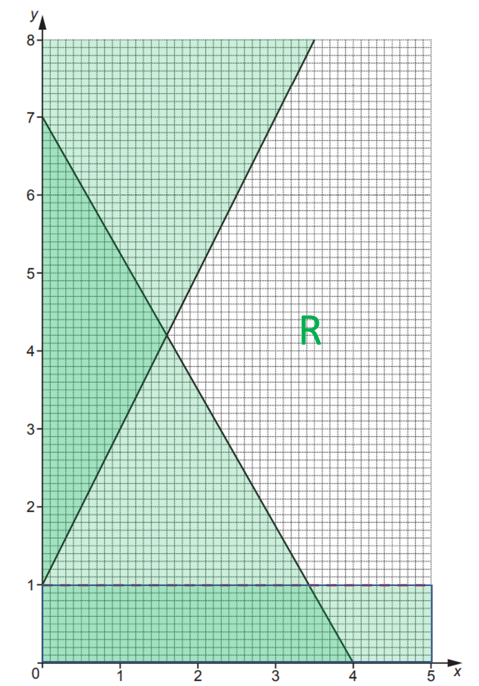

**correct side of y = 2x + 1 shaded ****[1]**** **
**correct side of 7x + 4y = 28 shaded ****[1] **
**correct side of y = 1 shaded ****[1]**

## Q30 — easy — 3 marks · exam-questions

### 14() — 3 marks
$x\leq3$* means all points to the left of the vertical line *$x=3$

> *Shade away the area to the right of *$x=3$

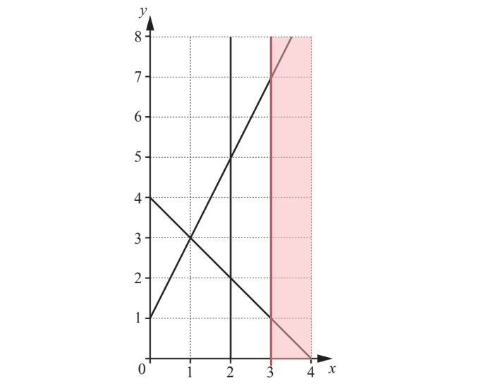

$x\geq2$* means all points to the right of the vertical line *$x=2$

*Shade away the area to the left of *$x=2$

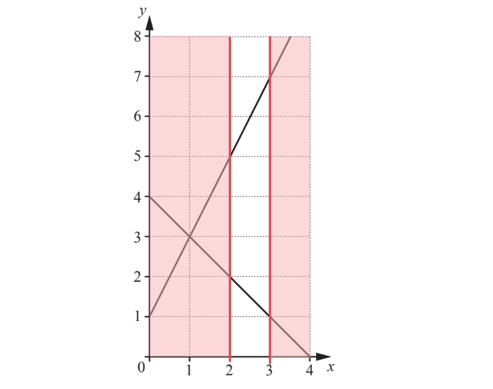

**[1]**

$y\leq2x+1$* means all points below the line *$y=2x+1$

*Shade away the area above the straight line *$y=2x+1$* (*$y$*-intercept 1 and positive "upward" gradient)*

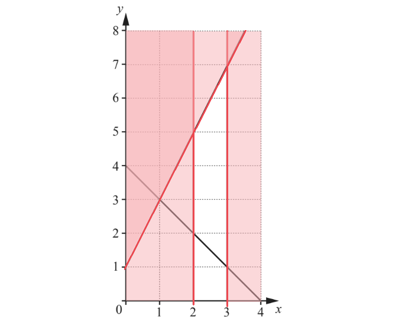

$y\geq4-x$* means all points above the line *$y=4-x$

*Shade away the area below the straight line *$y=4-x$* (*$y$*-intercept 4 and negative "downward" gradient)*

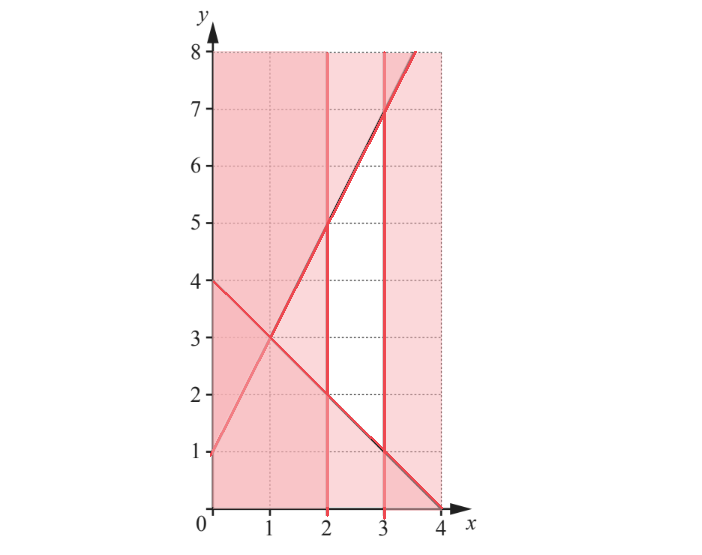

**[1]**

*Write *$R$* in the empty region with no shading (this region satisfies all four inequalities)*

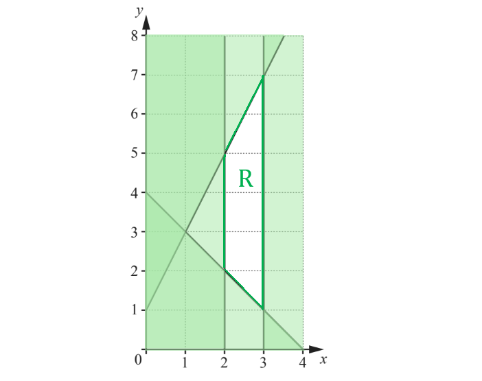

**R shown clearly ****[1]**

## Q31 — medium — 4 marks · exam-questions

### 7() — 4 marks
> *Find the equation of each line that makes the triangle enclosing R*

> *Decide whether the inequality is less than or greater than by seeing which side is shaded*

> **[exam-tip]**
> If you aren't sure, pick a pair of coordinates and test if they work in your inequality.

$x\leq1$

**[B1]**

$y\geq-2$

**[B1]**

$y\leq2x+4$

**[M1 A1]**

> **[mark-scheme]**
> **B1**: Correct inequality.
> 
> **B1**: Correct inequality.
> 
> **M1**: $y=2x+c$ or $y=mx+4$.
> 
> **A1**: Correct inequality.

## Q32 — medium — 3 marks · exam-questions

### 8((b)) — 3 marks
> *The equations of the straight lines are*

$x=7$

$y=2$

$y=x$

> *The shaded area is to the left of the vertical line, *$x=7$

$x\leq7$

**[B1]**

> *The shaded area is above the horizontal line, *$y=2$

$y\geq2$

**[B1]**

> *The shaded area is below the diagonal line, *$y=x$

$y\leqx$

**[B1]**
