# Exam Questions — Transformations of Graphs
**Functions, Graphs & Differentiation** · Edexcel IGCSE Maths A (Modular) (4XMAF/4XMAH) — 24/Higher Unit 2
> Source: [https://www.savemyexams.com/igcse/maths/edexcel/a-modular/24/higher-unit-2/topic-questions/functions-graphs-and-differentiation/transformations-of-graphs/exam-questions/](https://www.savemyexams.com/igcse/maths/edexcel/a-modular/24/higher-unit-2/topic-questions/functions-graphs-and-differentiation/transformations-of-graphs/exam-questions/) · 45 questions · total 124 marks

## Q1 — hard — 4 marks · exam-questions

### 26((a)) — 2 marks — command: sketch — structured — from paper 2012	June · 1MA0/1H
The graph of $y=f(x)$ is shown on each of the grids.

On this grid, sketch the graph of $y=f(x-3)$

### 26((b)) — 2 marks — command: sketch — structured — from paper 2012	June · 1MA0/1H
On this grid, sketch the graph of $y=f(-x)+2$

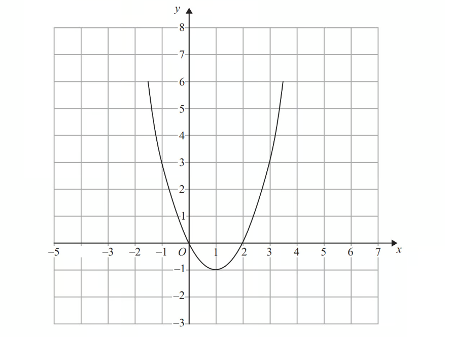

## Q2 — medium — 4 marks · exam-questions

### 24((a)) — 3 marks — command: write — structured — from paper 2015	June · 1MA0/1H
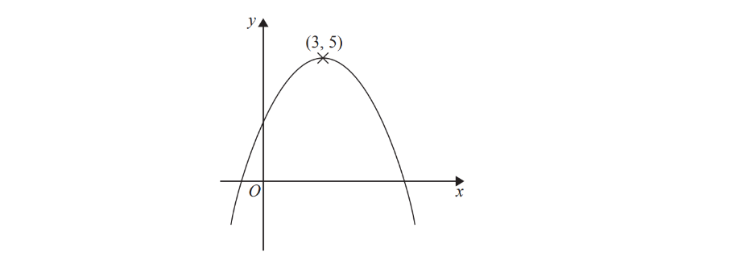

The diagram shows part of the curve with equation $y=f(x)$. The coordinates of the maximum point of the curve are (3, 5).

Write down the coordinates of the maximum point of the curve with equation

(i) `y space equals space straight f open parentheses x plus 3 close parentheses`

[1]

(ii) $y=-f(x)$

[1]

(iii) $y=f(-x)$

[1]

### 24((b)) — 1 mark — command: describe — structured — from paper 2015	June · 1MA0/1H
The curve with equation $y=f(x)$ is transformed to give the curve with equation $y=f(x)-4$

Describe the transformation.

## Q3 — easy — 2 marks · exam-questions

### 26((a)) — 2 marks — command: find — structured — from paper 2009	June · 1380/3H
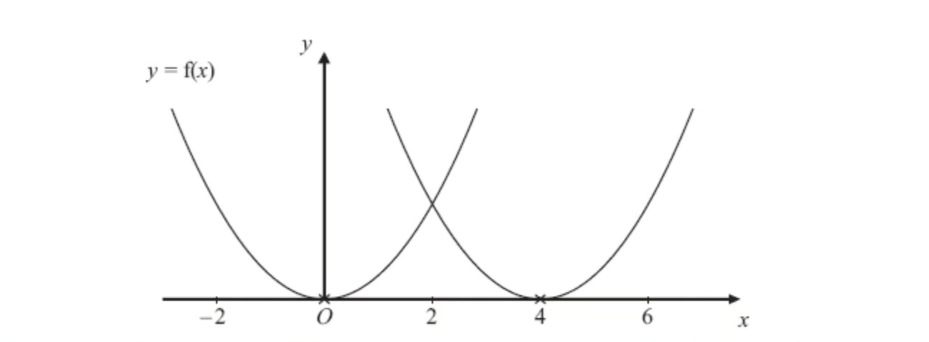

The curve with equation $y=f(x)$ is translated so that the point at (0, 0) is mapped onto the point (4, 0).

Find an equation of the translated curve.

## Q4 — hard — 2 marks · exam-questions

### 19((a)) — 1 mark — command: sketch — structured — from paper 2015	Sample · 1MA1/2H
The graph of $y=f(x)$ is shown on both grids below

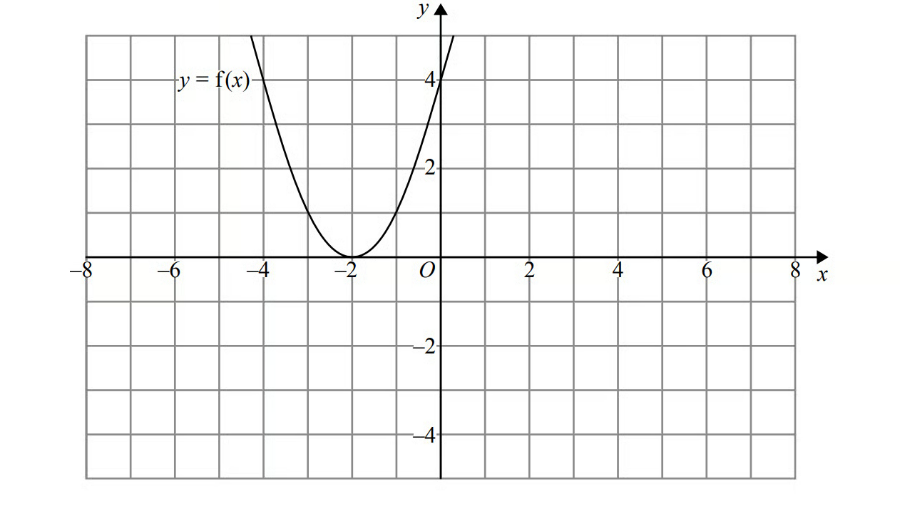

On the grid above, sketch the graph of `y space equals space straight f open parentheses negative x close parentheses`

### 19((b)) — 1 mark — command: sketch — structured — from paper 2015	Sample · 1MA1/2H
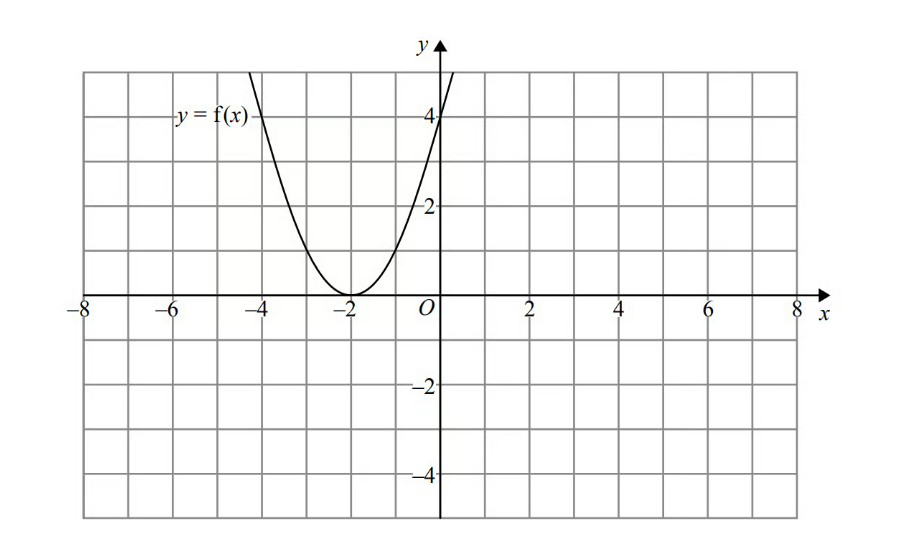

On this grid, sketch the graph of `y space equals negative straight f open parentheses x close parentheses plus 3`

## Q5 — medium — 2 marks · exam-questions

### 28((a)) — 1 mark — command: write — structured — from paper 2013	June · 1MA0/1H
The diagram shows a sketch of the graph of $y=\mathrm{cos}x.$

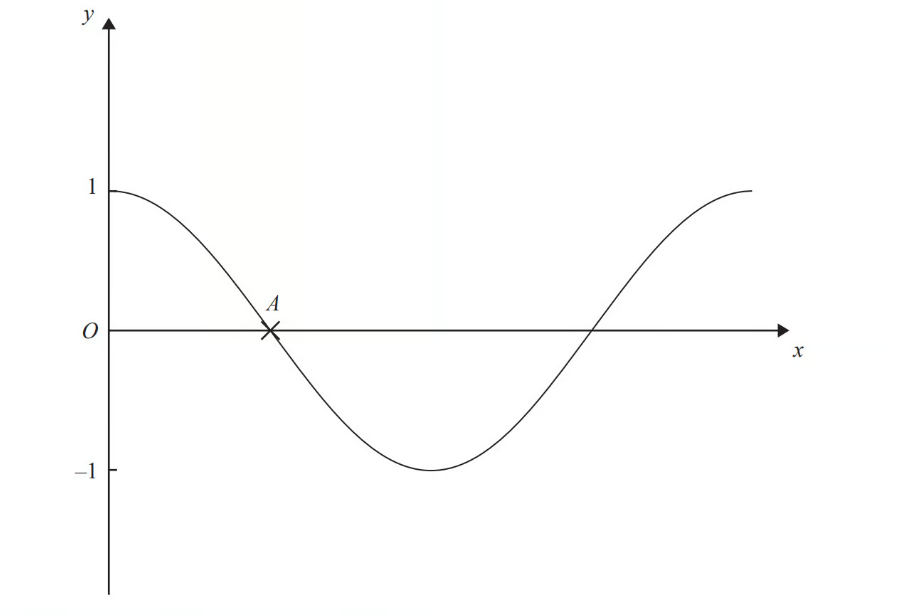

Write down the coordinates of the point $A$.

### 28((b)) — 1 mark — command: draw — structured — from paper 2013	June · 1MA0/1H
On the same diagram, draw a sketch of the graph of $y=-\mathrm{cos}x.$

## Q6 — easy — 2 marks · exam-questions

### 19((b)) — 2 marks — command: draw — structured — from paper 2015	Spec2 · 1MA1/2H
The graph of $y=f(x)$ is shown on both grids below.

(i) On this grid, draw the graph of $y=-f(x)$

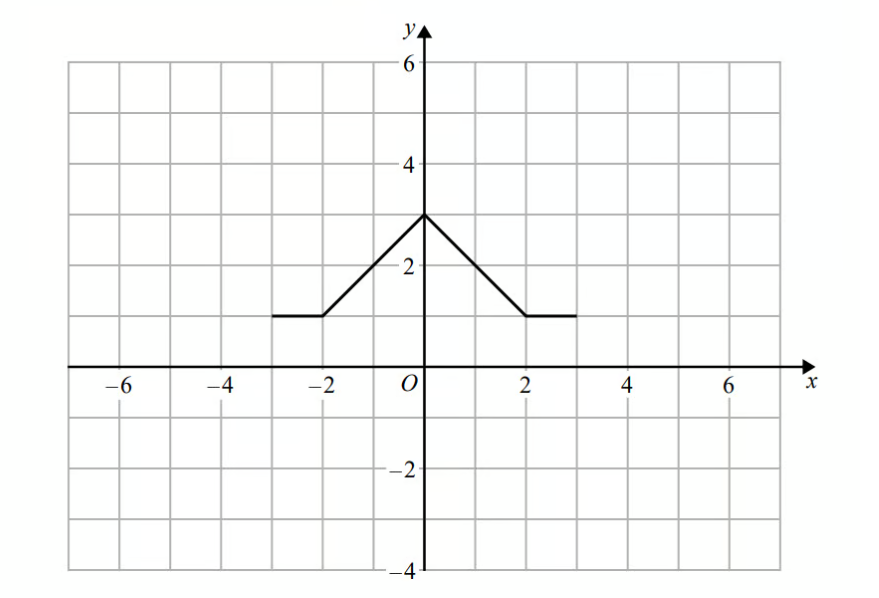

[1]

(ii) On the grid below, draw the graph of $y=f(x-3)$

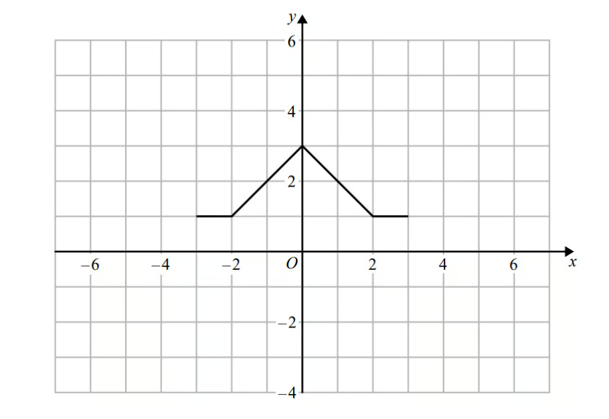

[1]

## Q7 — hard — 4 marks · exam-questions

### 24((a)) — 2 marks — command: write — structured — from paper 2009	November · 1380/3H
This is a sketch of the curve with the equation $y=f(x).$

The only minimum point of the curve is at $P(3,---4)$.

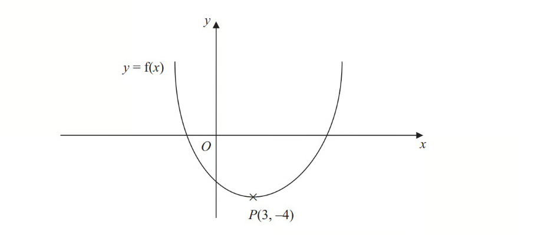

Write down the coordinates of the minimum point of the curve with the equation `y space equals space straight f open parentheses x minus 2 close parentheses`

### 24((b)) — 2 marks — command: write — structured — from paper 2009	November · 1380/3H
Write down the coordinates of the minimum point of the curve with the equation  `y space equals space straight f open parentheses x plus 5 close parentheses plus 6`

## Q8 — medium — 2 marks · exam-questions

### 18() — 2 marks — command: sketch — structured — from paper 2018	June · 1MA1/1H
Here is the graph of $y=\mathrm{sin}x^{\circ}$ for  `negative 180 space less-than or slanted equal to x less-than or slanted equal to 180`

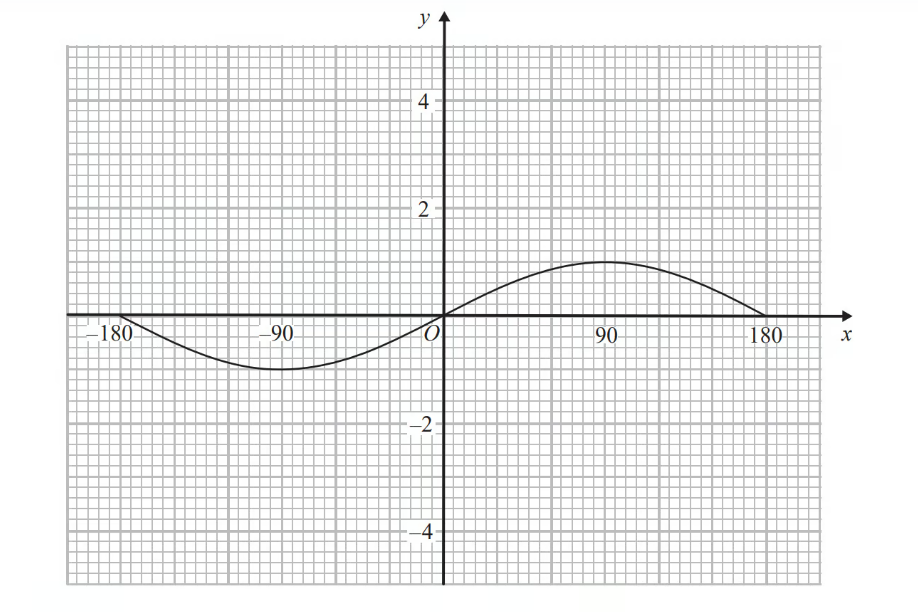

On the grid, sketch the graph of $y=\mathrm{sin}x^{\circ}-2$ for `long dash 180 space less-than or slanted equal to space x space less-than or slanted equal to space 180`

## Q9 — easy — 3 marks · exam-questions

### 25() — 3 marks — command: write — structured — from paper 2014	November · 1MA0/1H
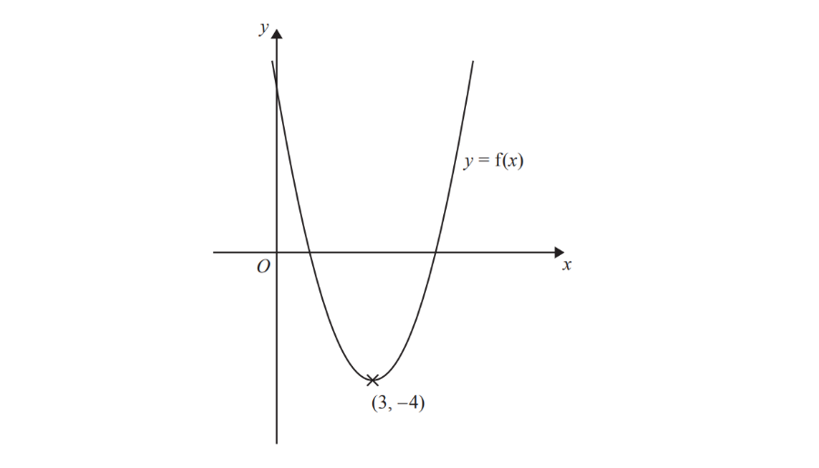

The diagram shows part of the curve with equation $y=f(x)$. 
The coordinates of the minimum point of this curve are $(3,-4)$

Write down the coordinates of the minimum point of the curve with equation

(i) `y equals straight f open parentheses x close parentheses plus 3`

[1]

(ii) `y equals straight f open parentheses x plus 2 close parentheses`

[1]

(iii) `y equals straight f open parentheses negative x close parentheses`

[1]

## Q10 — hard — 2 marks · exam-questions

### 16() — 2 marks — command: find — structured — from paper 2015	Spec1 · 1MA1/3H
The graph of $y=f(x)$ is transformed to give the graph of $y=---f(x+3)$

The point $A$ on the graph of $y=f(x)$ is mapped to the point $P$ on the graph of $y=---f(x+3)$

The coordinates of point $A$ are $(9,1)$

Find the coordinates of point $P$.

## Q11 — medium — 4 marks · exam-questions

### 23((a)) — 2 marks — command: sketch — structured — from paper 2015	November · 1MA0/2H
Here is the graph of $y=\mathrm{sin}x^{\circ}$ for  `negative 180 space less-than or slanted equal to x less-than or slanted equal to 180`

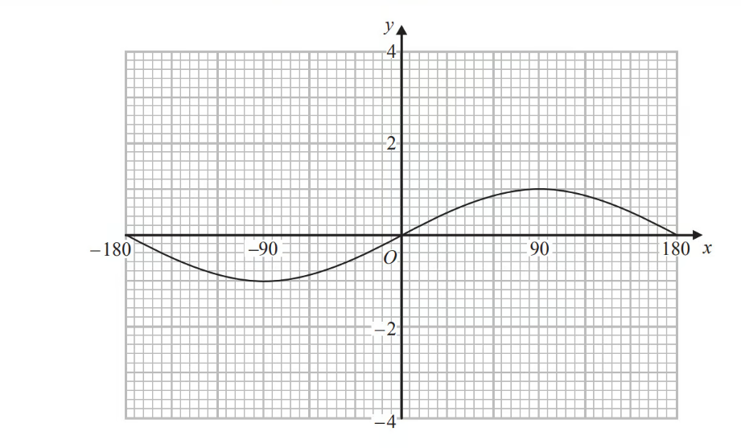

On the grid above, sketch the graph of $y=\mathrm{sin}x^{\circ}+2$ for `long dash 180 space less-than or slanted equal to space x space less-than or slanted equal to space 180`

### 23((b)) — 2 marks — command: sketch — structured — from paper 2015	November · 1MA0/2H
Here is the graph of $y=\mathrm{cos}x^{\circ}$ for  `negative 180 space less-than or slanted equal to x less-than or slanted equal to 180`

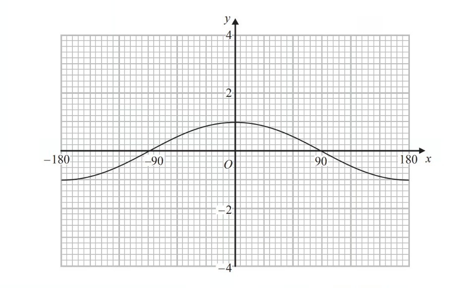

On the grid above, sketch the graph of $y=-\mathrm{cos}x^{\circ}$ for `long dash 180 space less-than or slanted equal to space x space less-than or slanted equal to space 180`

## Q12 — easy — 3 marks · exam-questions

### 27((a)) — 1 mark — command: write — structured — from paper 2010	June · 1380/4H
The graph of $y=f(x)$ is shown on the grid.

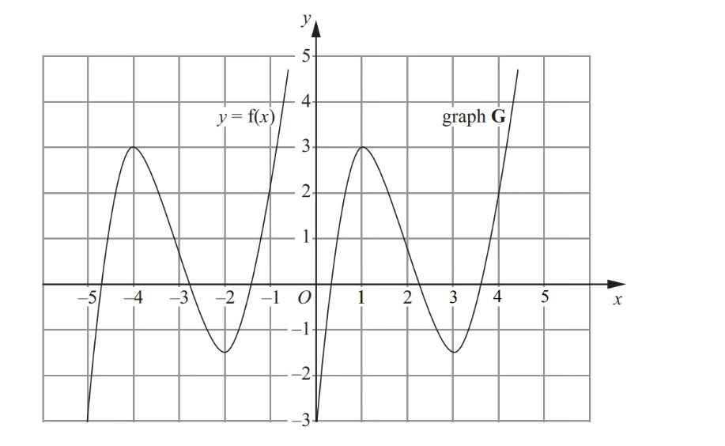

The graph **G** is a translation of the graph of $y=f(x)$.

Write down, in terms of f, the equation of graph **G**.

### 27((b)) — 2 marks — command: write — structured — from paper 2010	June · 1380/4H
The graph of $y=f(x)$ has a maximum point at (-4, 3).

Write down the coordinates of the maximum point of the graph of $y=f(-x).$

## Q13 — hard — 2 marks · exam-questions

### 15() — 2 marks — command: find — structured — from paper June 2019 · 1MA1/3H
The graph of the curve $C$ with equation $y=f(x)$ is transformed to give the graph of the curve $S$ with equation $y=f(-x)-3$

The point on $C$ with coordinates $(7,2)$ is mapped to the point $Q$ on $S$.

Find the coordinates of $Q$.

## Q14 — medium — 4 marks · exam-questions

### 27((a)) — 2 marks — command: sketch — structured — from paper 2010	November · 1380/4H
The graph of $y=f(x)$ is shown on the grids.

On this grid, sketch the graph of `y space equals space straight f open parentheses x minus 3 close parentheses`

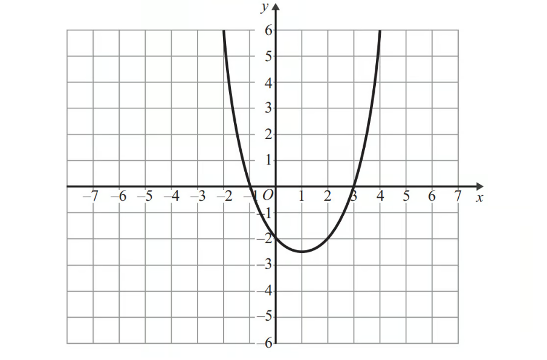

### 27((b)) — 2 marks — command: sketch — structured — from paper 2010	November · 1380/4H
On this grid, sketch the graph of $y=---f(x)$

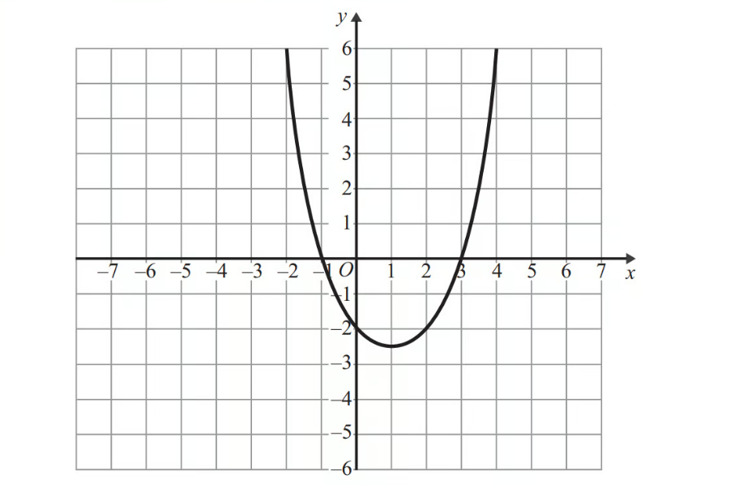

## Q15 — easy — 2 marks · exam-questions

### 23() — 2 marks — command: write — structured — from paper Jan 2022 · 4MA1/1H
The diagram shows a sketch of the curve with equation $y=f(x)$

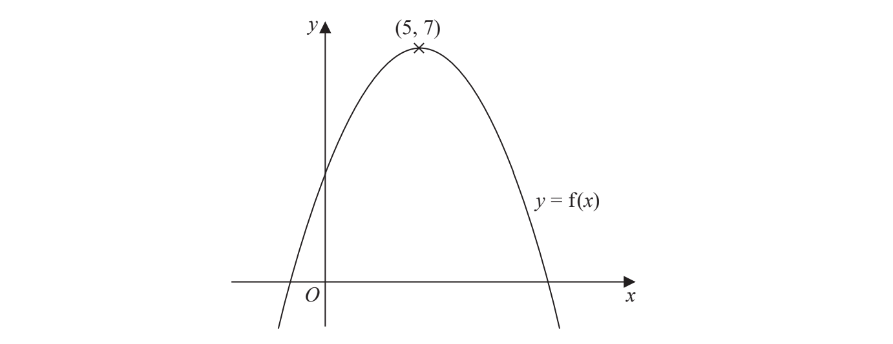

There is only one maximum point on the curve. 
The coordinates of this maximum point are (5, 7)

Write down the coordinates of the maximum point on the curve with equation

(i) $y=f(x+9)$

[1]

(ii) $y=f(x)+3$

[1]

## Q16 — hard — 2 marks · exam-questions

### 20((c)) — 2 marks — command: find — structured — from paper Jan 2022 · 4MA1/1HR
The graph of $y=h(x)$ intersects the $x$-axis at two points.

The coordinates of the two points are (–1, 0) and (6, 0)

The graph of $y=h(x+a)$ passes through the point with coordinates (2, 0), where $a$ is a constant.

Find the two possible values of $a$

## Q17 — medium — 3 marks · exam-questions

### 25((a)) — 2 marks — command: sketch — structured — from paper 2013	March · 1MA0/1H
$y=f(x)$

The graph of $y=f(x)$ is shown on the grid.

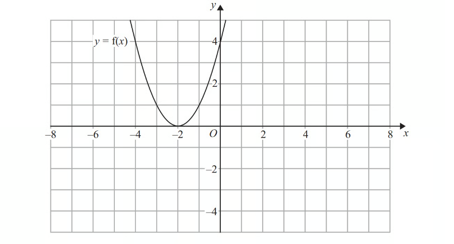

On the grid above, sketch the graph of $y=-f(x)$.

### 25((b)) — 1 mark — command: write — structured — from paper 2013	March · 1MA0/1H
The graph of  $y=f(x)$is shown on the grid.

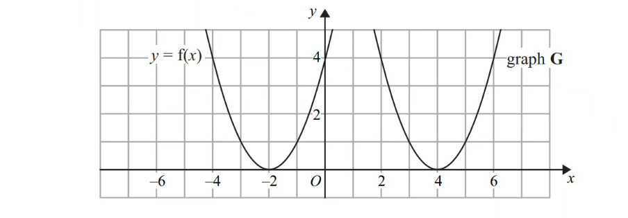

The graph **G** is a translation of the graph of $y=f(x).$

Write down the equation of graph **G**.

## Q18 — easy — 4 marks · exam-questions

### 26((a)) — 2 marks — command: draw — structured — from paper June 2018 · 4MA1/2HR
Here is the graph of $y=f(x)$

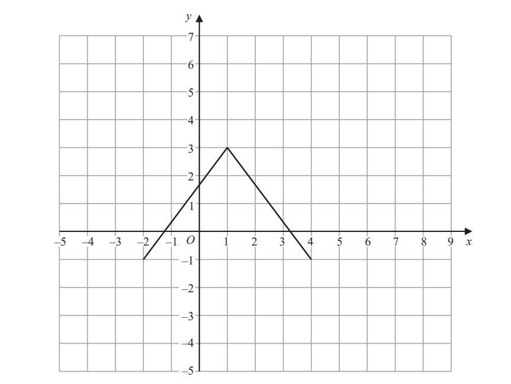

On the grid above, draw the graph of $y=2f(x)$

### 26((b)) — 2 marks — command: draw — structured — from paper June 2018 · 4MA1/2HR
Here is the graph of $y=f(x)$

On the grid above, draw the graph of $y=f(--x)$

## Q19 — hard — 3 marks · exam-questions

### 21((a)) — 1 mark — command: write — structured — from paper Nov 2021 · 4MA1/2H
The curve $C$ has equation $y=f(x)$ where $f(x)=9--3(x+2)^{2}$

The point $A$ is the maximum point on $C$.

Write down the coordinates of $A$.

### 21((b)) — 1 mark — command: find — structured — from paper Nov 2021 · 4MA1/2H
The curve $C$ is transformed to the curve $S$ by a translation of `open parentheses table row 4 row 0 end table close parentheses` Find an equation for the curve $S$.

### 21((c)) — 1 mark — command: describe — structured — from paper Nov 2021 · 4MA1/2H
The curve $C$ is transformed to the curve $T$. 
The curve $T$ has equation $y=3(x+2)^{2}--9$

Describe fully the transformation that maps curve $C$ onto curve $T$.

## Q20 — medium — 2 marks · exam-questions

### 21((b)) — 2 marks — command: find — structured — from paper Jan 2021 · 4MA1/1H
The graph of  $y=a\mathrm{cos}(x+b)^{\circ}$  for `0 space less-than or slanted equal to space x space less-than or slanted equal to space 360` is drawn on the grid below.

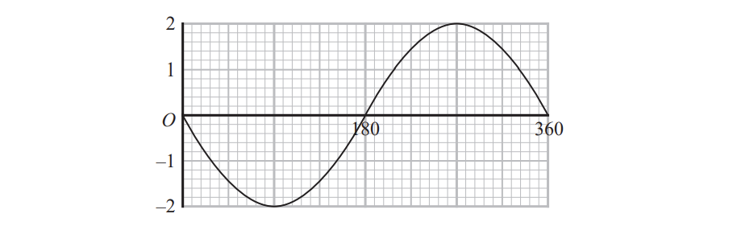

Given that $a>0$ and that $0<b<360$

find the value of a and the value of $b$.

`table row cell a space end cell equals cell space................................... space end cell row cell b space end cell equals cell space................................... end cell end table`

## Q21 — easy — 2 marks · exam-questions

### 24() — 2 marks — command: write — structured — from paper Nov 2020 · 4MA1/1HR
A curve has equation $y=f(x)$

There is only one maximum point on the curve. 
The coordinates of this maximum point are $(--3,4)$

Write down the coordinates of the maximum point on the curve with equation

(i) $y=f(x)--6$

[1]

(ii)$y=f(2x)$

[1]

## Q22 — hard — 4 marks · exam-questions

### 22() — 4 marks — command: describe — structured — from paper June 2021 · 4MA1/2H
The curve $S$ has equation$y=f(x)$where$f(x)=x^{2}$

The curve $T$ has equation $y=g(x)$where $g(x)=2x^{2}--12x+13$

By writing $g(x)$ in the form $a(x--b)^{2}--c$, where $a,b$ and $c$ are constants, describe fully a series of transformations that map the curve $S$ onto the curve $T$.

## Q23 — medium — 2 marks · exam-questions

### 20((b)) — 2 marks — command: sketch — structured — from paper Jan 2022 · 4MA1/1HR
The graph of $y=g(x)$ is shown on the grid below.

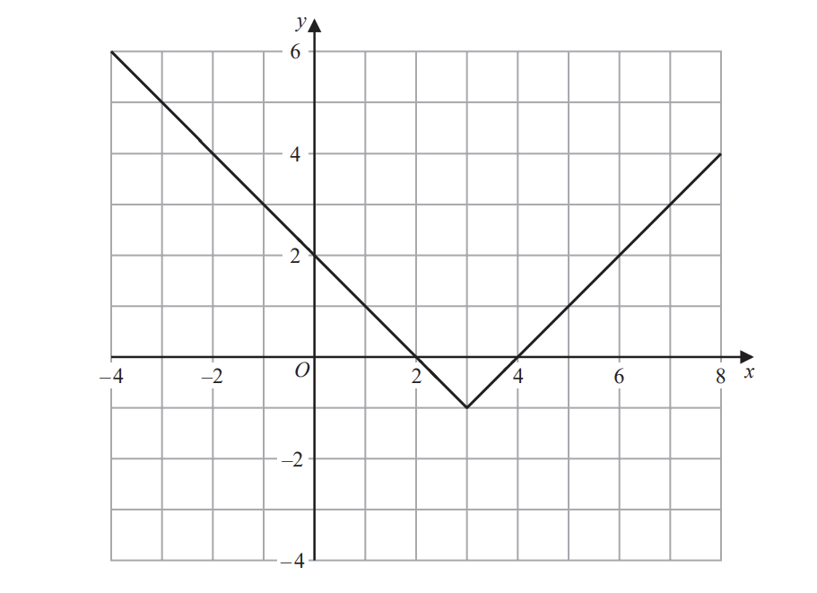

On the grid, sketch the graph of $y=2g(x)$ for `– 1 space less-than or slanted equal to space x space less-than or slanted equal to space 7`

## Q24 — easy — 2 marks · exam-questions

### 21((a)) — 2 marks — command: write — structured — from paper Jan 2020 · 4MA1/2H
The diagram shows a sketch of part of the curve with equation $y=f(x)$

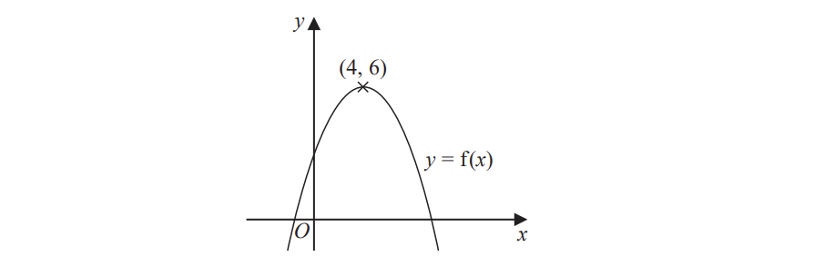

There is one maximum point on this curve. 
The coordinates of this maximum point are (4, 6)

Write down the coordinates of the maximum point on the curve with equation

(i) $y=f(x+4)$

[1]

(ii) $y=f(2x)$

[1]

## Q25 — hard — 3 marks · exam-questions

### 21((d)) — 3 marks — command: find — structured — from paper Nov 2021 · 4MA1/2H
The graph of$y=a\mathrm{cos}(x--b)^{\circ}+c$ for `space minus 180 space less-than or slanted equal to space x space less-than or slanted equal to space 360 space`is drawn on the grid below.

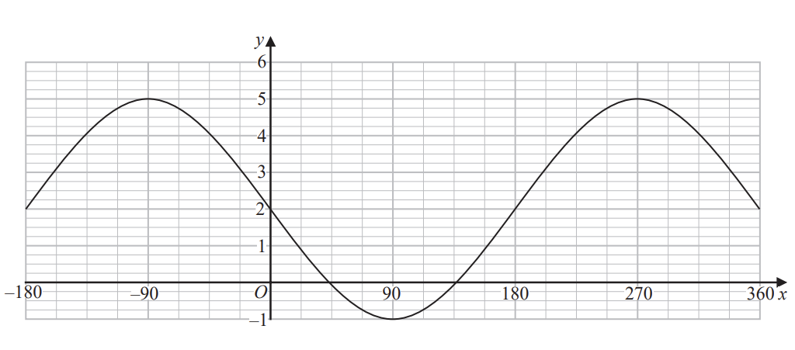

Find the value of $a$, the value of $b$ and the value of $c$.

a = .......................................................        
b = .......................................................       
c = .......................................................

## Q26 — medium — 3 marks · exam-questions

### 22((a)) — 2 marks — command: sketch — structured — from paper Jan 2022 · 4MA1/1H
The graph of $y=f(x)$ is shown on the grid.

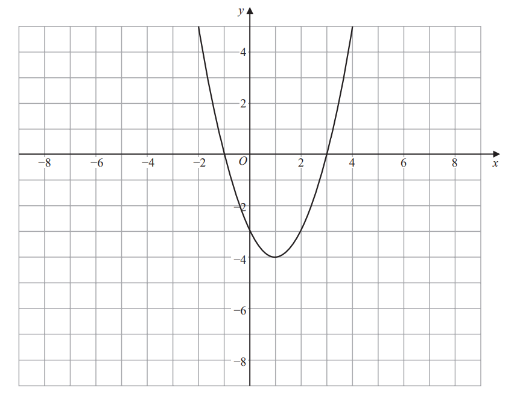

On the grid above, sketch the graph of `y space equals space straight f open parentheses 1 half x close parentheses`

### 22((b)) — 1 mark — command: write — structured — from paper Jan 2019 · 4MA1/1H
The graph of $y=f(x+k)$ is shown on the grid below.

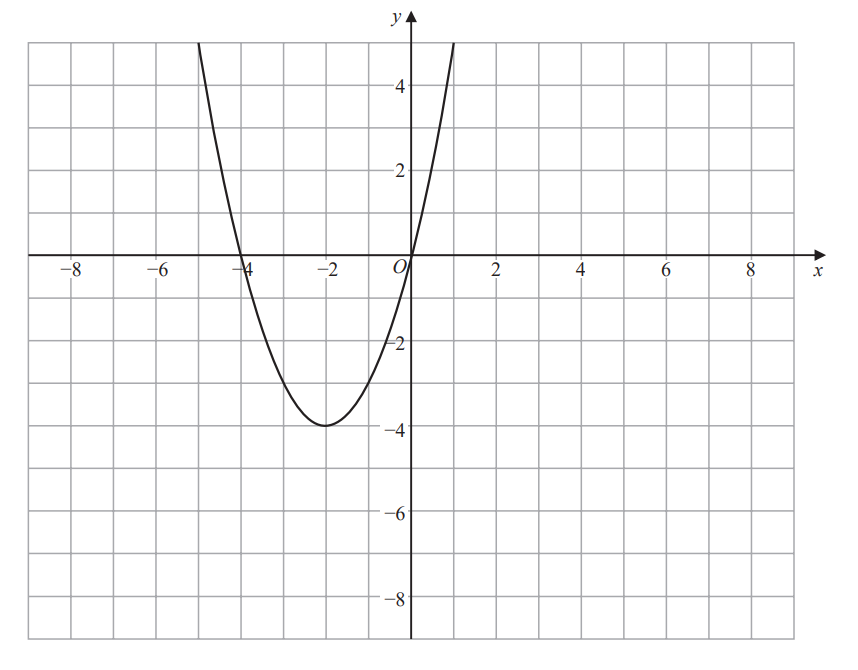

Write down the value of $k$

## Q27 — easy — 2 marks · exam-questions

### 22((b)) — 2 marks — command: write — structured — from paper Jan 2020 · 4MA1/1HR
$A$ curve $C$ has equation $y=f(x)$

The coordinates of the minimum point of $C$ are (4, 5)

Write down the coordinates of the minimum point of the curve with equation

(i) $y=f(2x)$

[1]

(ii) $y=f(x)-7$

[1]

## Q28 — hard — 2 marks · exam-questions

### 21((b)) — 2 marks — command: find — structured — from paper Jan 2020 · 4MA1/2H
The equation of a curve $C$is $y=x^{2}+3x+4$ The curve $C$is transformed to curve $S$under the translation `open parentheses table row 4 row 6 end table close parentheses`

Find an equation of curve $S$.

*You do need to simplify the equation.*

## Q29 — medium — 4 marks · exam-questions

### 18((a)) — 3 marks — command: write — structured — from paper Specimen 2016 · 4MA1/2H
The diagram shows part of the curve with equation $y=f(x)$

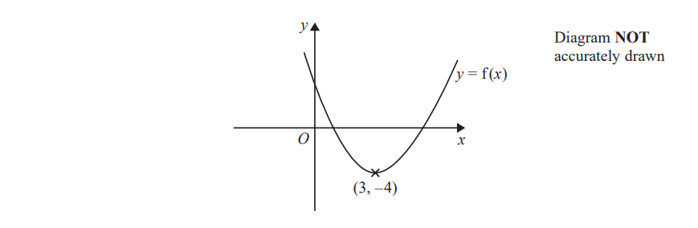

The coordinates of the minimum point on this curve are (3, –4)

Write down the coordinates of the minimum point on the curve with equation

(i) $y=f(x--4)$

[1]

(ii) $y=3f(x)$

[1]

(iii) `y space equals space straight f open parentheses 1 half x close parentheses`

[1]

### 18((b)) — 1 mark — command: write — structured — from paper Specimen 2016 · 4MA1/2H
The curve with equation $y=f(x)$  is translated to give curve $C$.

$C$ has a minimum at the point with coordinates (3, 5)

The equation of $C$ is $y=f(x)+k$

Write down the value of $k$.

$k=$.......................

## Q30 — easy — 1 marks · exam-questions

### 28() — 1 mark — command: describe — structured — from paper Nov 2020 · 4MA1/1H
The curve with equation $y=g(x)$ is transformed to the curve with equation $y=-g(x)$ by the single transformation $T.$

Describe fully the transformation $T.$

## Q31 — hard — 9 marks · exam-questions

### 1() — 3 marks — command: find — structured
The function f($x$) is defined as ƒ ($x$) = 3 − 8$x$ − 2$x^{2}$

Find the coordinates of the turning point on the graph of $y$ = `f open parentheses x close parentheses`

### 2() — 6 marks — command: write — structured
Using your result from part (a) write down the coordinates of the turning point on the following graphs:

(i) $y$ = `f open parentheses x close parentheses` +2

[1]

(ii) `y equals f open parentheses x minus 3 close parentheses`

[1]

(iii) `y equals f open parentheses 4 x close parentheses`

[1]

(iv) `y equals negative f open parentheses x close parentheses`

[1]

(v) `y equals 3 f open parentheses x plus 1 close parentheses`

[2]

## Q32 — medium — 3 marks · exam-questions

### 28((a)) — 1 mark — command: draw — structured — from paper Nov 2021 · 8300/1H
Here is the graph of $y=\mathrm{cos}x$for `0 degree space less-than or slanted equal to space x space less-than or slanted equal to space 360 degree`

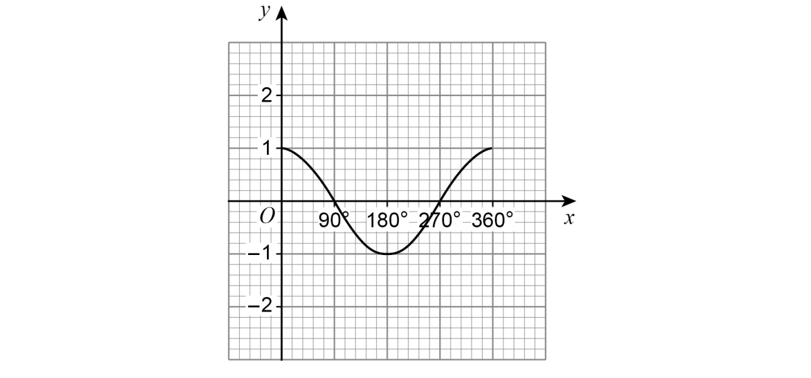

In parts (a) and (b) the graph of $y=\mathrm{cos}x$ is shown as a dashed line.

On the grid below, draw the graph of $y=\mathrm{cos}(x--90^{\circ})$ for `0 degree space less-than or slanted equal to space x space less-than or slanted equal to space 360 degree`

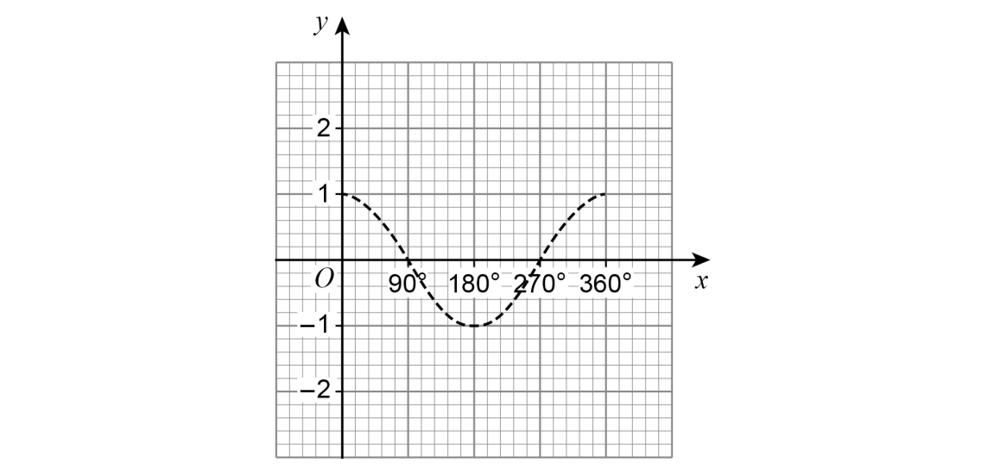

### 28((b)) — 1 mark — command: draw — structured — from paper Nov 2021 · 8300/1H
On the grid below, draw the graph of `y equals 1 plus cos space x space space for space space 0 degree space less-than or slanted equal to space x space less-than or slanted equal to space 360 degree`

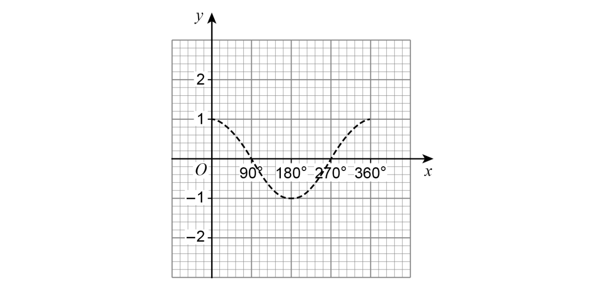

### 28((c)) — 1 mark — command: give — structured — from paper Nov 2021 · 8300/1H
Rita tries to draw the graph of$y=\mathrm{cos}(--x)$ for`space 0 degree space less-than or slanted equal to space x space less-than or slanted equal to space 360 degree` Here is her graph.

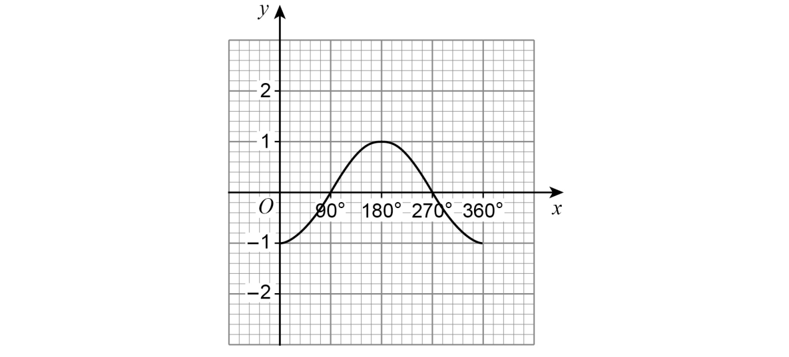

Give a reason why Rita’s graph is incorrect.

## Q33 — easy — 2 marks · exam-questions

### 8() — 2 marks — command: show — structured — from paper June 2019 · 8300/2H
On the axes, sketch the curve  $y=x^{3}-2$

You must show the coordinates of the $y$-intercept.

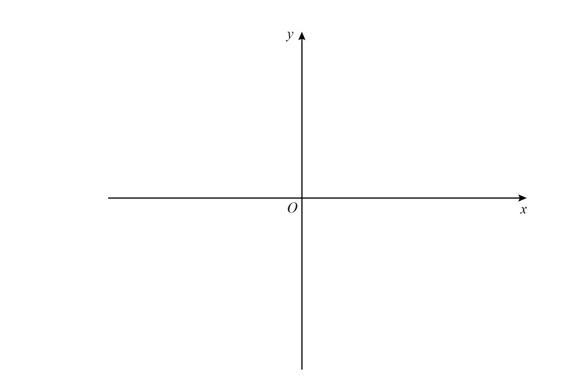

## Q34 — hard — 4 marks · exam-questions

### 29() — 4 marks — command: work_out — structured — from paper Nov 2020 · 8300/1H
The graph of $y=x^{3}+6$ is translated 4 units to the right.

The translated graph has equation $y=f(x)$

Work out $f(x)$.

Give your answer in the form $x^{3}+ax^{2}+bx+c$ where $a,b$ and $c$ are integers.

## Q35 — medium — 2 marks · exam-questions

### 24() — 2 marks — command: sketch — structured — from paper Nov 2018 · 8300/2H
Here is a sketch of    $y=f(x)$

The curve passes through the points    (–2, –10)  (–1, –3)  (0, –2)  (1, –1)  (2, 6)

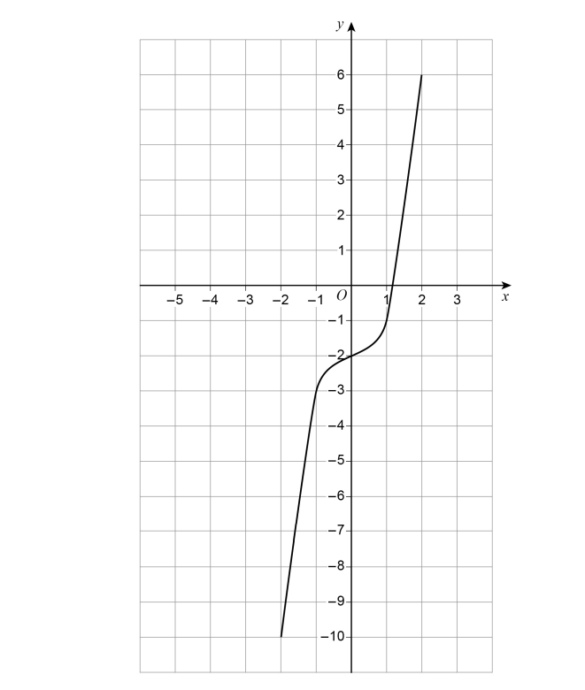

On the grid, sketch the curve $y=f(x+2)$

## Q36 — easy — 1 marks · exam-questions

### 22() — 1 mark — command: circle — structured — from paper Nov 2020 · 8300/2H
One of these is the graph of $y=1+\mathrm{sin}x$ for `0 degree space less-than or slanted equal to space x space less-than or slanted equal to space 360 degree`

Circle the letter above the correct graph.

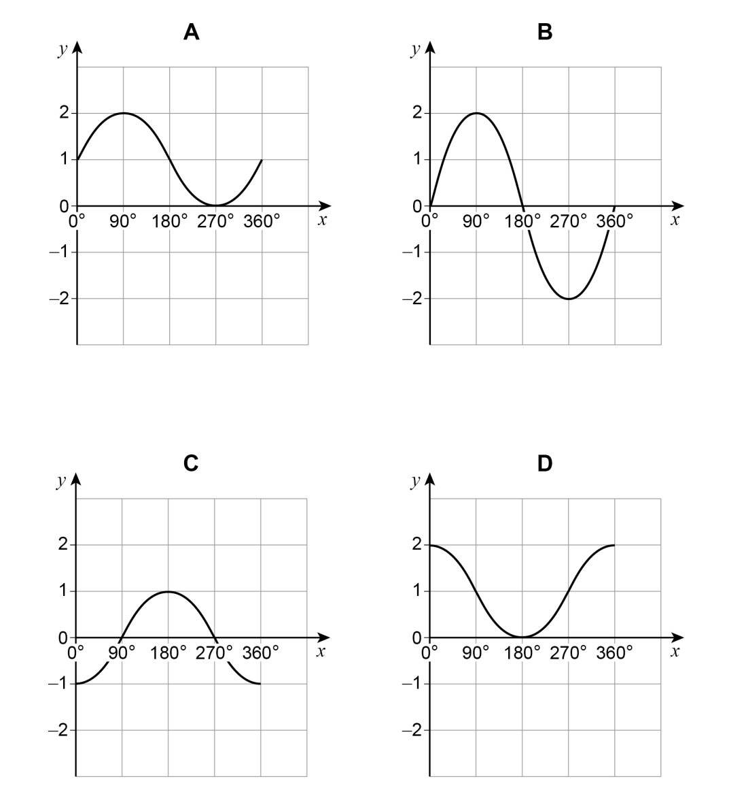

## Q37 — hard — 3 marks · exam-questions

### 20() — 3 marks — command: work_out — structured — from paper Nov 2018 · 8300/3H
Curve $P$ has equation $y=2(x--1)^{2}--5$

Curve $Q$ is a reflection in the $y$-axis of curve $P$.

Work out the equation of curve $Q$.

Give your answer in the form    $y=ax^{2}+bx+c$     where $a,b$ and $c$ are integers.

## Q38 — medium — 1 marks · exam-questions

### 27() — 1 mark — command: circle — structured — from paper Specimen 2015 · 8300/3H
The curve with equation   $y=x^{2}-5x+2$ is reflected in the $x$-axis.

Circle the equation of the reflected curve.

| $y=x^{2}-5x-2$ | $y=-x^{2}+5x+2$ |
|---|---|
| $y=-x^{2}+5x-2$ | $y=x^{2}+5x+2$ |

## Q39 — easy — 1 marks · exam-questions

### 20() — 1 mark — command: circle — structured — from paper Nov 2019 · 8300/2H
(7, 28) is a point on the graph $y=f(x)$

Circle the point which **must **be on the graph $y=f(x)+2$

| (7, 26) | (7, 30) | (5, 28) | (9, 28) |
|---|---|---|---|

## Q40 — hard — 2 marks · exam-questions

### 27((b)) — 2 marks — command: draw — structured — from paper June 2017 · 8300/2H
For all values of $x$

$f(x)=\mathrm{sin}x\,g(x)=x+90$

On the grid, draw the graph of the composite function  `y equals fg open parentheses x close parentheses`  for  `0 degree space less-than or slanted equal to space x space less-than or slanted equal to space 360 degree`

## Q41 — medium — 2 marks · exam-questions

### 13((b)) — 2 marks — command: write — structured — from paper Nov 2020 · J560/05
The graph of `begin mathsize 16px style y equals cos open parentheses x minus 30 close parentheses end style` for  `0 degree less-than or slanted equal to x less-than or slanted equal to 360 degree` crosses the $x$-axis in two places.

Write down the values of $x$ where this occurs.

$x=$...........................

## Q42 — hard — 4 marks · exam-questions

### 18((a)) — 3 marks — command: write — structured — from paper Specimen paper · 4MA1/2H
The diagram shows part of the curve with equation `y equals straight f open parentheses x close parentheses`

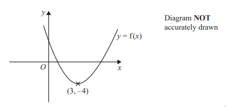

The coordinates of the minimum point on this curve are (3, –4)

Write down the coordinates of the minimum point on the curve with equation

(i)  $y=f(x--4)$

(ii)  $y=3f(x)$

(iii)  `y equals straight f open parentheses 1 half x close parentheses`

### 18((b)) — 1 mark — command: write — structured — from paper Specimen paper · 4MA1/2H
The curve with equation  `y equals straight f open parentheses x close parentheses` is translated to give curve  $C$.

$C$ has a minimum at the point with coordinates (3, 5)
The equation of   $C$ is $y=f(x)+k$

Write down the value of $k$

## Q43 — medium — 3 marks · exam-questions

### 16() — 3 marks — command: sketch — structured — from paper June 2019 · J560/06
Sketch the graph of $y=-\mathrm{sin}x$ for `0 degree less-than or slanted equal to x less-than or slanted equal to 360 degree`.

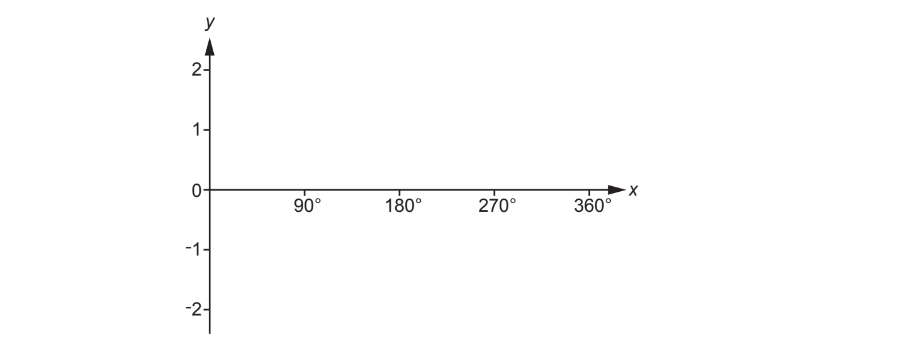

## Q44 — hard — 2 marks · exam-questions

### 21((a)) — 1 mark — command: write — structured — from paper 2023 June · 4MA1/1H
A curve has equation `y equals straight f open parentheses x close parentheses`

There is only one turning point on the curve. 
The coordinates of this turning point are (6, 5)

Write down the coordinates of the turning point on the curve with equation

`y equals straight f open parentheses x minus 4 close parentheses`

### 21((b)) — 1 mark — command: write — structured — from paper 2023 June · 4MA1/1H
$y=f(3x)$

## Q45 — hard — 4 marks · exam-questions

### 24((a)) — 2 marks — command: write — structured — from paper 2023 Nov · 4MA1/1H
The curve with equation `straight f open parentheses x close parentheses equals 5 x squared plus 9 x plus 2` is transformed to the curve with equation `straight g open parentheses x close parentheses equals 5 open parentheses x plus 4 close parentheses squared plus 9 open parentheses x plus 4 close parentheses plus 8` by the translation `open parentheses table row a row b end table close parentheses`

Write down the value of $a$ and the value of  $b$

### 24((b)) — 2 marks — command: find — structured — from paper 2023 Nov · 4MA1/1H
The graph of  `y equals p cos open parentheses x plus q close parentheses to the power of degree`   for `0 less-than or slanted equal to x less-than or slanted equal to 360` is drawn on the grid below

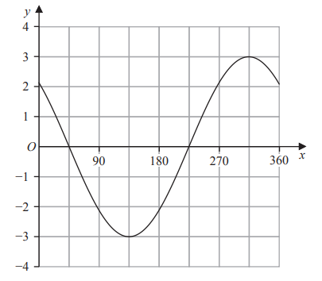

Given that  $p>0$ and $0<q<360$, find the value of $p$and the value of $q$ .
